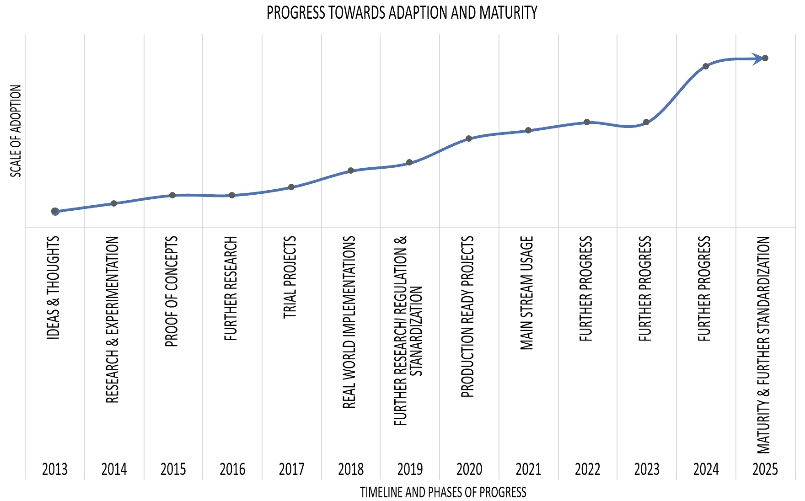
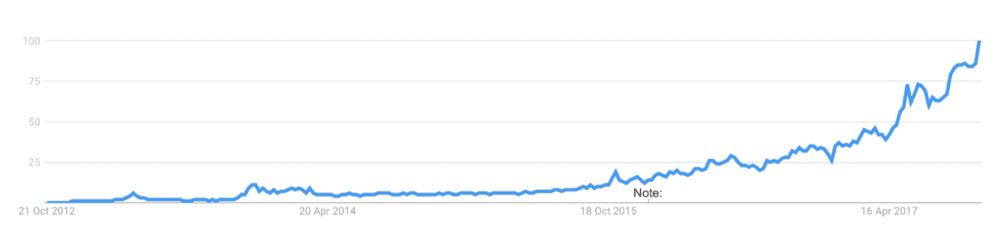
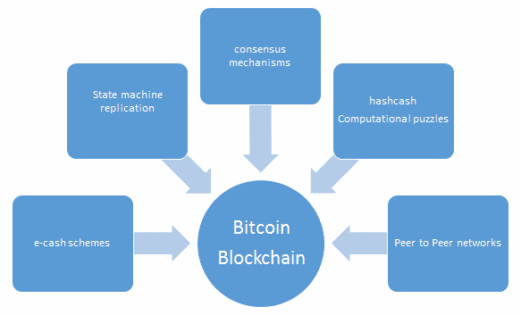
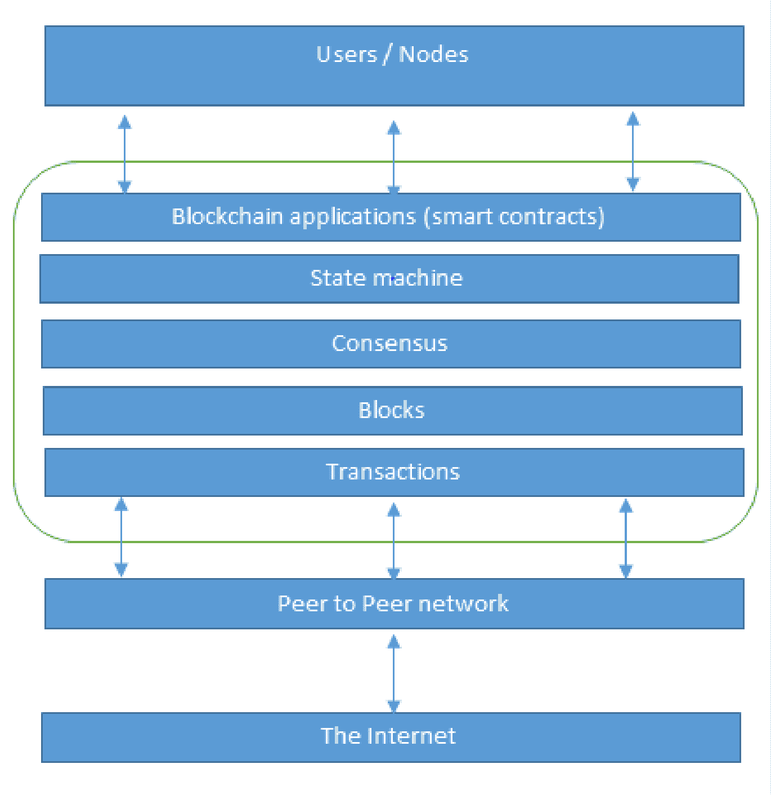
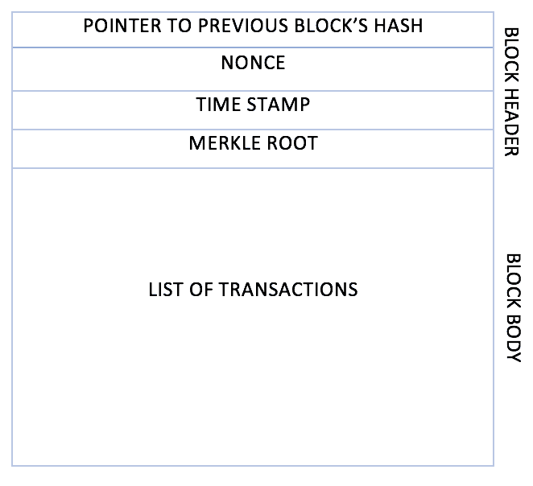
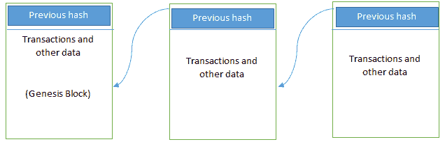

#  第一章：区块链 101

 如果您正在阅读这本书，很可能您已经听说过区块链，并对其巨大潜力有一些基本的认识。如果没有，那么让我告诉您，这是一项承诺积极改变几乎所有行业现有范例的技术，包括但不限于 IT、金融、政府、媒体、医疗和法律。

 这一章是对区块链技术的介绍，它的技术基础，背后的理论，以及各种技术的组合，构建了今天所知的区块链。

 在本章中，我们首先描述了分布式系统的理论基础。接下来，我们通过比特币的先驱介绍了区块链技术。最后，我们向您介绍了区块链技术。这种方法是理解区块链技术的一种逻辑方式，因为区块链的根源在于分布式系统。我们将在这里迅速涵盖很多内容，但不用担心——随着您阅读本书，我们将会更详细地讲解这些材料。

#  区块链技术的发展

 随着比特币在 2008 年的发明，世界引入了一个新概念，现在可能将彻底改变整个社会。这是一种承诺对每个行业，包括但不限于金融、政府、媒体、法律和艺术产生影响的东西。一些人将区块链描述为一场革命，而另一些人认为它将更加渐进，并且需要很多年才能实现任何实际的区块链利益。这种思维在某种程度上是正确的，但在我看来，这场革命已经开始了。

 全世界许多著名的组织已经在使用区块链技术编写概念验证，因为它的破坏性潜力已经得到充分认可。然而，一些组织仍处于初步探索阶段，尽管随着技术的成熟，预计它们将更快地取得进展。区块链技术对当前技术也产生影响，并具有根本性的改变能力。

如果我们回顾过去几年，我们会注意到 2013 年开始出现了一些想法，表明区块链在加密货币以外的其他领域中的用途。那个时候，区块链的主要用途是加密货币，许多新币在那个时期出现了。下图显示了区块链技术的年度进展和适应趋势的广谱概述。 *x* 轴上显示的年份指示了特定区块链技术阶段所处的时间范围。每个阶段都有一个代表动作的名称，并且在 *x* 轴上显示，从**IDEAS & THOUGHTS**的阶段开始，最终到**MATURITY & FURTHER STANDARDIZATION**。 *y* 轴显示了区块链技术的活动水平、参与度和采用情况。图表显示，大约在**2025**年左右，预计区块链技术将变得成熟，并拥有大量用户。

区块链技术的采用和成熟

前面的图表显示，2013 年出现了与区块链技术的其他用途有关的**IDEAS & THOUGHTS**。然后在 2014 年开始了一些**RESEARCH & EXPERIMENTATION**，这导致了**PROOF OF CONCEPTS**，**FURTHER RESEARCH**以及 2015 年至 2017 年之间的全面**TRIAL PROJECTS**。到 2018 年，我们将看到**REAL WORLD IMPLEMENTATIONS**。目前已经有许多项目正在进行中，并准备用区块链技术替换现有系统，例如，**澳大利亚证券交易所**（**ASX**）即将成为首个用区块链技术替换其传统清算和结算系统的组织。

更多关于这个主题的信息可以在[`www.asx.com.au/services/chess-replacement.htm`](https://www.asx.com.au/services/chess-replacement.htm)找到。

预计在 2019 年，将会进行更多的研究，并对区块链技术的监管和标准化产生一些兴趣。之后，从 2020 年开始，将会有可供生产使用的项目和使用区块链技术的现成产品，并且预计到 2021 年，区块链技术的主流使用将开始。区块链技术的进展几乎感觉像是上世纪 90 年代末的互联网*点 COM 热潮*。预计将会继续进行更多的研究，以及对区块链技术的进一步适应和成熟，最终，在 2025 年，预计该技术将足够成熟，可以在日常基础上使用。请注意，图表中提供的时间表不是严格的，可能会有所变化，因为准确预测区块链技术何时会成熟是相当困难的。此图表基于近年来取得的进展以及当前对这项技术的研究、兴趣和热情的氛围，这表明到 2025 年，区块链技术预计将成熟。

过去几年对区块链技术的兴趣显著增加。曾一度只被认为是来自加密货币角度的极客钱，或者被认为不值得追求的东西，现在区块链正在受到全球最大公司和组织的研究。数百万美元被用来调整和尝试这项技术。最近欧盟宣布计划到 2020 年将区块链研究的资金增加至近 3.4 亿欧元。

有兴趣的读者可以在[`www.irishtimes.com/business/technology/boost-for-blockchain-research-as-eu-increases-funding-four-fold-1.3383340`](https://www.irishtimes.com/business/technology/boost-for-blockchain-research-as-eu-increases-funding-four-fold-1.3383340)上阅读更多。

另一份报告表明，到 2021 年全球对区块链技术研究的支出可能达到 92 亿美元。

更多关于这方面的信息可在[`bitcoinmagazine.com/articles/report-suggests-global-spending-blockchain-tech-could-reach-92-billion-2021/`](https://bitcoinmagazine.com/articles/report-suggests-global-spending-blockchain-tech-could-reach-92-billion-2021/)上找到。

存在着各种财团，例如**企业以太坊联盟**（**EEA**）、**Hyperledger**和**R3**，这些财团旨在研究和发展区块链技术。此外，许多初创企业已经提供基于区块链的解决方案。在谷歌上进行的简单趋势搜索显示出过去几年对区块链技术的兴趣程度之高。特别是自 2017 年初以来，*区块链*的搜索量增加相当显著，如下图所示：

区块链的谷歌趋势图

想象中这项技术的各种好处，例如去中心化的信任、成本节约、透明度和效率。然而，也存在多个挑战，这些是目前区块链活跃研究领域，比如可扩展性和隐私。

在这本书中，我们将看到区块链技术如何帮助实现前述的好处。你将学习到什么是区块链技术，以及它如何通过带来诸如效率、节省成本、透明度和安全性等多种好处来重塑企业、多个行业，甚至日常生活。我们还将探索分布式账本技术、去中心化和智能合约，以及如何利用主流区块链平台如以太坊和 Hyperledger 开发和实施技术解决方案。我们还将调查在区块链可以成为主流技术之前需要解决的挑战。

第十六章，*可扩展性与其他挑战*，致力于讨论区块链技术的限制和挑战。

# 分布式系统

理解分布式系统对于理解区块链技术至关重要，因为区块链在其核心是一个分布式系统。它是一个可以集中或去中心化的分布式分类账。区块链最初是为去中心化平台而设计和通常被使用。它可以被看作是具有去中心化和分布式范式属性的系统。它是一个去中心化分布式系统。

**分布式系统**是一种计算范式，其中两个或更多节点以协调的方式共同实现一个共同的结果。它被建模为用户看到它是一个单一的逻辑平台。例如，谷歌的搜索引擎是基于一个大型分布式系统，但对于用户来说，它看起来像一个单一的、连贯的平台。

一个**节点**可以被定义为分布式系统中的个体玩家。所有节点都能够彼此发送和接收消息。节点可以是诚实的、有故障的或恶意的，并且它们具有内存和处理器。表现出非理性行为的节点也被称为**拜占庭节点**，源自于拜占庭将军问题。

拜占庭将军问题

在 1982 年，Lamport 等人在他们的研究论文*拜占庭将军问题*中提出了一个思想实验，可在[`www.microsoft.com/en-us/research/publication/byzantine-generals-problem/`](https://www.microsoft.com/en-us/research/publication/byzantine-generals-problem/)找到，其中一群率领拜占庭军队不同部分的将军计划攻击或撤退到一个城市。他们之间唯一的通信方式是通过信使。他们需要同意在同一时间发动攻击才能获胜。问题在于一个或多个将军可能是叛徒，可能发送误导性的消息。因此，需要一种可行的机制，允许将军之间达成一致，即使存在叛徒，也能够同时发动攻击。类比到分布式系统，将军可以被视为节点，叛徒为拜占庭（恶意）节点，信使可以被视为将军之间的通信渠道。

这个问题在 1999 年被卡斯特罗和利斯科夫解决，他们提出了**实用拜占庭容错**（**PBFT**）算法，通过接收包含相同签名内容的一定数量的消息来达成共识。

拜占庭节点这种不一致行为可能是故意恶意的，这对网络的运行是有害的。网络上任何节点的意外行为，无论是否恶意，都可以归类为拜占庭。

下图展示了一个小规模的分布式系统示例。这个分布式系统有六个节点，其中一个（**N4**）是拜占庭节点，可能导致数据不一致。**L2** 是一个断开或者慢速的链接，这可能导致网络分区。

分布式系统的设计: N4 是一个拜占庭节点，L2 是断开或者慢速的网络链接

分布式系统设计的主要挑战是节点之间的协调和容错。即使一些节点发生故障或网络链接中断，分布式系统也应该能够容忍这一点，并继续工作以实现期望的结果。多年来，这个问题一直是分布式系统设计研究的一个活跃领域，已经提出了几种算法和机制来解决这些问题。

分布式系统设计是如此具有挑战性，以至于已经证明了一种被称为 **CAP 定理** 的假设，该定理指出，分布式系统不能同时具有所有三个非常期望的属性；即一致性、可用性和分区容忍性。我们将在本章的后面更详细地探讨 CAP 定理。

# 区块链和比特币的历史

区块链是在 2008 年比特币的发明中引入的。然后在 2009 年进行了实际的实现。对于本章而言，简要回顾比特币就足够了，因为它将在 第八章 *引入比特币* 中详细探讨。然而，引用比特币是必要的，因为没有它，区块链的历史就不完整。

# 电子现金

电子现金或数字货币的概念并不新鲜。自 20 世纪 80 年代以来，基于 David Chaum 提出的模型的 e-现金协议一直存在。

理解分布式系统的概念对于理解区块链技术是必要的，同样，理解电子现金的概念也是必要的，以便欣赏区块链的第一个和惊人成功的应用，比特币，或者更广泛地说，一般的加密货币。

需要解决两个基本的电子现金系统问题：问责制和匿名性。

**问责制** 是为了确保现金只能被消费一次（双重支付问题），并且只能由其合法所有者支出。双重支付问题是指相同的资金可以被花费两次。由于数字数据很容易复制，这在数字货币中成为一个很大的问题，因为你可以复制同样的数字现金。**匿名性** 是为了保护用户的隐私。与实物现金一样，几乎不可能追溯到实际支付货币的个人。

大卫·朝的工作在 1980 年代解决了这两个问题，他使用了两种密码操作，即**盲签名**和**秘密共享**。这些术语和相关概念将在第五章《对称加密》和第六章《公钥加密》中进行详细讨论。目前，可以说*盲签名*允许在不实际看到文件的情况下对其进行签名，而*秘密共享*是一个概念，可以检测到双重支付，即使用相同的电子现金代币两次（双重支付）。

2009 年，第一个名为比特币的电子现金（e-cash）系统的实际实现出现了。后来出现了密码货币这个术语。这是有史以来第一次在不信任网络中解决了分布式共识问题。它使用**公钥密码学**与**工作证明**（**PoW**）机制，提供了一种安全、可控和去中心化的铸造数字货币的方法。关键创新是由 PoW 机制加密保护的由交易组成的区块的有序列表的概念。这个概念将在第八章《介绍比特币》中详细解释。

在比特币中使用的其他技术，但在其发明之前已存在的技术，包括默克尔树、哈希函数和哈希链。所有这些概念都在第六章《公钥加密》中得到适当深入的解释。

查看前面提到的所有技术及其相关历史，很容易看出是如何将电子现金方案和分布式系统的概念结合起来创建比特币以及现在所称的区块链的。这个概念也可以通过以下图表进行可视化：

支持比特币和区块链发明的各种想法

# 区块链

2008 年，一篇名为《比特币：一个点对点的电子现金系统》的开创性论文由匿名人士*Satoshi Nakamoto*撰写，讨论了点对点的电子现金主题。它引入了术语**区块链**。没有人知道 Satoshi Nakamoto 的真实身份。在 2009 年引入比特币后，他一直活跃于比特币开发社区，直到 2011 年。然后，他将比特币的开发交给了其核心开发人员，并简单地消失了。自那以后，他再也没有与外界交流，他的存在和身份笼罩在神秘之中。术语*区块链*随着年代的推移逐渐演变成了*blockchain*这个词。

正如前文所述，区块链技术涵盖了多种可以在各个经济领域实施的应用。特别是在金融领域，人们认为对金融交易和结算性能的显着改进将带来期望中的时间和成本降低。可以说，几乎所有经济领域的部分已经意识到了区块链的潜力和前景，并已经或即将着手利用区块链技术的好处。

# 区块链定义

**外行人的定义**：区块链是一个不断增长的、安全的、共享的记录保存系统，其中数据的每个用户都持有记录的副本，只有在参与交易的所有方同意更新时才能更新。

**技术定义**：区块链是一个点对点的、分布式的分类账，具有加密安全、只能追加、不可变（极难更改）、只能通过对等节点的共识或协议更新等特性。

现在让我们更详细地研究前面的定义。我们将逐一查看定义中的所有关键词。

# 点对点

技术定义中的第一个关键词是*点对点*。这意味着网络中没有中央控制器，所有参与者直接相互通信。这一特性使得现金交易可以直接在对等节点之间进行交换，而无需第三方（如银行）参与。

# 分布式分类账

进一步剖析技术定义会揭示区块链是一个*分布式分类账*，这简单地意味着分类账在网络中分布在所有对等节点之间，每个对等节点都持有完整分类账的副本。

# 加密安全

接下来，我们看到这个分类账是*加密安全*的，这意味着加密学已被用来提供安全服务，使得这个分类账安全免受篡改和滥用。这些服务包括不可否认性、数据完整性和数据来源认证。您将在稍后的第五章中看到这是如何实现的，该章介绍了令人着迷的加密世界。

# 只能追加

我们遇到的另一个属性是区块链是*只能追加*的，这意味着数据只能按*时间顺序顺序*添加到区块链中。这一属性意味着一旦数据被添加到区块链中，几乎不可能更改那些数据，可以被认为是实际上不可变的。尽管如此，在某些罕见的情况下，如果针对区块链网络的串通成功获得了超过 51% 的权力，那么数据可能会被更改。一旦数据被添加到区块链中，可能会有一些合法的理由来更改数据，比如*被遗忘的权利*或*被删除的权利*（也在**通用数据保护**（**GDPR**）裁决中定义，[`gdpr-info.eu/art-17-gdpr/`](https://gdpr-info.eu/art-17-gdpr/)）。

然而，这些都是需要单独处理并需要优雅的技术解决方案的个案。在实际操作中，区块链确实是不可变的，不能更改。

# 通过共识可更新

最后，区块链最关键的属性是只能通过共识来更新。这是赋予它去中心化权力的原因。在这种情况下，没有中央权威控制更新账本。相反，对区块链所做的任何更新都会根据区块链协议定义的严格标准进行验证，并且只有在网络上的所有参与节点达成共识后才会将其添加到区块链中。为了达成共识，有各种共识促进算法，它们确保所有参与方就区块链网络上数据的最终状态达成一致意见，并坚决认为其为真实的。共识算法将在本章后面以及书中的适当位置进行讨论。

可以将区块链视为在互联网上运行的分布式对等网络的一层，如下图所示。这类似于 SMTP、HTTP 或 FTP 在 TCP/IP 上运行。

区块链的网络视图

在上图的底层，有互联网，为任何网络提供基本的通信层。在这种情况下，一个对等网络运行在互联网之上，它承载了区块链的另一层。该层包含交易、块、共识机制、状态机和区块链智能合约。所有这些组件都显示为一个单一的逻辑实体，以一个方框表示，在对等网络之上表示区块链。最后，在顶部有用户或节点连接到区块链并执行各种操作，如共识、交易验证和处理。这些概念将在本书后面详细讨论。

从商业角度来看，区块链可以定义为一个平台，对等方可以在没有中心信任的仲裁者的情况下使用交易来交换价值/电子现金。例如，在现金转账中，银行充当信任的第三方。在金融交易中，中央结算所充当两个交易方之间的仲裁者。这个概念非常引人注目，一旦你掌握了它，你就会意识到区块链技术的巨大潜力。这种去中介化使得区块链成为一个分散的共识机制，没有任何单一的管理数据库的权威。立即，你会看到这里去中心化的显著好处，因为如果不需要银行或中央结算所，那么它立即带来成本节约、更快的交易速度和信任。

**区块**仅是一组交易的选择，逻辑上组织在一起。**交易**是事件的记录，例如，从发送者帐户向受益人帐户转账的事件。一个区块由交易组成，其大小取决于所使用的区块链的类型和设计。

区块还包括对前一个区块的引用，除非它是创世区块。**创世区块（Genesis block）**是区块链中的第一个区块，在区块链首次启动时被硬编码。区块的结构也取决于区块链的类型和设计。然而，一般来说，只有少数属性对区块的功能至关重要：块头，由指向前一个块的指针、时间戳、一次性数字、默克尔根和包含交易的块体组成。区块中还有其他属性，但一般来说，前述组件始终在一个区块中可用。

**一次性数字（Nonce）**是仅生成并使用一次的数字。一次性数字广泛用于许多密码操作，以提供重放保护、身份验证和加密。在区块链中，它被用于 PoW 共识算法和交易重放保护中。

**默克尔根（Merkle root）**是默克尔树的所有节点的哈希值。默克尔树被广泛用于安全有效地验证大型数据结构。在区块链世界中，默克尔树通常用于允许有效验证交易。在区块链中，默克尔根位于区块的块头部分，是区块中所有交易的哈希值。这意味着仅需要验证默克尔根就足以验证默克尔树中的所有交易，而不是逐个验证所有交易。我们将在第六章，*公钥加密*中进一步阐述这些概念。

区块的通用结构。

上述结构是描述区块的简单块图。与其区块链技术相关的特定区块结构将在本书后面以更深入的技术细节进行讨论。

# 区块链的通用元素

现在，让我们逐步了解区块链的通用元素。如果您需要关于区块链不同部分的提醒，您可以将其用作便利的参考部分。更精确的元素将在后面的章节中，例如以太坊区块链的上下文中讨论。通用区块链的结构可以通过以下图示进行可视化：

区块链的通用结构

这里逐一描述了通用区块链的元素。这些是您在与区块链相关时会遇到的元素：

+   **地址**：地址是区块链交易中用于表示发送方和接收方的唯一标识符。一个地址通常是一个公钥或者由公钥派生而来。虽然同一个用户可以重复使用地址，但地址本身是唯一的。然而，在实践中，一个用户可能不会再次使用相同的地址，并为每笔交易生成一个新的地址。这个新创建的地址将是唯一的。实际上，比特币是一个伪匿名系统。最终用户通常无法直接识别，但一些去匿名化比特币用户的研究表明，他们可以成功地被识别。一个良好的实践是，用户为每个交易生成一个新地址，以避免将交易链接到共同的所有者，从而防止识别。

+   **交易**：交易是区块链的基本单位。交易代表了从一个地址向另一个地址的价值转移。

+   **区块**：一个区块由多个交易和其他元素组成，例如前一个区块哈希（哈希指针）、时间戳和随机数。

+   **点对点网络**：顾名思义，点对点网络是一种网络拓扑结构，其中所有节点都可以相互通信并发送和接收消息。

+   **脚本或编程语言**：脚本或程序在交易中执行各种操作，以便实现各种功能。例如，在比特币中，交易脚本是用一种称为**脚本**的语言预定义的，其中包含一组命令，允许节点将代币从一个地址转移到另一个地址。然而，脚本是一种有限的语言，它只允许执行交易所必需的基本操作，但不允许任意程序开发。可以将其视为仅支持标准预编程算术操作的计算器。因此，比特币脚本语言不能被称为*Turing 完备*。简单来说，Turing 完备语言意味着它可以执行任何计算。它是以发明了可以运行任何算法的图灵机的阿兰·图灵命名的。图灵完备语言需要循环和分支能力来执行复杂的计算。因此，比特币的脚本语言不是图灵完备的，而以太坊的 Solidity 语言是。

为了在区块链上方便开发任意程序，需要图灵完备的编程语言，这现在已经成为区块链非常理想的特性。可以把它想象成一台允许使用编程语言开发任何程序的计算机。然而，这些语言的安全性是一个关键问题，也是一个重要且持续的研究领域。我们将在本书的以后章节中（第八章，“介绍比特币”，第四章，“智能合约”，第十一章，“开发工具和框架”）更详细地讨论这个问题。

+   **虚拟机**：这是对前面介绍的交易脚本的延伸。*虚拟机*允许在区块链上运行图灵完备的代码（作为智能合约）；而交易脚本在操作上是有限制的。然而，并非所有区块链都支持虚拟机。各种区块链使用虚拟机来运行诸如**以太坊虚拟机**（**EVM**）和**链虚拟机**（**CVM**）等程序。EVM 用于以太坊区块链，而 CVM 是为一种名为**Chain Core**的企业级区块链开发并使用的虚拟机。

+   **状态机**：区块链可以被视为状态转换机制，节点通过交易执行、验证和最终化过程使状态从初始形式修改为下一个形式，最终到达最终形式。

+   **节点**：区块链网络中的节点根据其扮演的角色执行各种功能。节点可以提出和验证交易，并进行挖矿以促进共识和保护区块链的安全。这一目标是通过遵循**共识协议**（最常见的是 PoW）实现的。节点还可以执行其他功能，如简单支付验证（轻节点）、验证，以及根据使用的区块链类型和节点分配的角色而进行的许多其他功能。节点还执行交易签名功能。交易首先由节点创建，然后还由节点使用私钥进行数字签名，作为它们拥有希望在区块链网络上向他人转移的资产的合法持有者的证明。这种资产通常是代币或虚拟货币，如比特币，但也可以是通过使用代币在区块链上代表的任何现实世界资产。

+   **智能合约**：这些程序在区块链之上运行，并封装了在满足某些条件时执行的业务逻辑。这些程序是可强制执行和自动可执行的。智能合约功能并非所有区块链平台都具备，但由于其提供给区块链应用的灵活性和强大性，目前已成为非常理想的功能。智能合约有许多用例，包括但不限于身份管理，资本市场，贸易金融，记录管理，保险和电子治理。智能合约将在第四章中进行更详细的讨论，*智能合约*。

# 区块链的工作原理

我们现在已经定义和描述了区块链。现在让我们看看区块链是如何实际运作的。节点既可以是*矿工*，创建新区块并铸造加密货币（硬币），也可以是*区块签名者*，验证并用数字签名交易。每个区块链网络都必须做出的一个关键决定是确定哪个节点将在区块链上追加下一个区块。这个决定是通过*共识机制*来做出的。共识机制将在本章后面进行描述。

现在我们将看一下区块链是如何验证交易并创建和追加区块来增长区块链的。

# 区块链是如何累积区块的

现在我们将看一下一个创建区块的一般方案。这里呈现这个方案是为了让你对区块是如何生成的以及交易和区块之间的关系有一个大致的了解：

1.  一个节点通过首先创建然后用私钥进行数字签名来启动交易。交易可以代表区块链中的各种行为。最常见的情况是，这是一个代表用户之间价值转移的数据结构。交易数据结构通常包括价值转移的某些逻辑，相关规则，来源和目的地地址以及其他验证信息。这将在本书后面关于比特币和以太坊的特定章节中进行更详细的介绍。

1.  通过使用一种名为 Gossip 协议的洪泛协议来传播（洪泛）交易到根据预设标准验证交易的对等节点。通常，需要超过一个节点来验证交易。

1.  一旦交易得到验证，它将被包含在一个区块中，然后传播到网络上。在这一点上，交易被视为已确认。

1.  新创建的区块现在成为账本的一部分，并且下一个区块以加密方式连接到这个区块。这个连接是一个哈希指针。在这个阶段，交易得到了第二次确认，而区块得到了第一次确认。

1.  每次创建新区块时，交易都会被重新确认。通常，比特币网络要求六次确认才能视为交易最终确认。

值得注意的是，步骤 4 和 5 被认为是非强制性的，因为交易本身在步骤 3 中已经最终确定；但是，如果需要，步骤 4 和步骤 5 会进行区块确认和进一步的交易重新确认。

这完成了区块链的基本介绍。在下一节中，您将了解到这项技术的好处和局限性。

# 区块链的好处和局限性

区块链技术的许多优点已经在许多行业中讨论，并由全球参与区块链领域的思想领袖提出。区块链技术的显着优点如下：

+   **去中心化**：这是区块链的核心概念和优势。无需信任的第三方或中介来验证交易；相反，使用共识机制来就交易的有效性达成一致。

+   **透明度和信任**：由于区块链是共享的，每个人都可以看到区块链上的内容，这使得系统具有透明性。因此，建立了信任。这在资金或福利发放等场景中更为相关，在这些场景中，与选择受益人相关的个人自由裁量权需要受到限制。

+   **不可变性**：一旦数据被写入区块链，就极其难以将其改变回来。虽然数据并非真正不可变，但由于更改数据非常具有挑战性且几乎不可能，因此将其视为保持不可变交易分类账的好处。

+   **高可用性**：由于系统基于对等网络中的数千个节点，并且数据在每个节点上被复制和更新，因此系统变得高度可用。即使一些节点离开网络或变得无法访问，整个网络仍然可以继续工作，从而使其高度可用。这种冗余导致了高可用性。

+   **高度安全**：区块链上的所有交易都经过加密保护，因此提供了网络完整性。

+   **简化当前的范式**：在许多行业中，如金融或健康领域，当前的区块链模型有些杂乱无章。在这种模型中，多个实体维护着自己的数据库，由于系统的不一致性，数据共享可能变得非常困难。然而，由于区块链可以作为许多利益相关方之间的单一共享分类账，这可能会通过减少每个实体维护的独立系统的复杂性来简化模型。

+   **交易更快**：在金融行业，特别是在后期交易结算功能中，区块链可以通过使交易快速结算起到至关重要的作用。区块链不需要冗长的验证、调和和清算过程，因为共识机制已经在金融组织之间的共享分类账上提供了一致的数据版本。

+   **节省成本**：在区块链模型中不需要信任的第三方或结算所，这可以大幅减少作为费用支付给这些方的开销。

与任何技术一样，为了使系统更加稳健、有用和易于访问，都需要解决一些挑战。区块链技术也不例外。事实上，学术界和工业界都在努力克服区块链技术带来的挑战。最敏感的区块链问题如下：

+   可扩展性

+   适应性

+   规管

+   技术相对不成熟

+   隐私

所有这些问题和可能的解决方案将在第十六章中详细讨论，*可扩展性和其他挑战*。

# 区块链技术的层次

在本节中，介绍了区块链技术的各个层面。人们认为，由于区块链技术的迅速发展和进步，许多应用程序将得到发展。一些这样的进步已经实现，而另一些则根据当前区块链技术发展速度的预期在不久的将来会实现。

这里讨论的三个层次最初是在*Melanie Swan*的书籍*Blockchain: Blueprint for a New Economy*中描述的，*O'Reilly Media*，*2015 年*，作为每个类别中应用程序的区块链层次。这就是区块链的演变方式，这种版本化展示了区块链技术的不同演化和使用层次。事实上，所有区块链平台，除了少数例外，都支持这些功能和应用。这种版本化只是根据当前的使用方式、演变方式或预计的演变方式，对各种区块链类别进行的逻辑分割。

还要注意，这种版本化是为了完整性和历史原因而在这里呈现，因为这些定义现在已经有些模糊了，除了比特币（区块链 1.0）之外，所有支持智能合约开发的新一代区块链平台都可以编程提供所有区块链层次中提到的功能和应用程序：1.0、2.0、3.0 以及更高版本。

除了第一层，第二层和第三层，或者未来的第 X 层，以下代表了我对区块链技术最终可能会成为的愿景，随着这一技术的发展：

+   **区块链 1.0**：这个层次是随着比特币的发明而引入的，主要用于加密货币。此外，由于比特币是加密货币的首次实施，因此将区块链技术的第一代分类为仅包括加密货币是合理的。所有替代加密货币以及比特币都属于这一类。它包括核心应用，如支付和应用程序。这一代始于 2009 年比特币发布，结束于 2010 年初。

+   **区块链 2.0**：这第二代区块链被金融服务和智能合约所使用。该层次包括各种金融资产，如衍生品、期权、互换和债券。在这一层次上，涵盖了超越货币、金融和市场的各种应用。以太坊、超级账本和其他新一代区块链平台被视为区块链 2.0 的一部分。这一代的开始是在 2010 年开始出现有关将区块链用于其他目的的想法时。

+   **区块链 3.0**：这第三代区块链用于实现超出金融服务行业的应用，并在政府、健康、媒体、艺术和司法领域中使用。与区块链 2.0 一样，以太坊、超级账本和具有编写智能合约能力的新一代区块链被视为此区块链技术层次的一部分。这一代区块链大约在 2012 年出现，当时研究了区块链技术在不同行业的多个应用。

+   **区块链 X.0**：这一代代表了区块链奇点的愿景，有一天将会有一个公共区块链服务可用，任何人都可以像使用谷歌搜索引擎一样使用它。它将为社会的所有领域提供服务。它将是一个公共开放的分布式分类账，其上运行着通用目的的理性代理人（*Machina economicus*），代表人们做出决策，并与其他智能自治代理人进行交互，并由代码而不是法律或书面合同进行监管。这并不意味着法律和合同将消失，而是法律和合同将能够在代码中实施。

Machina Economicus 是来自**人工智能**（**AI**）和计算经济学领域的概念。它可以被定义为一个做出逻辑和完美决策的机器。在实现这一梦想之前，有各种技术挑战需要解决。

对 Machina Economicus 的讨论超出了本书的范围，有兴趣的读者可以参考[`www.infosys.com/insights/purposeful-ai/Documents/machina-economicus.pdf`](https://www.infosys.com/insights/purposeful-ai/Documents/machina-economicus.pdf)获取更多信息。

在区块链和人工智能相结合的背景下，这个概念将在第十八章《当前情况及展望》中详细阐述。

# 区块链的特征

区块链执行各种功能，这些功能受到各种特性的支持。这些功能包括但不限于价值转移、资产管理和协议管理。前一节描述的所有区块链层都借助区块链提供的特性执行这些功能，但也存在一些例外情况。例如，像比特币这样的区块链平台不支持智能合约。另一个例子是，并非所有的区块链平台都会产生加密货币或代币，比如超级账本和多链。

区块链的特性在这里描述：

+   **分布式共识**：分布式共识是区块链的主要支柱。该机制使得区块链能够呈现出一致的真实版本，而无需中央权威的要求，这被所有参与方所认可。

+   **交易验证**：从区块链节点发布的任何交易都基于预定的一组规则进行验证。只有有效的交易才会被选中包含在一个块中。

+   **智能合约平台**：区块链是一个可以运行程序的平台，以执行用户的业务逻辑。并非所有区块链都有执行*智能合约*的机制；然而，这是一个非常理想的特性，在像以太坊和多链这样的新型区块链平台上是可用的。

智能合约

区块链技术提供了运行智能合约的平台。这些是自动化的、自治的程序，驻留在区块链网络上，并封装了执行所需功能所需的业务逻辑和代码。例如，想象一下一个保险合约，在其中如果航班取消，则向旅客支付索赔。在现实世界中，这个过程通常需要很长时间来提出索赔、验证索赔，并向索赔人（旅客）支付保险金额。如果整个过程都是通过密码学强制信任、透明度和执行自动化的，那么一旦智能合约收到通知说所涉航班已取消，它就会自动触发向索赔人支付保险金的过程？如果航班准时，智能合约会自行支付。

这确实是区块链的一个革命性特性，因为它为现实场景提供了灵活性、速度、安全性和自动化，这可以导致一个完全值得信赖的系统，从而实现了显著的成本降低。智能合约可以被编程来执行区块链用户需要的任何操作，并根据他们的具体业务需求来执行。

+   **点对点价值转移**：区块链通过代币实现了用户之间的价值转移。代币可以被视为价值的载体。

+   **加密货币的生成**：这个功能是可选的，取决于所使用的区块链类型。区块链可以创建加密货币作为对验证交易并消耗资源以保障区块链安全的矿工的激励。我们将在第八章中详细讨论加密货币，*引入比特币*。

+   **智能资产**：现在可以以一种安全和精确的方式将数字或实物资产与区块链链接起来，使其不能被他人索取。您完全掌控您的资产，它既不能被双重花费也不能被双重拥有。以数字音乐文件为例，它可以被无限制地复制许多次而没有任何控制。尽管当前确实使用了许多**数字版权管理**（**DRM**）方案以及版权法律，但它们中没有一个能像基于区块链的 DRM 那样可强制执行。区块链可以以一种完全可强制执行的方式提供 DRM 功能。有些曾经名声在外的 DRM 方案在理论上看起来很棒，但由于某种限制而被黑客攻破。一个例子是 Oculus 的黑客攻击（[`www.wired.co.uk/article/oculus-rift-drm-hacked`](http://www.wired.co.uk/article/oculus-rift-drm-hacked)）。

另一个例子是 PS3 的黑客攻击，还有受版权保护的数字音乐、电影和电子书籍通常在互联网上无限制地共享。多年来我们一直有版权保护，但数字盗版却否定了所有完全强制执行法律的尝试，然而，如果您拥有一个资产，除非您决定转让，否则没有人能够索取它。这个功能具有深远的影响，特别是在 DRM 和电子现金系统中，双重花费检测是一个关键要求。在比特币中，双重花费问题首次在没有可信第三方的要求下得到解决。

+   **提供安全性**：区块链基于经过验证的加密技术，确保数据的完整性和可用性。通常，由于透明度的要求，不提供机密性。这一限制是金融机构和其他需要交易隐私和机密性的行业采用它的主要障碍。因此，区块链上的交易隐私和机密性正在受到非常积极的研究，已经取得了进展。可以说，在许多情况下，并不需要保密性，而是更喜欢透明性。例如，在比特币中，保密性并不是绝对必要的；然而，在某些情况下是可取的。一个更近期的例子是 Zcash，它提供了进行匿名交易的平台。这个方案将在第十章中详细讨论，“替代货币”。区块链还提供其他安全服务，如不可否认性和认证，因为所有操作都是使用私钥和数字签名进行保护的。

+   **不可变性**：这是区块链的另一个关键特性：一旦记录添加到区块链中，它们就是不可变的。虽然有可能回滚更改，但这是要尽量避免的，因为这样做将消耗大量的计算资源。例如，在比特币中，如果恶意用户想要更改先前的区块，那么就需要再次计算已添加到区块链中的所有这些区块的 PoW。这个难度使得区块链上的记录基本上是不可变的。

+   **唯一性**：这个区块链特性确保每个交易都是唯一的，并且没有已经花费过（双重支付问题）。这个特性在加密货币中尤其重要，其中检测和避免双重支付是一个至关重要的要求。

# 区块链的类型

基于区块链在过去几年的演变方式，它可以被分为多个类别，具有独特的，有时是部分重叠的属性。*你应该*注意，本章前面描述的层次结构是一个不同的概念，其中介绍了基于其演变和使用的逻辑分类的区块链。

在本节中，我们将从技术和业务使用的角度来检查不同类型的区块链。这些区块链类型可以出现在任何区块链层次上，因为这些层次与区块链的各种类型之间没有直接关系。

在本节中，我们将检查：

+   分布式分类帐

+   分布式分类帐技术（DLT）

+   区块链

+   分类帐

# 分布式分类帐

首先，我需要澄清一个模糊之处。应该注意，*分布式账本*是一个描述共享数据库的广义术语；因此，所有区块链在技术上都属于共享数据库或分布式账本的范畴。虽然所有区块链从根本上都是分布式账本，但并非所有分布式账本都一定是区块链。

分布式账本和区块链之间的一个关键区别在于，分布式账本不一定由交易块组成以保持账本增长。相反，区块链是一种特殊类型的共享数据库，由交易块组成。一个不使用交易块的分布式账本的例子是 R3 的 Corda。Corda 是一个分布式账本，开发用于记录和管理协议，特别专注于金融服务行业。另一方面，像比特币和以太坊这样更广为人知的区块链利用区块来更新共享数据库。

顾名思义，分布式账本分布在参与者之间，并分布在多个站点或组织之间。这种类型的账本可以是私有的或公开的。这里的基本思想是，与许多其他区块链不同，记录是连续存储的，而不是被分成区块。这个概念用在 Ripple 中，它是一个基于区块链和加密货币的全球支付网络。

# 分布式账本技术

应该注意，在过去几年里，术语分布式账本或**分布式账本技术**（**DLT**）已经成为金融行业中普遍用来描述区块链的术语。有时，区块链和 DLT 是可以互换使用的。虽然这并不完全准确，但这是该术语近期如何发展的，特别是在金融领域。事实上，DLT 现在是金融领域一个非常活跃和繁荣的研究领域。从金融行业的角度来看，DLT 是被共享和用于已知参与者之间的权限区块链。DLT 通常充当共享数据库，所有参与者都是已知并经过验证的。它们没有加密货币，也不需要挖矿来保护账本。

# 公共区块链

顾名思义，公共区块链不归任何人所有。它们对公众开放，任何人都可以作为节点参与决策过程。用户可能会或可能不会因参与而受到奖励。所有这些 *无许可* 或 *未经许可* 账本的用户都在本地节点上维护一个账本副本，并使用分布式共识机制来决定账本的最终状态。比特币和以太坊都被认为是公共区块链。

# 私有区块链

顾名思义，私人区块链就是私人的。也就是说，它只对一个共同体或一群决定相互分享账本的个人或组织开放。现在有各种此类类别的区块链，如 HydraChain 和 Quorum。如果需要，这两个区块链也可以在公共模式下运行，但它们的主要目的是提供私人区块链。

# 半私人区块链

在*半私人区块链*中，部分区块链是私有的，部分是公开的。需要注意的是，这只是一个概念，今天还没有真正的世界 POCs 已经被开发。在半私人区块链中，私有部分由一群个人控制，而公共部分对任何人开放。

这种混合模型可以用于私人区块链的私有部分仍然保留在内部，并在已知参与者之间共享，而公共区块链的公共部分仍然可以被任何人使用，也可以选择允许挖矿以保护区块链的安全。通过这种方式，整个区块链可以使用 PoW 来保证安全，从而为私人和公共部分提供一致性和有效性。这种类型的区块链也可以称为*半分散*模型，其中它由一个单一实体控制，但仍允许多个用户通过遵循适当的程序加入网络。

# 侧链

更确切地说是*挂钩侧链*，这是一个概念，通过这个概念，硬币可以从一个区块链移动到另一个区块链，然后再移回。典型的用途包括创建新的*山寨币*（另类加密货币），其中硬币被烧毁作为充足股份的证明。在这种情况下，*烧毁硬币*的意思是硬币被发送到一个无法花费的地址，并且这个过程使*烧毁*的硬币无法恢复。这种机制用于启动一个新的货币或引入稀缺性，从而增加硬币的价值。

这种机制也被称为**燃烧证明**（**PoB**），被用作 PoW 和**股份证明**（**PoS**）的另一种分布式共识方法。前面提到燃烧硬币的例子适用于*单向捆绑侧链*。第二种类型被称为**双向捆绑侧链**，它允许硬币从主链移动到侧链，然后在需要时再次移回到主链。

这个过程使得可以为比特币网络构建智能合约。Rootstock 是一个侧链的主要例子，它使用这种范例为比特币实现智能合约开发。它通过允许比特币区块链进行双向捆绑，从而实现了更高的吞吐量。

# 许可账本

*权限分类账* 是一个区块链，其中网络参与者已知且值得信赖。权限分类账不需要使用分布式共识机制；而是使用协议达成一致，以维护关于区块链记录状态的共享版本的真实性。在这种情况下，对链上交易的验证，所有验证者已经由中央权威预先选择，通常不需要挖矿机制。

根据定义，权限区块链也没有私有的要求，因为它可以是公共区块链，但具有受监管的访问控制。例如，如果在比特币之上引入一个验证用户身份然后允许访问区块链的访问控制层，比特币可以成为权限分类账。

# 共享分类账

这是一个通用术语，用于描述任何由公众或联合体共享的应用程序或数据库。通常，所有区块链都属于共享分类账的范畴。

# 完全私有和专有区块链

这些类型的区块链没有主流应用，因为它们偏离了区块链技术中去中心化的核心概念。尽管如此，在组织内的特定私人环境中，可能需要共享数据并对数据的真实性提供一定程度的保证。

这种类型的区块链的一个例子可能是允许各个政府部门之间合作和共享数据。在这种情况下，除了简单的状态机复制和已知的中央验证者的协议外，不需要复杂的共识机制。即使在私有区块链中，实际上也不需要代币，但它们可以用作价值转移的手段或代表某些真实资产。

# 代币化区块链

这些区块链是通过挖矿或初始分配的共识过程生成加密货币的标准区块链。比特币和以太坊是这种类型区块链的主要例子。

# 无代币区块链

这些区块链设计成不具备价值转移的基本单位。然而，在不需要在节点之间转移价值，只需要在各种受信任方之间共享数据的情况下，它们仍然是有价值的。这与完全私有区块链类似，唯一的区别在于不需要使用代币。这也可以被看作是用于存储数据的共享分布式分类账。当涉及到不可变性、安全性和共识驱动的更新时，它确实具有其优点，但不用于价值转移或加密货币的常见区块链应用。

这结束了我们对各种类型的区块链的考察，我们现在将在下一节讨论普查的概念。

# 共识

共识是区块链的支柱，因此它通过一个名为**挖矿**的可选过程提供了控制的分散化。共识算法的选择也受到正在使用的区块链类型的控制；也就是说，并不是所有的共识机制都适用于所有类型的区块链。例如，在公共无许可区块链中，使用 PoW 而不是基于权威证明的简单协议机制可能是有意义的。因此，为特定的区块链项目选择合适的共识算法是至关重要的。

**共识**是在数据的最终状态上对不信任的节点之间达成一致的过程。为了达成共识，使用了不同的算法。在达成两个节点之间的协议（例如在客户端-服务器系统中）是容易的，但是当多个节点参与分布式系统并且它们需要就一个值达成一致时，达成共识就变得非常具有挑战性了。尽管某些节点失败，但在多个节点之间达成对单个值的共同状态或价值的过程被称为**分布式共识**。

# 共识机制

**共识机制**是区块链中由大多数或所有节点采取的一组步骤，以便就提出的状态或值达成一致。这个概念已经被工业界和学术界的计算机科学家研究了三十多年。随着区块链和比特币的出现，共识机制最近受到了关注，并且得到了相当大的流行。

有各种各样的要求必须得到满足，以提供共识机制中所需的结果。以下描述了这些要求：

+   **协议**：所有诚实节点决定相同的值

+   **终止**：所有诚实节点终止共识过程的执行，并最终达成决定

+   **有效性**：所有诚实节点达成的值必须与至少一个诚实节点提出的初始值相同

+   **容错**：共识算法应能够在有故障或恶意节点（拜占庭节点）的情况下运行

+   **完整性**：这是一个要求，在单个共识周期中，没有节点可以做出超过一次决定

# 共识机制的类型

所有的共识机制都是为了处理分布式系统中的故障，并允许分布式系统达成最终的一致状态。共识机制有两种一般类型。这些类型涉及所有类型的故障（故障停止类型或任意类型）。这些常见类型的共识机制如下：

+   **传统的拜占庭容错（BFT）基础**：没有像比特币 PoW 中的部分哈希反转这样的计算密集型操作，这种方法依赖于一个简单的节点方案，即发布者签名的消息。最终，当接收到一定数量的消息时，就达成了一致。

+   **基于领导者选举的共识机制**：这种安排要求节点竞争领导者选举彩票，获胜的节点提出最终值。例如，比特币中使用的 PoW 就属于这一类别。

许多实际的共识协议实现方案已被提出。Paxos 是其中最著名的协议。它由 Leslie Lamport 在 1989 年提出。使用 Paxos，节点被分配为提议者、接受者和学习者等各种角色。节点或进程被称为副本，并且在存在故障节点的情况下，通过大多数节点的协议达成一致。

Paxos 的一种替代方案是 RAFT，它通过将节点分配为三种状态之一来工作；即，追随者、候选者或领导者。在候选节点获得足够的选票后，会选举出一个领导者，然后所有更改都必须经过领导者。一旦在大多数追随者节点上完成复制，领导者就会批准所提议的更改。本章节的讨论不涵盖分布式系统角度上共识机制的理论细节。然而，本章后面将专门介绍共识协议的内容。具体算法将在本书后续专门讨论比特币和其他区块链的章节中进行讨论。

# 区块链中的共识

共识是一个分布式计算概念，在区块链中被用来通过区块链网络上的所有对等节点达成对真实版本的同意的一种手段。这个概念之前在本章的分布式系统部分进行了讨论。在本节中，我们将讨论区块链技术背景下的共识。这里介绍的一些概念仍然与分布式系统理论相关，但是它们是从区块链的角度进行解释的。

大致来说，以下描述了两种主要的共识机制类别：

+   基于证明、基于领导者选举彩票的，或者纳卡莫托共识，其中通过随机选举领导者（使用算法）并提议最终值。这个类别也被称为*完全去中心化*或*无许可*类型的共识机制。这种类型在比特币和以太坊区块链中以 PoW 机制的形式被广泛使用。

+   基于 BFT 的是一种更传统的方法，基于投票轮次。这类共识也被称为*联合体*或*有许可*类型的共识机制。

在有限数量的节点时，基于 BFT 的共识机制表现良好，但在扩展方面表现不佳。另一方面，基于领导者选举的抽签（PoW）类型共识机制扩展性极佳，但性能非常慢。由于在这个领域进行了大量研究，新类型的共识机制也在不断出现，比如在瑞波网络中使用的半去中心化类型。瑞波网络将在第十四章中，*替代区块链*中详细讨论。还有各种其他建议，试图找到扩展性和性能之间的正确平衡。一些值得注意的项目包括 PBFT、混合 BFT、BlockDAG、Tezos、Stellar 和 GHOST。

当今可用的共识算法，或者正在区块链背景下进行研究的算法，都列举在这里了。以下并非详尽列表，但包括了所有值得注意的算法。

+   **工作证明（PoW）**：这种共识机制依赖于证明在网络接受之前已经花费了足够的计算资源的证据。这种方案被用在比特币、莱特币和其他加密货币的区块链中。目前，这是唯一被证明在区块链网络上能惊人地成功对抗任何勾结攻击，比如西贝尔攻击的算法。西贝尔攻击将在第八章中讨论，*介绍比特币*。

+   **股权证明（PoS）**：该算法基于一个思想，即一个节点或用户在系统中拥有足够的权益；也就是说，用户已经在系统中投入足够的资源，以至于该用户的任何恶意尝试都能抵消对网络进行此类攻击的好处。这个想法最初是由 Peercoin 提出的，并将会在以*Serenity*为名的以太坊区块链版本中使用。PoS 中另一个重要的概念是**币龄**，这是一个根据未被花费的时间和硬币数量得出的标准。在这个模型中，提出和签署下一个区块的机会随着币龄的增长而增加。

+   **委托权益证明（DPoS）**：这是对标准 PoS 的创新，其中每个在系统中有权益的节点可以通过投票将交易验证的权力委托给其他节点。这是在 BitShares 区块链中使用的。

+   **时间间隔证明（PoET）**：由英特尔在 2016 年推出，PoET 利用**可信执行环境**（TEE）通过一次有保证的等待时间来为领导者选举过程提供随机性和安全性。它需要英特尔**软件保护扩展**（SGX）处理器为其提供安全保证。这个概念在第十三章中，*Hyperledger*，在英特尔的*Sawtooth Lake*区块链项目的背景下有更详细的讨论。

+   **存款证明（PoD）**：在这种情况下，希望参与网络的节点必须在他们可以挖矿和提出区块之前先做出一笔安全保证金。这个机制被用于 Tendermint 区块链。

+   **重要性证明（PoI）**：这个想法与 PoS 不同而且重要。PoI 不仅依赖于用户在系统中所拥有的股份大小，还监控用户对令牌的使用和转移，以建立一定的信任和重要性水平。它被用于 NEM 币的区块链。有关该币的更多信息，请访问 NEM 的网站 [`nem.io`](https://nem.io)。

+   **联邦共识或联邦拜占庭共识**：这种机制被用于恒星共识协议。在该协议中，节点保留一组公信力强的对等节点，并仅传播由大多数受信任节点验证的交易。

+   **基于声誉的机制**：顾名思义，领导者是根据其在网络上建立的声誉而选出的。它基于其他成员的投票。

+   **PBFT**：该机制实现了状态机复制，提供了对拜占庭节点的容错。除了 PBFT、PAXOS、RAFT 和**联邦拜占庭协议**（**FBA**）之外，还有许多其他协议正在被使用或已被提议用于分布式系统和区块链的许多不同实现中。

+   **活动证明**（**PoA**）：这种方案是 PoS 和 PoW 的组合，确保股权持有者以伪随机但均匀的方式被选中。与 PoW 相比，这是一种更节能的机制。它利用了一个称为*跟随 Satoshi*的新概念。在这个方案中，PoW 和 PoS 被结合在一起以实现共识和较高水平的安全性。这种方案更加节能，因为 PoW 仅在机制的第一阶段中使用，第一阶段后它切换到 PoS，后者消耗能量极小。

+   **容量证明（PoC）**：该方案利用硬盘空间作为挖掘区块的资源。这与使用 CPU 资源的 PoW 不同。在 PoC 中，利用硬盘空间进行挖掘，因此也被称为*硬盘挖矿*。这个概念最早是在 Burstcoin 加密货币中引入的。

+   **存储证明（PoS）**：该方案允许外包存储容量。该方案基于一种假设，即特定数据可能由一个节点存储，*该节点*作为参与共识机制的手段。已经提出了该方案的几种变体，如复制证明、数据拥有权证明、空间证明和空间时间证明。

# CAP 定理与区块链

**CAP 定理**，也称为布鲁尔定理，由 Eric Brewer 于 1998 年引入为猜想。 2002 年，Seth Gilbert 和 Nancy Lynch 证明了这个定理。 该理论指出任何分布式系统无法同时具有一致性、可用性和分区容忍性：

+   **一致性**是一个属性，它确保分布式系统中的所有节点具有单一的、当前的和相同的数据副本。

+   **可用性**意味着系统中的节点都在运行，可以使用，并且在需要的时候可以接受请求并响应数据，没有任何故障。 换句话说，数据在每个节点都可用，节点在响应请求。

+   **分区容忍性**确保如果一组节点由于网络故障无法与其他节点通信，则分布式系统仍然能够正常运行。 这可能是由于网络和节点故障造成的。

已经证明，分布式系统无法同时具有一致性、可用性和分区容忍性。 这可以通过以下示例解释。 让我们想象一下，有一个具有两个节点的分布式系统。 现在让我们仅对这两个节点的最小可能的分布式系统应用这三个定理属性。

+   如果两个节点具有相同的共享状态，即具有相同的最新数据副本，则实现**一致性**。

+   **可用性**是指如果两个节点都在运行并且响应最新的数据副本，可用性就得以实现。

+   如果两个节点之间的通信不会中断（由于网络问题、拜占庭错误等），它们能够相互通信，则实现**分区容忍性**。

现在想象一种情况，即发生分区并且节点无法再相互通信。 如果没有新的更新数据进来，那么它只能在一个节点上更新。 在这种情况下，如果节点接受更新，那么只有网络中的一个节点进行了更新，因此一致性就丢失了。 现在，如果节点拒绝了更新，那将导致可用性的丧失。 在这种情况下，由于分区容忍性，可用性和一致性都无法实现。

这很奇怪，因为区块链设法实现了所有这些属性，或者说是吗？ 这将很快解释清楚。为了实现容错性，使用了复制。 这是一种实现容错性的标准和广泛使用的方法。 通过共识算法实现一致性，以确保所有节点具有相同的数据副本。 这也被称为**状态机复制**。 区块链是实现状态机复制的手段。 一般来说，节点可能经历两种类型的故障。 这两种类型都属于分布式系统可能发生的故障的更广泛类别：

+   **停止错误**：这种类型的错误发生在节点仅仅崩溃时。停止错误是两种故障类型中较容易处理的一种。Paxos 协议，本章早期介绍的，通常用于处理这种类型的故障。这些故障很容易处理。

+   **拜占庭错误**：第二种类型的错误是指出现恶意或任意不一致行为的故障节点。这种类型的错误很难处理，因为它可能会因误导性信息而导致混乱。这可能是由对手的攻击、软件错误或数据损坏引起的。状态机复制协议（如 PBFT）是为了解决这种第二类型的错误而开发的。

奇怪的是，似乎在区块链中违反了 CAP 定理，尤其是在其最成功的实现比特币中。然而，事实并非如此。在区块链中，一致性被牺牲以换取可用性和分区容忍性。在这种情况下，区块链上的**一致性**（**C**）不会与**分区容忍性**（**P**）和**可用性**（**A**）同时实现，但它会随着时间的推移逐渐实现。这被称为最终一致性，其中一致性是通过多个节点随时间的验证而实现的。比特币中引入了挖矿的概念来实现这一目的。**挖矿**是通过使用 PoW 共识算法来促进共识达成的过程。在更高的层面上，挖矿可以被定义为一种用于向区块链添加更多区块的过程。稍后在第八章，*介绍比特币*中会详细讨论此问题。

# 摘要

在本章中，我们以高级水平介绍了区块链技术。首先，我们讨论了一些分布式系统的基本概念，然后回顾了区块链的历史。我们还讨论了诸如电子现金之类的概念。

此外，我们从不同的角度介绍了区块链的各种定义。我们还向您介绍了区块链技术的一些应用。接下来，我们探讨了不同类型的区块链。最后，我们研究了这项新技术的优缺点。像区块链可伸缩性和适应性等问题只是简要介绍，因为这些将在后续章节中深入讨论。

在下一章中，我们将向您介绍去中心化的概念，这是区块链及其广泛应用背后理念的核心。
