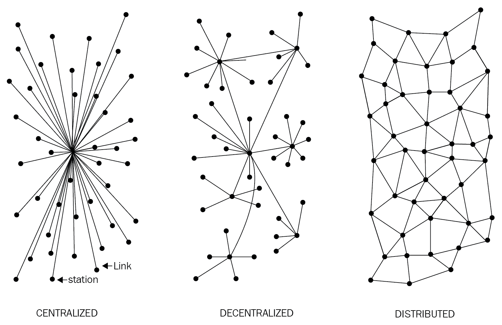
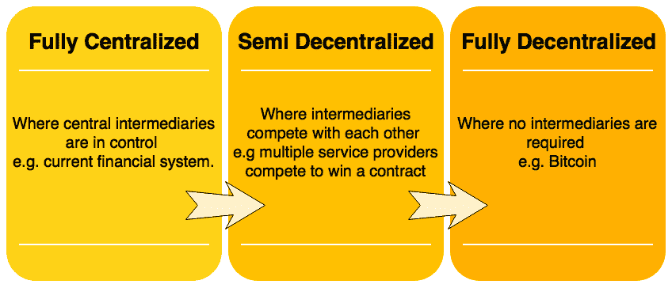
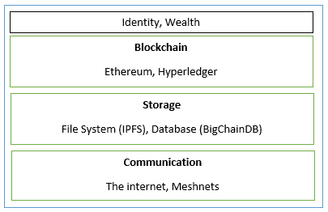

# 分散化

分散化并不是一个新概念。在战略、管理和政府，它已经被使用了很长时间。分散化的基本理念是将控制权和权威分配到组织的边缘，而不是一个中央机构完全控制组织。这种配置可以为组织带来多项益处，比如提高效率、加速决策、更好的激励和减轻高层管理的负担。

在本章中，我们将讨论区块链背景下的分散化概念。区块链的根本基础是没有单一中央机构在控制，本章中，我们将介绍各种分散化方法和实现此目标的途径的例子。此外，我们将详细讨论区块链生态系统的分散化、分散化应用以及实现分散化的平台。此外，我们还将向您介绍许多出自分散化区块链技术的令人振奋的应用和想法。

# 使用区块链进行分散化

分散化是区块链技术提供的核心益处和服务。按设计，区块链是一个提供无需任何中介和可以通过共识机制选择许多不同领袖来运作的平台。这种模式允许任何人竞争成为决策机构。这种竞争受共识机制管理，最常用的方法被称为**工作证明**（**PoW**）。

分散化在不同程度上应用各种模型，从半分散化模型到完全分散化模型，这取决于要求和情况。分散化可以从区块链的角度看作是一种重新设计现有应用和范式的机制，或者构建新的应用，以便完全控制用户。

**信息与通信技术**（**ICT**）传统上基于中心化范式，其中数据库或应用服务器受中央管理机构的控制，比如系统管理员。随着比特币和区块链技术的出现，这种模型已经改变，现在存在这种技术，允许任何人开始一个分散化系统，并在没有单一故障点或单一受信任机构的条件下运作。它可以自主运行，也可以根据在区块链上运行的分散化应用的类型和模型所使用的治理类型而需要一些人为干预。

以下图表显示了当前存在的不同类型的系统：中心化、分散化和分布式。这个概念最早是由保罗·巴伦在*分布式通信：分布式通信网络导论*（兰德公司，1964 年）中发布的：

不同类型的网络/系统

**中心化系统**是传统的（客户-服务器）IT 系统，其中有一个单一的权威控制系统，并且完全负责系统上的所有操作。所有中心化系统的用户都依赖于单一的服务来源。包括谷歌、亚马逊、eBay、苹果应用商店等大多数在线服务提供商都使用这种传统模式来提供服务。

在**分布式系统**中，数据和计算分布在网络中的多个节点上。有时，这个术语与*并行计算*混淆。虽然在定义上有一些重叠，但这些系统的主要区别在于，在并行计算系统中，所有节点同时执行计算以实现结果；例如，天气研究和预测、模拟和金融建模中使用并行计算平台。另一方面，在分布式系统中，计算可能不会并行进行，并且数据被复制到多个用户视为单一一致系统的节点上。这两种模型的变体都用于实现容错性和速度。在并行系统模型中，仍然存在一个对所有节点进行控制的中央权威，它管理着处理。这意味着系统仍然具有中央化的特性。

去中心化系统与分布式系统的关键区别在于，在分布式系统中仍然存在一个统治整个系统的中央权威；而在去中心化系统中，没有这样的权威存在。

**去中心化系统**是一种节点不依赖于单个主节点的网络类型；相反，控制权分布在许多节点之间。这类似于组织中的每个部门负责自己的数据库服务器的模型，从而剥夺了中央服务器的权力，并将其分配给管理自己数据库的子部门。

去中心化范式中的一个重要创新是**去中心化共识**。这种机制是随着比特币而出现的，它使用户可以通过共识算法就某事达成一致，而无需中央、可信赖的第三方、中介或服务提供商。

# 去中心化的方法

两种方法可用于实现去中心化：去中介化和竞争（基于竞赛驱动的去中心化）。这些方法将在接下来的章节中详细讨论。

# 去中介化

**去中心化**的概念可以通过一个例子来解释。想象一下，你想把钱汇给另一个国家的朋友。你去银行，他们会收取一定费用，将你的钱转到那个国家的银行。在这种情况下，银行维护着一个中央数据库，更新并确认你已经汇款。使用区块链技术，可以直接把这笔钱发送到你朋友的账户，而不需要银行。你只需要知道你朋友在区块链上的地址。这样，中间人——银行就不再需要，通过*去中心化*实现了分散化。然而，通过去中心化实现金融行业的实际分散化在很大程度上是有争议的，因为存在大量的监管和合规要求。尽管如此，这种模式不仅可以在金融领域使用，也可以在许多其他行业使用。

# 竞争驱动的分散化

在涉及**竞争**的方法中，不同的服务提供商互相竞争，以便被系统选中提供服务。这种模式并不能实现完全的分散化。然而，在一定程度上，它确保了中介或服务提供商不会垄断服务。在区块链技术的背景下，可以设想一个系统，智能合约可以根据声誉、历史得分、评论和服务质量从大量提供商中选择外部数据提供商。

这种方法不会导致完全的分散化，但它允许智能合约根据刚才提到的标准自由选择。这样，一个竞争的环境在服务提供商之间培育，他们互相竞争成为首选的数据提供商。

在下图中，显示了不同级别的分散化。左侧显示了传统的方法，其中一个中心系统处于控制之下；右侧实现了完全去中心化，中间人完全被移除。在中间，竞争中介或服务提供商被选择。在这个层面上，中介或服务提供商根据声誉或投票来选择，从而实现了部分分散化。

分散化规模

尽管分散化有许多好处，包括透明度、效率、节省成本、建立可信生态系统，以及在某些情况下的隐私和匿名性，但一些挑战，如安全要求、软件漏洞和人为错误需要深入研究。

例如，在像比特币或以太坊这样的去中心化系统中，安全通常由私钥提供，那么如何确保与这些私钥相关联的智能资产在私钥丢失或由于智能合约代码中的错误或去中心化应用程序变得容易受攻击时不会变得无用？在着手通过区块链和去中心化应用程序去实现一切去中心化之前，重要的是要理解并不是一切都可以或需要去中心化。

这种观点提出了一些基本问题。真的需要区块链吗？何时需要区块链？在什么情况下优先选择区块链而不是传统数据库？为了回答这些问题，请通过这里提出的简单问题集：

1.  是否需要高数据吞吐量？如果对这个问题的答案是肯定的，则使用传统数据库。

1.  更新是否由中央控制？如果是，则使用传统数据库。

1.  用户是否彼此信任？如果是，则使用传统数据库。

1.  用户是否匿名？如果是，则使用公共区块链；如果不是，则使用私有区块链。

1.  如果需要在财团内部维持共识，则使用私有区块链，否则使用公共区块链。

回答所有这些问题可以帮助理解是否需要区块链。在这个模型提出的问题之外，还有许多其他问题需要考虑，比如延迟、共识机制的选择、是否需要共识、以及共识将在何处达成。如果共识由财团内部维持，那么应该使用私有区块链；否则，如果需要在多个实体之间公开达成共识，那么应该考虑公共区块链解决方案。在决定使用区块链还是传统数据库时，还应考虑其他方面，比如不可变性。如果需要严格的数据不可变性，则应使用公共区块链；否则，中央数据库可能是一个选择。

随着区块链技术的成熟，对于这种模型会有更多的问题。然而，就目前而言，这组问题已足以确定是否需要基于区块链的解决方案。

# 去中心化的途径

尽管之前已经存在了一些系统，包括 BitTorrent 和 Gnutella 文件共享系统，这些系统在一定程度上可以被归类为去中心化。然而，随着区块链技术的出现，许多倡议现在正在利用这种新技术来实现去中心化。比特币区块链通常是许多人的首选，因为在撰写本文时，它已被证明是最具韧性和安全的区块链，市值接近 1450 亿美元。另外，其他区块链，如以太坊，也是许多开发者构建去中心化应用程序的首选工具。与比特币相比，以太坊因其允许通过*智能合约*将任何业务逻辑编程到区块链中的灵活性而成为更为突出的选择。

# 如何去中心化

阿文德·纳拉亚南和其他人在他们的书中提出了一个框架，*比特币与加密货币技术*，*普林斯顿大学出版社*，可用于在区块链技术的背景下评估各种问题的去中心化要求。该框架提出了四个问题，它们的答案提供了对系统如何实现去中心化的清晰理解：

1.  正在去中心化什么？

1.  需要什么程度的去中心化？

1.  使用了什么样的区块链？

1.  使用了什么安全机制？

第一个问题简单地要求您确定正在去中心化的系统是什么。这可以是任何系统，例如身份系统或交易系统。

第二个问题要求您通过审查前面讨论过的去中心化规模来指定所需的去中心化水平。它可以是完全的无中介或部分的无中介。

第三个问题要求开发者确定哪种区块链适用于特定应用。它可以是比特币区块链、以太坊区块链或任何其他被认为适合特定应用的区块链。

最后，需要解决的一个基本问题是如何保证去中心化系统的安全性。例如，安全机制可以基于原子性，其中事务要么完全执行，要么根本不执行。这种确定性方法确保了系统的完整性。其他机制可能基于声誉，允许对系统的信任程度有不同的看法。

# 去中心化框架示例

让我们以一个选定为去中心化的应用程序的例子——货币转账系统来评估。前面讨论过的四个问题用于评估该应用程序的去中心化要求。这些问题的答案如下：

1.  转账系统

1.  无中介

1.  比特币

1.  原子性

答案表明，通过在比特币区块链上实施去中心化的转账系统，可以通过去除中间商来去中心化，而且还将通过原子性提供安全保证。原子性将确保交易完全成功执行或根本不执行。我们选择比特币区块链，因为它是历史最悠久的区块链，经受住了时间的考验。

类似地，这个框架可以用于任何需要从去中心化角度进行评估的系统。对这四个简单问题的回答有助于澄清采取什么样的方法来去中心化系统。

# 区块链和完整生态系统的去中心化

要实现完全的去中心化，必须确保区块链周围的环境也是去中心化的。区块链是在传统系统之上运行的分布式账本。这些元素包括存储、通信和计算。还有其他因素，比如身份和财富，传统上基于中心化的范式，有必要也去中心化这些方面，以实现足够去中心化的生态系统。

# 存储

数据可以直接存储在区块链中，由此事实实现了去中心化。然而，这种方法的一个显著缺点是，从设计上来说，区块链不适合存储大量数据。它可以存储简单的交易和一些任意数据，但肯定不适合存储图像或大块数据，就像传统数据库系统的情况一样。

存储数据的更好选择是使用**分布式哈希表**（**DHTs**）。DHTs 最初是在对等文件共享软件中使用的，比如 BitTorrent、Napster、Kazaa 和 Gnutella。DHT 研究由 CAN、Chord、Pastry 和 Tapestry 项目广泛推广。BitTorrent 是最可扩展和最快的网络，但 BitTorrent 和其他网络的问题在于，用户没有动力将文件永久保存。用户通常不会永久保留文件，如果拥有某些数据的节点离开网络，则无法检索到这些数据，除非需要这些节点重新加入网络，以便文件再次变得可用。

这里有两个主要要求，即高可用性和链路稳定性，这意味着在需要时数据应该可用，网络链路也应该始终可访问。胡安·贝内特（Juan Benet）的**星际文件系统**（**IPFS**）具备这两个特性，其愿景是通过替换 HTTP 协议来提供一个去中心化的万维网。IPFS 使用 Kademlia DHT 和 Merkle **有向无环图**（**DAG**）来分别提供存储和搜索功能。DHTs 和 DAGs 的概念将在第六章 *公钥加密* 中详细介绍。

存储数据的激励机制是基于一个称为 Filecoin 的协议，该协议向使用 Bitswap 机制存储数据的节点支付激励。Bitswap 机制允许节点保持字节发送或接收的简单分类账关系。此外，IPFS 使用基于 Git 的版本控制机制，以提供对数据版本控制的结构化和控制。

还有其他的数据存储选择，如以太坊 Swarm、Storj 和 MaidSafe。以太坊拥有自己的分散式和分布式生态系统，使用 Swarm 进行存储和使用 Whisper 协议进行通信。MaidSafe 旨在提供一个分散式的万维网。所有这些项目在本书的后文中将会更详细地讨论。

BigchainDB 是另一个旨在提供可扩展、快速和线性可扩展的分散式数据库的存储层分散项目，与传统的文件系统相对立。BigchainDB 与以太坊和 IPFS 等分散处理平台和文件系统相辅相成。

# 通信

互联网（区块链中的通信层）被认为是分散式的。这种观念在某种程度上是正确的，因为互联网的最初愿景是开发一种分散式的通信系统。诸如电子邮件和在线存储等服务现在都是基于一种范式，其中服务提供商控制着，用户信任这些提供商授予他们所请求的服务访问权限。这种模式是建立在对中央权威（服务提供商）的无条件信任之上的，用户无法控制其数据。甚至用户密码也存储在可信的第三方系统上。

因此，有必要以某种方式为个人用户提供控制权，以保证他们的数据访问不依赖于单一的第三方。对互联网的访问（通信层）基于充当互联网用户的中心枢纽的**互联网服务提供商**（**ISP**）。如果 ISP 因任何原因关闭，那么在这种模式下将无法进行任何通信。

另一种选择是使用**网状网络**。尽管与互联网相比，它们的功能受到限制，但它们仍然提供了一种分散式的选择，其中节点可以直接相互通信，而无需像 ISP 这样的中心枢纽。

Meshnet 的一个例子是 FireChat（[`www.opengarden.com/firechat.html`](http://www.opengarden.com/firechat.html)），它允许 iPhone 用户以点对点的方式直接通信，无需互联网连接。

现在想象一种网络，允许用户控制他们的通信；没有人可以因任何原因关闭它。这可能是区块链生态系统中分散通信网络的下一步。必须指出的是，这种模式可能只在互联网受到政府审查和控制的司法管辖区中才至关重要。

正如前文所述，互联网的最初愿景是构建一个去中心化的网络；然而，多年来，随着谷歌、亚马逊和 eBay 等大型服务提供商的出现，控制权正转向这些大型参与者。例如，电子邮件本质上是一个去中心化系统；也就是说，任何人都可以轻松运行一个电子邮件服务器，并开始发送和接收电子邮件。还有更好的选择，例如 Gmail 和 Outlook.com，它们已经为最终用户提供了托管服务，因此人们自然倾向于从这些大型集中服务中进行选择，因为它们更方便和免费。这是一个例子，显示了互联网如何向中心化发展。

然而，免费服务是以暴露有价值的个人数据为代价的，许多用户并不知道这一事实。区块链再次向世界展示了去中心化的愿景，现在人们正在协同努力利用这项技术，并利用它所能提供的好处。

# 计算能力与去中心化

计算或处理能力的去中心化是通过像以太坊这样的区块链技术实现的，其中嵌入了业务逻辑的智能合约可以在区块链网络上运行。其他区块链技术也提供类似的处理层平台，其中业务逻辑可以以去中心化的方式在网络上运行。

下图显示了一个去中心化生态系统概览。在底层，互联网或 Meshnets 提供了一个去中心化的通信层。在上一层，存储层使用 IPFS 和 BigchainDB 等技术实现去中心化。最后，在上一层中，您可以看到区块链作为一个去中心化的处理（计算）层。区块链在有限的程度上也可以提供存储层，但这严重影响了系统的速度和容量。因此，其他解决方案，如 IPFS 和 BigchainDB，更适合以去中心化方式存储大量数据。身份、财富层显示在顶层。在互联网上，身份是一个庞大的话题，诸如 BitAuth 和 OpenID 等系统提供了具有不同程度的去中心化和安全假设的身份验证和识别服务。

去中心化生态系统

区块链能够提供各种与去中心化相关的问题的解决方案。一个与身份标识相关的概念被称为**Zooko's Triangle**要求网络协议中的命名系统是安全的、去中心化的，并且能够为用户提供有意义且易记的名字。猜想认为一个系统同时只能具备这三个属性中的两个。然而，随着 Namecoin 区块链的出现，这个问题得到了解决。现在可以通过 Namecoin 区块链实现安全、去中心化和有意义的名称。然而，这并非万能之策，而且伴随许多挑战，比如依赖用户安全存储和维护私钥。这也引发了其他关于去中心化对特定问题适用性的一般性问题。

去中心化可能并非适用于每种情境。在许多情况下，声誉良好的集中式系统往往效果更好。例如，来自谷歌或微软等知名公司的电子邮件平台相比于用户在互联网上托管的个人电子邮件服务器提供更好的服务。

正在进行许多项目，致力于开发更全面的分布式区块链系统解决方案。例如，Swarm 和 Whisper 被开发出来，用于为以太坊区块链提供去中心化存储和通讯。

随着去中心化范式的出现，媒体和学术文献中现在出现了不同的术语和流行语。随着区块链技术的出现，现在可以在**分散组织**（**DOs**）和其他类似构造的软件版本中构建传统的物理组织，我们将很快详细研究。 

在去中心化的背景下，以下概念值得讨论。

# 智能合约

**智能合约**是一个去中心化程序。智能合约并不一定需要区块链才能运行；然而，由于区块链技术提供的安全性优势，区块链已成为智能合约的标准去中心化执行平台。

一个智能合约通常包含一些业务逻辑和有限的数据。如果满足特定标准，业务逻辑将被执行。区块链中的参与者使用这些智能合约，或者它们代表网络参与者自主运行。

第四章将提供更多关于智能合约的信息，*智能合约*。

# 分散组织

DO 是运行在区块链上的软件程序，基于实际组织与人员和协议的构想。一旦以智能合约或一组智能合约的形式添加到区块链中，它就变得去中心化，各方根据 DO 软件内定义的代码相互交互。

# 去中心化自治组织

就像 DOs 一样，去中心化自治组织（DAO）也是在区块链上运行的计算机程序，其中包含治理和商业逻辑规则。DAO 和 DO 本质上是相同的。然而，主要区别在于 DAO 是自治的，这意味着它们完全自动化并包含人工智能逻辑。而 DO 则缺乏这一特征，依赖于人员输入来执行业务逻辑。

以太坊区块链带头引入了 DAO。在 DAO 中，代码被视为统治实体，而不是人或书面合同。然而，人类策展人维护这个代码，并担任社区的提案评估者。如果来自代币持有人（参与者）的足够的意见，DAO 有能力雇佣外部承包商。

最著名的 DAO 项目是 The DAO，它在众筹阶段筹集了 1.68 亿美元。The DAO 项目旨在成为一个风险投资基金，旨在提供一个没有单一实体拥有者的去中心化商业模式。不幸的是，该项目由于 DAO 代码中的一个漏洞而被黑客入侵，价值数百万美元的以太币（ETH）被转移到了黑客创建的子 DAO 中。以太坊区块链需要进行硬分叉来逆转黑客行为的影响，并启动资金的恢复。这一事件引发了对智能合约代码安全性、质量和必要彻底测试的探讨，以确保其完整性和充分控制。尤其是在学术界，目前正在进行其他项目，旨在正规化智能合约的编码和测试。

目前，DAO 没有任何法律地位，尽管它们可能包含执行某些协议和条件的智能代码。然而，这些规则目前在现实世界的法律体系中毫无价值。也许有一天，一个无需人类干预的代码，由执法机构或监管机构委托的自治代理（AA）将包含规则和法规，这些规则和法规可能被嵌入 DAO，以确保其在法律和合规方面的完整性。DAO 是纯粹的去中心化实体，使它们能在任何司法管辖区内运行。因此，它们引发了一个很大的问题，即如何将现行的法律体系应用于如此多样化的司法管辖区和地理区域。

# 去中心化自治公司

**分散自治公司** (**DACs**) 在概念上类似于 DAOs，尽管被认为是其中的一个较小的子集。DACs 和 DAOs 的定义有时可能重叠，但总体区别是 DAOs 通常被认为是非盈利性的；而 DACs 可以通过向参与者提供股份赚取利润，并向他们支付股息。DACs 可以根据其程序逻辑自动运营业务，无需人类干预。

# 分散自治社会

**分散自治社会** (**DASs**) 是一个概念，整个社会可以借助多个复杂的智能合约以及 DAOs 和**分散化应用** (**DApps**) 运行自主地在区块链上。这种模型并不一定转化为自由主义意识形态，也不是基于完全的自由主义思想；相反，许多政府通常提供的服务可以通过区块链提供，比如政府身份证系统、护照以及土地、婚姻和出生记录。另一种理论是，如果一个政府腐败，中心化系统无法提供社会所需的满意水平的信任，那么这个社会可以在区块链上启动自己的虚拟社区，由分散化共识和透明度驱动。这种概念可能看起来像一个自由主义者或密码朋克的梦想，但在区块链上完全可行。

# 分散应用 (DApps)

到目前为止提到的所有想法都属于更广泛的 DApps 范畴。DAOs、DACs 和 DOs 是在点对点网络的区块链上运行的 DApps。它们代表了分散化技术的最新进展。另一方面，DApps 是可以在各自的区块链上运行的软件程序，使用现有的建立了的区块链，或者仅使用现有区块链的协议。这些被称为类型 I、类型 II 和类型 III DApps。

# 分散应用的要求

要被视为分散化，一个应用必须符合以下标准。这个定义是由约翰斯顿等人在白皮书《分散化应用的普遍理论，Dapps》中提供的：

+   DApp 应该是完全开源和自主的，没有任何单一实体控制大部分代币。应用的所有更改都必须基于社区反馈达成共识。

+   应用的数据和操作记录必须经过加密保护，并存储在一个公共的、分散化的区块链上，以避免任何中心化故障点。

+   应用必须使用加密代币为那些为应用贡献价值的人提供访问和奖励，例如比特币矿工。

+   代币必须由 DApp 根据标准的加密算法生成。这些代币的生成充当对贡献者（例如矿工）价值的证明。

# DApp 的运作

通过诸如 PoW 和 PoS 等共识算法，DApp 可以实现共识的建立。到目前为止，只有 PoW 被发现非常抵抗 51%攻击，这一点从比特币上就可以看出来。此外，DApp 可以通过挖矿、筹款和开发来分发代币（硬币）。

# DApp 示例

这里提供了一些去中心化应用的示例。

# KYC-Chain

该应用提供了基于智能合约安全、便捷地管理**了解您的客户**（**KYC**）数据的功能。

# OpenBazaar

这是一个去中心化的点对点网络，使得商业活动可以直接在卖家和买家之间进行，而不是依赖于像 eBay 和亚马逊这样的中心方。需要注意的是，该系统并不是建立在区块链之上；相反，DHT 在点对点网络中被用来实现对等节点之间的直接通信和数据共享。它利用比特币和其他各种加密货币作为支付方式。

# Lazooz

这是 Uber 的去中心化等价物。它允许点对点共享乘车和用户通过运动证明获得激励，他们可以获得 Zooz 硬币。

许多其他 DApp 已经构建在以太坊区块链上，并在[`dapps.ethercasts.com/`](http://dapps.ethercasts.com/)展示。

# 去中心化平台

今天，有许多平台可用于去中心化。事实上，区块链网络的基本特征是提供去中心化。因此，任何区块链网络，如比特币、以太坊、Hyperledger Fabric 或 Quorum 都可以用来提供去中心化服务。全球许多组织都推出了承诺使分布式应用程序开发简单、易于访问和安全的平台。接下来描述了其中一些平台。

# 以太坊

**以太坊**名列榜首，是第一个引入图灵完备语言和虚拟机概念的区块链。这与比特币和许多其他加密货币的有限脚本语言形成了鲜明对比。随着其名为 Solidity 的图灵完备语言的可用性，无限的可能性为去中心化应用的开发打开了大门。这个区块链最早由 Vitalik Buterin 在 2013 年提出，它提供了一个公共区块链来开发智能合约和去中心化应用程序。以太坊上的货币代币被称为**以太币**。

# MaidSafe

**MaidSafe**提供了一个由未使用的计算资源，如存储、处理能力和用户的数据连接所构成的**SAFE**网络，以供每个人安全访问。网络上的文件被分割成小数据块，被加密并随机分布到整个网络中。这些数据只能被相应的所有者取回。MaidSafe 的一个关键创新是，网络上的重复文件会被自动拒绝，这有助于减少额外的计算资源需求来管理负载。它使用 Safecoin 作为奖励贡献者的代币。

# Lisk

**Lisk**是一个区块链应用开发和加密货币平台。它允许开发者使用 JavaScript 来构建去中心化应用，并将它们托管在各自的侧链中。Lisk 使用**股份授权证明**（**DPOS**）机制来实现共识，其中可以选举 101 个节点来保护网络并提出区块。它使用 Node.js 和 JavaScript 后端，而前端允许使用标准技术，如 CSS3、HTML5 和 JavaScript。

Lisk 使用**LSK**币作为区块链上的货币。Lisk 的另一个派生产品是 Rise，这是一个基于 Lisk 的去中心化应用和数字货币平台。其更注重系统的安全性。

对这些平台和其他平台更实用的介绍将在后面的章节中提供。

# 摘要

在本章中，我们介绍了去中心化的概念，这是区块链技术提供的核心服务。虽然去中心化的概念并不新鲜，但在区块链世界中它已经重新获得了重要意义。因此，最近已经推出了基于去中心化架构的各种应用程序。

我们从介绍去中心化的概念开始了这一章。接下来，我们从区块链的角度讨论了去中心化。此外，我们向您介绍了与区块链技术和去中心化相关的不同层次的概念，以及随着区块链技术和去中心化的出现而出现的一些新概念和术语，包括 DAO、DAC 和 DApp。最后，我们看了一些去中心化应用的示例。

在下一章，我们将了解以太坊是如何运作的，以及我们可以使用以太坊开发什么。我们还将介绍重要的以太坊客户端和节点实现。
