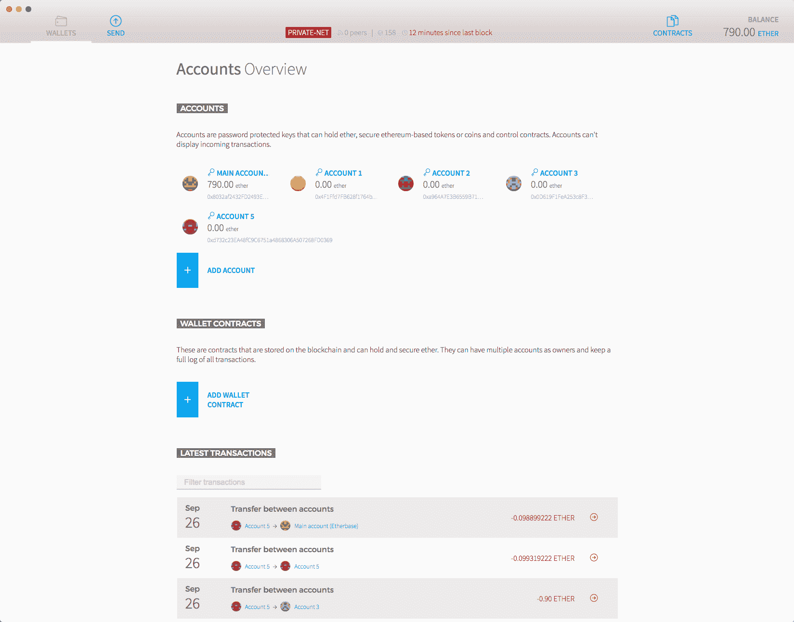
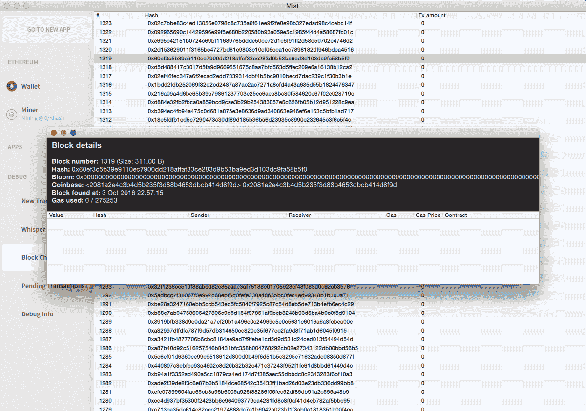

# 第三章：理解以太坊的工作原理

在本章中，我们将深入了解以太坊的工作原理以及我们可以使用以太坊开发什么。我们还将看到重要的以太坊客户端和节点实现。

在本章中，我们将涵盖以下主题：

+   以太坊用户账户

+   什么是智能合约，它们是如何工作的？

+   以太坊虚拟机

+   在工作量证明共识协议中，挖矿是如何工作的？

+   学习如何使用 geth 命令

+   设置以太坊钱包和 Mist

+   Whisper 和 Swarm 概述

+   以太坊的未来

# 以太坊概述

以太坊是一个去中心化的平台，允许我们在其上部署 DApps。智能合约使用 Solidity 编程语言编写。使用一个或多个智能合约创建 DApps。智能合约是按照编程方式精确运行的程序，没有任何停机、审查、欺诈或第三方接口的可能性。在以太坊中，智能合约可以用几种编程语言编写，包括 Solidity、LLL 和 Serpent。Solidity 是这些语言中最流行的。

以太坊有一种名为以太的内部货币。要部署智能合约或调用它们的方法，我们需要以太。一个智能合约可以有多个实例，就像任何其他 DApp 一样，每个实例都由其唯一地址标识。用户账户和智能合约都可以持有以太。

以太坊使用区块链数据结构和工作量证明共识协议。智能合约的方法可以通过交易或另一种方法调用。网络中有两种类型的节点：常规节点和矿工。常规节点只有区块链的副本，而矿工通过挖掘区块来构建区块链。

# 以太坊账户

要创建一个以太坊账户，我们只需要一个非对称密钥对。有各种算法，如 RSA、ECC 等，用于生成非对称加密密钥。以太坊使用**椭圆曲线加密**（**ECC**）。ECC 有各种参数。这些参数用于调整速度和安全性。以太坊使用 `secp256k1` 参数。要深入了解 ECC 及其参数将需要数学知识，而且深入理解并不是构建使用以太坊的 DApps 所必需的。

以太坊使用 256 位加密。以太坊私钥/公钥是一个 256 位的数字。由于处理器无法表示如此大的数字，因此它被编码为长度为 64 的十六进制字符串。

每个账户都由一个地址表示。一旦我们有了生成地址所需的密钥，以下是从公钥生成地址的步骤：

1.  首先，生成公钥的 `keccak-256` 哈希。它将给出一个 256 位的数字。

1.  丢弃前 96 位，也就是 12 字节。现在你应该有 160 位的二进制数据，也就是 20 字节。

1.  现在将地址编码为十六进制字符串。因此，最终您将得到一个包含 40 个字符的字节串，这就是您的账户地址。

现在任何人都可以向这个地址发送以太币。

# 交易

一个**交易**是一个签名的数据包，用于将以太币从一个账户转移到另一个账户或合约，调用合约的方法，或部署新合约。交易使用**ECDSA**（**椭圆曲线数字签名算法**）进行签名，这是一种基于 ECC 的数字签名算法。交易包含了消息的接收者，一个标识发送者并证明其意图的签名，要转移的以太币数量，交易执行允许的最大计算步骤数（称为燃气限制），以及发送交易者愿意支付的每个计算步骤的成本（称为燃气价格）。如果交易的意图是调用合约的方法，则还包含输入数据；如果意图是部署合约，则可以包含初始化代码。燃气使用量和燃气价格的乘积被称为交易费用。要发送以太币或执行合约方法，您需要将交易广播到网络。发送者需要用其私钥对交易进行签名。

如果我们确信一个交易将永远出现在区块链中，那么该交易被认为是已确认的。建议在假设交易已确认之前等待 15 个确认。

# 共识

以太坊网络中的每个节点都保存着区块链的副本。我们需要确保节点无法篡改区块链，同时我们也需要一种机制来检查一个区块是否有效。而且，如果我们遇到两个不同的有效区块链，我们需要有一种方法来找出应该选择哪一个。

以太坊使用工作量证明共识协议来保持区块链的防篡改性。工作量证明系统涉及解决一个复杂的谜题来创建一个新的区块。解决这个谜题应该需要大量的计算能力，从而使创建区块变得困难。在工作量证明系统中创建区块的过程称为挖矿。矿工是网络中挖掘区块的节点。所有使用工作量证明的 DApp 都不会完全实现相同的一组算法。它们可能在矿工需要解决的谜题、谜题的难度、解决它需要多长时间等方面有所不同。我们将学习有关以太坊的工作量证明。

任何人都可以成为网络中的矿工。每个矿工都单独解决谜题；第一个解决谜题的矿工是赢家，并获得五个以太和该区块中所有交易的交易费用。如果您拥有比网络中其他任何节点更强大的处理器，并不意味着您总是会成功，因为各个矿工的谜题参数并不完全相同。但是，相反，如果您拥有比网络中其他任何节点更强大的处理器，这将增加您成功的机会。工作量证明的行为就像是一个抽奖系统，处理能力可以被看作是一个人持有的抽奖券数量。网络安全性不是由矿工的总数来衡量；而是由网络的总处理能力来衡量。

区块链可以拥有的区块数量没有限制，也没有总以太能够产生的限制。一旦一个矿工成功挖矿，他将向网络中的所有其他节点广播该区块。一个区块包含一个头部和一组交易。每个区块持有上一个区块的哈希，从而创建了一个连接的链。

让我们来看看矿工需要解决的谜题是什么，以及在高层次上是如何解决的。为了挖矿，首先，矿工收集新的未挖掘的交易广播到它，然后过滤掉无效的交易。要使交易有效，必须使用私钥正确签名，账户必须有足够的余额进行交易，等等。现在矿工创建一个区块，它包括头部和内容。内容是区块包含的交易列表。头部包含上一个区块的哈希、区块编号、随机数、目标、时间戳、难度、矿工的地址等等。时间戳代表区块初始时刻。然后，随机数是一个无意义的值，它被调整以找到谜题的解决方案。这个谜题基本上就是找到这样的随机数值，当区块被哈希时，哈希值小于或等于目标值。以太坊使用 ethash 哈希算法。找到随机数的唯一方法是枚举所有可能性。目标值是一个 256 位数，它基于各种因素计算得出。头部中的难度值是目标的不同表示，使之更容易处理。目标值越低，找到随机数所需的时间越长，目标值越高，则找到随机数所需的时间越短。这里是计算谜题难度的公式：

```
current_block_difficulty = previous_block_difficulty + previous_block_difficulty // 2048 * max(1 - (current_block_timestamp - previous_blocktimestamp) // 10, -99) + int(2 ** ((current_block_number // 100000) - 2)) 
```

现在，网络中的任何节点都可以通过首先检查区块链中的交易是否有效、时间戳验证、然后检查所有区块的目标和随机数是否有效、矿工是否分配了有效的奖励，等等来检查他们拥有的区块链是否有效。

如果网络中的节点接收到两个不同的有效区块链，那么所有区块的组合难度更高的区块链被视为有效区块链。

现在，举个例子，如果网络中的一个节点改变了一个区块中的一些交易，那么该节点需要计算所有后续区块的随机数。当它重新找到后续区块的随机数时，网络可能已经挖掘了更多的区块，因此拒绝此区块，因为其组合难度将更低。

# 时间戳

计算区块目标的公式需要当前时间戳，而且每个区块的头部都附有当前时间戳。没有什么能阻止矿工在挖掘新区块时使用其他时间戳而不是当前时间戳，但他们通常不会这样做，因为时间戳验证会失败，其他节点不会接受该区块，这将是矿工资源的浪费。当矿工广播一个新挖掘的区块时，它的时间戳将通过检查时间戳是否大于前一个区块的时间戳来进行验证。如果一个矿工使用的时间戳大于当前时间戳，难度将会很低，因为难度与当前时间戳成反比；因此，区块时间戳为当前时间戳的矿工将被网络接受，因为它将具有更高的难度。如果一个矿工使用的时间戳大于前一个区块的时间戳并且小于当前时间戳，难度将会更高，因此，挖掘该区块将需要更长的时间；当区块挖掘完成时，网络可能已经生成了更多的区块，因此，该区块将被拒绝，因为恶意矿工的区块链难度将低于网络的区块链难度。由于这些原因，矿工始终使用准确的时间戳，否则他们将得不到任何好处。

# 随机数

随机数是一个 64 位无符号整数。随机数是谜题的解答。矿工不断递增随机数，直到找到解答。现在你一定在想，如果有一个矿工的哈希功率比网络中的任何其他矿工都要高，那么该矿工总是会第一个找到随机数吗？嗯，并不会。

矿工正在挖掘的区块的哈希值对于每个矿工都是不同的，因为哈希值取决于诸如时间戳、矿工地址等因素，不太可能对所有矿工都相同。因此，这不是解决难题的竞赛；而是一个抽奖系统。当然，根据其哈希功率，矿工有可能幸运地找到下一个区块，但这并不意味着矿工总是能找到下一个区块。

# 区块时间

我们之前看到的区块难度公式使用了一个 10 秒的阈值，以确保父区块和子区块挖掘之间的时间差在 10-20 秒之间。但为什么是 10-20 秒而不是其他值？为什么有这样一个恒定的时间差限制，而不是恒定的难度？

假设我们有一个恒定的难度，矿工只需要找到一个随机数（nonce），使得区块的哈希值小于或等于该难度。假设难度很高；在这种情况下，用户将无法知道将以太币发送给另一个用户需要多长时间。如果网络的计算能力不足以快速找到满足难度的随机数，可能需要很长时间。有时，网络可能会幸运地快速找到随机数。但是这种系统很难吸引用户，因为用户始终想知道交易完成需要多长时间，就像我们从一个银行账户转账到另一个银行账户时，我们会被给予一个完成交易的时间段一样。如果恒定的难度值较低，将会损害区块链的安全性，因为大型矿工可以比小型矿工更快地挖掘区块，而网络中最大的矿工将有能力控制 DApp。不可能找到一个能使网络稳定的恒定难度值，因为网络的计算能力并不是恒定的。

现在我们知道为什么我们应该始终有一个平均时间来确定网络挖掘一个区块应该花费多长时间。现在的问题是，最适合的平均时间是什么，因为它可以是从 1 秒到无限秒的任何时间。通过降低难度可以实现较小的平均时间，通过增加难度可以实现较高的平均时间。但是较低和较高平均时间的优缺点是什么？在我们讨论这个问题之前，我们需要首先了解什么是陈旧区块。

如果两个矿工几乎同时挖掘下一个区块会发生什么？这两个区块肯定都是有效的，但是区块链无法容纳具有相同区块编号的两个区块，而且两个矿工也无法获得奖励。虽然这是一个常见的问题，但解决方法很简单。最终，拥有更高难度的区块将被网络接受。因此，最终被留下的有效区块被称为陈旧区块。

网络中产生的陈旧区块总数与生成新区块的平均时间成反比。较短的区块生成时间意味着新挖的区块在整个网络中传播的时间较短，而且多个矿工更有可能在同一时间找到解决方案，因此在区块传播完毕时，其他一些矿工可能也已经解决了难题并广播了出去，从而导致陈旧区块。但是，如果平均区块生成时间较长，则多个矿工解决难题的机会较小，即使他们解决了难题，也可能存在解决时间间隔，此时第一个解决的区块已经传播，其他矿工可以停止挖掘该区块并开始挖掘下一个区块。如果网络中频繁发生陈旧区块，将导致重大问题，但如果它们很少发生，则不会造成任何伤害。

那么，陈旧区块有什么问题呢？嗯，它们延迟了交易的确认。当两个矿工几乎同时挖出一个区块时，它们可能没有相同的交易集，因此如果我们的交易出现在其中一个区块中，我们不能说它已经确认，因为包含交易的区块可能是陈旧的。因此，我们应该等待更多的区块被挖掘。由于陈旧区块，平均确认时间不等于平均区块生成时间。

陈旧区块是否会影响区块链安全性？是的，它们会。我们知道，网络的安全性由网络中矿工的总计算能力来衡量。当计算能力增加时，会增加难度，以确保区块不会比平均区块时间更早生成。因此，更高的难度意味着更安全的区块链，因为要篡改节点，现在需要更多的哈希能力，这使得篡改区块链变得更加困难；因此，可以说区块链更安全了。当两个区块几乎同时挖出时，我们将看到网络分成两个部分，分别在两个不同的区块链上工作，但其中一个将成为最终的区块链。因此，网络中工作在陈旧区块上的部分会在陈旧区块之上挖掘下一个区块，这导致网络的哈希能力损失，因为哈希能力被用于不必要的事情。由于失去了哈希能力，网络的两部分挖掘下一个区块的时间可能会比平均区块时间长，因此，在挖掘下一个区块后，难度会下降，因为挖掘该区块所用的时间比平均区块时间长。难度的降低会影响整体区块链的安全性。如果陈旧率过高，将严重影响区块链的安全性。

以太坊利用所谓的幽灵协议解决了由过时区块引起的安全问题。以太坊使用了修改过的实际幽灵协议。幽灵协议通过简单地将过时区块添加到主区块链中来掩盖安全问题，从而增加了区块链的总难度，因为区块链的总难度也包括过时区块的难度之和。但是，如何在不发生交易冲突的情况下将过时区块插入主区块链呢？嗯，任何区块都可以指定 0 个或多个过时区块。为了激励矿工包括过时区块，矿工会受到奖励。而且，过时区块的矿工也会受到奖励。过时区块中的交易不用于计算确认，并且，过时区块的矿工不会收到包含在过时区块中的交易的交易费。请注意，以太坊将过时区块称为叔区块。

这里是计算过时区块矿工获得多少奖励的公式。其余的奖励归叔区块所有，即包含孤立区块的区块：

```
(uncle_block_number + 8 - block_number) * 5 / 8 
```

由于不奖励过时区块的矿工不会对任何安全性造成伤害，您一定想知道为什么要奖励过时区块的矿工？嗯，当网络中频繁出现过时区块时，会出现另一个问题，通过奖励过时区块的矿工来解决。矿工应该获得类似于其对网络贡献的哈希功率百分比的奖励。当两个不同的矿工几乎同时挖出一个区块时，由于矿工挖掘下一个区块的效率更高，因此更有可能将由哈希功率更高的矿工挖出的区块添加到最终区块链中；因此，小矿工将失去奖励。如果过时率较低，这不是一个大问题，因为大矿工将获得少量奖励的增加；但是如果过时率较高，就会引起一个大问题，即网络中的大矿工最终会获得比其应该获得的奖励要多得多。幽灵协议通过奖励过时区块的矿工来平衡这一点。由于大矿工不会获得所有奖励，而是获得了比应获得的更多的奖励，因此我们不像对待叔区块那样奖励过时区块的矿工；相反，我们奖励一个较少的金额来平衡。前述的公式可以很好地平衡这一点。

幽灵限制了叔区块可以引用的总过时区块数量，以防止矿工简单地挖掘过时区块并使区块链停滞不前。

因此，无论网络中出现多少过时区块，它都在某种程度上影响着网络。过时区块的频率越高，网络受到的影响就越大。

# 分叉

当节点之间存在关于区块链有效性的冲突时，就会发生分叉，也就是说，在网络中可能存在多个区块链，每个区块链都由一些矿工验证。有三种类型的分叉：常规分叉、软分叉和硬分叉。

常规分叉是由于两个或更多的矿工几乎同时找到一个区块而导致的临时冲突。当其中一个区块的难度大于另一个区块时，冲突会得到解决。

对源代码的更改可能会导致冲突。根据冲突类型的不同，可能需要超过 50%的哈希算力的矿工进行升级，或者所有矿工都进行升级以解决冲突。当需要超过 50%的哈希算力的矿工进行升级以解决冲突时，称为软分叉，而当需要所有矿工都进行升级以解决冲突时，称为硬分叉。软分叉的一个例子是，如果源代码的更新使得一些旧的区块/交易无效，那么当超过 50%的哈希算力的矿工进行了升级，新的区块链将具有更高的难度，最终被整个网络接受。硬分叉的一个例子是，如果源代码的更新是更改矿工的奖励，那么所有矿工都需要升级以解决冲突。

以太坊自发布以来已经经历了各种硬分叉和软分叉。

# 创世区块

创世区块是区块链的第一个区块。它被分配给区块号 0。它是区块链中唯一一个不引用前一个区块的区块，因为没有前一个区块。它不包含任何交易，因为还没有产生任何以太。

网络中的两个节点只有在它们都有相同的创世区块时才会连接，也就是说，只有当两个对等体都有相同的创世区块时，区块同步才会发生，否则它们都将互相拒绝。高难度的不同创世区块不能替换低难度的创世区块。每个节点都会生成自己的创世区块。对于各种网络，创世区块都是硬编码到客户端中的。

# 以太币面值

与任何其他货币一样，以太币有各种面值。以下是各种面值：

+   1 以太 = 1000000000000000000 韦

+   1 以太 = 1000000000000000 兆韦

+   1 以太 = 1000000000000 兆韦

+   1 以太 = 1000000000 吉韦

+   1 以太 = 1000000 萨博

+   1 以太 = 1000 芬尼

+   1 以太 = 0.001 兆以太

+   1 以太 = 0.000001 兆以太

+   1 以太 = 0.000000001 吉以太

+   1 以太 = 0.000000000001 泰以太

# 以太坊虚拟机

EVM（或以太坊虚拟机）是以太坊智能合约字节码执行环境。网络中的每个节点都运行 EVM。所有节点都使用 EVM 执行指向智能合约的所有交易，因此每个节点都执行相同的计算并存储相同的值。只转移以太的交易也需要一些计算，即查找地址是否有余额并相应地扣除余额。

每个节点执行交易并存储最终状态有各种原因。例如，如果有一个智能合约存储了参加派对的每个人的姓名和详细信息，每当添加新成员时，就会向网络广播一个新的交易。对于网络中的任何节点来说，只需读取合约的最终状态就可以显示所有参加派对的人的详细信息。

每个交易在网络中都需要一些计算和存储。因此，需要有交易成本，否则整个网络将被垃圾交易淹没，而且没有交易成本，矿工就没有理由将交易包含在区块中，他们将开始挖掘空块。每个交易都需要不同数量的计算和存储；因此，每个交易都有不同的交易成本。

EVM 有两种实现方式，即字节码 VM 和 JIT-VM。在撰写本书时，JIT-VM 已经可以使用，但其开发尚未完成。无论哪种情况，Solidity 代码都会被编译为字节码。在 JIT-VM 的情况下，字节码还会被进一步编译。与其对应的字节码 VM 相比，JIT-VM 更高效。

# Gas

Gas 是计算步骤的衡量单位。每个交易都需要包含一个 Gas 限制和一个愿意支付的每 Gas 费用（即每次计算支付的费用）；矿工可以选择包含交易并收取费用。如果交易使用的 Gas 小于或等于 Gas 限制，则交易处理。如果总 Gas 超过了 Gas 限制，则所有更改都将被撤销，但交易仍然有效，并且矿工仍然可以收取费用（即可以使用的最大 Gas 和 Gas 价格的乘积）。

矿工决定 Gas 价格（即每次计算的价格）。如果交易的 Gas 价格低于矿工决定的 Gas 价格，则矿工将拒绝挖掘该交易。Gas 价格是以 wei 单位的金额。因此，如果 Gas 价格低于矿工所需的 Gas 价格，矿工可以拒绝将交易包含在区块中。

EVM 中的每个操作都被分配了消耗多少 Gas 的数量。

交易成本会影响账户可以转账给另一个账户的最大以太量。例如，如果一个账户的以太余额为五，它不能全部转移给另一个账户，因为如果所有以太都转移了，账户中就没有余额可以扣除交易费用。

如果交易调用了一个合约方法，并且该方法发送了一些以太币或调用了其他合约方法，则交易费用从调用合约方法的账户中扣除。

# 对等发现

要使节点成为网络的一部分，它需要连接到网络中的一些其他节点，以便广播交易/区块并监听新交易/区块。一个节点不需要连接到网络中的每个节点；相反，一个节点连接到一些其他节点。而这些节点连接到一些其他节点。通过这种方式，整个网络相互连接。

但是，由于没有中央服务器让所有人都能连接到以便交换信息，一个节点如何找到网络中的其他节点呢？以太坊有自己的节点发现协议来解决这个问题，该协议基于 Kadelima 协议。在节点发现协议中，我们有一种特殊类型的节点称为引导节点。引导节点在一段时间内维护着与它们连接的所有节点的列表。它们不保存区块链本身。当节点连接到以太坊网络时，它们首先连接到引导节点，后者分享了连接到它们的节点列表，在预定义的时间段内连接到它们。然后连接的对等方连接并与对等方同步。

可以有各种各样的以太坊实例，也就是各种网络，每个网络都有自己的网络 ID。两个主要的以太坊网络是主网和测试网。主网是在交易所交易其以太币的网络，而测试网是开发者用于测试的。到目前为止，我们已经学习了有关主网区块链的一切。

Bootnode 是以太坊引导节点的最流行实现。如果你想要托管自己的引导节点，可以使用 bootnode。

# Whisper 和 Swarm

Whisper 和 Swarm 分别是由以太坊开发者开发的分布式通信协议和分布式存储平台。Whisper 是一种分布式通信协议，而 Swarm 是一个分布式文件系统。

Whisper 允许网络中的节点相互通信。它支持广播、用户间加密消息等功能。它并非设计用于传输大量数据。你可以在 [`github.com/ethereum/wiki/wiki/Whisper`](https://github.com/ethereum/wiki/wiki/Whisper) 了解更多关于 Whisper 的信息，并在 [`github.com/ethereum/wiki/wiki/Whisper-Overview`](https://github.com/ethereum/wiki/wiki/Whisper-Overview) 查看代码示例概述。

Swarm 类似于 Filecoin，主要在技术和激励方面有所不同。Filecoin 不惩罚存储，而 Swarm 则会惩罚存储；因此，这会进一步增加文件的可用性。你可能想知道激励在 Swarm 中是如何运作的。它是否有内部货币？实际上，Swarm 没有内部货币，而是使用以太坊作为激励。以太坊中有一个智能合约，用于跟踪激励。显然，智能合约无法与 Swarm 通信；取而代之的是，Swarm 与智能合约通信。因此，你通过智能合约向存储支付费用，并且在到期日期后，支付会释放给存储。你还可以向智能合约报告文件丢失的情况，这样智能合约可以惩罚相应的存储。你可以在 [`github.com/ethersphere/go-ethereum/wiki/IPFS-&-SWARM`](https://github.com/ethersphere/go-ethereum/wiki/IPFS-&-SWARM) 了解更多关于 Swarm 和 IPFS/Filecoin 的区别，并在 [`github.com/ethersphere/go-ethereum/blob/bzz-config/bzz/bzzcontract/swarm.sol`](https://github.com/ethersphere/go-ethereum/blob/bzz-config/bzz/bzzcontract/swarm.sol) 查看智能合约代码。

在撰写本书时，Whisper 和 Swarm 仍在开发中；因此，还有许多事情不明朗。

# Geth

Geth（也称为 go-ethereum）是以太坊、Whisper 和 Swarm 节点的实现。Geth 可用于成为它们中的所有部分，也可以只选择其中的某些部分。将它们合并的原因是使它们看起来像一个单一的 DApp，还可以通过一个节点，客户端就可以访问这三个 DApp。

Geth 是一个 CLI 应用程序。它是用 go 编程语言编写的。它适用于所有主要操作系统。当前版本的 geth 尚不支持 Swarm，仅支持 Whisper 的一些功能。在撰写本书时，最新版本的 geth 是 1.3.5。

# 安装 Geth

Geth 适用于 OS X、Linux 和 Windows。它支持两种安装类型：二进制安装和脚本安装。在撰写本书时，geth 的最新稳定版本是 1.4.13\. 让我们看看如何在各种操作系统中使用二进制安装方法安装它。当需要修改 geth 源代码并安装它时，使用脚本安装。由于我们不想对源代码做任何更改，因此我们将选择二进制安装。

# OS X

在 OS X 中安装 geth 的推荐方法是使用 brew。在终端中运行以下两个命令来安装 geth：

```
brew tap ethereum/ethereum 
brew install ethereum  
```

# Ubuntu

在 Ubuntu 中安装 geth 的推荐方法是使用 `apt-get`。在 Ubuntu 终端中运行以下命令来安装 geth：

```
sudo apt-get install software-properties-common 
sudo add-apt-repository -y ppa:ethereum/ethereum 
sudo apt-get update 
sudo apt-get install ethereum
```

# Windows

Geth 作为 Windows 的可执行文件提供。从[`github.com/ethereum/go-ethereum/wiki/Installation-instructions-for-Windows`](https://github.com/ethereum/go-ethereum/wiki/Installation-instructions-for-Windows)下载 zip 文件，并解压缩。在其中，您将找到`geth.exe`文件。

要了解有关在各种操作系统上安装 geth 的更多信息，请访问[`github.com/ethereum/go-ethereum/wiki/Building-Ethereum`](https://github.com/ethereum/go-ethereum/wiki/Building-Ethereum)。

# JSON-RPC 和 JavaScript 控制台

Geth 为其他应用程序提供了使用 JSON-RPC 与其通信的 JSON-RPC API。Geth 使用 HTTP、WebSocket 和其他协议提供 JSON-RPC API。JSON-RPC 提供的 API 分为以下类别：admin、debug、eth、miner、net、personal、shh、txpool 和 web3。您可以在这里找到更多关于它的信息 [`github.com/ethereum/go-ethereum/wiki/JavaScript-Console`](https://github.com/ethereum/go-ethereum/wiki/JavaScript-Console)。

Geth 还提供了一个交互式 JavaScript 控制台，使用 JavaScript API 以编程方式与其交互。此交互式控制台使用 IPC 上的 JSON-RPC 与 geth 进行通信。我们将在后续章节中更多地了解有关 JSON-RPC 和 JavaScript API 的内容。

# 子命令和选项

让我们使用示例学习 geth 命令的一些重要子命令和选项。您可以使用帮助子命令找到所有子命令和选项的列表。我们将在接下来的章节中了解更多关于 geth 及其命令的内容。

# 连接到主网网络

以太坊网络中的节点默认使用`30303`端口进行通信。但是节点也可以自由监听其他端口号。

要连接到主网网络，只需运行`geth`命令。以下是如何明确指定网络 ID 并指定 geth 将存储下载的区块链的自定义目录的示例：

```
    geth --datadir "/users/packt/ethereum" --networkid 1
```

`--datadir`选项用于指定存储区块链的位置。如果未提供， 默认路径为`$HOME/.ethereum`。

`--networkid`用于指定网络 ID。1 是主网网络的 ID。如果未提供，默认值为 1。测试网的网络 ID 为 2。

# 创建私有网络

要创建私有网络，只需提供一个随机网络 ID。私有网络通常是为开发目的创建的。Geth 还提供了与日志记录和调试相关的各种标志，在开发过程中非常有用。因此，我们可以使用`--dev`标志，而不是提供一个随机网络 ID 和放置各种日志记录和调试标志，它会启动一个私有网络并启用各种调试和日志记录标志。

# 创建账户

Geth 还可以让我们创建账户，即生成与其关联的密钥和地址。要创建账户，请使用以下命令：

```
    geth account new
```

当您运行此命令时，将要求您输入密码以加密您的账户。如果您忘记密码，将无法访问您的账户。

要获取本地钱包中所有账户的列表，请使用以下命令：

```
    geth account list
```

前面的命令将打印出所有账户地址的列表。默认情况下，密钥存储在 `--datadir` 路径中，但是您可以使用 `--keystore` 选项指定其他目录。

# 挖矿

默认情况下，geth 不会开始挖矿。要指示 geth 开始挖矿，只需提供 `--mine` 选项。与挖矿相关的还有一些其他选项：

```
    geth --mine --minerthreads 16 --minergpus '0,1,2' --etherbase '489b4e22aab35053ecd393b9f9c35f4f1de7b194' --unlock '489b4e22aab35053ecd393b9f9c35f4f1de7b194'
```

这里，除了 `--mine` 选项外，我们还提供了各种其他选项。 `--minerthreads` 选项指定了在哈希过程中要使用的线程总数。默认情况下，使用八个线程。 Etherbase 是挖矿所得奖励存入的地址。默认情况下，账户是加密的。因此，要访问账户中的以太币，我们需要解锁它，即解密账户。解密用于解密与账户关联的私钥。要开始挖矿，我们不需要解锁它，因为只需要地址来存入挖矿奖励。可以使用 `-unlock` 选项解锁一个或多个账户。通过使用逗号分隔地址，可以提供多个地址。

`--minergpus` 用于指定用于挖矿的 GPU。要获取 GPU 列表，请使用 `geth gpuinfo` 命令。对于每个 GPU，您需要拥有 1-2 GB 的 RAM。默认情况下，不使用 GPU，而只使用 CPU。

# 快速同步

撰写本书时，区块链大小约为 30 GB。如果您的互联网连接速度较慢，下载可能需要几个小时或几天。以太坊实现了一种快速同步算法，可以更快地下载区块链。

快速同步不会下载整个区块；相反，它只下载区块头、交易收据和最近的状态数据库。因此，我们不必下载和重播所有交易。为了检查区块链的完整性，该算法在每个定义的区块数之后下载一个完整的区块。要了解更多关于快速同步算法的信息，请访问[`github.com/ethereum/go-ethereum/pull/1889`](https://github.com/ethereum/go-ethereum/pull/1889)。  

在下载区块链时使用快速同步，需要在运行 geth 时使用 `--fast` 标志。

出于安全原因，快速同步仅在初始同步期间运行（即当节点自己的区块链为空时）。当一个节点成功地与网络同步后，快速同步将永远被禁用。作为额外的安全特性，如果快速同步在接近或在随机枢轴点之后失败，它将被禁用作为安全预防措施，并且节点将恢复到完全基于区块处理的同步。

# 以太坊钱包

以太坊钱包是一个以太坊 UI 客户端，它让你创建账户、发送以太币、部署合约、调用合约方法等。

以太坊钱包已捆绑了 geth。当你运行以太坊时，它会尝试找到本地的 geth 实例并连接到它，如果找不到正在运行的 geth，则启动自己的 geth 节点。以太坊钱包使用 IPC 与 geth 通信。Geth 支持基于文件的 IPC。

如果在运行 geth 时更改数据目录，则也会更改 IPC 文件路径。因此，为了让以太坊钱包找到并连接到你的 geth 实例，你需要使用 `--ipcpath` 选项来指定 IPC 文件的位置到其默认位置，这样以太坊钱包才能找到它；否则以太坊钱包将无法找到它并将启动自己的 geth 实例。要找到默认的 IPC 文件路径，请运行 geth 帮助命令，它将在 `--ipcpath` 选项旁边显示默认路径。

访问[`github.com/ethereum/mist/releases`](https://github.com/ethereum/mist/releases)下载以太坊钱包。它适用于 Linux、OS X 和 Windows。就像 geth 一样，它有两种安装模式：二进制和脚本安装。

这里有一张显示以太坊钱包外观的图片：



# Mist

Mist 是以太坊、Whisper 和 Swarm 的客户端。它让我们发送交易、发送 Whisper 消息、检查区块链等。

Mist 和 geth 之间的关系类似于以太坊钱包和 geth 之间的关系。

Mist 最受欢迎的特点是它带有一个浏览器。目前，运行在浏览器中的前端 JavaScript 可以使用 `web3.js` 库（一种为其他应用程序与 geth 通信提供以太坊控制台 JavaScript API 的库）访问 geth 节点的 web3 API。

Mist 的基本思想是构建第三代互联网（Web 3.0），它将通过使用以太坊、Whisper 和 Swarm 作为替代中心化服务器来消除对服务器的需求。

这里有一张显示 Mist 外观的图片：



# 弱点

每个系统都有一些弱点。同样，以太坊也有一些弱点。显然，就像任何其他应用程序一样，以太坊源代码可能会有漏洞。而且就像任何其他基于网络的应用程序一样，以太坊也容易受到 DoS 攻击。但让我们来看看以太坊的独特和最重要的弱点。

# Sybil 攻击

攻击者可以尝试用自己控制的常规节点填满网络；然后你很可能只会连接到攻击者节点。一旦你连接到攻击者节点，攻击者可以拒绝中继来自所有人的区块和交易，从而将你与网络断开。攻击者只能中继他自己创建的区块，从而将你置于一个单独的网络中，依此类推。

# 51% 攻击

如果攻击者控制了网络哈希率的一半以上，攻击者可以比网络其余部分更快地生成区块。攻击者可以简单地保留他的私有分支，直到它比诚实网络构建的分支更长，然后广播它。

拥有超过 50% 的哈希算力，矿工可以撤销交易，阻止所有/部分交易被挖掘，并阻止其他矿工的挖掘块被插入到区块链中。

# Serenity

Serenity 是以太坊的下一个重大更新的名称。在编写本书时，Serenity 仍在开发中。此更新将需要硬分叉。Serenity 将把共识协议改为 casper，并将集成状态通道和分片。这些将如何工作的完整细节目前尚不清楚。让我们先看一下这些是什么的高层概述。

# 支付通道和状态通道

在深入了解状态通道之前，我们需要了解支付通道是什么。支付通道是一种功能，允许我们将发送以太币到另一个账户的两个以上的交易合并为两个交易。它是如何工作的呢？假设 X 是一个视频流网站的所有者，而 Y 是一个用户。X 每分钟收取一以太币。现在 X 希望 Y 每分钟观看视频后付费。当然，Y 可以每分钟广播一次交易，但这里有一些问题，比如 X 必须等待确认，所以视频将暂停一段时间等。这是支付通道解决的问题。使用支付通道，Y 可以通过广播一个锁定交易将一些以太币（也许 100 以太币）锁定一段时间（也许 24 小时）给 X。现在，在观看了 1 分钟的视频后，Y 将发送一个签名记录，指示可以解锁锁定，其中一个以太币将转到 X 的账户，剩余的将转到 Y 的账户。再过一分钟，Y 将发送一个签名记录，指示可以解锁锁定，其中两个以太币将转到 X 的账户，剩余的将转到 Y 的账户。随着 Y 在 X 的网站上观看视频，这个过程将持续下去。现在一旦 Y 观看了 100 小时的视频或者 24 小时的时间即将到达，X 将向网络广播最终的签名记录，以将资金提取到他的账户。如果 X 在 24 小时内未能提取资金，则完全退款给 Y。所以在区块链上，我们只会看到两个交易：锁定和解锁。

支付通道用于与发送以太币相关的交易。同样，状态通道允许我们将与智能合约相关的交易合并。 

# 权益证明和 casper

在我们深入了解 casper 共识协议之前，我们需要了解权益证明共识协议是如何工作的。

股权证明是工作量证明的最常见替代方案。工作量证明浪费了太多的计算资源。 POW 和 POS 的区别在于，在 POS 中，矿工不需要解决难题；相反，矿工需要证明对股份的所有权来挖掘区块。在 POS 系统中，账户中的以太被视为股份，矿工挖掘区块的概率与其持有的股份成正比。因此，如果矿工持有网络中 10% 的股份，那么它将挖掘 10% 的区块。

但问题是，我们如何知道谁将挖掘下一个区块？我们不能简单地让持有最高股份的矿工总是挖掘下一个区块，因为这会导致集中化。有各种算法用于选择下一个区块，例如随机区块选择和基于币龄的选择。

Casper 是 POS 的一种修改版本，用于解决 POS 的各种问题。

# 分片

目前，每个节点都需要下载所有交易，这是巨大的。随着区块链大小增长的速度，未来几年，将很难下载整个区块链并保持同步。

如果你熟悉分布式数据库架构，你一定很熟悉分片。如果不熟悉，那么分片是一种将数据分布到多台计算机上的方法。以太坊将实现分片以将区块链分割并分发到节点上。

您可以在[`github.com/ethereum/wiki/wiki/Sharding-FAQ`](https://github.com/ethereum/wiki/wiki/Sharding-FAQ)了解更多关于分片区块链的信息。

# 总结

在本章中，我们详细了解了以太坊的工作原理。我们了解了区块时间如何影响安全性以及以太坊的弱点。我们还了解了 Mist 和以太坊钱包是什么以及如何安装它们。我们还看到了 geth 的一些重要命令。最后，我们了解了以太坊的 Serenity 更新中将会有什么新内容。
