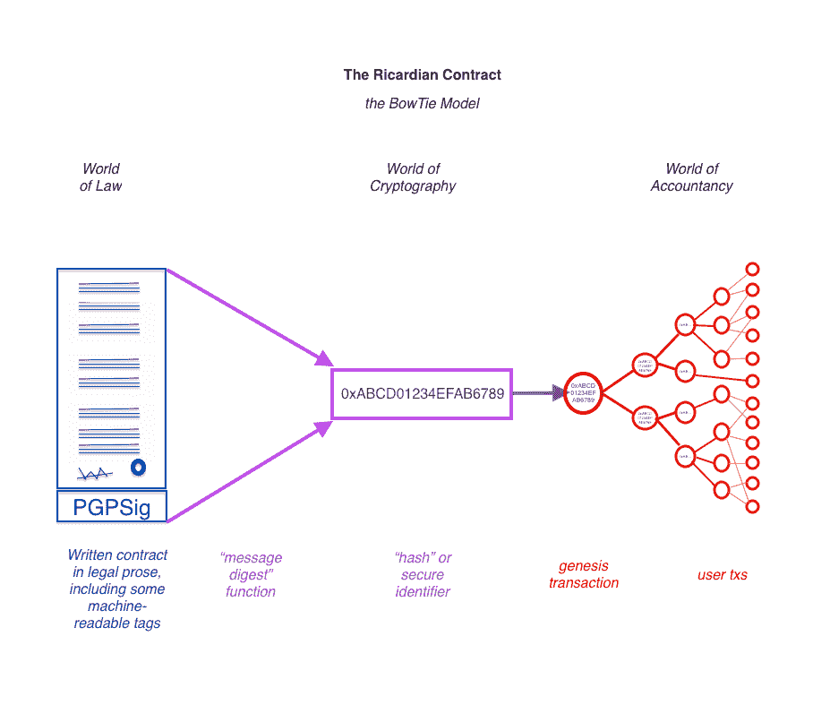
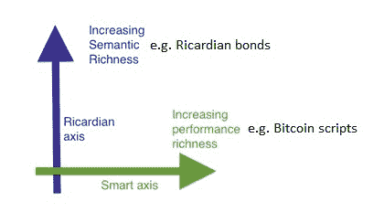
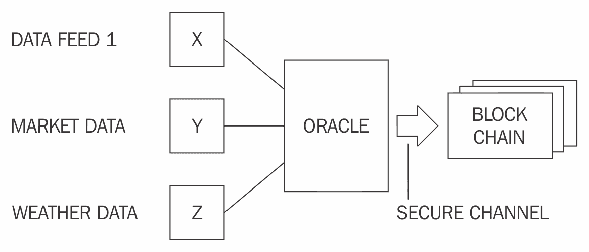

# 第四章：智能合约

本章介绍了智能合约的概念。这个概念并不新鲜，但是随着区块链的出现，对这个想法的兴趣重新被唤起，现在这是区块链领域的一个活跃研究领域。由于智能合约可以为金融服务行业带来节省成本的好处，降低交易成本并简化复杂合同，各种商业和学术机构正在进行严格的研究，以便尽快形式化和使智能合约的实施变得简单和实用。

# 历史

智能合约最初由 Nick Szabo 在 1990 年代末在一篇名为《在公共网络上规范和保护关系》的文章中提出，但直到比特币的发明和区块链技术的后续发展，人们才真正意识到它们的潜力和好处。Szabo 将智能合约描述为以下方式：

"智能合约是执行合同条款的电子交易协议。一般目标是满足常见的合同条件（如付款条件、留置权、保密性，甚至强制执行），尽量减少恶意和意外异常，并最小化对可信中介的需求。相关的经济目标包括降低欺诈损失、仲裁和执行成本，以及其他交易成本。"

Szabo 撰写的原始文章可在[`firstmonday.org/ojs/index.php/fm/article/view/548`](http://firstmonday.org/ojs/index.php/fm/article/view/548)上找到。

智能合约的这个想法在 2009 年以有限的方式在比特币中实现，比特币交易使用有限的脚本语言可以用于在用户之间传输价值，这是一个对等网络，用户之间不一定信任彼此，也没有必要信任中介。

# 定义

对于智能合约的标准定义没有共识。定义智能合约是必不可少的，以下是我对智能合约的一般化定义的尝试：

*智能合约是一个安全的、无法阻止的计算机程序，代表着一个自动可执行和可执行的协议。*

进一步剖析这个定义会发现，智能合约实际上是一个计算机程序，它是用计算机或目标机器可以理解的语言编写的。此外，它包含了各方之间的业务逻辑形式的协议。另一个基本的想法是，智能合约在满足某些条件时会自动执行。它们是可强制执行的，这意味着所有合同条款都会按照定义和期望的方式执行，即使在存在对手方的情况下也是如此。

执法是一个更广泛的术语，它包括传统的法律执法，以及实施特定措施和控制的实施，使得能够执行合同条款而无需任何调解。值得注意的是，真正的智能合约不应依赖于传统的执法方法。相反，它们应该依据代码即法的原则工作，这意味着没有必要由仲裁员或第三方来控制或影响智能合约的执行。智能合约是自我执行的，而不是法律可执行的。这个想法可能被视为自由主义者的梦想，但它完全是可能的，并符合智能合约的真正精神。

此外，它们是安全的和不可阻挡的，这意味着这些计算机程序必须设计成容错性强且在合理的时间内可执行。即使外部因素不利，这些程序也应该能够执行和维护健康的内部状态。例如，想象一个典型的计算机程序，它被编码了一些逻辑并根据其中编码的指令执行。然而，如果它运行的环境或它所依赖的外部因素偏离了正常或预期的状态，该程序可能会任意地反应或简单地中止。智能合约免疫于这种问题是至关重要的。

安全和不可阻挡可能被认为是要求或期望的特性，但从长远来看，如果安全和不可阻挡的特性从一开始就包含在智能合约的定义中，将会带来更显著的好处。这将使研究人员能够从一开始就专注于这些方面，并有助于构建坚实的基础，进而进行进一步的研究。一些研究人员还提出，智能合约不需要自动执行；相反，在某些情况下，它们可以是所谓的可自动化的，因为某些场景需要人工输入。例如，可能需要由合格的医疗专业人员进行医疗记录的手动验证。在这种情况下，完全自动化的方法可能效果不佳。虽然在某些情况下人类的输入和控制是可取的，但并非必要；并且，为了使合约真正智能，在作者看来，它必须是完全自动化的。一些需要人为提供的输入也可以通过使用 Oracles 来自动化。后文将更详细地讨论 Oracles。

智能合约通常通过使用状态机模型来管理其内部状态。这使得能够开发一个有效的智能合约编程框架，其中合约的状态根据一些预定义的标准和条件进一步推进。

就代码是否可以作为法院合同的基础而进行的讨论也在持续进行。智能合同在形式上与传统的法律文书有所不同，尽管它们代表并执行所有合同条款，但法院并不理解代码。这一困境提出了有关智能合同如何具有法律约束力的几个问题：它能否以一种容易被法院接受和理解的方式开发？如何在代码内实施争端解决，这是可能的吗？此外，在智能合同能够像传统法律文件一样有效使用之前需要解决的另一个主题是监管和合规要求。

即使智能合同被称为智能，它们实际上只做它们被编程做的事情，这是可以接受的，因为智能合同的这一属性确保智能合同每次执行时都产生相同的输出。由于一致的共识要求，这种确定性的性质在区块链平台上非常理想。这意味着智能合同并不是真正的智能，它们只是做它们被编程做的事情。

现在，这引发了一个问题，即现实世界和区块链世界之间出现了很大的差距。在这种情况下，自然语言对智能合同来说是不可理解的，类似地，代码对自然世界来说也是无法理解的。因此，一些问题出现了，现实生活中的合同如何部署在区块链上？如何构建真实世界和智能合同世界之间的桥梁？

上述问题打开了各种可能性，例如使智能合同代码不仅可以被机器理解，还可以被人理解。如果人类和机器都能理解智能合同中编写的代码，它在法律情况下可能更容易被接受，而不只是一个除程序员外没有人能够理解的代码片段。这种可取的属性是一个值得研究的领域，大量的研究工作在这一领域已经进行，以回答关于合同的语义、含义和解释的问题。

已经有一些工作通过将智能合同代码和自然语言合同组合在一起，通过链接合同术语与机器可理解的元素，形式上描述自然语言合同。这是通过使用一种标记语言来实现的。这种标记语言的示例称为**法律知识交换格式**（**LKIF**），它是用于表示理论和证明的 XML 模式。它是在 2008 年的 ESTRELLA 项目下开发的。

关于更多信息，请参阅研究论文：[`doi.org/10.1007/978-3-642-15402-7_30`](https://doi.org/10.1007/978-3-642-15402-7_30)。

智能合约固有地需要是确定的。这个属性将允许任何网络上的任何节点运行智能合约并获得相同的结果。如果结果在节点之间即使稍有不同，那么就无法达成共识，而区块链上的分布式共识整个范式可能会失败。此外，还希望合约语言本身也是确定的，从而确保智能合约的完整性和稳定性。所谓确定性是指语言中没有使用非确定性函数，这些函数可能在各个节点上产生不同结果。

举个例子，各种编程语言中由各种函数计算的各种浮点操作在不同的运行环境中可能会产生不同的结果。另一个例子是 JavaScript 中的一些数学函数，在不同浏览器上可能会为相同的输入产生不同结果，这反过来可能导致各种错误。在智能合约中这是非常不可取的，因为如果节点之间的结果不一致，那么将永远无法达成共识。

确定性特征确保智能合约始终为特定输入产生相同输出。换句话说，程序在执行时生成可靠准确的业务逻辑，完全符合高级代码中编程的要求。

总之，智能合约具有以下四个属性：

+   自动可执行

+   可执行的

+   语义上合理

+   安全不可阻止

前两个属性至少是必需的，而后两个在某些情况下可能不是必需的或不可实施，并且可以放宽。例如，金融衍生产品合同也许不需要语义上合理和不可阻止，但至少在基本层面上应该是自动可执行和可强制执行的。另一方面，不动产所有权证书需要语义上合理和完整，因此要将其实现为智能合约，语言必须被计算机和人理解。Ian Grigg 解决了这个解释问题，他发明了理查德合同，我们将在下一节更详细地看一下。

# 理查德合同

理查德合同最初是在 1990 年代末由*Ian Grigg*在论文*《金融密码学七层》中提出的。这些合同最初被用于一种名为**里卡多**的债券交易和支付系统中。其基本思想是编写一份可被法律法院和计算机软件理解和接受的文件。理查德合同解决了通过互联网发行价值的挑战。它确定了发行方并在文件中捕获合同的所有条款和条款，使其可接受为具有法律约束力的合同。

理查德合同是一个具有以下几个特性的文件：

+   由发行方向持有人提供的合同

+   由持有者持有和发行者管理的有价权利

+   人们易读（像纸质合同一样）

+   可被程序阅读（可解析，如数据库）

+   数字签名

+   携带密钥和服务器信息

+   与独特且安全的标识符相关联

上述信息基于 Ian Grigg 在 [`iang.org/papers/ricardian_contract.html`](http://iang.org/papers/ricardian_contract.html) 的原始定义。

在实践中，合同通过生成一份包含法律文言合同条款和所需机器可读标签的单一文档来实施。该文件由发行方使用其私钥进行数字签名。然后使用消息摘要函数对该文档进行哈希处理，以生成可以识别文档的哈希值。在合同履行过程中，各方进一步使用并签署该哈希，以将每笔交易与标识符哈希链接起来，从而使标识符哈希作为意图证据。这通常在下一个图表中描述，通常称为蝴蝶模型。

该图表显示了多个元素：

+   **法律世界** 在左侧，文档起源地。这份文件是一份使用法律文言书写的书面合同，并带有一些机器可读的标签。

+   然后对该文档进行哈希处理。

+   所得的消息摘要作为标识符在**会计世界**中使用，如图表右侧所示。

**会计世界** 元素代表着在业务中用于执行各种业务操作的任何会计、交易和信息系统。该流程背后的想法是通过对文档进行哈希生成消息摘要，首先将其用于所谓的**起始交易**，或者第一笔交易，然后在合同的运营执行过程中作为标识符在每笔交易中使用。

这样，原始书面合同与**会计世界**中的每笔交易之间就建立了安全链接：

Ricardian 合同，蝴蝶结图

Ricardian 合同与智能合同不同，智能合同不包括任何合同文件，纯粹关注合同的执行。另一方面，Ricardian 合同更关注合同法律文言的语义丰富性和文件的制作。合同的语义可以分为两种类型：操作语义和指称语义。

第一种类型定义了合同的实际执行、正确性和安全性，后者则涉及完整合同的真实含义。 一些研究人员已经区分了智能合同代码和智能法律合同，其中智能合同仅涉及合同的执行。 第二种类型包括法律协议的指示和操作语义。 基于语义的差异将智能合同划分为类型也许有意义，但最好将智能合同视为能够在其中编码法律散文和代码（业务逻辑）的独立实体。

在比特币中，可以观察到基本智能合同（条件逻辑）的直接实现，它完全面向合同的执行和性能，而里卡迪安合同更倾向于生成一个对人类易懂的文件，其中有些部分是计算机程序可以理解的。 这可以看作是法律语义与操作性能（语义与性能）的对比，如下图所示。 本图显示里卡迪安合同更加语义丰富，而智能合同更加性能丰富。 这个概念最初是由*Ian Grigg*在他的论文《On the intersection of Ricardian and smart contracts》中提出的。

图解释了性能与语义是 Ian Grigg 描述的正交问题；稍微修改以展示两个轴上不同类型合同的示例

一个智能合同包括了这两个元素（性能和语义）的嵌入，从而完成了一个完美的智能合同模型。

里卡迪安合同可以表示为三个对象的元组，即*散文*、*参数*和*代码*。 散文代表自然语言中的法律合同；代码代表了计算机可理解的法律散文的表示；参数将法律合同的适当部分与等效代码连接起来。

里卡迪安合同已经在许多系统中实施，例如 CommonAccord、OpenBazaar、OpenAssets 和 Askemos。

# 智能合同模板

智能合同可以在需要的任何行业实现，但大多数当前的用例与金融行业相关。 这是因为区块链最初在金融业发现了许多用例，并在其他行业很久之前就引起了金融业的巨大研究兴趣。 特定于金融行业的智能合同领域的最新工作提出了智能合同模板的理念。 这个理念是建立提供支持金融工具法律协议的标准模板框架。

这个想法是由 *Clack et al.* 在他们 2016 年发表的名为 *智能合同模板：基础、设计风景和研究方向* 的论文中提出的。该论文还提出应该构建支持智能合同模板设计和实现的领域特定语言。一个名为 CLACK 的语言，即增强合同知识的通用语言已经被提出，并已开始研究开发这种语言。这种语言旨在非常丰富，并提供多种功能，从支持法律条文到在多个平台上执行和加密功能。

Clack 等人进行了开发支持法律可执行智能合同的智能合同模板的最新工作。该提案在他们的研究论文 *智能合同模板：基本要求和设计选项* 中进行了讨论。该论文的主要目的是调查如何使用标记语言将法律条文与代码联系起来。它还涵盖了如何创建、格式化、执行和序列化智能法律协议以供存储和传输。这是一项正在进行的工作，也是一个进一步研究和开发的开放领域。

金融行业的合同并不是一个新概念，各种领域特定语言 DSL 在金融行业已经被广泛使用，为特定领域提供了专门的语言。例如，有支持保险产品开发、代表能源衍生品或用于构建交易策略的 DSL 可用。

可以在 [`www.dslfin.org/resources.html`](http://www.dslfin.org/resources.html) 找到一个全面的金融领域特定语言列表。

了解领域特定语言的概念也很重要，因为这种类型的语言可以开发用于编程智能合同。这些语言是为特定应用或兴趣领域开发的，具有有限的表现力。**领域特定语言**（**DSLs**）与**通用编程语言**（**GPLs**）不同。DSLs 具有一小组功能，这些功能足以并且针对它们打算在的领域进行了优化，并且通常不像 GPLs 那样用于构建通用大型应用程序。

基于 DSL 的设计理念，可以设想这样的语言将被专门开发用于编写智能合同。已经做了一些工作，Solidity 是一种已经引入以太坊区块链用于编写智能合同的语言。Vyper 是另一种最近为以太坊智能合约开发引入的语言。

用于智能合约编程的领域特定语言的概念可以进一步扩展到*图形领域特定语言*，这是一个智能合约建模平台，领域专家（比如前台交易员而非程序员）可以使用图形用户界面和画布定义和绘制金融合同的语义和性能。一旦流程被绘制并完成，可以首先进行仿真测试，然后从同一系统部署到目标平台，可以是区块链。这也不是一个新概念，在 Tibco StreamBase 产品中也使用了类似的方法，该产品是一个基于 Java 的系统，用于构建事件驱动的高频交易系统。

建议在开发可用于使用用户友好的图形用户界面编程智能合约的高级 DSL 领域也应进行研究，从而使非程序员领域专家（例如律师）能够设计智能合约。

# 神谕

神谕是智能合约生态系统的重要组成部分。智能合约的限制在于它们无法访问外部数据，而这些数据可能是控制业务逻辑执行所需的；例如，合约需要发布股息支付所需的证券产品的股价。神谕可以用来为智能合约提供外部数据。神谕是一个从外部来源向智能合约传递数据的接口。

根据行业和要求，神谕可以提供不同类型的数据，包括天气报告、现实世界新闻和公司行动以及来自**物联网（IoT）**设备的数据。神谕是受信任的实体，使用安全通道将数据传输到智能合约。

神谕还能够数字签名数据，证明数据来源真实可靠。智能合约可以订阅神谕，然后智能合约可以拉取数据，或者神谕可以将数据推送给智能合约。还需要确保神谕无法操纵他们提供的数据，并且必须能够提供真实可靠的数据。虽然神谕是可信的，但在某些情况下，由于操纵原因，数据可能仍然是不正确的。因此，需要确保神谕无法更改数据。后面章节将讨论使用各种公证方案提供此验证。

在这种方法中，可能已经出现了一个问题，这在某些情况下可能是不可取的，那就是信任的问题。你如何相信第三方提供的数据的质量和真实性？这在金融世界尤为重要，市场数据必须准确可靠。智能合约设计者可能会接受由大型、值得信赖的第三方提供的甲骨文数据，但中心化的问题仍然存在。这些类型的甲骨文可以称为标准或简单的甲文。例如，数据来源可以是知名天气预报机构或机场信息系统的航班延误。

为了确保第三方来源的数据的可信度，还可以利用另一个概念，即数据来自多个来源；甚至可以来自访问和了解某些数据的公众或公众会员提供所需的数据。然后可以对这些数据进行聚合，如果同一信息从多个来源输入，则数据是正确的并值得信赖的可能性很大。

另一种甲骨文是**分散式**甲骨文，它基本上是由于分散化的要求而出现的。这些类型的甲骨文可以基于某种分布机制构建。也可以设想甲骨文可以从另一个由分布式共识驱动的区块链获取数据源，从而确保数据的真实性。例如，某个机构运行其私有区块链，可以通过一个甲骨文发布其数据源，然后其他区块链可以使用该数据。

研究人员还介绍了另一种硬件甲骨文的概念，这种概念需要来自物理设备的真实世界数据。例如，这可以用于遥测和物联网。然而，这种方法需要硬件设备是防篡改的。这可以通过提供物联网设备数据的加密证据（不可否认性和完整性）和设备防篡改机制来实现，从而使设备在防篡改尝试的情况下无法使用。

以下图表展示了一个甲骨文和智能合约生态系统的通用模型：

一个甲骨文和智能合约生态系统的通用模型

现在有平台可以使用甲骨文使智能合约获取外部数据。根据所使用的区块链类型，甲骨文使用不同的方法将数据写入区块链。例如，在比特币区块链中，甲骨文可以将数据写入特定交易，而智能合约可以监视区块链中的该交易并读取数据。

提供 Oracle 服务的各种在线服务，如 [`www.oraclize.it/`](http://www.oraclize.it/) 和 [`www.realitykeys.com/`](https://www.realitykeys.com/)。还提供了另一项服务 [`smartcontract.com/`](https://smartcontract.com/)，它提供了外部数据和使用智能合约进行支付的能力。

所有这些服务旨在使智能合约能够获取执行和做出决策所需的数据。为了证明来自外部来源的 Oracles 检索到的数据的真实性，可以使用像 TLSnotary 这样的机制，它会产生数据源和 Oracle 之间通信的证明。这确保了反馈给智能合约的数据是从源头检索到的。

关于 TLSnotary 的更多详细信息可以在这里找到： [`tlsnotary.org/`](https://tlsnotary.org/)。

# 智能 Oracles

*瑞波实验室（codius）*也提出了智能 Oracle 的概念。其原始白皮书可在 [`github.com/codius/codius/wiki/Smart-Oracles:-A-Simple,-Powerful-Approach-to-Smart-Contracts`](https://github.com/codius/codius/wiki/Smart-Oracles:-A-Simple,-Powerful-Approach-to-Smart-Contracts)找到。Codius 提出的智能 Oracle 与 Oracle 一样是实体，但具有合约代码执行的附加能力。Codius 提出的智能 Oracle 使用 Google Native Client 运行，这是一个用于运行不受信任的 x86 本机代码的沙盒环境。

# 在区块链上部署智能合约

智能合约可能会或可能不会部署在区块链上，但由于区块链提供的分布式和去中心化共识机制，将其部署在区块链上是有意义的。以太坊是一个原生支持智能合约开发和部署的区块链平台的例子。以太坊区块链上的智能合约通常是分散自治组织（**DAOs**）等更广泛应用的一部分。

作为对比，在比特币区块链中，诸如`nLocktime`字段和比特币交易中的 CHECKLOCKTIMEVERIFY（CLTV）、CHECKSEQUENCEVERIFY 脚本操作符等交易时锁定机制可以被视为简单版本智能合约的启用器。这些交易时锁定机制使得交易可以被锁定直到特定时间或者直到一定数量的区块，从而强制执行一个基本合约，即只有在满足特定条件（经过的时间或者区块数量）时才能解锁某笔交易。例如，你可以实现诸如“在 3 个月后支付 X 方 N 比特币”的条件。然而，这非常有限，应该仅被视为基本智能合约的示例。除了上面提到的例子，比特币脚本语言，虽然有限，也可以用来构建基本智能合约。其中一个例子是资助一个可以由任何证明“哈希碰撞攻击”的人花费的比特币地址。这是在 Bitcointalk 论坛上宣布的一个比赛，比特币被设置为奖励给任何成功找到哈希碰撞的人（我们在第六章，*公钥密码学*中讨论了这个概念）的攻击。只有在成功攻击的演示上才能解锁比特币的这种条件性解锁是基本类型的智能合约。

这个想法是在 Bitcointalk 论坛上提出的，更多信息可以在[`bitcointalk.org/index.php?topic=293382.0`](https://bitcointalk.org/index.php?topic=293382.0)找到。这也可以被看作是一种基本形式的智能合约。

其他各种区块链平台支持智能合约，如 Monax、Lisk、Counterparty、Stellar、Hyperledger fabric、corda 和 Axoni core。智能合约可以用各种语言开发。然而，关键要求是确定性，这非常重要，因为无论智能合约代码在何处执行，它每次都应该产生相同的结果。智能合约的这种确定性要求也意味着智能合约代码绝对没有错误。智能合约的验证和验证是一个活跃的研究领域，对这个主题的详细讨论将在第十六章，*可扩展性和其他挑战*中展示。已经开发了各种语言来构建智能合约，例如 Solidity，它运行在**以太坊虚拟机**（**EVM**）上。值得注意的是，已经有平台支持主流语言用于智能合约开发，比如 Lisk 支持 JavaScript。然而，另一个显著的例子是 Hyperledger fabric，它支持 Golang、Java 和 JavaScript 用于智能合约开发。

# DAO

DAO 是最高众筹项目之一，始于 2016 年 4 月。这是一组旨在提供投资平台的智能合约。由于代码中的一个错误，在 2016 年 6 月被黑，并有相当于 5000 万美元被转移到另一个账户。

尽管上文使用了术语“被黑”，但实际上并没有被黑，智能合约只是按照要求执行了。这只是 DAO 程序员没有预料到的一个无意的行为。这一事件导致了以太坊的硬分叉以从攻击中恢复过来。值得注意的是，“代码即法律”或不可阻止的智能合约的概念应该带有一些怀疑，因为这些概念的实施还不成熟到足以获得完全和不可质疑的信任。从最近的事件可以看出，以太坊基金会能够通过引入硬分叉来停止和更改“The DAO”的执行。尽管这个硬分叉是出于真正的原因引入的，但它违背了去中心化的真正精神和“代码即法律”的概念。另一方面，对这个硬分叉的抵抗以及一些矿工决定继续在原始链上挖矿导致了以太坊经典的产生。这条链是原始的、非分叉的以太坊区块链，其中“代码仍然是法律”。

这次攻击突显了不正式和彻底测试智能合约的危险性。它还突显了开发和验证智能合约的形式语言绝对的必要性。此次攻击还突显了彻底测试的重要性，以避免 DAO 经历的问题。最近在以太坊智能合约开发语言周围发现了各种漏洞。因此，开发一个标准框架来解决所有这些问题至关重要。一些工作已经开始，例如，一个在线服务[`securify.ch`](https://securify.ch)，它提供工具来正式验证智能合约。然而，这个领域正值更多研究的时候，以解决智能合约语言的限制。

# 总结

本章首先介绍了智能合约的历史，然后详细讨论了智能合约的定义。由于对智能合约的标准定义没有达成一致意见，我们试图引入一个包含智能合约核心的定义。

还提供了对瑞克底亚合约的介绍，并解释了瑞克底亚合约与智能合约之间的区别，突出了瑞克底亚合约关注合同定义而智能合约则专注于合同实际执行的事实。

讨论了智能合约模板的概念，针对该主题，学术界和行业正在进行高质量的积极研究。 还讨论了创建高级领域特定语言来创建智能合约或智能合约模板的可能性。 在本章的后续部分中，介绍了 Oracle 的概念，随后简要讨论了 DAO 以及 DAO 和智能合约中的安全问题。

讨论智能合约的形式验证和安全性将在本书的第十六章 *可扩展性及其他挑战* 中介绍。

在下一章中，你将介绍*对称加密*的概念、理论和实际方面。
