# 第五章：对称加密

在本章中，您将介绍*对称加密*的概念、理论和实践方面。我们将更多关注与区块链技术相关的元素。我们将为您提供理解后续章节涵盖内容所需的概念。

你还将学习加密算法的应用，以便获得加密功能实际实施的实践经验。为此，我们将使用 OpenSSL 命令行工具。在开始理论基础之前，我们将在下一节中介绍 OpenSSL 的安装，以便您在阅读概念材料时进行一些实际工作。

# 使用 OpenSSL 命令行

在 Ubuntu Linux 发行版上，OpenSSL 通常已经可用。但是，可以使用以下命令进行安装：

```
$ sudo apt-get install openssl  
```

本章中的示例是使用 OpenSSL 版本 1.0.2g 开发的。

它可以在[`packages.ubuntu.com/xenial/openssl`](https://packages.ubuntu.com/xenial/openssl)找到。

鼓励您使用此特定版本，因为本章中的所有示例都是使用它开发和测试的。可以使用以下命令检查 OpenSSL 版本：

```
$ openssl version  
```

您将看到以下输出：

```
OpenSSL 1.0.2g  1 Mar 2016  
```

现在，您已经准备好运行本章提供的示例了。如果您使用的版本不是 1.0.2g，则示例可能仍然有效，但不能保证，因为旧版本缺少示例中使用的功能，而新版本可能与版本 1.0.2g 不兼容。

接下来的章节首先讨论密码学的理论基础，然后提供一系列相关的实验。

# 简介

**密码学**是在敌方存在的情况下使信息安全的科学。它在假设敌方拥有无限资源的情况下进行。**密码**是用于加密或解密数据的算法，因此，如果被敌方截获，数据对他们来说没有意义，除非进行**解密**，这需要一个秘密密钥。

密码学主要用于提供保密服务。单独而言，它不能被视为完整的解决方案，而是作为更广泛的安全系统中的重要组成部分，用于解决安全问题。例如，保护区块链生态系统需要许多不同的加密原语，如哈希函数、对称密钥加密、数字签名和公钥加密。

除了保密服务外，密码学还提供其他安全服务，例如完整性、身份验证（实体身份验证和数据源身份验证）和不可否认性。此外，还提供了责任追究，这是许多安全系统的要求。

在进一步讨论密码学之前，需要解释一些数学术语和概念，以便为后面本章所提供的材料建立基础。

下一节作为这些概念的基本介绍。解释所有这些术语并提供相关背景需要一些复杂的数学知识，这超出了本书的范围。有关这些主题的更多详细信息可以在任何标准数论、代数或密码学专业书籍中找到。例如，*Neal Koblitz*的*《数论与密码学课程》*提供了所有相关数学概念的优秀介绍。

# 数学

由于密码学的主题是基于数学的，本节将介绍一些基本概念，这些概念将帮助您理解后面章节中提到的概念。

# 集合

一个**集合**是一组不同的对象，例如，*X = {1, 2, 3, 4, 5}*。

# 群组

一个**群组**是一个具有结合性的集合，其中包含一个结合两个集合元素的操作。群操作是封闭的，并与一个定义好的单位元素相关联。此外，集合中的每个元素都有一个逆元素。**封闭性**（封闭）意味着，例如，如果元素*A*和*B*在集合中，则在元素上执行操作后的结果元素也在集合中。**结合性**意味着，元素的分组不影响操作的结果。

# 域

一个**域**是一个包含加法和乘法群的集合。更确切地说，集合中的所有元素形成加法和乘法群。它满足加法和乘法的特定公理。对于所有群操作，也适用**分配律**。该法则规定，即使对任何项或因子重新排序，也将产生相同的和或乘积。

# 一个有限域

一个**有限域**是具有有限元素集的域。也被称为*伽罗瓦域*，这些结构在密码学中尤为重要，因为它们可以用来产生精确和无误的算术运算结果。例如，素有限域在**椭圆曲线密码学**（**ECC**）中被用来构造离散对数问题。

# 阶

**阶**是域中元素的数量。也被称为域的*基数*。

# 一个阿贝尔群

一个**阿贝尔群**是当一个集合中元素的操作是可交换的时形成的。可交换律意味着更改元素的顺序不会影响操作的结果，例如，*A X B = B X A*。

# 素域

一个**素域**是一个具有素数个元素的有限域。它具有特定的加法和乘法规则，并且域中每个非零元素都有一个逆元素。加法和乘法操作是模*p*执行的，即，素数。

# 环

如果阿贝尔群上可以定义多个操作，则该群成为**环**。还需要满足特定的性质。环必须具有闭包、结合和分配性质。

# 循环群

**循环群**是一种可以由称为*群生成元*的单个元素生成的群类型。

# 模算术

在模算术中，数在达到固定数字时会循环。这个固定数字是一个称为**模数**的正数，所有操作都是关于这个固定数字进行的。类似于时钟，有从 1 到 12 的数字。当它达到 12 时，数字 1 会重新开始。换句话说，这种算术处理除法运算后的余数。例如，50 mod 11 为 6，因为 50 / 11 留下余数 6。

这完成了对密码学中涉及的一些数学概念的基本介绍。在下一节中，您将介绍密码学概念。

# 密码学

通用密码学模型显示如下图所示：

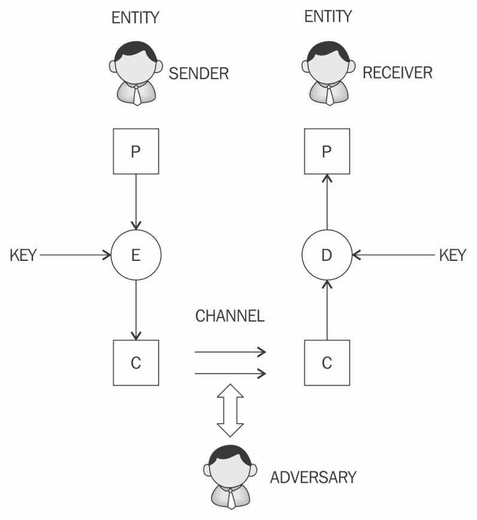

通用加密和解密模型

在前面的图表中，**P**，**E**，**C**和**D**分别表示明文，加密，密文和解密。同样基于这一模型，实体、发送方、接收方、对手、密钥和通道概念的解释如下：

+   **实体**：发送、接收或对数据执行操作的人或系统

+   **发送方**：传输数据的实体

+   **接收者**：接收数据的实体

+   **对手**：试图规避安全服务的实体

+   **密钥**：用于加密或解密其他数据的数据

+   **通道**：通道为实体之间提供通信媒介

接下来，我们将更详细地描述本章前面提到的密码学服务。

# 机密性

**机密性**是信息仅对授权实体可用的保证。

# 完整性

**完整性**是信息仅可由授权实体修改的保证。

# 认证

**认证**提供有关实体身份或消息有效性的保证。

有两种认证机制，即实体认证和数据源认证，将在下一节讨论。

# 实体认证

**实体认证**是确保实体当前正在通信会话中参与和活动的保证。传统上，用户被发放一个用户名和密码，用于访问他们正在使用的各种平台。这种做法被称为**单因素认证**，因为只涉及一个因素，即*你所知道的东西*，即密码和用户名。由于各种原因，例如密码泄露，这种类型的身份验证不是非常安全；因此，现在常用其他附加因素提供更好的安全性。使用附加技术进行用户识别称为**多因素认证**（如果只使用两种方法，则为双因素认证）。

这里描述了各种身份验证因素：

+   第一个因素是*你拥有的东西*，比如硬件令牌或智能卡。在这种情况下，用户可以使用硬件令牌以及登录凭据来访问系统。这种机制通过要求两个身份验证因素来保护用户。拥有硬件令牌并知道登录凭据的用户将能够访问系统。要获得系统访问权限，这两个因素都应该可用，从而使这种方法成为双因素认证机制。如果硬件令牌丢失，单独使用它将毫无用处，除非与硬件令牌一起使用*你所知道的东西*，即登录密码。

+   第二个因素是*你是的东西*，它使用生物特征来识别用户。使用这种方法，可以使用用户的指纹、视网膜、虹膜或手部几何来提供身份验证的额外因素。这样，可以确保用户确实在身份验证过程中出现，因为生物特征对每个人都是独特的。然而，需要谨慎实施以确保高水平的安全性，因为一些研究表明，在特定条件下，生物特征系统可以被规避。

# 数据来源认证

也称为*消息认证*，**数据来源认证**是确保信息来源确实经过验证的保证。数据来源认证保证了数据完整性，因为如果来源得到证实，那么数据必定没有被篡改。最常用的各种方法，如**消息认证码**（**MACs**）和数字签名将在本章后面详细解释。

# 不可否认性

**非否认**是一种保证，指的是实体无法通过提供无可辩驳的证据来否认先前的承诺或行动。它是一项安全服务，提供确凿证据表明特定活动已发生。在存在争议的情况下，这一属性至关重要，因为实体已否认执行的行动，例如在电子商务系统中下订单。该服务在电子交易中产生密码学证据，以便在争议情况下，可用作行动的确认。

非否认已经是一个活跃的研究领域多年。电子交易中的争议是一个常见问题，有必要解决这些问题，以提高消费者对此类服务的信心。

非否认协议通常在通信网络中运行，用于提供证据表明网络上的实体（发起者或接收者）已经采取了行动。在这种情况下，有两种通信模型可用于将消息从发起者*A*传输到接收者*B*：

+   一条消息直接从发起者*A*发送到接收者*B*。

+   一条消息从发起者*A*发送到交付代理，然后由交付代理将消息传递给接收者*B*。

非否认协议的主要要求是公平性、有效性和及时性。在许多情况下，一个交易涉及多个参与方，而不仅仅是两个当事方。例如，在电子交易系统中，可能存在许多实体，如清算代理、经纪人和交易员，它们可能参与一个交易。在这种情况下，双方非否认协议不适用。为了解决这个问题，已经开发了**多方非否认**（**MPNR**）协议。

# 可追究性

**可追究性**是一种保证，指的是影响安全性的行动可以追溯到责任方。这通常由系统中的日志记录和审计机制提供，在业务性质要求详细审计的系统中尤其重要，例如在电子交易系统中。详细的日志记录对于追踪实体的行动至关重要，例如在交易被记录在带有日期和时间戳的审计记录中，实体的身份被生成并保存在日志文件中。此日志文件可以选择加密，并且可以是数据库的一部分，也可以是系统上的独立 ASCII 文本日志文件。

为了提供前面讨论的所有服务，使用了不同的密码学原语，这些原语将在下一节中介绍。

# 密码学原语

**加密原语** 是安全协议或系统的基本构建模块。在接下来的章节中，您将了解到构建安全协议和系统所必需的加密算法。**安全协议** 是通过利用适当的安全机制来实现所需的安全目标的一系列步骤。目前使用各种类型的安全协议，如认证协议、不可否认协议和密钥管理协议。

加密原语的分类可以通过以下图示来进行可视化：

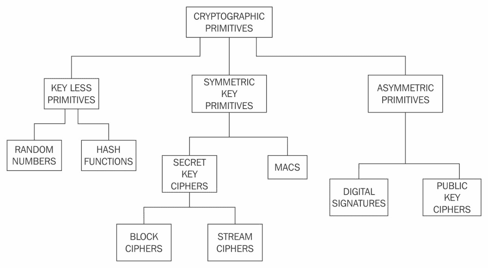

密码原语

如加密原语分类图所示，密码学主要分为两类：*对称密码学* 和 *非对称密码学*。

这些原语在下一节中进一步讨论。

# 对称密码学

**对称密码学** 指的是一种使用加密数据的密钥进行解密的类型的密码学，它也被称为 **共享密钥密码学**。密钥必须在通信各方之间进行数据交换之前建立或达成一致。这也是它被称为 **秘密密钥密码学** 的原因。

对称密码有两种类型：*流密码* 和 *块密码*。**数据加密标准** (**DES**) 和 **高级加密标准** (**AES**) 是块密码的典型示例，而 RC4 和 A5 通常用作流密码。

# 流密码

**流密码** 是加密算法，它将密钥流逐位应用于明文以使用密钥流进行加密（对每个位进行一次）。流密码有两种类型: *同步流密码* 和 *异步流密码*：

+   **同步流密码** 是那些密钥流仅依赖于密钥的密码

+   **异步流密码** 具有密钥流还依赖于加密数据

在流密码中，加密和解密是相同的功能，因为它们是简单的模 2 加法或异或操作。流密码的基本要求是密钥流的安全性和随机性。从伪随机数生成器到硬件实现的真随机数生成器等各种技术已经开发出来生成随机数，并且至关重要的是所有密钥生成器都是具有密码安全性的：

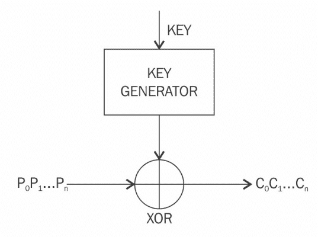

流密码的操作

# 块密码

**块密码** 是将要加密的文本（明文）分割成固定长度的数据块，然后逐块应用加密。块密码通常是使用一种被称为**费斯特尔密码**的设计策略构建的。最近的块密码，如 AES (Rijndael) 是使用被称为 **替代-置换网络** (**SPN**) 的替代和置换的组合来构建的。

费斯特尔密码基于由霍斯特·费斯特尔开发的费斯特尔网络。这种结构基于将多轮重复操作组合起来以实现称为*混淆*和*扩散*的理想密码学属性的思想。费斯特尔网络通过将数据分成两个块（左侧和右侧），并通过迭代使用带键的*轮函数*来处理这些块，以提供足够的伪随机排列。

混淆使得加密文本与明文之间的关系复杂化。这是通过替换实现的。在实践中，明文中的*A*被替换为加密文本中的*X*。在现代密码算法中，使用称为*S 盒*的查找表进行替换。扩散属性将明文统计地传播到加密数据中。这确保即使在输入文本中更改了单个位，也会导致至少改变（平均而言）密文中一半以上的位。混淆是为了使找到加密密钥变得非常困难，即使使用相同的密钥创建了许多加密和解密数据对也是如此。在实践中，这是通过换位或置换来实现的。

使用费斯特尔密码的一个主要优点是加密和解密操作几乎是相同的，只需要对加密过程进行反转即可实现解密。DES 是费斯特尔密码的一个主要示例：

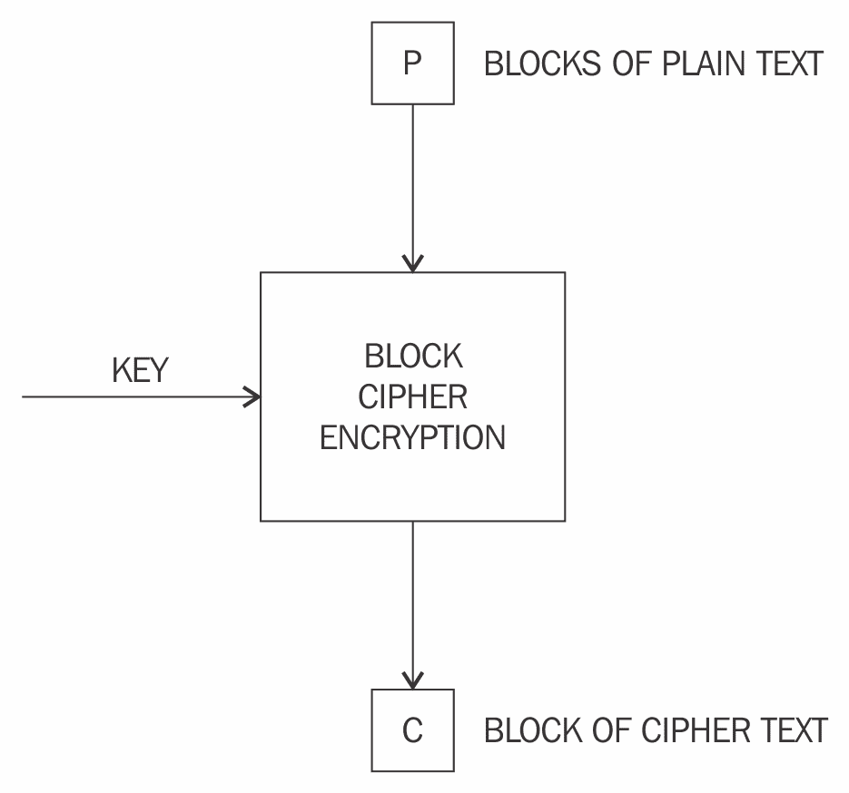

块密码的简化操作

用于块密码的各种操作模式包括**电码本**（**ECB**）、**密码块链接**（**CBC**）、**输出反馈**（**OFB**）模式和**计数器**（**CTR**）模式。这些模式用于指定加密函数应用于明文的方式。这里介绍了一些块密码加密模式。

# 块加密模式

在**块加密模式**中，明文根据使用的密码类型被分成固定长度的块，然后对每个块应用加密函数。

最常见的块加密模式在以下小节中简要讨论。

# 电码本

**电码本**（**ECB**）是一种基本的操作模式，其中加密数据是通过将加密算法逐个应用于每个明文块而产生的。这是最简单直接的模式，但不应在实践中使用，因为它是不安全的，并且可能会泄露信息：

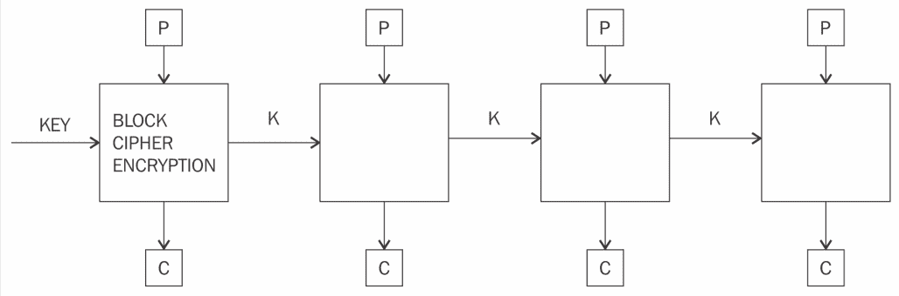

用于块密码的电码本模式

前面的图表显示，我们将明文**P**提供为输入到块密码加密函数，连同密钥**KEY**，并且生成了密文**C**作为输出。

# 密码块链接

在**密码块链**（**CBC**）模式中，每个明文块都与先前加密的块进行异或运算。CBC 模式使用**初始化向量**（**IV**）来加密第一个块。建议随机选择 IV：

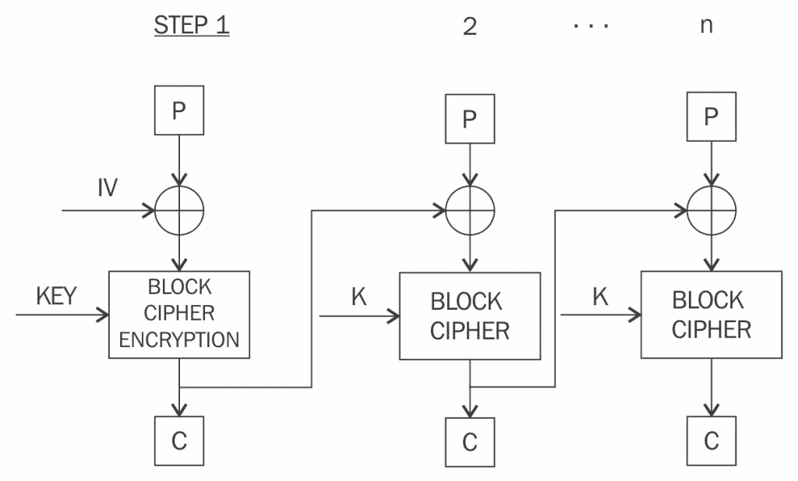

密码块链模式

# 计数器模式

**计数器**（**CTR**）模式有效地将块密码用作流密码。在这种情况下，提供一个唯一的随机数用于与计数器值连接以生成一个**密钥流**：

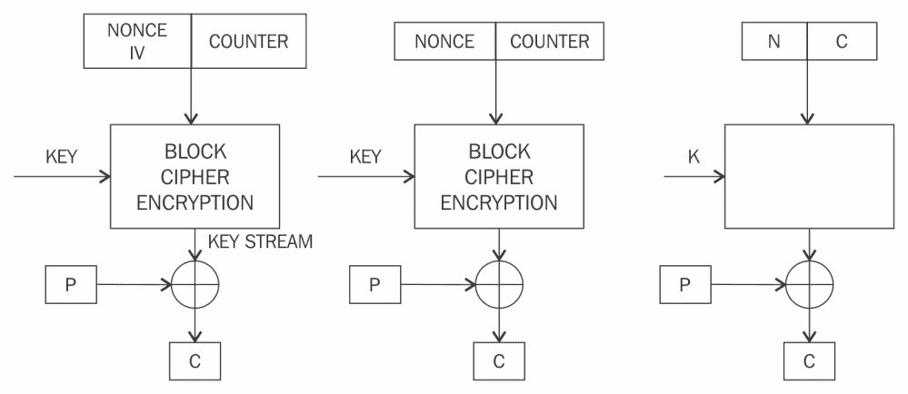

计数器模式

还有其他模式，如**密码反馈**（**CFB**）模式，**Galois 计数器**（**GCM**）模式和**输出反馈**（**OFB**）模式，它们在各种场景中也被使用。

# 密钥流生成模式

在**密钥流生成模式**中，加密函数生成一个密钥流，然后与明文流进行异或运算以实现加密。

# 消息认证模式

在**消息认证模式**中，通过加密函数生成一个**消息认证码**（**MAC**）。MAC 是一个提供完整性服务的密码校验和。使用块密码生成 MAC 的最常见方法是 CBC-MAC，其中链的最后一个块的一部分用作 MAC。例如，MAC 可用于确保消息是否被未经授权的实体修改。这可以通过使用 MAC 函数使用密钥加密消息来实现。一旦接收者接收到消息和消息的 MAC，就可以通过使用密钥再次加密接收到的消息并将结果与发送方接收到的 MAC 进行比较来检查消息和 MAC。如果它们匹配，则意味着消息没有被未经授权的用户修改，因此提供了完整性服务。如果它们不匹配，则意味着消息在传输过程中被未经授权的实体修改。

# 密码哈希模式

散列函数主要用于将消息压缩为固定长度的摘要。在**密码哈希模式**中，块密码被用作压缩函数以产生明文的哈希值。

有了这些，我们现在已经完成了对块密码的介绍。在接下来的部分中，你将会了解到一个目前市场主导的块密码的设计和机制，即 AES。

在讨论 AES 之前，我们先介绍一些关于**数据加密标准**（**DES**）的历史，这导致了新的 AES 标准的发展。

# 数据加密标准

**数据加密标准** (**DES**) 是由美国 **国家标准与技术研究所** (**NIST**) 作为加密标准算法引入的，并且在 1980 年代和 1990 年代广泛使用。 但是，由于技术和密码学研究的进步，它并没有表现出对暴力破解攻击的很强抵抗力。 例如，在 1998 年 7 月，**电子前沿基金会** (**EFF**) 使用一种称为 EFF DES 破解器（或 *Deep Crack*）的专用机器破解了 DES。

DES 仅使用 56 位密钥，引起了一些担忧。 这个问题在引入了 **Triple DES** (**3DES**) 后得到了解决，它提议使用三个 56 位密钥和 DES 算法相同次数的执行来使用 168 位密钥，从而几乎使暴力破解攻击变得不可能。 然而，其他限制，如性能缓慢和 64 位块大小，是不可取的。

# 高级加密标准

在 2001 年，在一次公开竞赛之后，由密码学家 Joan Daemen 和 Vincent Rijmen 发明的加密算法 Rijndael 被 NIST 标准化为 **Advanced Encryption Standard** (**AES**) 并进行了轻微修改。 到目前为止，尚未发现任何比暴力方法更有效的 AES 攻击。 Rijndael 的原始版本允许 128 位、192 位和 256 位的不同密钥和块大小。 然而，在 AES 标准中，仅允许 128 位块大小。 但是，允许 128 位、192 位和 256 位的密钥大小。

# AES 的工作原理

在 AES 算法处理期间，使用多个轮次修改称为 **state** 的 4 x 4 字节数组。 全部加密需要 10 到 14 轮，具体取决于密钥的大小。 以下表显示了密钥大小和所需轮次：

| **密钥大小** | **所需轮次** |
| --- | --- |
| 128 位 | 10 轮次 |
| 192 位 | 12 轮次 |
| 256 位 | 14 轮次 |

一旦状态用密码输入初始化，将在四个阶段执行四个操作来加密输入。 这些阶段是：`AddRoundKey`、`SubBytes`、`ShiftRows` 和 `MixColumns`：

1.  在 `AddRoundKey` 步骤中，状态数组与从主密钥派生的子密钥进行 XOR 运算

1.  `SubBytes` 是替换步骤，其中使用查找表（S-盒）来替换状态数组的所有字节

1.  `ShiftRows` 步骤用于将状态数组中的每一行向左移动，除了第一行外，以循环和递增的方式向左移动

1.  最后，在 `MixColumns` 步骤中，所有字节都以线性方式、按列混合。 

前述步骤描述了 AES 的一个轮次。

在最后一轮（取决于密钥大小的 10、12 或 14），将第 4 阶段替换为 `AddRoundKey` 以确保前三步不能简单地反转：

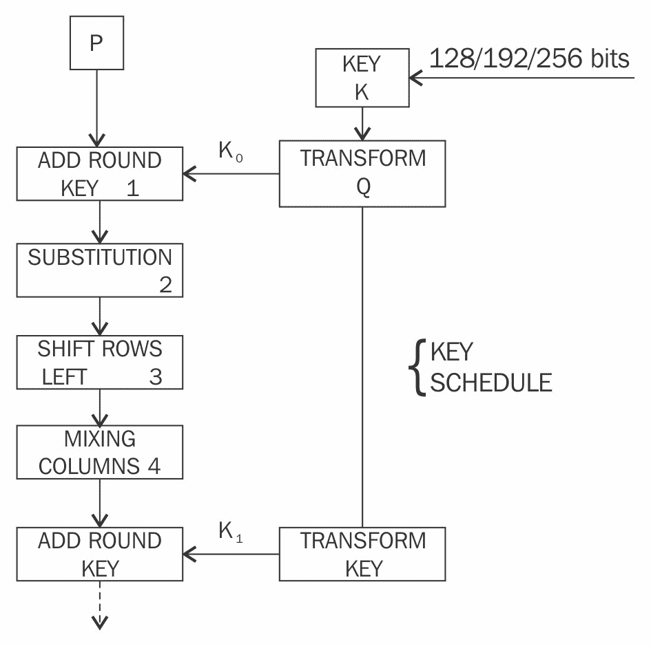

AES 块图，显示 AES 加密的第一轮。 在最后一轮中，不执行混合步骤

各种加密货币钱包使用 AES 加密来加密本地存储的数据。特别是在比特币钱包中，使用 AES-256 的 CBC 模式。

这是使用 AES 加密和解密的 OpenSSL 示例：

```
$ openssl enc -aes-256-cbc -in message.txt -out message.bin 
enter aes-256-cbc encryption password:
Verifying - enter aes-256-cbc encryption password:
$ ls -ltr

-rw-rw-r-- 1 drequinox drequinox 14 Sep 21 05:54 message.txt
-rw-rw-r-- 1 drequinox drequinox 32 Sep 21 05:57 message.bin
$ cat message.bin  
```

下面是`message.bin`文件的内容：

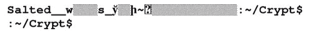

请注意，`message.bin`是一个二进制文件。有时，将此二进制文件编码为文本格式以实现兼容性/互操作性是可取的。以下命令可用于执行此操作：

```
$ openssl enc -base64 -in message.bin -out message.b64
$ ls -ltr
-rw-rw-r-- 1 drequinox drequinox 14 Sep 21 05:54 message.txt
-rw-rw-r-- 1 drequinox drequinox 32 Sep 21 05:57 message.bin
-rw-rw-r-- 1 drequinox drequinox 45 Sep 21 06:00 message.b64
$ cat message.b64
U2FsdGVkX193uByIcwZf0Z7J1at+4L+Fj8/uzeDAtJE=  
```

为了解密一个 AES 加密的文件，可以使用以下命令。使用前面示例中的`message.bin`作为示例：

```
$ openssl enc -d -aes-256-cbc -in message.bin -out message.dec 
enter aes-256-cbc decryption password:
$ ls -ltr
-rw-rw-r-- 1 drequinox drequinox 14 Sep 21 05:54 message.txt
-rw-rw-r-- 1 drequinox drequinox 32 Sep 21 05:57 message.bin
-rw-rw-r-- 1 drequinox drequinox 45 Sep 21 06:00 message.b64
-rw-rw-r-- 1 drequinox drequinox 14 Sep 21 06:06 message.dec
$ cat message.dec
Datatoencrypt  
```

机智的读者可能已经注意到，虽然在除了 ECB 以外的所有块加密操作模式中都需要提供 IV，但是没有提供 IV。原因是 OpenSSL 会自动从给定的密码中派生 IV。用户可以使用以下开关指定 IV：

```
-K/-iv      , (Initialization Vector) should be provided in Hex.  
```

为了从 base64 解码，使用以下命令。跟随前面示例中的`message.b64`文件：

```
$ openssl enc -d -base64 -in message.b64 -out message.ptx
$ ls -ltr
-rw-rw-r-- 1 drequinox drequinox 14 Sep 21 05:54 message.txt
-rw-rw-r-- 1 drequinox drequinox 32 Sep 21 05:57 message.bin
-rw-rw-r-- 1 drequinox drequinox 45 Sep 21 06:00 message.b64
-rw-rw-r-- 1 drequinox drequinox 14 Sep 21 06:06 message.dec
-rw-rw-r-- 1 drequinox drequinox 32 Sep 21 06:16 message.ptx 
$ cat message.ptx 
```

下面是`message.ptx`文件的内容：

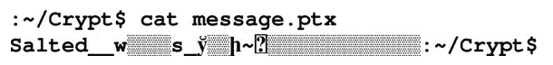

OpenSSL 支持许多类型的密码。您可以根据前面的示例来探索这些选项。支持的密码类型列表显示在以下屏幕截图中：

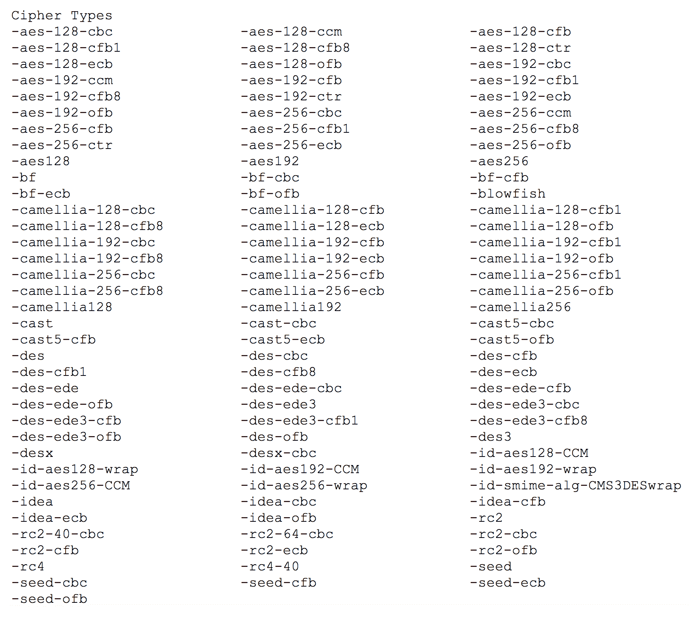

展示了 OpenSSL 中可用的丰富库选项的屏幕截图

OpenSSL 工具可用于对屏幕截图中显示的所有密码进行实验。

# 总结

在本章中，我们向您介绍了对称密钥加密。我们从基本的数学定义和密码原语开始。之后，我们向您介绍了流密码和块密码的概念，以及块密码的工作模式。此外，我们向您介绍了使用 OpenSSL 进行实际练习，以补充理论概念。

在下一章中，我们将介绍公钥密码学，这在区块链技术中被广泛使用，并具有非常有趣的属性。
