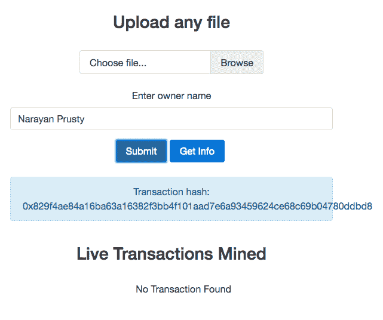
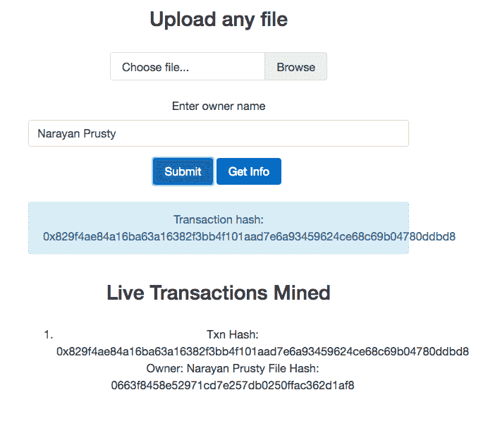

# 第七章：开始使用 web3.js

在本章中，我们将学习 web3.js 以及如何在 Node.js 或客户端 JavaScript 中导入、连接到 geth 并使用它。我们还将学习如何使用 web3.js 构建 web 客户端。

在本章中，我们将涵盖以下主题：

+   在 Node.js 和客户端 JavaScript 中导入 web3.js

+   连接到 geth

+   探索使用 web3.js 可以完成的各种事务

+   探索 web3.js 的各种最常用的 API

+   为所有权合同构建一个 Node.js 应用程序

# web3.js 介绍

web3.js 为我们提供了 JavaScript API，用于与 geth 通信。它在内部使用 JSON-RPC 与 geth 通信。web3.js 还可以与支持 JSON-RPC 的任何其他类型的以太坊节点通信。它将所有 JSON-RPC API 公开为 JavaScript API；也就是说，它不仅支持所有与以太坊相关的 API；还支持与 Whisper 和 Swarm 相关的 API。

随着我们构建各种项目，您将越来越了解 web3.js，但现在让我们先了解一下 web3.js 的一些最常用的 API，然后我们将使用 web3.js 为我们的所有权智能合同构建前端。

在撰写本文时，web3.js 的最新版本是 0.16.0。我们将针对该版本学习所有内容。

web3.js 托管在 [`github.com/ethereum/web3.js`](https://github.com/ethereum/web3.js)，完整的文档托管在 [`github.com/ethereum/wiki/wiki/JavaScript-API`](https://github.com/ethereum/wiki/wiki/JavaScript-API)。

# 导入 web3.js

要在 Node.js 中使用 web3.js，只需在项目目录中运行 `npm install web3`，然后在源代码中，可以使用 `require("web3");` 进行导入。

要在客户端 JavaScript 中使用 web3.js，可以将 `web3.js` 文件加入队列，该文件可以在项目源代码的 `dist` 目录中找到。现在你将全局可用的 `Web3` 对象。

# 连接节点

web3.js 可以使用 HTTP 或 IPC 与节点通信。我们将使用 HTTP 建立与节点的通信。web3.js 允许我们与多个节点建立连接。`web3` 的一个实例表示与一个节点的连接。该实例公开了 API。

当应用程序在 Mist 中运行时，它会自动使一个名为 `web3` 的实例可用，该实例连接到 mist 节点。实例的变量名是 `web3`。

这是连接到节点的基本代码：

```
if (typeof web3 !== 'undefined') { 
  web3 = new Web3(new Web3.providers.HttpProvider("http://localhost:8545")); 
} 
```

首先，在此处我们通过检查 `web3` 是否 `undefined` 来检查代码是否在 mist 中运行。如果 `web3` 已定义，则使用已有的实例；否则，通过连接到我们的自定义节点创建一个实例。如果要连接到自定义节点，而不管应用程序是否在 mist 中运行，请从上述代码中删除 `if` 条件。在这里，我们假设我们的自定义节点在本地运行，端口号为 `8545`。

`Web3.providers` 对象暴露了构造函数（在这个上下文中称为提供程序），用于使用各种协议建立连接和传输消息。`Web3.providers.HttpProvider` 让我们建立 HTTP 连接，而 `Web3.providers.IpcProvider` 让我们建立 IPC 连接。

`web3.currentProvider` 属性会自动分配给当前提供程序实例。创建 web3 实例后，你可以使用 `web3.setProvider()` 方法更改其提供程序。它接受一个参数，即新提供程序的实例。

请记住，geth 默认禁用 HTTP-RPC。因此，在运行 geth 时通过传递 `--rpc` 选项来启用它。默认情况下，HTTP-RPC 在端口 8545 上运行。

`web3` 暴露了一个 `isConnected()` 方法，用于检查是否连接到节点。根据连接状态，它返回 `true` 或 `false`。

# API 结构

`web3` 包含一个专门用于以太坊区块链交互的 `eth` 对象 (`web3.eth`) 和一个用于 whisper 交互的 `shh` 对象 (`web3.shh`)。web3.js 的大多数 API 都在这两个对象内部。

所有的 API 默认都是同步的。如果你想发出异步请求，你可以将可选的回调作为大多数函数的最后一个参数传递。所有回调都使用错误优先的回调风格。

一些 API 对异步请求有别名。例如，`web3.eth.coinbase()` 是同步的，而 `web3.eth.getCoinbase()` 是异步的。

这是一个示例：

```

//sync request 
try 
{ 
  console.log(web3.eth.getBlock(48)); 
} 
catch(e) 
{ 
  console.log(e); 
} 

//async request 
web3.eth.getBlock(48, function(error, result){ 
    if(!error) 
        console.log(result) 
    else 
        console.error(error); 
}) 
```

`getBlock` 用于通过其编号或哈希获取区块的信息。或者，它可以接受字符串，如 `"earliest"`（创世区块），`"latest"`（区块链的顶部区块）或 `"pending"`（正在挖掘的区块）。如果不传递参数，则默认为 `web3.eth.defaultBlock`，默认为 `"latest"`。

所有需要区块标识作为输入的 API 如果没有传递值，则默认使用 `web3.eth.defaultBlock`。

# BigNumber.js

JavaScript 在正确处理大数字方面天生能力较弱。因此，需要处理大数字并进行精确计算的应用程序使用 `BigNumber.js` 库来处理大数字。

web3.js 也依赖于 BigNumber.js。它会自动添加它。web3.js 总是返回 `BigNumber` 对象作为数字值。它可以接受 JavaScript 数字、数字字符串和 `BigNumber` 实例作为输入。

这里是一个示例来说明这一点：

```
web3.eth.getBalance("0x27E829fB34d14f3384646F938165dfcD30cFfB7c").toString(); 
```

在这里，我们使用 `web3.eth.getBalance()` 方法来获取地址的余额。该方法返回一个 `BigNumber` 对象。我们需要在 `BigNumber` 对象上调用 `toString()` 来将其转换为数字字符串。

`BigNumber.js` 无法正确处理具有超过 20 个浮点数字的数字；因此，建议您将余额存储在 wei 单位中，而在显示时将其转换为其他单位。web3.js 本身始终以 wei 单位返回和接受余额。例如，`getBalance()` 方法以 wei 单位返回地址的余额。

# 单位转换

web3.js 提供了将 wei 余额转换为任何其他单位以及将任何其他单位余额转换为 wei 的 API。

`web3.fromWei()` 方法用于将 wei 数字转换为任何其他单位，而 `web3.toWei()` 方法用于将任何其他单位中的数字转换为 wei。以下是演示此功能的示例：

```
web3.fromWei("1000000000000000000", "ether"); 
web3.toWei("0.000000000000000001", "ether"); 
```

在第一行中，我们将 wei 转换为 ether，在第二行中，我们将 ether 转换为 wei。两种方法中的第二个参数可以是以下字符串之一：

+   `kwei/ada`

+   `mwei/babbage`

+   `gwei/shannon`

+   `szabo`

+   `finney`

+   `ether`

+   `kether/grand/einstein`

+   `mether`

+   `gether`

+   `tether`

# 检索 gas 价格、余额和交易详情

让我们看一下获取 gas 价格、地址余额和已挖掘交易信息的 API：

```
//It's sync. For async use getGasPrice 
console.log(web3.eth.gasPrice.toString()); 

console.log(web3.eth.getBalance("0x407d73d8a49eeb85d32cf465507dd71d507100c1", 45).toString()); 

console.log(web3.eth.getTransactionReceipt("0x9fc76417374aa880d4449a1f7f31ec597f00b1f6f3dd2d66f4c9c6c445836d8b")); 
```

输出将采用以下形式：

```
20000000000 
30000000000 
{ 
  "transactionHash": "0x9fc76417374aa880d4449a1f7f31ec597f00b1f6f3dd2d66f4c9c6c445836d8b ", 
  "transactionIndex": 0, 
  "blockHash": "0xef95f2f1ed3ca60b048b4bf67cde2195961e0bba6f70bcbea9a2c4e133e34b46", 
  "blockNumber": 3, 
  "contractAddress": "0xa94f5374fce5edbc8e2a8697c15331677e6ebf0b", 
  "cumulativeGasUsed": 314159, 
  "gasUsed": 30234 
} 
```

以下是前述方法的工作原理：

+   `web3.eth.gasPrice()`: 通过最近 x 个区块的中位 gas 价格确定 gas 价格。

+   `web3.eth.getBalance()`: 返回给定地址的余额。所有哈希应该以十六进制字符串的形式提供给 web3.js API，而不是十六进制文字。对于 solidity `address` 类型的输入，也应该是十六进制字符串。

+   `web3.eth.getTransactionReceipt()`: 这用于使用其哈希获取有关交易的详细信息。如果在区块链中找到了交易，则返回交易收据对象；否则返回 `null`。交易收据对象包含以下属性：

    +   `blockHash`: 此交易所在的区块的哈希

    +   `blockNumber`: 此交易所在的区块号

    +   `transactionHash`: 交易的哈希

    +   `transactionIndex`: 该交易在区块中的事务索引位置的整数

    +   `from`: 发件人的地址

    +   `to`: 收件人的地址；当它是合约创建交易时为 `null`

    +   `cumulativeGasUsed`: 该交易在区块中执行时使用的总 gas 量

    +   `gasUsed`: 仅此特定交易使用的 gas 量

    +   `contractAddress`: 如果交易是合约创建，则为创建的合约地址；否则为 null

    +   `logs`: 此交易生成的日志对象数组

# 发送以太币

让我们看看如何向任何地址发送以太币。要发送以太币，你需要使用 `web3.eth.sendTransaction()` 方法。这个方法可以用来发送任何类型的交易，但大多数情况下用于发送以太币，因为使用该方法部署合约或调用合约方法很麻烦，因为它需要你生成交易数据而不是自动生成。它接受一个具有以下属性的交易对象：

+   `from`：发送账户的地址。如果未指定，则使用 `web3.eth.defaultAccount` 属性。

+   `to`：这是可选的。这是消息的目标地址，在创建合约交易时保持未定义。

+   `value`：这是可选的。这是以 wei 为单位的交易中转的价值，以及如果是合约创建交易的话就是捐赠。

+   `gas`：这是可选的。这是用于交易的气体数量（未使用的气体将被退还）。如果未提供，则会自动确定。

+   `gasPrice`：这是可选的。这是以 wei 为单位的交易的燃气价格，默认为网络平均燃气价格。

+   `data`：这是可选的。它是一个包含消息关联数据的字节字符串，或者在创建合约交易的情况下是初始化代码。

+   `nonce`：这是可选的。这是一个整数。每个交易都与一个 nonce 相关联。一个 nonce 是一个计数器，表示发送交易的发送者发送的交易数量。如果未提供，则会自动确定。它有助于防止重放攻击。这个 nonce 不是与一个区块相关联的 nonce。如果我们使用的 nonce 大于交易应该具有的 nonce，那么交易将被放入队列，直到其他交易到达。例如，如果下一个交易的 nonce 应该是 4，而我们设置了 nonce 为 10，那么 geth 将等待中间的六个交易到达，然后再广播此交易。具有 nonce 10 的交易称为排队交易，它不是挂起交易。

让我们看一个向地址发送以太币的示例：

```
var txnHash = web3.eth.sendTransaction({ 
  from: web3.eth.accounts[0], 
  to: web3.eth.accounts[1], 
  value: web3.toWei("1", "ether") 
}); 
```

在这里，我们从账户编号为 0 的账户向账户编号为 1 的账户发送一个以太币。确保在运行 geth 时两个账户都已解锁，使用 `unlock` 选项。在 geth 交互式控制台中，它会提示输入密码，但在交互式控制台之外使用 web3.js API 时，如果账户被锁定，会抛出错误。该方法返回交易的交易哈希。然后你可以使用 `getTransactionReceipt()` 方法来检查交易是否被挖掘。

你也可以在运行时使用 `web3.personal.listAccounts()`、`web3.personal.unlockAccount(addr, pwd)` 和 `web3.personal.newAccount(pwd)` API 来管理账户。

# 与合约交互

让我们学习如何部署一个新的合约，使用它的地址获取已部署合约的引用，向合约发送以太币，发送交易来调用合约方法，并估算方法调用的 gas。

要部署一个新合约或获取对已部署合约的引用，你首先需要使用`web3.eth.contract()`方法创建一个合约对象。它将合约 ABI 作为参数，并返回合约对象。

这是创建合约对象的代码：

```
var proofContract = web3.eth.contract([{"constant":false,"inputs":[{"name":"fileHash","type":"string"}],"name":"get","outputs":[{"name":"timestamp","type":"uint256"},{"name":"owner","type":"string"}],"payable":false,"type":"function"},{"constant":false,"inputs":[{"name":"owner","type":"string"},{"name":"fileHash","type":"string"}],"name":"set","outputs":[],"payable":false,"type":"function"},{"anonymous":false,"inputs":[{"indexed":false,"name":"status","type":"bool"},{"indexed":false,"name":"timestamp","type":"uint256"},{"indexed":false,"name":"owner","type":"string"},{"indexed":false,"name":"fileHash","type":"string"}],"name":"logFileAddedStatus","type":"event"}]); 
```

一旦你有了合约，你可以使用合约对象的`new`方法部署它，或者使用`at`方法获取与 ABI 匹配的已部署合约的引用。

让我们看一个部署新合约的例子：

```
var proof = proofContract.new({ 
     from: web3.eth.accounts[0],  
     data: "0x606060405261068...",  
     gas: "4700000" 
    },  
    function (e, contract){ 
    if(e) 
    { 
    console.log("Error " + e);     
}     
else if(contract.address != undefined) 
  {     
    console.log("Contract Address: " + contract.address);     
   }     
else      
  {     
    console.log("Txn Hash: " + contract.transactionHash)     
  } 
}) 
```

这里，`new`方法是异步调用的，所以如果交易被成功创建和广播，回调函数会被触发两次。第一次，在交易被广播后调用，第二次，在交易被挖掘后调用。如果你不提供回调函数，那么`proof`变量的`address`属性将被设置为`undefined`。一旦合约被挖掘，`address`属性将被设置。

在`proof`合约中，没有构造函数，但如果有构造函数，则构造函数的参数应放在`new`方法的开头。我们传递的对象包含来自地址、合约的字节码和要使用的最大 gas。这三个属性必须存在；否则，交易将不会被创建。这个对象可以具有传递给`sendTransaction()`方法的对象中存在的属性，但这里，`data`是合约的字节码，`to`属性被忽略。

你可以使用`at`方法来获取一个已经部署的合约的引用。这里是演示这一点的代码：

```
var proof = proofContract.at("0xd45e541ca2622386cd820d1d3be74a86531c14a1"); 
```

现在让我们看看如何发送交易来调用合约的方法。这里有一个示例来演示这一点：

```
proof.set.sendTransaction("Owner Name", "e3b0c44298fc1c149afbf4c8996fb92427ae41e4649b934ca495991b7852b855", { 

from: web3.eth.accounts[0], 
}, function(error, transactionHash){ 

if (!err) 

console.log(transactionHash); 
}) 
```

这里，我们调用方法同名的对象的`sendTransaction`方法。传递给此`sendTransaction`方法的对象具有与`web3.eth.sendTransaction()`相同的属性，除了`data`和`to`属性被忽略。

如果你想要在节点本身上调用一个方法而不是创建一个交易并广播它，那么你可以使用`call`而不是`sendTransaction`。这里有一个示例来演示这一点：

```
var returnValue = proof.get.call("e3b0c44298fc1c149afbf4c8996fb92427ae41e4649b934ca495991b7852b855"); 
```

有时，有必要找出调用方法所需的 gas，以便决定是否调用它。`web3.eth.estimateGas`可以用于此目的。然而，直接使用`web3.eth.estimateGas()`需要你生成交易的数据；因此，我们可以使用同名方法对象的`estimateGas()`方法。这里有一个示例来演示这一点：

```
var estimatedGas = proof.get.estimateGas("e3b0c44298fc1c149afbf4c8996fb92427ae41e4649b934ca495991b7852b855"); 
```

如果你只想向合约发送一些以太币而不调用任何方法，那么你可以简单地使用`web3.eth.sendTransaction`方法。

# 检索和监听合约事件

现在让我们看一下如何监听合约中的事件。监听事件非常重要，因为通过事务调用的方法返回结果通常是通过触发事件来获取的。

在我们深入讨论如何检索和监听事件之前，我们需要学习事件的索引参数。一个事件最多可以有三个参数具有`indexed`属性。此属性用于向节点发出索引信号，以便应用客户端可以搜索具有匹配返回值的事件。如果不使用索引属性，那么将不得不从节点检索所有事件并过滤所需的事件。例如，你可以这样编写`logFileAddedStatus`事件：

```
event logFileAddedStatus(bool indexed status, uint indexed timestamp, string owner, string indexed fileHash); 
```

以下是一个示例，演示如何监听合约事件：

```
var event = proof.logFileAddedStatus(null, { 
fromBlock: 0, 
toBlock: "latest" 
}); 
event.get(function(error, result){ 
if(!error) 
{ 
  console.log(result); 
} 
else 
{ 
  console.log(error); 
} 
}) 
event.watch(function(error, result){ 
if(!error) 
{ 
  console.log(result.args.status); 
} 
else 
{ 
  console.log(error); 
} 
}) 
setTimeout(function(){ 
event.stopWatching(); 
}, 60000) 
 var events = proof.allEvents({ 
fromBlock: 0, 
 toBlock: "latest" 
}); 
events.get(function(error, result){ 
if(!error) 
{ 
  console.log(result); 
} 
else 
{ 
  console.log(error); 
} 
}) 
events.watch(function(error, result){ 
if(!error) 
{ 
  console.log(result.args.status); 
} 
else 
{ 
  console.log(error); 
} 
}) 
setTimeout(function(){ 
events.stopWatching(); 
}, 60000)
```

这就是上述代码的工作方式：

1.  首先，通过在合约实例上调用同名事件的方法来获取事件对象。此方法使用两个对象作为参数，用于过滤事件：

    +   第一个对象用于通过索引返回值过滤事件：例如，`{'valueA': 1, 'valueB': [myFirstAddress, mySecondAddress]}`。默认情况下，所有过滤值都设置为`null`。这意味着它们将匹配来自该合约的给定类型的任何事件。

    +   下一个对象可以包含三个属性：`fromBlock`（最早的块；默认为`"latest"`）、`toBlock`（最新的块；默认为`"latest"`）和`address`（只从中获取日志的地址列表；默认为合约地址）。

1.  `event`对象公开了三种方法：`get`、`watch`和`stopWatching`。`get`用于获取块范围内的所有事件。`watch`类似于`get`，但在获取事件后会监视更改。`stopWatching`可用于停止监视更改。

1.  然后，我们有合约实例的`allEvents`方法。它用于检索合约的所有事件。

1.  每个事件都由一个包含以下属性的对象表示：

    +   `args`：一个带有事件参数的对象

    +   `event`：表示事件名称的字符串

    +   `logIndex`：表示块中日志索引位置的整数

    +   `transactionIndex`：表示日志创建的交易索引位置的整数

    +   `transactionHash`：表示创建此日志的交易哈希的字符串

    +   `address`：表示此日志来源地址的字符串

    +   `blockHash`：表示此日志所在块的哈希的字符串；其状态为挂起时为`null`

    +   `blockNumber`：表示此日志所在块的块号；其状态为挂起时为`null`

web3.js 提供了一个`web3.eth.filter` API 来检索和监听事件。你可以使用这个 API，但是较早方法处理事件的方式更容易。你可以在[`github.com/ethereum/wiki/wiki/JavaScript-API#web3ethfilter`](https://github.com/ethereum/wiki/wiki/JavaScript-API#web3ethfilter)了解更多相关信息。

# 构建所有权合约的客户端

现在，是时候为我们的智能合约构建一个客户端，以便用户可以轻松使用它了。

我们将构建一个客户端，用户选择一个文件并输入所有者详细信息，然后点击提交来广播一个交易以调用合约的`set`方法，其中包含文件哈希和所有者的详细信息。一旦交易成功广播，我们将显示交易哈希。用户还将能够选择一个文件，并从智能合约获取所有者的详细信息。客户端还将实时显示最近的`set`交易。

我们将在前端使用 sha1.js 获取文件的哈希值，jQuery 用于 DOM 操作，Bootstrap 4 创建响应式布局。我们将在后端使用 express.js 和 web3.js。我们将使用 socket.io，以便后端在前端每隔一段时间后自动推送最近挖掘的交易，而无需前端请求数据。

web3.js 可以在前端使用。但对于这个应用程序来说，这将是一个安全风险；也就是说，我们正在使用存储在 geth 中的账户，并将 geth 节点 URL 暴露给前端，这将使这些账户中存储的以太币面临风险。

# 项目结构

在本章的练习文件中，你会找到两个目录：`Final`和`Initial`。`Final`包含项目的最终源代码，而`Initial`包含了空的源代码文件和库，可以快速开始构建应用程序。

要测试`Final`目录，你需要在其中运行`npm install`并将`app.js`中的硬编码的合约地址替换为部署合约后得到的合约地址。然后，在`Final`目录中使用`node app.js`命令运行应用程序。

在`Initial`目录中，你会找到一个`public`目录和两个名为`app.js`和`package.json`的文件。`package.json`包含了我们应用程序的后端依赖项，`app.js`是你将放置后端源代码的地方。

`public`目录包含与前端相关的文件。在`public/css`中，你会找到`bootstrap.min.css`，这是 Bootstrap 库；在`public/html`中，你会找到`index.html`，其中包含我们应用程序的 HTML 代码；在`public/js`目录中，你会找到 jQuery、sha1 和 socket.io 的 JS 文件。在`public/js`中，你还会找到一个`main.js`文件，其中包含我们应用程序的前端 JS 代码。

# 构建后端

让我们首先构建应用程序的后端。首先，在`Initial`目录中运行`npm install`以安装我们后端所需的依赖项。在我们开始编写后端代码之前，请确保 geth 正在运行并启用了 rpc。如果你正在私有网络上运行 geth，则确保也启用了挖矿。最后，请确保账户 0 存在并已解锁。你可以在启用了 rpc 和挖矿并解锁账户 0 的私有网络上运行 geth：

```
geth --dev --mine --rpc --unlock=0
```

在开始编码之前，您需要做的最后一件事是使用我们在第四章中看到的代码部署所有权合同，并复制合同地址。

现在让我们创建一个单一服务器，该服务器将向浏览器提供 HTML，并接受 `socket.io` 连接：

```
var express = require("express");   
var app = express();   
var server = require("http").createServer(app); 
var io = require("socket.io")(server); 
server.listen(8080); 
```

在这里，我们将 `express` 和 `socket.io` 服务器集成到一个运行在 `8080` 端口的服务器中。

现在让我们创建路由来提供静态文件以及应用程序的主页。以下是执行此操作的代码：

```
app.use(express.static("public")); 
app.get("/", function(req, res){  
  res.sendFile(__dirname + "/public/html/index.html"); 
}) 
```

在这里，我们使用 `express.static` 中间件来提供静态文件。我们要求它在 `public` 目录中查找静态文件。

现在让我们连接到 `geth` 节点，并获取已部署合同的引用，以便我们可以发送交易并监视事件。以下是执行此操作的代码：

```
var Web3 = require("web3"); 

web3 = new Web3(new Web3.providers.HttpProvider("http://localhost:8545")); 

var proofContract = web3.eth.contract([{"constant":false,"inputs":[{"name":"fileHash","type":"string"}],"name":"get","outputs":[{"name":"timestamp","type":"uint256"},{"name":"owner","type":"string"}],"payable":false,"type":"function"},{"constant":false,"inputs":[{"name":"owner","type":"string"},{"name":"fileHash","type":"string"}],"name":"set","outputs":[],"payable":false,"type":"function"},{"anonymous":false,"inputs":[{"indexed":false,"name":"status","type":"bool"},{"indexed":false,"name":"timestamp","type":"uint256"},{"indexed":false,"name":"owner","type":"string"},{"indexed":false,"name":"fileHash","type":"string"}],"name":"logFileAddedStatus","type":"event"}]); 

var proof = proofContract.at("0xf7f02f65d5cd874d180c3575cb8813a9e7736066"); 
```

代码很简单明了。只需用您获取的合同地址替换原合同地址即可。

现在让我们创建路由来广播交易并获取有关文件的信息。以下是执行此操作的代码：

```
app.get("/submit", function(req, res){ 
var fileHash = req.query.hash; 
var owner = req.query.owner; 
proof.set.sendTransaction(owner, fileHash, { 
from: web3.eth.accounts[0], 
}, function(error, transactionHash){ 
if (!error) 
{
  res.send(transactionHash); 
} 
else 
{ 
  res.send("Error"); 
} 
}) 
}) 
app.get("/getInfo", function(req, res){ 
var fileHash = req.query.hash; 
var details = proof.get.call(fileHash); 
res.send(details); 
}) 
```

在这里，`/submit` 路由用于创建和广播交易。一旦我们得到交易哈希，我们就将其发送到客户端。我们没有做任何等待交易挖掘的操作。`/getInfo` 路由调用节点上合同的 get 方法，而不是创建交易。它只是发送回收到的任何响应。

现在让我们监听来自合同的事件并将其广播给所有客户端。以下是执行此操作的代码：

```
proof.logFileAddedStatus().watch(function(error, result){ 
if(!error) 
{ 
  if(result.args.status == true) 
  { 
    io.send(result); 
  } 
} 
}) 
```

在这里，我们检查状态是否为 true，如果为 true，则只广播事件给所有连接的 `socket.io` 客户端。

# 构建前端

让我们从应用程序的 HTML 开始。将此代码放入 `index.html` 文件中：

```
<!DOCTYPE html> 
<html lang="en"> 
    <head> 
        <meta name="viewport" content="width=device-width, initial-scale=1, shrink-to-fit=no"> 
        <link rel="stylesheet" href="/css/bootstrap.min.css"> 
    </head> 
    <body> 
        <div class="container"> 
            <div class="row"> 
                <div class="col-md-6 offset-md-3 text-xs-center"> 
                    <br> 
                    <h3>Upload any file</h3> 
                    <br> 
                    <div> 
                        <div class="form-group"> 
                            <label class="custom-file text-xs-left"> 
                                <input type="file" id="file" class="custom-file-input"> 
                                <span class="custom-file-control"></span> 
                            </label> 
                        </div> 
                        <div class="form-group"> 
                            <label for="owner">Enter owner name</label> 
                            <input type="text" class="form-control" id="owner"> 
                        </div> 
                        <button onclick="submit()" class="btn btn-primary">Submit</button> 
                        <button onclick="getInfo()" class="btn btn-primary">Get Info</button>  
                        <br><br> 
                        <div class="alert alert-info" role="alert" id="message"> 
                            You can either submit file's details or get information about it. 
                        </div> 
                    </div> 
                </div> 
            </div> 
            <div class="row"> 
                <div class="col-md-6 offset-md-3 text-xs-center"> 
                    <br> 
                    <h3>Live Transactions Mined</h3> 
                    <br> 
                    <ol id="events_list">No Transaction Found</ol> 
                </div> 
            </div> 
        </div> 
        <script type="text/javascript" src="img/sha1.min.js"></script> 
        <script type="text/javascript" src="img/jquery.min.js"></script> 
        <script type="text/javascript" src="img/socket.io.min.js"></script> 
        <script type="text/javascript" src="img/main.js"></script> 
    </body> 
</html> 
```

以下是代码的工作原理：

1.  首先，我们显示 Bootstrap 的文件输入字段，以便用户可以选择文件。

1.  然后，我们显示一个文本字段，用户可以在其中输入所有者的详细信息。

1.  然后，我们有两个按钮。第一个按钮用于将文件哈希和所有者的详细信息存储在合同中，第二个按钮用于从合同获取文件信息。单击提交按钮会触发 `submit()` 方法，而单击获取信息按钮会触发 `getInfo()` 方法。

1.  然后，我们有一个警报框用于显示消息。

1.  最后，我们显示一个有序列表，以显示用户在页面上的时间内获得的合同交易。

现在让我们为 `getInfo()` 和 `submit()` 方法编写实现，与服务器建立 `socket.io` 连接，并监听来自服务器的 `socket.io` 消息。以下是执行此操作的代码。将此代码放在 `main.js` 文件中：

```
  function submit() 
  { 
    var file = document.getElementById("file").files[0]; 
    if(file) 
  { 
   var owner = document.getElementById("owner").value; 
   if(owner == "") 
  { 
   alert("Please enter owner name"); 
  } 
 else 
 { 
  var reader = new FileReader(); 
  reader.onload = function (event) { 
  var hash = sha1(event.target.result); 
  $.get("/submit?hash=" + hash + "&owner=" + owner, function(data){ 
  if(data == "Error") 
  {  
    $("#message").text("An error occured."); 
  } 
  else 
  { 
    $("#message").html("Transaction hash: " + data); 
  } 
  }); 
  }; 
  reader.readAsArrayBuffer(file); 
   } 
} 
  else 
  { 
    alert("Please select a file"); 
  } 
} 
function getInfo() 
{ 
  var file = document.getElementById("file").files[0]; 
  if(file) 
  { 
    var reader = new FileReader(); 
    reader.onload = function (event) { 
    var hash = sha1(event.target.result); 
    $.get("/getInfo?hash=" + hash, function(data){ 
    if(data[0] == 0 && data[1] == "") 
    { 
      $("#message").html("File not found"); 
    } 
    else 
    { 
      $("#message").html("Timestamp: " + data[0] + " Owner: " + data[1]); 
    }   
  }); 
}; 
reader.readAsArrayBuffer(file); 
} 
else 
  { 
    alert("Please select a file"); 
  } 
} 
var socket = io("http://localhost:8080"); 
socket.on("connect", function () { 
socket.on("message", function (msg) { 
if($("#events_list").text() == "No Transaction Found") 
{ 
    $("#events_list").html("<li>Txn Hash: " + msg.transactionHash + "nOwner: " + msg.args.owner + "nFile Hash: " + msg.args.fileHash + "</li>"); 
} 
else  
{ 
  $("#events_list").prepend("<li>Txn Hash: " + msg.transactionHash + "nOwner: " + msg.args.owner + "nFile Hash: " + msg.args.fileHash + "</li>"); 
} 
  }); 
}); 
```

这就是上述代码的工作原理：

1.  首先，我们定义了`submit()`方法。在`submit`方法中，我们确保选择了一个文件并且文本字段不为空。然后，我们将文件内容读取为数组缓冲区，并将数组缓冲区传递给由 sha1.js 暴露的`sha1()`方法，以获取数组缓冲区内的内容的哈希。一旦我们有了哈希，我们就使用 jQuery 发送 AJAX 请求到`/submit`路由，然后在警告框中显示交易哈希。

1.  我们接下来定义`getInfo()`方法。首先确保选择了文件。然后，生成像之前生成的那样的哈希，并向`/getInfo`端点发出请求以获取有关该文件的信息。

1.  最后，我们使用由`socket.io`库暴露的`io()`方法建立了`socket.io`连接。然后，我们等待触发连接事件，该事件指示已建立连接。连接建立后，我们监听来自服务器的消息，并向用户显示有关交易的详细信息。

我们不将文件存储在以太坊区块链中，因为存储文件非常昂贵，需要大量的 gas。对于我们的情况，实际上不需要存储文件，因为网络中的节点将能够看到文件；因此，如果用户希望保持文件内容的机密性，那么他们将无法做到。我们应用的目的只是证明对文件的所有权，而不是像云服务一样存储和提供文件。

# 测试客户端

现在运行`app.js`节点以运行应用程序服务器。打开您喜欢的浏览器并访问`http://localhost:8080/`。您将在浏览器中看到此输出：


现在选择一个文件并输入所有者的名称，然后点击提交。屏幕将变成这样：



在这里，您可以看到交易哈希被显示出来。现在等待交易被挖掘。一旦交易被挖掘，您将能够在实时交易列表中看到交易。屏幕会是这样的：



现在再次选择相同的文件，然后单击获取信息按钮。您将看到此输出：


在这里，您可以看到时间戳和所有者的详细信息。现在我们已经完成了第一个 DApp 的客户端构建。

# 概要

在本章中，我们首先通过示例了解了 web3.js 的基础知识。我们学习了如何连接到节点，基本的 API，发送各种类型的交易和监视事件。最后，我们为我们的所有权合同构建了一个适当的生产使用客户端。现在您将可以轻松编写智能合约并为其构建 UI 客户端，以便简化其使用。

在第九章中，我们将构建一个钱包服务，用户可以轻松地创建和管理以太坊钱包，而且还是离线的。我们将专门使用 LightWallet 库来实现这一点。
