# 第八章：引入比特币

比特币是区块链技术的第一个应用。在本章中，你将详细介绍比特币技术。

比特币通过引入第一个完全去中心化的数字货币，并且从网络和协议的角度证明了极其安全和稳定，引发了一场革命。作为一种货币，比特币非常不稳定和高度波动，尽管它很有价值。我们将在本章后面解释这一点。这也激发了学术和工业研究的浓厚兴趣，并引入了许多新的研究领域。

自 2008 年由中本聪引入以来，比特币已经获得了巨大的 popularity，并且目前是世界上最成功的数字货币，有数十亿美元投资于其中。在撰写本文时，该货币的当前市值为$149, 984, 293, 122。它的流行也从用户和投资者的数量、比特币价格的增长、每天与比特币相关的新闻以及提供基于比特币的在线交易的初创公司和公司的数量等方面表现出来，现在还在 **芝加哥商品交易所** (**CME**) 上作为 *比特币期货* 进行交易。

有兴趣的读者可以在 [`www.cmegroup.com/trading/bitcoin-futures.html`](http://www.cmegroup.com/trading/bitcoin-futures.html) 阅读更多关于 *比特币期货* 的信息。

比特币发明者 *中本聪* 的名字被认为是一个化名，因为比特币发明者的真实身份是未知的。它建立在几十年来在密码学、数字货币和分布式计算领域的研究基础之上。下面将介绍一个简要的历史，以便了解比特币发明背后的基础。

数字货币一直是许多年来的一个活跃研究领域。早期提议创建数字现金可以追溯到上世纪 80 年代初。1982 年，计算机科学家和密码学家大卫·乔姆提出了一种使用盲签名构建不可追踪数字货币的方案。这项研究发表在一篇名为 *不可追踪支付的盲签名* 的研究论文中。

有兴趣的读者可以阅读大卫·乔姆（David Chaum）在原始研究论文中描述他的盲签名密码学原语发明的原始论文，网址为 [`www.hit.bme.hu/~buttyan/courses/BMEVIHIM219/2009/Chaum.BlindSigForPayment.1982.PDF`](http://www.hit.bme.hu/~buttyan/courses/BMEVIHIM219/2009/Chaum.BlindSigForPayment.1982.PDF)。

在这个方案中，银行通过签署用户提出的一个盲目和随机序列号来发行数字货币。然后，用户可以使用银行签发的数字令牌作为货币。这个方案的局限性在于银行必须跟踪所有已使用的序列号。这是一个中心化的系统，必须得到用户的信任。

后来，于 1988 年，大卫·朱姆（David Chaum）等人提出了一种更精致的版本，名为电子现金，该版本不仅使用了盲签名，还使用了一些私有身份数据来制作消息，然后将其发送给银行。

此项原始研究论文可在[`citeseerx.ist.psu.edu/viewdoc/summary?doi=10.1.1.26.5759`](http://citeseerx.ist.psu.edu/viewdoc/summary?doi=10.1.1.26.5759)找到。

这个方案可以检测到双重支付，但无法阻止。如果同一令牌在两个不同的位置使用，则双重支付者的身份将被揭示。电子现金只能表示固定金额的货币。

密码学家、现任 Blockstream CEO 亚当·贝克（Adam Back）于 1997 年提出了*hashcash*。最初提出来阻止电子邮件垃圾邮件。 hashcash 的背后思想是解决一个易于验证但相对难以计算的计算难题。其理念是，对于单个用户和单个电子邮件，额外的计算工作是微不足道的，但是发送大量垃圾邮件的人将受到阻止，因为运行垃圾邮件活动所需的时间和资源会大大增加。

1998 年，微软前员工、计算机工程师魏 Dai 提出了 B-money，该方案引入了使用**工作证明**（**PoW**）创建货币的想法。术语*工作证明*后来随着比特币而兴起并变得流行，但在魏 Dai 的 B-money 中，通过提供对以前未解决的计算问题的解决方案来引入了一种创建货币的方案。该论文中将其称为*先前未解决的计算问题的解决方案*。这个概念类似于 PoW，其中通过广播以前未解决的计算问题的解决方案来创建货币。

原始论文可在[`www.weidai.com/bmoney.txt`](http://www.weidai.com/bmoney.txt)找到。

系统中的一个主要弱点是，具有更高计算能力的对手可以生成未经请求的货币，而不允许网络调整到适当的难度级别。该系统缺乏节点之间的共识机制的细节，也没有解决一些安全问题，如 Sybil 攻击。与此同时，来自**国际计算机科学研究所**（**ICSI**）伯克利的托马斯·桑德尔（Tomas Sander）和阿姆农·塔什马（Amnon Ta-Shma）在 1999 年的一篇名为《可审计的、匿名的电子现金》的研究论文中介绍了一种电子现金方案。该方案首次使用 Merkle 树表示硬币，并使用**零知识证明**（**ZKPs**）证明了硬币的拥有权。

最初的研究论文名为*可审计、匿名电子现金*，可在此处获取：[`www.cs.tau.ac.il/~amnon/Papers/ST.crypto99.pdf`](http://www.cs.tau.ac.il/~amnon/Papers/ST.crypto99.pdf)。

在这个方案中，需要一个中央银行来记录所有已使用的序列号。该方案允许用户完全匿名。这是一个理论设计，由于证明机制的低效而不适合实施。

**可重用工作证明**（**RPoW**）于 2004 年由计算机科学家、开发者和第一个接收比特币的人 Hal Finney 引入。它使用了 Adam Back 的哈希现金方案作为创建货币所花费的计算资源的证明。这也是一个保持中央数据库以跟踪所有已使用的 PoW 令牌的中央系统。这是一个在线系统，利用了由可信计算平台（TPM 硬件）实现的远程认证。

所有先前提到的方案都设计得很聪明，但在某个方面都存在弱点。具体来说，所有这些方案都依赖于一个中央服务器，用户需要信任该服务器。

# 比特币

2008 年，比特币通过一篇名为*比特币：一个点对点电子现金系统*的论文被介绍。

本文可在[`bitcoin.org/bitcoin.pdf`](https://bitcoin.org/bitcoin.pdf)获取。

这篇文章由被认为是一个化名的 Satoshi Nakamoto 撰写，因为比特币发明者的真实身份是未知的，引起了许多猜测。论文中引入的第一个关键思想是一种纯粹的点对点电子现金，不需要中介银行来在对等方之间转移付款。

比特币建立在数十年的密码学研究基础上，如 Merkle 树、哈希函数、公钥密码学和数字签名的研究。此外，像 BitGold、B-money、哈希现金和密码时间戳等思想为比特币的发明提供了基础。所有这些技术都巧妙地结合在一起，创造了世界上第一个去中心化货币。比特币解决的关键问题是拜占庭将军问题的优雅解决方案以及双重支付问题的实际解决方案。回想一下，这两个概念都在第一章，*区块链 101*中解释过。 

自 2011 年以来，比特币的价值显著增长，然后自 2017 年 3 月以来如下图所示：


自 2017 年 3 月以来的比特币价格

对比特币的监管是一个有争议的话题，正如它是自由主义者的梦想一样，执法机构、政府和银行正在提出各种规定来控制它，例如纽约州金融服务部门颁发的 BitLicense。这是一个发放给从事虚拟货币相关活动的企业的许可证。由于 BitLicense 的高成本和非常严格的监管要求，许多公司已经退出了在纽约的服务。

对于具有自由主义思想的人来说，比特币是一个可用于业务的代替银行的平台，但他们认为由于监管，比特币可能会成为另一个不受信任的机构。比特币的原始理念是开发一个无需信任第三方且用户可以匿名的电子现金系统。如果监管要求**了解您的客户**（**KYC**）检查和详细的业务交易信息以促进监管流程，那么可能需要共享的信息过多，因此比特币对一些人来说可能不再具吸引力。

目前已经采取了许多措施来监管比特币、加密货币和相关活动，如 ICO。**证券交易委员会**（**SEC**）最近宣布数字代币、货币和相关活动（如**首次代币发行**（**ICOs**））属于证券范畴。这意味着任何数字货币交易平台都需要在 SEC 进行注册，并适用于所有相关证券法律和法规。这直接影响了比特币价格，在这一公告发布当天下跌了近 10%。

感兴趣的读者可以在[`www.coindesk.com/category/regulation/`](https://www.coindesk.com/category/regulation/)了解更多关于比特币监管和其他相关活动的信息。

比特币增长也是由所谓的**网络效应**引起的。也称为需求端规模经济，这个概念基本上意味着使用网络的用户越多，它就越有价值。随着时间的推移，比特币网络增长呈指数增长。用户数量的增加主要是出于经济上的驱动。此外，比特币的稀缺性和内置的通货膨胀控制机制赋予了它价值，因为只能挖掘出 2100 万个比特币，而且矿工奖励每四年减半。尽管比特币价格波动很大，但在过去几年里它增长显著。当前（撰写本文时），比特币价格为 9250 美元（USD）。

# 比特币定义

比特币可以以各种方式定义；它是一种协议、一种数字货币和一个平台。它是一种点对点网络、协议、软件的组合，促进了被称为比特币的数字货币的创建和使用。这个点对点网络中的节点使用比特币协议相互交流。

请注意，用大写字母 B 的比特币用来指代比特币协议，而小写字母 b 的 bitcoin 用来指代比特币，即货币。

使用比特币发明了货币的分散化，同时以一种巧妙和巧妙的方式解决了双重支付的问题。双重支付问题是指当用户同时向两个不同的用户发送硬币并且这些硬币分别经过独立验证为有效交易时所出现的问题。双重支付问题在比特币中通过使用分布式总账簿（区块链）解决，其中每笔交易都被永久记录，并且通过实施交易验证和确认机制来解决。这个过程将在本章的后面解释，我们将介绍*挖掘*的概念。

# 比特币- 俯瞰

在这一部分中，我们将看到比特币网络从用户的角度是什么样子。如何进行交易，交易如何从用户传播到网络，如何验证交易，并最终积累在区块中。我们将看看比特币网络的各种角色和组件。最后，我们还会提供一些关于所有角色和组件如何相互作用形成比特币网络的讨论。

首先，让我们看一下比特币网络的主要组成部分。比特币由以下列出的元素构成。随着我们在本章的进展，我们将进一步展开这些元素。

+   数字钥匙

+   地址

+   交易

+   区块链

+   矿工

+   比特币网络

+   钱包（客户端软件）

现在，我们将看到用户如何使用比特币网络。以下例子将帮助您了解从最终用户角度看比特币网络的情况。我们将看到哪些角色和组件参与了比特币交易。最常见的交易之一是向其他人发送资金，因此在以下例子中，我们将看到如何在比特币网络上从一个用户向另一个用户发送支付。

# 向某人发送付款

这个例子将演示如何使用比特币网络从一个用户发送资金给另一个用户。这个过程涉及到一些步骤。例如，我们使用区块链钱包来进行移动设备的演示。

步骤如下：

1.  首先，用户可以通过向发送者发送他的比特币地址通过电子邮件或其他手段，例如短信、聊天应用程序等，甚至任何合适的通信机制来请求付款。发送者也可以发起转账，将资金发送给另一个用户。在这两种情况下，都需要受益者的地址。例如，显示了区块链钱包创建支付请求的情况：

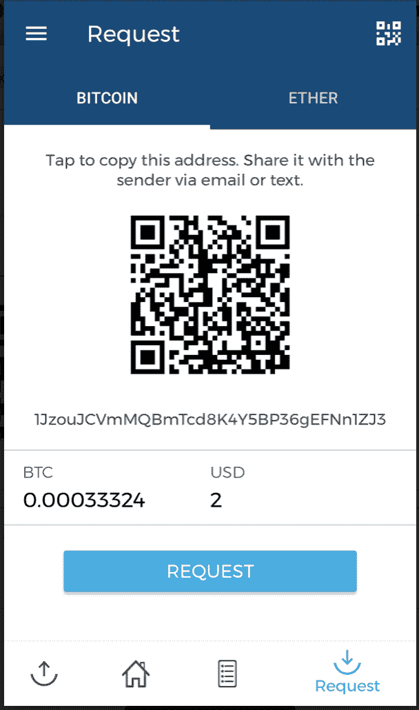

比特币支付请求（使用区块链钱包）

1.  发件人可以输入收件人的地址，或者扫描具有比特币地址、金额和可选描述编码的 QR 码。钱包应用程序识别此 QR 码并将其解码为类似于 `请发送 <金额> BTC 到比特币地址 <接收者的比特币地址>` 的内容。

1.  这将如下所示，其中包括数值：`请将 0.00033324 BTC 发送至比特币地址 1JzouJCVmMQBmTcd8K4Y5BP36gEFNn1ZJ3`。

1.  这也显示在这里呈现的截图中：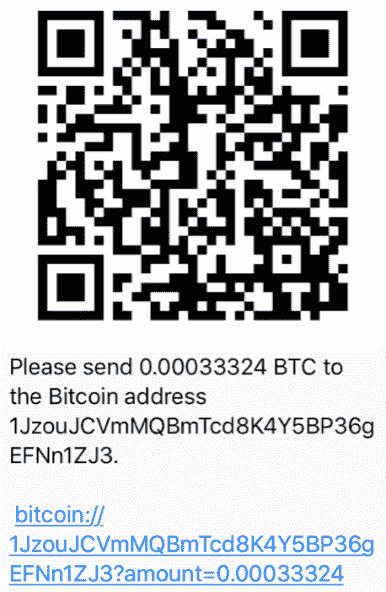

比特币支付二维码

在前述截图中显示的 QR 码被解码为 `bitcoin://1JzouJCVmMQBmTcd8K4Y5BP36gEFNn1ZJ3?amount=0.00033324`，可以作为 URL 在比特币钱包中打开。

1.  在发送方的钱包应用程序中，此交易是按照一些规则构建并广播到比特币网络中的。在广播之前，此交易使用发送方的私钥进行数字签名。交易是如何创建、数字签名、广播、验证和添加到区块中的将在后续章节中清晰地描述。从用户的角度来看，一旦 QR 码被解码，交易将类似于以下截图所示：

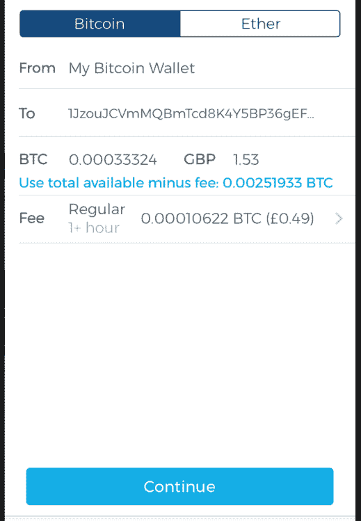

使用区块链钱包发送 BTC

请注意，在前述截图中有许多字段，如发件人、收件人、BTC 和费用。虽然其他字段是不言自明的，但值得注意的是，费用是根据交易的大小计算的，费率是一个取决于网络中交易量的值。这表示为 Satoshis/byte。比特币网络中的费用确保你的交易将被矿工包含在区块中。

近期比特币的手续费非常高，以至于即使对于较小的交易也会收取高额的费用。这是因为矿工可以自由选择他们要验证和添加到区块中的交易，他们选择具有较高手续费的交易。大量用户创建成千上万的交易也导致了这种高手续费的情况，因为交易在竞争中争先被挑选出来，而矿工选择了手续费最高的交易。这笔费用通常也是在发送交易之前由比特币钱包软件自动估算和计算的。交易手续费越高，你的交易被优先挑选并包含在区块中的机会就越大。这个任务由矿工执行。挖矿和矿工是我们在本章稍后会在比特币挖矿的背景下详细了解的概念。

一旦交易发送，它将显示在区块链钱包软件中，如下所示：

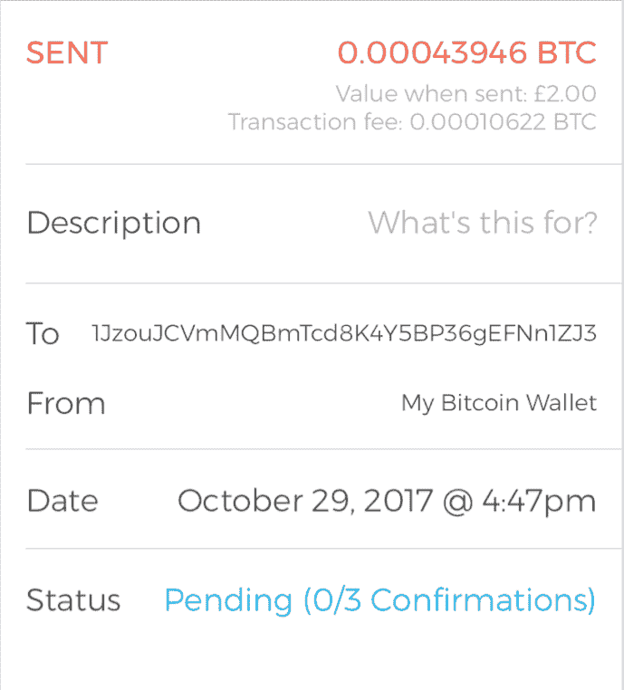

交易已发送

1.  在此阶段，交易已构建、签名并发送到比特币网络。此交易将被矿工选中进行验证并包含在区块中。另请注意，在前面的截图中，此交易正在等待确认。一旦交易被验证、包含在区块中并被挖掘，确认就会开始出现。此外，将从要转移的原始值中扣除适当的费用，并支付给将其包含在挖矿区块中的矿工。

此流程显示在以下图表中，其中从发送方地址发起支付 0.001267 BTC（约 11 美元）并支付给接收方地址（以 1Jz 开头）。手续费为 0.00010622（约 95 美分），也从交易中扣除作为挖矿费用。

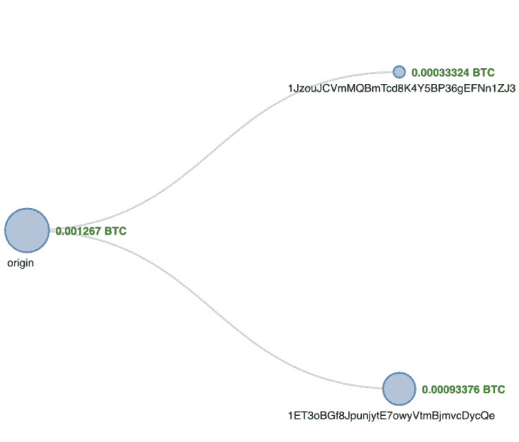

交易流程可视化（Blockchain.info）

前面的截图直观地展示了交易是如何从原始（发送方）流向右侧接收方的网络中的。

显示了交易各种属性的摘要视图：

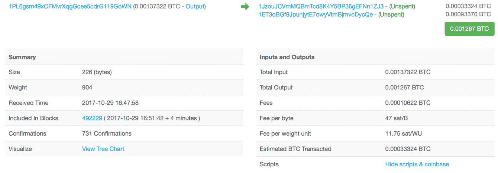

来自 Blockchain.info 的交易快照

查看前面的截图，有许多包含各种值的字段。以下列出了重要字段及其目的和说明：

+   大小：这是交易的字节大小。

+   权重：这是自**比特币**的**隔离见证**（**SegWit**）版本引入以来用于区块和交易大小的新度量单位。

+   接收时间：这是收到交易的时间。

+   包含在区块中：这显示了区块链上包含该交易的区块编号。

+   确认数：这是矿工对此交易的确认次数。

+   总输入：这是交易中的总输入数量。

+   总输出：这是交易中的总输出数量。

+   费用：这是收取的总费用。

+   每字节费用：此字段表示总费用除以交易中的字节数。例如，每字节 10 Satoshis。

+   每权重单位费用：对于传统交易，它是通过*总字节数 * 4*计算的。对于隔离见证交易，它是通过将隔离见证标记、标志和见证字段组合为一个权重单位，以及将其他字段的每个字节视为四个权重单位来计算的。

此交易在比特币网络上的交易 ID 为`d28ca5a59b2239864eac1c96d3fd1c23b747f0ded8f5af0161bae8a616b56a1d`，可以通过[`blockchain.info/tx/d28ca5a59b2239864eac1c96d3fd1c23b747f0ded8f5af0161bae8a616b56a1d`](https://blockchain.info/tx/d28ca5a59b2239864eac1c96d3fd1c23b747f0ded8f5af0161bae8a616b56a1d)链接进一步探索，该链接通过[`blockchain.info/`](https://blockchain.info/)提供的服务提供。 此交易 ID 在交易发送到网络后在钱包软件中可用。 从那里可以通过众多在线可用的比特币区块链浏览器之一进一步探索。 我们以[`blockchain.info/`](https://blockchain.info/)作为示例。

比特币交易被序列化以在网络上传输，并以十六进制格式编码。 例如，前述交易也在这里显示。 我们将在*交易*部分中看到，如何解码此十六进制编码的交易以及交易由哪些字段组成。

```
01000000017d3876b14a7ac16d8d550abc78345b6571134ff173918a096ef90ff0430e12408b0000006b483045022100de6fd8120d9f142a82d5da9389e271caa3a757b01757c8e4fa7afbf92e74257c02202a78d4fbd52ae9f3a0083760d76f84643cf8ab80f5ef971e3f98ccba2c71758d012102c16942555f5e633645895c9affcb994ea7910097b7734a6c2d25468622f25e12ffffffff022c820000000000001976a914c568ffeb46c6a9362e44a5a49deaa6eab05a619a88acc06c0100000000001976a9149386c8c880488e80a6ce8f186f788f3585f74aee88ac00000000  
```

总之，在比特币网络中的支付交易可以分为以下步骤：

1.  交易始于发件人用其私钥签署交易

1.  交易被序列化以便在网络上传输

1.  交易被广播到网络上

1.  监听交易的矿工拾取了该交易

1.  矿工验证交易的有效性

1.  交易被添加到候选/建议的挖掘块中

1.  挖掘完成后，结果将广播到比特币网络上的所有节点

在本章的后续部分中，将更清楚地了解挖掘、交易和其他相关概念。 现在，在下一节中，将介绍比特币的各种面额。

作为数字货币，比特币具有各种面额，下表列出了这些面额。 发件人或收件人可以请求任何金额。 最小的比特币面额是 Satoshi。 比特币货币单位描述如下：

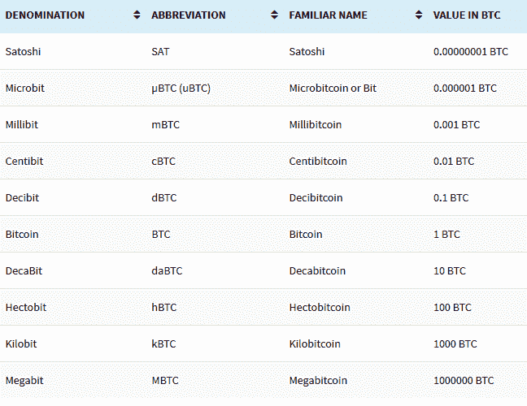

比特币面额

现在，您将逐一介绍比特币的构建块。 首先，我们将看看用于表示比特币网络上的所有权和价值转移的密钥和地址。

# 数字密钥和地址

在比特币网络上，比特币的拥有权和通过交易转移的价值取决于私钥、公钥和地址。 在第六章中，*公钥加密*，我们已经涵盖了这些概念，这里我们将看到私钥和公钥如何在比特币网络中使用。

**椭圆曲线加密**（**ECC**）用于在比特币网络中生成公钥和私钥对。

# 比特币中的私钥

私钥需要保管安全，通常只存储在所有者一侧。私钥用于数字签名交易，证明比特币的所有权。

私钥基本上是在`secp256k1` ECDSA 曲线建议的范围内随机选择的 256 位数字。任何从`0x1`到`0xFFFF FFFF FFFF FFFF FFFF FFFF FFFF FFFE BAAE DCE6 AF48 A03B BFD2 5E8C D036 4140`中随机选择的 256 位数字都是有效的私钥。

私钥通常使用**钱包导入格式**（**WIF**）进行编码，以便更易于复制和使用。这是一种以不同格式表示完整大小私钥的方式。WIF 可以转换为私钥，反之亦然。步骤如下描述。

以下是私钥的示例：

`A3ED7EC8A03667180D01FB4251A546C2B9F2FE33507C68B7D9D4E1FA5714195201`

当转换为 WIF 格式时，它看起来像这样：

`L2iN7umV7kbr6LuCmgM27rBnptGbDVc8g4ZBm6EbgTPQXnj1RCZP`

感兴趣的读者可以使用以下网站提供的工具进行一些实验：

[`gobittest.appspot.com/PrivateKey`](http://gobittest.appspot.com/PrivateKey)

此外，有时会使用**迷你私钥格式**创建最多 30 个字符的私钥，以允许在空间有限的情况下存储，例如，刻在实体硬币上或者编码在耐损伤的 QR 码中。QR 码变得更加耐损伤，因为可以用更多的点来进行错误校正，而用更少的点来进行私钥的编码。使用迷你私钥格式编码的私钥有时也称为**迷你密钥**。迷你私钥的第一个字符始终是大写字母`S`。可以将迷你私钥转换为常规大小私钥，但现有的常规大小私钥无法转换为迷你私钥。这种格式曾用于 Casascius 实体比特币。

感兴趣的读者可以在这里找到更多信息[`en.bitcoin.it/wiki/Casascius_physical_bitcoins`](https://en.bitcoin.it/wiki/Casascius_physical_bitcoins)。


Casascius 实体比特币的安全全息纸带有迷你密钥和 QR 码

比特币核心客户端还允许对包含私钥的钱包进行加密。

# 比特币中的公钥

公钥存在于区块链上，所有网络参与者都可以看到。公钥是从私钥派生的，因为它们与私钥有着特殊的数学关系。一旦使用私钥签名的交易被广播到比特币网络上，节点就会使用公钥来验证该交易确实已经使用相应的私钥签名。这个验证过程证明了比特币的所有权。

比特币使用基于`secp256k1`标准的 ECC。更具体地说，它利用 ECDSA 确保资金保持安全，并且只能由合法所有者花费。如果您需要刷新相关的密码学概念，可以参考第六章，*公钥密码学*，其中解释了 ECC。公钥长度为 256 位。公钥可以以未压缩或压缩格式表示。公钥基本上是椭圆曲线上的*x*和*y*坐标。在未压缩格式中，公钥以 16 进制格式的前缀`0x4`表示。*x*和*y*坐标都是 32 位长。压缩公钥总共为 33 字节，而未压缩格式为 65 字节。压缩版本的公钥仅包含*x*部分，因为*y*部分可以由它派生出来。

压缩公钥版本有效的原因在于，如果将 ECC 图形可视化，会发现*y*坐标可以在*x*轴下方或*x*轴上方，由于曲线是对称的，因此只需要存储在素数域中的位置。如果*y*是偶数，则在*x*轴上方，如果*y*是奇数，则在*x*轴下方。这意味着可以仅存储*x*而不是存储*x*和*y*作为公钥，只需存储*y*是偶数还是奇数的信息。

最初，比特币客户端使用未压缩密钥，但从比特币核心客户端 0.6 开始，压缩密钥被用作标准。这导致在区块链中用于存储公钥的空间几乎减少了 50%。

键由不同的前缀标识，描述如下：

+   未压缩公钥使用`0x04`作为前缀

+   压缩公钥以`0x03`开头，如果公钥的*y* 32 位部分是奇数

+   压缩公钥以`0x02`开头，如果公钥的*y* 32 位部分是偶数

# 比特币地址

比特币地址是通过取私钥的相应公钥并对其进行两次哈希运算创建的，首先使用 SHA-256 算法，然后使用 RIPEMD-160。160 位哈希结果然后加上版本号前缀，最后使用 Base58Check 编码方案进行编码。比特币地址长度为 26-35 个字符，以数字`1`或`3`开头。

典型的比特币地址看起来像是这样的字符串：

```
1ANAguGG8bikEv2fYsTBnRUmx7QUcK58wt  
```

这也常常被编码为 QR 码以便于分发。上述比特币地址的 QR 码显示在以下屏幕截图中：


比特币地址 1ANAguGG8bikEv2fYsTBnRUmx7QUcK58wt 的 QR 码

目前有两种类型的地址，常用的 P2PKH 和另一种 P2SH 类型，分别以数字`1`和`3`开头。在早期，比特币使用直接的支付到公钥，现在已经被 P2PKH 取代。这些类型将在本章后面解释。然而，比特币仍然在 coinbase 地址中使用直接的支付到公钥。地址不应该被多次使用；否则，可能会出现隐私和安全问题。避免地址重用可以在一定程度上规避匿名性问题，比特币还有一些其他的安全问题，如交易篡改、Sybil 攻击、竞争攻击和自私挖矿，需要采用不同的方法来解决。

交易篡改已经通过比特币协议的所谓*隔离见证*软分叉升级得到解决。这个概念将在本章后面解释。

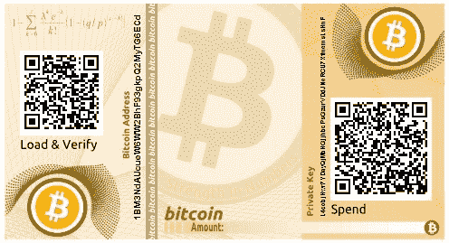

从 bitaddress.org，纸钱包中的私钥和比特币地址

# Base58Check 编码

比特币地址使用 Base58Check 编码进行编码。这种编码用于限制各种字符之间的混淆，例如 0OIl 因为它们在不同字体中可能看起来相同。该编码基本上将二进制字节数组转换为人类可读的字符串。这个字符串是通过使用一组 58 个字母数字符号来组成的。更多的解释和逻辑可以在比特币源代码中的`base58.h`源文件([`github.com/bitcoin/bitcoin/blob/master/src/base58.h`](https://github.com/bitcoin/bitcoin/blob/master/src/base58.h))中找到：

```
/**
* Why base-58 instead of standard base-64 encoding?
* - Don't want 0OIl characters that look the same in some fonts and
* could be used to create visually identical looking data.
* - A string with non-alphanumeric characters is not as easily accepted as input.
* - E-mail usually won't line-break if there's no punctuation to break at.
* - Double-clicking selects the whole string as one word if it's all alphanumeric.
*/
```

# 虚荣地址

由于比特币地址是基于 base-58 编码的，所以可以生成包含人类可读消息的地址。一个示例如下所示：


用 QR 编码的虚荣公共地址

虚荣地址是使用纯粹的蛮力方法生成的。以下截图显示了一个带有虚荣地址的纸钱包示例：

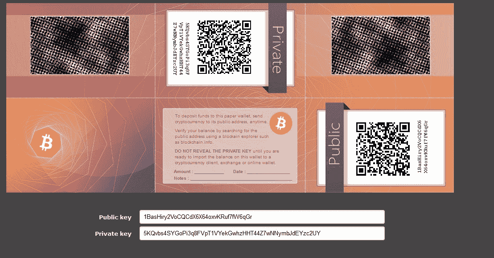

从 https://bitcoinvanitygen.com/ 生成的虚荣地址

在上面的截屏中，右下角显示了带有二维码的公开虚荣地址。纸钱包可以作为私钥的电子存储的替代而被物理地存储。

# 多重签名地址

如其名，这些地址需要多个私钥。在实践中，这意味着为了释放比特币，需要一定数量的签名。这也被称为**M-of-N 多重签名**。在这里，*M* 表示阈值或从 *N* 个密钥中需要的最小签名数来释放比特币。

# 交易

交易是比特币生态系统的核心。交易可以简单到只是将一些比特币发送到一个比特币地址，也可以根据需求而相当复杂。每个交易至少由一个输入和输出组成。输入可以被视为在以前的交易中创建并花费的硬币，输出可以被视为创建的硬币。如果一笔交易正在铸造新币，那么就没有输入，因此也不需要签名。如果一笔交易是要将硬币发送给其他用户（比特币地址），那么发送者需要使用他们的私钥对其进行签名，并且还需要对以前的交易进行引用以显示硬币的来源。事实上，硬币是以 Satoshis 表示的未花费交易输出。

交易不加密，可以在区块链上公开查看。区块由交易组成，这些交易可以使用任何在线区块链浏览器查看。

# 交易生命周期

以下步骤描述了交易的生命周期：

1.  用户/发送方使用钱包软件或其他界面发送交易。

1.  钱包软件使用发送者的私钥对交易进行签名。

1.  交易使用泛洪算法广播到比特币网络中。

1.  监听交易的挖矿节点（矿工）验证并将此交易包含在下一个要挖掘的区块中。就在交易被放置在区块中之前，它们会被放置在一个名为**交易池**的特殊内存缓冲区中。交易池的目的将在下一节中解释。

1.  开采开始，这是一种确保区块链安全并作为对花费适当计算资源的矿工的奖励生成新币的过程。这个概念稍后在本章中将会详细解释。

1.  一旦矿工解决了 PoW 问题，它就会将新挖掘的区块广播到网络中。PoW 将在本章后面详细解释。

1.  节点验证区块并进一步传播区块，并开始生成确认。

1.  最后，确认开始出现在接收方的钱包中，大约在三次确认后，交易被视为已完成和确认。然而，三到六次只是一个推荐的数字；即使在第一次确认后，交易也可以被视为最终确认。等待六次确认的关键思想是，在三次确认后，双重支付的概率几乎被消除。

# 交易费

矿工收取交易费。收取的费用取决于交易的大小和权重。交易费用通过减去输入和输出的总和来计算。

可以使用一个简单的公式：

*费用 = 总数(输入) - 总数(输出)*

手续费被用作激励，以鼓励矿工将用户交易包括在他们正在创建的区块中。所有交易最终都会进入内存池，矿工会根据它们的优先级在内存池中选择交易并包括在建议的区块中。关于优先级的计算将在本章后面介绍；然而，从交易手续费的角度来看，交易的手续费越高，矿工越快地会选择该交易。

根据不同的规则，针对各种类型的操作计算手续费，例如发送交易、包括在区块中以及节点中继。手续费由比特币协议不固定，并不是强制性的；即使没有手续费的交易也将按时处理，但可能需要很长的时间。然而，由于比特币网络中的交易数量大和投资者之间的竞争，这已经不再实际，因此建议始终提供手续费。交易确认时间通常在 10 分钟到 12 小时以上的范围内。交易时间取决于交易费和网络活动。如果网络非常繁忙，那么交易自然需要更长的处理时间，如果支付更高的费用，那么您的交易更有可能被矿工首先选中，因为更高的手续费会有额外的激励。

# 交易池

这些池也被称为内存池，它们基本上是由节点在本地内存（计算机 RAM）中创建的，以维护一个尚未在区块中确认的交易的临时列表。交易经过验证后，并根据它们的优先级被包括在一个区块中。

# 交易数据结构

在高层次上，一个交易包含元数据、输入和输出。交易被组合在一起以创建一个区块。

交易数据结构如下表所示：

| **字段** | **大小** | **描述** |
| --- | --- | --- |
| 版本号 | 4 字节 | 用于为矿工和节点指定要使用的交易处理规则。 |
| 输入计数器 | 1-9 字节 | 交易中包含的输入数量（正整数）。 |
| 输入列表 | 变量 | 每个输入由几个字段组成，包括`上一个 Tx 哈希`、`上一个 Tx 输出索引`、`Txin 脚本长度`、`Txin 脚本`，以及可选的序列号。块中的第一笔交易也被称为 coinbase 交易。它指定一个或多个交易输入。 |
| 输出计数器 | 1-9 字节 | 表示输出数量的正整数。 |
| 输出列表 | 变量 | 包含在交易中的输出。 |
| 锁定时间 | 4 字节 | 该字段定义交易生效的最早时间。它可以是 Unix 时间戳，也可以是区块高度。 |

下面是一个示例交易。这是本章开头提供的支付交易示例的解码交易。

```
{ 
   "lock_time":0, 
   "size":226, 
   "inputs":[ 
      { 
         "prev_out":{ 
            "index":139, 
        "hash":"40120e43f00ff96e098a9173f14f1371655b3478bc0a558d6dc17a4ab176387d" 
         }, 
"script":"483045022100de6fd8120d9f142a82d5da9389e271caa3a757b01757c8e4fa7afbf92e74257c02202a78d4fbd52ae9f3a0083760d76f84643cf8ab80f5ef971e3f98ccba2c71758d012102c16942555f5e633645895c9affcb994ea7910097b7734a6c2d25468622f25e12" 
      } 
   ], 
   "version":1, 
   "vin_sz":1, 
   "hash":"d28ca5a59b2239864eac1c96d3fd1c23b747f0ded8f5af0161bae8a616b56a1d", 
   "vout_sz":2, 
   "out":[ 
      { 
         "script_string":"OP_DUP OP_HASH160 c568ffeb46c6a9362e44a5a49deaa6eab05a619a OP_EQUALVERIFY OP_CHECKSIG", 
         "address":"1JzouJCVmMQBmTcd8K4Y5BP36gEFNn1ZJ3", 
         "value":33324, 
         "script":"76a914c568ffeb46c6a9362e44a5a49deaa6eab05a619a88ac" 
      }, 
      { 
         "script_string":"OP_DUP OP_HASH160 9386c8c880488e80a6ce8f186f788f3585f74aee OP_EQUALVERIFY OP_CHECKSIG", 
         "address":"1ET3oBGf8JpunjytE7owyVtmBjmvcDycQe", 
         "value":93376, 
         "script":"76a9149386c8c880488e80a6ce8f186f788f3585f74aee88ac" 
      } 
   ] 
} 
```

如前面的代码所示，交易由多个结构组成。所有这些元素都在下面的小节中描述。

# 元数据

交易的这一部分包含一些值，例如交易的大小、输入和输出的数量、交易的哈希以及一个`lock_time`字段。每个交易都有一个指定版本号的前缀。这些字段在前面的示例中显示为：`lock_time`，`size`和`version`。

# 输入

通常，每个输入都花费了前一个输出。每个输出被视为**未花费交易输出**（**UTXO**），直到输入将其消耗掉。UTXO 是可以作为新交易的输入花费的未花费交易输出。

交易输入数据结构如下表所示：

| **字段** | **大小** | **描述** |
| --- | --- | --- |
| 交易哈希 | 32 字节 | 这是具有 UTXO 的先前交易的哈希。 |
| 输出索引 | 4 字节 | 这是先前交易的输出索引，即要花费的 UTXO。 |
| 脚本长度 | 1-9 字节 | 这是解锁脚本的大小。 |
| 解锁脚本 | 可变 | 满足锁定脚本要求的输入脚本（`ScriptSig`）。 |
| 序列号 | 4 字节 | 通常禁用或包含锁定时间。禁用用`'0xFFFFFFFF'`表示。 |

在上面的示例中，“inputs”部分中定义了输入。

# 输出

输出有三个字段，它们包含发送比特币的指令。第一个字段包含 Satoshis 的数量，而第二个字段包含锁定脚本的大小。最后，第三个字段包含一个锁定脚本，其中包含需要满足的条件，以便花费输出。更多关于使用锁定和解锁脚本以及产生输出进行交易花费的信息在本节稍后讨论。

交易输出数据结构如下所示：

| **字段** | **大小** | **描述** |
| --- | --- | --- |
| 值 | 8 字节 | 要转移的正整数 Satoshis 的总数 |
| 脚本大小 | 1-9 字节 | 锁定脚本的大小 |
| 锁定脚本 | 可变 | 输出脚本（`ScriptPubKey`） |

在上面的示例中，“OUT”部分显示了两个输出。

# 验证

使用比特币的脚本语言进行验证，下一节会详细描述。

# 脚本语言

比特币使用一种称为**脚本**的简单基于堆栈的语言来描述比特币如何花费和转移。它不是图灵完备的，没有循环，以避免长时间运行/挂起脚本对比特币网络造成任何不良影响。这种脚本语言基于类似于 Forth 编程语言的语法，并使用逆波兰表示法，其中每个操作数后面跟着它的操作符。它使用**后进先出**（**LIFO**）堆栈从左到右进行评估。

脚本使用各种操作码或指令来定义其操作。 操作码也被称为单词、命令或函数。 比特币节点的早期版本有一些操作码，由于发现了设计中的错误而不再使用。

脚本操作码的各种类别包括常量、流程控制、堆栈、位逻辑、切片、算术、加密和锁定时间。

交易脚本通过组合`ScriptSig`和`ScriptPubKey`进行评估。 `ScriptSig`是解锁脚本，而`ScriptPubKey`是锁定脚本。 这是如何评估要花费的交易的方式：

1.  首先，它被解锁，然后才能花费。

1.  `ScriptSig`由希望解锁交易的用户提供。

1.  `ScriptPubkey` 是交易输出的一部分，指定了需要满足的条件才能花费输出。

1.  换句话说，输出由包含条件的`ScriptPubKey`锁定，当条件满足时，输出将被解锁，硬币可以被兑换。

# 常用的操作码。

所有操作码都在比特币参考客户端源代码的`script.h`文件中声明。

这可以从以下链接访问：[h](https://github.com/bitcoin/bitcoin/blob/master/src/script/script.h)[t](https://github.com/bitcoin/bitcoin/blob/master/src/script/script.h)[t](https://github.com/bitcoin/bitcoin/blob/master/src/script/script.h)[p](https://github.com/bitcoin/bitcoin/blob/master/src/script/script.h)[s](https://github.com/bitcoin/bitcoin/blob/master/src/script/script.h)[://g](https://github.com/bitcoin/bitcoin/blob/master/src/script/script.h)[i](https://github.com/bitcoin/bitcoin/blob/master/src/script/script.h)[t](https://github.com/bitcoin/bitcoin/blob/master/src/script/script.h)[h](https://github.com/bitcoin/bitcoin/blob/master/src/script/script.h)[u](https://github.com/bitcoin/bitcoin/blob/master/src/script/script.h)[b](https://github.com/bitcoin/bitcoin/blob/master/src/script/script.h)[.](https://github.com/bitcoin/bitcoin/blob/master/src/script/script.h)[c](https://github.com/bitcoin/bitcoin/blob/master/src/script/script.h)[o](https://github.com/bitcoin/bitcoin/blob/master/src/script/script.h)[m](https://github.com/bitcoin/bitcoin/blob/master/src/script/script.h)[/b](https://github.com/bitcoin/bitcoin/blob/master/src/script/script.h)[i](https://github.com/bitcoin/bitcoin/blob/master/src/script/script.h)[t](https://github.com/bitcoin/bitcoin/blob/master/src/script/script.h)[c](https://github.com/bitcoin/bitcoin/blob/master/src/script/script.h)[o](https://github.com/bitcoin/bitcoin/blob/master/src/script/script.h)[i](https://github.com/bitcoin/bitcoin/blob/master/src/script/script.h)[n](https://github.com/bitcoin/bitcoin/blob/master/src/script/script.h)[/b](https://github.com/bitcoin/bitcoin/blob/master/src/script/script.h)[i](https://github.com/bitcoin/bitcoin/blob/master/src/script/script.h)[t](https://github.com/bitcoin/bitcoin/blob/master/src/script/script.h)[c](https://github.com/bitcoin/bitcoin/blob/master/src/script/script.h)[o](https://github.com/bitcoin/bitcoin/blob/master/src/script/script.h)[i](https://github.com/bitcoin/bitcoin/blob/master/src/script/script.h)[n](https://github.com/bitcoin/bitcoin/blob/master/src/script/script.h)[/b](https://github.com/bitcoin/bitcoin/blob/master/src/script/script.h)[l](https://github.com/bitcoin/bitcoin/blob/master/src/script/script.h)[o](https://github.com/bitcoin/bitcoin/blob/master/src/script/script.h)[b](https://github.com/bitcoin/bitcoin/blob/master/src/script/script.h)[/m](https://github.com/bitcoin/bitcoin/blob/master/src/script/script.h)[a](https://github.com/bitcoin/bitcoin/blob/master/src/script/script.h)[s](https://github.com/bitcoin/bitcoin/blob/master/src/script/script.h)[t](https://github.com/bitcoin/bitcoin/blob/master/src/script/script.h)[e](https://github.com/bitcoin/bitcoin/blob/master/src/script/script.h)[r](https://github.com/bitcoin/bitcoin/blob/master/src/script/script.h)[/s](https://github.com/bitcoin/bitcoin/blob/master/src/script/script.h)[r](https://github.com/bitcoin/bitcoin/blob/master/src/script/script.h)[c](https://github.com/bitcoin/bitcoin/blob/master/src/script/script.h)[/s](https://github.com/bitcoin/bitcoin/blob/master/src/script/script.h)[c](https://github.com/bitcoin/bitcoin/blob/master/src/script/script.h)[r](https://github.com/bitcoin/bitcoin/blob/master/src/script/script.h)[i](https://github.com/bitcoin/bitcoin/blob/master/src/script/script.h)[p](https://github.com/bitcoin/bitcoin/blob/master/src/script/script.h)[t](https://github.com/bitcoin/bitcoin/blob/master/src/script/script.h)[/s](https://github.com/bitcoin/bitcoin/blob/master/src/script/script.h)[c](https://github.com/bitcoin/bitcoin/blob/master/src/script/script.h)[r](https://github.com/bitcoin/bitcoin/blob/master/src/script/script.h)[i](https://github.com/bitcoin/bitcoin/blob/master/src/script/script.h)[p](https://github.com/bitcoin/bitcoin/blob/master/src/script/script.h)[t](https://github.com/bitcoin/bitcoin/blob/master/src/script/script.h)[.](https://github.com/bitcoin/bitcoin/blob/master/src/script/script.h)[h](https://github.com/bitcoin/bitcoin/blob/master/src/script/script.h) 下面的评论中获取：

`/** 脚本操作码 */`

最常用的操作码的描述在此列出。此表格摘自比特币开发者指南：

| **操作码** | **描述** |
| --- | --- |
| `OP_CHECKSIG` | 这获取公钥和签名，并验证交易哈希的签名。如果匹配，则将`TRUE`推送到堆栈；否则，推送`FALSE`。 |
| `OP_EQUAL` | 如果输入完全相同，则返回`1`；否则，返回`0`。 |
| `OP_DUP` | 这复制堆栈中的顶部项目。 |
| `OP_HASH160` | 输入先使用 SHA-256 进行两次哈希，然后再使用 RIPEMD-160 进行哈希。 |
| `OP_VERIFY` | 如果堆栈顶部值不为 true，则将事务标记为无效。 |
| `OP_EQUALVERIFY` | 这与`OP_EQUAL`相同，但之后运行`OP_VERIFY`。 |
| `OP_CHECKMULTISIG` | 这获取第一个签名并将其与每个公钥进行比较，直到找到匹配项，然后重复此过程直到检查所有签名。如果所有签名都有效，则返回`1`；否则，返回`0`。 |

# 交易类型

比特币中有各种脚本可用于处理从源到目的地的价值转移。这些脚本根据交易的要求，从非常简单到非常复杂的范围都有。标准交易类型在此处讨论。标准交易通过`IsStandard()`和`IsStandardTx()`测试进行评估，并且通常只有通过测试的标准交易才允许在比特币网络上进行挖掘或广播。但是，非标准交易是有效的，并且允许在网络上进行。

以下是标准交易类型：

+   **支付至公钥哈希**（**P2PKH**）：P2PKH 是最常用的交易类型，用于向比特币地址发送交易。交易格式如下所示：

```
      ScriptPubKey: OP_DUP OP_HASH160 <pubKeyHash> OP_EQUALVERIFY OP_CHECKSIG
      ScriptSig: <sig> <pubKey>
```

`ScriptPubKey`和`ScriptSig`参数被串联在一起并执行。在本节中将会有一个示例，更详细地解释这一点。

+   **支付至脚本哈希**（**P2SH**）：P2SH 用于将交易发送到脚本哈希（即以`3`开头的地址），并在 BIP16 中进行了标准化。除了传递脚本之外，还必须评估赎回脚本并确保其有效。模板如下所示：

```
      ScriptPubKey: OP_HASH160 <redeemScriptHash> OP_EQUAL
      ScriptSig: [<sig>...<sign>] <redeemScript>
```

+   **多重签名**（**支付至多重签名**）：M-of-N 多重签名交易脚本是一种复杂类型的脚本，可以构建需要多个签名才能有效赎回交易的脚本。使用此脚本可以构建各种复杂的交易，如担保和存款。模板如下所示：

```
      ScriptPubKey: <m> <pubKey> [<pubKey> . . . ] <n> OP_CHECKMULTISIG
      ScriptSig: 0 [<sig > . . . <sign>]
```

原始多重签名已过时，并且多重签名通常是 P2SH 赎回脚本的一部分，如前面的项目中所述。

+   **付款给公钥**：此脚本是一种非常简单的脚本，通常用于 coinbase 交易。它现在已经过时，并且是比特币的旧版本中使用的。在此情况下，公钥存储在脚本中，解锁脚本需要使用私钥对交易进行签名。

模板如下所示：

```
      <PubKey> OP_CHECKSIG
```

+   **Null 数据/OP_RETURN**：此脚本用于以费用在区块链上存储任意数据。消息的限制为 40 字节。此脚本的输出无法兑现，因为 `OP_RETURN` 无论如何都会失败验证。在此情况下不需要 `ScriptSig`。

模板非常简单，如下所示：

```
      OP_RETURN <data>
```

P2PKH 脚本执行如下图所示：

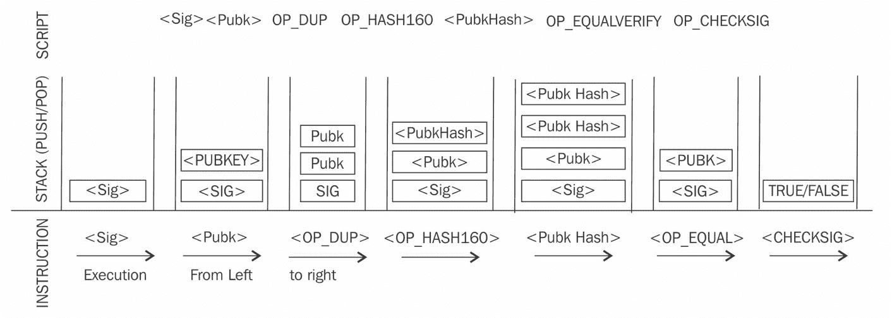

P2PKH 脚本执行

所有交易最终都会在传输到比特币网络之前以十六进制格式编码。下面以十六进制格式显示了使用 `bitcoin-cli` 在主网上运行的比特币节点检索的示例交易：

```
$ bitcoin-cli getrawtransaction "d28ca5a59b2239864eac1c96d3fd1c23b747f0ded8f5af0161bae8a616b56a1d" 
{ 
  "result": "01000000017d3876b14a7ac16d8d550abc78345b6571134ff173918a096ef90ff0430e12408b0000006b483045022100de6fd8120d9f142a82d5da9389e271caa3a757b01757c8e4fa7afbf92e74257c02202a78d4fbd52ae9f3a0083760d76f84643cf8ab80f5ef971e3f98ccba2c71758d012102c16942555f5e633645895c9affcb994ea7910097b7734a6c2d25468622f25e12ffffffff022c820000000000001976a914c568ffeb46c6a9362e44a5a49deaa6eab05a619a88acc06c0100000000001976a9149386c8c880488e80a6ce8f186f788f3585f74aee88ac00000000", 
  "error": null, 
  "id": null 
} 
```

请注意，这是本章开头示例中提到的相同交易。

# Coinbase 交易

Coinbase 交易或生成交易始终由矿工创建，是区块中的第一笔交易。它用于创建新的比特币。它包括一个特殊字段，也称为 `coinbase`，它充当 coinbase 交易的输入。此交易还允许最多 100 字节的任意数据，可用于存储任意数据。在创世区块中，此交易包含了最著名的评论，取自 *The Times* 报纸：

"The Times 03/Jan/2009 Chancellor on brink of second bailout for banks."

此消息证明了创世区块不早于 2009 年 1 月 3 日挖掘。这是因为比特币的第一个区块（创世区块）是在 2009 年 1 月 3 日创建的，而此新闻摘录取自当天的报纸。

Coinbase 交易输入的字段数量与通常的交易输入相同，但结构包含 coinbase 数据大小和 coinbase 数据字段，而不是解锁脚本大小和解锁脚本字段。此外，它没有指向上一个交易的引用指针。该结构如下表所示：

| **字段** | **大小** | **描述** |
| --- | --- | --- |
| 交易哈希 | 32 字节 | 设置为全零，因为不使用哈希引用 |
| 输出索引 | 4 字节 | 设置为 `0xFFFFFFFF` |
| Coinbase 数据长度 | 1-9 字节 | 2 字节至 100 字节 |
| 数据 | 可变 | 任何数据 |
| 序列号 | 4 字节 | 设置为 `0xFFFFFFFF` |

# 合约

如比特币核心开发者指南中所定义的，合同基本上是使用比特币系统执行财务协议的交易。这是一个简单的定义，但具有深远的影响，因为它允许用户设计可以在许多现实场景中使用的复杂合同。合同允许开发一个完全去中心化、独立和降低风险的平台。

可以使用比特币脚本语言构建各种合同，例如托管、仲裁和微支付通道。脚本的当前实现非常有限，但仍然可以开发各种类型的合同。例如，只有在多方签署交易后才释放资金，或者只有在一定时间过去后才释放资金。这两种情况都可以使用多重签名和交易锁定时间选项来实现。

# 交易验证

这个验证过程是由比特币节点执行的。比特币开发者指南中描述了以下内容：

1.  检查语法，并确保交易的语法和数据结构符合协议提供的规则。

1.  验证没有交易输入和输出为空。

1.  检查字节大小是否小于最大区块大小。

1.  输出值必须在允许的货币范围内（0 到 2100 万比特币）。

1.  所有输入必须具有指定的先前输出，除了 coinbase 交易，不应该被中继。

1.  验证`nLockTime`不能超过 31 位。(`nLockTime`指定交易不会在区块中包含之前的时间。)

1.  为了使交易有效，其长度不应小于 100 字节。

1.  标准交易中的签名操作数量应小于或不超过两个。

1.  拒绝非标准交易；例如，`ScriptSig`仅允许在堆栈上推送数字。`ScriptPubkey`未通过`isStandard()`检查。`isStandard()`检查规定只允许标准交易。

1.  如果池中或主分支中的某个区块中已经存在匹配的交易，则交易将被拒绝。

1.  如果每个输入的引用输出存在于池中的任何其他交易中，则将拒绝交易。

1.  对于每个输入，必须存在一个被引用的未花费交易输出。

1.  对于每个输入，如果引用的输出交易是 coinbase，它必须至少有 100 个确认；否则，交易将被拒绝。

1.  对于每个输入，如果引用的输出不存在或已经花费，则交易将被拒绝。

1.  使用引用的输出交易来获取输入值，验证每个输入值以及总和是否在 0-2100 万比特币的允许范围内。如果输入值的总和小于输出值的总和，则拒绝交易。

1.  如果交易费用太低而无法进入空块，则拒绝交易。

1.  每个输入解锁脚本必须具有相应的有效输出脚本。

# 交易可塑性

比特币中的交易可塑性是由比特币实现中的一个错误引入的。由于这个错误，对手有可能改变交易的交易 ID，从而导致某个交易似乎没有被执行的情况。这可以导致双重存款或提款等情况发生。换句话说，这个错误允许在比特币交易确认之前更改其唯一 ID。如果在确认之前更改了 ID，则似乎根本没有发生交易，这样就可以发生这些攻击。

# 区块链

区块链是比特币网络上所有交易的时间戳、有序和不可变列表的公共分类帐。每个块在链中由哈希标识，并通过引用前一个块的哈希链接到其前一个块。

在下表中提供了一个块的结构，后跟一个详细的图表，提供了区块链结构的详细视图。

# 块的结构

下表显示了一个块的结构：

| **字段** | **大小** | **描述** |
| --- | --- | --- |
| 块大小 | 4 字节 | 这是块的大小。 |
| 块头 | 80 字节 | 这包括下一节中描述的块头中的字段。 |
| 交易计数器 | 可变 | 此字段包含块中所有交易的总数，包括 coinbase 交易。大小范围为 1-9 字节 |
| 交易 | 可变 | 块中的所有交易。 |

# 块头的结构

以下表格描述了块头的结构：

| **字段** | **大小** | **描述** |
| --- | --- | --- |
| 版本 | 4 字节 | 指定要遵循的块验证规则的块版本号。 |
| 上一个块的头哈希 | 32 字节 | 这是上一个块头的双 SHA-256 哈希。 |
| Merkle 根哈希 | 32 字节 | 这是包含在块中的所有交易的 Merkle 树的双 SHA-256 哈希。 |
| 时间戳 | 4 字节 | 此字段包含块的大致创建时间，以 Unix 时代时间格式表示。更确切地说，这是矿工开始对头进行散列的时间。（从矿工的角度看的时间。） |
| 难度目标 | 4 字节 | 这是网络/块的当前难度目标。 |
| 随机数 | 4 字节 | 这是矿工反复更改以产生低于难度目标的哈希的任意数字。 |

如下图所示，区块链是一个块链，其中每个块通过引用前一个块头的哈希链接到其前一个块。这种链接确保除非记录它的块和所有跟随它的块也被修改，否则不会修改任何交易。第一个块未链接到任何先前的块，并且称为创世块。

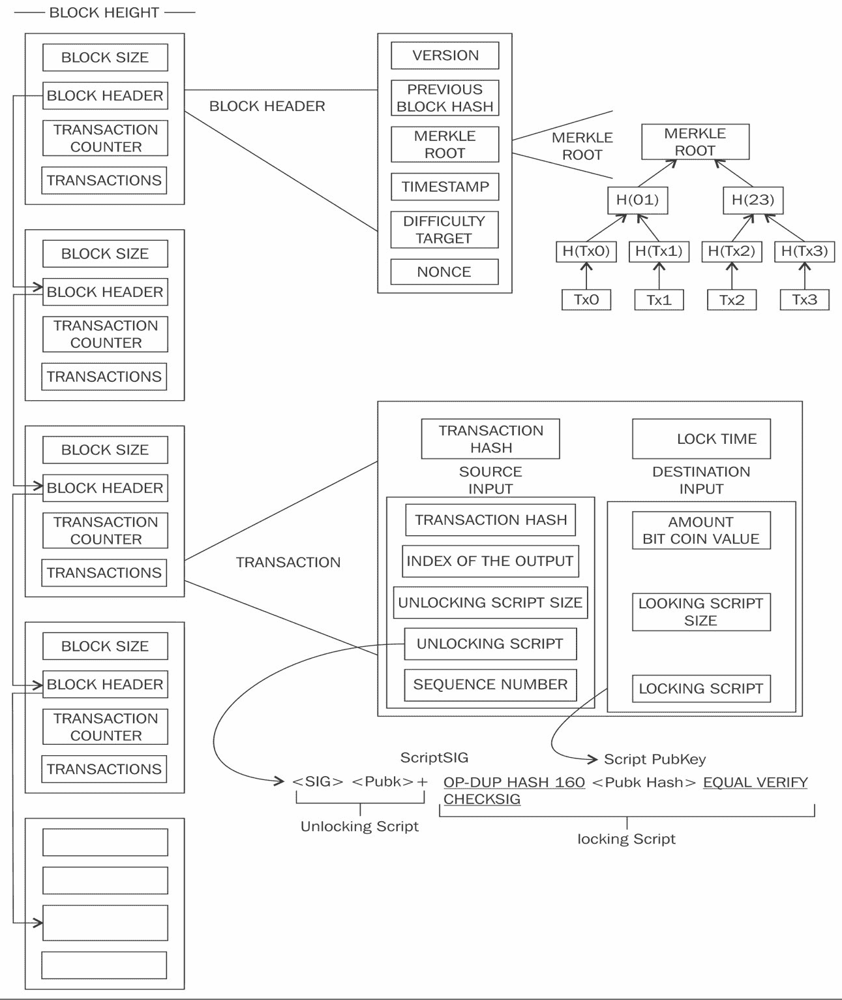

区块链、区块、区块头、交易和脚本的可视化

前面的图表显示了比特币区块链的高级概述。左侧显示从上到下的区块。每个区块包含交易和区块头，在右侧进一步放大。顶部，第一个区块头被展开以显示区块头内的各个元素。然后在右侧显示了区块头的 Merkle 根元素的被放大视图，显示了 Merkle 根是如何计算的。我们之前已经详细讨论了 Merkle 树，如果需要复习这个概念，可以参考第五章，*对称加密*。进一步向下，交易也被放大以展示交易的结构和包含的元素。此外，请注意，交易以显示锁定和解锁脚本的形式进一步阐述。该图表显示了许多组件，我们将在本章中讨论所有这些内容。

# 创世区块

这是比特币区块链中的创世区块。创世区块在比特币核心软件中被硬编码。它在`chainparams.cpp`文件中（[`github.com/bitcoin/bitcoin/blob/master/src/chainparams.cpp`](https://github.com/bitcoin/bitcoin/blob/master/src/chainparams.cpp)）：

```
static CBlock CreateGenesisBlock(uint32_t nTime, uint32_t nNonce, uint32_t nBits, int32_t nVersion, const CAmount& genesisReward) 
{ 
   const char* pszTimestamp = "The Times 03/Jan/2009 Chancellor on brink of second bailout for banks"; 
   const CScript genesisOutputScript = CScript() <<  
ParseHex("04678afdb0fe5548271967f1a67130b7105cd6a828e03909a67962e0ea1f61deb649f6bc3f4cef38c4f35504e51ec112de5c384df7ba0b8d578a4c702b6bf11d5f") << OP_CHECKSIG; 
   return CreateGenesisBlock(pszTimestamp, genesisOutputScript, nTime, nNonce, 
   nBits, nVersion, genesisReward); 
} 
```

比特币通过强制执行交易验证和通过挖矿来提供防止双重花费的保护。只有在*交易验证*部分之前解释的严格规则检查和成功的 PoW 解决方案后，交易和区块才会被添加到区块链中。区块高度是在区块链中某一特定区块之前的区块数量。当前区块链（截至 2018 年 3 月 6 日）的高度为 512,328 个区块。PoW 用于保护区块链。每个区块包含一个或多个交易，其中第一笔交易是 coinbase 交易。对于 coinbase 交易有一个特殊条件，防止它们在至少 100 个区块前被花费，以避免后来该区块可能被声明为陈旧的情况。

当一个区块被解决并且其他每一个仍在努力寻找哈希谜题解的矿工都在该区块上工作时，就会产生陈旧区块。后续将详细讨论挖矿和哈希谜题。由于不再需要对该区块进行工作，因此被视为陈旧区块。

孤立区块也称为分开的区块，在某个时间点被网络接受为有效区块，但当创建了一个不包括最初接受的区块的经过验证更长链时，这些区块会被拒绝。它们不是主链的一部分，有时会发生在两个矿工同时生产区块的情况下。

最新的区块版本是版本 4，提出了 BIP65，并自比特币核心客户端 0.11.2 实施 BIP9 位以来一直被使用，`nVersion`字段正在用于指示软分叉更改。

由于比特币的分布式本质，网络分叉可能会自然发生。在两个节点同时宣布一个有效区块的情况下，可能会导致两个具有不同交易的区块链的情况。这是一个不希望发生的情况，但只能通过比特币网络接受最长的链来解决。在这种情况下，较小的链将被视为孤块。如果对手设法控制网络哈希率（计算能力）的 51%，那么他们可以强加自己的交易历史版本。

区块链中的分叉也可以随着比特币协议的更改引入而发生。在软分叉的情况下，选择不升级到支持更新协议的最新版本的客户端仍然能正常工作和运行。在这种情况下，先前和新的区块都是可接受的，因此软分叉是向后兼容的。

在软分叉的情况下，只有矿工需要升级到新的客户端软件，以利用新的协议规则。计划的升级不一定会创建分叉，因为所有用户应该已经更新了。另一方面，硬分叉使以前有效的区块无效，并要求所有用户升级。新的交易类型有时被添加为软分叉，任何更改，例如区块结构更改或主要协议更改都会导致硬分叉。截至 2017 年 10 月 29 日，比特币区块链的当前大小约为 139 GB。

以下图示显示了区块链大小随时间变化的情况：

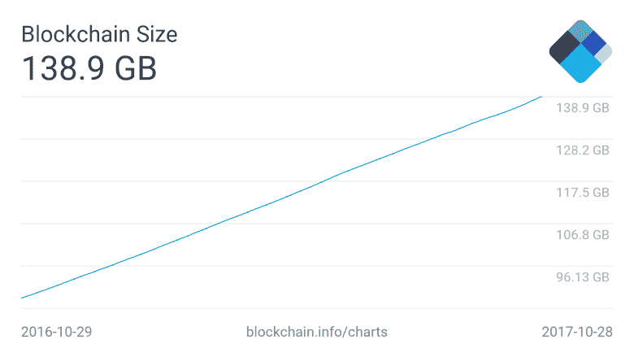

截至 2017 年 10 月 29 日，区块链的当前大小为多少？

新的区块大约每 10 分钟添加到区块链上，并且网络难度每 2016 个区块动态调整，以保持对网络的新区块的稳定添加。

网络难度是使用以下方程计算的：

*目标 = 先前的目标 * 时间/2016 * 10 分钟*

难度和目标是可以互换的，表示相同的意思。先前的目标表示旧的目标值，时间表示生成前 2016 个区块所花费的时间。网络难度基本上表示矿工发现新区块的难度，即现在哈希难题的难度如何。

在接下来的一节中，将讨论挖矿，这将解释如何解决哈希难题。

# 挖矿

挖矿是将新区块添加到区块链的过程。区块包含通过比特币网络上的挖矿节点验证的交易。一旦挖矿和验证完成，区块就会被添加到保持不断增长的区块链中。这个过程由于 PoW 的要求而需要大量资源，其中矿工竞争找到一个小于网络难度目标的数字。找到正确值的难度（有时也称为数学难题）旨在确保矿工在新的建议区块被接受之前已经花费了必要的资源。矿工通过解决 PoW 问题，也称为部分哈希反演问题，铸造新的硬币。这个过程消耗大量资源，包括计算能力和电力。这个过程还通过向比特币生态系统增加更多虚拟货币来保护系统免受欺诈和双重花费攻击的侵害。

大约每 10 分钟创建（挖掘）一个新区块，以控制比特币生成的频率。这个频率需要由比特币网络维护，并且编码在比特币核心客户端中，以控制*货币供应*。如果矿工通过解决 PoW 问题发现新的区块，则会获得新的比特币作为奖励。矿工通过包含交易来获得交易费用作为回报。新的区块以大约每 10 分钟的固定速率创建。每 210,000 个区块，大约每 4 年，新比特币的创造速率减少 50%。比特币最初推出时，区块奖励为 50 个比特币；然后在 2012 年，将其减少为 25 个比特币。2016 年 7 月，进一步减少为 12.5 个硬币（12 个比特币），下一次减少预计在 2020 年 7 月 4 日。这将进一步将硬币奖励减少到大约六个比特币。

每天产生大约 144 个区块，即 1,728 个比特币。实际的比特币数量每天可能有所不同，但每天的区块数保持在 144 个。比特币的供应也是有限的，在 2140 年，将最终创造近 2100 万比特币，并且此后将不会再创造新的比特币。然而，比特币矿工仍将通过收取交易费用从生态系统中获利。

# 矿工的任务

一旦节点连接到比特币网络，比特币矿工会执行以下几项任务：

1.  **与网络同步**: 一旦新节点加入比特币网络，它通过从其他节点请求历史区块来下载区块链。这里提到了比特币矿工的上下文中，但这并不一定只是矿工的任务。

1.  **交易验证**: 网络上广播的交易由完整节点通过验证和验证签名和输出进行验证。

1.  **区块验证**：矿工和完整节点可以从根据一定规则对接收到的区块进行验证开始验证这些区块。这包括验证区块中每个交易以及验证随机数值。

1.  **创建一个新的区块**：矿工通过验证后，将网络上广播的交易组合到一起来提议一个新的区块。

1.  **执行工作证明**：这个任务是挖矿过程的核心，挖矿者通过解决一个计算难题找到一个有效的区块。区块头包含一个 32 位的随机数字段，矿工需要反复改变随机数，直到结果哈希小于预定目标值。

1.  **获取奖励**：一旦一个节点解决了哈希难题（PoW），它立即广播结果，其他节点验证并接受区块。由于在大约同一时间发现另一个区块，新铸造的区块可能不会被网络上其他矿工接受，但一旦被接受，矿工将获得 12.5 比特币和任何相关的交易费用。

# 挖矿奖励

当比特币在 2009 年开始时，挖矿奖励是 50 比特币。每 210,000 个区块后，区块奖励减半。2012 年 11 月，它减半到 25 比特币。目前，自 2016 年 7 月以来，每个区块奖励为 12.5 比特币。下一次减半将在 2020 年 6 月 12 日星期五，之后区块奖励将减少到每个区块 6.25 比特币。比特币中硬编码了这个机制来调节、控制通货膨胀，并限制比特币的供应。

# 工作证明（PoW）

这是计算资源足够以构建有效区块的证明。PoW 是基于随机节点每次被选中创建新区块的想法。在这个模型中，节点按其计算能力的比例竞争被选中。以下方程概括了比特币 PoW 要求：

*H(N || P_hash || Tx || Tx || . . . Tx) < Target*

其中*N*是一个随机数，*P_hash*是前一个区块的哈希，*Tx*代表区块中的交易，*Target*是目标网络难度值。这意味着前面提到的连接字段的哈希应该小于目标哈希值。

找到这个随机数的唯一方法就是穷举法。一旦一个矿工满足了一定数量的零的某种模式，区块就会立即被广播并被其他矿工接受。

# 挖矿算法

挖矿算法包括以下步骤。

1.  从比特币网络中检索先前区块的头部。

1.  将网络上广播的一组交易组合成一个要提议的区块。

1.  计算前一个区块头部与一个随机数和新提议的区块的双重哈希，使用 SHA-256 算法。

1.  检查结果哈希是否低于当前难度级别（目标），然后 PoW 就被解决了。成功完成 PoW 后，发现的区块将被广播到网络，矿工将获得奖励。

1.  如果结果哈希不小于当前难度级别（目标），则在增加随机数后重复该过程。

随着比特币网络的哈希率增加，32 位随机数的总量耗尽得太快。为了解决这个问题，实施了额外的随机数解决方案，其中 Coinbase 交易被用作额外随机数的来源，以提供更大范围的随机数供矿工搜索。

这个过程可以通过使用以下流程图来可视化：

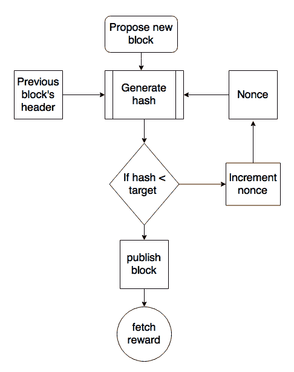

挖矿过程

随着时间的推移，挖矿难度不断增加，而现在单个 CPU 笔记本电脑可以挖掘的比特币现在需要专用的挖矿中心来解决哈希难题。可以使用比特币命令行界面使用以下命令来查询当前的难度级别：

```
$ bitcoin-cli getdifficulty 
1452839779145
```

此数字代表比特币网络的难度级别。从前面的部分可以得知，矿工竞争寻找问题的解决方案。实际上，这个数字显示了要找到比网络难度目标更低的哈希值有多困难。所有成功挖掘的区块必须包含一个哈希值，该哈希值低于此目标数字。此数字每隔 2 周或 2016 个区块更新一次，以确保平均每 10 分钟生成一个区块。

比特币网络难度呈指数增长，以下图表显示了在一年内的这种难度水平：

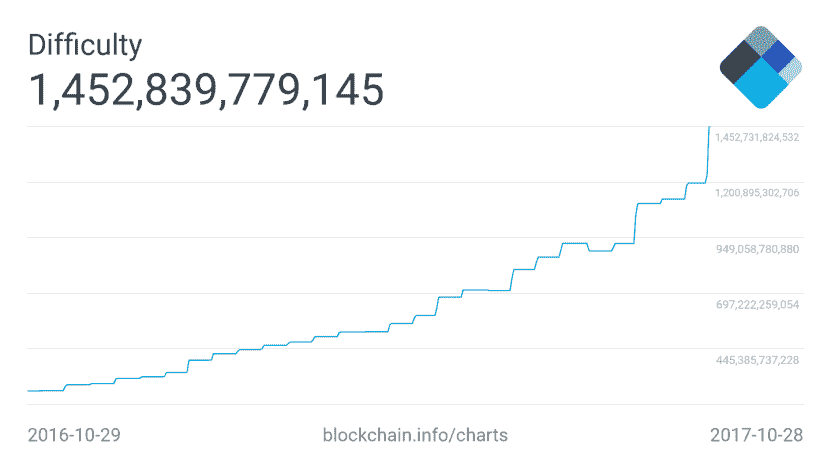

过去一年的挖矿难度

上述图表显示了过去一年比特币网络的难度，难度已经显着增加。挖矿难度增加的原因是因为在比特币中，区块生成时间必须始终约为 10 分钟。这意味着如果快速硬件快速挖掘区块，则会增加难度，以便区块生成时间保持大约每 10 分钟一个区块。如果区块不是每 10 分钟挖掘一次，则难度会减小。难度，每 2016 个区块（两周）计算一次，并相应地进行调整。如果上一组 2016 个区块在两周内挖掘完毕，则难度将增加。同样，如果 2016 个区块在两周以上找到（如果每 10 分钟挖掘一个区块，则 2016 个区块需要 2 周时间挖掘），则难度将减小。

# 哈希率

哈希率基本上表示每秒计算哈希的速率。换句话说，这是比特币网络中矿工计算哈希以找到一个区块的速度。在比特币早期，由于使用 CPU，哈希率曾经相当小。然而，随着现在专用的挖矿池和 ASIC，过去几年里这个速度呈指数级增长。这导致了比特币网络难度的增加。下图显示了随时间增加的哈希率，并且目前以 Exa 哈希进行测量。这意味着比特币网络矿工每秒计算超过 24,000,000,000,000,000,000 个哈希。

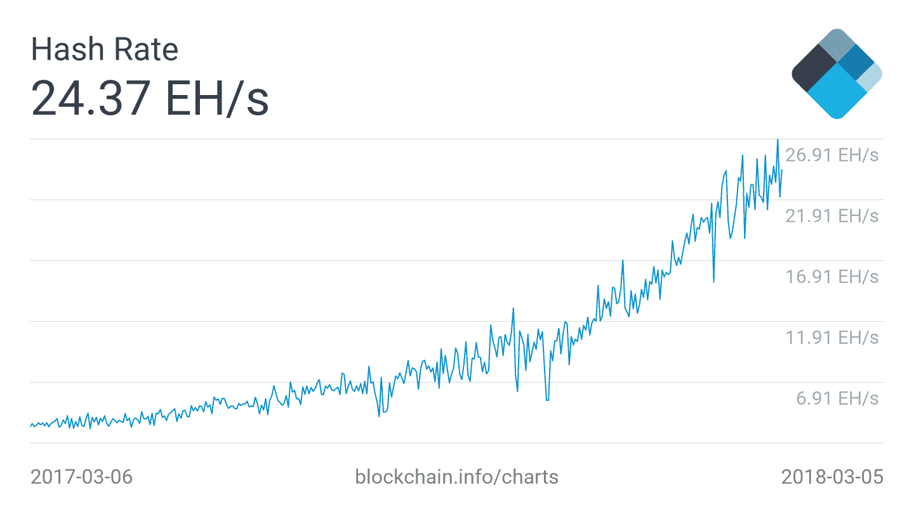

2018 年 3 月的哈希率（以 Exa-hashes 表示），在 1 年的时间内显示

# 挖矿系统

随着时间的推移，比特币矿工使用了各种方法来挖掘比特币。由于挖掘背后的核心原理是基于双重 SHA-256 算法，专家们随着时间的推移开发出了复杂的系统来越来越快地计算哈希。以下是比特币中使用的不同挖矿方法的回顾，以及它们随时间的演变。

# CPU

CPU 挖矿是原始比特币客户端中可用的第一种挖矿类型。用户甚至可以使用笔记本电脑或台式电脑来挖比特币。CPU 挖矿已不再盈利，现在更先进的挖矿方法，如基于 ASIC 的挖矿被使用。CPU 挖矿仅在比特币推出后的一年多一点的时间内持续存在，很快矿工们就开始尝试并探索其他方法。

# GPU

由于比特币网络难度的增加以及寻找更快挖矿方法的普遍趋势，矿工开始使用 PC 中提供的 GPU 或图形处理器来进行挖矿。GPU 支持更快速和并行计算，通常使用 OpenCL 语言编程。与 CPU 相比，这被证明是一种更快的选择。用户还使用超频等技术来充分利用 GPU 的性能。此外，使用多个显卡的可能性增加了使用显卡进行比特币挖矿的流行度。然而，GPU 挖矿也有一些局限性，如过热以及需要专门的主板和额外的硬件来容纳多个显卡。从另一个角度来看，由于需求增加，显卡变得相当昂贵，这影响了玩家和图形软件用户。

# FPGA

即使 GPU 挖矿也没有持续太久，很快矿工们找到了另一种使用 FPGA 进行挖矿的方法。**现场可编程门阵列**（**FPGA**）基本上是可以编程执行特定操作的集成电路。FPGA 通常使用**硬件描述语言**（**HDLs**）编程，如 Verilog 和 VHDL。双 SHA-256 很快成为 FPGA 程序员的一个有吸引力的编程任务，并且有几个开源项目也开始了。与 GPU 相比，FPGA 提供了更好的性能；然而，诸如可访问性、编程难度以及需要专业知识来编程和配置 FPGA 等问题导致了比特币挖矿 FPGA 时代的短暂寿命。

ASIC 的出现迅速淘汰了基于 FPGA 的挖矿系统。在 FPGA 挖矿盈利的时期，诸如 X6500 矿工、Ztex 和 Icarus 等挖矿硬件被开发出来。各种 FPGA 制造商，如赛灵思和 Altera，生产可以用于编程挖矿算法的 FPGA 硬件和开发板。值得注意的是，GPU 挖矿对于某些其他加密货币在某种程度上仍然是盈利的，比如 Zcoin（[`zcoin.io/guide-on-how-to-mine-zcoin-xzc/`](https://zcoin.io/guide-on-how-to-mine-zcoin-xzc/)），但对于比特币来说不是，因为比特币的网络难度非常高，只有运行在并行模式下的 ASIC（专用硬件）才能产生一些合理的利润。

# ASIC

**特定应用集成电路**（**ASIC**）是为执行 SHA-256 操作而设计的。这些特殊芯片由各种制造商销售，并提供非常高的哈希速率。这在一段时间内有效，但由于挖矿难度水平迅速增加，单个 ASIC 已不再具有盈利性。

目前，挖矿对个人来说已经不再可及，因为需要花费大量的能源和资金才能建立一个盈利的挖矿平台。现在，使用成千上万的 ASIC 单位并行的专业挖矿中心向用户提供挖矿合同，代表他们进行挖矿。技术上没有限制，单个用户可以并行运行成千上万个 ASIC，但这将需要专用数据中心和硬件，因此，对于单个个人来说成本可能会成为一个障碍。以下是四种类型的挖矿硬件：

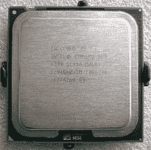

CPU


GPU

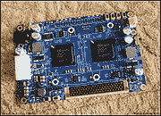

FPGA


ASIC

# 挖矿池

当一组矿工共同挖掘一个区块时，就形成了一个矿池。如果区块成功挖掘，矿池管理员将接收 coinbase 交易，然后负责将奖励分发给投资资源进行挖掘的一组矿工。这比独立挖矿更有利可图，因为在矿池中，奖励将支付给矿池的每个成员，而不管他们（更具体地说，他们的个人节点）是否解决了难题。

矿池管理员可以使用各种模式来支付给矿工，例如**按份支付**（**PPS**）模式和比例模式。在 PPS 模式中，矿池管理员向所有参与挖矿的矿工支付固定费用，而在比例模式中，份额是根据用于解决哈希难题的计算资源量来计算的。

现在有许多商业矿池存在，并通过云和易于使用的网络界面提供挖矿服务合约。其中最常用的是 AntPool ([`www.antpool.com`](https://www.antpool.com))、BTC ([`btc.com`](https://btc.com)) 和 BTC TOP ([`www.btc.top`](http://www.btc.top))。所有主要矿池的哈希功率比较如下图所示：

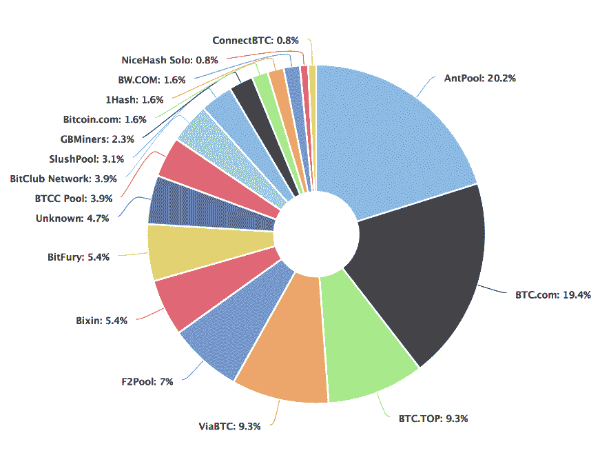

2017 年 10 月 28 日的矿池及其哈希功率（哈希率）

来源：[`blockchain.info/pools`](https://blockchain.info/pools)

如果一个矿池控制了比特币网络超过 51%的哈希率，就可能发生挖矿集中化。

如前述的介绍部分所讨论的，51%攻击可能导致成功的双重支付攻击，它可能影响共识，事实上在比特币网络上施加另一版本的交易历史。

这种事件在比特币历史上曾经发生过一次，当时一家名为 GHash.IO 的大型矿池成功获得了超过 51%的网络容量。理论上的解决方案，如两阶段 PoW ([`hackingdistributed.com/2014/06/18/how-to-disincentivize-large-bitcoin-mining-pools/`](http://hackingdistributed.com/2014/06/18/how-to-disincentivize-large-bitcoin-mining-pools/))，已经在学术界提出，以防止大型矿池。该方案引入了第二个加密难题，导致矿池要么透露他们的私钥，要么提供他们矿池的相当一部分哈希率，从而降低矿池的总体哈希率。

目前，有各种类型的硬件可供商业用于挖矿。目前，最赚钱的是 ASIC 挖矿，来自一些供应商如蚂蚁矿机（Antminer）、AvalonMiner 和 Whatsminer。目前，独立挖矿除非投入大量资金和能源建立自己的挖矿设备甚至数据中心，否则收益不高。根据当前的难度系数（2018 年 3 月），如果用户设法产生 12 TH/s 的哈希率，他们可能每天希望获得 0.0009170 BTC（约 6 美元），与购买可以产生 12 TH/s 的设备所需的投资相比，这很低。考虑到电费等运行成本，这并不是很有利可图。

例如，Antminer S9 是一种有效的 ASIC 矿工，可以产生 13.5 TH/s 的哈希功率，看起来它每天可以产生一些利润是正确的，但单个 Antminer S9 的成本约为 1700 英镑，加上电费后，投资回报几乎需要一年的时间，当它产生大约 0.3 BTC 时。也许看起来还可以投资，但也要考虑到比特币网络难度会随着时间的推移不断上升，在一年内挖矿会变得更加困难，并且挖矿硬件在几个月内就会失去用途。

# 总结

我们通过介绍了比特币以及从用户角度讲述了交易如何工作的方式来开始本章。然后，我们从技术角度介绍了交易的概念。随后，我们讨论了在比特币中使用的公钥和私钥。

在接下来的章节中，我们介绍了地址及其不同类型，并讨论了交易及其类型和用途。接下来，我们详细解释了区块链的运作方式以及比特币区块链中包含的各种组件。

在本章的最后几节中，我们介绍了挖矿过程和相关概念。
