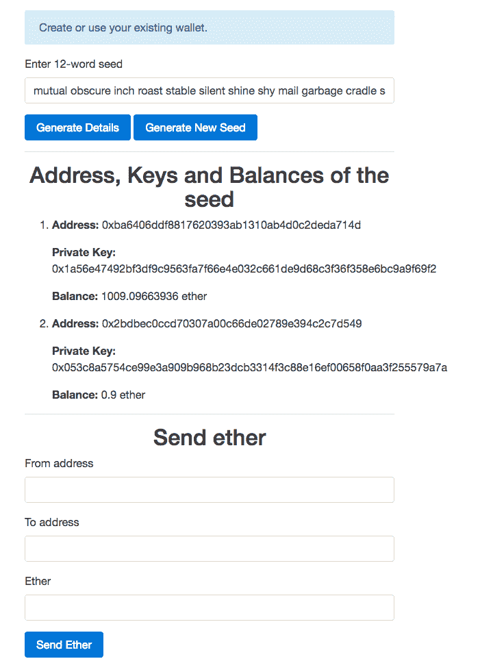

# 构建钱包服务

钱包服务用于发送和接收资金。构建钱包服务的主要挑战是安全性和信任。用户必须确信他们的资金是安全的，钱包服务的管理员不会窃取他们的资金。本章中我们将构建的钱包服务将解决这两个问题。

在本章中，我们将涵盖以下主题：

+   在线钱包和离线钱包的区别

+   使用 hooked-web3-provider 和 ethereumjs-tx 来更容易地创建和签名使用由以太坊节点管理的账户的交易

+   了解什么是 HD 钱包以及它的用途

+   使用 `lightwallet.js` 创建 HD 钱包和交易签名者

+   构建钱包服务

# 在线钱包和离线钱包的区别

一个钱包是一组账户，而账户是地址和其关联私钥的组合。

当钱包连接到互联网时，称为在线钱包。例如，存储在 geth、任何网站/数据库等中的钱包称为在线钱包。在线钱包也称为热钱包、网络钱包、托管钱包等。至少在存储大量以太币或长时间存储以太币时，不建议使用在线钱包，因为它们很危险。此外，取决于钱包存储的位置，可能需要信任第三方。

例如，大多数流行的钱包服务都将钱包的私钥存储在自己身上，并允许您通过电子邮件和密码访问钱包，所以基本上，您没有实际访问钱包的权限，如果他们想，他们可以窃取钱包中的资金。

当钱包未连接到互联网时，称为离线钱包。例如，存储在U盘、纸张、文本文件等中的钱包。离线钱包也称为冷钱包。离线钱包比在线钱包更安全，因为要窃取资金，需要有人对存储设备进行物理访问。离线存储的挑战在于需要找到一个不会意外删除或遗忘的位置，或者没有其他人可以访问。许多人将钱包存储在纸上，并将纸放在保险柜中，以便安全地保存一些资金很长一段时间。如果您想经常从您的账户中发送资金，那么您可以将其存储在受密码保护的U盘中，也可以存储在保险柜中。将钱包仅存储在数字设备中风险略高，因为数字设备随时可能损坏，您可能会无法访问您的钱包；因此，除了存储在U盘中，您还应该将其放在保险柜中。您也可以根据自己的需求找到更好的解决方案，但请确保它是安全的，并且您不会意外丢失对它的访问权限。

# hooked-web3-provider 和 ethereumjs-tx 库

到目前为止，我们看到的Web3.js库的`sendTransaction()`方法的所有示例都在使用以太坊节点中存在的`from`地址；因此，在广播之前以太坊节点能够对交易进行签名。但是，如果您将钱包的私钥存储在其他地方，则geth无法找到它。因此，在这种情况下，您需要使用`web3.eth.sendRawTransaction()`方法来广播交易。

`web3.eth.sendRawTransaction()`用于广播原始交易，也就是说，您将不得不编写代码来创建和签署原始交易。以太坊节点将直接广播它，而不对交易进行其他任何处理。但是，编写使用`web3.eth.sendRawTransaction()`广播交易的代码很困难，因为它需要生成数据部分、创建原始交易，以及签署交易。

Hooked-Web3-Provider库为我们提供了一个自定义提供程序，它使用HTTP与geth进行通信；但是该提供程序的独特之处在于，它允许我们使用我们的密钥对合约实例的`sendTransaction()`调用进行签名。因此，我们不再需要创建交易的数据部分。自定义提供程序实际上覆盖了`web3.eth.sendTransaction()`方法的实现。因此，基本上它允许我们对合约实例的`sendTransaction()`调用以及`web3.eth.sendTransaction()`调用进行签名。合约实例的`sendTransaction()`方法在内部生成交易数据并调用`web3.eth.sendTransaction()`来广播交易。

EthereumJS是与以太坊相关的那些库的集合。ethereumjs-tx是其中之一，它提供了与交易相关的各种API。例如，它允许我们创建原始交易、签署原始交易、检查是否使用正确的密钥签署了交易等。

这两个库都适用于Node.js和客户端JavaScript。从[https://www.npmjs.com/package/hooked-web3-provider](https://www.npmjs.com/package/hooked-web3-provider)下载Hooked-Web3-Provider，并从[https://www.npmjs.com/package/ethereumjs-tx](https://www.npmjs.com/package/ethereumjs-tx)下载ethereumjs-tx。

在撰写本书时，Hooked-Web3-Provider的最新版本是1.0.0，ethereumjs-tx的最新版本是1.1.4。

让我们看看如何将这些库一起使用，以从未由geth管理的帐户发送交易。

```
var provider = new HookedWeb3Provider({ 
 host: "http://localhost:8545", 
 transaction_signer: { 
  hasAddress: function(address, callback){ 
   callback(null, true); 
  }, 
  signTransaction: function(tx_params, callback){ 
   var rawTx = { 
          gasPrice: web3.toHex(tx_params.gasPrice), 
          gasLimit: web3.toHex(tx_params.gas), 
          value: web3.toHex(tx_params.value) 
          from: tx_params.from, 
          to: tx_params.to, 
          nonce: web3.toHex(tx_params.nonce) 
      }; 

   var privateKey = EthJS.Util.toBuffer('0x1a56e47492bf3df9c9563fa7f66e4e032c661de9d68c3f36f358e6bc9a9f69f2', 'hex'); 
   var tx = new EthJS.Tx(rawTx); 
   tx.sign(privateKey); 

   callback(null, tx.serialize().toString('hex')); 
  } 
 } 
}); 

var web3 = new Web3(provider); 

web3.eth.sendTransaction({ 
 from: "0xba6406ddf8817620393ab1310ab4d0c2deda714d", 
 to: "0x2bdbec0ccd70307a00c66de02789e394c2c7d549", 
 value: web3.toWei("0.1", "ether"), 
 gasPrice: "20000000000", 
 gas: "21000" 
}, function(error, result){ 
 console.log(error, result) 
})
```

代码的工作原理如下：

1.  首先，我们创建了一个`HookedWeb3Provider`实例。这是由Hooked-Web3-Provider库提供的。该构造函数接受一个具有两个属性的对象，这两个属性必须提供。`host`是节点的HTTP URL，`transaction_signer`是与自定义提供程序通信以获取交易签名的对象。

1.  `transaction_signer`对象有两个属性：`hasAddress`和`signTransaction`。调用`hasAddress`来检查是否可以对交易进行签名，即检查交易签名者是否具有`from`地址账户的私钥。此方法接收地址和一个回调函数。如果找不到地址的私钥，则应调用回调，并将第一个参数作为错误消息，第二个参数为`false`。如果找到私钥，则第一个参数应为`null`，第二个参数应为`true`。

1.  如果找到地址的私钥，则自定义提供程序调用`signTransaction`方法来获取交易的签名。此方法有两个参数，即交易参数和一个回调函数。在方法内部，首先我们将交易参数转换为原始交易参数，即原始交易参数值被编码为十六进制字符串。然后我们创建一个缓冲区来保存私钥。缓冲区是使用`EthJS.Util.toBuffer()`方法创建的，该方法是`ethereumjs-util`库的一部分。`ethereumjs-util`库被`ethereumjs-tx`库导入。然后我们创建一个原始交易并对其进行签名，之后我们对其进行序列化并转换为十六进制字符串。最后，我们需要使用回调将签名的原始交易的十六进制字符串提供给自定义提供程序。如果方法内部存在错误，则回调的第一个参数应为错误消息。

1.  现在自定义提供程序获取原始交易并使用`web3.eth.sendRawTransaction()`进行广播。

1.  最后，我们调用`web3.eth.sendTransaction`函数向另一个账户发送一些以太币。在这里，我们需要提供除了`nonce`以外的所有交易参数，因为自定义提供程序可以计算nonce。以前，这些参数中的许多是可选的，因为我们让以太坊节点来计算它们，但是现在，因为我们自己签名，所以需要提供所有这些参数。当交易没有与之关联的任何数据时，`gas`永远是21,000。

**公钥呢？**

在上述代码中，我们从未提及签名地址的公钥。你一定会想知道矿工如何在没有公钥的情况下验证交易的真实性。矿工使用ECDSA的一个独特属性，它允许你从消息和签名计算出公钥。在交易中，消息指示交易的意图，签名用于确定消息是否使用正确的私钥进行了签名。这就是使ECDSA如此特殊的地方。ethereumjs-tx提供了一个API来验证交易。

# 什么是分层确定性钱包？

分层确定性钱包是从称为种子的单个起始点派生地址和密钥的系统。确定性表明对于相同的种子，将生成相同的地址和密钥，并且分层表明地址和密钥将以相同的顺序生成。这使得备份和存储多个账户变得更容易，因为你只需要存储种子，而不是单独的密钥和地址。

**用户为什么需要多个账户？**

你一定会想知道用户为什么需要多个账户。原因是为了隐藏他们的财富。账户的余额在区块链上是公开可见的。所以，如果用户A与用户B分享一个地址以接收一些以太币，那么用户B可以检查该地址中有多少以太币。因此，用户通常会将他们的财富分布在各种账户中。

有各种类型的HD钱包，它们在种子格式和生成地址和密钥的算法方面有所不同，例如，BIP32、Armory、Coinkite、Coinb.in等等。

**什么是BIP32、BIP44和BIP39？**

**比特币改进提案**（**BIP**）是向比特币社区提供信息的设计文档，或者描述比特币或其过程或环境的新功能。BIP应提供该功能的简明技术规范和该功能的理由。在撰写本书时，有152个BIPS（比特币改进提案）。BIP32和BIP39分别提供了有关实现HD钱包和助记符种子规范的算法的信息。你可以在 [https://github.com/bitcoin/bips](https://github.com/bitcoin/bips) 了解更多信息。

# 密钥派生函数简介

非对称加密算法定义了它们的密钥的性质以及如何生成密钥，因为密钥需要相关联。例如，RSA密钥生成算法是确定性的。

对称加密算法只定义了密钥大小。生成密钥的责任在于我们自己。有各种算法可以生成这些密钥。其中一种算法是KDF。

**密钥派生函数**（**KDF**）是一个确定性算法，从某个秘密值（如主密钥、密码或口令）派生对称密钥。有各种类型的KDF，如bcrypt、crypt、PBKDF2、scrypt、HKDF等。你可以在 [https://en.wikipedia.org/wiki/Key_derivation_function](https://en.wikipedia.org/wiki/Key_derivation_function) 了解更多关于KDF的信息。

要从单个秘密值生成多个密钥，可以连接一个数字并递增它。

基于密码的密钥派生函数接受一个密码并生成一个对称密钥。由于用户通常使用弱密码，基于密码的密钥派生函数被设计得更慢，需要大量内存，以使启动暴力破解攻击和其他类型的攻击变得困难。基于密码的密钥派生函数被广泛使用，因为很难记住秘密密钥，并且将其存储在某处是有风险的，因为它可能会被盗取。PBKDF2 是基于密码的密钥派生函数的一个例子。

主密钥或密码短语很难被暴力破解；因此，如果您想从主密钥或密码短语生成对称密钥，可以使用非基于密码的密钥派生函数，例如 HKDF。与 PBKDF2 相比，HKDF 要快得多。

**为什么不直接使用哈希函数而不是 KDFs？**

哈希函数的输出可以用作对称密钥。所以你可能会想，KDFs 是为什么需要呢？嗯，如果您使用主密钥、密码短语或强密码，您可以简单地使用哈希函数。例如，HKDF 简单地使用哈希函数生成密钥。但是如果不能保证用户会使用强密码，最好使用基于密码的哈希函数。

# LightWallet 简介

LightWallet 是一个实现了 BIP32、BIP39 和 BIP44 的 HD 钱包。LightWallet 提供了使用其生成的地址和密钥创建和签署交易，或者加密和解密数据的 API。

LightWallet API 被分为四个命名空间，即 `keystore`、`signing`、`encryption` 和 `txutils`。`signing`、`encryption` 和 `txutils` 分别提供了用于签名交易、非对称加密和创建交易的 API，而 `keystore` 命名空间用于创建 `keystore`、生成种子等。`keystore` 是一个保存了种子和加密密钥的对象。如果我们使用 Hooked-Web3-Provider，`keystore` 命名空间会实现交易签名方法，用于签署 `web3.eth.sendTransaction()` 的调用。因此，`keystore` 命名空间可以自动为其内找到的地址创建和签署交易。实际上，LightWallet 主要用作 Hooked-Web3-Provider 的签名提供者。

`keystore` 实例可以配置为创建和签署交易，也可以用于加密和解密数据。对于签署交易，它使用 `secp256k1` 参数，对于加密和解密，它使用 `curve25519` 参数。

LightWallet 的种子是一个包含 12 个单词的助记词，易于记忆但难以破解。它不能是任意的 12 个单词；相反，它应该是由 LightWallet 生成的种子。LightWallet 生成的种子在单词选择和其他方面具有特定的属性。

# HD 派生路径

HD推导路径是一个字符串，易于处理多种加密货币（假设它们都使用相同的签名算法）、多个区块链、多个账户等等。

HD推导路径可以有任意多个参数，并且使用不同值的参数，可以产生不同组的地址及其关联密钥。

默认情况下，LightWallet使用`m/0'/0'/0'`推导路径。在这里，`/n'`是一个参数，`n`是参数值。

每个HD推导路径都有一个`curve`和`purpose`。 `purpose`可以是`sign`或`asymEncrypt`。`sign`表示该路径用于签署交易，`asymEncrypt`表示该路径用于加密和解密。`curve`表示ECC的参数。对于签名，参数必须是`secp256k1`，对于非对称加密，曲线必须是`curve25591`，因为LightWallet强制我们使用这些参数，由于它们在这些目的上的好处。

# 构建一个钱包服务

现在我们已经学习了足够多关于LightWallet的理论知识，是时候使用LightWallet和hooked-web3-provider构建钱包服务了。我们的钱包服务将让用户生成一个唯一的种子，显示地址及其关联余额，最后，该服务将让用户向其他账户发送以太币。所有操作都将在客户端进行，以便用户能够轻松信任我们。用户要么必须记住种子，要么将其存储在某个地方。

# 先决条件

在构建钱包服务之前，请确保您正在运行挖矿的geth开发实例，启用了HTTP-RPC服务器，允许来自任何域的客户端请求，并最后锁定了帐户0。您可以通过运行以下内容来实现所有这些要求：

```
    geth --dev --rpc --rpccorsdomain "*" --rpcaddr "0.0.0.0" --rpcport "8545" --mine --unlock=0
```

在这里，`--rpccorsdomain`用于允许特定域与geth进行通信。我们需要提供一个以空格分隔的域列表，例如 `"http://localhost:8080 https://mySite.com *"`。它还支持`*`通配符字符。`--rpcaddr`指示geth服务器的可访问IP地址。这个默认值是`127.0.0.1`，所以如果它是托管服务器，您将无法使用服务器的公共IP地址来访问它。因此，我们将其值更改为`0.0.0.0`，这表明服务器可以使用任何IP地址进行访问。

# 项目结构

在本章的练习文件中，您将找到两个目录，即`Final`和`Initial`。 `Final`包含项目的最终源代码，而`Initial`包含空白的源代码文件和库，可快速开始构建应用程序。

要测试`Final`目录，您需要在其中运行`npm install`，然后使用`Final`目录内的`node app.js`命令运行该应用程序。

在 `Initial` 目录内，你会找到一个 `public` 目录和两个名为 `app.js` 和 `package.json` 的文件。 `package.json` 包含后端依赖项。 我们的应用程序 `app.js` 是你会放置后端源代码的地方。

`public` 目录包含与前端相关的文件。在 `public/css` 内，你会找到 `bootstrap.min.css`，这是 bootstrap 库。 在 `public/html` 内，你会找到 `index.html`，其中你会放置我们应用程序的 HTML 代码，最后，在 `public/js` 目录内，你会找到 Hooked-Web3-Provider、web3js 和 LightWallet 的 `.js` 文件。 在 `public/js` 内，你还会找到一个 `main.js` 文件，其中你会放置我们应用程序的前端 JS 代码。

# 构建后端

让我们首先构建应用程序的后端。首先，在初始目录内运行 `npm install` 来安装后端所需的依赖。

以下是运行 express 服务并提供 `index.html` 文件和静态文件的完整后端代码：

```
var express = require("express");   
var app = express();   

app.use(express.static("public")); 

app.get("/", function(req, res){ 
 res.sendFile(__dirname + "/public/html/index.html"); 
}) 

app.listen(8080);
```

上述代码不言自明。

# 构建前端

现在让我们构建应用程序的前端。前端将包括主要功能，即生成种子、显示种子的地址和发送以太币。

现在让我们编写应用程序的 HTML 代码。将此代码放在 `index.html` 文件中：

```
<!DOCTYPE html> 
 <html lang="en"> 
     <head> 
         <meta charset="utf-8"> 
         <meta name="viewport" content="width=device-width, initial-scale=1, shrink-to-fit=no"> 
         <meta http-equiv="x-ua-compatible" content="ie=edge"> 
         <link rel="stylesheet" href="/css/bootstrap.min.css"> 
     </head> 
     <body> 
         <div class="container"> 
             <div class="row"> 
                 <div class="col-md-6 offset-md-3"> 
                     <br> 
                     <div class="alert alert-info" id="info" role="alert"> 
                           Create or use your existing wallet. 
                     </div> 
                     <form> 
                         <div class="form-group"> 
                             <label for="seed">Enter 12-word seed</label> 
                             <input type="text" class="form-control" id="seed"> 
                         </div> 
                         <button type="button" class="btn btn-primary" onclick="generate_addresses()">Generate Details</button> 
                         <button type="button" class="btn btn-primary" onclick="generate_seed()">Generate New Seed</button> 
                     </form> 
                     <hr> 
                     <h2 class="text-xs-center">Address, Keys and Balances of the seed</h2> 
                     <ol id="list"> 
                     </ol> 
                     <hr> 
                     <h2 class="text-xs-center">Send ether</h2> 
                     <form> 
                         <div class="form-group"> 
                             <label for="address1">From address</label> 
                             <input type="text" class="form-control" id="address1"> 
                         </div> 
                         <div class="form-group"> 
                             <label for="address2">To address</label> 
                             <input type="text" class="form-control" id="address2"> 
                         </div> 
                         <div class="form-group"> 
                             <label for="ether">Ether</label> 
                             <input type="text" class="form-control" id="ether"> 
                         </div> 
                         <button type="button" class="btn btn-primary" onclick="send_ether()">Send Ether</button> 
                     </form> 
                 </div> 
             </div> 
         </div> 

            <script src="img/web3.min.js"></script> 
            <script src="img/hooked-web3-provider.min.js"></script> 
         <script src="img/lightwallet.min.js"></script> 
         <script src="img/main.js"></script> 
     </body> 
 </html>
```

以下是代码的工作原理：

1.  首先，我们引入了 Bootstrap 4 样式表。

1.  然后我们显示一个信息框，我们将向用户显示各种消息。

1.  然后，我们有一个带有输入框和两个按钮的表单。输入框用于输入种子，或者在生成新种子时，在那里显示种子。

1.  生成详细信息按钮用于显示地址，生成新种子用于生成新的唯一种子。当点击生成详细信息时，我们调用 `generate_addresses()` 方法；当点击生成新种子按钮时，我们调用 `generate_seed()` 方法。

1.  稍后，我们会有一个空的有序列表。在这里，当用户点击生成详细信息按钮时，我们将动态显示种子的地址、余额和关联的私钥。

1.  最后，我们有另一个表单，带有一个来自地址和一个到地址以及要转移的以太币数量。来自地址必须是当前在无序列表中显示的地址之一。

现在让我们编写 HTML 代码调用的每个函数的实现。首先，让我们编写生成新种子的代码。将此代码放在 `main.js` 文件中：

```
function generate_seed() 
{ 
 var new_seed = lightwallet.keystore.generateRandomSeed(); 

 document.getElementById("seed").value = new_seed; 

 generate_addresses(new_seed); 
}
```

`keystore` 命名空间的 `generateRandomSeed()` 方法用于生成一个随机种子。它接受一个可选参数，即指示额外熵的字符串。

熵是应用程序收集用于算法或其他需要随机数据的随机性。通常，熵来自硬件源，可以是预先存在的源，如鼠标移动或专门提供的随机性生成器。

为了产生一个唯一的种子，我们需要非常高的熵。LightWallet已经使用方法来生成唯一的种子。LightWallet用于产生熵的算法取决于环境。但是，如果您觉得您可以生成更好的熵，您可以将生成的熵传递给`generateRandomSeed()`方法，它将与内部使用`generateRandomSeed()`生成的熵连接在一起。

在生成一个随机种子之后，我们调用`generate_addresses`方法。这个方法需要一个种子，并在其中显示地址。在生成地址之前，它会提示用户询问他们想要生成多少个地址。

这里是`generate_addresses()`方法的实现。将这段代码放在`main.js`文件中：

```
var totalAddresses = 0; 

function generate_addresses(seed) 
{ 
 if(seed == undefined) 
 { 
  seed = document.getElementById("seed").value; 
 } 

 if(!lightwallet.keystore.isSeedValid(seed)) 
 { 
  document.getElementById("info").innerHTML = "Please enter a valid seed"; 
  return; 
 } 

 totalAddresses = prompt("How many addresses do you want to generate"); 

 if(!Number.isInteger(parseInt(totalAddresses))) 
 { 
  document.getElementById("info").innerHTML = "Please enter valid number of addresses"; 
  return; 
 } 

 var password = Math.random().toString(); 

 lightwallet.keystore.createVault({ 
  password: password, 
    seedPhrase: seed 
 }, function (err, ks) { 
    ks.keyFromPassword(password, function (err, pwDerivedKey) { 
      if(err) 
      { 
       document.getElementById("info").innerHTML = err; 
      } 
      else 
      { 
       ks.generateNewAddress(pwDerivedKey, totalAddresses); 
       var addresses = ks.getAddresses();  

       var web3 = new Web3(new Web3.providers.HttpProvider("http://localhost:8545")); 

       var html = ""; 

       for(var count = 0; count < addresses.length; count++) 
       { 
     var address = addresses[count]; 
     var private_key = ks.exportPrivateKey(address, pwDerivedKey); 
     var balance = web3.eth.getBalance("0x" + address); 

     html = html + "<li>"; 
     html = html + "<p><b>Address: </b>0x" + address + "</p>"; 
     html = html + "<p><b>Private Key: </b>0x" + private_key + "</p>"; 
     html = html + "<p><b>Balance: </b>" + web3.fromWei(balance, "ether") + " ether</p>"; 
        html = html + "</li>"; 
       } 

       document.getElementById("list").innerHTML = html; 
      } 
    }); 
 }); 
}
```

代码的工作原理如下：

1.  首先，有一个名为`totalAddresses`的变量，它保存一个数字，表示用户想要生成的地址总数。

1.  然后我们检查`seed`参数是否已定义。如果未定义，则我们从输入字段中获取种子。我们这样做是为了能够使用`generate_addresses()`方法显示种子的信息，同时也可以在生成新种子时使用，以及用户点击Generate Details按钮时。

1.  然后我们使用`keystore`命名空间的`isSeedValid()`方法验证种子。

1.  首先，我们要求用户输入他们想要生成和显示多少个地址。然后我们验证输入。

1.  `keystore`命名空间中的私钥总是加密存储的。在生成密钥时，我们需要将它们加密，并在签名交易时，我们需要解密密钥。用于派生对称加密密钥的密码可以从用户输入或通过提供随机字符串作为密码来获取。为了更好的用户体验，我们生成一个随机字符串并将其用作密码。对称密钥不存储在`keystore`命名空间内；因此，我们需要根据密码生成密钥，每当我们进行与私钥相关的操作时，例如生成密钥，访问密钥等。

1.  然后我们使用`createVault`方法创建一个`keystore`实例。`createVault`接受一个对象和一个回调函数。对象可以有四个属性：`password`、`seedPharse`、`salt`和`hdPathString`。`password`是必须的，其他都是可选的。如果我们不提供`seedPharse`，它会生成并使用一个随机种子。`salt`被连接到密码以增加对称密钥的安全性，因为攻击者还必须找到盐以及密码。如果未提供盐，则会随机生成。`keystore`命名空间保存未加密的盐。`hdPathString`用于为`keystore`命名空间提供默认派生路径，即在生成地址、签署交易等过程中使用的派生路径。如果我们不提供派生路径，则使用此派生路径。如果不提供`hdPathString`，则默认值为`m/0'/0'/0'`。此派生路径的默认目的是`sign`。您可以使用`keystore`实例的`addHdDerivationPath()`方法创建新的派生路径或覆盖已有派生路径的目的。您还可以使用`keystore`实例的`setDefaultHdDerivationPath()`方法更改默认派生路径。最后，一旦创建了`keystore`命名空间，通过回调返回实例。因此，在这里，我们仅使用密码和种子创建了一个`keystore`。

1.  现在，我们需要生成用户需要的地址数量及其关联的密钥。由于我们可以从种子生成数百万个地址，`keystore`不会生成任何地址，直到我们要求它这样做，因为它不知道我们要生成多少个地址。创建了`keystore`之后，我们使用`keyFromPassword`方法从密码生成对称密钥。然后我们调用`generateNewAddress()`方法生成地址及其关联的密钥。

1.  `generateNewAddress()`接受三个参数：从密码派生的密钥、要生成的地址数量和派生路径。由于我们没有提供派生路径，它使用`keystore`的默认派生路径。如果多次调用`generateNewAddress()`方法，则会从上次调用中创建的地址继续。例如，如果两次调用此方法，每次生成两个地址，则会有前四个地址。

1.  然后我们使用`getAddresses()`获取存储在`keystore`中的所有地址。

1.  我们使用`exportPrivateKey`方法解密和检索地址的私钥。

1.  我们使用`web3.eth.getBalance()`获取地址的余额。

1.  最后，我们在无序列表中显示所有信息。

现在我们知道如何从种子生成地址及其私钥。现在让我们编写`send_ether()`方法的实现，该方法用于从种子生成的地址之一发送以太币。

这是此操作的代码。将此代码放在`main.js`文件中：

```
function send_ether() 
{ 
 var seed = document.getElementById("seed").value; 

 if(!lightwallet.keystore.isSeedValid(seed)) 
 { 
  document.getElementById("info").innerHTML = "Please enter a valid seed"; 
  return; 
 } 

 var password = Math.random().toString(); 

 lightwallet.keystore.createVault({ 
  password: password, 
    seedPhrase: seed 
 }, function (err, ks) { 
    ks.keyFromPassword(password, function (err, pwDerivedKey) { 
      if(err) 
      { 
       document.getElementById("info").innerHTML = err; 
      } 
      else 
      { 
       ks.generateNewAddress(pwDerivedKey, totalAddresses); 

       ks.passwordProvider = function (callback) { 
          callback(null, password); 
       }; 

       var provider = new HookedWeb3Provider({ 
       host: "http://localhost:8545", 
       transaction_signer: ks 
    }); 

       var web3 = new Web3(provider); 

       var from = document.getElementById("address1").value; 
    var to = document.getElementById("address2").value; 
       var value = web3.toWei(document.getElementById("ether").value, "ether"); 

       web3.eth.sendTransaction({ 
        from: from, 
        to: to, 
        value: value, 
        gas: 21000 
       }, function(error, result){ 
        if(error) 
        {  
         document.getElementById("info").innerHTML = error; 
        } 
        else 
        { 
         document.getElementById("info").innerHTML = "Txn hash: " + result; 
        } 
       }) 
      } 
    }); 
 }); 
}
```

在这里，直到从种子生成地址的代码是自说明的。之后，我们将回调分配给了`ks`的`passwordProvider`属性。此回调在事务签名期间调用以获取解密私钥的密码。如果我们不提供此信息，LightWallet将提示用户输入密码。然后，我们通过将`keystore`作为事务签名者传递来创建一个`HookedWeb3Provider`实例。现在，当自定义提供程序需要对事务进行签名时，它调用`ks`的`hasAddress`和`signTransactions`方法。如果要签名的地址不在生成的地址之间，`ks`将向自定义提供程序返回错误。最后，我们使用`web3.eth.sendTransaction`方法发送一些以太币。

# 测试

现在我们已经完成了构建我们的钱包服务，让我们测试一下，确保它按预期工作。首先，在初始目录中运行`node app.js`，然后在您喜欢的浏览器中访问`http://localhost:8080`。您将看到这个屏幕：


现在点击生成新种子按钮以生成新的种子。您将被提示输入一个数字，指示要生成的地址数量。您可以提供任何数字，但出于测试目的，提供一个大于1的数字。现在屏幕会显示如下内容：


现在，要测试发送以太币，您需要将一些以太币发送到从coinbase账户生成的地址之一。一旦您向生成的地址之一发送了一些以太币，请点击生成详细信息按钮以刷新UI，尽管不必要使用钱包服务测试发送以太币。确保再次生成相同的地址。现在屏幕会显示如下内容：



现在在“来自地址”字段中输入列表中具有“来自”地址字段中余额的帐户地址。然后在“到地址”字段中输入另一个地址。出于测试目的，您可以输入显示的其他地址之一。然后输入小于或等于来自地址帐户的以太币余额的一些以太币数量。现在您的屏幕将显示如下内容：


现在点击发送以太币按钮，您将在信息框中看到交易哈希。等待一段时间让它被挖掘。与此同时，您可以通过在非常短的时间内点击生成详细信息按钮来检查交易是否被挖掘。一旦交易被挖掘，您的屏幕将显示如下内容：


如果一切都按照说明进行，您的钱包服务已经准备就绪。您实际上可以将此服务部署到自定义域，并使其可公开使用。它完全安全，用户将信任它。

# 概要

在本章中，您了解了三个重要的以太坊库：Hooked-Web3-Provider、ethereumjs-tx 和 LightWallet。这些库可用于在以太坊节点之外管理帐户和签署交易。在为大多数类型的 DApp 开发客户端时，您会发现这些库非常有用。

最后，我们创建了一个钱包服务，允许用户管理他们的帐户，与服务的后端共享私钥或与其钱包相关的任何其他信息。
