# 另类货币

自比特币的初期成功以来，许多另类货币项目已经推出。比特币于2009年发布，第一个替代币项目（名为Namecoin）于2011年推出。在2013年和2014年，**另类货币**（又称另类币）市场呈爆炸性增长，开启了许多不同类型的另类货币项目。

其中一些取得了成功，而许多因缺乏兴趣而不受欢迎，并因此未获成功。有一些是*炒作和抛售*骗局，短暂出现但很快就消失了。比特币的替代方法可以大致分为两大类，根据其开发的主要目的。如果主要目标是构建一个去中心化的区块链平台，它们被称为另类链；如果替代项目的唯一目的是推出新的虚拟货币，它就被称为另类货币。

另类区块链将在[第14章](16b335c4-50b3-4383-b081-c16c9a8ce457.xhtml)“另类区块链”中详细讨论。

本章主要专注于旨在推出新的虚拟货币（币）的另类货币，尽管也会介绍一些建立在比特币之上提供各种服务的另类协议的内容。其中包括Namecoin等概念，其主要目的是提供去中心化的命名和身份服务而不是货币。

目前，截止2018年底，市场上有数百种另类货币，它们具有一定的货币价值，如Namecoin、Zcash、Primecoin等。我们将在本章的后面部分对其中一些进行详细考察。Zcash是一种成功的另类货币，于2016年推出。另一方面，Primecoin并没有获得太多的关注，但仍在使用。许多另类项目是比特币源代码的直接分叉，尽管有些是从头开始编写的。一些另类货币旨在解决比特币的限制，如隐私问题。其他一些提供不同类型的挖矿、改变区块时间和分配方案。

根据定义，硬分叉的情况下会产生一种替代币。如果比特币发生硬分叉，则其他旧链有效地被认为是另一种货币。然而，尚无确立的规则规定哪条链成为替代币。这在以太坊中已经发生过，其中一次硬分叉导致了一种新的货币**以太坊经典**（**ETC**）的产生，除了**以太坊**（**ETH**）货币之外。以太坊经典是旧链，而以太是硬分叉后的新链。这样具有争议的硬分叉出于某些原因是不可取的。首先，它违背了去中心化的真正精神，因为以太坊基金会，一个中央实体，决定继续进行硬分叉，即使并非每个人都同意该提议；第二，它还由于对硬分叉的分歧而分裂了用户社区。尽管硬分叉在理论上会生成一种替代币，但它在提供的内容上受到限制，因为即使更改导致硬分叉，通常在货币的基本参数周围也没有重大变化。它们通常保持不变。出于这个原因，最好要么从头开始编写一个新币，要么分叉比特币（或其他币种的源代码）来创建一个具有所需参数和功能的新货币。

替代币必须能够吸引新用户、交易和矿工，否则该货币将毫无价值。货币获得其价值，特别是在虚拟货币领域，是由于网络效应和社区的可接受性。如果一种货币未能吸引足够多的用户，那么很快它将被遗忘。通过提供初始数量的货币可以吸引用户，并且可以通过使用各种方法实现。然而，存在一种风险，即如果新币表现不佳，则他们的初始投资可能会丢失。提供初始数量的替代币的方法如下所述：

+   **创建一个新的区块链**：替代币可以创建一个新的区块链，并向初始矿工分配货币，但由于许多欺诈计划或*炒作和倾销*计划，这种方法现在不受欢迎，其中初始矿工在推出新货币时获利，然后消失了。

+   **燃烧证明（PoB）**：另一种为新的替代币分配初始资金的方法是 PoB，也称为单向锚定或价格上限。在这种方法中，用户永久性地销毁一定数量的比特币，与要认领的替代币的数量成比例。例如，如果销毁了十个比特币，则替代币的价值不得高于一些被销毁的比特币。这意味着比特币通过销毁转换为替代币。

+   **所有权证明**：与永久销毁比特币不同，一种替代方法是证明用户拥有一定数量的比特币。这种所有权证明可以用来通过将替代币区块与比特币区块绑定来声明替代币。例如，这可以通过合并挖矿来实现，在合并挖矿中，比特币矿工可以在挖掘比特币的同时挖掘替代币区块，而无需额外工作。合并挖矿将在本章后面解释。

+   **固定侧链**：侧链，顾名思义，是与比特币网络分开的区块链，但比特币可以转移到它们。替代币也可以转回比特币网络。这个概念被称为**双向锚定**。

投资和交易这些替代币也是一个大生意，尽管不及比特币大，但足以吸引新的投资者和交易者，并为市场提供流动性。综合替代币市值如下所示：

此图表由[https://coinmarketcap.com/](https://coinmarketcap.com/)生成。

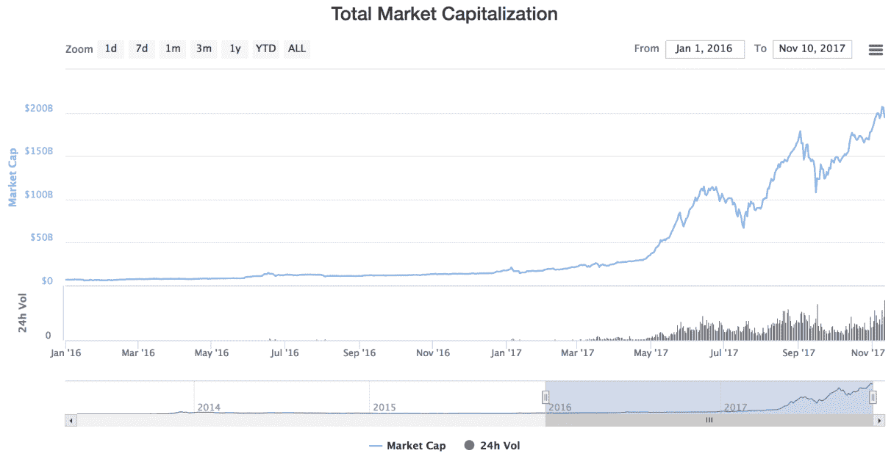

此图表显示，写作时的综合替代币市值超过2000亿美元。

当前前十大币的市值（截至2018年3月）如下所示：

| **名称** | **市值** | **价格美元** |
| --- | --- | --- |
| Bitcoin | $151,388,873,045 | $8,951.83 |
| Ethereum | $68,472,253,587 | $697.94 |
| Ripple | $31,340,920,806 | $0.801723 |
| Bitcoin Cash | $17,182,167,856 | $1,010.08 |
| Litecoin | $9,952,905,688 | $179.11 |
| NEO | $5,638,100,000 | $86.74 |
| Cardano | $5,450,310,987 | $0.210217 |
| Stellar | $5,438,720,268 | $0.294010 |
| EOS | $4,347,501,290 | $6.04 |
| Monero | $4,211,690,257 | $266.40 |

数据来自[https://coinmarketcap.com/](https://coinmarketcap.com/)。

伴随替代币出现了各种因素和新概念。许多概念甚至是在比特币之前就发明了，但随着比特币的出现，不仅引入了新概念，如拜占庭将军问题的解决方案，还巧妙地使用了以前的想法，如hashcash和**工作证明**（**PoW**），并受到了关注。

从那时起，随着替代币项目的推出，各种新技术和概念得到了发展和介绍。要欣赏当前替代加密货币的景观，首先理解一些理论概念是必不可少的。

# 理论基础

在本节中，介绍了各种理论概念，这些概念是在过去几年引入不同替代币的同时发展起来的。

# 工作证明的替代方案

在加密货币的背景下，PoW方案首次在比特币中使用，并作为一种机制来确保矿工已经完成了找到一个区块所需的工作量。作为回报，此过程为区块链提供了去中心化、安全性和稳定性。这是比特币提供去中心化分布式共识的主要手段。PoW方案需要具有一种非常理想的属性，称为**进展自由性**，这意味着消耗计算资源的奖励应该是随机的，并且与矿工的贡献成正比。在这种情况下，即使是那些具有相对较少计算能力的矿工也有一定机会赢得区块奖励。

进展自由这个术语是由Arvind Narayanan等人在书籍《比特币和加密货币技术》中首次提出的。挖矿计算难题的其他要求包括可调节难度和快速验证。可调节难度确保区块链挖矿的难度目标根据增加的哈希功率和用户数量进行调节。

快速验证是一个属性，意味着挖矿计算难题的验证应该简单而快速。PoW方案的另一个方面，特别是比特币中使用的方案（双SHA-256），是自从ASIC引入以来，权力正在向能够承担大规模ASIC农场运营成本的矿工或矿池转移。这种权力转移挑战了比特币去中心化的核心理念。

已经提出了一些替代方案，例如抗ASIC的难题，并且设计得这样一种方式，使得为解决此难题而构建ASIC变得不可行，并且不会带来与商品硬件相比的主要性能增益。用于此目的的常见技术之一是应用一类称为**内存难的计算难题**的计算上难问题。此方法背后的核心思想是，由于解决难题需要大量内存，因此在基于ASIC的系统上实现它是不可行的。

这种技术最初是在Litecoin和Tenebrix中使用的，其中Scrypt哈希函数被用作抗ASIC的PoW方案。尽管最初宣传此方案为ASIC抗性，但最近Scrypt ASIC现已面世，证明了Litecoin最初的声明不正确。这是因为Scrypt是一种内存密集型机制，最初认为由于技术和成本限制，构建具有大容量内存的ASIC难度较大。但现在情况已经改变，因为内存变得越来越便宜，并且有能力生产纳米级电路，可以构建能够运行Scrypt算法的ASIC。

抵抗 ASIC 的另一种方法是需要计算多个哈希函数来提供 PoW。这也称为 **链式哈希方案**。这个想法的理论基础是，在 ASIC 上设计多个哈希函数并不是很可行。最常见的例子是 Dash 中实现的 X11 内存硬函数。X11 包括 11 个 SHA-3 竞争者，其中一个算法将计算出的哈希输出到下一个算法，直到所有 11 个算法都按顺序使用。这些算法包括 BLAKE、BMW、Groestl、JH、Keccak、Skein、Luffa、CubeHash、SHAvite、SIMD 和 ECHO。

此方法最初确实对 ASIC 的发展提供了一些阻力，但现在 ASIC 矿工已经在商业上可获得，并支持 X11 和类似方案的挖矿。最近的一个例子是 ASIC Baikal Miner，它支持 X11、X13、X14 和 X15 挖矿。其他例子包括像 iBeLink DM384M X11 矿工和 PinIdea X11 ASIC 矿工这样的矿工。

可能还有另一种方法，就是设计智能或随机更改 PoW 方案或其要求的自变化谜题。这种策略将使其几乎不可能在 ASIC 中实现，因为它将需要为每个功能设计多个 ASIC，并且随机更改方案在 ASIC 中几乎不可能处理。目前尚不清楚如何在实践中实现这一点。

PoW 确实有各种缺点，其中最大的缺点就是能源消耗。据估计，目前比特币矿工消耗的总电量超过孟加拉国，达到了 54.69 **太哈希**（**TWh**）。这是巨大的，而且所有的能源在某种程度上都是浪费的；事实上，除了挖矿之外并没有任何有用的目的。环保人士对这种情况提出了真实的担忧。除了电力消耗之外，碳足迹目前也非常高，每笔交易约为 387 千克 CO[2]。

以下图表显示了比特币能源消耗规模与其他国家相比的情况。这只会不断增长，据估计，到 2018 年底，能源消耗量可能达到约 125 TWh 每年。

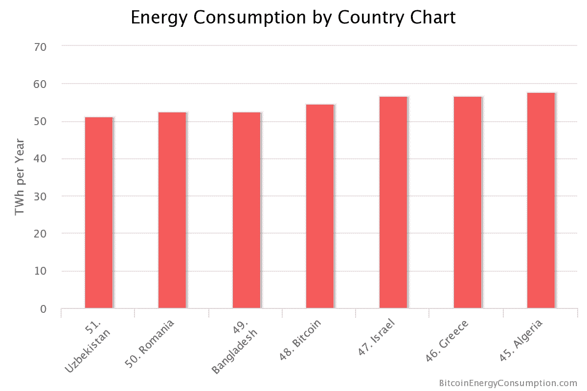

各国的能源消耗

所示的前面的图表摘自跟踪此主题的网站。它可在 [https://digiconomist.net/bitcoin-energy-consumption](https://digiconomist.net/bitcoin-energy-consumption) 上找到。

有人提出，PoW难题可以被设计成具有两个目的。首先，它们的主要目的是在共识机制中，其次是进行一些有用的科学计算。通过这种方式，不仅可以将方案用于挖矿，还可以有望帮助解决其他科学问题。这种有用工作证明最近由Primecoin实行，其要求是找到特殊的素数链，即卡宁汉链和双胞素链。由于素数分布的研究在物理等科学学科中具有特殊意义，通过挖掘Primecoin，矿工不仅可以获得区块奖励，还可以帮助寻找特殊的素数。

# 存储证明

也被称为可检索性证明，这是另一种有用工作证明类型，需要存储大量数据。由微软研究引入，这种方案为分布式存储提供了有用的好处。矿工需要存储一部分伪随机选择的大量数据以进行挖矿。

# 权益证明（PoS）

这种证明也被称为虚拟挖矿。这是另一种替代传统PoW方案的挖矿难题。它最早在2012年8月由Peercoin提出。在这种方案中，用户需要证明拥有一定数量的货币（硬币），从而证明他们对该货币有一定的权益。最简单的权益形式是，采用相对更容易的挖矿方式来奖励那些拥有更多数字货币的用户。这种方案的优点是双重的；首先，相对于购买高端ASIC设备来说，获得大量的数字货币相对困难，其次，这样做可以节省计算资源。已经提出了各种形式的权益，并在下面的小节中简要讨论。

# 各种权益类型

不同类型的权益将在下面的小节中介绍。

# 货币权益证明

货币的年龄指的是货币上次使用或持有的时间。这与通常的PoS形式不同，在这种方式中，对于持有另类币中最大权益的用户来说，挖矿变得更容易。在基于货币年龄的方法中，每次挖出一个区块时，货币的年龄（货币权益）都会被重置。矿工因为持有而不使用货币一段时间而获得奖励。这种机制已经在Peercoin中以一种创造性的方式与PoW结合实施。

挖矿难题（PoW）与货币的时间成反比，这意味着如果矿工使用货币进行货币权益交易，那么PoW的要求就会得到缓解。

# 存款证明（PoD）

这一方案的核心思想是，矿工新生产的区块在一定时间内无法使用。更确切地说，这些硬币在挖矿过程中被锁定了一定数量的区块。该方案允许矿工在冻结一定数量的硬币一段时间的代价下进行挖矿。这是一种PoS（权益证明）的类型。

# 燃烧证明

作为计算能力的备用支出，PoB实际上是销毁一定数量的比特币，以获得相应的另类币。这在启动新的代币项目时通常被使用，作为一种公平分配的手段。这可以被看作是一种替代的挖矿方案，因为新币的价值来自于之前销毁了一定数量的硬币。

# 活动证明（PoA）

该方案是PoW和PoS的混合体。在该方案中，区块最初是通过PoW产生的，然后每个区块会随机分配三个利益相关者来对其进行数字签名。后续区块的有效性取决于先前随机选择的区块成功签名的情况。

然而，有一个可能的问题被称为“利益无所不利”问题，即一个人可以轻易创建一个区块链的分叉。这是可能的，因为在PoW（工作量证明）中需要适当的计算资源来进行挖矿，而在PoS中没有这样的要求；因此，攻击者可以尝试使用相同的硬币在多个链上进行挖矿。

# 无法外包的难题

这一难题的关键动机是抵抗挖矿池的发展。先前讨论过的挖矿池向所有参与者提供奖励，比例与他们消耗的计算能力成正比。然而，在这种模式中，挖矿池操作员是一个能够强制执行特定规则的中央当局，所有的奖励都归该操作员所有。此外，在此模式下，所有的矿工只信任彼此，因为他们共同致力于实现共同目标，希望挖矿池经理能获得奖励。非外包难题是一种允许矿工自己声称奖励的方案；因此，由于匿名矿工之间的内在不信任，挖矿池的形成变得不太可能。

也存在各种其他替代方案以替代PoW，其中一些已在[第1章](76e4e401-30ba-44f9-832f-333ba6c12cbc.xhtml)中描述，*区块链101*，而另一些将在本书的后续章节中进行解释，包括[第13章](b4884f75-b110-4bb3-b30e-950551706409.xhtml)，*Hyperledger*和[第16章](d0ef443d-d4b0-4afb-91f4-c5863ea1cf43.xhtml)，*可扩展性和其他挑战*。由于这是一个正在进行研究的领域，随着区块链技术的发展，新的替代方案将不断出现。

# 难度调整和重新定位算法

随着比特币和另类币的出现，另一个概念引入了难度调整算法。在比特币中，难度目标的计算非常简单，只需下面的等式；然而其他的货币要么开发了自己的算法，要么实现了修改版的比特币难度算法：

*T = 先前时间 * 实际时间 / 2016 * 10 分钟*

比特币中难度调整的理念是，生成2016个区块应该大约需要两周时间（区块之间的时间约为10分钟）。如果挖掘2016个区块超过两周的时间，那么难度会降低，如果挖掘2016个区块少于两周的时间，那么难度会增加。当由于高区块生成速率而引入ASIC时，难度呈指数增长，这就是非ASIC防护PoW算法的一个缺陷。这导致了挖矿算力的集中化。

这也带来了另一个问题；如果一个新的加密货币现在开始，采用与比特币相同的基于SHA-256的PoW，那么恶意用户可以很容易地使用ASIC矿工来控制整个网络。如果对新的另类币没有太多兴趣，某人决定消耗足够高的计算资源来接管网络，这种攻击就会更加实际。如果其他具有类似计算能力的矿工也加入了另类币网络，这种攻击可能并不可行，因为矿工们会互相竞争。

此外，多矿池也带来了更大的威胁，一群矿工可以自动切换到变得有利可图的货币。这种现象被称为**矿池跳跃**，它会对区块链产生不利影响，从而影响另类币的增长。矿池跳跃对网络的影响是不利的，因为跳池者只在难度低并且可以获得快速奖励时加入网络；一旦难度提高（或者重新调整），他们就会退出，然后等难度重新调整后再次加入。

例如，如果一个多矿池迅速消耗资源来挖掘新币，难度将非常快地增加；当多矿池离开货币网络时，它将几乎无法使用，因为现在难度已经增加到不再对独立矿工有利并且无法维持的程度。解决这个问题的唯一方法是启动一次硬分叉，而这通常对社区来说是不可取的。

有一些算法出现来解决这个问题，后面的章节会讨论这些算法。所有这些算法都基于对哈希率变化做出响应的想法，这些参数包括先前块的数量、先前块的难度、调整比率以及难度可以进行回调或提高的数量。

在以下部分，读者将介绍各种替代币中正在使用和提出的少数难度算法。

# Kimoto引力井

此算法用于各种替代币来调节难度。该方法首次在Megacoin中引入，并用于自适应地调整网络每个区块的难度。算法的逻辑如下所示：

*KGW = 1 + (0.7084 * pow((double(PastBlocksMass)/double(144)), -1.228))*

该算法运行在一个循环中，通过一组预定的区块（*PastBlockMass*）并计算新的重新调整值。该算法的核心思想是开发一种自适应难度调节机制，以响应哈希率的快速波动。**Kimoto引力井**（**KGW**）确保区块之间的时间大致相同。在比特币中，难度每2016个区块调整一次，但在KGW中，难度在每个区块中调整。

此算法容易受到时间扭曲攻击的影响，这种攻击允许攻击者在创建新区块时暂时享受较低的难度。这种攻击允许一个时间窗口，其中难度变低，攻击者可以快速以较快的速度生成许多硬币。

更多信息请参见链接[https://cryptofrenzy.wordpress.com/2014/02/09/multipools-vs-gravity-well/](https://cryptofrenzy.wordpress.com/2014/02/09/multipools-vs-gravity-well/)。

# 黑暗引力波

**黑暗引力波**（**DGW**）是一种新算法，旨在解决KGW算法中的某些缺陷，比如时间扭曲攻击。这个概念最初是在Dash中引入的，以前被称为Darkcoin。它利用多个指数移动平均和简单移动平均来实现更平滑的重新调整机制。该公式如下所示：

*2222222/ (((Difficulty+2600)/9)^2)*

此公式已在Dash币、比特币SegWit2X和其他各种替代币中实施，作为重新调整难度的机制。

DGW版本3.0是DGW算法的最新实现，与KGW相比，可以实现更好的难度重新调整。

更多信息请参见[https://dashpay.atlassian.net/wiki/spaces/DOC/pages/1146926/Dark+Gravity+Wave](https://dashpay.atlassian.net/wiki/spaces/DOC/pages/1146926/Dark+Gravity+Wave)。

# DigiShield

这是另一种最近在Zcash中使用的难度重新调整算法，经过适当的变化和实验。该算法通过查看固定数量的先前区块来计算它们生成所花费的时间，然后通过将实际时间跨度除以目标时间的平均值来重新调整难度到前一个区块的难度。在这个方案中，重新调整计算得更快，而且从哈希率的突然增加或减少中恢复速度快。这个算法可以防止多重池，这可能导致哈希率的快速增加。

网络难度根据实现方式每个区块或每分钟调整一次。关键创新是相对于KGW更快的调整时间。

Zcash使用DigiShield v3.0，该版本使用以下公式进行难度调整：

*(新难度) = (先前难度) x SQRT [ (150秒) / (上次解决时间)*

有关此问题的详细讨论可在[https://github.com/zcash/zcash/issues/147#issuecomment-245140908](https://github.com/zcash/zcash/issues/147#issuecomment-245140908)找到。

# MIDAS

**多间隔难度调整系统**（**MIDAS**）是一个相对于先前讨论的算法更复杂的算法，因为它使用了更多的参数。这种方法对哈希率的突然变化做出了更快的响应。该算法还可以防止时间扭曲攻击。

有关此事的原始帖子现在可以通过网络档案在[https://web.archive.org/web/20161005171345/http://dillingers.com/blog/2015/04/21/altcoin-difficulty-adjustment-with-midas/](https://web.archive.org/web/20161005171345/http://dillingers.com/blog/2015/04/21/altcoin-difficulty-adjustment-with-midas/)找到。

有兴趣的读者可以在前述位置阅读更多信息。

这就结束了我们对各种难度调整算法的介绍。

许多替代加密货币和协议出现，试图解决比特币的各种限制。

# 比特币的限制

比特币的各种限制也引起了人们对替代币的兴趣，这些替代币专门用于解决比特币的限制。最突出和广泛讨论的限制是比特币缺乏匿名性。我们现在将讨论一些比特币的限制。

# 隐私和匿名性

由于区块链是所有交易的公开账本，并且是公开可用的，因此分析它变得微不足道。结合流量分析，交易可以追溯到其源IP地址，因此可能会揭示交易的发起者。从隐私的角度来看，这是一个很大的问题。

即使在比特币中建议并常见的做法是为每笔交易生成一个新的地址，从而实现一定程度的不可链接性，但这并不足够，已经开发并成功使用各种技术来追踪整个网络中的交易流动，并将其追溯到其发起者。这些技术通过使用交易图、地址图和实体图分析区块链，从而帮助将用户与交易联系起来，引发了隐私方面的担忧。前述分析中提到的技术可以通过使用有关交易的公开信息并将其与实际用户联系起来得到进一步丰富。有可用的开源区块解析器可用于从区块链数据库中提取交易信息、余额和脚本。

一个可在[Rust语言](https://github.com/mikispag/rusty-blockparser)中使用的解析器提供了先进的区块链分析能力。

已经提出了各种提案来解决比特币的隐私问题。这些提案可分为三类：混合协议、第三方混合网络和固有匿名。

每个类别的简要讨论如下。

# 混合协议

这些方案被用来为比特币交易提供匿名性。在这种模式中，使用混币服务提供商（中介或共享钱包）。用户将硬币发送到这个共享钱包作为存款，然后，共享钱包可以将其他用户存入的价值相同的一些其他硬币发送到目的地。用户也可以通过这个中介收到他人发送的硬币。这样，输出与输入之间的链接将不复存在，交易图分析将无法揭示发送者和接收者之间的实际关系。

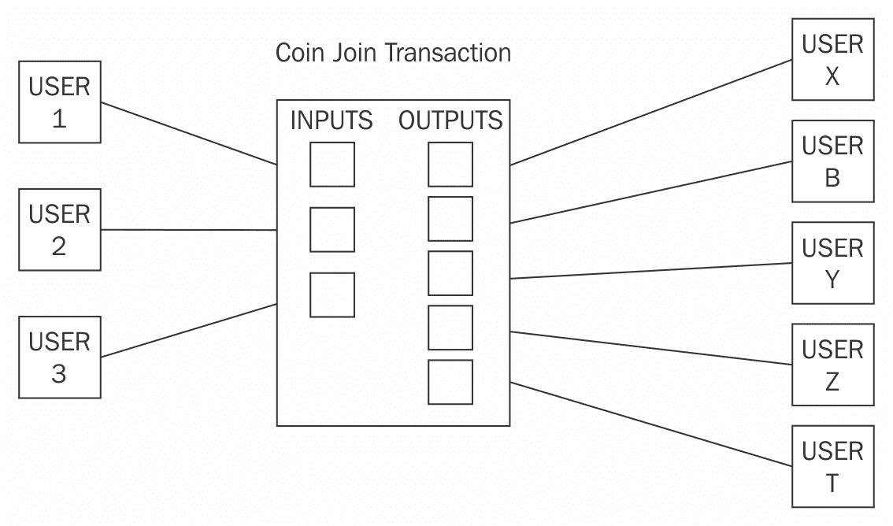

三名用户将其交易合并为单个更大的CoinJoin交易的CoinJoin交易

CoinJoin是混合协议的一个例子，其中两个交易合并在一起形成一笔交易，同时保持输入和输出不变。CoinJoin背后的核心思想是构建一个由所有参与者签署的共享交易。这种技术提高了参与交易的所有参与者的隐私性。

# 第三方混合协议

有各种第三方混币服务可供选择，但如果服务是集中的，那么追踪发送者和接收者之间的映射就会带来威胁，因为混币服务知道所有的输入和输出。此外，完全集中式的矿工甚至会带来服务的管理员偷取硬币的风险。

基于CoinJoin（混合）交易的各种服务，复杂程度各不相同，例如CoinShuffle、Coinmux和Dash（币）中的Darksend。CoinShuffle是传统混合服务的分散替代方案，因为它不需要可信第三方。

基于CoinJoin的方案，然而，存在一些弱点，其中最突出的是用户可能发动拒绝服务攻击，这是由于最初承诺签署交易的用户现在没有提供他们的签名，从而延迟或停止了联合交易。

# 内在匿名性

这个类别包括支持隐私的硬币，隐私已经内置到货币的设计中。最流行的是Zcash，它使用**零知识证明**（**ZKP**）来实现匿名性。后面的章节将对此进行详细讨论。其他例子包括Monero，它利用环签名提供匿名服务。

下一节介绍了已经或正在提出的各种增强功能，以扩展比特币协议。

# 在比特币上扩展的协议

在下文讨论的几个协议中，已经提出并实施了一些协议，以增强和扩展比特币协议，并将其用于各种其他目的，而不仅仅是作为一种虚拟货币。

# 彩色硬币

彩色硬币是一组用于在比特币区块链上表示数字资产的方法。俗称为给比特币着色，是指使用一些元数据更新它，这些元数据代表着数字资产（智能资产）。硬币仍然作为比特币工作和运行，但另外携带一些表示某些资产的元数据。这可以是与资产相关的一些信息，与交易相关的一些计算或任何任意数据。此机制允许发行和跟踪特定的比特币。可以使用比特币的`OP_RETURN`操作码或可选地在多重签名地址中记录元数据。如果需要解决任何隐私问题，此元数据也可以加密。一些实现还支持在公开可用的种子网络上存储元数据，这意味着可以存储几乎无限量的元数据。通常这些是表示彩色硬币各种属性的JSON对象。此外，还支持智能合约。这样的实现例子是Colu，可在[http://colu.co/](http://colu.co/)找到。

彩色硬币可以用来代表多种资产，包括但不限于商品、证书、股票、债券和投票。需要注意的是，要使用彩色硬币，需要一个解释彩色硬币的钱包，而普通的比特币钱包则不起作用。普通的比特币钱包无法区分*彩色硬币*和*非彩色硬币*。

可以使用[https://www.coinprism.com/](https://www.coinprism.com/)提供的服务在线设置彩色硬币钱包。通过使用此服务，可以创建并发行任何数字资产。

彩色硬币的概念非常吸引人，因为它不需要对现有比特币协议进行任何修改，可以利用已经存在的安全比特币网络。除了传统的数字资产表示外，还有可能创建根据其定义的参数和条件行为的智能资产。这些参数包括时间验证、转让限制和费用。

重要的用例可以是在区块链上发行金融工具。这将确保低交易费用、有效且数学上安全的所有权证明、快速的可转让性，无需中介即可快速支付股息给投资者。

丰富的API可在[http://coloredcoins.org/](http://coloredcoins.org/)找到彩色硬币。

# Counterparty

这是另一个服务，用于创建充当加密货币的自定义代币，可用于各种用途，例如在比特币区块链上发行数字资产。这是一个非常强大的平台，以比特币区块链为核心，但开发了自己的客户端和其他组件来支持发行数字资产。架构包括counterparty服务器、counter block、counter wallet和`armory_utxsvr`。 Counterparty基于与彩色硬币相同的想法，通过嵌入数据到常规比特币交易中，但提供了更加高效的库和一套强大的工具来支持数字资产的处理。这种嵌入也被称为**嵌入式共识**，因为counterparty交易嵌入在比特币交易中。嵌入数据的方法是使用比特币中的`OP_RETURN`操作码。

Counterparty生产和使用的货币被称为XCP，并被智能合约用作运行合约的费用。撰写时，其价格为2.78美元。 XCP是通过使用先前讨论过的PoB方法创建的。

Counterparty允许使用solidity语言在以太坊上开发智能合约，并允许与比特币区块链进行交互。为实现这一目的，使用BTC Relay作为在以太坊和比特币之间提供互操作性的手段。这是一个巧妙的概念，其中以太坊合约可以与比特币区块链和交易进行通信。转发器（运行BTC Relay的节点）获取比特币块头并将其传输到以太坊网络上的智能合约，验证PoW。此过程验证了在比特币网络上发生了交易。

可在[http://btcrelay.org/](http://btcrelay.org/)找到。

从技术上讲，这是一种以太坊合约，能够存储和验证比特币区块头，就像比特币简单支付验证轻量级客户端使用布隆过滤器一样。SPV客户端在前几章中详细讨论过。这个想法可以用以下图表来可视化：

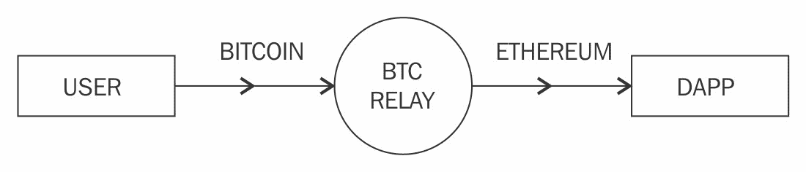

BTC中继概念

Counterparty可以在[http://counterparty.io/](http://counterparty.io/)找到。

# 山寨币的发展

从编码的角度来看，通过简单地分叉比特币或其他币的源代码，可以非常快速地启动山寨币项目，但这可能还不够。当启动一个新的币项目时，需要考虑几件事情，以确保成功启动和币的长期存在。通常，代码库以C++编写，就像比特币的情况一样，但几乎任何语言都可以用来开发币项目，例如Golang或Rust。

编写代码或分叉现有币的代码是微不足道的，挑战性的问题是如何启动一种新货币，以吸引投资者和用户。通常，以下步骤被采取以启动一个新的币项目。

从技术角度来看，如果在另一个币的代码上进行分叉，例如比特币，有各种参数可以更改以有效地创建一个新的币。为了创建一个新币，需要调整或引入这些参数。这些参数可以包括但不限于以下内容。

# 共识算法

有多种共识算法可供选择，例如比特币中使用的PoW或Peercoin中使用的PoS。还有其他可用的算法，如**容量证明**（**PoC**）和其他一些算法，但PoW和PoS是最常见的选择。

# 哈希算法

这要么是SHA-256、Scrypt、X11、X13、X15，或者是任何其他适合用作共识算法的哈希算法。

# 难度调整算法

在这个领域有多种选择可提供难度重新定位机制。最突出的例子是KGW、DGW、Nite's Gravity Wave和DigiShield。此外，所有这些算法都可以根据要求进行调整以产生不同的结果；因此，可能存在许多变体。

# 区块间时间

这是每个区块生成之间经过的时间。对于比特币，区块每10分钟生成一次，对于莱特币，每2.5分钟生成一次。任何值都可以使用，但适当的值通常在几分钟之间；如果生成时间太快，可能会使区块链不稳定，如果太慢，可能不会吸引许多用户。

# 区块奖励

区块奖励是给解决挖矿难题的矿工的，他们被允许拥有一个包含奖励的coinbase交易。比特币最初为50个硬币，现在许多山寨币将这个参数设置为非常高的数字；例如，狗狗币目前为10,000个。

# 奖励减半率

这是另一个重要因素；在比特币中，它每4年减半一次，现在设置为12.5个比特币。这是一个可变的数字，可以根据要求设置为任何时间段或根本不设置。

# 区块大小和交易大小

这是确定网络上交易速率高低的另一个重要因素。比特币中的区块大小限制为1 MB，但在替代币中，它可以根据要求而变化。

# 利率

这个属性仅适用于PoS系统，在这些系统中，货币的所有者可以按照网络定义的利率获得利息，以换取在网络上保留的一些货币，作为保护网络的抵押。这个利率可以控制通货膨胀。如果利率太低，那么可能会导致恶性通货膨胀。

# 货币

这个参数定义了货币必须保持未使用多长时间才能成为符合抵押资格。

# 货币的总供应量

这个数字设置了可以生成的货币的总限制。例如，在比特币中，限制是2100万，而在狗狗币中是无限的。这个限制是由前面讨论的区块奖励和减半时间表固定的。

创建自己的虚拟货币有两种选择：分叉现有的已建立的加密货币源代码或从头开始编写一个新的。后者选项不太流行，但第一个选项更容易，并且在过去几年中已经允许了许多虚拟货币的创建。基本上，思路是首先分叉加密货币源代码，然后在源代码的不同战略位置进行适当的更改，从而有效地创建一个新的货币。NEM币是其中一个完全从头开始编写其代码的新创建的币种。

在下一节中，读者将介绍一些替代币项目。本章节不可能涵盖所有的替代货币，但在下一节中将讨论一些精选的币种。选择是基于其长期性、市值和创新性。每种币种都从不同的角度进行讨论，如理论基础、交易和挖掘。

# 姓名币

姓名币是比特币源代码的第一个分叉。姓名币背后的关键思想不是制造一种替代币，而是提供改进的去中心化、抗审查、隐私、安全和更快的去中心化命名。去中心化命名服务旨在应对传统互联网上使用的域名系统（DNS）协议的固有局限，如缓慢和集中控制。姓名币也是解决Zooko三角形问题的第一个解决方案，这个问题在第1章*区块链101*中简要讨论过。

Namecoin主要用于提供注册键/值对的服务。Namecoin的一个主要用例是，它可以提供基于区块链的分布式和去中心化共识驱动的**传输层安全**（**TLS**）证书验证机制。

它基于与比特币相同的技术，但具有自己的区块链和钱包软件。

Namecoin核心的源代码可在[https://github.com/namecoin/namecoin-core](https://github.com/namecoin/namecoin-core)获得。

总之，Namecoin提供以下三项服务：

+   保证名字（键）的安全存储和传输

+   将一些值附加到名称上，通过附加高达520字节的数据

+   生产数字货币（Namecoin）

Namecoin还首次引入了合并挖矿，这允许矿工同时在多个链上进行挖矿。这个想法很简单，但非常有效：矿工创建一个Namecoin区块并生成该区块的哈希。然后将该哈希添加到比特币区块中，并且矿工解决该区块的难度等于或大于Namecoin区块难度，以证明已经为解决Namecoin区块做出了足够的工作。

Coinbase交易用于在Namecoin的交易哈希（或任何其他山寨币，如果与该币种合并挖矿）中包含哈希。挖矿任务是解决比特币区块，其coinbase `scriptSig`包含对Namecoin（或任何其他山寨币）区块的哈希指针。如下图所示：

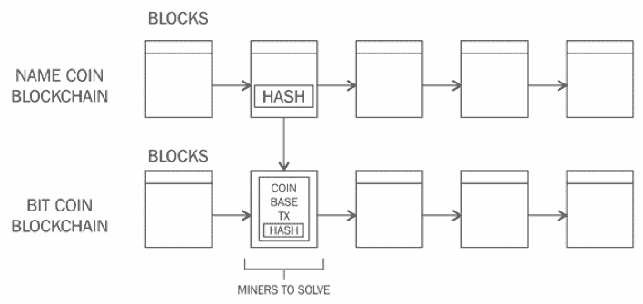

合并挖矿可视化

如果矿工设法以比特币区块链难度水平解决哈希，则比特币区块建立并成为比特币网络的一部分。在这种情况下，比特币区块链会忽略Namecoin哈希。另一方面，如果矿工以Namecoin区块链难度水平解决一个区块，则在Namecoin区块链中将创建一个新区块。该方案的核心优势在于，矿工所花费的所有计算能力都有助于保护Namecoin和比特币。

# 交易Namecoin

截至2018年3月，Namecoin的当前市值为29143884美元，可在[https://coinmarketcap.com/](https://coinmarketcap.com/)购买和出售。可在各种交易所进行交易，例如：

+   [https://cryptonit.net/](https://cryptonit.net/)

+   [https://bisq.network](https://bisq.network)

+   [https://www.evonax.com](https://www.evonax.com)

+   [https://bter.com](https://bter.com)

# 获得Namecoin

即使Namecoin可以独立挖矿，通常也会通过利用合并挖矿技术作为比特币的一部分进行挖矿。这样，Namecoin可以作为比特币挖矿的副产品。正如前面所述的难度图表所表明的，独立挖矿已经不再有利可图；相反，建议使用合并挖矿，使用矿池，甚至使用加密货币交易所购买Namecoin。

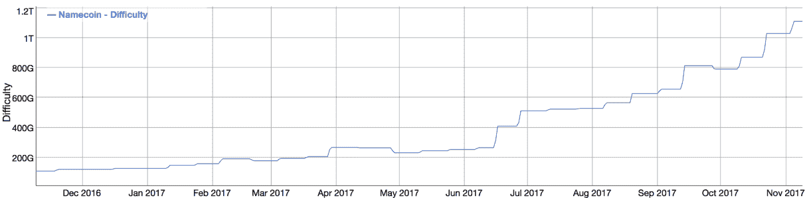

Namecoin难度如下所示：https://bitinfocharts.com/comparison/difficulty-nmc.html（自2016年12月以来）

各种挖矿池，比如[https://slushpool.com](https://slushpool.com)，也提供合并挖矿的选项。这允许矿工主要挖掘比特币，同时也因此获得Namecoin。

另一种快速获得一些Namecoins的方法是用你已有的硬币与Namecoins交换，例如，如果你已经有一些比特币或其他可以用来与Namecoin交换的加密货币。

一个在线服务，[https://shapeshift.io/](https://shapeshift.io/)，可提供此服务。该服务允许使用简单易用的界面从一种加密货币转换为另一种加密货币。

例如，支付BTC以接收NMC如下所示：

1.  首先选择存款货币，本例中是比特币，然后选择要收到的货币，本例中是Namecoin。在顶部的编辑框中，输入您希望接收交换的Namecoin的Namecoin地址。在底部的第二个编辑框中，输入比特币退款地址，在任何情况下交易失败时，货币将退还到该地址。

1.  一旦选定存款和交换货币，汇率和矿工费用会在选择后立即计算。汇率受市场条件驱动，而矿工费用根据选择的目标货币以及目标网络的矿工收费算法计算。

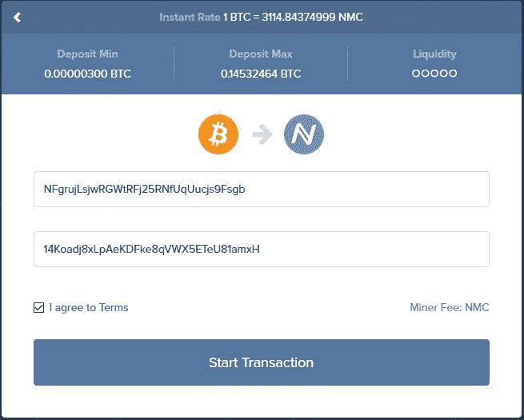

比特币到Namecoin交换

1.  点击“开始交易”后，交易开始并指示用户发送比特币到特定的比特币地址。当用户发送所需金额时，转换过程如下截图所示。整个过程需要几分钟：

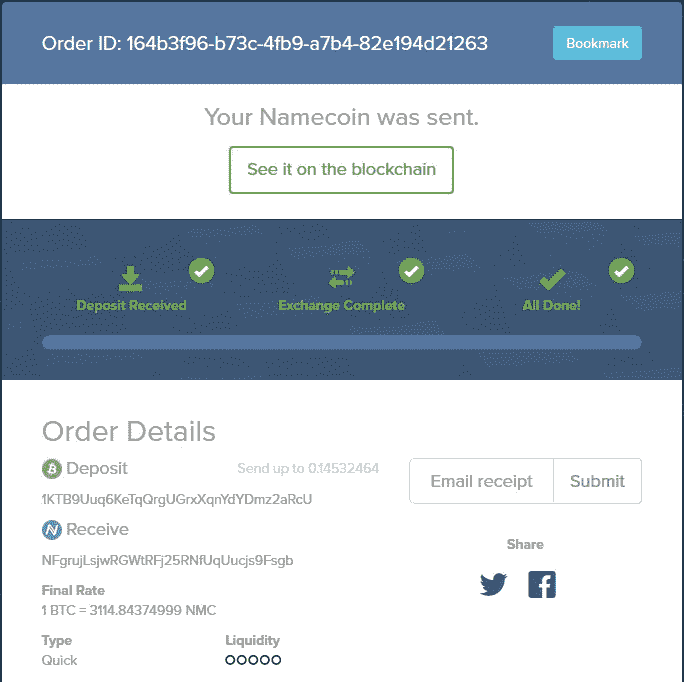

Namecoin交付通知

前面的截图显示，在发送存款后，交换发生，最终显示“All Done!”消息，表明交换成功。

页面上显示了一些其他订单细节，比如存入的货币以及交换后收到的货币。在这种情况下，它是比特币到Namecoin的交换。值得注意的是，与每个币种图标下面也显示了相关地址。还有一些其他选项，比如可以调用邮件收据来接收交易的邮件收据。

在流程完成时，可以在Namecoin钱包中查看交易，如下所示：

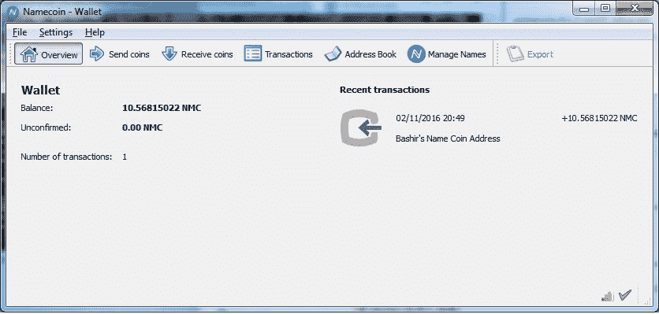

Namecoin钱包

确认交易可能需要一些时间（通常约1小时），在此期间不可能使用Namecoins来管理名称。一旦Namecoins在钱包中可用，就可以使用“管理名称”选项来生成Namecoin记录。

# 生成Namecoin记录

Namecoin 记录是键值对的形式。名称是形式为 `d/examplename` 的小写字符串，而值是大小写敏感的、UTF-8 编码的 JSON 对象，最大长度为 520 字节。名称应符合 RFC1035（[https://tools.ietf.org/html/rfc1035](https://tools.ietf.org/html/rfc1035)）的规定。

一个一般的 Namecoin 名称可以是最多 255 字节长的任意二进制字符串，附带 1024 位的相关标识信息。一个在 Namecoin 链上的记录仅在大约 200 天或 36,000 个块后才需要更新。Namecoin 还引入了 `.bit` 顶级域，可以使用 Namecoin 注册，并且可以使用专用的 Namecoin 启用的解析器进行浏览。如下图所示的 Namecoin 钱包软件可用于注册 `.bit` 域名。

输入名称后，点击提交按钮，将要求输入配置信息，如 DNS、IP 或身份：

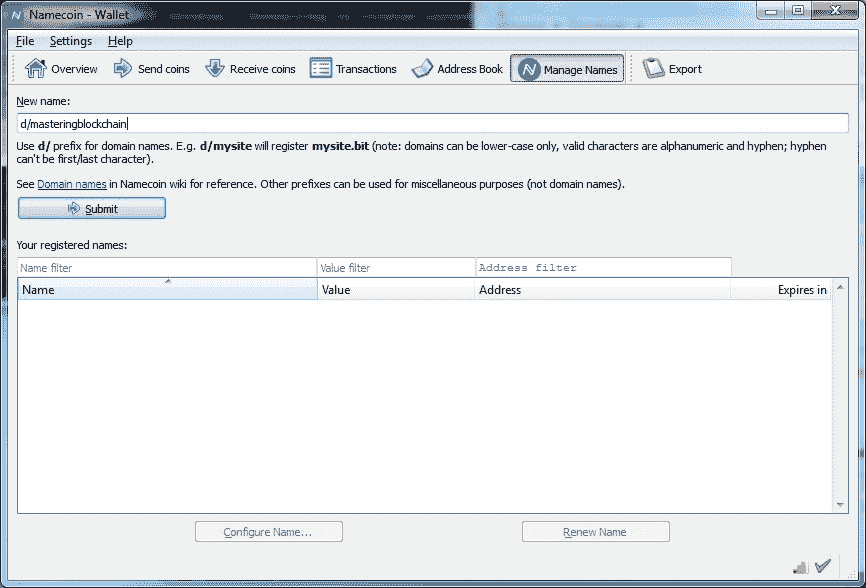

Namecoin 钱包：域名配置

如下面的截图所示，`masteringblockchain` 将在 Namecoin 区块链上注册为 `masteringblockchain.bit`：

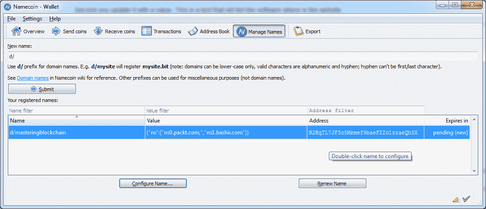

Namecoin 钱包：显示已注册的名称

# Litecoin

Litecoin 是源自于 2011 年发布的比特币源代码的分叉。它使用 Scrypt 作为 PoW，最初在 Tenebrix 币中引入。由于较快的区块生成时间为 2.5 分钟，Litecoin 允许比特币更快的交易。此外，由于更快的区块生成时间，大约每 3.5 天就进行一次难度调整。总的货币供应量是 8400 万。

Scrypt 是第一个替代 SHA-256 基础 PoW 算法的顺序内存硬函数。它最初被提议作为一个**基于密码的密钥派生函数**（**PBKDF**）。其关键思想是，如果函数需要大量内存才能运行，那么定制硬件如 ASIC 将需要更多的 VLSI 区域，这将无法建造。Scrypt 算法需要在内存中保存一个大数组的伪随机位，并以伪随机方式从中派生密钥。

该算法基于一种称为**时间-内存权衡**（**TMTO**）的现象。如果放宽了内存要求，则会导致计算成本增加。换句话说，如果给程序更多的内存，TMTO 将缩短其运行时间。这种权衡使得攻击者难以获取更多内存，因为这既昂贵又难以在定制硬件上实现，或者如果攻击者选择不增加内存，则由于高处理需求而导致算法运行缓慢。这意味着 ASIC 对于该算法难以构建。

Scrypt 使用以下参数生成派生密钥（*Kd*）：

+   **口令**：这是一个要进行哈希的字符字符串

+   **Salt**: 这是提供给 Scrypt 函数（通常是所有哈希函数）的随机字符串，以防御使用彩虹表的暴力字典攻击。

+   **N**: 这是必须是大于 1 的 2 的幂的内存/CPU 成本参数。

+   **P**: 这是并行化参数。

+   **R**: 这是块大小参数。

+   **dkLen**: 这是派生密钥的预期长度，以字节为单位。

形式上，此函数可写为：

*Kd = scrypt (P, S, N, P, R, dkLen)*

在应用核心 Scrypt 函数之前，该算法将 *P* 和 *S* 作为输入，并应用 PBKDF2 和基于 SHA-256 的 HMAC。然后将输出馈送到称为 ROMix 的算法中，该算法内部使用 Blockmix 算法使用 Salsa20/8 核心流密码来填充内存，需要大内存才能运行，从而实现了顺序内存硬特性。

该算法的此步骤的输出最终再次馈送到 PBKDF2 函数中，以产生派生密钥。该过程如下图所示：

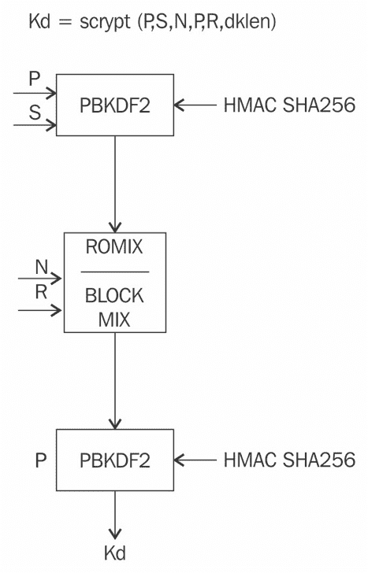

Scrypt 算法

Scrypt 在特定参数下用于莱特币挖矿，其中 *N= 1024*，*R = 1*，*P=1*，*S = 随机 80 字节* 生成 256 位输出。

看起来，由于选择了这些参数，为莱特币挖矿的 Scrypt ASIC 的开发并不是非常困难。在用于莱特币挖矿的 ASIC 中，可以开发出一种顺序逻辑，将数据和随机数作为输入，并应用带有 HMAC-SHA256 的 PBKDF2 算法；然后将结果比特流输入到产生哈希的 SALSA20/8 函数中，该哈希再次馈入到 PBKDF2 和 HMAC-256 函数中以产生 256 位哈希输出。与比特币 PoW 的情况类似，在 Scrypt 中，如果输出哈希小于目标哈希（已在开始时作为输入传递，并存储在内存中，并在每次迭代中检查），则函数终止；否则，随机数递增，然后再次重复该过程，直到找到低于难度目标的哈希。

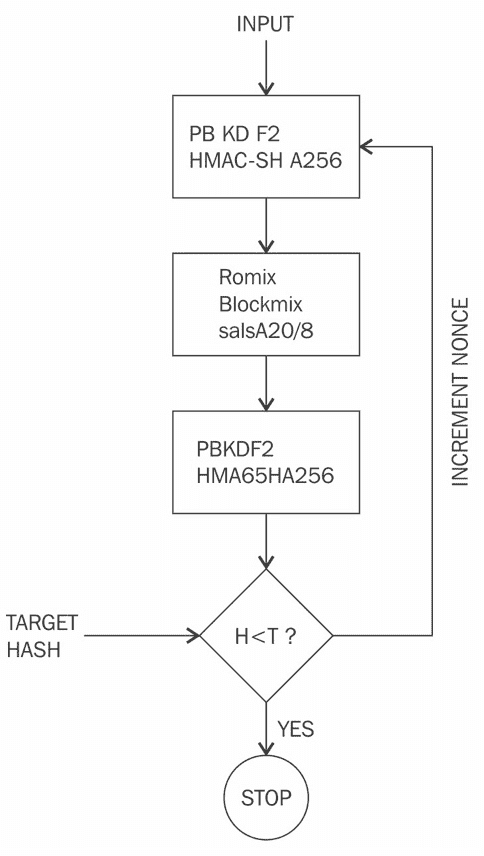

Scrypt ASIC 设计简化流程图

+   **莱特币交易**: 与其他货币一样，莱特币的交易可以在各种在线交易所轻松进行。莱特币的当前市值为 10448974615 美元。莱特币的当前价格（截至 2018 年 3 月）为每个莱特币 188.04 美元。

+   **挖矿**: 莱特币的挖矿可以单独进行，也可以在矿池中进行。目前，常用于挖掘莱特币的 ASIC 可用。

使用 CPU 进行 Litecoin 挖矿已经不再盈利，就像现在许多其他数字货币一样。现在有在线云挖矿提供商和可用的 ASIC 挖矿机，可以用来挖掘 Litecoin。Litecoin 挖矿从 CPU 开始，经过 GPU 挖矿机的发展，最终现在已经达到了一个点，需要使用专门的 ASIC 挖矿机，例如 Ehsminer 的 ASIC Scrypt Miner Wolf，以期能够获得一些硬币。一般来说，即使使用 ASIC，也最好在矿池中进行挖矿，而不是独立挖矿，因为由于矿池采用的比例奖励方案，独立挖矿并不像在矿池中挖矿那样有盈利。这些矿工能够为 Scrypt 算法产生 2 Gh/s 的哈希速率。

+   **软件源代码和钱包**：Litecoin 的源代码可以在 [https://github.com/litecoin-project/litecoin](https://github.com/litecoin-project/litecoin) 获取。Litecoin 钱包可以从 [https://litecoin.org/](https://litecoin.org/) 下载，并且可以像比特币核心客户端软件一样使用。

# Primecoin

Primecoin 是市场上第一种引入有用 PoW 的数字货币，与比特币基于 SHA256 的 PoW 相对。Primecoin 使用寻找素数作为 PoW。并非所有类型的素数都符合被选为 PoW 的要求。三种类型的素数（称为第一类 Cunningham 链，第二类 Cunningham 链和双生链）满足了加密货币中使用 PoW 算法的要求。

Primecoin 区块链通过一个连续的难度评估方案动态调整难度。基于素数的 PoW 的高效验证也非常重要，因为如果验证速度慢，那么 PoW 就不适用。因此，素数链被选为 PoW，因为随着链的增长，找到素数链变得困难，而验证仍然足够快，可以作为高效的 PoW 算法使用。

一旦 PoW 在一个区块上验证过，它就不能在另一个区块上被重用，这一点非常重要。在 Primecoin 中，通过将 PoW 证书与子区块中的父区块头部进行哈希的方式来实现这一点。

PoW 证书是通过将素数链链接到区块头部哈希来生成的。它还要求区块头部的原点能够被区块头部哈希整除。如果可以，就进行除法运算，然后将商作为 PoW 证书使用。PoW 算法的可调节难度的另一个属性是，每个区块都要引入难度调整，而不是像比特币那样每 2,016 个区块进行一次。这是一个比比特币更平稳的方法，可以在哈希算力突然增加的情况下重新调整。此外，产生的总硬币数量是由社区驱动的，Primecoin 可以生成的硬币数量没有明确的限制。

# Primecoin 交易

Primecoin 可以在主要虚拟货币交易所交易。截至撰写本文时（2018年3月），Primecoin 的当前市值为 $17,482,507。虽然不是很大，但由于 Primecoin 基于一种新颖的想法，并且有一支专注的社区支持，这仍然保持一定的市场份额。

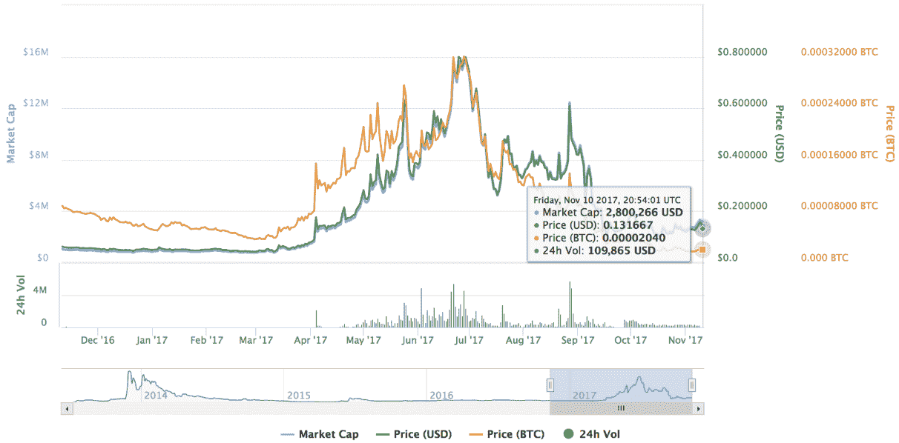

一张显示与 Primecoin 相关统计数据的图表

数据来源：https://coinmarketcap.com/currencies/primecoin/

# 挖矿指南

第一步是下载一个钱包。Primecoin 支持在钱包内进行本地挖矿，就像原始的比特币客户端一样，但也可以通过各种在线云服务提供商在云上挖矿。

以下是一个快速的 Windows 指南，Linux 客户端也可在 [http://primecoin.io/downloads.php](http://primecoin.io/downloads.php) 上获得。

1.  第一步是从 [http://primecoin.io/index.php](http://primecoin.io/index.php) 下载 Primecoin 钱包。

1.  一旦钱包安装并与网络同步，可以通过以下步骤开始挖矿。可以通过单击帮助菜单并选择调试窗口菜单项在 Primecoin 钱包中打开调试窗口。在调试窗口的控制台窗口中键入 `help` 可以调用其他帮助，用于启用 Primecoin 挖矿功能：

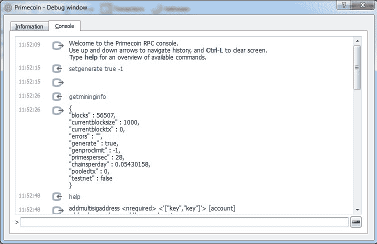

Primecoin 挖矿

1.  一旦前述命令成功执行，挖矿将在单机模式下开始。如果您使用的是配置较低的个人电脑并且 CPU 较慢，这可能不会很快也不会很有利可图，但由于这是一种使用 CPU 挖掘的加密货币，矿工可以使用配备强大 CPU 的个人电脑。作为替代，可以使用托管强大服务器硬件的云服务：

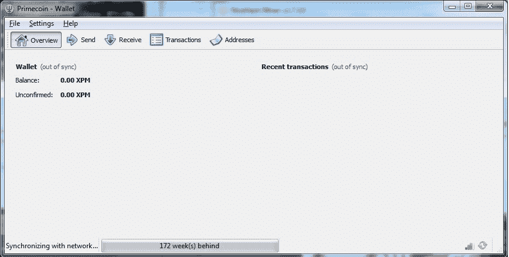

Primecoin 钱包软件，与网络同步

Primecoin 源代码可在 [https://github.com/primecoin/primecoin](https://github.com/primecoin/primecoin) 上获得。

Primecoin 是一个新颖的概念，它引入的 PoW 具有很大的科学意义。它仍在使用，市值为 $17,034,198 美元，但从 GitHub 的不活跃可以看出，没有进行进一步的开发。

读者可以通过阅读 Sunny King（化名）的 Primecoin 白皮书进一步探索 Primecoin：[http://primecoin.io/bin/primecoin-paper.pdf](http://primecoin.io/bin/primecoin-paper.pdf)。

# Zcash

Zcash 在 2016 年 10 月 28 日推出。这是第一种使用特定类型的 ZKPs（称为**零知识简洁非交互式知识证明**，**ZK-SNARKs**）为用户提供完全隐私的货币。这些证明简洁易验证；但是，设置初始公共参数是一个复杂的过程。后者包括两个密钥：证明密钥和验证密钥。该过程需要对一些随机数进行采样以构造公共参数。问题在于这些随机数，也称为有毒废物，必须在参数生成后销毁，以防止伪造 Zcash。

为此，Zcash 团队提出了一种多方计算协议，可以从独立位置协作生成所需的公共参数，以确保不会产生有毒废物。由于这些公共参数需要由 Zcash 团队创建，这意味着仪式参与者是受信任的。这就是为什么仪式非常开放，并通过使用多方计算机制进行的原因。

此机制具有一种属性，即必须破坏所有仪式参与者才能破坏最终参数。当仪式完成时，所有参与者都会摧毁用于生成私钥的设备。这一举动消除了设备上参与者私钥部分的任何痕迹。

ZK-SNARKs 必须满足完备性、准确性、简洁性和非交互性的属性。完备性意味着存在一种明确的策略，使证明者能够满足验证者断言为真。另一方面，准确性意味着没有证明者能够说服验证者错误的声明为真。简洁性意味着证明者和验证者之间传递的消息大小很小。

最后，非交互性质意味着可以在没有任何交互或非常少的交互情况下验证断言的正确性。此外，作为零知识证明，还需要满足零知识性质（在[第 6 章](c49f1747-2096-4ab6-a1e1-334e092ef2be.xhtml)中讨论，*公钥密码学)*。

Zcash 开发人员引入了**去中心化匿名支付方案**（**DAP 方案**）的概念，该方案用于在 Zcash 网络中实现直接和私密支付。交易不透露有关支付的来源、目的地和金额的任何信息。Zcash 中有两种类型的地址，Z 地址和 T 地址。Z 地址基于 ZKPs 并提供隐私保护，而 T 地址类似于比特币的地址。Zcash 各种属性的快照（经过初始缓慢启动后）如下所示：

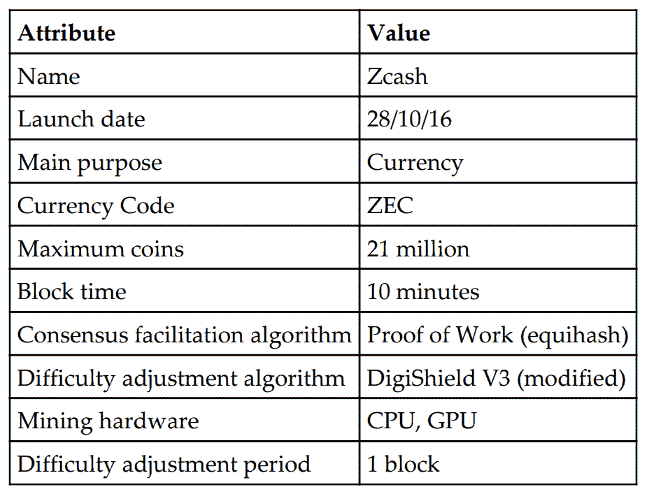

Zcash 属性摘要

Zcash 使用一种名为非对称 PoW（Equihash）的高效 PoW 方案，它基于*广义生日问题*。它允许非常高效的验证。这是一种内存硬算法，抗 ASIC。Zcash 引入了一个新颖的概念（初始慢挖），这意味着区块奖励会在一段时间内逐渐增加，直到达到第 20,000 个区块。这使得网络可以进行初始扩展和早期矿工的试验，并在需要时由 Zcash 开发人员进行调整。由于稀缺性，慢启动对价格产生了影响，因此 ZEC 在推出的第一天达到了约 25,000 美元的价格。Zcash 中实现了稍作修改的 DigiShield 难度调整算法。公式如下所示：

*(下一个难度) = (上一个难度) x 根号 [ (150 秒) / (上一个解决时间) ]*

# 交易 Zcash

Zcash 可以在 CryptoGo ([https://cryptogo.com](https://cryptogo.com)) 等主要数字货币交易所购买。另一个可以购买或出售 Zcash 的交易所是 Crypto Robot 365 ([https://cryptorobot365.com](https://cryptorobot365.com))。Zcash 推出时价格非常高。如下图所示，价格一度飙升至每个 Zcash 约十个比特币。一些交易所的订单甚至高达 2,500 BTC 每个 ZEC。撰写时（2018 年 3 月）ZEC 的价格约为 311 美元：

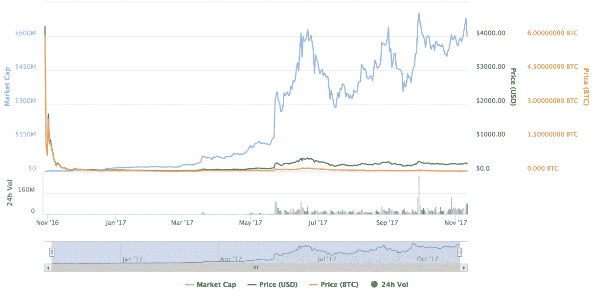

Zcash 市值和价格

# 挖矿指南

有多种方法可以挖掘 Zcash。目前，CPU 和 GPU 挖掘都是可能的。各种商业云挖矿池还提供挖掘 Zcash 的合约。要在 Ubuntu Linux 上使用 CPU 进行独立挖掘，可以按照以下步骤进行：

1.  第一步是使用以下命令安装先决条件：

```
 $ sudo apt-get install \ 
        build-essential pkg-config libc6-dev m4 g++-multilib \   
        autoconf libtool ncurses-dev unzip git python \ 
        zlib1g-dev wget bsdmainutils automake 
```

如果先决条件已安装，将显示一条消息，指示组件已是最新版本。如果尚未安装或版本旧于最新包，则安装将继续，将下载所需软件包，并完成安装。

1.  接下来，根据以下截图中所示的命令从 Git 克隆 Zcash：

```
 $ git clone https://github.com/zcash/zcash.git 
```

请注意，如果您是第一次运行 `git`，则可能需要接受一些配置更改，这些更改将自动完成，但您可能需要进行交互式操作。

此命令将在本地克隆 Zcash Git 仓库。输出如下所示的截图：

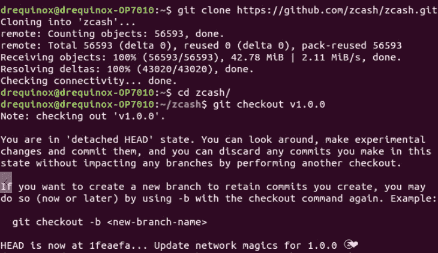

克隆 Zcash Git 仓库

1.  下一步是通过以下命令下载证明和验证密钥：

```
 $ ./zcutil/fetch-param.sh
```

此命令将产生与此处所示相似的输出：

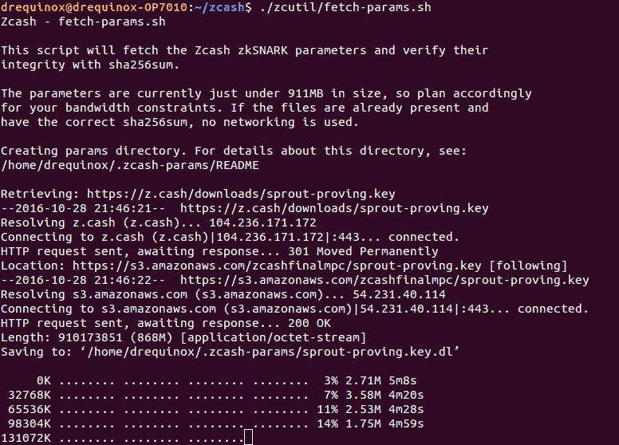

Zcash 设置获取 ZK-SNARK 参数

1.  运行此命令后，将下载约911 MB的密钥到`~/.zcash-params/`目录中。该目录包含用于证明和验证密钥的文件：

```
 $ pwd 
      /home/drequinox/.zcash-params 
      $ ls -ltr 
      sprout-verifying.key 
      sprout-proving.key
```

1.  一旦前述命令成功完成，就可以使用以下命令构建源代码：

```
       $ ./zcutil/build.sh -j$(nproc) 
```

这将产生非常长的输出；如果一切顺利，将产生一个`zcashd`二进制文件。请注意，此命令将`nproc`作为参数，`nproc`基本上是一个查找系统中核心或处理器数量并显示该数字的命令。如果您没有该命令，则将`nproc`替换为系统中的处理器数量。

1.  构建完成后，下一步是配置Zcash。这通过在`~/.zcash/`目录中创建名为`zcash.conf`的配置文件来实现。

示例配置文件如下所示：

```
      addnode=mainnet.z.cash 
      rpcuser=drequinox 
      rpcpassword=xxxxxxoJNo4o5c+F6E+J4P2C1D5izlzIKPZJhTzdW5A= 
      gen=1 
      genproclimit=8 
      equihashsolver=tromp 
```

前述配置启用了各种功能。第一行添加了主网节点并启用了主网连接。`rpcuser`和`rpcpassword`是RPC接口的用户名和密码。`gen = 1`用于启用挖矿。`genproclimit`是可用于挖矿的处理器数量。最后一行启用了更快的挖矿求解器；如果要使用标准CPU挖矿，则不需要此项。

1.  现在可以使用以下命令启动Zcash：

```
 $ ./zcashd --daemon 
```

启动后，可以通过`zcash-cli`命令行界面与RPC接口进行交互。这几乎与比特币命令行界面相同。一旦Zcash守护进程启动并运行，可以运行各种命令来查询Zcash的不同属性。可以使用CLI或区块链浏览器在本地查看交易。

Zcash的区块链浏览器位于：[https://explorer.zcha.in/](https://explorer.zcha.in/)。

# 地址生成

可以使用以下命令生成新的Z地址：

```
$ ./zcash-cli z_getnewaddress zcPDBKuuwHJ4gqT5Q59zAMXDHhFoihyTC1aLE5Kz4GwgUXfCBWG6SDr45SFLUsZhpcdvHt7nFmC 3iQcn37rKBcVRa93DYrA 
```

使用带有`getinfo`参数运行`zcash-cli`命令会产生以下截图中显示的输出。它显示了诸如`blocks`、`difficulty`和`balance`之类的有价值信息：

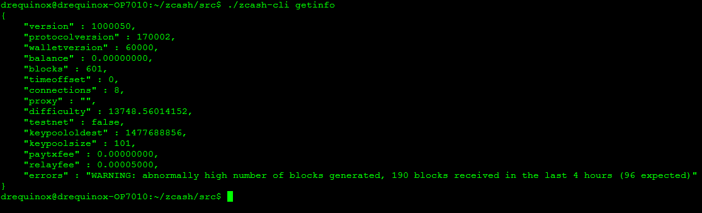

显示getinfo输出的截图

可以使用以下命令生成新的T地址：

```
$ ./zcash-cli getnewaddress  
t1XRCGMAw36yPVCcxDUrxv2csAAuGdS8Nny 
```

# GPU挖矿

除了CPU挖矿外，还提供了GPU挖矿选项。目前尚无官方GPU矿工；然而，开源开发人员已经制作了各种概念验证和可用的矿工。Zcash公司举办了一场公开竞赛，鼓励开发人员构建并提交CPU和GPU矿工。截至撰写时尚未宣布获奖者。

读者可以通过访问网站[https://zcashminers.org/](https://zcashminers.org/)获取更多信息。

还有另一种挖矿方式：使用来自各种在线云挖矿提供商提供的云挖矿合约。云挖矿服务提供商代表客户进行挖矿。除了云挖矿合约，矿工还可以使用自己的设备通过矿池使用stratum或其他协议进行挖矿。一个重要的例子是NiceHash提供的Zcash矿池，链接在：[https://www.nicehash.com](https://www.nicehash.com)。使用该矿池，矿工可以出售他们的哈希功率。

下图显示了在Zcash挖矿矿池上构建并使用CPU矿工的示例。

# 下载并编译nheqminer

可以使用以下步骤在Ubuntu Linux发行版上下载和编译`nheqminer`：

```
$ sudo apt-get install cmake build-essential libboost-all-dev git clone https://github.com/nicehash/nheqminer.git 
$ cd nheqminer/nheqminer  
$ mkdir build 
$ cd build  
$ cmake .. make 
```

所有步骤都成功完成后，可以使用以下命令运行`nhequminer`：

```
$ ./nhequminer -l eu -u <btc address> -t <number of threads>  
```

`nheqminer`的版本可在以下链接下载，适用于Windows和Linux系统:

[https://github.com/nicehash/nheqminer/releases](https://github.com/nicehash/nheqminer/releases)

`nheqminer`需要多个参数，如位置(`-l`)、用户名(`-u`)和用于挖矿的线程数(`-t`)。

下图显示了在Linux上运行Zcash的样本`nheqminer`。在此截图中，支付是以比特币地址进行的，用于出售哈希功率：

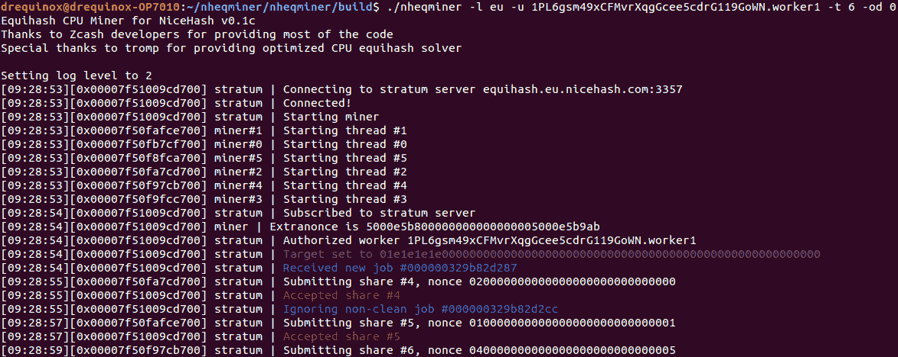

使用BTC地址接收出售哈希功率的支付

此处显示的截图展示了在Windows上运行`nheqminer`并将支付发到Zcash T地址的样本运行情况：

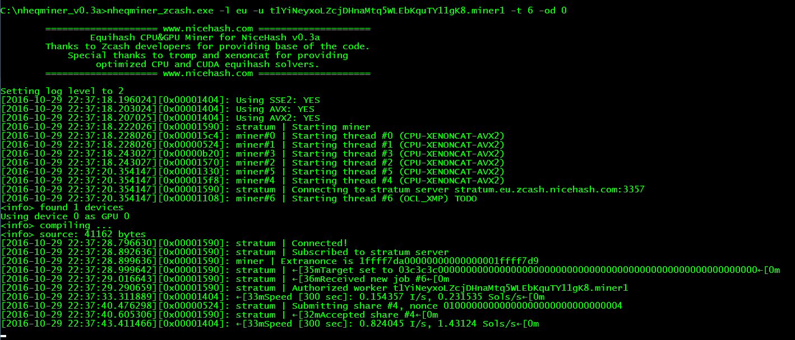

使用Zcash T地址接收出售哈希功率的支付

Zcash以创新的方式使用了零知识证明技术，并为未来需要固有隐私的应用铺平了道路，如银行、医学或法律。

本节介绍了Zcash的简介；读者可以在[https://z.cash](https://z.cash)上在线探索更多关于Zcash的信息。

# 首次代币发行（ICOs）

ICOs类似于**首次公开发行**(IPO)。就像IPO是公司为了筹集资金而启动的一样，ICO是为了为初创项目筹集资金而启动的。关键区别在于IPO受到监管，并且属于证券市场的范畴（公司的股份），而ICO则不受监管，不属于任何已建立市场结构的严格类别。

然而，鉴于最近几个月推出的一些骗局ICO方案以及对投资者保护日益增长的担忧，有一些建议认为ICO应被视为证券。最近，证券交易委员会（SEC）建议所有硬币、ICO、数字资产均属于*证券*的定义。这意味着对ICO、比特币和其他数字硬币适用的法律将与证券适用的相同。此外，正式的“了解您的客户”（KYC）和“反洗钱”（AML）也被建议引入以解决与洗钱有关的问题。专家建议*豪伊测试*作为将任何ICO视为证券的一些标准。

另一个区别是，ICO通常要求投资者使用加密货币投资，并使用加密货币支付回报，最常见的是ICO引入的新代币（新加密货币）。这也可以是法定货币，但最常见的是使用加密货币。例如，在以太坊众筹活动中，引入了一种新代币Ether。代币拍卖众筹的术语也非常流行，这两个术语可互换使用。ICO也被称为众筹销售。

当一个基于新区块链的应用程序或组织发布时，可以同时推出一个新代币作为访问和使用该应用程序的凭证，并以已建立的加密货币（例如比特币或以太币）或法定货币交换公开发行这个代币。优势在于，随着应用程序或产品的使用量增加，新代币的价值也会随之增加。这样，最初投资的投资者将获得良好的激励。

在2017年，ICO已成为新创企业筹集资本的主要工具。第一个成功的ICO是以太坊，在2014年筹集了1800万美元。最近的成功案例是 Tezos，在几周内筹集了2.32亿美元。另一个例子是 Filecoin，筹集了超过2.5亿美元。

在以太坊区块链上创建新代币的过程已经标准化，因此相对容易启动一个ICO，并以以太币、比特币或其他加密货币交换新代币。这个标准称为ERC20，将在下一节中详细描述。值得注意的是，使用ERC20并不是必须的，完全可以在新的区块链上创造一个全新的加密货币来启动ICO，但最近多个ICO中都使用了ERC20，并为ICO构建代币提供了相对较简单的方式。

最近，ICO在以太坊之外的平台上也提供，如 NEM（[https://nem.io](https://nem.io)）和 Stellar（[https://www.stellar.org](https://www.stellar.org)）。

# ERC20 代币

ERC20 代币是一个接口，定义了各种功能，规定了代币的要求。然而，它并没有提供实现细节，而是留给实施者决定。ERC 基本上是**以太坊请求评论**的缩写，相当于比特币的 BIPs，用于提出以太坊区块链的改进建议。

这在 EIP 20 下定义，你可以在此处阅读更多信息：[https://github.com/ethereum/EIPs/blob/master/EIPS/eip-20-token-standard.md](https://github.com/ethereum/EIPs/blob/master/EIPS/eip-20-token-standard.md)。

由于能够创建新代币并且具有 ERC20 标准，以太坊正在成为 ICO 的选择平台，它变得更加易于访问。

ERC20 代币标准定义了描述新代币的各种属性、规则和特性的各种功能。这些包括货币的总供应量、持有者的总余额、转账功能、批准和授权功能。

还有其他标准，如 ERC223、ERC777 和 ERC20 的扩展称为 ERC827 也正在开发中。

您可以参考以下链接了解更多信息：

+   [https://github.com/ethereum/EIPs/issues/827](https://github.com/ethereum/EIPs/issues/827)

+   [https://github.com/ethereum/EIPs/issues/223](https://github.com/ethereum/EIPs/issues/223)

+   [https://github.com/ethereum/EIPs/issues/777](https://github.com/ethereum/EIPs/issues/777)

# 概要

在本章中，我们向您介绍了整个加密货币领域。我们详细讨论了许多替代币，尤其是 Zcash 和 Namecoin。加密货币是一个非常活跃的研究领域，尤其是围绕可扩展性、隐私和安全方面。一些研究也已经进行，以发明新的难度重新调整算法，以阻止加密货币中央化的威胁。

需要在隐私和尤其是区块链的可扩展性领域进行进一步研究。

现在您应该能够理解代币概念及其背后的各种动机。我们还讨论了一些实际方面，例如挖矿和启动新的货币项目，这希望能够为您奠定坚实的基础，使您能够进一步探索这些领域。代币是一个令人着迷的研究领域，它为去中心化的未来打开了许多可能性。
