# 第十一章：开发工具和框架

本章介绍了用于以太坊智能合约开发的开发工具、语言和框架。我们将研究开发以太坊区块链智能合约的不同方法。我们将详细讨论 Solidity 语言的各种结构，这是目前以太坊智能合约开发中最流行的开发语言。

本章将介绍以下主题：

+   开发工具、集成开发环境和客户端

    +   Remix

    +   Ganache

    +   EthereumJS

    +   TestRPC

    +   MetaMask

    +   Truffle

+   先决条件

    +   Node

    +   Node 包管理器（NPM）

+   其他工具和实用程序

有许多工具可用于以太坊开发。下图显示了用于以太坊的各种开发工具、客户端、集成开发环境和开发框架的分类：

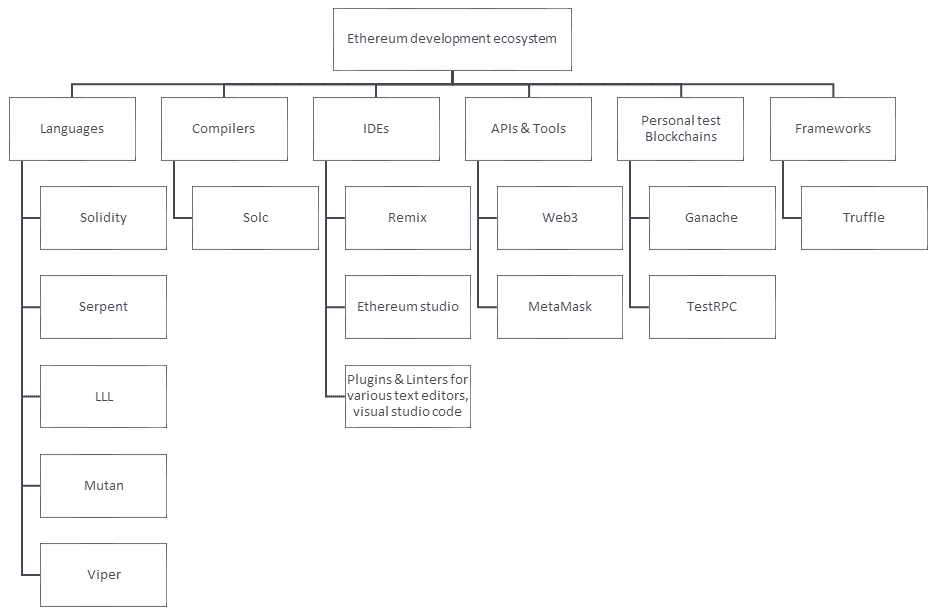

以太坊开发生态系统组件的分类

上述分类并未包括所有用于以太坊开发的框架和工具。它展示了最常用的工具和框架，也是我们在本章中将要用到的工具和框架。

有许多与以太坊开发工具相关的资源可在以下地址找到：[`ethdocs.org/en/latest/contracts-and-transactions/developer-tools.html#developer-tools`](http://ethdocs.org/en/latest/contracts-and-transactions/developer-tools.html#developer-tools)。

本章的主要重点将放在 Geth、Remix IDE、Solidity、Ganache、MetaMask、solc 和 Truffle 上。其他元素，如先决条件（Node），也将简要讨论。

# 语言

以太坊区块链的智能合约可以用多种语言编程。有五种语言可用于编写合同：

+   **Mutan**：这是一种类似 Go 的语言，于 2015 年初被废弃，已不再使用。

+   **LLL**：这是一种**低级别的 Lisp 式语言**，因此被命名为 LLL。这也不再使用。

+   **Serpent**：这是一种简单、清洁的类似 Python 的语言。它不再用于合同开发，并且不再得到社区支持。

+   **Solidity**：此语言现已成为几乎是以太坊合同编写的标准。本章将重点讨论这种语言，并在后续章节中进行详细讨论。

+   **Vyper**：这种语言是一种类似 Python 的实验性语言，旨在为智能合约开发带来安全性、简单性和可审计性。

# 编译器

编译器用于将高级合同源代码转换为以太坊执行环境能理解的格式。Solidity 编译器是最常用的一个，并在此处讨论。

# Solidity 编译器（solc）

solc 将高级 Solidity 语言转换为**以太坊虚拟机**（**EVM**）字节码，以便在区块链上由 EVM 执行。

# 在 Linux 上安装

solc 可以在 Linux Ubuntu 操作系统上安装，使用以下命令：

```
$ sudo apt-get install solc 
```

如果 PPA 尚未安装，可以通过运行以下命令来安装它们：

```
$ sudo add-apt-repository ppa:ethereum/ethereum  
$ sudo apt-get update 
```

为了验证 solc 的现有版本并验证其是否已安装，可以使用以下命令：

```
$ solc --version
solc, the solidity compiler commandline interface
Version: 0.4.19+commit.c4cbbb05.Darwin.appleclang  
```

# 在 macOS 上安装

要在 macOS 上安装 solc，请执行以下命令：

```
$ brew tap ethereum/ethereum $ brew install solidity $ brew linkapps solidity  
```

solc 支持各种功能。一些示例如下所示：

+   以二进制格式显示合约：

```
 $ solc --bin Addition.sol  
```

该命令将生成类似以下的输出。这显示了二进制翻译的内容。

`Addition.sol` 合约代码：

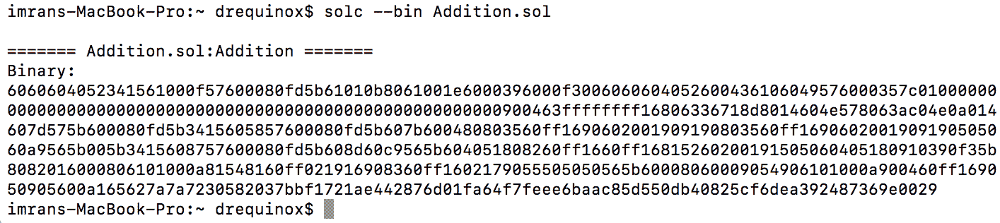

Solidity 编译器的二进制输出

+   估算 gas：

```
 $ solc --gas Addition.sol
```

这将产生以下输出：

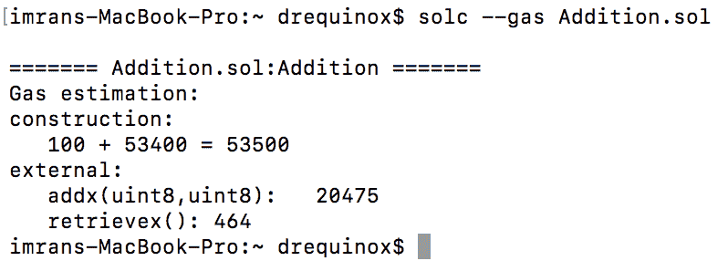

使用 solc 估算 gas

+   生成 ABI：

```
 $ solc --abi Addition.sol 
```

以下是 `Addition.abi` 的内容：

```
      ======= Addition.sol:Addition ======= 
      Contract JSON ABI  
      [{"constant":false,"inputs":[{"name":"y","type":"uint8"},   
      {"name":"z","type":"uint8"}],"name":"addx","outputs":
      [],"payable":false,"stateMutability":"nonpayable","type":"function"},{"constant":true,"inputs":
      [],"name":"retrievex","outputs":   
      [{"name":"","type":"uint8"}],"payable":false,"stateMutability":"view","type":"function"}] 
```

+   编译：

另一个有用的命令，用于编译并生成一个二进制编译文件以及一个 ABI，如下所示：

```
 $ solc --bin --abi --optimize -o bin Addition.sol
```

该命令将在输出目录 `bin` 中产生两个文件：

+   +   `Addition.abi`：这包含智能合约的 Application Binary Interface，以 JSON 格式表示

    +   `Addition.bin`：这包含智能合约代码的二进制表示

两个文件的输出显示在以下截图中：

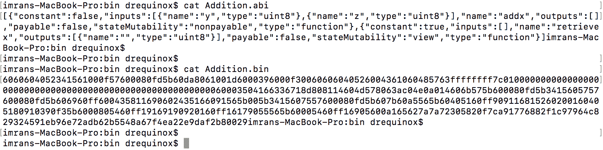

Solidity 编译器的 ABI 和二进制输出

**ABI** 是 **Application Binary Interface** 的缩写。ABI 对智能合约的函数和事件的信息进行编码。它充当 EVM 级字节码和高级智能合约程序代码之间的接口。要与部署在以太坊区块链上的智能合约进行交互，外部程序需要 ABI 和智能合约的地址。

solc 是一个非常强大的命令，可以使用 `--help` 标志来探索更多选项，该选项将显示详细选项。但是，用于编译、ABI 生成和 gas 估算的前述命令应该对大多数开发和部署需求足够了。

# 集成开发环境（IDE）

有各种各样的 IDE 可用于 Solidity 开发。大多数 IDE 都可以在线使用，并通过 web 界面呈现。Remix（曾用名为浏览器 Solidity）是构建和调试智能合约最常用的 IDE。在此讨论它。

# Remix

Remix 是基于 web 的环境，用于使用 Solidity 开发和测试合约。它是一个功能丰富的 IDE，不在实时区块链上运行；实际上，它是一个模拟环境，合约可以在其中部署、测试和调试。

可在 [`remix.ethereum.org`](https://remix.ethereum.org) 找到。

示例接口如下所示：

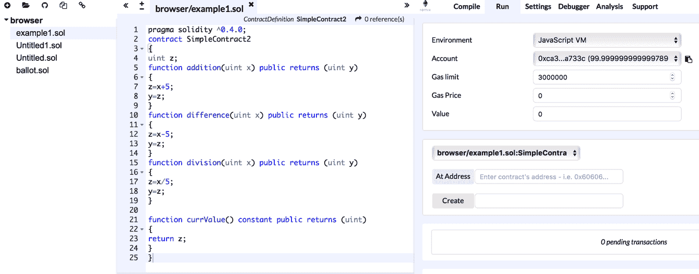

Remix IDE

在左侧，有一个带有语法高亮和代码格式化的代码编辑器，右侧有许多可用于部署、调试、测试和与合约交互的工具。

可以使用各种功能，例如交易交互，连接到 JavaScript VM 的选项，执行环境的配置，调试器，形式验证和静态分析。它们可以配置为连接到执行环境，例如 JavaScript VM，注入的 Web3——Mist、MetaMask 或类似环境提供了执行环境——或者 Web3 提供程序，它允许通过 IPC 或 RPC over HTTP（Web3 提供程序端点）连接到本地运行的以太坊客户端（例如 `geth`）。

Remix 还具有针对 EVM 的调试器，非常强大，可用于执行详细级别的跟踪和分析 EVM 字节码。下面是一个示例：

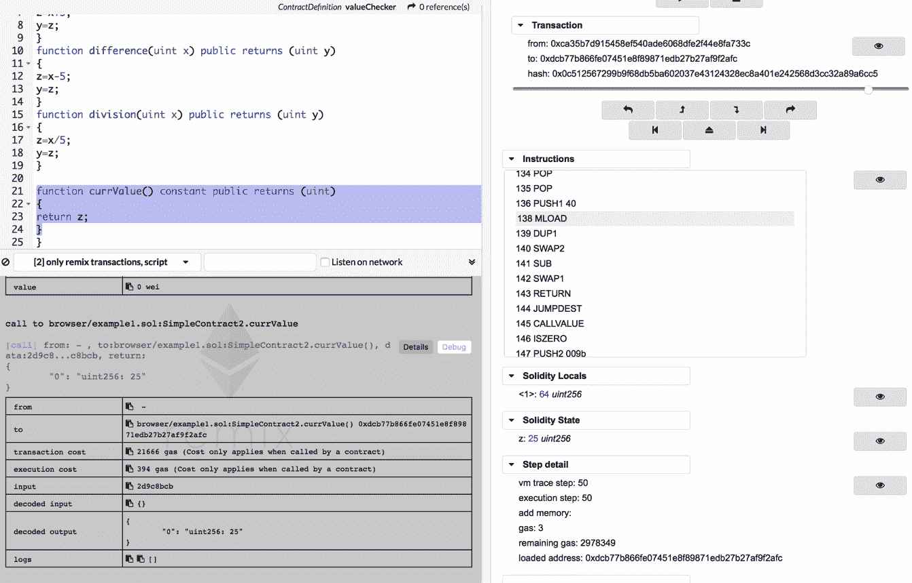

Remix IDE，调试

上面的截图显示了 Remix IDE 的不同元素。左上角显示了源代码。下面是输出日志，显示了与合约的编译和执行相关的信息消息和数据。

下面的截图显示了 Remix 调试器的更多细节。它将源代码解码为 EVM 指令。用户可以逐步执行每个指令，并且可以检查当执行时源代码的作用：

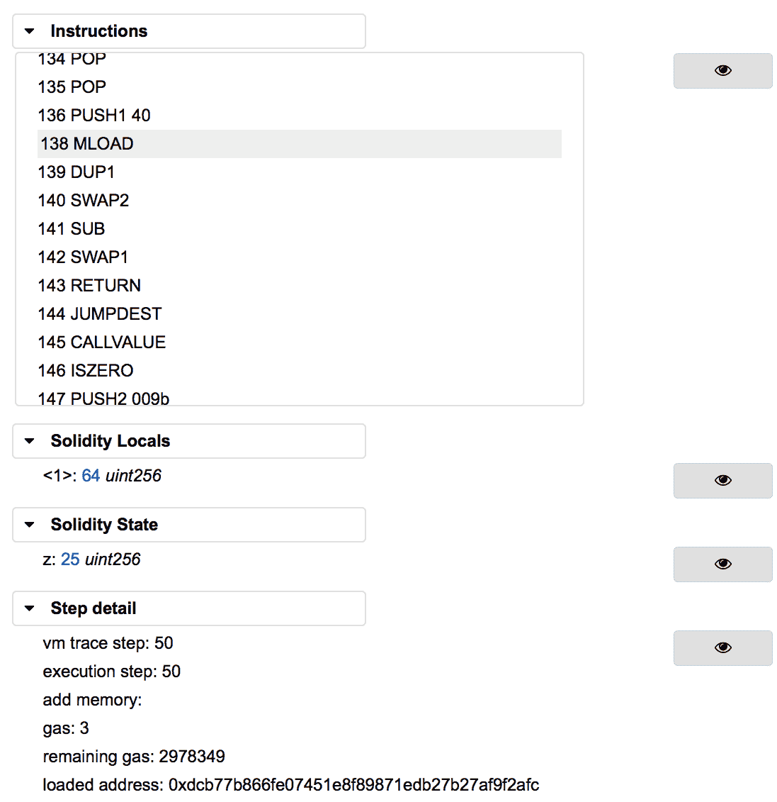

Remix 调试器

# 工具和库

有各种工具和库可用于以太坊。最常见的是在这里讨论的。

在本节中，我们将首先安装开发以太坊应用程序所需的先决条件。首先要求是 Node，接下来将看到。

# Node 版本 7

由于大多数工具和库都需要 Node，可以使用以下命令安装它：

```
$ curl -sL https://deb.nodesource.com/setup_7.x | sudo -E bash - sudo apt-get install -y nodejs 
```

# EthereumJS

有时候，在测试网上测试不可能，并且主网显然不是测试合约的地方。私有网有时候设置起来可能很耗时。当需要快速测试而又没有合适的测试网时，EthereumJS 的 TestRPC 就非常方便了。它使用 EthereumJS 模拟 Ethereum `geth` 客户端的行为，并允许进行更快的开发测试。TestRPC 可以通过`npm`作为一个 Node 软件包获得。

在安装 TestRPC 之前，Node 应该已经被安装，并且`npm`软件包管理器也应该可用。

可以使用此命令安装 TestRPC：

```
$ npm install -g ethereumjs-testrpc 
```

要启动 `testrpc`，只需发出此命令并使其在后台运行，然后打开另一个终端以处理合约：

```
$ testrpc  
```

当 TestRPC 运行时，它将显示类似于以下截图所示的输出。它将自动生成十个帐户和私钥，以及 HD 钱包。它将开始监听 TCP 端口`8545`上的传入连接。

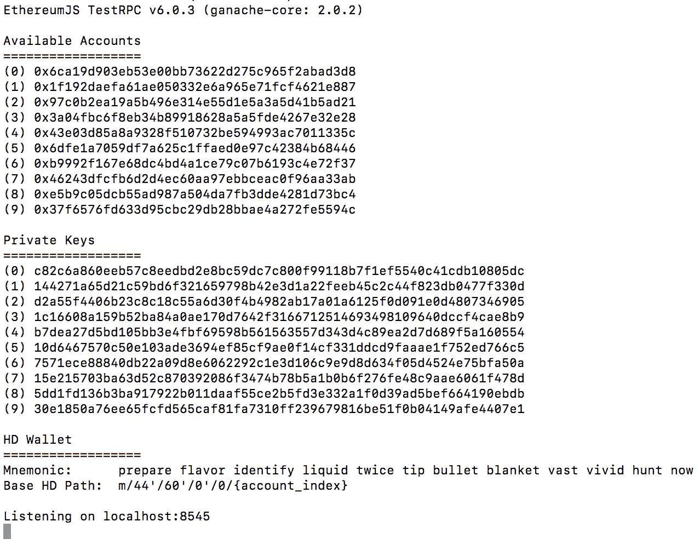

TestRPC

# Ganache

Ganache 是为以太坊开发的众多开发工具和库的最新增加。这在某种程度上是 TestRPC 的替代品，使用用户友好的图形用户界面来查看交易和块以及相关细节。这是一个完全工作的启用了 Byzantium 的个人区块链，用于为区块链提供本地测试环境。

Ganache 基于以太坊区块链的 JavaScript 实现，内置区块浏览器和挖矿功能，使在系统上进行本地测试非常容易。

如下截图所示，您可以在前端详细查看交易、块和地址：

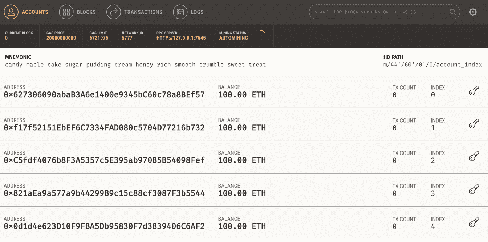

Ganache，一个个人以太坊区块链

Ganache 可以从[`truffleframework.com/ganache/`](http://truffleframework.com/ganache/)下载。

# MetaMask

MetaMask 允许通过 Firefox 和 Chrome 浏览器与以太坊区块链交互。它会在运行网站的 JavaScript 环境中注入一个`web3`对象，从而实现对 DApps 的即时接口功能。这种*注入*允许 DApps 直接与区块链交互。

它可以在[`metamask.io/`](https://metamask.io/)获得。

MetaMask 也允许账户管理。这在任何交易在区块链上执行之前充当验证方法。用户会看到一个安全界面来审查交易，然后批准或拒绝它，才能到达目标区块链。

它可以在[`github.com/MetaMask/metamask-plugin`](https://github.com/MetaMask/metamask-plugin)获得。

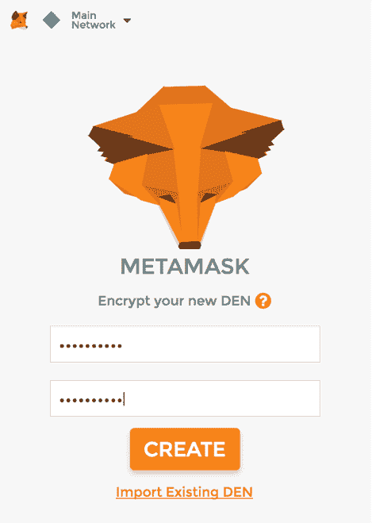

MetaMask

它允许与各种以太坊网络连接，如下截图所示。这是 MetaMask 的截图，它允许用户选择他们喜欢的网络：

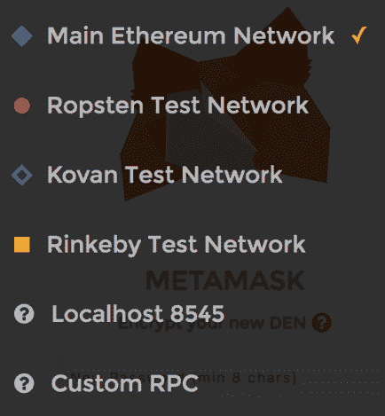

MetaMask 网络如 MetaMask 用户界面所示

值得注意的一个有趣功能是 MetaMask 也可以连接到任何自定义的 RPC，这允许您运行自己的区块链，例如本地或远程的私有网络，并允许您的浏览器连接到它。它还可以用于连接到本地运行的区块链，如 Ganache 和 TestRPC。

MetaMask 允许账户管理，并记录所有这些账户的交易。这在下面的截图中显示：


MetaMask 账户和交易视图

# Truffle

Truffle（在 [`truffleframework.com/`](http://truffleframework.com/) 上可用）是一个开发环境，使得测试和部署以太坊合约更加容易和简单。Truffle 提供合约编译和链接以及使用 Mocha 和 Chai 的自动化测试框架。它还使得更容易将合约部署到任何私有网络、公共网络或测试网络以太坊区块链中。此外，提供了资产管道，使所有 JavaScript 文件都可以被处理，使其可以被浏览器使用。

# 安装

在安装之前，假设`node`可用，可以像下面显示的那样查询。如果`node`不可用，则首先需要安装`node`才能安装`truffle`：

```
$ node -version 
v7.2.1 
```

安装`truffle`非常简单，可以使用以下命令通过**Node Package Manager**（**npm**）完成：

```
$ sudo npm install -g truffle 
```

这将花费几分钟的时间；安装完成后，可以使用`truffle`命令显示帮助信息并验证它是否正确安装：

```
$ sudo npm install -g truffle Password: /us/local/bin/truffle -> /usr/local/lib/node_modules/truffle/build/cli.bundled.js /usr/local/lib └── truffle@4.0.1  
```

在终端输入`truffle`以显示使用帮助：

```
$ truffle 
```

这将显示以下输出：

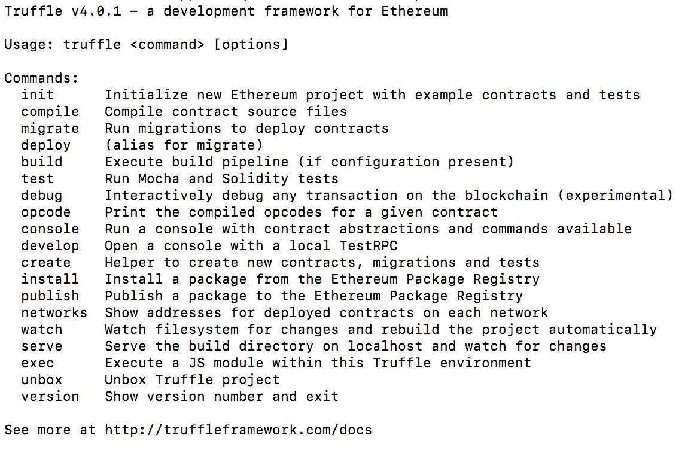

Truffle 帮助

或者，存储库可在 [`github.com/ConsenSys/truffle`](https://github.com/ConsenSys/truffle) 上找到，可以将其克隆到本地以安装`truffle`。可以使用以下命令使用 Git 克隆存储库：

```
$ git clone https://github.com/ConsenSys/truffle.git
```

# 合约开发和部署

开发和部署合约需要采取各种步骤。广义上来说，这些可以分为四个步骤：编写、测试、验证和部署。部署后，下一个可选步骤是创建用户界面并通过 Web 服务器向最终用户呈现。在不需要人类输入或监视的合约中，有时不需要 Web 界面，但通常需要创建 Web 界面来与合约交互。

# 写作

写作步骤涉及在 Solidity 中编写合约源代码。这可以在任何文本编辑器中完成。对于 Vim、Atom 和其他编辑器，有各种插件和附加组件可用于提供 Solidity 合约源代码的语法高亮和格式化。

Visual studio code 已经变得非常流行，并且通常用于 Solidity 开发。有一个 Solidity 插件可供使用，可以实现语法高亮、格式化和智能。可以通过 Visual Studio Code 中的扩展选项进行安装。

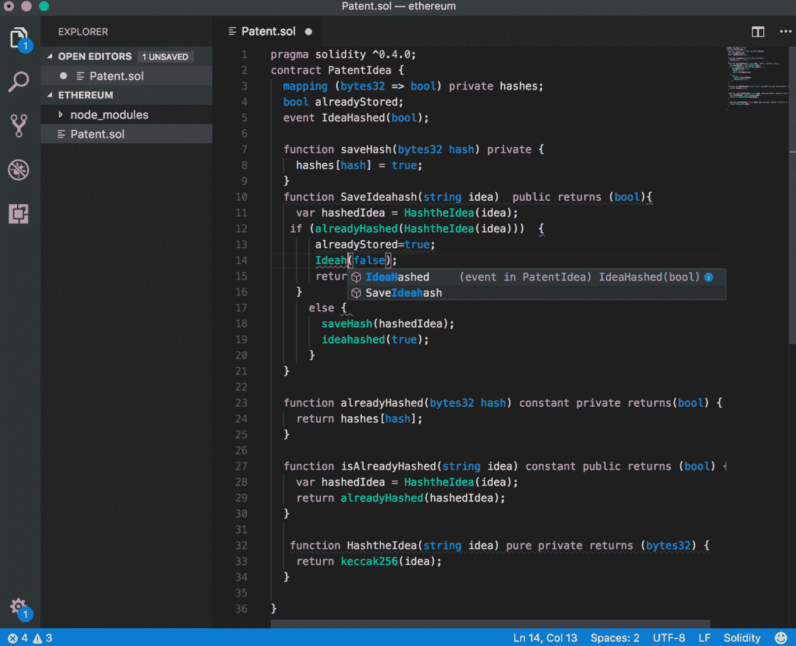

Visual studio code

# 测试

测试通常是通过自动化手段进行的。在本章的前面，您已经了解了 Truffle，它使用 Mocha 框架来测试合约。但是，也可以通过使用 Remix 手动运行函数并验证结果来执行手动功能测试。

在下一节中，你将会被介绍到 Solidity 语言。这是对 Solidity 的简要介绍，应提供编写合约所需的基本知识。其语法与 C 和 JavaScript 非常相似，编程起来相当容易。

# Solidity 语言

Solidity 是以太坊编写合约的领域特定语言的首选。然而，还有其他可用的语言，比如 Serpent、Mutan 和 LLL，但在撰写本文时，Solidity 是最流行的。它的语法更接近 JavaScript 和 C。

Solidity 在过去几年中发展成为一种成熟的语言，非常容易使用，但在成为像 Java、C 或 C Sharp 等其他成熟语言一样先进、标准化和功能丰富之前，还有很长的路要走。尽管如此，这仍然是目前编写合约最广泛使用的语言。

它是一种静态类型语言，这意味着在 Solidity 中，变量类型检查是在编译时进行的。每个变量，无论是状态变量还是局部变量，都必须在编译时指定一个类型。这在某种意义上是有益的，因为任何验证和检查都是在编译时完成的，某些类型的错误，比如数据类型的解释，可以在开发周期的早期被捕获，而不是在运行时，这可能是昂贵的，特别是在区块链/智能合约范式的情况下。语言的其他特性包括继承、库和定义复合数据类型的能力。

Solidity 也被称为面向合约的语言。在 Solidity 中，合约相当于其他面向对象编程语言中的类的概念。

# 类型

Solidity 有两类数据类型：**值类型** 和 **引用类型**。

# 值类型

这些在这里详细解释：

# 布尔

此数据类型有两个可能的值，`true` 或 `false`，例如：

```
bool v = true; 
bool v = false;  
```

此语句将值 `true` 分配给 `v`。

# 整数

此数据类型表示整数。以下表格显示了用于声明整数数据类型的各种关键字：

| **关键字** | **类型** | **详情** |
| --- | --- | --- |
| `int` | 有符号整数 | `int8` 到 `int256`，这意味着关键字从 `int8` 增加到 `int256`，例如，`int8`、`int16`、`int24`。 |
| `uint` | 无符号整数 | `uint8`、`uint16`、... 到 `uint256`，表示从 8 位到 256 位的无符号整数。变量的存储需求取决于需要存储多少位。 |

例如，在这段代码中，注意 `uint` 是 `uint256` 的别名：

```
uint256 x;  
uint y;  
uint256 z; 
```

这些类型也可以用 `constant` 关键字声明，这意味着编译器不会为这些变量保留存储槽。在这种情况下，每次出现都将被实际值替换：

```
uint constant z=10+10; 
```

状态变量在函数体外声明，并且根据分配给它们的可访问性和合约的持续时间保持可用。

# 地址

此数据类型持有 160 位长（20 字节）的值。该类型具有几个成员，可用于与合约交互和查询。这些成员在这里描述：

+   **余额**：`balance` 成员返回地址的 Wei 余额。

+   **发送**：此成员用于向地址（以太坊的 160 位地址）发送一定数量的以太，并根据交易结果返回`true`或`false`，例如：

```
      address to = 0x6414cc08d148dce9ebf5a2d0b7c220ed2d3203da; address from = this; 
      if (to.balance < 10 && from.balance > 50) to.send(20); 
```

+   **调用函数**：`call`、`callcode` 和 `delegatecall` 用于与没有 ABI 的函数交互。由于对合约的类型安全性和安全性的影响，应谨慎使用这些函数。

+   **数组值类型（固定大小和动态大小的字节数组）**：Solidity 具有固定大小和动态大小的字节数组。固定大小关键字从 `bytes1` 到 `bytes32`，而动态大小关键字包括 `bytes` 和 `string`。`bytes` 关键字用于原始字节数据，`string` 用于以 UTF-8 编码的字符串。由于这些数组是按值返回的，调用它们将产生 gas 成本。`length` 是数组值类型的一个成员，并返回字节数组的长度。

静态（固定大小）数组的示例如下：

```
      bytes32[10] bankAccounts; 
```

动态大小数组的示例如下：

```
      bytes32[] trades;  
```

使用以下代码获取交易长度：

```
      trades.length; 
```

# 字面量

这些用于表示固定值。下面的小节描述了不同类型的字面量。

# 整数字面量

整数字面量是一系列范围在 0-9 的十进制数字。示例如下：

```
uint8 x = 2; 
```

# 字符串字面量

字符串字面量指定用双引号或单引号编写的一组字符。示例如下：

```
'packt' "packt" 
```

# 十六进制字面量

十六进制字面量以关键字 `hex` 为前缀，并在双引号或单引号内指定。示例如下：

```
(hex'AABBCC'); 
```

# 枚举

这允许创建用户定义的类型。示例如下：

```
enum Order {Filled, Placed, Expired };  
Order private ord; 
ord=Order.Filled; 
```

枚举类型允许对所有整数类型进行显式转换。

# 函数类型

有两种函数类型：内部函数和外部函数。

# 内部函数

这些只能在当前合约的上下文中使用。

# 外部函数

外部函数可以通过外部函数调用来调用。

在 Solidity 中，**函数** 可以标记为常量。常量函数不能更改合约中的任何内容；只有在调用时返回值，而且不消耗任何 gas。这是对 *call* 概念的实际实现。

声明函数的语法如下所示：

```
function <nameofthefunction> (<parameter types> <name of the variable>) 
{internal|external} [constant] [payable] [returns (<return types> <name of the variable>)] 
```

# 引用类型

正如名称所示，这些类型是按引用传递的，并在以下部分讨论。这些也被称为**复杂类型**。

# 数组

数组表示内存位置处以相同大小和类型排列的一系列连续元素。该概念与任何其他编程语言相同。数组有两个成员名为`length`和`push`：

```
uint[] OrderIds; 
```

# 结构体

这些结构可用于将一组不同类型的数据分组到一个逻辑组中。这些可以用于定义新类型，如下例所示：

```
pragma solidity ⁰.4.0; 
contract TestStruct { 
  struct Trade 
  { 
    uint tradeid; 
    uint quantity; 
    uint price;  
    string trader; 
  } 

  //This struct can be initialized and used as below 

  Trade tStruct = Trade({tradeid:123, quantity:1, price:1, trader:"equinox"}); 

} 
```

# 数据位置

数据位置指定特定复杂数据类型将存储在何处。根据默认值或指定的注释，位置可以是存储或内存。这适用于数组和结构体，并可以使用`storage`或`memory`关键字指定。

由于在内存和存储之间进行复制可能相当昂贵，因此有时指定位置可以帮助控制燃气消耗。**调用数据**是另一个内存位置，用于存储函数参数。

外部函数的参数使用**调用数据**内存。默认情况下，函数的参数存储在**内存**中，而所有其他局部变量都使用**存储**。另一方面，状态变量需要使用存储。

# 映射

映射用于键值映射。这是一种将值与键关联的方法。此映射中的所有值都已初始化为零，例如以下内容：

```
mapping (address => uint) offers; 
```

此示例显示 offers 被声明为映射。另一个示例使此更清晰：

```
mapping (string => uint) bids;  
bids["packt"] = 10; 
```

这基本上是一个字典或哈希表，其中字符串值映射到整数值。名为`bids`的映射将字符串`packt`映射到值`10`。

# 全局变量

Solidity 提供了一些始终可用于全局命名空间的全局变量。这些变量提供有关块和交易的信息。此外，加密函数和与地址相关的变量也可用。

显示的可用函数和变量子集如下所示：

```
keccak256(...) returns (bytes32) 
```

此函数用于计算提供给函数的参数的 Keccak-256 哈希值：

```
ecrecover(bytes32 hash, uint8 v, bytes32 r, bytes32 s) returns (address) 
```

此函数返回椭圆曲线签名的公钥关联地址：

```
block.number 
```

这返回当前块编号。

# 控制结构

Solidity 语言中可用的控制结构是`if...else`、`do`、`while`、`for`、`break`、`continue`和`return`。它们的工作方式与其他语言（如 C 语言或 JavaScript）完全相同。

一些示例显示在这里：

+   **if**：如果`x`等于`0`，则将值`0`赋给`y`，否则将`1`赋给`z`：

```
      if (x == 0) 
          y = 0; 
      else 
          z = 1; 
```

+   **do**：在`z`大于`1`时递增`x`：

```
      do{ 
          x++; 
      } (while z>1); 
```

+   **while**：在`x`大于`0`时递增`z`：

```
      while(x > 0){ 
          z++; 
      } 
```

+   **for、break 和 continue**：执行一些工作，直到`x`小于或等于`10`。如果`z`是`5`，那么这个`for`循环将运行`10`次，然后中断：

```
      for(uint8 x=0; x<=10; x++) 
      { 
          //perform some work 
          z++ 
          if(z == 5) break; 
      } 
```

它将继续类似的工作，但在条件满足时，循环将重新开始。

+   **return**：Return 用于停止函数的执行并返回一个可选值。例如：

```
      return 0; 
```

它将停止执行并返回值`0`。

# 事件

Solidity 中的事件可用于记录 EVM 日志中的某些事件。当需要通知外部接口发生变化或事件发生时，这些事件非常有用。这些日志存储在区块链中的交易日志中。合约无法访问日志，但它们用作通知合约状态变化或事件发生（满足条件）的机制。

在这里的一个简单示例中，`valueEvent`事件将在函数`Matcher`传递的`x`参数等于或大于`10`时返回`true`：

```
pragma solidity ⁰.4.0;  
contract valueChecker  
{  
    uint8 price=10; 
    event valueEvent(bool returnValue);  
    function Matcher(uint8 x) public returns (bool) 
    { 
        if (x>=price) 
        { 
            valueEvent(true);  
            return true; 
        } 
    } 
} 
```

# 继承

Solidity 支持继承。`is`关键字用于从另一个合约派生合约。在下面的示例中，`valueChecker2`是从`valueChecker`合约派生出来的。派生合约具有对父合约的所有非私有成员的访问权限：

```
pragma solidity ⁰.4.0;  
contract valueChecker 
{ 
    uint8 price = 20; 
    event valueEvent(bool returnValue);  
    function Matcher(uint8 x) public returns (bool) 
    { 
        if (x>=price) 
        { 
            valueEvent(true);  
            return true; 
        } 
    } 
} 
contract valueChecker2 is valueChecker 
{ 
    function Matcher2() public view returns (uint) 
    { 
        return price+10; 
    } 
} 
```

在前面的示例中，如果将 `uint8 price = 20` 更改为 `uint8 private price = 20`，那么`valueChecker2`合约将无法访问它。这是因为现在该成员被声明为私有，不允许任何其他合约访问。在 Remix 中您将看到的错误信息为

```
browser/valuechecker.sol:20:8: DeclarationError: Undeclared identifier. 
return price+10; 
       ^---^ 
```

# 库

库只在特定地址部署一次，它们的代码通过 EVM 的 `CALLCODE` 或 `DELEGATECALL` 操作码调用。库背后的关键思想是代码的重复使用性。它们类似于合约，并作为调用合约的基础合约。一个库可以声明如下：

```
library Addition 
{ 
    function Add(uint x,uint y) returns (uint z) 
    { 
        return x + y; 
    } 
} 
```

然后可以在合约中调用此库，如下所示。首先需要导入它，然后可以在代码的任何地方使用它。一个简单的示例如下所示：

```
import "Addition.sol" 
function Addtwovalues() returns(uint) 
{ 
    return Addition.Add(100,100); 
} 
```

库存在一些限制；例如，它们不能拥有状态变量，也不能继承或被继承。此外，它们也不能接收以太币；这与合约相反，合约可以接收以太币。

# 函数

Solidity 中的函数是与合约关联的代码模块。函数声明包括名称、可选参数、访问修饰符、可选`constant`关键字和可选返回类型。如下例所示：

```
function orderMatcher (uint x)  
private constant returns(bool return value)  
```

在前面的示例中，`function`是声明函数所使用的关键字。`orderMatcher`是函数名，`uint x`是一个可选参数，`private`是控制外部合约访问该函数的**访问修饰符**或**说明符**，`constant`是一个可选关键字，用于指定该函数不会改变合约中的任何内容，而仅用于从合约中检索值，`returns (bool return value)`是函数的可选返回类型。

+   **如何定义函数**：定义函数的语法如下所示：

```
      function <name of the function>(<parameters>) <visibility specifier> returns 
      (<return data type> <name of the variable>) 
      { 
          <function body> 
      } 
```

+   **函数签名**：Solidity 中的函数由其签名标识，即其完整签名字符串的 Keccak-256 哈希的前四个字节。这也可以在 Remix IDE 中看到，如下面的屏幕截图所示。`f9d55e21` 是名为 `Matcher` 的函数的 32 字节 Keccak-256 哈希的前四个字节。

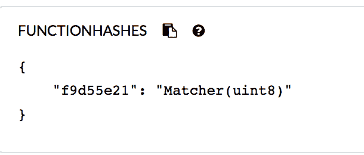

在 Remix IDE 中显示的函数哈希

在这个示例函数中，`Matcher` 的签名哈希为 `d99c89cb`。这些信息对于构建接口是有用的。

+   **函数的输入参数**：函数的输入参数以 `<数据类型> <参数名>` 的形式声明。这个例子阐明了 `checkValues` 函数的输入参数 `uint x` 和 `uint y` 的概念：

```
      contract myContract 
      { 
          function checkValues(uint x, uint y) 
          { 
          } 
      } 
```

+   **函数的输出参数**：函数的输出参数以 `<数据类型> <参数名>` 的形式声明。这个例子显示了一个简单的返回 `uint` 值的函数：

```
      contract myContract 
      { 
          function getValue() returns (uint z) 
          { 
              z=x+y; 
          } 
      } 
```

一个函数可以返回多个值。在前面的示例函数中，`getValue` 只返回一个值，但一个函数最多可以返回 14 个不同数据类型的值。未使用的返回参数的名称可以选择性地省略。

+   **内部函数调用**：在当前合约的上下文中，可以直接调用当前合约中的函数。这些调用导致 EVM 字节码级别的简单 `JUMP` 调用。

+   **外部函数调用**：外部函数调用是通过合约从一个合约向另一个合约发送消息调用的。在这种情况下，所有函数参数都会被复制到内存中。如果使用 `this` 关键字调用内部函数，它也被视为外部调用。`this` 变量是一个指针，指向当前合约。它可以显式转换为地址，并且所有合约的成员都是从地址继承的。

+   **回退函数**：这是一个没有参数和返回数据的合约中的未命名函数。每当接收到以太时，此函数都会执行。如果合约打算接收以太，则必须在合约内实现此函数；否则，将抛出异常并返回以太。如果合约中没有其他函数签名匹配，此函数也会执行。如果合约预期接收以太，则回退函数应该用可支付的 **修饰符** 声明。这个修饰符是必需的；否则，此函数将无法接收任何以太。此函数可以使用 `address.call()` 方法调用，例如：

```
      function () 
      { 
          throw; 
      } 
```

在这种情况下，如果根据前述条件调用了回退函数，则会调用 `throw`，这将使状态回滚到调用前的状态。它也可以是除 `throw` 之外的其他构造，例如，它可以记录一个事件，该事件可以作为反馈调用结果给调用应用程序的警报。

+   **修改器函数**：这些函数用于改变函数的行为，并且可以在其他函数之前调用。通常，它们用于在执行函数之前检查某些条件或验证。在修改器函数中使用 `_`（下划线），当调用修改器时将其替换为实际函数体。基本上，它象征着需要被*守护*的函数。这个概念类似于其他语言中的守护函数。

+   **构造函数**：这是一个可选函数，其名称与合约相同，并且在创建合约时执行。构造函数不能由用户后来调用，一个合约中只允许一个构造函数。这意味着没有重载功能可用。

+   **函数可见性修饰符（访问修饰符）**：函数可以用四个访问修饰符来定义，如下所示：

    +   **外部**：这些函数可以从其他合约和交易中访问。除非使用 `this` 关键字，否则不能在内部调用它们。

    +   **公共**：默认情况下，函数是公共的。它们可以在内部调用，也可以通过消息调用。

    +   **内部**：内部函数对来自父合约的其他派生合约可见。

    +   **私有**：私有函数只对声明它们的同一合约可见。

+   **函数修改器**：

    +   **纯净**：此修饰符禁止对状态进行访问或修改

    +   **视图**：此修饰符禁止对状态进行任何修改

    +   **可支付的**：此修饰符允许通过调用支付以太币

    +   **常量**：此修饰符不允许对状态进行访问或修改

+   **其他重要关键字/函数 throw**：`throw` 用于停止执行。因此，所有状态更改都将被还原。在这种情况下，没有气体返回给交易发起者，因为所有剩余的气体都被消耗掉了。

# Solidity 源代码文件的布局

在以下子节中，我们将看看 Solidity 源代码文件的组成部分。

# 版本声明

为了解决未来版本的 solc 版本可能出现的兼容性问题，`pragma` 可以用来指定兼容编译器的版本，例如：

```
pragma solidity ⁰.5.0 
```

这将确保源文件不会与小于 0.5.0 的版本以及从 0.6.0 开始的版本编译。

# 导入

在 Solidity 中，`import` 允许将现有 Solidity 文件中的符号导入到当前的全局范围。这类似于 JavaScript 中可用的 `import` 语句，例如：

```
import "module-name"; 
```

# 注释

注释可以以类似于 C 语言的方式添加在 Solidity 源代码文件中。多行注释用 `/*` 和 `*/` 括起来，而单行注释以 `//` 开头。

以下是一个 Solidity 程序示例，展示了`pragma`、`import`和注释的用法：

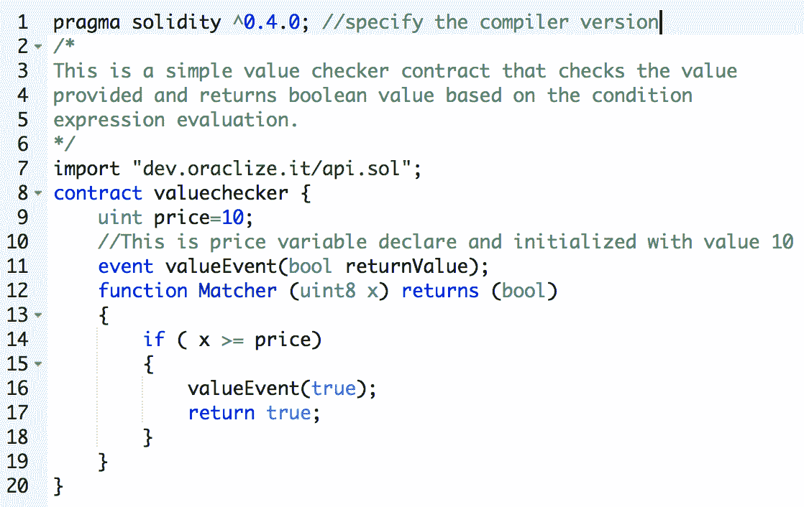

在 Remix IDE 中显示的 Solidity 程序示例

这完成了对 Solidity 语言的简要介绍。该语言非常丰富并在不断改进中。详细文档和编码指南可在网上查看：[`solidity.readthedocs.io/en/latest/`](http://solidity.readthedocs.io/en/latest/)。

# 摘要

本章从介绍以太坊的开发工具开始，如 Remix IDE。然后我们讨论了一些框架，比如 Truffle，还有用于开发和测试的本地区块链解决方案，例如 Ganache、EthereumJS 和 TestRPC。还探讨了其他工具，比如 MetaMask。引入了 Node 的安装，因为大多数工具都是基于 JavaScript 和 Node 的。
