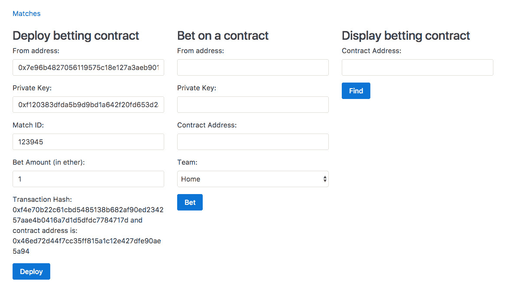

# 第十二章：构建一个投注应用程序

有时，智能合约需要访问其他 dapp 或全球网络中的数据是必要的。但由于技术和共识挑战，让智能合约访问外部数据确实很复杂。因此，目前，以太坊智能合约没有原生支持访问外部数据。但是有第三方解决方案供以太坊智能合约访问一些热门 dapp 和全球网络的数据。在本章中，我们将学习如何使用 Oraclize 从以太坊智能合约向全球网络发出 HTTP 请求以访问数据。我们还将学习如何访问存储在 IPFS 中的文件，使用字符串库处理字符串等等。我们将通过构建一个足球投注智能合约和一个客户端来学习所有这些。

在本章中，我们将涵盖以下主题：

+   Oraclize 是如何工作的？

+   Oraclize 有哪些不同的数据来源，它们各自是如何工作的？

+   Oraclize 中的共识如何工作？

+   将 Oraclize 集成到以太坊智能合约中

+   使用字符串库`Solidity`，使处理字符串变得更加简单。

+   构建一个足球投注应用程序。

# Oraclize 简介

Oraclize 是一项旨在使智能合约能够从其他区块链和全球网络中获取数据的服务。该服务目前在比特币和以太坊的测试网和主网上已经上线。使 Oraclize 如此特殊的是您无需信任它，因为它提供了所有提供给智能合约的数据的真实性证明。

本章的目标是学习以太坊智能合约如何使用 Oraclize 服务从全球网络获取数据。

# 它是如何工作的？

让我们看一下以太坊智能合约如何使用 Oraclize 从其他区块链和全球网络中获取数据的过程。

要获取存在于以太坊区块链之外的数据，以太坊智能合约需要向 Oraclize 发送查询，提及数据源（表示从哪里获取数据）和数据源的输入（表示获取什么）。

向 Oraclize 发送查询意味着向 Oraclize 合约发送合同调用（即内部交易）。

Oraclize 服务器不断寻找向其智能合约发出的新查询。每当它看到新的查询时，它就会获取结果并通过调用您合约的`_callback`方法将其发送回给您的合约。

# 数据来源

以下是 Oraclize 允许智能合约获取数据的来源列表：

+   URL：URL 数据源使您能够进行 HTTP GET 或 POST 请求，即从全球网络获取数据。

+   `WolframAlpha`：`WolframAlpha`数据源使您能够向`WolframAlpha`知识引擎提交查询并获取答案。

+   `区块链`：`区块链` 数据源允许您访问来自其他 `区块链` 的数据。可以提交给 `区块链` 数据源的可能查询有 `比特币区块链高度`、`莱特币哈希率`、`比特币难度`、`1NPFRDJuEdyqEn2nmLNaWMfojNksFjbL4S 余额` 等。

+   `IPFS`：`IPFS` 数据源使您能够获取存储在 `IPFS` 中的文件的内容。

+   `嵌套`：`嵌套` 数据源是一个元数据源；它不提供对其他服务的访问。它被设计为提供简单的聚合逻辑，使得可以基于任何可用的数据源进行单一查询，并生成单一的字符串作为结果；例如：

`[WolframAlpha] ${[IPFS] QmP2ZkdsJG7LTw7jBbizTTgY1ZBeen64PqMgCAWz2koJBL} 中的温度`。

+   `计算`：`计算` 数据源使给定应用程序在安全的链下环境中进行可审计的执行；也就是说，它允许我们获取应用程序的链下执行结果。该应用程序必须在退出之前（在标准输出上）打印查询结果。执行上下文必须由 Dockerfile 描述，其中构建和运行应用程序应该立即启动您的主应用程序。Dockerfile 初始化加上应用程序执行应尽快终止：在 `AWS t2.micro` 实例上的最大执行超时时间为 5 分钟。在这里，我们考虑的是 `AWS t2.micro` 实例，因为这是 Oraclize 将用来执行该应用程序的实例类型。由于数据源的输入是包含这些文件的 ZIP 存档的 IPFS 多哈希值（Dockerfile 加上任何外部文件依赖项，Dockerfile 必须放置在存档根目录中），您应该注意准备此存档并将其推送到 IPFS。

这些数据源是在撰写本书时可用的。但未来可能会有更多的数据源可用。

# 真实性证明

尽管 Oraclize 是一个值得信赖的服务，但您可能仍希望检查 Oraclize 返回的数据是否真实，即它是否在传输过程中被 Oraclize 或其他人操纵。

可选地，Oraclize 提供了从 URL、区块链和嵌套和计算数据源返回的 TLSNotary 结果证明。这个证明对于 `WolframAlpha` 和 `IPFS` 数据源不可用。目前，Oraclize 只支持 TLSNotary 证明，但在未来，他们可能支持一些其他的认证方式。目前，TLSNotary 证明需要手动验证，但是 Oraclize 已经在进行链上证明验证的工作；也就是说，你的智能合约代码可以在从 Oraclize 接收数据的同时验证 TLSNotary 证明，以便如果证明无效则丢弃这些数据。

这个工具（[`github.com/Oraclize/proof-verification-tool`](https://github.com/oraclize/proof-verification-tool)）是 Oraclize 提供的开源工具，用于验证 TLSNotary 证据，如果您愿意的话。

理解 TLSNotary 的工作原理并不是使用 Oraclize 或验证证据的必需条件。验证 TLSNotary 证据的工具是开源的；因此，如果其中包含任何恶意代码，那么它可以很容易被发现，因此可以信任这个工具。

让我们来看一下 TLSNotary 如何工作的高层概述。要理解 TLSNotary 的工作原理，首先需要了解 TLS 的工作原理。TLS 协议提供了一种让客户端和服务器创建加密会话的方式，以便其他人无法读取或操纵客户端和服务器之间传输的内容。服务器首先向客户端发送其证书（由受信任的 CA 颁发给域所有者），该证书将包含服务器的公钥。客户端使用 CA 的公钥解密证书，以便可以验证证书实际由 CA 颁发并获取服务器的公钥。然后，客户端生成对称加密密钥和 MAC 密钥，并使用服务器的公钥对其进行加密，然后将其发送给服务器。服务器只能解密此消息，因为它有解密该消息的私钥。现在客户端和服务器共享相同的对称和 MAC 密钥，除此之外，没有其他人知道这些密钥，它们可以开始相互发送和接收数据。对称密钥用于加密和解密数据，其中 MAC 密钥和对称密钥一起用于为加密消息生成签名，以便在消息被攻击者修改时，另一方可以知道。

TLSNotary 是 TLS 的修改版，由 Oraclize 使用以提供密码学证明，证明它们提供给您的智能合约的数据确实是数据源在特定时间提供给 Oraclize 的数据。实际上，TLSNotary 协议是开源技术，由 PageSigner 项目开发和使用。

TLSNotary 的工作原理是将对称密钥和 MAC 密钥分成三个方（即服务器、被审计者和审计者）。TLSNotary 的基本思想是被审计者可以向审计者证明特定结果是在特定时间由服务器返回的。

现在这里是一个关于 TLSNotary 如何实现这一目标的概述。审核员计算对称密钥和 MAC 密钥，并仅将对称密钥给审计对象。审计对象不需要 MAC 密钥，因为 MAC 签名检查确保了从服务器传输的 TLS 数据没有被篡改。使用对称加密密钥，审计对象现在可以解密来自服务器的数据。由于所有消息都由银行使用 MAC 密钥“签名”，并且只有服务器和审核员知道 MAC 密钥，正确的 MAC 签名可以作为证明，证明某些消息确实来自银行，并且没有被审计对象伪造。

对于 Oraclize 服务，Oraclize 是审计对象，而一个锁定的 AWS 实例（一个特殊设计的开源亚马逊机器镜像）是审核员。

他们提供的证明数据是 AWS 实例签名认证，证明了 TLSNotary 证明确实发生了。他们还提供了有关 AWS 实例上运行的软件的一些额外证明，即它自初始化以来是否被修改过。

# 定价

来自任何以太坊地址的第一个 Oraclize 查询调用完全免费。Oraclize 在测试网使用时也是免费的！这只适用于在测试环境中适度使用。

从第二次调用开始，你需要支付以太币来查询。当向 Oraclize 发送查询时（即进行内部事务调用），费用通过将以太币从调用合约转移到 Oraclize 合约的方式扣除。扣除的以太币数量取决于数据源和证明类型。

下面是一个表格，显示了发送查询时扣除的以太币数量：

| **数据源** | **没有证明** | **有 TLSNotary 证明** |
| --- | --- | --- |
| URL | $0.01 | $0.05 |
| 区块链 | $0.01 | $0.05 |
| WolframAlpha | $0.03 | $0.03 |
| IPFS | $0.01 | $0.01 |

因此，如果你发出 HTTP 请求，并且你也想要 TLSNotary 证明，那么调用合约必须有价值 $0.05 的以太币，否则会抛出异常。

# 开始使用 Oraclize API

要使用 Oraclize 服务，合约需要继承 `usingOraclize` 合约。你可以在[`github.com/Oraclize/Ethereum-api`](https://github.com/oraclize/ethereum-api)找到这个合约。

`usingOraclize` 合约充当 `OraclizeI` 和 `OraclizeAddrResolverI` 合约的代理。实际上，`usingOraclize` 使得调用 `OraclizeI` 和 `OraclizeAddrResolverI` 合约变得容易，也就是说，它提供了更简单的 API。如果你觉得舒服，你也可以直接调用 `OraclizeI` 和 `OraclizeAddrResolverI` 合约。你可以查看这些合约的源代码以找到所有可用的 API。我们只会学习最必要的。

让我们看看如何设置证明类型，设置证明存储位置，进行查询，找到查询的成本，等等。

# 设置证明类型和存储位置

无论你是否需要来自 Oraclize 的 TLSNotary 证明，你都必须在发出查询之前指定证明类型和证明存储位置。

如果你不需要证明，那么把这段代码放在你的合约中：

```
oraclize_setProof(proofType_NONE)
```

如果你需要证明，那么把这段代码放在你的合约中：

```
oraclize_setProof(proofType_TLSNotary | proofStorage_IPFS)
```

目前，`proofStorage_IPFS` 是唯一可用的证明存储位置；也就是说，TLSNotary 证明仅存储在 `IPFS` 中。

你可以执行这些方法中的任何一个，例如，在构造函数中或在任何其他时间，如果，例如，你只需要某些查询的证明。

# 发送查询

要向 Oraclize 发送查询，你需要调用 `oraclize_query` 函数。该函数至少需要两个参数，即数据源和给定数据源的输入。数据源参数不区分大小写。

以下是 `oraclize_query` 函数的一些基本示例：

```
oraclize_query("WolframAlpha", "random number between 0 and 100"); 

oraclize_query("URL", "https://api.kraken.com/0/public/Ticker?pair=ETHXBT"); 

oraclize_query("IPFS", "QmdEJwJG1T9rzHvBD8i69HHuJaRgXRKEQCP7Bh1BVttZbU"); 

oraclize_query("URL", "https://xyz.io/makePayment", '{"currency": "USD", "amount": "1"}');
```

以下是前述代码的工作原理：

+   如果第一个参数是字符串，则假定它是数据源，第二个参数被假定为数据源的输入。在第一个调用中，数据源是 `WolframAlpha`，我们发送给它的搜索查询是 `random number between 0 and 100`。

+   在第二次调用中，我们向第二个参数中提供的 `URL` 发出 `HTTP GET` 请求。

+   在第三次调用中，我们从 `IPFS` 获取 `QmdEJwJG1T9rzHvBD8i69HHuJaRgXRKEQCP7Bh1BVttZbU` 文件的内容。

+   如果数据源之后的两个连续参数都是字符串，则假定是一个 POST 请求。在最后一次调用中，我们向 `https://xyz.io/makePayment` 发出了一个 `HTTP POST` 请求，而 `POST` 请求正文内容是第三个参数中的字符串。Oraclize 足够智能，可以根据字符串格式检测内容类型头。

# 调度查询

如果你希望 Oraclize 在将来的预定时间执行你的查询，只需将延迟（以秒为单位）从当前时间指定为第一个参数。

这是一个例子：

```
oraclize_query(60, "WolframAlpha", "random number between 0 and 100");
```

前述查询将在被接收到后的 `60` 秒后由 Oraclize 执行。因此，如果第一个参数是一个数字，则假定我们正在调度一个查询。

# 自定义 gas

从 Oraclize 到你的 `__callback` 函数的交易会花费 gas，就像任何其他交易一样。你需要支付给 Oraclize gas 的费用。用于发出查询的以太 oraclize_query 费用也用于在调用 `__callback` 函数时提供 gas。默认情况下，当调用 `__callback` 函数时，Oraclize 提供 200,000 gas。

此返回 gas 费用实际上由你控制，因为你在 `__callback` 方法中编写代码，因此可以估算。因此，当向 Oraclize 发出查询时，你还可以指定 `__callback` 交易上的 `gasLimit` 应该是多少。然而，请注意，由于 Oraclize 发送了交易，任何未使用的 gas 都将退还给 Oraclize，而不是你。

如果默认值和最小值 200,000 gas 不够用，你可以通过在此方式中指定不同的 `gasLimit` 来增加它：

```
oraclize_query("WolframAlpha", "random number between 0 and 100", 500000);
```

在这里，您可以看到如果最后一个参数是一个数字，则假定为自定义 gas。在前面的代码中，Oraclize 将使用 500k 的`gasLimit`来进行回调事务，而不是 200k。因为我们要求 Oraclize 提供更多的 gas，所以在调用`oraclize_query`时，Oraclize 将扣除更多的以太币（取决于需要多少 gas）。

请注意，如果提供的`gasLimit`太低，并且您的`__callback`方法很长，您可能永远看不到回调。还请注意，自定义的 gas 必须超过 200k。

# 回调函数

一旦您的结果准备好，Oraclize 将向您的合约地址发送一个事务，并调用以下三种方法之一：

+   要么`__callback(bytes32 myid, string result)`。 `Myid`是每个查询的唯一 ID。该 ID 由`oraclize_query`方法返回。如果您的合约中有多个`oraclize_query`调用，则用于匹配此结果的查询。

+   如果您请求 TLS Notary 证明，这是结果：`__callback(bytes32 myid, string result, bytes proof)`

+   作为最后的手段，如果其他方法不存在，则回退函数为`function()`

这是`__callback`函数的示例：

```
function __callback(bytes32 myid, string result) { 
    if (msg.sender != oraclize_cbAddress()) throw; // just to be sure the calling address is the Oraclize authorized one 

    //now doing something with the result.. 
}
```

# 解析助手

从 HTTP 请求返回的结果可以是 HTML、JSON、XML、二进制等。在 Solidity 中，解析结果是困难且昂贵的。因此，Oraclize 提供了解析辅助程序，让它在其服务器上处理解析，并且您只获得您需要的结果部分。

要求 Oraclize 解析结果，您需要将 URL 包装在以下其中一个解析助手中：

+   `xml(..)`和`json(..)`助手可让您要求 Oraclize 仅返回 JSON 或 XML 解析的部分；例如，看看以下内容：

    +   为了获得完整的响应，您使用带有`api.kraken.com/0/public/Ticker?pair=ETHUSD` URL 参数的`URL`数据源

    +   如果您只想要最后价格字段，则需要使用 JSON 解析调用，如`json(api.kraken.com/0/public/Ticker?pair=ETHUSD).result.XETHZUSD.c.0`

+   `html(..).xpath(..)`助手对 HTML 抓取很有用。只需将要作为`xpath(..)`参数的 XPATH 指定为您想要的；例如，看看以下内容：

    +   要获取特定推文的文本，请使用`html(https://twitter.com/oraclizeit/status/671316655893561344).xpath(//*[contains(@class, 'tweet-text')]/text())`。

+   `binary(..)`助手对获取二进制文件（例如证书文件）很有用：

    +   要获取二进制文件的部分内容，可以使用`slice(offset,length)`；第一个参数是偏移量，第二个参数是您想要返回的片段的长度（以字节为单位）。

    +   示例：仅从二进制 CRL 中获取前 300 字节，`binary(https://www.sk.ee/crls/esteid/esteid2015.crl).slice(0,300)`。二进制助手必须与切片选项一起使用，并且只接受二进制文件（未编码）。

如果服务器无响应或不可访问，我们将发送空响应给你。你可以使用 [`app.Oraclize.it/home/test_query`](http://app.oraclize.it/home/test_query) 测试查询。

# 获取查询价格

如果你想知道一个查询在进行实际查询之前会花费多少成本，那么你可以使用 `Oraclize.getPrice()` 函数来获取所需的 wei 金额。它接受的第一个参数是数据源，第二个参数是可选的，是自定义 gas。

这的一个常见用例是通知客户端添加以太到合约中，如果没有足够的以太来进行查询的话。

# 加密查询

有时，你可能不想透露数据源和/或数据源的输入。例如：如果存在 API 密钥，你可能不想在 URL 中透露它。因此，Oraclize 提供了一种将查询加密存储在智能合约中的方法，只有 Oraclize 的服务器有解密的密钥。

Oraclize 提供了一个 Python 工具（[`github.com/Oraclize/encrypted-queries`](https://github.com/oraclize/encrypted-queries)），它可用于加密数据源和/或数据输入。它生成一个非确定性加密字符串。

加密任意文本字符串的 CLI 命令如下：

```
    python encrypted_queries_tools.py -e -p 044992e9473b7d90ca54d2886c7addd14a61109af202f1c95e218b0c99eb060c7134c4ae46345d0383ac996185762f04997d6fd6c393c86e4325c469741e64eca9 "YOUR DATASOURCE or INPUT"
```

你看到的长十六进制字符串是 Oraclize 服务器的公钥。现在你可以使用上述命令的输出来替代数据源和/或数据源的输入。

为了防止加密查询的滥用（即重放攻击），首个使用特定加密查询向 Oraclize 查询的合约将成为其合法所有者。任何其他重复使用完全相同字符串的合约将不被允许使用它，并将收到空结果。因此，在重新部署使用加密查询的合约时，请记住始终生成新的加密字符串。

# 解密数据源

还有另一个名为 decrypt 的数据源。它用于解密一个加密字符串。但是这个数据源不会返回任何结果；否则，任何人都将有能力解密数据源并为数据源输入。

它专门设计用于在嵌套数据源内部使用，以实现部分查询加密。这是它唯一的用例。

# Oraclize Web IDE

Oraclize 提供了一个 Web IDE，你可以在其中编写、编译和测试基于 Oraclize 的应用程序。你可以在 [`dapps.Oraclize.it/browser-Solidity/`](http://dapps.oraclize.it/browser-solidity/) 找到它。

如果你访问链接，你会发现它看起来与浏览器 Solidity 完全相同。实际上，它就是浏览器 Solidity 多了一个额外的功能。要理解这个功能是什么，我们需要更深入地了解浏览器 Solidity。

浏览器 Solidity 不仅让我们能够为我们的合约编写、编译和生成 web3.js 代码，而且还可以在其中测试这些合约。到目前为止，为了测试我们的合约，我们一直在设置以太坊节点并向其发送交易。但是浏览器 Solidity 可以在不连接到任何节点的情况下执行合约，一切都发生在内存中。它通过使用 ethereumjs-vm 实现了这一点，ethereumjs-vm 是以太坊虚拟机的 JavaScript 实现。使用 ethereumjs-vm，您可以创建自己的 EVM 并运行字节码。如果需要，我们可以配置浏览器 Solidity 使用提供连接的以太坊节点的 URL。用户界面非常信息丰富，因此您可以自己尝试所有这些。

Oraclize web IDE 的特殊之处在于它在内存执行环境中部署了 Oraclize 合约，因此您不必连接到测试网络或主网络节点，但如果使用浏览器 Solidity，则必须连接到测试网络或主网络节点以测试 Oraclize API。

您可以在 [`dev.Oraclize.it/`](https://dev.oraclize.it/) 找到更多关于集成 Oraclize 的资源。

# 处理字符串

在 Solidity 中处理字符串不像在其他高级编程语言（如 JavaScript、Python 等）中那样简单。因此，许多 Solidity 程序员创建了各种库和合约，以便轻松处理字符串。

`strings` 库是最受欢迎的字符串实用程序库。它让我们可以将字符串转换为称为切片的东西，从而实现连接、拼接、拆分、比较等操作。切片是一个结构体，它保存了字符串的长度和地址。由于切片只需指定偏移量和长度，复制和操作切片比复制和操作它们引用的字符串要便宜得多。

为了进一步减少 gas 成本，大多数需要返回切片的切片函数会修改原始切片而不是分配一个新的；例如，`s.split(".")` 将返回到第一个 `"."` 之前的文本，修改 s 以仅包含 `"."` 之后的字符串。在不想修改原始切片的情况下，可以使用 `.copy()` 复制，例如，`s.copy().split(".")`。尽量避免在循环中使用这种习惯用法；由于 Solidity 没有内存管理，这将导致分配许多后来将被丢弃的短期切片。

有必要复制字符串数据的函数将返回字符串而不是切片；如果需要，这些可以转换回切片进行进一步处理。

让我们看一些使用 `strings` 库处理字符串的示例：

```
pragma Solidity ⁰.4.0; 

import "github.com/Arachnid/Solidity-stringutils/strings.sol"; 

contract Contract 
{ 
    using strings for *; 

    function Contract() 
    { 
        //convert string to slice 
        var slice = "xyz abc".toSlice(); 

        //length of string 
        var length = slice.len(); 

        //split a string 
        //subslice = xyz 
        //slice = abc 
        var subslice = slice.split(" ".toSlice()); 

        //split a string into an array 
        var s = "www.google.com".toSlice(); 
        var delim = ".".toSlice(); 
        var parts = new string[](s.count(delim)); 
        for(uint i = 0; i < parts.length; i++) { 
            parts[i] = s.split(delim).toString(); 
        } 

        //Converting a slice back to a string 
        var myString = slice.toString(); 

        //Concatenating strings 
        var finalSlice = subslice.concat(slice); 

        //check if two strings are equal 
        if(slice.equals(subslice)) 
        { 

        } 
    } 
}
```

前述代码不言自明。

返回两个切片的函数有两个版本：一个是非分配版本，将第二个切片作为参数传入，修改原地；另一个是分配版本，分配并返回第二个切片；例如，让我们看一下以下示例：

```
var slice1 = "abc".toSlice(); 

//moves the string pointer of slice1 to point to the next rune (letter) 
//and returns a slice containing only the first rune 
var slice2 = slice1.nextRune(); 

var slice3 = "abc".toSlice(); 
var slice4 = "".toSlice(); 

//Extracts the first rune from slice3 into slice4, advancing the slice to point to the next rune and returns slice4\. 
var slice5 = slice3.nextRune(slice4);
```

您可以在[`github.com/Arachnid/Solidity-stringutils`](https://github.com/Arachnid/solidity-stringutils)了解更多关于 strings 库的信息。

# 构建赌注合同

在我们的下注应用程序中，两个人可以选择在一场足球比赛上进行下注，一个人支持主队，另一个人支持客队。他们两人都应该下相同金额的赌注，获胜者将赢得所有的钱。如果比赛平局，那么他们两人将拿回他们的钱。

我们将使用 FastestLiveScores API 来查找比赛结果。它提供了一个免费的 API，让我们每小时可以免费进行 100 次请求。首先，去创建一个账号，然后生成一个 API 密钥。要创建一个账号，请访问[`customer.fastestlivescores.com/register`](https://customer.fastestlivescores.com/register)，一旦账号创建完成，您将在[`customer.fastestlivescores.com/`](https://customer.fastestlivescores.com/)看到 API 密钥。您可以在[`docs.crowdscores.com/`](https://docs.crowdscores.com/)找到 API 文档。

在我们的应用程序中，每个人之间的每笔赌注都将部署一个赌注合同。合同将包含从`FastestLiveScores`API 检索的比赛 ID、各方需要投资的 wei 金额以及各方的地址。一旦双方都投资了合同，他们将会得知比赛的结果。如果比赛尚未结束，那么他们将尝试在每 24 小时后检查结果。

这是合同的代码：

```
pragma Solidity ⁰.4.0; 

import "github.com/Oraclize/Ethereum-api/oraclizeAPI.sol"; 
import "github.com/Arachnid/Solidity-stringutils/strings.sol"; 

contract Betting is usingOraclize 
{ 
    using strings for *; 

    string public matchId; 
    uint public amount; 
    string public url; 

    address public homeBet; 
    address public awayBet; 

    function Betting(string _matchId, uint _amount, string _url)  
    { 
        matchId = _matchId; 
        amount = _amount; 
        url = _url; 

        oraclize_setProof(proofType_TLSNotary | proofStorage_IPFS); 
    } 

    //1 indicates home team 
    //2 indicates away team 
    function betOnTeam(uint team) payable 
    { 

        if(team == 1) 
        { 
            if(homeBet == 0) 
            { 
                if(msg.value == amount) 
                { 
                    homeBet = msg.sender;    
                    if(homeBet != 0 && awayBet != 0) 
                    { 
                        oraclize_query("URL", url); 
                    } 
                } 
                else 
                { 
                    throw; 
                } 
            } 
            else 
            { 
                throw; 
            } 
        } 
        else if(team == 2) 
        { 
            if(awayBet == 0) 
            { 
                if(msg.value == amount) 
                { 
                    awayBet = msg.sender;           

                    if(homeBet != 0 && awayBet != 0) 
                    { 
                        oraclize_query("URL", url); 
                    } 
                } 
                else 
                { 
                    throw; 
                } 
            } 
            else 
            { 
                throw; 
            } 
        } 
        else 
        { 
            throw; 
        } 
    } 

    function __callback(bytes32 myid, string result, bytes proof) { 
        if (msg.sender != oraclize_cbAddress()) 
        { 
            throw;     
        } 
        else 
        { 
            if(result.toSlice().equals("home".toSlice())) 
            { 
                homeBet.send(this.balance); 
            } 
            else if(result.toSlice().equals("away".toSlice())) 
            { 
                awayBet.send(this.balance); 
            } 
            else if(result.toSlice().equals("draw".toSlice())) 
            { 
                homeBet.send(this.balance / 2); 
                awayBet.send(this.balance / 2); 
            } 
            else 
            { 
                if (Oraclize.getPrice("URL") < this.balance)  
                { 
                    oraclize_query(86400, "URL", url); 
                } 
            } 
        } 
    } 
}
```

合同代码是不言自明的。现在使用`solc.js`或浏览器 Solidity 编译上述代码，具体取决于您所熟悉的情况。您将不需要链接`strings`库，因为其中的所有函数都设置为`internal`可见性。

在浏览器 Solidity 中，当指定从 HTTP URL 导入库或合同时，请确保它托管在 GitHub 上；否则，它将无法获取。在该 GitHub 文件 URL 中，请确保删除协议以及`blob/{branch-name}`。

# 构建一个用于赌注合同的客户端

为了方便查找比赛 ID、部署和投资合同，我们需要构建一个 UI 客户端。所以让我们开始构建一个客户端，它将有两条路径，即主页路径用于部署合同和在比赛上下注，另一条路径用于查找比赛列表。我们将让用户使用他们自己的离线账户部署和下注，这样下注过程将以分散的方式进行，没有人可以作弊。

在我们开始构建客户端之前，请确保您已同步测试网，因为 Oraclize 仅在以太坊的测试网/主网上运行，而不在私有网络上运行。您可以通过用`--testnet`选项替换`--dev`选项来切换到测试网并开始下载测试网区块链。例如，请看以下内容：

```
geth --testnet --rpc --rpccorsdomain "*" --rpcaddr "0.0.0.0" --rpcport "8545"
```

# 预测结构

在本章的练习文件中，您将找到两个目录，即 Final 和 Initial。Final 包含项目的最终源代码，而 Initial 包含空源代码文件和库，可以快速开始构建应用程序。

要测试 `Final` 目录，您需要在其中运行 `npm install`，然后使用 `node app.js` 命令在 Final 目录内运行应用程序。

在 `Initial` 目录中，您将找到一个 `public` 目录和两个名为 `app.js` 和 `package.json` 的文件。`package.json` 文件包含了我们应用的后端依赖，而 `app.js` 则是您要放置后端源代码的地方。

`public` 目录包含与前端有关的文件。在 `public/css` 中，您将找到 `bootstrap.min.css`，这是 bootstrap 库。在 `public/html` 中，您将找到 `index.html` 和 `matches.ejs` 文件，您将在其中放置我们应用的 HTML 代码，以及在 `public/js` 目录中，您将找到 web3.js 和 ethereumjs-tx 的 js 文件。在 `public/js` 中，您还将找到一个 `main.js` 文件，您将在其中放置我们应用的前端 JS 代码。您还将找到 Oraclize Python 工具来加密查询。

# 构建后端

让我们先构建应用程序的后端。首先，在初始目录内运行`npm install`来安装我们的后端所需的依赖。

这里是运行 express 服务并提供 `index.html` 文件和静态文件以及设置视图引擎的后端代码：

```
var express = require("express"); 
var app = express(); 

app.set("view engine", "ejs"); 

app.use(express.static("public")); 

app.listen(8080); 

app.get("/", function(req, res) { 
    res.sendFile(__dirname + "/public/html/index.html"); 
})
```

上面的代码是不言而喻的。现在让我们继续。我们的应用将有另一个页面，该页面将显示最近匹配的 ID 列表和结果（如果匹配已经结束）。这是端点的代码：

```
var request = require("request"); 
var moment = require("moment"); 

app.get("/matches", function(req, res) { 
    request("https://api.crowdscores.com/v1/matches?api_key=7b7a988932de4eaab4ed1b4dcdc1a82a", function(error, response, body) { 
        if (!error && response.statusCode == 200) { 
            body = JSON.parse(body); 

            for (var i = 0; i < body.length; i++) { 
             body[i].start = moment.unix(body[i].start / 
               1000).format("YYYY MMM DD hh:mm:ss"); 
            } 

            res.render(__dirname + "/public/html/matches.ejs", { 
                matches: body 
            }); 
        } else { 
            res.send("An error occured"); 
        } 
    }) 
})
```

在这里，我们正在进行 API 请求以获取最近匹配的列表，然后将结果传递给 `matches.ejs` 文件，以便它可以在用户友好的界面中呈现结果。API 结果以时间戳的形式给出了匹配的开始时间；因此，我们使用 moment 将其转换为人类可读的格式。我们从后端而不是从前端进行此请求，以便我们不会向用户公开 API 密钥。

我们的后端将为前端提供一个 API，通过该 API 前端可以在部署合同之前加密查询。我们的应用程序不会提示用户创建 API 密钥，因为这将是一个糟糕的用户体验实践。应用程序的开发者控制 API 密钥不会造成任何伤害，因为开发者无法修改来自 API 服务器的结果；因此，即使应用程序的开发者知道 API 密钥，用户仍将信任该应用程序。

这里是加密端点的代码：

```
var PythonShell = require("python-shell"); 

app.get("/getURL", function(req, res) { 
    var matchId = req.query.matchId; 

    var options = { 
        args: ["-e", "-p", "044992e9473b7d90ca54d2886c7addd14a61109af202f1c95e218b0c99eb060c7134c4ae46345d0383ac996185762f04997d6fd6c393c86e4325c469741e64eca9", "json(https://api.crowdscores.com/v1/matches/" + matchId + "?api_key=7b7a988932de4eaab4ed1b4dcdc1a82a).outcome.winner"], 
        scriptPath: __dirname 
    }; 

    PythonShell.run("encrypted_queries_tools.py", options, function 
      (err, results) { 
        if(err) 
        { 
            res.send("An error occured"); 
        } 
        else 
        { 
            res.send(results[0]); 
        } 
    }); 
})
```

我们已经看到如何使用这个工具。为了成功运行这个端点，请确保你的系统上安装了 Python。即使 Python 已经安装，端点可能仍然会显示错误，表明 Python 的加密和 base58 模块没有安装。因此，如果工具提示你安装这些模块，请确保你安装了它们。

# 构建前端

现在让我们构建应用程序的前端。我们的前端将允许用户查看最近比赛的列表、部署投注合约、投注比赛，并查看有关投注合约的信息。

我们首先来实现 `matches.ejs` 文件，它将显示最近比赛的列表。下面是该文件的代码：

```
<!DOCTYPE html>
<html lang="en">
    <head> 
         <meta charset="utf-8"> 
         <meta name="viewport" content="width=device-width, initial-scale=1, shrink-to-fit=no"> 
         <meta http-equiv="x-ua-compatible" content="ie=edge"> 
         <link rel="stylesheet" href="/css/bootstrap.min.css"> 
     </head> 
     <body> 
         <div class="container"> 
             <br> 
             <div class="row m-t-1"> 
                 <div class="col-md-12"> 
                     <a href="/">Home</a> 
                 </div> 
             </div> 
             <br> 
             <div class="row"> 
                 <div class="col-md-12"> 
                     <table class="table table-inverse"> 
                           <thead> 
                             <tr> 
                                 <th>Match ID</th> 
                                 <th>Start Time</th> 
                                 <th>Home Team</th> 
                                 <th>Away Team</th> 
                                 <th>Winner</th> 
                             </tr> 
                           </thead> 
                           <tbody> 
                               <% for(var i=0; i < matches.length; i++) { %> 
                                   <tr> 
                                       <td><%= matches[i].dbid %></td> 
                                       <% if (matches[i].start) { %> 
                                        <td><%= matches[i].start %></td> 
                                     <% } else { %> 
                                         <td>Time not finalized</td> 
                                     <% } %> 
                                       <td><%= matches[i].homeTeam.name %></td> 
                                       <td><%= matches[i].awayTeam.name %></td> 
                                       <% if (matches[i].outcome) { %> 
                                        <td><%= matches[i].outcome.winner %></td> 
                                     <% } else { %> 
                                         <td>Match not finished</td> 
                                     <% } %> 
                                 </tr> 
                             <% } %> 
                           </tbody> 
                     </table> 
                 </div> 
             </div> 
         </div> 
     </body> 
 </html>
```

前面的代码不言自明。现在让我们编写主页的 HTML 代码。我们的主页将显示三个表单。第一个表单是用于部署投注合约，第二个表单是用于投资投注合约，第三个表单是用于显示已部署的投注合约的信息。

这是主页的 HTML 代码。将这个代码放在 `index.html` 页面中：

```
<!DOCTYPE html> 
 <html lang="en"> 
     <head> 
         <meta charset="utf-8"> 
         <meta name="viewport" content="width=device-width, initial-scale=1, shrink-to-fit=no"> 
         <meta http-equiv="x-ua-compatible" content="ie=edge"> 
         <link rel="stylesheet" href="/css/bootstrap.min.css"> 
     </head> 
     <body> 
         <div class="container"> 
             <br> 
             <div class="row m-t-1"> 
                 <div class="col-md-12"> 
                     <a href="/matches">Matches</a> 
                 </div> 
             </div> 
             <br> 
             <div class="row"> 
                 <div class="col-md-4"> 
                     <h3>Deploy betting contract</h3> 
                     <form id="deploy"> 
                         <div class="form-group"> 
                             <label>From address: </label> 
                             <input type="text" class="form-control" id="fromAddress"> 
                         </div> 
                         <div class="form-group"> 
                             <label>Private Key: </label> 
                             <input type="text" class="form-control" id="privateKey"> 
                         </div> 
                         <div class="form-group"> 
                             <label>Match ID: </label> 
                             <input type="text" class="form-control" id="matchId"> 
                         </div> 
                         <div class="form-group"> 
                             <label>Bet Amount (in ether): </label> 
                             <input type="text" class="form-control" id="betAmount"> 
                         </div> 
                         <p id="message" style="word-wrap: break-word"></p> 
                         <input type="submit" value="Deploy" class="btn btn-primary" /> 
                     </form> 
                 </div> 
                 <div class="col-md-4"> 
                     <h3>Bet on a contract</h3> 
                     <form id="bet"> 
                         <div class="form-group"> 
                             <label>From address: </label> 
                             <input type="text" class="form-control" id="fromAddress"> 
                         </div> 
                         <div class="form-group"> 
                             <label>Private Key: </label> 
                             <input type="text" class="form-control" id="privateKey"> 
                         </div> 
                         <div class="form-group"> 
                             <label>Contract Address: </label> 
                             <input type="text" class="form-control"
id="contractAddress"> 
                         </div> 
                         <div class="form-group"> 
                             <label>Team: </label> 
                             <select class="form-control" id="team"> 
                                 <option>Home</option> 
                                 <option>Away</option> 
                             </select> 
                         </div> 
                         <p id="message" style="word-wrap: break-word"></p> 
                         <input type="submit" value="Bet" class="btn btn-primary" /> 
                     </form> 
                 </div> 
                 <div class="col-md-4"> 
                     <h3>Display betting contract</h3> 
                     <form id="find"> 
                         <div class="form-group"> 
                             <label>Contract Address: </label> 
                             <input type="text" class="form-control"  
 d="contractAddress"> 
                         </div> 
                         <p id="message"></p> 
                         <input type="submit" value="Find" class="btn btn-primary" /> 
                     </form> 
                 </div> 
             </div> 
         </div> 

         <script type="text/javascript" src="img/web3.min.js"></script> 
         <script type="text/javascript" src="img/ethereumjs-tx.js"></script> 
         <script type="text/javascript" src="img/main.js"></script> 
     </body> 
</html>
```

前面的代码不言自明。现在让我们编写用于实际部署合约、投资合约和显示合约信息的 JavaScript 代码。这里是所有这些的代码。将这个代码放在 `main.js` 文件中：

```
var bettingContractByteCode = "6060604..."; 
var bettingContractABI = [{"constant":false,"inputs":[{"name":"team","type":"uint256"}],"name":"betOnTeam","outputs":[],"payable":true,"type":"function"},{"constant":false,"inputs":[{"name":"myid","type":"bytes32"},{"name":"result","type":"string"}],"name":"__callback","outputs":[],"payable":false,"type":"function"},{"constant":false,"inputs":[{"name":"myid","type":"bytes32"},{"name":"result","type":"string"},{"name":"proof","type":"bytes"}],"name":"__callback","outputs":[],"payable":false,"type":"function"},{"constant":true,"inputs":[],"name":"url","outputs":[{"name":"","type":"string"}],"payable":false,"type":"function"},{"constant":true,"inputs":[],"name":"matchId","outputs":[{"name":"","type":"string"}],"payable":false,"type":"function"},{"constant":true,"inputs":[],"name":"amount","outputs":[{"name":"","type":"uint256"}],"payable":false,"type":"function"},{"constant":true,"inputs":[],"name":"homeBet","outputs":[{"name":"","type":"address"}],"payable":false,"type":"function"},{"constant":true,"inputs":[],"name":"awayBet","outputs":[{"name":"","type":"address"}],"payable":false,"type":"function"},{"inputs":[{"name":"_matchId","type":"string"},{"name":"_amount","type":"uint256"},{"name":"_url","type":"string"}],"payable":false,"type":"constructor"}]; 

var web3 = new Web3(new Web3.providers.HttpProvider("http://localhost:8545")); 

function getAJAXObject() 
{ 
   var request; 
   if (window.XMLHttpRequest) { 
       request = new XMLHttpRequest(); 
   } else if (window.ActiveXObject) { 
       try { 
           request = new ActiveXObject("Msxml2.XMLHTTP"); 
       } catch (e) { 
           try { 
               request = new ActiveXObject("Microsoft.XMLHTTP"); 
           } catch (e) {} 
       } 
   } 

   return request; 
} 

document.getElementById("deploy").addEventListener("submit", function(e){ 
   e.preventDefault(); 

   var fromAddress = document.querySelector("#deploy #fromAddress").value; 
   var privateKey = document.querySelector("#deploy #privateKey").value; 
   var matchId = document.querySelector("#deploy #matchId").value; 
   var betAmount = document.querySelector("#deploy #betAmount").value; 

   var url = "/getURL?matchId=" + matchId; 

   var request = getAJAXObject(); 

   request.open("GET", url); 

   request.onreadystatechange = function() { 
       if (request.readyState == 4) { 
           if (request.status == 200) { 
               if(request.responseText != "An error occured") 
               { 
           var queryURL = request.responseText; 

           var contract = web3.eth.contract(bettingContractABI); 
           var data = contract.new.getData(matchId, 
             web3.toWei(betAmount, "ether"), queryURL, { 
               data: bettingContractByteCode 
                }); 

           var gasRequired = web3.eth.estimateGas({ data: "0x" + data
             }); 

      web3.eth.getTransactionCount(fromAddress, function(error, nonce){ 

       var rawTx = { 
            gasPrice: web3.toHex(web3.eth.gasPrice), 
             gasLimit: web3.toHex(gasRequired), 
              from: fromAddress, 
               nonce: web3.toHex(nonce), 
                data: "0x" + data, 
                 }; 

      privateKey = EthJS.Util.toBuffer(privateKey, "hex"); 

       var tx = new EthJS.Tx(rawTx); 
       tx.sign(privateKey); 

      web3.eth.sendRawTransaction("0x" + 
       tx.serialize().toString("hex"), function(err, hash) { 
            if(!err) 
                {document.querySelector("#deploy #message").
                   innerHTML = "Transaction Hash: " + hash + ". 
                     Transaction is mining..."; 

            var timer = window.setInterval(function(){ 
            web3.eth.getTransactionReceipt(hash, function(err, result){ 
            if(result) 
             {window.clearInterval(timer); 
       document.querySelector("#deploy #message").innerHTML = 
         "Transaction Hash: " + hash + " and contract address is: " + 
             result.contractAddress;} 
               }) 
                }, 10000) 
                 } 
             else 
           {document.querySelector("#deploy #message").innerHTML = err; 
             } 
           }); 
          }) 

          } 
           } 
       } 
   }; 

   request.send(null); 

}, false) 

document.getElementById("bet").addEventListener("submit", function(e){ 
   e.preventDefault(); 

   var fromAddress = document.querySelector("#bet #fromAddress").value; 
   var privateKey = document.querySelector("#bet #privateKey").value; 
   var contractAddress = document.querySelector("#bet #contractAddress").value; 
   var team = document.querySelector("#bet #team").value; 

   if(team == "Home") 
   { 
         team = 1; 
   } 
   else 
   { 
         team = 2; 
   }  

   var contract = web3.eth.contract(bettingContractABI).at(contractAddress); 
   var amount = contract.amount(); 

   var data = contract.betOnTeam.getData(team); 

   var gasRequired = contract.betOnTeam.estimateGas(team, { 
         from: fromAddress, 
         value: amount, 
         to: contractAddress 
   }) 

   web3.eth.getTransactionCount(fromAddress, function(error, nonce){ 

         var rawTx = { 
           gasPrice: web3.toHex(web3.eth.gasPrice), 
           gasLimit: web3.toHex(gasRequired), 
           from: fromAddress, 
           nonce: web3.toHex(nonce), 
           data: data, 
           to: contractAddress, 
           value: web3.toHex(amount) 
       }; 

       privateKey = EthJS.Util.toBuffer(privateKey, "hex"); 

       var tx = new EthJS.Tx(rawTx); 
         tx.sign(privateKey); 

         web3.eth.sendRawTransaction("0x" + tx.serialize().toString("hex"), function(err, hash) { 
               if(!err) 
               { 
    document.querySelector("#bet #message").innerHTML = "Transaction 
      Hash: " + hash; 
        } 
      else 
       { 
       document.querySelector("#bet #message").innerHTML = err; 
      } 
     }) 
   }) 
    }, false) 

document.getElementById("find").addEventListener("submit", function(e){ 
   e.preventDefault(); 

   var contractAddress = document.querySelector("#find 
     #contractAddress").value; 
   var contract =  
      web3.eth.contract(bettingContractABI).at(contractAddress); 

   var matchId = contract.matchId(); 
   var amount = contract.amount(); 
   var homeAddress = contract.homeBet(); 
   var awayAddress = contract.awayBet(); 

   document.querySelector("#find #message").innerHTML = "Contract balance is: " + web3.fromWei(web3.eth.getBalance(contractAddress), "ether") + ", Match ID is: " + matchId + ", bet amount is: " + web3.fromWei(amount, "ether") + " ETH, " + homeAddress + " has placed bet on home team and " + awayAddress + " has placed bet on away team"; 
}, false)
```

前面代码的工作原理如下：

1.  首先，我们将合约的字节码和 ABI 分别存储在 `bettingContractByteCode` 和 `bettingContractABI` 变量中。

1.  然后，我们创建一个连接到测试网节点的 `Web3` 实例。

1.  接下来，我们有 `getAJAXObject` 函数（一个跨浏览器兼容的函数），它返回一个 AJAX 对象。

1.  然后，我们将 `submit` 事件监听器附加到第一个表单上，该表单用于部署合约。在事件监听器的回调中，我们通过传递 `matchId` 向 `getURL` 端点发出请求，以获取加密的查询字符串。然后，我们生成用于部署合约的数据。接着，我们找出所需的 `gas`。我们使用函数对象的 estimateGas 方法来计算所需的 gas，但你也可以使用 web3.eth.estimateGas 方法。两者在参数上有所不同；也就是说，在前一种情况下，你不需要传递交易数据。请记住，如果函数调用抛出异常，`estimateGas` 会返回区块 gas 限制。然后，我们计算随机数。这里，我们只是使用 `getTransactionCount` 方法，而不是我们之前学到的实际流程。这样做只是为了简化代码。然后，我们创建原始交易，签署它并广播。一旦交易被挖掘，我们就显示合约地址。

1.  然后，我们为第二个表格附加了一个`submit`事件侦听器，用于投资合约。在这里，我们生成了交易的`data`部分，计算所需的 gas，创建原始交易，签名并广播。在计算交易所需的 gas 时，我们从帐户地址和 value 对象属性传递合约地址的值，因为这是一个函数调用，gas 因取决于值、from 地址和合约地址而异。请记住，在寻找调用合同函数所需的 gas 时，您可以传递`to`,`from`和`value`属性，因为 gas 取决于这些值。

1.  最后，我们为第三个表单添加了一个`submit`事件侦听器，即显示已部署投注合同的信息。

# 测试客户端

现在我们已经完成了建设我们的投注平台，是时候进行测试了。在测试之前，请确保测试网区块链已完全下载并正在寻找新的入块。

现在使用我们之前建立的钱包服务，生成三个帐户。使用[`faucet.ropsten.be:3001/`](http://faucet.ropsten.be:3001/)给每个帐户加一 ether。

然后，在`Initial`目录中运行`node app.js`，然后访问`http://localhost:8080/matches`，您将看到以下屏幕截图中显示的内容：


在这里，您可以复制任何比赛 ID。假设您想要测试第一场比赛，即 123945。现在访问[`http://localhost:8080`](http://localhost:8080)，您将看到以下屏幕截图中显示的内容：


现在通过填写第一个表格中的输入字段并单击“部署”按钮来部署合同，如图所示。使用您的第一个帐户来部署合同。



现在从第二个账户对合同的主队进行下注，从第三个账户对`客队`进行下注，如以下截图所示：


现在将合约地址放在第三个表格上，然后单击“查找”按钮，以查看有关合约的详细信息。您将看到类似于以下屏幕截图的内容：


一旦两个交易都被挖掘，再次检查合同的详细信息，您将看到类似于以下屏幕截图的内容：


在这里，您可以看到该合约没有任何以太币，所有以太币都转入了下注主队的账户。

# 总结

在这一章中，我们深入学习了关于 Oraclize 和 `strings` 库。我们将它们结合起来构建了一个去中心化的投注平台。现在，你可以根据自己的需求前进并定制合同和客户端。为了增强应用程序，你可以向合同添加事件，并在客户端上显示通知。我们的目标是理解去中心化投注应用程序的基本架构。
