# 第十三章：Hyperledger

Hyperledger 不是一个区块链，而是一个由 Linux 基金会于 2015 年 12 月发起的项目，旨在推进区块链技术。这个项目是其成员的合作努力，旨在构建一个开源的分布式账本框架，可用于开发和实施跨行业的区块链应用和系统。主要关注点是开发和运行支持全球业务交易的平台。该项目还专注于提高区块链系统的可靠性和性能。

Hyperledger 旗下的项目经历了从提案到孵化再到转入活跃状态的各个阶段。项目也可能被弃用或处于生命周期结束状态，不再积极开发。要使项目能够进入孵化阶段，必须具有完全可工作的代码库以及活跃的开发人员社区。

# Hyperledger 旗下的项目

Hyperledger 旗下有两类项目。第一类是 **区块链项目**，第二类是 **支持这些区块链的相关工具或模块**。

目前，Hyperledger 旗下有五个区块链框架项目：**Fabric**、**Sawtooth Lake**、**Iroha**、**Burrow** 和 **Indy**。在模块下，有 **Hyperledger Cello**、**Hyperledger Composer**、**Hyperledger Explorer** 和 **Hyperledger Quilt**。Hyperledger 项目目前拥有超过 200 个成员组织，非常活跃，有许多贡献者，并在全球范围内组织定期的见面会和讲座。

接下来简要介绍所有这些项目，之后我们将看到有关 Fabric 和 Sawtooth Lake 的设计、架构和实施的更多详细信息。

# Fabric

Fabric 是由 **IBM** 和 **DAH** (**Digital Asset Holdings**) 提出的一个区块链项目。该区块链框架实现旨在为具有模块化架构的区块链解决方案的开发提供基础。它基于可插拔架构，各种组件，如共识引擎和成员服务，可以根据需要插入系统。它还利用容器技术，在隔离的容器化环境中运行智能合约。目前，它的状态是 *活跃*，是第一个从孵化阶段毕业到活跃状态的项目。

源代码可在 [`github.com/hyperledger/fabric`](https://github.com/hyperledger/fabric) 获得。

# 锯齿湖

Sawtooth Lake 是由英特尔于 2016 年 4 月提出的一个区块链项目，它具有一些关键创新，重点是将分类账与交易解耦，使用交易家族在多个业务领域灵活使用，并提供可插拔的共识机制。

解耦可以更精确地解释为通过使用称为**事务族**的新概念将事务与共识层解耦。不再单独将事务与分类帐耦合，而是使用事务族，这允许更灵活、更丰富的语义和业务逻辑的开放设计。事务遵循事务族中定义的模式和结构。

英特尔引入的一些创新元素包括一种名为**PoET**的新型共识算法，即**Proof of Elapsed Time**，它利用英特尔提供的**受信执行环境**（**TEE**）提供的**英特尔软件保护扩展**（**Intel's SGX**）来提供安全和随机的领导者选举过程。它还支持有权限和无权限的设置。

该项目可在 [`github.com/hyperledger/sawtooth-core`](https://github.com/hyperledger/sawtooth-core) 上找到。

# Iroha

Iroha 由 Soramitsu、Hitachi、NTT Data 和 Colu 在 2016 年 9 月贡献。Iroha 的目标是构建一个可重复使用的组件库，用户可以选择在自己的基于 Hyperledger 的分布式分类帐上运行。

Iroha 的主要目标是通过提供用 C++ 编写的重复使用的组件，重点放在移动开发上，来补充其他 Hyperledger 项目。该项目还提出了一种称为**Sumeragi**的新型共识算法，这是一种基于链的拜占庭容错共识算法。

Iroha 可在 [`github.com/hyperledger/iroha`](https://github.com/hyperledger/iroha) 上找到。

Iroha 已提出并正在研究各种库，包括但不限于数字签名库（ed25519）、SHA-3 哈希库、事务序列化库、P2P 库、API 服务器库、iOS 库、Android 库和 JavaScript 库。

# Burrow

该项目目前处于孵化状态。Hyperledger Burrow 由 Monax 贡献，他们为企业开发区块链开发和部署平台。Hyperledger Burrow 引入了一个模块化的区块链平台和基于**以太坊虚拟机**（**EVM**）的智能合约执行环境。Burrow 使用权益证明、拜占庭容错 Tendermint 共识机制。因此，Burrow 提供了高吞吐量和交易最终性。

源代码可在 [`github.com/hyperledger/burrow`](https://github.com/hyperledger/burrow) 上找到。

# Indy

该项目正在 Hyperledger 的孵化过程中。Indy 是为构建去中心化身份而开发的分布式分类帐。它提供了用于构建基于区块链的数字身份的工具、实用库和模块。这些身份可以跨多个区块链、域和应用程序使用。Indy 有自己的分布式分类帐，并使用**冗余拜占庭容错**（**RBFT**）进行共识。

源代码可在此处找到：[`github.com/hyperledger/indy-node`](https://github.com/hyperledger/indy-node)。

# Explorer

该项目旨在为 Hyperledger Fabric 构建一个区块链浏览器，可用于查看和查询来自区块链的交易、区块和相关数据。它还提供网络信息和与链码交互的能力。

目前，还有其他几个项目正在 Hyperledger 的孵化中。这些项目旨在提供支持区块链网络的工具和实用程序。这些项目将在接下来的章节中介绍。

源代码可在此处找到：[`github.com/hyperledger/blockchain-explorer`](https://github.com/hyperledger/blockchain-explorer)。

# Cello

Cello 的目标是允许轻松部署区块链。这将提供一种能力，允许区块链服务的“即服务”部署。目前，该项目处于孵化阶段。

Cello 的源代码可在此处找到：[`github.com/hyperledger/cello`](https://github.com/hyperledger/cello)。

# Composer

该实用工具使区块链解决方案的开发变得更加容易，它允许使用业务语言描述业务流程，同时将低级智能合约开发细节抽象化。

[Hyperledger composer](https://hyperledger.github.io/composer/) 可在此处找到。

# Quilt

该实用工具实现了跨不同分布式和非分布式账本网络的互操作性的 Interledger 协议。

Quilt 可在此处找到：[`github.com/hyperledger/quilt`](https://github.com/hyperledger/quilt)。

目前，所有提及的项目都处于不同阶段的开发中。

随着越来越多的成员加入 Hyperledger 项目并为区块链技术的发展做出贡献，此列表预计会不断增长。现在，在下一节中，我们将看到 Hyperledger 的参考架构，该架构提供了可以遵循以构建新的 Hyperledger 项目的一般原则和设计理念。

# 超级账本协议

超级账本旨在构建由行业用例驱动的新区块链平台。由于社区对 Hyperledger 项目做出了许多贡献，因此 Hyperledger 区块链平台正在演变为一种用于业务交易的协议。Hyperledger 还正在演变为可用作参考的规范，以构建区块链平台，与早期仅解决特定行业或需求的区块链解决方案相比。

在接下来的章节中，我们将介绍一个由 Hyperledger 项目发布的参考架构。由于这项工作正在不断而严格地发展，因此其中可能会有一些变化，但核心服务预计将保持不变。

# 参考架构

Hyperledger 已经发表了一份白皮书，可在[`docs.google.com/document/d/1Z4M_qwILLRehPbVRUsJ3OF8Iir-gqS-ZYe7W-LE9gnE/edit#heading=h.m6iml6hqrnm2`](https://docs.google.com/document/d/1Z4M_qwILLRehPbVRUsJ3OF8Iir-gqS-ZYe7W-LE9gnE/edit#heading=h.m6iml6hqrnm2)获取。

本文提供了一个参考架构，可作为构建许可分布式分类账的指南。这个参考架构由形成业务区块链的各种组件组成。这些高级组件在以下这个参考架构图中显示：

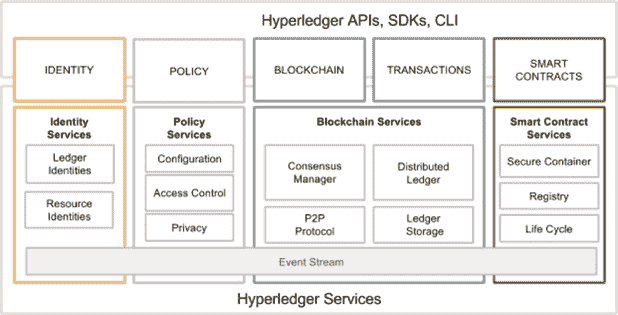

参考架构 - 来源：Hyperledger 白皮书

从左边开始，可以看到我们有五个顶层组件，它们提供各种服务。我们将详细探讨所有这些组件。

首先是身份，它在成员服务下提供授权、识别和认证服务。

接着是策略组件，它提供策略服务。

随后是分类账和交易，其中包括分布式分类账、排序服务、网络协议，以及认可和验证服务。分类账只能通过区块链网络参与者之间的共识来更新。

最后，我们有智能合约层，它在 Hyperledger 中提供链码服务，并利用安全容器技术来托管智能合约。我们稍后将更详细地看到*Hyperledger Fabric*部分中的所有这些内容。

一般来说，从组件的角度来看，Hyperledger 包含了这里描述的各种元素：

+   **共识层**：这些服务负责促进区块链网络参与者之间的协议达成过程。共识是必须的，以确保交易的顺序和状态在区块链网络中得到验证和达成一致。

+   **智能合约层**：这些服务负责根据用户的需求实现业务逻辑。交易是基于区块链上的智能合约中定义的逻辑来处理的。

+   **通信层**：这一层负责在区块链网络中的节点之间进行消息传输和交换。

+   **安全和加密层**：这些服务负责提供能力，允许使用各种加密算法或模块来提供隐私、保密和不可抵赖的服务。

+   **数据存储**：这一层提供了使用不同数据存储来存储分类账状态的能力。这意味着数据存储也是可插拔的，并允许使用任何数据库后端。

+   **策略服务**：这组服务提供管理区块链网络所需的不同策略的能力。这包括认可策略和共识策略。

+   **APIs 和 SDKs**：该层允许客户端和应用程序与区块链进行交互。SDK 用于提供机制来部署和执行链码，查询区块并监视区块链上的事件。

区块链服务有一定的要求。在下一节中，我们将讨论 Hyperledger Fabric 的设计目标。

# Hyperledger Fabric 的需求和设计目标

区块链服务有一定的要求。参考架构是由 Hyperledger 项目的参与者提出的需求和要求驱动的，并在研究行业用例后进行了讨论。从对工业用例的研究中推导出了几类需求，这些需求将在以下部分进行讨论。

# 模块化方法

Hyperledger 的主要要求是模块化结构。预计作为跨行业面料（区块链），它将在许多业务场景中使用。因此，与存储、策略、链码、访问控制、共识等其他区块链服务相关的功能应该是模块化和可插拔的。规范建议模块应该是即插即用的，用户应该能够轻松地移除和添加满足业务需求的不同模块。

# 隐私和保密性

此需求是最关键的因素之一。传统的区块链是无许可的，而在 Hyperledger Fabric 这样的许可模型中，网络上的交易对于只有被允许查看的人可见非常重要。

在业务区块链中，交易和合同的隐私和保密性至关重要。因此，Hyperledger 的愿景是支持全面的加密协议和算法。我们在第五章和第六章中讨论了密码学，*对称密码学*和*公钥密码学*。

预计用户将能够根据其业务需求选择适当的模块。例如，如果业务区块链只需要在已经信任的各方之间运行并执行非常基本的业务操作，则可能无需为保密性和隐私提供先进的加密支持。因此，用户应该能够移除该功能（模块）或将其替换为更合适的模块以满足其需求。

同样，如果用户需要运行跨行业区块链，则保密性和隐私可能非常重要。在这种情况下，用户应该能够将先进的加密和访问控制机制（模块）插入到区块链（面料）中，甚至可以允许使用**安全模块的硬件**（HSMs）。

此外，区块链应能够处理复杂的加密算法，而不会影响性能。除了上述场景外，由于业务中的监管要求，还应该能够按照监管和合规要求的隐私和保密政策来执行。

# 可扩展性

这是另一个重要的需求，一旦满足，将允许合理的交易吞吐量，这将足以满足所有业务需求，也足够为大量用户提供服务。

# 确定性交易

这是任何区块链的核心需求，因为如果交易无论何时执行产生相同的结果，无论交易由谁在何处执行，共识都是不可能实现的。因此，在任何区块链网络中，确定性交易成为关键要求。我们在第四章 *智能合同* 中讨论了这些概念。

# 身份

为了提供隐私和保密服务，还需要一个灵活的 PKI 模型来处理访问控制功能。加密机制的强度和类型也预计会根据用户的需求和要求而变化。在某些场景中，可能需要用户隐藏他们的身份，因此，期望 Hyperledger 提供这一功能。

# 审计性

审计性是 Hyperledger Fabric 的另一个需求。预期保留所有身份、相关操作和任何更改的不可变审计跟踪。

# 互操作性

目前有许多可用的区块链平台，但它们之间无法进行通信，这可能限制了区块链全球业务生态系统的发展。预计许多区块链网络将在业务世界中为特定需求而运行，但它们能够相互通信非常重要。应该有一套所有区块链都可以遵循的共同标准，以便允许不同分类账之间的通信。预计将开发一个协议，允许在多个链之间交换信息。

# 可移植性

可移植性要求关注的是在不需要在代码级别更改任何内容的情况下能够在多个平台和环境中运行。预期 Hyperledger Fabric 在基础设施级别以及代码、库和 API 级别都是可移植的，这样可以支持在各种 Hyperledger 实现中进行统一开发。

# 丰富的数据查询

区块链网络应允许在网络上运行丰富的查询。这可以用于使用传统查询语言查询总账的当前状态，从而实现更广泛的采用和使用便利。

所有上述点描述了开发符合 Hyperledger 设计理念的区块链解决方案所需满足的要求。在接下来的部分中，我们将看一下 Hyperledger Fabric，这是首个在 Hyperledger 下获得活跃状态的项目。

# Fabric

要了解 Hyperledger 项目中正在开发的各种项目，首先需要了解 Hyperledger 的基础知识是很重要的。在向读者介绍更深入的材料之前，需要对一些特定于 Hyperledger 的术语进行一些澄清。

首先，有一个“fabric”的概念。Fabric 可以定义为提供基础层的组件集合，可用于交付区块链网络。Fabric 网络有各种类型和功能，但所有 fabric 都共享诸如不可变性和共识驱动等共同属性。一些 fabric 可以提供一种模块化方法来构建区块链网络。在这种情况下，区块链网络可以具有多个可插拔模块，用于在网络上执行各种功能。

例如，共识算法可以是区块链网络中的可插拔模块，根据网络的要求，可以选择适当的共识算法并将其插入网络中。这些模块可以基于 fabric 的某些特定规范，并且可以包括 API、访问控制和各种其他组件。

Fabric 也可以设计为私有或公开的，并且可以允许创建多个业务网络。例如，比特币就是在其 fabric（区块链网络）上运行的应用程序。正如前文第一章讨论的那样，*区块链 101*，区块链可以是许可的或无许可的。然而，Hyperledger Fabric 的目标是开发一个许可的分布式分类账。

Fabric 也是 IBM 向 Hyperledger 基金会提供的代码贡献的名称，正式称为 Hyperledger Fabric。IBM 还通过其*IBM 云服务*提供区块链即服务（IBM Blockchain）。

它可以在[`www.ibm.com/cloud/`](https://www.ibm.com/cloud/)找到。

现在让我们详细看一下 Hyperledger Fabric。

# Hyperledger Fabric

该框架最初是由 IBM 和 Digital Assets 对 Hyperledger 项目的贡献。这一贡献旨在实现一种模块化、开放和灵活的方法，用于构建区块链网络。

Fabric 中的各种功能都是可插拔的，并且它还允许使用任何语言来开发智能合约。这种功能是可能的，因为它基于容器技术（Docker），可以托管任何语言。

Chaincode 在安全容器中进行沙盒化处理，其中包括安全操作系统、chaincode 语言、运行时环境以及用于 Go、Java 和 Node.js 的 SDK。如果需要，将来还可以支持其他语言，但需要进行一些开发工作。智能合约在 Fabric 中被称为 chaincode。与以太坊中的领域特定语言或比特币中的有限脚本语言相比，这种能力是一个引人注目的特性。这是一个有权限的网络，旨在解决可扩展性、隐私和机密性等问题。其背后的基本思想是模块化，这将允许在业务区块链的设计和实现中灵活性。这样可以实现可扩展性、隐私和其他所需特性，并根据要求对其进行微调。

Fabric 中的交易对于普通用户是私有的、保密的和匿名的，但它们仍然可以被授权的审计员追踪和与用户关联。作为一个有权限的网络，所有参与者都需要在成员服务中注册才能访问区块链网络。此分类帐还提供了审计功能，以满足用户所需的监管和合规性需求。

# 成员服务

这些服务用于为 Fabric 网络的用户提供访问控制功能。以下列出了成员服务执行的功能：

+   用户身份验证

+   用户注册

+   根据用户角色分配适当的权限

成员服务利用**证书机构**来支持身份管理和授权操作。这个 CA 可以是内部的（Fabric CA），它是 Hyperledger Fabric 中的默认接口，或者组织可以选择使用外部证书机构。Fabric CA 发布**注册证书**（**E-Certs**），这些证书由**注册证书机构**（**E-CA**）生成。一旦对等体被授予身份，它们就被允许加入区块链网络。还有临时证书称为 T-Certs，用于一次性交易。

所有对等体和应用程序都使用证书机构进行识别。证书机构提供认证服务。MSP 还可以与现有的身份服务（如 LDAP）进行接口。

# 区块链服务

区块链服务是 Hyperledger Fabric 的核心。此类别中的组件如下。

# 共识服务

共识服务负责提供与共识机制的接口。这充当了一个可插拔的模块，接收来自其他 Hyperledger 实体的交易，并根据选择的机制类型执行它们的标准。

Hyperledger V1 中的共识是作为一个称为**订购者**的节点实现的，负责将交易按顺序组成一个区块。订购者不持有智能合约或账本。共识是可插拔的，目前 Hyperledger Fabric 中有两种类型的排序服务可用：

+   **SOLO**：这是一个基本的排序服务，用于开发和测试目的。

+   **Kafka**：这是 Apache Kafka 的一种实现，提供排序服务。需要注意的是，目前 Kafka 只提供了崩溃容错性，但并没有提供拜占庭容错性。这在准许网络中是可以接受的，因为恶意行为的可能性几乎为零。

除了这些机制之外，基于**简单拜占庭容错**（**SBFT**）的机制也正在开发中，将在后续版本的 Hyperledger Fabric 中提供。

# 分布式账本

区块链和世界状态是分布式账本的两个主要元素。区块链简单来说是一个由区块构成的加密链接列表（如第一章介绍的，*区块链 101*），而世界状态是一个键值数据库。这个数据库被智能合约用来在执行过程中存储相关状态。区块链由包含交易的区块组成。这些交易包含链码，运行这些交易可以导致更新世界状态。每个节点将世界状态保存在硬盘上，使用的是 LevelDB 或 CouchDB，具体取决于实现。由于 Fabric 允许可插拔的数据存储，你可以选择任何数据存储方式进行存储。

区块由三个主要组件组成，称为区块头、交易（数据）和区块元数据。

以下图示展示了 Hyperledger Fabric 1.0 中典型区块的相关字段：

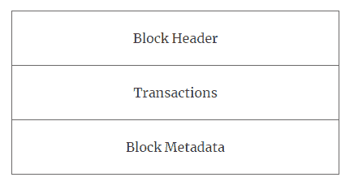

区块结构

**区块头** 包括三个字段，即编号、前一个哈希和数据哈希。

**交易** 由多个字段组成，例如交易类型、版本、时间戳、通道 ID、交易 ID、时代、有效载荷可见性、链码路径、链码名称、链码版本、创建者身份、签名、链码类型、输入、超时、背书者身份和签名、建议哈希、链码事件、响应状态、命名空间、读集、写集、起始键、结束键、读取列表和 Merkle 树查询摘要。

**区块元数据** 包括创建者身份、相关签名、最后配置区块编号、每个包含在区块中的交易的标志，以及最后持久化的偏移量（kafka）。

# 点对点协议

Hyperledger Fabric 中的 P2P 协议是使用 **Google RPC**（**gRPC**）构建的。它使用协议缓冲区来定义消息的结构。

节点之间传递消息以执行各种功能。Hyperledger Fabric 中有四种主要类型的消息：**发现**、**交易**、**同步** 和 **共识**。发现消息在启动时在节点之间交换，以发现网络上的其他对等节点。交易消息用于部署、调用和查询交易，共识消息在共识期间交换。同步消息在节点之间传递以保持区块链在所有节点上同步更新。

# 分类账存储

为了保存分类账的状态，默认情况下使用 LevelDB，该数据库在每个对等节点上都可用。另一种选择是使用 CouchDB，它提供了运行丰富查询的能力。

# Chaincode 服务

这些服务允许创建用于执行链码的安全容器。此类别中的组件如下：

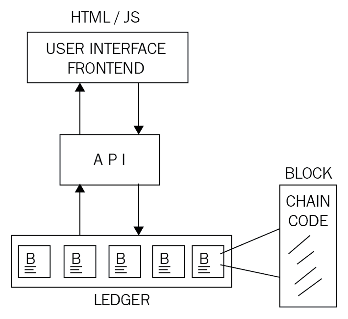

+   **安全容器**：Chaincode 部署在提供锁定的沙箱环境以供智能合约执行的 Docker 容器中。目前，Golang 被支持为主要的智能合约语言，但如果需要，可以添加和启用任何其他主流语言。

+   **安全注册表：** 这提供了包含智能合约的所有映像的记录。

**事件**

区块链上的事件可以由背书者和智能合约触发。外部应用程序可以通过事件适配器监听这些事件，并在需要时做出反应。

**API 和 CLI**

应用程序编程接口通过公开各种 REST API 提供了与织物的接口。此外，还提供了提供一组 REST API 子集并允许快速测试和与区块链有限交互的命令行界面。

# 组成部分的织物

有各种各样的组件可以成为 Hyperledger Fabric 区块链的一部分。这些组件包括但不限于分类账、链码、共识机制、访问控制、事件、系统监控和管理、钱包以及系统集成组件。

# 对等节点

对等节点参与维护分布式分类账的状态。它们还持有分布式分类账的本地副本。对等节点通过八卦协议进行通信。在 Hyperledger Fabric 网络中有三种类型的对等节点：

+   **背书对等节点** 或背书者模拟交易执行并生成读写集。读取是模拟交易从分类账中读取数据，写入是在交易执行和提交到分类账时将要对分类账进行的更新集。背书者执行和背书交易。值得注意的是，背书者也是提交者。背书策略是用链码实现的，并指定交易背书的规则。

+   **提交对等方**或提交者接收由背书者背书的交易，对其进行验证，然后使用读写集更新分类帐。提交者验证背书者生成的读写集以及交易验证。

+   **提交者**是尚未实现的第三种类型的对等方。它在开发路线图上，并将被实现。

# 订购节点

订购节点从背书者那里接收交易以及读写集，将它们按顺序排列，并将其发送给提交对等方。提交对等方随后执行验证并将其提交到分类帐。

所有对等方都使用成员服务发放的证书。

# 客户端

客户端是利用 API 与 Hyperledger Fabric 进行交互并提出交易的软件。

# 通道

通道允许网络上不同方之间的保密交易流动。它们允许在相同的区块链网络中使用不同的区块链。通道只允许通道成员查看与他们相关的交易，网络的所有其他成员将无法查看这些交易。

# 世界状态数据库

世界状态反映了区块链上所有已提交的交易。这基本上是一个键值存储，随着交易和链码执行的结果而更新。为此，通常使用 LevelDB 或 CouchDB。LevelDB 是一个键值存储，而 CouchDB 将数据存储为 JSON 对象，允许对数据库运行丰富的查询。

# 交易

交易消息可分为两种类型：**部署交易**和**调用交易**。前者用于将新的链码部署到分类帐上，而后者用于从智能合约调用函数。交易可以是公开的或保密的。公开交易对所有参与者开放并可用，而保密交易仅在对其参与者开放的频道中可见。

# 成员服务提供商（MSP）

MSP 是用于管理区块链网络上身份的模块化组件。此提供程序用于验证想要加入区块链网络的客户端的身份。我们在本章前面已经详细讨论了证书颁发机构。CA 在 MSP 中用于提供身份验证和绑定服务。

# 智能合约

我们在第四章中详细讨论了智能合约，*智能合约*。在 Hyperledger Fabric 中，实现了相同的智能合约概念，但称为链代码而不是智能合约。它们包含条件和参数以执行交易并更新分类帐。链代码通常用 Golang 和 Java 编写。

# 加密服务提供商

顾名思义，这是一个提供加密算法和标准以供区块链网络使用的服务。此服务提供密钥管理、签名和验证操作以及加密解密机制。此服务与成员服务一起使用，为区块链的元素（如认可者、客户端和其他节点和对等体）提供加密操作支持。

在介绍了 Hyperledger Fabric 的这个组件之后，在下一节中，我们将看到在 Hyperledger 网络上运行的应用程序是什么样子的。

# 区块链上的应用程序

Fabric 上的典型应用程序通常仅由一个用户界面组成，通常使用 JavaScript/HTML 编写，该用户界面通过 API 层与存储在账本上的后端链码（智能合约）进行交互：

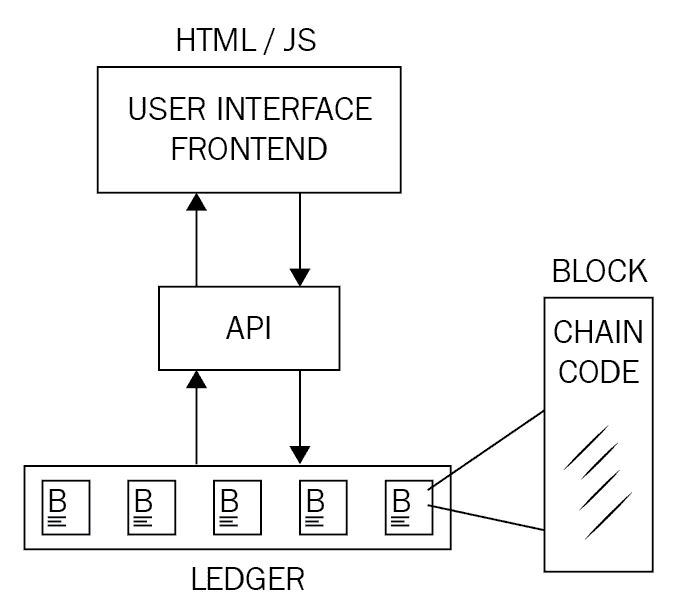

典型的 Fabric 应用程序

Hyperledger 提供了各种 API 和命令行接口，以实现与账本的交互。这些 API 包括身份、交易、链码、账本、网络、存储和事件接口。

# 链码实现

链码通常是用 Golang 或 Java 编写的。链码可以是公共的（在网络上对所有人可见）、机密的或受访控制的。这些代码文件充当了用户可以通过 API 与之交互的智能合约。用户可以调用链码中的函数来导致状态更改，从而更新账本。

还有一些仅用于查询账本且不会导致任何状态更改的函数。链码实现是通过首先在代码中创建链码 shim 接口来完成的。Shim 提供了用于访问链码的状态变量和事务上下文的 API。它可以是 Java 或 Golang 代码。

为了实现链码，需要以下四个函数：

+   `Init()`: 当链码部署到账本上时，将调用此函数。这会初始化链码并导致状态更改，相应地更新账本。

+   `Invoke()`: 当执行合约时使用此函数。它将一个函数名称和参数数组作为参数。此函数会导致状态更改并写入账本。

+   `Query()`: 此函数用于查询已部署链码的当前状态。此函数不会对账本进行任何更改。

+   `4()`**:** 当对等体部署自己的链码副本时执行此函数。使用此函数向对等体注册链码。

以下图示了 Hyperledger Fabric 的一般概述，请注意，顶部的对等体集群包括各种类型的节点，如认可者、提交者、Orderers 等。

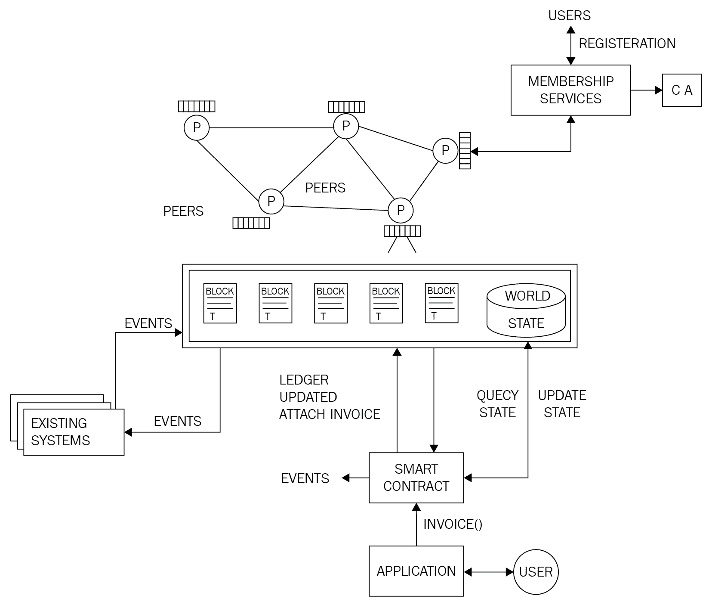

Hyperledger Fabric 的高层概述

上述图表显示，位于顶部中间的对等体相互通信，每个节点都有区块链的副本。在图像的右上角，显示了成员服务，通过**证书颁发机构**（**CA**）对网络上的对等方进行验证和认证。在图像的底部，放大了区块链的视图，现有系统可以为区块链产生事件，也可以监听区块链的事件，然后可以选择性地触发操作。在图像的右下方，显示了用户与应用程序的交互，该应用程序通过`invoice()`方法与智能合约交互，并且智能合约可以查询或更新区块链的状态。

# 应用程序模型

超级账本 Fabric 的任何区块链应用程序都遵循 MVC-B 架构。这是基于流行的 MVC 设计模式。该模型中的组件包括模型、视图、控制和区块链：

+   **视图逻辑**：与用户界面有关。可以是桌面、Web 应用程序或移动前端。

+   **控制逻辑**：这是用户界面、数据模型和 API 之间的协调者。

+   **数据模型**：该模型用于管理链下数据。

+   **区块链逻辑**：这用于通过控制器管理区块链和通过交易管理数据模型。

IBM 云服务提供区块链示例应用，作为其区块链即服务的一部分。该服务可在[`www.ibm.com/blockchain/platform/`](https://www.ibm.com/blockchain/platform/)获取。[该服务允许用户在易于使用的环境中创建自己的区块链网络](https://www.ibm.com/blockchain/platform/)。

# 超级账本 Fabric 中的共识

超级账本 Fabric 中的共识机制包括三个步骤：

1.  **交易认可**：这个过程通过模拟交易执行过程对交易进行认可。

1.  **排序**：这是由订购者集群提供的服务，它接受认可的交易并决定交易将被写入分类帐的顺序。

1.  **验证和承诺**：这个过程由提交对等方执行，首先验证来自订购者的交易，然后将该交易提交到分类帐上。

这些步骤在下面的流程图中显示：

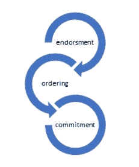

共识流程

# 超级账本 Fabric 中的交易生命周期

在超级账本 Fabric 中，交易流程涉及几个步骤。这些步骤在下面的图表中显示如下

过程的快速概述可以在下面的图表中看到：

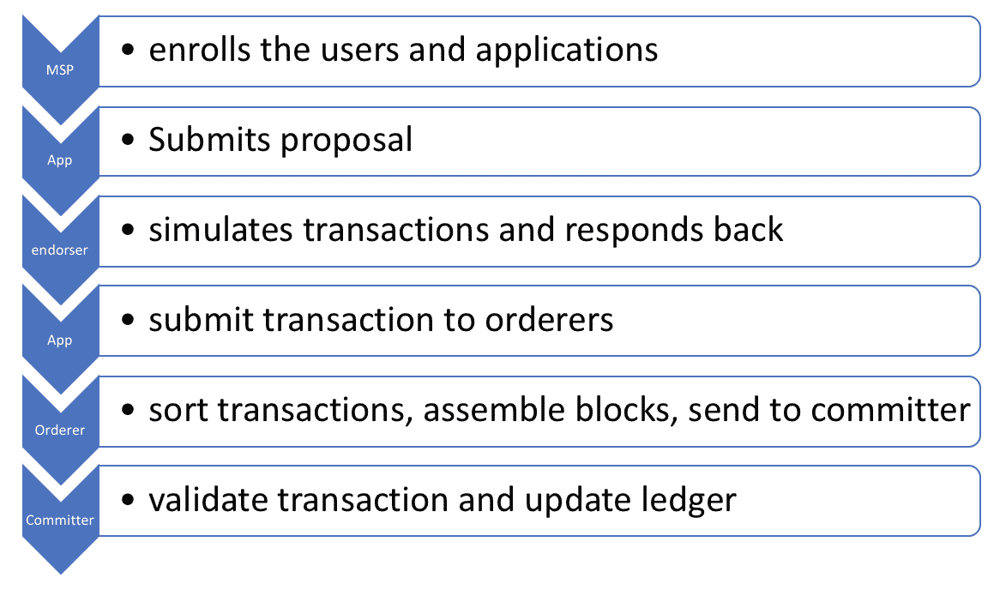

交易生命周期

以下是详细描述的步骤：

1.  客户端提出交易建议。这是第一步，客户端提出交易并将其发送到分布式分类帐网络上的背书节点。所有客户端在提出交易之前都需要通过成员服务进行注册。

1.  背书者模拟交易，生成读写（RW）集。这是通过执行链码来实现的，但是不是更新分类帐，而是仅创建一个读写集，其中包含对分类帐的任何读取或更新。

1.  背书的交易发送回应用程序。

1.  应用程序将背书的交易和读写（RW）集提交给排序服务。

1.  排序服务将所有背书交易和读写集按照通道 ID 排序，组装成一个区块。

1.  排序服务将组装好的区块广播给所有提交节点。

1.  提交节点验证交易。

1.  提交节点更新分类帐。

1.  最后，提交节点向客户端/应用程序发送交易成功或失败的通知。

以下图表代表了上述步骤和超级账本架构从交易流程的角度：

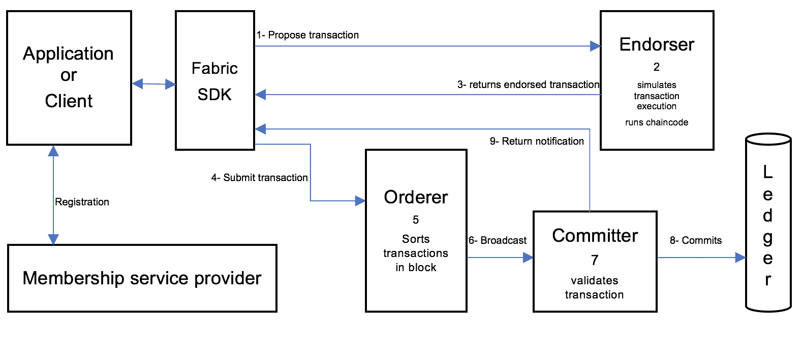

交易流程架构

如前图所示，第一步是提出交易，客户端通过 SDK 执行此操作。在此之前，假设所有客户端和节点都已在成员服务提供商那里注册。

关于这个主题，我们对超级账本（Hyperledger Fabric）的介绍已经完成。在下一节中，我们将看到另一个名为 Sawtooth Lake 的超级账本项目。

# Sawtooth Lake

Sawtooth Lake 可以在受控和非受控模式下运行。它是一个分布式账本，提出了两个新颖的概念：第一个是介绍了一种称为**Proof of Elapsed Time**（**PoET**）的新型共识算法；第二个是**事务家族**的概念。

这些新提议的描述在以下部分给出。

# PoET

PoET 是一种新颖的共识算法，允许根据节点在提出区块之前等待的时间随机选择节点。这个概念与其他基于领导者选举和抽奖的工作证明算法相反，例如比特币中使用的 PoW，其中使用了大量的电力和计算资源来选举区块提议者；例如在比特币的情况下。 PoET 是一种工作证明算法，但是，它不是使用计算机资源，而是使用可信计算模型来提供一种满足工作证明要求的机制。 PoET 利用 Intel 的 SGX 架构（软件保护扩展）提供受信任的执行环境（TEE）以确保进程的随机性和密码学安全性。

应该注意的是，Sawtooth Lake 的当前实现不需要真实的硬件 SGX 基于 TEE，因为它仅为实验目的模拟，并且因此不应在生产环境中使用。 PoET 的基本理念是通过随机等待的方式来提供领导者选举的机制，以便被选举为提议新交易的领导者。

但是，PoET 存在一个被 Ittay Eyal 强调的限制。 这个限制被称为*陈旧芯片*问题。

研究论文可在[`eprint.iacr.org/2017/179.pdf`](https://eprint.iacr.org/2017/179.pdf)上获得。

这种限制导致硬件浪费，可能导致资源的浪费。 也存在黑客攻击芯片硬件的可能性，这可能导致系统妥协和给矿工不当的激励。

# 交易家族

传统的智能合约范式提供了一个基于通用指令集的解决方案，适用于所有领域。 例如，在以太坊的情况下，已经开发了一组用于 EVM 的操作码，可以用来构建智能合约以满足任何行业的任何类型需求。

虽然这个模型有其优点，但显然这种方法不太安全，因为它为账本提供了一个单一接口，使用了一个强大且富有表现力的语言，这可能为恶意代码提供了更大的攻击面。 这种复杂性和通用虚拟机范式导致了一些漏洞的发现和最近黑客攻击的利用。 一个最近的例子是**DAO hack**和进一步的**拒绝服务**（**DoS**）攻击，这些攻击利用了一些 EVM 操作码的限制。 DAO hack 在第四章“智能合约”中进行了讨论。

下图中显示的模型描述了传统的智能合约模型，其中使用了通用虚拟机提供了所有领域的区块链接口：

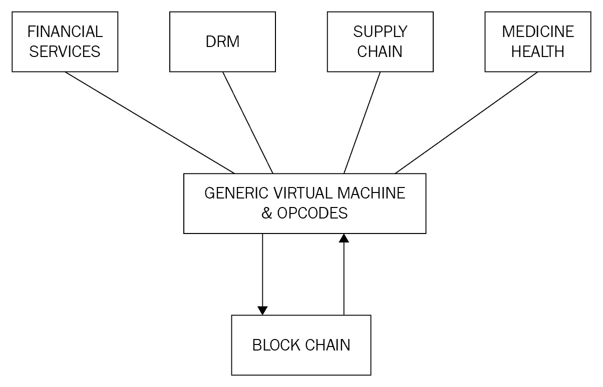

传统的智能合约范式

为解决这个问题，Sawtooth Lake 提出了交易族的概念。交易族通过将逻辑层分解为特定领域的一组规则和一个组合层来创建。关键思想是业务逻辑嵌入在交易族中，从而提供了一种更安全、更强大的构建智能合约的方式。交易族包含特定领域的规则和另一层，允许为该领域创建交易。另一种看待它的方式是，交易族是实施特定领域逻辑层的数据模型和交易语言的组合。数据模型代表区块链（分类帐）的当前状态，而交易语言修改了分类帐的状态。预计用户将根据其业务需求构建自己的交易族。

以下图表表示了该模型，其中每个特定领域，如金融服务、**数字版权管理**（**DRM**）、供应链和医疗行业，都有自己的逻辑层，包括特定于该领域的操作和服务。这使逻辑层同时具有限制性和强大性。交易族确保只有与所需领域相关的操作存在于控制逻辑中，从而消除了执行不必要的、任意的和潜在有害的操作的可能性：

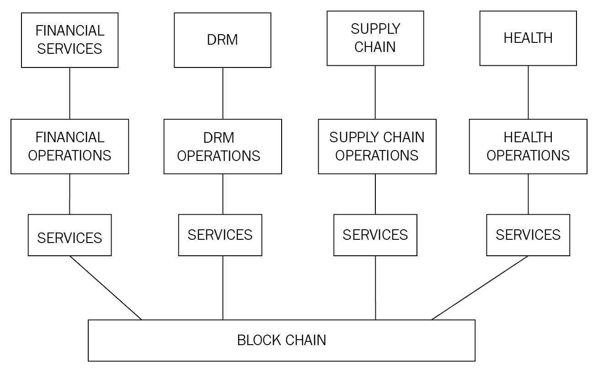

Sawtooth（交易族）智能合约范式

英特尔为 Sawtooth 提供了三个交易族：端点注册表、Integerkey 和 MarketPlace。

+   **端点注册表**用于注册分类帐服务

+   **Integerkey**用于测试已部署的分类帐

+   **MarketPlace**用于销售、购买和交易操作和服务

**Sawtooth_bond**已开发为证明概念，演示了债券交易平台。

可在[`github.com/hyperledger/sawtooth-core/tree/master/extensions/bond`](https://github.com/hyperledger/sawtooth-core/tree/master/extensions/bond)找到。

# Sawtooth 中的共识

Sawtooth 有两种基于网络选择的共识机制。正如之前讨论的那样，PoET 是一种基于可信执行环境的抽奖功能，根据节点等待区块提案的时间随机选举领袖。

还有一种名为**quorum voting**的共识类型，这是由 Ripple 和 Stellar 构建的共识协议的一种改编。该共识算法允许即时的交易最终性，通常在获准网络中是可取的。

# 开发环境 - Sawtooth Lake

本节将简要介绍如何为 Sawtooth Lake 设置开发环境。设置开发环境需要满足一些先决条件。

本部分中的示例假定正在运行 Ubuntu 系统并具有以下内容：

+   至少版本为 1.9.0 的[Vagrant](https://www.vagrantup.com/downloads.html)可在[h](https://www.vagrantup.com/downloads.html)[t](https://www.vagrantup.com/downloads.html)[t](https://www.vagrantup.com/downloads.html)[p](https://www.vagrantup.com/downloads.html)[s](https://www.vagrantup.com/downloads.html)[://w](https://www.vagrantup.com/downloads.html)[w](https://www.vagrantup.com/downloads.html)[w](https://www.vagrantup.com/downloads.html)[.](https://www.vagrantup.com/downloads.html)[v](https://www.vagrantup.com/downloads.html)[a](https://www.vagrantup.com/downloads.html)[g](https://www.vagrantup.com/downloads.html)[r](https://www.vagrantup.com/downloads.html)[a](https://www.vagrantup.com/downloads.html)[n](https://www.vagrantup.com/downloads.html)[t](https://www.vagrantup.com/downloads.html)[u](https://www.vagrantup.com/downloads.html)[p](https://www.vagrantup.com/downloads.html)[.](https://www.vagrantup.com/downloads.html)[c](https://www.vagrantup.com/downloads.html)[o](https://www.vagrantup.com/downloads.html)[m](https://www.vagrantup.com/downloads.html)[/d](https://www.vagrantup.com/downloads.html)[o](https://www.vagrantup.com/downloads.html)[w](https://www.vagrantup.com/downloads.html)[n](https://www.vagrantup.com/downloads.html)[l](https://www.vagrantup.com/downloads.html)[o](https://www.vagrantup.com/downloads.html)[a](https://www.vagrantup.com/downloads.html)[d](https://www.vagrantup.com/downloads.html)[s](https://www.vagrantup.com/downloads.html)[.](https://www.vagrantup.com/downloads.html)[h](https://www.vagrantup.com/downloads.html)[t](https://www.vagrantup.com/downloads.html)[m](https://www.vagrantup.com/downloads.html)[l](https://www.vagrantup.com/downloads.html)。

+   VirtualBox，至少是 5.0.10 r104061，可在[h](https://www.virtualbox.org/wiki/Downloads)[t](https://www.virtualbox.org/wiki/Downloads)[t](https://www.virtualbox.org/wiki/Downloads)[p](https://www.virtualbox.org/wiki/Downloads)[s](https://www.virtualbox.org/wiki/Downloads)[://w](https://www.virtualbox.org/wiki/Downloads)[w](https://www.virtualbox.org/wiki/Downloads)[w](https://www.virtualbox.org/wiki/Downloads)[.](https://www.virtualbox.org/wiki/Downloads)[v](https://www.virtualbox.org/wiki/Downloads)[i](https://www.virtualbox.org/wiki/Downloads)[r](https://www.virtualbox.org/wiki/Downloads)[t](https://www.virtualbox.org/wiki/Downloads)[u](https://www.virtualbox.org/wiki/Downloads)[a](https://www.virtualbox.org/wiki/Downloads)[l](https://www.virtualbox.org/wiki/Downloads)[b](https://www.virtualbox.org/wiki/Downloads)[o](https://www.virtualbox.org/wiki/Downloads)[x](https://www.virtualbox.org/wiki/Downloads)[.](https://www.virtualbox.org/wiki/Downloads)[o](https://www.virtualbox.org/wiki/Downloads)[r](https://www.virtualbox.org/wiki/Downloads)[g](https://www.virtualbox.org/wiki/Downloads)[/w](https://www.virtualbox.org/wiki/Downloads)[i](https://www.virtualbox.org/wiki/Downloads)[k](https://www.virtualbox.org/wiki/Downloads)[i](https://www.virtualbox.org/wiki/Downloads)[/D](https://www.virtualbox.org/wiki/Downloads)[o](https://www.virtualbox.org/wiki/Downloads)[w](https://www.virtualbox.org/wiki/Downloads)[n](https://www.virtualbox.org/wiki/Downloads)[l](https://www.virtualbox.org/wiki/Downloads)[o](https://www.virtualbox.org/wiki/Downloads)[a](https://www.virtualbox.org/wiki/Downloads)[d](https://www.virtualbox.org/wiki/Downloads)[s](https://www.virtualbox.org/wiki/Downloads).

一旦两个前提条件都成功下载并安装，下一步是克隆存储库。

```
$ git clone https://github.com/IntelLedger/sawtooth-core.git  
```

这将产生类似以下屏幕截图所示的输出： 

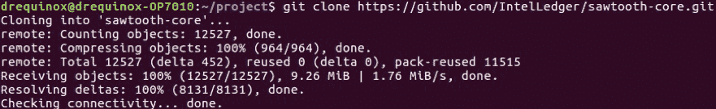

GitHub Sawtooth 克隆

一旦 Sawtooth 正确克隆，下一步是启动环境。首先，运行以下命令将目录更改为正确的位置，然后启动 vagrant 虚拟机：

```
$ cd sawtooth-core/tools
$ vagrant up  
```

这将产生类似以下屏幕截图的输出：

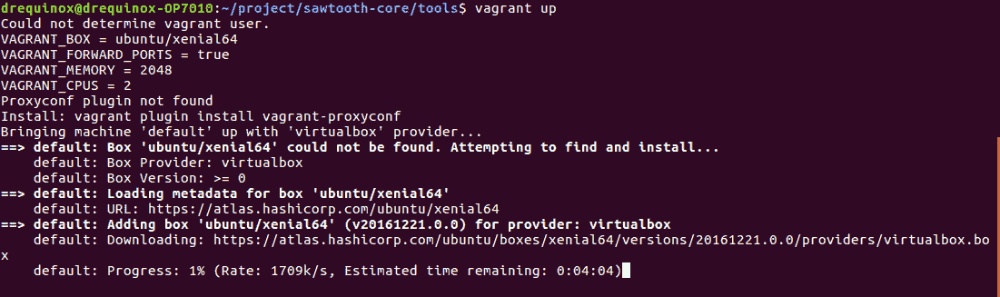

vagrant up 命令

如果在任何时候需要停止 vagrant，则可以使用以下命令：

```
$ vagrant halt  
```

或者：

```
$ vagrant destroy  
```

`halt`将停止 vagrant 虚拟机，而`destroy`将停止并删除 vagrant 虚拟机。

最后，可以使用以下命令启动事务验证器。首先`ssh`进入 vagrant Sawtooth 虚拟机：

```
$ vagrant ssh  
```

当出现 vagrant 提示时，运行以下命令。首先使用以下命令构建 Sawtooth Lake 核心：

```
$ /project/sawtooth-core/bin/build_all  
```

当构建成功完成时，为了运行事务验证器，请执行以下命令：

```
$ /project/sawtooth-core/docs/source/tutorial/genesis.sh  
```

这将创建创世区块并清除任何现有的数据文件和密钥。此命令应显示类似以下屏幕截图的输出：

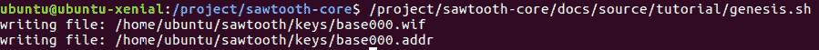

创世区块和密钥生成

下一步是运行交易验证器，并按照如下更改目录：

```
$ cd /project/saw-toothcore  
```

运行交易验证器：

```
$ ./bin/txnvalidator -v -F ledger.transaction.integer_key --config
/home/ubuntu/sawtooth/v0.json  
```

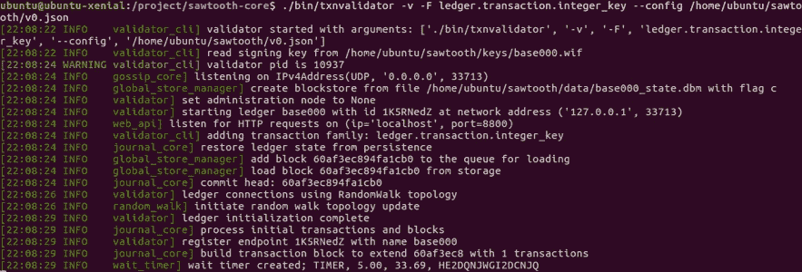

运行交易验证器

通过按 *Ctrl* + *C* 停止验证器节点。一旦验证器启动并运行，各种客户端可以在另一个终端窗口中启动，以与交易验证器通信并提交交易。

例如，在以下屏幕截图中，市场客户端被启动以与交易验证器通信。注意，使用以下命令创建了位于`/keys/mkt.wif`下的密钥：

```
./bin/sawtooth keygen --key-dir validator/keys mkt 
```

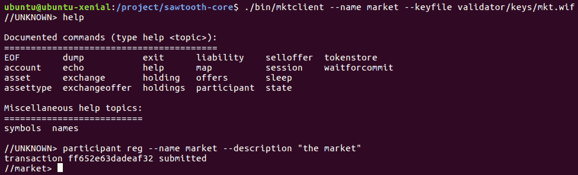

用于市场交易家族的 mktclient

这完成了我们对 Sawtooth 的基本介绍。上面显示的示例也相当基本，但演示了 Sawtooth Lake 的工作原理。

Sawtooth Lake 也在不断发展，因此建议读者留意[`intelledger.github.io/`](http://intelledger.github.io/)上可用的文档，以了解最新的发展。

这里有一个非常好的在线页面，提供了官方的 Sawtooth Lake 示例。该页面可在[`sawtooth.hyperledger.org/examples/`](https://sawtooth.hyperledger.org/examples/)访问。鼓励读者访问此页面，并探索这些样本项目。

现在在下一节中，我们将看到对 Corda 的介绍。需要注意的是，Corda 还不是 Hyperledger 的官方项目；但是，它可能很快就成为成员。因此，目前正在在 Hyperledger 下讨论这个问题，但将来可能不会成为 Hyperledger 的一部分。

# Corda

根据定义，Corda 不是区块链，因为它不包含打包交易的区块，但它属于分布式分类账。它提供了区块链能提供的所有好处。传统的区块链解决方案，如前所述，具有将交易捆绑在一起形成区块的概念，每个区块都与其父区块在密码学上链接在一起，从而提供不可变的交易记录。Corda 与此不同。

Corda 是完全从头开始设计的，采用了一种新的模型来提供所有区块链的优点，但没有传统的区块链。它纯粹是为金融行业而开发的，以解决每个组织管理自己的分类账的问题，因此它们对*真相*有自己的看法，这导致矛盾和运营风险。此外，数据也在每个组织中重复，这导致管理个别基础设施的成本和复杂性增加。这些是 Corda 旨在通过构建分布式数据库平台解决的金融行业中的问题类型。

Corda 源代码可在 [`github.com/corda/corda`](https://github.com/corda/corda) 获取。它是用一种称为 Kotlin 的语言编写的，这是一种针对**Java 虚拟机**（**JVM**）的静态类型语言。

# 架构

Corda 平台的主要组件包括状态对象、合同代码、法律文本、交易、共识和流程。我们现在将对它们进行更详细的探讨。

# 状态对象

状态对象代表表示财务协议的最小数据单元。它们是作为交易执行的结果而创建或删除的。它们参考**合同代码**和**法律文本**。法律文本是可选的，并为合同提供法律约束。但是，合同代码是强制性的，以便管理对象的状态。根据在合同代码中定义的业务逻辑，它是必需的，以为节点提供状态转换机制。状态对象包含表示对象当前状态的数据结构。状态对象可以是当前的（活动的）或历史的（不再有效）。

举个例子，在下图中，状态对象代表对象的当前状态。在这种情况下，它是**甲方**和**乙方**之间的简单模拟协议，其中**甲方 ABC**已支付**乙方 XYZ 1,000 英镑**。这代表了对象的当前状态；然而，引用的合同代码可以通过交易改变状态。状态对象可以被看作是一个状态机，交易消耗它们以创建更新的状态对象。

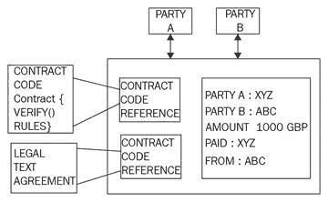

一个状态对象示例

# 交易

交易用于在不同状态之间执行过渡。例如，前面图表中显示的状态对象是作为交易的结果创建的。Corda 使用基于比特币的 UTXO 模型进行交易处理。与比特币类似，交易的状态转换概念相同。与比特币类似，交易可以有零个、单个或多个输入，以及单个或多个输出。所有交易都经过数字签名。

此外，Corda 没有挖矿的概念，因为它不使用区块来安排区块链中的事务。而是使用公证服务来提供事务的时间顺序。在 Corda 中，可以使用 JVM 字节码开发新的事务类型，这使得它非常灵活和强大。

# 共识

Corda 中的共识模型非常简单，基于稍后在本章讨论的公证服务。一般的想法是通过公证服务对事务的唯一性进行评估，如果它们是唯一的（即唯一的事务输入），则由共识服务签署为有效。在 Corda 网络上可以运行单个或多个集群化的公证服务。公证人可以使用各种共识算法，如 PBFT 或 Raft，来达成共识。

Corda 中关于共识的两个主要概念是**状态有效性共识**和**状态唯一性共识**。第一个概念关注事务的验证，确保所有必需的签名都可用且状态适当。第二个概念是一种检测双重支付攻击的手段，确保事务尚未被花费且是唯一的。

# 流程

Corda 中的流程是一种新颖的概念，允许开发分散式工作流。Corda 网络上的所有通信都由这些流程处理。这些是可以使用代码定义任何复杂性的任何金融流动的事务构建协议。流程作为异步状态机运行，并与其他节点和用户交互。在执行过程中，它们可以根据需要暂停或恢复。

# 组件

Corda 网络有多个组件。所有这些组件将在接下来的部分中描述。

# 节点

Corda 网络中的节点采用了无信任模型，并由不同的组织运行。节点作为经过身份验证的点对点网络的一部分运行。节点使用**Advanced Message Queuing Protocol** (**AMQP**)直接相互通信，这是一个经过批准的国际标准（ISO/IEC 19464），确保不同节点之间的消息安全传输。在 Corda 中，AMQP 在**Transport Layer Security** (**TLS**) 上运行，因此确保节点之间传输的数据的隐私和完整性。

节点还利用本地关系数据库进行存储。网络上的消息以紧凑的二进制格式编码。它们通过**Apache Artemis message broker** (**Active MQ**)进行交付和管理。节点可以作为网络映射服务、公证人、Oracle 或普通节点。下图展示了两个节点之间通信的高级视图：

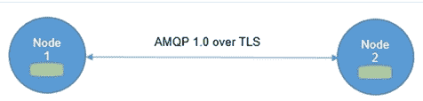

Corda 网络中两个节点的通信

在前图中，**节点 1**通过 TLS 通信频道使用 AMQP 协议与**节点 2**进行通信，并且节点具有用于存储的本地关系数据库。

# 许可服务

许可服务用于提供 TLS 证书以保障安全。为了参与网络，参与者需要有由根证书颁发机构签发的身份证明。在网络上，身份必须是唯一的，并且许可服务用于签署这些身份。用于识别参与者的命名约定基于 X.500 标准。这确保了名称的唯一性。

# 网络地图服务

此服务用于以文档形式提供网络地图，其中包含网络上所有节点的信息。该服务发布 IP 地址、身份证书以及节点提供的服务列表。所有节点在首次启动时通过注册到此服务来宣布自己的存在，当节点收到连接请求时，首先在网络地图上检查请求节点的存在。换句话说，该服务解析参与者的身份到物理节点。

# 公证服务

在传统区块链中，挖矿用于确定包含交易的区块的顺序。在 Corda 中，公证服务用于提供交易排序和时间戳服务。网络中可以有多个公证人，并且它们由复合公钥标识。公证人可以使用不同的共识算法，如 BFT 或 Raft，具体取决于应用程序的要求。公证服务签署交易以指示交易的有效性和最终性，然后将其持久化到数据库中。

为了性能原因，公证人可以以负载平衡配置运行，以在节点之间分散负载；为了减少延迟，建议节点在物理上距离交易参与者更近。

# Oracle 服务

Oracle 服务要么签署包含事实的交易（如果它是真实的），要么可以自己提供事实数据。它们允许真实世界的信息输入到分布式分类帐中。关于 Oracle 的讨论可以在第四章中找到，即*智能合约*。

# 交易

Corda 网络中的交易永远不会全局传输，而是在半私有网络中进行。它们只在与交易相关的参与者子集之间共享。这与传统的区块链解决方案（如以太坊和比特币）形成对比，其所有交易都会全局广播给整个网络。交易经过数字签名，要么消耗状态，要么创建新状态。

Corda 网络上的交易由以下元素组成：

+   **输入参考**: 这是交易将要使用和消耗的状态的参考。

+   **输出状态**: 这些是交易创建的新状态。

+   **附件**：这是附加的 ZIP 文件哈希列表。ZIP 文件可以包含与交易相关的代码和其他相关文档。文件本身不作为交易的一部分，而是单独传输和存储。

+   **命令**：命令代表交易的预期操作信息，作为合同的参数。每个命令都有一个公钥列表，表示需要对交易进行签名的所有方。

+   **签名**：这表示交易所需的签名。所需签名总数与命令的公钥数量成正比。

+   **类型**：交易有两种类型，即普通或变更公证。变更公证交易用于重新分配状态的公证。

+   **时间戳**：此字段表示交易发生的时间段。这些由公证服务进行验证和强制执行。此外，如果需要严格的时间，这在许多金融服务方案中是可取的，公证应与原子钟同步。

+   **摘要**：这是描述交易操作的文本描述。

# 保险库

保险库在节点上运行，类似于比特币中钱包的概念。由于交易不会全球广播，因此每个节点的保险库只会包含对他们而言相关的数据部分。保险库将其数据存储在标准关系数据库中，因此可以使用标准 SQL 进行查询。保险库可以包含在账本上和账本之外的数据，这意味着它也可以具有一些不在账本上的数据部分。

# CorDapp

Corda 的核心模型由状态对象、交易和交易协议组成，当与合同代码、API、钱包插件和用户界面组件结合使用时，结果是构建了一个**Corda 分布式应用程序**（**CorDapp**）。

Corda 中的智能合约是使用 Kotlin 或 Java 编写的。代码面向 JVM。

为了实现 JVM 字节码执行结果的确定性，对 JVM 进行了轻微修改。 Corda 智能合约的三个主要组成部分如下：

+   定义验证逻辑以验证对状态对象的更改的可执行代码。

+   状态对象表示合同的当前状态，可以由交易消耗，或者由交易生成（创建）。

+   命令用于描述操作和验证数据，以定义如何验证交易的方式。

# 开发环境 - Corda

使用以下步骤可以轻松设置 Corda 的开发环境。所需软件包括以下内容：

+   JDK 8（8u131），可在 [`www.oracle.com/technetwork/java/javase/downloads/index.html`](http://www.oracle.com/technetwork/java/javase/downloads/index.html) 获取。

+   IntelliJ IDEA Community 版本，免费可在[`www.jetbrains.com/idea/download`](https://www.jetbrains.com/idea/download)[.](https://www.jetbrains.com/idea/download)获取。

+   H2 数据库平台独立的 ZIP，在[`www.h2database.com/html/download.html`](http://www.h2database.com/html/download.html)获取。

+   Git，可在[`git-scm.com/downloads`](https://git-scm.com/downloads)获取。

+   Kotlin 语言，可在 IntelliJ 中使用，更多信息请参见[`kotlinlang.org/`](https://kotlinlang.org/)。

Gradle 是用于构建 Corda 的另一个组件。它可以在[`gradle.org`](https://gradle.org)获取。

安装了所有这些工具后，可以开始智能合约开发。可以使用[`github.com/corda/cordapp-template`](https://github.com/corda/cordapp-template)中提供的示例模板来开发 CorDapps。

有关如何开发合同代码的详细文档可在[`docs.corda.net/`](https://docs.corda.net/)获取。

Corda 可以使用以下命令从 GitHub 本地克隆：

```
$ git clone https://github.com/corda/corda.git  
```

克隆成功后，您应该看到类似以下的输出：

```
Cloning into 'corda'...
remote: Counting objects: 74695, done.
remote: Compressing objects: 100% (67/67), done.
remote: Total 74695 (delta 17), reused 0 (delta 0), pack-reused 74591 Receiving objects: 100% (74695/74695), 51.27 MiB | 1.72 MiB/s, done. Resolving deltas: 100% (42863/42863), done.
Checking connectivity... done.  
```

一旦存储库被克隆，就可以在 IntelliJ 中进一步开发。存储库中提供了多个示例，如 Corda 银行、利率互换、演示和交易者演示。读者可以在`/samples`目录下的`corda`下找到它们，并可使用 IntelliJ IDEA IDE 进行探索。

# 摘要

在本章中，我们介绍了 Hyperledger 项目的概述。首先，讨论了 Hyperledger 项目背后的核心思想，并提供了 Hyperledger 下所有项目的简要介绍。详细讨论了三个主要的 Hyperledger 项目，即 Hyperledger Fabric、Sawtooth Lake 和 Corda。所有这些项目都在不断改进，预计下一个版本会有变化。然而，上述所有项目的核心概念预计都将保持不变，或者只会轻微变化。鼓励读者访问章节中提供的相关链接，以了解最新动态。

显然，这个领域正在发生很多事情，像来自 Linux 基金会的 Hyperledger 项目发挥着推动区块链技术发展的关键作用。本章讨论的每个项目都对解决各行业面临的问题有新颖的方法，还在解决区块链技术的当前限制，如可扩展性和隐私等。预计很快将有更多项目提议给 Hyperledger 项目，预计随着这种合作和开放努力，区块链技术将得到极大发展，并将惠及整个社区。

在下一章中，我们将介绍替代的区块链解决方案和平台。由于区块链技术发展得非常迅速，并且吸引了许多研究兴趣，因此最近出现了许多新项目。我们将在下一章讨论这些项目。
