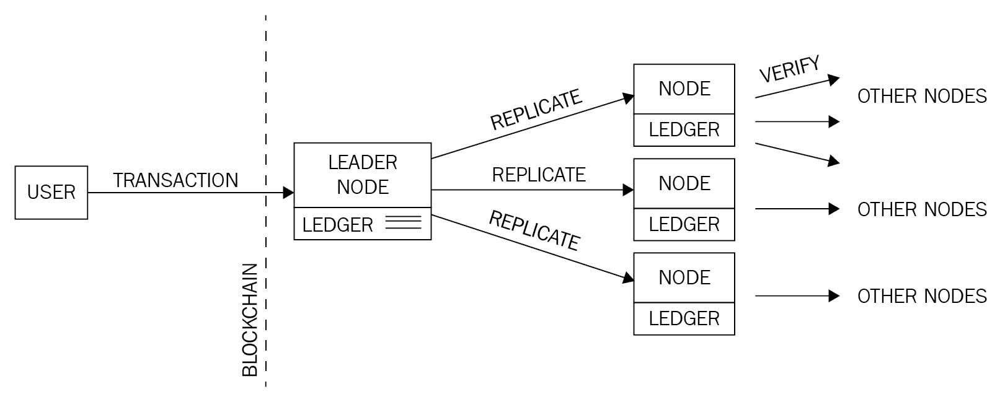
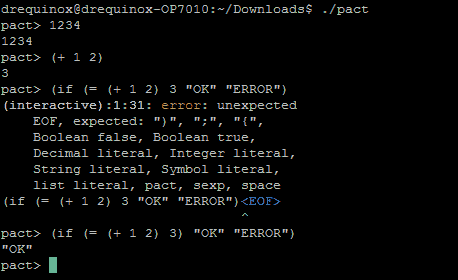
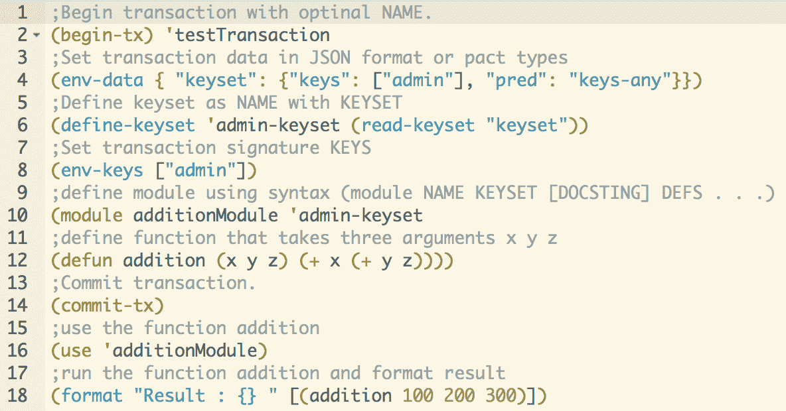
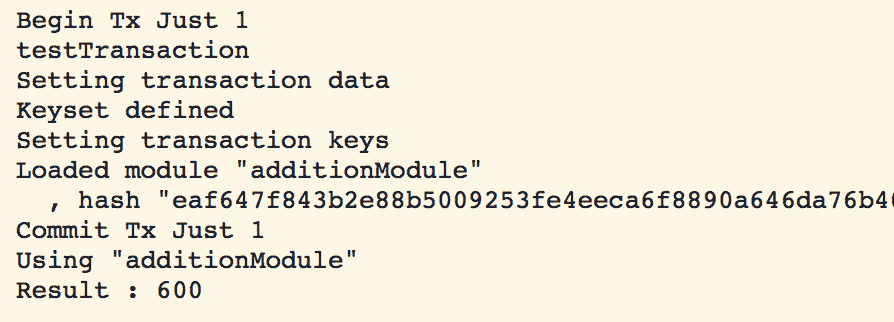
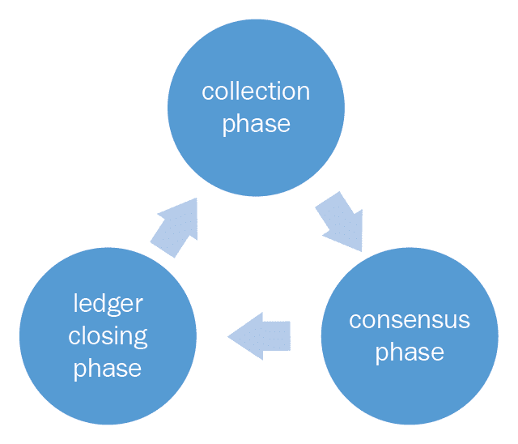

# 替代区块链

本章旨在介绍替代的区块链解决方案。随着比特币的成功以及对区块链技术潜力的逐渐认识，出现了一场寒武纪大爆发，导致了各种区块链协议、应用和平台的发展。一些项目并没有得到很大的发展，例如估计今年有 46%的 ICO 项目失败了，但许多项目已经成功在这一领域确立了自己的地位。

在本章中，读者将被介绍到像 Kadena、Ripple 和 Stellar 这样的替代区块链和平台。我们将探索那些要么是独立的新区块链，要么通过提供 SDK、框架和工具来支持其他现有区块链的项目，使得区块链解决方案的开发和部署变得更加容易。以太坊和比特币的成功导致了各种项目的出现，它们通过利用它们引入的底层技术和概念，通过增加用户友好的工具层来解决当前区块链的局限性或增强现有解决方案的价值。

# 区块链

在本节中，将介绍新的区块链解决方案，后续章节将涵盖各种平台和开发工具包，以补充现有的区块链。例如，Kadena 是一个具有创新理念的新私有区块链，其中引入了诸如可扩展 BFT 之类的概念。随着区块链技术的发展，也引入了诸如侧链、驱动链和挂钩等概念。本章将详细介绍所有这些技术和相关概念。当然，不可能涵盖所有的**替代链**（altchains）和平台，但本章包括了所有与区块链相关的、前几章涵盖的，或者预计很快会获得成功的平台。 

我们将在本节中探讨 Kadena、Ripple、Stellar、Quorum 和其他各种区块链。

# Kadena

Kadena 是一个私有区块链，成功解决了区块链系统中的可扩展性和隐私问题。Kadena 还引入了一种名为 Pact 的新的图灵不完备语言，允许智能合约的开发。Kadena 的一个关键创新是其可扩展的 BFT 共识算法，有潜力在不影响性能的情况下扩展到数千个节点。

可扩展 BFT 基于原始的 Raft 算法，是 Tangaroa 和 Juno 的后继者。Tangaroa 是 Raft 的一个实现，具有容错性（即 BFT Raft），旨在解决 Raft 算法中拜占庭节点行为引起的可用性和安全性问题，而 Juno 则是 JPMorgan 开发的 Tangaroa 的分支。共识算法在第一章的*区块链 101*中更详细地讨论。

这两个提案都有一个根本性的限制——在保持高性能的同时无法扩展。因此，Juno 无法获得太多的关注。私有区块链具有更理想的特性，即在节点数量增加时保持高性能，但上述提案缺乏这一特性。Kadena 通过其专有的可扩展 BFT 算法解决了这个问题，该算法预计能够在不降低性能的情况下扩展到数千个节点。

此外，保密性是 Kadena 的另一个重要方面，它能够在区块链上保护交易的隐私。这种安全服务通过使用密钥轮换、对称链上加密、增量哈希和双扳手协议的组合来实现。

密钥轮换是确保私有区块链安全性的标准机制。它作为一种最佳实践，通过定期更改加密密钥来防范任何攻击，如果密钥被泄露，则会被用来防范任何攻击。Pact 智能合约语言原生支持密钥轮换。

对称链上加密允许在区块链上加密交易数据。这些交易可以由特定私有交易的参与者自动解密。双扳手协议用于提供密钥管理和加密功能。

可扩展 BFT 共识协议确保在执行智能合约之前已经实现了足够的复制和共识。共识是通过以下流程实现的。

以下是交易在网络中的起源和流动方式：

1.  首先，用户签署并广播一个新的交易到区块链网络，然后由一个领导节点接收并将其添加到其不可变日志中。在此时，还会为日志计算一个增量哈希。增量哈希是一种哈希函数，它允许在已经哈希过的原始消息稍微更改时计算哈希消息的情况下进行计算，这种方案比传统哈希函数更快且资源消耗更少，因为即使原始消息只有轻微更改，也需要生成一个全新的哈希消息。

1.  一旦交易被领导节点写入日志，它就会对复制和增量哈希进行签名，并将其广播给其他节点。

1.  其他节点在接收到交易后，验证领导节点的签名，将交易添加到自己的日志中，并将自己计算得到的增量哈希（法定证明）广播给其他节点。 最后，在收到其他节点的足够数量的证明后，交易将永久提交到分类帐中。

下图显示了这个过程的简化版，领导节点记录新交易然后复制到追随节点：

Kadena 中的共识机制

一旦达成共识，智能合同执行就可以开始，并经过一系列步骤，如下：

1.  首先，验证消息的签名。

1.  Pact 智能合同层接管。

1.  Pact 代码经过编译。

1.  启动交易并执行嵌入在智能合同中的任何业务逻辑。 如果出现任何失败，将立即启动回滚，将状态恢复为执行开始之前的状态。

1.  最后，交易完成并更新相关日志。

Pact 已经被 Kadena 开源，并可在[`kadena.io/pact/downloads.html`](http://kadena.io/pact/downloads.html)下载。

这可以作为独立的二进制文件下载，提供 Pact 语言的 REPL。 这里显示了一个示例，Pact 在 Linux 控制台上通过发出`./pact`命令来运行：

Pact REPL，显示示例命令和错误输出

Pact 语言中的智能合同通常由三部分组成：密钥集、模块和表格。 这些部分在这里描述：

+   **密钥集：** 这个部分定义了表格和模块的相关授权方案。

+   **模块：** 这个部分定义了智能合同代码，以函数和契约的形式包含业务逻辑。 模块内的契约由多个步骤组成，并按顺序执行。

+   **表格：** 这个部分是在模块内定义的受访问控制的结构。只有在 admin keyset 中定义的管理员才能直接访问这个表格。 默认情况下，模块中的代码被授予对表格的完全访问权限。

Pact 也允许多种执行模式。 这些模式包括合同定义、交易执行和查询。 这些执行模式在这里描述：

+   **合同定义：** 这种模式允许通过单个交易消息在区块链上创建合同。

+   **交易执行：** 这种模式涉及执行代表业务逻辑的智能合同代码的模块。

+   **查询**：此模式仅用于简单地探测合约数据，出于性能考虑在节点上本地执行。Pact 使用类似 LISP 的语法，并且在代码中准确表示将在区块链上执行的内容，因为它以人类可读的格式存储在区块链上。这与以太坊的 EVM 相反，后者将代码编译成字节码进行执行，这使得验证正在区块链上执行的代码变得困难。此外，它是图灵不完备的，支持不可变变量，并且不允许空值，这提高了交易代码执行的整体安全性。

在本章的有限长度内无法涵盖 Pact 的完整语法和功能；但是，这里展示了一个小例子，显示了使用 Pact 编写的智能合约的一般结构。此示例显示了一个简单的加法模块，定义了一个名为`addition`的函数，该函数接受三个参数。当执行代码时，它将添加所有三个值并显示结果。

以下示例是使用在线 Pact 编译器开发的，可在[`kadena.io/try-pact/`](http://kadena.io/try-pact/)上找到。

Pact 示例代码

运行代码时，会产生如下所示的输出：

代码的输出

如前面的示例所示，执行输出与代码布局和结构完全匹配，这样可以实现更大的透明度，并限制了恶意代码执行的可能性。

Kadena 是一种新型的区块链，引入了**普遍确定性**的新概念，在标准的基于公钥/私钥的数据来源安全性之外，还提供了另一层完全确定性的共识。它在区块链的所有层面，包括交易和共识层，提供了加密安全性。

Pact 的相关文档和源代码可以在[`github.com/kadena-io/pact`](https://github.com/kadena-io/pact)找到。

Kadena 还于 2018 年 1 月推出了一种公共区块链，这是构建具有大规模吞吐量的区块链的又一重大进步。该提案的新颖之处在于建立了一种 PoW 并行链架构。该方案通过将节点上的单独开采的链组合成单一网络来工作。结果是具有超过 10,000 笔交易处理能力的大规模吞吐量。

原始研究论文可在[`kadena.io/docs/chainweb-v15.pdf`](http://kadena.io/docs/chainweb-v15.pdf)找到。

# Ripple

2012 年推出的 Ripple 是一种货币交换和实时毛额结算系统。在 Ripple 中，支付结算无需等待，与传统结算网络相比，传统结算网络可能需要数天时间才能完成结算。

它有一个称为**瑞波币**（**XRP**）的本地货币。它还支持非 XRP 支付。这个系统被认为类似于一个被称为*哈瓦拉*的传统老款转账机制。这个系统通过代理人接收汇款和密码，然后联系收款人的代理人，并指示他们向提供密码的人释放资金来运作。然后收款人联系当地代理人，告诉他们密码，并收取资金。代理人类比于瑞波中的网关。这只是一个非常简单的类比；实际的协议相当复杂，但原则上是相同的。

瑞波网络由各种节点组成，这些节点根据其类型可以执行不同的功能：

+   **用户节点**：这些节点用于支付交易，可以支付或接收支付。

+   **验证节点**：这些节点参与共识机制。每个服务器维护一组唯一节点，它在实现共识时需要查询这些节点。**唯一节点列表**（**UNL**）中的节点受到参与共识机制的服务器的信任，并且只会接受来自这个唯一节点列表的投票。

由于涉及网络运营商和监管机构，有时不认为瑞波是一个真正去中心化的网络。然而，它可以被认为是去中心化的，因为任何人都可以通过运行验证节点成为网络的一部分。此外，共识过程也是去中心化的，因为对账本提出的任何更改都必须遵循超级多数投票的方案来决定。然而，这是研究人员和爱好者之间的热门话题，对于每种思想流派都有支持和反对的论点。读者可以参考一些在线讨论进一步探索这些想法。

您可以在以下链接找到这些在线讨论：

+   [`www.quora.com/Why-is-Ripple-centralized`](https://www.quora.com/Why-is-Ripple-centralized)

+   [`thenextweb.com/hardfork/2018/02/06/ripple-report-bitmex-centralized/`](https://thenextweb.com/hardfork/2018/02/06/ripple-report-bitmex-centralized/)

+   [`www.reddit.com/r/Ripple/comments/6c8j7b/is_ripple_centralized_and_other_related_questions/?st=jewkor7b&amp;sh=e39bc635`](https://www.reddit.com/r/Ripple/comments/6c8j7b/is_ripple_centralized_and_other_related_questions/?st=jewkor7b&sh=e39bc635)

Ripple 维护着一个由一种名为**Ripple 协议共识算法**（**RPCA**）的新型低延迟共识算法所管理的全球分布式账本，共识过程通过迭代地寻求验证服务器的验证和接受，直到获得足够数量的投票来就交易所在的开放账本的状态达成一致。一旦收到足够的投票（最初为 50%，随着每次迭代逐渐增加至至少 80%），变化就会被验证并且账本被关闭。在这一点上，会向整个网络发送警报，指示账本已关闭。

RPCA 的原始研究论文可在[`ripple.com/files/ripple_consensus_whitepaper.pdf`](https://ripple.com/files/ripple_consensus_whitepaper.pdf)中找到。

总之，共识协议是一个三阶段的过程：

+   **收集阶段**：在此阶段，验证节点收集所有由账户所有者在网络上广播的交易并验证它们。一旦被接受，交易被称为候选交易，并根据验证标准接受或拒绝。

+   **共识阶段**：在收集阶段之后，共识过程开始，共识达成后账本被**关闭**。

+   **账本关闭阶段**：该过程每隔几秒钟异步运行一次，在轮次中，账本会相应地被打开和关闭（更新）：

Ripple 共识协议阶段

在 Ripple 网络中，有许多组件共同工作，以实现共识并形成支付网络。这些组件在这里分别讨论：

+   **服务器**：该组件作为共识协议的参与者。为了能够参与共识协议，需要 Ripple 服务器软件。

+   **账本**：这是网络上所有账户余额的主要记录。账本包含各种元素，如账本编号、账户设置、交易、时间戳以及指示账本有效性的标志。

+   **上一个关闭的账本**：一旦验证节点达成共识，账本就会关闭。

+   **开放账本**：这是尚未验证且尚未就其状态达成共识的账本。每个节点都有自己的开放账本，其中包含了提议的交易。

+   **唯一节点列表**：这是验证服务器使用的一组唯一的受信任节点，以便寻求投票和随后的共识。

+   **提议者**：顾名思义，该组件提出要包含在共识过程中的新交易。通常是一个节点的子集（在前面的点中定义的 UNL），可以向验证服务器提议交易。

# 交易

交易由网络用户创建以更新账本。为了被视为共识过程中的候选项，交易预期是数字签名和有效的。每个交易都需要支付少量 XRP，这充当了防止因垃圾邮件而导致的拒绝服务攻击的保护机制。

Ripple 网络中有不同类型的交易。Ripple 交易数据结构中的一个字段称为`TransactionType`，用于表示交易的类型。交易通过四个步骤执行：

1.  首先，通过遵循标准创建未签名的交易，准备交易

1.  第二步是签名，交易被数字签名以授权它

1.  然后，通过连接的服务器实际提交到网络

1.  最后，执行验证以确保交易成功验证

大致而言，交易可以分为三种类型，即与支付相关的、与订单相关的和与帐户和安全相关的。所有这些类型都在下一节中描述。

# 与支付相关的

此类别中有几个字段会导致某些操作。所有这些字段如下所述：

+   `Payment`: 此交易最常用，允许一个用户向另一个用户发送资金。

+   `PaymentChannelClaim`: 该操作用于从支付通道中索取瑞波币（XRP）。支付通道是一种允许各方进行重复且单向支付的机制。它还可用于设置支付通道的过期时间。

+   `PaymentChannelCreate`: 此交易创建一个新的支付通道，并以*滴*的形式添加 XRP。一个滴相当于 0.000001 个 XRP。

+   `PaymentChannelFund`: 此交易用于向现有通道添加更多资金。与`PaymentChannelClaim`交易类似，这也可用于修改支付通道的过期时间。

# 与订单相关的

此类型的交易包括以下两个字段：

+   `OfferCreate`: 该交易表示限价订单，代表了货币交换的意向。如果订单无法完全执行，则会在共识账本中创建一个报价节点。

+   `OfferCancel`: 用于从共识账本中删除先前创建的报价节点，表示撤销订单。

# 帐户和安全相关

此类型的交易包括以下列出的字段。每个字段负责执行特定的功能：

+   `AccountSet`: 此交易用于修改 Ripple 共识账本中帐户的属性。

+   `SetRegularKey`: 用于更改或设置帐户的交易签名密钥。帐户是使用从帐户的主公钥派生的 Base-58 Ripple 地址来识别的。

+   `SignerListSet`: 可用于创建用于多重签名交易的签名者集合。

+   `TrustSet`: 这用于创建或修改账户之间的信任线。

Ripple 中的交易由各种对所有交易类型通用的字段组成。这些字段如下所示，并附有描述：

+   `Account`: 这是交易发起者的地址。

+   `AccountTxnID`: 这是一个可选字段，包含另一个交易的哈希值。它用于将交易链接在一起。

+   `Fee`: 这是 XRP 的金额。

+   `Flags`: 这是一个可选字段，用于指定交易的标志。

+   `LastLedgerSequence`: 这是交易可以出现的账本中的最高序列号。

+   `Memos`: 这代表可选的任意信息。

+   `SigningPubKey`: 这代表公钥。

+   `Signers`: 这代表多重签名交易中的签名者。

+   `SourceTag`: 这代表交易的发送方或原因。

+   `SourceTag`: 这代表交易的发送方或原因。

+   `TxnSignature`: 这是交易的验证数字签名。

# Interledger

Interledger 是一个由四层组成的简单协议：应用层、传输层、Interledger 层和账本层。每一层负责在某些协议下执行各种功能。这些功能和协议在以下部分描述。

此协议的规范可在以下链接找到：[`interledger.org/rfcs/0003-interledger-protocol/draft-9.html`](https://interledger.org/rfcs/0003-interledger-protocol/draft-9.html)

# 应用层

运行在这一层上的协议管理支付交易的关键属性。应用层协议的示例包括**简单支付设置协议**（**SPSP**）和**开放网络支付方案**（**OWPS**）。SPSP 是一种 Interledger 协议，通过在它们之间创建连接器，允许在不同账本之间进行安全支付。OWPS 是另一种方案，允许在不同网络之间进行消费者支付。

一旦这一层上的协议成功运行，将按顺序调用传输层的协议以启动支付流程。

# 传输层

这一层负责管理支付交易。目前可用的协议有**乐观传输协议**（**OTP**）、**通用传输协议**（**UTP**）和**原子传输协议**（**ATP**）。OTP 是最简单的协议，它在没有任何托管保护的情况下管理支付转账，而 UTP 则提供托管保护。ATP 是最先进的协议，它不仅提供托管传输机制，还利用可信的公证人进一步确保了支付交易的安全性。

# Interledger 层

该层提供互操作性和路由服务。该层包含诸如**Interledger 协议**（**ILP**）、**Interledger 报价协议**（**ILQP**）和**Interledger 控制协议**（**ILCP**）等协议。ILP 数据包提供了传输中的最终目标（目的地）。ILQP 用于在实际转账之前由发送方发起的报价请求。ILCP 用于在支付网络上的连接器之间交换与路由信息和支付错误相关的数据。

# 分类帐层

该层包含了使连接器之间进行通信和支付交易执行的协议。**连接器**基本上是实现在不同分类帐之间转发支付的协议的对象。它可以支持各种协议，如简单分类帐协议、各种区块链协议、传统协议和不同的专有协议。

Ripple 连接由各种即插即用的模块组成，通过使用 ILP 实现分类帐之间的连接。它使各方在交易之前交换所需数据成为可能，包括可见性、费用管理、交付确认和使用传输层安全性进行安全通信。第三方应用程序可以通过各种连接器连接到 Ripple 网络，这些连接器在不同分类帐之间转发支付。

在前述章节中描述的所有层构成了 Interledger 协议的架构。总的来说，Ripple 是一个针对金融行业的解决方案，使实时支付成为可能，而无需任何结算风险。由于这是一个非常功能丰富的平台，在本章节中无法覆盖所有方面。

Ripple 平台的文档可在[`ripple.com/`](https://ripple.com/)找到。

# 星际

Stellar 是基于区块链技术的支付网络，采用了一种新颖的共识模型称为**联邦拜占庭协议**（**FBA**）。FBA 通过创建信任方的法定人数来工作。**Stellar 共识协议**（**SCP**）是 FBA 的一种实现。

Stellar 白皮书中指出的关键问题是当前金融基础设施的成本和复杂性。这种限制需要一个全球金融网络，解决这些问题而不损害金融交易的完整性和安全性。这一要求导致了 SCP 的发明，这是一种可证明安全的共识机制。

SCP 的原始研究论文可在[`www.stellar.org/papers/stellar-consensus-protocol.pdf`](https://www.stellar.org/papers/stellar-consensus-protocol.pdf)找到。

它具有以下四个主要属性：

+   **去中心化控制**：这允许任何人参与，没有中央方

+   **低延迟**：这解决了快速交易处理的迫切要求

+   **灵活信任**：这使用户可以选择他们信任的特定目的方

+   **渐进式安全性**：这利用数字签名和哈希函数来为网络提供所需的安全级别。

Stellar 网络允许通过其原生数字货币来传输和表示资产的价值，称为**Lumens**，缩写为**XLM**。当交易在网络上广播时，Lumens 会被消耗，这也作为阻止服务拒绝攻击的一种威慑手段。

在其核心，Stellar 网络维护着一个分布式分类账，记录着每一笔交易，并在每个 Stellar 服务器（节点）上复制。共识是通过验证服务器之间的交易并使用更新更新分类账来实现的。Stellar 分类账也可以充当分布式交易所订单簿，允许用户存储他们的购买或出售货币的报价。

有各种工具、SDK 和软件构成了 Stellar 网络。

核心软件可在 [`github.com/stellar/stellar-core`](https://github.com/stellar/stellar-core) 获取。

# Rootstock

在详细讨论**Rootstock**（**RSK**）之前，重要的是定义并介绍一些对 Rootstock 设计至关重要的概念。这些概念包括侧链、驱动链和双向锚定。侧链的概念最初是由 Blockstream 开发的。

Blockstream 的在线存在位于 [`blockstream.com`](https://blockstream.com)。

**双向锚定**是一种机制，通过该机制价值（硬币）可以在一个区块链之间传输到另一个区块链，反之亦然。实际上没有硬币在链之间转移。这个想法围绕着在比特币区块链（主链）中锁定相同数量和价值的硬币，并在次要链中解锁等值的令牌的概念。

牢记这个定义，侧链可以如下部分所述定义。

# 侧链

这是一个与主区块链并行运行的区块链，允许在它们之间传输价值。这意味着一个区块链中的代币可以在侧链中使用，反之亦然。这也被称为锚定侧链，因为它支持双向锚定资产。

# Drivechain

这是一个相对较新的概念，其中对于解锁在主链中的锁定比特币的控制被给予了矿工，他们可以投票何时解锁它们。这与侧链相反，在侧链中，共识是通过简单支付验证机制来验证的，以便将硬币转回主链。

Rootstock 是一个智能合约平台，它在比特币区块链中具有双向钉住。其核心思想是增加比特币系统的可扩展性和性能，并使其能够与智能合约一起使用。Rootstock 运行一个名为**Rootstock 虚拟机**（**RVM**）的图灵完备确定性虚拟机。它还兼容 EVM，并允许以太坊智能合约在 Rootstock 上运行。智能合约也可以在比特币区块链的经过时间测试的安全性下运行。Rootstock 区块链通过与比特币合并挖矿来工作。这使得 Rootstock 区块链能够实现与比特币相同的安全级别。特别是防止双重支付和实现结算终局性。由于更快的区块时间和其他设计考虑因素，它可以实现可扩展性，每秒高达 400 笔交易。

如果你想进一步探索，可在[`uploads.strikinglycdn.com/files/ec5278f8-218c-407a-af3c-ab71a910246d/RSK%20White%20Paper%20-%20Overview.pdf`](https://uploads.strikinglycdn.com/files/ec5278f8-218c-407a-af3c-ab71a910246d/RSK%20White%20Paper%20-%20Overview.pdf)上查阅研究论文。

RSK 已发布了名为 Bamboo 的主网络，RSK MainNet 目前还处于测试阶段。

可在[`www.rsk.co/`](http://www.rsk.co/)上找到。

# Quorum

这是通过增强现有以太坊区块链构建的区块链解决方案。Quorum 引入了几项改进，如交易隐私和新的共识机制。Quorum 引入了一种名为 QuorumChain 的新共识模型，它基于大多数投票和基于时间的机制。另一个名为“星座”（Constellation）的功能也被引入，它是一个通用机制，用于提交信息并允许节点之间的加密通信。此外，节点级别的权限受智能合约的管理。与公共以太坊区块链相比，它还提供了更高层次的性能。

几个组件构成了 Quorum 区块链生态系统。这些列在以下小节中。

# 交易管理器

该组件可访问加密的交易数据。它还管理节点上的本地存储，并与网络上的其他交易管理器进行通信。

# 加密飞地

正如其名称所示，该组件负责提供加密服务以确保交易隐私。它还负责执行密钥管理功能。

# QuorumChain

这是 Quorum 的关键创新。这是一种 BFT 共识机制，允许通过区块链网络上的交易验证和流通投票。在这个方案中，使用智能合约来管理共识过程，并且节点可以被赋予投票权来投票哪个新区块应该被接受。一旦投票者收到了足够数量的选票，该区块被视为有效。节点可以担任两种角色，即投票者或制造者。**投票者**节点有权投票，而**制造者**节点是创建新区块的节点。按设计，一个节点可以具有权利、无权利或只有一种。

# 网络管理器

此组件为权限网络提供了访问控制层。

Quorum 网络中的节点可以担任多种角色，例如，允许创建新区块的制造者节点。使用密码学和某些交易仅供相关参与者查看的概念提供交易隐私。这个想法类似于 Corda 在 第十三章中讨论过的私有交易的概念，*Hyperledger*。由于它允许在区块链上进行公共和私有交易，因此状态数据库已分为代表私有和公共交易的两个数据库。因此，有两个单独的 Patricia-Merkle 树来表示网络的私有状态和公共状态。私有合同状态哈希用于在交易参与方之间的私有交易中提供共识证据。

Quorum 网络中的交易包括多种元素，如收件人、发送者的数字签名（用于识别交易发起者）、可选的以太数量、允许查看交易的参与者的可选列表，以及在私有交易情况下包含哈希的字段。

交易在达到目的地之前要经过几个步骤。这些步骤如下所述：

1.  用户应用程序（DApps）通过区块链网络提供的 API 将交易发送到 Quorum 节点。这还包括接收地址和交易数据。

1.  然后，API 加密有效负载并应用任何其他必要的加密算法，以确保交易的隐私，并发送给交易管理器。此步骤还计算了加密有效负载的哈希值。

1.  在接收到交易后，交易管理器验证交易发送者的签名并存储消息。

1.  先前加密的有效负载的哈希被发送到 Quorum 节点。

1.  一旦 Quorum 节点开始验证包含私有交易的区块，它会从交易管理器请求更多相关数据。

1.  一旦交易管理器收到此请求，它将加密的有效负载和相关的对称密钥发送给请求者的 Quorum 节点。

1.  一旦 Quorum 节点拥有所有数据，它就会解密有效负载并将其发送到 EVM 进行执行。这就是 Quorum 如何在区块链上使用对称加密实现隐私，同时能够使用原生以太坊协议和 EVM 分别进行消息传输和执行的方式。

一个类似的概念，在几个方面有所不同，之前以**HydraChain**的形式提出过，它基于以太坊区块链，并允许创建许可的分布式账本。

Quorum 可以在 [`github.com/jpmorganchase/quorum`](https://github.com/jpmorganchase/quorum) 下载。

# Tezos

Tezos 是一个通用的自修改的加密账本，这意味着它不仅允许就区块链状态达成分散共识，还允许就协议和节点随时间演变达成共识。Tezos 已经开发出来解决比特币协议的局限性，比如由于 PoW 导致的硬分叉问题、成本问题和挖矿算力集中问题、脚本能力有限和安全问题。它是用一种纯函数语言 OCaml 开发的。

原始研究论文可在 [`www.tezos.com/static/papers/white_paper.pdf`](https://www.tezos.com/static/papers/white_paper.pdf) 获取。

Tezos 分布式账本的架构分为三层：网络层、共识层和交易层。这种分解允许协议以去中心化的方式演变。为此，在 Tezos 中实现了一个通用网络外壳，负责维护区块链，该区块链由共识层和交易层的组合表示。该外壳提供了网络和协议之间的接口层。

也引入了种子协议的概念，用作允许网络上的利益相关者批准协议的任何更改的机制。

Tezos 区块链从一个种子协议开始，而传统区块链是从创世区块开始的。

这个种子协议负责定义区块链中的修正程序，甚至修正协议本身。Tezos 的奖励机制基于 PoS 算法，因此没有挖矿需求。

Tezos 开发了一个合约脚本语言用于编写智能合约，这是一种基于堆栈的图灵完备语言。Tezos 中的智能合约是经过形式验证的，这允许对代码进行数学上的正确性验证。

Tezos 最近通过 ICO 完成了 2.32 亿美元的众筹。他们的公共网络预计将于 2018 年第一季度发布。

Tezos 代码可以在 [`github.com/tezos/tezos`](https://github.com/tezos/tezos) 获取。

# Storj

云存储的现有模型都是集中式解决方案，可能或可能不像用户期望的那样安全。需要一个安全、高度可用且最重要的是分散化的云存储系统。Storj 旨在提供基于区块链的、分散化的和分布式存储。它是由社区共享的云，而不是一个中央组织。它允许在充当自治代理的节点之间执行存储合同。这些代理（节点）执行各种功能，如数据传输、验证和执行数据完整性检查。

核心概念基于称为**分布式哈希表**（**DHTs**）的**Kademlia**，但是在 Storj 中通过添加新的消息类型和功能来增强此协议。它还实现了点对点的**发布/订阅**（**pub/sub**）机制，称为**Quasar**，该机制确保消息成功到达对存储合同感兴趣的节点。这是通过称为**topics**的基于布隆过滤器的存储合同参数选择机制来实现的。

Storj 在网络中以加密格式存储文件。在文件存储在网络上之前，它会使用 AES-256-CTR 对称加密进行加密，然后以分布式方式逐片存储在网络上。将文件分解为片段的过程称为**sharding**，这会增加网络的可用性、安全性、性能和隐私。此外，如果节点失败，则该片段仍然可用，因为默认情况下，在网络上的三个不同位置存储单个片段。

它维护了一个区块链，作为一个共享账本，并实现了标准的安全功能，如公钥/私钥加密和哈希函数，类似于任何其他区块链。由于该系统基于节点之间的硬盘共享，任何人都可以通过共享其额外的硬盘空间并使用 Storj 的加密货币**Storjcoin X**（**SJCX**）获得报酬。SJCX 被开发为 *Counterparty* 资产，并使用 Counterparty（基于比特币区块链）进行交易。这已经迁移到了以太坊。

可以在 [`blog.storj.io/post/158740607128/migration-from-counterparty-to-ethereum`](https://blog.storj.io/post/158740607128/migration-from-counterparty-to-ethereum) 中找到详细的讨论。

Storj 代码可在 [`github.com/Storj/`](https://github.com/Storj/) 获取。

# MaidSafe

这是另一个类似于 Storj 的分布式存储系统。用户通过为网络贡献存储空间而获得 Safecoin 报酬。支付机制受到 *资源证明* 的管理，该机制确保用户提交给网络的磁盘空间可用，如果不可用，则相应的 Safecoin 支付将下降。文件在传输到网络进行存储之前会被加密和分割成小部分。

与 MaidSafe 一起引入了**机会性缓存**的概念，这是一种创建经常访问数据的副本物理上更接近访问请求来源的机制，这导致了网络的高性能。SAFE 网络的另一个新颖特性是，它会自动删除网络上的任何重复数据，从而减少存储需求。

而且，还引入了**翻本**的概念，基本上意味着数据不断在网络中移动，以便恶意对手无法针对数据。它还在网络中保留了数据的多个副本，以提供冗余备份，以防节点离线或失败。

# BigchainDB

这是一个可扩展的区块链数据库。它本身并不严格算是一个区块链，而是通过提供一个分散式数据库来补充区块链技术。从本质上说，它是一个分布式数据库，但具有区块链的附加属性，例如分散化、不可变性和处理数字资产。它还允许使用 NoSQL 来查询数据库。

它旨在在分散式生态系统中提供数据库，其中不仅处理是分散的（区块链）或文件系统是分散的（例如 IPFS），而且数据库也是分散的。这使整个应用生态系统变得分散。

这可以在[`www.bigchaindb.com/`](https://www.bigchaindb.com/)找到。

# MultiChain

MultiChain 已经作为私有区块链的开发和部署平台而开发。它基于比特币代码，解决了安全性、可扩展性和隐私问题。它是一个高度可配置的区块链平台，允许用户设置不同的区块链参数。它支持通过细粒度许可层进行控制和隐私保护。MultiChain 的安装非常快捷。

安装文件的链接可在[`www.multichain.com/download-install/`](http://www.multichain.com/download-install/)找到。

# Tendermint

Tendermint 是一个为应用程序提供 BFT 共识机制和状态机复制功能的软件。它的主要动机是开发一个通用、安全和高性能的复制状态机。

Tendermint 有两个组件，在下一节描述。

# Tendermint Core

这是一个共识引擎，可以在网络中的每个节点上安全地复制交易。

# Tendermint Socket Protocol (TMSP)

这是一个应用程序接口协议，允许与任何编程语言进行接口，以处理交易。

Tendermint 允许应用程序过程和共识过程解耦，这使得任何应用都可以从共识机制中受益。

Tendermint 共识算法是一种基于轮次的机制，其中验证节点在每个轮次提出新的区块。使用锁定机制来确保防止在同一高度的区块链上选择了两个不同的区块用于提交的情况。每个验证节点维护一个包含交易的完整本地复制的区块账本。每个区块包含一个标头，其中包括前一个区块哈希、区块提议的时间戳、当前区块高度和区块中所有交易的 Merkle 根哈希。

最近，Tendermint 已经被用于**Cosmos**（[`cosmos.network`](https://cosmos.network)），这是一个区块链网络，允许不同链之间在 BFT 共识算法上运行的互操作性。这个网络上的区块链被称为区域。Cosmos 中的第一个区域称为 Cosmos Hub，实际上是一个公共区块链，负责为其他区块链提供连接服务。为此，Hub 使用了**跨区块链通信**（**IBC**）协议。IBC 协议支持两种类型的交易，称为`IBCBlockCimmitTx`和`IBCPacketTx`。第一种类型用于向任何一方提供区块链中最新块哈希的证明，而后一种类型用于提供数据原始认证。从一个区块链到另一个区块链的数据包首先通过向目标链发布证明来发布。接收（目标）链检查此证明以验证发送链是否确实发布了数据包。此外，它有自己的本地货币叫做 Atom。这个方案通过允许多个区块链连接到 Hub 来解决可扩展性和互操作性问题。

Tendermint 可以在[`tendermint.com/`](https://tendermint.com/)找到。

# 平台和框架

本节涵盖了各种已开发的平台，旨在增强现有区块链解决方案的体验。

# Eris

Eris 不是单一的区块链，它是由 Monax 开发的用于开发基于区块链的生态系统应用程序的开放模块化平台。它提供了各种框架、SDK 和工具，可以加速区块链应用程序的开发和部署。

Eris 应用平台背后的核心思想是通过区块链后端实现生态系统应用程序的开发和管理。它允许与多个区块链集成，并使各种第三方系统能够与其他各种系统交互。

该平台使用用 Solidity 语言编写的智能合约。它可以与以太坊或比特币等区块链进行交互。交互可以包括连接命令、启动、停止、断开连接和创建新区块链。在 Eris 中，与区块链的设置和交互相关的复杂性已被抽象化。所有命令对不同的区块链都是标准化的，在平台上可以使用相同的命令，而不管目标区块链类型如何。

一个生态系统应用可以包括 Eris 平台，从而实现 API 网关，以允许传统应用连接到密钥管理系统、共识引擎和应用引擎。Eris 平台提供了各种工具包，用于为开发人员提供各种服务。这些模块描述如下：

+   **Chains**: 这允许创建和与区块链进行交互。

+   **Packages**: 这允许开发智能合约。

+   **Keys**: 用于密钥管理和签名操作。

+   **Files**: 这允许与分布式数据管理系统一起工作。它可用于与 IPFS 和数据湖等文件系统进行交互。

+   **Services**: 这提供了一组服务，允许管理和整合生态系统应用程序。

Eris 还开发了几个 SDK，允许开发和管理生态系统应用程序。这些 SDK 包含经过完全测试并满足业务特定需求和要求的智能合约。例如，金融 SDK、保险 SDK 和物流 SDK。还有一个基本 SDK，作为管理生态系统应用程序生命周期的基本开发工具包。

Monax 开发了自己的权限区块链客户端，称为`eris:db`。这是一个基于 PoS 的区块链系统，允许与多种不同的区块链网络集成。`eris:db`客户端由四个组件组成：

+   **Consensus**: 这基于前面讨论过的 Tendermint 共识机制

+   **Virtual machine**: Eris 使用 EVM，因此支持 Solidity 编译的合约

+   **Permissions layer**: 作为权限账本，Eris 提供了一个可以用于在网络上分配不同实体的特定角色的访问控制机制

+   **Interface**: 这提供了各种命令行工具和 RPC 接口，以便与后端区块链网络进行交互

以太坊区块链和`eris:db`之间的关键区别在于`eris:db`使用了一个**实用拜占庭容错**(**PBFT**)算法，该算法实施为基于存款的权益证明（DPOS 系统），而以太坊使用 PoW。此外，`eris:db`使用了 ECDSA `ed22519`曲线方案，而以太坊使用了`secp256k1`算法。最后，它是有权限访问控制层的，而以太坊是公共区块链。

Eris 是一个功能丰富的应用平台，提供了大量的工具包和服务来开发基于区块链的应用程序。

它可以在[`monax.io/`](https://monax.io/)上找到。

# 总结

本章以替代区块链的介绍开始，分为讨论区块链和平台两个主要部分。区块链技术是一个非常繁荣的领域，因此现有解决方案的变化非常迅速，几乎每天都会引入新的相关技术或工具。在本章中，介绍了精心挑选的平台和区块链。考虑了一些与前几章涵盖的材料相辅相成的解决方案，例如支持区块链开发的 Eris。还讨论了新的区块链，如 Kadena，各种新的协议，如 Ripple，以及侧链和驱动链等概念。

本章涵盖的材料旨在为读者感兴趣的领域提供更深入研究的坚实基础。正如前面所说，区块链是一个发展迅猛的领域，还有许多其他区块链提议项目，如 Tau-Chain、HydraChain、Elements、CREDITS 等等，本章未涉及。鼓励读者关注该领域的发展，以及迅速增长的区块链技术的进步，以保持自己的更新。

在下一章中，我们将探讨区块链如何在其原始用途之外使用，即加密货币。我们将涵盖各种用例，特别是区块链在物联网中的使用。
