# 区块链 - 货币之外

数字货币是区块链技术的首次应用，可以说并没有意识到其真正的潜力。随着比特币的发明，区块链的概念首次被引入，但直到 2013 年才意识到了区块链技术在许多不同行业中的真正潜力，而不仅仅是加密货币。从那时起，人们提出了区块链技术在各个行业的许多用例，包括但不限于金融、物联网、数字版权管理、政府和法律。

在本章中，通过使用案例，选择了四个主要行业，即物联网、政府、卫生和金融，进行讨论。

2010 年，开始讨论 BitDNS，一个互联网域名的分散命名系统。然后，Namecoin ([`wiki.namecoin.org/index.php?title=History`](https://wiki.namecoin.org/index.php?title=History))于 2011 年 4 月开始，其愿景与比特币不同，比特币的唯一目的是提供电子现金。这可以被认为是除了纯粹的加密货币之外第一个区块链用途的例子。

从 2013 年开始，许多想法涌现出来。自 2013 年以来，这一趋势呈指数级增长。

# 物联网

**物联网**（**IoT**）简称最近因其改变商业应用和日常生活的潜力而受到了很多关注。物联网可以被定义为一个由计算智能物理对象（如汽车、冰箱、工业传感器等任何物体）组成的网络，这些对象能够连接到互联网，感知现实世界的事件或环境，对这些事件做出反应，收集相关数据，并通过互联网进行通信。

这个简单的定义具有巨大的影响，并引发了令人兴奋的概念，如可穿戴设备、智能家居、智能电网、智能联网汽车和智能城市，这些概念都基于物联网设备的这一基本概念。在剖析物联网的定义之后，四个功能浮出水面，这些功能由物联网设备执行。这些功能包括**感知**、**反应**、**收集**和**通信**。所有这些功能都是通过物联网设备上的各种组件执行的。

感知由传感器执行。反应或控制由执行器执行，收集是各种传感器的功能，通信是由提供网络连接的芯片执行的。值得注意的是，物联网中所有这些组件都可以通过互联网访问和控制。物联网设备本身可能在某种程度上有用，但如果它是更广泛的物联网生态系统的一部分，则更有价值。

典型的物联网可以由许多物理对象相互连接和连接到集中的云服务器组成。如下图所示：

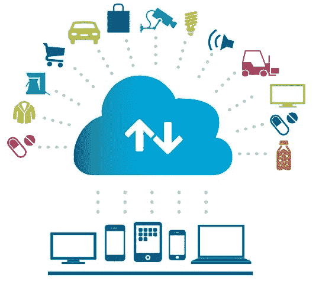

典型的物联网网络

出处：IBM

物联网的元素分布在多个层中，且存在可用于开发物联网系统的各种参考架构。可使用五层模型来描述物联网，其中包含物理对象层，设备层，网络层，服务层和应用层。每个层级负责各种功能，并包含多个组件。这些显示在以下图中：

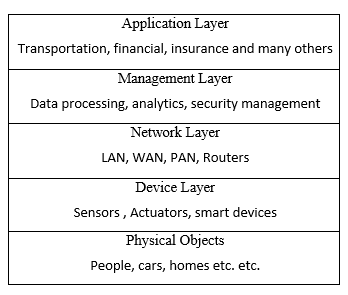

物联网五层模型

现在我们将详细检查每个层。

# 物理对象层

这些对象包括任何现实世界中的物体。包括人、动物、汽车、树木、冰箱、火车、工厂、家庭，实际上任何需要监控和控制的东西都可以连接到物联网。

# 设备层

此层包含构成物联网的东西，如传感器、传感器、执行器、智能手机、智能设备和**射频识别**（**RFID**）标签。传感器可以有许多类别，如体感传感器、家庭传感器和基于其执行的工作类型的环境传感器。该层是物联网生态系统的核心，各种传感器用于感知现实环境。该层包括可以监测温度、湿度、液体流动、化学物质、空气、压力等的传感器。通常，设备上需要**模拟至数字转换器**（**ADC**）将现实世界的模拟信号转换为微处理器可以理解的数字信号。

此层的执行器提供了启用对外部环境进行控制的手段，例如启动电机或打开门。这些组件还需要数字模拟转换器，以将数字信号转换为模拟信号。当物联网设备需要控制机械部件时，这种方法尤其重要。

# 网络层

该层由用于在物联网生态系统中设备之间和与云端或服务器之间提供互联网连接的各种网络设备组成。这些设备可以包括网关、路由器、集线器和交换机。该层可以包括两种通信类型。

首先是水平通信手段，包括无线电，蓝牙，Wi-Fi，以太网，局域网，Zigbee 和个人局域网(PAN)，可用于提供物联网设备之间的通信。其次，我们有与下一层的通信，通常是通过互联网，提供机器与人或其他上层之间的通信。第一层可以选择性地包含在设备层，因为它实际上是位于设备层上的，设备可以在同一层相互通信。

# 管理层

该层为物联网生态系统提供管理层。这包括能够处理从物联网设备收集的数据并将其转化为有意义的洞见的平台。此外，设备管理、安全管理和数据流管理也包括在此层中。它还管理设备与应用层之间的通信。

# 应用层

此层包括在物联网网络顶部运行的应用程序。根据需求，此层可以包含许多应用程序，如交通运输、医疗保健、金融、保险或供应链管理。当然，这个列表并不是任何想象力的完整列表；有许多物联网应用可以归入此层。

随着廉价传感器、硬件和带宽的可用性，物联网近年来在各个领域获得了广泛的应用，目前在许多不同领域都有应用，包括医疗保健、保险、供应链管理、家庭自动化、工业自动化和基础设施管理。此外，技术的进步，如 IPv6 的可用性、更小更强大的处理器和更好的互联网接入，也在物联网的普及中发挥了关键作用。

物联网的好处从节省成本到使企业能够根据物联网设备提供的数据做出关键决策并因此提高绩效。即使在家庭使用中，物联网设备配备的家用电器也可以提供有价值的节能数据。例如，用于能源监测的智能电表可以提供有关能源使用情况的宝贵信息，并将其传达回服务提供商。来自数百万物品（物联网设备）的原始数据被分析并提供有意义的见解，有助于及时和有效地做出业务决策。

通常的物联网模型基于中心化范式，物联网设备通常连接到云基础设施或中央服务器以报告和处理相关数据。这种集中化带来了某些利用可能性，包括黑客攻击和数据盗窃。此外，对个人数据在单一中心化服务提供商上缺乏控制也增加了安全和隐私问题的可能性。虽然有方法和技术可以构建基于普通物联网模型的高度安全的物联网生态系统，但区块链对物联网可以带来特定且更加可取的好处。基于区块链的物联网模型不同于传统的物联网网络范式。

根据 IBM 的说法，区块链对物联网的作用在于帮助建立信任、降低成本并加速交易。此外，区块链技术的核心——去中心化，可以消除物联网网络中的单点故障。例如，一个中央服务器可能无法应对数十亿个物联网设备（物）以高频率产生的数据量。此外，区块链提供的点对点通信模型可以帮助降低成本，因为无需建立高成本的集中式数据中心或实施复杂的公钥基础设施来保障安全。设备可以直接或通过路由器相互通信。

据各种研究机构和公司的估计，到 2020 年，将有大约 220 亿台设备连接到互联网。随着数十亿台设备连接到互联网，很难想象集中式基础设施将能够满足对带宽、服务和可用性的高需求而不会产生过多的支出。基于区块链的物联网将能够解决当前物联网模型中的可扩展性、隐私性和可靠性问题。

区块链使“物”能够直接通信和交易，而且在智能合约的可用性下，谈判和金融交易也可以直接在设备之间进行，而无需中间商、权威或人工干预。例如，如果酒店中的一个房间空置，它可以出租自己，谈判租金，并为支付了足够资金的人打开门锁。另一个例子可能是，如果洗衣机用完了洗涤剂，它可以在智能合约中编程的逻辑基础上找到最优价格和价值后在线订购洗涤剂。

上述的五层物联网模型可以通过在网络层之上添加一个区块链层来适应基于区块链的模型。该层将运行智能合约，并为物联网生态系统提供安全性、隐私性、完整性、自主性、可扩展性和去中心化服务。在这种情况下，管理层可以仅由与分析和处理相关的软件组成，而安全性和控制可以移至区块链层。该模型可以在以下图表中可视化：

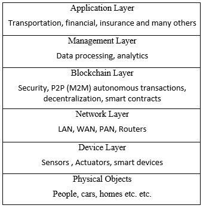

基于区块链的物联网模型

在这个模型中，其他层可能保持不变，但会引入一个额外的区块链层作为物联网网络所有参与者之间的中间件。

在摘除了前面提到的所有层之后，它也可以被视为点对点的物联网网络。在这个模型中，所有设备都在没有中央指挥和控制实体的情况下相互通信和协商，如下图所示：

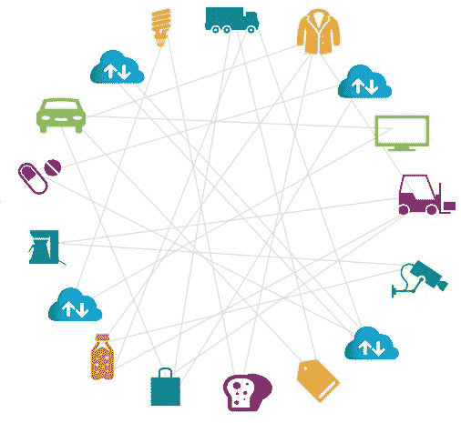

基于区块链的直接通信模型，来源：IBM

采用基于区块链的去中心化方法，还可以实现成本节约。通过区块链，设备管理变得更容易。可以通过使用区块链优化物联网网络的性能。在这种情况下，不需要为数百万台设备集中存储物联网数据，因为存储和处理要求可以分布到区块链上的所有物联网设备上。这可以完全消除处理和存储物联网数据的大型数据中心的需求。

基于区块链的物联网还可以防止服务拒绝攻击，黑客可以更有效地针对集中服务器或数据中心，但使用区块链的分布式和去中心化性质，此类攻击不再可能。此外，如果按估计，很快将有数十亿台设备连接到互联网，从传统的集中式服务器管理所有这些设备的安全性和更新几乎是不可能的。区块链可以通过允许设备以安全的方式直接相互通信，甚至从彼此请求固件和安全更新来解决此问题。在区块链网络上，这些通信可以被记录下来，保证不可变性和安全性，从而为系统提供了可审计性、完整性和透明度。这种机制在传统的点对点系统中是不可能的。

总之，物联网和区块链的融合可以带来明显的好处，学术界和工业界已经在进行大量的研究和工作。已经提出了各种提供基于区块链的物联网解决方案的项目。例如，IBM 蓝色地平线和 IBM Bluemix 是支持区块链物联网平台的物联网平台。各种初创公司如 Filament 已经提出了关于如何构建使物联网设备能够直接和自主地通过智能合约进行交易的分散网络的新颖想法。

在接下来的部分，提供了一个实际的例子，说明了如何构建一个简单的物联网设备并将其连接到以太坊区块链。这个物联网设备连接到以太坊区块链，当区块链上的用户发送了适当数量的资金时，用于打开一扇门（在本例中，门锁由 LED 表示）。这只是一个简单的例子，需要一个更严格测试的版本才能将其投入生产，但它演示了如何将物联网设备连接、控制和响应于以太坊区块链上的某些事件。

# 物联网区块链实验

本示例使用了树莓派设备，树莓派是一种**单板计算机**（**SBC**）。树莓派是一种低成本的计算机，旨在促进计算机教育，但也因其作为构建物联网平台的首选工具而广受欢迎。以下图片显示了树莓派 3 型 B 型。您也可以使用早期型号，但尚未经过测试：

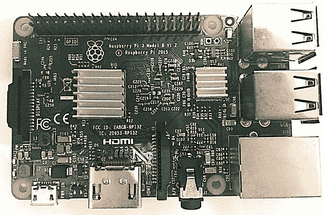

树莓派 Model B

在接下来的部分中，将讨论一个例子，其中树莓派将作为连接到以太坊区块链的 IoT 设备，并响应智能合约调用的示例。

首先，需要设置树莓派。这可以通过使用 NOOBS 来完成，NOOBS 提供了一个安装 Raspbian 或其他操作系统的简单方法。

可以从链接[`www.raspberrypi.org/downloads/noobs/`](https://www.raspberrypi.org/downloads/noobs/)下载并安装。

或者，你可以从链接[`www.raspberrypi.org/downloads/raspbian/`](https://www.raspberrypi.org/downloads/raspbian/)安装 Raspbian。

另一个可用的选择在[`github.com/debian-pi/raspbian-ua-netinst`](https://github.com/debian-pi/raspbian-ua-netinst)也可以用来安装 Raspbian OS 的最小非 GUI 版本。

对于本例，已经使用 NOOBS 来安装 Raspbian，因此，其余的操作假设 Raspbian 已经安装在树莓派的 SD 存储卡上。下面截图中的命令输出显示了操作系统正在运行的架构。在这种情况下，它是`armv71`；因此，将下载适用于 ARM 的 Geth 二进制文件。

可以通过在 Raspberry Pi Raspbian 操作系统的终端窗口中运行命令`uname -a`来确认平台。

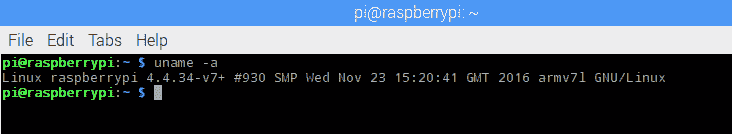

树莓派架构

安装了 Raspbian 操作系统后，下一步是为树莓派 ARM 平台下载适当的 Geth 二进制文件。

下载和安装步骤详细描述如下：

1.  Geth 下载。请注意，在下面的示例中下载了特定版本，但也有其他可下载的版本，可以从[`geth.ethereum.org/downloads/`](https://geth.ethereum.org/downloads/)下载。

我们可以使用`wget`来下载`geth`客户端映像：

```
      $ wget https://gethstore.blob.core.windows.net/builds/geth-linux- arm7-1.5.6-2a609af5.tar.gz
```

也可以使用其他版本，但建议你下载此版本，因为这是本章示例中使用的版本。

1.  解压缩并提取到一个目录。使用下面显示的`tar`命令将自动创建名为`geth-linux-arm7-1.5.6-2a609af5`的目录：

```
      $ tar -zxvf geth-linux-arm7-1.5.6-2a609af5.tar
```

此命令将创建一个名为`geth-linux-arm7-1.5.6-2a609af5`的目录，并将 Geth 二进制文件和相关文件解压缩到该目录中。Geth 二进制文件可以复制到`/usr/bin`或 Raspbian 上的适当路径中，以便在操作系统中的任何地方都可用。下载完成后，下一步是创建创世区块。

1.  需要使用创世区块。可以从网络上的其他节点复制创世文件。下图显示了这一点。或者，也可以生成一个全新的创世区块。

```
      { 
           "nonce": "0x0000000000000042", 
           "timestamp": "0x00", 
           "parentHash":   
           "0x0000000000000000000000000000000000000000000000000000000000000000", 
           "extraData": "0x00", 
           "gasLimit": "0x8000000", 
           "difficulty": "0x0400", 
           "mixhash":        
           "0x0000000000000000000000000000000000000000000000000000000000000000", 
           "coinbase": "0x3333333333333333333333333333333333333333", 
           "alloc": { 
           }, 
           "config": { 
               "chainId": 786, 
               "homesteadBlock": 0, 
               "eip155Block": 0, 
               "eip158Block": 0 
           } 
      }
```

1.  将`genesis.json`文件复制到树莓派后，可以运行以下命令来生成起源块。重要的是使用先前生成的相同起源块，否则节点将实际上在不同的网络上运行：

```
 $ ./geth init genesis.json
```

将显示类似于以下截图中所示的输出：

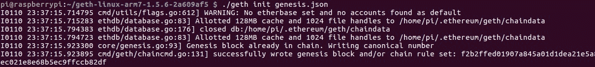

初始化起源文件

1.  创建起源块后，有必要向网络中添加对等节点。可以通过创建一个名为`static-nodes.json`的文件来实现，其中包含供树莓派上的`geth`用于同步连接的对等方的 enode ID：

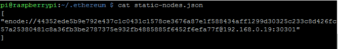

静态节点配置

可以通过在 Geth JavaScript 控制台上运行以下命令来获取此信息，此命令应该在树莓派要连接的对等方上运行：

```
      > admin.nodeInfo
```

这将显示类似于以下截图中所示的输出：

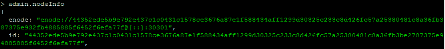

geth nodeInfo

完成这一步之后，可以按照以下部分中提供的进一步说明来连接树莓派到私有网络上的其他节点。在本示例中，树莓派将连接到网络 ID `786` *.* 关键是使用先前创建的相同起源文件和不同的端口号。相同的起源文件将确保客户端连接到与起源文件相同的网络。

不同的端口不是严格要求的，但是，如果两个节点在私有网络下运行，并且需要从网络外部访问，则将使用 DMZ、路由器和端口转发的组合。因此，建议使用不同的 TCP 端口以确保端口转发工作正常。第一次节点设置中显示的`--identity`开关在以前并未介绍过，它允许为节点指定一个标识名称。

# 第一个节点设置

首先，需要使用以下命令在第一个节点上启动`geth`客户端：

```
$ geth --datadir .ethereum/privatenet/ --networkid 786 --maxpeers 5 --rpc --rpcapi web3,eth,debug,personal,net --rpcport 9001 --rpccorsdomain "*" -- port 30301 --identity "drequinox"  
```

这将产生类似于以下内容的输出：

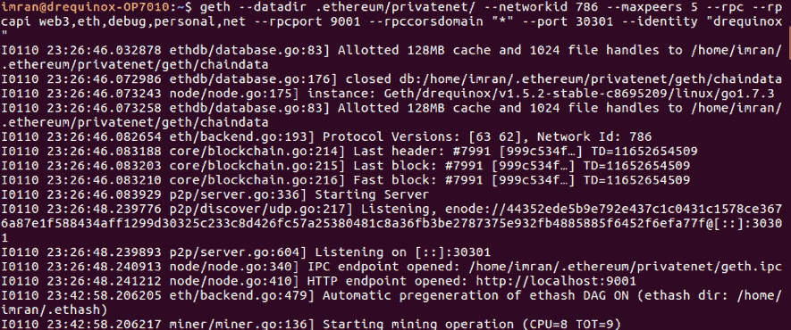

第一个节点上的 geth

启动后，应保持其运行，并应从树莓派节点上启动另一个`geth`实例。

# 树莓派节点设置

在树莓派上，需要运行以下命令来启动`geth`并将其与其他节点进行同步（在本例中仅一个节点）。以下是命令：

```
$ ./geth --networkid 786 --maxpeers 5 --rpc --rpcapi web3,eth,debug,personal,net --rpccorsdomain "*" --port 30302 --identity "raspberry"  
```

这应产生类似于以下屏幕截图中显示的输出。当输出中包含显示`区块同步已启动`的行时，这意味着节点已成功连接到其对等节点。

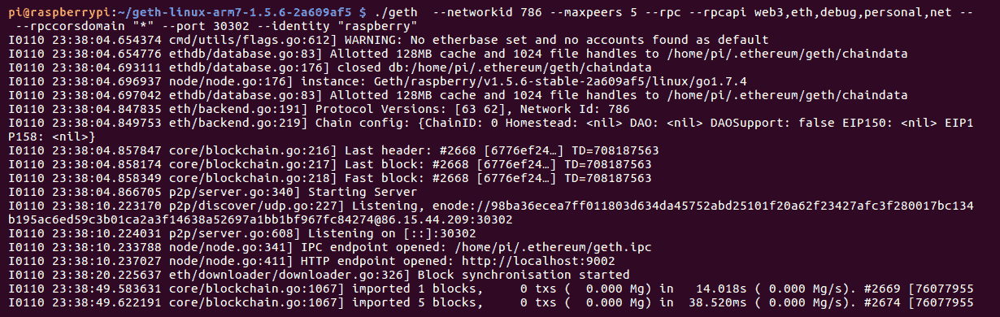

树莓派上的 geth。

这可以通过在两个节点上的 `geth` 控制台中运行命令来进一步验证，如下面的截图所示。只需在树莓派上运行以下命令即可连接到 `geth` 客户端：

```
$ geth attach 
```

这将打开用于与 `geth` 节点交互的 JavaScript `geth` 控制台。我们可以使用 `admin.peers` 命令来查看连接的对等节点：

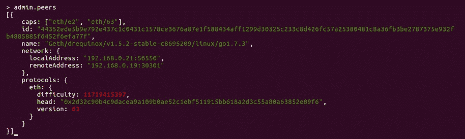

在树莓派上运行的 geth 控制台 admin peers 命令

类似地，可以通过在第一个节点上运行以下命令来连接到 `geth` 实例：

```
$ geth attach ipc:.ethereum/privatenet/geth.ipc  
```

一旦控制台可用，可以运行 `admin.peers` 命令来显示其他连接节点的详细信息，如下面的截图所示：

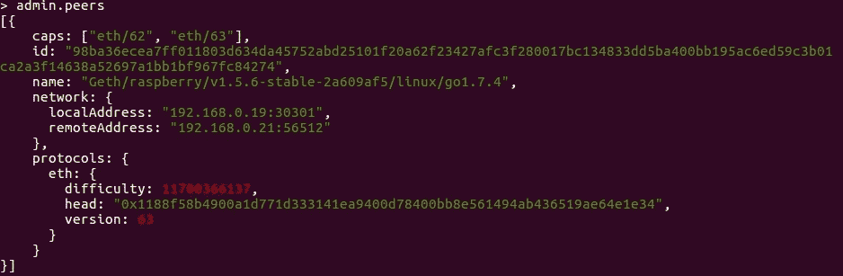

在其他对等节点上运行的 geth 控制台 admin peers 命令

一旦两个节点都启动，可以安装进一步的先决条件来设置实验。需要安装 Node.js 和相关的 JavaScript 库。

# 安装 Node.js

这里列出了所需的库和依赖项。首先需要在树莓派 Raspbian 操作系统上更新 Node.js 和 npm。为此，可以按照以下步骤进行操作：

1.  使用以下命令在树莓派上安装最新的 Node.js：

```
      $ curl -sL https://deb.nodesource.com/setup_7.x | sudo -E bash -
```

这应该显示类似以下的输出。输出内容相当多，因此以下截图仅显示了输出的顶部部分：

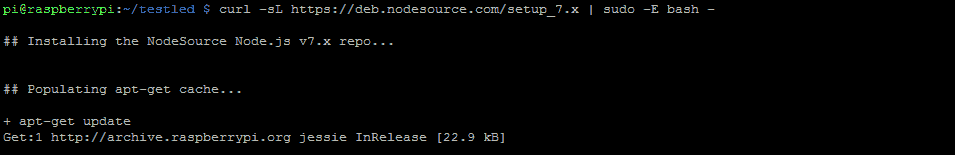

安装 Node.js

1.  通过 `apt-get` 运行更新：

```
      $ sudo apt-get install nodejs
```

可通过运行以下命令执行验证，以确保正确安装了 Node.js 和 npm 的正确版本，如下面的截图所示：

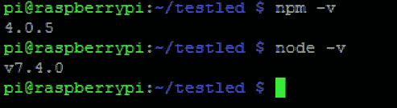

npm 和 node 安装验证

需要注意的是，这些版本并非必须；最新版本的 npm 和 Node.js 中的任何版本都应该可以使用。但是，本章的示例使用 npm 4.0.5 和 node v7.4.0，因此建议读者使用相同版本，以避免任何兼容性问题。

1.  安装以启用 JavaScript 代码访问以太坊区块链的 Ethereum `web3` npm：

确保安装了截图中显示的特定版本的 `web3` 或类似版本，例如 0.20.2。这很重要，因为默认情况下将安装 1.0.0-beta.26 版本（写作时的版本），该版本为 beta 版本，正在开发中。因此，本例应使用 `web3` 0.20.2 或 0.18.0 稳定版本。读者可以通过 `$ npm install web3@0.20.2` 命令安装此版本。

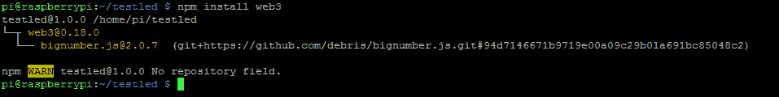

npm install web3

1.  类似地，可以安装 npm `onoff`，以与树莓派进行通信并控制 GPIO：

```
      $ npm install onoff
```

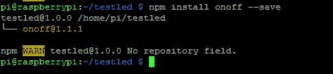

安装 Onoff

安装了所有先决条件之后，可以进行硬件设置。为此，可以使用面包板和一些电子元件构建一个简单的电路。

硬件组件列示如下：

+   **LED**: 轻发光二极管的缩写，可以用作事件的视觉指示。

+   **电阻**: 需要一个 330 欧姆的元件，根据其额定值对通过的电流提供阻力。对于本实验无需了解其背后的理论；任何标准的电子工程文本都详细介绍了所有这些主题。

+   **面包板**: 这提供了一种不需要焊接就可以建立电子电路的方法。

+   **T 形导线**: 此导线如下图所示插入到面包板上，并提供了树莓派的**通用输入/输出**（**GPIO**）管脚的标记视图。

+   **排线连接器**: 这只是用于通过 GPIO 在树莓派和面包板之间提供连通性。所有这些组件如下图所示：

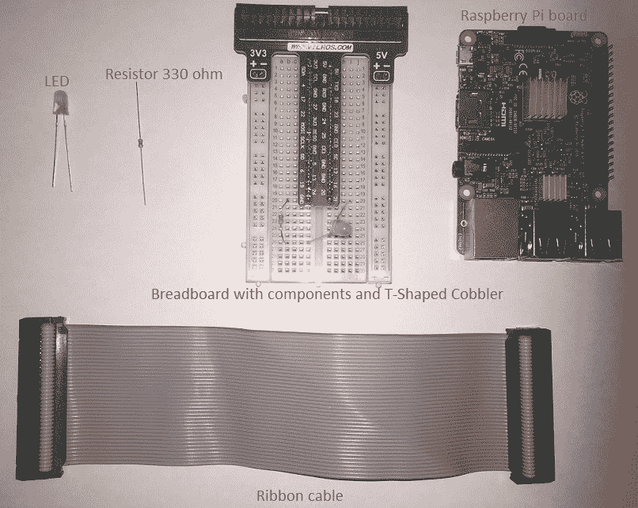

所需组件

# 电路

如下图所示，LED 的正腿（长腿）连接到 GPIO 的**21**管脚，负腿（短腿）连接到电阻，然后连接到 GPIO 的**地**（**GND**）管脚。一旦连接设置好，可以简单地使用排线连接到树莓派的 GPIO 连接器。

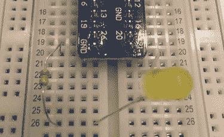

面包板上的组件连接

一旦连接正确设置，并且树莓派已经更新了适当的库和 Geth，下一步就是开发一个简单的智能合同，该合同期望一个值。如果提供给它的值不是它期望的，它就不会触发一个事件。然而，如果传递的值与正确的值匹配，事件就会触发，这个事件可以被在通过 Node.js 运行的客户端 JavaScript 程序读取。当然，Solidity 合同可能非常复杂，也可以处理发送到它的以太，如果以太的数量等于所需数量，那么事件就能触发。然而，在这个例子中，目标是展示使用智能合同来触发事件，然后通过 Node.js 上运行的 JavaScript 程序读取这些事件，然后借此可以使用各种库来触发物联网设备上的操作。

智能合同源代码如下：

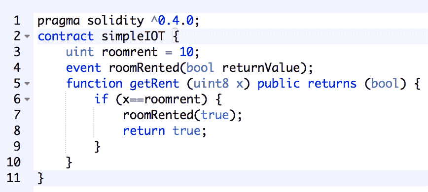

简单 IOT 的 Solidity 代码

可以使用在线 Solidity 编译器（Remix IDE）来运行和测试本合同。与该合同交互所需的**应用二进制接口**（**ABI**）也可在详情部分找到，如下截图所示：

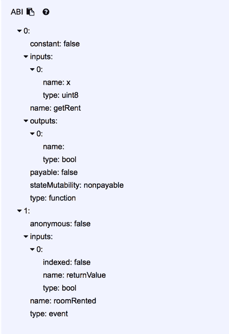

来自 Remix IDE 的 ABI

以下是合同的 ABI：

```
[ 
    { 
        "constant": false, 
        "inputs": [ 
            { 
                "name": "x", 
                "type": "uint8" 
            } 
        ], 
        "name": "getRent", 
        "outputs": [ 
            { 
                "name": "", 
                "type": "bool" 
            } 
        ], 
        "payable": false, 
        "stateMutability": "nonpayable", 
        "type": "function" 
    }, 
    { 
        "anonymous": false, 
        "inputs": [ 
            { 
                "indexed": false, 
                "name": "returnValue", 
                "type": "bool" 
            } 
        ], 
        "name": "roomRented", 
        "type": "event" 
    } 
] 
```

树莓派节点可以通过`web3`接口连接到私有区块链有两种方法。第一种是树莓派设备在本地运行自己的`geth`客户端并维护其分类账，但对于资源受限的设备，在某些情况下，不可能运行完整的`geth`节点甚至是轻节点。在这种情况下，可以使用第二种方法，该方法使用`web3`提供程序连接到适当的 RPC 通道。这将在客户端 JavaScript Node.js 程序中稍后显示。

这两种方法的比较如下图所示：

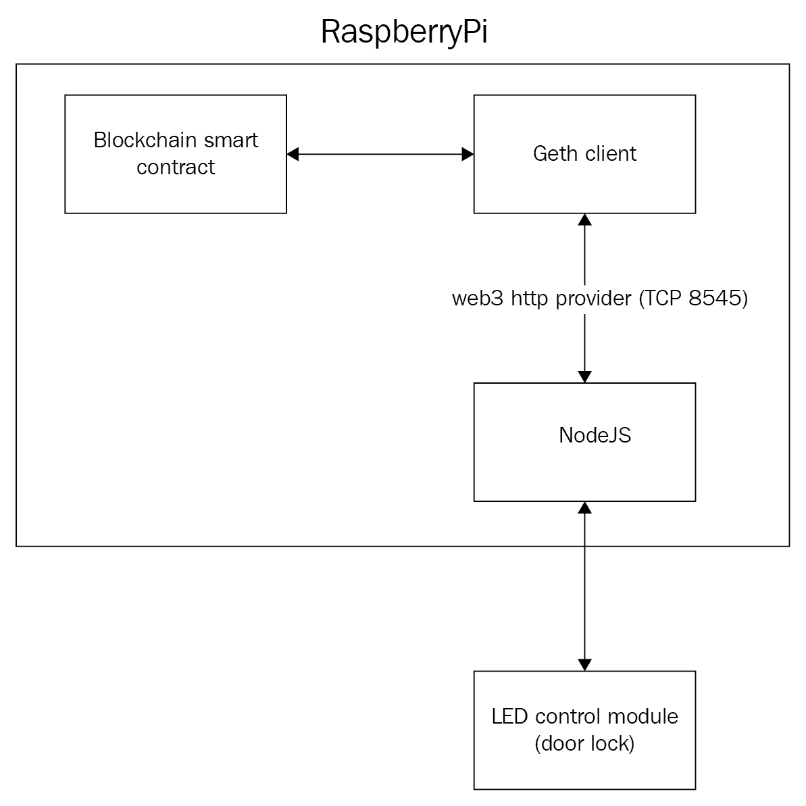

房屋租赁物联网应用程序的应用架构（带本地分类账的物联网设备）

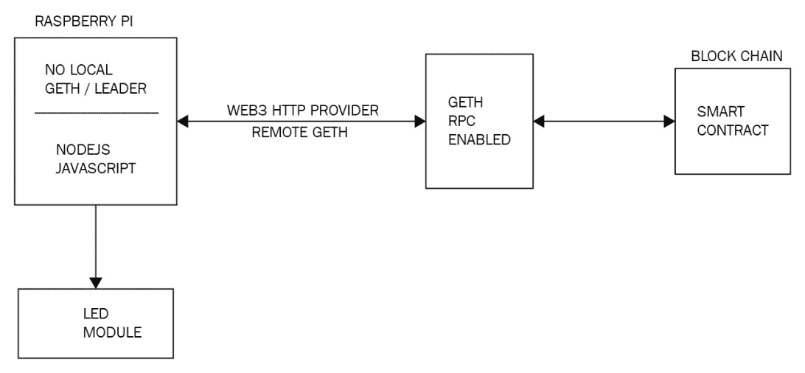

房屋租赁物联网应用程序的应用架构（不带本地分类账的物联网设备）

公开 RPC 接口会引发明显的安全问题；因此，建议仅在私有网络上使用此选项，如果需要在公共网络上使用，则应采取适当的安全措施，例如仅允许已知 IP 地址连接到`geth` RPC 接口。可以通过禁用对等发现机制和 HTTP-RPC 服务器监听接口的组合来实现这一点。

可以使用`geth help`获取有关此的更多信息。传统的网络安全措施，如防火墙、**传输层安全性**（**TLS**）和证书也可以使用，但在本示例中未讨论。现在，Truffle 可以用于将合同部署到私有网络 ID `786`，此时树莓派连接到该网络。可以通过使用以下显示的命令简单执行 Truffle 部署；

```
$ truffle migrate  
```

应该产生类似以下截图的输出：

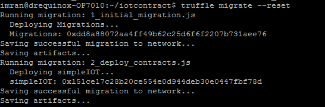

Truffle 部署

一旦合同正确部署，可以开发 JavaScript 代码，该代码将通过`web3`连接到区块链，监听区块链中智能合同的事件，并通过树莓派点亮 LED。`index.js`文件的 JavaScript 代码如下所示：

```
var Web3 = require('web3');
if (typeof web3 !== 'undefined')
{
    web3 = new Web3(web3.currentProvider);
}else
{
    web3 = new Web3(new Web3.providers.HttpProvider("http://localhost:9002")); 
    //http-rpc-port
}
var Gpio = require('onoff').Gpio; 
var led = new Gpio(21,'out');
var coinbase = web3.eth.coinbase;
var ABIString = '[{"constant":false,"inputs":[{"name":"x","type":"uint8"}],"name":"getRent","outputs":[{"name":"","type":"bool"}],"payable":false,"stateMutability":"nonpayable","type":"function"},{"anonymous":false,"inputs":[{"indexed":false,"name":"returnValue","type":"bool"}],"name":"roomRented","type":"event"}]';
var ABI = JSON.parse(ABIString);
var ContractAddress = '0x975881c44fbef4573fef33cccec1777a8f76669c';
web3.eth.defaultAccount = web3.eth.accounts[0];
var simpleiot = web3.eth.contract(ABI).at(ContractAddress);
var event = simpleiot.roomRented( {}, function(error, result) { if (!error)
{
    console.log("LED On");
    led.writeSync(1);
}
});
```

请注意，在上面的示例中，变量`var ContractAddress`的合同地址`'0x975881c44fbef4573fef33cccec1777a8f76669c'`是特定于部署的，当读者运行此示例时将会不同。只需在文件中将地址更改为部署合同后看到的内容即可。

还要注意树莓派上启动的 Geth 的 HTTP-RPC 服务器监听端口。默认情况下，它是 TCP 端口`8545`。记得根据您的树莓派设置和 Geth 配置更改此端口。在上面的示例代码中，它设置为`9002`，因为树莓派上运行的 Geth 在该示例中正在监听`9002`。如果您的树莓派上的监听端口不同，请将其更改为该端口：

```
web3 = new Web3(new Web3.providers.HttpProvider("http://localhost:9002"));
```

当 Geth 启动时，它会显示它正在监听的 HTTP 端口。这也可以通过在 `geth` 中使用 `--rpcport` 并将端口号值作为标志的参数来配置。

这段 JavaScript 代码可以放在树莓派上的一个文件中，例如 `index.js`。它可以通过以下命令运行：

```
$ node index.js  
```

这将启动程序，该程序将在 Node.js 上运行，并监听来自智能合约的事件。一旦程序正确运行，就可以使用 Truffle 控制台调用智能合约，如下图所示。

在这种情况下，将调用 `getRent` 函数，并传入参数 `10`，这是预期的值：

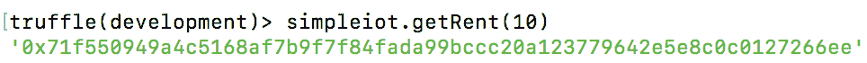

与合约的交互

合约被挖出后，将触发 `roomRented`，从而打开 LED 灯。

在这个例子中，它是一个简单的 LED 灯，但它可以是任何可以通过执行器控制的物理设备，比如房间锁。如果一切顺利，LED 将在智能合约函数调用的结果下打开，如下图所示：

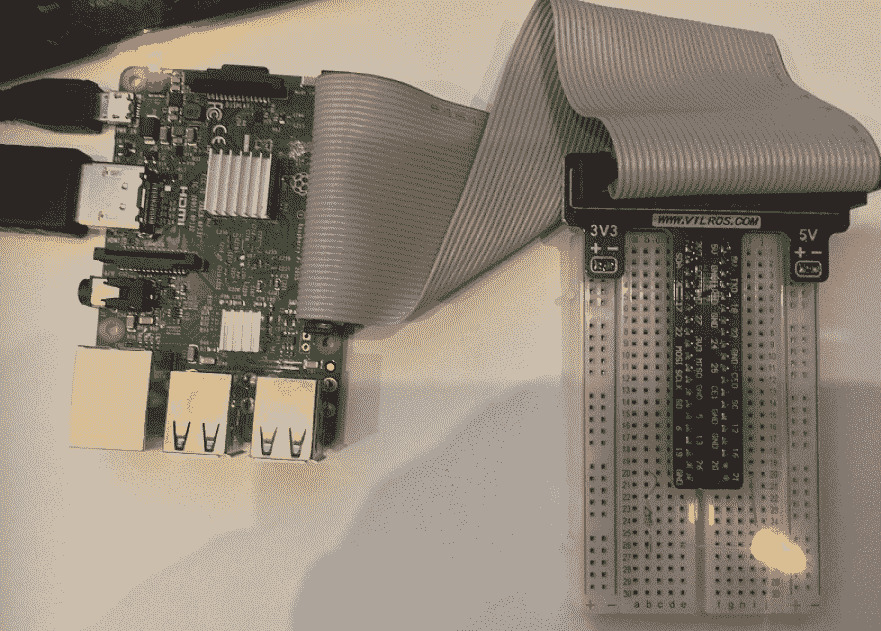

带有 LED 控制的 Raspberry Pi

另外，在节点端，它会显示类似于下图的输出：

```
$ node index.js
LED On 
```

正如前面的例子所示，可以建立一个私有网络的物联网设备，每个节点上运行一个 `geth` 客户端，并可以监听来自智能合约的事件，并相应地触发一个动作。所示的例子故意简单，但演示了使用物联网设备以及智能合约驱动的物理设备控制来构建以太坊网络的基本原理。

在下一节中，将讨论区块链技术在政府、金融和卫生等领域的其他应用。

# 政府

目前正在研究区块链的各种应用，可以支持政府职能，并将当前的电子政府模式提升到一个新的水平。首先，在本节中，将提供一些电子政府的背景信息，然后将讨论一些用例，如电子投票、国土安全（边境控制）和电子身份证（公民身份证）等。

政府或电子政府是一种利用信息和通信技术向公民提供公共服务的范例。这个概念并不新鲜，并已在世界各国实施，但是随着区块链的出现，一条新的探索途径已经打开。许多政府正在研究利用区块链技术管理和提供公共服务的可能性，包括但不限于身份证、驾驶证、各个政府部门之间的安全数据共享和合同管理。区块链的透明度、可审计性和完整性是可以有效管理各种政府职能的属性。

# 边境控制

自动边境管制系统已经使用了几十年，以阻止非法入境并防止恐怖主义和人口贩卖。

机读旅行证件，特别是生物识别护照，为自动边境管制铺平了道路；但是当前系统在某种程度上受到限制，区块链技术可以提供解决方案。**国际民航组织**（**ICAO**）在文件 ICAO 9303（[`www.icao.int/publications/pages/publication.aspx?docnum=9303`](https://www.icao.int/publications/pages/publication.aspx?docnum=9303)）中定义了**机读旅行证件**（**MRTD**）标准，并已被世界上许多国家实施。

每个护照都包含各种安全和身份属性，可用于识别护照持有人，并且可以防止篡改护照的尝试。这些包括生物特征，如视网膜扫描、指纹、面部识别，以及标准的国际民航组织指定的特征，包括**机读区**（**MRZ**）和其他可在护照第一页看到的文本属性。

当前边境管制系统的一个关键问题是数据共享，其中系统由单一实体控制，数据不会被立即共享给执法机构。这种无法共享数据的能力使得跟踪疑似旅行文件或个人变得具有挑战性。另一个问题与立即实施旅行文件黑名单相关，例如，当有必要立即跟踪和控制疑似旅行文件时。目前，没有可用的机制立即将疑似护照列入黑名单或撤销，并将其广播到全球边境管制口岸。

区块链可以通过在智能合约中维护黑名单来解决这个问题，该黑名单可以根据需要进行更新，并且任何更改都将立即对所有机构和边境管制点可见，从而实现对疑似旅行文件移动的即时控制。可以说，传统的机制，如公钥基础设施（PKIs）和点对点网络，也可以用于此目的，但它们不能提供区块链可以提供的好处。使用区块链，整个系统可以简化，而不需要复杂的网络和 PKI 设置，这也将导致成本降低。此外，基于区块链的系统将提供加密保证的不可变性，有助于审计并遏制任何欺诈行为。

由于可扩展性问题，目前可能无法将所有旅行文件的完整数据库存储在区块链上，但可以使用后端分布式数据库，如 BigchainDB、IPFS 或 Swarm。在这种情况下，可以在简单的智能合约中存储一个旅行文件的哈希，其中包含个人的生物特征 ID 的哈希，然后可以使用文件系统（如 IPFS）中可用的详细数据的文件哈希来引用文档的哈希。这样，当网络中的任何地方将旅行文件列入黑名单时，该信息将立即可用，并具有整个分布式分类帐的真实性和完整性的密码保证。这种功能也可以在反恐活动中提供足够的支持，从而在政府的国土安全职能中发挥重要作用。

Solidity 中的一个简单合约可以定义一个用于存储身份和相关生物识别记录的数组。这个数组可以用来存储关于护照的识别信息。身份可以是护照或旅行文件的 MRZ 的哈希，与 RFID 芯片的生物识别记录连接起来。一个简单的布尔字段可以用来识别被列入黑名单的护照。一旦这个初始检查通过，传统系统可以执行进一步详细的生物识别验证，最终当对护照持有人的入境决定做出时，该决定可以传播回区块链，从而使网络上的所有参与者可以立即分享决定的结果。

建立基于区块链的边境控制系统的高级方法可以可视化如下图所示。在这种情况下，护照被提供给 RFID 和页面扫描仪进行扫描，后者读取数据页面并提取机器可读信息以及存储在 RFID 芯片中的生物识别数据的哈希值。在这个阶段，还会拍摄护照持有者的实时照片和视网膜扫描。然后，将此信息传递给区块链，其中一个智能合约负责通过首先检查其黑名单护照列表来验证旅行文件的合法性，然后从后端 IPFS 数据库请求更多数据进行比较。请注意，诸如照片或视网膜扫描之类的生物识别数据不存储在区块链上，而是只在后端（IPFS 或 BigchainDB）存储对此数据的引用。

如果所呈现的护照数据与 IPFS 中的文件或 BigchainDB 中持有的数据匹配，并且通过智能合约的逻辑检查，则可以打开边境闸门。

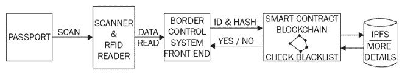

使用区块链的自动边境控制

经过验证，此信息在整个区块链上传播，并立即对边境控制区块链上的所有参与者可用。这些参与者可以是各国国土安全部门的全球联盟。

# 投票

在任何政府中投票是一个关键功能，允许公民参与民主选举过程。尽管投票已经发展成为一个更加成熟和安全的过程，但它仍然存在需要解决的限制以达到期望的成熟水平。通常，当前投票系统的限制围绕欺诈、运营流程的弱点以及尤其是透明度展开。多年来，已经建立了安全投票机制（机器），使用了承诺安全和隐私的专用投票机，但它们仍然存在可以被利用来颠覆这些机器安全机制的漏洞。这些漏洞可能对整个投票过程产生严重影响，并导致公众对政府的不信任。

基于区块链的投票系统可以通过引入端到端的安全性和透明度来解决这些问题。安全性以公钥加密的形式提供，这是区块链的标准。此外，区块链保证的不可变性确保了一旦投票就不能再次投票。这可以通过使用生物特征和智能合约维护已经投票列表来实现。例如，智能合约可以维护一个已经投票的列表，其中包含生物特征 ID（例如指纹），并可以使用该列表来检测和阻止重复投票。其次，**零知识证明**（**ZKPs**）也可以在区块链上用于保护选民的隐私。

一些公司已经提供了这样的服务，一个例子是 [`polys.me/blockchain/online-voting-system`](https://polys.me/blockchain/online-voting-system)。

最近，塞拉利昂通过区块链技术举行了总统选举，使其成为第一个使用区块链技术进行选举的国家（[`www.coindesk.com/sierra-leone-secretly-holds-first-blockchain-powered-presidential-vote/`](https://www.coindesk.com/sierra-leone-secretly-holds-first-blockchain-powered-presidential-vote/)）。

# 公民身份识别（身份证）

当前，各国发行电子身份证或国民身份证。这些卡片安全，并具有许多安全功能，可防止复制或篡改企图。然而，随着区块链技术的出现，可以对此过程进行多项改进。

数字身份不仅限于政府发行的身份证，它也适用于在线社交网络和论坛。可以为不同目的使用多个身份。基于区块链的在线数字身份允许控制个人信息的分享。用户可以看到谁使用了他们的数据以及出于什么目的，并可以控制对其访问。这是目前由中心控制的基础设施无法实现的。关键好处在于政府发放的单一身份可以通过单一政府区块链轻松、透明地用于多项服务。在这种情况下，区块链充当平台，政府为多项服务，如养老金、税收或福利，提供了永久的记录。通过数字身份进行的每一次更改和交易都有永久记录，从而确保了系统的完整性和透明性。此外，公民可以在区块链上公证出生证明、结婚证书、契约等许多其他文件，并将其与数字身份关联作为存在的证明。

目前，各个国家都有成功实施的身份计划，运作良好，有人认为也许身份管理系统并不需要区块链。尽管目前区块链技术还不够成熟，但可能并未准备好用于现实世界的身份系统。然而，各国政府正在进行研究，探索区块链在身份管理方面的应用。

此外，像被遗忘权这样的法律可能因为区块链的不可变特性而很难整合。

# 其他杂项

区块链技术可以用于改善各种政府功能的成本和效率，包括税收征收、福利管理和发放、土地所有权记录管理、生活事件登记（婚姻、出生）、机动车登记和许可证等。这并不是一个详尽的清单，随着时间的推移，政府的许多功能和流程都可以适应基于区块链的模式。区块链的关键好处，比如不可变性、透明性和去中心化，有助于改善大多数传统政府系统。

# 健康

医疗行业也被确定为另一个可以通过采用区块链技术获益的主要行业。区块链提供了一个传统点对点网络无法提供的不可变、可审计和透明的系统。此外，与传统的复杂 PKI 网络相比，区块链提供了一种成本效益高、基础设施更简单的基础设施。在医疗保健领域，主要问题包括隐私泄露、数据泄露、高成本和欺诈，这些问题都是由于互操作性、过度复杂的流程、透明度、可审计性和控制不足而引起的。另一个迫切的问题是假药；尤其是在发展中国家，这是一个主要的关注点。

随着区块链在医疗领域的适应性，可以实现多种好处，从节约成本、增加信任、理赔处理速度更快、高可用性、由于操作程序复杂性而导致的没有操作错误，到预防假药的分发。

从另一个角度来看，提供数字货币作为挖矿激励的区块链可以用来提供处理能力以解决可以帮助找到某些疾病治愈方法的科学问题。例如，FoldingCoin 就是一个例子，它通过奖励其挖矿者 FLDC 代币来共享其计算机的处理能力，以解决需要异常大计算量的科学问题。

FoldingCoin 的网址为 [`foldingcoin.net/`](http://foldingcoin.net/)。

另一个类似的项目叫做 CureCoin，网址为 [`www.curecoin.net/`](https://www.curecoin.net/)。目前还不清楚这些项目在实现其目标方面将会有多成功，但这个想法非常有前途。

# 金融

区块链在金融行业有许多应用。区块链在金融领域是目前行业内最热门的话题，主要银行和金融组织正在研究如何适应区块链技术，主要是因为它具有极具潜力的节省成本的潜力。

# 保险

在保险行业，区块链技术可以帮助阻止欺诈性索赔，提高理赔处理速度，并实现透明度。想象一下，所有保险公司之间共享的账本可以提供一个快速高效的机制来处理公司间的索赔。此外，随着物联网和区块链的融合，可以想象到一个智能设备生态系统，在这个生态系统中，所有这些设备可以通过区块链上的智能合约进行协商和管理其保险政策。

区块链可以减少处理索赔所需的总体成本和工作量。索赔可以通过智能合约自动验证和支付，以及与保险投保人的身份相关联。例如，借助 Oracle 和可能的物联网，智能合约可以确保在发生事故时记录相关遥测数据，并根据这些信息释放付款。如果智能合约在评估付款条件后得出结论认为不应释放付款，则还可以暂停付款。例如，在授权修车厂未修复车辆或在指定区域外使用等情况下等等。智能合约可以评估多种条件来处理索赔，选择这些规则取决于保险人，但总体想法是智能合约与物联网和 Oracle 结合起来可以自动化整个车辆保险行业。

几家初创公司，如 Dynamis，已提出基于以太坊区块链运行的智能合约的点对点保险平台。最初，这被建议用于失业保险，并不需要在模型中有承保人。

它可在 [`dynamisapp.com/`](http://dynamisapp.com/) 上获取。

# 交易后结算

这是区块链技术最受追捧的应用。目前，许多金融机构正在探索使用区块链技术简化、自动化和加速昂贵而耗时的交易后结算流程的可能性。

为了更好地理解问题，简要描述了交易生命周期。交易生命周期包括三个步骤：执行、清算和结算。执行涉及两个当事方之间的交易承诺，并可通过前台订单管理终端或交易所输入到系统中。清算是下一步，根据价格和数量等某些属性，将交易匹配给卖方和买方。在这个阶段，还会确定涉及付款的帐户。最后，结算是买方和卖方最终交换证券以换取付款的地方。

在传统的交易生命周期模型中，需要中央清算所来促进各方之间的交易，它承担了双方的信用风险。当前方案有些复杂，卖方和买方必须采取复杂的路径来进行交易。这包括各种公司、经纪人、结算所和托管人，但通过区块链，一个具有适当智能合约的单一分布式账本可以简化整个过程，并使买卖双方可以直接交流。

值得注意的是，交易后结算流程通常需要两到三天，并且依赖于中央清算机构和对账系统。通过共享账本的方法，区块链上的所有参与者可以立即看到有关交易状态的一个真实版本。此外，点对点结算是可能的，这将减少交易结算所需的复杂性、成本、风险和时间。最后，通过在区块链上使用适当的智能合同，可以消除中间人。此外，监管机构还可以查看区块链以进行审计和监管要求。

这在实施 MIFID-II 监管要求时可能非常有用（[`www.fca.org.uk/markets/mifid-ii`](https://www.fca.org.uk/markets/mifid-ii)）。

# 金融犯罪预防

**了解您的客户**（**KYC**）和**反洗钱**（**AML**）是防范金融犯罪的关键因素。在 KYC 的情况下，目前，每个机构维护着自己的客户数据副本，并通过中心化数据提供商进行验证。这可能是一个耗时的过程，并可能导致新客户入职过程延迟。

区块链可以通过在所有金融机构之间安全地共享包含客户已验证和真实身份的分布式分类账来解决这一问题。只有通过参与者之间的共识才能更新这个分布式账本，从而提供透明性和可审计性。这不仅可以降低成本，还可以更好地、更一致地满足监管和合规要求。

在 AML 的情况下，由于区块链的不可变、共享和透明特性，监管机构可以轻松获准访问私有区块链，从中获取相关监管报告的数据。这还将减少与从各种传统和不同系统获取数据并将其聚合和格式化用于报告目的相关的成本和复杂性。区块链可以提供加密安全、真实验证、可审计的系统中所有金融交易的单一共享视图，从而降低当前采用的监管报告方法所带来的成本和复杂性。

# 媒体

媒体行业的关键问题围绕着内容分发、权利管理和向艺术家支付版税。例如，数字音乐可以无限制地复制，任何尝试应用复制保护的努力都以某种方式被破解。没有对音乐人或词曲作者制作的内容的分发进行控制；可以无限制地复制所需次数，并且对版税支付产生影响。此外，支付并不总是有保证的，并且是基于传统的播放时长数据。围绕复制保护和版税支付的所有这些问题可以通过将消费者、艺术家和行业中的所有参与者连接起来解决，从而实现透明和对流程的控制。区块链可以提供一个网络，数字音乐在密码学上被保证只由付费的消费者拥有。这种支付机制由智能合约而不是集中式媒体机构或管理机构控制。支付将根据嵌入在智能合约中的逻辑和下载次数自动进行。

最近的一个这样的倡议的例子是 Musicoin ([`musicoin.org`](https://musicoin.org))。

此外，数字音乐文件的非法复制可以完全停止，因为一切都以透明的方式记录和不可变地拥有在区块链上。例如，音乐文件可以存储有所有者信息和时间戳，可以在整个区块链网络中进行跟踪。此外，拥有某些内容的合法副本的消费者与其所拥有的内容在密码学上是绑定的，除非得到所有者的许可，否则不能转移到另一个所有者名下。一旦所有数字内容都被不可变地记录在区块链上，版权和转移就可以通过区块链轻松管理。智能合约可以控制对所有相关方的分发和支付。

# 摘要

区块链技术有许多应用，正如在本章中讨论的那样，它们可以在各个行业中实施，为现有解决方案带来多重好处。本章讨论了可以从区块链中受益的五个主要行业。首先讨论了物联网（IoT），这是另一种革命性的技术；通过将其与区块链相结合，可以解决一些基本限制，为物联网行业带来巨大的好处。物联网受到更多关注，因为它是最突出、最准备好的适应区块链技术的候选者。

已经出现了实际的使用案例和平台，以**平台即服务**（**PaaS**）的形式出现，用于基于区块链的物联网，例如 IBM Watson IoT 区块链。IBM Blue Horizon 现在也可供实验使用，这是一个分散的基于区块链的物联网网络。其次，讨论了政府部门的应用，各种政府流程，如国土安全、身份证和福利发放可以变得更加透明、安全和强大。

此外，还讨论了金融领域的问题，以及区块链技术可能提供的解决方案。尽管金融行业正在充满热情和活力地探索使用区块链的可能性，但离生产就绪的基于区块链的系统还有很长的路要走。最后，还讨论了健康领域和音乐产业的某些方面。所有这些用例以及行业中更多的内容都依赖于区块链技术的核心属性，例如去中心化、透明度、可靠性和安全性。然而，在区块链技术完全适应之前，需要解决一些挑战；这些将在下一章中讨论。
