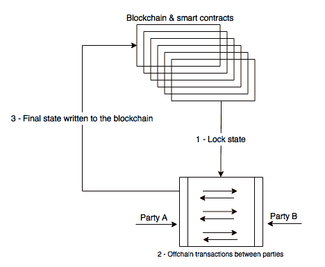
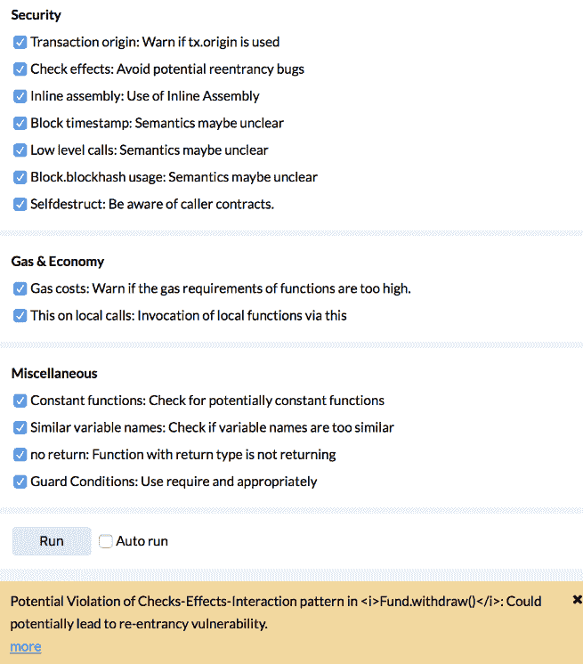
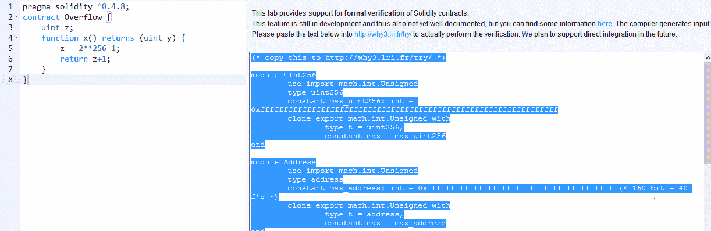
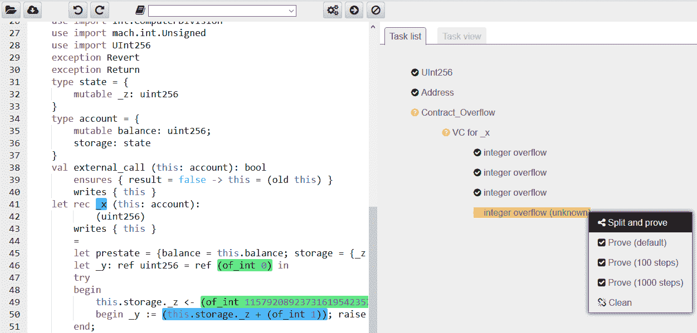
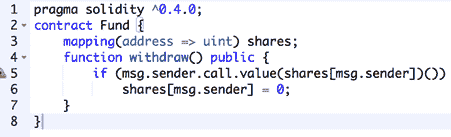
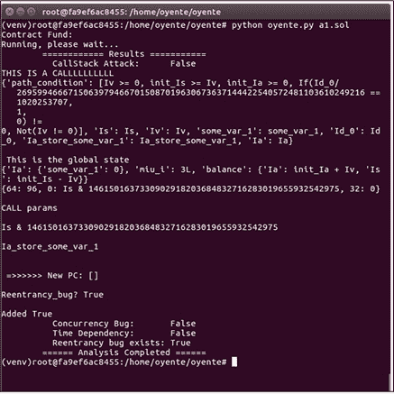
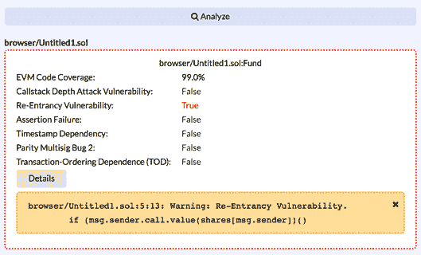

# 可扩展性及其他挑战

本章旨在介绍在区块链成为主流技术之前需要解决的各种挑战。尽管已经开发了各种用例和概念验证系统，并且该技术在许多场景下运行良好，但仍然需要解决一些存在于区块链中的根本性限制，以使这项技术更具适应性。

在这些问题清单的顶部是可扩展性，然后是隐私。这两者都是需要解决的重要限制，特别是在区块链被设想用于对隐私要求较高的行业时。在金融、法律和医疗等领域，对交易机密性有特定要求，而可扩展性通常是一个关注点，因为区块链未达到用户期望的充足性能水平。这两个问题正在成为阻碍区块链技术更广泛接受的因素。

将在本章中全面介绍当前提出的和正在进行的针对这两个特定领域的研究。除了隐私和安全性之外，其他挑战包括监管、整合、适应性和一般安全性。尽管在比特币区块链中安全性无懈可击，并经受住了时间的考验，但仍然存在一些情况可能会导致安全性在某些微妙的情景下受到损害的注意事项。此外，对于其他区块链，如以太坊，存在一些合理的安全性问题，涉及智能合约、拒绝服务攻击和大规模攻击面。所有这些将在下面的章节中详细讨论。

# 可扩展性

这个问题在过去几年中一直是激烈辩论、严格研究和媒体关注的焦点。

这是可能决定区块链更广泛适用性的最重要的问题之一，否则只能由财团限制性地进行个人使用。由于在这一领域进行了大量研究，提出了许多解决方案，这些解决方案将在下一节中讨论。

从理论上讲，解决可扩展性问题的一般方法通常围绕协议级别的增强。例如，解决比特币可扩展性的常见方法是增加其区块大小。其他提议包括将某些处理转移到链下网络的链下解决方案，例如链下状态网络。基于上述解决方案，一般而言，提议可以分为两类：**链上解决方案**，其基于改变区块链操作的基本协议的想法，以及**链下解决方案**，其利用链下的网络和处理资源以增强区块链。

最近，米勒等人在其位置论文*关于扩展分散式区块链*（[`doi.org/10.1007/978-3-662-53357-4_8`](https://doi.org/10.1007/978-3-662-53357-4_8)）中提出了解决区块链限制的另一种方法。在本文中，表明了区块链可以被划分为称为**平面**的各种抽象层。每个平面负责执行特定的功能。这些包括网络平面、共识平面、存储平面、视图平面和边平面。这种抽象允许在每个平面上单独且有条不紊地解决瓶颈和限制。下面的子节中简要概述了每个层，并参考了比特币系统。

# 网络平面

首先，讨论了网络平面。网络平面的一个关键功能是交易传播。在前述论文中已经确定，在比特币中，由于节点在传播和重复交易之前进行交易验证的方式，导致了网络带宽的低效利用，首先在交易广播阶段，然后在挖矿后的区块中。

应该注意到，BIP 152（*Compact Block Relay*，[`github.com/bitcoin/bips/blob/master/bip-0152.mediawiki`](https://github.com/bitcoin/bips/blob/master/bip-0152.mediawiki)）已经解决了这个问题。

# 共识平面

第二层被称为共识平面。该层负责挖矿和达成共识。该层的瓶颈围绕着 PoW 算法的限制，增加共识速度和带宽会导致牺牲网络安全性，因为分叉数量增加。

# 存储平面

存储平面是第三层，用于存储总账。该层的问题围绕着每个节点需要保存整个总账的需求，这导致了某些效率低下，例如增加的带宽和存储需求。比特币有一种可用的方法叫做**修剪**，它允许节点在不需要保留完整区块链的情况下运行。修剪意味着当比特币节点下载并验证了区块链后，它会删除已经验证过的旧数据。这节省了存储空间。从存储角度来看，这项功能带来了重大改进。

# 视图平面

接下来是视图平面，提出了一个基于这样一个建议的优化，即比特币矿工不需要完整的区块链来运行，并且可以从完整的总账构建视图，作为系统整体状态的表示，这对于矿工的功能是足够的。视图的实现将消除挖矿节点存储完整区块链的需求。

最后，提出了前述研究论文的作者的旁观面。该面板代表着链下交易的概念，其中支付或交易通道的概念被用来卸载参与者之间的交易处理，但仍由主比特币区块链支持。

上述模型可用于以结构化的方式描述当前区块链设计的限制和改进。此外，过去几年中提出了几种可以解决当前以太坊和比特币等区块链设计限制的一般策略。这些方法也在以下部分中以个别方式进行特征化和讨论。

# 区块大小增加

这是增加区块链性能（交易处理吞吐量）最受争议的提案。目前，比特币每秒只能处理约三到七笔交易，这是适应比特币区块链处理微交易的主要限制因素。比特币的区块大小硬编码为 1 MB，但如果增加区块大小，它可以容纳更多交易并且可以缩短确认时间。有几个**比特币改进提案**（**BIPs**）支持增加区块大小。这些包括 BIP 100、BIP 101、BIP 102、BIP 103 和 BIP 109。

历史参考资料和讨论的优秀账户可在[`en.bitcoin.it/wiki/Block_size_limit_controversy`](https://en.bitcoin.it/wiki/Block_size_limit_controversy)找到。

在以太坊中，区块大小不是通过硬编码来限制的；相反，它由燃气限制来控制。理论上，以太坊中的区块大小没有限制，因为它取决于燃气的数量，而燃气可以随着时间增加。这是可能的，因为如果在前一个区块中已经达到了限制，矿工被允许为后续区块增加燃气限制。比特币隔离见证通过将见证数据与交易数据分开处理来解决了这个问题，从而为交易提供了更多的空间。比特币的其他提案包括比特币无限制、比特币 XT 和比特币现金。读者可以参考第八章，*介绍比特币*，以获取更多详情。

获取更多信息，请参考以下链接：

+   [`www.bitcoinunlimited.info`](https://www.bitcoinunlimited.info)

+   [`bitcoinxt.software`](https://bitcoinxt.software)

+   [`www.bitcoincash.org`](https://www.bitcoincash.org)

# 区块间隔减少

另一个提案是减少每个区块生成之间的时间。可以减少区块之间的时间以实现更快的区块最终确认，但由于分叉数量的增加，可能会导致安全性降低。以太坊的区块时间已达到约 14 秒。

这是比特币区块链的重大改进，比特币区块链生成新区块需要 10 分钟的时间。在以太坊中，由于区块之间的时间较短导致的孤立区块问题通过使用**贪婪最重观察子树**（**GHOST**）协议得到缓解，即孤立区块（叔块）也被用于确定有效链。一旦以太坊转向**股权证明**（**PoS**），这将变得无关紧要，因为不再需要挖矿，几乎可以立即完成交易的最终确定。

# 可逆布隆查找表

这是另一种旨在减少比特币节点之间传输数据量的方法。**可逆布隆查找表**（**IBLTs**）最初是由加文·安德森提出的，这种方法的关键吸引力在于，如果实施，它不会导致比特币的硬分叉。其关键思想是基于这样一个事实：没有必要在节点之间传输所有交易；相反，只需传输那些尚未在同步节点的交易池中可用的交易。这样可以在节点之间更快地同步交易池，从而提高比特币网络的整体可扩展性和速度。

# 分片

分片并不是一种新技术，在可扩展性方面已经被分布式数据库如 MongoDB 和 MySQL 使用。分片背后的关键思想是将任务分割成多个块，然后由多个节点进行处理。这样做可以提高吞吐量并减少存储需求。在区块链中，采用了类似的方案，其中网络的状态被分成多个分片。状态通常包括余额、代码、nonce 和存储。分片是运行在同一网络上的区块链的松散耦合分区。关于分片间通信和每个分片历史的共识存在一些挑战。这是一个开放的研究领域。

# 状态通道

这是另一种用于加速区块链网络上交易的方法。基本思想是使用侧通道来更新状态并处理主链之外的交易；一旦状态被最终确定，它就会被写回主链，从而将耗时的操作从主区块链中卸载出来。

状态通道通过执行以下三个步骤工作：

1.  首先，区块链状态的一部分被锁定在智能合约下，确保参与者之间的协议和业务逻辑。

1.  现在开始参与者之间的链下交易处理和交互，暂时只在他们之间更新状态。在此步骤中，几乎可以执行任意数量的交易而无需区块链，这是使该过程快速并成为解决区块链可扩展性问题的最佳候选方案的原因。然而，可以说这不是真正的在区块链上的解决方案，例如，分片，但最终结果是一个更快，更轻，更健壮的网络，这可能在微支付网络，物联网网络和许多其他应用中非常有用。

1.  一旦达到最终状态，状态通道将关闭，并将最终状态写回主区块链。在此阶段，区块链的锁定部分也将被解锁。

此过程如下图所示：

状态通道

这种技术已经在比特币闪电网络和以太坊的雷电网络中使用。

# 私有区块链

私有区块链本质上是快速的，因为不需要真正的去中心化，参与网络的成员也不需要挖矿；相反，他们只能验证交易。这可以被视为公共区块链中可扩展性问题的一种变通方法；然而，这并不是解决可扩展性问题的方法。另外，需要注意的是，私有区块链仅适用于特定领域和设置，例如所有参与者都已知的企业环境。

# 股权证明

与**工作量证明**（**PoW**）不同，基于 PoS 算法的区块链基本上更快。 PoS 在第十章 *替代硬币*中有更详细的解释。

# 侧链

通过允许许多侧链与主区块链一起运行，并允许使用可能相对不太安全且更快的侧链执行交易但仍与主区块链挂钩，侧链可以间接提高可扩展性。侧链的核心思想称为双向锚定，它允许从父链向侧链和反向传输币。

# 子链

这是由彼得·R·里宗最近提出的一种相对较新的技术，其基本思想是基于弱块的概念，这些弱块在层层叠加直到找到一个强块为止。弱块可以定义为那些未能通过标准网络难度标准进行挖掘但已经完成足够工作以满足另一个更弱难度目标的块。矿工可以通过将弱块层层叠加在一起来构建子链，除非找到符合标准难度目标的块。

在这一点上，子链被关闭并成为强块。这种方法的优点包括减少了对交易首次验证的等待时间。这种技术还减少了孤块的产生几率，并加快了交易处理速度。这也是间接解决可扩展性问题的一种方式。子链不需要任何软分叉或硬分叉来实现，但需要社区的接受。

子链研究论文可在[`www.ledgerjournal.org/ojs/index.php/ledger/article/view/40`](https://www.ledgerjournal.org/ojs/index.php/ledger/article/view/40)处获取。

# 树链（树）

还有其他提高比特币可扩展性的提议，例如将区块链布局从线性顺序模型更改为树状结构的树链。该树基本上是从主比特币链延伸下来的二叉树。这种方法类似于侧链实现，消除了对主要协议更改或区块大小增加的需求。它允许改进的交易吞吐量。在这个方案中，区块链本身被分割并分布在网络中以实现可扩展性。

此外，验证树链上的区块不需要挖矿；相反，用户可以独立验证区块头。然而，这个想法目前尚未准备好投入生产，需要进一步研究以使其实用化。

最初的想法是在研究论文[`eprint.iacr.org/2016/545.pdf`](https://eprint.iacr.org/2016/545.pdf)中提出的。

除了前述的一般技术外，Christian Decker ([`scholar.google.ch/citations?user=ZaeGlZIAAAAJ&hl=en`](https://scholar.google.ch/citations?user=ZaeGlZIAAAAJ&hl=en)) 在他的书籍《论比特币的可扩展性和安全性》中还提出了一些比特币特定的改进。该提议基于加速传播时间的想法，因为当前的信息传播机制导致了区块链分叉。这些技术包括验证最小化、区块传播的流水线化和连接性增加。这些变化不需要基本协议级别的更改；相反，这些变化可以独立于比特币节点软件中实施。

关于验证最小化，已经注意到区块验证过程导致了传播延迟。这背后的原因是节点花费了很长时间来验证区块和区块内的交易的唯一性。有人建议，一旦完成了初始的 PoW 和区块验证检查，节点就可以发送清单消息。通过只执行第一次*难度检查*，而不必等待交易验证完成，可以改善传播效率。

# 区块传播

除了前述的提案外，还提出了块传播的流水线化，这是基于预期一个区块的可用性的想法。在这个方案中，区块的可用性已经宣布，而不必等待实际的区块可用性，从而减少节点之间的往返时间。最后，交易发起者和节点之间的长距离也导致了块传播的减速。Christian Decker 进行的研究表明连接增加可以减少区块和交易的传播延迟。这是可能的，因为如果任何时候比特币节点连接到许多其他节点，那么它将减少节点之间的距离，并且可以加快网络上的信息传播速度。

解决可扩展性问题的一种优雅的方案很可能是一些或所有前述一般方法的组合。针对解决区块链中的可扩展性和安全性问题所采取的一些举措现在几乎已经准备好实施或已经实施。例如，比特币**隔离见证**（**SegWit**）是一个可以大大提高可扩展性的提案，只需要软分叉才能实施。所谓*隔离见证*背后的关键思想是将签名数据与交易分离，从而解决交易可变性问题并允许增加区块大小，从而提高吞吐量。

# Bitcoin-NG

另一个提案，基于微区块和领导者选举的 Bitcoin-NG，最近引起了一些关注。其核心思想是将区块分成两种类型，即领导者块（也称为关键块）和微区块：

+   **领导者块**：这些负责工作证明，而微区块包含实际的交易。

+   **微区块**：这些不需要任何工作量证明，并由每个区块生成周期选举产生的领导者生成。该区块生成周期是由领导者块发起的。唯一的要求是使用选举产生领导者的私钥对微区块进行签名。选举产生的领导者（矿工）可以以非常高的速度生成微区块，从而提高性能和交易速度。

另一方面，以太坊的一份紫红色论文由 Vitalik Buterin 在上海的以太坊 Devcon2 上提出；它描述了一个可规模化的以太坊的愿景。紫红色提案基于分片和 PoS 算法的结合。该论文确定了一些目标，如通过 PoS 实现的效率提升，最大可能的快速区块时间，经济最终性，可伸缩性，跨分片通信和抗审查。

Mauve paper 可以在[`docs.google.com/document/d/1maFT3cpHvwn29gLvtY4WcQiI6kRbN_nbCf3JlgR3m_8/edit#`](https://docs.google.com/document/d/1maFT3cpHvwn29gLvtY4WcQiI6kRbN_nbCf3JlgR3m_8/edit#)找到。

# Plasma

另一个最近的可扩展性提案是**Plasma**，由 Joseph Poon 和 Vitalik Buterin 提出。该提案描述了在根区块链（以太坊主网）上运行智能合约的想法，并在子区块链上执行大量的交易，将少量的承诺反馈到父链上。在这个方案中，区块链被排列成树状层次结构，只在根（主）区块链上进行挖矿，并向子链传递安全性证明。这也被称为 Layer-2 系统，就像状态通道也在 Layer 2 上运行，而不是在主链上。

研究论文可在[`plasma.io`](http://plasma.io)找到。

# 隐私

区块链的交易隐私是人们非常期望的特性。然而，由于其本质，特别是在公开的区块链中，一切都是透明的，因此抑制了它在一些隐私至关重要的行业中的使用，比如金融、医疗等。针对隐私问题已经提出了不同的解决方案，并且已经取得了一些进展。其中包括**不可区分性混淆**（**IO**）、同态加密、零知识证明（ZKPs）和环签名等多种技术。

所有这些技术都有其优点和缺点，并将在以下章节中讨论。

# 不可区分性混淆

这种密码学技术可能成为解决区块链中所有隐私和机密性问题的万能药，但这项技术尚未准备好投入生产部署。IO 允许对代码进行混淆，这是密码学中一个非常成熟的研究课题，如果应用于区块链，可以作为一个不可破解的混淆机制，将智能合约转化为黑匣子。

IO 背后的关键思想是研究人员称之为*多线性拼图*，它基本上通过将程序代码与随机元素混合来混淆程序代码，如果程序按预期运行，它将产生预期的输出，但以任何其他方式执行都会使程序看起来是随机的垃圾。这个想法最初是由 Shai 等人在他们的研究论文*候选不可区分性混淆和所有电路的功能加密*中提出的。

此研究论文可在[`doi.org/10.1109/FOCS.2013.13`](https://doi.org/10.1109/FOCS.2013.13)找到。

# 同态加密

这种类型的加密允许对加密数据进行操作。想象一下，数据被发送到云服务器进行处理的情况。服务器对其进行处理并返回输出，而不知道它处理的数据是什么。这也是一个值得研究的领域，全同态加密允许对加密数据进行所有操作，但尚未完全投入生产使用；然而，在这个领域已经取得了重大进展。一旦在区块链上实施，它可以允许在密文上进行处理，从而在本质上保护交易的隐私和保密性。例如，存储在区块链上的数据可以使用同态加密进行加密，然后可以对该数据执行计算，而无需解密，从而在区块链上提供隐私服务。这个概念也已经在一个名为 *Enigma* 的项目中实现，该项目可在线访问 ([`www.media.mit.edu/projects/enigma/overview/`](https://www.media.mit.edu/projects/enigma/overview/))，由麻省理工学院媒体实验室开发。Enigma 是一个对等网络，允许多个参与方在不透露数据任何内容的情况下对加密数据进行计算。

原始研究可在此处找到 [`crypto.stanford.edu/craig/`](https://crypto.stanford.edu/craig/)。

# 零知识证明

ZKPs 最近在 Zcash 中成功实施，见 Chapter 10, *替代货币*。更具体地说，**SNARK**（简称 **简洁非交互式知识论证**）已经被实现，以确保区块链上的隐私。

同样的思想也可以在以太坊和其他区块链上实现。在以太坊上整合 Zcash 已经是由以太坊研发团队和 Zcash 公司进行的非常活跃的研究项目。

原始研究论文可在此处找到 [`eprint.iacr.org/2013/879.pdf`](https://eprint.iacr.org/2013/879.pdf).

另一篇优秀的论文在这里 [`chriseth.github.io/notes/articles/zksnarks/zksnarks.pdf`](http://chriseth.github.io/notes/articles/zksnarks/zksnarks.pdf).

在零知识证明家族中最近新增了**零知识简洁透明知识论证** (**ZK-STARKs**)，这是对 ZK-SNARKs 的改进，因为 ZK-STARKs 消耗的带宽和存储要远远少于 ZK-SNARKs。而且，它们不需要像 ZK-SNARKs 那样的初始、有些有争议的可信设置。此外，ZK-STARKs 比 ZK-SNARKs 快得多，因为它们不使用椭圆曲线，而是依赖哈希。

ZK-STARKs 的原始研究论文可以在这里找到 [`eprint.iacr.org/2018/046.pdf`](https://eprint.iacr.org/2018/046.pdf).

# 状态通道

使用状态通道进行隐私保护也是可能的，这仅仅是因为所有交易都是在链下运行，主要的区块链完全看不到交易，除了最终状态的输出，从而确保隐私和保密性。

# 安全的多方计算

安全多方计算的概念并不新颖，它是基于数据在参与方之间的秘密共享机制下分割成多个部分，然后在不需要在单个机器上重建数据的情况下对数据进行实际处理的概念。处理后产生的输出也在参与方之间共享。

# 使用硬件提供机密性

可信计算平台可用于提供在区块链上实现交易机密性的机制，例如，可以使用英特尔的**软件保护扩展**（**SGX**），它允许代码在一个称为**飞地**的硬件保护环境中运行。一旦代码在孤立飞地中成功运行，它可以生成一个被英特尔云服务器所证实的证明，称为**报价**。然而，担心信任英特尔将导致某种程度上的中心化，并且不符合区块链技术的真正精神。尽管如此，这个解决方案有其优点，在现实中，许多平台已经使用英特尔芯片，因此在某些情况下信任英特尔可能是可以接受的。

如果这项技术应用于智能合约，那么一旦节点执行了智能合约，它可以生成报价作为正确和成功执行的证据，其他节点只需验证即可。这个想法还可以通过使用任何**可信执行环境**（**TEE**）来进一步扩展，这可以提供与飞地相同的功能，在**近场通讯**（**NFC**）和安全元件上甚至可以在移动设备上使用。

# CoinJoin

CoinJoin 是一种技术，用于通过互动混合来使比特币交易匿名化。这个想法是基于向来自多个实体的输入和输出形成单个交易而不引起任何改变。它消除了发送方和接收方之间的直接联系，这意味着一个地址不再能与交易相关联，这可能导致用户的识别。CoinJoin 需要多个愿意通过混合支付创建单个交易的参与方之间的合作。因此，应该注意到，如果 CoinJoin 计划中的任何单个参与者未能遵守承诺，即不按照所需签署交易，那么就可能导致拒绝服务攻击。

在这个协议中，没有必要有一个单一的受信任的第三方。这个概念与一个充当受信任的第三方或中介的服务混合是不同的，它允许比特币用户之间的交易混合。这种交易混合导致了追踪和将支付与特定用户联系起来的防止。

# 保密交易

保密交易利用 Pedersen 承诺来提供保密性。承诺方案允许用户承诺一些值，同时保持秘密，并具有以后披露的能力。设计承诺方案需要满足的两个属性是绑定和隐藏。

**绑定**确保提交者一旦提交就无法更改所选值，而**隐藏**属性确保任何对手无法找到提交者所做承诺的原始值。 Pedersen 承诺还允许添加操作，并在承诺上保留交换性质，这使得它特别适用于在比特币交易中提供机密性。换句话说，它支持对值进行同态加密。使用承诺方案可以隐藏比特币交易中的支付值。这个概念已经在 Elements 项目中实现了（[h](https://elementsproject.org/)[t](https://elementsproject.org/)[t](https://elementsproject.org/)[p](https://elementsproject.org/)[s](https://elementsproject.org/)[://e](https://elementsproject.org/)[l](https://elementsproject.org/)[e](https://elementsproject.org/)[m](https://elementsproject.org/)[e](https://elementsproject.org/)[n](https://elementsproject.org/)[t](https://elementsproject.org/)[s](https://elementsproject.org/)[p](https://elementsproject.org/)[r](https://elementsproject.org/)[o](https://elementsproject.org/)[j](https://elementsproject.org/)[e](https://elementsproject.org/)[c](https://elementsproject.org/)[t](https://elementsproject.org/)[.](https://elementsproject.org/)[o](https://elementsproject.org/)[r](https://elementsproject.org/)[g](https://elementsproject.org/)[/](https://elementsproject.org/)).

# **MimbleWimble**

MimbleWimble 方案在比特币 IRC 频道上有些神秘地提出，自那时以来已经获得了很大的流行。MimbleWimble 扩展了保密交易和 CoinJoin 的概念，允许在不需要任何互动的情况下聚合交易。然而，它不支持与标准比特币协议的各种其他特性一起使用比特币脚本语言。这使得它与现有的比特币协议不兼容。因此，它可以作为比特币的一个侧链实现，或者作为另一种替代加密货币。

该方案可以同时解决隐私性和可扩展性问题。 使用 MimbleWimble 技术创建的块不像传统比特币区块链中那样包含交易； 相反，这些块由三个列表组成：输入列表、输出列表和称为**剩余量**的内容，其中包含签名列表和输出与输入之间的差异。 输入列表基本上是对旧输出的引用，输出列表包含机密交易输出。 这些块通过使用签名、输入和输出进行验证，以确保块的合法性。 与比特币相比，MimbleWimble 交易输出仅包含公钥，并且旧输出与新输出之间的差异由参与交易的所有参与者签名。

# 安全性

尽管区块链通常是安全的，并根据需要在整个区块链网络中使用非对称和对称加密，但仍然有一些细微差别可能会危及区块链的安全。

有一些交易篡改、日食攻击以及比特币可能发生双重花费的示例，在某些情况下，已经被各种研究人员证明是可行的。 交易篡改打开了双重提取或存款的可能性，允许黑客在比特币网络确认之前更改交易的唯一标识符，从而导致一种看起来似乎不存在交易的情况。 BIP 62 是提出解决此问题的提案之一，与 SegWit 一起。 应该注意，这只在未确认交易的情况下成为问题，也就是说，操作流程依赖于未确认交易的情况下。 对于仅依赖于已确认交易的正常应用程序而言，这不是问题。

在比特币中，信息日食攻击可能导致双重花费。 日食攻击背后的想法是欺骗比特币节点仅连接到攻击者节点 IP。 这打开了攻击者进行 51% 攻击的可能性。 这在比特币客户端 v0.10.1 中已经得到了一定程度的解决。

# 智能合约安全性

最近，智能合约安全性方面的工作已经开始，特别是正在讨论和研究智能合约的形式验证。 这一切特别是由于臭名昭著的 DAO 黑客攻击而引发。

形式验证是验证计算机程序以确保其满足某些形式化语句的过程。 这现在是一个新概念，有许多可用于其他语言的工具来实现这一点； 例如，Frama-C ([`frama-c.com`](https://frama-c.com)) 可用于分析 C 程序。 形式验证的关键思想是将源程序转换为一组可由自动证明者理解的语句。

为此，通常使用 Why3 ([`why3.lri.fr`](http://why3.lri.fr))，Solidity 的形式验证器也利用了它。一个实验性但可操作的验证器已经在浏览器 Solidity 中提供。

智能合约安全现在至关重要，还采取了许多其他举措来制定可以分析 Solidity 程序并查找漏洞的方法。最近和重要的一个例子是 Oyente，这是研究人员构建的一个工具，并已在他们的论文《使智能合约更智能》中介绍。

Oyente 可在 [`github.com/melonproject/oyente`](https://github.com/melonproject/oyente) 找到。

本文发现并分析了智能合约中的几个安全漏洞。这些包括事务顺序依赖性、时间戳依赖性、异常处理不当，如调用堆栈深度限制利用，以及重入漏洞。事务顺序依赖性漏洞基本上利用了合同的感知状态可能不是执行后合同的状态的情况。

此弱点是一种竞争条件。它也被称为前置负载，并且由于事务在块内的顺序可以被操纵而成为可能。由于所有事务首先出现在内存池中，因此可以在它们被包含在块中之前监视内存池中的事务。这允许在另一个事务之前提交一个事务，从而控制智能合约的行为。

时间戳依赖性漏洞可能存在于块的时间戳被用作合同内某些决策的来源的情况下，但时间戳可以被矿工操纵。调用堆栈深度限制是另一个可能被利用的漏洞，因为 EVM 的最大调用堆栈深度为 1,024 帧。如果在合同执行时达到堆栈深度，则在某些情况下，send 或 call 指令可能会失败，导致资金未支付。调用堆栈深度 bug 已在 EIP 50 硬分叉中得到解决 [`github.com/ethereum/EIPs/blob/master/EIPS/eip-150.md`](https://github.com/ethereum/EIPs/blob/master/EIPS/eip-150.md)。

利用重入漏洞在 DAO 攻击中被利用，将数百万美元转移到子 DAO。重入漏洞基本上意味着在函数的上一次（第一次）调用完成之前可以重复调用该函数。在 Solidity 智能合约中的 Ether 提取函数中，这特别不安全。

除了上述的漏洞外，在编写合同时还应注意几个其他问题。这些漏洞包括向另一个合同发送资金时要小心，因为 send 可能会失败，即使使用 throw 作为*捕获所有*机制，也无法正常工作。

其他标准软件 bug，如整数溢出和下溢，也非常重要，对 Solidity 中任何整数变量的使用都应谨慎实施。例如，使用 uint8 解析超过 255 个元素的数组的简单程序可能会导致无限循环。这是因为 uint8 限制为 256 个数字。

在接下来的几节中，将分别使用 Remix IDE、Why3 和 Oyente 展示两个合约验证的示例。

# 形式验证和分析

Solidity 代码的安全性分析现在作为 Remix 中的一个功能提供。代码将被分析以查找漏洞，并在 remix IDE 的分析选项卡中报告：

Remix IDE 分析选项

含有重入漏洞的相同合约的示例输出显示在前述截图底部。

此工具分析了几类漏洞，包括安全性、燃气和经济性。如前述截图所示，分析工具成功检测到了重入漏洞，详细信息显示在屏幕底部。

Why3 也可用于形式分析 Solidity 代码。

Why3 可在 [`why3.lri.fr/try/`](http://why3.lri.fr/try/) 获取。

在以下示例中，显示了一个简单的 Solidity 代码，该代码将 `z` 变量定义为 `uint` 的最大限制。当此代码运行时，将返回 `0`，因为 `uint z` 将溢出并重新从 `0` 开始。这也可以使用 Why3 进行验证，如下所示：

具有形式验证功能的 Solidity 在线编译器

在 Solidity 在线编译器中曾提供将 Solidity 代码转换为 Why3 兼容代码的功能，但现已不再提供。因此，以下示例仅供完整性目的和阐明一个重要的 bug 类别，这些 bug 可以在传统工具中未被检测到。在此示例中，以整数溢出为例。

以下示例显示了 Why3 成功检查并报告整数溢出错误。此工具正在积极开发中，但仍然非常有用。此外，此工具或任何其他类似工具都不是万能药。即使形式验证通常也不应被认为是万能药，因为首先应适当定义规范：

Why3

# Oyente 工具

目前，Oyente 作为 Docker 镜像提供方便的测试和安装。它可在 [`github.com/melonproject/oyente`](https://github.com/melonproject/oyente) 获取并下载以供测试。 

在以下示例中，从 Solidity 文档中提取的一个包含重入漏洞的简单合约已经被测试，并且显示 Oyente 成功分析了代码并发现了漏洞：

带有可重入漏洞的合约，来源：solidity 文档

此示例代码包含可重入漏洞，这基本上意味着如果一个合约正在与另一个合约交互或转移以太币，它实际上是将控制权交给了该另一个合约。这使得被调用的合约可以立即调用回来自被调用合约的函数，而无需等待完成。例如，此漏洞可以允许多次调用前面示例中所示的 withdraw 函数，导致多次获得以太币。这是可能的，因为在函数结束之前股份值未设置为 `0`，这意味着任何后续调用都将成功，导致不断提款。

显示了 Oyente 运行分析此处所示合约的示例，如下图所示，分析成功发现了可重入漏洞。建议通过结合 solidity 文档中描述的 Checks-Effects-Interactions 模式来处理此漏洞：

Oyente 工具检测 solidity 漏洞

Oyente 也可在智能合约分析工具中使用，网址为 [`oyente.melon.fund`](https://oyente.melon.fund/)。此处显示了示例输出。

通过此示例，我们结束了对 solidity 安全性和分析工具的介绍。这是一个非常丰富的研究领域，预计随着时间的推移会有越来越多的工具可用。

Oyente 分析

# 总结

在本章中，读者已经被介绍了区块链技术的安全性、保密性和隐私性方面。讨论了隐私，这是将公共区块链应用于各行业的另一个主要阻碍因素。接下来，讨论了智能合约安全性，这是目前一个非常热门的话题。这是一个深度广泛的主题，但已经给出了各个方面的简要介绍，这应该为进一步研究这一领域奠定了坚实的基础。

例如，形式化验证本身是一个广阔的研究领域。此外，还提供了形式化验证的示例，以便读者了解可用的工具。值得注意的是，前面提到的工具正在积极开发中，并且缺乏各种理想的功能。此外，文档相当稀缺；因此，鼓励读者密切关注发展情况，特别是与形式化验证和以太坊 mauve 论文相关的发展，因为它即将迅速发展。区块链安全，尤其是智能合约安全领域现在非常成熟，以至于可以撰写一整本书来讨论此主题。

学术界和商业领域中有许多专家和研究人员在探索这一领域，很快将会有许多自动化工具可用于验证智能合约。目前已经有一个在线工具可用于分析智能合约代码以查找安全漏洞，网址为[`securify.ch`](https://securify.ch)。
