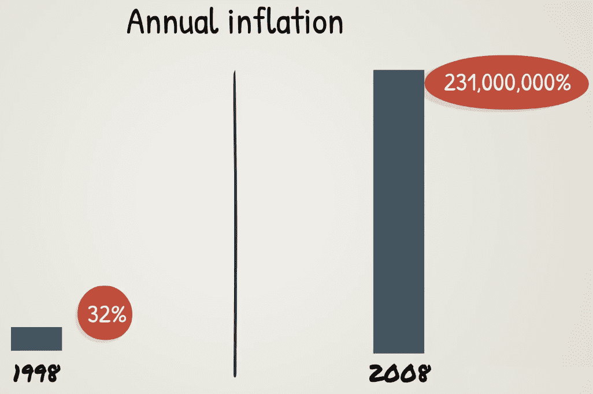
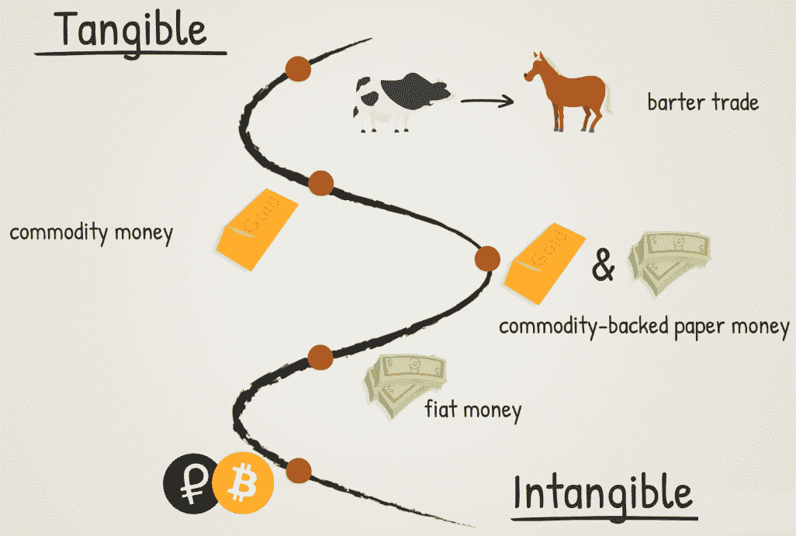

# 金钱的简史

现在您已经对区块链技术所体现的庞大知识体系有所了解，是时候退后一步，回归基础知识了。在本章中，我们将探讨金钱的历史。如果您能理解金融行业如何达到当前状态，那么您将更好地理解为什么区块链技术是货币演变的自然下一步。

本章将涵盖以下主题：

+   金钱简介

+   金钱 - 价值的抽象

+   法定货币简介

+   当法定货币系统失败时会发生什么

+   区块链是如何出现的

# 金钱简介

对金钱的简要讨论将有助于巩固您对当今世界金融和技术结合的理解。

基本上，我们应该问自己这个问题：什么是金钱？让我们想一秒钟；我们会发现，定义它并不像看起来那么容易。

教科书上的定义将声称金钱有三个主要功能，如下所示：

+   交换媒介

+   计价单位

+   价值储存

如果您对这些定义仍然感到困惑，我们将在接下来的章节中详细讨论它们的含义。

# 金钱作为交换媒介

让我们来看一个简单的以物易物的例子。假设你用你农场的一匹马换了一头牛。多划算啊，对吧？现在，一周后，你出去吃晚餐，吃完饭，服务员过来给你账单，你准备用之前得到的那头牛的一部分来支付她！我们可以想象这样的情况不会有好结果！

这就是我们需要金钱的地方！金钱是您的交换媒介。通常情况下，你不能直接用一种商品或服务交换另一种商品或服务。金钱是一种中间商品，被普遍接受，并且对所有参与方具有标准价值。这就是为什么它比以物易物更有效地促进价值交换的原因。

# 金钱作为计价单位

那么，我们需要金钱做什么？实际上，还有更多。我们还将金钱用作计价单位，意味着我们用它来比较商品或服务的价值与其他商品或服务的价值，并记录这些价值。

例如，当我们比较车辆时，我们总是试图找到物有所值的那一款。我们通过比较它们的价值来决定哪一款更适合我们。

# 金钱作为价值储存

金钱还需要是一种价值储存，意味着它随着时间的推移保持其价值或购买力。这消除了任何容易腐烂或腐蚀的商品或物品。例如，贵金属，如黄金，银和铂金，是很好的价值储存，因为它们的保质期基本上是永久的，而像牛奶，小麦或铁之类的东西，则不是很好的价值储存。

货币的另一个可取之处是**稀缺性**，顾名思义，这意味着它需要有有限的供应。正如人们所说，钱不会从树上长出来。如果可以的话，那它就不是钱了。

举几个例子，考虑以下内容：

+   石头不适合作为很好的货币形式，因为它们在自然界到处都是

+   对于生活在热带岛屿上的人群而言，贝壳也不适合作为货币形式，因为在海滩上很容易找到它们

+   黄金，另一方面，是一种稀有金属，在自然界中难以找到，并且被普遍赞赏其美学特性和工业用途。

黄金也是耐用的。金币如果掉下来不会碎裂，如果坐在上面也不会弯曲。然而，借助正确的技能和工具，它是可分割的，可以变成其他物品，并且在必要时可以共享。

**可替代性**是货币的另一个关键特征，意味着相同面额的所有货币单位是可以互换的。想想一张百元纸币，可以完全用另一张百元纸币替代。

最后，货币需要便于携带和移动，以促进贸易；这是纸币比金币和金条的唯一优势。在电子货币的情况下，这一点更加真实，因为每个人都可以接触到互联网！

# 货币–价值的抽象

现在，让我们考虑货币作为价值的抽象概念。

货币与人类文明一样古老，并且文明本身依赖于拥有可以交换、计算和转移价值的方式。最初开始于易货贸易（用商品交换商品），随后使用标准化的代币货币来替代。

黄金和白银是最早被普遍接受作为货币的自然选择。实际上，它们非常适合，以至于它们是数百年来全球主要的货币形式，并且已经融入了人类文化。说到黄金，首先想到的是价值或财富。

其后出现了纸币，这是一种比贵重金属更方便携带和移动的价值方式。中国是第一个采用纸币的国家，在七世纪。然而，西方世界直到马可·波罗在十三世纪将其介绍给欧洲后才跟上这种货币创新。即便如此，第一批欧洲纸币直到十七世纪才发行。在当时，人们花了数个世纪的时间来接受当时的新范式，并从金银硬币转变为以同样的贵重金属作为支持的纸币作为广泛使用的货币形式。

# 黄金标准

这导致了金本位制的诞生。当时，纸币本身不具有任何内在价值，例如金银币所具有的价值。相反，纸币由存放在某个宝库中的贵金属（如金和银）支持，例如诺克斯堡。纸币代表了从银行收集这些贵金属的权利。这比用手推车装满金条去邮局支付抵押贷款更方便！

这种情况一直持续到 1944 年。在第二次世界大战结束时，根据布雷顿森林协议引入了另一个相关的系统，即黄金兑换标准。这意味着许多国家将其国家货币的汇率固定为美元，而美元可以按固定汇率兑换为黄金。这个系统可以通过以下图示更好地说明：

不仅如此，而且这种可兑换性不再对个人或公司开放，而只对中央银行开放。然而，布雷顿森林体系于 1971 年结束，当时美元与黄金的兑换关系终止。从那时起，纸币不再由黄金（或其他有形财产）支持，而只是依靠信仰！

# 关于法定货币的介绍

欢迎来到法定货币的世界！如果纸张没有任何支撑，它怎么能持有任何价值呢？嗯，这就是像法定货币这样的概念发挥作用的地方。

我们今天仍在使用的法定货币系统是由政府确定货币价值，并宣布其为**法定货币**。这意味着政府决定一种支付媒介是否在国家或地区内用于金融交易、贸易结算或商业活动。

法定货币概念只是货币价值感知的另一种表现形式。这里的关键区别在于，商品货币有一个可以将货币供应量挂钩的有形资源。而法定货币，货币（或流通中的货币数量）更多地受到央行政策的支配。因此，人为错误（无意或有意的管理不善）的边际更大。

法定货币系统的支持者认为，它使得更多的货币政策工具可以用来刺激或控制经济周期，通过调整货币供应量和利率。这些工具在过去曾被用于不同程度的成功。

一些法定货币，如美元和欧元，被国际认可，并用于全球贸易，因为它们得到了一些世界上最可靠的政府和最大经济体的支持。

其他法定货币因人们失去了信任而遭受了恶性通货膨胀并贬值。一个著名的例子是**津巴布韦元**（**ZWD**），它发行了 100 万亿面额的纸币，我们将在接下来的部分中了解这个例子。然而，德国（魏玛共和国，1922-1923 年）和中国（1943-1945 年）等大型和领先的经济体也经历过恶性通货膨胀，这主要是由于没有足够的实际经济资源作为支撑而过度印刷法定货币。

# 当法定货币体系崩溃时会发生什么事？

法定货币之所以有价值，是因为政府使用其权力来强制执行价值，或者因为交易双方同意其价值。在这种情况下，很容易看出问题可能会出现。我们来看看当法定货币体系在不负责任或腐败的政府控制下，容易出现经济和政治管理不善的例子。

在 1980 年津巴布韦从英国殖民统治中独立时，津巴布韦元的价值约为 1.25 美元。很快，通货膨胀开始逐渐上升，并在 1998 年总统罗伯特·穆加贝开始从白人农场社区没收土地后彻底失控，导致几乎完全崩溃的粮食生产和外国投资的下降。

为了帮助支付政府的开支，津巴布韦储备银行开始印制越来越多面值更高的纸币。结果，年通货膨胀率从 1998 年的 32%上升到 2008 年 7 月的 231,000,000%，当时官方统计数据停止发布。在此之后，国际经济学家估计，恶性通货膨胀在 2008 年 11 月中旬达到了惊人的年率 89.7 六十亿分之一（89,700,000,000,000,000,000,000%）。最高月率为 79.6 十亿分之一，这相当于 98%的日率；换句话说，价格几乎每天翻倍。

2009 年 2 月，津巴布韦元在过去三年内第三次进行了重新定值，按 1 万亿旧津巴布韦元兑 1 个新津巴布韦元的比率进行重组。这只发生在发行 100 万亿纸币后的三周。

2009 年 4 月，津巴布韦彻底放弃了津巴布韦元（ZWD），转而仅使用外币。

津巴布韦曾是非洲最富裕的国家之一，但由于政府的政策，经济陷入了混乱。这是一个极端的例子，说明了对法定货币的信任如何可能被丧失，导致经济动荡。在津巴布韦，集体幻觉迅速转变为集体不信任。

但这并不是货币危机的孤立例子。世界上有许多国家，当地货币几乎没有价值，人们更愿意将自己的储蓄存放在所谓的硬外币中，或者其他替代品，如黄金，以及最近的比特币。

目前，委内瑞拉正在经历自己的通货膨胀时期。2018 年 1 月，通胀率为 84%，这意味着年化通胀率为 150,000%，也就是说，价格每 35 天翻一番。这是一个估计值，因为当地政府已经停止报告官方数据。一些关于当前年度通货膨胀率的估计甚至更高，达到约 450,000%！

现在，委内瑞拉政府提出了一个稳定货币的创新解决方案——石油币（Petro），这是一个由政府发行的加密货币，运行在区块链上，并由该国的石油储备支持。石油币旨在成为委内瑞拉的法定货币，这将使其成为世界上第一个发行主权加密货币的国家。目前尚不清楚这个实验将会取得多大成功。这种由中央发行的加密货币与比特币及其数字衍生品的去中心化性质相去甚远。然而，值得注意的是，通过其行动，委内瑞拉认识到并重新确认了区块链所具有的巨大优势和潜力。

# 区块链如何融入其中

现在，是时候问问自己这个问题了——区块链是货币演变的下一个逻辑步骤吗？

"货币有三个时代——商品本位、政治本位，现在是数学本位。"

- 克里斯·迪克森

上述引用显示了货币概念多年来的演变。

在所有这些阶段中，我们都有一个关于价值的概念，但它随着我们的文明和技术的发展而演变，从你可以触摸并实际使用的东西；到你可以触摸但不能使用的东西（除了交易）；再到只是一个抽象的概念。正如你所看到的，形式已经改变，但价值观念始终保持不变，我们用货币的形式来代表和传达这个价值观念。

这种价值的抽象将我们带到了下一个演进步骤：由区块链技术支持的数字加密货币。与法定货币系统类似，这种货币形式之所以有价值是因为人们相信它。但其中还有更多的东西不仅仅是政府的承诺。人们做出的承诺在历史上已经多次被打破。在这里，我们有扎实的科学、数学和计算机硬件，保证区块链按预期运行。下面的图表更好地说明了多年来货币的演变：

在这个新系统中，我们有一个数学算法控制货币供应并对其进行严格限制和成本控制，类似于金本位制。这个系统完美吗？不完美；正如我们最近看到的，随着无数比特币分叉的出现，一个开源软件控制着货币供应，在一个庞大而复杂的去中心化生态系统中，已经引发了一些复杂的治理问题。如果每一次分歧都导致创建一个新版本的货币，这可能会导致很多混乱。

因此，即使最初被称为加密货币，比特币及其数字兄弟目前并不真的是货币。相反，它们是数字商品或资产；这就是为什么加密资产更适合成为它们的一个更合适的术语。货币需要稳定，才能很好地发挥其功能。我们仍然生活在一个法定货币的世界中，所有交易都以法定货币计价。即使有用比特币等支付的方式，它们仍然被转换成法定货币在销售点。而且它们的汇率每天都会出现巨大的波动。这就是为什么许多电子支付公司开始发行稳定币：将数字货币挂钩到法定货币，但使用区块链作为底层支付处理基础设施，而不是传统的基础设施。在你更熟悉区块链的工作原理之后，我们将会更详细地介绍这样的解决方案。

# 总结

在这一章中，你看到了货币观念是如何在历史中演变的，从更具体形式到更抽象的概念，每个阶段都有其利弊。从物物交换，我们发展到了商品货币，再到了有商品担保的纸币，最终使用的是我们现在使用的法定货币。这是一个历史之旅，从真实的商品和货物到电脑屏幕上的数字，代表着价值和货币！

在接下来的章节中，我们将看一看支持比特币的技术是如何出现的，以及它们是如何一起发挥作用的。这种技术的混合使得价值、信息传输和记录以一种去中心化的方式进行，而无需任何中央机构或中间人的参与。
