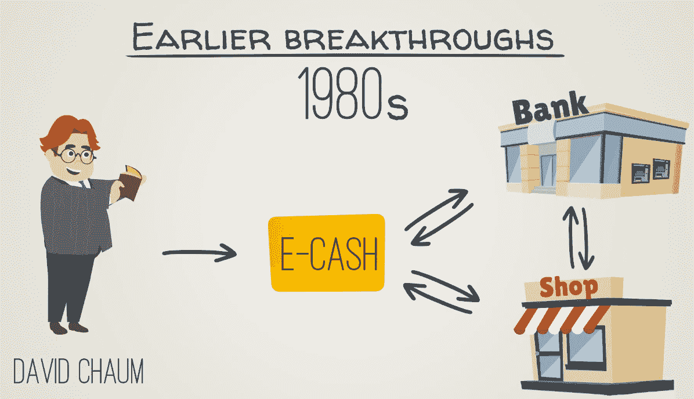
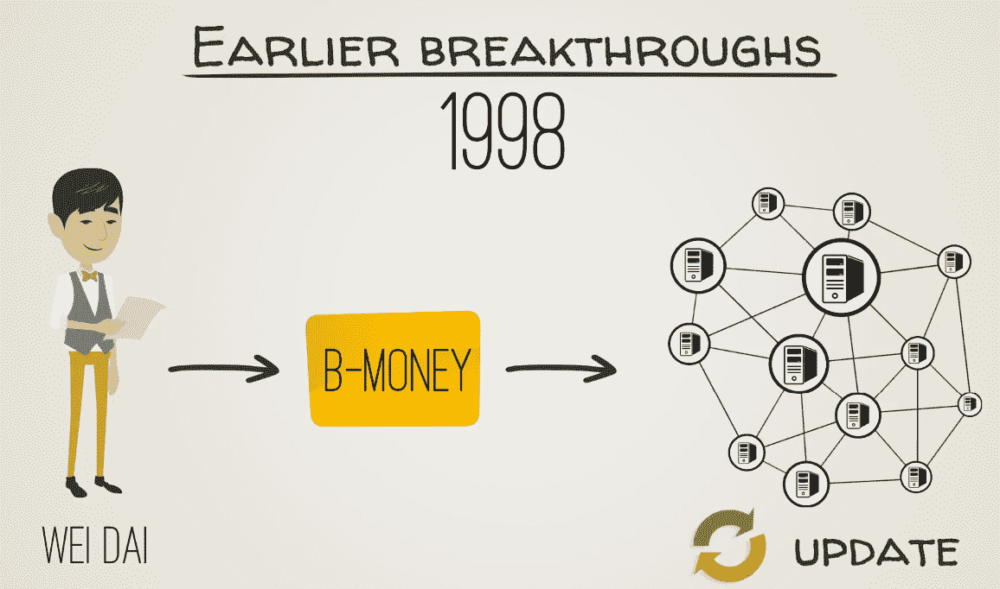
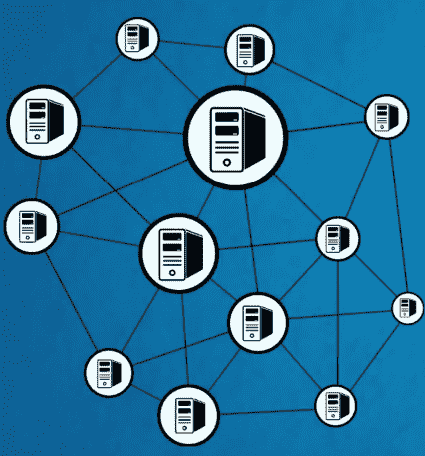
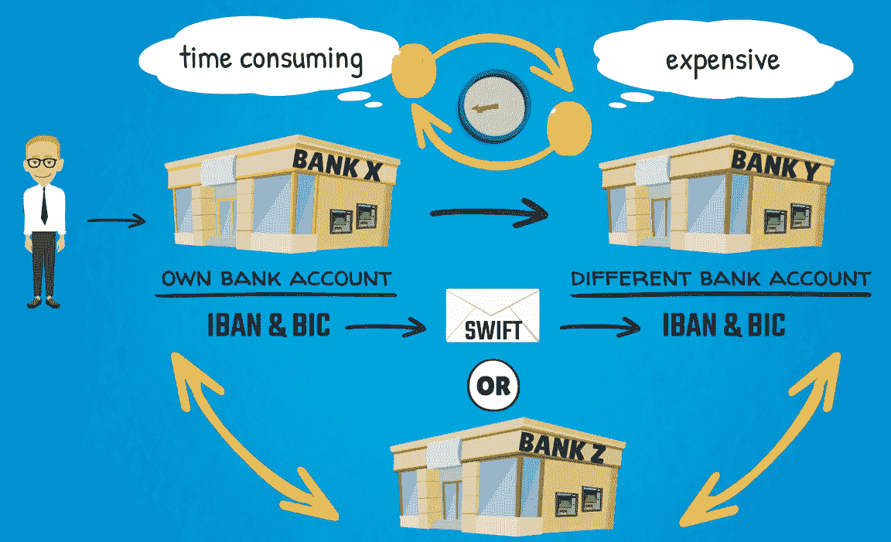
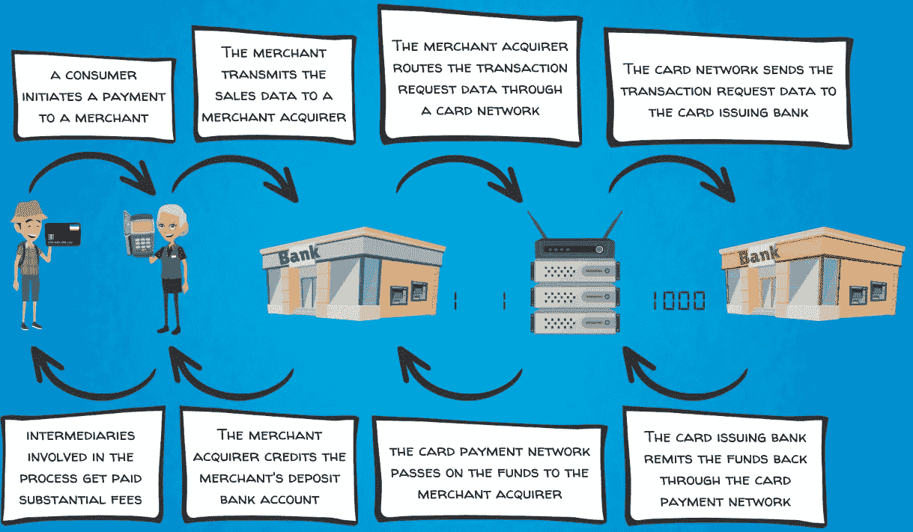

# 比特币的诞生和去中心化支付系统的优势

在前两章中，您了解了现代货币是什么，即价值的抽象。我们还指出，货币概念随着时间的推移变得越来越抽象，直至数字货币的创建。

在本章中，我们将探讨区块链技术背后的原理，以及它如何让我们创建和使用数字货币。

本章将涵盖以下主题：

+   比特币的起源

+   导致比特币出现的项目

+   比特币简介

+   传统支付系统的运作方式

# 比特币的起源

我们的核心目标是理解区块链的功能以及比特币为何如此受欢迎。然而，为了做到这一点，我们需要快速回顾一些近期历史上发生的宏观经济事件。比特币在全球经济和金融危机期间的推出是货币史上最重要的事件之一。

区块链技术通常被称为**货币**或**价值**的互联网。让我们首先概述导致比特币出现的事件链，这是全球公认的区块链技术的第一个应用。

比特币白皮书于 2008 年 10 月发布，当年全球经济和金融危机席卷全球。不管是巧合还是不是，比特币似乎是完美设计的，以解决许多法定货币的缺陷。

鲜为人知的事实是比特币区块链的创世区块，其中记录了其第一笔交易，包含了其创造者中本聪的隐藏信息。文本引用了英国报纸《泰晤士报》的标题，显示了比特币区块链启动的日期的证明，并说明了以下内容——《泰晤士报》，*2009 年 1 月 3 日*，*大臣即将救助银行免于二次破产*。

除了证明创世区块的日期外，这条信息似乎巧妙地表达了当时全球金融体系的悲惨状态。它还暗示了所提出的解决方案对于改善货币体系的重要性。作为嵌入在创世区块中，并且鉴于比特币区块链的不可变性和强大性质，该信息成为了对未来世代的永恒提醒。

# 经济危机的开始

自从 1971 年布雷顿森林协议解体和现代法定货币系统引入以来，世界进入了一个主要以自由波动的外汇汇率为特征的新时代。各国央行开始实施各种货币政策来管理各自经济中的货币供应。尽管世界各地的货币政策目标可能有各种微妙之处，但一个共同且广泛接受的主题是通胀目标。这样做是为了提供健康、稳定、低通胀率的环境，促进持续的经济增长。通过追求低通胀率，世界各国的央行旨在创造稳定的经济条件，为消费者和企业的经济活动提供正确的激励，使价格波动不会大幅上下波动。

这一策略在多年来以及不同国家之间取得了不同程度的成功。

同一时期，全球信贷增长和债务积累达到了前所未有的程度，导致了次贷危机、全球信贷紧缩以及全球经济衰退。当银行开始破产，对新经济企业的投资减少时，世界各国的政府和央行意识到他们需要采取一些措施刺激经济；因此，量化宽松的轮次开始了。

这导致了大量新的法定货币进入经济，并且接近于零（在某些情况下甚至为负）的利率，这是标准经济理论和实践中闻所未闻的另一种经济现象。

印刷如此大量的货币背后的想法是刺激经济并拯救金融系统免于崩溃。然而，像这样的政策也会产生一些副作用。全球股票和房地产等实物和金融资产的价格显著上涨，从而削弱了法定货币作为价值储存的方面。

# 比特币的诞生

自全球经济衰退以来，社会不平等也显著增加。这再次归因于大量流动性或新货币供应进入全球金融系统并流入资产类别，如房地产、股票市场和风险投资。当然，这推高了它们的价格。由于这些资产类别通常主要是富裕投资者使用精明资产管理人的服务所能接触到的，因此净效果是财富差距的增加。另一方面，大多数没有或几乎没有可投资资产的人，他们的收入大多基于劳动工资，几乎没有经历相同的财富效应。这可能对近年来的全球政治格局产生了影响，但由于政治经济学不在我们的范围内，我们不会涉及它。

长话短说，在全球经济和金融格局中出现前所未有的关键事件之际，比特币诞生了。

# 导致比特币诞生的项目

与我们刚刚描述的经济事件并行的是，技术社区也在经历自己的演变。许多杰出的技术头脑一直在努力解决问题，以实现安全的数字货币支付。

实际上，比特币白皮书引用了一些著名的科学出版物，例如 1957 年由 John Wiley and Sons，Inc.出版的 William Feller 的《概率论及其应用简介》；1998 年由魏戴发表的*BMoney*论文；以及 2002 年由亚当·巴克撰写的*哈希现金 - 一种防止服务拒绝的措施*论文。

在我们深入研究比特币区块链之前，我们应该告诉你，数字货币的概念并不是完全新的，肯定不是随着比特币而发明的。比特币的创始人中本聪考虑并利用了在多个学科中进行的现有科学研究，他还添加了一些创新的解决方案，并以一种出色的方式将所有东西结合起来运作。

以下是一些在比特币之前的显著科学突破的摘要，其中一些是比特币所依赖的：

+   在 20 世纪 80 年代初，杰出的数学家大卫·乔姆（David Chaum）发表了几篇关于密码学及其在电子支付系统中的应用的研究论文。然后，几年后，他创立了 DigiCash Inc.，开发了 eCash 软件，该软件使用户可以以数字格式存储由银行加密签名的货币。用户还可以在接受 eCash 的任何商店花费这种数字货币。与供应商开户或提供信用卡号无关。这可以用以下图表更好地说明：

+   1998 年，计算机工程师魏戴（Wei Dai）发表了一篇论文，提出了他所谓的 B-Money，这是一个基于点对点网络的匿名、分布式电子现金系统，其中节点（参与网络的计算机）共同维护和更新交易账本。魏戴的工作的重要性在于，中本聪在他最初的比特币白皮书中引用了 B-Money。这可以从以下图表中看出：

+   1997 年，亚当·巴克介绍了他的 Hashcash 概念。这被设计成一个防止电子邮件垃圾邮件的系统。这个想法是，为了发送电子邮件，用户的计算机首先需要进行一些计算。由于进行这样的计算需要时间、能量和处理能力，因此这为发送电子邮件增加了成本基础。对于合法的电子邮件用户来说，这样的成本预计不会是禁锢的，因为他们发送的电子邮件数量是相对较低的，而它应该会阻止垃圾邮件发送者每天发送数千封电子邮件。为此，使用了哈希函数，它们是一种特殊类型的数学函数。计算机需要多次计算哈希函数，以找到计算难题所需的解决方案。

+   一个与 Hashcash 类似的概念甚至更早在 1992 年由辛西娅·德沃克和莫尼·纳奥尔在题为《通过处理定价或对抗垃圾邮件》的论文中引入。他们的主要想法是要求用户计算一个适度困难的函数，以获得对共享资源的访问，从而防止滥用。

+   一个密切相关的主题，**工作量证明**一词最早由计算机科学家马库斯·雅各布森和阿里·尤尔斯于 1999 年引入。他们将其定义为在指定时间段内完成了一定量的计算工作的证明。

与之类似的想法被实现在比特币的工作量证明算法中，正如中本聪在白皮书中所描述的：

"网络通过将交易时间戳散列成基于哈希的工作量证明（Proof-of-Work）链，形成一个不可更改的记录。"

所以，基本上，工作量证明是计算机已经完成了一定量的计算工作的证明。这样的工作是可以识别成本的。因此，工作量证明是外部资源已经投入到完成一定工作的证明，因此，所做的工作有价值的证明。

+   同时期，另一位杰出的计算机科学家尼克·萨博提出了 BitGold 的概念，尽管从未在实践中实现，但被称为比特币架构的直接前身。尼克·萨博描述了他的想法如下：

“我开始思考解决难题和挖掘黄金的难度之间的类比。如果一个难题需要时间和精力来解决，那么它可以被认为具有价值。然后可以将解决方案作为数字硬币交给某人。”

在一个 BitGold 网络中，已解决的加密谜题将被发送给社区，如果被接受，工作将归功于完成它的人。然后，这将转化为新生成的数字硬币。只有在之前的谜题找到解决方案并被社区接受后，才会发布新的谜题。在解决这种任务的过程中，提出解决方案的社区成员将拥有越来越多的新数字资产。系统的这一方面为网络验证和时间戳新硬币提供了一种方法。除非大多数当事方同意接受新的解决方案，否则他们不能开始下一个谜题。尼克·萨博（Nick Szabo）对数字价值创造提出了很好的观点，鉴于在该过程中所需的计算工作是无法伪造的。除非网络参与者提出解决方案，否则不会发行额外的硬币。因此，这种数字货币供应是稀缺的，难以生产，并且可以安全地存储和转移。这与比特币挖掘非常接近。

+   早期加密货币社区中的另一位显赫人物是哈尔·芬尼（Hal Finney）。他是一位计算机科学家，后来与中本聪一起参与了首次比特币交易。哈尔·芬尼对数字货币系统的不断研究做出了宝贵的贡献，引入了**可重复使用的工作证明**，并在之前引入的工作证明概念上进行了构建。可重复使用的工作证明的目的是作为代币货币。正如金币的价值是由制造它所需的原始金的价值支持一样，可重复使用的工作证明令牌的价值是由生成它所需的工作的价值保证的。而且，正如我们已经知道的那样，工作的价值是由真实世界的计算机资源和电力支撑的。他引用了尼克·萨博（Nick Szabo）关于数字商品的观点，即这些商品的成本是可以证明的。

之前提到的所有科学里程碑，以及其他一些，都极大地推动了数字货币的发展和比特币的诞生。之前的大多数项目都具有比特币的一个或多个特征，但它们都没有一个完整有效的解决方案来解决比特币最终解决的问题。它们大多依赖于集中式支付结算系统，与传统金融系统运作方式并无多大差别。

现在，在有了这些背景知识的基础上，让我们直接深入了解比特币的运作方式。

# 比特币简介

那么，什么是比特币呢？也许最好从其创造者中本聪的话开始，我们可以在原始白皮书中找到，*比特币：一个点对点的电子现金系统*。它陈述了以下内容：

"一种纯粹的点对点版本的电子货币将允许在线支付直接从一方发送到另一方，而无需通过金融机构。数字签名提供了部分解决方案，但如果仍然需要信任的第三方来防止双重支付，那么主要好处就会丧失。我们提出使用点对点网络解决双重支付问题的解决方案。该网络通过将交易的时间戳哈希为一连串基于哈希的工作证明，形成一个记录，而不需要重新执行工作证明就无法更改。"

要理解 Satoshi 这些话的意思，我们需要更详细地解释一些重要概念。

首先，比特币的创造者非常强调网络的点对点性质。这意味着比特币是一个去中心化的网络。没有任何负责管理系统的中央方。这是一个真正民主的平台，开放给每个人参与和贡献。比特币的网络可以在以下图表中看到：

正如 Satoshi Nakamoto 所建议的，主要想法是建立一个没有中间人的系统，仅通过网络上的同行参与防止双重支付。

直到比特币出现之前，人们无法在互联网上直接进行交易，而无需涉及信任的中央方。这是因为电子传输的货币并非与其他类型的信息或数字物品相同。你可以拍一张照片并与所有朋友分享在 Facebook 上，但如果你有一美元想分享它，你不能将同样的一美元发送给每一个朋友。

当用户试图同时花费同一单位的数字货币时，双重支付可能会发生，从而通过复制将一个人所拥有的钱币翻倍。这相当于在现实世界中伪造货币。

如果存在双重支付，系统将无法成为有效的价值存储器，并且将缺乏货币的基本前提之一，即稀缺性。

想象一下，你正在网上购物，想使用数字货币支付。假设你的钱包里有一些硬币。你喜欢亚马逊上的一部全新电影，以及 Audible 上的一本有声读物。你两样都想要，但你手头的数字货币只够买其中一样。如果你能用同样的数字货币购买这两个商品呢？

在亚马逊或 Audible 的人知道你花了同样的硬币两次之前，你将能够在几秒钟内在两个网站上点击“购买”按钮，并下载产品。

# 双重支付及比特币如何解决它

双重支付是数字货币独有的问题，因为数字信息相对容易复制。而实体货币没有这个问题，因为它们不容易被复制。你可能已经了解到，在你的钱包里的纸币受到了哪些保护，使得任何人都不能简单地复制它们。

比特币是第一个以去中心化方式解决双重支付问题的数字货币系统，而且解决方案确实是优雅而巧妙的。比特币网络上的所有交易都记录在一个共享的公共交易日志上，也称为区块链数据库。在比特币区块链上，网络会为所有者首次花费特定币的交易打上时间戳，并拒绝同一所有者后续尝试花费相同币的任何尝试，从而消除双重支付。该网络智能化，其区块记录着当前谁拥有某个币以及谁已经花费了它。

此时，你可能会想：好吧，但这似乎并不是如此令人难以置信的创新。毕竟，他们只是按照出现的顺序记录所有交易，就像任何银行或类似的金融中介机构所做的那样。

好吧，是的，但这个解决方案的独特之处在于，交易的验证和记录是通过整个网络以去中心化的方式完成的，而不是由单一的、可信任的中央机构完成的。

Satoshi 的目标是消除可能成为潜在故障中心的第三方。因此，任何此类验证必须由对等方自行执行，而不是由任何中间人执行。

在接下来的部分中，我们将更详细地讨论比特币的去中心化模型与现有的传统金融基础设施有何不同。

# 传统支付系统的工作原理

正如预期的那样，我们在这里的目标是讨论区块链网络中的参与者如何确保双重记账原则得到妥善处理。我们还将展示这个解决方案与传统金融系统中其他现有解决方案的不同之处。

在比特币区块链中，支付是通过所谓的共识机制结算的，这种机制基于根植于博弈论的经济激励。感到困惑了吗？我们将在接下来的段落中用更简单的术语解释它。

共识过程调整了所有网络参与者的利益，以便他们最好的行动是支持所有交易的真实验证和记录。稍后我们将更详细地介绍共识机制。现在，这是 Satoshi 本人关于这个问题想要分享的：

"当然，问题在于收款人无法验证其中一位所有者没有双重支出硬币。一个常见的解决方案是引入一个信任的中央机构或铸币厂，检查每笔交易是否存在双重支出。在每笔交易之后，硬币必须退还给铸币厂以发行新的硬币，只有直接由铸币厂发行的硬币才被信任不会被双重支出。这种解决方案的问题在于整个货币系统的命运取决于运行铸币厂的公司，每笔交易都必须通过他们进行，就像银行一样。

我们需要一种方式让收款人知道之前的所有者没有签署任何早期交易。对于我们的目的来说，最早的交易是计数的，所以我们不关心后来的双重支出尝试。确认没有交易的唯一方法是了解所有交易。在基于铸币的模型中，造币厂了解所有交易并决定哪一个先到达。为了在没有信任方的情况下完成这一点，交易必须公开宣布，并且我们需要一个参与者就接收到的交易顺序达成一致的系统。收款人需要证明，在每笔交易时，大多数节点都同意这是第一次收到的。

因此，问题的根源是通过一致性过程来确保网络中的所有参与者在任何给定时间都处于同一页面。这个过程必须非常强大，以至于所有参与者都信任它处理自己的资金。简单的解决方案是引入一个信任的中央机构来运行交易账本，就像一个银行一样。历史已经多次显示，这样的中央方，或中间人，本身可能构成风险，并且经常被破坏。

因此，**中本聪**选择了更困难的解决方案：在全球支付系统中确保和维护去中心化共识。事实上，这个问题非常复杂，以至于以前没有人解决过。

让我们通过几个现有支付系统的不同工作方式举几个例子。

# 银行的电子转账

几个世纪以来，银行一直是传统的支付中介。他们为客户维护账户，处理支付，并提供其他金融服务。他们还管理相关的金融基础设施。目前，电子银行转账的方式如下：

1.  账户持有人从他或她的银行账户向另一个银行账户发出银行转账指令。

1.  汇款银行使用 IBAN 和 BIC 代码将付款指示到其目的地。**IBAN** 代表**国际银行账号**。它是一种国际系统，用于识别银行账户以促进跨境交易。**BIC** 代表**商业识别码**，也用于支付标识。

1.  发送银行通过一种安全通信网络称为**SWIFT**向接收银行发送消息。这代表**全球银行间金融电信协会**。消息包含对接收银行的指示，以将款项支付到目标账户。

1.  参与的银行必须彼此持有相互账户，或者支付必须通过另一家持有双方银行账户的对应银行进行路由，这是另一个持有与交易双方相反的银行账户的中介。

1.  实际转账不是即时的；资金可能需要数小时，甚至数天才能从发送方账户转移到接收方账户。

1.  所有参与转账的银行都会从发送方和接收方获取服务费。

整个过程可以用下图来概括：

# 信用卡和借记卡交易

信用卡和借记卡交易涉及更长的中间商列表。除了付款人和收款人的银行（他们持有账户的地方）之外，每一方还有一堆其他支付处理器，以及中间的 Visa 或 Mastercard 网络。Visa 和 Mastercard 在这个价值链中拥有巨大的市场力量，这在它们的利润率中很容易看出来。每个人都可以在它们的财务报表中查看，因为它们是上市公司。

基本的信用卡或借记卡交易包括以下步骤：

1.  消费者在销售点（**POS**）向商家或零售商发起支付。这是通过 POS 终端（如果在店内）或通过网站（如果在线）完成的。

1.  商家随后将销售数据传输给商家收单机构。商家收单机构可以是商家持有账户的银行，也可以是另一个支付处理器。许多参与卡方案的银行将此部分外包给外部提供商，这基本上是一项后勤功能。

1.  商家收单机构通过像 Visa 或 Mastercard 这样的卡网络路由交易请求数据。

1.  卡网络将交易请求数据发送给卡发卡银行。

1.  卡发卡银行通过卡支付网络将资金汇款回来。

1.  卡支付网络将资金传递给商家收单机构。

1.  最后，商家收单机构向商家的存款银行账户记入资金。

1.  毫无疑问，该过程中涉及的所有中介都会因通过系统传递资金而获得可观的费用。

该系统可以用以下图来概括：

如果双方银行决定将更多的后勤交易处理外包给第三方中介，该过程可能涉及更多步骤。整个周期理论上可以在 12 小时内完成，但通常需要 3 到 4 天，这取决于各个中介之间的个别合同协议。

# PayPal 中的交易

PayPal 作为另一个电子支付中介。它是一家全球性的互联网公司。它的服务主要针对电子商务，连接客户和商家。所有使用 PayPal 并在其持有账户的各方都可以通过该系统彼此发送付款。PayPal 还与传统银行和信用卡支付基础设施集成。

PayPal 不受银行监管，因为它不像银行那样运营一个类似于分数准备系统的体系。这与接受存款、利用这些存款发放贷款以及只保留存款一部分的活动有关。这显然给存款持有者带来信用风险。由于 PayPal 不这样做，它按照货币传输者的更轻的规定来操作。这个模型相当集中化，类似于银行模式，并且受到与之相关的所有风险的影响。

# 中心化和去中心化支付系统的区别

总之，设计一个中心化的支付架构比设计一个去中心化的支付架构要容易得多。然而，中心化模式会因为存在明确且具有吸引力的攻击目标而面临来自黑客的安全威胁。中心化系统还为客户提供了更昂贵和低效的解决方案，因为它往往会产生垄断或卡特尔。这将市场权力集中在少数中介手中，他们可以通过交易费用以不成比例的大价值提取。传统金融基础设施导致的客户结果是昂贵、交易缓慢。这个领域很长时间没有出现过任何重大创新，正处于被颠覆的时机。

相反，像比特币这样的去中心化支付网络实现了在交易处理中的去中心化共识的更难解决方案。这种设计使它能够为所有参与方提供更高效的解决方案。支付直接从一方到另一方进行，安全性和处理由整个网络保证。资金在几分钟内发送和接收。所有网络参与者都始终保持着交易账本当前状态的共识。

# 总结

听起来不错，是吧？正如你在本章中看到的，直接的点对点互动始终是所有参与方的优越解决方案。没有卡在中间的寻租中介来从交易对手那里提取价值。现在，我们拥有技术来在支付以及涉及价值转移或记录保留的任何其他类型的交易中做到这一点！

你了解了比特币的起源和功能。我们还将其与传统银行系统进行了比较。

如果这个解决方案对你来说很有吸引力，那么让我们继续深入了解比特币是如何运作的吧！
