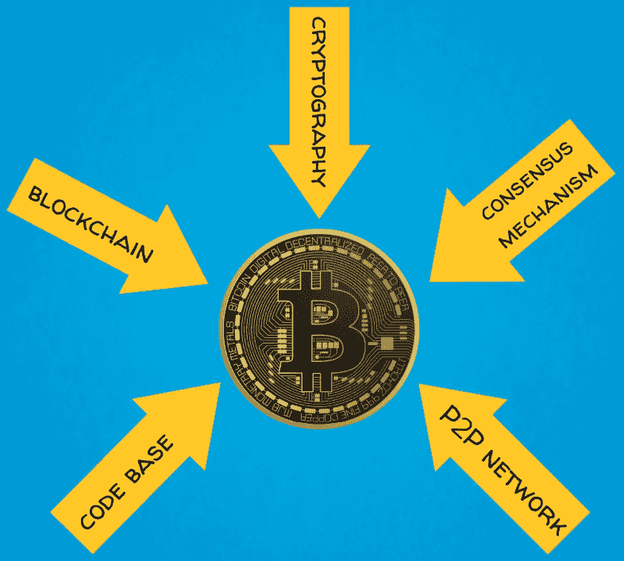
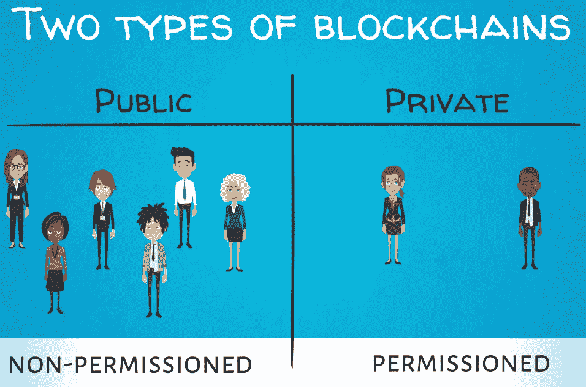
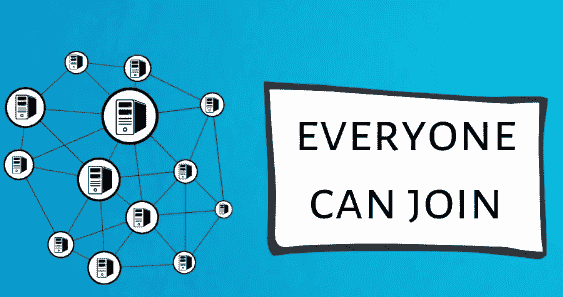
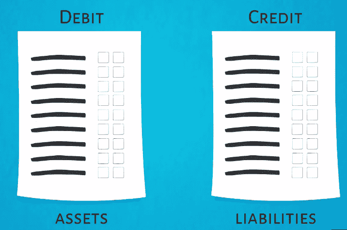

# 第四章：比特币的五大力量 - #1 区块链

在之前的章节中，我们了解了货币的历史，比特币的崛起，以及围绕比特币的原因和方式。在本章中，我们将开始深入审视比特币。本章将涵盖以下主题：

+   比特币五力介绍

+   第一力量 - 区块链

+   不同类型的区块链

# 比特币的五力介绍

现在我们知道了什么是双重支付，以及比特币是如何解决这个问题的，我们已经准备好继续向前，为比特币的架构和生态系统提供整体视图。

比特币的主要支柱是以下基本技术和概念：

+   区块链或**分布式账本技术**（**DLT**）

+   密码学

+   根植于博弈论的共识机制，在这种情况下是工作证明

+   点对点网络

+   软件代码基础

我们将这个框架称为比特币的五大力量。

这个框架可以在下图中看到：

在接下来的五章中，我们将深入讨论这些领域的具体内容，并解释它们如何结合起来使比特币的机制运作。请继续关注，因为事情变得非常有趣！

# 第一力量 - 区块链

终于，我们到达了可以直接回答这个问题的地步，这个问题每个人都一直在问，也是本书的核心 – 什么是区块链？

区块链是一个分布式数据库，分布在计算机网络上，该网络中的每台计算机存储着相同的数据库文件系统的副本。在财务交易的背景下，这也被称为 DLT，因为账本是一本会计账簿或一套财务记录的集合。

在金融领域，我们使用账本来记录与特定实体相关的所有会计。一家公司的银行账户会有一个包含许多许多交易的账本。每次钱进来或出去，账本都会需要注册一个新的条目。同样，区块链分布式账本保留着与一系列交易相关的相同信息，跨多台计算机，形成一个点对点网络。

# 为什么区块链更好

数百或数千台电脑存储相同文件的想法起初听起来有点奇怪，不是吗？如果你的第一个想法是冗余，那一点也不奇怪。但这种冗余提供了安全性，并确保整个系统中没有中心化的失败点。它可以防范坏人试图操纵系统。

这反过来为消除任何中心化提供了机会，或者换句话说，剔除中间人。这样的分散式区块链通过共识机制或算法工作。有不同类型的共识算法，我们将在本书的后面涵盖主要的几种。

目前，重要的是要理解这些共识算法使不同的节点（基本上是网络中的参与者）能够验证新交易并维护账本的最新状态的统一视图。

# 区块链的工作原理

在验证新交易后，这些交易被排序并分组到块中，然后链接到先前的块上。每个新块按照时间顺序建立在上一个块之上。

每个区块都是一种包含信息、更确切地说是交易记录的数据结构。通常，分布式数据库可以包含任何类型的数据，而不仅仅是金融或经济数据，但是区块链的安全性和设计使其特别适用于价值交换。因此，有人称区块链为价值互联网或金钱互联网的说法。

一旦交易进入区块链，通常是不可逆转的，其记录是永久的和不可篡改的。

新的区块会按照时间间隔定期创建并带有时间戳。每个新块都链接到先前块的链，因此有了**区块链**这个术语。

我们应该注意，中本聪在原始白皮书中从未提到过区块链。他主要将这项技术称为工作量证明链。他最接近说“区块链”的地方是用诸如链中的下一个块或块链等短语。术语“区块链”是由早期的比特币公司，比如[blockchain.info](https://blockchain.info/)等推广的。

接下来，我们将深入探讨为什么区块链有潜力改变金融和工业世界，并如何改善交易伙伴之间的沟通和信息不对称性。

# 不同类型的区块链

区块链技术的实用性来自于其安全性，不可篡改性和透明性。所有节点同时和始终都有权访问存储在数据库中的更新和经过验证的信息。这些特点使区块链技术拥有巨大的金融和工业应用潜力。私营和公共部门都能从区块链技术中受益。以下章节将重点关注这些应用以及区块链如何改变全球各行业和企业的方式。

在我们继续之前，我们应该提到区块链可以大体上分为两大类：

+   公共或无许可区块链

+   私有或许可区块链

下图展示了这一点：

这个区别归结于谁拥有网络基础设施。这类似于互联网和企业内部网络之间的区别。

# 公共区块链

第一种类型是公共网络，任何拥有适当硬件和软件的人都可以加入、支持和使用。比特币区块链以及大多数其他公共加密资产都是这种情况。在这里，去中心化的好处最为突出：

# 私有区块链

第二种类型由一个组织或一个联盟拥有，并且仅对其成员或由门卫授予权限访问，这更接近于集中式数据库，尽管它仍然是一个分布式计算机系统。

许多大型金融机构和其他企业正在积极开发这样的私有区块链，以简化其运营并从区块链架构带来的效率中受益，同时仍然保持其内部运营所需的隐私。

# 区块链的价值

我们已经看到，记录信息并将其组织在分类帐中类似于会计系统。 从技术角度来看，区块链是一个非常复杂的会计系统，但仍然是一个会计系统。

区块链分布式分类帐存储在整个计算机网络中，并不是存储在单个计算机，服务器或纸张上。 这是一个真正的创新元素。 如果您对区块链带来的价值主张仍然不太信服，请考虑这样一个事实：我们今天所知道的会计系统自 15 世纪以来就存在着。

是的，没错！ 双重记账制度是由 15 世纪的意大利人卢卡·帕乔利引入的。 它基于这样一个想法：我们对每笔交易的两个方面都有两个影响：借方和贷方。 这形成了公司资产负债表的基础，这些是资产和负债的分类帐（换句话说，公司拥有什么和欠什么）。 通过对这些规则进行编码，帕乔利为企业提供了急需的秩序和工具，使其能够有效扩展并跟踪和传达所有财务信息。 如下图所示：

随着经济交易的复杂性不断增加，企业和政府机构可能会发现有一些新工具很方便。 在帕乔利时代，企业审计是定期进行的，每天都进行。 这已经不再是这样了。 在现今企业运作的规模上，至少不是以传统方式。 这种缺乏问责制已导致一些备受关注的公司灾难和破产。 我们都听说过安然，WorldCom 和伯尼·马多夫的庞氏骗局等案例。

区块链可以改变这一切！ 凭借其透明性，安全性和不可变性，它可以向利益相关者和监管机构提供几乎实时的审计报告。 想象一下，这种技术可以给世界带来多少效率和进步！

# 区块链可能有用的领域

关于银行系统的现状需要认真思考。目前，所有银行都需要对他们的每一个客户进行仔细的尽职调查，以防止金融犯罪，比如洗钱和恐怖主义融资。这一要求被称为**了解你的客户**（**KYC**），并需要每家银行的大型团队花费大量的时间和纸张进行处理。每家银行都要单独进行 KYC，所以如果客户与不同的金融机构有业务往来，这一流程可能会重复多次。想象一下，如果一组银行共享一个私人区块链，每个客户只需要进行一次入职，而且所有参与方都可以信任其中的信息，那么这一流程可以被优化到何种程度。监管机构和其他政府机构也可以随时访问和审核这些信息。

另一个简单直接的例子是证券交易与结算。目前，这一流程包含多个步骤和中间商，这使得它变得昂贵和耗时。当买家和卖家想要交易股票等证券时，他们需要牵涉到股票交易所、结算所以及经纪商来执行这一交易。所有的交易信息也必须严格记录并提供给监管机构进行审计。所有的流程至少需要两到三天才能完成交易结算，这意味着买家收到了股票，卖家收到了钱，而且一切都被正确记录。区块链技术可以简化所有这些流程，从而在几分钟内实现同时交易执行、清算和结算。再一次，监管机构可以随时查看交易记录。

这些只是一些示例，展示了区块链技术的一些使用案例，它可以简化金融领域的流程。区块链技术的各种实现可以适应不同的目的、目标和行业。

# 总结

在本章中，我们了解了区块链，它的工作原理，为什么它很重要，以及它可以在哪些方面改善我们的日常生活。在下一章中，我们将熟悉比特币五大力量之一——加密术。
