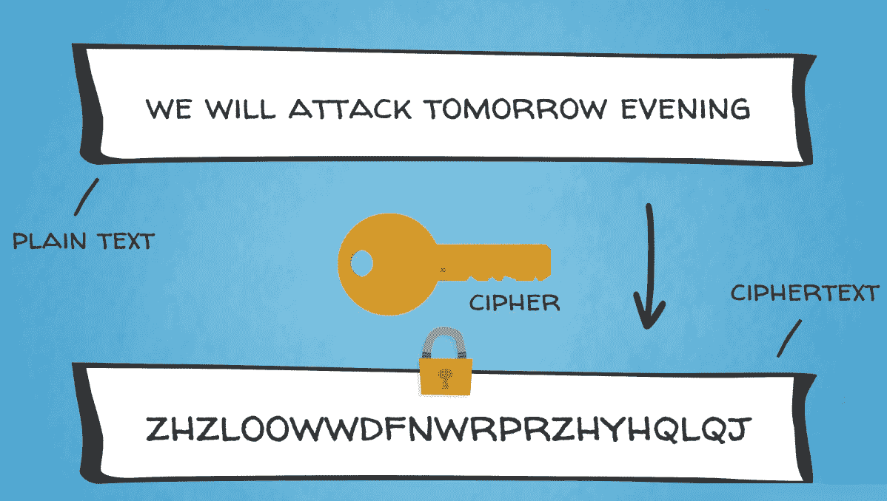
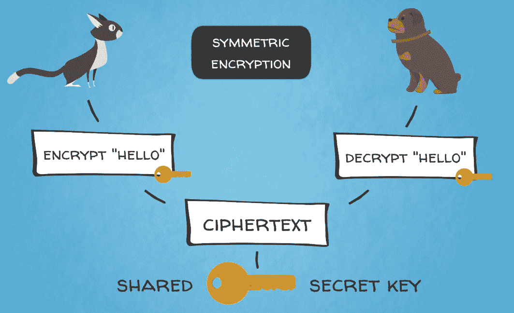
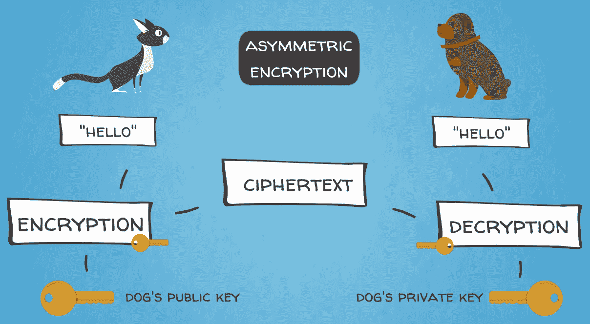
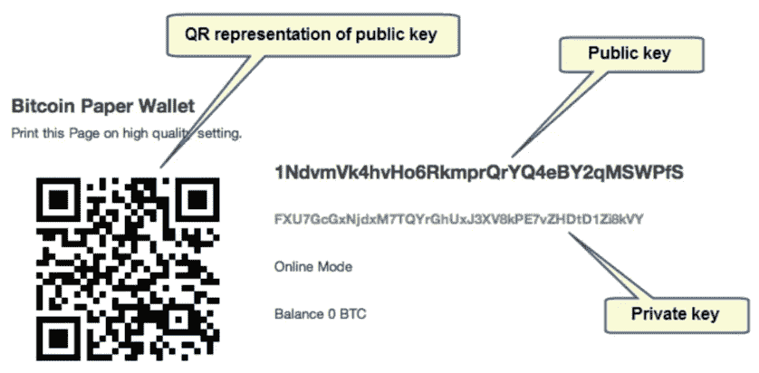
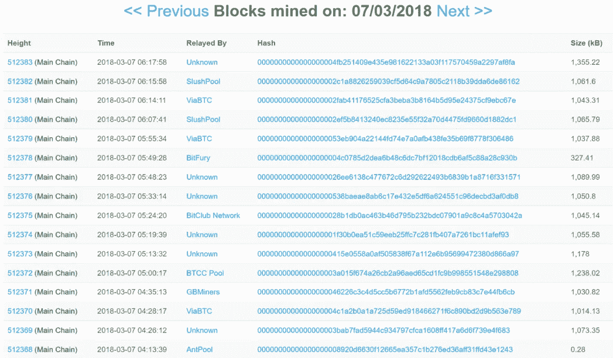
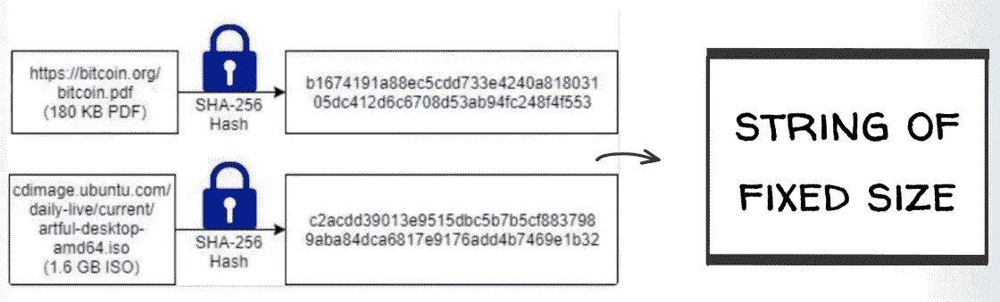

# 第五章：比特币的五大力量 - #2 密码学

在这一章中，我们将学习密码学的艺术以及它随时间如何发展。我们将了解密码学如何影响互联网的各个方面。在本章中，我们将涵盖以下主题：

+   密码学介绍

+   密码学类型

+   散列函数

+   数字签名

# 密码学介绍

在这一部分，我们将了解密码学是什么，以及它在历史上如何发展。

现在，我们来到加密货币的密码学部分，这是一个你可能在过去一年左右听说过很多次的公开术语。这听起来有点神秘，或者有点... 隐晦... 不是吗？你们中很多人可能听过**密码学**这个词，但真正了解它涉及哪些内容呢？

简而言之，密码学是安全通信的科学。它很有用，可以确保私人信息不被未经授权的第三方访问，这些第三方有可能以恶意行为。此过程涉及两个主要步骤：

1.  第一步是**加密**，它包括对信息进行混淆，以便只有预期的接收方才能访问它。

1.  下一步是**解密**，它是解开加密信息以便访问和使用它。

加密和解密过程通常涉及不同复杂程度的数学技术。密码学的增值早就被认可，这样的技术已经使用了几千年。

# 早期密码学的用途

尤利乌斯·凯撒据称曾使用加密消息与他的将军们进行通信。按今天的标准来看，他的技术很简单；他使用了字母表中距离预期字母三个位置的字母。例如，字母 ABC 将被代表为 DEF。事实上，这种加密方法被广泛称为**凯撒密码**。

密码学的另一个著名例子，具有高度历史意义，是德国工程师阿瑟·谢比乌斯在第一次世界大战结束时发明的“恩尼格玛”机器。它在 20 世纪 20 年代初商业化，并很快被德国军队采用，以确保其军事通信安全。恩尼格玛机器具有近 159 万亿种不同的字符和数字组合（准确地说是 158,962,555,217,826,360,000）。当时，恩尼格玛密码被认为是无法破解的，并在第二次世界大战期间给德国军队带来了优势。然而，由杰出的英国数学家和早期计算机科学先驱艾伦·图灵领导的团队设法破译了恩尼格玛密码，这帮助了盟军赢得了战争。这些事件在 2014 年的电影《模仿游戏》中被重新演绎。我们将在第九章中进一步提及艾伦·图灵的天才和他对现代计算机科学的影响，讨论下一代区块链技术——区块链 2.0。

接下来，我们将继续学习密码学，并提供一些重要的定义。

# 密码学类型

现在，我们将介绍一些重要的概念，这些概念将帮助您理解密码学在区块链世界中的作用。

密码算法通过密钥进行加密和解密。这些密钥基本上是秘密信息或参数，通常看起来像一系列字符。想象一下像密码或口令这样的东西，它们锁定和解锁对加密消息的访问。实际上，这些是密码算法的关键，有助于将普通信息（称为**明文**）转换为不可理解的文本（称为**密文**），反之亦然。如下图所示：

有两种主要类型的密码学：

+   **对称**（也称为**秘密密钥密码学**）：这是一种加密和解密都使用相同密钥的加密方式。如下图所示：

+   **非对称**（也称为**公钥密码学**）：这是一种加密中用于加密的密钥与用于解密的密钥不同的加密方式。如下图所示：

第二种类型的密码学，使用公钥和私钥对，用于在比特币和其他加密货币中提供安全性和隐私性。实际上，比特币区块链是世界上最大的公钥加密技术的民用部署。只有美国国防部才会更广泛地使用此类技术，这充分说明了其优点。

# 比特币中使用的密码学技术

用于保护比特币区块链的几种密码学技术包括：

+   公钥和私钥

+   哈希函数

+   数字签名

曾经使用过加密货币进行交易的任何人都应该熟悉密钥的工作原理。每个用户都有一对密钥（公钥和私钥），可以在网络上进行交易。你可以在以下截图中看到比特币中一些公钥和私钥对的示例：

**公钥**被发送者用于加密有关交易的信息，然后只有收件人使用其相应的**私钥**才能解密。公共地址，类似于账户，只能接收资金，并且是从公钥派生的，可以公开共享。私钥必须安全存储，并且永远不得泄露，因为只有它才能访问用户在区块链上的资金。

如果私钥丢失，那么访问资金就永远丢失了。区块链上没有密码重置功能。用户需要负责妥善存储和备份他们的私钥，因为网络上没有中央机构可以撤消错误的交易或恢复私钥。你需要确保自己理解任何私钥丢失的后果，并采取所有可能的措施来避免。你应该像对待任何现金、黄金或钻石一样小心对待比特币或其他加密资产的私钥。这里的区别是你可以备份私钥，因为它是一串可以复制的字符。因此，你可以将其打印在纸上，保存在 USB 存储设备上，或使用名为 Ledger 或 Trezor 的特殊设备，这些设备可以安全存储你的私钥。

接下来，我们将探讨比特币中密码学的另一个主要应用——加密哈希函数。

# 哈希函数

在前面的章节中，我们说过所有节点都存储着相同的区块链数据库，对吗？

而这无疑会导致大量的数据存储和冗余。但这是我们为了获得一个真正的去中心化的点对点系统而不需要任何中间人所必须付出的代价。

此外，数据集的大小可能不同，一些区块可能有 200 笔交易，其他区块可能有 500 笔交易，还有一些可能有 1,000 笔交易。所有这些交易通常也以千字节为单位在信息大小上有所不同。比特币区块链协议中唯一的容量限制是每个区块的大小，自 2010 年以来一直是 1 兆字节。最近通过比特币软件的最新升级，有效地修改为 1.4 MB。但再次强调，区块大小可以变化达到该限制。你可以自行查看[blockchain.info](http://blockchain.info)或其他在线区块浏览器上的区块是什么样子。在以下截图中，你可以看到一些示例区块：

因此，区块链可以受益于对其存储的数据进行一些标准化和合理化。

一个允许我们解决这个问题的机制是密码哈希函数，它们是保护数据完整性和减小文件大小的有效方法。哈希函数用于将任意长度的输入数据转换为压缩的唯一固定长度的字符串（也称为比特串）。这个输出数据作为一个唯一的参考代码或数字指纹，用来验证一些基础数据集的真实性，而不需要实际检查整个数据集。

在实践中，这个哈希函数是一个数学算法，它将任意大小的数据映射到一个固定大小的比特串（也称为哈希）。它被设计为一种单向函数，意味着一个不能被反向计算和逆推以获取输入数据的函数。这可以在以下图表中看到：

如果只有输出数据，要重新创建输入数据的唯一方法就是尝试对所有可能的输入进行暴力搜索，看看它们是否产生匹配。暴力搜索基本上是系统地尝试所有可能的组合以找到解决方案。

哈希函数在工作量证明区块链共识算法中被大量使用，我们很快就会看到。

# 数字签名

比特币中使用的另一种重要的密码学技术是数字签名。它们用于验证区块链上交易的发起方。它们使接收者能够验证收到的交易是否最初是由发送者使用他或她的私钥发送的。这个过程再次涉及到数学计算。惊不惊喜！

基本上，数字签名是由发送方的私钥通过数字签名算法处理生成的。然后，生成的代码输出附加到签名消息上，并充当签名。它指定了消息的发送方。每个交易都会有一个不同的数字签名，通过数字签名算法生成，以增加安全性。对于不知道该方私钥的一方来说，生成有效签名是不可能的。

请注意，我们通常交替使用交易和消息这两个词，因为区块链上的交易基本上是通过网络广播的消息。当你向另一个人发送加密货币时，你基本上是在给他们发送一条消息。

此外，数字签名的交易消息是不可伪造的，这意味着它们在传输过程中不能被拦截、修改或复制。

数字签名也是不可重用的，它们不能与交易消息分离并用于不同的消息，因为该算法为每个交易创建一个新的签名。

总结一下这个话题，让我们用伟大的中本聪的话来概括这些密码解决方案：

"我们将电子硬币定义为数字签名链。每个所有者通过对上一笔交易的哈希和下一个所有者的公钥进行数字签名，然后将这些添加到硬币的末尾来将硬币转移给下一个所有者。收款人可以验证签名以验证所有权链。"

# 摘要

好的！我们涵盖了一些涉及大量多学科科学的重要主题。好消息是，大部分科学都已经被内置到了比特币架构中，由萨托希以一种优雅而有效的方式构建，以便系统平稳运行。作为用户，你个人需要关心的唯一事情就是保护你的私钥。请确保你充分理解这对你自己的财务健康的重要性！

现在，我们准备进入下一个推动比特币的杰出工程解决方案——工作证明共识算法。
