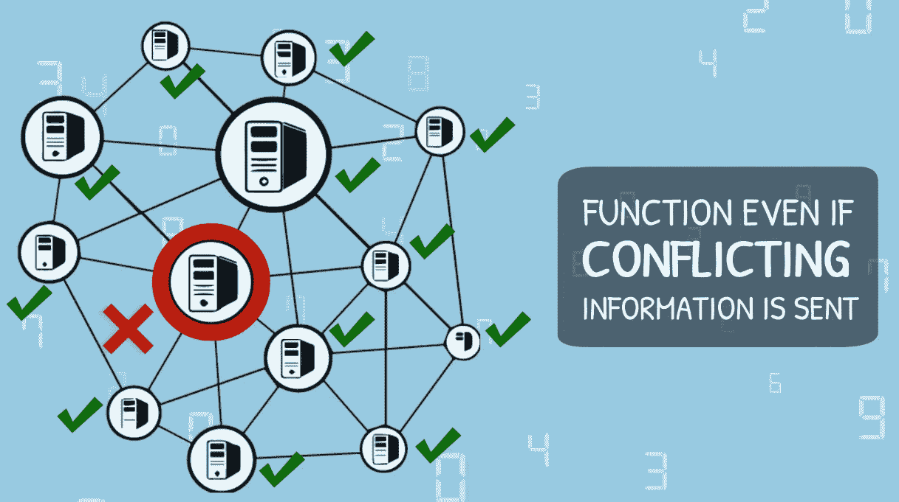
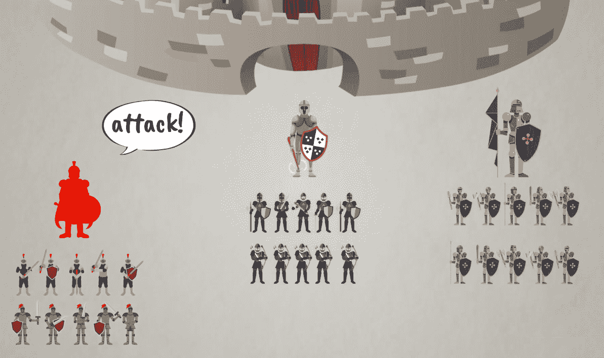
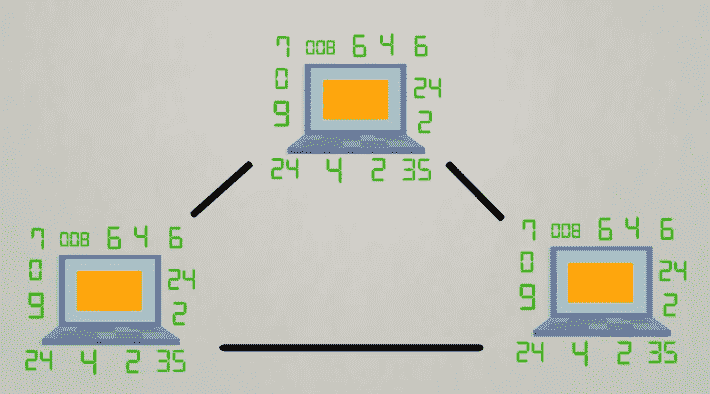
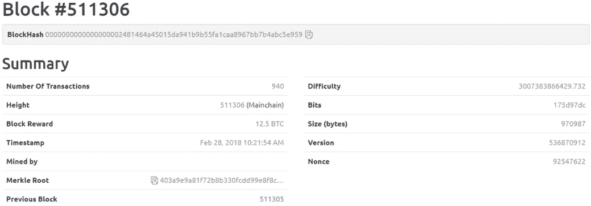
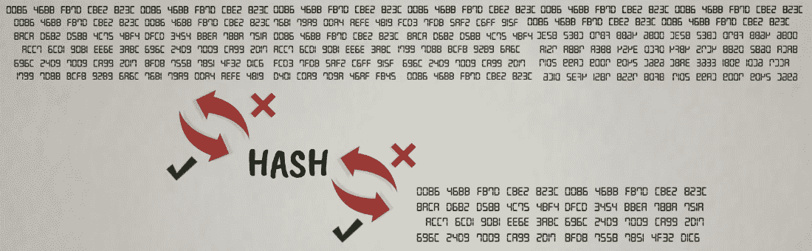
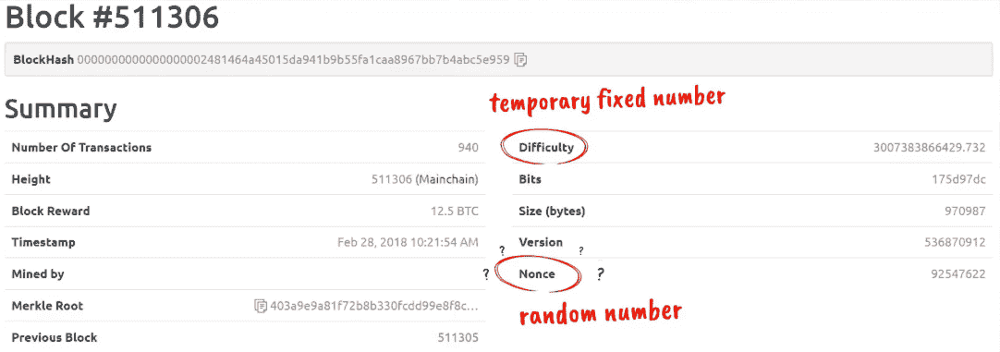
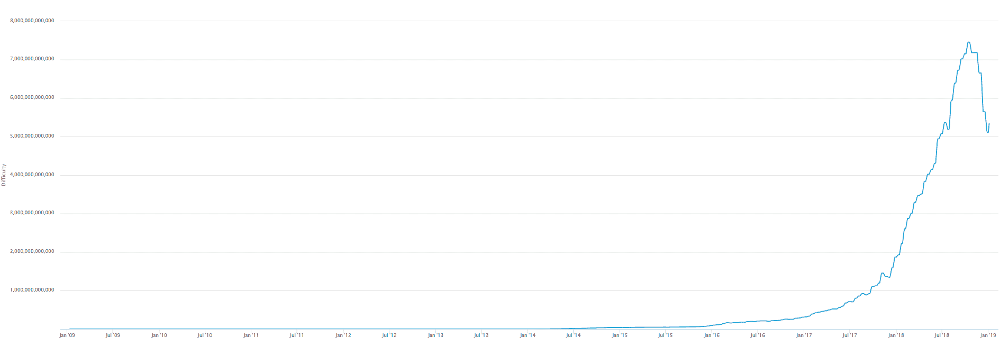
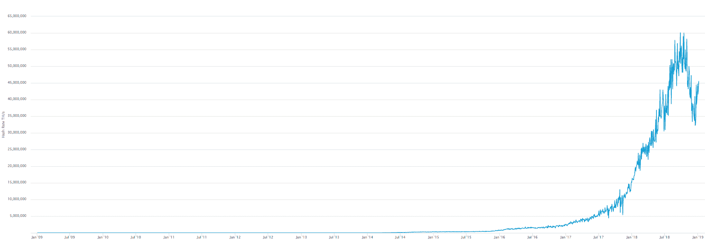
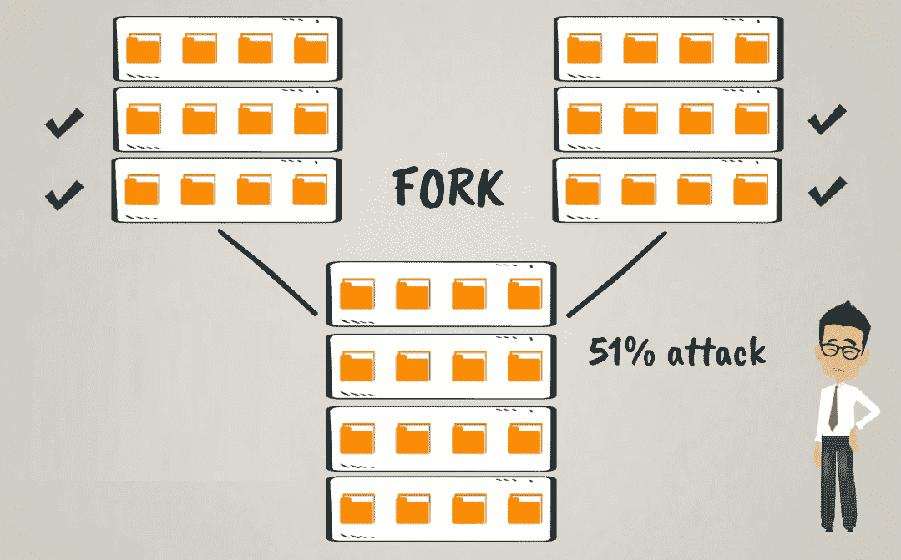

# 比特币的五大力量 - #3 共识算法

在本章中，我们将深入了解比特币区块链是如何以分散的方式运转的。我们将深入探讨比特币的共识机制——工作量证明，看看它与复杂的数学问题和挖矿有什么关系。本章将涵盖以下主题：

+   拜占庭将军问题

+   工作量证明共识算法

+   分散式共识和博弈论

# 拜占庭将军问题

拜占庭将军问题实际上是描述计算机系统中的问题的一种抽象方式，它是在一篇同名的论文中介绍的，发表于1982年。该问题指出，可靠的计算机系统必须能够在存在发送相互冲突信息的故障组件的情况下有效地运行。在分散的计算机网络中，这个问题变得更加严峻。

以下图表中有所体现：

让我们想象一下以下思维实验。

拜占庭军队已经包围了一座敌方城市。军队被组织成几个部队，每个部队由一位将军指挥。所有这些将军需要协调行动计划，但他们相距甚远，只能通过消息进行通信。更复杂的是，一个或多个将军可能是叛徒。这些潜在的叛徒将军可以发送误导性的消息，试图破坏任何协调的行动计划，无论是进攻还是撤退。为了找到这一困境的成功解决方案，拜占庭军队需要设法找到通向协调行动的路径，无论如何。这个实验可以在以下图表中看到：

为了实现这一点，拜占庭军队需要一些能够在绝大部分忠诚将军遵循的情况下有效地朝着协调的结果前进的算法，而某些叛徒则不会遵循这一算法。

# 工作量证明共识算法

既然你已经了解了问题，那么现在让我们来看看解决方案，这就是所谓的**拜占庭容错算法**。这种算法涉及到博弈论和数学。

拜占庭容错算法的首个实际实施是伴随着比特币的工作量证明而来的。在这种情况下，将军是比特币网络上的节点，也被称为**矿工**。网络节点是可以在网络上接收、创建、存储和发送数据的连接点。换句话说，节点是构成网络的连接点。

这里需要把握的重要概念是，这些挖矿节点从一个假设出发，即网络上其他任何人都是不可信任的。

**工作量证明算法**确保即使存在拜占庭不合规节点，网络也能保持一致性。让我们来看看比特币中这种机制是如何运作的。

正如我们现在都知道的，比特币是一个点对点网络，在这个网络中，所有的活动都是由其用户通过适当的软件和硬件来完成的。这些活动包括进行交易、接收交易、验证和传输交易。

# 挖矿简介

现在，我们将介绍许多人可能听说过的挖矿概念。挖矿基本上涉及到进行工作证明，并且会产生新的硬币作为奖励，这些硬币是为每个成功进行此工作证明的矿工而产生的，每个新区块都是如此。工作证明涉及到由计算机完成的大量计算，旨在解决密码哈希难题。让我们深入了解这个机制的细节，以弄清它是如何工作的。

首先，让我们看一下矿工是如何创建新区块的。以下图表说明了创建过程：

现在，挖矿节点收集和汇总新的交易数据。在接收到这样的数据后，每个节点都会独立地对每笔交易进行验证，根据一长串的标准进行验证，其中包括以下内容：

+   追踪正在消费的数字货币的来源

+   检查是否有相同的资金重复花费

+   检查总交易量是否在系统允许的0到 2100 万比特币的范围内（因为 2100 万是系统允许的比特币的最大总供应量）

列举不一而足；节点上安装的比特币软件执行了许多其他的检查和平衡。

经过验证的交易被汇总到交易池中，也称为内存池或 mempools，在那里它们等待直到被包含在一个区块中。矿工检查他们的内存池是否有任何已经包含在以前的区块中的交易。在收集和整理经过验证的交易形成候选区块后，矿工需要构建区块头。这个头部包括以下主要组成部分：

+   候选区块中所有交易数据的摘要

+   链接到链中的上一个区块，也称为父区块

+   显示区块创建时间的时间戳

+   有效的工作证明

区块交易数据的摘要通过哈希函数完成，这些函数以一种使数据产生标准化的唯一标识代码或数字指纹的方式处理数据。通过这种方式，系统对每个交易块都有一个唯一的标识符。

# 比特币交易的不同方面

这是一个区块头的示例，在[blockexplorer.com](http://blockexplorer.com)上查看：

如前所示的截屏中，有一个长长的字母数字字符串就在区块号下方，称为区块哈希**（BlockHash）**或简称哈希。字母数字意味着它由字母和数字组成。这是一种对数据进行编码的方式，是通过比特币的加密哈希函数处理那里的区块头数据的输出结果。你可能听说过这个函数的名字，SHA 256，其中**SHA**代表**安全哈希算法**。

你可能还记得我们在[第五章](84ad3021-fae1-4e16-aaae-cee34e5d2bf6.xhtml)，*比特币的五大力量 – #2 密码学*中简要提及和解释了哈希函数。我们将再次简要讨论它们，因为它们在工作量证明中扮演着如此重要的角色。

正如我们已经学过的，哈希函数可以将任何类型、任何大小的数据转换为一个固定长度的字符串，该字符串可以作为唯一的数字指纹或标识符。此外，这些加密哈希函数只能单向工作。一旦我们得到了输出，我们不能简单地反转函数，插入输出，并在另一端获取输入数据。这可以通过以下图示更好地描述：

为了说明反转函数意味着什么，让我们考虑四种基本的数学运算：

+   加法和减法是彼此的反函数

+   乘法和除法是彼此的反函数

我们总是可以使用这些函数构建方程来找到任何未知变量。例如，3 * x = 15，x = 15/3 = 5。

许多数学函数可以以类似的方式反转。然而，这并不适用于加密哈希函数。在加密函数的输入数据集中找到一个未知随机变量的唯一可行方法是尝试不同的值，一个接一个地给定所有其他已知参数，以找出有效的值。这基本上是一个尝试可能的所有组合的蛮力方法。这正是工作量证明中使用的工作的要素。工作包括计算机需要进行的所有迭代计算，以找到加密难题的解决方案。

# 随机数和难度

现在，让我们再次看看我们拥有的区块头数据示例。你可能注意到了随机数（Nonce）这个词，以及另一个不熟悉的参数叫做难度（Difficulty）。

随机数基本上是一个随机变量，或者是一种随机性来源。另一方面，难度是一个临时的固定数字，由比特币协议计算并在大约两周内保持不变。我们可以在以下示例中看到这两个变量：

当一个矿工开始构建或挖掘一个类似于此的区块时，除了nonce外，所有参数都是已知的。Nonce 是需要找到并插入的难题中的缺失部分，以便生成的区块头哈希小于目标难度级别。你可以把目标难度想象成一个数字。这个过程是通过不断尝试不同的 nonce 值进行迭代计算，直到找到一个令人满意的哈希来完成的。

让我们用一个简单的例子来说明这一点。考虑一个掷骰子的游戏，有两个玩家，每人掷一对骰子。目标是投出一个小于或等于特定预定目标数字的数字。首先投出这样的数字的玩家获胜。如果目标级别是 10，那么游戏就相对容易，因为只有组合加起来等于 11 和 12 的情况不能赢。所有其他组合都赢。现在，如果我们想要让游戏变得更加困难，我们可以把目标降低到 5。在这种情况下，玩家需要投掷骰子的总和为 2、3、4 或 5 才能赢。这样做的几率比之前的目标 10 要低得多，所以游戏更难赢。如果我们想让它变得真的非常难，我们可以把目标降低到 2，然后只有 1 和 1 的骰子组合才能赢。比特币的密码计算难题就是这样工作的。

你可能会想知道为什么区块头哈希应该小于目标难度级别。好吧，目标难度由比特币协议根据插入和尝试解决难题的计算机总体能力来确定。由于这是一个遵循已知统计分布的随机过程，因此可以预先计算找到解决难题的一个nonce的几率。这意味着可以根据部署的总处理能力计算出网络上任何节点找到难题解的预期平均时间。

系统每 2,016 个区块，或大约 2 周调整一次目标难度。

比特币软件是这样计算的，以使挖掘一个区块的平均时间保持在大约 10 分钟左右。这 10 分钟的区块时间被选择为在区块链上进行交易速度和安全性之间的合理折衷。

# 计算能力

为了让你对这里提到的计算机处理能力有个概念——它被定义为每单位时间的哈希率或哈希函数计算次数。目前最强大的比特币挖矿芯片可以以每秒 14 万亿次的速率运行。这是每秒 14 万亿次哈希函数计算！一万亿是一个后面跟着 12 个零的 1。一个相当大的数字，不是吗？你还应该考虑到，这些芯片专门设计用于优化这个特定哈希函数的计算，它们不能做其他任何事情。它们被称为**ASICs**，代表**特定应用集成电路**。

让我们看看随着时间推移，难度如何随着哈希率的增加而增加。以下截图描述了难度随时间的变化情况：

随时间推移的哈希率如下截图所示：

总结一下，这是我们到目前为止所涵盖的挖掘过程的关键步骤和收获：

1.  矿工收集网络广播的新交易数据，并根据比特币协议的一套标准进行验证。

1.  然后，矿工按块顺序排列新的已验证交易。

1.  在此之后，矿工准备新的区块头并计算工作证明。

1.  第一个找到工作证明难题解决方案的矿工（换句话说，计算出正在挖掘的新区块的哈希值），成功挖掘出这个新区块，并将其作为最新区块包含在区块链中。

1.  成功的矿工会得到区块奖励，作为新生成的硬币的工作报酬，这被称为coinbase交易。

1.  网络上所有矿工的目标难度是按照协议每2,016个区块（大约2周）进行调整的，以维持平均区块时间约为10分钟。这种调整是为了考虑到矿工在网络上部署的计算机处理能力。

1.  因此，系统中插入的挖掘能力越大，门槛就越低，使问题更难解决，但平均区块时间保持在10分钟。

接下来，我们将通过一些博弈论来完成分布式共识的难题。

# 去中心化共识和博弈论

在本节中，我们将看到博弈论是如何起作用的。

**博弈论**是研究智能理性决策者之间冲突与合作的数学模型。它主要应用于经济学、政治科学、心理学，以及逻辑学和计算机科学。

听起来很激动人心，是吗？让我们看看它如何应用于比特币的去中心化共识。

首先，我们需要考虑到比特币挖矿是一个资本密集型业务。这意味着矿工需要对昂贵的挖矿计算机硬件进行大量的资本投资，也被称为**挖矿机**。如今，比特币挖矿是如此工业化，以至于大部分哈希算力来自大型数据中心，也称为**矿池**。

除了在物理硬件上的资本支出之外，运行挖矿操作还需要大量的运营支出。这些费用包括运行计算机和冷却它们的电费。请记住，比特币是一个全球交易网络，24*7运行，因此挖矿计算机不间断地运行工作证明计算。

除此之外，还有物业费用，用于存放矿工计算机的物理位置、互联网带宽、维护费用以及其他运营费用。

所有这些投资和成本都是矿工们有效地押上的，并且是他们按照比特币协议行事的巨大经济激励，有效地保证了分散式共识机制的安全性和区块链的完整性。

你可能会想：为什么这样是一个坚实的保证？

比特币挖矿是一个非常竞争激烈的行业。矿工根据其计算机的哈希能力进行竞争，以最先解决工作证明难题、挖掘下一个区块并获得区块奖励。它是如此竞争激烈，以至于目前只有在电费非常便宜的地方才被认为是有利可图的。自然的寒冷气候也是一个巨大的优势。

考虑到所有这些因素，对于任何矿工来说，最佳的行动是遵循规则，验证交易并诚信挖掘区块。这使得矿工有最好的机会从区块奖励中获得收益，从而实现投资回报。

如果一个矿工在挖掘新区块时不遵循协议，那么其他网络节点将不会接受该区块作为有效的。这意味着没有区块奖励，对违规矿工来说会造成巨大的经济损失。

# 矿工不当行为的例子

让我们来看看矿工如何可能出现不当行为的一些情况，以及随之而来的结果。

其中一种威胁可能是一个矿工决定不遵循区块奖励的规则，试图在coinbase交易中获取更多的硬币。根据协议，区块奖励最初为50比特币，每4年减半一次。因此，自比特币推出以来，经过两次减半后，当前是12.5比特币。

考虑这样一种情况：一个矿工决定试图以挖掘一个区块而奖励自己1000比特币，而不是协议规定的12.5比特币。即使这个贪婪的节点成功完成了工作证明并首先找到了加密难题的解决方案，其他网络节点也会拒绝该区块。他们会立即发现这种不规则，并不接受这个作为有效的区块。

你可能会想：他们是怎么做到的？其他节点如何接受或拒绝一个新的候选区块？

首先，他们检查是否根据协议满足了所有有效区块的标准。这些标准包括正确验证和记录的交易、链接到上一个区块的哈希值、正确的区块奖励、时间戳和工作证明等。

如果一切正确，但网络上有几个有效的候选区块或区块链同时存在，矿工们总是选择在最长链上进行挖矿并构建他们的新区块。也就是说，这是累计工作量最大的链，追溯到创世区块和萨托币的第一笔交易。通过选择父区块，即链中的前一个区块，矿工们有效地用他们的挖矿能力对区块链的状态进行投票。通过这种方式，原始的主要有效链始终得到扩展，并且向其中添加了更多的累积工作量证明。

在给定的新区块上挖掘的每个区块都将作为对该区块及其中所有交易的一个确认。在给定区块上建立的区块越多，该区块就具有的确认就越多，因此其中所有交易也就越安全、不可变。

区块奖励硬币在经过 100 个区块确认后可以支配。这是系统中嵌入的进一步保护措施，以确保矿工的诚信，并减轻矿工试图更改共识规则或双重支付等操纵尝试的任何风险。

# 双重支付的例子

如果一个矿工试图密谋创建双重花费交易会发生什么？

想象以下情景。约翰想用比特币买一辆车。他找到一家接受比特币作为支付方式的跑车经销商。约翰用 10 比特币购买了一辆华丽的橙色兰博基尼。付款后不久，该笔交易被包含在区块链的顶部区块中，约翰驾驶着他的新兰博基尼驶离。经销商没有延迟交付产品。然而，约翰与李先生串通一气。实际上，李先生是一名矿工，他经营着一个拥有大量处理能力的庞大挖矿池。想象一下一个充满电脑的大型数据中心，专门用于在比特币区块链上进行挖矿。李先生立即重新挖掘了包含约翰付款给汽车经销商的同一个区块，但这次重新挖掘的区块将约翰付款的同样金额退回到了他的钱包中。这就是双重支付！同样的硬币被花费了两次！约翰既得到了兰博基尼，又拿回了他的钱，所以他相当于免费得到了这辆兰博基尼！这种情况可以在下图中更好地说明：

这种情况在区块链中创建了一个分叉，意味着在区块链的相同高度上挖出了两个不同的区块。换句话说，它们在非常接近的时间内在同一个父区块之上挖掘出来。李先生接下来要做的事情是继续在包含双重花费交易的链上进行挖矿，以扩展该链并进一步验证它是否为最长链。

这种共识攻击被称为 51% 攻击。尽管名称如此，但实际上并不需要网络哈希功率的 51%；51% 只是这种攻击几乎肯定会成功的阈值。可以从下图中看出这一点：

如果供应商在交付商品之前等待更多的区块确认，这样的情况很容易就能避免。通常情况下，经过六次区块确认后，交易被认为几乎是不可变的。因此，建议对于大额购买至少在经过六次区块确认后再交付，这大约需要1小时。小额购买可以更快交付，因为潜在损失的风险较小。

因此，等待足够数量的区块确认是提供安全性防范潜在的51%攻击和双花攻击的一种方式。

# 环绕比特币网络的架构

另一个内置在系统中的保护措施再次来自于矿工们的经济资源。正如我们所说，挖矿和计算工作量证明消耗了大量资源。如果任何矿工决定试图攻击并控制网络以谋求自己的利益，这将是一种非常危险且昂贵的策略。这将需要巨大的计算能力才能成功。我们已经提到了比特币网络中插入的巨大哈希能力，这就是任何不良矿工需要竞争的东西，以篡改分布式账本。

在给定区块上构建更多区块，它拥有的确认越多，也就越难以被操纵。如果任何矿工想要改变之前的区块，以创建双重花费交易、转移资金或出于任何其他原因，他们随后需要重新挖掘所有后续区块。此外，所有这些工作基本上都是无偿的，因为他们不会在重新挖掘的区块上获得任何有意义的奖励。这是因为他们的替代链将与原始链竞争，以成为最长和主要的区块链。如果不是最长的话，它将被网络忽略，并且没有其他矿工会通过工作来扩展它来验证它。

记住，矿工总是在最长的现有链上构建他们的新区块，这个链包含自创世区块（第一个创建的区块）以来累计工作量证明最多的区块。通过将每个区块与其父区块通过包含所有区块信息的哈希链接起来，整个网络验证和确认了区块链上曾经进行的每一笔交易。每隔10分钟，当一个新的区块被添加到区块链中时，所有交易，从最早的一笔Satoshi创建比特币时做的交易开始，都会被整个网络重新验证和重新确认。

还要考虑，虽然不符合规定的节点正在重新挖掘过去的区块，但所有其他诚实的节点都在继续挖掘和扩展原始的主区块链。因此，不符合规定的节点需要保持更快的挖掘速度比网络中的所有其他节点，部署更多的处理能力并消耗更多的电力，而没有任何有意义的补偿。

进行区块链攻击的时间越久远，可行性就越低。我们所说的不是几年，甚至不是几个月，而是几周和几天。24 小时内有 144 个区块确认。如我们已经提到的，比特币协议要求 100 次区块确认才能解锁区块奖励，因此这足够长以减少矿工潜在利益冲突的风险。

这就是为什么攻击者要操纵或控制比特币区块链是如此困难。现在，网络已经运行了将近十年，挖矿和支持区块链的计算功率庞大，并遵循协议规则。这种架构可能使其比任何曾经存在的支付网络基础设施都更加健壮。

# 共识攻击

还有一件与共识攻击潜在影响有关的事情也很重要。这种攻击潜在地会破坏分散式治理的安全性和网络的可用性，但它们不能盗取或使用其他人的资金。这是因为在区块链上控制资金唯一的方式是通过私钥，我们在《第5章》，*比特币的五大力量-#2密码学*中有涉及。潜在的共识攻击者只能操纵他们在区块链上的交易，可能使用自己的资金创建双花交易。

现在我们已经讨论了分散共识机制，这种设计可以提供协议的安全性。比特币区块链架构非常有效，可以提供防篡改的、不受审查的交易记录。真的很难想象还有更好的会计和记录系统。

让我们总结一下我们所涵盖的比特币挖矿和共识过程中的所有因素：

+   挖矿竞争非常激烈。矿工利用他们的计算资源来挖矿，满足分散式共识协议的要求。

+   在每一轮挖矿新区块时，赢家是第一个在有效区块中找到工作量证明谜题解决方案的矿工。

+   新挖出的区块由所有矿工表达的共识纳入区块链，并立即开始在其上构建新的候选区块。他们通过将其哈希作为父区块引用到他们的新候选区块中来实现这一点。

+   获胜的矿工将获得区块奖励，目前为 12.5 比特币。

+   分散共识机制的安全性由矿工投入的经济资源、工作量证明算法和网络中投入的大量计算力保证。

# 总结

在这一章中，我们了解了共识算法的全部内容以及它们是如何产生的。我们了解了拜占庭将军问题以及它与比特币世界的联系。我们全面了解了工作证明算法，确保比特币协议的安全和完整性。

在下一章中，我们将了解比特币所基于的广泛的点对点网络。
