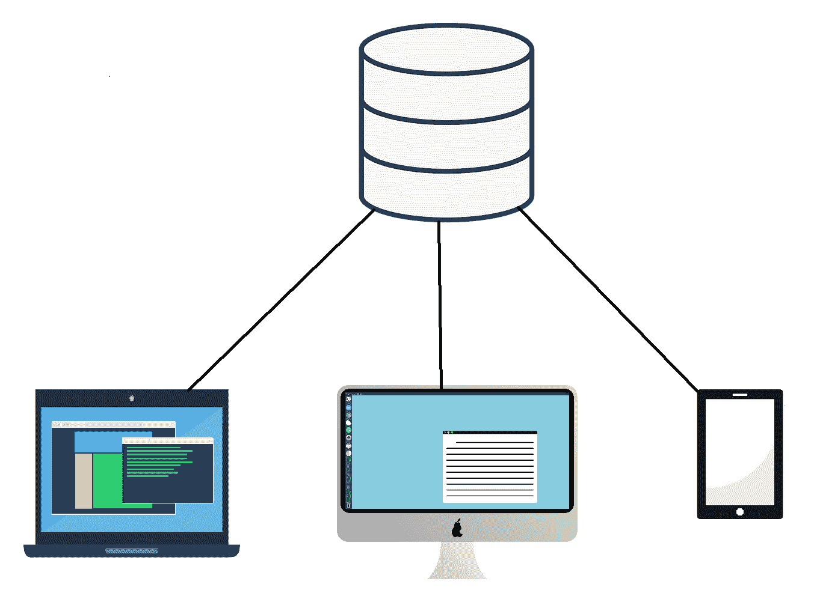
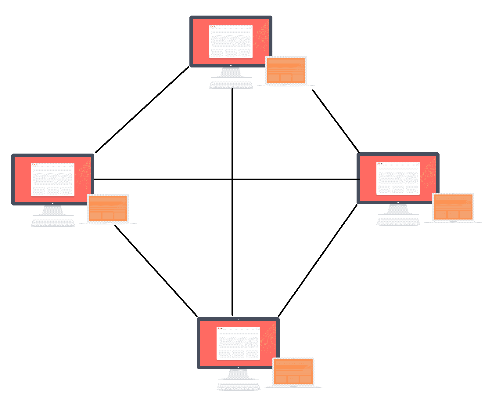
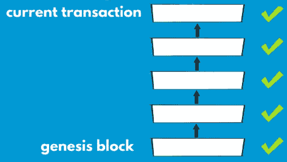
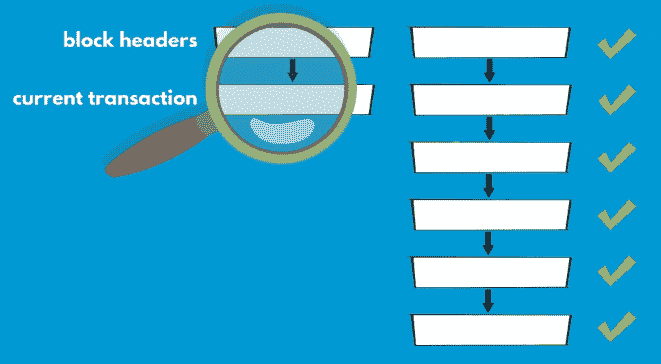

# 比特币的五大力量-#4 P2P 网络

在本章中，我们将继续探讨比特币世界。我们将讨论驱动比特币的第四力量——其**点对点**（**P2P**）网络。在前面的章节中，我们已经涵盖了密码学、挖矿、区块链等许多特性。你是否曾想过所有这些特性是如何高效运行的？本章将回答你关于 P2P 网络的所有问题。

本章将涵盖以下主题：

+   P2P 网络简介

+   网络的节点

+   P2P 网络的结构

# P2P 网络简介

多年来，互联网已经变得非常集中化，巨型企业在电子商务、网络搜索、社交网络等许多领域拥有巨大的市场权力。除了市场权力，他们还控制着用户的私人数据，例如身份信息、信用卡详细信息、地址、联系方式等。这是一个非常重要的隐私问题，用户应该注意。

有两种类型的分布式应用程序网络架构方法：

+   P2P 模型

+   客户端-服务器模型

# P2P 模型与客户端-服务器模型的对比

P2P 和客户端-服务器模型是解决分布式应用程序网络架构的两种不同方法。分布式应用程序是系统的组件位于不同的网络计算机上。这些计算机通过网络进行通信和协调，以便运行分布式应用程序。

客户端-服务器模型代表了一个集中式架构，服务器计算机运行程序并与客户端计算机共享其资源。客户端不共享任何资源，但向服务器发送内容、存储或处理的请求：

客户端-服务器模型的例子包括电子邮件服务、网络打印和万维网。

另一方面，P2P 网络没有中央服务器，网络上的每台计算机都与其他计算机共享其资源。这些资源可以包括处理能力、磁盘存储或网络带宽。对等体之间的交互是直接的，无需中央服务器的协调。对等网络节点既是资源的消费者，也是供应者，而不是客户端-服务器模型，资源的消费和供应是分开运行的。P2P 网络的架构如下图所示：

P2P系统随着1999年发布的文件共享应用Napster而变得流行。 自那时起，这个概念已经发展超越了同类操作的节点网络，演变成了将不同节点聚集在一起，以实现超越个体节点能力的卓越结果的系统。 互联网最初的愿景与P2P网络接近，假设互联网的每个用户都是积极的编辑和贡献者，创建和链接内容以形成一个相互链接的网络，但随后它演变成了以客户端-服务器模型为主导。 区块链技术的出现催生了Web 3.0的愿景，它应该基于更多的P2P交互和去中心化服务。

# 金融交易

这里有个棘手的问题给你。 现在的金融交易是什么？

对于这个问题的答案将是它们是通过通信网络传输的消息。 这是每笔银行转账和信用卡付款的方式。 实际上，银行转账通常被称为**电汇**。 你可能一直在想这个词是从哪里来的。 有趣的是，它来自电报网络，这可能是最古老的一种远程通信基础设施。 它们通过电线传输文本消息。 这就是西联汇款在1872年开始使用的方式，用于传输有关付款的消息。 在目的地收到具有付款说明的消息后，当地办事处将支付给指定的人。 这就是**电汇**的概念开始的地方。

这个过程经历了多个步骤的演变，直到今天，但其核心仍然是基于传输消息。 金融网络本质上是通信网络。

# 比特币的不同之处

现在，你可能会想，比特币网络与这样的金融网络相比有什么不同和独特之处？

主要的区别在于比特币是构建在互联网之上的P2P网络。 控制去中心化是一项核心设计原则，通过扁平的P2P网络架构实现和维护。

比特币P2P网络是运行比特币协议的节点或对等方的集合。 比特币协议是一种类似于**Internet Protocol** (**IP**) 的软件工程。 现在每个人都听说过IP地址，它们用于在互联网上进行通信。 就像世界范围内的网络及其网站，域名和其他应用程序一样，比特币网络是在互联网上运行的一层。

比特币和其他公共区块链网络协议可以绕过网络。事实上，在某些领域，它们可以提供一种可行且优越的替代方案。除了支付之外，还有其他具有颠覆性的区块链应用，我们稍后将在[第11章](586d0708-8581-4903-8aaf-1e9cd736cb5a.xhtml)中详细介绍，*专注于特定行业和用例的区块链*。以下是比特币可以是可行替代方案的一些领域：

+   电子商务

+   网络搜索

+   社交网络

+   ID 认证

# 比特币网络的节点

现在，让我们来看看比特币网络参与者执行的各种功能。这些网络节点（网络中的参与者）被称为节点。所有节点都可以验证交易，将自己的交易发送到网络上，并保留区块链数据库的完整或部分副本。

除了前述功能之外，网络上的节点有时会涉及挖矿功能，我们在[第6章](e7fab0bd-e3c6-45d3-9c59-147010110267.xhtml)中讨论过，*比特币的五大力量 - #3 共识算法*。这涉及计算工作证明算法并创建新的区块。

并非比特币网络上的所有节点都进行挖矿，因为这需要大量资源和专用设备。

# 节点类型

区分保留区块链完整副本的节点，称为**完整节点**，和仅保留部分副本的节点，称为**轻量级节点**或**简化支付验证**（**SPV**）节点，非常重要。

# 完整节点

完整节点可以在没有外部参考的情况下自主验证交易。它们使用自底向上的验证方法。这意味着它们可以跟踪每个币从创建时开始经历的所有交易。在这样做时，它们从**创世区块**开始，然后沿着区块链向上移动，直到达到需要验证的**当前交易**。可以使用以下图表更好地可视化这一点：

通过这种方式，它们知道哪些币已经被花费，何时被花费，以及在任何时候每个币的合法所有者是谁。维护完整节点会带来自己的资源要求，以存储容量为例，因为比特币区块链的大小目前为 160GB。

# SPV 节点

或者，节点可以仅存储部分区块链，仍然能够验证交易。这些节点称为轻量级节点，它们使用 SPV。这是一种自顶向下的方法。

SPV节点仅保留所有区块的区块头，这占据了完整区块链所需存储空间的一小部分。为了验证交易，它们检查区块以找出特定交易所属的位置，然后确保在该区块之上至少构建了六个区块。通过这种方式，轻量级节点依赖于完整节点完成的工作，作为验证被验证的交易是否正确并且未被双倍花费的证据。轻量级节点通过检查这些交易所属的区块链中的工作量证明来有效验证交易。许多比特币钱包，特别是智能手机上的钱包，都是轻量级节点。该过程可以通过以下图表进一步说明：

# 比特币P2P网络

比特币P2P网络包含分布在互联网上的广泛节点阵列，共同工作。比特币网络的两个主要部分是：

+   主网络

+   测试网

# 主网络

主网络是托管在互联网上的核心比特币网络，在这里进行所有真实交易。我们在互联网上看到的所有比特币活动都发生在主网络上。

主网络包含用于全球比特币交易的所有重要信息。所以，您可能会问自己如果有一些新的升级会怎么样？它将如何影响比特币网络？这个问题的解决方案是测试网。

# 测试网

除了称为主网络的主要比特币网络外，还存在一个测试网，用于测试新项目和协议功能。测试网是用于测试和研究的替代区块链。测试网是一项安全措施，以确保在试验过程中永远不会危及主比特币网络。在该网络中，我们使用测试币。

测试币与实际主网络比特币是分开且不同的。它们不应具有任何价值。这使得应用程序开发人员或测试人员可以进行实验，而无需使用真正的比特币或将主区块链置于错误软件风险之中。

# 额外的实体

除了主比特币网络外，还有其他实体运行完整节点以与主网络进行接口。这些实体为网络提供特定服务。以下是一些使用的实体：

+   **矿池**：矿池可以构建为运行完整节点的服务器，许多其他计算机将连接到它并运行工作量证明计算，但无需存储完整的区块链。

+   **交易所**：交易所是比特币和其他加密货币每天交易的地方。

+   **区块链浏览器**：区块链浏览器基本上是区块链交易的搜索引擎。

# 概要

在本章中，我们了解到比特币是首个实现了去中心化P2P网络用于支付和价值转移的系统。该系统在没有第三方干预的情况下，能够平稳高效地运行。我们了解了控制的去中心化，比特币网络中不同类型的节点，以及比特币网络的结构。

在下一章中，我们将学习支撑比特币的软件代码基础。
