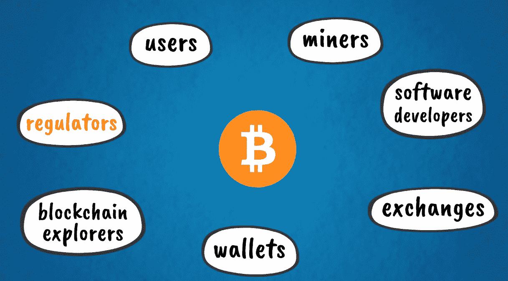
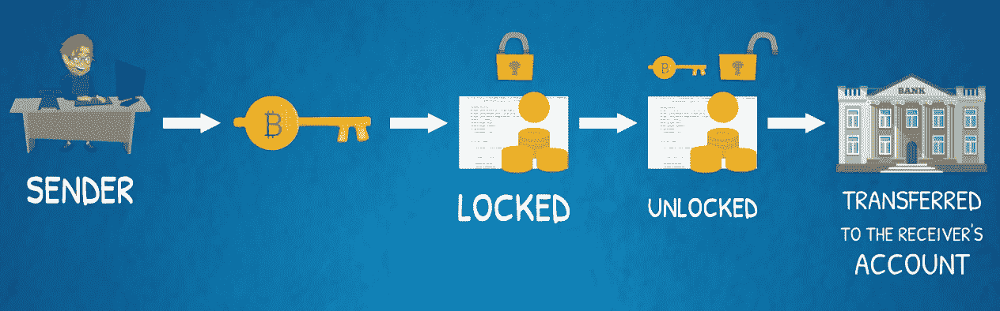

# 第八章：比特币的五大力量 - #5 软件代码库

在这一章中，我们将了解比特币的最后一部分，也可能是最核心的部分——其软件代码库。在这一章中，我们将专注于软件方面的事情。我们将学习有助于比特币无缝运行的协议和功能。本章将涵盖以下主题：

+   比特币软件代码案例介绍

+   比特币的脚本语言

+   比特币作为应用平台

# 比特币软件代码案例介绍

正如我们现在所知，比特币生态系统包括用户、矿工、软件开发人员和应用程序，例如交易所、钱包和区块链浏览器。其他利益相关者预计也将越来越多地参与其中。监管机构和政府机构未来很可能会更加关注该生态系统。以下图表示比特币生态系统：

比特币网络中的所有参与者都运行由软件工程师开发和维护的软件。

比特币最初是由中本聪作为软件协议开发的，他编写了最初的代码库。在启动后不久，中本聪将代码的持续开发和维护交给了一群拥抱这个想法的软件开发爱好者。这个最初的团队已经发展成了比特币的核心开发团队。尽管如此，比特币是一个开源项目，每个人都可以审查代码并提出开发提案。

比特币核心是支撑比特币的开源软件代码库。它被称为比特币的参考实现，意味着它是比特币系统功能的主要参考点。它确定系统的所有方面，如钱包、交易、块验证、节点设置和对等网络中的网络协议。

现在，我们将转向生态系统中使用的关键软件应用程序。

# 钱包

包含用户私钥的钱包是存储资金并在区块链上进行交易所必需的工具。它们是最常见的比特币系统用户界面。在某种程度上，这类似于网络浏览器是对万维网及其**超文本传输协议**（**HTTP**）协议的最常见用户界面。

所有的钱包都包含加密密钥，用于访问区块链上的硬币。我们在第五章中详细介绍了加密密钥，*比特币的五大力量 - #2 密码学*。钱包可以根据它们存储和管理密钥的方式分为几种类型：

+   我们可以有桌面钱包，代表安装在个人电脑和笔记本电脑上的软件应用程序。

+   我们也可以有移动钱包，这是安装在智能手机上的移动应用程序。

+   此外，还有 Web 钱包，可以通过 Web 浏览器访问。这些钱包存储在第三方服务器上，类似于一些电子邮件帐户服务，如 Gmail。

除了这些软件钱包应用程序外，我们还可以有一些不基于软件的钱包。这些是硬件钱包和纸质钱包：

+   硬件钱包是专门设计用于安全存储私钥的专用硬件设备。它们在外观上类似于 USB 闪存

+   另一方面，纸质钱包是一种出人意料的低科技但非常有效的防范潜在黑客攻击的解决方案，因为它们只在纸上存储加密密钥。当然，这种纸质钱包必须被安全地物理存储，以减轻被盗的风险。

存储密钥离线的钱包也被称为冷存储。

我们在这里再重复一遍，因为它是如此重要的要记住：谁控制私钥，谁就控制区块链上的资金，因此任何钱包都必须以最大的认真管理、保护和备份。

钱包可以是存储整个区块链的全节点的一部分，也可以是只存储自己交易的轻量级节点。轻量级节点依赖于它们连接的全节点，以便访问完整的比特币区块链。

# 区块链浏览器

除了钱包，另一个常用的软件应用程序是区块链浏览器。区块链浏览器是用作区块链搜索引擎的工具。它允许我们跟踪交易、区块和地址余额。在某种程度上，这类似于 Google 在互联网上的搜索功能。

有几个网站充当区块链浏览器。最经常使用的浏览器网站之一是[blockchain.info](http://blockchain.info)。以下截图展示了区块链浏览器的快速预览：

# 比特币的脚本语言

现在，让我们来看看比特币的可编程性方面。一些区块链加密货币被称为可编程货币。

比特币确实是一种可编程的数字货币。它使用一种叫做 Script 的编程语言来构建和处理交易。顾名思义，这是一种脚本类型的语言，支持称为脚本的小程序。它们自动执行一系列任务或命令，否则将需人工操作逐一执行。

Script 是一种具有有限功能的高级编程语言，也是面向特定领域的，意味着它专门设计用于其应用领域。比特币的交易脚本专门设计为范围有限，以便需要最少的处理，并且可以在非常简单的设备上执行。它的有限范围还增强了安全性，因为这留下了更少的空间用于编码错误。正如你可以想象的，任何处理资金转账系统中的错误可能会非常昂贵。

脚本并不是一个图灵完备的语言，这意味着它不是通用的，不能用来解决任何问题。我们在接下来的章节中讨论以太坊时会更多地谈到图灵完备性。

比特币的交易脚本包括驱动交易执行的函数。每个交易脚本都有以下步骤：

1.  当发送方使用加密密钥对交易进行签名时，脚本锁定被发送的硬币，这基本上是交易输入。

1.  这些硬币或交易输入只能由接收者的私钥解锁。

1.  然后，以交易输出形式的硬币被转移到接收者的账户，并由接收者的私钥控制。在每笔比特币交易的这两个步骤中，用于验证交易的最常见脚本是锁定脚本和解锁脚本。

这在下图中得到了更好的说明：

比特币交易脚本也可能会更加复杂，涉及解锁硬币或交易输出的多个条件。通过这种方式，可以构建需要超过一个私钥来解锁硬币的多重签名交易。这可以用来在一笔交易中向多个收款人发送资金，或者向具有多个利益相关者的实体发送资金，他们共同控制着资金。例如，一家拥有多个合作伙伴的公司，在收到比特币后可能会发现多重签名交易是管理此类转账的一种有用方式。

交易结构的另一个有用特性是时间锁。可以在脚本中包含时间限制条件，以便在特定时间或特定时间段之后解锁资金，这是制定一个时间限制条件的脚本。

可以在比特币交易脚本中包含其他有用的逻辑条件。这些条件包括条件从句，如`IF… THEN… ELSE`。如果您使用过电子表格软件（如 Excel），或者学习过任何类型的编程，那么您可能熟悉`IF`和其他条件函数。在比特币脚本中，这些从句的目的和效果类似。只有在存在特定条件时，才会解锁资金。

比特币脚本语言的各种编程特性可以结合在一起，以产生比简单支付更复杂的条件交易。例如，托管账户类型的交易结构可使用比特币脚本进行编程和自动化。

传统的托管账户通常是在两个方达成协议进行支付时创建的，但只有在满足某些条件时才能执行。付款方与受尊敬的第三方（传统上是银行）建立一个托管账户，并将款项转账到托管账户。一旦满足必要条件，并且第三方能够验证其发生，它就将资金转账给预定的收款人。

在比特币中，支付条件可以被编程为自动执行交易，无需第三方代理。

这种逻辑和功能是智能合约的基础，你可能听说过。当我们研究将智能合约提升至下一个级别的以太坊时，我们将更详细地讨论智能合约。

# 比特币作为一个应用平台

我们可以以另一种方式看待比特币——作为一个应用平台。

比特币区块链的关键特性，如可编程性、透明度、不可篡改性、完整性、问责性、可审计性、去中心化共识、时间戳、安全性、直接点对点互动和开源性等，可以实现远超支付的广泛应用。

比特币最初被设计为一种支付系统，但支撑它的基础技术和架构开启了更广泛的用例。它的基本构件不是账户、余额、支付和钱包。这是一个用户友好的应用接口。类似地，比特币区块链上还可以构建其他用例和应用。

让我们看一些例子。

# 资产注册

数字公证和资产登记，比特币的区块链特性，使其成为展示所有权证明的完美系统。区块链技术可以是房地产登记、股东登记和其他投资证券登记的合适和高效解决方案。它可用于登记任何资产或财产权的所有权和转让，包括无形财产，如商标和知识产权。这些实现可以通过独立的专用区块链实现，但比特币区块链也可以使用。

比特币区块链相对于任何其他替代区块链具有明显优势——它是最安全、最不可篡改和去中心化的区块链。这是因为它是首个成功运作的公共区块链，拥有最大量的计算资源来保障其去中心化共识系统的安全性。这样，外部于区块链的资产可以被数字化并在上进行交易，除了比特币等内在资产之外。

贸易融资和众筹活动是比特币的另一个潜在用例。这些应用程序由区块链的托管、可编程性和智能合约功能实现。交易脚本可以被构建，因此资金在满足特定条件下释放，这些条件可能是时限性的或取决于达到某些里程碑。

想象一下，欧洲的零售商想要从中国进口并销售商品（例如，消费电子产品，如电视机、冰箱、微波炉等）。零售商从制造商那里订购商品，然后需要把商品装上货船发送到欧洲。这种交易的双方都需要保障和确保他们将得到他们期望得到的东西。从中国运送商品到欧洲的船只需要约一个月的时间。这增加了反对方风险，即交易的一方可能没有收到公平份额的价值交换。从供应商的角度（在这种情况下，中国制造商），他们需要有信心在把商品装上货船之前收到付款，因为此时开始发生运费。在运输途中，商品也有被盗或其他被破坏的风险。从买方的角度来看，欧洲零售商公司，他们需要确信他们会安全地收到商品，然后才向卖方释放付款。

目前，这种国际贸易交易是由信任的第三方管理的，例如银行。国际银行提供贸易融资服务，如托管账户和信用证。目前该系统的运作方式是，买方将支付给卖方的资金存入银行的托管账户中。然后银行向卖方发放信用证，保证资金已经到位，并将在成功交付和收货后释放。这在下面的图表中概括如下：

你可能可以看到如何使用区块链上的单个智能合约来自动执行此过程。这种新的技术范式将使这些交易变得更便宜和更高效。单一的技术接口将促进买方和卖方的直接互动，从而消除任何中间人作为守门人进行潜在的寻租行为。此外，这个接口可以是一个公开的、开源的技术，比如比特币区块链，不受任何单一第三方的控制或拥有。

# 众筹

众筹用例可以通过智能合约实现，当达到一定的里程碑或目标时向被资助的项目释放资金。这可以是一个可行的去中心化替代品，用于 Kickstarter 或其他现有的初创企业融资平台。同样，比特币区块链可以提供交易协议基础设施，以实现这样的解决方案作为第二层技术和用户界面。

这些不仅仅是假设性的用例和应用程序。已经有一些项目在过去几年里开发了这样的解决方案。其中一个这样的应用程序被称为**有色硬币**。这个术语来自于对比特币的标记或着色，以表示比数字货币本身更多东西。有色硬币可以作为任何资产、商品或财产的所有权证书，正如我们讨论的那样。它们使用比特币交易脚本来编码和存储与其他资产或财产相关的额外数据。这些额外的数据被称为**元数据**。当有色硬币通过在比特币交易中插入相关的代码来创建或发行时，这会在比特币区块链上注册外部资产，并创建一个带有时间戳的资产 ID。当这样的有色硬币在比特币区块链上交易时，这实际上转移了与有色硬币相关的外部资产的价值和所有权。

另一个类似的项目是{{Counterparty protocol}}。它是构建在比特币之上的二级协议层。类似于有色硬币，它使所有权权利的数字化以及任何外部资产的转移成为可能。它还具有分散的资产交易所和智能合约。反过来，Counterparty 协议可以作为其他应用的平台，利用其额外的功能和底层比特币区块链的安全性来构建在其之上。

# 总结

我们已经到达了本章的结束！现在，您应该能够欣赏到比特币是一个多么独特的系统。它是第一个也是首要的分布式数字货币和点对点支付系统的实现。回顾一下，支撑比特币的五种力量如下：

+   区块链

+   密码学

+   工作证明共识算法

+   点对点网络

+   软件代码基础

所有这些都产生了强大的网络效应，并随着比特币社区和生态系统的增长得到了进一步巩固。随着用户采用增加，更多的应用和用例，网络的价值也增长，进而产生激励继续发展和创新，从而使未来的增长潜力更大。

我们从技术的根源开始了我们的比特币之旅，并回顾了它的成功启动和演变。我们继续审查了更复杂的概念和相关应用，如智能合约和数字财产权。我们可以将比特币称为区块链 1.0，因为它是该技术的第一代，它开启了这场新的工业革命。

现在，是时候继续了解以太坊是什么了。
