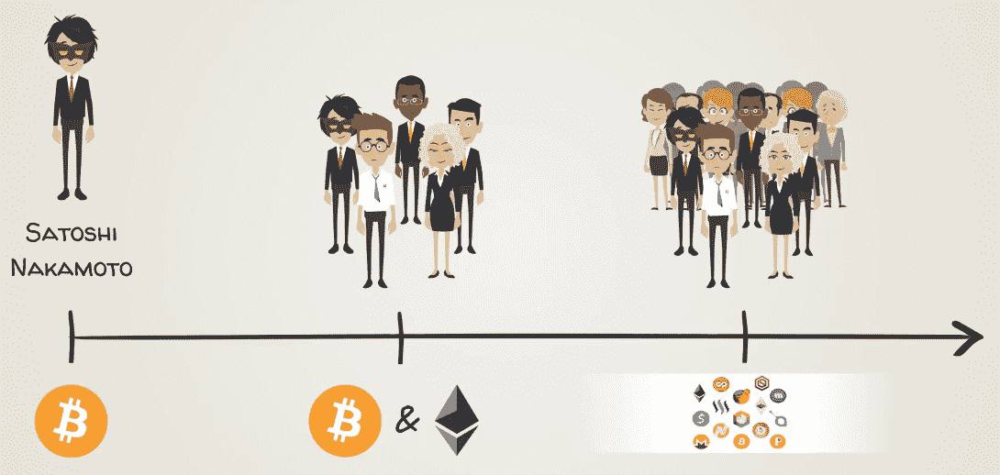
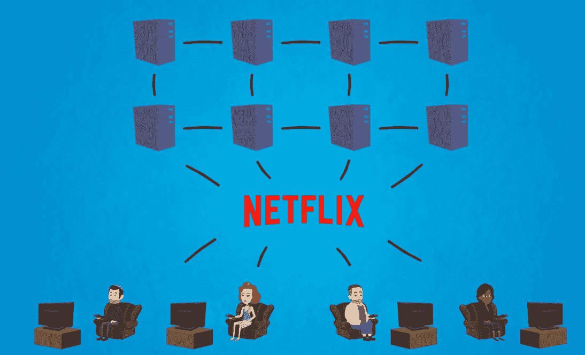
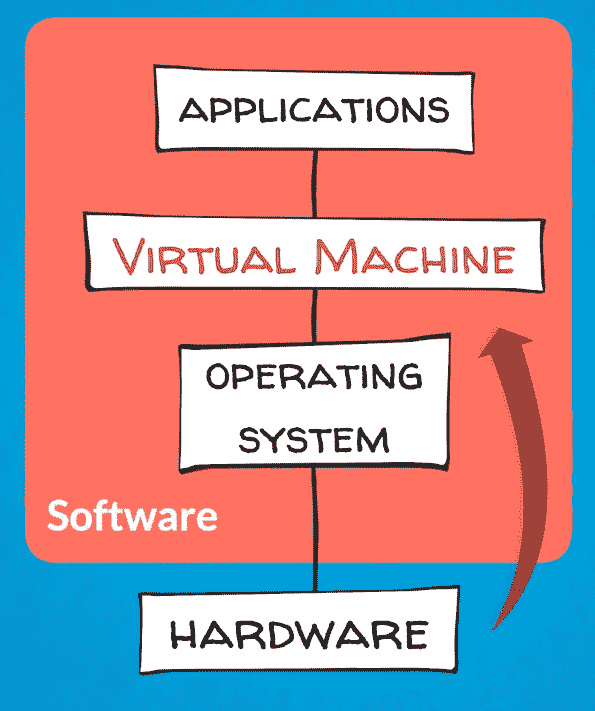
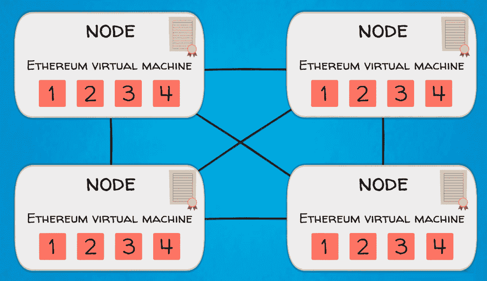

# 第九章：以太坊如何将区块链的理念推向了新的高度

现在您已经了解了塑造比特币技术的五大力量是如何运作的，我们准备介绍以太坊，这是第一个图灵完备的区块链平台。如果您还不完全确定图灵完备的含义，不要担心，我们将在本章中涵盖这一点。

本章将涵盖以下主题：

+   介绍以太坊

+   以太坊是如何诞生的

+   理解以太坊

+   以太坊虚拟机

# 介绍以太坊

正如我们在之前的章节中提到的，比特币播下了区块链技术和加密资产的种子，并迅速吸引了一群充满激情和奉献的爱好者和支持者。由聪明的系统 Satoshi 创建的新运动开始启动。势头呈指数级增长，并产生了创新的雪球效应。在区块链领域的进一步技术颠覆和突破是不可避免的。这些效应得到了比特币开源性质的支持。

许多开发人员开始通过创建替代加密资产协议来尝试比特币代码。这些新的替代区块链被称为**另类币**（因为它们是比特币的替代）。以下图表显示了比特币的演变：

在这个新领域中，迄今为止最大的影响和最重大的创新来自以太坊。这就是为什么我们将在这里广泛讨论它。

以太坊代表了区块链技术的第二代，具有超越支付和分布式资产账本的增强功能。其中一个关键领域是分布式计算。以太坊创始人 Vitalik Buterin 的愿景是创建一个分布式全球计算机，这是通过**以太坊虚拟机**（**EVM**）实现的。

以相同基本原则和技术为基础工作的以太坊：

+   区块链

+   密码学

+   工作量证明共识算法

+   点对点网络

+   软件代码库

与比特币和许多其他另类币不同的关键创新是其图灵完备的编程语言。图灵完备意味着以太坊的编程语言可以用于编程和运行几乎任何功能或任务。这使得更广泛的分布式应用程序可以被创建和部署。它为开发人员提供了完整的工具集，以进一步创新并在区块链上构建应用程序和业务。以太坊区块链作为整个经济和社会生态系统的骨干基础设施。这就是为什么大多数**分布式区块链应用程序**（简称**DAPPs**）目前使用以太坊平台。

正如我们将在后面看到的那样，这种更大的代码库的缺点是更大的攻击面和软件错误的风险，这是不可避免的。

让我们一步一步来看看，以太坊自问世以来的发展如何。

# 以太坊的诞生

以太坊的构想是由当时 19 岁的 Vitalik Buterin 于 2013 年提出的。 Vitalik 最初被吸引到计算机游戏中，这与他的许多同龄人类似。他的父亲，也是一名计算机科学家，向他介绍了比特币，Vitalik 对此表示赞同，并开始兴致勃勃地探索。他于 2011 年共同创办了《比特币杂志》，并在那里担任记者。他还参与了有色硬币项目。您可能还记得我们在有关比特币的上一章节中详细介绍过的有色硬币。它们使得在比特币区块链上实现智能合约和数字资产的基本实现成为可能。Vitalik 希望扩展有色硬币的概念，以使其能够在区块链上运行更大、更灵活和更强大的应用程序。当他在比特币核心开发人员中遇到对他想法的阻力时，他决定启动自己的项目，并从头开始设计。

Vitalik 是一位多产的区块链思想领袖。即使在以太坊取得全球成功之前，他的才华也得到了认可。在很小的时候，他就被放进了一个为天才儿童设立的班级。他在 18 岁时在 2012 年的国际信息学奥林匹克竞赛中获得了一枚铜牌。2013 年，他撰写了概述他愿景的以太坊白皮书。

2014 年，Vitalik 获得了 IT 软件世界技术奖，与其他杰出的获奖者一起，如埃隆·马斯克因能源获得奖项。

同样在 2014 年，他获得了著名的蒂尔奖学金，并辍学于滑铁卢大学，全职致力于以太坊。

# 蒂尔奖学金

蒂尔奖学金由亿万富翁企业家和投资者彼得·蒂尔创建，他是 PayPal 和 Palantir 的联合创始人，这两家公司都成为了价值数十亿美元的公司。他是一位知名的风险投资家，也是 Facebook 的第一位外部投资者。通过他的奖学金，彼得·蒂尔的目标是赞助那些离开传统大学路径，去追求具有高全球影响力的项目的年龄不超过 23 岁的才华横溢的年轻人。这样的项目可以包括科学研究、初创企业或社会企业。由于入选率不到 1%，该奖项被认为比获得世界顶尖大学的录取更具竞争力。

在获得蒂尔的一些资助后，Vitalik 继续集结了一支才华横溢的联合创始人和开发人员团队，推进他对以太坊的愿景。哦，天哪，这是一个宏伟的愿景！该团队希望创造 Web 3.0，这是一个更加去中心化和更加智能的下一代互联网，由以太坊提供动力。

由于他们需要更多资金，创始人在 2014 年 7 月发起了一个**首次代币发行**（**ICO**），这实际上是以太未来平台的本地加密资产以太的预售。他们设法筹集到了价值约 1800 万美元的 Vitcoin，这是他们接受捐款的货币，这代表了当时最大的 ICO。这种通过众筹筹集初始资金的方式即将在接下来的几年中广泛采用并经历指数增长。我们稍后会更多地讨论 ICO。

在获得足够的资金之后，创始团队还有许多个月的艰苦工作要做，直到以太坊网络于 2015 年 7 月上线。

让我们深入了解一下吧——欢迎来到区块链 2.0。

# 理解以太坊

如果我们想要理解以太坊，可能最好的起点是看一看它的白皮书。所以，让我们看看它的创始人是如何描述它的，好吗？

以太坊白皮书开篇如下：

*“2009 年中本聪开发比特币经常被誉为货币和货币领域的一项激进发展，因为它是数字资产的第一个例子，同时没有支持或“内在价值”，也没有中央发行者或控制者。然而，比特币实验的另一个，可以说更重要的部分是底层的区块链技术作为分布式共识工具，注意力迅速开始转向比特币的这一方面。区块链技术的常见替代应用包括使用基于区块链的数字资产来代表自定义货币和金融工具（有色硬币）、底层物理设备的所有权（智能财产）、非同质资产，如域名（Namecoin），以及涉及由实施任意规则的代码片段直接控制数字资产的更复杂应用（智能合约），甚至是基于区块链的去中心化自治组织（DAO）。以太坊意图提供的是一个内置完全成熟的图灵完备编程语言的区块链，可以用来创建合同，这些合同可以用来编码任意状态转换函数，允许用户创建这里描述的任何系统，以及我们尚未想象到的许多其他系统，只需编写几行代码即可。”*

白皮书告诉我们的是，区块链技术在支付之外还有许多潜在用途。以太坊将技术推向了更远的地步，对该领域的先锋比特币进行了创新。这是一个非常雄心勃勃的计划，不是吗？

以太坊提供了工具来促进自定义数字资产、金融工具和去中心化应用程序的创建。每个人都可以使用开源以太坊协议启动自己的项目，并创建数字资产、DAPP 或整个 DAO。

区块链上的数字资产被称为**智能财产**，意味着任何实物资产，如黄金、房地产、股票、债券、艺术品等，都可以由代币代表，并存储或在分布式分类帐上交易。

此外，智能合约使得能够创建复杂的金融工具和应用程序成为可能。通过这种方式，智能财产可以被包含在智能合约中，并在合同中编程的特定条件下交易。还记得我们在比特币章节中的贸易融资例子吗？在产品交付需要时间的交易中，可以设置智能合约，使其在货物成功交付给买方时将资金释放给卖方。

结合智能财产和智能合约可能会导致 DAO，其中整个组织的业务逻辑都被编程为一套复杂的智能合约系统。目前，如何在实践中实现这一点还有待观察。

如前所述，这些想法在以太坊之前已经被各种项目探索过。然而，以前的项目使用的是比特币和其他不太适合该目的的区块链协议，而以太坊是专为此目的而设计的。

以太坊协议及其开发团队不直接创建或支持分散式应用程序，但它们为开发人员启动它们提供了工具、构建块和基础设施。以太坊以一种创新和有意义的方式将区块链概念推向了加密货币之外。

接下来，我们将更仔细地了解以太坊的一些关键要素。

# 以太坊虚拟机

此时你可能会想—天啊！又是一个虚拟的东西！我们必须习惯抽象概念，如虚拟货币、虚拟资产，现在又在谈论虚拟机？！嗯，我们生活在数字信息时代，所以虚拟商品和虚拟现实将越来越普遍地出现在我们的日常生活中。因此，逐步熟悉这些概念是有用的。虚拟机是一个相当抽象的概念，所以我们将尝试从多个角度解释它，以便更容易理解。

# 虚拟机简介

虚拟机在分布式计算中并不是一个全新的概念。随着互联网的持续发展，迁移到云端的软件产品和服务的数量一直在稳步增加。商业模式和信息基础设施已经演变和适应了网络的新范式。与其在同一台计算机上存储和处理所有内容，不如共享和分发计算资源更有效和高效。以下是其中一个示例：

云计算和虚拟化概念基于计算机系统不同组件之间的分离。在顶层，我们有硬件和软件。然后，我们可以将不同类型的软件分解为其他层，如软件操作系统和软件应用程序。

虚拟机是另一个构造，它位于计算机硬件或标准操作系统（如 Windows）的顶部，并与各种应用程序进行交互。虚拟机基本上创建了一个可以与硬件分离的虚拟操作系统环境。就像网络中的任何其他虚拟机一样，它与网络隔离，但是它是网络的一部分。

这种远离网络的隔离使其不易受到黑客威胁或任何数据损坏的威胁。这允许整个操作系统被复制并从一个硬件设备粘贴到另一个硬件设备，就像任何其他文件一样（类似于视频、图片或文本文件）。这种虚拟化是云计算的一部分，目前非常流行。下图显示了虚拟机的架构：

如前图所示，**操作系统**（**OS**）及其应用程序共享来自单个主机服务器或主机服务器池的硬件资源。每个虚拟机都需要自己的底层操作系统，并且硬件是虚拟化的。虚拟机监视器或虚拟机监视器是创建和运行虚拟机的软件、固件或硬件。它位于硬件和虚拟机之间，对于虚拟化服务器是必不可少的。

越来越多的软件产品和服务正在云平台上提供，这意味着它们是基于互联网进行分发的。微软办公套件及其 Word、Excel 和 PowerPoint 应用程序，这些应用程序几乎成为了 20 世纪 90 年代和 21 世纪初的软件代名词，如今也有了它们基于云的替代品，如 Google Docs、Google Sheets 和 Google Slides。

越来越多的企业和消费者正在转向云解决方案。

Salesforce.com Inc. 是另一家颇受欢迎的**软件即服务**（**SaaS**）公司，它在云上提供**客户关系管理**（**CRM**）和其他企业软件服务。它以全新的商业模式引领了潮流，并开始与传统企业软件巨头如甲骨文和 SAP 竞争。考虑到云计算的颠覆性和高效性，所有传统行业领导者很快就跟进推出自己的云解决方案。

向基于网络的服务转移在很大程度上得益于 Java 编程语言和**Java 虚拟机**（**JVM**）的出现。因为它们使得创建大规模 Web 应用程序变得更加容易。使用 Java 编写的应用程序可以在任何 JVM 上运行，而不受底层计算机系统架构的限制。

以太坊为区块链世界引入了虚拟机概念。EVM 使得标准化的智能合约和去中心化应用程序能够在区块链上创建和运行。这是通过使用图灵完备的编程语言实现的，例如 Solidity，这是以太坊开发团队特意设计的。图灵完备意味着它是通用目的或计算上的通用，换句话说，它可以用来编程和执行几乎任何功能或任务。这种设计使得以太坊成为了去中心化应用程序的理想环境。以下图显示了 EVM 如何与其他组件协同工作：

例如，考虑一下 EVM 中的安全性。黑客们非常顽固，他们一直试图攻破区块链平台，企图窃取加密货币。最近他们在一些其他平台上取得了成功，但在以太坊平台上没有成功，这是因为 EVM，因为它已经成为了平台对抗黑客的屏障，使得入侵以太坊平台变得非常困难。为了保护平台，EVM 倾向于保护平台的防火墙，并加强安全措施。这确保了系统中存在的代币和交易的安全加密。

现在我们可以推断出技术的长期趋势，从 70 年代和 80 年代初微软和甲骨文等公司推出的原始软件应用程序，到 90 年代末和 2000 年代初由谷歌和 Salesforce 开创的基于云的但仍然集中式服务，再到未来的去中心化应用程序。基于区块链的去中心化应用程序可能会成为计算机技术的下一个大事件，这将与当前可用的云解决方案相辅相成和竞争。我们将在接下来的章节中详细介绍这一点。

# 总结

在这一章中，我们学习了有关以太坊的所有知识，以及它如何改变了互联网。我们了解了以太坊是如何被发明出来的以及为什么。我们还学习了以太坊如何利用 EVM（以太坊虚拟机）来创建去中心化应用程序。

我们了解了由 EVM 提供支持的广泛范围的智能合约和去中心化应用程序。在接下来的章节中，我们将重点介绍以太坊为世界带来的一些关键创新。
