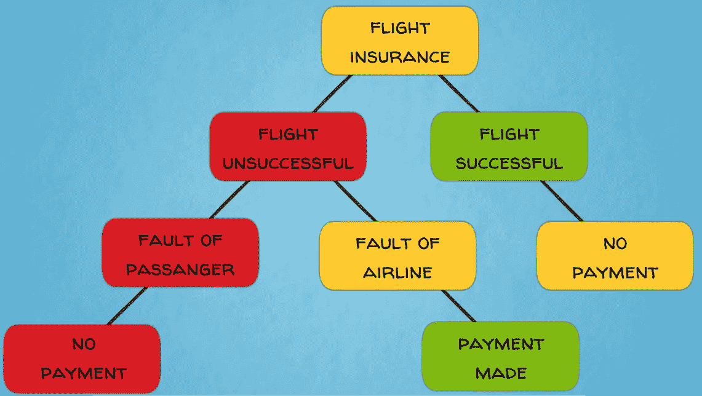
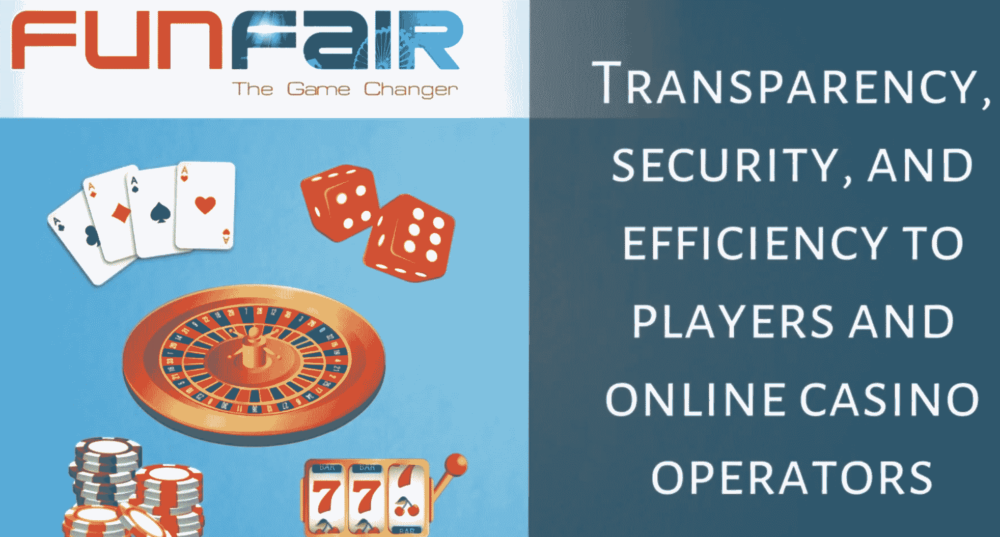
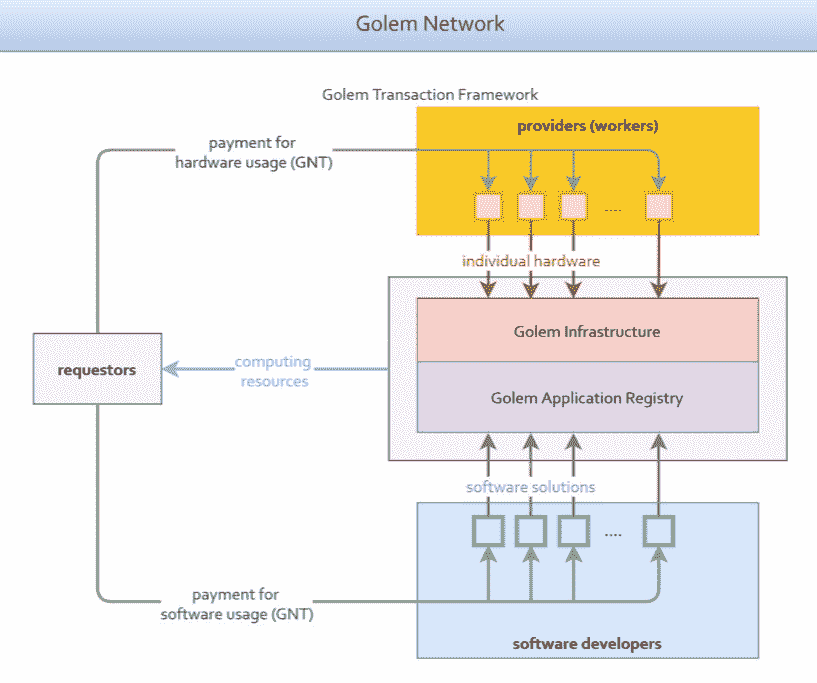
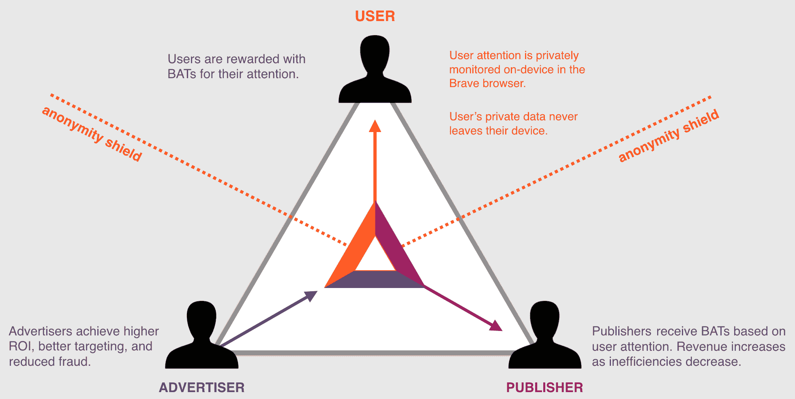
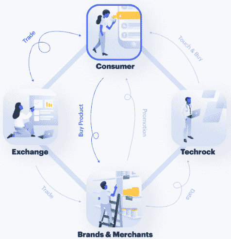
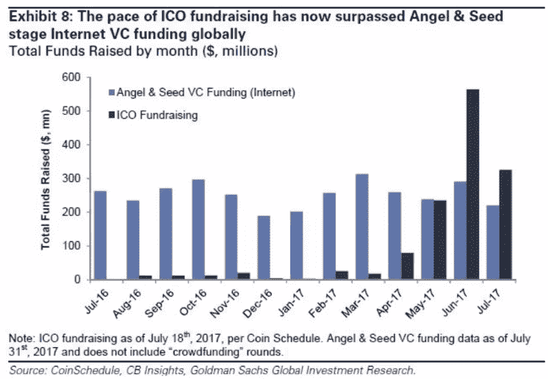
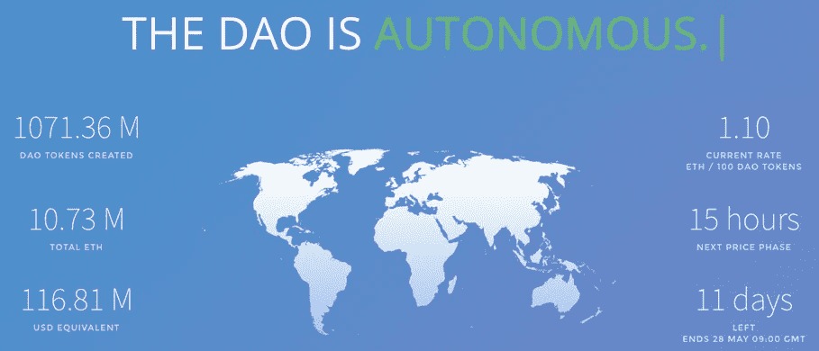

# 第十章：以太坊——全球化的去中心化应用平台

在本章中，我们将讨论以太坊，我们称之为区块链 2.0。正如你很快就会发现的那样，以太坊通过其完整和灵活的编程语言将智能合约和智能资产推向了一个全新的水平。这打开了更广泛的机会和未来概念，例如去中心化自治组织，这些组织可能会在很大程度上自动管理，减少人类的介入。尽管如此，底层的区块链架构仍然与比特币相似。这突显了比特币区块链的成熟技术突破和基础重要性。

尽管如此，区块链领域正在经历大规模的发展和持续的创新，因此我们应该期待更多有趣的项目出现。本章将涵盖以下主题：

+   基于以太坊的去中心化应用

+   以太坊的工作原理

+   去中心化自治组织

# 基于以太坊的去中心化应用

我们已经了解到比特币是第一个为点对点支付设计的公共区块链系统。它是首屈一指的加密资产。

以太坊将区块链技术推向了一个新的阶段，旨在成为一个全球化的去中心化计算平台。它开创了第二代公共区块链技术。以太坊的目标是雄心勃勃且有进取心的：它旨在在区块链上实现一个大型的去中心化应用生态系统，从而创造一个更去中心化的万维网版本——这个项目被称为**Web 3.0**。

好的！那么，这些去中心化应用会是什么样子呢？

# 去中心化应用的类型

我们可以广泛地区分以太坊白皮书中概述的三种主要应用类型。

第一种类型是纯粹的金融应用，通过智能合约提供复杂的金融产品和解决方案。这些可以包括保险、金融衍生品、贸易结算的托管账户、金融信托和众筹。一个很好的例子是来自一家名为 Etherisc 的公司的应用，该公司正在开发基于以太坊智能合约的保险政策。他们已经推出了航班延误保险的工作产品，该产品在航班延误或取消时会自动向乘客支付保费。这个解决方案为客户带来了明显的优势，因为一旦触发了覆盖事件，他们就会自动收到保费，无需延迟。通常情况下，要获得航班延误或取消的退款是一个麻烦而冗长的过程，充满了官僚主义，可能会拖延几个月甚至几年。我们都知道航班准点率有多么低。因此，Etherisc 为客户带来了明确而引人注目的价值主张，而这些客户通常受到航空公司和传统保险公司的不公平对待。这种新的解决方案是由以太坊驱动的。

您可以在以下图表中看到 Etherisc 的保险智能合约的业务逻辑：

另一个主要类别的应用程序是具有某种金融角度的应用程序，可能涉及在平台上使用货币，但也有重要的非货币组成部分。它们可以用于游戏、博彩、预测市场，以及任何产品或服务的去中心化点对点市场。一个基于以太坊的这样的应用程序是 Fun Fair。它提供一站式在线赌场技术，可以由任何人、任何地方使用作为白标解决方案来创建在线赌场。通过区块链和智能合约的帮助，Fun Fair 为玩家和在线赌场运营商带来了透明度、安全性和效率：

关于点对点市场，一些主要的用例包括去中心化数据存储、计算、网络托管、电力交易以及媒体和内容分发平台。几乎任何你能想到的资源和市场类型都可以从点对点共享经济中受益。

例如，像 Golem 和 SONM 这样的项目正在基于以太坊构建去中心化的闲置计算能力市场。他们的愿景是通过他们的分布式平台使参与者能够共享和交易未使用的计算机处理能力。

这一概念类似于共享经济中 Airbnb 通过其租用未充分利用的房地产平台所创造的。这样，**Golem** 和 **SONM** 旨在创建一个利用全球范围内所有闲置个人电脑的全球超级计算机网络。过剩的计算能力可以被科学家、企业或需要运行大量计算的消费者使用，而提供这些资源的人可以得到回报。所有交易都由智能合约自动执行，并且受益于直接的去中心化点对点交互，从而最大限度地为用户创造价值。所有这些经济活动都受益于以太坊区块链的安全性和可编程性。以下图表显示了 Golem 的流程：

按照类似的逻辑，Power Ledger 和 WePower 正在构建去中心化的点对点电力交易平台和可再生能源项目的资金筹集。这两个平台都运行在以太坊上。

另一个有趣的项目，**Substratum** 正在基于以太坊构建一个去中心化、抗审查的点对点网络托管平台。这个平台解决了网络安全和网络中立性这两个重要的全球问题。网络中立性是指互联网上的所有数据都应该由 **互联网服务提供商**（**ISP**）公平和平等地处理的原则。在这里，为网站托管提供闲置计算资源的提供者通过区块链上的交易获得奖励。

另一个有趣的例子来自**Basic Attention Token**（**BAT**）。该项目通过其分散式广告市场为广告行业引入了创新概念。它为所有涉及方提出了一种更优越的经济模型–广告商、发布者和*消费者*。该项目由 Brendan Eich 领导，他是 JavaScript 编程语言的创建者和 Mozilla Firefox 浏览器的联合创始人，这是一款流行的网络浏览器。该解决方案利用以太坊区块链上的智能合约来将在线广告消费者关注转化为令牌并交易，就像任何其他商品一样。BAT 平台使用其本地代币和智能合约在广告生态系统中分发价值。Brave 浏览器是该系统的一个重要组成部分–它阻止第三方广告和跟踪器，并使用嵌入式和透明的机器学习算法来衡量用户对在线内容的关注。用户配置文件受到匿名协议和功能的保护，但仍提供对平台上定向广告有用的数据。用户通过关注获得奖励与本地代币; 换句话说，他们被付费观看广告。这是一个完全颠覆性的概念，因为到目前为止，还没有一种奖励机制让消费者将他们对广告的关注转化为货币。在平台上没有数据经纪人这样的中间人，他们通常会收集个人信息、对其进行汇总、建立消费者资料并将其出售给广告商，从而将人们的个人数据货币化。去除这样的中间人会为消费者、发布者和广告商创造效率和价值。BAT 的智能合约自动按照以下方式在生态系统中分配价值流动：广告商向用户发送附带广告的本地代币支付，用户观看广告时，智能合约解锁资金并向用户、Brave 平台和发布者发送支付。因此，这些是由智能合约促成的多方交易。该市场从以太坊区块链的分散、安全和可编程特性中受益。

以下图表显示了 BAT 的工作原理：

然后，我们有应用程序，它们离金融服务领域更远，但仍从区块链架构和智能合约中受益。尽管这些应用是非金融的，但其平台上的服务仍然会有成本需要支付，通常是以它们的本地代币支付。此类应用包括供应链管理应用，例如跨行业供应链跟踪组件、声誉系统、数字身份、投票和分散式治理。

你可能记得 WaBi。它是一个用于供应链管理的去中心化应用程序，旨在解决假冒消费品的问题。产品真实性验证是由消费者自己完成的，他们用智能手机扫描产品上的特殊射频识别（RFID）标签来完成验证。**RFID**代表**射频识别**。这些标签被应用在供应链上的特定起点上，并与每个产品的唯一数字 ID 相关联。每次扫描 RFID 标签时，产品 ID 都会被检查和验证。对于每次扫描，用户都会获得 WaBi 代币作为奖励，目前这些代币运行在以太坊区块链上。通过奖励交易，产品 ID 验证会在区块链上进行时间和地理戳记。WaBi 代币既是奖励积分的激励机制，也是购买系统保障产品的货币。WaBi 已被重新命名为 Tael。以下图表显示了 WaBi 的运作方式：

在投票和去中心化治理应用方面，一个有趣的例子是**Horizon State**。他们利用以太坊区块链构建投票系统。投票是通过他们的原生决策代币进行的，这可以用于各种政治选举、民意调查和股东投票。区块链为投票流程带来的安全性和不可变性都非常重要。

我们已经通过 Web 3 的去中心化应用程序的广阔宇宙走了相当长的一段路程，你现在应该很好地了解它们的全部内容。现在让我们来介绍以太坊平台的另一个重要方面。除了作为构建去中心化应用程序的环境外，以太坊还为这些项目提供了一个众筹的平台。接下来让我们看看这是如何运作的。

# 以太坊和首次代币发行

以太坊已经让任何人都可以轻松在其区块链上创建和发行虚拟代币。这是通过标准化的以太坊智能合约（如 ERC20）完成的。这样，人们、企业或政府可以利用以太坊区块链发行自己的虚拟货币、资产或应用代币，而无需构建自己的区块链。

基于以太坊发行新的数字代币或硬币的便利性激发了一大波在以太坊区块链上创新并为其项目筹资的新创企业。资金以**首次代币发行**（**ICO**）的形式进行，也被称为代币生成活动。通过这种方式，初创企业可以发行可以在其未来平台上交换服务的数字代币。他们也可以发行代表金融工具，如股权份额的代币。这两类代币通常被称为实用和安全代币。这种机制被证明是区块链上的众筹的巨大促成者。它甚至超过了传统早期阶段创业风险投资多次，这是初创企业筹集资金的典型方式之一。可以在以下截图中看到：

基于以太坊代币进行 ICO 的项目，可以快速方便地发行代币，并保留灵活性，以后可以在以太坊区块链上提供其未来的服务，或者构建自己的区块链。这是一个需要根据具体情况做出的业务决策。

一些商业应用可以因为行业特定原因或可伸缩性问题而受益于自己的专用区块链。以太坊区块链目前没有无限容量来处理所有应用及其交易，以满足大规模采用所需的规模。以太坊仍然是一项处于早期阶段的实验性技术。因此，需要进一步的进展来将其升级到一个使其网络足够强大以处理大型去中心化应用生态系统所有流量的有用状态。

需要注意的是，以太坊不是第一个，也不是唯一一个用于去中心化应用和 ICO 的区块链平台。比如，许多人称之为中国的以太坊的 NEO 就是另一个这样的平台。甚至比特币也有智能合约功能，可以用于此，正如我们在讨论有色硬币和**Counterparty**项目时看到的那样。

另一个去中心化应用平台是**Mastercoin**，后来更名为 Omni。Mastercoin 在 2013 年进行了自己的 ICO，筹集了价值 500 万美元的比特币，用于在比特币区块链上构建其协议层。

利用 Mastercoin 协议进行 ICO 的最显著案例之一是 MadeSafe——一个分布式计算资源平台，例如文件存储和处理能力。这种应用在某种程度上类似于流行的云存储服务，如 Dropbox、Google Drive 或 Amazon Cloud，但它是基于区块链的去中心化应用，并且租用其网络节点的空闲磁盘空间，而不是集中服务器。

**Storj** 是另一个分布式数据存储项目。最初，他们在 Counterparty 协议上构建平台，依赖于比特币区块链基础设施。后来，Storj 团队决定将应用程序转移到以太坊区块链，并发行了标准的以太坊 ERC20 代币。

另一个名为 **Civic** 的项目正在朝着相反的方向迈进。Civic 是一个用于个人身份验证的去中心化应用。他们通过在以太坊发行代币来开展他们的 ICO 项目，但是现在借助 Rootstock 将他们的平台转移到比特币区块链上。 **Rootstock**（**RSK**）是一个在比特币区块链上运行的分布式应用平台。它旨在将以太坊类型的智能合约与比特币区块链的安全性结合在一起，后者是无与伦比的。

为了进一步说明这一点，我们可以将去中心化应用与移动应用进行比较。项目可以选择他们去中心化应用的首选平台，就像他们可以为安卓或苹果手机开发移动应用一样。安卓和 iOS 是两个具有自己协议和应用商店的独立平台。任何移动应用都可以为任一平台构建，用户界面可能看起来相同，但是每种情况下的应用程序代码是不同的。

当然，项目始终有选择构建他们自己的区块链的选项。**Sia** 和 **Filecoin** 是另外两个分布式数据存储应用，它们正在构建自己的区块链，而不是使用以太坊或比特币。在接下来的章节中，我们将更多关注特定应用和行业的区块链。

这里要强调的重要一点是，存在着各种区块链平台可供去中心化应用使用。它们提供了开发和启动这类应用的通用技术。目前以太坊是去中心化应用和 ICO 的首选平台。

现在，你应该对去中心化应用有了一个很好的了解。让我们更进一步地讨论以太坊创始人设想的更为宏伟的想法：去中心化自治组织。

# 去中心化自治组织

**去中心化自治组织**（**DAOs**）被设想为在区块链上完全自动化、透明和公开管理的自治实体。

这些实体也可以被称为 DACs。投资者、所有者、雇员和其他利益相关者之间的关系，以及这些企业的资产和资源，是由区块链上的智能合约管理的，而不是由法律合同和组织章程管理。

想象一组智能合约根据组织的使命宣言和一组逻辑规则合作管理一个组织。它们可以根据计划自主执行业务策略。它们可以购买资源或服务，雇佣人员或机器进行工作，支付供应商、合作伙伴和员工，进行营销活动、物流、分销、销售等，以创造价值给他们的所有者。当然，我们还没有到那个程度！但是我们已经有了很多构建模块。因此，我们可以思考设计一个未来没有管理者，只有股东、资金和软件的公司，股东将提供资金并直接控制日常运营的软件。

DAO 目前更多是一个哲学概念，而不是一个严格定义的类型的企业或社会实体。这是一个针对组织理论和设计下一个演化步骤的愿景，朝着更加分散化和自治的方向发展。

可以说所有的公共区块链，从比特币开始，事实上在一定程度上代表了 DAO。然而，没有图灵完备编程语言的区块链具有有限的智能合约能力。DAO 需要能够表示复杂利益相关者关系和商业逻辑的智能合约。

比特币、以太坊和其他区块链协议和系统可以被视为通用技术，可以实现 DAO 的创建和运作。在这个意义上，DAO 可以被描述为在区块链上运行的去中心化应用程序，其治理和运营方式。

在这里，对于所有实际目的而言，重要的是 DAO 可以在其管理中有很少甚至没有人类参与。所有行政和业务流程都可以在智能合约中编程，至少在理论上。只有在维护和升级智能算法时可能需要人的介入。

您知道近年来许多制造过程已经使用机器自动化了（比如在高科技工厂中组装汽车的机器人手臂）。DAO 代表组织管理中的等效自动化。

为了使 DAO 更加自治，在未来它们可能包含人工智能，以形式实现在智能合约中的机器学习算法。这种基于 AI 的智能合约被称为**自主代理**。然而，实现这种高科技解决方案仍然几乎是科幻范畴。

如果人工智能确实融入这一领域，事情就会变得非常有趣。例如，机器学习可能使 DAO 能够自行维护和升级其软件和硬件，而无需人类的帮助。未来 DAO 的前景仍有待观察。希望我们能够避免召唤出“终结者”电影中的天网或“黑客帝国”中的史密斯特工…

# DAO

还有一件事情我们应该澄清有关 DAO 的。在 2016 年，一个名为 **The DAO** 的项目发起了一次价值 1.5 亿美元的 ICO，这是当时最大的 ICO。资金以以太坊的本地加密货币：以太币的形式进入。The DAO 团队收集了 1150 万以太币，这占当时所有以太币的 15%。The DAO 的想法是成为一个分散的、自治的、风险投资基金，没有任何管理层或董事会，代币持有者直接对投资机会和项目未来发展进行投票：  

  

不幸的是，其智能合约的代码存在一些严重的缺陷，最初未被开发团队注意到。然而，社区注意到了这些问题，一些专家表达了他们的担忧。尽管收到了警告，项目仍在进行，不久之后，它就被黑客攻击了。募集的以太币中约有三分之一被转移到了黑客控制的账户中。为解决这一情况，以太坊核心开发团队不得不对以太坊软件进行升级，被称为硬分叉，导致以太坊网络分裂成以太坊和以太坊经典两部分。这就是为什么当前存在两个以太坊网络，每个网络都有自己的本地加密资产和生态系统。它们至少在硬分叉时共享相同的技术基础。然后，以太坊社区的一部分支持撤销 DAO 黑客攻击，而另一部分则坚持保护区块链的不可变性。考虑到黑客攻击的重要性和后果，大多数社区支持了硬分叉，因此以太坊最终成为了主链。

少数坚定的区块链极端主义者坚持将 DAO 黑客攻击事务保留在区块链中，因此他们支持了以太坊经典，这是具有整个交易历史记录的原始以太坊区块链，但目前拥有较小的社区、市值和生态系统。自硬分叉以来，以太坊和以太坊经典已经走上了不同的发展道路。

很重要的一点是要区分泛 DAO 概念和名为 The DAO 的具体项目。我们将在未来看到更多的 DAO。没有试验就没有创新，试验是一个试错过程。社区，更重要的是这些新项目的开发者们，应该吸取教训，努力避免未来出现这样的错误。

# 概要  

让我们总结一下我们对以太坊的讨论内容。

我们从介绍维塔利克·布特林开始，他是一位多才多艺的幻想家少年，于 2013 年 19 岁时提出了以太坊的想法。我们了解到以太坊的关键区别因素是其图灵完备性。以太坊虚拟机和 Solidity 编程语言实现了一整套可以编程执行几乎任何计算机任务或功能的智能合约。这一强大的创新解锁了创造运行在区块链上的整个去中心化应用程序宇宙的前所未有的机会。但它也带来了一些额外的软件漏洞和黑客风险，正如我们在 The DAO、Parity 钱包和其他多个事件中所见。希望随着时间和经验的积累，区块链领域的这些网络安全威胁将得到缓解并大大减少。

我们概述了一些去中心化应用程序的潜在用例，并举例介绍了一些正在开发这类应用程序的实际项目。我们还提到了更加雄心勃勃和未来主义的 DAO 概念。

迄今为止，在本书中，我们已经介绍了比特币和以太坊区块链协议以及在它们上运行的各种去中心化应用程序。在下一章中，我们将讨论一些拥有自己区块链的行业特定应用程序。随着我们深入探讨区块链技术的世界，敬请关注！
