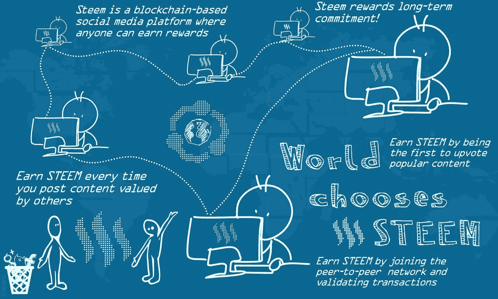
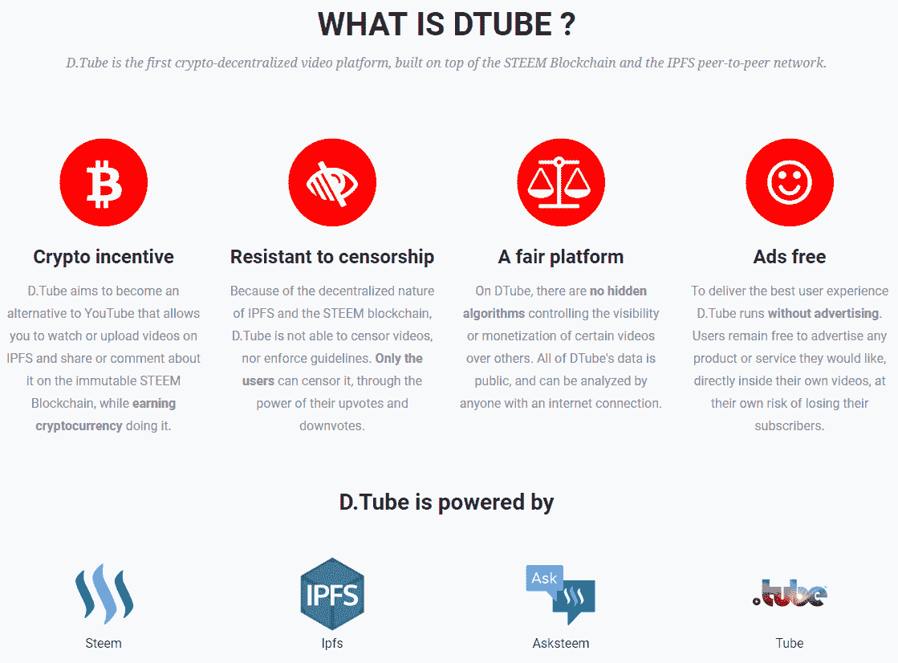
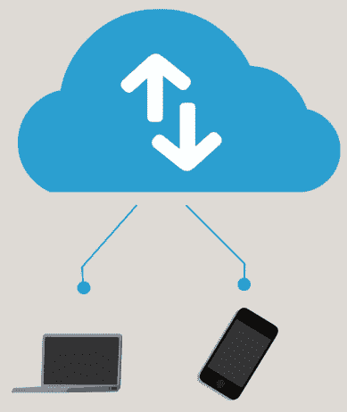
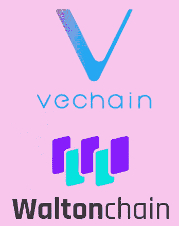
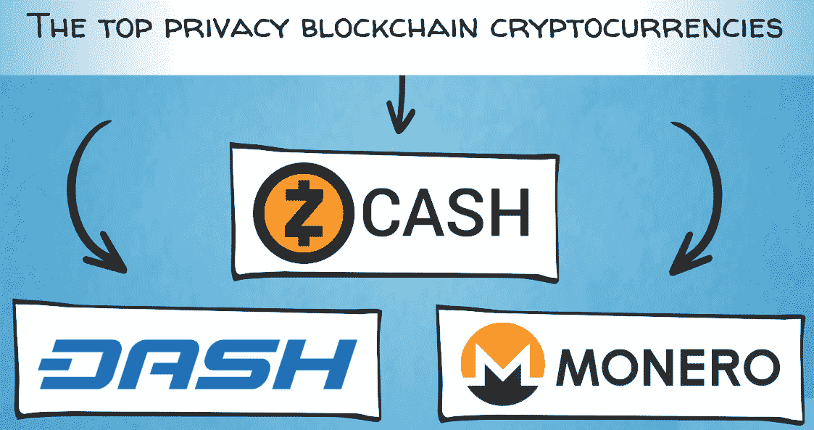

# 专注于特定行业和用例的区块链

欢迎回到我们的区块链之旅！到目前为止，我们已经涵盖了很多内容，从货币的历史和为什么区块链加密资产有意义到比特币和以太坊的基础技术。现在你已经对比特币和以太坊有了很好的理解，它们开创了这项技术的第一和第二代，我们可以继续介绍一些与这些技术相关的其他有趣项目。

本章将涵盖以下主题：

+   区块链的不同类别

+   部门特定的区块链

+   私有区块链

# 区块链的不同类别

正如我们在前几章中提到的，我们可以将区块链分为两大类，取决于它们的所有者是谁以及它们的可访问性如何。

首先，我们有公共区块链，这是开源项目，任何人都可以自由加入网络并使用它，支持它，为它做贡献，或者在其上建立业务。

随后，我们有私有区块链，这些区块链不是开源的，只有经过该组织批准的用户和实体才能访问和使用。

在这些类别中，有一些项目是具有通用性的区块链，例如以太坊；但是，也有一些特定应用的区块链存在。通用技术用于提供基础设施和构建块，以创建应用程序。例如，你可以参考基于以太坊的几乎任何去中心化应用程序。话虽如此，它本质上是一个一刀切的工具箱。

另一方面，定制的区块链或特定应用的区块链是具有行业特定用例的区块链。它们专注于一个领域或市场，其中它们构建创新的商业模式并提供利用区块链技术优势的解决方案。这些区块链专注于一个行业。话虽如此，它们仍然可以是开放源代码的，供所有人访问。

# 部门特定的公共区块链

让我们继续看看一些特定行业的公共区块链项目。

社交媒体领域一个有趣的公共区块链平台是**Steem**。它有一个创新的商业模式，鼓励用户贡献高质量的内容并参与平台。这些激励措施以 Steem 的本地加密资产形式提供，这些资产可以在交易所交易，并具有真实的货币价值。这背后有一个简单的理念：优质内容增加了平台的流量，从而吸引更多用户。社交媒体平台的用户越多，它的价值就越大。这被称为**积极的网络效应**。因此，在平台上贡献高质量内容或帮助筛选内容的成员会得到他们应得的价值份额。

该平台本身是 Reddit 和 Medium 的结合体，这两者都因特定主题的博客文章和社交评论而受到欢迎。与 Medium 一样，人们可以撰写和发布长篇博客文章，而像 Reddit 一样，他们可以从互联网的任何地方分享内容和链接。帖子由其他用户进行点赞、点踩和评论。以下图表详细显示了 Steem 的工作原理：

**DTube**将去中心化的社交媒体推向了更远的一步。它是一个视频分享和流媒体平台，类似于 YouTube，作为 Steem 区块链上的一个应用构建。它所运行的原则与 Steem 的原则相同：内容贡献者以 Steem 的原生加密资产获得奖励，但重点是视频而不是博客文章。去中心化的 YouTube 的主要优势在于更公平地向内容创作者和用户分配价值，没有烦人的广告，以及抗审查性。以下图表进一步解释了 DTube：

现在，让我们看看另一个工业应用：供应链管理和**物联网**（**IoT**）。

# 区块链和物联网

我们已经提到区块链在供应链管理中有用武之地，并介绍了一些基于 Ethereum、WaBi 和 Modum 构建的应用程序。我们可以将这个想法扩展到更广泛的用例：物联网。物联网可以定义为能够自主连接到互联网并彼此通信的智能设备网络。以下图表显示了物联网的流程：

实际上，你应该对这些设备非常熟悉；事实上，它们中的一个可能就在你的口袋里，你的智能手机。就像今天我们智能手机的大规模采用一样（记住，手机并不总是智能的），物联网的愿景是拥有智能电表、智能电网、智能汽车、智能家居，甚至智能城市。下一代物联网设备包括智能电表，它们会自动将房屋用电量的测量值发送给实用公司进行计费。这是智能家居、智能电网和智能城市的概念的一部分，各种家用电器和基础设施可以通过互联网彼此通信并自主执行任务。其他例子包括可穿戴设备、心脏监测植入物、用于标记和监测动物的芯片、智能联网汽车等等。几乎你能想到的任何物理对象或设备都可以设计成具有一定的计算智能和互联网连接性。物联网设备可以具有各种传感器和技术，用于收集、测量和传输数据，就像 WaBi 使用的 RFID 芯片或 Modum 使用的温度传感器和蓝牙一样。

一些其他值得注意的项目将物联网与区块链和智能合约自动化的安全和不可变记录结合起来，其中包括 VeChain 和 Waltonchain，它们正在推出自己的专用区块链：

所有这些项目针对不同的行业垂直领域，如消费品、奢侈品、制药、汽车行业、物流、航运等。它们也以略有不同的方式定制解决方案，通过使用不同类型的传感器、像以太坊这样的通用区块链或自己的专用区块链。然而，整体理念和业务应用是相同的；它们都试图通过物联网、区块链和智能合约技术的融合提供有效和高效的供应链管理解决方案。而这正是一个有效的**独特销售主张**（**USP**）。

我们的区块链应用景观正在逐渐扩大，但视野尚未被看到。接下来，我们将介绍关于隐私重点的区块链技术。

# 私有区块链

在当今时代，隐私已经变得越来越稀有和宝贵。互联网和智能手机等技术带来了前所未有的信息获取便捷性和速度。就像一切事物一样，这些发展有其利弊。积极的一面是，有用的信息、教育和知识可以迅速传播，并赋予全球人民力量。传统上受到信息不对称影响而处于劣势的世界各地的人们现在拥有了可以让他们平等追求个人发展目标和梦想的工具。然而，消极的一面是，同样的技术可以赋予拥有可疑议程的实体监视人们的能力，就像乔治·奥威尔于 1949 年出版的经典反乌托邦小说《1984 年》中的“老大哥”一样。

有恶意黑客侵入中央服务器窃取有价值的个人信息，没有人能完全免受其影响。几乎所有大型跨国银行、处理个人数据的数十亿美元公司（如信用评估机构 Experian）、科技巨头，甚至顶级安全政府机构如美国国家安全局（NSA）都曾遭受过这种情况。当存在明确有价值的目标或中央故障点时，黑客总是能找到方法。

此外，还有许多数据经纪人利用人们的个人信息谋取利益。他们合法或非法收集信息，进行分析，并将其出售给愿意支付的任何人——通常是广告商，但也包括政治活动，就像最近的 Facebook 和剑桥分析公司一样。

# 区块链如何影响隐私

当前，个人隐私保护与为更高目的而侵犯个人隐私之间的界限是公众争论的热点。鉴于迄今为止讨论过的社会技术进步，这是正常的。

隐私是一种令人向往的特性，不仅是对于罪犯，而且是对于普通人和不希望他们的个人和机密信息被第三方妥协和货币化的企业。鉴于公共区块链的透明度，许多企业可能不愿意使用它们来进行业务。有许多敏感的业务信息，例如与供应商的交易、数量和其他私人供应链详细信息，以及员工薪酬，可能不适合存储在透明的、公共区块链上。这些信息通常被保留为商业秘密，因为它可以成为重要的竞争优势的来源。

因此，在支持信息时代的技术的同时，一直在开发解决方案来保护隐私和减轻个人数据泄露风险。这些解决方案主要围绕着密码学。你可能还记得我们在第五章中的密码学概述，*比特币的五大力量-#2 密码学*。在这里，我们将看一些区块链加密资产，它们在隐私功能上取得了比比特币更进一步的进展。它们的重点首先是向市场提供出色的隐私解决方案。

人们普遍误以为比特币是一种匿名货币。实际上，它是伪匿名的，因为所有交易都可以被任何人使用像我们之前描述的区块浏览器看到。比特币交易不显示用户名，但它们显示其公共地址，然后可以将其与所有者关联起来。这可以在用户需要进行 KYC 或以其他方式披露其身份以进行交易的任何点上进行。此类网络节点可能包括交易所、其他受监管的金融机构、航空公司、电子商务网站或其他可能接受比特币付款的商家。

# 处理隐私的区块链加密资产

因此，需要其他解决方案来满足市场对私密交易的需求。要在数字货币中实现类似于现金的隐私水平非常困难。但是当出现问题和市场需求时，解决方案很快就会出现。因此，隐私币应运而生！Monero、ZCash 和 DASH 是在采用率、资本化和先进技术创新方面排名靠前的隐私重点区块链加密资产：

由于门罗使用环签名的密码学，它被普遍认为是具有最强隐私功能的数字货币。门罗的密码学比比特币和大多数其他加密资产的密码学更复杂，因此我们不会深入所有技术细节。但为了让你有一个概念，比特币的交易是用个人的加密密钥进行数字签名的，以便任何人都能看到发送者和接收者的地址，以及交易金额。这证明了发送者拥有被转移的资金。它在目的和效果上类似于从你的银行签发支票。

另一方面，门罗的环签名被描述如下：

“指定一组可能的签署者的数字签名，以便验证者无法确定哪个成员实际产生了签名。”

因此，在门罗（Monero）中的交易似乎是由一个大量的用户群体签署，而不是一个特定的用户。环签名仅证明该交易是由该群体中的某个人发送的，但并不公开确切的发送者。门罗协议允许在交易中完全保护用户的隐私，包括金额、来源和目的地，并且有一个机制来防止双重支付。在这些功能中，它与 ZCash 的零知识证明或 zk-SNARKs 类似，下一章我们将讨论这个。

ZCash 在 2016 年推出了一项新的隐私技术，名为零知识证明，使用 zk-SNARKs 协议。ZCash 为用户提供了选择性，他们可以发送常规交易，就像比特币那样，也可以发送私密交易，其中除了交易有效之外，不会透露任何信息。该项目由 Zooko Wilcox 领导，他曾于上世纪 90 年代是 David Chaum 的 DigiCash 的一部分。

DASH 是支持私密交易的另一种区块链加密资产。为此，它使用不同的协议，基本上将许多交易混合在一起，形成一种大型多方参与交易。通过这种方式，它混淆了每笔交易的不同组成部分，使外部观察者几乎不可能将各部分组合起来并弄清谁向谁发送了什么。

# 摘要

现在你已经了解了隐私及其在业务和日常生活中的重要影响。在本章中，我们了解了公共区块链及其对我们日常生活的影响。我们还了解了如何将区块链与物联网结合使用来增强各个领域。此外，我们了解了区块链如何影响隐私并帮助确保交易安全。最后，我们了解了一些加密资产以及它们处理安全性的方式。

在下一章中，我们将学习有关企业区块链的知识！敬请关注！
