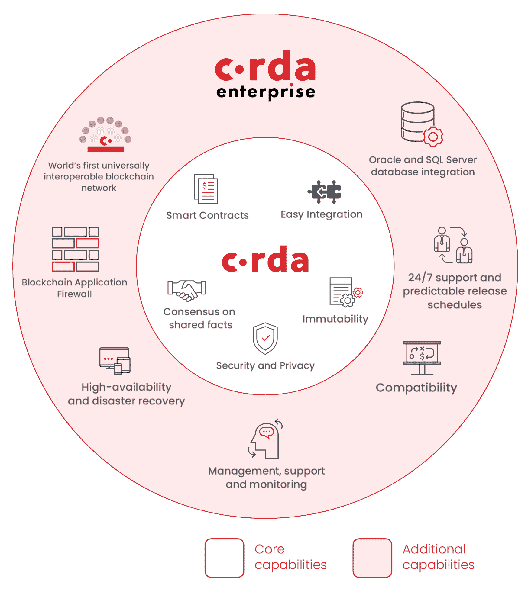
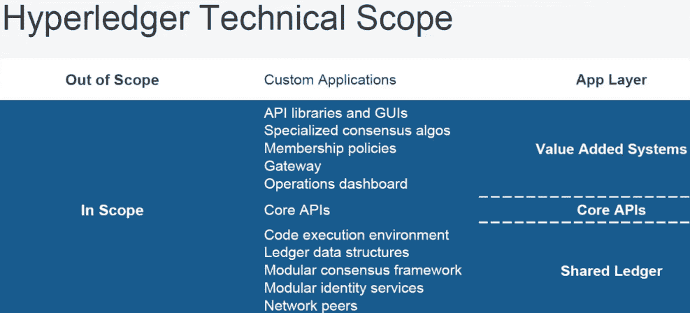
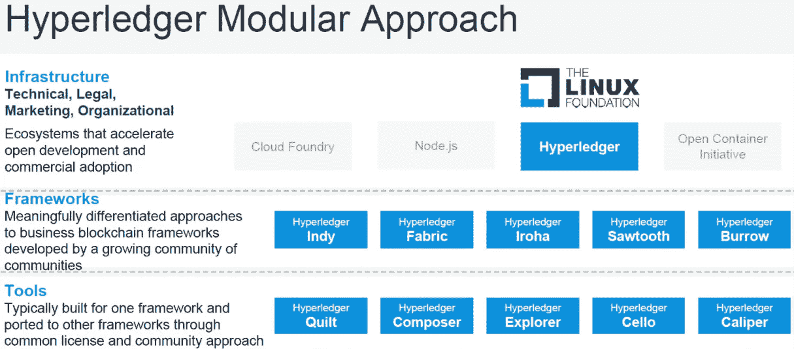
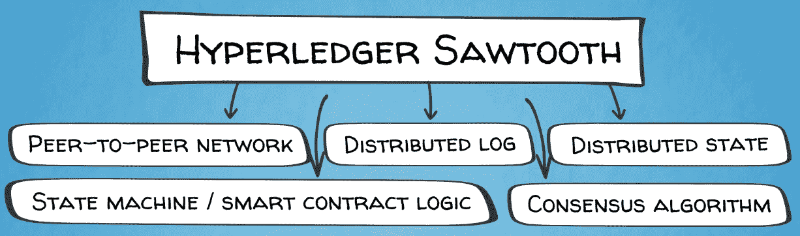
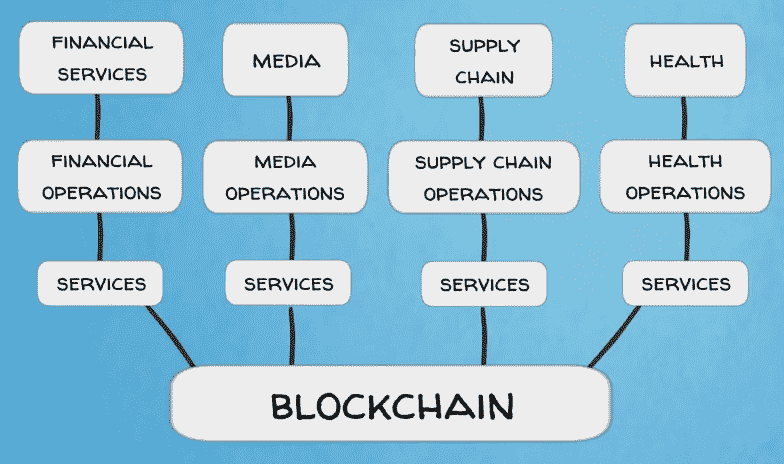
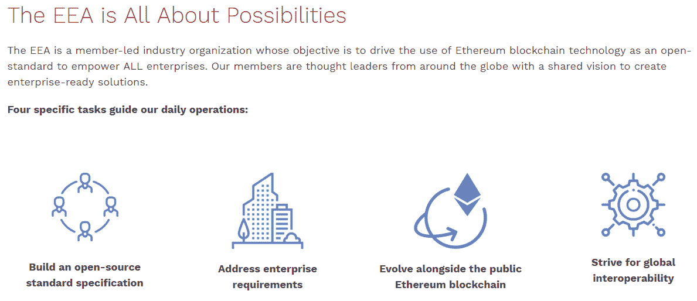
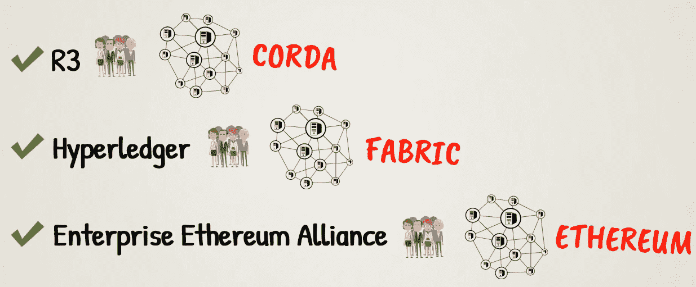
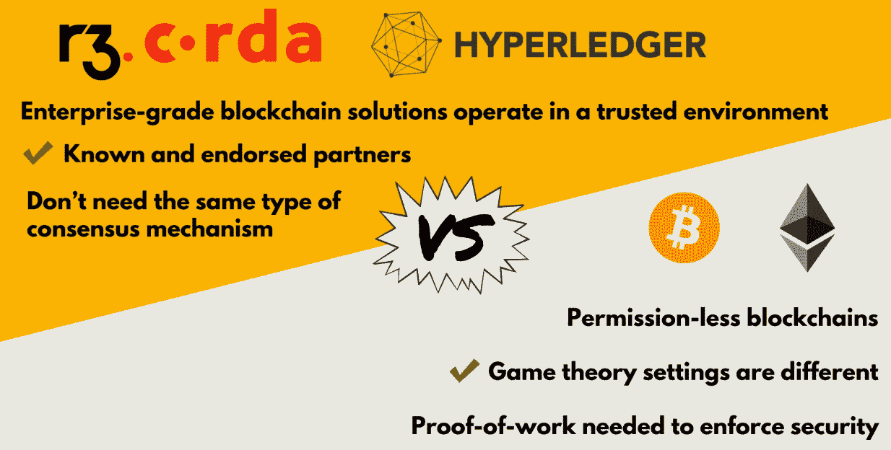

# 第十二章：企业区块链

在上一章中，我们了解了不同类型的区块链，如特定行业区块链和私有区块链。现在是时候描述另一个重要但大多数人不太熟悉的区块链宇宙的部分了：私有许可区块链，或者换句话说，企业区块链。在本章中，我们将涵盖以下主题：

+   企业区块链介绍

+   R3 Corda

+   超级账本

+   企业以太坊联盟

+   用于企业的私有区块链

# 企业区块链介绍

企业区块链与比特币、以太坊和迄今为止讨论的其他项目等公共区块链在一个关键方面大不相同：对网络的访问。在公共区块链中，任何人都可以下载一些开源软件，加入网络并使用它，在私有区块链中，对网络的访问是受限制的。企业、政府实体或其他组织可以构建自己的私有区块链来服务于其业务或行政目的。这样的私有区块链通常更加集中化，并且在其架构和功能上更接近于分布式数据库或分类账。这是因为它们不需要像比特币和其他公共区块链一样的去中心化信任模型。

如果所有的区块链参与者都是已知的，并且经过了预先批准和审查，那么就没有必要基于博弈论的复杂共识算法了。网络节点可以轻松地就最新版本的区块链数据库达成一致意见，因为它们都知道并信任彼此，因为它们都属于同一个组织。

正如我们在第十一章中提到的，*专注于特定领域和用例的区块链*，公共区块链可能并不适合所有情况和所有人。对于许多内部业务流程，私有区块链可能是更好的选择。

如今，全球范围内已广泛接受区块链技术对于企业、政府和个人用途的价值。大多数大型国际银行和其他金融机构已经开始开发自己的内部区块链项目几年了。成熟的科技公司，如 IBM，也加入了这一行列。同样适用于航运业领导者，如马士基，他们对区块链如何优化其供应链管理很感兴趣。这些大型企业发现，开发他们的区块链项目的最佳方式是相互合作，参与产业联盟、财团或合作伙伴关系。这可能涉及产业孵化器，其中初创团队与企业合作开发工业用途的解决方案。接下来，我们将看一些最重要的跨行业区块链发展财团。

# R3 Corda

R3 在 2015 年始于九家银行的联盟，旨在为金融领域开发区块链基础设施。到 2018 年，它已经发展到包括 200 多家金融机构。银行相信区块链技术可以通过使其运营更快、更高效和更透明来节省资金。他们正竞相利用这项技术开发能够带来新收入的产品，全球各地的银行已经提交了数十项基于区块链的产品的专利申请。

R3 的主要项目是 Corda，一种区块链，或者他们称之为**分布式账本技术**（**DLT**）平台，专门设计用于受监管金融机构之间的金融协议。 Corda 与我们已经熟悉的公共区块链（如比特币和以太坊）之间的主要区别在于，Corda 基于个别交易各方之间的共识，而不是整个网络的共识。 Corda 交易由交易各方验证，而不是广泛的无关验证者池。因此，Corda 中的整个交易数据库并不会复制到所有网络参与者。这种设计也不需要本地加密资产来激励和奖励矿工验证交易，因为 PoW 共识算法对私有部署是不必要的。 Corda 的架构直接支持监管和监督观察节点。分布式应用程序可以使用**Java 虚拟机**（**JVM**）在 Corda 上构建，这有助于用户采用并与传统系统实现互操作性。

尽管 Corda 的设计不同，R3 的首席技术官（或**CTO**），Richard G Brown，简洁地描述了导致 Corda 创建的演变步骤，从比特币开始，并赞扬了它给世界带来的卓越创新：

“正如我经常写的那样，比特币的架构是一个奇迹。其相互锁定的组件是那种极少见的例子，它们在事后看起来如此简单，但却需要一位罕见的天才来创造。区块链是为解决实际问题而发明的工具。我们得出结论，像比特币或以太坊或任何私有变体下面的区块链实际上提供了至少五个相互关联但不同的服务：**共识**、**有效性**、**唯一性**、**不可变性**和**身份验证**。”

# 区块链提供的核心服务

下面展示了区块链提供的各种服务以及这些服务的用途：

+   **共识**：这是区块链的第一个、也是最重要的功能，可能是真正新颖的东西。它使我们能够创建一个世界，在这个世界中，共享事实的各方知道他们看到的事实与其他利益相关者看到的事实相同。当然，共识系统和复制状态机已经存在多年了，但在互联网规模上、在不信任的参与者之间工作，并且能够抵御强大的对手？这是一个进步！在比特币中，共享事实是诸如：尚未花费的所有比特币（输出）在哪里，以及它们合法花费需要发生什么？这些事实在所有完整节点用户之间共享。在以太坊中，共享事实是抽象虚拟计算机的状态。

+   **有效性**：此功能涉及游戏规则，它定义了用于验证交易的一套明确的规则。

+   **唯一性**：此功能指的是除了遵循有效交易规则之外，此类交易还需要是唯一的。换句话说，不允许同时两次花费相同的钱。这就是比特币首次以分散方式解决的双花问题。

+   **不可变性**：此功能由系统强制执行，不是因为过去的交易是不可变的，而是因为其他网络参与者不会接受具有与他们个人存储的不同的过去交易历史的区块链。

+   **认证**：此功能指的是所有交易都使用用户控制的私钥进行身份验证的设计特征。这消除了需要中央权威或系统管理员的需求，后者可能代表一个单点故障。

R3 的首席技术官得出的结论是，真正新颖的东西是平台的出现，这些平台在互联网上被相互不信任的参与者共享，使它们能够就彼此共享的事实的存在和演变达成共识。

因此，如果这就是全部内容，那么在金融领域，重要的共享事实是什么？我们需要有哪些业务问题才能使任何这些工作有任何用处？

这就是引发整个 Corda 项目的灵感和根本洞见的时刻！

金融机构之间的重要共享事实是金融协议，例如以下事项：

+   A 银行和 B 银行同意 A 银行欠 B 银行 1,000,000 美元，可随时偿还。这是一笔现金需求存款。

+   A 银行和 B 银行同意他们是具有某些特征的信用违约互换的各方。这是一份衍生品合同。

+   A 银行和 B 银行同意，A 银行有义务在 3 天后向 B 银行交付 1,000 股普通股，以换取 150,000 美元的现金支付。这是一项交付与支付协议。

金融行业在很大程度上是由其公司之间存在的协议所定义的，这些公司共享一个共同问题：协议通常由双方在不同的系统中记录，并且当这些不同的系统最终相信不同的事物时，会造成非常大的成本。多家研究机构推测，每年在这个问题上的支出高达数百亿美元。

特别是，这些系统通常通过交换消息进行通信，例如，“我向你发送更新，并希望你对协议的新状态达成与我相同的结论。”

金融机构花费大量资金对账，以确保所有方确实在同一页面上；如果不是，则必须花费更多资金来解决发现的任何不一致或其他问题。

为了解决这个问题，Corda 系统应运而生。用 CTO 的话来说，想象一下，我们有一个跨公司共享的记录和管理金融协议的系统，该系统以一致和相同的方式记录协议，对适当的监管机构可见，并且基于行业标准工具构建，侧重于互操作性和增量部署，并且不会向第三方泄露机密信息。一个公司可以查看与其交易对手的协议集合，并确切知道，“我所看到的就是你所看到的，我们都知道我们看到的是一样的，并且我们都知道这是向监管机构报告的内容。”这就是 Corda：

有计划将 Corda 贡献给 R3 公司所属的 Hyperledger 项目。Hyperledger 是另一个企业区块链开发联盟，规模和范围更广，有许多来自不同行业的参与者。我们将在下文中进行详细了解。

# Hyperledger

Hyperledger 项目是 Linux 基金会于 2015 年 12 月推出的跨行业区块链合作项目。它专注于金融、银行、物联网、供应链、医疗保健、制造业、技术和其他行业的区块链工业解决方案。目前，它拥有超过 190 个成员组织，包括 IBM、英特尔、美国运通、戴姆勒、空客、富士通、日立、思科、安永、摩根大通、SAP、NEC 和百度等行业领军企业。

Hyperledger 是一个总项目，孵化着专注于不同行业应用案例和解决方案的单独区块链项目。Hyperledger 项目是从头开始构建的，以解决特定的商业模型及其问题。它们旨在成为一个即插即用的解决方案，以提升联盟成员的业务绩效。为此，所有 Hyperledger 项目的基本原则是**模块化方法**。Hyperledger 生态系统的所有组件都设计为可互操作和可互换，这意味着它们可以与该框架内的任何其他组件连接。它们还必须能连接传统企业 IT 系统，进行企业资源规划等。理想情况下，它们还可以连接到比特币和以太坊等开放公共区块链网络。

用他们自己的话说，Hyperledger 正在孵化和推广面向企业的开源商业区块链技术，包括分布式分类帐、智能合约引擎、客户端库、图形界面、实用库和示例应用。Hyperledger 提供了基础的开源软件，任何人都可以在其上设置应用程序来满足业务需求。

因此，Hyperledger 旨在为分布式应用提供区块链平台，有点像比特币和以太坊。但不要误解，尽管是一个开源合作项目，Hyperledger 的目标是工业应用，主要部署为**私人许可区块链**。正如他们自己所说，Hyperledger 的最佳重点是推进分布式分类帐和智能合约的行业目标。Hyperledger 针对许可的区块链网络的总体设计理念遵循了一个能够实现可扩展性和灵活性的模块化方法。

他们所说的模块化方法看起来类似于以下图片：

Hyperledger 的参考架构识别出几个关键层或组件：共识、智能合约、通信协议、数据存储、加密、身份管理、治理、API 和互联性。这与现有的公共区块链（如比特币和以太坊）的设计有很大的区别，那里所有内容都被打包到同一个区块链协议中。因此，你可以想象 Hyperledger 提供了更多的灵活性。

这意味着企业可以选择最适合其业务需求的共识算法、智能合约编程语言、加密级别等。

正如 Hyperledger 的一份白皮书所说：

*“商业区块链的需求各不相同。一些应用需要快速的网络共识系统和短时间的区块确认时间才能加入链中。对于其他应用，较慢的处理时间可能是可接受的，以换取较低的信任要求。可扩展性、保密性、合规性、工作流程复杂性，甚至安全要求在不同行业和用途中差异巨大。每一个这样的要求，以及许多其他要求，都代表了这项技术的潜在独特优化点。”*

模块化方法的主要好处是灵活性。以这个基本原则为基础，Hyperledger 开发了一系列技术解决方案，适用于商业应用，包括分布式账本、智能合约、代码库和图形用户界面。它还提供完整的示例应用程序。这些通用构建块可以在许多不同的项目中重复使用。任何组件都可以独立修改，而不影响系统的其他部分。Hyperledger 组件可以混合搭配，创建定制的、企业级的、增值的系统。这个框架为企业区块链空间的创新创造了完美的环境。

我们来仔细看看这个问题。

# Hyperledger 框架

目前，Hyperledger 有 10 个项目处于孵化阶段，包括 5 个框架和 5 个工具，如下截图所示：

框架代表了构建企业区块链的不同方法。这里简要概述主要的几个。

# Hyperledger Fabric

Hyperledger Fabric 最初由 IBM 提出，旨在为工业区块链应用提供一个模块化、可扩展和安全的基础。Fabric 是 Hyperledger 项目的基层核心架构。它体现了我们早先描述的模块化架构，以便允许组件如共识和智能合约进行插拔。

Fabric 框架在以下视频中有更进一步的解释：[`www.youtube.com/watch?v=js3Zjxbo8TM`](https://www.youtube.com/watch?v=js3Zjxbo8TM)。

# Hyperledger Sawtooth

Sawtooth 是由英特尔发起的一个项目，提供了另一个模块化平台，用于分布式企业应用。它包括一个名为**经过时间证明**（**PoET**）的新型共识算法，该算法针对在受信任的企业环境中高效模拟比特币**工作量证明**（**PoW**）共识进行了优化。

Sawtooth 白皮书沿袭了熟悉的路线：

“当今的信息共享业务流程受到中间商、低效和安全问题的重负。通过使用分布式分类帐技术（或区块链），公司之间的业务流程可以得到简化，并且记录可以在不需要中央机构或手动对账流程的情况下保持同步。这可以帮助企业降低成本，并使其能够创造全新的业务方式。Sawtooth 是一个用于构建面向企业的分布式分类帐的框架，重点放在模块化和可扩展性上。Sawtooth 建立在数十年的状态机复制研究基础之上，旨在支持任何共识机制或智能合约语言。”

作者还将比特币和以太坊归功于 Hyperledger Sawtooth 的灵感来源。

从主要的公共区块链派生新的企业区块链解决方案的演进过程可以简洁地描述如下：

自以太坊发布以来，各种其他分布式分类帐实现已经被创建，以满足企业的需求。这些分布式分类帐实现包括扩展现有协议（如比特币和以太坊）并创建全新实现（Corda 和 Fabric）的软件。

Hyperledger Sawtooth 从其公共区块链前辈那里借鉴了许多设计元素，例如数据结构、点对点网络协议和密码学，并将它们插入到模块化的 Hyperledger 框架中。

# Sawtooth 架构

Sawtooth 架构具有五个核心组件：

+   **点对点网络**：用于在节点之间传递消息和交易的网络

+   **分布式日志**：包含一系列按顺序排列的交易的日志

+   用于处理这些交易内容的**状态机/智能合约逻辑**层

+   **分布式状态**：用于存储处理交易后的结果状态的存储

+   **共识算法**：用于在网络上实现对交易排序和结果状态的共识的算法

这五个核心组件类似于我们在之前章节中研究过的驱动比特币的五大力量：

Sawtooth 具有控制谁可以连接、发送交易和参与共识的权限网络。

此外，还提供了一些默认的智能合约模板。它们按功能划分，并分组为交易族。这是一个创新的想法。有用于管理网络设置的智能合约模板，以及现成的市场和供应链解决方案。还有一个用于将以太坊智能合约与 Sawtooth 集成的工具。

用户可以进一步开发他们自己的智能合约和交易族。

这种方法与我们在通用智能合约平台中发现的方法略有不同。例如，在以太坊中，所有类型的应用都使用相同的通用指令集，也称为操作码。因此，金融服务、媒体、供应链、医疗保健等领域的智能合约将使用相同的编程命令工具箱。

在 Hyperledger Sawtooth 中，每个事务系列都有自己的智能合约逻辑，由该领域特定的操作组成。这使得 Sawtooth 编程既受限制又安全，如下图所示：

由于代码库较小，您可以做的事情的灵活性受到限制，但昂贵错误的概率较小。这种设计选择遵循与比特币编程能力从一开始就受限的逻辑类似的逻辑。

此外，Sawtooth 允许开发人员使用各种语言编写智能合约，如 Python、JavaScript、C++、Rust 和 Go。它对虚拟机也很灵活，可以使用以太坊和 JVM。

Sawtooth 并不对哪种共识机制最好持有基本立场。相反，它提供了一个接口，允许使用各种共识协议。

我们可以广义地区分共识协议的两种主要方法：

+   彩票共识

+   投票共识

第一种方法，也称为**纳卡莫托共识**，通过某种形式的彩票选举领导者。然后，领导者提议将新区块添加到区块链中。例如，在比特币中，解决 PoW 密码难题的第一个矿工赢得了领导者选举彩票。

第二种方法，也称为**拜占庭容错**，利用共识参与者之间的投票来选举领导者。

Sawtooth 提出并添加到其堆栈中的新型共识算法是 PoET。它是一种纳卡莫托式共识算法，专为受信任的企业环境设计。它允许根据节点等待提议区块的时间随机选举出领导节点。

PoET 提供了与其他彩票算法（如比特币中的 PoW）类似的结果分布。选举的概率与贡献的资源成正比（在本例中，资源是通用处理器或 CPU，具有**受信任执行环境**）。在受信任的执行环境中加载的代码和数据受到保护，以保证机密性和完整性。

总的来说，Sawtooth 引入的关键创新包括领域特定的智能合约层和 PoET 共识算法。它们本质上是对**以太坊虚拟机**（**EVM**）和比特币 PoW 共识协议的修改。

项目被 Sawtooth 团队简洁地总结如下：

Sawtooth 是专为企业使用而设计的区块链平台。Sawtooth 建立在比特币和以太坊等之前平台的经验基础之上，并专注于模块化和可扩展性。Sawtooth 与现有的区块链平台不同之处在于，它允许开发人员使用各种传统的编程语言编写智能合约。未来 Sawtooth 的发展将专注于提高交易的吞吐量和隐私性。

现在，让我们转向其他值得注意的超级账本项目。

# Hyperledger Iroha

**Hyperledger Iroha** 构建了一个可重用组件库，重点放在移动开发上。这些组件包括数字签名库、哈希算法、事务协议、点对点通信协议、API、Apple、Android 和 JavaScript 开发工具。

# Hyperledger Burrow

**Hyperledger Burrow** 是一个权限控制的智能合约平台，可以与以太坊虚拟机（EVM）集成，以运行以太坊智能合约和分布式应用程序。它提供了超级账本和以太坊之间的互操作性。

# Hyperledger Indy

**Hyperledger Indy** 是一个身份管理系统。它开发了工具、库和可重用组件，用于提供基于区块链的数字身份，这些身份可以跨不同的管理域和应用程序使用。

在接下来的章节中，我们将介绍一些在各个行业中使用 Hyperledger 的示例。接下来，我们将看一看另一个显著的项目：企业以太坊联盟。

# 企业以太坊联盟

2017 年 3 月，各种区块链初创公司、研究团体和《财富》500 强公司宣布成立了拥有 30 个创始成员的 **企业以太坊联盟**（**EEA**）。它的目标是定制以太坊以适应行业参与者，并因此提升使用开源公共以太坊技术的工业企业区块链解决方案。

到 2018 年，该联盟已发展成为拥有 200 多个成员的全球最大的开源区块链计划。知名成员包括全球经济各个领域的领先企业，如微软、英特尔、三星、思科、惠普、万事达卡、摩根大通、瑞士银行、瑞士信贷、桑坦德银行、纽约梅隆银行、英国石油公司、壳牌、辉瑞、默克、德勤、安永、汤森路透和丰田，以及新兴的区块链行业领导者，如 ConsenSys 和 Oraclize。

参与企业以太坊联盟的公司希望创建一个私有的、经过许可的以太坊版本，可以针对特定目的进行部署，并且仅对认证参与者开放。该联盟的目的是创建一个标准的、开源的以太坊版本，可以为任何特定的工业用例提供基础。例如，银行可以为自己创建一个区块链平台，而航运公司可以为自己创建另一个。

合作伙伴将互相帮助开发不同的用例基础，比如交易后结算，银行间支付和供应链跟踪，同时在网络上部署的应用程序和服务上进行竞争：

这些私人系统可能不需要以太虚拟货币，尽管公司希望创建模块，允许用户根据自己的选择放入和取出以太坊的各个元素。

许多公司已经在努力为特定目的创建他们自己的以太坊版本。例如，摩根大通已经创建了一种称为 Quorum 的以太坊版本，该银行已经在测试中使用该版本在不同国家的摩根大通分支之间转移资金。 Quorum 将成为联盟正在开发的新私人版本以太坊的一部分。

以太坊作为联盟成员选定的基础技术表明了它在世界上已经达到的可信度水平。正如微软的首席区块链架构师所说：

在我们接触到的每个行业中，以太坊通常是人们首选的平台。以太坊具有这种巨大的优势，即已经经过多年测试的公共网络。

在其使命宣言中，联盟侧重于几个关键的发展要点。这些要点围绕这项新技术的成熟度，安全性和治理以及已建立的企业基础设施的业务延续性。需要对以太坊的公共区块链进行一些修改，以使其适用于企业使用。

首先，必须**整合**现有的业务流程和 IT 基础设施。这很重要，因为任何企业建立智能合约平台的计划都必须从现有数据库中导入规则和交易历史数据。大多数业务信息目前都存储在大型和小型公司的现有私人数据库中。这将需要与新兴的区块链技术进行整合，以维持业务的连续性和可持续性。例如，银行在开始记录交易并在以太坊区块链上部署智能合约之前，需要转移与之相关的规则和贷款接收者的历史。

虽然以太坊联盟侧重于私有区块链的发展，但也考虑了与公共以太坊区块链的互操作性的重要性。他们的愿景是使以太坊的公共和私人网络像互联网和公司内部网络一样运行。他们将共享标准协议，例如数据存储和传输，但根据每个组织的需求，将具有不同的隐私和安全配置。

正如纽约梅隆银行的代表所说，即使创建私人网络，如果能够将其锚定到公共网络，就能够形成一组非常强大的链接。

**治理**和遵守现有和新兴监管框架也是区块链社区需要解决的挑战。这对于高度监管的行业，如金融业，尤为重要。企业以太坊联盟旨在成为以太坊企业应用的治理和标准制定机构。定制智能合约以在已建立的组织中运作需要来自不同实体的权限和访问级别。该联盟将设计一个行业范围的治理框架，并从其成员那里获得智能合约实施的输入。

对商业领域以太坊技术的持续和加快**创新**也是联盟的一个主要关注点。它旨在保持与并增强公共以太坊网络的兼容性。如果以太坊的智能合约要实现其承诺的商业潜力并改变我们进行交易的方式，那么其公共区块链必须包括来自不同利益相关者的贡献。熟悉的框架和技术要求的标准化将为对以太坊生态系统内进行创新的开发人员消除障碍。该联盟的目标是基于内部开发的用例插入新功能，并为以太坊的路线图做出贡献。

总之，EEA 的目标是促进和加速企业采用基于以太坊的区块链技术。联盟目前的首要任务包括确保可扩展性和安全性。

# 面向商业的私有区块链

这将结束我们对工业私有区块链项目的概述。回顾一下，在前面的章节中，我们介绍了三个领先的倡导和推广面向工业应用的企业级区块链技术的倡议：R3，Hyperledger 和 EEA。每个倡议都有自己的成员、开发人员和其他贡献者社区，它们都有自己版本的基础区块链技术作为进一步生态系统发展的基础，如下图所示：

Hyperledger Fabric、R3 Corda 和其他私有许可区块链项目所构建的前提是，企业级区块链解决方案将在一个值得信赖的环境中运作。这是因为企业在现实世界中往往与已知和认可的合作伙伴合作。这一前提对私有许可区块链的架构产生了影响，这与比特币和以太坊等公共无许可区块链的架构不同。这两种情境下的博弈理论设置是不同的。

公开面向所有人的区块链需要复杂的共识机制和原生的加密资产，比如 PoW，来确保网络的安全性 – 换句话说，确保所有参与者受到激励遵守规则。

公共区块链中，所有参与者都经过预先批准，不需要相同类型的共识机制或加密货币。而是其他因素，比如信任的商业关系，在系统内建立信任，这是一种更传统的方式。

因此，在研究了公共区块链和私有区块链之后，我们可以得出结论：它们之间存在重大的概念差异，主要表现在它们建立系统信任的方式上，如下图所示：

公共区块链为一个存在的全球性问题引入了真正突破性的解决方案——如何在不需要各方相互信任和无需中央权威机构的情况下，在未知参与者之间进行价值转移。相比之下，私有区块链会借鉴公共区块链的一些创新，比如分散的点对点交易结算和智能合约，并将其引入一个熟悉的受信任的企业环境中。

可以认为，领先的公共区块链引入了卓越和具有颠覆性的技术解决方案，但它们面临着实现大规模应用的挑战，包括可扩展性、互操作性、隐私和治理方面的挑战。然而，它们是迄今为止世界上最为分散的经济体系。

私有区块链项目为可伸缩性、互操作性、隐私和治理问题引入了自己的解决方案，虽然它们也存在于公共区块链，但这是以较少的分散性为代价的。它们将公共区块链的一些优势带入到了企业的内部环境和限制性网络中。但这也造成了单点故障。假如一个负责授予企业网络访问权限的系统管理员被黑客入侵或其他方式被破坏，会怎样呢？过去有多少大公司和政府组织的内部 IT 系统遭到了侵犯？这个列表是非常非常长的。

从这个意义上说，我们可以将公共区块链比作互联网，私有区块链比作企业内部网络。尽管私有区块链技术很可能会为金融和工业中已有的参与者带来巨大的效率和成本节约，比如优化内部流程和供应链，但这与公共区块链可能改变世界相比影响较小。这两条道路代表了渐变式的演进与颠覆性的革命之间的差异。

那么，未来会怎样呢？一如既往，现实可能处于中间地带。当前的商业环境中，私有区块链在其现有形态下具有自身的优点，并且被设计为在没有过多昂贵和不必要的企业重组的情况下，组织可以方便地采用。另一方面，公共区块链有改变商业方式和重新设计经济格局的潜力。然而，要达到这一点，它们需要解决一些关键问题，限制着它们的发展和大规模用户采用。这些就是我们已经提到的问题，但值得重复一下，因为它们非常关键：**可扩展性**、**互操作性**、**隐私**和**治理**。目前有许多项目正在开发，试图解决这些问题。它们正在由主要已建立的公共区块链的开发团队推进，例如比特币和以太坊，以及一些雄心勃勃的新项目，旨在引领下一代区块链技术。

竞争是激烈的，胜利将属于谁？私有许可区块链是否携带企业成功的关键？开放的公共区块链是否会完全改变我们做生意的方式，并重新塑造我们熟知的企业概念？如果是这样，哪个公共区块链将取得胜利？比特币和以太坊是否会保持其领先地位，抑或会被新的竞争者取代？这将是赢者通吃的游戏，还是我们将拥有更加符合这项新技术基本原则的更加分散的格局？毕竟，我们已经有了拥有难以置信市场力量的巨大科技垄断企业，比如谷歌、亚马逊和 Facebook。为什么世界需要发明一种全新的分散做事方式，只是为了用新的替代品取代旧的企业巨头？未来的商业格局将会是怎样的呢？

或许我们会有公共和私有区块链的混合实现。一些项目已经设想了这个解决方案，并正试图在其商业模式中构建这种解决方案。也许我们可以从汽车行业找到一个有用的例子 - 电动汽车被广泛宣称为未来，但目前我们有市场上有传统汽车、电动汽车和混合动力汽车。这表明，完全取代现有解决方案的创新并不是一夜之间就会发生的。

# 总结

以太坊技术仍处于起步阶段，在成为完全功能并符合大规模商业采用资格之前，它必须克服几个路障-技术和监管-。在本章中，我们了解到，诸如 EEA 之类的倡议是重要的论坛，既有成熟的行业领导者，也有颠覆性的初创企业必须共同努力和创新，以改变世界变得更好。我们了解了各种企业区块链以及它们如何影响日常业务。

好吧，正如古语所说：时间会告诉我们。现在让我们看一些实际例子，看看区块链业务采用的进展如何。然后我们将讨论技术面临的当前问题，以及它们是如何得到解决的，以便公共区块链可以达到下一个水平，并解决可扩展性、互操作性、隐私和治理难题。我们将在接下来的章节中涵盖这些重要主题。敬请关注！
