# 第十三章：区块链技术的颠覆性潜力

世界上出现了几项彻底改变个人和企业创造和获取经济价值方式的创新。诸如轮子、指南针、洲际旅行、蒸汽机、铁路、汽车、飞机、电脑和互联网等发明在全球经济塑造中起了重要作用。

在本章中，我们想让你了解区块链将在未来十年或二十年的影响有多深远。本章将涵盖以下主题：

+   区块链和金融服务

+   区块链上的贸易金融

+   区块链和保险

+   投资银行和区块链

+   区块链和金融监管

+   区块链和零售行业

+   区块链和知识产权

+   区块链和食品行业

+   区块链和运输行业

+   区块链和全球科技巨头

# 区块链和金融服务

三十年前，互联网走上舞台，不到十年的时间就将其扩展到成为一种大众采用的通用技术。人们迅速接受它，将其视为另一个缩短彼此距离、允许他们实时通信的工具。

现在，历史上第一次，美国的一个人可以给日本的某人发一封电子邮件，而且消息会立即被接收，而无需使用快递或邮票服务。只需点击按钮，消息就会到达收件人的收件箱。

当然，互联网诞生后，还出现了许多其他令人惊奇的应用案例。

人们开始创建信息网站，观看在线视频，使用互联网获取地理位置服务，与朋友和同事交流，交换文件，订购食物和网购，以及无数其他甚至至今仍在出现的应用。

这个过程中有多少产业被彻底改变了呢？现在让我们找出来。

传统的图书馆和百科全书不再是人们获取信息的首选来源。每个人都使用 Google、Wikipedia、Reddit、Quora 和其他在线服务来寻找他们问题的答案。

当我们说地图时，我们不是指实际的纸质地图，而是指 Google 地图——在下图中显示的流行 GPS 定位服务：

世界最大的视频租赁公司 Blockbuster 因未能适应在线流媒体和数字分发成为主导业务形式的不断变化的环境而破产。另一方面，Netflix 成功建立了一个出色的商业模式，很好地抓住了数字世界提供的机遇。

人们不再购买音乐磁带，而是订阅服务，例如 Spotify 和 Pandora，类似于 Netflix，成功找到了获胜的公式。

因互联网而彻底改变的行业的例子不胜枚举。而那些赢得巨大成功的公司，都是那些拥抱新技术，并围绕它构建业务模式的公司。

# 区块链如何成为主角

这是一个非常引人入胜的时代，跟上技术创新的步伐。我们创建这本书的目的是希望它能激励你，并培养你对区块链技术的兴趣，而不仅仅是成千上万的新加密资产的投机方面。如果你真的想从中得到真正的赋权，你应该试着了解它到底是做什么的，以及它如何在现实世界中应用。

将此时刻视为 20 世纪 90 年代中期，当时互联网正在兴起，但很少有人知道它是如何运作的，以及它可能有哪些应用。

好吧，我们已经向你介绍了区块链的基础知识，以及为什么它是一种如此令人兴奋的新技术。现在，是时候考虑它如何被应用和整合到我们的世界中了。

我们不会讨论加密货币和市场猜测。希望我们这一句话并没有让一半的观众流失！

相反，我们将谈论想法和技术应用。从长远来看，这才是更有价值的事情。

所以，现在我们要探讨区块链可能对未来几个行业产生的潜在影响，以及当这一切成为现实时可能产生的商业机会。

我们选择从金融行业开始并不是巧合。正如我们已经说过的，金融服务行业已经相当长时间停滞不前，而所谓的货币互联网技术有潜力颠覆现有的现状。

这不是一个“是否”的问题，而更多是“如何”和“何时”的问题。

# 为什么银行不应忽视区块链

鉴于我们想要描述未来银行服务如何被颠覆，最好从区分两种主要类型的银行开始，即商业银行和投资银行。

商业银行是我们周围看到的常规银行，为人们提供贷款，并存储其储蓄。这些是所谓的传统银行，主要涉及存款和信贷活动。这些银行收集有储蓄的人和公司的存款，然后将这些钱借给借款人。他们支付给存款人的利息与向借款人收取的利息之间的差额称为**利差**，是商业银行的主要收入来源。此外，多年来，商业银行开始提供一些其他服务，如国际汇款、托管、信用证、外汇交易和托管账户：

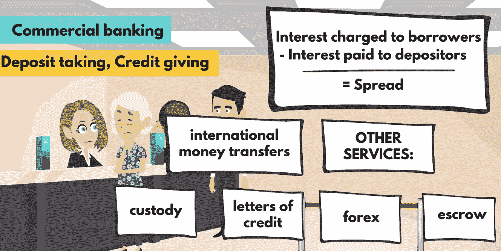

投资银行则处理更复杂的业务。他们协助企业进行重大的公司事件，比如当它们准备首次公开发行并将股票在证券交易所上市时，或者当它们涉及并购交易时。

由于这两种商业模式有很大不同，分开分析是有道理的。

让我们关注商业银行，因为它们影响着大多数人的日常生活。

商业银行的商业模式需要随着区块链技术的出现而进行重大更新。

在 2015 年给股东的信中，摩根大通的首席执行官兼主席杰米·戴蒙（全球最大银行之一）表示，有数百家初创公司拥有大量人才和资金，正在为传统银行寻求替代方案。

在 2017 年的繁荣之后，大量资金、研究和开发涌入区块链技术，毫不夸张地说，硅谷和科技初创公司不仅仅是在涌入，而是正全速前进，颠覆世界，而金融是第一个受到影响的行业。

# 但是银行为什么要费心呢？

他们的商业模式已经有效运行了数百年，互联网迄今为止并没有造成任何重大的破坏。

好吧，这一次我们谈论的是货币的互联网，这里的情况是不同的。

传统银行的核心业务围绕着存款和信贷。如果人们停止存款，银行存款减少，商业银行将无法为借款人提供廉价贷款，并且传统银行的整个商业模式将变得过时和过时。这就好似他们试图在在线视频流，数码相机和智能手机的世界出售视频带和老式胶片相机。或者就像在即时消息时代使用信鸽邮寄信件。是的，人们以前确实这样做过...并且那是标准做法...但是猜猜？世界正在变化...飞快！

我们可以不断列举验证技术破坏观点的例子。但是让我们继续主要故事。在无数年轻、雄心勃勃、充满活力的金融科技初创公司的存在下，我们只想提醒银行业的亲爱朋友们这句老话：不要拿小刀去参加枪战！

那么，我们为什么会预期未来有更少的人将把自己的钱存入传统银行？

直到现在，人们可以存钱的地方很少。一个选择是把钱留在家里，拥有装满纸币的罐子，将现金堆在花园里，或者简单地把资金存入银行，这样比在家里更安全，前提是银行不会破产。另一个好处是银行转账让向他人或公司汇款变得更加容易。

那么，对于世界各地被传统银行长期忽视、基本被排除在金融体系之外的数十亿人怎么办？如果老式银行不愿为他们提供服务，其他人就会！金融科技正在崛起，而区块链正在引领潮流！

比特币和其他加密资产的出现给人们带来了一个可行的选择。你已经知道区块链使得支付和价值存储变得安全，无需第三方干预。无论你在区块链上拥有的数字货币是多少，它都会在那里，没有人能够夺走它，前提是你正确地保存你的私钥。因此，银行不再是存储你资金的唯一选择。人们将加密资产视为可行选择的最明显证据来自那些遭受超级通胀的国家，比如津巴布韦和委内瑞拉的最近例子。比特币的价格在那里飙升，并保持着比世界其他地区高得多的溢价。这是由于这些国家对比特币的异常高需求所致。

此外，与传统银行转账相比，区块链上的交易往往更快速、更便宜，特别是国际转账。在未来，新的解决方案将会出现，当前的解决方案也将得到显著改进。因此，任何形式的资金转移都很可能比现有的支付系统更高效、更便宜、更快速。

所有这些都很可能使消费者受益，并破坏传统银行，因为它们开始向效率更高、更有效的金融科技创业公司输送业务。

当然，传统银行可以选择如何应对即将到来的技术颠覆。我们相信，明智的反应应该是尝试适应不断变化的范式，并全面拥抱新技术所带来的所有好处。你无法阻止进步！而忽视它或试图抵制它将是愚蠢的。谁选择保持僵化或无法适应新环境的人，就冒着成为进化原则的又一个证明，并遵循恐龙或 15 年前的庞大电影租赁巨头 Blockbuster 的命运，被像 Netflix 等服务所取代。

接下来，我们将研究区块链解决方案如何影响传统银行提供的一些现有服务。

# 可能会被中断的银行业务线

除了存款流出的明显风险之外，区块链还可以以几种其他方式改变银行的不同领域。

在本节中，我们将讨论区块链对各种银行职能的影响，这些职能在以下图表中列出：

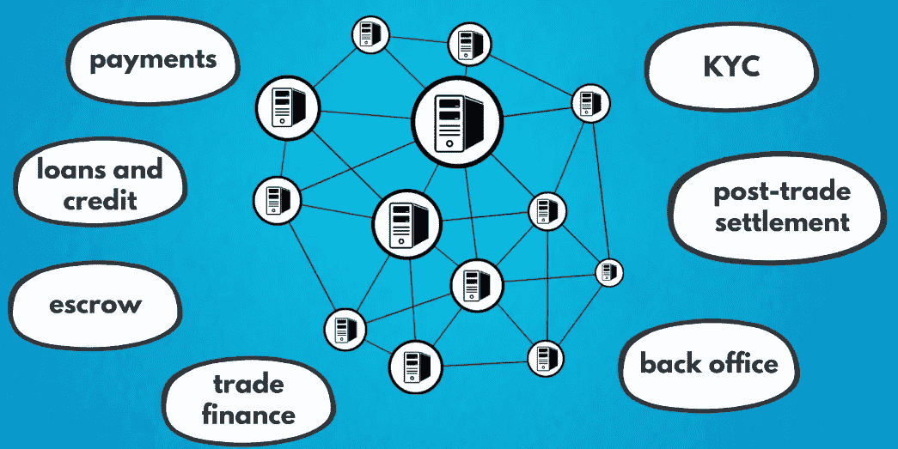

这不是一个简短的列表，但所有的话题都非常有趣。所以，让我们开始吧。

每天支付数十亿美元的银行费用。其中一些费用显然向客户展示，并用于提供的服务，而另一些则不那么明显，并在银行执行涉及外汇等操作时产生，例如。

据报道，桑坦德等全球银行非常依赖于国际汇款的费用。2017 年泄露的一份内部文件显示，此类费用在 2016 年占桑坦德收入的不少于 10%。

另一方面，一旦某些基于区块链的解决方案成为主流，它们可能为此类交易提供更优越的选项。基于区块链的资金转移需要较少的时间，而且成本远不及传统银行转账。目前（技术的早期阶段），比特币需要几分钟到几小时才能处理一笔付款，而国际银行转账通常需要至少三个工作日才能结算。其他区块链，如以太坊、莱特币、瑞波和恒星，甚至可以实现更快速更便宜的交易，这与银行进行相同操作所需的时间和费用相比可以节省大量成本。这些协议的一些改进，如闪电网络，可以提供更高效率。因此，国内和尤其是国际汇款是可能会受到颠覆的服务。

在第三章中，*比特币的诞生和去中心化支付系统的优势*，我们讨论了银行转账仍然如此复杂、耗时和昂贵的原因。它们涉及多个中间步骤，例如与对应银行合作，并可能受到长时间等待、汇率损失、交易对手风险、官僚主义和繁琐的文件工作的影响。区块链解决方案绕过所有这些困难，并在对等方之间进行，不涉及第三方。自然地，这使得整个过程更便宜更快：

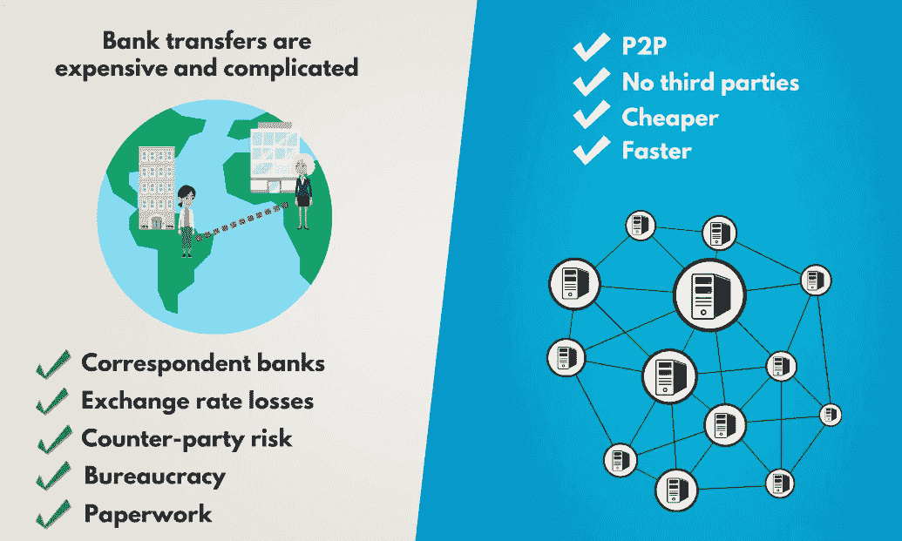

一些银行巨头已经表明他们意识到潜在的颠覆性，并正在采取措施实施区块链解决方案进行国际汇款。

澳新银行、法国巴黎银行、纽约梅隆银行、富国银行和超级账本开发人员联合体已经完成了基于超级账本 Fabric 区块链平台构建的跨境支付的概念验证（POC）。它旨在测试将成员银行帐户转移到分布式账本是否有助于国际银行间支付平台 SWIFT 实时对账。超级账本 Fabric 可以实现对 Nostro 账户流动性的实时可见性，简化对账并节省流动性，同时满足关键的行业要求，如治理、数据隐私、标准化和身份管理。

另外，2017 年 9 月，**皇家加拿大银行**（**RBC**）开始使用 Hyperledger 进行其美加跨境结算。

现在，让我们进入下一行业。收存款和放贷模式由两部分组成。我们已经讨论了存款部分。现在，让我们谈谈借贷和它未来可能经历的转变。

# 区块链如何影响贷款

今天，银行仍然是人们和企业的主要信贷来源。P2P 借贷是一个受欢迎的领域，但信息不对称阻碍了其大规模实施。P2P 借贷依赖于一个扎实的想法。如果人们把资金存入银行，然后银行使用他们客户的资金借给其他人，那么存款人直接借给借款人并在资金上获得更高回报更合理，这不是更合乎逻辑吗？银行似乎是这个方程式中多余的中间人，不是吗？他们的主要增值来自于他们有能力辨别好坏借款人，并且专门处理一旦停止履行债务的债务人。

很可能未来，涉及智能合约的平台将使事情更容易和更透明。由于区块链的清晰度，借方和借方之间的信息不对称可以降低。预先达成的条件将得到尊重，并且会有某种类型的公共数据库，人们将能够看到过去是好借款人的人，并借钱给他们：

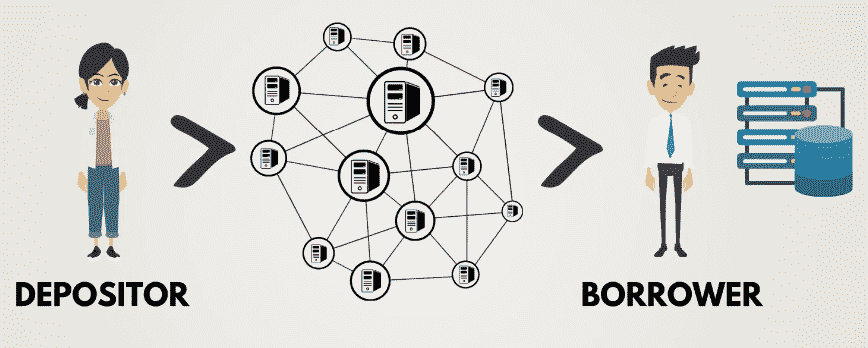

想象一下一个在线市场。这类市场中的卖家和买家都有评分。声誉是长期成功的基础。

想象一下，借款人将拥有声誉，他们以往的所有相关行为都将记录在区块链上。这肯定会减少信息不对称。借方将会获得更多有关要借钱的借方类型的信息。此外，这些信息将是不可改变的并且容易获取。这将创建一个竞争激烈的市场，借款服务对人们来说很容易获得，因为它们更便宜更快速。银行承担着巨大的行政成本，这使他们向借款人收取最终利率膨胀。在由区块链和智能合约技术促成的 P2P 借贷市场中，借方不需要支付近乎与银行收取的利率一样多的行政成本，他们会很高兴地接受金融机构的一小部分利率。

区块链可能会打破的另一个领域是贸易融资和第三方担保服务。在当今世界，有许多相互交易但彼此不信任的交易方。银行通过提供信用证和第三方担保服务来减少这种不对称性。

想象一下，一家欧洲零售商想从中国进口服装。他成功找到了一家生产服装的工厂，并且他们为第一批货物提供了一个好价格。其总价值为 500,000 欧元，这不是一个可忽略的金额。问题是，零售商之前未与供应商合作过，并且无法确定一旦资金汇出后，中国制造商是否会交付货物。与此同时，中国制造商也无法保证欧洲零售商在货物发货后会汇款。听起来像是一个僵局，不是吗？

嗯，到目前为止，已经建立的解决方案是使用第三方担保账户。欧洲零售商将资金存入一家可信任的银行，该银行只有在生产商已经发货后才释放资金。在这种情况下，银行的声誉消除了双方的信息不对称，并促进了贸易。银行以其名誉和监管许可来保证流程尽可能合法。但是，银行会就此服务收取总交易价值的一定比例费用。

基于智能合约的平台可能会改变这一业务线。

一笔商业交易中的双方将能够设计一个机制，自动转移货物和资金的所有权。交易将按照设定的条件进行，这些条件将被编程到智能合约中，双方可以确信这些条件是不可改变的，并将自动执行。

如您所见，我们即将迎来许多令人兴奋的变化。但这还不是全部！

在当前环境下，银行必须进行 KYC（了解您的客户）流程。世界各地的当局都希望银行收集关于其客户的信息并验证其身份。这些法规的目的是防止洗钱，并阻止犯罪和恐怖组织的资金。正如您可能想象的那样，这是一个冗长的过程。一些银行与数百万客户合作，他们必须填写大量表格并调查任何可疑案例。这是他们的一项重大投资。每家银行在开始与某一特定规模的新客户合作时都必须经历此流程。

更有效的方法是组织一个独特的分布式数据库，该数据库可以在银行和监管机构之间共享。通过这种方式，他们将能够节省同事已经进行过的所有研究工作。对于这些目的来说，分布式区块链解决方案将是最佳选择，因为记录的不可变性意味着客户交易历史记录是由所有共享该区块链平台的银行以安全和公正的方式存储的。它还将增加透明度，但只针对获得许可的实体，因为我们认为这样的解决方案最有可能被实施为私有许可的区块链。

实际上，这样的解决方案已经在开发和测试中；以下是一些例子。

2017 年，只有 44%的菲律宾人正在使用银行账户，这一指标由于菲律宾经济快速增长而迅速增加，但仍受到对新账户申请者身份和历史检查机制的低效问题的困扰。KYC 法规要求反复索取相同的数据，其中许多数据并不以数字或可验证的形式存在。

解决这个问题的方法是，菲律宾银行家协会与 Hyperledger 以及一些主要银行的联盟合作，进行了一个概念验证，构建了一个原型，使用 Hyperledger Indy 进行身份验证。

该平台通过允许客户以保护隐私的方式只输入一次信息，就可以简化新账户的注册流程，并且可以重复使用该数据进行新的账户开立。银行可以相信该数据的历史是可靠的。如果成功，这可以成为全国性身份证系统的一个测试。

在 2017 年 10 月，新加坡监管机构和包括汇丰银行和三菱日联银行在内的几家银行的一个联合体宣布，他们已经完成了一个 KYC 区块链的概念验证。原型的功能、可伸缩性和安全性在 2017 年 2 月至 5 月之间进行了测试。结果显示，即使在高密度信息流中，区块链也可以很好地发挥作用。它被证明是抵制第三方干预的，并通过只允许有合法凭证的人访问而保护机密性。

类似地，当区块链在后期交易结算的背景下得到实施时，银行的后勤部门将会变得轻松许多。由双方信任的改进过程将会减少结算时间，因为双方共享并控制相同的分布式账本系统，并且可以确定预先安排的条件得到了保留。此外，由于系统故障的减少，机械性错误也会减少。所有市场参与者可以共享区块链上的相同自动结算系统。当然，所有这些都将导致审计和协调效率的提高。每笔交易中涉及的各方都不必进行记录的不必要复制，并进行审计以确保整体一致性。最终，银行将能够拥有更精简和成本更低的后勤结构，从而工作速度更快。

好的，太棒了！这些是区块链技术预计将对传统银行业务产生的一些影响。接下来，我们将提供一份有关贸易金融和区块链的案例研究。

# 区块链上的贸易金融

现在，让我们看一下 IBM 和几家跨国银行的一个具体倡议，这进一步强调了我们在之前章节讨论的内容。传统金融领域的创新已经在进行中。

我们将要检查的具体倡议叫做**Batavia**，它涉及到 IBM 和 UBS 的合作，以及加入了其他几家主要银行，如蒙特利尔银行、CaixaBank、商业银行和第一集团。它的主要目标是解决贸易融资领域的低效流程。

贸易融资是一个缓慢的过程，现在被官僚主义所拖累：一个漫长的过程，涉及多个参与者进行的多次验证。在大多数情况下，一笔交易涉及买方、卖方、买方银行、卖方银行、运输公司和地方政府。整个过程需要大量的文件工作，并且没有自动化，因为所有参与者都有自己单独的 IT 系统，需要人工干预进行对账和验证：

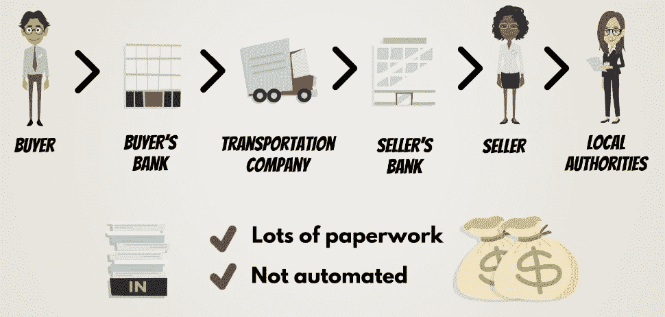

这个过程是漫长的（在某些情况下需要数周），对公司来说也是昂贵的（因为他们必须支付人工成本，而且在此期间不能使用交易收益）。

因此，像 Batavia 这样的贸易融资平台绝对是有意义的，感觉像是一股清新的空气。公司将能够使用平台与彼此签订标准形式的协议。更重要的是，由于其安全且不可变的分布式账本，系统的透明度和信任度将会提高。

该平台设计得非常创新。所有参与方将能够追踪交换货物的状态和位置。另一个关键特点是，在货物沿着供应链移动的不同阶段，可以向贸易中的不同参与者支付款项：

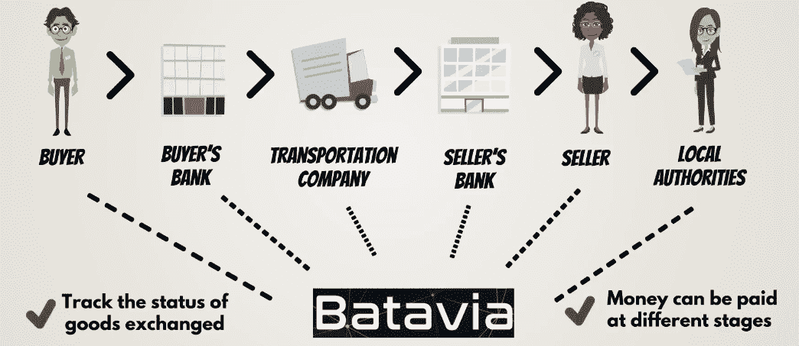

例如，一家公司将能够在货物交到物流公司手中后支付给供应商。然后在货物抵达目的地后，物流公司将得到支付。

Batavia 是一个开放平台，鼓励公司、银行和当局共同努力，共同合作，以实现更高效的结果。这些倡议促进了贸易，并使其更加高效，从而创造了价值并刺激了经济增长。

这是一个很好的例子，展示了一个使用区块链技术构建的平台，有可能通过提高效率和效果来颠覆贸易融资领域的现有现状，使所有参与方受益。

# 区块链和保险

保险业似乎不像传统银行业那样容易受到技术颠覆的影响。保险是一个高度专业化的业务，在这里，风险评估和汇集大量风险相似的保险合同的能力是一个关键的成功因素，这是一个难以但并非不可能在去中心化的 P2P 市场中自动复制的因素。因此，P2P 和去中心化的保险承保要比传统银行业更加复杂。

另一方面，区块链技术的出现代表着对保险公司效率和创新的潜在巨大来源。这一次，现有公司没有为这个派对迟到！

一些保险公司已经开始利用区块链技术为他们的业务谋求成功并提高盈利能力。

例如，安联展示了一个促进灾难掉期和债券结算的平台的测试版本。这样的平台使得这些金融工具的持有人在触发事件的情况下更容易接收或发送赔付。这意味着双方的等待时间较短，购买这些工具用于保险目的的人减少了不确定性，减少了验证错误，客户体验总体得到了改善。

英国的劳埃德公司没有等太久，已经开始尝试基于区块链的产品。它与共享工作空间供应商 Vrumi 和区块链数字专家 SafeShare 合作，向 Vrumi 的主持人提供保险产品。Vrumi 是一家办公场所住宿的 AirBnB 风格公司，其想法是允许 Vrumi 的主持人承保保护其租赁物业的保险合同。该产品使用区块链技术来确认和执行双方的义务。

还记得 Everledger 吗？这家公司利用区块链追踪钻石的来源。它也在定价相关的保险产品时帮助保险公司，通过减轻欺诈和血钻石进入供应链的风险。购买的钻石通常附有证书证明其质量和来源，但存在证件丢失的欺诈历史。区块链可以在保险公司需要验证钻石、艺术品、珠宝和奢侈品历史时大大帮助，防止任何欺诈企图。

未来将塑造保险业发展的许多区块链应用。目前，我们知道区块链可以通过以下方式帮助：

+   减少不确定性

+   降低后勤成本，减少官僚主义

+   自动化赔付执行流程，节省时间和人力

+   通过基于区块链的智能合同，可以改善客户关系和满意度，因为这些合同客观，并预先编程自动执行

此外，区块链上的保险合同可以帮助保险公司改善资本充足比率，因为风险管理更好，执行时间更快，对保单持有人的赔付能见度更好。

总的来说，主要的行业感觉是许可的区块链可以成为保险业未来的一个巨大解决方案。这样的许可区块链可以融入当前的业务模式。如果区块链解决方案与现有框架整合，保险公司、监管机构和客户都可以从这里讨论的优势中受益。

# 投资银行和区块链

在本章的前面，我们说有两种银行业务，商业银行和投资银行。我们讨论了区块链技术对传统商业银行服务的潜在影响，但对投资银行没说太多。

我们将在本节简要讨论这一点。

投资银行通常有以下核心业务线：

+   **资本市场**：在一级市场上为公司发行股票和债券筹集资金，将它们卖给投资者，并在二级市场上为客户或银行自己的账户交易它们

+   **咨询服务**：在专门的流程时期为咨询公司提供咨询，例如兼并和收购，以及公司重组

+   **资产管理**：专业地管理客户的投资组合中的资金

好的，我们来逐一检视这些领域。

资本市场的核心是为公司以股票或债务的形式筹集资金。很容易想象，股票和债券可以在区块链上以代币的形式表示并发行和交易。事实上，这可能是一个更有效的做法，因为清算和结算可以直接几乎瞬间完成，而不是等待几天并向一群中介支付费用。

这里有一个由 Hyperledger Sawtooth 开发的债券交易平台试点项目的真实例子。他们对传统系统的问题进行了如下识别：

+   机构之间的记录保存做法不同，调节总账通常是困难、昂贵且耗时的。

+   历史债券所有权数据可能是分裂和不完整的

+   集中式数据管理解决方案已经垄断了它们的产品

+   数据可以被追溯性地篡改，导致金融欺诈。

+   集中化系统存在单点故障的风险

为了简化债券转让流程，Hyperledger Sawtooth 创建了一个用户界面和智能合约平台，允许投资者实时跟踪和转让债券。在这里，用户可以创建、购买、出售和结算他们的债券组合。虽然智能合约专门定制了债券及其独特标识符，但它们可以相应地针对广泛的金融工具进行定制。

将金融市场迁移到区块链有许多优势。它促进了不同市场参与者之间的数据一致性。它有助于维护历史所有权的全面、有序、准确和不可变的记录。此外，分散化、透明度和信任都是系统的固有特性。

当然，这可以扩展到任何用于资本筹集或风险对冲的金融工具类型。智能合约可以非常有用地构建任何在全球资本市场上交易的衍生品或其他外国金融产品。

未来，所有已建立的金融市场平台都可能迁移到区块链上，因为它们提供了更高效的金融基础设施。事实上，这个未来可能比大多数人预期的要来得更早……

2017 年 7 月，伦敦证券交易所集团与 IBM 合作宣布，他们将创建一个专为意大利公司数字化发行股份而设计的区块链平台。Hyperledger Fabric 将构成该平台的基础。

纳斯达克也在积极开发区块链交易平台。

**澳大利亚证券交易所**（**ASX**）已宣布将用区块链技术取代其当前的清算系统。

还有更多…… 全球资本市场正在向区块链迁移。

除了提高已建立金融市场的效率外，区块链还提供了对新兴加密资产类别的访问。

有趣的是，一些主要的金融机构，如高盛、巴克莱和富达等，一直在探索开设加密资产交易台的可能性。看起来这个新的资产类别很快可能会在银行交易大厅中找到自己的位置，与传统资产类别并列。

在咨询服务领域，区块链的影响可能有些牵强，因为这个领域非常新，公司都处于早期阶段，大部分都没有引起老牌投资银行的注意。

区块链和资产管理呢？这个领域也在以相当动态的方式向前发展。由比特币领导的新加密资产类别正在全球资产管理者中崛起，并得到认可。机构投资者和零售投资者的兴趣都在增强，相关投资产品的供应也紧随市场需求。比特币期货于 2017 年底在芝加哥两家最大的全球商品交易所 CME 和 CBOE 上市。纳斯达克也计划推出类似的产品。瑞典上市了比特币和以太坊的交易所交易票据。由 Grayscale 赞助的比特币投资信托也向合格投资者开放。纽约证券交易所上市了比特币交易所交易基金（ETFs），但似乎还需要更多时间才能使这种产品实现。这只是个开始，前路漫长而不确定，但也令人兴奋。加密资产极其难以估值，所以我们将看到这个领域如何发展，但有一点是明确的：资产管理行业正在朝着加密资产将发挥越来越重要作用的方向发展。因此，我们可以期待新的激动人心的发展正在酝酿中！

# 区块链和金融监管

2017 年区块链和加密资产的崛起给全球各地的监管机构带来了重大的头疼。价格波动性大，零售和机构投资者的浓厚兴趣，比特币期货在主要受监管的交易所上市，以及每日在主流媒体上的存在，意味着加密资产正在成为一种新的资产类别。

在传统金融世界中，监管机构监督金融市场，以确保制定了充分的规则，平衡了所有相关方的利益。一方面，他们需要保护被认为由于缺乏经验和专业知识而可能易受伤害的零售投资者（私人个体），以评估市场风险并做出投资决策。另一方面，监管机构还应帮助维护高效有序的资本市场，以使公司能够筹集足够的资金来资助其运营，促进创新，最终刺激经济。这使得金融监管者的工作变得非常重要和具有挑战性。他们需要不断跟上新型金融工程和有时像各种金融衍生产品及其风险配置这样的奇特结构和工具。他们需要密切关注上市公司和机构投资者，以防止其管理层可能进行虚假会计、内幕交易或其他违规行为。历史上的例子非常多，当金钱处于风险时，人们的创造力是无限的。我们已经提到了一些涉及安然、WorldCom、伯尼·麦道夫和几乎所有主要银行的数十亿美元的大规模丑闻。此外，监管者需要特别小心处理可能代表系统风险的大型金融企业，这意味着如果它们遇到麻烦，可能会危及整个金融和经济体系。

因此，您可以看到金融监管机构拥有重大责任和重要的社会使命。当加密资产市场越来越大时，它开始吸引他们的注意。现在的开放问题是如何再次保持投资者保护和保持技术创新不受阻碍之间的平衡。在这里，这是一个非常具有挑战性的任务，因为区块链加密资产同时处于技术、金融、经济和法律科学的最前沿。

当然，普通投资者公众需要受到保护。就像任何其他市场一样，都存在欺诈和诈骗行为。不幸的是，这些事情一直是社会的一部分。市场参与者也存在不负责任的行为，他们很难理解涉及的风险。

好消息是，加密资产市场目前被认为不构成系统性风险。这是目前世界各地央行的共同观点。这是因为与全球股票和债务市场相比，其规模非常小。

如何处理现有监管框架中的加密资产，考虑到它们似乎具有货币、商品和股票特征的混合，是一个完全不同且复杂的问题。一方面，每个人都听说过加密货币，并使用这个术语来指代整个加密资产领域。但它们并不代表所有货币。实际上，与所有已建立的资产类别相比，商品可能更接近加密资产的性质。这是因为它们的市场价值由其所实现的效用或用例的供需决定。而这也应该是许多加密资产的情况。例如，以太坊代币提供对以太坊网络的计算能力和在安全、不可更改的以太坊区块链上的数据存储的访问。这看起来像是一个真实的用例，类似于我们现代经济中的许多商品。想想石油、电力、货物或运输；这些都是在现代经济中具有重要效用的可交易商品。也许，以太坊和一些它的区块链同行也会效仿。那么比特币呢？它正在获得被广泛认可的数字黄金地位。它的用途，作为价值存储，在某种程度上类似于黄金。芝加哥商品交易所（**CME**），世界上最大的受监管的金融和商品衍生品交易所之一，似乎也持有这种观点，这得以从其于 2017 年 12 月上市比特币期货合约得以证明。

相比之下，股票的价值基础是基于基础业务预计实现的未来现金流。目前情况下，大多数加密资产并非如此。当然，传统的股票股份可以通过区块链上的代币来代表，正如我们已经提到的那样。几乎可以用任何资产来做到这一点。

那么加密资产的风险投资方面又如何呢？目前，它们主要代表着对初创项目的利益。在这里，所谓的利益相关者指的是对一个公司或生态系统有任何利益的人。例如，典型公司的主要利益相关者包括其投资者、员工、客户和供应商。

加密资产在当前市场和监管环境中的地位是一个开放而复杂的话题，我们绝对无法在这里完全涵盖。

我们只想提一下，当涉及到加密资产时，全球监管环境非常多样化，并且在动态发展。有些国家比较保守，而其他国家则更加开放和自由，就像其他任何经济和政治发展一样。理性的方法可能是让监管机构和市场参与者之间保持持续对话，以确保所有人都在同一页面上，并为社会带来有效的结果做出贡献。许多监管机构和政府当局似乎认识到区块链技术的价值，并希望在进一步采取措施之前对其有一个很好的理解。这种做法是合理的，我们已经看到一些积极的举措正在发生。

2018 年 4 月，欧盟的 22 个国家签署了《关于建立欧洲区块链伙伴关系的声明》。

数字经济和社会专员 Mariya Gabriel 是推动该合作伙伴关系的人，并表示她相信该技术有能力改变数字世界：

*“将来，所有公共服务都将使用区块链技术。区块链为欧洲和成员国重新思考其信息系统、促进用户信任和个人数据保护、帮助创造新的商业机会以及建立新的领导地位提供了巨大机遇，使公民、公共服务和企业受益。该合作伙伴关系使成员国能够与欧洲委员会合作，将区块链技术的巨大潜力转化为更好的公民服务。”*

该合作伙伴关系将成为欧盟成员国之间在技术和监管领域交流经验和专业知识，并为在数字单一市场推出欧盟范围的区块链应用做准备的一种机制，以造福公共和私营部门。这将有助于欧洲继续在区块链技术的开发和推广中发挥主导作用。

说了这些，我们将保持对监管困境的开放，并鼓励每个人在采取任何行动之前都要理性思考并自己尝试理解区块链技术。事实上，这正是本书的目的，如果我们能够促进正在进行的讨论并增加对区块链技术的社会认知，我们将非常高兴。

# 区块链与零售业

现在，让我们继续讨论区块链技术对零售行业的潜在影响。但首先，我们将讨论本书中先前提到过的一个术语。

# 物联网

**IoT**，即**物联网**经常被提及，是一个描述我们日常生活中使用的不同设备通过互联网互相连接的概念。

我们不再仅仅通过电脑访问互联网。我们周围有不同的智能设备，其内置功能基于互联网，并与其他设备或云连接起来： 

我们都知道智能电视和智能手机是什么。如今，许多电器产品都带有智能功能，比如与智能手机连接并跟踪人们位置以便在下班回家时自动开启的空调。连接到互联网的安全系统会在你的家中注册到可疑事件时通知你。这个列表还在继续：

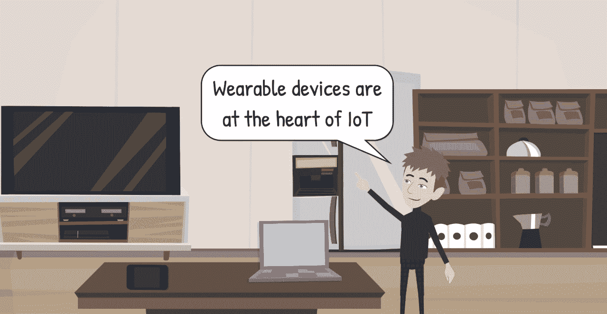

可穿戴设备是物联网和零售行业最新讨论的焦点。其中，最早的可穿戴设备之一是安全和识别。毫无疑问，这意味着区块链技术可以在这一领域发挥重要作用：

许多人在工作时戴着徽章，它们提供安全性和识别，并在某些情况下提供与位置相关的有价值的见解（对于安全原因来说可能非常有帮助）。这并不是一个直观的想法，但徽章本身是物联网中扮演角色的一种智能设备。它所含的芯片提供了关于持有者、他或她的位置，以及系统中存储的任何相关数据的信息。现代徽章甚至更安全，它们要求持有者使用生物识别功能，比如指纹或眼部扫描：

# 这与零售行业有什么关系？

这实际上表明，产品中插入的一个简单芯片可以包含大量信息。如果这个芯片中包含的信息记录在区块链上，那么它就变得不可变和无法伪造：

同样，这样的芯片可以添加到大多数零售产品中。

很可能，许多服装、鞋类、包包、香水、太阳镜、化妆品、奢侈品、药品等等将受益于一个透明的真实性验证平台，它将拥有规模，并被大规模采纳。这将使顾客能够扫描鞋类（通过条形码或内部插入的芯片）并接收有关产品的有价值信息。他们可能对了解物品的真实生产商、原产地、材料和劳动力来源、物品生产时间，以及可能是从生产商处推荐的价格感兴趣。这有助于纠正一些发展中国家的非道德做法，比如血汗工厂和童工：

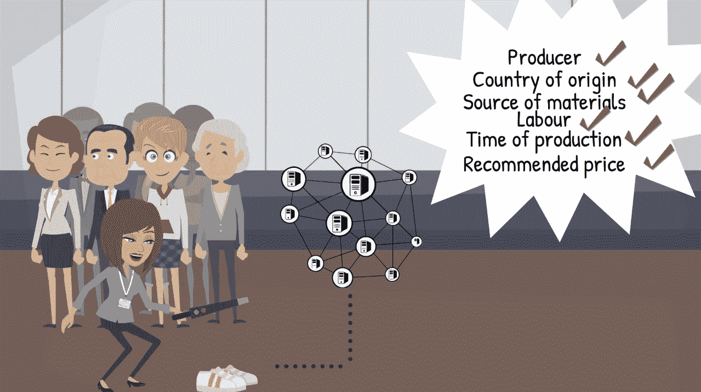

此外，像耐克这样的知名品牌遭受着大量的伪造。问题在于，顾客并不总能区分耐克的原始产品和仿冒品。基于区块链的验证流程可以帮助解决这个问题：

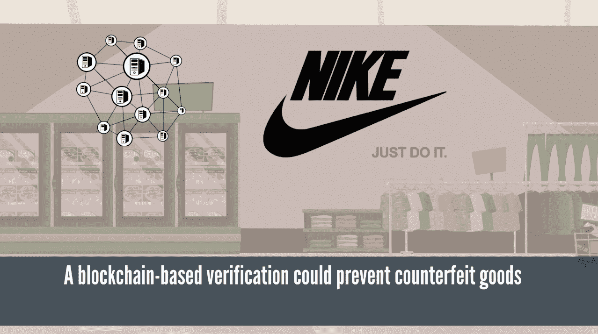

如今，消费者对健康和他们行为的社会影响变得非常有意识，他们更喜欢消费以正确方式生产的产品。

在这种背景下，基于区块链的验证和真实性证明的观点变得极为有用：

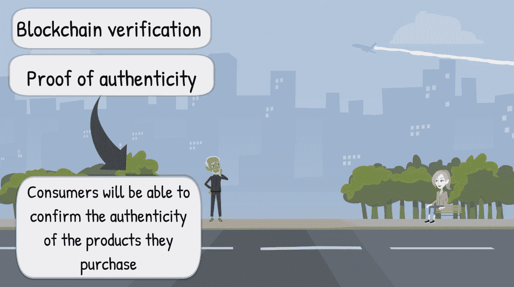

消费者将能够确认他们购买的产品的真实性。逐渐地，不道德的制造实践和假冒商品市场可能会显著缩小。

对于化妆品、药品和其他医疗保健产品来说，这一点尤为关键，因为生产质量和遵循标准不仅是期望的，而且是至关重要的。基于公共区块链的注册表可以向人们保证，他们购买的药品是由有可靠声誉的合法公司在正确的条件和标准下，使用适当的成分生产的。有了这样的透明度，生产商将以其声誉和经营许可证支持其产品，并对将有问题的产品带入市场或以其他方式违反规定承担责任：

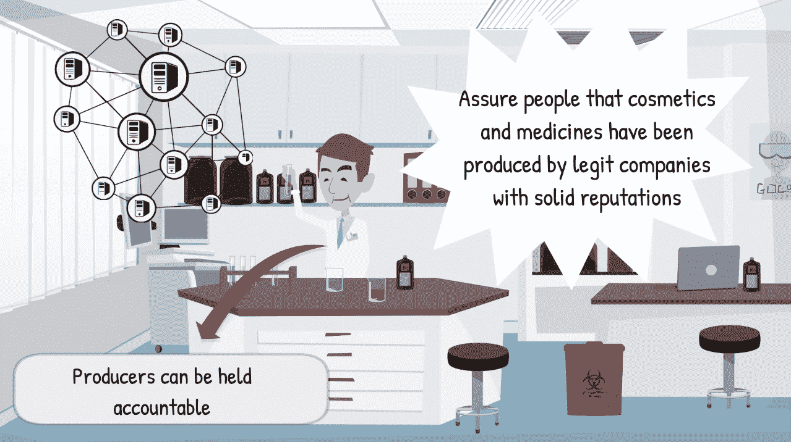

这样的注册表将允许消费者验证他们购买的产品的整个生命周期。从社会的角度来看，可以向消费者展示他们穿的衣服是在适当的环境中生产，并由验证工作场所条件的组织进行认证。对于我们这个时代的大部分消费者来说，这真的非常重要。他们想更多地了解他们使用的产品，并对其生命周期感兴趣。

重要的是，在购买时尚产品或化妆品时，客户想要知道商品是何时生产的。他们不想购买一年前生产的商品。因此，从这个角度来看，这种类型的认证也将非常有用：

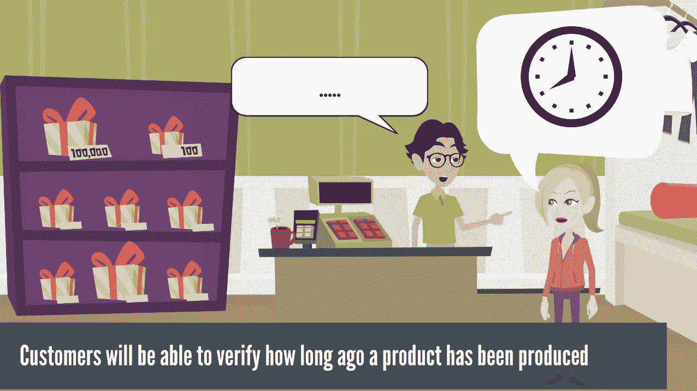

# 区块链与知识产权

现在，让我们看看区块链对媒体下载（如音乐或电影）、软件安装和其他涉及**知识产权**（**IP**）的产品可能产生的影响。

知识产权管理是另一个区块链解决方案实施可能产生重要影响的领域。在互联网时代，IP 是一个热门话题。

通过使用分布式分类账来管理知识产权，艺术家、作者和企业可以获得不可篡改的知识产权所有权证据和版权保护。他们还可以在一个允许智能知识产权管理的生态系统中使用智能合约。

让我们分别考虑每一项发展意味着什么：

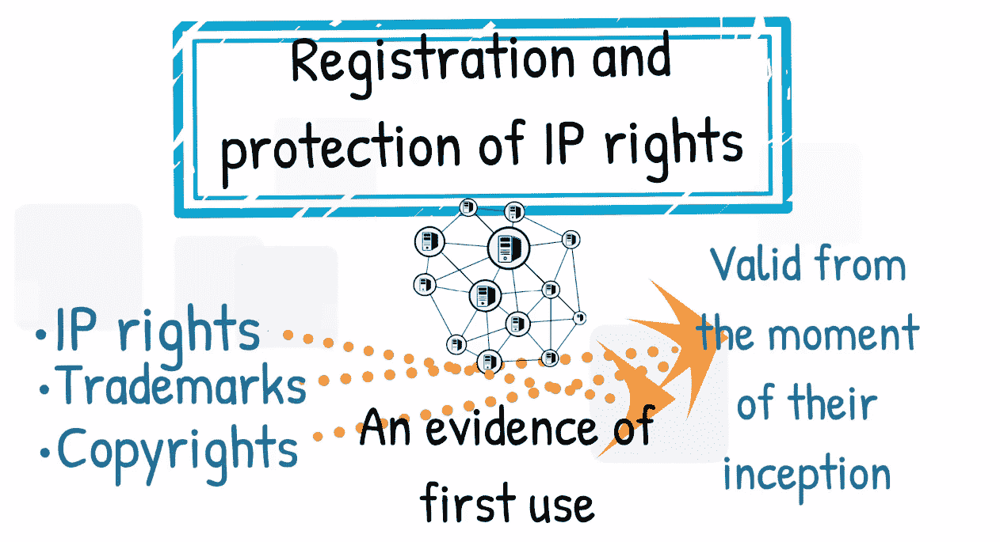

在谈论知识产权时，其中一个最重要的方面是它们的注册和保护。在大多数立法中，知识产权、商标和版权从它们产生时就开始生效。基于区块链的注册表及时间戳则可以展示知识产权何时生成，从而证明首次使用。这将使企图申请已被原作者创建和使用但尚未被其注册的技术专利的资本公司难上加难。区块链不可篡改的账本上的时间戳将成为整个世界证明合法知识产权所有权的透明且具有说服力的证据。

基于区块链的解决方案为音乐、电影、软件以及几乎所有形式的创作提供了无限的可能性。

首先，基于区块链的平台将使内容创作者和艺术家能够在基于数字货币和智能合约的去中心化系统中变现他们的作品。可以建立基于使用情况的自动知识产权支付系统，精准度很高。例如，音乐和视频流媒体可以按分钟甚至秒进行计费，微支付会立即处理。与我们之前讨论过的其他行业一样，这些系统可以直接以点对点方式工作，无需不必要的中介。

柯达公司推出基于区块链的平台用于注册照片图片版权，并在使用这些图片时触发对作者的自动支付，是这种行动的一个很好的例子。智能合约使整个过程更快、更安全、更高效。这种解决方案在一些情况下尤其有效，比如鲜为人知的艺术家创作产品并需要依赖第三方平台保护他们的知识产权。

类似于我们先前提到过的 Steemit，StreamSpace 项目旨在建立一个由内容创作者和用户社区管理的去中心化平台。主要思想是，像 Netflix 和 Amazon 这样的垄断企业决定向客户收取多少费用以及支付给作者的版税百分比的集中模式对作者来说并不是最佳选择。StreamSpace 提供了让作者自主选择商业策略并使用 StreamShare 代币向客户收费的独立性：

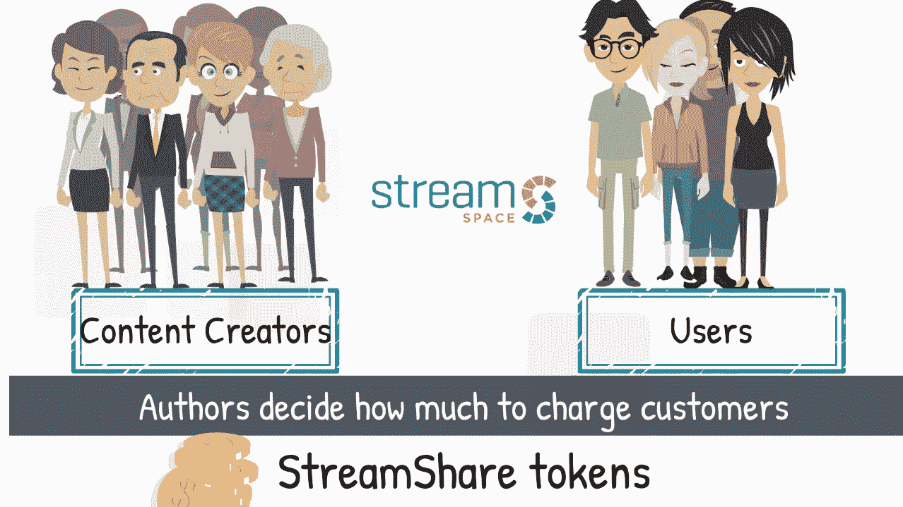

另一个项目，**Dot Blockchain Media**（**dotBC**）正在建立一个音乐内容版权注册表，帮助音乐家在商业化他们的艺术作品时表达其权利和意愿，采用可互操作的文件格式。数据通过利用 Hyperledger Sawtooth 区块链技术的分布式网络维护。这个解决方案将音乐和媒体版权的记录集成到艺术家的作品中。dotBC 与音乐和更广泛的媒体行业保持合作伙伴关系，实现 63 多万全球独立和主要唱片公司艺术家的作品和 dotBC 生态系统之间的无缝数据交换。

未来这样的去中心化市场会如何发展，以及它们是否会吸引到足够数量的用户，这还有待观察。它们面临的主要挑战之一是去中心化社区的治理模式，这是一个由不同利益相关者组成的共同问题，实际上对于所有去中心化系统来说都是一个常见问题。

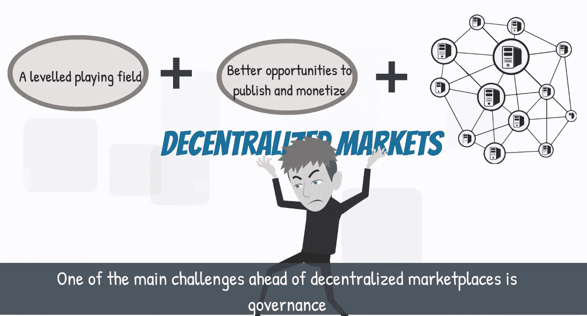

然而，多亏了区块链技术，我们很可能会看到艺术家管理知识产权的方式发生重大变革。未来，竞争环境可能会更加公平，艺术家将有更好的机会在保护知识产权的环境中自行发布、分发和获取其内容的收益。

# 区块链与食品行业

我们已经多次提到，区块链可以为食品行业供应链，以及几乎所有其他供应链，提供巨大的改进和效率。但是，由于我们消费的食品是我们日常生活中不可或缺的重要组成部分，具有重要的影响，而且食品行业是全球经济的重要组成部分，因此我们将在这里重点分析它，分析区块链技术如何帮助为所有人提供更好的结果。实际上，如今许多食品行业领袖已经认识到这一点，并正在推出试点项目和倡议，以在其商业模式中实施区块链解决方案。我们将在这里研究一些这类项目的案例：

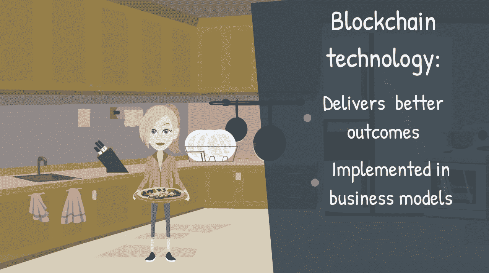

我们将从一个非常重要的问题开始。你喜欢吃鱼吗？谁喜欢知道，鱼能够新鲜地送达并被供应。

传统海产品行业供应链中存在的问题包括非法捕捞、标签欺诈、不当的食品储存条件以及繁琐且容易出错的手工记录：

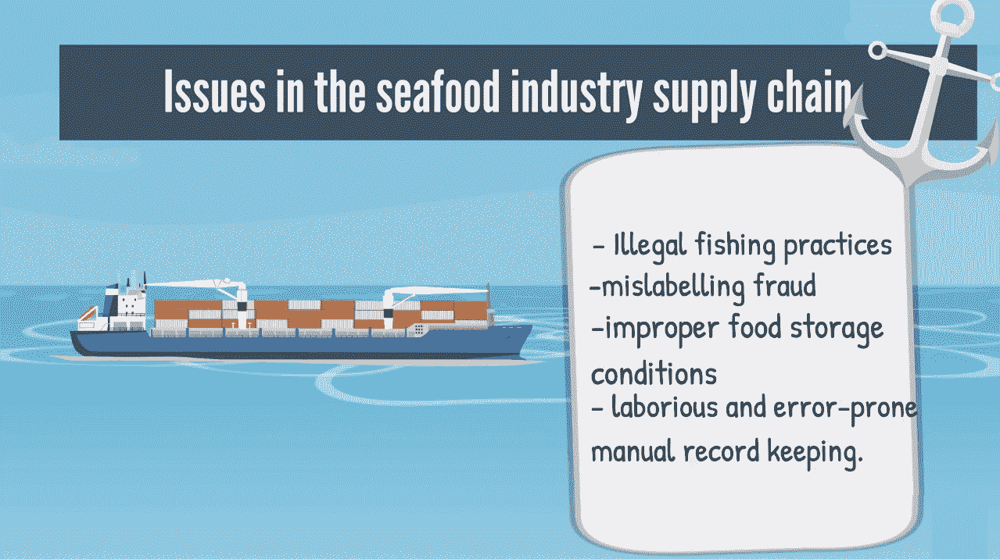

这些问题对生产者、零售商、消费者、世界自然资源和整个经济都产生了负面影响：

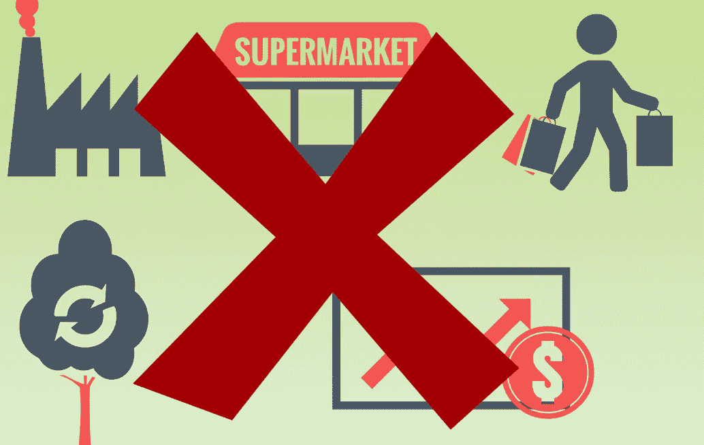

下面是一个旨在解决所有这些问题的区块链项目：

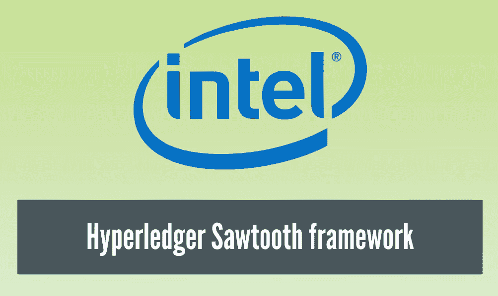

英特尔正在利用 Hyperledger 技术构建区块链解决方案，以实现现代化的海鲜溯源方法。利用 Hyperledger Sawtooth 框架，现在可以记录海鲜从海洋到餐桌的旅程。可以将 IoT 传感器附加到委托给他人运输的任何海鲜上，跟踪所有权、拥有权和遥测参数，如位置、温度、湿度、运动、震动和产权。最终购买者可以访问完整的信息记录，并相信其准确性：

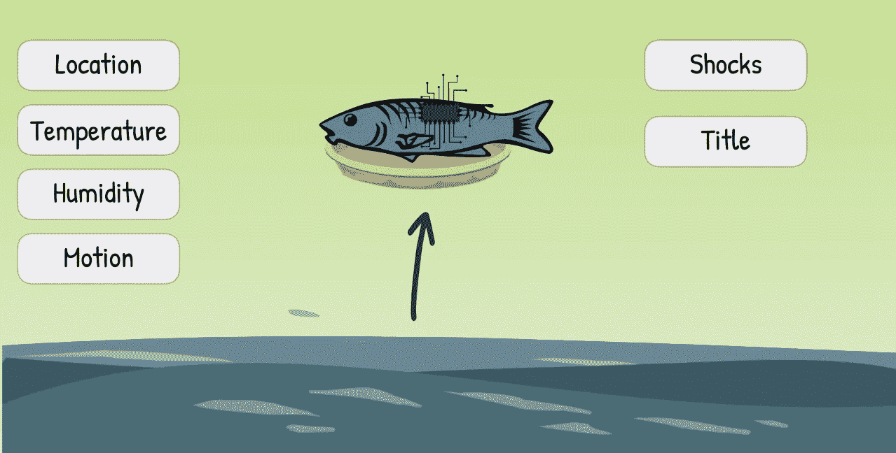

由区块链运作的海鲜供应链可以帮助防止非法捕捞或储存不当的鱼类进入市场。它可以为供应商提供公平竞争的机会，并奖励良好的做法。供应商和消费者将了解他们所购买的内容，并得到他们所支付的内容。因此，区块链可以增加整个系统的透明度和信任。此外，智能合约自动化可以节省时间和运营成本。

区块链技术的另一位重要倡导者是沃尔玛。而且，该应用再次聚焦于食品供应链。

像沃尔玛这样的大型零售商也曾多次因进入市场的受污染食品而遭受损失，与消费者一样。要认识到这个问题的严重性，可以考虑以下例子。

十年前，美国爆发了一种致命的大肠杆菌菠菜中毒事件，波及 26 个州，造成 3 人死亡，200 多人患病。这次爆发表明了当食品采购和污染追踪出现严重问题时会发生什么：

沃尔玛高管对该案例的描述如下：“总的来说，消费者停止食用菠菜。餐馆从菜单中移除了菠菜。如果你能更快地追踪并确定菠菜的来源，你可以减轻所有这些问题，并确保消费者的信心持续存在”：

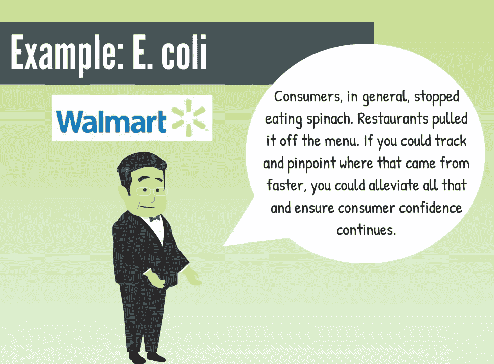

这并非个案。多年来，已经发生了多起规模较大的食品安全问题。

2017 年美国爆发的与来自墨西哥的木瓜相关的沙门氏菌感染事件导致 235 人患病，其中 2 人死亡，78 人住院。

你可能还记得 2008 年中国因奶粉被掺入有毒化学物质三聚氰胺而引发的丑闻：

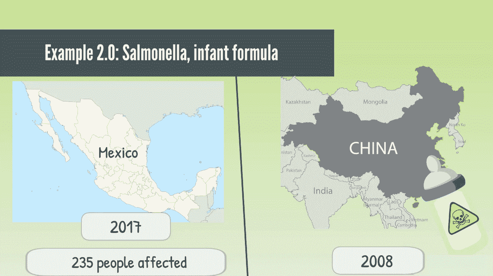

列表还在延续……

因此，让我们看看沃尔玛正在实施的解决方案。

作为试点项目，它与 IBM 和北京清华大学合作，在中国利用区块链数字化追踪猪肉的流动。为此，他们正在使用 Hyperledger 技术。它将使零售商能够追踪肉类的流动，从生产商到加工商，再到分销商，再到食品杂货店，最终到消费者手中：

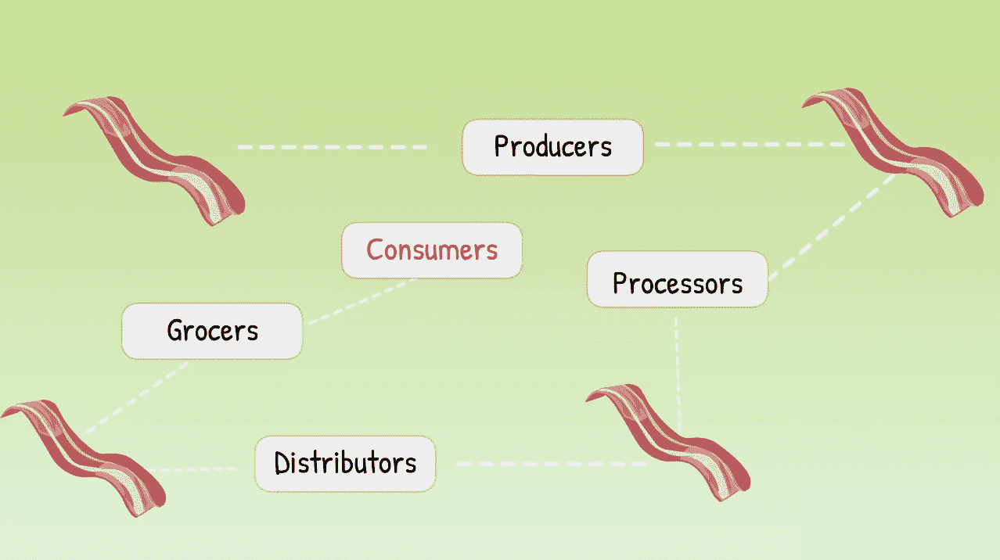

根据 IBM 的说法，这一举措比早期仅使用条形码和无线电标签的项目有了实质性的改进。

缺失的一块是一个共享论坛，公司可以在其中看到彼此的交易并建立信任。那个缺失的一块就像是区块链。

将要存储在区块链上的信息，欺诈和不准确性要难得多，包括与农场起源、工厂数据、过期日期、存储温度和运输相关的细节。区块链技术可以大幅简化行业供应链，并促进对传统模式的材料效率：

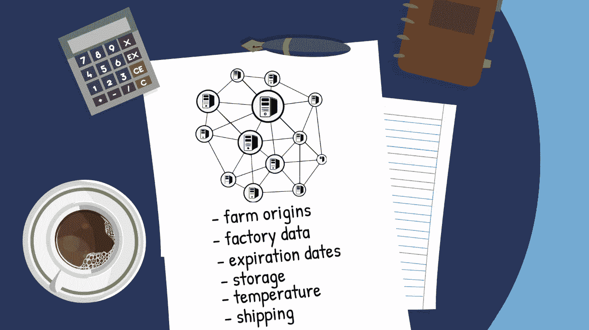

鉴于这个试点项目的巨大潜力，沃尔玛随后将其扩大到包括更多食品产品。其他消费品巨头，如雀巢、联合利华和都乐，也加入了这一倡议。看来这个领域的每个人都喜欢利用自动跟踪重要信息来改善供应链，例如商品的温度和质量、装运和交货日期以及设施的安全认证。

# 区块链和交通运输行业

移动服务和汽车公司的业务总体上可能是未来几年最活跃和根本变革的行业之一。大众、丰田和通用等传统汽车制造商在未来十年面临两种主要类型的挑战。

首先，他们必须适应一个产品线，该产品线将不再依赖传统燃料，而是专注于电池。这是一个重大的改变，全球汽车生产商别无选择，只能调整他们的业务模式，否则像特斯拉这样的竞争对手将继续获得市场份额。

汽车制造商面临的另一个主要业务风险是来自 Uber、Lyft 和 Didi 等公司的威胁。好吧，这也可以是一个机会；取决于你怎么看。

第一种挑战，从传统燃料转向电池，与区块链技术关系不大。至少，如果我们不涉及供应链的话。

另一个挑战：人们如何改变他们的交通行为以及他们消费移动服务的方式，这是我们想要在这里讨论的。在这个领域，有大量的创新解决方案可能是基于区块链的。

大多数大型汽车制造商都在尝试一些共享汽车、拼车或打车的计划。例如，几年前，戴姆勒推出了 Car2Go，这是一项短期汽车租赁服务，允许人们搭乘汽车从 A 点到 B 点。在大城市生活的许多人看来，将交通工具留在街上的灵活性感觉像是一种范式转变。在纽约、伦敦、香港、巴黎、东京、上海和许多其他地方，高峰时段几乎不可能找到停车位。在经济上，使用汽车一段时间然后交给下一个需要它的用户要方便得多。不仅仅是戴姆勒在尝试这种智能车辆共享方案。另一个例子是菲亚特与意大利石油生产商埃尼的合作。他们的合资企业被称为**Enjoy**，提供类似的服务。大多数汽车制造商需要适应这种新的商业模式，否则他们可能会失去市场份额。一方面，他们将共享汽车视为威胁，因为这意味着并非每个人都需要购买和维护个人车辆。但另一方面，它也可以被视为一个机会，因为共享汽车可以让这些公司建立基于订阅的业务。这可以弥补传统领域失去的收入，并甚至创造更多价值。

未来，区块链技术在全球经济中扮演重要角色，可以扩大共享汽车服务。基于区块链的解决方案可以帮助共享汽车服务提供商验证驾驶员的身份、驾驶记录和以往的共享汽车使用情况。这可以有助于根据个体驾驶员的风险概况更精确地减轻某些风险。智能合同可以实现与收费公路费用相关的自动支付，并且可以根据驾驶员的概况和行驶里程调整保险合同。它们还可以用于旅途中的清洁、加油和其他服务的自动支付。这种自动化将提高效率，并增强用户体验。

为什么要使用基于区块链的智能合同，而不是简单地上传数据到由公司管理的中央服务器呢？好吧，可以这样想。人们对与外部方分享个人信息并让其为他们管理一切以保护其数据安全，维护专业的商业行为和收取公平价格变得更加谨慎，这是理所当然的。这种集中化会产生单点故障。我们已经见过无数个人数据泄露、滥用、不道德的做法，比如将个人数据卖给愿意支付的第三方，明目张胆的欺诈，数据窃取，以及滥用主导市场地位的案例。

智能合约解决方案可以涉及多个参与方和服务提供商，每个参与方管理一定阶段的流程。一家公司可以负责保险，另一家公司负责清洁，第三家公司可以负责收费，依此类推。当然，负责汽车共享服务的公司也将参与进来，但它不会主导整个格局。区块链解决方案允许价值链的去中心化，将数据和市场力量分配给多个参与方，并防止任何单一实体成为失败、瓶颈或滥用其市场地位的租金征收者的中心点。

在拼车和打车服务中也可以期待类似的发展。

在拼车服务中，多人同意搭乘同一辆车，通常是临时安排的。这是另一个很好的解决方案，可以帮助人们节省金钱，保护环境和社交。智能合约是这种拼车计划的明显选择。智能合约可以根据距离、每英里的费率、乘客人数和其他相关变量自动计算服务中涉及的所有费用和价值交换。它可以根据每个乘客使用的距离或行驶时间快速轻松地将车费分摊给乘客。

车辆安全是区块链可能有益的另一个领域。汽车正变得越来越自主，这意味着它们的网络安全问题也需要解决。为这种物联网应用设计健壮的 IT 基础设施变得至关重要。区块链的去中心化和不可变性特性可能为数据验证提供巨大好处。它可以减轻系统失败和外部干扰的中心点风险，从而提高用户安全性。

区块链预计在汽车行业的其他领域也将发挥重要作用，如供应链管理、制造、车辆租赁融资、车辆注册、监控和认证、远程信息技术等等。

接下来，我们将研究区块链如何彻底改变我们所知的技术空间。

# 区块链和全球科技巨头

现在，让我们考虑区块链时代互联网巨头的未来。我们将做出的许多假设和假设都与区块链成为改变游戏规则的技术的场景相关。

当前的互联网空间由四家科技公司主导：谷歌、Facebook、亚马逊和苹果。这是一个集中式模型，其中四家公司控制着大量用户数据。

另一方面，区块链是推动去中心化的技术。

因此，当新的去中心化替代方案出现时，用户会如何反应是非常有趣的。同样重要的是要注意，所有主要的科技公司现在都在研究区块链，找出如何将其纳入他们的商业模式。

这是对区块链如何可能影响四大科技巨头业务的纯战略分析。

让我们直接开始分析谷歌及其在区块链时代的业务。

# 谷歌

谷歌是真正的互联网巨头；截至 2018 年 12 月 31 日，该公司的营收为 1100 亿美元，净利润为 130 亿美元。我们还应该记住，营收增长了惊人的 17%。公司不断扩张：

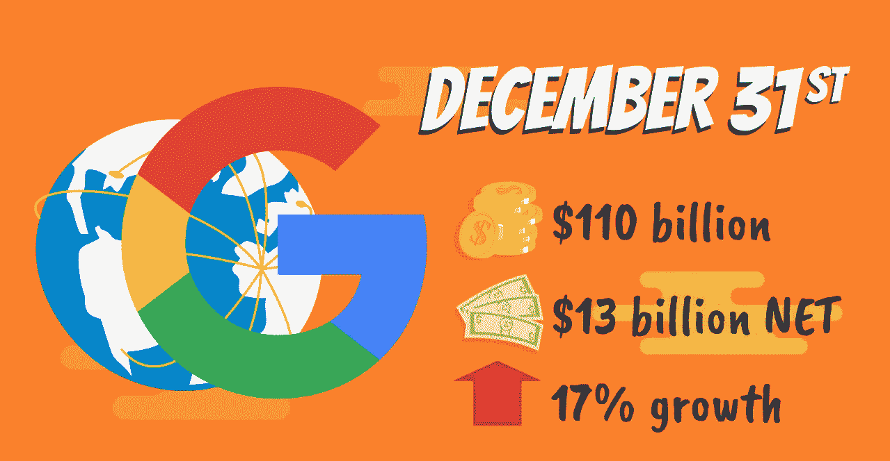

我们大多数人每天都会使用谷歌的一些服务，很难不这样做。毕竟，它拥有全球最流行的网络搜索引擎、视频搜索引擎、电子邮件服务、定位服务以及最流行的移动设备操作系统。

他们所做的几乎任何事情都不仅是世界级的，而且在大多数情况下是最佳的。

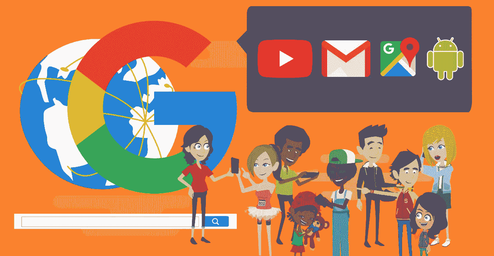

谷歌搜索统治地位的两个主要原因。一个是习惯，另一个是优秀的数据科学和人工智能。谷歌多年前就确立了自己在搜索领域的知名度，人们在需要查找信息时继续使用它。此外，打造强大的机器学习算法的最佳方式是拥有大量用户数据，以便根据个人偏好塑造搜索结果。简而言之，谷歌能够找到更适合您搜索的结果，因为您过去曾使用过他们的搜索引擎。

区块链如何瓦解谷歌的搜索统治地位？

要做到这一点将会非常困难，肯定需要一些时间。但这并非不可能的情况。越来越多的平台正在尝试挑战谷歌的统治地位。像 DuckDuckGo 这样不出售用户数据的以隐私为重点的搜索引擎有很大机会打破目前的现状。但要做到这一点，DuckDuckGo 这样的搜索引擎需要与收集客户数据的平台进行某种集成（即所谓的身份代币）。因此，通过将以隐私为重点的搜索与相似的优质搜索体验相结合，用户将更加满意于不是由一家公司拥有所有的搜索查询。

更进一步的诱因是，未来的去中心化搜索平台可能会为用户提供代币。广告收入的一部分将作为平台用户的奖励。这可能是一个很好的激励，有助于平台找到其初步采用者并更快地增长。我们已经看到类似的模式被区块链初创公司实施，比如先前讨论过的 Brave 浏览器和其原生的 Basic Attention Token。

YouTube 是全球第二大搜索引擎，当然也是最大的视频搜索引擎。与 YouTube 竞争很困难，原因之一是与谷歌搜索竞争也很困难的原因相同。他们拥有大量数据，并且可以为用户提供他们想要观看的视频内容。

然而，同样也是真实的，许多内容创作者对他们从 YouTube 获得的版税感到不满。此外，目前观众并没有因他们所看到的广告而得到任何回报。

# 区块链如何颠覆 YouTube 的主导地位？

在这样的背景下，通过引入对内容创作者和观众都更有吸引力的模式来挑战 YouTube 的霸主地位可能是有意义的。通过加密代币形式的激励以及吸引一些高质量的内容生产者，可能有助于将一部分流量从 YouTube 转移开来。事实上，DTube 是一个基于 Steem 区块链的视频分享平台。它向用户承诺了几个诱人的激励措施：一个货币激励（贡献内容时赚取代币）、一个去中心化平台抵抗审查（用户对视频质量进行投票），以及最后平台是无广告的。不确定这是否是持续并击败 YouTube 的精确商业模式，但第一颗种子已经被播撒。

Viuly 也正在开发基于区块链的视频分享平台，而且很可能会有更多的去中心化竞争对手进入这个领域：

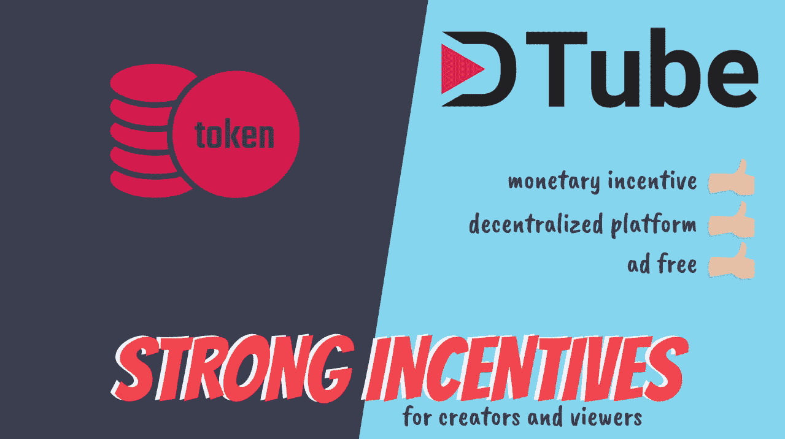

最后，我们想讨论一下 AdSense，谷歌的显示广告服务，允许第三方网站将谷歌为他们找到的广告商的广告嵌入到自己的网站中。在这种情况下，谷歌充当中介，将网站流量引导给想发布广告的广告商。当然，谷歌从这些广告收入中收取一定比例的费用：

总的来说，人们对广告有着爱恨交织的情感。有时他们觉得广告很有用，但在大多数情况下并非如此。此外，很多网站仅仅通过广告收入赚钱的事实已经改变了互联网上内容的展示方式，并不一定是最好的方式。许多网站，甚至是有声望的网站，充斥着试图最大化用户展示量并增加广告收入的点击诱饵。这导致了更糟糕的客户体验，并促进了错误类型的行为，即网站创作者并不真正关心提供有意义的信息，而是设法欺骗访问者进行更多点击：

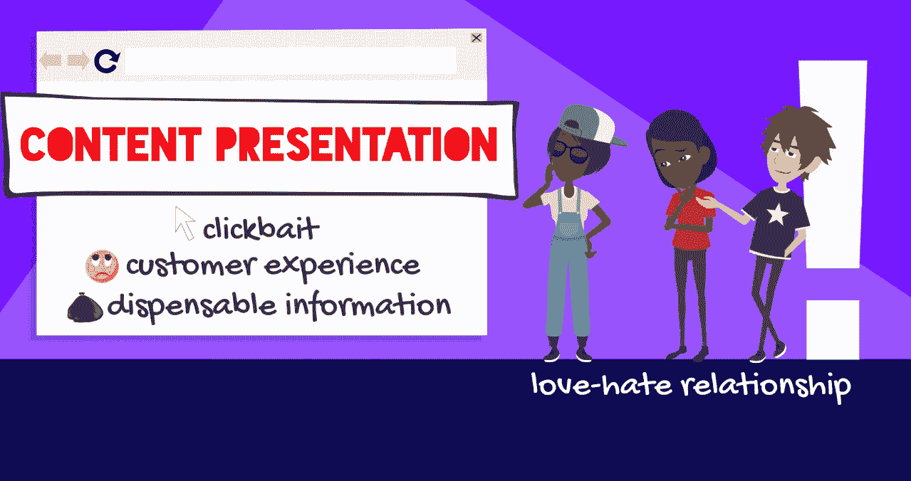

# 区块链如何颠覆 AdSense？

嗯，未来可能会看到 Medium 等平台获得更多关注并非不可能。一个更好的解决方案是将 Medium 最强大的特点之一——用户鼓掌——与代币化激励相结合的平台。事实上，这样一个平台已经存在了，那就是 Steemit。

当然，目前尚不清楚如何在这样的模式中引入广告，但一个优化了用户体验并帮助人们找到相关内容而不使用点击诱饵的平台将是与当前现状相比的重大改进。

我们还应该提到，谷歌正在研发自己的区块链技术和解决方案，就像所有其他科技巨头一样。我们期待看到这些努力的进展，以及 Google 是否能够在区块链所承诺的全新去中心化世界中保持其网络优势。

# Facebook

在四大科技巨头中，Facebook 的业务受到区块链技术的出现威胁最大。人们对 Facebook 收集的数据量变得谨慎起来。

一家公司控制着全球三分之一人口的电子邮件、传记、兴趣、熟人、关系、旅行、想法，甚至是情感利益的信息。2018 年 4 月，剑桥分析公司丑闻证实并突显了这些担忧：

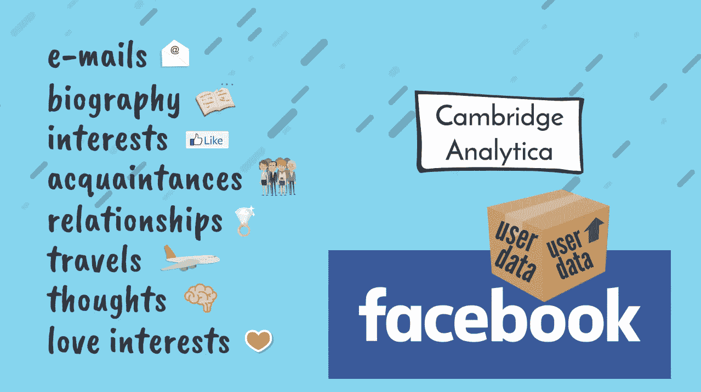

目前 Facebook 收集数据的方式是中心化的典范。

目前，Facebook 是数字广告商使用的第二大平台。其 2017 年的营收为 406 亿美元，该公司几乎将 160 亿美元转化为净收入，净利润率达到惊人的 40%：

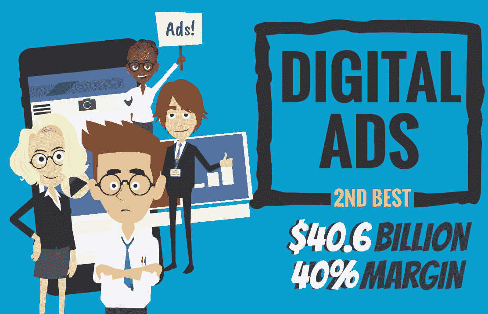

它的核心业务是社交媒体平台 Facebook 和 Instagram，以及 Facebook Messenger 和 WhatsApp 等消息应用程序。

研究表明，Facebook 的使用并没有提高人们的幸福感。相反，它让人感觉更糟。然而，也应指出，作为一个社交网络，Facebook 因其非常强大的网络效应而受益。该平台为用户创造价值，因为它将他们与许多朋友、亲戚和熟人联系起来。

# 区块链如何颠覆 Facebook 的业务？

Facebook 的去中心化版本很可能会逐渐壮大。有很多人只是在等待不同的东西出现在舞台上。未来平台应该拥抱的基石是去中心化。如果用户团结在一起，认为没有任何一家公司应该对他们的个人数据拥有如此大的控制权，那么去中心化平台的成功就非常可能了。现在，即使他们不承认，Facebook 也在管理用户体验以提高广告收入。当然，这对用户的幸福感并不是最佳的，事实上，有研究表明，人们在 Facebook 上花费的时间越少，他们感觉就越好。去中心化平台具有明显的优势，它可以调整用户的激励措施，增强他们的体验，并以去中心化的方式存储信息。

Facebook 的网络效应非常强大。已经有超过 20 亿用户使用该平台，这让新竞争对手的局面变得更加困难。一个去中心化的替代方案需要早期采用者，他们将传播信息并邀请其他用户。很可能，通过代币激励可以显著帮助吸引这样的早期采用者。

Steemit 正在引领创建这样一个平台的道路。它是一个基于区块链的社交媒体，每个人都会因为创作和策划内容而获得报酬。在 Steemit 的模式中，用户通过其本地代币来获取奖励。其网络的正确市值约为 10 亿美元：

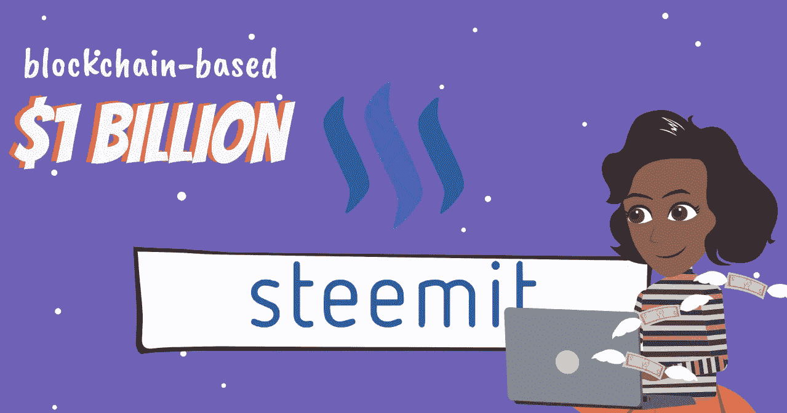

Instagram 是 Facebook 的珍宝之一，在 2012 年以 10 亿美元收购。自 Instagram stories 推出后，它是其增长最快的业务线。

所有与 Facebook 相关的评论对于 Instagram 也适用，但有一个主要例外。Instagram 是一个让用户十分简单明了的平台：他们上传照片就可以了。用户在 Instagram 上提供的数据量并不像在 Facebook 上发布的那么多。与大多数基于区块链的替代社交网络和去中心化应用程序一样，Instagram 的分散版本可以通过提供代币来激励用户参与平台。

许多人还记得几年前 Facebook 对 WhatsApp 进行的价值 190 亿美元的奢侈收购。马克·扎克伯格决定继续进行这笔交易的原因是 WhatsApp 带来了一个庞大的联系人列表，这些联系人在使用该消息应用时的情境与在 Facebook 上的情况截然不同。然而，WhatsApp 收集了大量的个人信息，并且相当重要的是对 Facebook 来说，它在人们的 Facebook 个人资料和他们的电话号码之间建立了联系，甚至更令人担忧的是他们的通讯录：

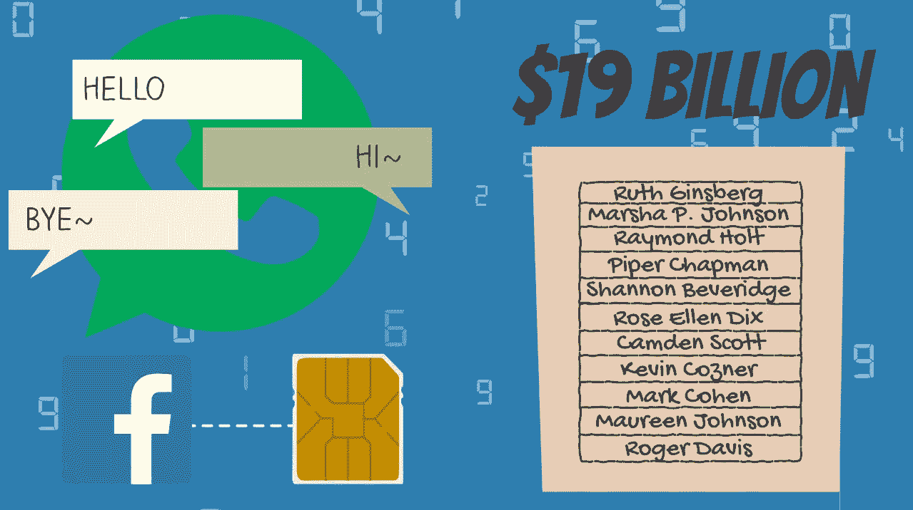

Messenger 是 Facebook 的本地消息服务，在 Facebook 用户中颇受欢迎，并且在消息领域独当一面。

当然，对于 Facebook 来说，并非一切都暗淡。将 Facebook 的平台与区块链技术和加密代币结合起来可能会提升其客户价值主张。例如，这可能极大地促进其平台上的支付和市场功能。或者，它可以帮助 Facebook 为其用户创建基于代币的加密经济激励，以鼓励他们积极参与平台，类似于 Steemit 的方式。事实上，Facebook 已经积极探索区块链机会，并已组建了专门的研发团队用于这一目的。

对于他们来说，一个很好的案例研究将是中国占主导地位的拥有 8 亿用户的微信消息应用，它被积极用于支付。

但人们也应该考虑到，社会某些时候可能会真的厌倦一个庞大的社交媒体公司拥有他们所有的数据并试图进入他们的钱包：

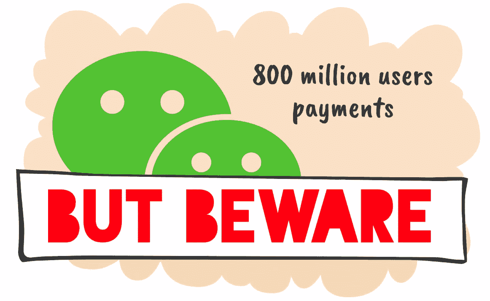

在任何情况下，未来几年内，Facebook 要么会巩固其作为全球领先社交网络的地位，要么将面临来自新兴和迅速增长的去中心化社交媒体和消息替代品的竞争。

# 亚马逊

现在，我们将把注意力集中在亚马逊上。看到这样一个规模如此之大的公司，能够以如此快的速度继续扩张业务，令人印象深刻。

其核心业务部门包括以下内容：

+   全球第一的电子商务网络门户：[亚马逊](http://amazon.com)

+   亚马逊网络服务，按需云计算平台，在其行业中领先

+   Alexa，亚马逊开发的虚拟助手

+   Audible，有声书市场

+   Whole Foods Market，美国的一家超市连锁店

+   亚马逊 Prime，亚马逊的流媒体视频和音乐部门

那么，区块链技术的出现会如何颠覆亚马逊？

对亚马逊最大的威胁将是其电子商务业务的颠覆。有许多区块链项目正在构建去中心化的市场，尽管它们大多数并不完全针对你在亚马逊上找到的消费品。这些新的竞争对手主要关注虚拟商品，如电脑游戏物品、备用电脑容量、电力等等。电子商务领域一个备受关注的新进入者，也是亚马逊.com 的直接竞争对手，是 OpenBazaar。它于 2016 年推出，由风险投资者包括安德鲁森·霍洛维茨和联合广场风险投资支持，并提供一个完全去中心化的点对点电子商务市场，用户可以使用多种加密货币进行支付。虽然它的功能没有亚马逊和其他成熟市场领导者那么丰富，但它没有平台费用，也不控制用户的个人数据。

亚马逊之所以如此成功的一个原因是它控制了在其平台上所有的客户数据，并对其进行分析和使用以优化消费者定位、转化率和收入。

与大多数互联网企业一样，网络效应在电子商务中也是关键。亚马逊拥有许多买家和卖家的临界质量和网络流量。这与一个位于市中心繁华地区的购物中心，周围有着高密度人群的情况类似。它还拥有消费者习惯和许多用户功能的优势。对于亚马逊来说，这是一个很好的市场位置，因此它是股权投资者眼中全球最高价值的公司之一。

然而，用户的便利性付出的代价可能是相当可观的。这些成本既是金钱上的，也是个人数据上的。正如我们所知，数据已经成为互联网时代最宝贵的商品之一。亚马逊完全控制平台和通过平台的所有信息。也可以随心所欲地限制对任何第三方的访问。

去中心化的电子商务市场可能为用户提供许多优势，包括更低或没有费用、对自己数据的控制以及对平台的畅通无阻的访问。让我们看看这样的平台能走多远，以及它们是否能有能力与今天我们所使用的亚马逊和其他集中式服务有有意义的竞争。

目前阶段，似乎供应商可能更有动力迁移或多样化其分销渠道到这些平台，以减轻业务风险并降低成本。另一方面，吸引消费者流量可能更加棘手，因为许多消费者倾向于首先考虑便利性，并且并不太在意他们的隐私。至少目前是这样… 但随着更多公众意识和兴趣朝着这个方向发展，这种趋势很可能会开始改变，特别是在最近有关 Facebook、Experian 和其他公司广泛报道的数据泄露丑闻的光线下。

以代币化的加密经济激励形式，如奖金或折扣和更低的价格，无疑可以帮助吸引消费者到新平台上。此外，随着市场和整个网络的增长，代币还有价值升值的潜在好处。通过这种方式，去中心化市场可以与其用户共享其网络效应的价值。这就是区块链在调节网络中所有参与者的激励方面的力量。

去中心化电子商务是否会起飞，以及以什么形式起飞，只有未来才会知道。我们可以看到新进入者的快速增长，或者现有公司（如亚马逊）成功地在其业务模式中找到了合适的方法来整合区块链技术。无论如何，去中心化有其优点，用户应该受益于此。

一个很好的例子是来自阿里巴巴，大型电子商务公司正在转向区块链。阿里巴巴的天猫平台正在其跨境供应链中采用区块链技术，以跟踪和验证产品的来源，并减轻向消费者出售假货的风险。

# 区块链对亚马逊网络服务的影响

看起来亚马逊正在很好地适应新技术，并且已经在其新的 Amazon Managed Blockchain 平台（AWS 的一部分）中创建了 Hyperledger 和 Ethereum 模板。它被宣布为一个完全托管的服务，可以轻松创建和管理可扩展的区块链网络。

该关联项目是亚马逊的**Quantum Ledger Database**（**QLDB**），它是一个旨在提供透明、不可变和经过加密验证的交易日志的分类数据库，最近也被引入。

AWS 和 ConsenSys 的区块链初创公司 Kaleido 推出了一款名为**Kaleido Marketplace**的全套平台，帮助企业实施区块链解决方案。该平台通过提供一系列即插即用的全套工具和协议，从后端开发到前端应用程序用户界面，消除了构建特定区块链项目所需的自定义代码的 80%。

与亚马逊的其他产品和服务保持一致，这应该会为在企业环境中部署区块链技术提供一个快速且简单的方式。

去中心化网络存储服务可能对这种业务构成潜在威胁，但这些新进入者还有很长的路要走：

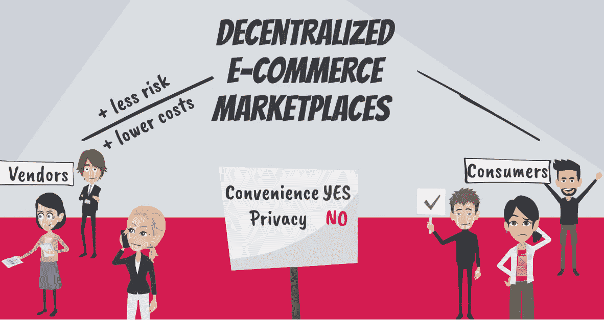

AWS 以非常有竞争力的价格提供安全存储，甚至美国政府机构如中情局都在使用它。因此，对于像 Filecoin、Storj、Sia、MadeSafe 等项目来说，至少在最初阶段，要吸引大多数已经在使用 AWS 的用户群体是很困难的。这样的分散式存储解决方案更有可能首先被区块链经济中的其他新兴分散式应用程序使用。尽管如此，通过将文件存储分散到一个消费者设备网络中，利用它们的闲置容量，并用加密令牌奖励它们的想法非常有趣和创新。这是我们最近观察到的共享经济和闲置容量利用趋势的延续，也是为寻求租用文件存储空间的人和拥有多余存储容量的人提供了一个巨大的机会。毕竟，AirBnB 对房地产做了类似的事情。

好的，太好了。我们暂停这里，继续讨论四大科技巨头之一的苹果。

# 苹果

第一代 iPod 于 2001 年发布，标志着苹果的复兴开始。该公司随后创造出一些对科技界有着巨大影响力和深受喜爱的消费电子产品。iPod、iPhone、iPad、iMac 和 iTunes 将公司的价值推向了巅峰，使其成为全球市值最大的公司。

乍一看似乎苹果是一家硬件公司，不应该受到区块链的崛起的威胁。

毕竟，去中心化与销售电子硬件有什么关系呢？

苹果传奇联合创始人史蒂夫·乔布斯的基本信念之一是，计算机系统（后来是移动设备）应该在一个中心化的生态系统内运行。按照他的观点，消费者选择将硬件和软件最佳组合在一起的产品，而消费者不该成为决定他们设备上运行的软件类型的人。这是他们付费给消费电子生产商为他们所做的事情。消费者最看重便利性的这个观点非常有道理，也一直是苹果成功的关键驱动力。乔布斯还认为，iPhone、iPod 和 iPad 主要是由软件驱动的，这也是使它们如此独特的地方，除了它们美丽的设计。

然而，这种理念与当前正在区块链技术中蓬勃发展的去中心化思想相对立。

如果人们开始感觉到分散化的软件应用和整体经济是未来的首选方式，而苹果继续实施同样的中央集权做法，这可能是一个潜在的关键时刻。目前，苹果在几代消费者中拥有非常忠诚的客户群。苹果的受众如同体育俱乐部的球迷群一样忠诚。苹果的拥趸永远不会改变立场。但是，为了在新一代消费者中保持势头，必须不断培育这一追随者，并推出令人兴奋的新产品和功能。消费者口味的转变可能会削弱苹果的竞争优势。自多年前首次推出第一款 iPod 以来，苹果首次无法自豪地宣称夺得消费者的心智，并且以其令人兴奋的新技术引领潮流。相反，最近比特币、以太坊和其他区块链加密经济的表现卓越。在我们预期的分散化变得像我们所期望的那样流行的情况下，苹果将不得不放松对其封闭花园的控制，并允许其设备与分散式应用程序一起运行，否则它将面临市场份额被服务市场需求更好的竞争对手夺走的风险。

因此，这是一个非常值得关注的发展，即分散化经济将如何影响苹果的商业模式，以及苹果将如何对待或适应公共分散式应用程序、加密货币支付和任何类型的与区块链相关的开源软件。

苹果已经开始使用区块链技术，根据其申请的专利文件，用于创建和存储时间戳，并保护设备上存储机密信息的安全元素，如 SIM 卡或 micro SD 卡。基本上，区块链可以让苹果进一步提升其设备和应用的安全性。目前，苹果的设备拥有最先进的加密技术。还记得中央情报局如何与苹果就 iPhone 的加密问题争论吗？通过引入区块链技术，苹果有可能将安全标准提高到更高的水平。

苹果也可以在其 ApplePay 移动支付和数字钱包服务中融合区块链解决方案的机会。或者，它可以利用这些解决方案来改进其 iTunes 音乐平台上的内容版权管理和价值分配。

考虑到成熟和饱和的智能手机市场，区块链可能正是苹果可以再次推动增长的正确因素。

在我们讨论的四家科技巨头中，苹果受到区块链颠覆的商业风险最小，因为大约 80%的收入来自硬件。谁知道呢，它甚至可能再次自我革新，并在区块链领域推出下一个畅销产品；想象一下，一个假设的苹果 iWallet，一个新的、高质量的、用户友好的区块链钱包，用于安全存储加密资产，与 Ledger Nano 和 Trezor 等产品竞争。

# 摘要

这一章我们拖了很长时间，所以希望你还没有放弃。我们了解了区块链将如何影响我们的日常生活。我们了解了区块链将如何影响金融行业。我们了解了目前银行面临的一些问题，以及区块链将如何解决这些问题。我们还理解了区块链将如何颠覆食品、交通、科技等常见行业！

希望这一章对所有的读者来说都是令人兴奋和启发的。如果这让你为区块链的到来感到兴奋，那么我们的任务就完成了！！请继续关注，因为有趣的部分才刚刚开始！在下一章中，我们将看看区块链和人工智能如何携手并进，改善我们的生活质量。
