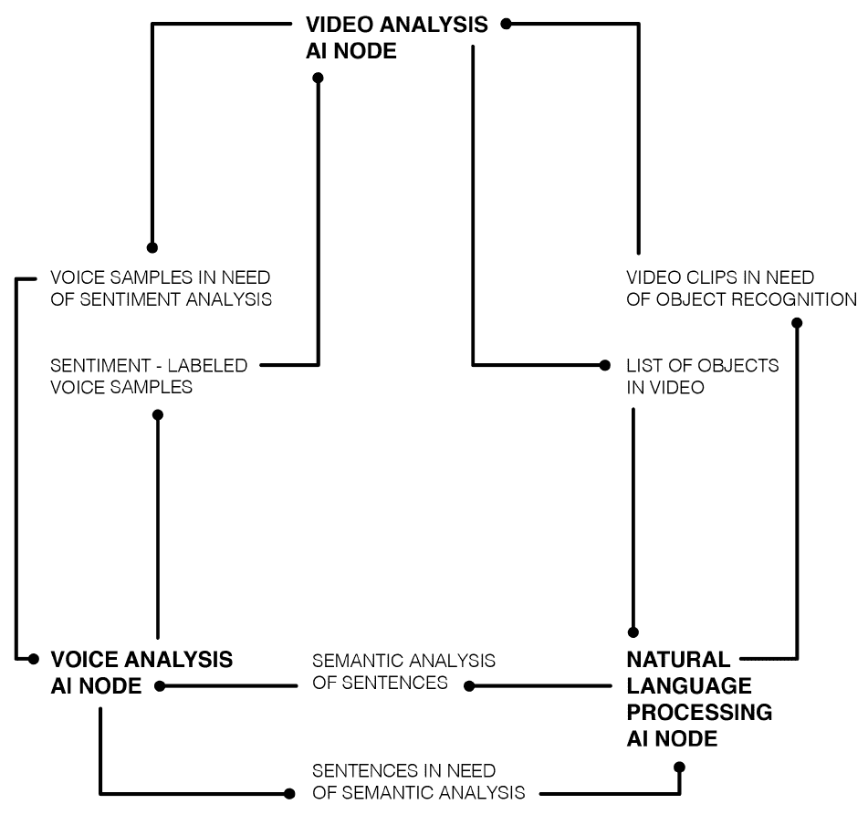
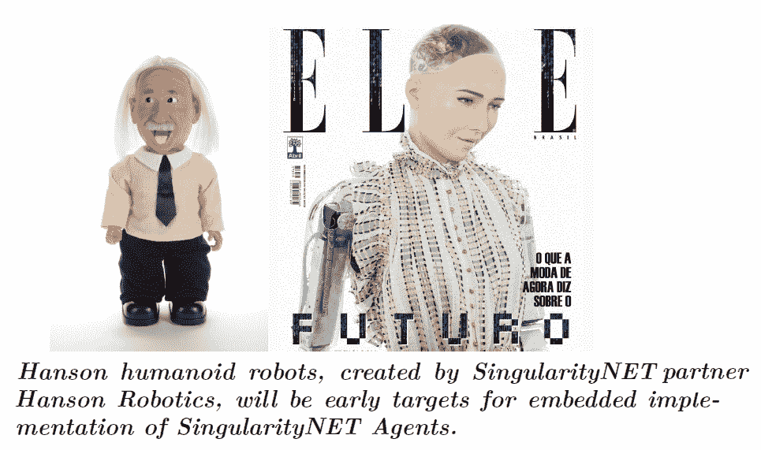
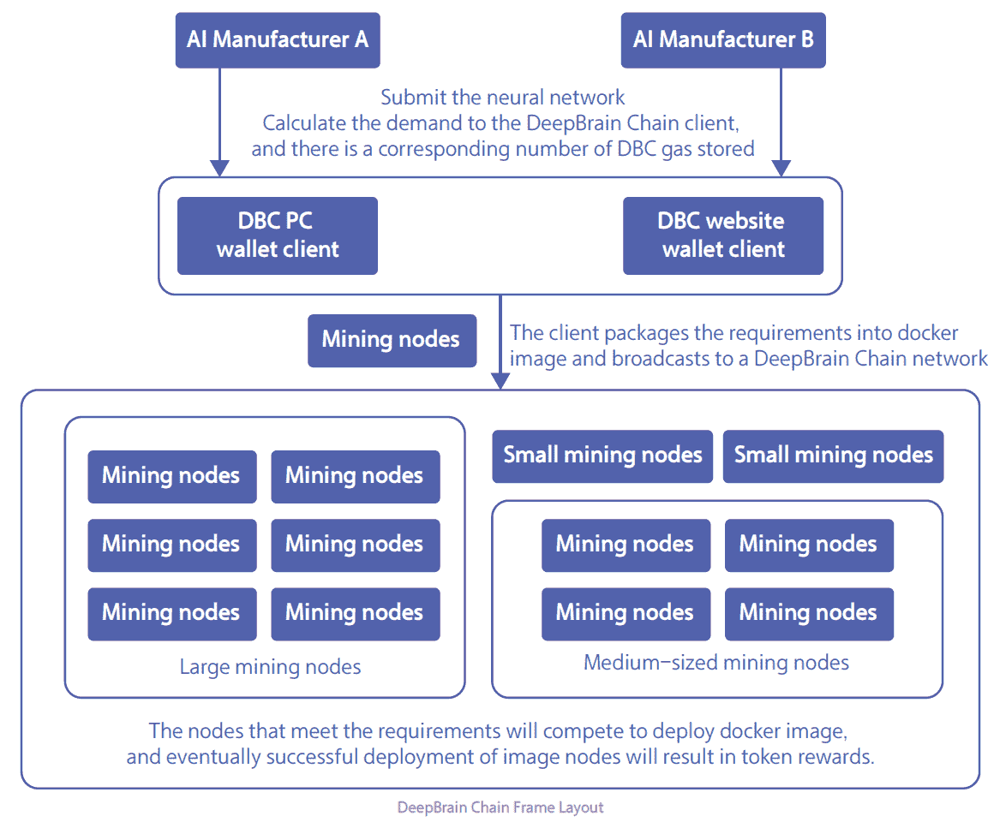
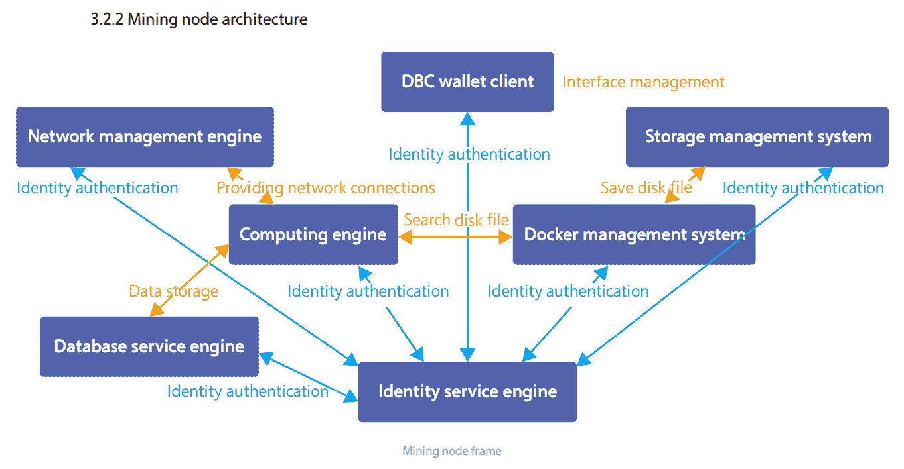
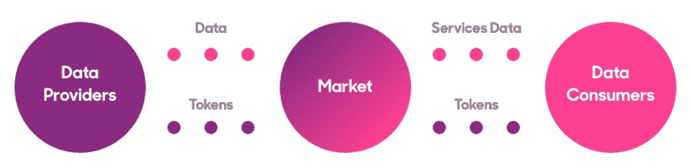
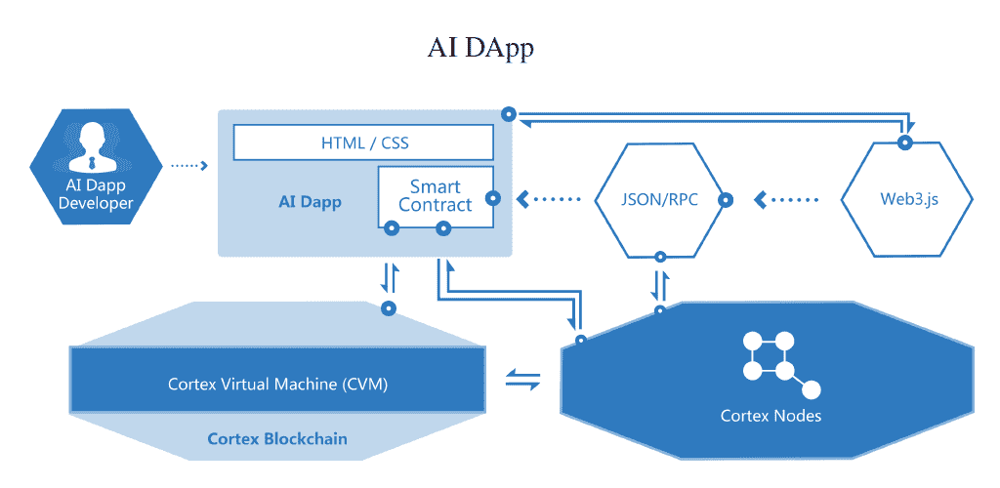
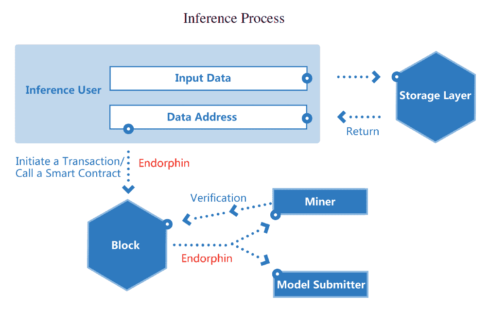
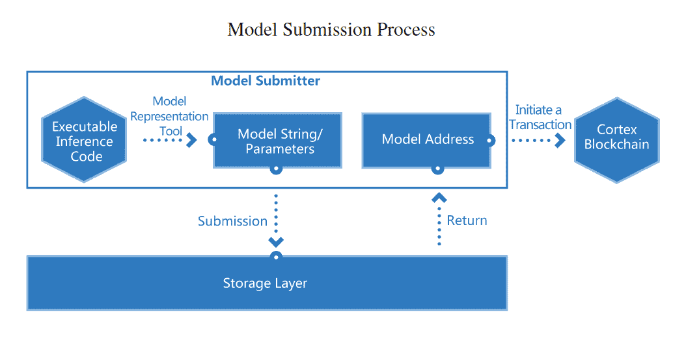
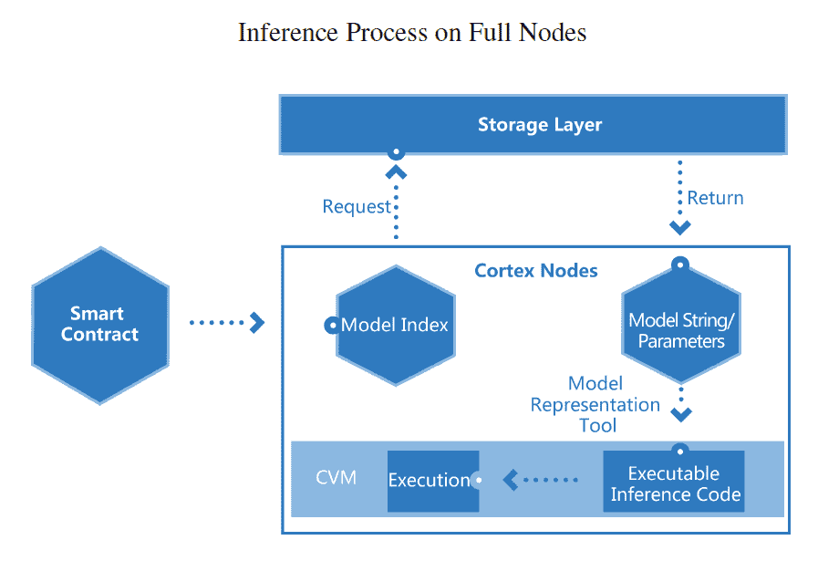

# 区块链和人工智能

区块链和**人工智能（AI）**是当今最热门的技术趋势之一。难怪大多数公司和风险投资者都对在各个领域实施这些技术感兴趣。

区块链通过使用密码学以一种创新和安全的方式去中心化和分发数据。它可用于优化价值转移网络、资产登记和市场的高效性。这也是为什么它被称为分布式账本技术。分布式账本确保网络中的所有参与方始终对其过去活动和当前余额保持同步，因为它们同步更新每一条新信息。在数字时代，当大多数交易和业务流程都是电子化管理时，这是一种非常有用的过程创新。正如我们在本书中看到的那样，它的应用范围从金融服务到供应链管理和智能合同。

随着我们在本章节中的进展，我们将涉及以下主题：

+   人工智能的简史

+   实施人工智能

+   结合区块链和人工智能的项目

+   人工智能在智能合同的未来

# 人工智能的简史

尽管人工智能目前是一个非常常见的热门词汇，但并不是一个全新的概念。该领域的研究始于20世纪50年代，当时计算机学习简单的游戏，比如跳棋。开始时，预期在20年内，机器将能够完成人类能做的任何工作。随后，人工智能的进展和衰退由于计算能力和商业可行性的限制，影响了可用资金和公众对该领域的关注。这应该不足为奇，因为这是技术进步中常见的重复模式。可以与60年代和70年代的所有登月任务以及随后的终止或大幅减速进行太空探索的情况相媲美。公众的关注和资金预算是持续创新的关键推动因素。

回到人工智能，增加的计算能力和商业成功进一步推动了其在20世纪90年代和2000年代的应用。它在物流、数据挖掘、医学诊断和其他领域找到了用例。另一个重大突破发生在1997年，由IBM开发的计算机深蓝成为首个击败国际象棋世界冠军加里·卡斯帕罗夫的人工智能。

# 实施人工智能

向当前时代迈进，我们可以看到人工智能几乎无处不在，越来越多的行业趋向于使用智能算法来自动化任务。一些例子包括亚马逊基于以前购买或活动的个性化用户推荐；Facebook和Google的定向广告；Uber的人工智能模型来确定到达时间、接载地点和票价；以及PayPal的机器学习算法来检测和打击欺诈行为。根据技术研究公司Tractica的数据显示，其在29个行业中确定了150多个具体的人工智能用例，到2025年，全球人工智能软件和服务市场规模将达到600亿美元。

人工智能依赖大型数据集来训练和改进算法，数据似乎是区块链和人工智能的交集。数据是促进人工智能发展的关键资源。基本上，区块链是一种数据结构，可以通过对等市场和激励机制来有效地集资资源，这源自博弈论。因此，我们看到尝试将两种技术结合的首个项目围绕着人工智能市场和众包计算资源展开。考虑到人工智能的巨大潜力和当前全球科技产业的状态，市场权力高度集中在少数几家强大公司手中，为人工智能资源提供去中心化的替代方案可能是一件好事。

现在，让我们更仔细地看一些正在结合区块链和人工智能的创新项目。

# 结合区块链和人工智能的项目

由著名人工智能科学家本·戈茨尔创立的SingularityNet，他也创建了类似人类的机器人Sophia，正在建立一个人工智能服务的去中心化市场。我们分析的一个良好的起点可能是该项目的白皮书，其中概括为：

"人工智能的价值和力量每年都在急剧增长，并很快将主导互联网和整体经济。然而，如今的人工智能工具受限于封闭的开发环境，大多数由一家公司开发以执行一项任务，无法将两个工具连接起来。SingularityNET的目标是成为网络人工智能和机器学习工具的关键协议，形成协调的人工智能通用智能。"

SingularityNET是一个开放源代码协议和智能合约集合，用于去中心化的协调人工智能服务市场。在这个框架内，人工智能的好处成为了全球公共基础设施，让所有人受益——任何人都可以访问人工智能技术或成为其发展的利益相关者。任何人都可以将人工智能或机器学习服务添加到SingularityNET以供网络使用，并收到网络支付代币作为交换。典型SingularityNet系统的架构如下：

SingularityNET由SingularityNET基金会支持，该基金会的运营理念是AI的好处不应该由任何少数强大的机构主导，而应该由所有人共享。SingularityNET的一个关键目标是确保该技术符合人类标准，网络设计旨在激励和奖励有益的参与者。

这里的关键思想是，AI服务应该像AirBnB对房地产一样，可以在竞争激烈的P2P市场上交易闲置容量。这里尚未开发利用的资源是存放在GitHub和其他地方的由独立研究人员开发的AI算法和软件，以及计算处理能力和内存。目前，AI研发是大学和大型科技公司的领域，而SingularityNet的目标是使其成为中小企业可以负担得起的共享资源，以自由市场价格提供服务的AI专家团队。在该平台上交换的服务可能是基于软件或硬件的，可能包括以下内容：

+   图像和视频处理服务，比如找出视频中的人物，或者生成图像的文本描述

+   语言处理服务，如文本摘要、机器翻译或文本情感分析

+   提供数据集作为训练AI对其他数据集进行数据分析的背景知识

+   要求对特定数据集进行分析

+   交换处理时间或内存

如前所述，机器学习工具需要大型数据集，这些数据集难以获取和管理。大型科技公司的封闭开发环境模式阻碍了这些数据集的共享。另一方面，像SingularityNet这样的开源环境可以以安全、加密的方式实现数据集共享。因此，它能够通过推动该领域的活动来刺激整个AI的发展。SingularityNET的一个示例如下图所示：

还有其他类似的项目试图在区块链上开拓与AI相关的去中心化市场或网络。一个名为DeepBrain Chain的项目正在建立一个分布式全球云计算平台，用于训练机器学习、深度学习和其他AI算法。AI训练任务是非常计算密集型的过程。运行DeepBrain Chain网络节点的机器可以将其处理能力出租给需要在AI模型训练中使用的参与者。用户可以在不同的AI框架中进行选择，如TensorFlow、Caffe2和h2o。DeepBrain Chain的布局如下图所示：

在前面图表中所见的矿工节点的架构如下：

平台上还可以共享和交易数据集和 AI 模型。成功在平台测试网络上运行的 AI 模型包括无人驾驶汽车、自然语言处理和人脸识别模型。

Ocean Protocol 是另一个专注于为数据创建免费的去中心化市场的项目，主要用于 AI 开发。他们的观点是，高质量的训练数据的可用性对于 AI 的持续进步至关重要，甚至比新的 AI 算法更重要：

算法的可用性似乎更高，而用于训练它们的数据集却成为瓶颈，这是 Ocean Protocol 正在解决的问题。作为试点项目，Ocean 正在与几家汽车制造商合作收集数据，以开发自动驾驶汽车的 AI。

在这里，我们看到了几个将 AI 和区块链结合起来的通用项目的例子。它们基本上利用区块链技术创建了用于 AI 算法、数据集和共享计算资源的去中心化市场，以训练这些算法。区块链的附加优势是数据加密，这有助于在共享经济中保护隐私。同态加密可用于保护用户数据和 AI 模型，使其不受云计算环境中的威胁。

# 智能合约的 AI 未来

更具未来感的智能合约的 AI 概念，最终可以用于构建和运行 AI DApps 和 **去中心化自治组织** (**DAOs**)，使其能够在非常有限的人类干预下适应和演化以完成任务，也非常有趣。

一个名为 Cortex 的项目声称是第一个支持链上 AI 的区块链。他们成功地使用量化和压缩等技术在他们的测试网络上部署了一些 AI 模型。量化是机器学习中的一个概念，它将轻量级推理与高性能结合起来，这允许 AI 模型以高准确度和低内存成本执行：

推理过程如下所示：

压缩可减小模型的大小和数据使用量。第一个模型，猫狗分类器，原先大小超过了500 MB。通过从原模型进行迁移学习，生成了一个整型模型，将其大小首先减小到约130 MB，然后减小到不到15 MB。训练后，浮点数下的准确率超过了94%，而在完全压缩并转换为整型模型后，准确率超过了90%。

模型提交流程如下图所示：

第二个模型根据MNIST数据集进行数字识别，这是一个大型手写数字数据库，通常用于训练各种图像处理系统。它从二值化图像中推断数据，以超过98%的准确率给出0到9的结果。

在测试时，两种模型都被证明能成功消除推断过程中的随机因素，并给出确定性结果以达成链上的推断一致性。这些结果表明，一些准确性高且性能好的人工智能模型可以部署在链上。自然地，Cortex在存储容量和处理能力方面对于全节点有着比比特币和以太坊更高的硬件要求。全节点上的联合推断过程如下图所示：

正在设想的未来人工智能 DApps 包括个性化推荐的信息服务（根据用户资料建议潜在兴趣的新闻）、图像搜索引擎、新闻/摘要写作（根据另一段文本生成新文本）、金融服务，如信用评分（基于用户的在线数据）或智能投资咨询（基于金融数据集）、提供自动问答服务的人工智能助手（根据人类对话生成答案的聊天机器人）以及行业知识图谱（可用于医疗、咨询和其他行业的专家系统）。

# 摘要

鉴于区块链中固有的数据和计算冗余，规模化部署人工智能智能合约仍然面临许多挑战，并且在性能上可能始终不如集中式引擎。然而，一些机器学习算法可以以成本和数据效率的方式部署在链上，以将智能合约带入下一个水平。目前，区块链和人工智能技术最可行的组合似乎是将计算资源汇集在一起，并在算法和数据提供者网络中分配这些资源，以协作方式利用这些资源，以模拟大型世界级人工智能公司的性能和输出。
