# 第十五章：将区块链提升到新水平的当前问题和潜在解决方案

如果你迄今为止已经彻底阅读了本书，你应该对区块链技术是什么，它是如何工作的，以及它的应用和用例有了相当好的理解。也许你对这项新技术具有颠覆性潜力和所有令人难以置信的优势深感兴奋。准备好迎接这个勇敢的新去中心化区块链世界了吗？嗯，并不那么快，我们还没有完全到那一步。首先需要解决一些关键问题。在本章中，我们将解决这些问题，并寻找潜在的解决方案。

本章中我们将涵盖以下主题：

+   区块链所面临的问题

+   可扩展性问题的解决方案

+   在链上的解决方案

+   离链解决方案

+   解决其他挑战的办法

+   下一代区块链项目

+   令人兴奋的区块链世界

# 区块链所面临的问题

分布式系统在许多方面都很出色，但在可扩展性和治理方面与集中式系统存在固有劣势。在网络上的所有节点之间运行共识需要太多时间和能量。相比之下，一个只有一个中央服务器的网络会更快吗？但是我们已经讨论过中央服务器模型的缺点：它有单点故障。因此，在可扩展性和速度与安全性之间存在折衷。

# 可扩展性

目前，与 Visa、Mastercard 和 PayPal 等集中式支付处理网络相比，区块链处理速度非常慢。比特币的区块链目前每秒只能处理高达七笔交易。以太坊的区块链稍快一些，目前每秒最多能处理三十笔交易。将这与 Visa 和 Mastercard 可能处理多达大约五万笔交易每秒进行比较。PayPal 最高吞吐量为每秒四百五十笔交易，如下图所示：

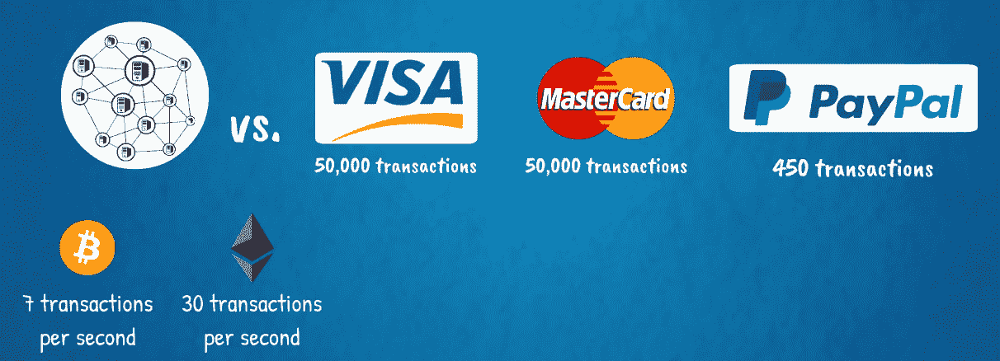

显然，比特币和以太坊的主要可扩展性瓶颈之一是工作证明全球共识机制。它们目前的架构需要进行一些修改才能扩展到大规模采用的通用技术。当然，全球开发者社区不断提交协议改进提案，核心开发团队也在忙于升级。但技术复杂性只是问题的一面。另一方面是政治因素，这就是治理问题涉及其中的地方。

随着如此广泛的利益相关者群体，极其难以就项目的未来发展达成共识。此外，各方参与者之间的关系非常复杂。区块链网络不是公司，在公司中，所有权、权力和控制之间的分离，即股东、管理委员会和其他利益相关者之间的分离是明确的。至少在这个早期阶段，区块链社区的治理界限相当模糊。重要利益相关者包括创始团队、基金会或其他正式治理机构、开发者、矿工和加密资产持有者。所有这些利益相关者共同为网络的价值做出贡献。为此，他们构建了一个生态系统，其中每个利益相关者群体都需要其他群体，他们都从彼此在系统中的相互参与中受益。

在经济学中，这被称为**正网络效应**。网络越大，价值越大。

但是，网络的巨大多样性在需要做出决策并且每个人都需要同意采取行动的时候会带来问题。这已经在许多场合得到证明，其中一些最著名的包括 2016 年 DAO 黑客攻击后以太坊网络的分裂，分裂为以太坊和以太经典，以及 2017 年的比特币扩容争论。后者在 2017 年的大部分时间内持续发酵，热门话题是有关比特币协议升级提案，涉及增加区块大小限制和实施一种称为隔离见证的技术，这两者都是为了提高可扩展性。在那场辩论中，比特币社区出现了巨大分歧，这种分歧无法解决，最终导致网络的分裂，即硬分叉，分裂为原始比特币和新的比特币现金。

因此，这就是我们今天拥有比特币和比特币现金，以及以太坊和以太经典的原因：

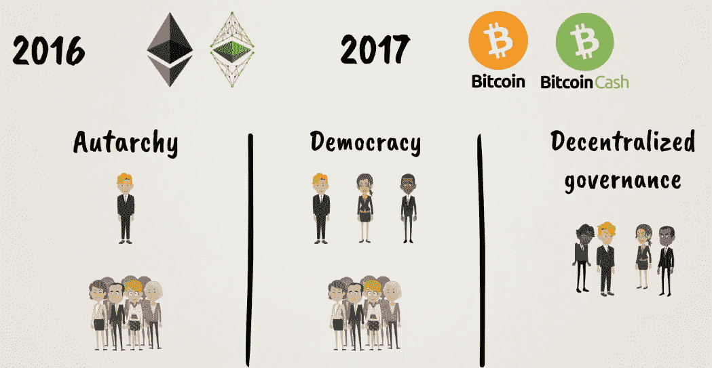

# 治理

去中心化治理是一个相当复杂的问题。政治体系一直在努力找到权力和代表权的最佳平衡，经过了这么多的试错之后，这种平衡很难高效地维持。代表是必要的，以简化决策过程，但也会产生权力中心，并使系统更加中心化，这可能与最初的设想不符。

那么，如何在不影响去中心化的基本原则的前提下简化区块链社区的治理？这是新一代区块链技术试图解决的下一个重大问题，紧随可扩展性之后。

# 互操作性

区块链的另一个关键问题是互操作性。目前，不同的区块链之间无法相互通信，甚至很难从互联网获取数据。为此，它们需要特别的中介，称为**预言机**。预言机提供了区块链上存在的智能合约和它们需要访问的任何外部数据之间的接口。这些数据可能是智能合约正确执行的关键条件。因此，集中式预言机作为中间人，并不是区块链技术的理想解决方案，因为这项技术试图剔除中间人，推动全球范围内的去中心化。下一代区块链肯定需要能够相互连接，并与传统的 IT 基础设施相连，以实现全球成功：

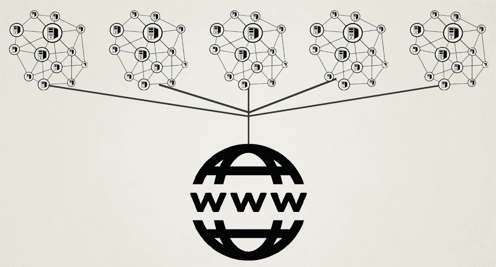

# 隐私

区块链上的隐私是另一个需要解决的关键问题。例如，金融行业受到如此严格的监管，以至于客户隐私必须以任何代价保持，并且敏感信息只能根据监管者的需要进行共享。同样地，许多有意在其内部流程中部署区块链技术的公司可能不希望他们的商业机密被记录在透明且不可变的公共账本上。同样，许多备受关注或高净值个人的私人金融交易也是如此。在互联网时代，隐私受到高度重视，如果区块链技术要实现大规模应用，就必须能够为用户提供这个选项。

现在我们已经确定了主要问题，让我们来看看它们的潜在解决方案。在区块链创新的最前沿，我们有诸如权益证明及其变体等新型共识算法，以及其他尖端技术，比如闪电网络、状态通道、侧链、分片、等等。我们将在接下来的章节中更详细地讨论它们。它们被开发为升级现有的区块链协议，如比特币和以太坊的解决方案，也被用作新兴区块链协议架构的基础，如 Cardano、Tezos、EOS、Polkadot、Cosmos、Icon、Wanchain、RChain、Aion、Zilliqa 等：

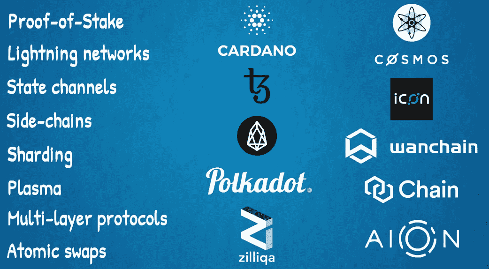

变得非常有趣！我们将一窥区块链 3.0 的前景！请继续关注！

# 解决可扩展性问题的解决方案

首先，区块链需要解决可扩展性问题。

在区块链的背景下，我们究竟是什么意思？公共区块链（如比特币和以太坊）的一个核心安全特性，同时也是容量限制，是其协议要求每个交易都由网络中的每个完整节点处理。区块链上发生的每个操作，例如付款或部署智能合约，都必须由所有完整节点复制。这就是使公共区块链同时安全、自治和分散的原因。参与者不必依赖别人告诉他们区块链的当前状态；他们自己弄清楚。

这限制了区块链的交易吞吐量。它不能高于各个节点的处理能力，其中一些可能相当有限。例如，一些节点可能使用性能较弱的计算机，如消费者设备。然而，它们对于保持网络尽可能分散化非常重要。我们不希望所有挖矿都集中在大型工业级挖矿设施中，这将降低分散化程度，从而削弱区块链的核心价值主张。这将使其类似于当前的互联网状态，基本上是由谷歌、亚马逊和 Facebook 等科技巨头主导的寡头垄断，或者当前金融行业的形状，由巨型跨国银行集团主导的寡头垄断。

因此，为了使区块链技术能够扩展到数十亿全球用户群体，与互联网规模相匹配，并同时保持尽可能分散化，需要进行一些修改和升级。

区块链扩展解决方案通常分为两种类型：

+   在链上或第 1 层解决方案中，这些解决方案之所以被称为如此，是因为它们涉及修改主要底层区块链基础设施

+   在链下或第 2 层解决方案中，这些解决方案开发了额外的网络基础设施，与主区块链连接但独立运行。

为了给你一个有用的类比，想象一下我们有一条高速公路，我们希望将其升级，以便在两个城市之间实现更快的交通。也许这条高速公路穿过一个风景如画的自然景观，有山脉、湖泊和河流。这条路可能有点窄，路面可能有点粗糙不平，所以不允许非常高的速度。这条路也可能不是直线连接两个城市，并且有很多弯道、上坡和下坡的路段，以绕过湖泊或攀登山脉。现在，升级这条路以实现更快的旅行和更高的车辆吞吐量有两种主要方法。我们可以使其更宽或改善其路面的质量，或者我们可以建造额外的基础设施，如隧道和桥梁，以便快速通过山脉、湖泊和河流。或者，我们可以两者兼而有之，因为所有这些解决方案彼此互补。

这是以太坊正在追随的路径。有许多项目正在为以太坊开发各种可扩展性解决方案，涉及许多才华横溢的开发人员。它们沿着以下方向发展：

+   层 1 的链上解决方案包括从工作量证明转向权益证明共识算法以及实施一种称为分片的技术。

+   层 2 的离链解决方案包括状态通道，一个名为 Raiden 的闪电网络，用于扩展智能合约的新概念层 Plasma，以及用于处理复杂计算的另一个解决方案 Truebit。

不同项目如下图所示：

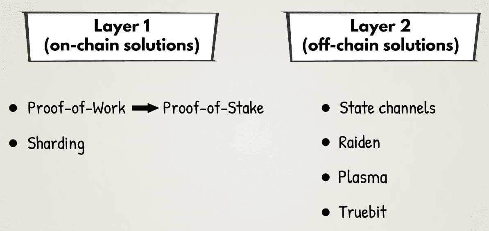

接下来，我们将对它们进行更详细的介绍。你可以想象到这些新技术可能相当复杂，但我们会尽量不过多涉及技术细节来解释它们。

# 链上解决方案

正如我们在前面的部分所看到的，链上交易可能相当繁琐。为此，我们将使用以下解决方案。

# 权益证明

在本书中，我们介绍了两种共识算法：工作量证明和经过时间的证明：

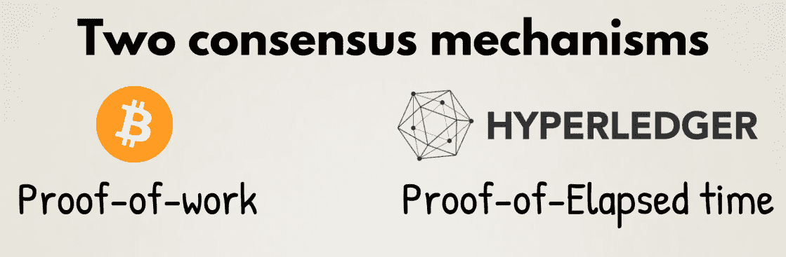

正如我们所了解的，共识算法需要适合其支持的生态系统。比特币和以太坊等开放式无权限公共区块链与 Hyperledger 等私有权限区块链框架之间存在很大差异。这种差异源于对系统的信任需求或缺乏信任。不同程度的信任需要不同的共识算法。因此，工作量证明适用于比特币和以太坊，但经过时间的证明则不适用。另一方面，经过时间的证明是私有权限区块链框架 Hyperledger 的一个很好的解决方案。

对于公共区块链的另一种选择是权益证明。事实上，以太坊自问世以来的愿景就是转向权益证明，预计将通过卡斯珀升级实现这一目标。

权益证明利用了一种在游戏理论中的资源抵押原则，以便挖掘新的区块，这种逻辑类似于工作量证明。主要区别在于，在工作量证明中，矿工抵押外部资源，如电力和计算机硬件，而在权益证明中，他们抵押代表其在网络本地加密资产的份额的内部资源。因此，在以太坊的情况下，挖矿节点需要抵押他们的以太币加密货币以验证新的交易区块。如果他们不遵守协议的规则，矿工将失去加密资产的安全押金。这种形式的抵押品应该为矿工提供足够强大的激励来诚实行事。

权益证明与工作量证明相比的潜在优势有很多。它不会消耗大量的电力，因此更具可持续性和环保性。它还应该提供更高的交易吞吐量，因为网络共识可以更快地达成，甚至可能几乎立即达成。

权益证明和工作量证明也可以在混合共识算法中结合使用。例如，工作量证明哈希难题可以对拥有原生加密资产更多权益或持有权益时间更长的矿工更容易。

实际上，混合共识系统是以太坊推动其向权益证明过渡的路线图。在以太坊 Casper 升级的第 1 阶段，所有工作量证明机制仍然存在，但额外的权益证明机制被添加了进来。在这个实施中，每 100 个区块中就有 1 个通过权益证明共识进行验证的检查点。希望成为权益证明验证者的参与者可以将他们的以太币加密货币存入一个特殊的智能合约地址：一个 Casper 合约。这个地址将为他们提供一种特殊的验证代码，这是一种密码学密钥。这个想法类似于我们在 第五章 中讨论的用于签署和发送交易的密钥，*比特币的五大力量 - #2 密码学*。

这个特殊的代码允许验证节点签署和发送消息，借此他们投票并参与权益证明共识过程。要使新的交易区块获准加入区块链，至少有三分之二的活跃验证者池必须对其进行承诺。如果出现这样的情况：同时挖掘到了两个不兼容的区块，带有冲突交易集的矿工将失去他们的押金，这代表了以诚信行事的巨大激励。攻击权益证明共识机制的成本可能甚至高于购买大量昂贵的计算机硬件进行挖矿并对工作量证明共识系统进行重复攻击。在权益证明中，验证者还以交易费的形式获得挖矿奖励。这实际上为他们存入的权益提供了稳定的收益。这类似于人们从债券或银行存款中获得的利率。这种**投资回报率**（或**ROI**）也类似于工作量证明矿工在挖掘新区块时获得的区块奖励，以补偿他们对物理硬件和电力的投资。有关此过程的详细描述，请参阅 第六章，*比特币的五大力量 - #3 共识算法*。

正如以太坊创始人维塔利克·布特林所说：

*"权益证明可以被认为是一种虚拟挖矿，而在工作量证明中，用户可以花费现实世界的美元购买真实的计算机，这些计算机消耗电力并以与支出成本大致成比例的速率生成区块，在权益证明中，用户花费现实世界的美元购买系统内的虚拟货币，然后使用协议内的机制将虚拟货币转换为虚拟计算机，该计算机由协议模拟以以大致与支出成本成比例的速率生成区块，从而复制完全相同的效果但不消耗电力。"*

大多数试图构建下一代区块链的新项目使用某种形式的权益证明共识机制。

Proof-of-Stake 的潜在挑战在于它是一种较新且在大规模上尚未经过充分测试的协议。毕竟，工作量证明是一种更为成熟和经过实战检验的共识机制。从比特币的 10 年历史可以看出这一点。这就是为什么目前大多数备选公共区块链或者说另类币使用它的原因。基于工作量证明仅支持未来规模与互联网相当的全球交易网络是否可持续是另一个问题。也许权益证明更适合于这一点。甚至更有可能的是，我们将会有许多不同的共识算法在使用，每个算法适用于不同的情境：

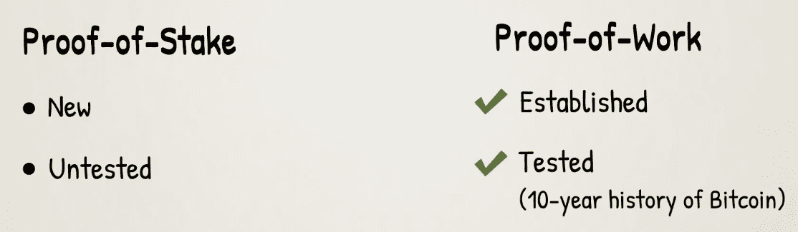

# 分片

分片在计算机科学中并不是一种全新的技术，已经被用于扩展现有的分布式数据库，比如 MySQL 和 MongoDB。其思想是将网络上的所有任务分割为多个由不同节点处理的块。这样，任何单个节点将仅参与验证区块链的一部分，而不是全部。

这将导致吞吐量提高和存储需求降低。分片的基本过程如下图所示：

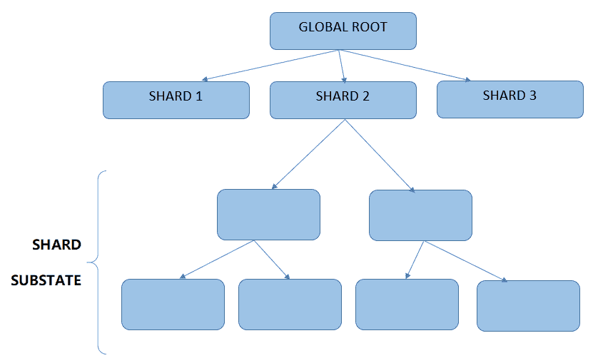

在区块链世界中实现分片涉及将区块链状态分割为多个所谓的片段。共享账本的状态可以被分割，任务可以根据账户余额、智能合约代码、交易广播、处理和存储或者其他方式划分。在分片可以在区块链中完全实施之前，有一些挑战需要解决。这些包括片间通信和每个片段历史上的共识。目前，分片是区块链领域的一个活跃研究领域，一些协议正在尝试以不同程度实现它。

下一代可扩展以太坊的计划包括实现权益证明共识算法和分片。正如 Vitalik 所说：

*"基本方法是通过一个架构来解决可扩展性挑战，在这个架构中，来自全球验证者集合（在我们的案例中，通过股权质押创建）的节点被随机分配到特定的分片，每个分片并行处理不同状态的交易，从而确保工作被分散到节点上而不是由每个人都去做。"*

# 离链解决方案

第二层解决方案是建立在主区块链基础设施之上的。它们不需要对基础协议进行更改；相反，它们仅仅作为与离线软件互动的智能合约存在。我们将在接下来的章节中了解一些这样的解决方案。

# 支付或状态通道

支付或状态通道是较为成熟的区块链可扩展性解决方案之一。其想法是利用侧通道或链来处理主链之外的交易。一旦侧链上的交易被处理并通道状态最终确定，它将被写回主区块链上，如下图所示：

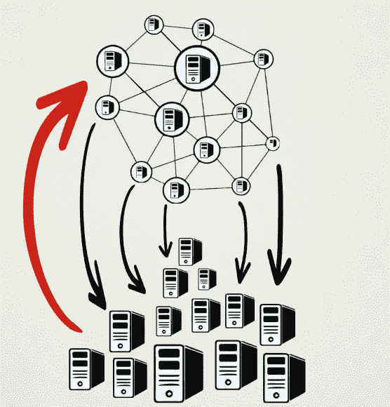

这样一来，很多的交易处理负载都被外包给了一个更快的侧链，从而最小化了矿工总体验证工作量。

下面有一个有用的例子来阐明这个想法。想象两个朋友去酒吧开了一个账单。这样一来，他们不需要分开支付每一轮饮料的费用，而是由酒保记录他们各自的点单，并在晚上结束时一起结账。

同样地，当两个参与方在支付通道之间进行交易时，并不会在主区块链上记录每一笔交易。而是只有在他们在侧链上完成所有的交易后，他们各自的账户余额才会被记录在主区块链上，如下图所示：

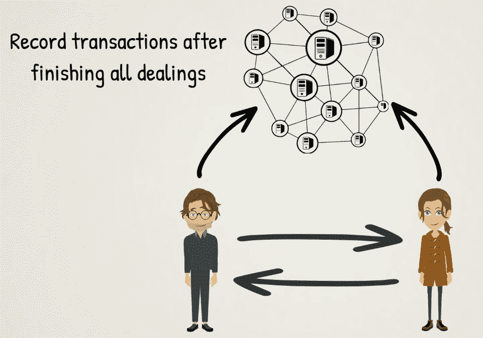

用更加技术化的术语来说，这个过程按照以下步骤进行：

1.  首先，区块链分类账的一部分，包括支付通道参与方的账户余额，被锁定在一个智能合约中。这个智能合约包括通道参与方之间交易的协议和业务逻辑：

1.  然后，参与方之间的离线交易处理就会进行。只有当他们使用通道的时间内，参与方的账户余额状态才会在他们之间被更新。这样就可以在不需要主区块链的情况下处理任意数量的交易，使得整个过程更加快速和可扩展。

1.  当各方之间完成他们的交易后，支付通道被关闭，他们的账户余额的最终状态被写回到主区块链上：

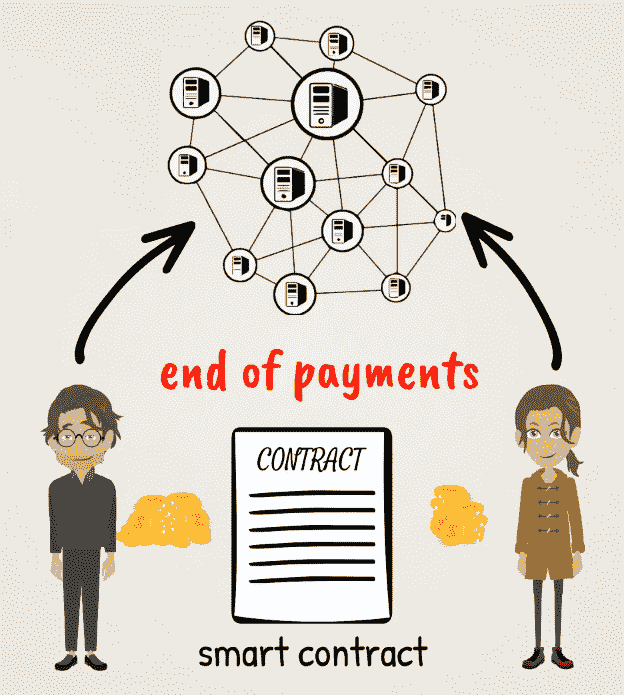

这是使区块链网络更快更轻的非常有效的解决方案。付款通道对微支付和物联网交易等应用是一个不错的解决方案。它们可以最大程度地降低网络上的交易处理成本。

付款通道被用于比特币闪电网络和以太坊的雷电网络。

闪电网络提供了一个快速交易的有用平台，在这里参与者不需要与他们想要交易的每个人开立双边支付通道。相反，该平台提供了一个网络，其中包含可以到达与之连接的所有人的通道。因此，用户只需开立一个通道连接到闪电网络，然后可以与其他任何与之连接的人交易。

比特币闪电网络最近已经部署，并已经投入运营。

还有一些去中心化应用程序有效地使用状态通道。你还记得 Fun Fair 吗？这是一个在以太坊上运行的在线游戏平台。他们建立了称为 Fate 通道的状态通道，以实现快速高效的交易，并促进其平台的可伸缩性。

# Plasma

Plasma 是由 Vitalik Buterin 和 Joseph Poon 在一篇名为*Plasma: Scalable Autonomous Smart Contracts*的研究论文中引入的新概念，该论文于 2017 年 8 月发布。在某种程度上，它与状态通道类似，因为它旨在构建一个可以在主区块链之外进行交易的平台，同时仍然与之连接。

这里的新颖之处在于 Plasma 允许所谓的子区块链通过一系列智能合约连接到主以太坊区块链。每个子链又可以有自己的子子链。这种架构使得许多复杂操作仅通过子链上的智能合约完成，与以太坊主网的互动最小化。通过这种方式，整个去中心化应用的扩展可以被管理。有了 Plasma，我们可以避免每个智能合约操作在以太坊网络上的所有完整节点上的复制。这个解决方案可以分担交易处理的工作量，并使以太坊网络更轻量和更高效。Plasma 架构如下图所示：

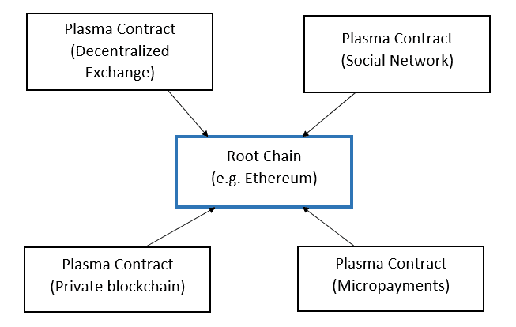

在 Plasma 中，子区块链可以有自己的共识算法，这可以与以太坊主网使用的算法不同。

Plasma 还提供了一种安全机制，保证用户始终可以将他们的资金和资产从子链提取到主以太坊区块链。

为进一步确保 Plasma 链的安全，可以部署另一种机制，即子链上的验证者或块生产者在以太坊主网上的智能合约中承诺存款，这将约束他们按照规则行事，否则会失去他们的存款。

如果我们将状态通道技术与 Plasma 技术进行比较，状态通道应该仍然可以实现更快和更便宜的交易，而 Plasma 则应该允许更多的功能和灵活性。实际上，这两种技术可以结合起来，状态通道建立在 Plasma 链之上。

# Truebit

Truebit 是一项新技术，由 Jason Teutsch 和 Christian Reitwisner 于 2017 年 11 月发表的题为*A scalable verification solution for blockchains*的研究论文中提出。它旨在促进以太坊区块链上的非常复杂的计算。这与增加交易吞吐量不同，因为像状态通道和 Plasma 这样的扩展解决方案旨在解决这个问题。

要理解 Truebit 的用例，我们需要牢记在主要的以太坊区块链上执行的计算是昂贵的。同样，这是因为它们同时由网络上的所有完整节点处理。为了补偿矿工的计算工作，以太坊有一个称为 gas 费用的奖励机制，实质上是由调用交易的用户支付的交易费用。此外，每个以太坊块都有一个设置了总共能够在一个块中进行的计算量上限的 gas 限制。因此，一些计算量过大的任务可能无法包含在一个块中，即使它们是该块中唯一的交易。

例如，在以太坊上运行的智能合约可能需要验证在其他区块链（如比特币）上已经完成的交易。这对于一些希望连接两个区块链的应用程序可能是必要的。这种验证可能是在以太坊主网上执行的一个过大的计算任务。在这种情况下，Truebit 可以提供帮助。它本质上是将执行验证的工作外包给第三方。为了保证这些第三方诚实行事，他们需要在以太坊智能合约中锁定存款，如果他们的工作没有正确完成将会被放弃。我们可以称这个方面为**Solver**。为了强制正确操作，该方案还使用另一个第三方，该第三方检查第一个第三方执行的工作，并有动力正确地进行这项工作。我们可以称这个方面为**Challenger**。如果 Solver 和 Challenger 获得的结果有差异，它们需要确定导致不一致的确切操作。这将缩小在以太坊主网上执行的计算任务，并清楚地显示真相所在，以及哪个是正确的结果。

以下图表显示了该协议的流程：

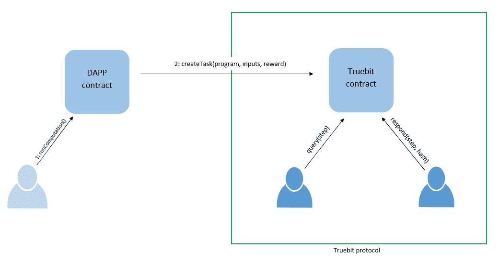

Truebit 可以成为一种有用的解决方案，允许在以太坊区块链上运行复杂的机器学习算法，从而实现可用于运行分散自治组织的人工智能智能合同。

最后，我们应该注意，在所有系统中，都存在着在可扩展性和速度之间以及安全性之间的固有权衡。对于高价值的交易，也许直接在主要区块链上处理它们总是更好的，出于安全考虑。小额交易可能更适合使用我们讨论过的链下扩展解决方案。

区块链技术的下一代可能会实现这里提出的解决方案的组合，以解决可扩展性问题。

# 其他挑战的解决方案

除了可扩展性之外，区块链技术在发展和升级的几个其他方面也在发展。

互操作性是一个非常重要的领域，是许多研究和开发工作的重点。目前正在测试各种在不同区块链协议之间构建桥梁的机制。这些包括所谓的原子交换、去中心化交易所和链间通信协议，如下图所示：

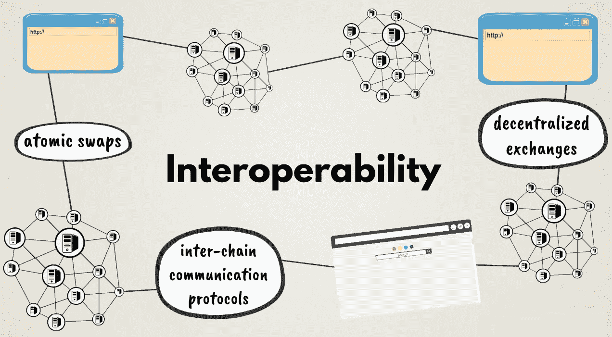

原子交换代表着一种直接的加密资产交易，其中一种区块链（比如比特币）的加密资产直接交换成另一种区块链（比如莱特币）的加密资产。这是在链上进行的，与大多数流行的加密资产交易所不同，后者会在链下进行交易匹配和结算，就像标准金融交易所一样。这种或其他直接跨链交易机制正在新兴的去中心化交易所中部署，预计将成为未来的主要交易场所。

另一个重要的新发展来自 Rootstock，它正在为比特币构建一个智能合约平台。Rootstock 平台作为主比特币区块链的侧链连接在一起。它引入了称为**智能比特币**的智能合约代币，这些代币与原始比特币挂钩。它们还与以太坊兼容，因为它们使用相同的编程语言 Solidity，并且与**以太坊虚拟机**（**EVM**）兼容。因此，这可以在比特币和以太坊网络之间提供一定程度的互操作性。Rootstock 还实现了闪电网络的一个版本，称为 Lumino 网络，可以将其交易吞吐量提高到每秒数千次交易。

正如我们之前讨论过的，隐私对于企业和个人来说也非常重要。最强大的新隐私增强技术之一是由 ZCash 首创的**零知识证明**（或**zk-SNARKs**）。以太坊最近将这项技术整合到了自己的协议中。这应该为以太坊创建一个隐私层，这可能极大地增强其功能。例如，它可以在以太坊上实现去中心化的投票应用程序，这在本质上需要隐私。匿名以太坊代币还可以有许多其他应用。

实际上，许多新兴的区块链协议计划包含隐私功能，并将 zk-SNARKs 视为其中最佳选项之一。这些项目包括 Tezos、Polkadot 和 Rootstock 等。

治理是区块链领域另一个迫切需要解决的问题。该领域的大多数解决方案都围绕着权益证明以及各种投票和质押机制。此外，正在设计具有不同协议层的新区块链架构，而不仅仅是一个负责一切的协议，以解决这个问题。通过这种方式，例如，可以将交易验证规则与网络协议规则分离，并且每个维度可以单独演变。利益相关者可以独立投票表决不同部分的区块链协议升级，这将促进其去中心化治理的灵活性。

接下来，我们将研究一些旨在提供第三代区块链的新兴项目。

# 下一代区块链项目

除了比特币、以太坊和其他已建立的区块链的升级之外，还有许多令人兴奋的新项目正在涌现，并试图打造未来的区块链。

我们简要提到了**Tezos**。它被描述为一种通用的自修复的加密分类账。这意味着它部署了一个去中心化的共识机制，不仅用于交易验证和更新其区块链的状态，还用于治理其协议和网络的演进。为此，它计划部署一个委托型权益证明共识算法，并将其区块链协议分为三个不同的层：

+   一个负责在其网络上广播事务的网络协议

+   一个事务协议，定义了使事务有效的标准

+   一个共识协议，规定如何就一系列交易达成共识

这应该使 Tezos 生态系统的治理高效，并允许其频繁演变和更新，以纳入其社区利益相关者认为合适的任何功能。通过这种方式，Tezos 在任何时候都有可能包含区块链领域开发的最新和最佳功能，并使自己处于技术创新的前沿。这些功能可能包括新类型的共识算法、隐私功能、链上或链下可扩展性、互操作性解决方案等等。

Tezos 还被设计为一个智能合约平台，可以支持像以太坊这样的去中心化应用，但它使用不同的编程语言，并且在这一领域也旨在带来一些改进。其主网于 2018 年 9 月启动。

**Polkadot**由 Gavin Wood 领导，他曾是以太坊的创始人之一和**首席技术官**（或**CTO**）。它专注于解决区块链之间的互操作性问题。Polkadot 旨在为连接不同区块链提供网络基础设施。他们希望构建骨干基础设施，称为中继链，连接其他侧链，称为 para-chains。这些侧链或 para-chains 可以是其他现有的区块链网络，例如比特币、以太坊和 Hyperledger 等，如下图所示：

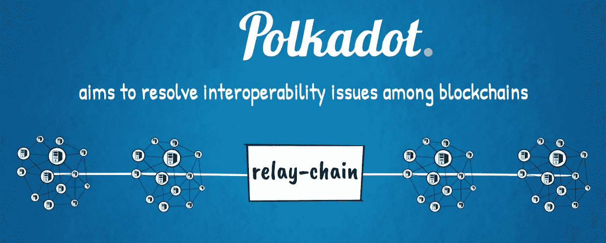

由于 Polkadot 的主要目标是与其他区块链提供跨链互操作性，因此不打算像以太坊那样支持定制的复杂智能合约应用。其目标是保持中继链尽可能简单，以便通过优化其操作来提供高效的互连性。Polkadot 预计将于 2019 年上线。

由 Tendermint 开发的**Cosmos**是另一个备受期待的项目，专注于构建跨链互联性。它使用去中心化交易技术，其主网于 2018 年推出。

**Aion**是另一个试图构建与外部网络桥接的互联区块链的新项目。他们希望实现一种新颖的、混合的、委托的 Poof-of-Stake 或 Proof-of-Work 共识机制，构建在行业迄今为止的大量研究和开发基础上。他们利用以太坊、Java、机器学习和现代计算机科学其他领域的概念，旨在提供下一代区块链技术。

**Aion**与另外两个专注于构建区块链互联网络的知名项目合作，分别是**ICON**和**Wanchain**，两者均来自亚洲。Wanchain 还利用环签名实现隐私功能，这是我们与 Monero 一起推出的技术。这些项目与 SWIFT 国际支付系统相类似，每个国家都有自己的货币体系，但来自任何国家的多家银行都可以通过 SWIFT 网络进行连接和互操作。

另一个令人兴奋的新项目**Zilliqa**旨在构建一个实现分片的区块链，这是以太坊目前正在探索的可扩展性解决方案。它还提供与以太坊 Solidity 语言兼容的智能合约编程能力。

另一个试图实现分片的新项目是**RChain**。他们正在构建一个具有虚拟机和编程语言的智能合约和去中心化应用平台，利用了以太坊和其他最近创新的概念。RChain 还正在构建类似于以太坊 Casper 的权益证明共识协议。

**Cardano** 和 **EOS** 是另外两个着眼于一次性解决现有区块链局限性的显著项目，涉及可扩展性、治理、互操作性等问题。它们都基于委托权益证明共识机制，并支持智能合约。它们目前正处于不同的发展阶段，并受到区块链社区的高度期待。

雄心勃勃的新项目规模庞大，覆盖所有项目已经超出了我们的范围。

# 区块链这个激动人心的世界

我们现在可以得出结论，区块链是一项激动人心的新技术，它仍处于初级阶段，自然需要解决一些问题并成熟起来，然后实现全球大规模采用。区块链已经成为一项在很短时间内被吹捧的技术之一。在区块链领域，创新正在以加速的速度发生。这个新领域已经激发了许多聪明人的兴趣，他们看到了巨大的机遇。来自世界各地的人才和资金正在以强劲的势头流入。

# 与先前颠覆性创新的相似之处

这一趋势类似于我们在蒸汽动力、铁路、汽车、电力、计算机和互联网等先前的工业革命中所看到的。它们都经历了区块链技术现在正在经历的周期。

除了众所周知的可扩展性、互操作性、治理和隐私等问题，用户界面也需要解决。但是，我们都知道其他技术的早期原型是什么样子的，以及它们的表现如何。我们也知道它们之后是如何发展以达到大规模采用的。

要找最接近的比较，只需要看一下早期的网络界面和功能就行。在互联网刚开始时，传输一个文本消息需要 24 到 48 小时，因为它是从一个拨号连接路由到另一个拨号连接。现在我们拥有了即时的全球通讯。

当电子邮件刚出现时，需要花 2 个小时才能穿过互联网到达收件人。现在，我们可以在全世界进行高清视频直播。

1992 年，互联网上只有几个网站，现在我们可以在线做很多事情：沟通、教育、购物、娱乐、商务等等...

除此之外，几乎每个人现在都有智能手机，可以使用这些应用程序。即使许多没有银行账户的人也可以访问现代互联网的所有功能。

# 技术炒作周期

区块链并非是万灵药。它并非是世界上每一个问题的解决方案，当然也不应被视为快速致富的计划。没有什么是完美的，包括区块链。像任何技术一样，它有其优势和劣势。而且，就像任何主要创新一样，它也经历了炒作周期。就我们目前的立场来看，我们可以说，在 2017 年短期内，区块链可能被高估了，而在 2018 年长期内可能被低估了。

如果我们回顾最近的过去，互联网时代所有突破性的颠覆性技术概念都遵循了同样的周期。

互联网搜索大大推动了网络的发展，谷歌成为了该领域的重要创新者和赢家。百度随后把这一概念带到了赛里斯市场。

然后，电子商务彻底改变了全球零售业，亚马逊在这方面走在了前面。阿里巴巴紧随其后，以类似的概念席卷了亚洲市场。

接着，社交网络出现并重新设计了全球的社交互动和沟通范式。脸书引领了新一波全球竞争者的浪潮，接下来是推特、Instagram、LinkedIn、Snapchat，以及许多其他针对社交网络领域不同子领域的竞争者。腾讯将这一商业模式带到了亚洲，甚至在其微信平台上进行了进一步的改进。这些社交网络证明了一个重要的观点，即社交元素对于任何媒体公司和几乎任何其他业务风险都非常重要。它赋予了长期的客户关系并促进了网络效应，创造了经济价值，并为任何业务提供了可持续的竞争优势。区块链进一步建立在这一方面上。

与此同时，**物联网**（**IoT**）随着智能手机和升级的通讯网络的出现获得了势头。

云计算也在同步发展，也得益于更快速更健壮的互联网连接。这改变了企业和消费者领域交付 IT 服务的方式。

下一个技术创新浪潮由大数据、人工智能和机器学习带领——所有这些都是非常强大的技术。

大量的人力和财力被投入到所有这些技术中，在很大程度上受到炒作因素的推动，但这些投资也刺激了很多创新和经济增长。所有这些技术的结合正在为世界带来非常强大的新解决方案和改进。

技术和商业最新的新兴领域是区块链。 和前人一样，由于熟悉的炒作周期和人类心理，它很快成为了一个流行词。 但是，这是一项真正开创性的技术，这一事实已经被世界各地大多数知名的企业、科技、经济、政治和社会领袖所认可。 像前人一样，它预计将带来巨大的经济利益，也许它改变世界的潜力甚至更大。

对于公共加密资产，价格发现的过程目前正在进行中，市场上的波动在野蛮的猜测中上下摆动，无法就这些新技术网络的现值达成共识，如下图所示：

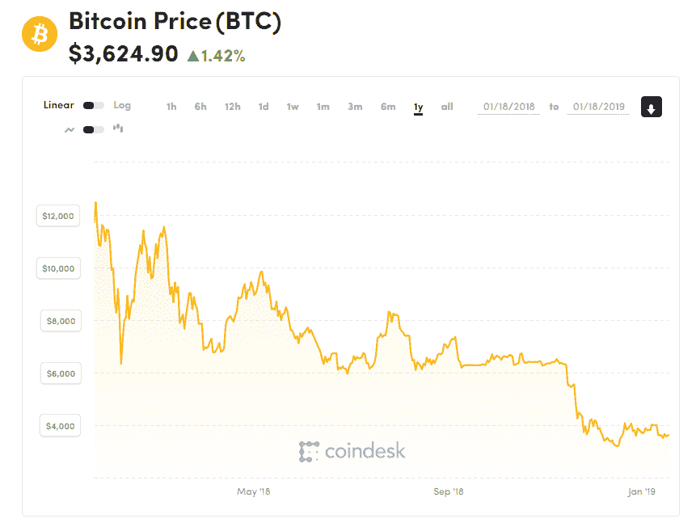

然而，区块链加密资产有可能作为一类新型数字资产或商品全球范围内获得认可。 它们可以有各种功能，例如交换媒介、计价单位和价值存储，类似于标准货币或黄金。 它们可以像石油、电力和互联网带宽一样推动经济。 它们还可以实现各种经济资源和风险的分配和交易，例如公司股份。 由于它们展现了各种已建立资产类别的特征，也许它们不属于任何现有类别，而应被视为一种独立的资产类别。

比特币期货合约，一种标准的大宗商品交易合约，已经在像**芝加哥商品交易所**（**CME**）等主要全球交易所上交易。 类似的合约也在**芝加哥期权交易所**（**CBOE**）上交易，并很快预计将在纳斯达克上市。 比特币**交易所交易基金**（**ETFs**），一种为许多资产和商品使用的成熟投资工具，也已经在路上一段时间，很可能会在某个时候在纽约证券交易所上市。 这些发展表明了比特币作为一种数字黄金正在全球范围内获得的地位。 也许其他加密资产将效仿，并基于它们的进一步发展和采用在世界各地成立金融场所上交易。 例如，以太币，提供对以太坊网络上的分布式计算资源和存储设施的访问权的代币，可能是接下来在全球范围内已建立的金融场所上交易的下一个加密商品。

区块链技术带来了一个新的范式，这是对许多行业当前现状的巨大改进。

由区块链驱动的分散经济的新时代始于比特币。 它清楚地向世界展示了价值转移如何以分散自我维持的方式来管理，不像任何其他金融或经济体系。

紧随其后的是以太坊，被广泛认为是自比特币以来区块链技术最重要的里程碑。它建立在比特币的基础上，并在加密货币之外带来了许多用例，开创了区块链 2.0。它实现了具有巨大潜在经济影响的去中心化应用。以太坊的创新为未来复杂和自主的去中心化经济和社会体系铺平了道路。新型的加密经济学领域出现，结合了经济博弈理论、密码学和区块链与互联网的力量，创造出新类型的全球互联生态系统。

# 区块链与 Web 3.0

我们目前正处在新一代区块链技术的第三代新兴阶段。它再次构建在前几代的基础上，最明显地体现在比特币和以太坊上。现代区块链的关键构建模块，如共识算法、密码学、数据结构、网络协议、治理机制、虚拟机、编程语言等，正在不断尝试、测试、修改和实验，以寻求最佳解决方案。也许甚至不存在一个单一的最佳解决方案，未来全球经济将有无数不同的区块链，适用于不同的目的。大多数新的区块链设计朝着更复杂的架构演化，具有多层和模块，这些模块有助于可扩展性、互连性、治理和隐私。这种趋势的轨迹类似于互联网演变为相互连接的公共和私人网络的方式，现在我们有了公共互联网和数以百万计的私人内部网络。我们还有多个区块链应用程序，专注于解决全球经济和社会各个领域的不同问题。当前互联网的主要区别在于 Web 3.0 应更加分散、公平和抗审查。

这些新概念有望从根本上改变我们所知的企业和其他组织的运营方式。对全球各地社会的潜在益处是巨大的，从银行化数十亿没有银行账户的人群到优化当前行业领袖的业绩。所有这些改进不仅可以创造大量新的经济价值，而且还可以以更好的方式分配它，用公平的份额奖励生态系统中的所有参与者。

尽管对光明未来充满热情和乐观，理解区块链技术仍然需要大量的辛勤工作，以将其推进到更高的水平。

# 总结

希望您享受了这段令人惊叹的区块链世界之旅。

愿 **中本聪** 和 **维塔利克** 与你同在！感谢您一直陪伴我们到最后！
