# 区块链基础知识及 Village Beta 的演示

区块链已经因一种名为比特币的新型、有争议的数字货币而受到关注。早期比特币投资者的成功案例以及以太坊的推出——一个允许创建去中心化应用的平台，将区块链和加密货币带到了决策者和高管开始关注这种新兴技术的前沿。许多好奇的人开始思考它如何能够帮助他们在个人或专业企业中，使他们相信这种创新可能是他们业务问题的适当答案。《经济学人》于 2015 年 10 月 31 日发表了第一篇关于区块链的知名文章（[`www.economist.com/printedition/covers/2015-10-29/ap-e-eu-la-me-na-uk`](https://www.economist.com/printedition/covers/2015-10-29/ap-e-eu-la-me-na-uk)）。

作为决策者，充分了解新技术和创新对于公司探索和尝试新兴促进因素至关重要，这将带来竞争优势，并帮助您实现稳定增长。在数字时代能够蓬勃发展越来越成为一种必要和复杂的任务，特别是因为技术突破和大规模创新引发了人们消费习惯的急剧转变，以及地缘政治挑战和经济变化。能够考虑、评估和整合新技术以应对公司的业务目标已变得至关重要。

要记住的是，你应该意识到区块链有可能是一场范式转变，可以重新设计组织运作方式以及价值如何在经济主体之间共享。据说这种颠覆性技术将改变世界的运作方式、整个行业的功能以及价值的交换和保障方式。但是，尽管前景看好，你必须谨慎行事。我们正处于区块链所能实现的黎明阶段，它还不是百分之百成熟——它仍被视为新兴技术。

在本章中，我们将考虑一个区块链应用的演示，这将帮助你轻松地理解和掌握概念。通过本章，你应该能够理解区块链在某些环境和条件下的可用性，特别是当涉及直接在个人之间交换价值时。你应该能够基本解释区块链的工作原理，它的内在特征以及比特币如何在没有任何中央机构的情况下运作。

本章包括以下几个部分：

+   区块链在商业世界中的重要性

+   理解区块链

+   解析区块链

# 区块链在商业世界中的重要性

最新的 Gartner 炒作周期，发表于 2018 年 8 月 20 日，显示区块链离大规模采用还有 5 到 10 年的时间（[`www.gartner.com/en/newsroom/press-releases/2018-08-20-gartner-identifies-five-emerging-technology-trends-that-will-blur-the-lines-between-human-and-machine`](https://www.gartner.com/en/newsroom/press-releases/2018-08-20-gartner-identifies-five-emerging-technology-trends-that-will-blur-the-lines-between-human-and-machine)）。

Gartner 的炒作周期是新兴技术成熟度和采用情况的视觉图形表示。这是由信息技术研究和咨询公司 Gartner 每年发布的一份年度报告。

正如 Gartner 所述，区块链展示了许多成功的案例和有影响力的概念证明，并受到了广泛的媒体报道和宣传，但仍面临许多失败和可扩展性问题。一些产品已经问世，并对经济和社会产生了真正的影响（比特币和以太坊是最知名的），但只有在产品获得大量投资且技术得到越来越多人理解的情况下，才能实现主流采用和广泛市场适用性（即所谓的生产力平台）。

根据普华永道（PwC）2018 年全球区块链调查，84%的 C 级高管表示他们的组织已经涉足区块链技术，但超过 65%的人还没有穿过试点阶段。

PwC 2018 年全球区块链调查在 2018 年 4 月至 5 月进行，调查了 15 个国家的 600 名负责技术的高管。超过三分之一的受访者在年收入超过 10 亿美元的组织中工作。

区块链及其在商业世界中的适用性背后的概念存在着重大的误解。加密货币和区块链的最新热潮使得高管们认为它是对所有商业挑战的答案。实际上，区块链必须被视为用于保障交易安全和确保在分散环境中信息透明度和利益相关者身份验证的层次。区块链通常被认为是一个难以理解的概念，特别是对非技术人员来说。本书将帮助你作为决策者，识别区块链为你提供的机会，帮助你了解其适用性，并最终为你开启启动区块链项目的钥匙。

# 了解区块链

在立即深入技术部分之前，技术部分将在第二章中进行涵盖，*区块链技术深入剖析*，你应该首先了解一下什么是区块链。如果你已经阅读或听说过这个话题，你可能已经想到了它适用于任何依赖第三方确保信任并在不同利益相关者之间交换价值的用例。通过一个来自虚构情境的简单例子，以下各节将希望解开你可能感到困惑的事情和你渴望了解的事情。

# 使用中心化账本系统

想象一个由 20 人组成的村庄，位于海洋中央的一个岛上，与其他部落或国家没有联系。我们将这个村庄称为 Village Alpha。他们在一个资源丰富的环境中过着和平的生活，没有人缺少任何东西。

问题：*Village Alpha 的人民是如何彼此交换和交易商品和服务的？*

为了避免以物易物的缺点，他们发明了一种金币，一种类似于今天经济中的美元的货币形式。由于这个硬币是便携式和易于识别的，在所有村民眼中都有价值，因此它很快成为社区内主要的支付手段。为了确保彼此之间的正常交易，他们记录每一次交换，并任命其中一人为指定的记账员以维护其准确性和真实性。指定的记账员通过每笔交易收取费用来奖励他/她的诚信和正直。

就是这样！人们可以用他们的金币购买和销售商品。记账员通过保持账簿的最新记录来保证真实性，通过对交易征收费用来激励其公正行为。任何人都可以通过检查交易来质疑他/她，以确定是否有适当记录。

村民们找到了解决问题的方法，无意中发明了如今盛行的银行系统。

为了简单起见，我故意省略了关于储蓄、证券或黄金储备等如今银行系统的附加组成部分的讨论，因为这些内容与我们的例子无关。

现在，让我们假设记账员是不诚实的。想象一下，他/她在夜间修改了账本，删除了一些交易或添加了新的交易？如果他/她摧毁了账本呢？

你可以看到这个系统有其缺点。村民们目前正在使用我们称之为中心化支付系统，每个人都依赖记账员来确保真实性。

在我们现代社会中，银行扮演着记账员的角色。当你向朋友汇款时，你信任银行能够正确地进行资金转移。

银行是一个受信任的第三方实体，负责确保从一个账户到另一个账户的正确财务交易，并在账目簿中记录它们。

这有重大缺点：

+   单点故障：想象一场暴风雨摧毁了村庄和随之而来的账本。

+   一个可以不诚实的值得信赖的第三方机构：想象一下，审核人修改了交易。

+   双重支付问题，然而，在我们的例子中并不适用，因为我们假设他们交换实物。如果村民们在交换数字价值，双重支付将会成为一个问题，因为他们将需要一个基础设施来防止数字资产的复制。换句话说，他们需要一种方法来防止资产被花费两次。稍后再详细讨论。

# 区块链替代方案

那么，区块链如何为这种传统的中心化支付系统提供强大的替代方案呢？

让我们看看邻岛上的村庄是如何从交换商品的初始问题进行的。这个村庄，我们将其称为贝塔村（Village Beta），也由 20 个人组成。

他们并不选举其中一人作为审核人，来验证交易的真实性和历史，而是找到了另一种解决方案。

他们创建了一本书，其中每页都设计成一个带有十行和三列的电子表格。行用于输入交易，而列用于输入三个信息：发送方地址，接收方地址和金额，如下图所示：

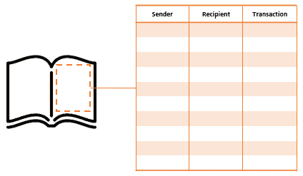

然后，他们将这本书复制了 19 次，将每本交给每个村民，以便每个人都拥有一本书。最后，他们铸造了 10,000 个他们称之为 Villagecoin 的硬币，并分发给每个人 10 个，将其余的留在保险库中。

# 赋予账本权力。

当有人想要进行交易时，他或她必须去村庄的中心地带对其他人大声宣布他或她愿意进行的交易。其他村民听到交易后，在他们的账本的第一页上写下来：Alice 给 Bob 2 个 Villagecoin，Chuck 给 Dan 5 个 Villagecoin，等等。这样，每笔交易都记录在每个人的账本中，如下图所示：

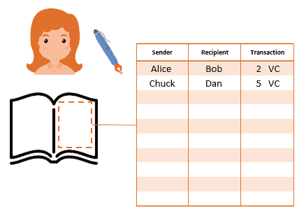

通过这个系统，没有人被委托断言中央账本的准确性，而是每个人对自己的账本负责。

这个组织允许两件事：

+   **透明性：**村民们可以检查一个村民是否有足够的钱。因为所有交易都被记录下来，很容易查看 Alice 不能向 Dan 发送 15 枚 Villagecoin，因为她在第一天被给了 10 个 Villagecoin，然后发送了 2 个 Villagecoin 给 Bob。因此，她只剩下 8 个 Villagecoin。

+   **第一层安全：**由于每个人应该都有相同的书和交易历史记录，如果爱丽丝来伪造她的书中的交易，它将变得无效，因为其他人（多数人）记录了正确的交易。爱丽丝最终只会得到一本不正确的书，需要从另一个村民那里获取有效的副本。

在这个例子中，书是我们称之为**数据库**（或**账本**），记录了所有的交易和价值转移。村庄是赋予账本权力的**社区**；它是一个网络基础设施，村民是以下这些：

+   **节点和矿工**：它们是验证交易并存储账本的实体（稍后详细介绍）。

+   他们是网络提供的服务的**用户**。在这个例子中，服务是使用分散式支付方式（Villagecoin）购买和销售实物商品的能力。它可以与比特币相比较。

到目前为止，我们已经看到了一些非常有趣的事情。我们已经展示了区块链的去中心化特性以及如何在网络上共享和跟踪记录数据库而不被改变。

我们已经展示了定义区块链的三个重要特征：它是一个共享的、透明的、分布式的数据库。

现在来看最重要且最难理解的特性：安全性。

# 安全因素

如前所述，每页书设计有 10 行。那么，*当我们达到交易编号#10 时会发生什么*？我们肯定需要翻到下一页。然而，在这样做之前，村民们必须验证交易并封存页面。

为了保护交易安全，村民们决定每一页都必须从书中移除，并放在一个特殊的墙上，一旦完成就会显示每一页。这样，村民们就可以确保显示在墙上的交易（因此也是页面）是真实的、有效的和正确的。

在区块链世界中，页面就是包含交易的**区块**。我们可以将墙壁比作整个区块链，所有验证过的页面都显示在上面（换句话说，区块被链在一起）。如果一个区块中的一个交易被更改，那么随后的所有区块中的交易都会变得无效。

让我们固守这个例子来理解它是如何运作的。

# 处理区块链

显示有效页面的墙壁**不会让任何村民把自己的页面放上去**。当一页完成，记录了 10 笔交易时，只有一个村民可以将自己的页面放上去。为了做到这一点，所有的村民都必须竞争找到一个数学问题的结果。

这就是使区块链不可变和不可改变的**微妙部分**。

墙上有一个部分有两个小屏幕，每当一页完成时都会显示一些信息：

+   在**屏幕 A**上，显示一个数字，我们将其称为*参考编号*。

+   在**屏幕 B**上显示日期和时间。

在这两个屏幕下，还有另外两个屏幕，村民将在其中输入数据：

+   在**屏幕 C**上，村民将输入完成页面的 10 个交易。

+   在**屏幕 D**上，村民将输入一个我们称为*数字 X*的随机数字。

最后，最终屏幕显示了在解决数学问题时必须遵守的规则，如下图所示：

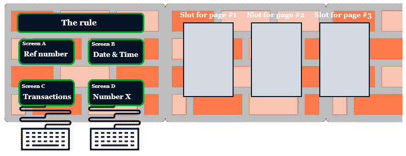

为了保持本章节的一致性并帮助你理解一切，我们将进一步定义规则，参考编号和数字 X。到本章结束时一切都会变得合理。现在，只需继续看完页面是如何完成和在墙上显示的。

当页面＃1 完成时，所有村民都聚集在墙前，以注意前两个屏幕提供的信息。在我们的例子中，我们有以下内容：

+   屏幕 A：参考编号：0

+   屏幕 B：日期和时间：2018 年 06 月 25 日，下午 03:25

墙上给出的规则如下：

“解决数学问题时，输出数字必须以两个零开头。”

你记得吗，为了让一页纸被墙接受，村民们必须解决一个数学问题吗？

好的，这个问题是这样设置的：

*屏幕 A 的参考编号* + *屏幕 B 的日期和时间* + *屏幕 C 本页面的交易* + *屏幕 D 村民输入的随机数字*（数字 X）= *遵循墙上规定的输出数字*（以两个零开头的数字）

在这个方程中，我们实际上了解了五个变量中的四个：

+   **屏幕 A**的数据（参考编号）由墙上给出：**0**。

+   **屏幕 B**的数据（日期和时间）由墙上给出：**2018 年 06 月 25 日**，下午 03:25。

+   **屏幕 C**的数据（交易）将由村民填写。它们被记录在他们的书页上。

+   **屏幕 D**的数据（规则）由墙上给出：解决数学问题时，输出数字必须以两个零开头

这个方程可以被描述为：

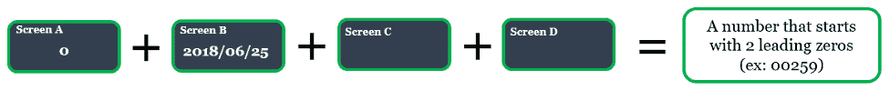

现在，村民的难题是找到要在**屏幕 D**上输入的正确数字，以便方程返回一个符合墙上规定的数字：以两个零开头的数字。

为了帮助你可视化这个数学问题，它大致可以表示如下：

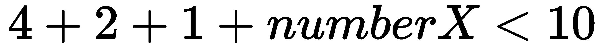

对于这个方程，答案会很容易，因为我们知道我们必须将数字相加和*数字 X*在一起，以便找到一个小于 10 的输出。在这里，*数字 X*将等于 1 或 2：

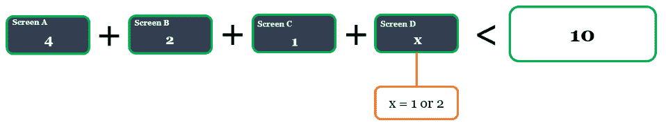

然而，在贝塔村，没有人知道墙的算法。 没有人知道它的逻辑以及问题应该如何计算。 他们将不得不尝试许多不同的*数字 X*解决方案来找到正确的输出。

# 分解区块链

在本节中，我们将尝试分解数学问题、*数字 X*、参考编号、规则以及它们如何共同工作，以便以一种共识和安全的方式记录交易。

让我们总结一下到目前为止我们所知道的：

+   该页面是我们所谓的**区块**。

+   屏幕 B 上提供的日期时间是区块的**时间戳**。

+   *数字 X* 被称为 **nonce**。 它是区块链网络的节点（在我们的例子中是村民）尝试找到的数字，以达到符合墙所给出的规则的输出数字。

+   找到*数字 X*的过程称为 **挖矿**。

+   墙所给出的规则称为 **hash function**。

+   我们将在后面的章节中看到参考编号是什么。

# 哈希函数

在继续数学问题之前，让我们首先关注墙所给出的规则，即所谓的哈希函数。

哈希函数是一个数学函数，它将任何字符或数字链转换为固定长度的字符链。 它将数据**转换为称为哈希的数字指纹**。 例如，如果我将 `euclide`（7 个字符）输入称为 SHA-256 的哈希函数，它将返回 64 个字符的哈希：`E0F4C627CD4D365EE9760BAA6A1CD35CA26CF7252F6EB25C0DC7B4C3E2718A20`。

**SHA** 代表 **安全哈希算法**，是美国国家安全局设计的一组密码哈希函数。 SHA-256 表示它是一个生成 256 位长输出的哈希函数。

如果我将整个维基百科的比特币页面描述输入到同一个 SHA-256 哈希函数中，它将返回：`D5752C643EC97DC0FF32AE74FF2F2079043A8AB0191C51AEFDE09EDE0C757EE6`。

它返回 64 个字符——无论输入的长度如何。

**哈希函数是确定性的**：**对于相同的输入，它总是相同的输出**。

下图描绘了本节中解释的过程：

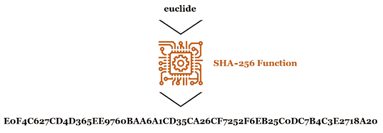

哈希函数背后的原理是，当你知道输出时，很难找到输入，因为逆向操作是不可能的。 也就是说，知道数据的数字指纹不会显示特定的数据。 如果我告诉你输出是 `E0F4C627CD4D365EE9760BAA6A1CD35CA26CF7252F6EB25C0DC7B4C3E2718A20`，你就无法猜到我输入的是 `euclide`。 但是，当知道输入时，很容易找到正确的输出。 实际上，你可以轻松验证 `euclide` 返回哈希 `E0F4C627CD4D365EE9760BAA6A1CD35CA26CF7252F6EB25C0DC7B4C3E2718A20`，只需将其输入 SHA-256 哈希函数。

你可以在你的设备上尝试这个。尝试在以下网站上输入 `euclide`：[`passwordsgenerator.net/sha256-hash-generator`](https://passwordsgenerator.net/sha256-hash-generator)。你应该找到与我相同的字符链。

如果我们回到 Beta 村，你可能已经明白了这是怎么回事：

+   参考编号，0

+   + 页面的时间戳，2018/06/25，下午 03:25

+   + 交易（书中一页上写的数据）

+   + 随机数（数字 X）

+   = 返回页面＃1 的哈希（遵循规则的输出数字：以两个前导零开头的数字）

前面的方程可以用图示如下：

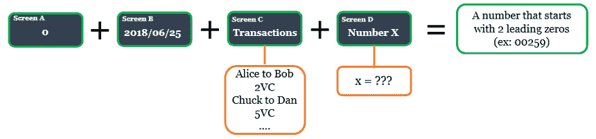

因此，为了找到输出数字（以两个前导零开头的数字，或页面的哈希），每个村民都必须尝试几个输入来解决方程，以返回一个符合规则的数字。

就好像我问你：使用 SHA-256 哈希函数，你能找到一个以两个前导零开头的输出数字吗？你会尝试多少个输入才能找到正确的输出？

你也可以在你的设备上尝试这个练习，使用这个网站：[`passwordsgenerator.net/sha256-hash-generator`](https://passwordsgenerator.net/sha256-hash-generator)。

# 缺失的变量

最终，一位名叫丹的村民找到了一个合适的*数字 X*。他告诉其他所有人，数字**12345**，加上时间戳、参考编号和交易，返回的输出数字为**0031993**。就规则而言，这个数字是一个有效的输出，因为它以两个前导零开始。

因为当你知道输入时很容易找到输出，所以其他每个村民都可以验证，*数字 X*，12345，是一个返回有效哈希的正确数据，也就是说，数学问题已经解决。

输出**0031993**被称为一个**块的哈希值**。它是页面及其交易保持有效所需的封印。

一旦每个人都验证了 12345 是正确的*数字 X*（随机数），返回的输出数字是 0031993（哈希值），符合规则，丹就被允许将他的第一页展示在墙上，从而成为参考页面：

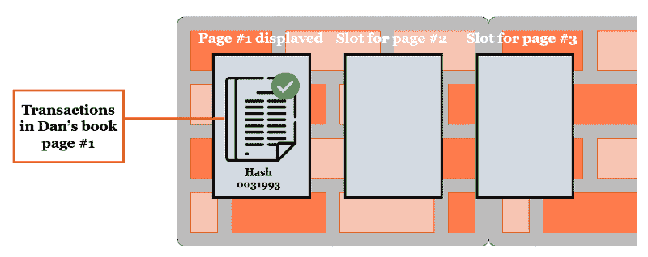

# 激励机制

现在，为什么每个村民都应该尝试找到*数字 X*，因为无论如何都会有人找到并告诉其他人呢？为什么一个村民要花时间和精力来使他/她的页面通过验证并显示在墙上呢？

我们在这里引入了激励机制，一个给予社区公平游戏的经济回报。因为页面应该保持封闭以保持交易准确，社区应该持续解决数学问题。通过这种方式，给予找到*数字 X*的村民奖励，也就是第一个找到页面正确哈希的村民。在我们的例子中，丹以 5 村币的奖励获得了奖励。

这种激励机制确保每个人都对为了共同利益而工作保持兴趣。第二章中有更多关于这方面的内容，《区块链技术深度探索》。

现在第 1 页在墙上展示并得到保护后，交易继续进行：*Chuck 向 Alice 发送 5 个村币，Dan 向 Bob 发送 2 个村币*，依此类推。

当第 2 页完成 10 次交易后，村民们会重新开始整个过程。

# 链

那么，*参考号*是什么？还记得在第 1 页，参考号是 0 吗？

对于第 2 页，它将是 0031993。**完全正确！**第 2 页的参考号是先前页找到的输出号码。在技术术语中，我们称之为**上一个哈希**或**先前区块的哈希值**。这使得页面能够相互链接或连接在一起。

因此，当第 2 页填满时，这一过程会重复：每个村民都聚集在展示屏前，屏幕 A 和 B 会显示新的信息：

+   屏幕 A 的参考号（前一页的哈希，第 1 页）：0031993

+   屏幕 B 的日期和时间（时间戳）：2018 年 07 月 03 日，上午 10:08

以下图表显示了墙上的新信息：

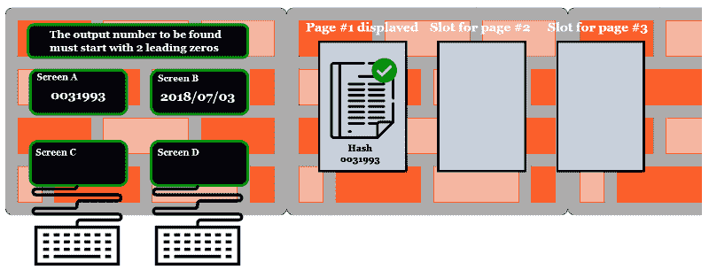

然后，村民们在屏幕 C 上输入第 2 页的交易。最后，每个人尝试在屏幕 D 上找到正确的*数字 X*（随机数），这将返回一个以两个前导零开头的输出号码。

当找到符合规则的输出号码后，*数字 X*会向所有检查*数字 X*、与 0031993、时间戳和交易结合的其他人宣布。如果大家都同意，我们会把页面放在墙上，并用 5 个村币奖励找到正确输入的村民。

然后，整个过程将重复，包括第 3 页、第 4 页等等：

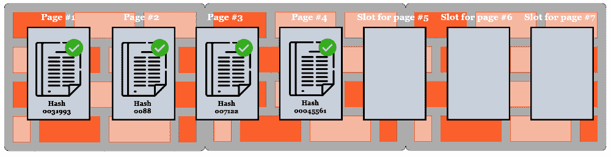

让我们评估一下这个系统有多安全。假设 Chuck 想要修改第 2 页的一笔交易。他想要擦除在第 2 页完成时发送给 Alice 的 5 个村币，并将其改为 1 个村币。  

*接下来会发生什么？*

他必须重新解决第 2 页的数学问题，因为他修改了第 2 页的交易（也就是说，屏幕 C 的数据）。因为这个微小的改变，墙返回了一个完全不同的输出数字，比如 37882，不再符合规则。因此，Chuck 必须在屏幕 D 上计算出一个新的*数字 X*，以便第 2 页的数字以两个前导零开头。

*对 Chuck 来说，这是一个什么样的复杂情况？*

想象一下，如果查克实际上找到了一个新的正确的*数字 X*，它返回一个以两个前导零开头的输出数字。因为哈希函数是敏感的（输入的轻微修改会返回完全不同的输出），即使查克找到一个新的正确输入，输出也会与原始输出完全不同。假设页面＃2 的新输出数字是 00829 而不是最初的 0088。在页面＃3 会发生什么呢？引用号（上一个哈希）将会不同，页面＃3 的输出数字也会不同。此外，很可能页面＃3 的新引用号（00829 而不是 0088）与其他屏幕上的数据的结合将会返回一个不以两个前导零开头的数字，从而使得页面（和随之进行的交易）无效。以这种方式，查克还必须重新计算页面＃3 的*数字 X*，然后是页面＃4 和＃5，以及之后验证的每一页。

*这就是区块链如何通过封闭和链接包含交易的区块来实现安全的方式。*

放在墙上的页面（区块）越多（得到验证），交易就会越安全和不可更改。因为重新计算每一页（区块）的每个*数字 X*（随机数）以找到以两个前导零开头的正确输出数字（哈希）需要大量的时间和计算能力，所以墙（区块链）是存储和保障村民（节点和用户）交易的最佳技术。

# 总结

在本章中，我们通过介绍主要的经济方面和挑战，在区块链中立足，通过最简单的示例发现了这项技术的内容和工作原理。Villagecoin 案例是比特币的实际代表，它是第一个区块链应用，也是最著名的应用。这是一个想象的情景，说明了分散和分布式分类账如何增强不相信彼此的个人之间的合作，使他们能够在没有可信赖中介的情况下交换价值。希望我们也以最易懂的方式展示了哈希和随机数的含义，它们使区块能够链接在一起，在基于这种机制的分散基础设施中提供安全性。但是以后会更多讨论。

在下一章中，我们将会发现加密学、共识机制和点对点网络如何在无信任环境中实现大规模协调。换句话说，我们将在技术层面上探索区块链的主要特点和组成部分。
