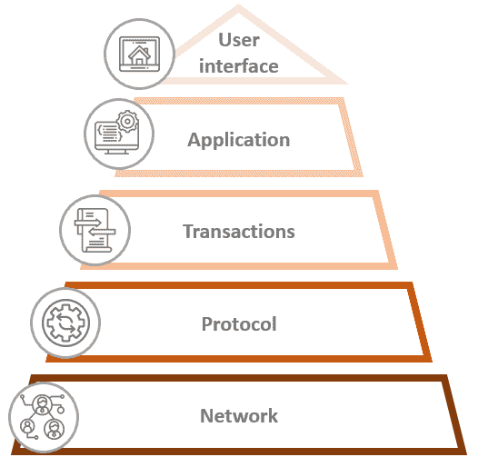
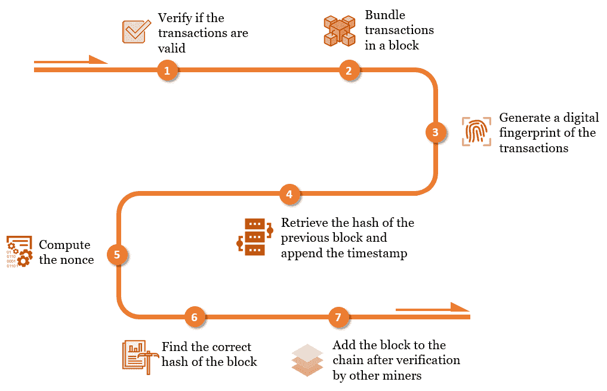
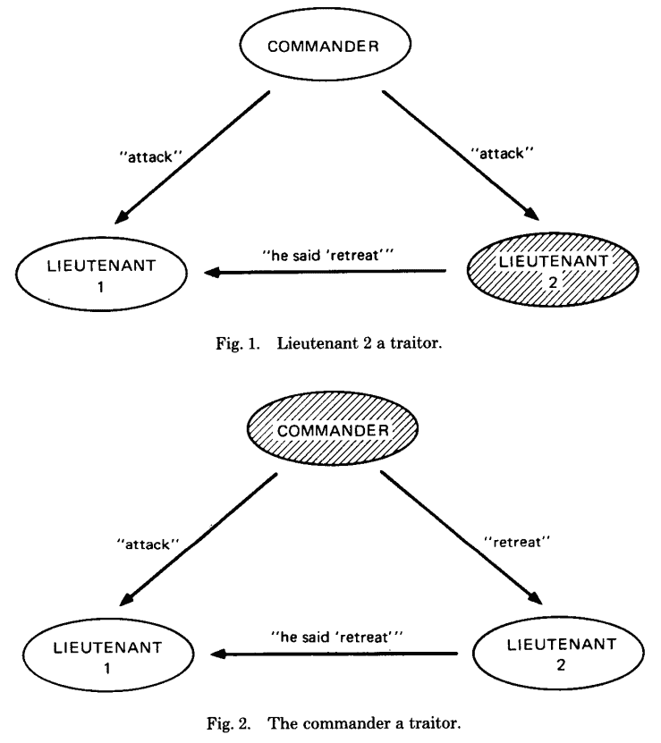
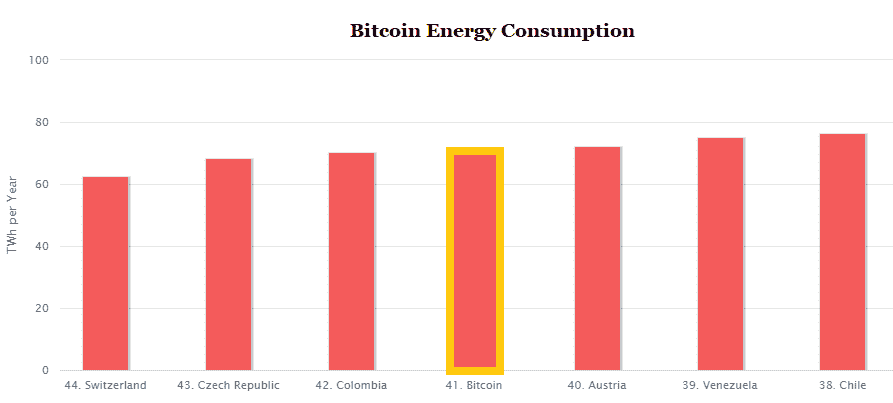

# 第二章：区块链的技术深入

由于数字无处不在引起了决策者越来越多的关注，他们需要能够使自己的业务蓬勃发展，并适应新兴趋势和消费习惯的变化，因此新技术必须被充分理解。事实上，区块链是一种新的促进因素，在考虑公司的创新战略时必须得到适当的理解。

首先，有不同类型的区块链，但它们背后的一般思想是相同的。主要是，它们旨在解决在数字世界中愿意交换价值的陌生人之间的信任问题。其次，尽管我们可以区分出几种不同类型的区块链，例如公共或半私有基础设施（关于此更多内容请参阅第九章，*基础设施和基于云的解决方案*），但它们都集成了类似的组件。

在本章中，我们将发现网络如何增强区块链的能力，哈希如何确保交易和信息的安全性，如何管理数字身份，以及如何通过博弈论和经济学促使负责任的行为。我们还将研究区块链所回答的原始问题，并最终发现可以实现网络内的大规模协调的共识协议。每个组件将被描述为一个独立的工具，但当我们将它们全部结合在一起时，我们应该采取一种整体的视角。因此，当单独阅读时，某个部分可能显得不清楚，但是在本章结束时，你应该能够欣赏到整个基础设施的运作以及每个功能所起的作用。

在本章中，我们将涵盖以下主题：

+   通过网络激活区块链

+   密码学和哈希函数

+   数据结构

+   管理数字身份

+   拜占庭将军问题

+   激励机制

+   达成共识

# 没有网络，就没有区块链

区块链最重要的组成部分是网络，即赋予其力量的社区。社区的作用是确保事实在共享数据库中被正确记录。

下图是区块链层的概述：

为了更好地理解这一点，让我们看一个比喻性的例子。

# 网络中的真相

想象一下，下个周末将会有一场美国公开赛的决赛，由罗杰·费德勒和拉斐尔·纳达尔之间进行。作为罗杰·费德勒的忠实粉丝，相信他会赢得比赛的爱丽丝在投丨注网站 Betwin 上押注了 10 美元。另一方面，有经验的赌徒鲍勃认为拉斐尔·纳达尔会赢。鲍勃决定在 Betwin 平台上以 10 美元的赌注押注拉斐尔·纳达尔的胜利。

因为 Betwin 是一家私人公司，其目标是最大化利润。为了做到这一点，该公司可以告诉 Alice 拉斐尔·纳达尔赢得了比赛，并告诉 Bob 罗杰·费德勒赢得了比赛。这样，Betwin 可以同时持有这两个赌注，而不必支付 Alice 或 Bob 任何一方。

*为什么这种方法对 Betwin 来说荒谬？*

显而易见的解释是，Alice 和 Bob 不仅相信 Betwin 知道比赛结果。他们会查看新闻稿，查看互联网新闻，或询问朋友。除非 Betwin 能够让新闻稿、互联网新闻以及 Alice 和 Bob 的朋友公布最符合他们利益的结果，否则他们的方法将行不通。简而言之，Alice 和 Bob 不仅仅信任一个第三方，而是依赖于网络来了解真相。除非有证据证明 Betwin 控制网络，否则 Alice 和 Bob 将永远知道真相。

在区块链中，大多数社区认为真实的信息记录在共享给所有成员的数据库上。

添加到数据库中的信息还会与已经注册的先前信息进行检查。在我们的例子中，诺瓦克·德约科维奇不能赢得美国公开赛决赛，因为数据库中有信息表明他已经输掉了上一轮比赛。

让我们继续看看区块链网络中的各种关键角色。

# 网络参与者

再次强调，网络是区块链中非常重要的一个特性——它必须去中心化到足以确保大多数不受单一实体控制。它必须足够异质，以便真相由大多数代表。为了实现去中心化和异质性，数据必须分布在社区中。它应该分布给任何想要参与的人，没有条件或障碍，形成一个相互交互的计算机网络。

区块链的网络层也被称为对等网络。

在集中式系统中，诸如手机或计算机的设备访问由一个实体拥有的中央服务器上的信息。在由对等网络支持的分散式系统中，所有设备，包括服务器，都相互独立地互动和通信。这些设备被称为**节点**。每个节点都可以与任何其他节点共享信息，而无需依赖中央服务器。此类网络的示例是臭名昭著的文件共享应用程序 BitTorrent、uTorrent 和 eMule，使用户可以从其他节点下载和共享数据。当你是对等网络的参与者时，你既是文件的提供者，也是通过其他节点检索的文件的消费者。这些是使区块链内部分散化的网络。没有任何实体拥有数据，也没有独家权利读取或修改数据库。

Napster 的故事是揭示集中系统中所显示的弱点的一个例子，特别是在控制方面。 Napster 是一个音乐文件共享应用，经过长时间的法律诉讼后于 2001 年被关闭，此举由唱片公司进行了长时间的诉讼，抱怨侵犯了版权。尽管 Napster 基于对等网络，但它中央维护着所有用户和文件的目录。这种配置使美国地区法院能够一旦发布禁令就停止 Napster 的活动。如果该应用程序依赖真正去中心化的对等网络，其中目录由每个节点存储，扣押可能不会发生。

在区块链中，给参与者指定了几种角色：

+   **用户**：他们利用运行在区块链之上的应用程序。他们并不拥有来自该区块链的任何数据；他们仅仅使用服务。

+   **节点**：这些计算机在它们的内存中存储数据库，并让任何人都能查看交易或信息的历史。

+   **矿工们**：这些计算机运行的软件验证区块和交易。

在某些区块链中，比如支撑比特币的区块链，任何人都可以成为矿工、节点或只是用户。这些区块链被称为公共（或无需许可）区块链，与私有（或受限制）区块链相对，后者的角色是为每个参与者预定义的。我们将在接下来的章节中进一步探讨这些差异。

我们不会在技术上描述这些节点是如何连接的，但我们会记住，在一个分布式系统中（最终，这就是区块链所在的地方），计算机相互交流以有效地交换信息。在使计算机相互交流时，地理位置和计算机的性能是要考虑的变量。

每个节点（以及每个矿工）都持有区块链的相同副本。如果要成为该网络的一部分，新的矿工和节点会从它们连接到的节点那里下载整个历史记录。区块链的大小可能会占用相当多的内存：在撰写本书时，如果你想成为比特币区块链的一个节点，你必须下载一个 223 GB 的文件。

矿工的责任是做以下事情：

+   构建一个新的区块，包含新的交易。

+   找到数学问题的正确答案（随机数），以验证区块。

+   将其传播到网络中，让每个人都能看到和检查。

为了让区块链持续发展，交易需要不断发生，并由计算出结果哈希的矿工整理成区块，然后将其添加到链中。

但是矿工们如何确保建议的区块不包括虚假交易？他们又如何将其添加到链上呢？

# 密码学

我们在第一章谈到了密码学和哈希函数，其中定义了什么是：

它是一个数学函数，在知道输出的情况下，几乎不可能找到正确的输入。但是，知道函数的输入，很容易找到正确的输出。这是可能的，因为哈希函数对于相同的输入始终返回相同的输出。

哈希是对输入应用的数学函数的结果，产生输出。*Y = f(x)* 是一个数学函数，其中 *x* 是输入，*Y* 是输出。

用数学术语来说，我们有以下情况：

*"知道 Y，几乎不可能找到 x。但是知道 x，很容易找到 Y。"*

哈希函数对于保护沿着区块链的信息和交易至关重要。

在[第一章](https://cdp.packtpub.com/blockchain_for_decision_makers/wp-admin/post.php?post=25&action=edit#post_24) *区块链基础知识与贝塔村的图解* 中，我们已经看到了关于哈希函数的基本属性：

+   它是**确定性的**，意味着相同的输入始终产生相同的输出。

+   它有一个**定义范围**，这意味着任何大小的输入都可以注入到函数中，但输出始终是相同长度的。换句话说，无论输入的长度如何，函数始终返回固定数量的字符（在[第一章](https://cdp.packtpub.com/blockchain_for_decision_makers/wp-admin/post.php?post=25&action=edit#post_24) *区块链基础知识与贝塔村的图解* 中，输出长度始终为 64 个字符，因为我们使用的是哈希函数，SHA-256）。

但这些属性还不足以保护交易或信息。区块链中使用的哈希函数周围还有其他加密属性：

+   它是**变化敏感的**，这意味着如果更改输入的一个字符，输出将完全不同。

+   它是**不可逆的**，这意味着不应该有效地确定给定输出的输入，就像无法解开挂锁一样。

+   它是**抗碰撞的**。当两个不同的输入生成相同的输出时，哈希函数发生碰撞。由于输入可以有任意长度，但输出是固定长度的，显然会发生碰撞。换句话说，对于无限数量的输入，有限数量的输出。抗碰撞意味着使用智能算法或策略几乎不可能找到相同输出的两个不同输入，而只能通过尝试每种可能性来找到。这就是我们所说的**穷举**。

你需要记住的是，输入的哈希值可以用作该输入的参考。哈希值是输入数据的数字指纹，可以是文档、交易或任何类型的信息。我们可以将任何文件注入到哈希函数中，并使用哈希值来引用它，因此唯一标识文档、交易或信息。

# 了解数据结构

区块链也可以被定义为一个包含数据的区块序列，这些数据被链接在一起。有两种类型的数据：

+   交易

+   区块信息（也称为元数据）

交易部分由在一定时间内发生的所有交易收集并汇总在区块中构建。如果我给你发送了一比特币，这笔交易将成为交易部分的一部分。三个字段始终处于活动状态：

+   接收方

+   发送方

+   数量

当我使用比特币区块链向你发送一比特币时，交易组成如下：

+   接收方是您的账户（您的比特币地址）。

+   发送方是我的账户（我的比特币地址）。

+   数量为 1 比特币。

比特币地址的一个例子是`3QSuhbsJUZJRgYX965CwMHgsdaU8KuTg4H`。

一旦所有交易都填入区块中，区块将使用适当的函数进行哈希处理（即，挖矿过程发生），这将返回**该区块的哈希值**，因此也是区块中包含的所有交易的哈希值。如果稍后修改了此区块的某个交易，哈希将发生巨大变化（敏感于变化的特性），区块将不再安全。

请注意，根据区块链的不同，区块的验证时间跨度和交易数量会有所不同。对于比特币，大约每 10 分钟验证一个区块，并且包含的交易数量在 2019 年 6 月左右波动在 1500 左右。此周期是根据区块的大小限制来定义的，即它可以处理的交易数量。重要的是交易的大小而不是数量。这就是为什么比特币的平均区块限制为 1500 个交易，因为有时它可以处理更多的交易，有时可以处理更少的交易。如果一个交易中有多个发送者或多个接收者，则交易可能会变得更加复杂。以此为例，比特币区块链处理 1 MB 的区块，而比特币现金区块链处理 8 MB 的区块。

Bitcoin Cash 是由比特币社区的一部分于 2017 年 8 月创建的，旨在通过扩展区块大小来解决比特币的可伸缩性问题。与比特币一样，它是一种加密货币和区块链。

现在让我们来看看区块信息部分，也称为元数据。这些信息片段是指区块本身，而不是交易。如果我们回顾[第一章](https://cdp.packtpub.com/blockchain_for_decision_makers/wp-admin/post.php?post=25&action=edit#post_24)的例子，即*区块链基础知识和 Village Beta 村庄的说明*，它们指的是以下内容：

+   上一个区块的哈希值

+   时间戳

+   随机数

+   哈希值

前一个哈希是验证前一个区块时找到的参考号。对于区块链的第一个区块，它可以是 0 或网络同意的任何值。要记住，哈希是让区块链接在一起的要素，因此使整个链不可篡改。为了实现这一点，每个区块包含前一个区块的哈希。

时间戳是区块被网络验证的时间和日期。

随机数是验证区块有效性的数学问题中需要找到的变量。矿工在接收新交易时，会运行一个复杂的数学问题，以找到适当的随机数，从而返回一个正确的哈希。

一旦哈希被找到，交易将得到验证，并且区块将被存储在数据库中。

总之，一个区块是在一段定义时间内发生的所有交易的容器，对这些交易进行哈希处理以返回所有这些交易的数字指纹。以下图表展示了网络矿工进行的挖矿过程：

构建区块时，矿工会使用前一个区块的哈希、所有交易的哈希和时间戳来触发挖矿过程。挖矿过程会在其中一个矿工找到返回有效哈希（通常以一个预定义数量的零开头的数字）的正确随机数时结束，该哈希与区块相关联，并将作为下一个区块的上一个哈希。

# 创建身份

大多数情况下，要使用在线服务，你必须在提供服务的组织机构中创建一个账户。如果想使用社交媒体应用或创建银行账户，你需要提供关于自己的信息，让组织授予你访问权限。这是中心化模式：身份储存在和由一个中心组织的服务器上管理。这与提倡去中心化以实现无中央实体的大规模协调的区块链概念完全不兼容。

那么，在这种生态系统中，我们如何创建不受任何第三方控制的身份呢？

# 使用区块链确保身份安全

在区块链中，发送数字价值的人和接收数字价值的人必须被准确定定。

通过加密技术，我们可以达到这一点，这要归功于非对称加密。非对称和对称方法当向某人发送消息或资金时都通过加密技术实现安全，并被用于以分散的方式管理身份。在解释使用在大多数区块链中的非对称加密之前，我们应该先解释对称加密是什么。

使用对称方法，每个人只有一个密钥用于加密或解密特定消息。如果我想给你发消息*你好*，我将按照以下过程进行：

+   我加密消息*你好*，变成了，比如说，*Jrmmp*。

+   我发送给你我的加密密钥。

+   你使用我的密钥解密消息。

密钥是通过一种算法生成的，允许拥有密钥的人对消息进行加密和解密。

但是使用这种加密方法存在一个重要的风险。 由于你需要发送接收者你的密钥才能让他/她读取你的消息（这个过程称为握手），一个恶意人士可能会拦截密钥，并在之后使用它解密你的消息。

另一方面，非对称加密可以解决这个问题。 通过这种方法，不是一个密钥，而是两个密钥，一个公钥和一个私钥。 公钥被传达给任何想要向你发送消息或数字价值的人。 相反，私钥只有你知道。 它绝对不能透露给其他人。

如果我想发送给你消息*Hello*，我们会按照这个过程：

1.  我检索你的公钥。

1.  我使用你的公钥加密消息*Hello*并发送给你。

1.  你使用你的私钥解密消息。

如果一个黑客拦截了我发送给你的加密消息，他/她是无法解密它的，因为他/她并没有私钥，而只有私钥才能解密消息。 简而言之，公钥用于加密消息，私钥用于解密消息。

对于非对称加密的密钥对——私钥/公钥，有两个原则要记住，它们和我们在哈希函数中看到的一样：

+   一个私钥经过哈希总是给出相同的公钥。

+   知道了公钥，要找到私钥是不可能的（除非通过暴力破解：尝试很多私钥）。

暴力破解一个字符的密码相对简单——64 种组合（a，b…A，B…1，2…）。 但是当涉及到比特币区块链时，私钥长达 51 个字符，概率达到 64⁵¹ 个可能性。 需要几年的时间才能暴力破解比特币区块链上的私钥。

这种非对称加密允许您在数字世界中为任何类型的信息、消息或交易进行数字签名。否则，在数字世界中，你如何证明自己是特定消息的作者或特定账户的所有者？

使用私钥加密用于证明真实性。 如果你用自己的私钥加密你的消息，那么任何人都可以用你的公钥解密它，这证明了你起初发表了该消息，因为只有用你的私钥才能加密它。

在这种情况下，你的公钥是你的数字身份，因为它在数字世界中标识了由你发表的声明和信息。 私钥是一种密码，用来证明你拥有你的公钥，也就是你的数字身份。

这就是我们实现去中心化身份管理的方式。通常，公钥指的是账户的地址。此外，你不需要将你的真实身份与你的数字身份关联起来。只需生成一个新的密钥对，你就会得到一个新的数字身份。请记住，这并不能为你提供完全的匿名性，因为与你的数字身份一起发送的某些信息或声明可能会将你与你的真实身份联系起来。这就是为什么比特币区块链并非完全匿名，而是伪匿名的原因。

# 拜占庭将军问题

在接下来的章节中，我们将开始讨论更多与业务相关的主题。在那之前，我应该给你一些关于区块链的原因和起源的背景，回到一切开始的地方，即拜占庭将军问题。

拜占庭将军问题 是计算机科学中的一个现实生活类比，由著名美国科学家和图灵奖得主 Leslie Lamport 在 1982 年提出并部分解答，他提出了以下问题：*在叛徒或故障存在的情况下如何达成共识？* 转化到计算机科学领域，这意味着：*在一些计算机可能出现故障或提供冲突信息的分布式系统中如何达成共识？* 这就是问题被称为拜占庭将军问题并得到广泛认知的原因。

以下图示是拜占庭将军问题的说明：

出处：L.Lamport、R.Shostak 和 M.Pease，《拜占庭将军问题》，ACM Transactions on Programming Languages and Systems，Vol. 4，No. 3，1982 年 7 月

解释——围绕城市的多个拜占庭将军必须协调他们的攻击以夺取城市。为了相互协调，他们使用信使向彼此指示他们做出的决定：进攻还是撤退。由于这种情况发生在战争环境下，一些将军可能是叛徒，一些信使可能被捕获或因试图传递消息而丧生。

如果我们将区块链与之进行比较，将军就是矿工，而信使则是它们之间的通信链接。一些研究人员得出结论，如果有三分之一或更多的将军是叛徒，将无法达成一致的策略。

*那么区块链是如何解决这个问题的？*

区块链中引入了一个工具来使共识工作：**激励**。区块链通常为验证交易的矿工提供激励。在[第一章](https://cdp.packtpub.com/blockchain_for_decision_makers/wp-admin/post.php?post=25&action=edit#post_24)，*区块链的基础知识和 Village Beta 村示例*中，验证交易的村民将获得 5 个 Villagecoin 作为奖励。

在区块链中，达成共识的方式如下：

1.  所有的矿工开始构建他们的本地区块。

1.  一个随机的矿工解决了区块的数学问题。

1.  随机的矿工将他/她的区块发送给其他矿工。

1.  其他矿工收到随机矿工的区块。

1.  其他矿工检查随机矿工找到的结果是否正确，以及上一个哈希是否指向前一个区块的哈希。

1.  如果有效，他们会取消正在构建的区块，并将随机矿工发送的新区块添加到他们区块链的副本中。

1.  随机矿工会获得奖励。

1.  然后，该过程重复。

如果一个不诚实的矿工解决了数学问题并在其区块中加入了无效交易，其他矿工会拒绝它，因为它包含无效交易（哈希将完全不同）。这个矿工将不得不放弃他/她的区块，因此无法获得任何奖励。让我们更详细地看看奖励是如何工作的。

# 提供激励

基本上，激励措施确保矿工继续为网络负责地工作（换句话说，共识地验证正确的交易）。矿工提供的工作通过区块链的基础加密货币得到奖励。通过实施奖励，人们被鼓励加入社区并成为矿工，从而扩大网络。而且，矿工越多，网络越大，交易越安全，因为区块链受到一方或个人控制的可能性就越小。

请注意，奖励通常随着时间的推移呈指数下降，因为区块链在吸引更多矿工之前通常以少数矿工开始。早期加入区块链作为矿工可以确保您即使在开始时价值不大也能获得更多的加密货币。但随着越来越多的矿工加入网络，越来越多的用户使用服务，加密货币本身开始受到重视，因此价值增加。通过这种方式，随着更多成员加入网络，矿工的奖励通常会随时间按照预定义的算法下降。例如，对于比特币，原始的区块奖励是 50 比特币，计划每 210,000 个区块减半一次。截至 2019 年 6 月，区块奖励为 12.5 比特币，总供应量设置为 21 百万比特币，其中最后一单位应该在 2140 年分配。作为决策者要记住的重要一点是，激励是区块链的重要组成部分，因为它回答了以下问题：矿工继续验证网络中发生的交易的动机是什么？换句话说，验证者继续确保注册表中的真相的动机是什么？

# 理解共识协议机制

如前所述，要想矿工验证一个区块，从而验证交易，他们必须解决一个数学问题。为了解决这个问题，需要一种特定的资源。在比特币中，这个资源是计算能力。矿工拥有的计算能力越多，他/她解决数学问题的速度就越快，因此完成一个区块的速度就越快，而且他/她获得比特币的机会就越大。这个挖矿过程被称为工作证明，是比特币固有的。这是一种协议，比特币区块链的所有矿工都应该遵循，以证明他们已经为验证交易做了适当的工作。这确保了一个选择过程，在这个过程中，每个矿工都使用计算能力来找到一个正确的随机数，该随机数将返回一个以预定义数量的零开头的哈希值。当然，并非所有矿工都拥有相同的计算能力，因此这并不是完全公平的随机过程。

机器的计算能力是以每秒猜测次数来衡量的。

最强大的矿工将比计算能力较弱的独立计算机有更多的机会解决问题。然而，即使某人拥有整个网络 10%的计算能力，其余 90%由成千上万的其他矿工提供，他仍然有 1/10 的机会找到正确答案。这就是随机性确保没有人可以控制区块验证，从而控制区块链的方式。这也意味着，如果一个矿工，或者一个矿工组织，控制了网络 51%或更多的计算能力，他们将成为第一个在 51%的情况下解决问题的人。换句话说，他们将能够在 51%的情况下验证或修改交易。

证明工作协议背后有一个重要问题，作为决策者，你应该意识到——这是一个非常消耗能源的过程，这引发了人们对其可持续性的质疑。由于需要大量的计算能力来找到区块的正确哈希值，而且网络中有大量的矿工，验证比特币区块链上的交易消耗了大量的电力，已经成为全球关注的焦点，甚至已经超过了瑞士的电力消耗量 ([`www.bbc.com/news/technology-48853230`](https://www.bbc.com/news/technology-48853230))。以下图表显示了截至 2019 年 6 月的比特币能源消耗情况：

来源：[`digiconomist.net`](https://digiconomist.net)

当然，其他协议可以替代能源消耗型的工作证明。其中一个最著名的是权益证明，正在以太坊区块链中实现。但更多相关内容将在下一章第三章 *以太坊和智能合约* 中讨论。

# 总结

总的来说，区块链是几种工具的结合，它们共同提供了一个基础设施，用于交换数字价值并在没有中央实体的情况下维护真实性。

正如本章中所讨论的，区块链由一组用户、节点和矿工组成，它们分别发送/接收、存储和验证交易。在这种配置中使用密码学（更具体地说是哈希函数）来创建一个输出（一个哈希），该哈希指代任何类型的数字信息，例如，用于指代一批交易。区块聚合这些交易并包括与区块本身相关的元数据，例如上一个哈希、时间戳和随机数。公钥和私钥提供了一种在数字世界和网络中高效管理身份的方式。在区块链中，还有一种激励机制，其中底层加密货币被用作奖励，以激励矿工为了共同利益而工作，并继续确保区块链上的真实性。最后，一种共识协议出现，使矿工能够持续有效地验证交易。

到这一步，你希望已经了解了区块链的工作原理以及它结合了哪些内在原则来确保安全性、透明度和不可变性。到目前为止，我们已经涵盖了最重要的特征。你越是欣赏它们，理解主要围绕区块链的社会和经济挑战就会更容易，最终帮助你确定区块链对特定用例的相关性。

在下一章中，我们将学习以太坊和智能合约。
