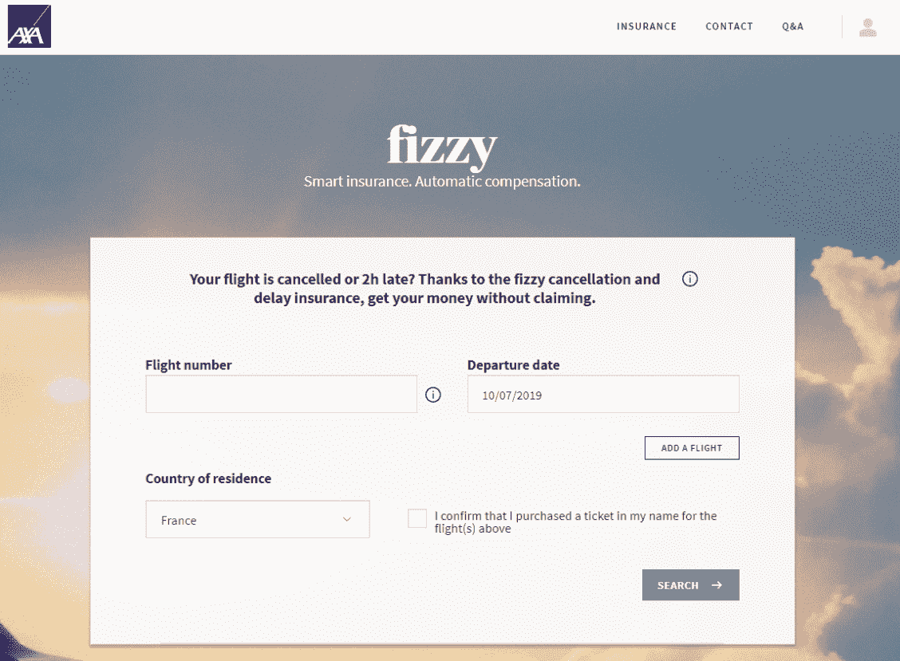
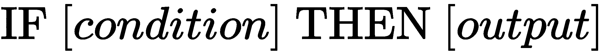

# 以太坊和智能合约

以太坊是区块链生态系统中最突出的项目之一。它于2015年7月正式启动，旨在克服比特币的一些主要局限性。创造了一种新的编程语言，以便开发比特币中使用的操作更为复杂。以太坊的目标是允许在其基础设施上创建**分散式应用程序**（**dApps**），并借助一种称为以太的记账单位，通过仅关注服务而不是协议，从而简化开发人员的工作。以太坊是第一个引入智能合约和dApps等新概念的平台，这使得区块链技术更加用户友好，并且当然为最终用户提供了比单一加密货币比特币更多的应用。现在，可以从头开始开发一个基于以太坊易于运行的基础设施的新应用程序。启动后，许多dApps的开发促进了区块链技术的广泛民主化。如今，以太坊支持超过1800个dApps，使其成为最大的公共区块链平台。

本章将为您概述比特币和以太坊之间的差异和相似之处。将以太坊与比特币进行比较是理解以太坊为区块链生态系统带来的重要进步的良好起点。本章将解释**以太坊虚拟机**（**EVM**），一个*世界计算机*，使得可以创建dApps。我们还将讨论智能合约和燃气的概念，这两者总是同时出现的。最后，我们将解释比特币使用的共识算法与以太坊试图实现的算法之间的差异。

本章将讨论以下主题：

+   比特币与以太坊

+   以太坊虚拟机

+   比较工作量证明和股权证明

+   真实世界的应用

# 比特币和以太坊哪个更好？

在之前的章节中，我们学习了所有关于比特币——一种加密货币，提供了一种替代基于区块链的传统集中式支付系统的选择，区块链是一个分散的、共享的、透明的、安全的数据库，存储着网络上发生的每一笔交易。由于比特币在零售和在线商店中的使用越来越普遍，它现在被视为一种资产类别。

就像任何其他资产类别或投资产品一样，比特币也受到金融市场演变的影响，而其支持者将其视为它真正是的东西——一种数字货币，允许全球个人之间几乎即时、安全且廉价地进行金融交易。

从这些方面来看，以太坊几乎是一样的：

+   它是一种加密货币（称为以太币），使人们能够进行金融交易。

+   它由一条区块链支持，该区块链也依赖于工作量证明共识协议。

目前，以太坊正在通过几次更新向基于权益证明共识协议迈进，并将在2020年至2021年之间达到最终版本。但在即将到来的章节中会详细介绍。

自2009年比特币的创建以来，生态系统中没有任何重大进展。直到以太坊的创建，它将区块链和加密货币推向了新的高度。以太坊与比特币的不同之处在于运行在其区块链上的应用程序。虽然在比特币区块链上唯一运行的应用程序是比特币这种加密货币，但以太坊区块链能做更多。有大量应用程序在其上运行，包括作为支付手段的加密货币以太，与比特币非常相似。

以太坊经常被定义为*世界计算机*或*平台*，任何人都可以使用它来创建或操作基于智能合约的dApps。您可以将其视为苹果应用商店或谷歌Play商店，在这里您可以购买和使用不同的应用程序。然而，以太坊是去中心化的，因此不归任何人所有，与苹果或谷歌不同，它们会将数据和支付集中在自己的服务器上。

与比特币的另一个区别是，虽然比特币的发明者**中本聪**直到现在仍然是未知的，但以太坊的创始人在生态系统中非常受欢迎。他的名字是**维塔利克·布特林**，是一位出生于俄罗斯的加拿大程序员，于2013年提出了以太坊的构想。就像任何其他区块链一样，以太坊依靠人们在其计算机上运行网络的软件。对于比特币来说，这个软件是BitcoinCore。对于以太坊来说，它被称为EVM（以太坊虚拟机）。

# EVM（以太坊虚拟机）

EVM（以太坊虚拟机）类似于Windows或macOS，是一个操作系统，能够读取和理解以太坊特定语言Solidity编写的程序。它是一种图灵完备的软件，使任何人都能运行任何程序，使基于区块链的应用程序创建过程比以往任何时候都更容易和更高效。

这就是为什么有成千上万种不同的应用程序在以太坊区块链上运行，因为您不需要编写全新的语言才能构建应用程序。

图灵完备机是一个概念，指的是一台机器如果有无限的内存可用，就能计算任何事物。实际的计算机必须在有限的内存上运行，因此不能被称为图灵完备。另一方面，以太坊区块链是一个分布式的图灵完备程序。

假设你想创建一种只能在特定类型商店中使用的新币。通过EVM（以太坊虚拟机），您无需从头开始构建区块链，而是在其中编写特定程序，并使用以太坊的原生加密货币以太时就可将其传播到网络中，并允许任何人使用。我们称这种程序为智能合约。

# 理解智能合约

要理解智能合约，让我们来看一个由法国领先的保险集团安盛创建的真实应用。2017年9月，安盛推出了一款名为**fizzy**的应用，这是一款取消保险产品，可以自动为遭受航班延误的客户退款。

基于以太坊，fizzy的智能合约以安全的方式存储保单持有人订阅的保险。然后，它连接到全球航空数据数据库，检查航班是否延误，并根据这些参数自动触发补偿。这种产品为用户提供了无摩擦的体验，并且对于安盛来说取得了巨大成功。以下是安盛的**f****izzy**着陆页面的截图：

简而言之，智能合约是写在区块链上的代码，应用以下规则：

对于fizzy，它被重写如下：

以太坊将智能合约和人类用户视为同等对待。两者都可以发送和接收以太币。然而，只有当合约中预定义的条件得到满足时，智能合约才能执行特定操作。

让我们举一个简单但不言而喻的例子。

假设两个人在2019年橄榄球世界杯上打赌谁会赢。他们都同意以下条件：输家向赢家支付 $50。

我们如何确保输家确实会支付赢家？

+   要么两位玩家彼此信任，因为他们长期以来一直是朋友，要么他们相处得非常好。

+   如果它们彼此不认识，它们可以签订法律协议。如果付款有争议，它们可以参考法律协议，但解决这种情况的费用和时间对彼此来说都将非常高昂和令人痛苦。

+   另一种可能性是它们各自给一个共同信任的朋友 $50，由这个朋友负责管理奖金并将其给予获胜者。但如果这个所谓的信任朋友拿着钱跑了呢？

我认为很容易看出每个选项都有其自身的缺点。然而，以太坊可以通过智能合约功能解决这个问题。

智能合约就像可信赖的朋友一样，只不过它是以代码的形式存在。它将确保获胜者在我们知道2019年世界杯冠军队伍的那一天真正收到奖金。

一旦编写了智能合约，就无法编辑或更改。一旦在网络中共享，智能合约中列出的条件将被执行，无论发生什么，因此变得不可更改。

而且，因为开发者可以编写不合理的代码或导致节点在智能合约执行中陷入无限循环的语句，以太坊的开发者想出了一种解决办法。他们发明了燃料。

# 燃料

燃料是矿工为处理智能合约而花费的电力、存储和计算能力的成本。燃料是以太币的一小部分。

*“因为所有这些不同的参与者[节点]都为运行平台提供他们的资源，所以你需要支付他们提供资源的费用。”* - 以太坊联合创始人Joseph Lubin

在执行智能合约时，开发人员定义了最大Gas水平，确保当达到该水平时，智能合约停止执行，防止节点运行编写不良的智能合约。

[cryptocompare.com](https://www.cryptocompare.com)的广告主管Antonio Madeira有一个很好的解释：

*"要执行的命令越复杂，你需要支付的Gas（和以太币）就越多。例如，如果A想要向B发送1个以太币单位，那么A需要支付总共1.00001个以太币。然而，如果A想要根据未来以太币价格与B签订合同，就需要执行更多的代码，并且对分布式以太坊网络产生更多的负担或能源消耗，因此A需要支付的Gas就会比交易中的1 Gas更多。”*

尽管dApps有很多优势，其依赖的智能合约有时可能存在缺陷。不要忘记他们的代码是由人类编写的！

由于智能合约是不可变的，要更正代码的唯一方法就是达成网络共识，同意重写代码。

以太不是用于处理智能合约的货币的原因是，以太对市值过于敏感。通过将Gas与以太币链接，并将Gas价格固定到特定操作，以太坊社区确保了网络无论以太币价格如何都能执行智能合约。

以太坊区块链中的身份管理是通过两种类型的账户实现的：

+   **外部拥有的账户：** 这些账户由用户持有用于转移以太币。就像比特币区块链中一样，它们有一个关联的公钥作为地址，还有一个关联的私钥用于访问账户。

+   **合约账户或智能合约：** 它们可以存储以太币，但也可以存储代码。这些账户还有一个用于发送以太币的公钥地址，但由于它们不应该归任何人所有，它们没有任何私钥。

到目前为止，我们已经看到了比特币与以太坊的主要区别，以及了解了EVM，它作为网络执行智能合约的操作系统，这些程序是由开发人员编写的，用于在满足特定条件时执行某些操作。我们已经了解了智能合约是如何通过Gas来处理和执行的，Gas是以太的一个小部分，既起到激励作用又收取费用。

现在让我们深入研究以太坊的共识协议、现实世界的应用以及即将面临的挑战。

# 比较工作证明和股权证明

以太坊目前依赖于与比特币相同的共识协议：工作证明。为了验证区块和交易，网络的矿工必须解决一个数学问题，截至2019年4月19日，这需要大约13秒钟。

当结果（哈希）找到时，它会传播到网络，网络会检查并将包含交易的区块存储在账本中。然后又会出现另一个数学问题来验证新的区块，以此类推。

这个共识协议工作证明有几个缺点：

+   它对环境**有害**，因为需要大量电力来使计算机找到适合的哈希以验证区块。

+   它**昂贵、不包容且保留给专家**，因为挖矿过程需要好的芯片、材料和计算能力才能运行哈希的计算。

+   它**消耗资源**，当网络承受峰值负载时，使以太坊难以扩展。

以太坊正在寻找另一种可以取代工作证明共识机制及其上述缺点的挖矿方式。开发者社区已决定转向股权证明共识机制，在这种机制中，拥有强大芯片将不会帮助您更好或更快地挖矿。

以太坊社区愿意让任何人，使用任何类型的计算机，参与交易的验证，消除了基于工作证明挖矿的不包容竞争。

自2019年2月28日以来，以太坊已经迁移到了称为**Constantinople**的网络的新版本，这个版本带来了实现股权证明所需的几个发展。这一进化是更广泛路线图的一部分，旨在构建一个可扩展且强大的平台。

这个路线图由四个主要阶段组成：

+   **Frontier：** 这是以太坊的最早实现，在2015年启动之前。

+   **Homestead：** 这是在2016年初实施的，旨在稳定网络并提高其效率。

+   **Metropolis：** 这是在2017年10月推出的，通过称为**Byzantium**的更新实施，并将在2020年某个时候结束，此后还会实施其他三个更新（其中包括2019年2月28日的Constantinople）。

+   **Serenity：** 这是以太坊的拟议最终状态，集成了股权证明协议和处理每秒大量交易的功能。

股权证明协议不需要矿工计算像工作证明那样的数学问题。相反，这是一种共识协议，其中区块的验证依赖于一种算法，该算法根据用户拥有的以太币（或股份）数量来选择用户。

因此，用户拥有的以太币数量越多，他们被选择验证新区块的可能性就越大。与验证区块相关联的激励通常被与区块相关联的燃气所取代，这是所有交易燃气的总和。

# 现实世界的应用

过去几年中，以太坊通过成功的应用程序多次证明了其实用性，并且已经颠覆了一些商业模式。其中最有趣的之一是 slock.it ([https://slock.it/](https://slock.it/))。这是由斯蒂芬·图尔和延齐克兄弟于2015年创立的一个应用，旨在为更好的共享经济创造基础设施。

使用以太坊的区块链，slock.it 愿意将任何类型的物理物体链接到智能合约，以允许任何人使用该物体。创始人经常使用的一个例子是出租公寓。通过 slock.it，你可以将你的门锁与智能合约链接，使得想要租用你的公寓的人可以支付与智能合约链接的价格，该合约将自动解锁门。这个设置消除了通常需要依靠的可信第三方来确保付款和与执行该付款相关的操作。换句话说，它在没有中间人的情况下，安全透明地将门锁本身与租户连接起来。

如果你正在寻找更多 dApps 的例子，你可以查看 *DApps 状态* ([https://www.stateofthedapps.com/](https://www.stateofthedapps.com/))，这里列出了每个 dApps 项目。

请记住，因为 dApps 运行在区块链上，它们从其所有属性中受益：

+   **透明度**：在以太坊区块链上发生的交易对任何人都是可见的。

+   **不可变性**：一旦交易被矿工验证并在网络上共享，它们就无法被修改或更改。

+   **安全性**：其去中心化的设置消除了单点故障，并且密码学确保了不可能发生任何黑客攻击。

# 摘要

在本章中，我们区分了以太坊相对于比特币所提供的特性，后者是唯一的加密货币。我们展示了以太虚拟机（EVM）如何充当世界计算机，使得 dApps 和智能合约的创建成为可能。我们介绍了 gas 的概念，它在基础设施中扮演着代码运行的燃料角色。最后，我们探讨了工作量证明和股权证明之间的主要区别，以及以太坊所遵循的雄心勃勃的路线图。

在下一章中，我们将发现以太坊为区块链生态系统带来的另一个重要进步，这是在2017年底成为头条新闻的进步，使得任何项目都能够在几分钟内筹集数百万美元：初始代币发行（ICO）。
