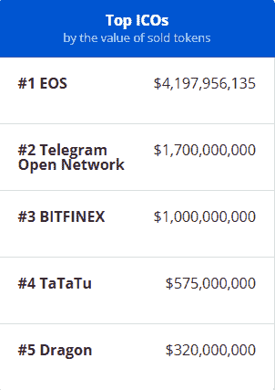

# 第四章：ICO 和代币化筹款方法

2017 年，金融领域受到了两个由加密货币和区块链引起的重大现象的冲击。第一个是比特币和其他数字货币（如以太坊和瑞波）从 6 月到 12 月间经历的泡沫，后者实际上在不到八个月的时间里价值增长了 450 倍。高波动性对加密货币作为强大金融工具和真正数字资产的信誉造成了可怕的影响。这导致大多数金融分析师、银行和对冲基金将它们视为单一的投机性和风险极高的投资，支持者仅靠无形价值和群体的不合理行为。陷入恶性循环中，大众媒体开始报道加密货币和区块链，放大这一现象，并以高回报率引诱投资者投资这种新的金融产品，这不可避免地导致了从 2017 年圣诞节到 2018 年年中的急剧下降。

第二个现象，被大众媒体覆盖得少得多，实际上可以解释为第一个现象的催化剂。也就是说，**首次代币发行**（**ICO**）自 2013 年以来就存在，但直到 2017 年才开始受到重视。作为一种新的筹款方法，将支持者用新创建的加密货币奖励，ICO 能够在几分钟内使任何项目成为众筹项目。2017 年第一季度，仅有 8 个项目通过 ICO 筹资，总额为 1400 万美元。但随后热潮开始了。在接下来的三个月里，30 个项目成功关闭，总金额接近 10 亿美元。到年底，通过 ICO 筹集了超过 54 亿美元，共推出了 875 个项目。现在是投资者选择下一个比特币、以太坊或瑞波的正确项目的时候了。在这个狂热的时期（最终在 2018 年下半年趋缓），生态系统看起来像一个巨大的赌场，在一个不理性的环境中，投资者渴望赢得大奖，而项目领导人则渴望在繁忙减缓之前快速筹款。

现在生态系统已经更加与 ICO 一致，我们将能够借助事后的认识来解释它们和其他衍生的筹款方法（**安全代币发行**（**STO**）、**股权代币发行**（**ETO**）和**初始代币发行**（**ITO**））是什么。我们将通过示例说明它们的使用情况，描述可以出售哪种类型的代币，并解释它们在筹款方面带来了什么优势。我们还将发现为什么这些方法在解除监管限制和伦理问题的同时取得了巨大成功。

本章将讨论以下主题：

+   什么是 ICO？

+   ICO 的案例分析：以以太坊为例

+   实用代币和安全代币

+   ICO 有何革命性之处？

# 什么是 ICO？

ICO 在某种程度上类似于**首次公开发行**（**IPO**）。基本上，这是一种以新的加密货币交换已存在的货币的筹款工具。公司不像在 IPO 中在指定的股票交易所上市股份，而是发行他们以给定价格出售的新创建的硬币。

简而言之，这是一个由流动资金（比特币，以太坊或法定货币（[`www.investopedia.com/terms/f/fiatmoney.asp`](https://www.investopedia.com/terms/f/fiatmoney.asp)）资助的项目，针对特定项目创建的新加密币。这些新币称为代币，基本上是基于区块链的数字优惠券，以不可逆转的方式从一对一地可交易。购买这些数字优惠券的投资者相信项目的成功和随着再销售带来的附加价值。

传统上，初创企业和公司可以通过几种财务工具筹集资金：

+   获得银行贷款

+   发起众筹活动

+   将其资本股份出售给私人投资者

+   通过将其资本股份出售给公众投资者上市（IPO）

有了代币和区块链，他们现在可以通过创建新的数字基于区块链的代币，在一定时间内出售以筹集流动资金，以帮助他们融资其项目。他们的论点是这些代币在时间内会增值，并且可与另一个加密货币交换。

要理解 ICO，有时将其与 IPO 进行类比是很有趣的。在 IPO 中，投资者自动获得其所获股份附带的某些权利（红利，投票权，所有权等），这在一定程度上促成了股份的内在价值。在 ICO 中，发行并出售给投资者的代币只是伴随着项目成功的承诺。购买 ICO 期间的代币没有分红权或投票权。这是一个经常被其批评者作为反驳论据的主要缺点。

此外，关于这种融资方式的新颖性，在一些司法管辖区主要是没有受到监管的。在过去的几年中有很多项目失败，也有很多诈骗被识别出来。此外，大多数项目领导者在甚至开发产品之前就筹集资金。因此，这是一种高风险的投资。对于风险投资家，这相当于在种子期初期创业公司投入数百万美元。在投资此类项目之前需要进行彻底的上游研究。

尽管如此，一些 ICO 取得了相当大的成功，筹款金额惊人。实际上，在 2017 年，ICO 筹资超过了风险投资筹款，并成为金融区块链初创公司的首要方法（[`www.cbinsights.com/research/blockchain-vc-ico-funding/`](https://www.cbinsights.com/research/blockchain-vc-ico-funding/)）。

# ICO 实例 - 以太坊的案例

第一次重大的 ICO 之一是由著名的以太坊发起的（见第三章，*以太坊与智能合约*）。创始人维塔利克·布特林和他的团队在 2014 年 7 月 22 日至 2014 年 9 月 2 日之间发行了约 6000 万以太币（新的加密货币或代币），以换取 31500 比特币，当时相当于 1840 万美元。

有了这笔资金，他们可以设计和编码未来的以太坊平台，该平台于 2015 年 7 月 30 日推出。创始人们激励投资者认为这个平台将允许人们在其上构建去中心化的应用程序。投资者被吸引并以比特币的方式支付以太币，这是后来用于通过该平台构建应用程序的*燃料*货币。那时，1 比特币可以购买约 1900 以太币，截至 2019 年 6 月 19 日，价值约 509,200 美元。投资绝对物有所值！

通过设计一定数量的代币，项目领导者承诺这些代币将使投资者能够在未来购买服务或产品，或将其交易为另一种加密货币。

令人难以置信的是以太坊既展示了 ICO 筹资的力量，又让人们能够做到同样的事情。事实上，拥有像以太坊这样的平台，允许开发人员构建应用程序而不必从头构建区块链，许多项目通过该平台得以实现。一个人可以创建一个应用程序，并以 Ether 或比特币的方式出售代币以进一步开发。自以太坊平台推出以来，ICO 的增长呈指数级增长。

以太坊平台潜力最突出的展示是**去中心化自治组织**（**DAO**），其 ICO 于 2016 年 5 月启动。建立在以太坊区块链上的这个应用程序的目标是创建一个由 DAO 代币持有者支配的投票系统的去中心化风险投资基金。

持有 DAO 代币的任何人都可以投票决定是否为某个项目提供资金。这种全新的组织管理方式吸引了约 11000 名投资者，他们用价值高达 1.5 亿美元的 Ether 资助了该项目。不幸的是，2016 年 6 月 17 日，一群恶意黑客成功利用 DAO 代码中的漏洞控制了 DAO 筹集的 1150 万美元以太币中的 360 万美元。

这次失败使人们意识到编写此类应用程序所需的谨慎以及通过 ICO 为项目和想法提供资金的潜力。

# 实用代币和安全代币

尽管在 ICO 期间发行的大多数代币在技术上是相似的，但它们的用途可以分为两类：

+   实用代币

+   安全代币

当以太坊推出其以太币的销售时，他们承诺这些代币将被用作在以太坊平台上创建应用程序的支付手段。这强调了以太币是一种使其所有者能够使用平台，从而使用产品的代币。这样，**以太币是实用令牌**。

当 DAO 推出其 DAO 代币的销售时，他们承诺这些代币将被用作进一步融资项目的投票权，以及作为有利可图的*股份*。事实上，这些代币将为拥有者带来 DAO 利润产生的财务回报。这样，**DAO 代币是安全令牌**。

这两者的区别来自**美国证券交易委员会**（**US SEC**），该委员会将安全令牌的监管方式与公司股票相同对待。如果一个项目被宣布发行安全令牌，公司就必须遵守美国证券交易委员会的规定，尤其是《1933 年证券法》。根据这个法案，公司必须满足多项义务和要求，才能从经过认证的专业人士或个人投资者那里筹集资金。为了确定令牌是实用令牌还是安全令牌，美国证券交易委员会使用一种名为**豪伊测试**的审计。它是由最高法院根据 1946 年豪伊公司的真实案例的法学判例创建的。该测试基于少数标准来确定一项交易是否代表投资合同。换句话说，如果一项交易基于公司或项目投资的努力为投资者带来利润，那么该交易应被视为投资合同，并且应遵守美国证券交易委员会的规定。

因此，决定一个令牌是实用令牌还是安全令牌是一个相当主观的问题。虽然有些令牌非常明显，比如 DAO 令牌或以太坊，但其他的可能相当难以判断。这更多地与根据所提出的问题进行个人分析有关：

+   它是否是一种令牌，将用于使用项目的产品或服务？

+   它是否是一种令牌，将仅以某种加密货币的形式提供回报？

+   它是否是一种令牌，将可用于另一个平台或购买其他产品或服务？

+   它是否是一种令牌，将帮助用户在项目生态系统内获得特定的特权？

作为联邦独立机构的美国证券交易委员会并不反对 ICO，但反对针对投资合同的欺诈操纵，特别是当它是一种新型操纵时。美国证券交易委员会和其他国家的等同机构已经把注意力集中在 ICO 上，主要是因为法律框架仍然主要是不确定的。由于遵守美国证券交易委员会的要求需要大量法律资源和相当多的资金，许多 ICO 项目已经将其代币出售为实用令牌或数字优惠券，或者至少试图将其代币转化为不需要遵循安全令牌规定的数字商品。

你必须考虑到一些司法管辖区正在解决围绕代币的这一灰色地带的问题。它们倾向于将其管制为股份销售，因此是金融证券。前所未有的 DAO 攻击及随后的广泛媒体报道鼓励监管机构更深入地审视监管控制方面的问题。未来，ICO 很可能会受到监管，无论代币被视为实用工具还是证券（详见第六章，*区块链的合法性、合规性和监管*）。

由于 ICO 周围的监管框架模糊不清，出现了一种类似的筹款方法，旨在兼顾传统 IPO 的健壮性和对金融监管的遵守，比如美国的 SEC（美国 SEC 的等效机构是德国的 BaFin、瑞士的 FINMA 和法国的 AMF）。这种定制的方法被称为 STO，技术上的组织方式与 ICO 相同（在分布式账本上发行代币）。

区别在于售出的代表特定受监管金融证券的代币，例如股票、债券或衍生品。通过基于区块链的代币将实物资产数字化的过程称为**代币化**。因为运作 STO 的公司基本上出售代表可交易金融资产的代币，他们必须比 ICO 更严格地遵守金融机构和监管机构的要求。

然而，好处在于 STO 仍然享受数字化过程，提供了一种无缝透明的筹款方法，确保数字价值以点对点和安全的方式转移。

你应该意识到，区块链世界中存在多个术语来指代通过基于区块链的代币进行筹款的方法。ICO 是第一个出现的，在分类和命名变得更加具体之前。项目领导者现在可以依靠 STO 来发行数字化代表受监管的金融证券的代币，这些代币可以分为不同的类别，称为 ETO 或 ITO。

不要混淆：尽管 ETO 和 ITO 是 STO 的子集，而 STO 本身是 ICO 的派生方法，但它们背后的主要目标都是相同的：从个人、公司或机构筹集资金来执行项目。

# ICO 有何革命性之处？

ICO 在传统风险投资模式中是真正的创新。通常，一个项目可能需要几个月的时间才能被投资基金融资，并且需要已经由天使投资者融资过，已经进行了强大的市场研究，并且已经从客户那里展示出了真正的用途和需求。

如今，要让一个 ICO 成功起步，只需要通过所谓的白皮书对项目进行精美的描述，设计一个美丽的网站，并展示产品的一些绘画或图片。虽然听起来很简单，但一些项目和早期的初创企业实际上在没有任何原型或演示的情况下筹集了大量资金。

每个月都有许多 ICO 发布，筹集的资金规模不断刷新记录。根据 ICO 评级和上市网站 ICObench.com 的数据，截至 2018 年 5 月，最大的 ICO 由 EOS 完成，筹集了 40 亿美元用于构建一个区块链平台，使去中心化应用的开发、托管和执行成为可能。以下是按出售代币价值排名的顶级 ICO 的屏幕截图：

如果您有兴趣查看 ICO，您可以浏览以下网站：

+   [`icobench.com/`](https://icobench.com/)

+   [`icorating.com/`](https://icorating.com/)

+   [`www.smithandcrown.com/`](https://www.smithandcrown.com/)

+   [`www.coinschedule.com/`](https://www.coinschedule.com/)

+   [`www.cryptocompare.com/`](https://www.cryptocompare.com/)

# 总结

总之，ICO 是为了融资项目而创新的途径。它们将今天我们所知道的众筹方式转变为通过无限数量的投资者进行透明化的去中心化筹集资金的有效方式。在本章中，我们确定了对于寻求杠杆作用推进其基于区块链的应用程序发展的项目负责人而言，它是多么有效。

我们展示了以太坊如何使许多 dApps 通过他们的平台进行开发，并通过他们的平台发行代币，增加了 ICO 的民主化。另外，我们提到了 DAO 的故事，这是一种在去中心化的方式在个人之间运行投资基金的突破性实践，不幸的是，在其 ICO 期间遭受了大规模的黑客攻击，并引起了美国证监会和其他金融当局的关注。

在这个范围内，我们将在下一章讨论区块链的经济和社会概况。这将帮助我们拥抱一个更广泛的广谱，避免最新的繁荣所加强的常见误解和陈词滥调。然后我们将了解全球监管机构的行为以及公共机构为跟上区块链带来的技术进步而采取的措施。
