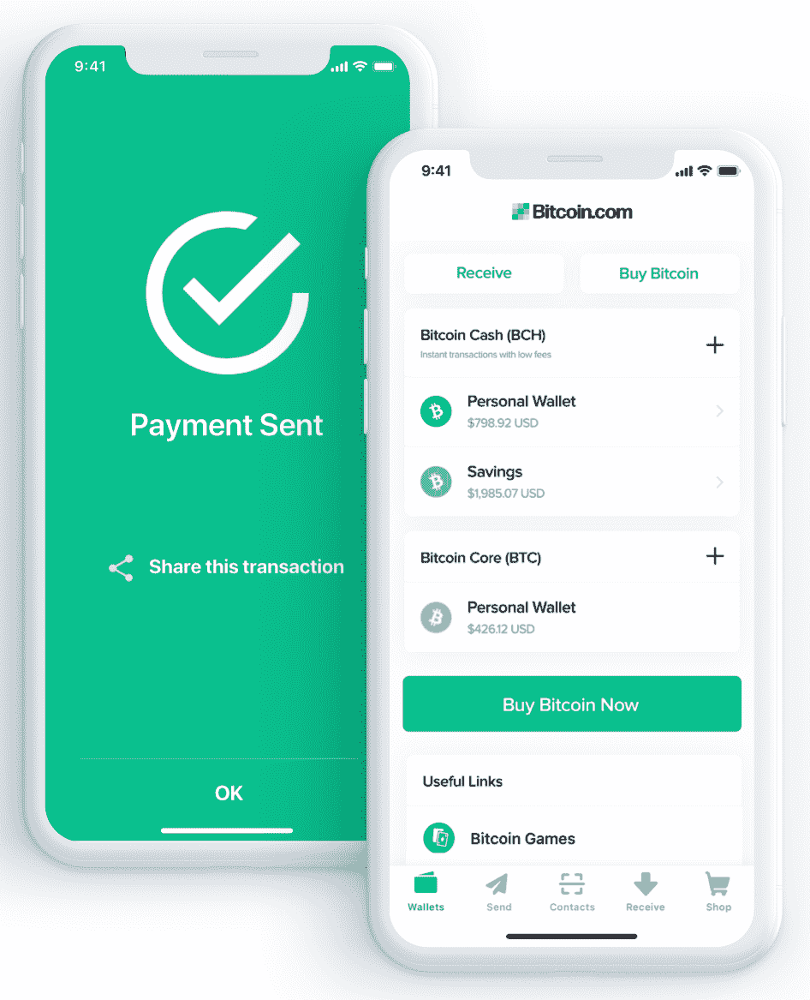

# 第六章：区块链的经济和历史方法

现在你掌握了区块链的一般和技术概念，让我们理解区块链试图解决的根本问题以及它是如何来到我们身边的。采用社会和经济的方法来理解区块链对于识别具有坚实基础的项目并确定商业机会非常有帮助。

借助诸如区块链之类的新技术，我们可以想象下一个优步将依赖分布式和去中心化的基础设施，完全的报酬将归属于司机，而小额费用将用于运行区块链并奖励增强网络的节点。事实上，已经有像 Eva 这样的基于区块链的类似优步的初创公司正在发展，它真正地去中心化了司机和客户之间的互动，以提供拼车服务。但优步只是冰山一角。今天的协作平台的集中经济规模模式将受到真正颠覆，并在服务提供商和消费者之间实现均衡，这得益于区块链。

去中心化环境是区块链产生最大影响和获得最大好处的地方。此外，在我们实现经济行为主体、机构和个人之间这种去中心化之前，区块链仍有时间实现产业化和用户友好性。

在本章中，我们将专注于学习比特币和其他加密货币受欢迎的原因。我们将通过经济的视角来看待这些数字资产，理解它们的潜在价值以及它们为资本主义带来的动荡。以下见解将为您提供了解区块链实现的全球图景的基础。我们还将了解数字支付系统、区块链的技术限制以及为什么它可以被视为更加协作经济的最终层。

本章将涉及以下主题：

+   全球经济形势

+   区块链作为协作经济的一个缺失工具

+   在数字世界中交换价值

# 全球经济形势

人与人之间一直存在着信任问题。以此为背景，我们创建了可以陈述真相的中央权威，以及可以促成某些行为的中间人。这是社会契约的一部分：为了解决彼此之间的信任问题，必须有实体确保规则，人们必须放弃部分自由。

在大多数民主国家，国家的权力与统治公民的中央实体是分开的：司法、行政和立法。每个实体都对其他实体拥有控制权，以避免滥用权力。但有时这还不足以避免错误或失误，并保持系统完全的权力平衡。

*那么，我们如何在个体之间实现信任而不需要信任的第三方呢？*

比特币在 2008 年提出了第一个答案，但这个故事可以追溯到我们的时代之前，3600 年前，当我们的祖先利用不同的材料和自然元素作为交换手段时。被确认的第一种货币形式是贝壳—小贝壳被亚洲、非洲和大洋洲的几个部落和国家用来彼此交易。下图显示了一个贝壳：

就像今天的货币一样，贝壳被视为财富和繁荣的象征。公元前 600 年左右，我们开始使用金币作为主要支付媒介。金具有任何货币单位需要具备的特征：它是稀有的、可识别的和便携的，因此具有内在价值。

自那时以来，黄金一直是一种标准。直到现代时代，特别是 1944 年的布雷顿森林会议，联合国重塑了世界货币体系，并同意美元成为世界储备货币，迫使其他国家将其货币与美元挂钩。

# 货币是信任

1971 年，理查德·尼克松暂停了美元兑黄金的兑换，并迫使每个政府支持自己的货币。剩下的只有信任和纸币，即所谓的法定货币。

不知何故，这种范式转变起了作用。人们相信政府支持一捆捆纸币，被告知这是真正的货币。今天，我们仍然依赖这些纸币和硬币来支付商品和服务，尽管它们没有内在价值。用一枚简单的金属硬币买咖啡成为可能，是因为我们相信我们的政府会维持这些硬币和纸币作为主要支付手段。

我们正处于一种简单的心理模式之中：因为每个人都使用欧元、美元或人民币，所以这些支付工具在愿意参与经济生活的人们眼中的价值不断增长。而且越来越多的人认可欧元、美元或人民币作为支付手段，它们的价值就越大。

你必须明白这只是针对比特币提出的诸多指控之一。当欧洲央行表示比特币不是货币（[`www.ecb.europa.eu/explainers/tell-me/html/what-is-bitcoin.en.html`](https://www.ecb.europa.eu/explainers/tell-me/html/what-is-bitcoin.en.html)）时，为什么纸币和硬币会被认为是货币呢？如果每个人都把比特币信任为主要支付媒介，那么向新的去中心化无信任支付系统的演变将自动发生。

# 一个去中心化的数字支付系统

如今，所有的纸币主要存储在大型银行数据库中。当你向某人转账时，你只需在你的设备上输入一个金额，然后发送给对方。这只是银行拥有的数据库中数字的移动问题。

金子和纸币都不会在银行之间流动。结论：银行是数字支付系统，可以实现从一个个人到另一个个人的资金转移并保障其安全。如果您曾经想过，PayPal 也是类似的；它是一个完全集成的数字支付系统，将资金集中并存储在自己的服务器上。

比特币也是一种数字支付系统，但主要区别在于它不属于任何第三方——没有权威、没有实体、没有监管、也没有银行。请记住，通过银行转账时，您依赖银行进行资金核实和向正确账户转账。由于比特币不是专有的，因此验证和转账是通过比特币网络以分散方式进行的，这要归功于密码学和共识协议。

此外，比特币网络的去中心化特性消除了单点故障。想象一下，您的银行被一个恶意组织或个人黑客攻击，他们可以接管银行服务器中存储的数据并删除或修改它。由于比特币依赖于网络节点来存储每笔交易的历史记录，并依赖于加密哈希来保护区块链的每个区块，因此它变得无法被黑客攻击和篡改。

# 比特币——一种数字货币还是黄金 2.0？

与法定货币的真正区别在于，比特币不能凭空产生。美元或欧元是可以分别由美联储（**FED**）或欧洲央行（**ECB**）根据其自行决定发行的货币。另一方面，比特币不能根据单方面的决定生成。它是一种稀缺的数字资产，仅通过预定义的算法和密码学、数学以及庞大的计算机网络创建。

我们应该强调的是，使黄金在 3000 年中具有价值的是人们为挖掘它所付出的努力。比特币依赖于同样的特性。为了验证交易，网络，更具体地说是矿工们，必须找到一个大约需要 10 分钟才能找到的加密哈希。

一旦找到，网络就会得到新比特币作为奖励注入系统。要能够运行并找到哈希，需要电力、芯片和材料，就像挖掘一盎司黄金需要矿工的镐、铲和努力一样。

任何人都可以使用比特币发送资金。与传统银行转账相比，资金到账需要 10 分钟，交易变为不可更改需要 60 分钟。

在比特币区块链中，一个区块 A 被矿工验证并添加到链上需要 10 分钟。如果之后验证了五个区块（即 50 分钟后），具有网络 30%计算能力的矿工删除区块 A 中的交易的概率将低于 1%。这段时间是衡量交易安全性的标准。验证交易后，验证的区块越多，交易就越安全。

距离、熟人和信任对于两个个体之间的转账正常进行是无意义的变量。此外，处理转账不需要银行账户：你所需要的是一个互联网连接和一个比特币钱包。比特币钱包是一个可以在[bitcoin.com](https://www.bitcoin.com/)上创建的数字钱包，用于发送和接收比特币。这是比特币钱包的屏幕截图：

# 投资产品还是无银行账户者的真正解决方案？

自 2017 年以来的炒作，特别是在金融领域内，比特币被公众视为一种投机性资产类别。美元/比特币对的狂热涨跌吸引了来自全球金融领域的资本鲨和交易员。比特币的名声是由新的*加密*-*百万富翁*和交易员的成功故事推动的。但比特币的这一不良一面隐藏了它试图在世界上产生的真正影响。

解决比特币的第一个问题是为这个星球上 17 亿无银行账户者提供无摩擦的支付方式。

当来自最富裕国家的人将比特币仅视为投资产品时，比特币社区的很大一部分将其视为一种数字货币，最终使他们能够以极小的成本和即时性进行数字支付和资金转移。对于腐败率高的发展中国家来说，这一点尤为真实。

当人们开始像委内瑞拉那样害怕和不信任他们的政府时，他们将加密货币视为一种有前途的替代方案。我们可以将其视为避免腐败、破产和缺乏透明度的强大工具。

# 对抗政府

拥有这样一种数字支付系统，可以在没有任何银行账户的情况下进行资金转移，是政府不喜欢比特币的原因之一。政府声称比特币主要用于恐怖主义和进入暗网毒品市场以及作为洗钱机制。但我们强调现金也被用作这样的用途。

实际上，任何不可追踪且易于携带的支付方式都可以被用作此类用途。政府的目标是无现金化，以便能够通过在线跟踪任何价值转移来打击洗钱，以及将公民困在无现金系统中，以防止在潜在经济危机期间出现大规模和突然的现金流失。

未来政府可能的转变是创建自己的数字货币。这将意味着每个人都使用的无现金系统，但仍由中央当局控制。请注意，如果政府选择一种中央集权的方式来控制货币供应和网络上的资金流动，那么这不是基于区块链的货币，而只是一个中央集权的硬币，就像今天一样。

这是一个重要的观点：多亏了区块链，比特币在政府政策之外提供了货币主权。这就是为什么委内瑞拉、津巴布韦、尼日利亚或南非等许多发展中国家普遍对加密货币持开放态度的原因。

# 比特币的技术限制

比特币面临的一个尚未解决的技术挑战是可伸缩性。如今，比特币区块链每秒可以结算四到七笔交易，而 Visa 可以处理约 2000 笔。比特币的最终目标是允许任何人以非常低的成本、非常快速地在世界任何地方转账。由于需要计算能力来处理交易，每笔交易的费用如今过高，无法使某人用比特币买咖啡。

借助来自比特币社区解决这些问题的举措不断涌现，一种被称为闪电网络的技术引起了人们的关注。很有可能，在未来，比特币区块链将能够每秒处理一百万笔交易，成为一个快速、免费且高效的支付系统。

闪电网络是在比特币区块链上实现的一层，旨在实现个体之间的快速、廉价交易。目前处于测试版，其工作原理是允许两方建立支付通道，基本上是一个*共同的*钱包，双方在其中存入一定金额。当双方进行交易时，它们会更新分配给每方的金额。当他们最终关闭支付通道时，钱包中的每个余额将相应地分配给每一方。

# 区块链作为协作经济的缺失工具

比特币面临着其他挑战，但它已经证明了自己的能力以及它正在解决的问题。通过旨在为 17 亿没有银行账户的人提供数字支付系统，比特币向世界展示了加密、共识协议和去中心化数据库是强大的推动者，可以使权力转移到群众手中，而不是给定的中央机构或第三方。

*"我们需要更好的跨境支付...因为这对发展有利，对金融包容性有利，所以比特币可以帮助我们。"*- 本尼奥·库雷尔（Benoit Coeure），2018 年 1 月欧洲央行执行委员会委员

在一个社会、循环和协作经济蓬勃发展的世界中，拥有一种技术，使任何人都能在一个安全透明的网络中共享、交易、支付或出售任何东西，似乎是杰里米·里夫金斯（Jeremy Rifkin）2014 年的*《零边际成本社会》*（[`www.thezeromarginalcostsociety.com/pages/The-Book.cfm`](http://www.thezeromarginalcostsociety.com/pages/The-Book.cfm)）中所缺少的一环，这是一个由协作行为、新兴技术和几乎免费的商品和服务赋予力量的社会。

实际上，值得观察到的是，2009 年围绕着优步等公司引发的协作经济的扩张和分布式分类账技术如区块链的发展产生了一个有趣的巧合。诸如 3D 打印、**物联网**（**IoT**）或**人工智能**（**AI**）等新兴技术正在将当前的垂直模式转变为更直接共享价值的模式，所有这些都由数字平台作为新经济的*共同*模式的基石来便利。

能源行业就是一个明显的例子，消费者现在与生产者合而为一，使用可再生能源进行本地和高效的供电。同样的转变也适用于教育领域，在那里知识在彼此之间分享，以及在每个由资本主义、自上而下的方法和寡头垄断局势支持的行业中。

# 去中心化- 但为什么？

许多新闻稿和文章将类似优步的公司描述为颠覆传统商业模式的创新项目，大多数时候结论都是真正的去中心化是最终步骤—好像分散型经济是最终目标一样。

作为决策者，您应该意识到这些分析中缺失的是**去中心化不是目标而是手段**—一种使个人之间大规模合作而无需中央实体的手段。目标是，作为个人或公司，能够在没有摩擦的情况下蓬勃发展和合作，以点对点的方式产生和交换价值，并提供社会利益而不是财务利润。

随着数字普及所导致的消费模式转变以及所谓**优步化**的崛起，对组织重新思考其运作方式，以满足最终用户所追求的亲近和透明度的需求变得越来越重要。

优步化指的是促进个人和服务提供商之间点对点交易的数字平台。

作为先驱，优步和爱彼迎迅速意识到传统公司未充分利用的资产和人力资源可以通过数字工具克服。优步化还指的是协作经济，首批将客户和服务提供商直接联系起来的平台，从而大规模地连接人们，并允许他们交换价值、知识、专业知识、服务、资产等等。

但在我们实现大规模去中心化的过程中，感觉有好几个重要的中间人仍然存在，包括平台本身。协作经济正在为依靠数据收集而不是利润率实现增长的数字原生普及公司消除原始垄断。

# 区块链—终极层

区块链与所有这些有什么关系？

区块链可以被视为最终取代这些平台的一种层，赋予了群众控制权和权力，但仍然允许个人负责和协作。借助区块链，我们可以在不借助任何中介的情况下获得对数据的主权，向同行交易其专业技能，与同行交换价值。

区块链和分布式账本技术促进了参与、包容和协作的生态系统，为分散环境中的透明度和安全性带来了透明度和安全性。它们充当了一种用于简化流程并通过其内在激励机制允许广泛合作进行决策的工具。我们可以很容易地将《零边际成本社会》中讨论的问题与区块链的特点进行对比。

根据作者杰里米·里夫金的说法，越来越多的公司是以集体方式组织的（例如合作社）。就像社区是由其成员以一种共识方式处理和管理的，区块链依赖于网络进行价值转移和信息记录。这个过程不再是自上而下的僵硬的，而是协作的和灵活的。里夫金还预测，将更加倾向于使用商品和服务，而不是所有权，更加倾向于合作而不是竞争。区块链的内在特点是它不归任何人所有，并分布在所有共同努力朝着共同真理的参与者中。有了这种机制，成员们可以在一个无需信任的环境中**合作**，透明度和安全性由加密技术来保证。

但最重要的是，区块链在实现数字世界中的价值交换方面具有颠覆性。

# 在数字世界中交换价值

在数字世界中，百万美元的问题是：*如何确保一个数字资产无法复制？*

要回答这个问题，重要的是要理解互联网是建立在信息交换的基础上的。这些信息是从计算机到计算机复制，通过网络复制。经过节点的每一位数据都可以被复制或存储。换句话说，一旦一条信息被注入到互联网中，它就会通过网络快速复制和传播，从而消除其独特性。这就是信息传输的工作原理——通过复制。

问题在于，在商业交易中，我们并不是免费传递信息；我们交易的是不应该被复制的价值。如果我给你一美元，我不应该再持有它，因为如果我这样做了，它将毫无价值。因此，价值应该被转移为一次行动，而不是一份复制品。任何形式的价值，包括金钱，都应该被涉及：土地所有权、汽车登记文件、版权、独家合同或公司股份。因为价值不能花费两次，区块链确保了**双重支付**在数字世界中被阻止。

有了区块链，价值互联网诞生了。在合作经济中，只有像优步和爱彼迎这样的中心化平台才能确保从一个个体到另一个个体的价值转移。它们确保您为车费或租房所花费的钱不能被花费两次。这个双重支付问题是数字世界中最复杂的挑战之一。

互联网是为了交换信息而建立的，这些信息从计算机复制到计算机，擦除了它的独特性，因为传输是通过复制进行的。有了区块链，价值就像一步一步传递，而不是复制，这就是数字时代合作经济蓬勃发展所需要的。

# 摘要

希望在本章中，您已经了解了区块链涉及的社会和经济概念的类型。从现代货币到数字支付系统，我们解释了比特币如何在经济动荡中发挥作用，以及它现在如何威胁到一些既定的公共政策。我们涵盖了比特币试图通过为无银行账户的人提供货币访问权所要达到的主要影响，以及它在这方面面临的技术限制。最终，我们讨论了区块链可能促进的一个更具合作和负责任的经济的实现的一个更大的挑战。

在下一章中，我们将与监管机构和金融当局站在一起，了解政府和公共机构如何面对区块链和加密货币带来的技术颠覆。我们将看到作为决策者，应该考虑哪些法律、税收和会计方面的问题，以实现区块链项目。
