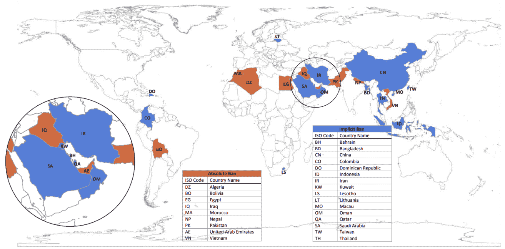
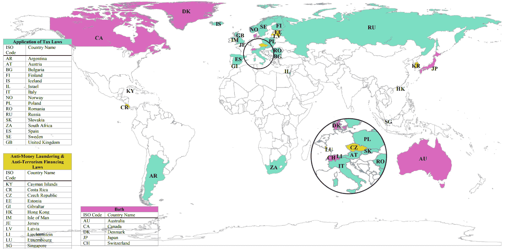
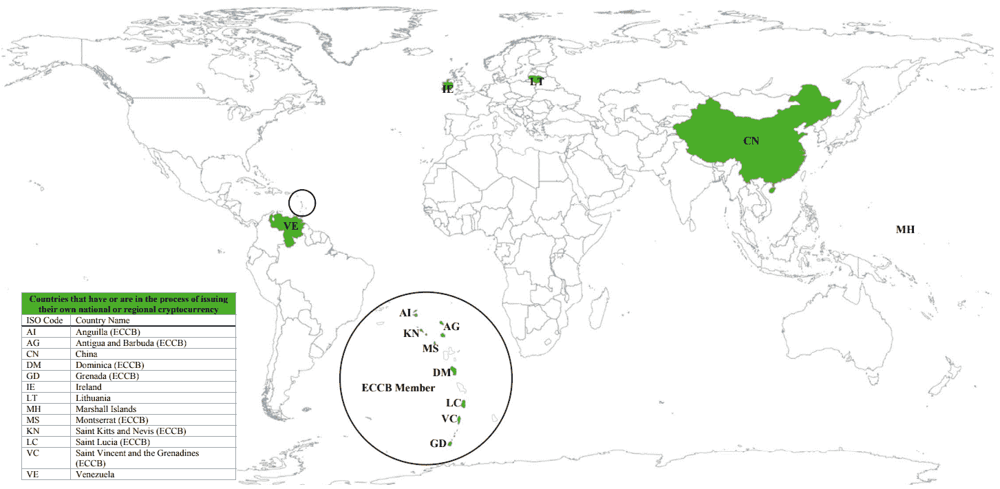

# 区块链的合法性、合规性和监管

对于任何与区块链相关的项目，无论是创建区块链、使用区块链即服务解决方案、开发应用程序还是发行代币，都必须由所有涉及方进行风险和机会评估。

实际上，有一些特定的范围，如盈利能力、能力和成本，决策者必须采纳，但这并不足以确保项目的安全。由于区块链环境变化迅速，许多司法管辖区未能通过法律法规适当地框定加密资产和区块链。本章关注区块链的合法性、会计、税收、合规性和法规等方面。我们将从法律的角度合法地定义区块链和加密货币，以及全球各地当局如何处理这项新技术及其产生的数字资产。作为决策者，您必须了解围绕区块链的复杂监管框架，尤其是加密资产。

在任何情况下，国内监管机构试图解决区块链和加密资产带来的挑战，直到全球协调机制建立起来，以对齐更好、更全面的框架的法规和分类。例如，在 2018 年 7 月，金融稳定理事会（FSB）发布了一份报告（[`www.fsb.org/wp-content/uploads/P160718-1.pdf`](http://www.fsb.org/wp-content/uploads/P160718-1.pdf)），作为对几个月前 G20 财长会议的回应。该报告确定了监测加密资产市场对金融稳定影响的指标，支持 ICO 投资者，并衡量了银行面临的加密资产风险暴露。

这是首个发起的超国家行动之一，旨在提高全球对加密资产和区块链的认识，并为这项新技术的全球立法和标准建立教育。此举必将在未来几年得到多个机构的支持，以在全球范围内制定此项新技术的法规和标准。

在本章中，我们将涵盖以下主题：

+   打下基础

+   如何在法律上定义区块链

+   如何在法律上定义代币和其他加密资产

+   法规框架概述

+   会计框架概述

# 打下基础

截至 2019 年 6 月，我们目睹了全球各地以不同权力层级来规范、定义和框架化代币和区块链的举措。重要的是要注意，每个司法管辖区都有自己的意识程度、控制技术和资产的雄心程度、收集信息的方式以及对生态系统做出决策的方式。因此，项目范围相关的风险和机遇主要取决于其实施的地域。

作为决策者，围绕基于区块链的项目有许多问题，其答案大多取决于外部因素，如管辖权和领土，但也取决于内部因素，如行业、企业规模和目标客户。例如，对以下问题的普遍答案并不存在：*区块链项目应该遵守什么法规？*答案在于项目在友好还是怀疑加密环境中实施的地方。实际上，区块链和加密货币在不同地区的受到的认知非常不同。重要的是要注意，当局和机构的主要关注点并不在于区块链本身，而是它所生成的资产，即与区块链相关的所谓代币。

项目的适当合规性也将取决于项目影响的业务线、涉及的子公司以及所在地。接下来是如何处理税收问题，例如研发税收减免的利益，以及更重要的区块链项目责任和折旧问题。一些国家在财务报表中显著推进了加密资产会计，并使此类主题成为许多公司真正关注的问题。最终，合规的区块链项目也是一项已经考虑到其他法规的项目，例如数据保护（欧洲联盟的**通用数据保护条例**（**GDPR**））、客户身份（**了解您的客户**（**KYC**）政策）以及打击犯罪（**反洗钱**（**AML**）和**打击资助恐怖主义**（**CFT**））。

在这些情况下，我们将通过提供适当的定义来清理区块链环境，以涵盖生态系统中围绕新词汇的内容，比如*代币*、*加密货币*或*加密资产*，以便妥善对其进行分类。当我们谈论代币、数字资产或加密货币时，我们到底应该理解什么？现在价值可以在数字化不可复制的情况下传输对当局和机构意味着什么？最终，通过说明这些术语的定义，我们可以限制它们的含义，并最终应用规则和法律。

# 如何在法律上定义区块链

区块链是协议、点对点网络和以加密方式通过数据库流动的信息的组合。纽约州的定义如下：

*"这是一种分布式账本技术，是一种经过数学保护、按时间顺序排列的、去中心化的共识账本或数据库，无论是通过互联网互动、点对点网络还是其他方式用于认证、记录、共享和同步其各自的电子账本或数据库的交易的商业实体，并开发分布式账本技术的商业实体。"* （[`www.ncsl.org/research/financial-services-and-commerce/the-fundamentals-of-risk-management-and-insurance-viewed-through-the-lens-of-emerging-technology-webinar.aspx`](http://www.ncsl.org/research/financial-services-and-commerce/the-fundamentals-of-risk-management-and-insurance-viewed-through-the-lens-of-emerging-technology-webinar.aspx)）。

区块链核心定义所产生的主要问题是数据隐私，特别是对于交易公开的公共区块链。因为信息存储在区块链中，需要一项安全而严格的政策来管理这些数据，并避免泄漏和损坏。当局很少干预这个话题，虽然他们试图理解它意味着什么，以及区块链中流动的是什么样的数据。

区块链作为唯一的工具，将仅仅受到其所包含数据的质疑，但当项目在欧盟实施时，必须考虑一项法规：GDPR。该法规于 2018 年 5 月生效，旨在保护客户数据并鼓励公司妥善管理数据。

# 区块链和 GDPR

具有讽刺意味的是，GDPR 规定数据应以集中的方式处理，而区块链则倾向以去中心化方式处理信息。此外，GDPR 赋予了被遗忘的权利、更正权利和数据最小化原则。乍看之下，这些权利和原则与区块链的并不兼容。

欧洲多个机构，比如欧洲委员会，通过创建区块链观察中心，目前正在研究最合适的设计，以提供答案和最佳实践。与此同时，决策者应保持谨慎：如果项目完全由公共区块链支持，则 GDPR 和区块链之间的悖论将成为一个挑战。你的区块链项目越是去中心化和透明，就越需要遵守更多条件以符合 GDPR。因为在公共基础设施内，信息在账本上透明地流动，不会暴露任何个人数据。

# 如何合法地定义代币和其他加密资产

加密资产、加密货币、代币和硬币这些术语在生态系统内经常引起混淆。有些意思相同，而另一些是子集。然而，它们都有一个共同点：它们都有数字价值。让我们试着以相关的方式定义这些术语，以便促进特定监管的适用性并澄清术语。

# 加密货币

加密货币可以是代币或硬币。加密货币可以被定义为**独立**的数字货币，发行、交易验证流程、应用的可用性和治理完全独立。它与数字货币相对，后者的所有特征都由中央机构定义和管理。

加密货币是指任何只作为支付手段使用的基于区块链的代币，具有足够的流动性和充分的接受度，被视为购买或出售商品和服务的材料（参见第五章，*区块链的经济和历史方法*）。我们可以将以下代币列入这一类别（非尽述）：

+   比特币

+   以太坊

+   比特币现金

+   莱特币

+   蒙罗币

# 非加密货币

非加密货币，也称为基于区块链的代币，涵盖了比加密货币更广泛的概念，因为它们不仅用作支付手段。代币本质上有一个广泛而抽象的定义，可以指代电影票、折扣券或在线游戏中的游戏币。

这些代币大多不是基于区块链的代币，因此在谈论区块链中的代币时，我们应称其为加密代币。加密代币是数字资产，可以从点对点转移（就像加密货币一样），但附有特定的特征。数据被纳入发行的代币中，这赋予了所有者一些权利。

以太既是加密货币（用作支付手段，其价值根据市场需求而形成），又是非加密货币（以太允许平台提供的服务被使用）。

在大多数司法管辖区，这些非加密货币代币引起了关注，因为它们是不受当前法规约束的资产。我们可以将这些代币分为两类，虽然根据一些司法管辖区可以分为更多类别。有关更多详情，请参阅第四章，*ICO 和代币化筹款方法*：

+   **证券代币：** 该代币赋予用户从产品或服务中获得股息或利润的权利。

+   **实用代币：** 该代币用于购买产品或服务的权利，并不附有任何金融权利。

所有与税收、会计和合法性相关的外部因素，都是根据许多司法管辖区的先前定义来确定的。考虑到这一点，您可以说明您的区块链项目中的基础代币是安全代币还是实用程序代币，因此制定符合法律的计划。

# 监管框架概述

自 2017 年 ICO 的炒作以来，许多当局和机构采取行动建立法律框架和一般指导方针。由于 DAO 未能看到这一点（请参阅第四章，*ICO 和代币化筹资方法*），美国证券交易委员会（SEC）努力将新资产类别纳入美国法律范围。

DAO 案例很重要，因为它导致美国证券交易委员会对将代币定义为金融证券或实用程序进行调查。SEC 于 2017 年 7 月发布了其调查报告（DAO 失败后一个月），指出 DAO 代币本应受到安全法律的约束，因为它们被标记为这样。这是至少在美国关于监管加密资产的首次举措之一。SEC 推进了这项庞大的任务，以一个全球公认的视角来对待代币，并提供了使用豪伊测试对代币进行分类的起点，以确定加密资产的分类。

通过这一首次举措，SEC 引发了海外其他机构的关注，后者开始关注代币，更广泛地关注 ICO。他们意识到 ICO 具有财务破坏性，因为它允许任何项目负责人快速、免费地筹集资金，并允许投资者直接和即时地投资项目，而无需向风险投资公司支付费用，从而避免了当前受监管的融资方案。公共机构、协会和当局意识到需要采取行动，既要合法地定义代币发行过程，又要保护投资者。诸如 KYC 和 AML 之类的政策得到了加强，以保护利益相关者免受过于冒险和不负责任的投资，并遵守监管机构的规定。

由于安全代币看起来确实像传统股份，它们属于一个受到严格监管的领域，发行和营销受到检查，包括投资者身份、资金用途和相关风险。因此，当局非常关心提醒人们和投资者投资 ICO 的潜在危险，特别是安全代币。德国联邦金融监管局于 2017 年 6 月发布了一份说明书，英国金融行为监管机构于 2018 年 4 月向投资者发布了一份有关投资 ICO 风险的注意事项。

以下是绝对禁止或暗中禁止加密货币的司法管辖区的概述：

以下是税收法律、AML 和 CFT 标准的概述：

以下是有关正在发行或已发行自己国家数字货币的国家概述：

如果你想了解全球各地的法规和政策是如何被理解的，你可以查阅以下报告，该报告由美国国会图书馆撰写，链接为[`www.loc.gov/law/help/cryptocurrency/cryptocurrency-world-survey.pdf`](https://www.loc.gov/law/help/cryptocurrency/cryptocurrency-world-survey.pdf)。

# 会计框架概述

随着进行的 ICO 数量不断增加，一些机构对如何在公司的财务报表中对代币进行会计处理提出了疑问，因为我们正在处理一种新的资产类别。

如果你经营一家销售汽车的百年老店，并愿意发行代币以让人们购买特定种类的产品或服务，你将如何进行？

你将发起一项 ICO，出售新创建的加密代币，例如针对美元。在这种情况下，你应该考虑以下问题：

+   你将如何在资产负债表上记录筹集到的资金？

+   你将如何在**损益表**（**P&L**）中对剩余的代币进行会计处理？

这些问题目前正在全球多个司法管辖区讨论。瑞士对 ICO 持有非常友好的态度，并且对会计处理代币没有负面影响。苏黎世实际上成为了“加密山谷”的首都，一个聚集了几家著名区块链公司的创业者、初创公司和孵化器的生态系统。

在法国，**会计标准局**（**ANC**）进行了前所未有的工作，他们于 2018 年 12 月发布了一份文件，指出某些代币必须根据其资格记录在资产负债表中作为债务或营业额。除此之外，ANC 是世界上第一个在国内总账账户中引入加密资产的机构。

这项工作是由其他机构之前提出的疑问的结果。在澳大利亚，监督该国报告标准的**澳大利亚会计准则委员会**（**AASB**）于 2016 年 12 月向**国际会计准则委员会**（**IASB**）发送了一份文件（[`www.aasb.gov.au/admin/file/content102/c3/AASB_ASAF_DigitalCurrency.pdf`](https://www.aasb.gov.au/admin/file/content102/c3/AASB_ASAF_DigitalCurrency.pdf)），主张数字货币和其他无形资产需要更明确的标准。

根据澳大利亚会计标准局（AASB）的说法，加密资产不应被视为现金或现金等价物，也不应被视为金融工具，因为它们不代表财务报表中的资金流动（根据 IAS 7 规定的定义），也因为没有基础合同关系。AASB 指出，另一方面，加密货币符合另一项规定，即 IAS 38，规定它应被视为无形资产，因为它是一种可识别的非货币资产，没有实物。

意识到这一颠覆性话题，**国际注册会计师联合会**（**IFAC**）于 2018 年 5 月撰写了一份报告（[`www.ifac.org/system/files/publications/files/Blockchain-Slide-Deck_0.pdf`](https://www.ifac.org/system/files/publications/files/Blockchain-Slide-Deck_0.pdf)）向会计事务所介绍了区块链对会计原则的影响。令人惊讶的是，该报告指出，区块链将通过提供完整的审计轨迹可见性、报告工具的更高性能以及通过智能合约的增强监控，对会计师产生积极影响。

# 总结

在本章中，我们首先了解了为什么作为决策者在启动区块链项目时重要考虑法律框架，特别是自 2017 年引起公众机构关注的炒作以来。由于监管机构对区块链的关注越来越多，法律问题需要得到解决。我们在法律上明确了区块链术语和新词的定义，以基本了解在法律眼中加密资产、加密货币和代币是什么。我们结束了这一章节，看了全球在法律和会计方面所采取的不同举措。

现在您已经对区块链和加密资产有了技术、经济和法律知识，在下一章中，我们将深入到商业世界，探讨这项新技术产生了哪些应用，推出了哪些颠覆性服务和产品，以及我们可以期待什么样的前景。
