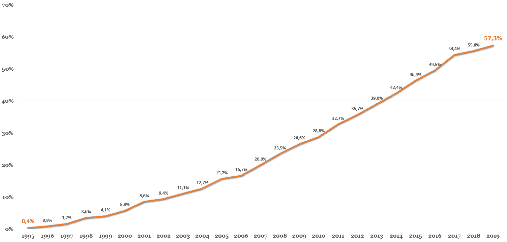

# 区块链在商业世界的成就

在本章中，我们将通过几个在各个经济领域实施的应用来阐明区块链的潜力。我们将发现区块链是如何颠覆企业，带来透明度，并在供应链上实现可追溯性，以及加密资产如何通过代币化重新设计商业模式，带来任何给定实物资产的流动性和数字表示，最后，智能合约如何可以取代中介，提供公司和个人之间无缝交易。

本章中介绍的每一个案例都以企业遇到的问题开始，并解释了区块链如何促进解决这些问题。本章将说明为了应对这些商业问题而创建了哪些项目和倡议。

我们将介绍以下主题：

+   认证和可信度

+   互操作性

+   可追溯性

+   自动化、去中介化和自组织

+   数字身份

+   金融证券和筹款

+   数字唯一性

# 认证和可信度

许多公司已经面临着冒充其财务状况和战略选择的发布，特别是在数字时代，监控和防止虚假通讯变得越来越困难。这种现实对那些财务报表受股东、债权人、银行、投资者和公共机构密切关注的企业来说非常普遍。

在一般情况下，文档欺诈对公共机构和政府来说是一个严重问题。根据法国国家打击欺诈委员会（DNLF）的数据，2017 年在法国造成了 80 亿欧元的损失（[`www.lejdd.fr/Economie/la-caisse-des-depots-engie-edf-et-la-poste-sallient-dans-la-blockchain-3898162`](https://www.lejdd.fr/Economie/la-caisse-des-depots-engie-edf-et-la-poste-sallient-dans-la-blockchain-3898162)）。这个问题被法国初创公司 KeeeX 解决，其开发了一款产品，允许公司和个人认证任何给定文件。成立于 2014 年，他们使用比特币区块链来封存任何类型的数字文件。当有人需要验证文件的真实性时，他们使用 KeeeX 应用程序来揭示其真实性。

解释是公司和个人可以依靠区块链来确保电子文档和数据是可信的，因为它最初是由正确的人记录的。提醒一下，区块链是一种分布式数据库，其中数据被时间戳记录并以一种共识方式记录。由于这个注册表是透明的，它允许用户浏览历史以无缝检索交易或信息。从设计上讲，这些特性非常有助于验证数据源和可信度。

KeeeX 的产品是理解哈希函数和分布式账本技术的一个非常强大而简单的例子。该过程始于使用哈希函数对原始文件进行加密，返回一个加密数字。这个哈希通过比特币区块链上的交易发送，时间戳，然后附加到一个块上。这意味着，每当有人声称是原始文件的作者时，只需在区块链中简单搜索加密数字，就可以返回其时间戳和地址。有了这些信息，就可以很容易地指出合法的发行者、真实的文件和提交日期。

设计师、建筑师、作家和艺术家实际上面临着与大企业相同的问题：他们的作品很有价值，但保护起来防止盗窃和复制变得更加困难。

# 音乐行业中的区块链

歌曲作者和制作人的情况是不言而喻的：如今，音乐主要以数字格式消费。根据**美国唱片业协会**（**RIAA**）的说法，在线流媒体平台产生了行业收入的 75%。版权盗窃已经成为主流，音乐盗版继续折磨整个音乐行业，特别是由于这些平台日益增长的流行。

RIAA 估计音乐盗版每年造成 125 亿美元的损失，而创作者按照他们的作品获得报酬变得越来越困难，因为存在许多中间商导致的复杂资金流动。实际上，Rethink Music 的研究（[`www.riaa.com/wp-content/uploads/2018/09/RIAA-Mid-Year-2018-Revenue-Report.pdf`](https://www.riaa.com/wp-content/uploads/2018/09/RIAA-Mid-Year-2018-Revenue-Report.pdf)）估计有 20%至 50%的音乐支付没有归还给其合法所有者。

希望区块链的崛起提供了一个解决方案，可以防止版权盗窃，并确保为作者的创作提供准确的付款。这里的挑战是提供一个附加到歌曲上的数字签名，链接到创作者。密钥加密和哈希函数在这个方案中也起着重要的作用，为歌曲或创作提供一个唯一的标识符，一旦记录在区块链上，就会成为时间戳并得到验证，作为艺术家的财产。

对这首歌的任何进一步使用都将被永久记录在账本中，从而实现追踪和追踪。具体来说，基于区块链的音乐平台，例如 Ujo Music ([`static1.squarespace.com/static/552c0535e4b0afcbed88dc53/t/55d0da1ae4b06bd4bea8c86c/1439750682446/rethink_music_fairness_transparency_final.pdf`](http://static1.squarespace.com/static/552c0535e4b0afcbed88dc53/t/55d0da1ae4b06bd4bea8c86c/1439750682446/rethink_music_fairness_transparency_final.pdf)) ，可以使艺术家将其作品提交到平台上，并生成哈希值。该哈希值充当证据，证明这个作品是由这个作者在特定时间提交的。作者可以设定创作的使用条款和相关的版税。

授权的资金然后直接进入作者的钱包。以这种点对点的方式使用区块链可以防止数字歌曲在平台上的版权和许可权的滥用。近年来，一些倡议已经出现，以解决这些重大问题的切实的解决方案。除了 Ujo Music ([`ujomusic.com/`](https://ujomusic.com/)) 以外，最有名的还有 Mycelia ([`myceliaformusic.org/`](http://myceliaformusic.org/)) 和 Mediachain ([`www.mediachain.io/`](http://www.mediachain.io/)) ，后者在 2017 年被 Spotify 收购。

更广泛地说，知识产权可以从区块链中获得巨大的附加值，这可以作为一个平台，可以记录数字资产的合法所有权。

对一个创作的来源和作者的诉讼可以通过参考一个不可篡改的时间戳来解决，指示准确地创作何时被记录。因此，区块链可以通过认证其艺术品、草图或绘画，保护艺术家免受窃贼和侵权者。

# 利用物联网（IoT）

区块链和物联网是两种新兴技术，它们实际上可以共同发展。作为一个真正分布式系统，结合了密码算法，区块链为网络成员提供了信任和安全，而这些成员在没有其他人的同意下不能更新信息。此外，链式数据几乎不可能修改账本。在这种方式下，物联网中的网络安全对区块链感兴趣。

传感器通常安装在基础设施的外围，数据存储在其核心，即所谓的云中。挑战在于许多企业希望将智能集成到传感器中，这导致了安全问题。通过在区块链上对传感器和终端进行身份验证，我们可以实现第一级安全。因为每次动作都可以在区块链上被跟踪，数据的来源也可以被说明，也就是说，来自哪些传感器的数据。

硅谷初创公司 Xage 提出了在区块链上保护数十亿设备的想法，为它们创建一个安全的运行环境。他们为公司提供了一种无需信任的机制，以确保他们的设备不会受到影响。通过连接可靠的设备到区块链，更容易保护它们免受恶意侵入和意外入侵。

目标是通过在服务器上附加安全时间戳来控制利益相关者之间的信息流。分布式账本技术的这种利用可能看似令人惊讶，因为这并不是它的主要功能，但它的目的足够广泛，以寻求其他解决业务问题的手段，比如消除单点故障。

IoT 和区块链的结合是一种真正颠覆性的方法，因为它整合了两种有前途的技术。重要的是要强调，大多数运用传感器和区块链的项目甚至还没有进入试验阶段。在几个行业中，对 IoT 的投资已经激增，市场调研公司 IDC 预测到 2022 年总额将达到 1 万亿美元（[`www.idc.com/getdoc.jsp?containerId=prUS44596319`](https://www.idc.com/getdoc.jsp?containerId=prUS44596319)）。

因为区块链上记录的数据经过了密码学的验证和加密，所以不太容易被黑客攻破或未经许可就被更改。区块链消除了中间人，使其比许多传统系统和网络安全性更高效。

# 互操作性

在一些领域，如银行业或保险业，数据在公司和监管机构之间流动，以便为客户提供适当的服务。在不信任方之间交换数据是一种痛苦且复杂的过程，尤其是因为严格的法规对实体之间传输何种数据行使着谨慎。

在这种情况下，很难确保个人的信息能够根据法律恰当地分享，而且没有摩擦。例如，在保险方面，客户必须提供由第三方机构提供的证明和证书，比如他们的失业机构、医生、学校管理机构或政府机构，以证明某一事件的发生。

区块链可以通过允许在客户同意的情况下在实体之间交换数据来减少其中的摩擦。一旦客户向第三方机构授予了共享个人凭证的初次授权，保险人就可以查询区块链以检索这一授权作为访问第三方机构持有的客户信息的许可证。

第三方机构实际拥有客户的特定数据，如出生日期、社会保障号码、学历、健康记录等，可以通过加密信息记录在区块链上发送到客户的公钥，以证明所有权。

例如，当保险公司要求特定数据以提供赔偿时，它可以浏览区块链以寻找客户的公钥。一旦找到，保险公司可以告诉第三方机构查找所需的数据以向客户提供服务。这基于区块链的索赔流程通过将传统的索赔流程转变为自动化、安全和无缝的流程显著改善了客户体验。

此外，数据隐私得到了保证，因为个人信息仍然存储在每个利益相关者的数据库中，而不是通过区块链流动。

在这个过程中，区块链扮演着一个层，一个实体可以通过它与另一个实体交换信息，包括其拥有的关于某个个体的数据类型的信息，并根据个体的同意私下分享实际数据。

由于据称无法在区块链上传播个人信息，索赔登记在披露个人信息的情况下有一种颠覆性的方法来证明某些特征。

Stratumn，一家法国的获奖区块链初创公司，目前正在努力在银行和保险行业之间带来互操作性，他们推出了一个名为 *Trace* 的产品，该产品已被几家欧洲公司以前述的方式使用。

区块链如何实现互操作性的另一个例子可以用体育行业的案例来说明。今天，体育联合会面临两个主要问题：

+   难以吸引更多的执照持有者

+   大型体育赛事中身份盗窃的增加，尤其是在业余比赛中

申请执照的障碍，部分来自订阅流程，对于一些联合会仍然是纸质的，对于愿意参与多项活动的人来说是耗时的。通过数字化和公共区块链的结合，用户可以更容易地分享更多运动所需的信息，以及在活动期间预防身份盗窃。

例如，我们可以通过数字化流程订阅特定运动项目，我们需要分享个人数据和证书到相应的联合会。当向另一个联合会订阅另一项活动时，我们只需将我们的数字身份（他们的公钥）发送给新的联合会，新的联合会将查看区块链并注意到数据已经被另一个联合会批准。

通过数字身份向新联邦展示授权分享个人信息的数字认可，可以消除这种摩擦。整个数字和基于区块链的流程确保数据在实体之间得到适当共享，并且在体育赛事期间不会发生冒名顶替行为。

不仅仅是保险、银行和体育产业可以通过区块链解决互操作性问题。事实上，任何一个竞争对手有着共同利益但互相不信任的行业都可以依靠区块链作为一种层来使分区的数据库互相交流，**而不泄露个人或敏感信息**，最终解决最重要的问题——满足客户的需求。

# 可追溯性

2019 年 4 月，世界第十大商业食品零售商 Albertsons ([`stores.org/stores-top-retailers-2018/`](https://stores.org/stores-top-retailers-2018/)) 宣布参与 IBM 的 Food Trust Blockchain，推出了追踪罗曼生菜的试点项目，因此加入了其他 79 个品牌，如沃尔玛、雀巢和联合利华。IBM Food Trust Blockchain 是一个模块化和协作网络解决方案，聚集了经济主体，并旨在解决商业食品链中的重大问题，比如能够识别不良产品的来源、疾病和卫生丑闻的主要来源，并且使得能够将受感染的产品从零售商店中清除而不必清除整个供应链。

在食品行业，安全是首要重点，产品的可追溯性变得至关重要。在这种情况下，许多食品生产商、供应商和零售商正在寻找一种追溯产品的方法。IBM 的 Food Trust Blockchain 似乎已经提供了相关的追溯手段，并吸引了食品供应链中的主要参与者，包括 Topco、Wakefern 和家乐福。他们的客户现在可以使用手机应用程序扫描 QR 码，获取有关特定产品的信息，比如其来源、生产者的姓名或质量控制证书。

截至目前，只有少数产品享受到了这些服务，但这些举措往往会增强食品供应链，该供应链经常因其不透明性和对生产者的不公平性而受到批评。

区块链还提高了供应链的运营效率。沿着流程移动的产品通常得不到追踪，这意味着任何发生的问题都无法得到充分隔离和调查。通过区块链，交易被永久记录并透明监测，从而减少了时间延误和人为错误。

它还可以用于监控成本、劳动力，甚至在供应链的每个环节监控废气排放。这对于了解和控制产品的真实环境影响具有重要应用价值。与传统数据库相反，区块链允许控制每个添加到账本的信息的权限，以确保利益相关方之间的信任，并获得唯一的真实来源。由于责任在整个过程中由每个参与者共同承担，透明度在这一方案中起着关键作用。

区块链有可能颠覆食品供应链处理方式，通过加速识别有问题的产品、提供运输条件信息，以及减少由于腐败而造成的损失。这种分散式信息共享模式之所以可能，是因为网络的每个节点都由一个单一实体代表，该实体具有预先定义的权威来验证交易、存储注册表或使用服务。

在竞争环境中，竞争对手、供应商和客户之间的大规模协调是区块链可以实现的显着例子。不幸的是，有时候，仅仅依靠区块链无法实现大规模协调，航运业就是一个明显的例子。

航运业是一个异质性环境，船东、运输公司、海关和码头必须共同确保高效的物流。就像商业食品行业一样，区块链也有一定作用。IBM 也参与其中，提出了一个解决方案，于 2018 年 8 月与全球最大的船运公司 Maersk 合作推出。

他们的解决方案被称为 TradeLens，专门记录商品在运输过程中的数据，如温度或行程。该平台旨在分享过境条件和绩效信息，使参与者能够根据进出情况调整资源。

尽管听起来很有前景，但 TradeLens 难以成功，因为只有少数公司加入了这一运动。就像任何依赖区块链的项目一样，网络效应是采纳过程中非常重要的组成部分。截至今日，TradeLens 一直努力吸引其他承运商([`www.coindesk.com/ibm-blockchain-maersk-shipping-struggling`](https://www.coindesk.com/ibm-blockchain-maersk-shipping-struggling)) 加入该平台。其中一些实际上已经注册到另一个名为 CargoSmart 的竞争平台，该平台由 Oracle 支持，使用区块链实现了与 TradeLens 相似的目标，即在该领域带来信任和透明度。

最后，如果物流供应链希望通过增强协作和透明度来提高效率，只应该有一个平台占主导地位，因为两个分开的项目将破坏整个流程并使生态系统碎片化。

在汽车行业，区块链也被认为是收集涉及多方的过程中的宝贵信息并改善协同作用以提高客户体验的手段。

根据国际汽车制造商组织（OICA）的数据，福特是世界第五大汽车制造商（[`www.oica.net/wp-content/uploads/World-Ranking-of-Manufacturers-1.pdf`](http://www.oica.net/wp-content/uploads/World-Ranking-of-Manufacturers-1.pdf)），于 2018 年 5 月与另外两家竞争对手宝马和雷诺共同发起了名为“MOBI”的移动开放区块链倡议。

该集群旨在通过促进标准和加速区块链的采用，使移动服务更加高效、负担得起和环保。他们目前正在开发一种工具，可以追踪汽车的维护历史，一种可读的护照，可供汽车经销商和车库业主对磨损件进行适当更新。

这个系统中汽车的数字身份是基石，因为它包含了很多信息，比如颜色、型号、车辆类型或制造商。在这样一个平台上，不同的参与者更新给定车辆的信息会减少繁琐的再售、所有权转让和准确市场价值的确定过程。

此外，区块链提供的不可变性减少了二手车转售商和买家在车辆状况方面的不信任。有了区块链，追踪车辆的生命周期成为可能，并加强了参与者之间的合作。

区块链更高效地实现了珠宝和钻石行业的追溯性的一个显著例子，该行业面临着许多欺诈、伪造和抢劫问题，尤其是由令人悲惨和增加风险的纸质认证流程引起的问题。由于物品的内在价值是根据其历史和来源塑造的，起源已成为奢侈品行业的一个严肃问题。这些挑战在 2015 年得到了 Everledger 的解决，这是一家领先的新兴技术企业，它利用区块链为钻石提供追踪解决方案。

截至目前，超过 200 万颗钻石通过他们的平台进行了数字化代表和加密。区块链被实施为所有利益相关者的真实单一信息来源，而无需一个实体来确保总账簿中的所有信息是正确的。

记录对所有参与者可见，从而增加了参与者和消费者之间的信任。该解决方案托管在 IBM 区块链平台上，为更新注册表提供了 IT 基础设施。具体来说，通过让全球多个钻石认证机构参与，他们能够为每颗钻石创建一个唯一的标识符，基于几个特征，如其颜色、清晰度、大小、克拉重量，当然还有刻在钻石边缘的微型激光铭文和 GIA 编号，后者作为链接到钻石评级报告的链接。

一旦这个唯一的标识符或指纹被发送到区块链中，保险公司就可以更容易地跟踪相关宝石的损失并退款给客户，执法部门可以识别欺诈行为，在线市场可以检测到盗窃或伪造物品的销售。

值得用可追溯性来说明的另一个行业是能源行业，在这个行业中，许多关于**保证来源**(**GO**)的问题，即标记来自可再生能源的电力，仍然存在。这些证书由监管机构和政府机构发行，以确保电力的来源的信任。

交付 GO 的这个组织存在一些缺点，被欧洲主要能源行业参与者([`resource-platform.eu/wp-content/uploads/files/downloads/RE-Source-Platform-Guideline-on-GOs-and-PPAs.pdf`](http://resource-platform.eu/wp-content/uploads/files/downloads/RE-Source-Platform-Guideline-on-GOs-and-PPAs.pdf)) 所认可，声称缺乏透明度。

在过去几年中，一些区块链项目出现了，以克服这个问题，并能够独立地发行绿色证书，而不依赖于公共第三方。这些项目是由一批企业联合起来组成联盟，并解决了重要问题而诞生的，不仅涉及简化和增加可再生能源证书来源市场的透明度，还涉及未来电网、减少欺诈以及电动汽车的挑战。

这个名为能源网络基金会的联盟包括多个附属机构，并于 2017 年推出了一个基于以太坊的平台，名为 Tobalaba。该平台上构建的第一个应用程序是 Origin EW，其目标是跟踪认证的可再生能源千瓦时，并将证书市场整合到一起，以简化和提高客户购买可再生能源的方式。这个分散应用程序自动记录可再生能源的来源，并跟踪所有权信息，如位置、时间、来源类型和碳排放。

就像商业食品、运载、汽车、奢侈品和能源行业一样，公司通常会围绕一个财团或项目聚集在一起，每个人都贡献力量创建标准并促进信息传输。我们从未见过如此多的竞争对手在同一行业内进行如此程度的合作。这是可能的，因为大多数参与者坚信分散化是更好的协调手段，通过去中介化实现更好的效率和成本削减。

# 自动化、去中介化和自组织

到目前为止，我们只谈及了区块链本身以及它如何解决不同业务领域中的认证、互操作性和可追溯性问题。我们只讨论了分散化和分布式数据库与加密算法和共识协议相结合，在无需信任环境中推进价值转移和数据共享到另一个水平的问题。

我们展示了合作伙伴之间协作和协调能通过区块链赋予的分散式基础设施得到改善。现在我们将介绍可以用智能合约解决的业务问题。提醒一下，智能合约是在满足某些条件时执行操作的计算机程序。它们就像虚拟人一样，在相应的代码下执行操作。

在第三章，*以太坊和智能合约*中，我们以 Axa 的应用 fizzy 为例说明了智能合约的运作方式，该应用可以在客户的航班延误时自动触发退款。在先前的部分中，智能合约并非必需，因为防篡改信息和分散化已足以解决前述的业务问题。然而，为了解决更复杂的问题并自动和一致地执行操作，需要智能合约。

# 用于能源的智能合约

让我们再次深入讨论能源部门。除了能够在无需第三方的情况下认证可再生能源的来源之外，在过去的十年中，出现了更艰巨的挑战。随着全球变暖成为一个关注焦点，并估计未来一个世纪内温度上升 1.4°C 到 5.5°C（[`climate.nasa.gov/effects/`](https://climate.nasa.gov/effects/)），我们从未像现在这样在寻找更可持续、更清洁和可重复利用的能源来源。

气候变化的影响比预期的要快得多，而从化石燃料转向更清洁的能源则较慢。希望创新正在被实施，以平稳而智能地实现这一转变。

# 智能电网

当前的*传统方法*电力供应是建立在由主要能源和公用事业公司运营的集中式系统上的。它由一个主网格组成，电能在大型发电站产生并通过广泛的输电网络分配给消费者。根据瑞典国际事务研究所的数据，尽管电网已经普及，但仍有 14 亿人没有接入电网。较小的电网（微电网）以分散的方式连接到本地化的电源上。例如，一个给定社区的建筑物通过自己的太阳能电池板可能与附近的住宅相连。分布式能源资源与智能微电网结合，在社区内提供智能的生产和能源传输。

区块链可以在保障消费者和生产者之间的交易中发挥积极作用。为了说明这一点，想象一下一个交易平台，在这个平台上，家庭和个人可以在基于交易代币的系统内交换他们的能源剩余，其中代币作为支付手段。

你生产并分享的电能越多，你就能获得越多的代币，作为唯一的消费者，你只需为自己消费的部分支付费用。所有这一切都得益于一个安全、透明和分散化的区块链和智能合约。

这正是布鲁克林一个社区所取得的成就。这个项目名为**布鲁克林微电网**（[`www.brooklyn.energy/about`](https://www.brooklyn.energy/about)），是第一个使用区块链的能源相关倡议之一。它由纽约初创公司 LO3 Energy 发起，允许人们通过各种当地可再生能源来为他们的家提供电力。拥有太阳能电池板的人可以将多余的电力出售给他们的邻居。

区块链和智能合约介入这个首个点对点电力网络，以确保交易的准确记录、分散式记账和计量，以及网络用户共享的透明数据。简而言之，区块链实现了智能需求响应管理。

起初，布鲁克林微电网项目以安装太阳能电池板和电池的方式针对未连接到国家电网的地区，只要灵活性得到适当管理，这是为一个村庄提供基本电力的简单途径。这就是区块链以及特别是智能合约发挥作用的地方；它们确保用户和生产者之间的能源交易。它们为在本地化和分散化能源系统中实时进行能源交易提供了可靠、低成本的数字平台，包括制作、验证、记录和结算。

区块链还解锁了安全性。随着现代电网引入计算机、智能电表和传感器，它们可能容易遭受恶意入侵或攻击。现在围绕数据管理和交易存在网络威胁，而区块链可以克服这些问题。将集中式发电站视为黑客潜在目标的事实，鼓励政府加速向分散能源资源的转变，从而降低恐怖袭击的风险。

电网的最终目标是变得足够智能，以扩大灵活性市场和需求响应市场，有效平衡电网，最终整合更多的可再生能源。

智能电网应该是高效供电（可靠、可持续和高质量）和经济负担得起的用户需求的结合。考虑到这一点，区块链、智能合约和物联网结合嵌入式处理、实时通信和适当的软件，肯定会提高电网和网络的可靠性和效率。未来的电网将通过连接的物体跟踪能源的产生和消耗，由智能合约执行，并记录在区块链上。

# 更智能的电动车移动性

与集体自消耗相关的另一个主题是电动汽车移动性。尽管全世界电动汽车（现在美国超过 100 万辆电动汽车）的数量正在上升，但购买者和潜在购买者仍然担心充电站的可用性和位置。在任何时间和任何地点都能轻松快速地为电动车充电将是采用新的电动汽车移动性的最决定性因素之一。

已经启动了不同的倡议，以创建交易平台，允许人们在任何站点充电，无论是私人的还是公共的。因为美国目前有 20,000 个公共充电站（几乎 50 辆电动车对应一个充电站），连接电动车车主的私人充电器将使网络增加数十万。但为了做到这一点，这些企业和个人需要得到相应的报酬来处理他们的充电器。这就是智能合约作为一个重要特性的地方，允许个人和站点所有者无缝地交易，并为电动车用户提供安全的体验。

除了点对点交易和电动车充电，这两种是最先进的试点，其他依赖区块链的用例可以在能源行业中进行。例如，电网运营商可以利用区块链优化网络供应，而不是关闭电站，这是一项非常昂贵的行动，并可以通过整合跨电网的需求响应来相应地管理电力供应。

大型能源公司开始关注区块链提供的机遇。通常，它们是由银行、能源初创公司或公共机构等组成的财团的一部分，它们提供业务专业知识和特定需求（业务案例），而社区则提供技术知识或用于解决需求的集成平台。例如，作为更广泛财团的一部分，Shell 和 BP 现在正在使用基于区块链的原油交易平台 Vakt Global，集成智能合约，希望解决贸易和结算效率低下的问题。

区块链可能实现的去中心化模式也激励人们和生产者通过市场交易产能。区块链启用的市场可以追踪和保护参与者之间的交易，并保护每个人的交易活动和数据的隐私。最后，区块链的固有安全性和透明性意味着它可以在电力行业广泛应用，从当地微网项目到大规模跨境能源交易。在能源领域，需要克服许多问题，以确保能源生成、分配和消费作为清洁资源、灵活市场和经济有效解决方案的智能组合。

# 使用区块链进行赌博

最后，让我们以智能合约为例，考虑在第二章中涵盖的费德勒和纳达尔之间的网球比赛。

示例涉及 Betwin 公司作为提供真相和收集赌注的中间人。事实上，在基于区块链的平台上，我们可以使用智能合约来通过在区块链中注入代码并由网络的每个节点运行来替代 Betwin，从而去中心化整个过程。赌徒将资金发送到智能合约，智能合约存储价值，并在比赛结束时自动支付赢家。

这种项目的一个典型实现是 Cryptocup.io，它实际上使得投注自动化、去中心化和自组织化成为可能。Cryptocup.io 使用以太坊区块链和智能合约使个人能够对世界杯或美洲杯等重大足球赛事进行预测。

赌博是展示智能合约的非常生动的用例。Augur 项目充分理解了这一概念，成为区块链生态系统中的一个重要参考，其去中心化协议允许用户构建预测市场。这项技术被用于全球范围内的体育、股票、事件和选举等各种赌注的下注和监控，通过智能合约实现全球去中心化。

# 数字身份

毫无疑问，世界正在以极快的速度发展。我们从未如此短时间内目睹过如此多的变化。事实上，城市化过程在过去十五年加速发展，带来了重要的人口和社会变化。

的确，人口一直在不断增长，老年人的比例甚至更高。随着 2030 年近在眼前和 1960 年代的婴儿潮一代，我们将达到 85 亿人口，其中 9%将年满 65 岁。人口过剩加上我们现代过度消费的生活方式，不幸地对环境产生了可怕的影响。气候变化是一个真正的问题，资源稀缺已被世界经济论坛确定为全球趋势。但最明显的转变是对全球经济的每个方面都产生影响的技术突破。

公司在研发上的投入越来越多（其中一些公司甚至达到了其营业额的 14%），因为他们认识到创新是重要的增长驱动因素。技术已经渗透到我们的日常生活中，使其比以往任何时候都更加联系紧密和更快。每个行业都受到了新的生产周期、新的消费方式以及无处不在的技术和人与人之间不断交流的影响，所有这些都是由颠覆性创新引发的。

由于这些全球性变化（城市化、人口结构变化、环境问题和技术进步），各国政府正在试图抵消负面影响，并充分利用这些变化，以更好地处理公民权利、加强选举制度并建设更智能的城市。

# 区块链如何帮助处理公民权利？

在数字时代，跟踪已经提供给哪个组织的个人数据，并了解这些数据被如何使用，真是一件麻烦的事情。此外，我们如何确保这些数据安全存储，并由第三方适当处理网络风险？除了数据敏感性和个人信息保护之外，还存在一个重要问题，即如何对某人进行数字化评估和管理其身份。

*的确，有什么办法可以证明某人确实是他们声称的那个人呢？*

此类问题引起了极大的关注，因为数字化已成为标准，确保发行者和接收者得到适当的认证因此变得更加困难。除此之外，KYC 和 AML 政策正在加强，因为金融服务业承受着严格的数字化压力，并需要对抗身份盗窃、税收欺诈和恐怖主义融资。数字身份管理已成为一个真正的问题，而区块链似乎为此提供了答案。

数字身份可以定义为在数字世界中代表某个特定个体的信息集合。

控制权可以通过区块链交给用户，这是我们经常称之为**自主身份**的挑战。与其为了使用某项服务或应用而泄露信息，我们可以通过只提供必要的数据来获得主权，监视哪个实体拥有关于我们的哪种知识，并在任何时候取消访问权限。区块链有着真正的潜力，让个人掌控自己的数据。

实验主要由国际组织主导，如**联合国**（**UN**），他们设定了目标，为现有世界上 10 亿被剥夺了纸质身份的人提供法定身份。这个解决方案是为了对抗联合国通过援助分发食品计划中正在帮助的流动人口问题所提出的。他们为每年向全球 8000 万人提供 120 亿份口粮的联合国食品计划开发了一个不接触式的卡片，上面包含了 15 百万人的照片和指纹。这个解决方案的主要好处在于控制程序所带来的大幅成本降低。

还值得一提的是 ID2020。这是一个总部位于纽约的公私合作伙伴关系，旨在利用区块链为个人提供永久、可共享和加密的数字身份。安永和微软加入了该联盟，以推进区块链作为一种手段，允许组织访问有关难民的某些个人数据。世界银行支持了这个倡议，并估计该项目的总成本将达到 90 亿美元，其中 10 亿美元将由该组织资助。

最佳的身份管理实践可能来自印度，他们在 2010 年启动了一个名为 Aadhaar 的项目，为每位印度居民提供了一个与其生物特征数据和民事状态相关联的唯一标识符。作为世界上人口第二多的国家，印度目前正在帮助总部位于班加罗尔的国际信息技术研究所开发**模块化开源身份平台**（**MOSIP**）以构建一套旨在支持整个国家范围的低成本身份识别系统的基础设施。最近，摩洛哥已签署了一项实施该平台的协议，他们将建立一个基于区块链的全国人口普查注册。

# 利用区块链实现更简单的投票系统

投票调查有多透明和准确？当前的投票系统对欺诈有多敏感？

世界上的每个政府和人口都关心这些问题。对于大多数民主国家来说，投票一直是一个棘手的问题，甚至在发达国家，我们有时会在官方选举中目睹舞弊或贿赂是不鲜见的（见[`www.irishtimes.com/news/politics/local-election-result-may-be-challenged-amid-electoral-fraud-allegations-1.3903639`](https://www.irishtimes.com/news/politics/local-election-result-may-be-challenged-amid-electoral-fraud-allegations-1.3903639)）。此外，投票过程可能令人痛苦和不清晰，再加上需要的实际出席率通常会降低投票率，这些方法已经过时，而且有很多中间商和腐败的高风险。

截止到今天，很少有投票系统是在线进行的。爱沙尼亚可能是世界上最先进的电子民主国家，已经有 15 年的时间希望成为第一个百分之百数字化的国家。在 2019 年 3 月的最新立法选举中，有 44%的选民通过爱沙尼亚的全国投票系统 i-Voting 在线投票选择。

虽然许多国家（如美国）难以实施投票机，但爱沙尼亚在线投票基础设施已在国外得到广泛认可。爱沙尼亚于 2005 年进行了第一次数字投票，但得益于一款选民可以下载的移动应用程序以及一个特殊 SIM 卡和唯一 PIN 码，数字投票在 2011 年成为主流。尽管这个解决方案经过多年的测试和安全性保证，但专家们已经确定了几个漏洞，以及如果在更大的国家中复制，它可能无法扩展。

公民参与，特别是投票系统是区块链可以帮助升级的完美例子。通过实施一个易于扩展的区块链，其中每个数字标识符都与特定公民匹配，我们可以确保一个人可以安全、匿名和唯一地投票。这不仅适用于重大国家决策，还适用于可以带给城市的任何发展（例如，提交给相关社区居民的建造当地足球场的决定）。

此外，通过区块链潜在的内部激励模型，我们可以鼓励公民参与他们的公民生活，并以可用于购买特定服务的代币奖励他们的参与。创建一本不可改变的投票记录账簿将是使选举更加公平和民主化的一大步。Followmyvote、Voatz 和 Democracy Earth 都是试图使用区块链解决投票问题的项目，进行准确的身份管理和在线加密投票。

他们已经创建了投票平台，以提高选举和各种投票的透明度、便利性和安全性。投票系统是区块链的一个突出用例，尽管背后的政治利益降低了其实用性。在涉及政治权力时，破坏往往伴随着不信任和恐惧。由于透明度和不可变性，区块链为提高选民参与度并恢复公众对选举过程和民主的信任提供了几种选项。

# 智慧城市与公共问题

经济、社会、技术和政治变革正在迅速重塑世界，对国家和尤其是城市带来了新的挑战。随着政府寻求在其城市内引入创新，区块链可以提供更多。

据世界银行报道，全球超过 54%的人口现在居住在城市，并贡献了全球一半以上的 GDP。因此，城市深受全球变化的影响，这些变化包括城市化、人口结构变化、劳动力老龄化和环境问题。

城市作为一个国家发展和财富的主要环境，必须能够拥抱这些变革，通过变得更智能、更协作、更包容、更可持续、更连接，为其公民提供增强的服务和高品质的生活环境，从而成为更宜居的地方。

Techopedia.com 将智能城市定义为利用技术来提升城市服务质量和性能以及宜居性的城市 ([`www.techopedia.com/definition/31494/smart-city`](https://www.techopedia.com/definition/31494/smart-city))。

智慧城市可以提高运营效率，最大限度地促进环境可持续发展，并创造新的服务。智慧城市可以成为对抗城市化和人口激增所带来负面影响的一种推动因素，这些影响会对环境造成危害。事实上，不断增长的人口危及了基本需求，如清洁的栖息地、水资源、能源和基础设施。

印度于 2015 年启动了智慧城市计划，旨在发展国内 100 个智慧城市。这项为期五年的计划将耗资 299 亿美元，旨在促进可持续和包容性城市发展，以匹配并确保印度城市的预期增长率。为实现这一目标，已经考虑了许多用例，从医疗服务到交通运输；每个城市都必须改善其服务并面对诸如电力短缺、供水不足、生活成本高昂、公共交通不足和污染等城市挑战。

智能城市必须重新思考他们管理生态系统以提供更好的支持并提高生活质量。互联网已经为城市带来了许多可能性，使其更加高效，将手动服务转移到数字服务，并无纸化地存储信息。就业、医疗保健、文化、交通、环境、土地管理或废物处理是技术和创新具有影响的领域。

在全球范围内已进行了许多试点，可以作为例子：

+   缅甸政府与全球最大的电话运营商之一 Telenor 合作，推出了一个民事登记系统，通过该系统集成了一个由多个授权方更新的平台，以克服繁琐的出生和死亡记录。

+   一般来说，医疗系统是一个非常复杂的结构，有很多参与者和尖锐的伦理问题；因此，这是一个创新可以引发一些变化的领域，并可以节约大量时间和精力。例如，使用传感器的远程患者监控可以检测患者的血液和葡萄糖水平，并将结果数据发送给医生进行分析和预后。医疗专业人员可以分析传感器收集的所有数据，为患者开出高度个性化的治疗和药物。甚至可以在家中完全不影响日常生活的情况下，通过 3D 打印出药丸来服用。这个例子很快将在目前正在迪拜建造的新创新驱动的健康枢纽中得到体验。来自世界各地的患者将获得由人工智能或 3D 打印提供的大量医疗服务。

+   通过收集大量关于市民行动和旅行的数据，可以改进交通系统，使其能够满足人口对路线和时间表的需求。总部设在纽约（北美最大的交通中心）的联合交通管理中心利用数百台摄像机、车辆检测器和咨询无线电来管理高速公路上的拥堵，预测事故，加强现场干预，减少延误。

基本上，新的促成因素和工具，如物联网、3D 打印、大数据、连接设备和可穿戴设备，促进了城市向更智能城市的转变。随着区块链现在被放在日程上，城市可以将其变化推进一步。

想想看，在缅甸、迪拜和纽约实施的上述三个试点中，出现了几个共同特征：

+   数据在多个方之间共享。

+   数据由多个方更新。

+   数据是集中管理的。

+   需要进行验证。

这些特征是标志区块链适用性的典型标准。尽管上述用例对智能城市非常有效，但区块链可以被实施以使它们更智能。事实上，它将带来去中心化，消除中间人，最重要的是，在系统之间带来安全性和互操作性。在智能城市中，区块链充当一个安全的、分布式的、去中心化的数据库，多方透明地共享以确保信息的准确性，而不会出现数据库的改变或清除风险。此外，区块链可以降低与数据安全、效率低下、缺乏透明度和腐败相关的系统问题的风险，在数字时代将变得更加频繁。

尽管一些政府已经开创了区块链应用，并证明了它是多么强大、经济、高效，但区块链潜力在建设智能城市时尚未被政府充分理解。让我们来回顾其中一些。

# 利用区块链改善医疗系统

我们已经看到爱沙尼亚如何通过其数字化投票平台进行公共选举，安全透明地进行了最佳的电子民主实践。但是，在这个 130 万居民的国家，投票并不是唯一被破坏的公共任务。对于爱沙尼亚来说，医疗记录的数据完整性至关重要，医院面临着缺乏安全平台存储和共享患者数据的问题，使它们成为黑客的主要目标。此外，医疗从业者通常无法了解患者的病史，这使得提供适当的医疗解决方案成为一个痛苦的过程。

作为一个回答，爱沙尼亚电子健康基金会于 2016 年启动了一个项目，旨在利用区块链来安全地存储所有患者的健康记录和存档相关活动日志。爱沙尼亚成为第一个在国家范围内实施区块链用于医疗保健的国家，使医院和医生能够安全地存储数据，如医疗记录，并与授权专业人员共享相关信息。这个项目，插入到已经数字化的医疗基础设施称为电子健康记录，提高了数据安全性以及准确性和速度的诊断。

# 我们能否通过区块链实现更好的管理？

政府和公共组织经常被指责为缓慢、不透明和容易受到腐败影响，更不用说它们声称的解决不涉及任何数字方法的问题的过时方法。这些说法并不完全正确，因为过去几年已经做了许多努力。如今，考虑到基于区块链的系统，政府和管理部门可以显著减少官僚主义和安全效率低下，以及增加他们的运作透明度。

例如，迪拜计划在 2020 年将其政府文件放入区块链中，以帮助评估、验证和分发福利或失业救济，使其更加简化和安全。阿联酋副总统宣布，到 2021 年，政府 50%的交易将通过区块链完成，以节省时间和资源。第一步是由迪拜财政部采取的，该部门最近推出了一个基于区块链的支付系统，旨在提供更准确和透明的治理流程，并实现政府结构内部和之间的实时支付。

# 通过区块链管理土地

在大多数发达国家，土地管理通过土地登记系统处理，该系统识别房地产并记录有关其所有权、价值和使用情况的过去和现在的数据。由于这些土地登记由政府机构管理，并且它们是通过漫长而复杂的过程建立起来的，因此它们经常存在所有权方面的错误。

尽管数字化加速了房地产交易的登记，但从购买房产到记录销售可能需要长达 6 个月的时间。使用区块链，由于智能合约可以自动触发和确认交易，这段时间可以大大缩短。

此外，通过区块链基础架构提供的去中心化身份管理，所有权方面的错误将不再发生。这个项目是瑞典土地所有权机构在 2016 年承担的。经过两年的测试，该机构已经在特定的区块链上成功进行了个人之间的买卖房产的测试。

尽管现在正在努力将这一试点项目扩展到全国生产，但仍然需要解决一个更重要的问题：瑞典法律不承认数字签名为真实文件。这意味着，除非瑞典监管机构修改当前的法律，使公民能够数字签署交易，否则该项目将不受支持。

# 区块链如何支持就业和教育

当今就业体系的一个显著特点是非常碎片化，有很多参与者和利益相关者。问题在于求职者和公司之间缺乏信任。他们之间的完美匹配往往难以实现，而猎头和招聘业务在过去几十年里迅速增长。

目前，人力资源公司无法知道潜在员工的简历是否真实。就业领域身份问题源于最初的问题：*如何证明自己是他们声称的人？*当然，有文凭和证书可以提供某人履历的证据，但这引发了另一个问题：*这些文凭和证书有多可信？*

区块链为这两个问题带来了解决方案。第一个问题可以通过与*本章的互操作性部分*所示的互操作性来克服，其中包括获得个人官方信息的权利。候选人过去的经历、技能和学历信息不可避免地由候选人毕业或工作过的不同机构所拥有。

因此，实施一个分布式和去中心化的注册表，允许在候选人同意的情况下共享信息，将消除有关其职业和成就真实性的疑虑。重要的是要理解，就 GDPR 法规而言，这样一个声明注册表不会存储任何个人信息。

相反，它只会存储公钥（候选人的数字身份），附加有权访问一个组织数据库的未公开权利。一旦候选人完全同意访问其过去的成就，招聘人员就可以访问个人信息，包括候选人的学校、大学和以前的雇主数据库以检索所需信息。实际上，这样的系统显然会回答第二个问题，即证明文凭的真实性。但在那之前，有一个更好的解决方案来确认文凭或证书与区块链，具体来说，是哈希函数。这将我们带回到本章的*身份验证和可信度*部分，在那里，任何给定的文件都可以被哈希化并通过公共区块链的交易发送，从而评估原始文件的所有者身份。

这样的解决方案由法国初创公司 BCDiploma 开发，该公司在 2019 年 5 月筹集了 120 万欧元用于推广其基于以太坊的一键式认证数据产品 EvidenZ。

# 废物管理、慈善等区块链应用

本章还可以列举其他使用区块链使城市更智能的用例，但列表将过长。例如，我们可以继续说明废物管理的改善，这是全球大多数国家和城市面临的挑战，而且正在变得越来越重要。区块链可以像商业食品行业中的一些产品一样，方便跟踪废物（参见本章的*可追溯性*部分）。或者更简单地说，它可以提供一个几乎即时的支付系统，以吸引人们进行垃圾分类。事实上，这是由 Plastic Bank 实现的，该机构通过特定代币补偿人们对塑料废物的贡献，并可在 Plastic Bank 的合作商店中使用。

在本章中，我们还可以整合与慈善领域相关的常见投诉，涉及挪用和滥用募集资金的问题。捐赠和慈善展示了真正的低效率和腐败，有时阻止资金到达本应接收的人手中。使用区块链跟踪捐赠消除了这个行业中想象得到的任何欺诈行为，确保资金不会流向除了正确慈善机构的正确钱包之外的任何地方。基于比特币的慈善组织 Bitgive Foundation 实际上是第一个利用区块链提供捐赠平台的非营利组织，实时跟踪资金，并向捐赠者分享项目结果的财务信息。

除了废物管理和慈善之外，智慧城市还可以通过基于区块链的解决方案在安全、流动性、娱乐、文化等许多服务范围内获得效率提升。事实上，本书涵盖的所有用例都可以列入城市变得更智能的挑战清单。

# 金融证券和筹款

比特币是第一个引发区块链兴趣的应用，也是第一个允许点对点数字价值转移的创新，是第一个颠覆金融行业的加密货币。通过创建无需信任第三方即可在对等方之间交换的加密货币，比特币引起了那些将这种新数字资产视为威胁的人们的好奇心，这些人的核心业务模式是基于收取货币转移费用以及向客户和企业提供金融服务。

自比特币诞生以来已经过去了多年，如今，加密货币不再是唯一颠覆金融行业的区块链应用。

在比特币和加密货币之后，我们目睹了 ICO 的出现，它彻底改变了企业如何筹集资金的方式，这是银行的另一个核心业务。筹款和金融服务通常是某些经济参与者的活动，例如风险投资基金、商业天使投资人、对冲基金或资产管理公司。但 ICO 通过消除摩擦，并为投资者和企业家提供速度和透明度，改变了这些服务。因为 ICO 不像传统的首次公开发行（IPO）那样提供股权份额，因此减少了投资者的权力和与项目负责人的关系，于是我们目睹了**安全代币发行**（**STOs**）的出现。通过 STOs，公司的一部分资本被代币化，以增加个人投资者的流动性和可访问性。这个过程取代了昂贵而耗时的传统 IPO，提供了一种销售股权和债务等金融工具的廉价手段，威胁了投资银行的另一个核心业务。并非每家公司都有能力上市，但 STOs 现在通过代币发行，使得资本的销售成为可能，从而销售股权和债务等金融工具。

使用这些新工具（加密货币、ICO 和 STO），以及更广泛的数字化代币化技术，金融领域的参与者在过去几年中一直非常活跃，以提高人们的意识，探索技术，并进行试验。金融领域的许多领域都在发生变革，根据全球信息提供商 IHS Markit 的说法，目前正在生产中的大多数区块链应用影响到贸易金融、跨境支付、外汇交易和资产管理。到 2030 年，金融领域使用分布式账本技术（如区块链）的项目将超过 4620 亿美元（[`technology.ihs.com/610757/blockchain-in-finance-report-2019`](https://technology.ihs.com/610757/blockchain-in-finance-report-2019)），这个巨大的数字是由于去中介化带来的可观收益。

举例来说，2019 年 4 月，一个新平台诞生了，使得现金和现金等价物的发行方和投资者能够在短短几分钟内完成交易，而通常需要两天。这个名为 NowCP 的平台由法国巴黎银行和法国兴业银行以及电信公司 Orange 等几家银行创办，旨在通过提高流动性来颠覆短期可转让证券市场。其最终目标是通过扩展交易范围，简化投资者和发行者的资金管理。与任何其他基于区块链的项目一样，只有足够数量的利益相关方加入平台，实现足够的去中心化，从而确保交易的稳健性和安全性后，NowCP 才能开始生产运行。

另一个值得一提的例子是最近有关伦敦证券交易所的消息，即 2019 年 4 月 17 日，伦敦证券交易所授权公司 20|30 在英国金融行为监管局（FCA）的批准下进行首次证券代币发行。这一 STO 是通过名为 TokenFactory 的平台进行的，其中在伦敦证券交易所以每股 0.50 英镑的价格进行了 600 万份证券代币的预售。这些代表 20|30 股权的代币基于在以太坊区块链上部署的智能合约。这个实现是区块链在筹资和资本市场方面已经取得的最重要的应用。请注意，这主要得益于 FCA 的主动态度，该机构在 2017 年就已经为公司提供沙盒，让它们无需担心违法行为就能够试验项目，在区块链生态系统中，这对一个公共机构来说是一种非常显著的态度。值得我们强调的是，尽管 20|30 的 STO 不是有史以来第一个 STO，但它实际上是第一个由股票交易所——换句话说，是由一个官方机构进行的。

已经采取了许多其他举措，以允许公司在分布式账本上发行证券。虽然最好是在国内金融当局的同意下运作，但一些项目已经通过专门构建的平台进行了。一家名为 Kriptown 的法国公司已经将股权融资提升到了该国的另一个水平。该平台已将通证化作为提高股权众筹行业流动性的完美工具。尽管众筹在 2010 年经历了辉煌时刻，但直到 3 年前美国仍然不允许股权众筹，直到《创业促进法案》（[`www.sec.gov/spotlight/jobs-act.shtml`](https://www.sec.gov/spotlight/jobs-act.shtml)）（JOBS 法案）生效。

随着区块链和通证化的发展，股权众筹正在取得巨大进展，这将解锁更广泛的受众和更大的流动性，以及更大的互操作性和加强的合规性。 Kriptown 平台在 2019 年初为一家名为 Tako（一家共享汽车公司）的初创公司举办了其首次 STO，并成功在两个月内筹集了 475,000 欧元。具体而言，Kriptown 创建了一个**特殊目的载体**（**SPV**），该载体购买了 Tako 股权的股份，然后在区块链上以数字方式表示，换句话说，被通证化。投资者可以购买代表 SPV 一部分的代币，然后可以在二级市场上交易。这种基于区块链的操作和通证化带来了许多优势。首先，结算周期，通常在私人市场需要数周，现在缩短到几分钟。其次，KYC 和 AML 程序更加简化，以及遵守欧洲规范，因此，这导致了发行公司的大量成本节约。最后但同样重要的是，运行在共同协议下的二级市场现在允许像发送电子邮件一样轻松地转移代币。

在银行和保险领域已经对区块链进行了其他实验。这些实验范围广泛，从衍生品产品，其中区块链充当交易存储库，使监管机构随时了解谁拥有哪些资产，到替代负责所有权转移的中央代理人，如更新未清偿证券登记册。区块链实现了快速和安全的交易，同时简化了结算，同时降低了成本和延迟。从理论上讲，区块链和智能合约可以用于促进每一笔金融交易。例如，股利支付和票据支付可以通过智能合约自动化，并通过区块链存储在一个单一且不受信任的地方，尽管我们仍在等待一家公司发起这样的项目，并仍在期待监管机构制定适当的法律和政策，使这些操作成为可能。

# 数字唯一性

90 年代初，随着互联网的出现，今天的网络成为了一种计算机可以使用 TCP/IP 协议进行通信的网络。自从发明了万维网（World Wide Web）——第一个基于互联网的应用程序以来，计算机可以在网络上无限地交换信息。

这个机制，在第五章“区块链的经济和历史研究”的部分被称为复制；连接到网络（互联网）的节点（计算机和服务器）可以复制信息传递给其他节点。复制会导致一个数字物品在网络上传输时价值下降。通过比特币，世界第一次见证了数字稀缺性。这就是它的运行方式：

+   首先，通过克服双花问题，引入了初始级别的稀缺性，确保了当数字资产从一个节点发送到另一个节点时，不会被复制。

+   其次，比特币固有的算法会为每个验证的区块创建一定数量的代币，直到代币的总数达到 2100 万个。这意味着，因为到最后，比特币将不会再发行超过或少于 2100 万个代币，比特币必然会升值。

如此一来，我们可以说比特币是通缩的货币，是一种稀缺的数字资源，因为只有有限数量的代币在流通，并且它们之间不会在计算机之间复制。

还有另一个关于比特币的重要特征需要提到，那就是它具有可互换性，意味着一个比特币可以互换另一个比特币。可互换性被解释为，这样一种特性，即某部分或数量可以用同样性质的等值部分或数量替换。例如，欧元和美元就是可互换的货币。你是否期望银行还给你去年存入账户的相同的钞票和硬币？可能不会。可互换性是一种货币的固有特性：硬币和纸币不能被个人区分。可互换的东西可以根据它们的性质（硬币、牛奶和黄金）和它们的数量（单位、升和千克）进行指定，而比特币也不例外。

然而，这个特征是数字世界实现真正稀缺性的一个挑战。当涉及到艺术品、钻石或建筑等不可互换和独特的东西时，情况就不同了。这些资产不具有可互换性；也就是说，每一样东西都有自己的特点与众不同。那么，我们如何在数字世界中处理不可互换性呢？

# 加密收藏品

最近出现了一类名为加密收藏品的数字资产，作为对这个问题的解答。其中，最著名的加密收藏品应用是 Cryptokitties, 这是全球第一个建立在区块链上的游戏（实际上是建立在以太坊上）。概念很简单：你可以用以太币购买小猫，并将它们育种，从中获得后代。然后你可以出售它们、交换它们，或购买其他的。

其原理是这些小猫是独一无二的，由一个人拥有。因此，每只小猫都代表着一种不可替代的加密资产，其价值取决于创建它所需的难度和繁殖数量。创始人的雄心是通过一个简单的游戏证明，数字唯一性可以通过区块链实现，数字价值可以在没有中央机构的情况下安全透明地从一个人转移到另一个人。这个应用非常成功，以至于在 2017 年 12 月，它占据了太多可用的交易空间，以至于以太坊网络无法处理所有待处理交易，导致待处理交易队列增加了 6 倍！

在数字世界中，唯一性是一个关键特征，有许多用例需要考虑。像 Cryptokitties 这样的收藏品只是冰山一角。实际上，任何被认为是独一无二的数字资产都可以通过区块链进行交易和认证。

# 不可替代代币标准

唯一性得以实现，这要归功于一种特定类型的代币，其中每个代币都与其他代币不同。大多数使用不可替代代币的应用程序都是在以太坊上开发的，因为以太坊为开发者提供了根据应用程序目的创建不同类型的代币的特定标准。

例如，以太币代币（加密货币）是基于一个称为 ERC20 的标准的，而 Cryptokitties 的底层代币是根据 ERC721 标准开发的，其中包括不可替代性特征。ERC20 是用于创建代币的最流行的标准，因为它们是可替代的代币，可以用作实用工具或货币，在以太坊上是最常见的应用程序。另一方面，ERC721 是第一个能够创建不可替代代币的标准，具有独特的特征。

这个标准非常适用于多种类型的资产，例如建筑物、艺术品，或者是以太坊上数字化反映的特定金融产品。它特别适用于土地登记管理，其中 ERC721 代币代表一块独特的土地或一栋独特的建筑。将实物资产表示为代币，现在业主和投资者可以以几乎即时、安全且具有成本效益的方式获得一块土地、艺术品或任何独特的有价值商品。

# 卡片收藏

数字唯一性挑战的另一个显著例子围绕着卡片收藏展开。你是否曾经收集过你最喜欢的球员和球队的帕尼尼卡片，并逐渐将它们贴在旨在完成的相册上？随着互联网的发展，这些纸质收藏品肯定会被数字化替代。不幸的是，由于这些图像缺乏可替代性，互联网难以提供相同的体验。

希望，区块链为此带来了答案。一个项目在 2019 年初因与皇家马德里或阿森纳等最知名的足球俱乐部合作以增强球迷体验而获得了人气。这个项目被称为 Fantastec Swap，在数字世界中复制了 Panini 在 90 年代使用他们的可收藏卡片所做的事情。Fantastec 是一个基于区块链的数字收藏平台，使球迷能够发现、收集和交换来自他们最喜爱的足球队和球员的官方内容，如球员简介、视频或签名。

因为足球是所有运动中最受欢迎的运动，拥有庞大的球迷群体，俱乐部面临的挑战已经转变为将球迷转化为实际客户。通过提供可购买和可交易的球员卡片，Fantastec 允许俱乐部利用他们的球迷群体来增加他们的流动比率，并促进总体参与度。从技术上讲，Fantastec 可以与 Cryptokitties 相比，其中猫咪被真实球员取代。区别在于某些球员卡片的可替代性和独特性程度。有些是独一无二的，有些不是。所有球员卡片都具有一定程度的稀有性，就像旧的 Panini 卡片一样。

这个解决方案是体育产业面临的许多难以置信的挑战之一的答案，特别是在球迷参与方面，声誉和大部分资金都在那里。体育队伍正拼命尝试了解他们的球迷，以建立持久的关系。大多数俱乐部非常清楚自己有多少球迷，但只有少数拥有与其球迷群一样庞大的客户群。像 Fantastec 这样的应用，结合区块链技术，可以确保可靠的增长驱动因素，同时提供一种创新和有趣的方式来吸引更多的球迷。

# 独特资产的令牌化

总之，在比特币展示数字稀缺性之后，一个新的层次已经通过不可替代代币实施，为通常以复制为常态的世界带来了独特性。使用不可替代代币的应用吸引了新类型的个人和专业人士，包括收藏家、利基消费者、玩家和投资者。

截至今日，很少有应用程序允许非可替代资产交易投入生产，因为需要遵守严格的法律和行政框架。一幅独特的绘画可以被数字化地转录为一个 ERC721 令牌，稍后将从一个投资者交易到另一个投资者。然而，就法律而言，直到完成了法律文件的过程，令牌才不会被视为正式的证书。

这就是为什么一些职业，比如公证员或拍卖人，并没有即将消失，因为在不可替代资产方面仍然存在法规，其中认证、所有权和销售协议必须处于受信任的第三方监督之下。只要通证化没有被司法管辖区认可为鉴别唯一绘画证书的法律手段，基于 ERC721 的应用就不会成为主流。在这种情况下，对于区块链创业者来说，推动去中心化数字资产管理并将现实世界物品与所谓的通证联系起来仍然很困难。

# 区块链在银行和金融领域

在银行和金融领域，当比特币开始走红，并得到活跃的科技社区支持时，区块链首先被视为一种威胁，后来才意识到通过这项技术可以推动一些严峻的挑战。因此，越来越多的项目被启动，导致行为和精神的演变，将威胁转化为机遇。如今，一些大型参与者正在努力参与其中，有时成功，有时仅为了市场营销的发展，有时为了谨慎地试验积极或消极的结果。

当我写下这一章时，其他财富 500 强公司正准备推出自己的区块链项目。耐克将推出其名为 Cryptokicks 的加密货币，尽管我们对该项目的信息还不是很多，但可能会侧重于可收藏品。脸书在 2019 年 6 月 18 日正式宣布了 Libra 项目的启动，预计将于 2020 年上线。我们将停下来讨论一下这个举措，因为它被多个主要媒体渠道报道，这只发生在比特币价格在 2017 年底接近 2 万美元时。基本上，Libra 将成为一种新的加密货币，在全球范围内以零成本和几乎瞬时的方式交换。尽管脸书是该项目的发起者，但它不会是唯一的参与者。在公布时，包括 Spotify、优步、沃达丰、Visa 和 Coinbase 在内的 26 家其他公司已经加入并成为 Libra 基金会的执行委员会成员，这是一个总部位于瑞士的法律实体。所有参与者，包括脸书在内，将在协会管理上拥有平等的权利。Libra 币将采取稳定币的形式，即由美元、欧元或债券等真实资产支持的货币。这意味着 Libra 的价格不会根据供需变化而波动，而是根据其所基于的篮子的价格。为了构成这个篮子，每个成员同意向 Libra 基金会捐款 1000 万美元。除了加密货币本身，Libra 基金会计划创建许多基于 Libra 代币的服务和应用程序。换句话说，他们将创建一个完全新的金融系统，脸书将能够成为一个独立的金融结构，一种为其客户提供金融服务的银行。有什么比最了解你的公司提供更好的服务呢？只有未来才能告诉我们这个项目是否像听起来那么革命性，但就目前而言，脸书正在使加密货币合法化，并在生态系统中迈出了一大步。

无论是从监管到艺术，从银行业到制药业，再到体育和城市，区块链提供了一种创新的价值记录和转移方式，这种方式透明、安全、可审计，并且抵抗修改。没有其他架构能够提供比区块链更好的防篡改和抵抗攻击的服务。除了本章中的不同插图，我们还展示了区块链是如何提供资源使用和状态的更多透明度、在不信任环境中更多的信心以及更好的决策代表性。

我们仍处于区块链应用开发的非常早期阶段。由于区块链尚未成熟，企业难以实现规模化、可用且正在运行的应用。正如 2018 年高德纳在其《区块链市场指南》中所述，大多数组织处于发现阶段，试图证明其在其行业中的可行性。一些大公司已经启动了若干实验，其中一些成功地转化为试点项目，但最终变为工业化解决方案的只有极少数。希望这些挑战将在未来几年内被克服，随着技术变得更加民主化并且更容易被广泛的市场接受。实际上，我们可以将其与互联网的采用曲线作对比，这是一项在 80 年代努力证明其在世界范围内有用性的创新，通过大型电信和技术公司的实验，最终被全球大规模采用。以下是来自 [`www.internetworldstats.com/emarketing.htm`](https://www.internetworldstats.com/emarketing.htm) 的截图，显示了互联网采用曲线中的世界人口百分比：

现在我们已经到达了本章的结束部分，您应该能够抓住区块链解决的业务问题。您还应清楚地了解到，区块链并不是对任何问题的解决之道，而是在分散环境中带来信任，增加利益相关者之间的可靠性，通过去中心化降低成本，并通过去中心化实现大规模协调。

总之，我们应该说明，与任何其他颠覆性技术一样，区块链的民主化受到文化变革的影响，人们常常将区块链与比特币或加密货币混淆。标准化的缺乏增加了生态系统中的担忧，而这经常被看作是一个为非法活动和罪犯所利用的地下世界。人们对技术的误解和复杂性使决策者和商业高管们有些不愿意在其各自的行业中尝试某些发展。

# 概要

在本章中，我们展示了溯源和透明度如何可以通过协作来实现，从而在工业领域确保和增强供应链和资产维护。我们还展示了如何在医疗和食品领域改进流程，如何通过互操作性增强连接设备之间的安全性，以及如何在竞争环境中无缝共享未公开的信息并保护。

您已经了解到，区块链如何在网络上带来强大的认证，以减少奢侈品和艺术品领域的伪劣和伪造。此外，我们展示了区块链如何在竞争对手之间创造新的业务机会，就像在汽车和商业食品行业中一样。

通过不同章节的演示，我们还表明了随着区块链金融服务的关键质量，新兴市场中金融包容性增加，金融机构正面临被剥离的风险，因为新服务和价值交换直接在区块链上创建。最后，我们证明了资产交易的便利性，因为各种价值交换可以在区块链上托管，并且通过增加流动性，资产的可交易性得到了增强。

在下一章中，我们将看一下区块链未来可能被理解的方式，以及生态系统将如何处理技术给商业世界带来的快速变化。
