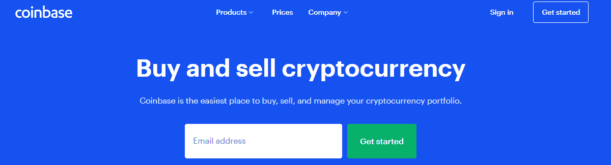
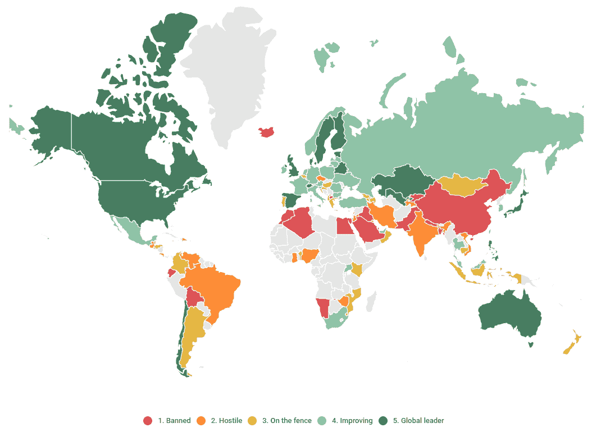

# 第九章：区块链的未来展望

到目前为止，我们已经涵盖了围绕区块链的基本、技术、经济和社会概念，并提供了有关加密货币和代币的定义和法律信息。我们还说明了在商业世界中实施的几种应用。作为决策者，希望您有足够的元素来建立对技术的个人意见，并确定它对您的业务有多相关。

区块链目前正处于成为下一个重要技术的边缘。2009 年至 2014 年之间，生态系统一直在努力实现一定程度的采用，以使比特币成为可靠的去中心化数字货币。爱好者们专注于交易活动，慢慢发现了底层技术及其非中介和透明的特性。以太坊的诞生改变了许多事情，促使开发者和企业家更加坚定地投入其中。出现了新的工具，如智能合约，以及最近的闪电网络。当加密货币在世界范围内得到了媒体的广泛报道时，民主化开始兴起，其中以比特币价格的上涨为首，这在金融领域内得到了模仿。**首次代币发行**（**ICOs**）激增，许多区块链初创企业日益涌现，其中有几个项目成功到足以与全球最有价值的初创企业竞争。

前几章的目的是帮助你理解区块链的机制、政治背景，以及各行各业和各国为解决商业效率低下而制定的不同应用，如互操作性、数据可靠性和安全性。在本章中，我们将讨论关于未来可能发生的变化以及已经发生的变化，以便将区块链定位在通往重新设计和重塑全球经济的技术路线上的关键见解。了解未来几年技术发展的能力对于决策者来说是很重要的，因为他们需要了解区块链在带来显著商业机会以及推动数字时代增长方面的潜力。

本章中，我们将讨论以下主题：

+   增值投资

+   下一个 GAFA

+   政府的可能转变

+   威胁

# 区块链的投资增加

通常，经济学家喜欢引用的一个指标来强调一项创新的扩展是在一定时期内进行的投资总额。截至 2019 年 6 月，所有加密货币的总市值为 3200 亿美元（[`coinmarketcap.com/fr/charts/`](https://coinmarketcap.com/fr/charts/)），2018 年通过 ICO 的项目超过 1200 个，融资总额为 78 亿美元（[`www.icodata.io/stats/2018`](https://www.icodata.io/stats/2018)）。

相比之下，全球风险投资在同一年达到了 2500 亿美元（[`assets.kpmg/content/dam/kpmg/xx/pdf/2019/01/kpmg-venture-pulse-q4-2018.pdf`](https://assets.kpmg/content/dam/kpmg/xx/pdf/2019/01/kpmg-venture-pulse-q4-2018.pdf)），其中有超过 40 亿美元分配给了区块链初创公司。也就是说，总风险投资的 1.6%专门用于区块链初创公司，与 2017 年相比增长了四倍，当时它们共筹集了 10 亿美元。

2017 年实际上是风险投资筹款被 ICO 筹款超越的一年，这意味着项目领导者（和骗子）的人气急剧上升！仅这一年的 ICO 筹款超过了 54 亿美元（[`www.cbinsights.com/research/blockchain-vc-ico-funding/`](https://www.cbinsights.com/research/blockchain-vc-ico-funding/)），考虑到这种方法的新颖性和与之相关的金融风险，这是一个庞大的金额。

这些事实表明，风险投资筹款模式发生了变化，传统的风险投资（VC）基金正在被专门针对区块链企业的投资机构所取代。也就是说，越来越多的风险投资正在专注于建立关于区块链的投资组合和知识。

# 成功的区块链企业

数字货币集团成立于 2015 年，区块链资本成立于 2013 年，是该领域最大的参与者，自创立以来分别已经完成 127 和 57 笔交易。它们促成了 2017 年区块链初创公司融资的增长，并将几个项目转变为了投资人的成功金融投资。Coinbase 可能是这种成就的最具说明性的例子：2012 年创立，他们在 2017 年 8 月筹集了 1.08 亿美元，随后在 2018 年 10 月进行了 3 亿美元的融资，使他们的估值达到了 80 亿美元。这对于一个加密货币存储和交易平台来说是一个巨大的数字，更重要的是，对于一个六年历史的初创公司来说是一个令人印象深刻的估值。截至 2019 年，只有 DoorDash、Stripe、Airbnb、Juul、WeWork 和 Uber 在同一时间段做得更好。下面的屏幕截图显示了 Coinbase 的首页：

Coinbase 于 2012 年由 Brian Armstrong 和 Fred Ehrsam 创立，是一个通过电汇购买比特币的在线平台。到 2014 年，他们已经拥有 100 万用户，并在三年后获得了纽约州金融服务部的许可以扩大他们的业务。截至 2018 年 8 月，Coinbase 声称在全球拥有 2000 万用户。

同样地，币安（Binance）是一家成立两年的初创企业，在 2018 年成为全球最大的交易所之一，以交易量计算（根据[coinmarketcap.com](http://coinmarketcap.com)截至 2019 年 6 月的每日 20 亿美元）。 为了提供加密货币对加密货币的交易平台，他们在 2017 年 7 月通过 ICO 筹集了 1500 万美元，并于两个月后完成了一轮 1 亿美元的风投筹资。

截至 2019 年 6 月，币安（Binance）取得了如此多的成就，以至于其基础代币**币安币**（**BNB**）的市值现在已经达到了 40 亿美元。 尽管这个数字不能被视为公司的价值，但它清楚地突显了对投资者和客户的吸引力，特别是因为这家初创公司成功地创建了一系列附加服务，例如 Binance Launchpad，一个促进 ICO 启动的平台，以及 Binance Labs，既是投资基金又是孵化器。

币安（Binance）创建了 BNB 以激励其用户支付交易费用的手段。 40 亿美元的估值是发行的 BNB 代币的总估值。 这个代币在 2017 年 7 月的 ICO 中从 10 美分飙升到两年后的 32 美元。

在区块链初创企业的 ICO 和风险投资中，资本筹集仍然只是大海中的一滴，但随着越来越多的公司对这项技术产生兴趣，这一趋势正在向上发展。 被认为是当今生态系统中最先进的企业的 IBM 在开发基于区块链的解决方案方面已投资超过 2 亿美元（[`www.mckinsey.com/industries/financial-services/our-insights/blockchains-occam-problem`](https://www.mckinsey.com/industries/financial-services/our-insights/blockchains-occam-problem)）。

谷歌（Google），令人惊讶地对其行动保持了低调，已经投资了六个不同的项目并与区块链平台合作，尽管这家网络巨头从未正式宣布过。 说实话，生态系统中最大的投资者是银行。 中国银行，摩根大通，美国银行和富国银行是前十大公开公司（[`www.forbes.com/sites/michaeldelcastillo/2018/07/03/big-blockchain-the-50-largest-public-companies-exploring-blockchain/#4e02c5482b5b`](https://www.forbes.com/sites/michaeldelcastillo/2018/07/03/big-blockchain-the-50-largest-public-companies-exploring-blockchain/#4e02c5482b5b)）之一，它们通过直接投资初创企业或购买场外产品来尝试区块链。

# 区块链和加密货币投资趋势

仅仅在几个月内，对区块链的投资已飙升到数十亿美元。请注意，我们谈论的是对区块链的投资，而不是对加密货币的投资。2017 年末破灭的加密货币泡沫有时被比作 2000 年的互联网泡沫。实际上，强调加以投机的代币与支持它们的公司的财务状况之间的差异是很重要的。个人和资产管理公司在加密货币上投入的巨额资金与发行这些代币的公司的实际成功（或失败）并没有直接关联。

举个例子，币安的业绩不应该与他们的代币（BNB）的表现有关，因为它们并不是币安资本的实际股份。作为决策者，你应该保持谨慎，准确区分加密货币和区块链项目的投资趋势，尽管这两者在一定程度上很好地代表了市场对这项技术的认知。

# 下一个 GAFA

自从谷歌、苹果、脸书和亚马逊（通常被称为 GAFA）成为世界上最有价值的公司排行榜的一部分以来，已经有几年了。

未来几年，有可能区块链代币的市值将超过 GAFA。我们目睹了比特币于 2017 年 12 月达到 3200 亿美元的市值，想象这种加密货币或其他有前途的加密货币如以太坊能够达到 GAFA 真正艰难达到的 1.5 万亿美元的门槛也并非遥不可及。

# 加密货币的未来

然而，必须采取预防措施，因为这些代币并不代表一种杰出的份额，而是代表个人愿意支付多少来获得产品或服务的数量。也就是说，如果以太坊的市值在未来几年达到 1.5 万亿美元，这意味着以太坊的数量乘以它们的市场价值，返回的是加密货币的总市值，即购买以太坊所支付的总金额。

这个数字不代表以太坊基金会或任何与以太坊相关的实体的价值，不仅因为基金会和协会是非营利组织，而主要是因为没有实体实际支持加密货币以太坊，它是完全独立的，不受任何管理机构约束。然而，有趣的是，世界上最有价值的公司可能会被基于区块链的代币在市值上超越，这意味着持有以太坊或比特币可能比持有谷歌、苹果、脸书或亚马逊的实际股份更有价值。

# 去中心化企业的接管

另一个可能的情景是，最初的互联网原生企业可能会被基于区块链的企业取代。几个项目试图以去中心化的方式转变已被证实的商业模式，以增加可靠性和透明度。例如，Presearch 是一个由社区赋权的搜索引擎，通过为产品的每一次使用提供代币来激励人们。他们的最终目标是根据社区的兴趣和公平透明的排名显示内容和搜索结果。这种商业模式旨在解决谷歌的垄断问题，谷歌已经成为互联网和其塑造观念的根本力量的主要守门人。

OpenBazaar 和 Particl 都是有前途的初创公司，目前正在颠覆亚马逊的商业模式，使个人能够从世界各地交换物品。这些基于区块链的市场依赖于一个担保系统，在这个系统中，每个对等方都有兴趣正确提供服务并支付给其他对等方，所有这些都在一个无需信任中心实体为确保正确货物转移而征收交易费用的生态系统中进行。

自 2016 年以来，Facebook、YouTube 和 Instagram 等社交媒体平台迎来了一个新的竞争者：Steemit，这是一个去中心化和抗审查的社交媒体平台，为发布和策展内容的用户提供代币奖励。随着人们对传统社交媒体平台信息操控的忧虑日益增加，对于一个抗审查网络的需求引起了关注，而 Steemit 似乎通过提供一个有效的基础设施来解决这些严重问题，该基础设施支持个人数据所有权和内容变现。

断言 Presearch、OpenBazaar 和 Steemit 可能分别取代 Google、Amazon 和 Facebook 是仓促的判断。截至 2019 年 6 月，它们在生态系统中的影响甚至无法与 GAFA 对经济和社会行为的影响相比。但是，这些基于区块链的公司提出了完全不同的商业模式，将客户利益置于盈利能力之上，将大规模协作置于单方面决策之上，将透明度置于不透明度之上：这种商业模式符合一个合作经济的特点，有朝一日可能成为传统资本主义运营模式的替代品。

# 政府的一个可能转变

自 2019 年 6 月 Facebook 宣布 Libra 项目以来，发达国家很可能会创建某种形式的数字货币。不要混淆，加密货币是一种数字货币，但数字货币不一定是加密货币。

在一个国家的范围内，选择集中式还是去中心化数字货币将取决于其基础设施和治理。目睹经济不稳定并依赖薄弱机构的国家可能会是第一个尝试和探索去中心化数字货币的国家，这是出于政治而不是技术上的考虑。去中心化数字货币（加密货币）可以成为克服货币挑战的强大工具。

就像 Facebook 一样，各国将通过加密货币的大门进入生态系统，然后探索更多机会。在未来几年，各国将竞相成为数字优先国家，支持最佳创新项目。

*"加密国家可以被定义为鼓励区块链倡议、接受加密货币并努力制定有利的监管框架的国家。"*

成为一个加密国家是一个漫长的过程，一些国家比其他国家更倾向于采取这个过程。例如，澳大利亚、英国和新加坡采取了积极的态度，对加密货币、监管和基础设施采取行动。

另一方面，中国和玻利维亚等国家自 2014 年以来已禁止在其领土内销售和购买加密货币，如下图所示：

上述图表是各国对加密货币的感知的概述。

# 生态系统中的威胁和风险

尽管花费了大量资金来试验区块链，但很少有概念证明被转化为试点项目，甚至更少的是成为产业化解决方案。这些许多失败使一些人对技术持怀疑态度，并假设该技术不适用于广泛的市场应用，因为它只满足特定需求。

大多数批评者谴责仅将区块链用于营销目的，通过向股东和客户展示公司创新能力来增加品牌价值。错误判断的费用、难以估计的盈利能力以及阻碍稳定收入流的阻碍也是批评者指出的论点，以及开发规模化解决方案的复杂性。

随着技术的普及，诸如可扩展性和用户友好性等技术挑战仍然存在，并且随着更大规模的网络的形成，必须克服这些挑战。 由于加密货币泡沫在 2017 年破裂，区块链遭遇了一次陡峭的失望低谷，尤其是由于随后盛行的熊市。好的一面是，开发者社区抓住了媒体报道下降的机会，推动技术的进一步发展。不幸的是，在此期间也出现了新的创新，其中之一被称为量子计算，实际上可能危及区块链的有用性。

作为决策者，您必须意识到这种新兴技术通过指数级别地更快地解决某些问题，威胁着区块链。微软将其定义为以下：

*“在比星系间空间还要冷的温度下使用纳米级组件运行，量子计算有潜力解决世界上一些最棘手的挑战。它只需要几天或几个小时就能解决问题，而使用今天的计算机需要数十亿年。”*

传统计算机将信息存储为保持单个二进制值（1 或 0）的部件，而量子计算机将信息存储为量子比特，它可以同时保持两个值（1 和 0），允许同时进行大量计算。

那么，这怎么可能威胁到区块链呢？

区块链被认为几乎不可能被黑客攻击，这是由于共识机制和算法的结合需要巨大的计算能力来添加和链连接账本中的数据（因为区块链依赖于工作量证明协议）。而且，如果已经被网络验证过的数据需要修改，那么需要更多的计算能力。

以这种方式，量子计算的工业化将使任何数学问题变得毫无意义，无疑会使区块链变得过时。修改一个被确认了 20 次的交易（将 19 个区块倒退，这是被认为是今天的计算机无法实现的）只需要几分之一秒，因为重新计算所有后续哈希对于量子计算机来说将变得轻而易举。

尽管这种新兴技术可能不止十年之遥，但一些知名制造商已经在这条路上迈出了渐进的步伐。2019 年 1 月 16 日，IBM 发布了一个商用版本的量子计算机 Q System One，这是一台九乘九英尺的玻璃保护机器（[`newsroom.ibm.com/2019-01-08-IBM-Unveils-Worlds-First-Integrated-Quantum-Computing-System-for-Commercial-Use#assets_115:1612`](https://newsroom.ibm.com/2019-01-08-IBM-Unveils-Worlds-First-Integrated-Quantum-Computing-System-for-Commercial-Use#assets_115:1612)）。尽管量子计算机的工业化和微型化不会在不久的将来发生，但 IBM 的最新公告至关重要，因为它可能会危及区块链的基本特性。

# 摘要

正如我们在本章中所看到的，未来几年，区块链很可能会得到越来越多的关注，希望从政府和商业领导人那里获得成熟和认可。有前景的应用案例将继续出现，最终演变成越来越工业化和用户友好的解决方案。我们还看到，资金将变得越来越重要，主要是由于新的融资方法，比如**安全代币发行**（**STOs**），将金融证券的代币化推向一个新的水平。相比之下，我们突出了量子计算等新兴技术可能会威胁到基于工作证明机制支持的区块链，以及其他威胁，比如可扩展性和速度，这可能会妨碍技术的正确发展。

在下一章中，我们将解释为什么有时会谈论私有、半私有或公共区块链。我们还将专注于区块链的技术范围内的演变，并发现一些基础设施和基于云的解决方案。
