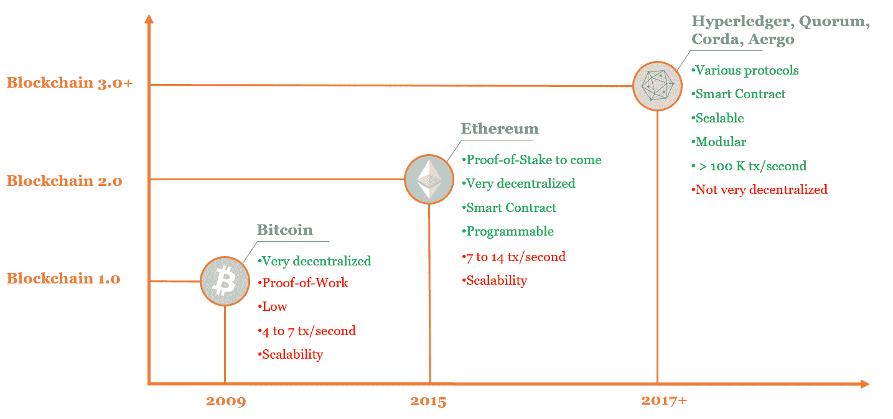
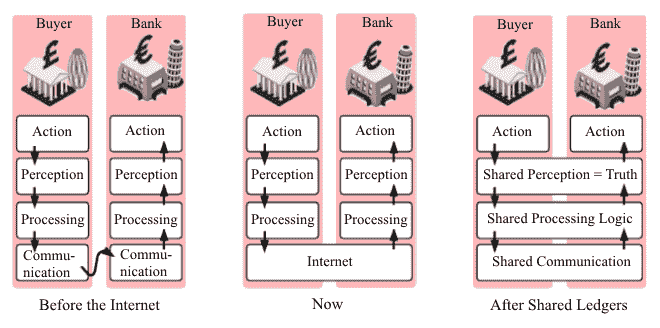

# 基础设施和云解决方案

在本章中，我们将涵盖当今一些最有趣的区块链基础设施，用于开发基于区块链的应用程序或启动基于区块链的项目。比特币和以太坊的区块链并不是唯一的选择。在过去几年中出现了一些基础设施，实现了新的功能，例如设置条件、在网络内定义一定程度的隐私或认证节点。在本章中，我们将探讨一些企业级解决方案，如 Quorum、Hyperledger、Aergo 和 Corda，并探索云解决方案，如 IBM 区块链平台和 Oracle 区块链平台，这些我们在之前的章节中已经提到过。在这里，我们还将探索其他**区块链即服务**（**BaaS**）提供商，如**亚马逊网络服务**（**AWS**）和微软 Azure，并稍微深入探讨它们提供的服务以及它们的效果如何。

在本章中，我们将涵盖以下主题：

+   区块链的演变

+   私有、半私有和公有区块链

+   摩根大通的 Quorum

+   Hyperledger

+   Aergo

+   Corda

+   微软 Azure

+   AWS

+   IBM

+   Oracle

+   关键要点

# 区块链的演变

首先，重要的是要强调市场上有几代区块链。比特币区块链被认为是第一代，它是一个非常安全和去中心化的基础设施，这就是为什么越来越多的矿工加入网络，但在处理交易方面性能较低，可升级性较弱；换句话说，用户在比特币的区块链上除了发送比特币之外，不能做更多的事情。以太坊被认为是第二代区块链，因为它实施了对初始协议的重大改进，例如智能合约。第三和第四代区块链主要集中在提高每秒交易数量，以及为企业提供灵活且适用于其需求的基础设施。Aergo、Quorum 和 Hyperledger 可以被引用为这些新区块链的例子；它们旨在通过增强可靠性、克服技术困难以及提高可伸缩性来大幅促进技术的发展。以下图表展示了各个区块链的不同代：

# 私有、半私有和公有区块链

其次，你必须知道，区块链可以有三种不同形式：公共、私有或半公开。比特币和以太坊都是公共区块链（也称为无权限区块链），这意味着任何人都可以成为节点、使用服务和验证交易而无需限制。它们都受益于高度的去中心化，并且不需要监管机构作为基础设施，它们的治理是自组织的。另一方面，私有和半私有区块链（也称为有权限区块链）由于只有经过身份验证的利益相关者可以加入基础设施，因此去中心化程度较小。因此，它们节点和矿工的数量比公共区块链要少。它们的治理可以部分去中心化（我们称这样的组织为联盟），或者完全集中化。在这种情况下，角色对每个成员是预先定义的，交易是在只有确定方可以阅读的私有注册表上验证和记录的。在某种程度上，私有区块链（或有权限区块链）这个词是指代分布式分类技术的一个错误用法。

作为决策者，你必须谨慎使用私有区块链的术语以及它们的实施方式。再次提醒，区块链是一种允许数字价值在去中心化生态系统中安全透明地流动的 IT 基础设施，而无需信任第三方。一旦生态系统中存在信任，你就可以假设区块链不再相关。一些所谓的私有区块链只是将已经互相信任的参与者聚集在一起：当你知道没有利益扭曲数据时，在共识方式记录交易的协议有何意义呢？分布式分类帐就足够了。

那么，为什么要费心实施私有区块链？嗯，与无条件、透明和匿名的公共区块链相比，它们似乎为企业级问题提供了更好的答案。实际上，一些项目已经显示了真正的应用。事实上，有权限区块链可以非常有用，用于一组利益相关者共同处理业务流程。他们彼此认识，但彼此不信任。

要在私有或半私有网络中实现高性能、可扩展性和安全性，必须在基础设施中进行一些调整。 在封闭组织中使用的共识协议与比特币或以太坊（工作证明）中使用的协议不同，因为验证交易的节点不需要基于计算能力进行竞争。 相反，它们根据在网络中的声誉（权威证明）或基于投票系统（委托权益证明）进行竞争。 无论选择的是哪种区块链共识协议，它都应该是拜占庭容错的，这意味着它应该使得分布式系统能够在一些网络节点出现故障时达成共识（即对相同的值达成一致意见）。 换句话说，它应该能够克服拜占庭将军问题所示的问题（见第二章，*区块链技术深度剖析*）。 工作证明、权益证明、权威证明和委托权益证明都是拜占庭容错的协议，根据所需的去中心化程度、需要授予一些节点在网络上执行操作的权限、数据速度和可扩展性来使用。 大多数权限区块链依赖于基于投票和抽签的共识，如权益证明和委托权益证明。

后者是权益证明协议的一种替代版本，提醒一下，权益证明根据矿工拥有的代币数量（或权益）选举矿工。 委托权益证明常常被比作技术民主，因为它结合了实时投票和声誉来达成共识。 每个代币持有者都可以投票选举一个验证器，最终获得足够的选票成为代表。 成为代表后，节点可以验证交易并收取相应的奖励。 如果他们行为不端，选民可以撤回他们的选票，*解雇*坏行为者，使其无法继续验证和保护网络。 此外，代币持有者的投票权（称为投票权重）取决于账户持有的代币数量。 这个协议从高度去中心化中获益，并且使得交易验证过程变得更快。 另一方面，网络越大，随着投票过程的增加，它变得越慢，增加了延迟。 因此，委托权益证明包含了去中心化和可扩展性之间的折衷。

关于可扩展性，权威证明是一个更好的选择。它是一个高效的权限区块链协议，由以太坊的联合创始人加文·伍德于 2017 年提出。该协议任意地确定将验证交易的节点。这些节点是基于其声誉被选择为值得信赖的实体，他们将有责任验证和保护交易。要成为依赖权威证明的区块链中的一个节点，用户必须经历一个严格的身份验证过程，将他们的数字身份链接到他们的实际身份，并披露防止不良行为的个人信息。权威证明仅包含少数节点使得基础设施能够验证更多的交易（即增加区块大小）并将交易费用降至零。因为节点被识别，他们受到声誉的激励，而不是基于底层代币，这解释了为什么大多数基于权威证明的区块链没有加密货币。这种共识在私有区块链中得到了广泛支持，比如由 J.P.摩根开发的 Quorum，该区块链为其共识算法借鉴了权威证明。

现在我们已经看到了不同类型的区块链以及它们的特点根据需求而变化，我们将探索一些为应对企业级挑战而构建的著名基础设施。

# J.P.摩根的 Quorum

Quorum 是由世界市值最大的银行 J.P.摩根构思的，基本上是以太坊的私有版本，由以太坊社区开源支持。Quorum 使用了以太坊不提供的保密管理，使参与者能够决定他们的交易是应该保持私密还是公开显示。Quorum 还整合了增强的交易和合约隐私，以及更好的总体性能。Quorum 有巨大的潜力被银行行业和金融机构广泛采用，以至于 J.P.摩根愿意将这项活动与其银行业务分开管理。J.P.摩根还是第一家部署自己的加密货币的银行，JPMCoin，一种以美元为基准的基于 Quorum 的数字货币，用于机构参与者、投资者和银行之间的资金转移。

Quorum 制作的另一个应用是 Vakt（参见第七章，*面向商业世界和成就的区块链*）。这个能源商品交易平台旨在建立一个数字生态系统，以促进和增强全球石油业务。Vakt 采用了一个联盟的形式，创建了一个交易平台作为交易生命周期的真实单一来源。基于 Quorum，BP、Shell 和 Total 现在受益于对等协作，结合市场专业知识，增强了问题解决方式，以及行业交易的速度和安全性。

Quorum 主要是为了解决金融行业的特定需求而构建的，但实际上它可以移植到面临类似问题的其他行业，比如避免暴露金融交易（也就是说，它可以消除大多数公共区块链的匿名性），增加金融结算的速度，并保留参与者的身份控制（也就是说，防止恶意方加入网络）。Quorum 的目的非常具体，但并不是唯一一个试图改进某些行业运作方式的许可区块链。

# Hyperledger

Hyperledger 是生态系统中受到最多关注的项目，作为决策者，你了解它是很重要的。由于许多区块链是为世界各地的许多不同需求从头开始构建的，由 Linux 基金会发起的 Hyperledger 项目试图在商业世界内标准化和民主化区块链。与其让公司自行解决问题，Hyperledger 结合跨行业知识和模块化方法，允许企业构建定制的区块链。

在 2015 年，致力于通过开源实现大规模创新的非营利组织 Linux 基金会宣布与行业领导者合作，推进企业级区块链技术。最初的目标是——*开发一个开源分布式账本框架，用于构建强大的、面向行业的应用程序、平台和硬件系统，支持业务交易*。这就是 Hyperledger 项目诞生的方式。

最早加入该运动的成员主要是银行、金融服务公司或 IT 公司。但随着时间的推移，越来越多的公司加入了该项目，截至 2018 年 9 月 26 日，成员名单达到了 270 家来自不同行业和领域的贡献组织。在那个名单中，我们可以找到领先行业的大公司以及初创公司，从物流到医疗保健，从金融到政府，它们都通过财政支持或提供代码和开发进展来做出贡献。截至 2019 年 6 月，Hyperledger 托管了 13 个项目，拥有超过 1100 万行代码和近 28,000 名参与者，他们已经参加了世界各地 110 多个见面会。

*"分布式分类帐有望改变广泛的行业。"**- Linux Foundation 执行董事 Jim Zemlin，

在 2015 年启动 Hyperledger 项目后*

由于区块链是一项最近的创新，对于非技术人员来说，这是一个难以理解的概念，跨行业合作的需求日益扩大，Hyperledger 成为了一个补救措施。

你必须明白 Hyperledger 不是一家公司，不是加密货币，也不是区块链。这是一个全球合作的努力，旨在开放地和透明地启发他人，让他们了解区块链解决业务问题的潜力。

Hyperledger 在 2016 年初撰写了一份宪章，一种白皮书，说明了其指导方针和其所试图实现的目标。在宣布的四项任务中，我们可以读到以下内容：

+   创建企业级、开源、分布式账本框架和代码库

+   促进生态系统领先成员的参与

你必须记住的是，Linux Foundation 通过其 Hyperledger 项目正在创建一个环境，在这个环境中，软件开发人员和公司社区会见面，协调建立区块链框架。因此，它是一个开源组织，在那里你可以找到正在进行的与区块链相关的项目。所有这些项目都不是货币项目和工业应用。这是一个重要的观点。你不会有任何 Hyperledger 硬币发行，因为该项目不打算像以太坊那样托管自己的加密货币。

*"通过不推动一种货币，我们避免了许多维护全球一致货币的政治挑战。"** - Hyperledger 执行董事 Brian Behlendorf*

总之，Hyperledger 是一个全球运动，由 Linux Foundation 发起，由技术、开源和数据领域的知名人士领导，拥有多年的经验，并得到 270 家贡献性公司和组织的支持，旨在为商业界开发非货币区块链项目。让我们探讨提供了哪些服务。

# Hyperledger Sawtooth

Hyperledger Sawtooth 是目前两个可用且已准备就绪的项目之一。

Hyperledger Sawtooth 是由英特尔主要开发的区块链，旨在测试名为**Proof of Elapsed Time**（**PoeT**）的新共识机制的功能，并允许企业在没有中央管理机构的情况下运行维护的分布式账本。

PoeT 是一种试图通过公平随机系统分配网络挖掘权利的算法。它旨在消除比特币和其他加密货币所使用的工作量证明共识算法背后的环境和能源消耗问题。该过程遵循一个公平的抽奖系统，而不是奖励最强大的节点。简而言之，网络中的每个参与节点都需要等待随机选择的一段时间，而第一个完成指定等待时间的节点将被指定为验证交易的节点。

在他们的演示视频中，Hyperledger 通过海产品供应链展示了 Sawtooth 的潜力，其中 Sawtooth 提供了鱼等各种货物的来源和血统的不可变记录。借助物联网（物理连接设备）和与 Sawtooth 结合使用的传感器，可以追踪任何鱼从海洋到餐桌的旅程。Sawtooth 是用 Python 编写的，其目标是提供最终可应用于物联网和各种金融系统的区块链。

# Hyperledger Fabric

Hyperledger Fabric 是目前第二个可用且已投入生产的项目，由 IBM 的指导下推动发展。截至 2019 年 6 月，Fabric 是最被大型企业广泛采用的区块链，为特定行业构建特定区块链并运行与特定需求相关的应用程序提供了基础。

它绝不友好于初学者，但值得称赞的是，它提供了设计和定制以满足精确需求。Fabric 被构建为一个模块化框架，应用程序可以轻松扩展到任何级别，其目的是提供基本的区块链功能，如透明度、去中心化和安全性。

# Hyperledger Burrow、Indy 和 Besu

除了 Sawtooth 和 Fabric 之外，还有其他值得一提的项目：

+   Hyperledger Burrow 是一个根据**以太坊虚拟机**（**EVM**）规范开发的可许可智能合约机器。

+   Hyperledger Indy 是为分散式身份构建的分布式分类帐。它提供了用于创建和使用独立数字身份的工具、库和可重用组件。它不使用工作量证明，并使用基于区块链的身份解决方案。

+   Hyperledger Iroha 是一个设计简单且易于整合到需要分布式分类帐技术的基础设施项目中的区块链框架。

让我们通过《Hyperledger 白皮书》中提出的一个用例来看看 Burrow 和 Indy 的情况。

通常，银行会收集每个客户和潜在客户的**个人可识别信息**（**PII**），以评估贷款申请的风险。这些信息是敏感的，是黑客们的肥料。此外，贷款申请人通常需要将这些信息与多家银行分享，以增加获得贷款的机会，同时也增加了这些信息被滥用的可能性。有了 Hyperledger Indy，申请人可以仅分享银行需要做出决定的信息，而不会将任何个人数据纳入考虑范围。由于有了安全的区块链，申请人可以自信地披露评估信息，银行可以遵守法规，并依赖这个作为真相来源的分布式账本。此外，Hyperledger Burrow 系统将贷款申请转化为智能合约，将身份与贷款绑定在一起。

Hyperledger Besu 是加入 Hyperledger 的最新项目，也是社区中第一个可在公共区块链以太坊上运行的软件。作为与 ConsenSys 联合开发的解决方案，Besu 提供了大量的模块化内容，可在公共或私人网络上构建业务应用程序。这个项目于 2019 年 8 月发布，这并不令人意外，因为不到一年前，Hyperledger 宣布与以太坊企业联盟（一个拥有 500 多个成员的组织，致力于开发解决企业级问题的开放区块链基础设施）达成战略合作伙伴关系。

# Hyperledger 的前景

尽管大多数 Hyperledger 项目仍处于开发阶段，一些公司已经开始使用 Sawtooth 或 Fabric 来增强其产品或服务。例如，我们在第七章中介绍过的 Everledger，是通过 Hyperledger Fabric 设计的，允许客户、权威机构、律师、会计和供应链中的所有中间人透明地跟踪钻石的记录过程。这种方法通过用数字化方法替代纸质追踪方法，降低了珠宝欺诈（估计数百万美元）。而 Everledger 并不是唯一一个看到 Hyperledger 项目潜力的参与者。在 Intel 和 IBM 的带头下，他们庞大的客户组合开始注意到私人区块链所提供的机会。Hyperledger 的项目即将应对一个庞大的市场，在这个市场中，合作的需求前所未有地迫切。

总之，Hyperledger 将有助于确保和定制供应验证、物流、分销和实体间的付款验证。除了 Sawtooth 和 Fabric 这两个最先进和知名的项目之外，Hyperledger 还承担了其他八个举措，范围从以太坊智能合约引擎的实现（Burrow）到分布式数字身份系统（Indy）再到跨区块链运行交易的互操作平台（Quilt）。

# Aergo

一个值得一提的新兴项目是 Blocko 的 Aergo。 Blocko 成立于 2014 年，是一家韩国区块链公司，于 2019 年 5 月推出了名为 Aergo 的产品，为组织提供了构建和部署自己的区块链的网络基础设施。Aergo 的目标是成为企业应用开发人员最广泛使用的架构，并通过用户友好的界面、简化的管理和预构建的应用程序将其用途推广至大众市场。该解决方案基于云，提供了创建公共、私有或半私有区块链的可能性。Blocko 在英国、韩国和香港运营，并已发布了 20 个系统，全球使用者达 900 万人次（[`coinjournal.net/samsung-backed-startup-blocko-launches-hybrid-blockchain-aergo-enterprise/`](https://coinjournal.net/samsung-backed-startup-blocko-launches-hybrid-blockchain-aergo-enterprise/)）。Aergo 是一个雄心勃勃的产品，设计有三个不同的模块。第一个是 Aergo Chain，一个公共区块链基础设施，基本上旨在超越以太坊。Aergo Chain 结合了创建智能合约的简便方式、委托权益证明协议以及使用侧链，大大提高了每秒约一百万次交易的可伸缩性。

第二个模块是 Aergo Hub，一个基于网络的区块链托管服务，用于管理基于 Aergo Chain 的独立私有区块链。它可以与当前基于云的服务相比，提供用户友好的界面用于创建、测试、实施和维护。Aergo Hub 还包括 Aergo Horde，一个编排平台，允许安装多个区块链。

最后一个模块是 Aergo Marketplace，一个点对点交易平台，用户可以在其中购买应用程序、计算资源或数据存储。

2019 年 5 月，Blocko 与现代汽车达成一项融合协议，建立一个应用程序，用于跟踪可购买的二手车历史，包括上一个车主的数据，以及汽车的年龄和里程。这个项目与雷诺在 MOBI 联盟中正在实现的项目有些相似（见第七章，*面向区块链世界的商业和成就*），该汽车护照依赖于一个易于使用的平台为客户提供便利。为了满足他们的期望，Blocko 在 2018 年 6 月的最新融资轮中筹集了 890 万美元，并通过在 2018 年 10 月达到 3000 万美元上限来成功结束了 Aergo 的**首次代币发售**（**ICO**）。Aergo 尚未成功实现区块链的大规模应用，但到目前为止，通过努力构建一个实用用户友好的区块链平台，已经使大部分区块链生态系统满意并信服。

# Corda

Corda 是一个专为商业设计的开源区块链项目。Corda 试图解决的主要问题是使金融机构、医疗机构和保险公司能够同时就账簿的状态达成一致，并在参与者之间的交易中带来隐私性。金融领域的一般障碍影响了交易同步和账户余额不断的真实评估，需要进行各种验证，这增加了每个利益相关者在这一过程中的延迟和成本。Corda 通过使用分布式账本技术来克服这一问题。Corda 是由 2014 年成立的 R3 开发的，该公司形成了一个庞大的生态系统，包括共同开发称为 CorDapps 的应用程序的金融公司。

*"Corda 是一个独特的开源平台，部分设计目的是帮助小型企业家成功构建适合其客户群的解决方案。每周我们看到不同行业发布新的创新性 CorDapps。"**– R3 的首席执行官 David Rutter*

联盟于 2015 年 9 月开始，由九家金融公司发起，截至 2019 年 1 月，成员已达到 300 多家，来自私营和公共部门，受到重要的网络效应的推动。与约同规模的超级账本社区不同，Corda 的成员大多通过开发应用程序并测试基础设施来做出贡献。在 Corda 上开发的第一个应用程序是 Fusion Lendercomm，一个旨在简化和数字化市场上信息交换的贷款合作平台。通过该服务，代理银行可以轻松发布详细的贷款信息，包括信用协议、应计余额、头寸信息和其他交易数据，并向贷款人提供自助服务能力。这一解决方案由 R3 自己和 Finastra 共同开发，并在法国巴黎银行、汇丰银行或南欧银行等七家国际银行上部署。

一般来说，Corda 为其客户提供了公共区块链的好处，同时避免了可扩展性、隐私和治理方面的问题，使其更适合企业，尤其是那些在高度监管的全球市场中发展的企业。在公共区块链中很难实现性能和可扩展性，因为加入网络的节点越多，吞吐率就越低。随之而来，用户体验会下降，因为节点需要更长时间来验证和存储交易。 Corda 选择通过强制的 KYC 准确识别节点来重点关注隐私和安全，以防止不端行为并建立网络信任的开始。这解释了为什么 Corda 通常被认为更像是分布式分类帐而不是区块链本身。尽管区块链是一种分布式分类帐技术，但它们倾向于指代无需信任、高度分散、透明和无障碍的基础设施。这些并不是 Corda 的内在特征，但它使对等方能够无缝、私密地转移价值而无需监管机构，并成功地为银行和金融行业提供了一种工具，可以确保参与者之间的真相和状态同步。

# 微软 Azure

除了这些区块链基础设施（Quorum、Hyperledger、Aergo 和 Corda），一些 IT 公司开始开发基于云的解决方案，以增强用户友好性，并促进区块链的设置。决策者可以选择使用名为 BaaS 的全面集成服务，而不是在自己的特定基础设施上配置服务器和进行维护。Investopedia 对 BaaS 的定义如下：

*“区块链即服务（BaaS）是一种服务，允许客户利用基于云的解决方案来构建、托管和使用他们自己的区块链应用程序、智能合约和功能，而云服务提供商则管理所有必要的任务和活动，以保持基础架构的灵活和运行。”*

随着 BaaS 在 2019 年获得了动力，让我们来审视一下目前市场上可用的一些解决方案。

在大型 IT 公司中，微软是一个先驱。2014 年，他们开始接受比特币作为购买数字内容（如来自他们的 Windows Phone 和 Xbox 的应用程序或游戏）的支付选项。实际上，他们在 2012 年发表了关于比特币协议弱点的研究论文，并在与 Ethereum 的主要支持者 Joseph Lubin 创立的初创公司 ConsenSys 合作后，于 2016 年提供了 BaaS 解决方案。最近，在 2019 年 5 月，微软宣布商业化 Azure Blockchain Service，这是一款允许创建、管理和治理联盟区块链网络的产品。Azure Blockchain Service 是一种为希望建立和维护自己的分布式分类账并在其上构建应用程序的公司提供的完全托管的服务，使其能够定义权限、监视活动并控制参与者。这项服务的推出同时宣布与 J.P. Morgan 合作，将其区块链 Quorum 提供给微软平台，因此将其作为 Azure Blockchain Service 中第一个可用的分类账。

# AWS

在 Azure Blockchain Service 推出几天前，亚马逊宣布 Amazon Managed Blockchain 已经正式推出，这是一项与微软类似的服务，能够基于开源框架（如 Hyperledger 或未来的以太坊）创建和管理可扩展的区块链。AWS 是最新推出与区块链相关服务的云服务提供商之一，这是一个令人震惊的事实，显示出亚马逊在开拓竞争对手市场方面的能力，以及在物联网或机器学习等新兴技术上享有的先发优势。这一延迟被 AWS CEO 安迪·贾西解释为 2017 年底缺乏生产区块链用例，但在几个月后的 2018 年 4 月推出了 AWS Blockchain Templates 后，情况就改变了，这是他们的第一个区块链产品，能够快速搭建私有或公共网络。无论如何，AWS 已经赶上微软，在提供有效解决方案方面占据了一个体面的市场地位，主要是因为他们能够从他们庞大的用户群中获益。

具体而言，通过托管区块链，用户能够从头开始创建一个网络，邀请成员成为节点并在平台上运行部署的应用程序。AWS 促进了企业之间建立联盟，在无信任环境中交易，并负责整个网络的维护。作为首个成功案例，AWS 在 2018 年 5 月与 Kaleido 签署了合作协议，后者是 ConsenSys 开发的一个平台，旨在简化区块链的搭建，以快速测试不同的用例场景。

诸如 Amazon 的 BaaS 解决方案为在给定基础设施上设置和运行区块链提供了极大的灵活性，因为它们负责整合不断的演进和升级。换句话说，升级和维护都由云服务提供商监督，让您有更多的时间专注于市场推广策略。

# IBM

当 IBM 在 2016 年作为 Hyperledger 运动的创始企业成员加入时，它已经在开发一个区块链框架，该框架集成到了 Hyperledger 项目中，并成为了 Fabric 模块。该倡议的最初动机来自 IBM 团队所做的两项观察：

+   由于几个缺点（消耗能源的共识协议、不断增长的无许可网络和不断增长的数据库大小），比特币和以太坊几乎不可扩展。

+   比特币和以太坊在其核心模型中不支持私人交易。

由于 IBM 在 Hyperledger Fabric 的大部分开发中处于领导地位，他们为该代码贡献了大量贡献，因此人们预计他们在 2017 年 3 月发布的 IBM Blockchain 解决方案将利用这个特定的模块。这个基于云的解决方案使开发人员能够构建具有改进的安全功能的强大而有效的网络，包括防止内部人员攻击以及将注册表隔离在云端之外的额外层。其他组件，如数字身份管理工具、治理工具以及在发现盗版攻击时的关闭选项，都提供了完全集成的服务。IBM 的长期 IT 专业知识被利用来提供一个由大量开发人员支持的强大且抵抗黑客攻击的基于云的替代方案，旨在为他们的客户提供一个易于部署的解决方案，可以支持任何类型的应用程序。自 2017 年早期以来，Maersk、Everledger 和沃尔玛使用 IBM Blockchain 进行了讨论的区块链用例，都是一些领先的组织。由于区块链是 IBM 首席执行官金尼·罗梅蒂的战略必要条件，IBM 在 2019 年 6 月跨入了一个新的领域，通过升级其区块链平台，实现了跨混合云的多云部署，如 AWS 和 Azure，以带来下一级别的互操作性和自然分权化。

*"互联网对信息的意义，区块链对交易的意义在于使其记录成本低廉且易于验证。"*

*- 金尼·罗梅蒂，IBM 首席执行官*

# Oracle

2017 年，Oracle CEO 马克·赫德（Mark Hurd）在 OpenWorld 大会上宣布，区块链是*下一个大事件*，它可以让公司实现主要优先事项：增加收入、提高现金流、降低支出和管理风险。赫德在同一活动中于次年确认了这些想法，他表示，在供应链中，有 65%的经理手动跟踪货物的发运情况，而区块链可以提供应用程序以提供自动化，并增加安全性并促进信息交换。在这些情况下，Oracle 在 2018 年 7 月宣布推出了自己的区块链平台，以赶上 IBM 的进展。这个基于 Oracle 云的平台被称为 Oracle **区块链云服务**（**BCS**），与 IBM 一样，它是构建在 Hyperledger Fabric 框架上的。它被一些公司采用，如 CargoSmart（见第七章，*区块链用于商业世界和成就*）和阿拉伯约旦投资银行，以帮助它们从原型快速转变为运营产品，这得益于大量的服务和支持。

*"我们正在利用区块链简化复杂的船务文件处理流程，并通过构建协作网络提高客户的运营效率。Oracle 区块链云服务使应用交付的时间缩短了，生产效率比其他解决方案提高了 30%。"*

*– 史蒂夫·萧，CargoSmart CEO*

Oracle 还为其客户提供集成开发、管理以及核心组件，如智能合约开发、节点管理和存储空间。Oracle 的 BaaS（区块链即服务）方案允许成员通过创建、运行和维护特定应用程序来自动化日常运营。

# 关键点

作为决策者，如果你愿意启动一个区块链项目，基础设施的选择必须仔细考虑。当然，你可以从零开始开发自己的区块链，但这将比使用已经存在的基础设施需要更多的时间和更多的资源。以太坊、比特币和其他公共区块链有时根据你的需求而成功。但为了解决商业世界中遇到的某些工业问题，你可能需要考虑使用另一种解决方案。

Corda、Quorum、超级账本和 Aergo 之间的选择相当困难。它们都是企业级准备就绪且开源的，得到了不断增长的开发者和组织社区的支持。每个解决方案都是为了构建定制的权限区块链，作为缓慢且难以扩展的公共基础设施的替代方案。我们能够确定它们之间的一些差异主要围绕着它们的主要目标和愿景。虽然超级账本集成了模块化框架，如 Fabric 或 Sawtooth，以满足从医疗保健到能源等多个行业的需求，但 Quorum 和 Corda 主要面向金融领域。超级账本提供的大量模块对于新手来说可能会非常令人困惑，但它们的好处是能够满足任何行业的任何需求。另一方面，Quorum 和 Corda 主要关注隐私和安全问题，以及可扩展性和整体性能，以实现大量交易和准即时的区块创建。用户友好性成为商业界大规模采用的重要标准：Aergo、Corda 和 Quorum 比超级账本更易于访问，后者的大量资源、活动、培训课程、活动和项目可能会让决策者感到非常压力，他们希望启动一个区块链项目。以下是本章介绍的基础设施的简要摘要和比较：

|  | **Quorum** | **超级账本** | **Aergo** | **Corda** |
| --- | --- | --- | --- | --- |
| **开发者** | 摩根大通（基于以太坊） | Linux 基金会及其他成员 | Blocko | R3 |
| **速度** | 100+ tx/second | 3 K+ tx/second | 20 K + tx/second | 150 tx/second |
| **私有区块链** | 是 | 是 | 是 | 是 |
| **开源** | 是 | 是 | 是 | 是 |
| **编程语言** | Solidity | Java, Golang, NodeJS | SQL, Lua | Java, Kotlin |
| **代币** | 以太币 | 无 | Aergo | 无 |

云解决方案提供了轻松安装节点或服务器并设置网络配置的能力。即使您的公司拥有大量熟练的开发人员团队，他们可能也不太自信能够拥有和维护区块链基础设施。此外，由于许多公司已经为其他需求使用基于云的服务，因此扩展协议到 BaaS 并从外包维护和后端开发中受益可能更合适。使用 BaaS 解决方案的另一个优点是技术发展非常迅速，处理升级和补丁的集成，以及解决可能由服务提供商托管的扩展性问题可能变得繁琐。由于这些解决方案是 *作为服务* 的，提供商接管了服务器的维护以及监视和管理网络。但是，作为决策者，您必须质疑您选择的每个解决方案，并专注于它实际上有多分散。事实上，如果您确定区块链是回答您需求的最合适工具，这意味着数字价值的状态必须以分散的方式，在没有中央实体的情况下确定。选择 BaaS 有时可能违背区块链的内在目的，即实现分散化，因为节点通常托管在同一提供商的服务器上：

| **编辑** | **发布日期** | **技术方面** | **参考** |
| --- | --- | --- | --- |
| **微软**的 Azure 区块链服务 | 2016 年 1 月 | 支持 Quorum 和 Corda | J.P. 摩根，纳斯达克，3M |
| **AWS** 管理的区块链 | 2018 年 4 月 | 支持 Hyperledger 和以太坊 | 雀巢，新加坡交易所 |
| **IBM** 区块链平台 | 2017 年 3 月 | 支持 Hyperledger | Everledger，三菱 |
| **甲骨文** 区块链云服务 | 2018 年 7 月 | 支持 Hyperledger | CargoSmart |

无论如何，与其从头开始设置和运行区块链，公司现在可以外包技术工作，专注于开发应用程序和智能合约，这是了解技术运作方式并快速尝试概念验证的更好选择。尽管市场仍在发展，但在过去几年中出现了许多基础设施和基于云的产品，为您提供了足够的选择，以解决您行业或组织中发现的任何业务问题。

# 摘要

本章首先阐述了区块链的演变，并探讨了其不同的设计：公共、私人和半私密。然后我们涵盖了市场上一些最成熟的解决方案，如 Hyperledger 或 Corda，还有一些最有前途的解决方案，比如 Quorum 和 Aergo。我们还审查了提供企业级平台以扩展业务流程和应用程序的基于云的解决方案，并最终理解了为什么必须谨慎处理这些解决方案，以保持与区块链原则一致。

在下一章中，我们将利用不同的战略方法来实施区块链，并探讨在启动区块链项目时必须考虑的各种要点。作为决策者，我们将介绍必须正确掌握的重要特性，以便在构建*数字化就绪*企业的全球道路上取得成功。
