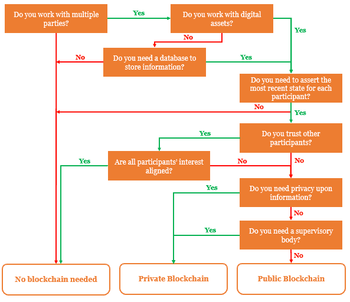
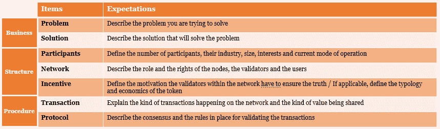
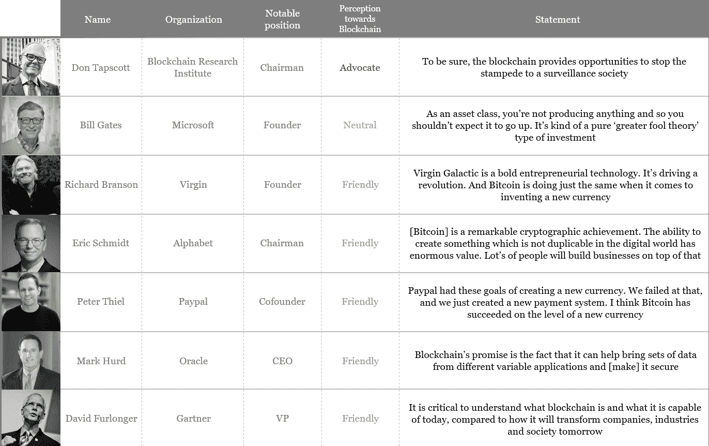
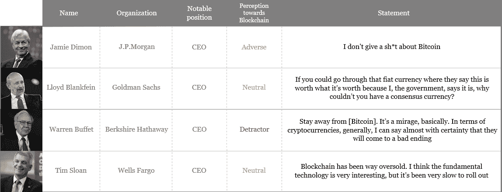
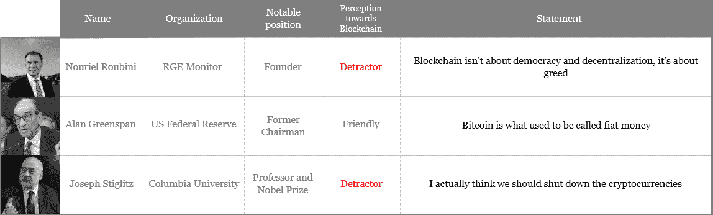
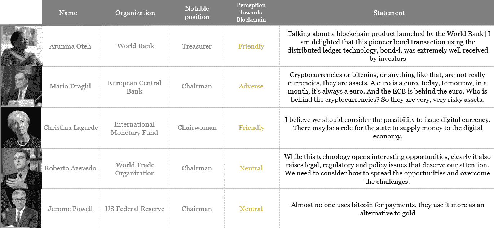

# 确定您的需求

根据 IBM 的说法，高管们往往对颠覆性的商业技术非常谨慎，主要是因为这些技术会为新公司带来更便宜和更快速的市场进入，从而加强了竞争。 另一方面，许多企业由于无法适应不断变化的需求而倒闭，尤其是在数字化时代。 在最新的普华永道首席执行官调查中（[`www.pwc.com/gx/en/ceo-survey/2019/report/pwc-22nd-annual-global-ceo-survey.pdf`](https://www.pwc.com/gx/en/ceo-survey/2019/report/pwc-22nd-annual-global-ceo-survey.pdf)），28% 的企业将技术变革的速度评为极其令人担忧的威胁。 通常，这些传统企业忽视了数字化迅速改变产品和服务消费方式的事实，并且难以利用新技术来满足客户和潜在客户的新消费行为。 区块链不会让那些在数字化道路上表现惰性的公司变得更轻松。 区块链不仅将有助于改变消费习惯，而且还将改变数据流动方式以及经济参与者之间价值的转移方式，从而将资本主义经济重塑为更具协作性和透明性的系统，其中价值以更水平的方式共享。 在这种情况下，公司在未来几年中将面临着一项巨大的挑战，即发展一定程度的区块链知识，以避免被边缘化。 但是我们应该从哪里开始？ 在本章中，我们将探讨开始区块链项目的方法，解决必须考虑的风险和机遇，以及不可避免的成本，最后，必须避免的陷阱。

在本章中，我们将涵盖以下主题：

+   实际情况推理

+   区块链成本是多少？

+   挑战和问题

+   商业领袖对区块链的看法

# 决定实施区块链

任何组织都应该从问题陈述开始。 从技术上开始是毫无意义的，因为它不能满足最终用户的需求。 我经常将这种典型行为比作拿起螺丝刀并查看它可以修复什么。 当然，一路上可能会修复一些东西，但主要问题并没有得到解决。 因此，首先要确定问题，然后考虑解决方法非常重要。

一旦问题被确定，您应该专注于最简单的可用解决方案，并回答以下问题：*我是否真的需要区块链*？

对这个问题的最终回答很可能会由以下问题决定：

+   您是否需要确保信息的状态或允许数字价值在利益相关者之间传输？

+   所有利益相关者是否独立？

+   是否存在将利益相关者联系在一起的信任？

+   是否存在合作和共享信息的共同利益？

这些可能是需要提出的最重要问题，尽管决策树可能更有帮助：

如果区块链是相关的，那么您应该通过商业案例评估项目的潜在影响，这是任何 IT 项目的第一个要求。商业案例应包括各种问题，例如如何解决监管限制，需要多少资源，应使用和实施哪些标准，当然还有最终产品或服务需要满足什么需求。推动评估的方法之一是分析公司对变革的接受程度和风险容忍水平。根据这些结果，将更容易确定一个基于风险回报前提的理性**投资回报率**（**ROI**），以决定是否投资。通过根据风险回报前提确定潜在收益，您将能够为项目以及更广泛地为公司彻底建立战略方法。

在启动区块链项目之前，您还应确保所有利益相关者意见一致，并确保建立了强有力的治理机制，即确定网络中每个人的角色和责任，以便您可以正确设计基础设施。区块链的成功主要在于节点的独立性。一个节点应独立决定验证交易和信息存储；这就是为什么在涉及区块链时治理是一个真正的问题。不要忘记，这是赋予区块链力量的网络；因此，这可能是处理的最重要的组件。

然后才应该把重点放在解决方案的设计和基础设施的选择上。概念验证阶段非常重要，因为技术正在以快速的速度发展，具体的演示对于构想产品和量化收益非常有用。成为一个具有持续改进和增量发布的敏捷企业，关键在于适应客户的需求。同时，企业应该建立必要的组织框架，包括工作组和通信流程，以便开发、集成、生产和采用得到足够支持。最终，如果我们想要能够交付项目并确保提供足够的经济和技术支持，那么财务、营销和商务也将变得必不可少。

要帮助您制定路线图和商业案例，以下是一份可以用来保持您的区块链项目在正轨上的项目清单：

现在您已经了解了是否在您的组织中实施区块链项目，让我们来了解一下区块链项目可能需要的成本。

# 区块链成本是多少？

如果我告诉你区块链项目的价格差别很大，你可能不会感到惊讶。根据您想要实现的目标，选择一种基础设施而不是另一种将使投资范围从小到大。例如，通过公共区块链认证官方文件的成本主要包括网络对处理交易所征收的交易费用，这并不是一种非常昂贵的区块链应用。有时，使用公共区块链是最便宜的解决方案，如果我们希望从已有的基础设施中获益的话。除了交易费用外，成本主要依赖于在其上开发应用程序并专注于用户体验。

另一方面，如果您正在从头开始构建一个完整的网络，就像 Facebook 正在他们的 Libra 项目中所做的那样，他们创建了一个基于新编程语言的权限区块链集成智能合约，这可能涉及更多的资金。总成本的变化主要取决于支撑基础设施的网络规模以及有多少用户将利用该服务。将权限区块链扩展到企业间级别可能会变得非常昂贵。

一般来说，区块链项目从确定和定义完整用例需要花费$5,000 到实现工业化解决方案需要花费$200,000 不等。知道一个区块链开发者的成本在$500 到$900 一天之间，你可能会考虑将这些服务外包给价格更低的外部公司，尽管距离可能成为执行项目的一个负面因素。然而，这一缺点可以通过消除路线图中的一个困难任务来抵消：建立一个多技能人才团队，包括研发研究人员、数据分析师、业务分析师和开发人员。重要的是要注意，仅仅聘请区块链专家并不能帮助您实现端到端的流程。

总的来说，找到、建立或选择最适合的区块链存在一种权衡：其功能性、交易速度、安全级别、共识机制以及中心化程度。简而言之，部署区块链的成本主要取决于以下因素：

+   所选择的功能来运行基础设施

+   交易的速度

+   所选择的共识协议的复杂性

+   区块链的类型（公共、私有或半公共）

+   网络的规模（节点和验证器）

如果您选择基于云的解决方案（例如与微软、AWS、IBM 或甲骨文合作），开发成本可能会迅速缩减，而订阅和维护费用则会增加。对于第一个区块链项目，这些解决方案听起来更合适，因为它提供了灵活性和更多的空间来在最终产品或服务上进行迭代。正如我之前所说，对于基于云的解决方案需要注意；然而，对于一些提供托管在其自己服务器上的解决方案的提供商来说，去中心化程度可以降低到零。这种基础设施实际上消除了实施区块链的主要兴趣，因为它会造成单点故障，并消除了节点的独立性。

截至 2019 年 6 月，市场非常分散，决策者选择最佳选项可能会感到困惑。随着越来越多的公司开始关注区块链，区块链平台越来越多，一个角色脱颖而出的可能性越来越小。尽管有不断增长的实际产品和媒体报道，但没有人能够确定公共区块链和许可区块链之间的基础设施哪一个会蓬勃发展。然而，市场上已经有一些不错的解决方案，例如以太坊或超级账本，这些解决方案得到了大量的财务支持。

关于进行 ICO 的方式，大部分成本将包括数据隐私合规性，例如完成 KYC 和 AML 政策，以及营销策略，例如白皮书起草、赏金计划（赏金计划是在 ICO 期间向社交媒体影响者、博客作者和视频制作者提供的激励，以帮助民主化项目并传播消息）以及沟通计划。还可以根据 ICO 的外部专业知识增加额外费用，例如代币的类型和代币经济学（代币经济学是“代币”和“经济学”这两个词的结合。这涉及到建立项目代币的经济选择，例如生态系统、商业模式、使用情况、法律方面或技术结构）。

# 挑战与问题

现在您拥有进行区块链项目的所有关键，您必须意识到传统的区块链项目管理和运营通常会遇到一些缺点，这可能会限制您的行动：

+   利益相关者的流程根据组织以及行业而异。

+   利益相关者管理运营和项目运行的系统之间存在许多差异。

+   组织通常在其部门或服务之间使用不同的工具，这不利于实施过程的可追溯性和顺畅性。由于这些部门通常是孤立运营的，缺乏更广泛的方法，即流程应该是集成的、透明的和可互操作的。

这些问题使得数据管理变得困难，增加了成本，延长了延迟，从而导致了由整个过程的低效率引发的质量和用户体验的损失。如果您愿意使用区块链来满足客户的期望并提升产品或流程，那么您确实应该考虑通过提高所有利益相关者的意识、进行深入的市场研究以及选择适当的 IT 基础设施来解决上述问题。这与评估网络的*竞争程度*相一致，即评估数据的敏感程度以及将在可能提供某些人竞争优势的利益相关者之间共享的价值。您必须分析项目一旦部署后是否会为最终用户带来更大的好处，而不是为网络的某些参与者带来利益。

商业食品、承运人、汽车或奢侈品公司都在*竞争激烈*的背景下工作，共同致力于为客户带来增值，尽管他们之间存在竞争。在这一点上，请记住，区块链释放了公司在无需信任的环境中与他人共同采取行动的可能性，并且不应为一个或多个参与者提供竞争优势，因为这可能导致失去独立性，从而阻碍了网络内真相的评估。

无论如何，从初始化到工业化，一个项目都不是一帆风顺的。即使大多数解决方案都是开源的，并允许推动者帮助您快速了解挖矿和智能合约，例如，沿途还是有不可避免的步骤。采用更广泛的方法，第一步将是选择平台。请注意，以太坊通常是一致的选择，并且已被许多公司选择为其项目，因为它的活力和庞大的支持社区以及丰富的文档。一旦选择了平台，您必须初始化区块链，即创建节点并触发第一个区块，包括选择数据速率、交易时间跨度和块大小。此步骤可以外包给服务提供商，他们将负责设置和配置。最后，共识协议的选择会上升，并且将取决于您的项目是否包含一定程度的保密性和限制（换句话说，私有网络），或者您是否选择了公共区块链。正如我们之前提到的，私有网络中使用工作量证明是无关紧要的，因为节点已经被识别，它们不需要根据计算能力进行竞争。作为最后一步，您必须部署您的应用程序和智能合约，并在检查服务提供商是否处理所使用的编程语言之后，要注意该问题。不要忘记，应用程序本身就是您编写商业案例并首选区块链的原因。毫无疑问，您的最终产品必须让最终用户方便；否则，为什么选择区块链呢？

# 商业领袖对区块链的感知

本章旨在建立全球商业领袖和高管的关键观点和看法。听取其他人的意见通常是很有趣的，特别是那些影响和激励我们视野的人。新兴技术通常会引起经济学家、科学家和政治家之间的争论，讨论其在财务、道德、环境、社会或技术方面的利弊。

在过去几年中，区块链吸引了一个日益壮大的开发者、商人、科学家和精通技术的人群，他们为技术的民主化和其适用性的暴露做出了贡献。但该生态系统也面临了几位批评者和怀疑论者，有时是来自科技领袖或实际上是第一次推动技术进步的人。随着区块链的普及，批评开始上升。从 2017 年开始，由于比特币和其他加密货币价格上涨，区块链受到了大规模的媒体关注。2017 年，关于**区块链**一词的研究达到了 370 万次，并且有 50 万篇文章是关于这个主题的。

# 区块链讨论

早在 2015 年的达沃斯世界经济论坛上，区块链首次被提及为促进向更数字化、更连接的世界转变的六大超级趋势之一。这一估计的报告是根据对 800 多名 IT 高管和专家的调查进行的，并由全球未来软件与社会议程理事会进行，预计到 2027 年，全球 10%的 GDP 将储存在区块链上（[`www3.weforum.org/docs/WEF_GAC15_Technological_Tipping_Points_report_2015.pdf`](http://www3.weforum.org/docs/WEF_GAC15_Technological_Tipping_Points_report_2015.pdf)），并将对新兴市场的金融包容性、可交易资产、财产记录以及可交换服务和价值产生重要影响。这在当时是一个非常大胆的预测，由商业软件联盟的总裁兼首席执行官维多利亚·埃斯皮内尔进行，该组织代表了世界上最大的软件制造商，如卡巴斯基实验室，其使命是防止软件侵犯版权。毫无疑问，她的报告非常有远见，因为她得出结论，如果区块链被广泛采用，各国政府将需要重新思考其传统的运作方式和功能。

Espinel 的报告与前一年在同一活动中发表的言论形成了鲜明对比。去年被邀请参加达沃斯的美国财政部长杰克·卢表示对比特币感到怀疑，宣称他正在确保它不会被用于资助具有恶意目的的非法活动。这一声明是他对比特币和区块链的误解的明显认错。事实上，比特币的去中心化基础设施阻止了任何权威控制网络并控制价值在个体之间转移的方式。不幸的是，正因为如此，比特币曾被用作购买非法产品的手段，但这在线全球毒品集市丝绸之路被关闭之前一直是真实的（[`www.wired.com/2015/04/silk-road-1/`](https://www.wired.com/2015/04/silk-road-1/)）。

杰克·卢的声明后不久，摩根大通的 CEO 杰米·戴蒙也表达了相同的观点，称他的公司与比特币无关，因为执法机构最终会结束它。具有讽刺意味的是，摩根大通现在是加密领域的领先角色，并推出了自己的代币 JPM Coin，以及自己的区块链基础设施 Quorum。这个明显的转变发生在杰米·戴蒙称比特币为诈骗并威胁解雇任何交易比特币的分析师不到两年之后。这是一个非常有趣的行为，至少可以说是如此，尤其是因为摩根大通全球区块链负责人乌马尔·法鲁克对这项技术发表了完全不同的讲话：

“*我们一直相信区块链的潜力，并支持只要它们受到适当的控制和监管，我们就支持加密货币。作为一个全球受监管的银行，我们相信我们有独特的机会以负责任的方式发展这种能力，并接受我们监管机构的监督*。”

2014 年，迪蒙的声明引发了维珍航空的著名创始人理查德·布兰森的反应。在接受 CNBC 采访时，这位亿万富翁企业家声称，未来几年将会出现一种全球数字货币，这种货币将挑战银行和其他传统货币。布兰森还利用这次采访宣布，维珍银河的商业太空飞行门票可以使用比特币购买，这使其成为第一家接受比特币作为支付手段的国际企业之一。

自那时起，大水已流过桥底，更多的区块链倡导者发表了自己的观点。其中最知名的可能是唐·塔普斯科特。这位加拿大商界领袖和顾问将一生都奉献给支持企业及其业务战略以及技术在它们的增长道路中的作用。2017 年，塔普斯科特创立了区块链研究所，这是一个著名的独立全球智库，目前正在帮助 100 多个项目研究区块链对企业、政府和社会的影响。根据塔普斯科特的说法，区块链不应该与其他新技术（如人工智能、大数据或物联网）相比，而应该视为引发第四次工业革命的触发器，这一层将使所有新技术在完全数字化的世界中自主交易。

与唐·塔普斯科特的乐观姿态相比，最严厉的区块链批评者是诺瑞尔·鲁宾尼，他于 2019 年 1 月 25 日宣称区块链不比 Excel 电子表格好。这位经济学家，曾预测 2008 年的经济危机，还将区块链定义为史上最被过度宣传的技术。

除了向湖中投掷石头外，鲁宾尼认为由中央银行支持的数字货币与区块链或加密货币无关，因为它们由单一实体集中管理。这一声明受到了区块链生态系统的惊讶欢迎，因为它证明，除了鲁宾尼的不祥观点外，他实际上对区块链的内在价值非常了解。

# 高调的观点

我可以继续阐述全球各地领导人的不同观点，描述自 2009 年比特币创建以来区块链所引发的每一个积极、消极、惊人、欺骗性或鼓舞人心的言论，但数据胜过千言万语。

查看以下 IT/数字化/创新高管和领导人：

在银行/投资高管和领导人中，我们有以下内容：

在经济学家中，我们有以下内容：

在公共机构高管和领导人中，我们有以下内容：

正如你所见，根据高管的背景、行业、职位和国籍，意见是非常不一致的。显然，IT 领域的领导人似乎更倾向于支持区块链和加密货币，而不同行业的同行在如何实际实现生产级的适用性和广泛市场接受性方面仍然持谨慎态度。在经济学家中，辩论仍然十分激烈，特别是关于区块链涉及的经济概念和社会理论。对于公共机构领导人来说，重要的是要注意到这个话题尚未得到探讨，尽管世界银行在 2018 年 8 月在以太坊的私有版本上发行了 1.08 亿美元的基于区块链的债券。总的来说，区块链和加密货币在不同的商业领域和主要高管之间已经得到了广泛讨论。

# 摘要

在这一章中，我们强调了识别和理解商业问题是解决问题的关键，因为这是构建成功解决方案的最佳起点。我们指出，有时区块链并不适用，因为解决方案没有涉及到选择区块链时的必要标准，比如需要存储信息或参与者利益的一致性。但当区块链是一个合适的解决方案时，许多不同的评估、要求和主题必须得到解决。其中包括投资回报、监管约束或团队对变化的接受程度。除了这些未决问题之外，我们尝试回答了一个困难但必要的问题，即区块链的成本，最终可以被视为一个常规的 IT 项目，尤其是在推出 ICO 时。然后，我们讨论了必须考虑的挑战和问题，比如共识协议、网络中的竞争程度和数据管理。最后，我们阐述了来自全球商业高管和领导人的一些见解和声明，并展示了经济学家、政治家、技术人员和经理之间对区块链的看法有多么多样化。

作为本书的全球总结，重要的观点是区块链，就像大数据、人工智能或物联网一样，应该被视为一种推动因素而不是目标。本书展示了一个决策者或任何好奇的商业人士掌握这项新技术、了解其应用以及围绕其发生的所有利害关系的所有关键点。强调了区块链并不是解决每一个业务问题的解决方案，而是一种新兴的计算基础设施，使数字价值能够在对等的方式下交换，而无需任何信任的第三方。有了这个想法，我们展示了区块链可能带来的对当前经济体系的颠覆程度。目标不是赞扬区块链，而是阐述我们在过去几年中见证的所有特性和成功故事。

在数字时代，公司的目的并不是构建分布式账本、连接的物件或强大的算法。公司不是根据客户或投资者评判他们部署了多少数字解决方案，花费了多少钱以适应数字化，或者对变化有多敏感。相反，公司应该能够解决特定的业务问题，实现特定的业务目标，并满足客户的需求，以在数字时代蓬勃发展并保持盈利增长。作为决策者，重要的是不要混淆手段和目的，也就是说，要能够区分目标和帮助您实现目标的工具。创新通常是其中之一的工具。

成为创新型组织的道路可以分为四个步骤。首先，应该专注于标准化，即简化和记录流程。标准化不涉及任何数字解决方案，只是对流程和利益相关者的精确描述。其次，通过将纸质流程数字化追求非物质化将使组织为颠覆做好准备。第三，工业化通常伴随着非物质化，通过在流程中实施方法，使生产保持连续的速度。最后，实施创新工具作为最后一层（无论是机器人、算法还是区块链）将帮助您增加速度，减少风险并增加可靠性。这种思维方式应该被每个愿意在其组织中实施新技术的 C 级高管所接受，因为这需要耐心和强烈的转型意愿。区块链也不例外，特别是考虑到它的新颖性和难以理解。

在本书中，我们探讨了它的工作原理、组成成分、经济和法律面临的挑战、主要组织如何实施和应对以及它如何被部署。我真诚地希望您现在对这项新兴技术有了更好的理解，以至于您能够掌握足够多的方面来形成自己对区块链的看法。我也希望您对其未来产生了足够的兴趣，并且当然希望您能够向您的团队、同事、亲戚或朋友解释它。作为最后的收获，以下是区块链的电梯演讲：

基本上，区块链采用了一个数据库的形式，即：

+   **分散化**：它不属于任何人，没有人拥有账本的所有权

+   **共享**：这个数据库分布在整个网络中，每个人都拥有账本的最新副本

+   **透明性**：网络中的任何人都可以查看账本的历史记录，并查看过去发生的情况，哪些交易已经得到验证，以及何时发生的

+   **安全性**：网络上发生的每笔交易或信息都经过共识方式验证，并借助密码算法存储在账本中

以更加技术化的方式来看，区块链是一个集成了三种主要技术的分布式账本：

+   **点对点网络**：计算机通过互联网相互连接并交换信息

+   **共识机制**：网络中的计算机同意将信息添加到账本中，多亏了一种协议，该协议允许在不诚实的网络中获得共识，其中不诚实的节点不超过网络的 50%

+   **密码学**：运行算法以确保账本的安全性，其中每个经过验证的交易或信息都是不可变的
