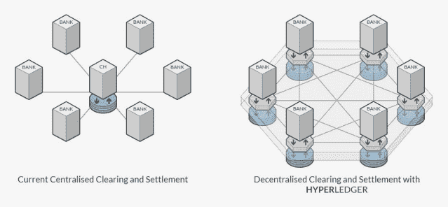
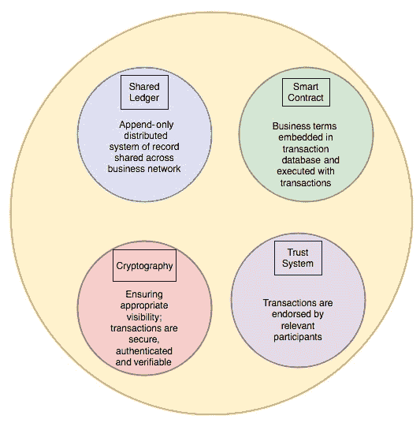
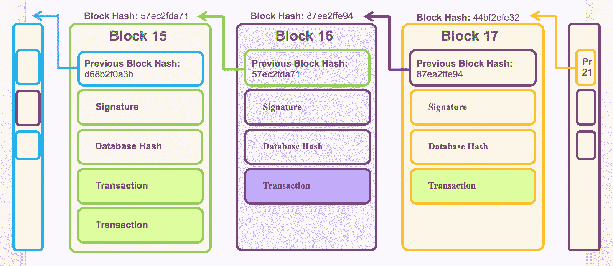
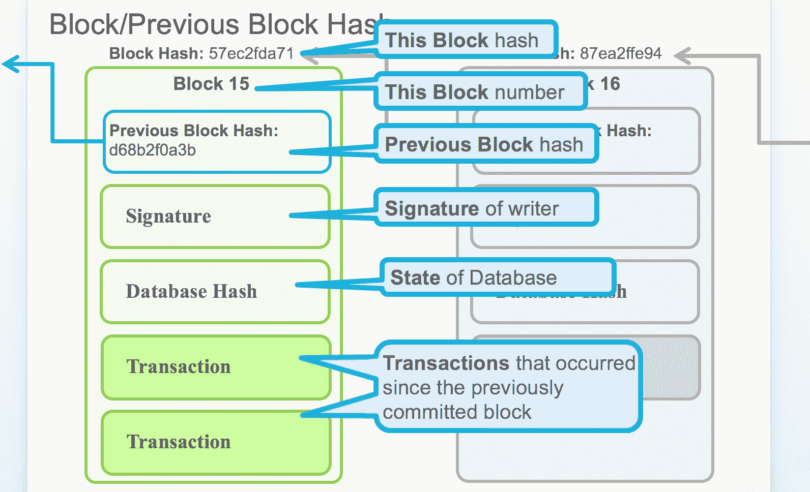
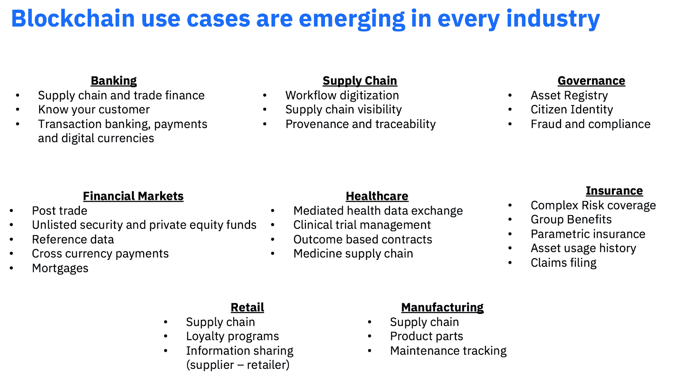
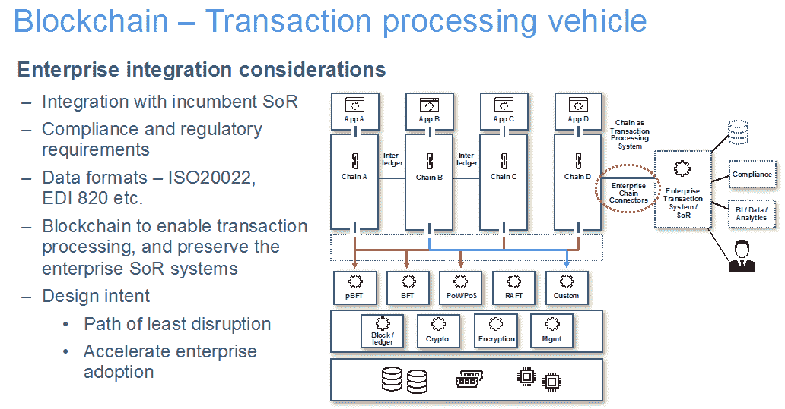
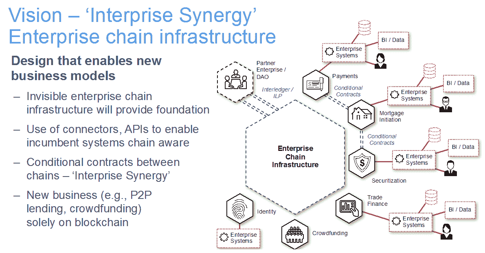
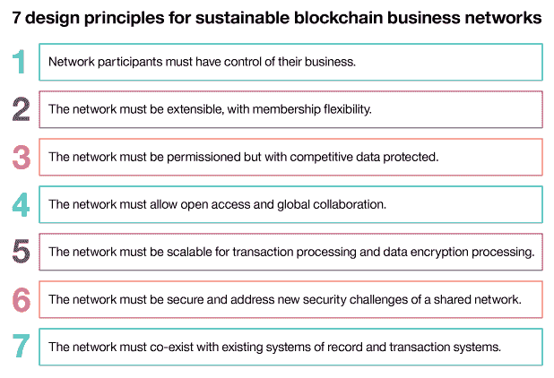

# 第一章：区块链 - 企业和行业视角

区块链承诺从根本上解决时间和信任问题，以解决金融服务、供应链、物流和医疗保健等行业的效率和成本问题。区块链的关键特征包括不可变性和共享账本，在这个账本上，交易更新由共识驱动的信任系统执行，这可以促进多方之间真正的数字交互。

这种数字交互不仅受制于系统信任，而且确保交易记录的来源保持不可变的互动记录。这个特点本身就促使了可追责性和不可否认性，并激励公平竞争。通过区块链系统设计，我们试图建立一个隐含信任的系统。这种信任系统导致了风险的降低，以及各种应用技术构建，如密码学、加密、智能合约和共识，本质上创造了门槛，不仅降低了风险，而且还为交易系统注入了额外的安全性。

在本章讨论中，我们将涵盖区块链的以下几个方面：

+   定义区块链

+   区块链解决方案的构建模块

+   安全交易处理协议的基础知识

+   区块链的应用

+   企业中的区块链

+   企业设计原则

+   选择区块链框架的业务考虑

+   选择区块链框架的考虑因素

# 定义术语 - 什么是区块链？

在技术层面上，区块链可以被定义为一个不可变的账本，用于记录交易，由一个互不信任的对等分布式网络维护。每个对等方都保留着账本的副本。对等方执行共识协议来验证交易，将其分组成块，并在块之上构建哈希链。这个过程通过将交易排序为保持一致性所必需的方式来形成账本。区块链随着比特币（[` bitcoin.org/`](https://bitcoin.org/en/)）的出现而崭露头角，并被广泛认为是在数字世界中运行受信任交易的一项有前途的技术。

支持加密货币的区块链在公开或无许可方面，即任何人都可以参与而无需特定身份。这类区块链通常使用基于**工作证明**（**PoW**）和经济激励的共识协议。相比之下，许可区块链作为在一群已知、可识别参与者之间运行区块链的替代方式而发展。许可区块链提供了一种确保共享相同目标但不完全信任对方的实体之间相互作用的方式，例如互相交换资金、商品或信息的企业。许可区块链依赖于其对等方的身份，并通过传统的**拜占庭容错**（**BFT**）共识来实现。BFT 是一种协议，已广泛用于 IT 解决方案中，用于就网络失效节点状态达成一致。该协议基于拜占庭将军问题，即一群将军需要就他们的战略达成一致，但其中一人可能是叛徒。

区块链可以执行智能合约形式的任意可编程交易逻辑，正如以太坊（[`ethereum.org/`](http://ethereum.org/)）所示。比特币中的脚本是这一概念的前身。智能合约充当可信的分布式应用程序，在其中安全性来自区块链和同行之间的共识。

对于企业希望利用区块链平台的企图，区分许可和无许可区块链至关重要。用例决定了技术的选择，技术取决于共识系统、治理模型、数据结构等。通过使用许可区块链，我们可以以更好的方式做我们已经在做的一些事情，这可能具有重要意义。在接下来的图表中，您可以看到一个银行联盟如何使用超级账本（Hyperledger），这是一种许可区块链类型，用于清算和结算而无需依赖中央清算机构：

清算机构的创建是因为银行彼此之间并不完全信任，在交易之间充当中介降低了一方不履行其义务的风险，这导致了一场关于许可与无许可区块链的漫无止境的讨论，而本章不会涉及这场辩论，区块链可以提供一种改变或颠覆当前业务和商业模式的方式。在受监管行业中，大多数用例采用许可区块链模型。

这是由于监管要求和交易处理的经济可行性，而无论选择的区块链模型如何，区块链都提供了许多转型和颠覆的可能性。

区块链作为一种技术平台具有非凡的潜力。在企业中，区块链可以提供：

+   一种设计方法，将交易数据、价值和状态固有地靠近业务逻辑

+   通过社区验证的安全业务交易执行，在安全流程中促进信任和坚固的交易处理，这是区块链基础的。

+   符合现有法规的替代、权限化技术

区块链承诺解决长期存在的行业问题——这正是它的潜力所在，解决类似于现代化金融和贸易系统的问题，加速证券和贸易结算。

# 区块链框架的四个核心构建模块

区块链框架通常包括以下四个构建模块：

+   **共享账本**：共享账本仅附加分布式交易记录。比特币区块链的设计初衷是民主化可见性；然而，使用区块链时，也需要考虑消费者数据法规。使用配置正确的 SQL 或 noSQL 分布式数据库可以实现不可变性或仅附加的语义。

+   **密码学**：区块链中的密码学确保身份验证和可验证的交易。区块链设计包括这一重要因素，因为关注于假定计算难度和使加密对对手更难破解。这是比特币区块链的一个有趣挑战，因为涉及经济激励和其系统设计。在一个不那么民主或权限的商业账本网络中工作时，对密码学的考虑会改变。

+   **信任系统或共识系统**：信任系统是指利用网络的力量来验证交易。

    在我看来，信任系统是区块链系统的核心；它们是区块链应用的核心，并且我们相信“信任系统”是首选术语，而不是**共识系统**，因为不是所有的验证都是通过共识完成的。这种信任系统的基础元素决定了对区块链基础设施的整体设计和投资。随着区块链领域的每一个新参与者，信任系统都在修改，形成了为特定的区块链用例专门化的变体。信任、交易和所有权是区块链技术的基本要素。对于公司间交易，信任系统管理着参与公司之间的交易。

    仍然需要做很多工作来定义特定用例的最佳信任系统，比如 P2P 和共享经济模式与 B2B 模式。

+   **业务规则或智能合约**: 智能合约是内嵌在区块链交易数据库中并通过交易执行的业务条款。这也是区块链解决方案的规则组成部分。需要定义每个交易的价值流和状态。

以下的使用图表很好地解释了这些概念：

这四个基本模块是被广泛接受和理解的。它们在区块链出现数十年前就存在了。共享账本是一种进化性的变化，类似于从纸张表格过渡到基于计算机的电子表格，但根本的业务规则保持不变。

# 其他需要考虑的能力

企业区块链提案中还应包括什么？以下是需要考虑的其他能力的非穷尽列表：

+   **审计和日志记录**: 在区块链解决方案中包含审计和日志记录可以帮助解决法规，用于不可否认、技术根本原因分析、欺诈分析和其他企业需求。

+   **企业集成**: 还值得考虑解决方案将如何集成到企业中：

    +   与现有记录系统的集成（***SoR**）的目标是确保区块链解决方案支持您现有的系统，如 CRM、商业智能、报告和分析等等

    +   **作为交易处理系统的集成**: 如果您想保留记录系统作为采纳区块链的临时方法，将其集成为交易处理系统是有意义的

    +   **具有包含区块链的意图的设计**: 对现有系统产生最小影响的路径将加速企业对区块链的采用。

+   **监控**: 监控对于解决法规问题和确保高可用性、容量规划、模式识别和故障识别非常重要。

+   **报告和监管要求**: 准备好解决监管问题对于区块链作为交易处理系统的临时采用也非常重要。建议您与现有的 SoR 对接，以卸载报告和监管要求，直到区块链变得企业感知，或者企业软件对区块链感知。

+   **企业身份验证、授权和会计 ****要求**: 在受许可的企业世界中（不同于无需许可的比特币区块链），所有区块链网络参与者应被识别和跟踪。如果他们要在生态系统中扮演角色，他们的角色需要被定义。

# 安全事务处理协议的基本原理

我们之前提到，密码学是区块链解决方案的核心构建模块之一。比特币区块链的基本安全性在于账本的所有主要组件之间的优雅的密码连接。具体来说，交易之间通过默克尔树主要相互连接。默克尔树基于树数据结构的概念，其中每个叶节点都有其数据的哈希计算，而非叶节点具有其所有子节点的哈希。这种方法不仅提供了确保数据完整性的方式，而且通过允许删除被视为私有的叶子但保留哈希来提供隐私特性，从而保持了树的完整性。默克尔树的根已经合并到块头中。块头包括对其之前的块头的引用。

密码学强制的相互连接促进了分布式分类账的稳定性和安全性。在任何时候，如果任何组件之间的连接断开，都会使它们容易受到恶意攻击：

交易也通过默克尔树与区块链结构的其余部分进行了密码学连接。一旦在一个块中修改了交易，并且其他所有部分保持稳定，那么该块的所有交易与其头之间的链接就会断开：

新生成的默克尔树根与已经在块头中的根不匹配，因此不能连接到区块链的其余部分。如果我们继续更改块头中的默克尔树根，那么我们将破坏块头链，从而破坏区块链本身的安全模型。因此，如果我们只更改一个块的内容，则区块链的其余部分保持稳定和安全，特别是由于块头通过在下一个块的头部包含上一个块头的哈希来提供连接的链接。

# 区块链技术的发展历程及未来走向

区块链已经是商业颠覆者，我预计它将在不久的将来显着改变行业、政府和我们的生活。

# 伟大的分水岭

加密货币和**首次代币发行**（**ICO**）世界之间存在显着的分歧，以及受监管业务的世界。后者包括银行和金融机构共同努力评估市场潜力和运营效率。

这一分歧的双方都利用了区块链周围的动能来推进各自的利益。区块链生态系统挑战了现状，并且不顾一切地表明了一个观点——通常行为像一个青少年。它受到新商业模式、去中心化的承诺和有趣的技术创新的推动。随着区块链势头的增长，比特币和其他加密资产的价值正在飙升，现在 ICO 已经出现，它打破了传统的筹款监管框架。

在企业方面，有越来越多的行业倡议围绕清算和结算，以实现更快的结算和银行间转账、透明度通过数字化、供应链中信息的对称传播以及在**物联网**（**IoT**）设备之间创建临时信任。

这里有一个共同的主题——区块链将会留下来。随着它不断发展，并为行业使用案例生成创新解决方案，它将不断迈向成熟，并在信任基础上兑现其效率和显著成本节约的承诺。

# 区块链交付的经济模型

由区块链技术支持的商业网络可能会给行业带来转型或颠覆，但无论如何，为了蓬勃发展，区块链都需要一个经济模型。如果颠覆是目标，那么技术、人才和市场协同的投资可以与经济激励的诱惑相结合。例如，ICO 通常依赖于 Tokenomics，这是描述这些网络中价值生成经济系统的术语。代币是系统或网络通过为提供者或消费者创造平台，或通过共同创建一个各方都可以利用的自我管理的价值网络来生成的价值单位，以便创建、分发和共享符合所有利益相关者利益的奖励。

大部分由加密货币资助的 ICO 前沿打破了风险资本（由众筹项目领导）当前的筹款机制，而且，区分证券和实用币的区别是原则上具有颠覆性的。

ICO 正在寻求创建一个建立在**去中心化**、**开放治理**（或自我治理）和透明度原则上的经济体系，一个奖励创新并消除去中心化的系统。ICO 看到了一些初期的失败和一些成功，但它们仍然提供了未来的预览，在那里加密资产将成为一个基本的价值单位——其估值和可替代性由它们来源的网络定义——推动着一个建立在和围绕创新的经济体。

在企业方面，更加关注理解技术并重新构想生态系统、商业网络、法规、保密性和隐私以及影响各行业区块链网络的商业模式。希望探索区块链的企业想要看到快速的验证点，能够迅速展示结果并帮助他们与区块链进行创新的用例。

区块链通过提供内置的交易数据控制、出处和历史背景，帮助各行业实现信息更对称地传播。这可以带来更高效的工作流程和转变的业务流程。然而，许多早期项目并没有关注区块链的核心原则，导致了中介去除、去中心化和强大的自我治理模式。不过，这背后也有一个很好的理由：行业和传统企业往往专注于当前的商业议程、模式、增长以及最重要的，法规合规和遵从。对当前业务运营的强调意味着它们并不自然地倾向于颠覆性模式。

# 边学边做

对于任何新技术，都存在一个学习曲线。随着区块链的发展，我们开始与受监管的行业合作，我们很快意识到在这些行业中，有一些重要的设计考虑需要解决，比如保密性、隐私、可扩展性和性能等。当涉及到设计区块链网络以及管理这些网络的商业模式时，这些元素可能会产生重大的成本影响。这些挑战不仅很有趣，而且对传统的受监管行业和企业产生了积极的影响，通过重新激发这些组织中的创新，并邀请最优秀的人才加入解决这些挑战。企业正在看到，由区块链技术驱动的生态系统和网络将有助于进步和成功。

需要开始揭示一种激励模式，以激励组织加入一个促进奖励的平台的想法，从而使所有利益相关者受益。 tokenomics 背后的经济激励不能被很多传统企业和行业盲目采纳，但这并不意味着这些行业不应该开始探索可能的商业模式，以实现价值创造，并推动一些急需的现代化努力。

# 信任和问责制的承诺

区块链技术承诺成为一个安全交易网络的基础，可以在许多饱受信任和问责制系统性问题困扰的行业中诱发信任和安全。从技术角度来看，区块链促进了一个安全、透明、可审计、高效和不可变的交易处理和记录系统。这些技术特征适用于解决当前分布式交易系统所困扰的时间和信任问题。

区块链从根本上改变了多层模型，转向了扁平层的交易处理模型。这有望通过去中介化，通过在新的系统设计中引入高效性，或简单地创造新的商业模式来从根本上削弱行业。

**去中介化**表示减少生产者和消费者之间的中介使用，比如直接在证券市场投资而不是通过银行进行交易。在金融行业，每笔交易历来都需要有一方来处理交易。去中介化包括移除中间商，从定义上来说这会破坏基于中介的商业模式和激励经济体。近年来，由数字技术带来的波澜涌起，这正是由市场洞察和组织提供更丰富的用户体验的欲望所推动。 

区块链是一项旨在通过引入交易、信任和所有权的技术来推动这一变革。区块链数据库和记录所代表的技术模式具有潜力从根本上改善银行业、供应链和其他交易网络，为创新和增长提供新机会，同时降低成本和风险。

# 把区块链技术应用到工作中的行业

让我们简单看一下区块链的应用场景：

# 企业中的区块链

现在我们已经看到区块链在各行业中的发展，让我们谈谈企业应该如何使用区块链的原则。企业为什么要将区块链技术应用于其系统或应用程序之一？

# 哪些应用适合？

组织需要在应用设计过程中建立使用标准以帮助他们评估应该在哪些方面最好地应用区块链技术。以下是一些标准的例子，可以帮助企业确定哪些应用或系统将受益于此：

+   **遵循交易、信任和所有权原则的应用**：如先前所述，这三个原则——交易、信任和所有权对于任何区块链系统都是至关重要的。交易和所有权意味着分类账条目的变更和转移，而信任指向交易系统的无需信任的性质。

+   **基本上是交易性质的应用**：关于为什么我们不能从分布式数据库，即非 SQL 或关系型数据库中获得区块链的好处，经常会有争论。但是多方交易是使应用适合区块链的关键。这需要有长时间运行的进程，有大量微型交易将由区块链支持的交易系统验证和验证。然而，数据库仍然可以用于持久性或复制以适应企业系统。其他考虑因素包括可能会随时间增加的小数据集大小、日志开销等。

+   **由非垄断参与者组成的商业网络**：这第三个标准涉及分布式与去中心化计算模型。区块链信任系统可以在任何模型中工作；然而，区块链商业网络的信任方面来自具有非垄断参与（联合许可网络模型）的多方参与者。垄断参与可能是可以接受的（私有许可网络模型），但是必须制定一种信任模型，确保即使参与者具有理性行为，也能防止中心化控制。许多内部用例不遵循这一原则，更多地用于分布式应用程序模型。

对于试图理解或确定在哪里有意义地应用区块链的企业，有一种简单的方法可以思考用例选择。一个适当的用例对于可持续的区块链解决方案将实现长期业务目标，并提供强大的技术投资回报。

这始于一个**企业问题**——一个足够大，以至于企业要花费资源/时间的问题——以及认识到具有相同问题的同伴。当公司意识到企业问题也是**行业问题**（如安全借贷、抵押借贷等）时，他们找到了区块链潜力最大的用例。

当组织正在确定区块链的各个方面对其企业应用的益处时，他们还需要认识到整个区块链领域的碎片化。有许多创新方法可用于解决特定挑战与区块链。许多供应商提供专门用于解决特定用例的信任系统的变体，并且他们已经定义了在给定行业中区块链将最受益的用例，例如。这些专业供应商通常承诺提供快速解决方案，以满足消费者对快速数字交互的需求。

区块链的原则在传递快速的消费者驱动的结果方面非常有帮助，比如分散的、分布式的、全球的、永久的、基于代码的可编程资产，以及交易记录。我们在考虑将区块链视为解决每个企业应用的问题的工具时要小心，但它可以在许多交易应用中起到作用。

现在，让我们讨论企业对区块链的看法，以及企业采用这项技术所面临的一些挑战。在接下来的部分中，我将重点关注三个领域，这些领域有助于在企业背景下确定区块链的基调。

# 企业如何看待区块链？

激进的开放性是区块链作为数字信任网络的一个方面，但在企业中，考虑激进的开放性的影响和意义是至关重要的。

公共区块链可以以极其简单的方式运作，支持所有交易的高度分布式的主列表，通过匿名共识支持的信任系统进行验证。但企业能直接应用无信任系统的模式而不修改区块链的基本原则吗？

组织将这种颠覆性技术视为他们变革的一条道路，还是仅仅是帮助他们改进现有流程以利用信任系统所承诺的效率的工具？无论怎样，企业都希望对区块链的采用对现有系统的干扰尽可能小，并且这并不容易实现！毕竟，现有系统的设计缺陷正是促使企业考虑这种范式转变的原因。很多关于区块链的概念和用例距离企业的实际应用还有很远的路要走。

第一个尝试和采用区块链的行业是金融服务领域，因为他们一直面临着被另一波创业公司颠覆的恐惧。像许多行业一样，它也受到了消费者对更快速、低成本交易的需求的驱动。金融服务有一系列明确定义的用例，包括贸易融资、贸易平台、支付和汇款、智能合同、众筹、数据管理和分析、市场借贷以及区块链技术基础设施。我们在这个行业看到的对区块链的应用可能会渗透到未来的其他行业，比如医疗保健、零售和政府。

区块链是一种新兴技术，汇集了许多好的想法，但对于企业的使用仍需进一步发展。在多领域链之间促进互操作性的缺乏明确定义的标准可能是一个挑战。因此采用它的企业将需要建立能力，以便他们可以为进一步的创新作出贡献，并帮助必要的区块链标准开发。这反过来可能有助于为改进现有业务实践和在基于区块链的信任网络中开发新业务模式提供独特的机会：

# 用于证明区块链技术应用的滤纸试验

从根本上讲，区块链解决了交易经济的三个方面：

+   交易

+   拥有权

+   信任

区块链的显著技术元素包括：

+   **信任系统背后的技术**：共识、挖掘和公开账簿

+   **开放网络上的隐秘通信**：密码学和加密

+   **不可否认的系统**：可见性到一堆过程

虽然区块链技术的影响可能很深远，但组织应制定一套特定于企业的标准，可应用于可能偏向企业区块链的现有或新项目。

鉴于区块链技术的多功能性和当前的炒作曲线，企业应该使用链决策矩阵作为工具，以确保他们对待业务领域应用基础技术的方法是有结构的。这种方法也将有助于一个一致的区块链基础设施和信任系统管理，这在许多应用驱动链发展并且对企业的可见性、管理和控制需求增长的情况下将非常重要。

# 为整个企业集成区块链基础设施

任何企业采用区块链技术都应该以颠覆现有系统为目标。考虑与企业的记录系统集成是朝这个方向努力的一种方式。通过这种方式，企业可以实现基于区块链的交易处理，并将其现有的记录系统用作其其他应用程序（如业务智能、数据分析、监管互动和报告）的接口。

将企业区块链技术的基础设施与利用链技术获得竞争优势的业务领域分开是至关重要的。区块链可以被视为一种对企业不可见的企业链基础设施，它在幕后运作，同时促进各种业务驱动链之间的**企业协同**。这个想法是将业务领域与支持它的技术分开。链应用应由具有合适信任系统的业务领域配置。正如我一再强调的那样，信任系统对任何区块链努力都至关重要，因此它应该符合特定业务应用的需求。基础设施和计算需求的成本将由企业可用的信任系统的选择决定。

通过将区块链技术基础设施分离出来，围绕可插拔的信任系统设计架构，利用信任中介和促进灵活性的设计以及模块化信任系统，企业可以专注于业务和监管要求，如 AML、KYC、不可否认等。区块链应用的技术基础设施应该是开放的、模块化的，并且适用于任何区块链变种，从而使区块链努力易于管理。

**企业协同**表明要推动多个企业区块链之间的协同，以实现企业内部和企业间链（跨链）连接。在这种模式下，交易将穿过各种信任系统，使企业治理和控制系统能够看到交互行为。在审视业务部门和外部企业之间的这些交互作用时，应考虑分形可见性及其关联的企业数据保护。一个无形的企业链基础设施可以为发展企业连接器和公开 API 提供坚实的基础，使现有系统更具链感知能力。

由于业务链之间的有条件可编程合约（智能合约），企业协同将得到促进：

企业如何知道自己是否已准备好采用区块链？更重要的是，在考虑区块链消费时，它应该将重点放在与现有交易系统的整合上，还是应该考虑企业感知的区块链基础设施？

要充分利用企业区块链的承诺，一个整合型企业将需要不止一个用例，并且需要推动**企业协同**。最成功的区块链消费策略应该首先关注技术，然后考虑与现有企业业务系统的整合。这将促进集体理解，并加速企业采用区块链的过程，希望能够选择最少干扰的路径。

# 企业设计原则

正如先前所述，区块链技术承诺成为一个安全交易网络的基础，在受到围绕信任和问责制的系统性问题困扰的行业中引发信任和安全感。它旨在产生市场和成本效益。

在过去的几年里，随着区块链技术的成熟，我们关注的重点是企业和商业如何利用这项技术来解决痛点并开启新的商业模式。已经开始看到区块链潜力的组织现在开始重塑受陈旧流程、文书工作和技术成本困扰的业务网络。

# 业务驱动和演进

在最近的过去，组织会将内部业务系统和 IT 基础设施延伸到互联网上，以利用互联和可访问系统的协作潜力。区块链技术正在将这一趋势推向新的高度，提供由可信赖的业务网络促成的真正数字化互动。在互联网时代，成功的企业采用并适应了技术挑战，而在区块链时代，业务而不是技术成为了推动力。

虽然区块链技术本身很有趣，但业务网络还涉及许多其他机制，这些机制也应该进行评估，包括：

+   **共识模型**：哪种信任体系最适合您的业务网络？

+   **控制和治理**：允许哪些实体做什么？如果系统出现异常，调查过程将由谁来负责？

+   **数字资产生成**：谁在系统中创建资产？谁来管理它？

+   **发行权力**：在一个真正分散的系统中，权威的概念不再具有一致性。那么在区块链网络中，谁将负责治理、追究责任，以及最终的监管呢？

+   **安全考虑**：网络将如何解决企业安全问题，包括共享业务网络带来的新安全挑战？

我们设想一个专为多个业务领域而设的区块链网络，例如，抵押贷款、支付、交易、特定资产类型的清算和结算等。在企业环境中，我们设想一个中心化的网络，其中志同道合的业务实体共享一个共识联盟。支持这一中心化网络概念的几个实际理由包括以下几点：

+   使用特定领域的业务语言，导致智能合约的构建、管理和治理，作为代理业务表示的一部分

+   定义了一种资产类型，导致数字资产的治理、管理和估值（用于交易、可替代性等）

+   适当的监管，考虑到每个行业和业务网络都有单独的监管，因此遵守监管和其他相关成本的负担可以在业务网络中共享。

+   其他相关业务功能，如分析、分析、市场数据等

我们已经介绍了企业区块链的商业动力，接下来让我们考虑如何确保区块链网络的可持续性和长期性。

# 确保可持续性

基于区块链的业务网络正在不断发展壮大，随着它们的发展，核心问题如信任模型、数据可见性和利用网络获取竞争优势等问题将不可逆转。

关注可持续性似乎是矛盾的，因为它促进了开放的协作创新，同时又锁定了诸如共识或信任系统以及用于管理资产、智能合约和多方交易网络中的整体交互的治理系统等结构。区块链系统设计需要考虑所有这些因素。

成功的系统设计需要与多方场景中的区块链原则（包括贸易、信任、所有权和交易性）相匹配。如果不基于这些核心原则构建业务网络，可能无法以可持续的方式实现区块链技术的承诺。

以下是支持和维持区块链业务网络增长的七项设计原则：

+   网络参与者需要控制自己的业务

+   网络必须是可扩展的，以便参与者可以灵活地加入或离开网络

+   网络必须是经过许可的，但也必须受保护，以保护竞争数据，同时促进点对点交易

+   网络应允许开放访问和全球协作进行共享创新

+   网络必须可扩展，既可用于事务处理又可用于加密数据处理

+   网络必须能够容纳企业安全，并应对新的安全挑战

+   网络需要与企业中已建立的记录系统和交易系统共存

我们将以图形方式列出设计原则，如下所示：

# 推动区块链采用的原则

在任何企业中，区块链采用都是由三个原则驱动的：业务蓝图、技术蓝图和企业集成。

选择区块链框架时，根据以下三个原则考虑一些不可或缺的事项：

+   **业务蓝图**：区块链承诺创建一个基于信任的价值业务网络。为了做到这一点，理解各种区块链框架如何处理网络交互模式、低效和漏洞至关重要。

+   **技术蓝图**: 如果技术要与业务目标保持一致，组织就需要为其需求做出适当的技术和架构选择。在这里可能会考虑每秒交易数（TPS）、企业集成、外部系统集成以及监管和合规性要求。这些决策都是适当预算区块链采用所必需的技术尽职调查的一部分。

+   **企业集成**: 将区块链集成到企业系统中，特别是邻接系统，是一个重要的商业和技术考虑因素（因为下游交易系统影响关键业务系统），以及一个成本因素。根据我的经验，如果组织在规划的早期不专注于邻接系统的集成，可能会阻碍采用，因为它对区块链项目的成本影响显著。

在接下来的章节中，我会稍微详细地讨论每个设计考虑因素。

# 选择区块链框架的业务考虑因素

当组织在评估是否采用区块链来解决他们的痛点时，会涉及到许多标准。以下是一些从业务角度考虑的因素：

+   **开放平台和开放治理**: 企业选择的技术标准将为企业区块链采用、合规性、治理以及解决方案的总体成本奠定基础。

+   **解决方案的经济可行性**: 无论组织选择哪种区块链框架，都应该提供与其现有业务模型、退款、计算权益和帐户管理的成本对齐。这与投资回报率息息相关。

+   **解决方案的长期性**: 当组织努力构建一个可信的网络时，他们希望确保他们能够承担网络的成本和运营，以便它能够增长和扩展以容纳更多的参与者和交易。

+   **监管合规性**: 合规性问题与交易处理密切相关，可能包括行业特定的报告和分析事件，用于业务工作流和任务，无论是自动化的还是以人为中心的。

+   **与邻接系统的共存**: 区块链网络需要能够与企业的其余部分、网络参与者和邻接系统共存，这些系统可能具有重叠和互补功能。

+   **业务增长的可预测成本**: 业务增长依赖于可预测的指标。历史上，许多行业都关注每秒交易数，但是这种测量因系统设计、计算成本和业务流程而异。

+   **技能和人才的获取**: 人才的可获得性影响着成本以及随着行业和技术的不断创新，维护和区块链解决方案的长期性。

+   **技术供应商的财务可行性**：在选择供应商时，重要的是考虑他们在长期支持和您的区块链解决方案的长期使用方面的可行性。您应该审查供应商或业务伙伴的长期愿景和可持续性的商业模式。

+   **全球范围的支持和支持**：区块链解决方案往往涉及具有全球影响力的商业网络，以及支持网络扩张而又最小化中断的相关技能。

+   **依赖技术和行业特定标准**：标准至关重要，不仅有助于标准化共享技术堆栈和部署，而且有助于为行业专家建立有效的沟通平台，用于解决问题。标准使低成本、易消费的技术成为可能。

区块链供应商提供各种专业化服务，包括：

+   **变体信任系统**：共识、挖掘、工作证明等。

+   锁定到单一信任系统

+   专门为特定用例构建的基础设施组件

+   通过概念验证的经过实地测试的设计

供应商不遵循基于标准化技术集的参考架构的技术风险是企业的碎片化区块链模型。

从业务角度来看，基于开放标准的区块链方法提供了灵活性，以及可插拔和模块化的信任系统，因此是最理想的选择。这种方法使企业能够接受专门的区块链，如 Ripple，为信任系统提供一个配置层，并提供一个具备支持其技术的独立业务领域。

# 选择区块链框架的技术考虑

当组织考虑区块链的技术影响时，他们应该从这样一个前提出发，即它不仅仅是另一个应用程序。它是一个生产网络，涉及风险和成本以确保正确的维护和维护。

在评估区块链技术影响时，以下是一些需要考虑的重要事项。

# 身份管理

身份管理是一个复杂而涉及的主题，特别是在受监管的行业，其中身份必须被管理并具有重大的业务后果，例如围绕**了解客户**（KYC）、**反洗钱**（AML）和其他报告和分析功能的活动：

+   **权限控制** 是**成员注册证书（eCerts）**和每个成员的**交易证书（tCerts）**的概念；这些使实体能够获得权限和识别，同时完成交易。

+   **终端用户身份**，由参与区块链网络的实体维护，是 LDAP/用户注册表到 tCerts 或交易 ID 的映射，以进行追踪（了解客户，以及了解客户的客户）

其他身份管理考虑因素包括：

+   LDAP 或现有的用户注册表不会消失，必须考虑为设计重点，因为成熟的身份验证和授权系统通常已经投入了大量投资和安全策略。

+   信任系统是区块链技术的核心，并且必须为需要交易可追溯性的用例打开信任之路。

+   区块链的身份和用于区块链的身份

+   身份获取、审查和生命周期

+   与基于用例的信任系统对齐

# 可扩展性

要考虑可扩展性，因为下游交易系统可能会影响关键的业务系统，这既是商业考虑，也是技术考虑。比如针对可扩展性的技术选择，例如用于共享账本的数据库选择、相邻系统集成、加密和共识，都会导致可以适应网络成员或交易增长的可预测成本的系统设计。

# 企业安全

有三个层面的企业安全需要考虑:

+   **物理 IT 基础设施层**，其中包括特定用例的问题，如 EAL5、网络和基础设施隔离要求。

+   **区块链中间件层**，其中包括加密模块要求、加密级别、数据存储、传输和数据静态加密、以及网络参与者之间数据的可见性。

+   **区块链共识**（信任系统层），是区块链的核心，并且是保证基本**数据存储**特性的必要条件。如果网络中有更多参与者，他们必须带来资本以实现规模化。这就是关于在较低准入门槛下建立符合企业数据质量的**共享数据存储**的问题。共识，即使是最小的共识，在现有的架构中也是必要的。加密货币基础的信任系统和非加密货币基础的信任系统现在存在分歧。前者的模型，如 POW/PoS，不适合企业用例，希望创建权限区块链。

# 开发工具

开发工具选择包括集成开发环境，业务建模和模型驱动开发。

# 加密经济模型

加密经济模型指的是使用公钥密码学进行身份验证和经济激励来保证系统不会倒退或发生其他修改的去中心化系统。要充分理解区块链的概念和计算机科学中加密的好处，我们必须首先理解**去中心化共识**的概念，因为这是基于加密的计算革命的关键。

# 有系统性治理的去中心化

旧的范式是中心化的共识，其中一个中央数据库将决定交易的有效性。分散化方案打破了这一格局，将权威和信任转移给了分散化网络，并使其节点能够持续和顺序记录交易在公共块上，创建唯一的链—因此得名区块链。通过哈希码的密码学保证了交易来源的身份验证，消除了中央中介的需要。通过结合密码学和区块链，该系统确保没有重复记录相同的交易。

区块链系统设计应保留去中心化数字交易处理的理念，将其调整为一个许可网络，同时根据企业环境的需要集中一些监管合规和维护活动。

# 企业支持

企业支持区块链的重要性与重新考虑估算工作的原因相同。请记住，区块链不应被视为另一个应用程序。它是一个涉及风险和维护成本的生产网络，并且不能简单地使用现有的开发、基础设施和服务。

# 基于用例驱动的可插拔选择

为了确保您的区块链解决方案能够允许基于用例的可插拔选择，请考虑以下问题。

# 共享账本技术

您尝试通过区块链解决的用例、设计要求和问题都将有助于确定共享账本和数据库技术的选择。

# 共识

共识指导了信任系统并推动了区块链应用基础设施的技术投资，因此它是区块链的核心。此外，并不存在适用于所有用例的共识类型。用例定义了参与者之间的交互，并通过共识模型建议了最适合的信任系统。

共识是验证区块链网络上的网络请求或交易（部署和调用）顺序的一种方式。正确排序网络交易至关重要，因为许多交易依赖于一个或多个先前交易（例如，账户借方经常依赖于先前的贷方）。

在区块链网络中，没有单一的权威确定交易顺序；相反，每个区块链节点（或对等方）都有平等的发言权，通过实施网络共识协议来建立顺序。因此，共识确保了节点的多数同意了交易附加到共享账本的顺序。共识通过解决提出的交易顺序中的不一致来确保所有网络节点都在同一区块链上运行。换句话说，它确保了区块链网络中交易的完整性和一致性。

# 加密算法和加密技术

选择区块链系统设计可能受加密库和加密技术的指导。 组织的用例需求将决定这种选择，并推动区块链应用基础设施的技术投资：

+   **非对称**: RSA（1024-8192），DSA（1024-3072），Diffie-Hellman，KCDSA，椭圆曲线密码学（ECDSA，ECDH，ECIES）与命名、用户定义和 brainpool 曲线

+   **对称**: AES，RC2，RC4，RC5，CAST，DES，三重 DES，ARIA，SEED

+   **哈希/消息摘要/HMAC**: SHA-1，SHA-2（224-512），SSL3-MD5-MAC，SSL3-SHA-1-MAC，SM3

+   **随机数生成**：FIPS 140-2 批准的 DRBG（SP 800-90 CTR 模式）

# 用例驱动的可插拔选择

正如先前所述，用例将定义参与者之间的互动，并建议使用共识模型选择最适合的信任系统。

# 企业集成和设计可扩展性

设计区块链网络与组织中现有的记录系统并存是一个重要的成本考虑。 集成应通过业务和技术问题，因为下游交易系统会影响重要的业务系统。 通过与许多企业合作，我发现将区块链与相邻系统集成对其区块链项目的成本影响很大。 它确实需要在规划阶段早期解决，以免对企业采用产生不利影响。

想到运营问题也很重要。 通过保护贸易、信任和所有权的要素以及区块链的固有属性（如不可变性、出处和共识），信任系统承诺有助于消除冗余和重复的系统和流程。 这些重复成本组织大量资源，导致交易处理较慢和相关的机会成本。 区块链采用的一个目标应该是解决现有流程的核心痛点。 期望是一个透明的分类账，增加信任，节省时间和重大成本，并提供更好的客户服务。

对于网络可扩展性，设计可扩展性意味着在规划实施时考虑未来的增长。 扩展性衡量了系统的扩展能力以及实施扩展所需的工作量。 可扩展性在区块链业务网络设计中非常重要，不仅要适应业务的动态特性（包括所有的规定、竞争压力和市场动态），还要适应网络的增长（监管机构、市场制造商、扰乱、服务提供商等的增加）。

以下是一些设计考虑，以确保网络的可扩展性：

+   **成员灵活性**：区块链网络可能从一个有限的参与者和角色群体开始，但后来可能会有新的参与者想要加入网络，而其他人可能想要离开。因此，您必须考虑成员变更的机制，包括对（共享）数据的访问。在设计可扩展性时，成员类型也是一个重要的考虑因素，因为成员的角色和类型可能随时间而变化。

+   **计算权益**：基于加密货币的信任系统和基于计算权益的信任系统之间存在分歧，因此这是一个相当新的概念。参与者类型及其在网络中的业务利益类型是长期可持续的基础设施成本和维护的决定因素。例如，监管机构的成本模型可能与区块链驱动的业务网络的主要受益者的成本模型大不相同。

+   **共同的业务利益**：区块链网络为企业提供了特定的优势，如降低风险、可靠且可预测的交易网络、较低的合规成本等。但这些共同利益可能导致其他运营问题，例如在实体加入和离开网络时的数据共享和所有权。由于围绕数据所有权的法规不断发展，以及行业对数据持久性的要求，因此在设计区块链系统时应仔细评估这些问题。

+   **治理**：治理包括管理技术工件，如技术基础设施，并管理区块链网络中的数据和智能合约。建议在以下类别中分层治理：

    +   区块链网络/技术治理

    +   区块链数据治理

    +   区块链智能合约治理

    +   区块链交易管理治理

在设计可扩展性时，目标应该是确保区块链网络具有可持续的运营要素和业务增长要素。例如，在可持续模型中，每个参与者都可以部署管理其自身业务流程的链码，同时还可以控制变更业务流程、政策和监管要求。

# 其他考虑因素

除了上述提到的方面外，还有一些其他注意事项需要牢记。它们在以下部分简要解释。  

# 共识、ACID 属性和 CAP

一致性模型永远不会降为 0，因为当 NoSQL 成为标准时，各种 NoSQL 系统通过理解 CAP 定理解决了它们的问题，而 RDBMS 企业社区则坚持了他们的 ACID 属性。区块链很可能提供了打破 CAP 并保持 ACID 的基本元素。以下是一些想法。

# CAP

Cap 代表：

+   **C—一致性**：共识确保了发生的事情以及发生的顺序只有一个真相。

+   **A—可用性**：区块链的所有调用都是异步的，这意味着*调用*应用程序在确保一致性和持久性的同时可以取得进展（链接也保证了这一点）

+   **P—网络分区**：再次，共识防止了在网络分区后合并时出现冲突的分裂大脑

# ACID

ACID 代表：

+   **A—原子性**：链码编程模型具有全有或全无的行为，允许你将活动分组在一起。要么所有事情发生，要么就什么都不发生。

+   **C—一致性**：我们相信 NoSQL 的新世界在这方面做得不好。我相信这意味着与 CAP 中的 *C* 相同。

+   **I—隔离性**：隔离性表示两个事务是串行的，这正是区块构造和链接所做的。

+   **D—持久性**：网络上的链接和复制确保如果一个或多个节点宕机，数据不会丢失。这就是为什么每个人都想带一个节点，以及为什么这些节点不应该不共存。

# 验证 – SSCs 签名和加密

在**安全服务容器**（SSCs）中，软件、操作系统、虚拟化程序和 Docker 容器映像都不能被修改。证书可以包含在 SSC 中，以便它们可以自我验证为远程方的真实性。例如，在构建 SSC 时包含 SSL 证书有助于确保你正在与真实实例通话，因为 SSL 证书始终保护（加密）在 SSC 中。

# 使用 HSM

根据[Wikipedia](https://en.wikipedia.org/wiki/Hardware_security_module)，**硬件安全模块**（HSM）是一种物理计算设备，用于保护和管理用于强身份验证的数字密钥并提供加密处理。这些模块通常以插件卡或直接连接到计算机或网络服务器的外部设备的形式出现。

管理高安全性设备（如 HSM）可能是一个真正的挑战，因为与足够的安全性和控制相关。事实上，今天的标准规定了 HSM 管理（和密钥管理）系统的某些安全方法和级别。

# 摘要

在企业中采用区块链将需要权衡考虑。组织不仅需要运行、管理和维护其现有基础设施；它们还需要为这个承诺带来转型的新计算模型铺平道路。

在受监管的行业中，组织可能会面临合规成本的双重影响，因为即使是新技术平台也需要遵循已建立的监管框架和经过验证的技术架构标准和设计。考虑采用分层防御的理性方法，结合多种减轻安全风险的安全控制，有助于保护其资源和数据。采用分层防御方法，数字资产/智能合约以及分类数据将受到保护。
