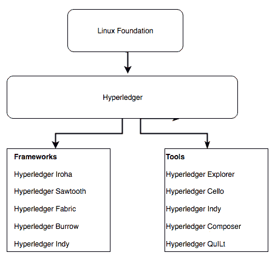
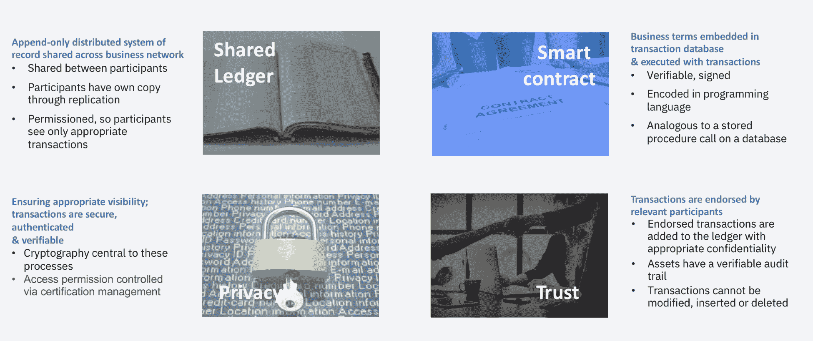
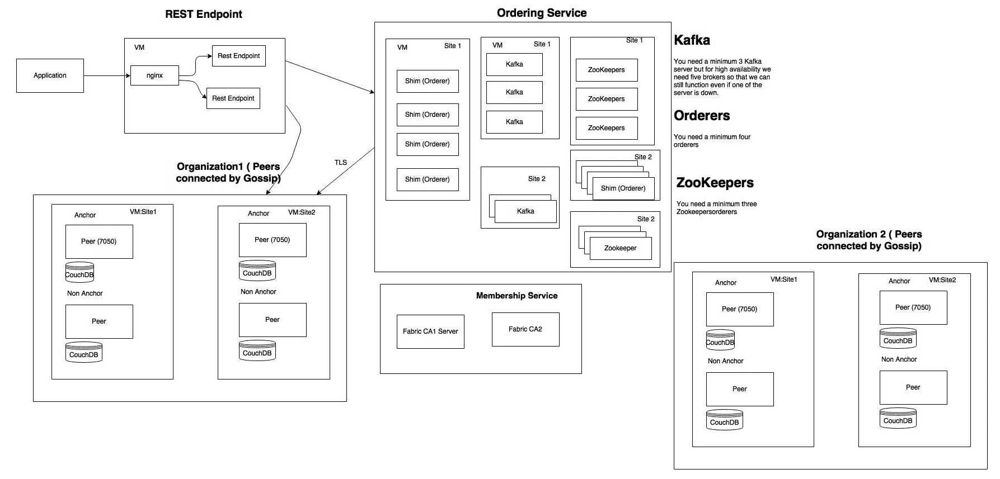
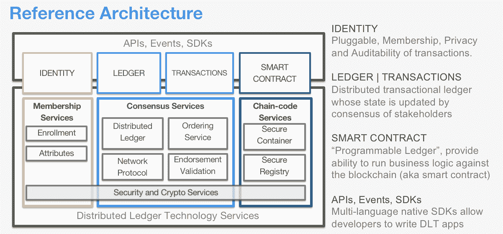
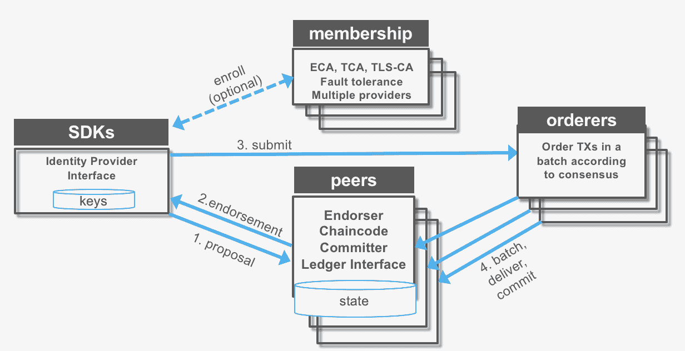
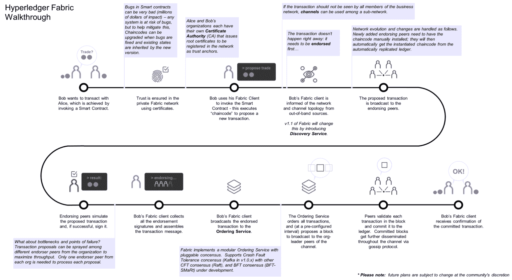
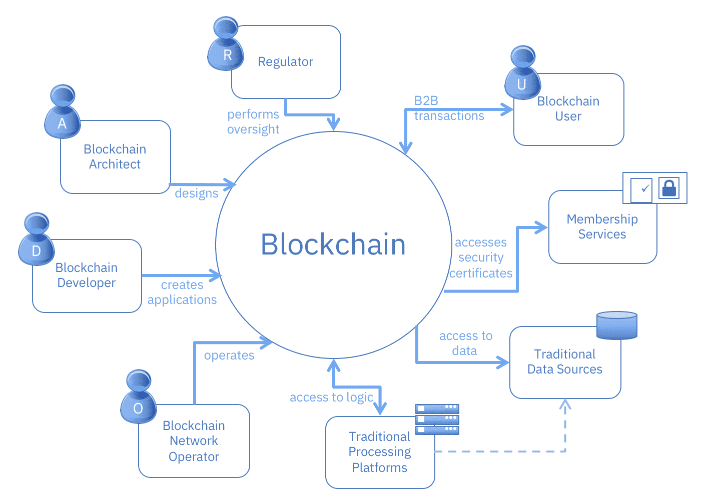
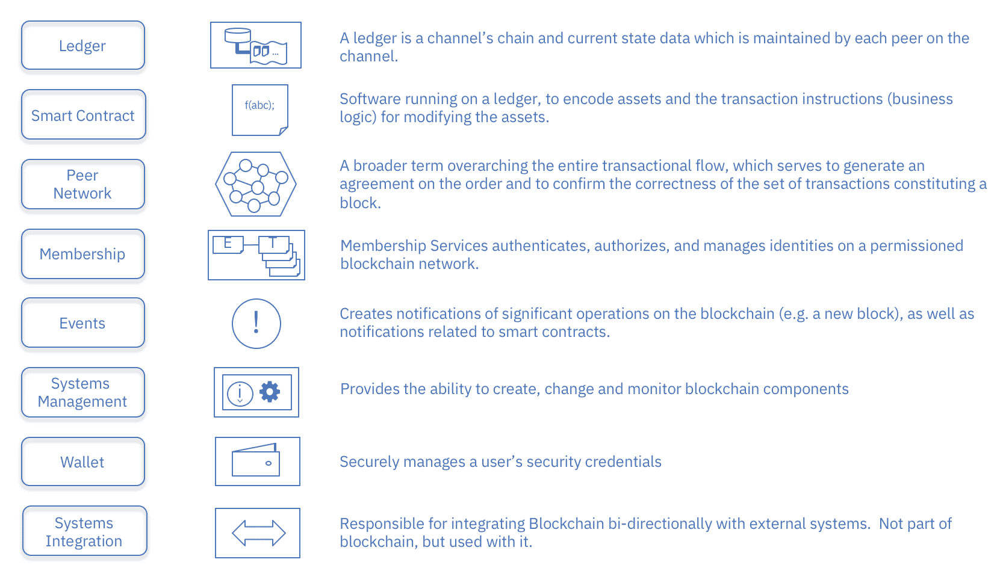
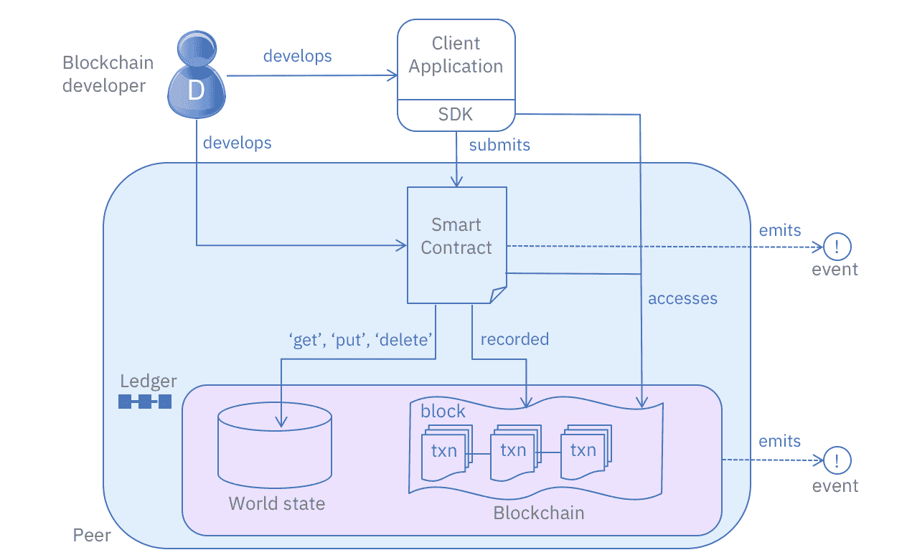
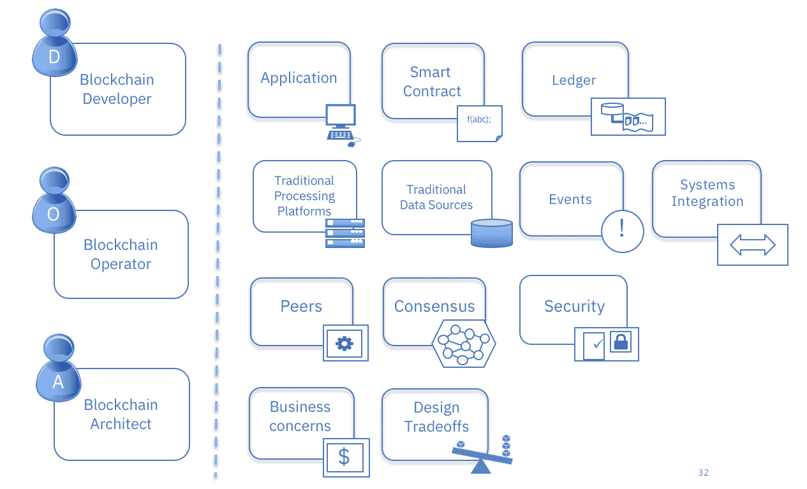

# 探索 Hyperledger Fabric

本章重点讨论 Hyperledger Fabric 项目——其组件、设计、参考架构以及企业就绪性。我们还将讨论由**Linux Foundation**（**LF**）托管的 Hyperledger 项目的整体目标以及开源和开放标准的重要性。目标是建立对各种 Hyperledger 项目的多样性以及哪些框架和工具可能适合特定企业用例和软件消费模型的理解。尽管区块链技术领域不断变化，但 Hyperledger 项目代表着一种支持成熟和经过同行评审的技术结构，旨在供企业使用，并由多样化的人才和社区利益推动。

本章将涵盖以下主题：

+   Hyperledger 框架、工具和构建模块

+   Hyperledger Fabric 组件设计

+   Hyperledger Fabric——一笔交易的旅程

+   探索 Hyperledger Fabric

+   理解由区块链驱动的企业网络治理

# Hyperledger 框架、工具和构建模块

现在我们已经看过 Hyperledger 在开放计算运动中的基础，以及它对行业的好处，让我们谈谈 Hyperledger 的框架、工具和构建模块。

# Hyperledger 框架

以下是五个区块链框架：

+   **Hyperledger Iroha**：Iroha 专为移动开发项目设计，基于 Hyperledger Fabric，并由 Soramitsu、Hitachi、NTT Data 和 Colu 贡献。它具有现代的、面向领域驱动的 C++设计，以及一种名为**Sumeragi**的基于新链式拜占庭容错共识算法。

+   **Hyperledger Sawtooth**：Sawtooth 由 Intel 贡献，包括 Intel 提出的一种称为**经过时间证明**（**PoET**）的新颖共识算法。 PoET 旨在尽可能有效地实现分布式共识。Hyperledger Sawtooth 在许多领域具有潜力，支持许可和无许可部署，并认识到各种需求。Sawtooth 被设计为多功能的。

+   **Hyperledger Burrow**：Hyperledger Burrow 最初由 Monax 和 Intel 贡献，是一个模块化的区块链，客户端构建了符合**以太坊虚拟机**（**EVM**）规范的区块链。

+   **Hyperledger Fabric**（**HLF**）：由 IBM 贡献的 Hyperledger Fabric 旨在成为以模块化架构开发应用程序或解决方案的基础。它允许插拔式组件，例如共识和成员服务，并利用容器托管称为**链码**的智能合约，构成系统的应用逻辑。本章余下部分将专注于 Hyperledger Fabric 及其设计、组件、架构和整体企业设计。

+   **Hyperledger Indy**：最初由 Sovrin 基金会贡献，Indy 是一个支持分布式账本上独立身份的 Hyperledger 项目。Hyperledger Indy 提供了工具、库和可重复使用的组件，用于提供基于区块链或其他分布式账本的数字身份：

# 区块链工具

目前 Hyperledger 项目中还有五种工具，全部由 LF 托管。这些工具如下：

+   **Hyperledger explorer**：Hyperledger explorer 最初由 IBM、英特尔和 DTCC 贡献，可以查看、调用、部署或查询区块、交易和相关数据、网络信息（名称、状态、节点列表）、链码和交易族，以及存储在账本中的其他相关信息。

+   **Hyperledger cello**：Cello 也由 IBM 贡献。它旨在将按需即服务部署模型引入区块链生态系统，以减少创建、管理和终止区块链所需的工作量。Cello 可以在各种基础设施上高效、自动地提供多租户链服务，例如裸金属、虚拟机和其他容器平台。

+   **Hyperledger composer**：Hyperledger composer（由 IBM 和 Oxchains 贡献）是一组用于构建区块链业务网络的协作工具，可加速智能合约和区块链应用程序的开发，以及它们在分布式账本上的部署。

+   **Hyperledger quilt**：Hyperledger quilt 来自 NTT 数据和 Ripple，是 Ripple 的跨账本协议的 Java 实现，旨在在分布式和非分布式账本之间传输价值。

+   **Hyperledger caliper**：Caliper 是一个区块链基准测试工具，允许用户使用预定义的用例来衡量特定实现的性能，目前处于孵化状态，由众多组织的开发人员贡献。

# 区块链解决方案的构建基块

如第一章所述，*区块链 - 企业和行业视角*，区块链承诺在金融服务、供应链、物流和医疗保健等行业根本解决*time*和*信任*问题。它旨在简化业务流程，从而解决低效率问题。它是基于信任、责任和透明度构建的新一代交易应用程序的技术。每个工业区块链都有几个共享特征，包括以下内容：

+   共享的真实唯一数据源

+   安全且防篡改

+   私密不可链接身份

+   可扩展的架构

+   机密性

+   可审计的

下图将这些特点总结为四个原则：

区块链解决方案由四个基本构件组成——共享账本、隐私、信任和智能合约。让我稍微详细解释一下这些构件：

+   **共享账本**：通过比特币区块链，其目的是实现可见性的民主化；然而，企业区块链由于消费者数据的监管而需要采用不同的方法。只追加不可变分布式事务记录可以通过 SQL 或无 SQL 分布式数据库来实现。

+   **加密保障隐私**：通过加密保障隐私对于确保交易经过认证和验证至关重要。在区块链设计中加入加密技术是至关重要的，以加强安全性并增加突破分布式系统的难度。当您在使用较少民主化或经过许可的账本网络时，有关加密的考虑会发生变化。

+   **信任系统或共识**：信任意味着利用网络的力量来验证交易。在任何区块链系统或应用中，信任都是至关重要的，我更喜欢使用*信任*系统而不是*共识*系统这一术语，因为信任是决定利益相关者投资于任何区块链基础设施的基础元素。每当新的参与者进入区块链领域并将区块链技术应用于新的用例或专业领域时，信任系统就会发生改变。信任模型真正是区块链的核心——它是传递*信任*、*交易*和*所有权*原则的基础。信任是使区块链能够取代交易系统的关键，但这只有在分布式/共享账本解决了交易和所有权时才能实现。对于各种用例，仍然需要大量工作来定义优化的信任系统。数据库解决方案正在努力解决规模和移动用例的问题，但在点对点和共享经济模型以及 B2B 模型方面还需要更多的工作。

+   **智能合约**：在区块链的背景下，智能合约是嵌入到交易数据库中并随交易执行的商业协议。在业务中需要规则来定义价值流动和交易状态，这就是合同在这里的功能。合同之所以智能，是因为它是一个计算机协议，用来执行合同的条款。各种合同条款（如抵押、担保、财产权利的划定等）可以被编码，以强制执行对合同条款的遵守，并确保交易成功——这是智能合约背后的基本理念。智能合约的设计目的之一是让一方放心另一方将履行他们的承诺。这类合同的目标之一是降低验证和执行成本。智能合约必须是可观察的（意味着参与者可以看到或证明彼此的与合同相关的行动）、可验证的（意味着参与者可以向其他节点证明合同是否已执行或违约）、以及私密的（意味着合同内容/执行的了解应仅涉及执行它所需的必要参与者）。比特币为智能合约提供了相关规定；然而，它缺乏图灵完备性、缺乏状态等能力。以太坊通过构建一个内置图灵完备编程语言的区块链，改进了比特币的局限，因此任何人都可以编写智能合约和去中心化应用，创造自己的所有权、交易格式和状态转换函数的任意规则。这些进步使得复杂的合同可以在区块链中被编码，比如在飞行延误超过一定时间后即时向旅行者的银行账户转移信用，或者在实现绩效目标时支付员工补偿等。

    这在实际中如何工作？嗯，智能合约被部署为区块链节点上的代码，我们可能更恰当地称之为智能合约代码。这个代码是利用区块链技术来补充或替代现有的法律合同。这个智能合约代码是用 Solidity 或 Golang 等编程语言部署在区块链节点上的。在区块链上部署代码提供了三个重要的属性：

    +   区块链继承的永久性和抗审查性，

    +   程序本身控制区块链资产的能力，比如在参与者之间转移所有权或资产数量

    +   程序由区块链执行，确保始终按原样执行，没有人可以干扰

在企业世界中，智能合约可能涉及区块链的智能合约代码，以及更传统的法律合同。例如，智能合约代码可能在土地登记区块链网络上执行，将房屋所有权从一方转移到另一方，以便房屋登记记录实时更新，并且所有参与者（如城市、房地产经纪人、律师和银行）都可以在销售完成后更新自己的记录。但是，购房者将坚持要求具有补偿条款的法律合同，以 Cover any undiscovered liens。

# Hyperledger Fabric 组件设计

让我们讨论一下促进区块链技术原则的各种组件，例如共享账本、加密、信任系统和智能合约。 这些组件代表了 Hyperledger Fabric 的基础设施组件，并且提供了与链码或智能合约开发构造的隔离。链码或智能合约开发细节将在单独的章节中详细讨论。

以下图示了 Hyperledger Fabric 基础设施组件：

Hyperledger Fabric 基础设施组件

以下是基础设施组件：

+   **Hyperledger Fabric CA** 是成员服务的一个实现，但不是必须使用的（即，任何可发行 EC 证书的基于 X509 的 PKI 基础设施都可以使用）

+   **专用订购节点**

    +   实现原子广播 API

    +   订购并批处理交易，并对每个批次（区块）进行签名以创建哈希链

    +   Hyperledger Fabric 提供了两种实现——Solo（用于开发/测试）和基于 Kafka 的实现用于生产/容错

    +   订购服务是可插拔的——实施者只需根据 gRPC 接口定义提供原子广播 API

+   **节点**现在负责现有的智能逻辑（链码）和维护分类帐

    +   背书模拟交易（即执行交易，但不提交交易）

    +   节点从订购节点接收批量背书的交易，然后验证和提交交易（这消除了不确定性）

# Hyperledger 设计原则

再次强调，Hyperledger Fabric 是设计用于部署模块化和可扩展架构的区块链实现。它具有模块化子系统设计，以便随着时间的推移可以插入和实施不同的实现。本节介绍了 Hyperledger Fabric 参考架构，并描述了各种组件/模块及其交互和功能的详细信息。理解参考架构有助于更好地进行解决方案和技术设计决策，特别是在可扩展性、安全性和性能方面。

在本书中，我们将讨论 Hyperledger Fabric 的参考架构，请注意所有 Hyperledger 项目（先前提到的框架）遵循包括以下原则的设计理念：

+   **模块化和可扩展的方法**：这意味着所有框架的所有组件都具有模块化。Hyperledger 为所有项目定义的组件包括（但不限于）以下内容：

    +   共识层

    +   智能合约（链码）层

    +   通信（八卦）层

    +   数据存储（持久性、日志和分类账数据）

    +   身份服务（信任根——用于识别参与者）

    +   API

    +   可插拔加密

+   **互操作性**：这一原则是关于向后互操作性，而不是关于各种 Hyperledger 项目驱动的区块链系统或业务网络之间的互操作性。

+   **专注于安全解决方案**：企业及其业务网络的安全至关重要，因此专注于安全——不仅仅是加密抽象本身，而是组件之间的交互以及管理权限化区块链的结构。大多数开始使用权限化区块链的行业都是成熟且受监管的行业。

+   **代币（或硬币或加密资产）不可知的方法**：这在治理部分进行了详细讨论，但 Hyperledger 项目不使用加密资产、加密货币、代币或类似硬币的构造作为建立信任系统的激励机制。虽然有一种资产代币化的概念，表示物理、虚拟或非物质化的资产，但资产代币化是一个与系统中生成的系统性代币截然不同的概念，后者是作为激励经济学的虚拟化而在系统中生成的。

+   **专注于丰富且易于使用的 API**：这里的重点是确保区块链系统不仅具有企业中间件访问权限，还能够访问业务网络、现有参与者和新系统，而不暴露区块链驱动的业务网络的细节。

# CAP 定理

2000 年在 ACM 分布式计算原理研讨会（PODC）上由埃里克·布鲁尔（Eric Brewer）提出的 CAP 定理（[`dl.acm.org/citation.cfm?id=343502`](https://dl.acm.org/citation.cfm?id=343502)）指出，在分布式数据存储中，不可能保证以下三个属性中的超过两个：一致性（C）、可用性（A）和分区容错性（P）。因此，分布式数据存储可以根据它保证的两个属性来描述，即 CA、CP 或 AP。

更具体地说，该定理旨在分布式系统部署在不可靠网络（例如存在故障和延迟的网络，如互联网）中，导致系统组件的分区。根据 CAP，在这些环境中，系统设计必须专注于可用性和一致性之间的平衡。例如，关系型数据库管理系统（RDBMS）通常提供的 ACID（原子性、一致性、隔离性、持久性）方法保证了单个节点上的一致性，但以牺牲跨多个节点的可用性（CP 类型系统）为代价。然而，需要注意的是，不同的配置可能会产生不同的组合，即 CA 或 AP。

相反，Fabric 与许多其他区块链平台一样，设计为 AP 类型系统，同时也采用了最终一致性，也被称为 BASE（基本可用、软状态、最终一致性）。

在区块链背景下，CAP 属性可以定义如下：

+   **一致性：**区块链网络避免了分类账的任何分叉

+   **可用性：**客户端提交的交易将永久写入分类账，并可在所有网络节点上使用。

+   **分区容错性：**即使区块链网络中出现任意数量的交易提案或区块在节点之间的物理网络介质中被丢弃（或延迟），网络仍然可以继续运行。

Fabric 实现了以下 CAP 属性：

+   **一致性：**通过使用 MVCC 对交易进行总序，并使用版本控制实现。

+   **可用性：**通过在每个节点上托管分类账的副本。

+   **分区容错性：**即使节点失败（达到阈值），也要保持运行。

如您所见，大多数区块链系统默认情况下保证了可用性和分区容错性（CAP 定理的 AP 属性）。然而，一致性更难提供。

Fabric 通过结合以下元素实现了一致性：

+   交易处理被分割成一系列步骤，并跨网络的多个组件执行。

+   客户端连接到通信渠道，并向背书节点提交交易提案，然后提交给排序服务。

+   排序服务将交易按照总序排序成区块，即保证了整个网络上的交易顺序一致。一旦创建了区块，就会广播到通道的每个成员节点。广播协议保证了将区块以正确的顺序可靠地传递给节点，即总序广播。

+   正如我们将在多版本并发控制中解释的那样，对等节点在接收到区块后，使用 MVCC 根据事务读取集中存储的键版本来验证每个事务。MVCC 验证保证了结果分类帐和世界状态的一致性，并防止了诸如双重支付之类的攻击。然而，它也可能导致被提交但顺序违反`ReadSet`版本验证检查的有效事务被消除。然后，在分类帐中将事务标记为有效或无效。

+   然后，分类帐包含一系列完全有序的区块，其中每个区块包含一系列完全有序的事务（有效或无效），从而形成了对所有事务强制实施总顺序的分类帐。

# Hyperledger Fabric 参考架构

Hyperledger Fabric 遵循模块化设计，以下是一些可能的组件或模块，可以插入和实现。请注意，此列表并不详尽：

+   **成员服务**：此模块本质上是一个许可模块，并在网络创建过程中建立信任根，但这也是确保和管理成员身份的关键。成员服务本质上是一个证书颁发机构，同时利用了**公钥基础设施**（**PKI**）的元素，用于诸如密钥分发、管理和建立随着网络增长而形成的联邦信任等方面。成员服务模块为区块链网络的成员发放证书提供了一个专用的数字证书颁发机构，并利用 Hyperledger Fabric 提供的加密功能。

+   **事务**：事务是向区块链发出的执行分类帐上功能的请求。该功能由链码实现。通过将事务链接到先前的区块，并确保交易完整性（如果受保护），通过链接先前链接的区块中的加密信息或哈希，加密确保了交易的完整性。Hyperledger Fabric 中的每个通道都是其自己的区块链。

+   **智能合约或链码服务**：链码是存储在分类帐上作为事务的一部分的应用级代码。链码运行可能修改世界状态的事务。事务逻辑以链码形式编写（使用 Go 或 JavaScript 语言），并在安全的 Docker 容器中执行。事务通过链码作用的通道上的数据进行转换。

这里是由链码服务启用的智能合约或链码元素。链码安装在对等节点上，需要访问资产状态以执行读取和写入操作。然后，链码在特定通道上针对特定对等节点进行实例化。通道中的分类帐可以在整个对等节点网络中共享，也可以仅包括特定的参与者集。对等节点能够参与多个通道：

+   **事件**：验证对等方和链码的过程可能会在网络上产生事件（预定义事件和由链码生成的自定义事件），应用程序可以监听这些事件并采取行动。这些事件由事件适配器消耗，事件适配器可能使用 WebHooks 或 Kafka 等工具进一步传递事件。Fabric 提交对等方提供事件流以向已注册的监听器发布事件。截至 v1.0，唯一发布的事件是块事件。每当提交对等方向账本添加验证的区块时，都会发布一个块事件：

+   **共识**：共识是任何区块链系统的核心。它也实现了信任系统。一般来说，共识服务使得网络成员可以提出并验证数字签名的交易。在 Hyperledger Fabric 中，共识是可插拔的，并与 Hyperledger 提出的背书-排序-验证模型紧密关联。Hyperledger Fabric 中的排序服务代表共识系统。排序服务将多个交易打包成区块，并输出包含交易的哈希链接的区块序列。

+   **账本**：另一个组件是分布式加密账本，包括只追加数据存储。这提供了在分布式账本上查询和写入数据的能力。有两个选择：

    +   Level DB（默认嵌入式 KV 数据库）支持按键查询、复合键查询和键范围查询

    +   Couch DB（外部选项）支持按键查询、复合键查询、键范围查询以及完整的数据丰富查询

+   **客户端 SDK**：客户端 SDK 可以创建部署和调用共享账本上交易的应用程序。Hyperledger Fabric 参考架构支持 Node.js 和 Java SDK。软件开发工具包类似于编程工具包或一组工具，提供给开发人员编写和测试链码应用程序的库环境。SDK 在区块链应用程序开发中至关重要，并将在后续章节中进行详细讨论。SDK 包含的特定功能包括应用程序客户端、链码、用户、事件和加密套件。

# Hyperledger Fabric 运行时架构

现在我们已经查看了参考架构，让我们考虑一下 Hyperledger Fabric 的运行时架构：

以下概述了 Hyperledger Fabric 运行时交易处理流程：

+   **交易提案（应用程序 SDK）**：

    1.  交易提案由应用程序 SDK 提交

    1.  它会收到交易提案响应（包括 ReadWrite 集）后的认可。

    1.  它将交易（包括 ReadWrite 集）提交给排序服务

+   **交易背书**：

    1.  交易被发送到其通道上代表背书对等方的交易对手

    1.  每个对等方通过调用指定的链码函数执行交易并签署结果，该结果成为交易的读写集

    1.  每个对等方可以参与多个通道，允许并发执行

+   **交易提交给排序服务**：

    1.  排序服务接受认可的交易，并根据插件共识算法对其进行排序，然后将其传递到通道上

    1.  通道上的对等方接收交易并在提交到分类账之前进行验证

+   **交易验证**：

    1.  验证每个交易并提交区块

    1.  验证认可策略

    1.  验证状态数据库中的 ReadSet 版本

    1.  将区块提交到区块链

    1.  将有效交易提交到状态数据库

# 分解设计的优势和优点

Hyperledger Fabric 的组件设计提供了几个优势。这些优势中的许多与业务网络治理有关，对于企业中的 Hyperledger Fabric 来说，这是一项重要的合规性和成本考虑。

这些好处包括以下内容：

+   **将开发设计与运行时设计区分开**：分离开发和运行时设计很重要，因为这种区分对开发最佳实践和基础设施/混合云变体很重要，并确保遵守当前企业及其与业务网络应用开发的连接以及 DevOps 实践的连接。

+   **区分设计要求和基础设施/部署能力**：组件化设计使我们能够将基础设施设计（包括网络连接、安全性、许可和合同工具等）与业务网络蓝图的整体应用设计分开，后者决定了技术蓝图。

+   **整合网络设计原则**：Hyperledger Fabric 的模块化设计可以解决基础设施扩展问题，如连接数、协同位置、安全性、容器部署实践等。在网络设计方面有各种考虑因素，如云部署、混合和/或本地部署，以及任何可用选项的组合，这取决于业务网络中各个成员的需求。网络设计还解决了网络增长及其导致的性能和安全驱动的**服务级别协议**（**SLA**）对其成员的挑战。

+   **解决频道设计原则**：模块化或组件化设计也可以解决参与者之间的隔离、数据隐私和机密性，以及提供强大的审计能力的受控/许可访问。Hyperledger Fabric 中的频道结构使我们能够满足业务蓝图需求，实施可能是双边、三边甚至多边的业务定义交易。频道还提供了一种途径，限制交易数据的可见性仅限于少数参与者，或者在需要时提供全面访问权限，例如监管机构。频道设计还解决了交易处理、数据可见性、业务规则执行等关键业务需求。它还涉及技术影响，如可扩展性、安全性以及支持业务网络的基础设施成本。最后，频道设计解决了网络增长带来的业务挑战，以及为成员提供的性能和安全性驱动的服务水平协议。

+   **采用 Hyperledger Fabric Composer 模型驱动开发**：Hyperledger Composer 是之前在 Hyperledger 工具中讨论的工具之一，为模块化开发提供了一种途径，使用便携、标准化的方式增加治理和控制，类似于 JEE 结构，如 JAR/WAR/RAR 等。**业务网络存档**（**BNA**）是一种存档，可集成到 DevOps 实践中，用于跨企业团队开发和协作的生命周期管理能力。其理念是将链码开发与基础设施设计分开，将维护企业或业务网络应用程序技术实践这两个方面所需的能力分开。有关 Hyperledger Fabric Composer 的更多详细信息将在专门讨论 Composer 和工具的单独章节中介绍。

上述组件化设计的每一个优势在运行时/基础设施设计方面都有成本影响（即资源的使用和由此产生的成本）、灵活设计（例如产品和关系的变化）和解决方案的持久性（包括全球企业云基础设施的全球足迹，包括通过维护和支持形式的技术和业务专家的可靠访问）——所有这些对合规、治理和解决方案的持久性，以及由区块链驱动的业务网络至关重要。

# Hyperledger Fabric——示例交易的过程

现在，让我们来看看使用 Hyperledger Fabric 的示例交易的过程。本节将帮助奠定 Hyperledger Fabric 概念和组件的基础，以便更好地理解交易处理所涉及的各个层面：

Hyperledger Fabric 演练

Fabric 引入了一种新设计的区块链，保留了交易处理架构，旨在实现安全、可扩展、弹性、模块化和保密的设计。Hyperledger Fabric（在撰写本书时，当前版本为 1.1）支持执行支持企业友好编程模型的分布式应用程序。Hyperledger Fabric 中的组件具有模块化设计，非常适合由各种企业组成的商业网络。Hyperledger Fabric 引入了基于三个步骤的模型，一个*认可-排序-验证*架构，旨在在不受信任的环境中执行不受信任代码的分布式执行。这种分离不仅允许规模的供应，还通过在每一层进行分离来确保安全性。

交易流程分为三个步骤，可以在系统中的不同实体上运行：

1.  **对交易的认可和检查其有效性**（**验证步骤**）：这一步包括频道成员检查和遵守认可政策，这些政策定义了验证交易提案的可接受的协商方式。由于对等方需要更新分类帐（在交易确定性之后），因此订阅频道的对等方会审核提案并提供其分类帐版本的（R）读取和（W）写入集。这一验证步骤非常重要，因为它为交易验证提供了第一步。这一检查也起到了门禁的作用，防止了交易的计算错误下游处理，这可能具有计算成本昂贵的风险。

1.  **通过排序服务进行排序**：这是一种共识协议，旨在可插拔，不考虑交易语义。共识的可插拔性为企业和商业网络提供了巨大的灵活性，因为有各种行业、用例和网络参与者之间的交互的共识机制考虑因素。

1.  **验证或交易提交**：这意味着提交交易，因此需要按照应用程序特定的信任假设进行一系列最终验证。

Hyperledger Fabric 交易涉及三种类型的节点：

+   **提交对等方**是维护分类帐和状态的节点。提交对等方是*提交*交易并可能持有智能合约或链代码的一方。

+   **认可对等方**是一个专业的提交对等方，可以批准或否决交易提案的认可。认可对等方必须持有智能合约。

+   **排序节点**（服务）与提交对等方节点进行通信；它们的主要功能是批准交易块被纳入分类帐。与提交对等方和认可对等方不同，排序节点不持有智能合约或分类帐。

验证可以分为两种角色，认可和排序：

+   签署交易意味着验证它是否遵守智能合约；背书人签署合同以完成这个验证方面

+   订购验证要包含到分类帐中的交易；这种形式的验证有助于控制录入分类帐的内容并确保其一致性

那么链码调用呢？在 Hyperledger Fabric 交易中，模拟（链码执行）和区块验证/提交是分开的。

执行链码操作（换句话说，进行业务交易）涉及三个阶段；

1.  第一阶段是通过背书对等方的模拟执行链码操作。可以启用背书者的并行模拟以帮助提高并发性和可伸缩性，因为模拟不会更新区块链状态。

1.  接下来，模拟确定业务交易提案，即读取集/写入集，并将其广播到订购服务。

1.  然后，交易提案根据其他交易进行排序，并广播到提交对等方（包括背书对等方），他们验证其读取集在模拟后未被修改，并自动应用其写入集。

通道也是交易过程中的一个重要方面，因为对等方通过通道以共识方式交换消息，并确保不同分类帐之间的隐私。以下是关于通道的一些注意事项：

+   所有节点都不必连接到它们

+   对等方通过访问控制策略连接到通道

+   订购服务对通道广播的交易进行排序

+   对等方按通道以完全相同的顺序接收交易

+   交易以加密链接的区块形式交付

+   每个对等方都会验证交付的区块并将其提交到分类帐

# 探索 Hyperledger Fabric

**区块链网络中的参与者**：区块链是一个基于网络的基础设施，其中应用网络中心化的设计、开发、部署、管理和支持构建。因此，了解与区块链网络进行交互以进行管理、支持、业务用户、监管等各种目的的各种参与者及其角色非常重要：

每个参与者都有一个角色和入口点，并定义了一个有助于网络治理、审计和合规要求的治理结构。业务网络治理（以下点中详细介绍）是一项重要的合规和成本考虑因素。用户是区块链的用户方。他们创建和分发区块链应用，并使用区块链执行操作。这些参与者是一致的，并基于 ISO/IEC 17788 的云计算参与者和角色：

+   **开发人员**：区块链开发人员是为用户（客户端）创建应用程序的参与者，并开发与区块链交互的智能合约（服务器端），然后由区块链用户使用以启动交易。他们还编写代码以使区块链能够与传统应用程序交互。

+   **管理员**：区块链管理员执行管理活动，如部署和配置区块链网络或应用程序。

+   **运营商**：区块链运营商负责定义、创建、管理和监控区块链网络和应用。

+   **审计员**：区块链审计员负责审查区块链交易，并从业务、法律、审计和合规性的角度验证其完整性。

+   **业务用户**：此术语指在业务网络中操作的用户。他们使用应用程序与区块链交互，但可能不知道区块链，因为它将是一个不可见的交易系统。

# 区块链网络中的组件

一般来说，区块链系统由许多节点组成，每个节点都有分类帐的本地副本。在大多数系统中，节点属于不同的组织。节点彼此通信以就分类帐内容达成一致。

获得这种一致性的过程称为**共识**，为此已经开发了许多不同的算法。用户向区块链发送交易请求以执行链设计的操作。一旦交易完成，交易记录将被添加到一个或多个分类帐中，并且永远不能被更改或删除。区块链的这种特性称为**不可变性**。密码学用于保护区块链本身以及区块链系统的各个元素之间的通信。它确保分类帐不能被更改，除非添加新的交易。密码学确保来自用户或节点之间的消息的完整性，并确保操作仅由授权实体执行：

在区块链上执行交易的权限可以采用两种模式之一：有权限或无权限。在有权限的区块链中，用户必须在允许执行交易前加入区块链。加入过程会给予用户凭证，这些凭证在用户执行交易时用于标识用户。在无权限的区块链中，任何人都可以执行交易，但通常被限制只能对自己的数据执行操作。区块链所有者开发了一个可执行的软件模块称为**智能合约**，它被安装到区块链中。当用户向区块链发送交易时，它可以调用智能合约模块，该模块执行由智能合约模块创建者定义的功能。

# 开发人员互动

如*Hyperledger Fabric Explored*章节的介绍中所述，区块链开发人员可以担任多种角色，包括为用户创建应用程序（客户端）和开发智能合约。开发人员还编写代码，使区块链能够与传统应用程序交互：

区块链开发人员的主要角色是创建应用程序（和集成）和智能合约以及它们与企业网络和参与者的分类账和其他企业系统的交互。由于 Hyperledger Fabric 基础设施的分离，基础设施构造（如对等方、共识、安全、通道、策略）和开发人员领导的活动（如智能合约开发、部署、企业集成、API 管理和前端应用程序开发）之间存在明确的分离。

从开发人员的角度来看，以下概述代表了开发人员与 Hyperledger Fabric 构造交互的一个例子：

+   开发人员创建应用程序和智能合约

+   应用程序可以通过 SDK 调用智能合约内部的调用。

+   这些调用通过内置于智能合约中的业务逻辑和各种命令和协议来处理：

    +   `put`或`delete`命令将经过所选的共识协议，并将被添加到区块链中。

    +   `get`命令只能从世界状态中读取，但不会记录在区块链上。

+   应用程序可以使用诸如`get block height`的 rest API 访问块信息。

请注意在此处使用了 delete——delete 可以从世界状态数据库中删除密钥，但不能删除区块链上的交易，因为我们已经确定这些交易是不可变的。

以下图表总结了所有关键角色：

# 理解区块链驱动的商业网络中的治理

治理可以定义为中心化或分散式机构，其唯一责任是在给定系统中建立一套规则或法律，以作出约束性决定。在区块链网络中，治理带来一系列挑战，在本节中，我们想讨论这些挑战以及区块链网络中的治理结构。在区块链的背景下，治理的话题呈现出一个有趣的悖论。

当一个区块链网络被创建时，治理结构通常是分布式的，由各方利益相关者提供输入。区块链网络以去中心化和自我治理为特征，具有内置的控制点和激励机制，以帮助维持适当的平衡。交易经过一系列去中心化的处理步骤，决策作为输出提供交易的最终确定性。这种治理结构基于激励经济学和共识。

区块链始于主要为无许可网络（例如，基于加密资产的网络，如比特币、莱特币等）的网络，依靠基于技术的系统治理通过激励和协调。当企业尝试应用区块链原则时，这种系统治理在商业世界中会带来一些挑战。企业世界受到严格监管，因此依靠具有制衡的许可区块链模型；考虑到各种数据法规、受托责任和正在进行交易的竞争实体之间的潜在利益冲突，这可能变得相当复杂。由于机密性和隐私问题，不能必然存在相同类型的激励或协调。

企业的重点通常是了解区块链技术及其对业务的潜在影响。治理现在已经成为企业区块链世界中一个有趣的新兴学科——也是一个重要的学科。从区块链商业模型的讨论中可以看出，存在各种可能的治理结构，从完全去中心化和准去中心化到完全集中化的区块链网络。治理结构实际上决定了区块链采用的许多其他方面，从设计到运营再到增长模型。商业模型和治理结构密切相连且相互依存；两者都直接影响区块链网络运作的各个方面。

# 治理结构和格局

那种依靠网络参与者之间的激励和协调的系统治理对于解决更多受监管行业及其用例是不够的。因此，我试图为更传统的企业定义一个治理结构和格局，这是一种利用现有最佳实践的模块化方法。

这个模型旨在促进进步和增长，但提供了网络参与者的必要分离。我将概述的简化治理结构建立在区块链的核心原则以及激励、惩罚、灵活性、委托和协调的原则之上。请记住，利用区块链的目标是发展信任网络，同时强制执行某些参与规则。一般来说，区块链项目的目标是激励技术和安全的升级，并惩罚不遵守规定的行为，希望确保继续参与和共享区块链网络带来的商业利益。我再次描述的业务治理模型不仅有助于在这样的网络中公平参与，还有助于公平的成本结构。本节提供了一个高层次的背景。我们在专门讨论治理的章节中讨论了更多细节。

# 信息技术治理

IT 治理的学科专注于 IT 基础设施、性能、成本结构和风险。在分散的区块链网络中，这会带来一些挑战，因为治理框架应建立问责制，以鼓励良好行为和网络 IT 基础设施的最佳运行。区块链网络的技术设计和基础设施选择应能够适应参与者的需求。由于区块链网络在至少某种程度上是分散的，IT 治理应包括分布式灵活性和分布式控制。

IT 治理应至少提供以下内容：

+   分布式 IT 管理结构

+   分布式维护、升级等模型

+   利用行业标准——COBIT、ITIL、ISO、CMMI、FAIR 等

+   资源优化——这包括技术采购、供应商关系、SLA 管理、技能和人才管理

+   技术采用和评估以跟上技术演进

+   网络部署策略，以鼓励和强制定期更新和升级

+   网络支持服务——IT SLA 执行和会员服务

+   风险优化——**运营支持服务**（**OSSs**）和**业务支持服务**（**BSSs**），IT 基础设施连续服务/规划，技术与法律和法规要求的对齐，等等

# 区块链网络治理

治理可以涉及以下内容：

+   管理参与网络

+   形成公平的成本结构，根据参与者的活动公平分配

+   允许志同道合的参与实体参与交易和价值创造

+   管理参与规则和社会契约，以促进公平

区块链网络治理包括以下内容：

+   吸纳和退出成员

+   建立公平的成本结构

+   详细说明数据所有权的工作方式

+   监管监督和合规报告

+   管理具有中央管理和投票流程的许可结构，联邦结构和委派结构

+   管理业务运营和 SLA

+   网络支持服务（与 IT 治理相同）

+   风险优化（与 IT 治理相同）

# 商业网络治理

管理由区块链支持的业务网络将需要一个特定于用例和行业的模型，考虑该行业的发展和特殊情况。这种治理结构将是多组织的，并且参与组织需要通过他们的集体贡献对网络功能有广泛的理解，以实现最佳结果。随着新的参与者被添加或移除，并且区块链网络发展，其动态也会改变。

共创的概念意味着将各方聚集在一起，产生互利和有价值的结果。一个例子可以是将一家公司与一群客户团结在一起，产生新的想法，并听取新的观点。

以下是商业网络治理可能包括的非尽量列表：

+   制定商业模式，网络运作规则和法律章程

+   网络中通用的共享的服务管理，比如了解你的客户流程，审计，报告等

+   与网络相关的沟通

+   质量保证和绩效测量

+   监控和管理网络安全

+   产品和业务网络发展计划

+   法律和监管框架的执行

+   确保符合行业特定要求的策略

+   设立技术和网络的管理者

区块链网络的治理结构可能是一个有趣的挑战。正如我所展示的，关于区块链网络的完全去中心化，准去中心化和完全中心化仍然存在着相当大的辩论，这实际上取决于治理结构。我的意思是，区块链网络的治理结构有助于决定什么样的互动，发展，技术选择和运营最适合该网络。正如我之前所述，区块链是一个能够实现共创的平台，从中产生的新的协同效应将需要通过 SLAs 和健全的治理结构进行一些管理。治理将在*第十章*中进行详细讨论，*治理，受监管行业的必要之恶*。

# 总结

所有这些都有助于吸引新的网络参与者，以及维持创始和现有参与者的信心，同时保持商业利益和价值。

业务模型和治理结构相互依赖，以正确管理区块链网络的运作。一个精心策划的治理模型将确保涉及的实体之间的和谐，它们可能在不同时间充当竞争者、共同创造者或合作者。
