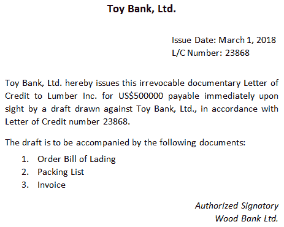
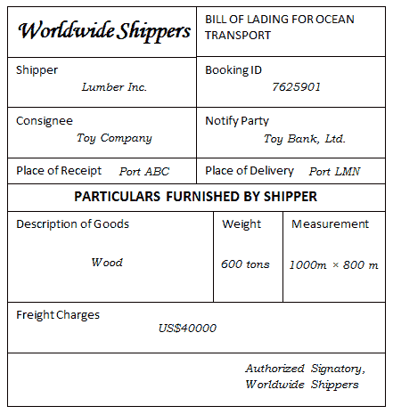
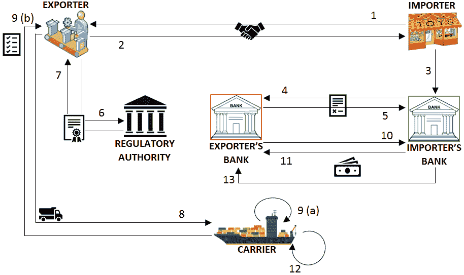
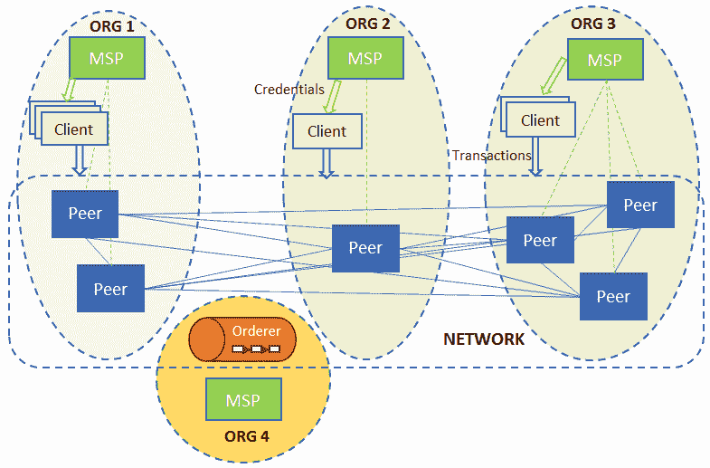
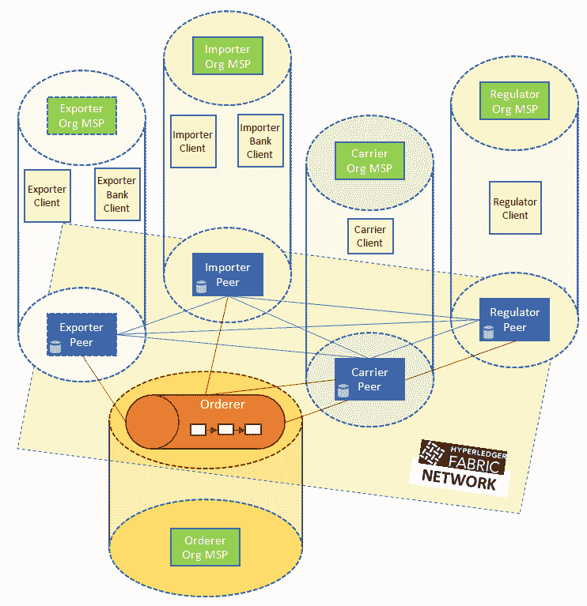

# 第三章：以业务场景为背景设定舞台

前两章着重于搭建一个区块链项目的舞台，并定义了一个业务框架和各种 Hyperledger 项目如何解决时间和信任问题。

通过了解构成 Hyperledger Fabric 的组件，我们现在将深入研究应用设计和实施方面的考虑。接下来的几章将带您完成创建自己的智能合约的步骤，然后将其集成到一个应用程序中。

为了使这些练习相关，我们将利用一个源自一些古老文明的业务用例：贸易和信用证。

本章的目标是介绍信用证的业务概念，带您走过我们选择的样例场景，并通过设置我们的开发环境来结束。

在本章中，我们将：

+   探索信用证

+   回顾我们简化的业务场景

+   设置我们的开发环境

# 贸易和信用证

退回到历史的某个时刻，当商人穿越大陆购买一国的布料去另一个国家出售时。作为佛罗伦萨的羊毛商人，你可能会前往阿姆斯特丹购买这个新成立的城邦的优质羊毛，该港口汇集了整个北欧乃至更远地区的资源。然后你可以将羊毛运到佛罗伦萨，在那里可以卖给为富有客户制作精美服装的裁缝。我们谈论的是公元 1300 年——这是一个携带黄金或其他贵重金属作为货币购买和出售商品不安全的时代。必需的是一种跨越国界的货币形式，可以在阿姆斯特丹和佛罗伦萨以及任何地方使用！

马可·波罗曾去过中国，看到了那个繁荣经济中的商业活动是如何进行的。在成功的可汗帝国的核心是我们今天会认识到的先进金融技术。法定货币、纸币、本票和信用证都是通过中国传入欧洲的。马可·波罗将这些想法带回了欧洲——它们帮助形成并发展了罗马帝国灭亡后新兴的欧洲的一个商业银行业。

# 信任在促进贸易中的重要性

现在我们的佛罗伦萨商人可以联系他的银行家，告诉他他想在阿姆斯特丹购买羊毛，银行将以账上付款的方式给他出具一张信用证。这封信可以有各种规定，例如交易的最大金额、如何支付（一次性或分期付款）、可以用于哪些商品等。商人现在将前往阿姆斯特丹，在羊毛商选择羊毛后，他将提供信用证作为付款。阿姆斯特丹商人会高兴地将羊毛与信用证交换，因为当涉及到金钱时，佛罗伦萨银行家在整个欧洲都以信誉良好而闻名。阿姆斯特丹商人可以将信用证带给他的银行家，后者将会给他的账户记入贷方。当然，佛罗伦萨和阿姆斯特丹的银行家都会向各自的客户——商人——收取这项服务的费用！这对每个人都有好处。

定期，阿姆斯特丹银行家和佛罗伦萨银行家会见面来结算账户，但这对于羊毛贸易商和羊毛商人来说毫无意义。事实上，发生的是佛罗伦萨和阿姆斯特丹商人利用各自银行家之间的信任来建立彼此之间的信任关系——这是一个非常复杂的想法，当你想一想就会明白。这就是为什么信用证流程至今仍然是全球业务的基本方式。

# 今日信用证流程

然而，随着贸易的大规模全球化和金融行业的爆炸性增长，参与信用证流程的金融机构数量激增！如今，可能有超过 20 家中介金融机构参与其中。这需要协调许多人和系统，从而导致整个过程对商家和银行都产生了过多的时间、成本和风险。

区块链的承诺是提供一个逻辑上单一但物理上分布式的系统，为低摩擦的信用证流程提供平台。这样的系统特征将包括更大的透明度、及时性和自动化（导致成本降低），以及增量支付等新特性。

# 商业场景和用例

国际贸易包括那些说明了区块链旨在减轻的现实世界流程中的低效率和不信任的情况。因此，我们选择了一个进口-出口场景的元素，其中包含在接下来几章的实际练习中进行的简化版本的交易作为我们的规范用例。

# 概述

我们将描述的情景涉及一笔简单的交易：从一方向另一方出售货物。由于买方和卖方住在不同的国家，这笔交易变得复杂，因此没有共同的可信介质来确保出口商得到承诺的款项以及进口商得到货物。今天世界上的贸易安排依赖于以下内容： 

+   促成付款和货物实际转移的中介

+   随着时间的推移已发展出来的流程，以使出口商和进口商对冲风险并降低风险

# 现实世界中的流程

促进支付和货物实际转移的中间人是出口商和进口商的各自银行。在这种情况下，贸易安排通过银行与其客户之间以及两家银行之间的信任关系来实现。这些银行通常具有国际联系和声誉需要维护。因此，进口商银行的承诺（或承诺）向出口商银行付款足以触发流程。出口商从出口国政府获得监管清关许可后，通过知名的国际承运人发运货物。

向承运人交付的交付证明足以使进口商银行向出口商银行清算付款，这种清算不取决于货物是否到达预定目的地（假设货物在运输过程中已经购买了丢失或损坏的保险）。进口商银行向出口商银行做出的支付承诺指定所需的一系列文件作为发运证明，以及立即或分期付款的具体支付方式。出口商必须在交付货物给承运人之前满足各种监管要求，以获得文件清关许可。

# 简化和修改过的流程

我们的用例将遵循前述流程的简化版本，带有某些变化以展示区块链在便利贸易方面的价值。进口商的银行向出口商的银行承诺支付两期付款。出口商从监管机构获得清关证书，将货物交由承运人，然后获得收据。收据的出具触发进口商银行向出口商银行支付第一期付款。当货物到达目的港口时，进行第二和最后一期的支付，流程结束。

# 贸易金融和物流中使用的术语

以下术语用于指代贸易场景中正在使用的某些工具和物品。我们在本章中构建的应用程序使用这些工具的非常简化形式：

+   **信用证**：正如我们在本章开头所见，这指的是银行承诺在出具货物装运的文件证明后向出口商付款。简称 L/C，此文件由进口商的银行根据其客户（进口商）的要求出具。L/C 列明了构成装运证明的文件清单、要支付的金额以及受益人（在我们的案例中为出口商）的金额。下图显示了一份样本 L/C：



我们将在我们的使用案例中引入一些小的变化，以使读者能够理解此工具。首先，信用证将由出口商的银行开具，而不是直接由出口商开具。其次，信用证规定支付将分两期进行，第一期在出具两份文件后支付，第二期在货物到达目的地后支付。

+   **出口许可证**：指出口国监管机构对指定货物的运输所给予的批准。在本书中，我们将其简称为 E/L。下图显示了一份样本 E/L：


+   **提单**：这是承运人在接收货物后向出口商出具的文件。简称 B/L，它同时起到收据、合同（约束承运人将货物运送到指定目的地以换取报酬）、货物所有权证明的作用。该文件也列在信用证中，并作为装运证明，将自动触发付款结清。下图显示了一份样本 B/L：



# 共享流程工作流程

本章节中呈现的每一个测试用例场景都需要很长时间才能完成，涉及不同时间段不同集合实体之间的互动，并且有许多不同的移动部分，很难跟踪。我们希望使用我们的工作流程来简化这个过程。在区块链上实施的交易序列描述如下步骤（并在下图中说明）可以以不可撤销和不可否认的方式进行。在这一事件序列中，我们假设一个笔直的、线性的叙述，各方互相达成协议，没有发生任何意外事件；过程中只内置了一些用于捕捉错误的保障。

我们工作流程中的交易如下所示：

1.  进口商请求出口商以货物换取货款

1.  出口商接受交易协议

1.  进口商向其银行要求开具一份有利于出口商的信用证

1.  进口商的银行向出口商提供一份有利于出口商且可支付给后者银行的 L/C

1.  出口商的银行代表出口商接受信用证

1.  出口商向监管机构申请 E/L

1.  监管机构向出口商提供 E/L

1.  出口商准备了一批货物并交给承运人

1.  承运人在验证 E/L 后接受货物，然后向出口商提供 B/L

1.  出口商的银行向进口商的银行索取一半支付款

1.  进口商的银行将一半金额转账给出口商的银行

1.  承运人将货物运送到目的地

1.  进口商的银行向出口商的银行支付剩余金额

这是一个解释交易流程的图表：



# 共享资产和数据

上一个工作流程中的参与者必须有一些共同的信息，让他们能够随时查看交易安排及其进展。

以下是参与者拥有的资产表，这些资产与其他人共享，驱动流程从一阶段到下一阶段。这包括文件和货币资产：

| **资产类型** | **资产属性** |
| --- | --- |
| 信用证 | ID、发行日期、到期日期、发行方、受益人、金额和文件列表 |
| 提单 | ID、发货人（出口商）、收货人（进口商）、通知方（进口商的银行）、收发货地点、货物描述和运费金额 |
| 出口许可证 | ID、发行日期、到期日期、受益人、许可证持有者和货物描述 |
| 付款 | 标准货币单位金额 |

以下是界定参与者在每个阶段可选择的选择的数据元素：

| **数据类型** | **数据属性** |
| --- | --- |
| 贸易协议 | 进口商请求，出口商接受 |
| 信用证 | 进口商请求，进口商银行发行，出口商银行接受 |
| 出口许可证 | 请求者是出口商，由监管机构发行 |
| 货物运输 | 出口商准备，承运人接受，当前位置或地点 |

# 参与者的角色和能力

在我们的场景中有六类参与者：出口商、进口商、出口商银行、进口商银行、承运人和监管机构。这个集合中的术语指的是实体在贸易交易中可以承担的角色；例如，一家公司在一次出口货物交易中可能是进口商。每个角色的能力和限制也在以下列表中详细说明：

+   只有进口商可以申请 L/C

+   只有进口商的银行可以提供 L/C

+   只有出口商的银行可以接受 L/C

+   只有出口商才能请求 E/L

+   只有监管机构才能提供 E/L

+   只有出口商可以准备货物

+   只有承运人可以提供 B/L

+   只有承运人可以更新货物位置

+   只有进口商的银行可以汇款，只有出口商的银行可以接收款项

# 区块链应用的优势超过当前现实世界的流程

在缺乏保障的情况下转移货物或进行支付所固有的风险（如缺乏可信的调解者）催生了银行的参与，并导致信用证和提单的产生。这些过程的一个结果不仅仅是额外的成本（银行要收取佣金来发行信用证），或者额外的开支。申请和等待授予出口许可证也会增加周转时间。在理想的贸易场景中，只有准备和运输货物的过程需要时间。最近，采用 SWIFT 消息传递比手动通信更高效，但并没有从根本上改变游戏规则。另一方面，区块链几乎即时的交易承诺和保证拓展了以前不存在的可能性。

作为示例，我们在我们的应用场景中引入的一个变化是分期付款，这在传统框架中无法实现，因为没有一种可靠的方式来了解和共享关于货物进展的信息。在这种情况下，这样的变化被认为是太过风险，这就是为什么支付纯粹与文件证据相关联。通过让交易协议中的所有参与方在一个共同的区块链上实施一个公共智能合同，我们可以提供一个共享的真实性来源，从而最小化风险，同时增加问责制。

在接下来的章节中，我们将详细演示我们的应用是如何在 Hyperledger Fabric 和 Composer 平台上实现的。读者将能够欣赏实现的简单性和优雅性，然后可以将其用作指南，来重塑其他应用的古老流程，利用这一激动人心的新技术。然而，在跳入代码之前，我们将研究 Hyperledger 网络的设计，并设置我们的开发环境。

# 设置开发环境

正如你现在已经知道的那样，Hyperledger Fabric 区块链的一个实例被称为通道，它是以加密方式相互关联的交易日志。要设计和运行区块链应用程序，第一步是确定需要多少个通道。对于我们的贸易应用程序，我们将使用一个通道，它将维护不同参与方之间进行的交易历史记录。

一个 Fabric 节点可能属于多个通道，从应用程序的角度来看，这些通道彼此毫无所知，但它们帮助单个节点代表其所有者（或客户）在不同应用程序中运行交易。一个通道可以运行多个智能合约，每个智能合约可以是独立的应用程序，或者链接在一起形成多合约应用程序。在本章和本书中，我们将为读者介绍一个简单的单通道、单合约应用程序的设计。读者可以根据本书提供的信息以及 Fabric 文档设计更复杂的应用程序。

在我们深入了解如何设置系统以安装应用程序并在智能合约上运行交易的机制之前，我们将描述如何创建和启动一个网络，该网络将安装应用程序。本章将使用一个样本网络结构来说明贸易操作（在第九章，*区块链网络中的生活*，您将看到如何根据需求的变化和发展修改此样本网络）。

# 设计网络

为了确定一个 Hyperledger Fabric 网络结构以供应用程序使用，第一步是列出参与的组织。在逻辑上，一个组织是一个安全域和身份与凭证的单位。它管理一个或多个网络节点，并依赖于一个**成员服务提供商**（**MSP**）为节点和智能合约访问权限的客户颁发身份和证书。订购服务是 Fabric 网络的基石，通常被分配给一个独立的组织。下图说明了一个典型的节点网络结构，其中包括客户端、MSP 和逻辑组织分组。

交易（或调用）批准的标准是一个背书策略（我们将在本章后面重新讨论）。它是根据参与应用程序网络的组织来制定的，而不是节点本身。



图 3.1：区块链网络，节点分布在各个组织之间，客户端从组织获取凭证，以提交查询和调用链代码

必须提前决定一组节点、它们所属的组织以及为每个组织提供服务的成员服务提供商，以便在这些机器上安装和运行适当的服务。

我们的示例贸易网络将由四个组织组成，分别代表出口商、进口商、承运商和监管机构。后两者分别代表承运商和监管实体。然而，出口商组织既代表出口实体又代表其银行。同样地，进口商组织代表进口实体和其银行。将信任的实体与其交易方分组到单一组织中，从安全和成本的角度来看都是有意义的。运行一个 Fabric 节点是一个沉重且昂贵的业务，因此让拥有更多资源和大量客户的银行代表自身和其客户运行这样的节点是足够的。一个贸易实体在其组织中以客户端的角色获得提交交易或读取账本状态的权利。因此，我们的区块链网络需要四个同行，各自属于不同的组织。除了同行，我们的网络包括每个组织的一个 MSP，以及以单独模式运行的排序服务。

在生产应用中，排序服务应该作为 Zookeeper 上的 Kafka 集群设置，但为了展示如何构建区块链应用程序，排序服务可以被视为一个黑盒子。

排序服务属于自己的独立组织，带有一个 MSP。我们贸易网络的组织、其 MSP、同行和客户端在下面的图表中展示：



图 3.2：一个贸易网络，包括同行、排序者和各自组织中的客户端。

读者可能会想，如果一个贸易方和其银行属于同一个组织，那么应用程序如何区分两者（出口商和出口商的银行，以及进口商和进口商的银行），以控制对智能合约和账本的访问。这可以通过以下两种方式实现：

+   嵌入中间件和应用层（我们将在本章后面描述）中的访问控制逻辑，用户可以通过其 ID（或登录名）区分，并维护将 ID 映射到允许的链码功能的访问控制列表。

+   让一个组织的 MSP 作为 CA 服务器，嵌入其为组织成员颁发的证书中的区别属性。访问控制逻辑可以在中间件或链码中实现，以解析属性，并根据应用程序政策允许或拒绝操作。

这些机制没有在我们的应用中实现，其中银行家和客户对智能合约和中间件层来说是无法区分的。但读者可以将其视为一种练习，对于熟练于开发安全客户端-服务器应用程序的人来说，这应该是直截了当的。

# 安装先决条件。

在手持网络设计的情况下，让我们安装先决工具：

1.  确保您拥有最新版本的：

    +   使用 [`docs.docker.com/install/`](https://docs.docker.com/install/) 安装 Docker。

    +   使用 Docker-Compose：[`docs.docker.com/compose/install/`](https://docs.docker.com/compose/install/)

1.  我们将使用 GitHub 来共享教程的源代码。要访问 GitHub，需要安装 Git 客户端，并配置身份验证到 GitHub。有关更多信息，请访问 GitHub 的官方网站[`help.github.com/articles/set-up-git/`](https://help.github.com/articles/set-up-git/)。

1.  安装业务网络示例所需的软件：[`hyperledger.github.io/composer/latest/installing/installing-prereqs`](https://hyperledger.github.io/composer/latest/installing/installing-prereqs)。

    上述说明适用于 Mac 和 Linux。请注意，在使用 Windows 时，我们建议使用像 Vagrant 这样的解决方案在虚拟机中运行开发环境。

1.  Fabric 是用 Go 语言实现的。请注意：

    +   Go 在语法上与 C++ 类似。

    +   我们还将使用 Go 来编写链代码。

    +   Go 可以从[`golang.org/`](https://golang.org/)安装。

请注意，本书中的 Hyperledger Fabric 设置和教程应用程序的测试是使用 Go 1.9 完成的，因此建议读者安装并使用 1.9 或更高版本。

1.  接下来，我们需要设置环境变量。

`GOPATH` 指向`go`源代码的工作空间，例如：

```
         $ export GOPATH=$HOME/go 
```

`PATH` 需要包括用于存储库和可执行文件的 Go `bin` 目录，如下面的代码片段所示：

```
         $ export PATH=$PATH:$GOPATH/bin 
```

1.  验证系统上是否安装了 `make`。在 Debian/Ubuntu 系统上，您可以使用 `sudo apt-get install make` 安装它。

# 分叉并克隆贸易融资物流存储库

现在，我们需要通过在 GitHub 上分叉存储库来获取原始源代码的副本。然后，我们可以使用以下步骤将源代码克隆到本地机器目录中：

1.  **在 GitHub 中导航到以下存储库**：[`github.com/HyperledgerHandsOn/trade-finance-logistics`](https://github.com/HyperledgerHandsOn/trade-finance-logistics)

1.  **分叉存储库**：使用页面右上角的分叉按钮创建源代码的副本到您的帐户

1.  **获取克隆 URL**：导航到贸易融资物流存储库的您的分叉。单击“克隆或下载”按钮，并复制 URL。

1.  **克隆存储库**：在 Go 工作空间中，按以下方式克隆存储库：

```
$ cd $GOPATH/src 
$ git clone https://github.com/YOUR-USERNAME/trade-finance-logistics
```

现在我们有了所有贸易融资物流教程材料的本地副本。

# 创建和运行网络配置

配置和启动我们网络的代码可以在我们存储库的 network 文件夹中找到（这是 [fabric-samples/first-network](https://github.com/hyperledger/fabric-samples/tree/master/first-network) 的一个改编）。在本次练习中，我们将在单个物理或虚拟机上运行整个网络，各种网络元素在适当配置的 Docker 容器中运行。假设读者对使用 Docker 进行容器化和使用 Docker-compose 进行配置有基本的了解。一旦满足前一节中列出的先决条件，只需运行该节中的命令，无需读者具备额外的知识或配置。

# 准备网络

要构建 Fabric 和 Fabric-CA，如果缺少某些依赖项，您可能需要安装某些依赖项。这些包括 `gcc`、`libtool` 和 `ltdl` 库。（在 Ubuntu Xenial 系统上，可以通过运行 `sudo apt-get install libltdl-dev` 安装所有必要的先决条件。读者需要在其他系统上寻找相应的等效物）。在生成网络加密材料之前，我们需要执行以下步骤。

教程应用是在 Hyperledger Fabric 版本 1.1 上开发的，因此您需要获取和构建该版本的组件。

1.  克隆 Fabric ([`github.com/hyperledger/fabric/tree/release-1.1`](https://github.com/hyperledger/fabric/tree/release-1.1)) 源代码存储库。如果您使用 `git clone` 命令，请添加参数 `-b release-1.1`。确保克隆的 `fabric` 文件夹存在于 `$GOPATH/src/github.com/hyperledger/` 中，或者在该路径中创建符号链接。当您尝试构建 Fabric 时，它将在此路径中查找库。

1.  运行 `make docker` 来为对等方和排序者构建 Docker 镜像。

1.  运行 `make configtxgen cryptogen` 来生成运行本节描述的网络创建命令所需的必要工具。

1.  克隆 Fabric-CA ([`github.com/hyperledger/fabric-ca/tree/release-1.1`](https://github.com/hyperledger/fabric-ca/tree/release-1.1)) 源代码存储库。（如果您使用 `git clone` 命令，请添加参数 `-b release-1.1`。确保克隆的 `fabric-ca` 文件夹存在于 `$GOPATH/src/github.com/hyperledger/` 中，或者在该路径中创建符号链接。当您尝试构建 Fabric-CA 时，它将在此路径中查找库。

1.  运行 `make docker` 来构建 MSPs 的 Docker 镜像。

# 生成网络加密材料

配置网络的第一步涉及为每个对等方和订购方组织的 MSP 以及基于 TLS 的通信创建证书和签名密钥。我们还需要为每个对等方和订购方节点创建证书和密钥，以便能够彼此通信以及与各自的 MSP 通信。这个配置必须在我们的代码库中的`network`文件夹中的`crypto-config.yaml`文件中指定。该文件包含组织结构（稍后在通道工件配置部分中更多细节），每个组织中对等方的数量以及必须为其中的每个用户创建证书和密钥的默认数量（请注意，默认情况下会创建一个`admin`用户）。例如，请参阅文件中 Importer 组织的定义如下：

```
PeerOrgs:
- Name: ImporterOrg
  Domain: importerorg.trade.com
  EnableNodeOUs: true
  Template:
    Count: 1
  Users:
    Count: 2
```

此配置指示标记为`ImporterOrg`的组织将包含一个对等方。还将创建两个非管理员用户。还定义了对等方要使用的组织域名。

要为所有组织生成加密材料，请执行以下`cryptogen`命令：

```
cryptogen generate --config=./crypto-config.yaml
```

输出保存在`crypto-config`文件夹中。

# 生成通道工件

为了按照组织的结构创建网络，并引导一个通道，我们需要生成以下工件：

+   初始块，包含用于初始化 Fabric 区块链的组织特定证书。

+   通道配置信息。

+   每个组织的锚定对等配置。锚定对等在组织内部充当支点，使用 Fabric 八卦协议进行跨组织账本同步。

与`crypto-config.yaml`文件类似，通道属性在一个名为`configtx.yaml`的文件中指定，在我们的源代码中可以在`network`文件夹中找到。我们贸易网络的高级组织如下所示：

```
Profiles:
  FourOrgsTradeOrdererGenesis:
    Capabilities:
      <<: *ChannelCapabilities
    Orderer:
      <<: *OrdererDefaults
      Organizations:
        - *TradeOrdererOrg
      Capabilities:
        <<: *OrdererCapabilities
    Consortiums:
      TradeConsortium:
        Organizations:
          - *ExporterOrg
          - *ImporterOrg
          - *CarrierOrg
          - *RegulatorOrg
  FourOrgsTradeChannel:
    Consortium: TradeConsortium
    Application:
      <<: *ApplicationDefaults
      Organizations:
        - *ExporterOrg
        - *ImporterOrg
        - *CarrierOrg
        - *RegulatorOrg
      Capabilities:
        <<: *ApplicationCapabilities
```

正如我们所看到的，我们要创建的通道被命名为`FourOrgsTradeChannel`，在配置文件中定义。参与此通道的四个组织被标记为`ExporterOrg`，`ImporterOrg`，`CarrierOrg`和`RegulatorOrg`，每个组织都引用了`Organizations`部分中定义的子部分。订购方属于自己的组织称为`TradeOrdererOrg`。每个组织部分包含有关其 MSP 的信息（ID 以及加密材料的位置，如密钥和证书），以及其锚定对等方的主机名和端口信息。例如，`ExporterOrg`部分包含以下内容：

```
- &ExporterOrg
  Name: ExporterOrgMSP
  ID: ExporterOrgMSP
  MSPDir: crypto-config/peerOrganizations/exporterorg.trade.com/msp
  AnchorPeers:
    - Host: peer0.exporterorg.trade.com
    Port: 7051
```

正如你所看到的，这个规范中的`MSPDir`变量（表示一个文件夹）引用了我们之前使用`cryptogen`工具生成的加密材料。

要生成通道文件，我们使用`configtxgen`工具。要生成创世区块（将在网络引导期间发送到 orderer），请从`network`文件夹运行以下命令：

```
configtxgen -profile FourOrgsTradeOrdererGenesis -outputBlock ./channel-artifacts/genesis.block
```

`FourOrgsTradeOrdererGenesis`关键字对应于`Profiles`部分中的配置文件名称。创世区块将保存在`channel-artifacts`文件夹中的`genesis.block`文件中。要生成通道配置，请运行以下代码：

```
configtxgen -profile FourOrgsTradeChannel -outputCreateChannelTx ./channel-artifacts/channel.tx -channelID tradechannel
```

我们将创建的通道名为`tradechannel`，其配置存储在`channel-artifacts/channel.tx`中。要生成出口者组织的锚定 peer 配置，请运行：

```
configtxgen -profile FourOrgsTradeChannel -outputAnchorPeersUpdate ./channel-artifacts/ExporterOrgMSPanchors.tx -channelID tradechannel -asOrg ExporterOrgMSP
```

对于其他三个组织，应重复相同的过程，并在先前的命令中更改组织名称。

必须将环境变量`FABRIC_CFG_PATH`设置为指向包含`configtx.yaml`文件的文件夹，以便`configtxgen`工具正常工作。我们稍后将使用的`trade.sh`脚本文件包含以下行以确保从运行命令的文件夹加载`YAML`文件：

`export FABRIC_CFG_PATH=${PWD}`

# 在一个操作中生成配置

为了方便起见，`trade.sh`脚本已配置为使用先前描述的命令和配置文件生成通道文件以及加密材料。只需从`network`文件夹中运行以下命令：

```
./trade.sh generate -c tradechannel
```

虽然您可以在这里指定任何通道名称，但请注意，本章后面用于开发中间件的配置将依赖于该名称。

`GOPATH`变量在运行 peer 的容器中设置为`/opt/gopath`。

# 组合一个样例交易网络

最后一个命令还具有生成网络配置文件`docker-compose-e2e.yaml`的效果，该文件用于使用 docker-compose 工具在一组 Docker 容器中启动网络。文件本身依赖于静态配置文件`base/peer-base.yaml`和`base/docker-compose-base.yaml`。这些文件共同指定服务及其属性，并使我们能够一次性在 Docker 容器中运行它们，而不是在一个或多个机器上手动运行这些服务的实例。我们需要运行的服务如下：

+   四个 Fabric peer 实例，每个组织一个

+   一个 Fabric orderer 实例

+   五个 Fabric CA 实例，对应于每个组织的 MSP

每个都可以从 Docker Hub 上的 Hyperledger 项目（[`hub.docker.com/u/hyperledger/`](https://hub.docker.com/u/hyperledger/)）获取 Docker 镜像，其中镜像分别为`hyperledger/fabric-peer`、`hyperledger/fabric-orderer`、`hyperledger/fabric-ca for peers`、`orderers`和`MSPs`。

一个 peer 的基本配置可以如下（参见`base/peer-base.yaml`）：

```
peer-base:
image: hyperledger/fabric-peer:$IMAGE_TAG
environment:
  - CORE_VM_ENDPOINT=unix:///host/var/run/docker.sock
  - CORE_VM_DOCKER_HOSTCONFIG_NETWORKMODE=${COMPOSE_PROJECT_NAME}_trade
  - CORE_LOGGING_LEVEL=INFO
  - CORE_PEER_TLS_ENABLED=true
  - CORE_PEER_GOSSIP_USELEADERELECTION=true
  - CORE_PEER_GOSSIP_ORGLEADER=false
  - CORE_PEER_PROFILE_ENABLED=true
  - CORE_PEER_TLS_CERT_FILE=/etc/hyperledger/fabric/tls/server.crt
  - CORE_PEER_TLS_KEY_FILE=/etc/hyperledger/fabric/tls/server.key
  - CORE_PEER_TLS_ROOTCERT_FILE=/etc/hyperledger/fabric/tls/ca.crt
working_dir: /opt/gopath/src/github.com/hyperledger/fabric/peer
command: peer node start
```

Fabric 配置参数可以在此设置，但如果您使用`fabric-peer`的预构建 Docker 映像，则默认设置足以运行对等方服务。在配置的最后一行指定运行对等方服务的命令为`peer node start`；如果您希望通过下载 Fabric 源代码并在本地机器上构建来运行对等方，则这是您将要运行的命令（有关示例，请参见*Chapter 4*，*使用 Golang 设计数据和事务模型*）。还请确保使用`CORE_LOGGING_LEVEL`变量适当配置日志级别。在我们的配置中，该变量设置为`INFO`，这意味着仅记录信息、警告和错误消息。如果您希望调试对等方并需要更广泛的日志记录，请将此变量设置为`DEBUG`。

`IMAGE_TAG`变量在`network`文件夹中的`.env`文件中设置为 latest，尽管如果您希望拉取旧的映像，可以设置特定的标签。

此外，我们需要为每个对等方配置主机名和端口，并将使用`cryptogen`生成的加密材料同步到容器文件系统。导出器组织中的对等方在`base/docker-compose-base.yaml`中配置如下：

```
peer0.exporterorg.trade.com:
  container_name: peer0.exporterorg.trade.com
  extends:
    file: peer-base.yaml
    service: peer-base
  environment:
    - CORE_PEER_ID=peer0.exporterorg.trade.com
    - CORE_PEER_ADDRESS=peer0.exporterorg.trade.com:7051
    - CORE_PEER_GOSSIP_BOOTSTRAP=peer0.exporterorg.trade.com:7051
    - CORE_PEER_GOSSIP_EXTERNALENDPOINT=peer0.exporterorg.trade.com:7051
    - CORE_PEER_LOCALMSPID=ExporterOrgMSP
  volumes:
    - /var/run/:/host/var/run/
    - ../crypto-config/peerOrganizations/exporterorg.trade.com/peers/peer0.exporterorg.trade.com/msp:/etc/hyperledger/fabric/msp
    - ../crypto-config/peerOrganizations/exporterorg.trade.com/peers/peer0.exporterorg.trade.com/tls:/etc/hyperledger/fabric/tls
    - peer0.exporterorg.trade.com:/var/hyperledger/production
  ports:
    - 7051:7051
    - 7053:7053
```

正如`extends`参数所示，这扩展了基本配置。注意，ID（`CORE_PEER_ID`）与`configtx.yaml`中为此对等方指定的 ID 相匹配。该标识是运行在导出器组织中的对等方的主机名，并且稍后在本章的中间件代码中将使用它。卷部分指示将在`crypto-config`文件夹中生成的加密材料复制到容器的规则。对等方服务本身侦听端口`7051`，客户端用于订阅事件的端口设置为`7053`。

在文件中，您会看到容器内端口在对等方之间是相同的，但映射到主机机器上的端口是不同的。最后，请注意，此处指定的 MSP ID 也与`configtx.yaml`中指定的相匹配。

订购者服务的配置类似，如`base/docker-compose-base.yaml`中的以下片段所示：

```
orderer.trade.com:
  container_name: orderer.trade.com
  image: hyperledger/fabric-orderer:$IMAGE_TAG
  environment:
    - ORDERER_GENERAL_LOGLEVEL=INFO
  ……
  command: orderer
  ……
```

启动订购者的命令很简单，就像代码所示的那样是`orderer`。日志级别可以使用`ORDERER_GENERAL_LOGLEVEL`变量进行配置，在我们的配置中设置为`INFO`。

我们将要运行的实际网络配置是基于一个名为`docker-compose-e2e.yaml`的文件。这个文件并不在存储库中，而是通过我们先前运行的`./trade.sh generate -c tradechannel`命令创建的。这个文件依赖于`base/docker-compose-base.yaml`（间接地也依赖于`base/peer-base.yaml`），你可以通过检查文件内容来看到。它实际上是从一个名为`docker-compose-e2e-template.yaml`的`YAML`模板文件创建的，你可以在`network`文件夹中找到。模板文件包含变量作为`cryptogen`生成的关键文件的代理。当`docker-compose-e2e.yaml`被生成时，这些变量名称会被实际文件名替换，这些文件存在于`crypto-config`文件夹中。

例如，考虑`docker-compose-e2e-template.yaml`中的`exporter-ca`部分：

```
exporter-ca:
  image: hyperledger/fabric-ca:$IMAGE_TAG
  environment:
    ……
    - FABRIC_CA_SERVER_TLS_KEYFILE=/etc/hyperledger/fabric-ca-server-config/EXPORTER_CA_PRIVATE_KEY
  ……
  command: sh -c 'fabric-ca-server start --ca.certfile /etc/hyperledger/fabric-ca-server-config/ca.exporterorg.trade.com-cert.pem --ca.keyfile /etc/hyperledger/fabric-ca-server-config/EXPORTER_CA_PRIVATE_KEY -b admin:adminpw -d'
```

现在，看看在生成的文件`docker-compose-e2e.yaml`中的相同部分：

```
exporter-ca:
  image: hyperledger/fabric-ca:$IMAGE_TAG
  environment:
    ……
    - FABRIC_CA_SERVER_TLS_KEYFILE=/etc/hyperledger/fabric-ca-server-config/ cc58284b6af2c33812cfaef9e40b8c911dbbefb83ca2e7564e8fbf5e7039c22e_sk
  ……
  command: sh -c 'fabric-ca-server start --ca.certfile /etc/hyperledger/fabric-ca-server-config/ca.exporterorg.trade.com-cert.pem --ca.keyfile /etc/hyperledger/fabric-ca-server-config/cc58284b6af2c33812cfaef9e40b8c911dbbefb83ca2e7564e8fbf5e7039c22e_sk -b admin:adminpw -d'
```

如你所见，环境变量和命令中的变量`EXPORTER_CA_PRIVATE_KEY`已被替换为`cc58284b6af2c33812cfaef9e40b8c911dbbefb83ca2e7564e8fbf5e7039c22e_sk`。如果你现在检查`crypto-config`文件夹的内容，你会注意到在`crypto-config/peerOrganizations/exporterorg.trade.com/ca/`文件夹中存在一个名为`cc58284b6af2c33812cfaef9e40b8c911dbbefb83ca2e7564e8fbf5e7039c22e_sk`的文件。这个文件包含了出口商组织 MSP 的私（秘密）签名密钥。

前述的代码片段包含了一个样本运行的结果。每当你运行加密材料生成工具时，关键文件名将会有所变化。

让我们现在更详细地看一下 MSP 的配置，以出口商组织 MSP 为例，如`docker-compose-e2e.yaml`中所指定的那样：

```
exporter-ca:
  image: hyperledger/fabric-ca:$IMAGE_TAG
  environment:
    - FABRIC_CA_HOME=/etc/hyperledger/fabric-ca-server
    - FABRIC_CA_SERVER_CA_NAME=ca-exporterorg
    - FABRIC_CA_SERVER_TLS_ENABLED=true
    - FABRIC_CA_SERVER_TLS_CERTFILE=/etc/hyperledger/fabric-ca-server-config/ca.exporterorg.trade.com-cert.pem
    - FABRIC_CA_SERVER_TLS_KEYFILE=/etc/hyperledger/fabric-ca-server-config/cc58284b6af2c33812cfaef9e40b8c911dbbefb83ca2e7564e8fbf5e7039c22e_sk
  ports:
    - "7054:7054"
  command: sh -c 'fabric-ca-server start --ca.certfile /etc/hyperledger/fabric-ca-server-config/ca.exporterorg.trade.com-cert.pem --ca.keyfile /etc/hyperledger/fabric-ca-server-config/cc58284b6af2c33812cfaef9e40b8c911dbbefb83ca2e7564e8fbf5e7039c22e_sk -b admin:adminpw -d'
  volumes:
    - ./crypto-config/peerOrganizations/exporterorg.trade.com/ca/:/etc/hyperledger/fabric-ca-server-config
  container_name: ca_peerExporterOrg
  networks:
    - trade
```

将在 MSP 中运行的服务是`fabric-ca-server`，监听端口`7054`，使用`cryptogen`创建的证书和密钥进行引导，并使用`fabric-ca`镜像中配置的默认登录名和密码（分别为`admin`和`adminpw`）。启动一个 Fabric CA 服务器实例的命令是`fabric-ca-server start ...`，如你在前述代码中所看到的。

同样，对等方和 CA 都配置为基于 TLS 的通信，正如前述配置所示。读者必须注意，如果一个地方禁用了 TLS，另一个地方也必须禁用 TLS。

同样，通过检查`docker-compose-e2e.yaml`，我们可以看到，我们没有为订购方的组织创建 Fabric CA 服务器（和容器）。对于在本书中要进行的练习，静态创建的管理用户和订购者的凭据足够了；我们不会动态注册新的订购者组织用户，所以不需要 Fabric CA 服务器。

# 网络组件的配置文件

我们已经演示了如何在 docker-compose YAML 文件中配置对等方、订购者和 CA。但是这些配置意味着覆盖了组件的默认设置。虽然这些配置的详细说明超出了本书的范围，但我们将列出各自的文件并提及用户如何对其进行更改。

对于一个对等方，一个名为 `core.yaml` 的文件（[`github.com/hyperledger/fabric/blob/release-1.1/sampleconfig/core.yaml`](https://github.com/hyperledger/fabric/blob/release-1.1/sampleconfig/core.yaml)）包含了所有重要的运行时设置，包括但不限于地址、端口号、安全和隐私以及八卦协议。您可以创建自己的文件并使用自定义 `Dockerfile` 将其同步到容器中，而不是使用默认的 `hyperledger/fabric-peer` 镜像。如果您登录到一个正在运行的对等方容器（让我们从我们刚刚启动的网络中取出 Exporter 组织的对等方容器）：

```
docker exec -it f86e50e6fc76 bash
```

然后您将在文件夹 `/etc/hyperledger/fabric/` 中找到 `core.yaml` 文件。

类似地，订购者的默认配置位于一个名为 `orderer.yaml` 的文件中（[`github.com/hyperledger/fabric/blob/release-1.1/sampleconfig/orderer.yaml`](https://github.com/hyperledger/fabric/blob/release-1.1/sampleconfig/orderer.yaml)），该文件也与运行 `hyperledger/fabric-orderer` 镜像的容器中的 `/etc/hyperledger/fabric/` 同步。请注意，`core.yaml` 和 `orderer.yaml` 文件都同步到对等方和订购者容器，因此，如果您希望创建自定义文件，则需要将这些 YAML 文件同步到这两个容器。

Fabric CA 服务器还有一个名为 `fabric-ca-server-config.yaml` 的配置文件（[`hyperledger-fabric-ca.readthedocs.io/en/latest/serverconfig.htm`](http://hyperledger-fabric-ca.readthedocs.io/en/latest/serverconfig.htm)），它与运行 `hyperledger/fabric-ca` 镜像的容器中的 `/etc/hyperledger/fabric-ca-server/` 同步。您可以像为对等方或订购者创建和同步自定义配置一样创建和同步自定义配置。

# 启动示例交易网络

因此，现在我们已经有了网络的所有配置，以及运行所需的通道工件和加密材料，我们所需做的就是使用 `docker-compose` 命令启动网络，如下所示：

```
docker-compose -f docker-compose-e2e.yaml up
```

您可以将此作为后台进程运行，并将标准输出重定向到 `log` 文件，如果您愿意的话。否则，您将看到各种容器启动和每个容器的日志显示在控制台上。

请注意，在某些操作系统配置中，设置 Fabric 可能会有些棘手。如果遇到问题，请查阅文档。有关如何安装 Fabric 网络以及示例的详细说明，请访问 [`hyperledger-fabric.readthedocs.io/en/release-1.1/samples.html`](https://hyperledger-fabric.readthedocs.io/en/release-1.1/samples.html)。

网络也可以使用我们的 trade.sh 脚本在后台启动；只需运行：

```
./trade.sh up
```

从另一个终端窗口，如果您运行 `docker ps -a`，您将看到以下内容：

```
CONTAINER ID    IMAGE    COMMAND    CREATED    STATUS    PORTS    NAMES
4e636f0054fc    hyperledger/fabric-peer:latest    "peer node start"    3 minutes ago    Up 3 minutes    0.0.0.0:9051->7051/tcp, 0.0.0.0:9053->7053/tcp    peer0.carrierorg.trade.com
28c18b76dbe8    hyperledger/fabric-peer:latest    "peer node start"    3 minutes ago    Up 3 minutes    0.0.0.0:8051->7051/tcp, 0.0.0.0:8053->7053/tcp    peer0.importerorg.trade.com
9308ad203362    hyperledger/fabric-ca:latest    "sh -c 'fabric-ca-se..."    3 minutes ago    Up 3 minutes    0.0.0.0:7054->7054/tcp    ca_peerExporterOrg
754018a3875e    hyperledger/fabric-ca:latest    "sh -c 'fabric-ca-se..."    3 minutes ago    Up 3 minutes    0.0.0.0:8054->7054/tcp    ca_peerImporterOrg
09a45eca60d5    hyperledger/fabric-orderer:latest    "orderer"    3 minutes ago    Up 3 minutes    0.0.0.0:7050->7050/tcp    orderer.trade.com
f86e50e6fc76    hyperledger/fabric-peer:latest    "peer node start"    3 minutes ago    Up 3 minutes    0.0.0.0:7051->7051/tcp, 0.0.0.0:7053->7053/tcp    peer0.exporterorg.trade.com
986c478a522a    hyperledger/fabric-ca:latest    "sh -c 'fabric-ca-se..."    3 minutes ago    Up 3 minutes    0.0.0.0:9054->7054/tcp    ca_peerCarrierOrg
66f90036956a    hyperledger/fabric-peer:latest    "peer node start"    3 minutes ago    Up 3 minutes    0.0.0.0:10051->7051/tcp, 0.0.0.0:10053->7053/tcp    peer0.regulatororg.trade.com
a6478cd2ba6f    hyperledger/fabric-ca:latest    "sh -c 'fabric-ca-se..."    3 minutes ago    Up 3 minutes 0.0.0.0:10054->7054/tcp    ca_peerRegulatorOrg
```

我们有四个对等节点、四个 MSP 和一个运行在不同容器中的订购者。我们的交易网络已经启动并准备运行我们的应用程序！

要查看给定容器的运行日志，请注意容器 ID（上述列表中的第一列），然后简单运行：

```
docker logs <container-ID>
```

若要关闭网络，您可以使用 docker-compose 命令：

`docker-compose -f docker-compose-e2e.yaml down`

或者我们的 `trade.sh` 脚本：

`./trade.sh down`

# 总结

在本章中，我们介绍了我们后续章节将利用的业务用例，以便为我们将要编写的代码创建一个上下文。我们还部署了我们的第一个 Hyperledger Fabric 网络，现在已经从理论转向实践。干得好！

下一章将从两个角度带您了解区块链应用程序的开发：（1）使用链码和 Fabric SDK 的基础 API （2）使用 Hyperledger Composer 的业务网络实现。

通过这两个角度，我们希望能让您了解解决方案的灵活性以及在正确环境中利用每个工具的能力。要为下一章做好准备，您现在应该使用 `./trade.sh` down 停止您的网络。
