# 一个业务网络示例

在本章中，我们将使用一个真实的示例业务网络，结合我们讨论过的所有概念。具体来说，我们将详细介绍 Hyperledger Composer 信用证示例，以便您了解参与者、资产、交易和事件如何在代码中实现。我们将展示业务网络如何被使用、分析、定义，以及如何使用该定义生成 API、测试它们，并将它们集成到示例应用程序中。这将是一个全面的导览，将让您从概念直接进入实施。我们将使用信用证示例，因为它代表了一个经常在区块链相关讨论中被讨论的众所周知的过程。让我们先讨论一下这个流程，然后看看为什么它被用作宣传样例。

# 信用证示例

因此，我们来到了我们的示例。Alice，意大利 QuickFix IT 的所有者，希望从在美国经营 Conga Computers 的 Bob 那里购买计算机。Alice 将从她的银行 Dinero Bank 申请信用证，这将被 Bob 的银行 Eastwood Banks 接受作为支付形式。

我们将使用在[`github.com/hyperledger/composer-sample-applications`](https://github.com/hyperledger/composer-sample-applications)找到的信用证示例应用程序尝试整个流程。该存储库包含多个业务网络的示例应用程序-我们将使用信用证示例。

# 安装示例

如果你遵循了*第三章*中的步骤，*使用业务场景做准备*，你应该已经完成了所有先决条件。现在，在你的 GitHub 账户中 fork 一个样例应用程序的存储库（[`github.com/hyperledger/composer-sample-applications`](https://github.com/hyperledger/composer-sample-applications)），然后使用以下命令将其克隆到你的本地计算机：

```
cd <your local git directory>
git clone git@github.com:<your github name>/composer-sample-applications.git

```

导航到相应的目录，并使用以下命令安装信用证示例应用程序。应用程序下载和安装需要几分钟时间：

```
cd composer-sample-applications

cd packages/letter-of-credit

./install.sh
```

安装脚本还会在你的浏览器中启动应用程序的演示层。让我们来调查一下。

# 运行示例

你会看到你的浏览器打开了与网络中不同参与者相对应的选项卡。点击不同的选项卡查看网络中的不同参与者。当我们通过示例工作时，我们将扮演这些角色中的每一个。让我们通过尝试应用程序来走一遍这个过程：

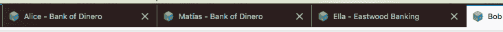

# 第 1 步 - 准备请求信用证

我们首先准备我们的请求：

1.  在浏览器上选择第一个选项卡-你将看到以下页面：

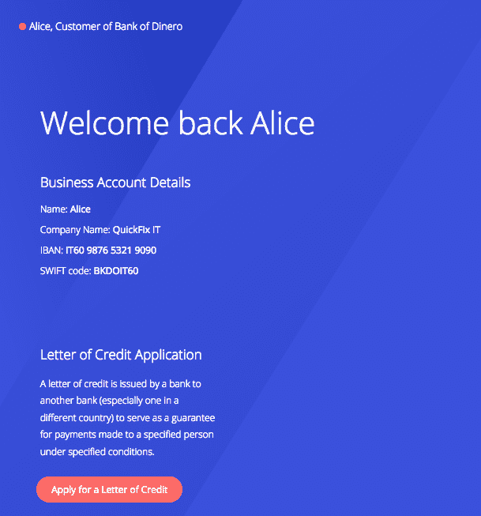

1.  您现在是 Alice！您可以看到您的银行和您的账户细节。您可以通过单击“申请”按钮申请一个信用证。试试看！

1.  您将看到一个页面，您可以在该页面上请求信用证书：

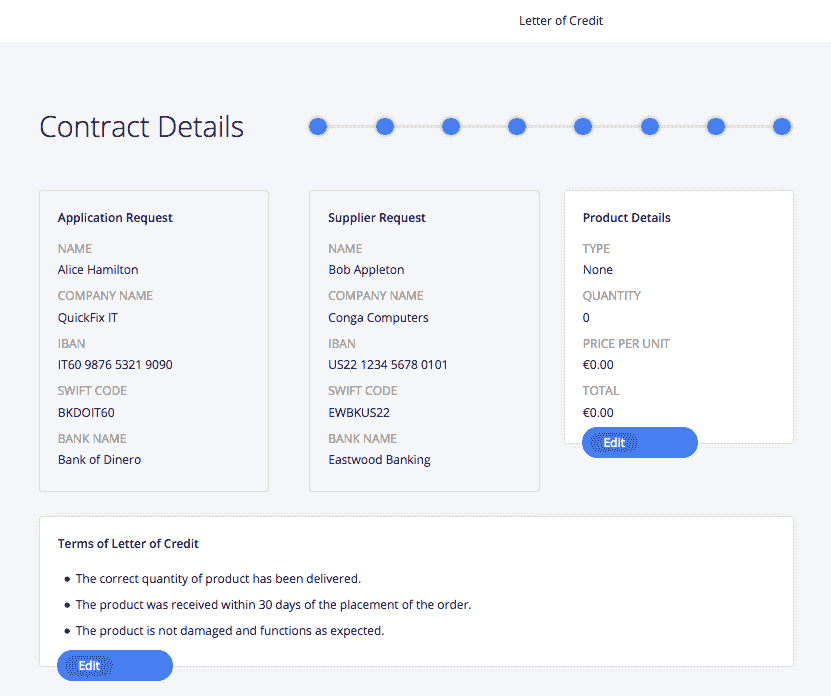

# 第 2 步 - 请求信用证

这是流程的第一个阶段，您将要求从 Bob 购买计算机的信用证！在每个屏幕的顶部，您都能看到您在流程中的确切位置，例如：


在页面的左侧，您将看到商家的详情 - 阿里斯和 Bob 的联系方式。注意公司名称和账户详情：

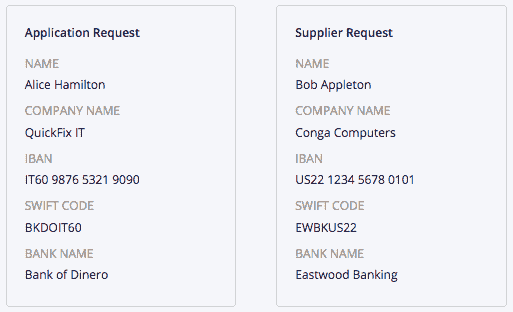

让我们假装作为 Alice 提交一个申请。在屏幕的右侧，您可以输入贸易的细节。假设 Alice 向 Bob 请求 1,250 台计算机，每台价格为 1,500 欧元。该申请的总价值为 1.875M EUR：

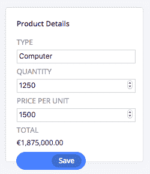

还要注意，Alice 可以根据（她银行的许可）在申请书上选择一些条款和条件。这些是与 Bob 签订合同的重要条款和条件 - 除非这些条件得到满足，否则双方都不会收到货物或付款：

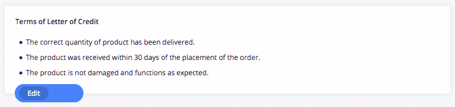

你可以根据需要编辑这些内容，尽管这些过程不会受到影响。

当您准备好进入流程的下一个阶段时，请点击“开始批准流程”按钮：

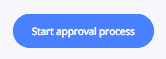

恭喜，您刚刚申请了信用证！

# 第 3 步 - 进口银行批准

这是流程的下一个阶段。在浏览器的下一个标签页上单击。现在您是阿里斯银行 Dinero 的员工 Matias，需要处理她的申请！以下是 Matias 看到的页面：

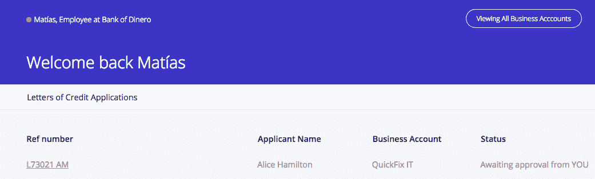

它显示了来自 Alice 的申请，目前正等待 Matias 的批准。他代表 Dinero 银行行事，并申请批准或拒绝的信用证。我们可以设想，在一个复杂的过程中，Matias 只需要批准无法自动批准的特殊信函。

如果 Matias 点击申请，他将看到与 Alice 请求的内容基本相同的详细信息：

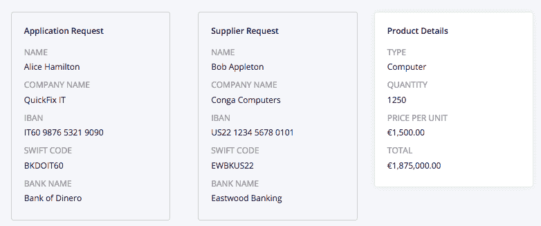

在我们的场景中，Matias 将批准信用证，流程将继续！选择“接受”按钮，我们将进入下一步：

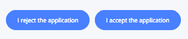

# 第 4 步 - 出口银行批准

在浏览器的下一个标签页上单击。现在您是 Bob 银行 Eastwood 的员工 Ella，已被告知阿里斯希望与 Bob 做生意：

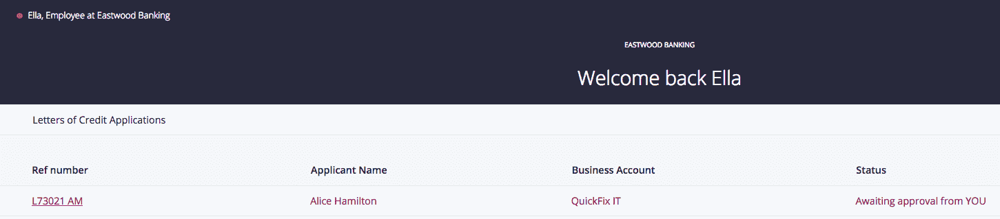

这个示例对流程稍作创意性处理 - 通常情况下，信函将由 Alice 提交给 Bob。然后 Bob 将其提交给 Ella。然而，我们可以看到，因为每个人都可以预先查看信函，所以流程创新是可能的。我们稍后会详细说明这一点。

我们可以看到，Ella 授权了流程的下一个阶段 - 我们可以看到信函在流程图中的位置。当 Ella 选择了这封信时，她可以看到以下详情：

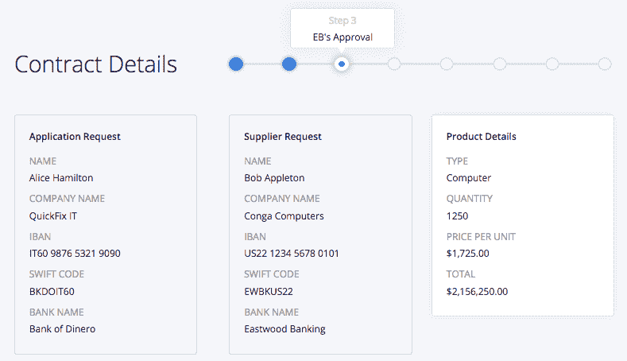

请注意货币已经被更改。Alice 必须用美元支付，因为那是 Bob 想要的，但是 Ella 和 Matias 已经就 Alice 和 Bob 的汇率达成了一致，所以每个人都可以使用自己的货币。Alice 将以欧元计价，而 Bob 将以美元支付。

在屏幕顶部，您将看到与流程相关的以下信息。我们可以看到我们在流程中的位置；由于区块链的唯一性，增加的透明度是可能的，尽管不同的组织每个都通过自己的系统托管和批准了流程的各个阶段：

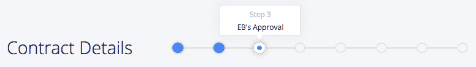

让我们再次推进流程。Ella 可以通过点击接受按钮来批准该信函：

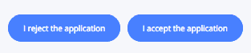

# 第 5 步 - 出口商收到信函

在你的浏览器中点击下一个选项卡。你现在是 Bob，你可以看到 Alice 的信用证：

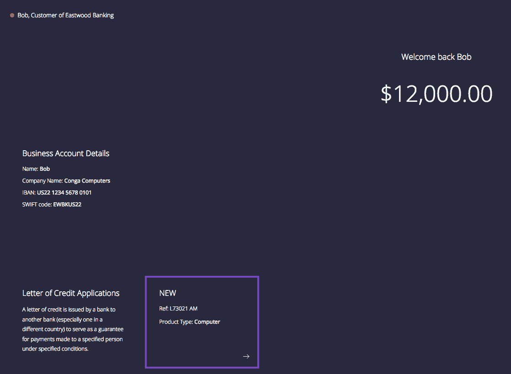

在这个流程示例中，Bob 可以相当确信 Alice 是值得信赖的，因为他的银行事先告诉了他。如果 Bob 选择这封信，他将被显示其详细信息：

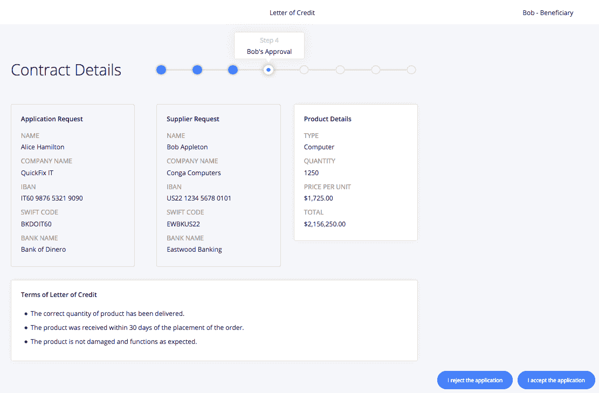

希望你现在开始理解这个流程了 - 所以让我们不要再一次详细说明所有细节了！只需注意 Bob 如何因为他可以获得的透明度而增加信任。Bob 接受信函作为支付（点击接受），现在必须将货物发给 Alice！

# 第 6 步 - 装运

你将会回到 Bob 的初始界面，但是请注意，现在有一个选项将货物运送给 Alice：

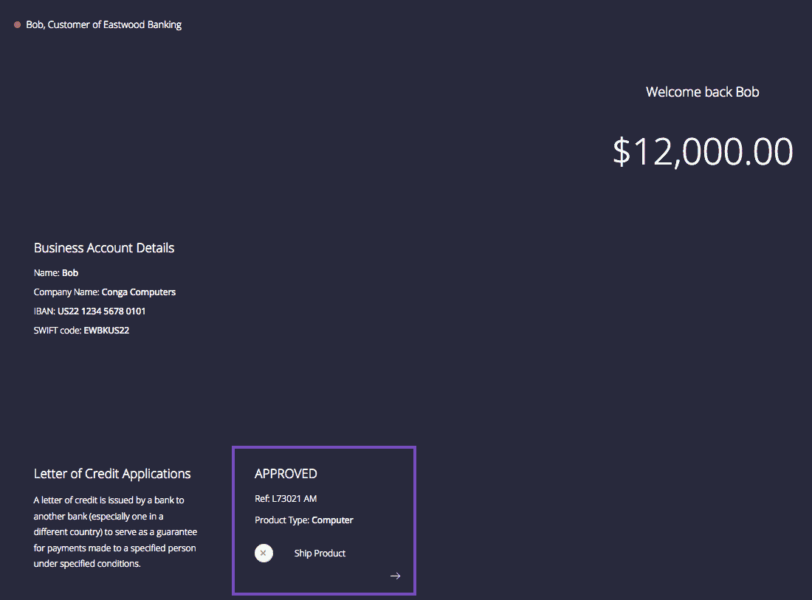

点击发货订单，表示货物已经运送给 Alice：

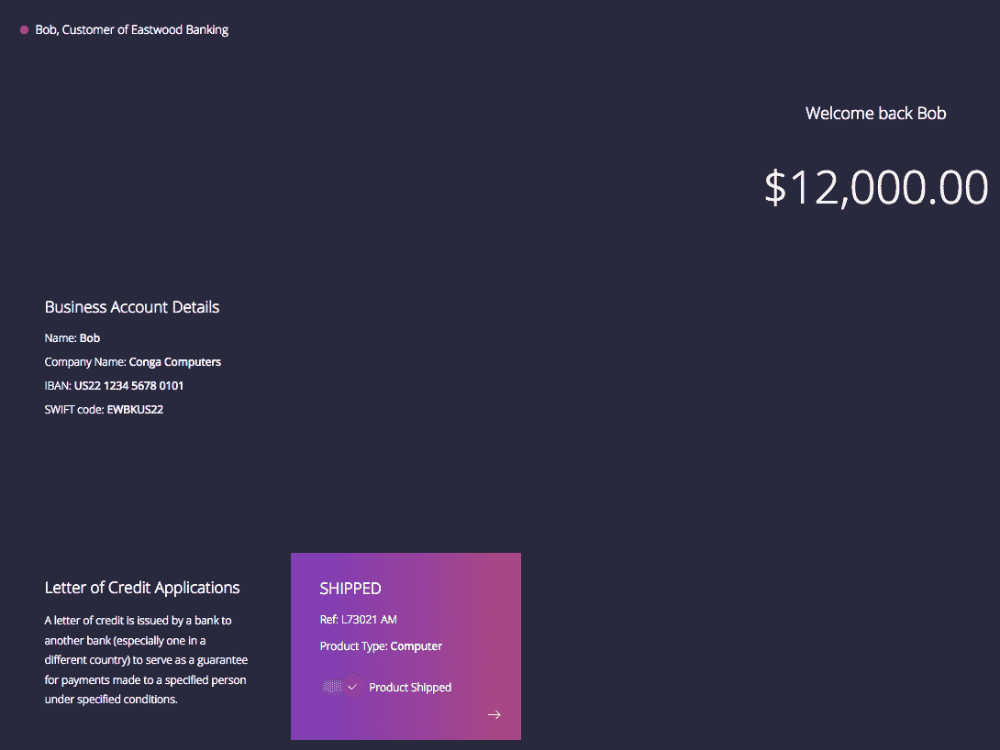

Bob 现在可以看到，就信用证流程而言，他已经完成了 - 订单已经发货。

但是 Bob 还没有收到付款 - Alice 必须先收到货物才能发生这种情况。请注意 Bob 网页右下角的历史记录。Bob 可以看到他在整个流程中的位置，以及在他收到付款之前需要完成的一些步骤：

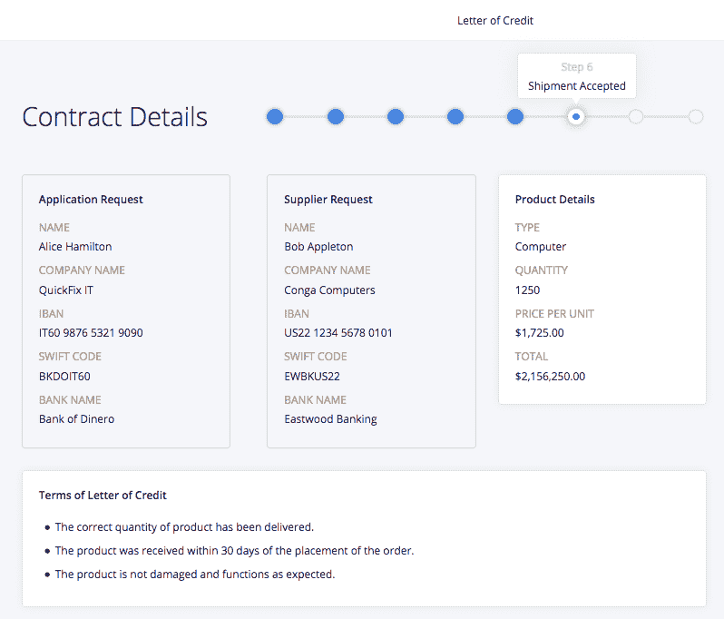

让我们返回到 Alice 的选项卡，继续流程的下一步。

# 第 7 步 - 收到货物

返回到你浏览器中 Alice 的选项卡：

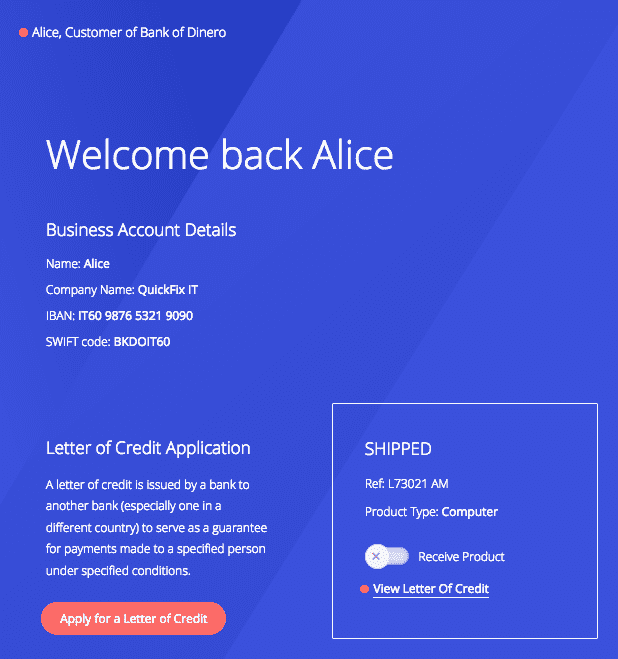

当爱丽丝从鲍勃那里收到电脑时，她可以点击“接收订单”来表示这一点，并查看信用证。此时，两家银行都能释放付款。让我们转到马蒂亚斯的网页，看看这个过程的下一步。

# 第八步 - 付款

马蒂亚斯可以看到爱丽丝和鲍勃很高兴，因此付款可以进行。点击马蒂亚斯的初始页面，查看当前信函的详细信息：

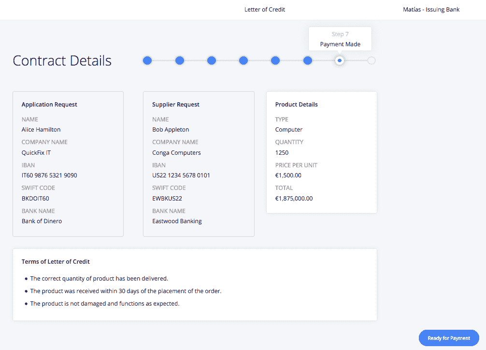

马蒂亚斯可以看到爱丽丝已经收到货物，马蒂亚斯可以点击“准备付款”来进行下一步。

# 第九步 - 关闭信函

爱拉现在可以关闭信函并向鲍勃付款：

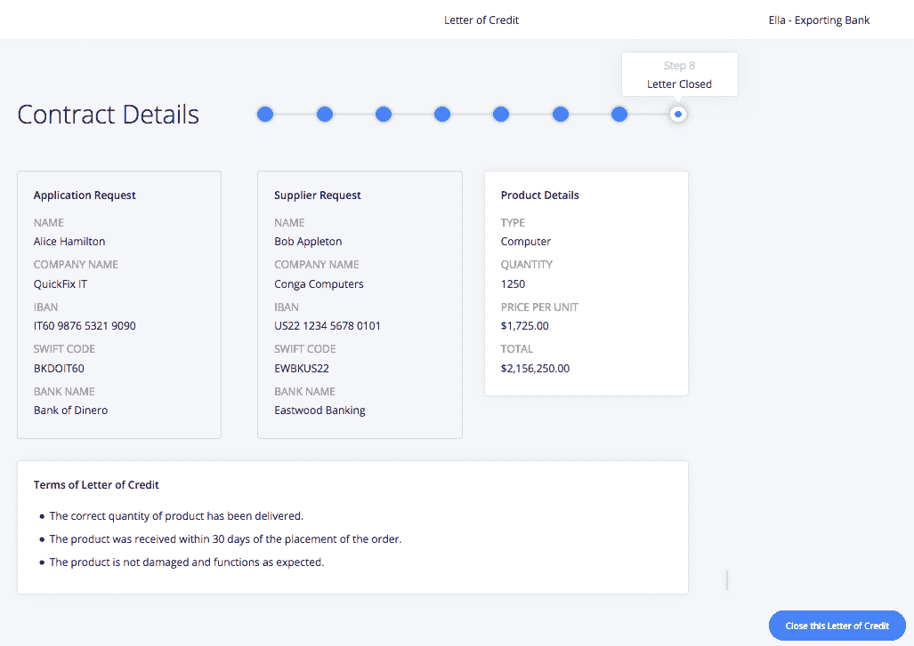

作为艾拉，点击“关闭”以进入流程的最后一步。

# 第十步 - 鲍勃收到付款

如果我们返回鲍勃的网页并刷新它，我们可以看到鲍勃有一些好消息！看看他的余额增加了：

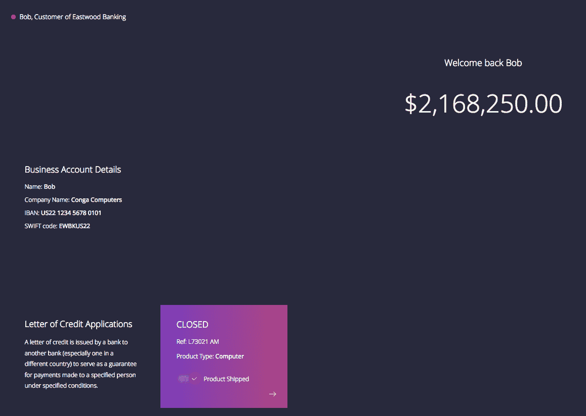

鲍勃现在已经收到了他向爱丽丝出售的电脑的付款。业务流程已经完成。

# 概括流程

爱丽丝想从鲍勃那里购买电脑，并使用信用证流程来促成这次交易。她以美元购买商品，但以欧元支付。在支付之前，她能够确信货物符合她的条款和条件。 

鲍勃向爱丽丝出售了电脑，一个他之前不认识的海外客户。信用证流程使他有信心以他本地货币美元的形式收到他货物的付款，只要爱丽丝对货物满意即可。

马蒂亚斯和艾拉，分别是 Dinero Bank 和 Eastwood Bank 的代表，提供了一个系统，让爱丽丝和鲍勃能够相信彼此将履行相互同意的条件以便收到付款。他们能够为他们的服务向爱丽丝和鲍勃收取公平的价格。他们几乎实时了解业务流程的每一个步骤。

现在让我们看看如何使用 Hyperledger Composer 和 Hyperledger Fabric 实现这个过程。

# 分析信用证流程

业务网络的核心是一个**业务网络定义**，其中包含资产、参与者、交易和事件的正式描述。我们将为信用证申请检查这一点。在本章结束时，您将能够了解网络是如何实现和被应用程序访问的。此外，您将具备构建自己的网络和消费应用程序的知识。

# 操场

如果您转到演示中的下一个选项卡，您会发现 Hyperledger Composer Playground 已经为您打开：

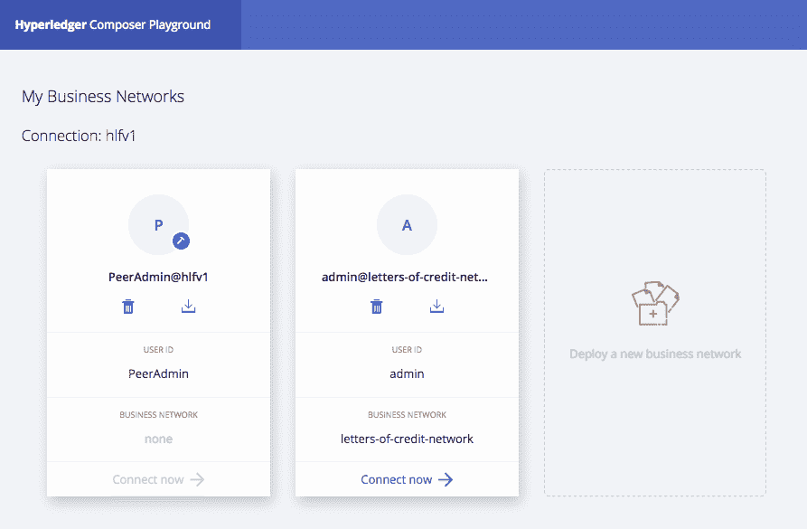

游乐场是一个工具，可以让您调查商业网络。游乐场的初始视图包含一个充满 **商业网络卡** 的 **钱包**。就像一个真实的钱包一样，这些卡可以让您连接到不同的网络。当您使用特定的卡连接到网络时，您就会作为不同的参与者进行操作。这对于测试网络非常有用。让我们作为管理员连接到网络，看看里面有什么！（稍后我们将创建我们自己的网络卡。）

# 查看商业网络

在标记为 `admin@letters-credit-network` 的商业网络卡上，点击立即连接。您将看到一个网页：

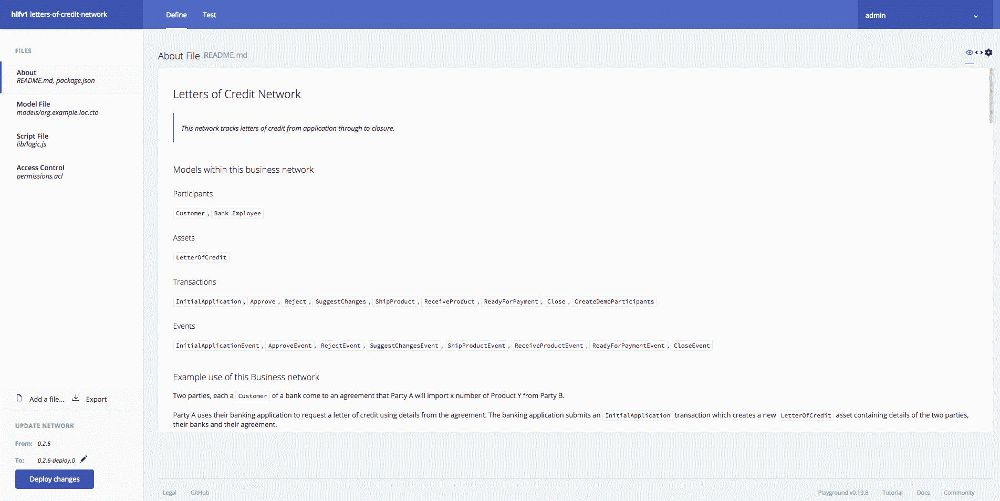

商业网络定义视图

这是商业网络定义的视图。它包含我们在信用证网络中讨论的参与者、资产、交易和事件的定义。页面的左侧是一组文件，其中包含与我们连接的网络相关的这些概念的信息。我们选择了 **关于**，在右侧，我们可以看到商业网络的描述。让我们稍微详细地研究一下这个描述——理解这一点非常重要。

# 商业网络描述

`README` 文件包含了对网络的自然语言描述，涉及其资产、参与者、交易和事件。

# 参与者描述

参与者列在商业网络描述中：

```
Participants
 Customer, BankEmployee
```

在我们的示例中，有四个参与者 **实例** ——Alice、Bob、Matias 和 Ella。但请注意，这里只有两种参与者 **类型**，即 `Customer` 和 `Employee`。在我们的网络中，Alice 和 Bob 是 `Customer` 类型的参与者，而 Matias 和 Ella 是 `BankEmployee` 类型的参与者。我们可以看到，这些类型是从银行的角度命名的——因为 Dinero 和 Eastwood 银行提供网络服务，并由 Alice 和 Bob 使用。

我们很快会看到有关这些参与者类型及其网络中特定实例的更多细节。但现在，只需考虑一下我们如何将网络中的参与者简化为两种非常简单的表示。尽管我们在应用程序中看到了丰富的行为，但在参与者方面，网络却非常简单。你将在商业网络中看到这一点——尽管参与者可以有很多实例，但类型的数量通常非常有限，并且很少超过 10 个。当然，规则是用来打破的，但你会发现以这种方式思考网络会让分析变得更加可管理。

# 资产描述

如果你对这个商业网络中参与者类型数量很少感到惊讶，那么当你看到资产类型的数量时，你会感到惊讶：

```
Assets
 LetterOfCredit
```

现在，这是一个示例网络 - 这里是为了教我们关于业务网络概念，而不是对信用证世界的详尽表示。 但是，如果你考虑我们的例子，整个流程主要关注的是一个资产类型：**信函**。

公平地说，我们没有关注正在转移的货物 - 电脑或付款。 在真实的系统中，这些将被描述为资产。 即便如此，请注意资产**类型**的数量仍然相对较少。 我们可以创建无限数量的信用证实例，计算机和付款，但类型仍然只有几种。

我们稍后将详细了解此资产类型的细节。

# 交易描述

现在，让我们转移到业务网络中的交易类型：

```
Transactions
 InitialApplication, Approve, Reject, SuggestChanges, ShipProduct, ReceiveProduct, ReadyForPayment, Close, CreateDemoParticipants
```

最后，我们可以看到相当多种类型！ 这是典型的情况 - 尽管参与者和资产类型的数量相当有限，但资产的生命周期丰富多彩。 如果你考虑我们的应用程序，信用证与网络中的不同参与者交互时会经历许多**状态**。 这些交易直接对应于这些交互。（忽略`CreateDemoParticipants`，这是设置演示的交易！）

交易名称相当容易理解 - 这些与信函的生命周期密切相关。 这是您作为不同参与者使用应用程序时经历的步骤。 Alice 进行了`InitialApplication`，并有可能对信函的条款和条件进行`SuggestChanges`。 Mattias 和 Ella 可以`Approve` 或 `Reject` 信函。 Bob 调用`ShipProduct` 表示他已完成了他的交易，并且 Alice 使用`ReceiveProduct` 也是这样表示她已经收到了计算机。 最后，Matias 表示该信函已准备好进行支付，并且 Ella 发出了`Close` 交易以结束流程并触发向 Bob 的付款。

没有理由交易类型的数量必须大于资产类型的数量。 人们很容易想象许多不同类型的资产，其生命周期相同且相对简单。 想象一下零售商的产品库存 - 商品可以被采购，交付，出售和退货。 这是一个相对简单的生命周期，但是不同类型的商品数量可能相当大。 然而，我们可能期望这些不同的商品通过某种行为的共性共享这种生命周期; 毕竟，它们都是产品。 关于继承的这种想法以后会有更多内容。

我们将更详细地研究这些交易的实现，但目前，最重要的是理解网络中参与者之间资产流动的概念图片，如交易所描述的，而不是担心这些交易变化背后的确切逻辑。

# 事件描述

最后，让我们看一下业务网络中事件的列表：

```
Events
 InitialApplicationEvent, ApproveEvent, RejectEvent, SuggestChangesEvent, ShipProductEvent, ReceiveProductEvent, ReadyForPaymentEvent, CloseEvent
```

我们可以看到事件的名称与交易类型匹配，这是典型的。这些是**显式**事件，由交易生成，以指示业务网络中发生某些事件的时间。在我们的场景中，它们被用户界面用于保持网页的最新状态，但当然也可以用于更复杂的通知处理，例如，`CloseEvent` 可以用于触发向 Bob 的支付。

当您首次定义业务网络时，您会发现事件与交易密切相关。但是，随着时间的推移，您会发现更复杂的**显式**事件被添加，例如，Matias 或 Ella 可能想要为 `HighValue` 信函或 `LowRisk` 申请生成特定事件。

我们稍后会详细讨论这些事件的细节。

# 一个业务网络的模型

现在我们已经理解了自然语言中业务网络中的类型，让我们看看它们在技术上是如何定义的。在 Playground 的左侧，选择模型文件。

在此业务网络中，只有一个模型文件定义了参与者、资产、交易和事件。在更大的应用程序中，我们将保留来自不同组织的信息在其自己的文件中，并且通常在其自己的命名空间中。它允许它们保持分离，但在必要时将它们汇集在一起。让我们看看命名空间是如何工作的。

# 命名空间

我们的示例使用单个命名空间：

```
namespace org.acme.loc
```

此命名空间表示*此文件中的类型定义已由 Acme 组织的信用证流程定义*。这都是一个简短的名称！使用命名空间——它们将帮助您清楚地分离，更重要的是**传达**，您的想法。建议使用分层名称，以便清楚地知道网络中哪些组织正在定义网络使用的相关类型。

# 枚举

接下来，我们看到一组枚举类型：

```
enum LetterStatus {
  o AWAITING_APPROVAL
  o APPROVED
  o SHIPPED
  o RECEIVED
  o READY_FOR_PAYMENT
  o CLOSED
  o REJECTED
}
```

这些是信函要经过的**状态**。当我们访问一封信时，我们将能够使用此枚举标识业务流程的位置。所有的名称都相当自我解释。

# 资产定义

现在我们来到了第一个真正重要的定义——信用证资产：

```

 asset LetterOfCredit identified by letterId {
   o String letterId
   --> Customer applicant
   --> Customer beneficiary
   --> Bank issuingBank
   --> Bank exportingBank
   o Rule[] rules
   o ProductDetails productDetails
   o String [] evidence
   --> Person [] approval
   o LetterStatus status
   o String closeReason optional
 }
```

让我们花点时间来理解这个定义，因为它既是理解业务网络的中心，也是特别关注 Hyperledger Composer 的。

首先，请注意**asset**关键字。它表示接下来的内容是描述资产的数据结构。这就像正常编程语言中的类型定义，但具有一些特殊特征，我们稍后会看到。

我们可以看到资产是`LetterOfCredit`类型。在此示例中，我们只有一种资产类型——在更复杂的示例中，我们将拥有更多类型的资产。例如，我们可以扩展此模型以包括 `Shipment` 资产和 `Payment` 资产：

```
asset Shipment
asset Payment 
```

现在，让我们跳过**identified by**子句，转到资产定义中的第一个元素：

```
o String letterId
```

字母`o`表示这个字段是资产的**简单属性**。这是一种略显奇怪的表示方法，所以可以将它看作是一种装饰。第一个属性是`letterId`。回想一下，当在商业网络中创建一封信时，将为其分配一个唯一 ID。如果回想一下，在我们的例子中，我们有`letterId`分别是`L64516AM`或`L74812PM`。这是通过字段具有`String`类型来表示的——有很多类型可用，我们很快就会看到。我们可以看到，这个定义允许我们将一个可读的标识符与资产关联起来。请注意，这个标识符必须是唯一的！

现在让我们回到`identified by`子句：

```
identified by letterId
```

*现在*我们可以理解，这表明`letterId`属性是唯一标识资产的属性。这是一个简单但强大的想法，与现实世界密切相关。例如，一辆汽车可能有一个用于唯一标识它的**车辆识别号**（**VIN**）。

让我们继续下一个属性：

```
--> Customer applicant
```

我们注意到的第一件事是`-->`装饰符！（在您的键盘上键入两个破折号和一个大于符号）。这是一个**引用属性**——它指向某物！就一封信而言，它指向一个不同的类型，`Customer`，而这个元素的名称是`applicant`。看到引用的概念比我们之前看到的简单属性复杂一些——因为它做的工作更多。这个字段表示这封信有一个申请者，是`Customer`类型，而且你需要通过这个引用查找它。

在我们的示例中，一封信的实例将指向**Alice**，因为她是 Dinero 银行的客户，她提出了申请。请注意，这个引用属性指向商业网络中的*不同*对象。这种引用的概念非常强大——它允许资产指向其他资产，以及参与者，参与者也是如此。有了引用，我们能够表示我们在世界中看到的丰富结构。这意味着我们可以创建可以组合和分割的资产，对参与者也是如此。在我们的示例中，我们使用引用来查看谁申请了一封信，通过导航引用。再次看到，这个模型非常以银行为中心。稍后我们将看到`Customer`实际上是一个参与者，并且我们将看到像 Alice 这样的参与者是如何定义的。但现在，让我们先留在资产定义上。

正如我们在**商业网络**中所讨论的，我们的应用程序使用了一种简单的方式来建模所有权——在现实世界中，这经常是一种联想参考。我们可以将这种更复杂的联想关系最容易地建模为一个`OwnershipRecord`，它指向一个资产，并且如果需要的话，指向一个参与者：

```
asset OwnershipRecord identified by recordId {
   o String recordId
   --> LetterOfCredit letter
   --> Customer letterOwner
```

我们可以立即看到这种方法的强大之处。我们能够建模现实世界中存在的关系，使我们的应用程序更加现实和易于使用。对于我们的目的，我们当前的模型完全够用。

让我们转向下一个字段：

```
--> Customer beneficiary
```

这是与上一个领域非常相似的领域，在我们的示例中，这个元素的一个实例将是**鲍勃**。没有必要花时间来定义这个概念。当然很重要，但它只是指向鲍勃的信。如果你回忆一下，我们的应用程序总是将两个交易对方与一个信件关联起来。

接下来的两个字段具有类似的结构，但我们将花更多时间讨论它们：

```
--> Bank issuingBank
--> Bank exportingBank
```

我们可以看到这些字段也是对其他对象的引用，根据它们的名称- `issuingBank`和`exportingBank`，我们可能会怀疑它们是参与者！这些类型的示例实例是**Dinero 银行**和**Eastwood 银行**，它们代表着 Alice 和 Bob。

通过这四个参考字段，我们已经建模了资产的非常丰富的结构。我们表明信用证确实有四个参与者参与其中。我们给它们起了符号化的名称和类型，并展示了它们如何与资产相关联。此外，我们没有编写任何代码就完成了这一点。稍后我们需要做一些这样的事情，但现在，请注意我们在模型中捕捉到了信用证的基本本质。值得花一点时间真正理解这一点。

我们只会考虑资产定义中的另一个字段，因为希望你现在已经掌握了这个！这是一个重要的字段：

```
o LetterStatus status
```

还记得文件顶部定义的 ENUMs 吗？很好！这个字段将包含那些不同值，例如`AWAITING_APPROVAL`或`READY_FOR_PAYMENT`。您在您的业务网络中经常，如果不是总是，会有这样的字段和枚举，因为它们以一种非常简单的形式捕捉了您模拟的业务流程中的位置。如果您熟悉工作流程或有限状态机，您可能想把这些看作**状态**-这是一个非常重要的概念。

# 参与者定义

现在我们转向模型文件中的下一组定义：参与者！

让我们看看第一个参与者定义：

```
participant Bank identified by bankID {
  o String bankID
  o String name
}
```

这是我们的第一个`participant`类型定义，一个银行。在示例应用程序中，我们有两个这种类型的实例：**Dinero 银行**和**Eastwood 银行**。

我们可以看到，参与者是通过`participant`关键字`identified by`的，随后是类型名称-**银行**。在这种情况下，参与者类型是一个组织，而不是一个个人。与资产一样，每个参与者都有用于识别的唯一 ID，我们可以看到对于银行来说，它是`bankID`字段：

```
participant Bank identified by bankID
```

对于我们的示例，银行的建模非常简单-只有一个`bankID`和一个`name`，它们都是字符串：

```
String bankID
String name
```

我们可以看到银行实际上比信件简单得多。不仅仅是因为它们具有较少的字段和更简单的类型。更重要的是，它们不引用任何其他参与者或资产——这就是使它们简单的原因——缺乏引用，简单的结构。你的模型也将是如此——一些资产和参与者将具有相对简单的结构，而其他人将具有更多，包括对其他资产和参与者的引用。

记住这些类型是从资产定义中调用的。如果需要，再次查看信件类型定义，看看引用：

```
--> Bank issuingBank
--> Bank exportingBank
```

现在你能看到**信件** **资产**和**银行** **参与者**是如何相关联的了吗？太好了！

现在让我们看看下一个参与者类型。它和我们之前看到的有点不一样，现在先忽略**抽象**关键词：

```
abstract participant Person identified by personId {
  o String personId
  o String name
  o String lastName optional
  --> Bank bank
}
```

感觉我们的应用程序中有`Person`类型的四个实例——Alice 和 Bob，Matias 和 Ella！让我们来看看个体参与者是如何定义的：

```
abstract participant Person identified by personId
```

再次，忽略**抽象**关键词。该语句定义了 `Person` 类型的参与者，由其类型定义中的唯一字段`identified by`。这些类型将是我们应用程序中的个体参与者，而不是之前我们定义的组织（即银行）。（我们可能期望`Bank`和`Person`在结构上相关，我们以后会看到！）

如果我们更详细地看一下定义，就会发现他们的结构比 `bank` 有趣多了：

```
o String personId
o String name
o String lastName optional
--> Bank bank
```

我们可以看到`Person`也有名字和姓氏。但注意姓氏是`optional`的：

```
o String lastName optional
```

我们可以看到 `optional` 关键字表示 `lastName` 可能存在也可能不存在。你可能还记得我们的示例中，Alice 和 Bob 提供了姓氏（Hamilton 和 Appleton），但银行的员工 Matias 和 Ella 没有。这种选择性已经被建模了——看看它是如何帮助我们使应用程序更接近现实世界的。

然而，最重要的字段是接下来的一个：

```
 --> Bank bank
```

为什么？它揭示了**结构**。我们可以看到一个人与银行有关。对于 Alice 和 Bob 来说，这是他们有账户的银行。对于 Matias 和 Bob 来说，这是他们的雇主。我们将再考虑一下，这是否真的是正确的建模关系的地方，但目前重要的是，我们有一个个体参与者与组织参与者有关。你可以看到复杂结构不仅仅适用于资产——参与者也可以有复杂结构！

但等等，这并不是那么简单。在定义中我们跳过了一些东西，是吗？看看下面的内容：

```
abstract participant Person identified by personId { 
```

`抽象` 关键字几乎完全摧毁了我们刚说的关于`Person`类型的一切！抽象类型很特殊，因为*无法实例化*。真的吗？鉴于我们可以看到 Alice 和 Bob，Matias 和 Ella，这似乎有违直觉。

要理解发生了什么，我们需要转向下一个参与者定义：

```
participant Customer extends Person {
   o String companyName
}
```

仔细看看这个定义的第一行：

```
participant Customer extends Person {
```

我们可以看到我们定义了一个称为`Customer`的特殊`Person`类型！这比以前更好，因为 Alice 和 Bob 都是`Customers`。实际上，在我们的应用程序中，我们没有`Person`参与者的实例 - 我们有`Customer`类型的实例。

我们现在可以看到`Customer`类型定义中的`extends`关键字与`Person`类型定义中的`abstract`关键字相配对。它们是我们之前提到的类型特化和继承这一更大概念的一部分：

```
abstract participant Person
participant Customer extends Person 
```

是`abstract`关键字阻止我们定义`Person`的实例！这很重要，因为在我们的例子中，实际上是正确的 - 没有`Person`类型的实例，只有`Customer`类型的实例。

我们可以看到一个`Customer`在扩展`Person`类型时有一个额外的属性，即他们的公司名称：

```
o String companyName
```

对于 Alice，这将是 QuickFix IT，对于 Bob，将是 Conga Computers。

最后，让我们看看最后一个参与者类型，`BankEmployee`：

```
participant BankEmployee extends Person {
}
```

我们不需要详细描述这个 - 你可以看到，例如`Customer`，`BankEmployee`扩展了`Person`类型，但不同于它，它没有添加任何额外的属性。这没关系！在我们的应用中，Matias 和 Ella 是这种类型的实例。

我们现在可以看到为什么`Person`类型是有用的。不仅仅是因为它不能被实例化，它还捕捉到了`Customer`和`BankEmployee`之间的共同之处。它不仅仅是节省了打字的工作 - 它展示了一个内部结构，这提高并反映了我们对业务网络的理解。

牢记这一点，你可能会考虑是否以以下方式对模型进行略微更加现实的建模：

```
abstract participant Person identified by personId {
   o String personId
   o String name
   o String lastName optional
}

participant Customer extends Person {
   o String companyName
   --> Bank customerBank
}

participant BankEmployee extends Person {
   --> Bank employeeBank
}
```

在现实情境中，实际参与者的身份将被存储在模型之外。这是因为个人身份和不可更改的账本不是一个好的组合。在账本上存储 Alice 的个人信息意味着它将永远存在。

你能看出这个模型如何展示了`Customer`与`BankEmployee`之间的银行关系性质有所不同吗？

这里有一个重要点 - 没有所谓的正确模型。模型只是为了服务于一个目的 - 它们要么足够，要么不足够。对于我们的目的来说，我们的两个模型完全足够，因为我们不需要在他们与银行的关系方面区分`Customers`和`BankEmployees`。

好了，参与者的部分就到这里。让我们继续下一个模型定义中的元素。

# 概念定义

观察`ProductDetail`而不是`Rule`，因为它一开始会稍微容易理解：

```
concept ProductDetails {
   o String productType
   o Integer quantity
   o Double pricePerUnit
}
```

概念在模型中是较小但有用的元素。它们既不是资产也不是参与者 - 它们只是定义其中包含的结构元素。

这个前置概念定义了`ProductDetail`。我们可能会认为这实际上是一个资产 - 对于我们的应用程序来说，它不是参与者之间转移的东西！当我们看到`Rule`概念时，可能会更清楚一些，它捕捉了信用证的条款和条件：

```
concept Rule {
   o String ruleId
   o String ruleText
}
```

这与资产或参与者不太相似，但将其作为单独的类型很有帮助，因为它揭示了一个重要的结构。

# 交易定义

让我们继续吧！下一节非常重要 - 交易！让我们先从看第一个交易定义开始：

```
transaction InitialApplication {
   o String letterId
   --> Customer applicant
   --> Customer beneficiary
   o Rule[] rules
   o ProductDetails productDetails
}
```

我们可以看到，像资产和参与者一样，交易是用自己的关键字定义的：

```
transaction InitialApplication {
```

`transaction`关键字标识接下来的内容是一个交易类型的定义。就像`asset`或`participant`关键字一样。请注意，交易定义中没有`identified by`子句。

此交易定义代表了 Alice 为信用证所做的初始申请。这实在是显而易见，不是吗？Alice 使用的应用程序会创建交易的特定实例，并且我们可以看到其中包含的信息：

```
o String letterId
--> Customer applicant
--> Customer beneficiary
o Rule[] rules
o ProductDetails productDetails
```

如果你回顾一下 Alice 的网页，你会看到所有这些信息：`申请人`Alice，`受益人`Bob，**条款和条件**（**规则**）和**产品详细信息**。请注意，申请人和受益人是参与者的引用，而规则和产品详细信息则是概念。

我们可以看到，交易的结构相对简单，但却强大地捕捉了一个`申请人`（例如，Alice）申请与`受益人`（例如，Bob）做生意的意图。

# 事件定义

看一下模型文件中的下一个定义：

```
event InitialApplicationEvent {
   --> LetterOfCredit loc
}
```

这是一个事件！你经常会看到这种情况 - 事件定义紧邻同名的交易。这是因为这真的是一个**外部**事件 - 它只是捕捉申请人申请信用证。它只是指向生成事件的信件。在申请中，它只是用于保持用户界面最新，但通常情况下，这个初始申请可能引发各种处理。

继续浏览模型文件，你会看到为流程的每个步骤定义的交易和事件，有时还有与该交易步骤相关的额外属性。花点时间看看这些 - 它们很有趣！

正如我们所见，还可以声明更明确的事件，比如高价值信件或低风险申请。想象我们的应用程序用以下事件来做到这一点：

```
event highValueLetterEvent {
   --> LetterOfCredit loc
}

 event lowRiskLetterEvent {
   --> LetterOfCredit loc
}
```

你认为模型文件中的哪些交易会与这些相关联？

要确定这一点，我们需要考虑这个过程 - 一个高价值的信件在申请后立即被知晓，因此它将与 `InitialApplication` 交易相关联。然而，直到交易被两家银行首次处理，并且申请人和受益人都被评估之前，很难说这封信是低风险的。这意味着这个事件更可能与 `Approve` 交易密切相关。

此外，在这种更高分辨率的情况下，我们会考虑为进口银行批准和出口银行批准创建单独的交易，`ImportBankApproval` 和 `ExportBankApproval`。

# 检查实时网络

很好 - 现在我们已经看到了业务网络中参与者、资产、交易和事件类型是如何定义的，让我们看看如何创建这些类型的实例。Playground 工具还有另一个非常好的功能 - 它允许我们在业务网络运行时查看网络内部，以查看这些类型的实例，并在 Playground 页面顶部选择测试选项卡：

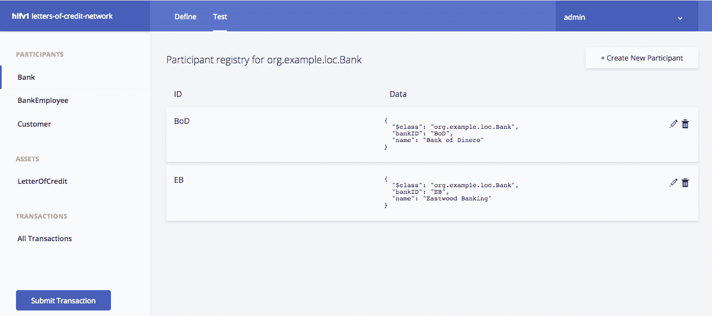

你会发现视图有点变化。在左侧，我们可以看到为这个业务网络定义的参与者、资产和交易：`银行`、`银行员工`、`客户` 和 `LetterOfCredit`，以及交易。你可以选择这些选项，当你这样做时，右侧的窗格会变化。试试看！

选择 `LetterOfCredit` 资产，在右侧窗格上，你将看到以下内容（使用显示所有展开视图）：

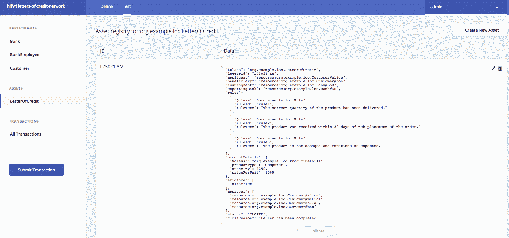

哇 - 这很有趣！这是我们申请的一封实际信用证。让我们仔细看看信件，以及它如何映射到我们之前检查的类型结构。

# 检查信用证实例

我们可以看到 ID，`L73021 AM`，和实例信息。它显示为 JSON 文档，你可以看到结构与 `LetterOfCredit` 定义中的结构相似，但其中包含了真实的实例数据。

你可以看到信件中包含的每个资产和参与者都有一个类（`$class`），它由命名空间与类型名称连接而成。例如：

```
"$class": "org.example.loc.LetterOfCredit"
"$class": "org.example.loc.ProductDetails"
```

还要注意这封信的信息是如何被捕获的：

```
"letterId": "L73021 AM"
"productType": "Computer"
"quantity": "1250"
```

最后，请注意信件处于最终状态：

```
"status": "CLOSED"
"closeReason": "Letter has been completed."
```

所有这些数据都非常强大。为什么呢？因为类型和实例信息被保留在一起，就像在真实合同中一样，它在编写后可以被正确解释。你可以想象这对喜欢在数据中寻找模式的分析工具有多么有帮助！

对于参考属性，我们可以看到结构略有不同：

```
"applicant": "resource:org.example.loc.Customer#alice"
"beneficiary": "resource:org.example.loc.Customer#bob"
"issuingBank": "resource:org.example.loc.Bank#BOD"
"exportingBank": "resource:org.example.loc.Bank#ED"
```

我们可以看到这些属性是参与者的引用，如果我们点击参与者选项卡，我们就能看到它们！点击银行选项卡：

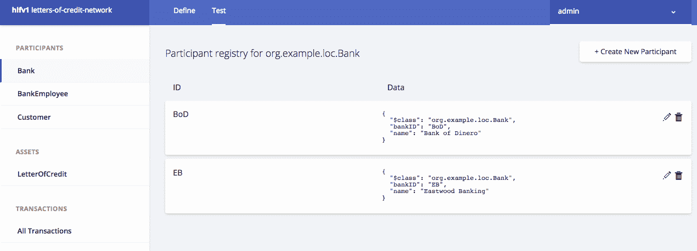

# 检查参与者实例

你可以看到我们网络中的两家银行，它们的类型和实例信息！点击不同的参与者和资产选项卡，并检查数据，看看类型如何在场景中被实例化。花些时间来做这个——重要的是你理解这些信息，将它们与类型联系起来，并真正思考它们与业务网络的关系。不要被欺骗——信息看起来很简单——但其中有一些强大的想法需要一些时间去联系。然而，我们鼓励你这样做——真的值得理解一切是如何联系在一起的，这样你也可以做到同样的事情！

# 检查交易实例

现在点击“所有交易”选项卡：

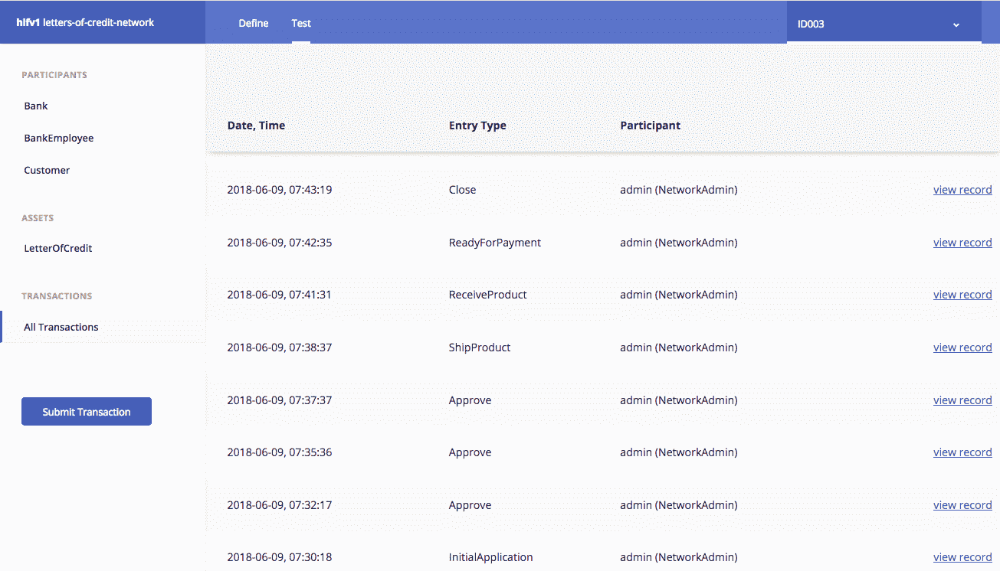

你可以看到我们应用程序运行过程中完整的交易生命周期。（你的时间可能会有点不同！）如果你滚动查看交易，你可以看到在我们的场景中确切发生了什么——Alice 申请了一封信，Matias 批准了，等等。如果你点击查看记录，你将能够看到单个交易的细节。

例如，让我们来看看 Alice 提出的`InitialApplication`：

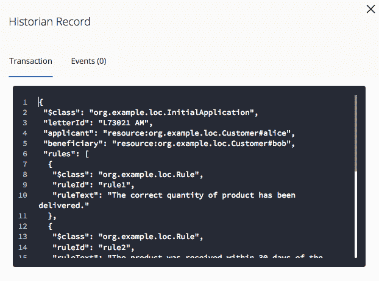

我们可以看到交易细节（我们稍微编辑了它们以适应页面）：

```
"$class": "org.example.loc.InitialApplication",
"letterId": "L73021 AM",
"applicant": "resource:org.example.loc.Customer#alice",
"beneficiary": "resource:org.example.loc.Customer#bob",
"transactionId": "c79247f7f713006a3b4bc762e262a916fa836d9f59740b5c28d9896de7ccd1bd",
"timestamp": "2018-06-02T06:30:21.544Z"
```

注意我们如何可以看到这笔交易的确切细节！再次，非常强大！花一些时间查看此视图中的交易记录。

# 向网络提交新交易

我们可以在 Playground 中做更多的事情；现在我们将动态地与业务网络进行交互！

确保你已经在测试视图中选择了`LetterOfCredit`资产类型。注意左侧窗格上的“提交交易”按钮：

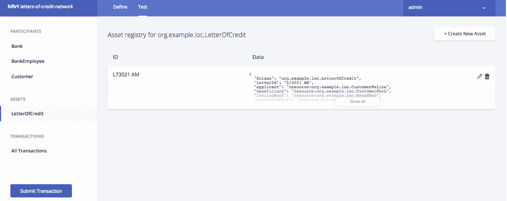

我们将通过提交新的`LetterOfCredit`申请与业务网络进行交互。如果你按下提交交易，你将看到以下输入框：

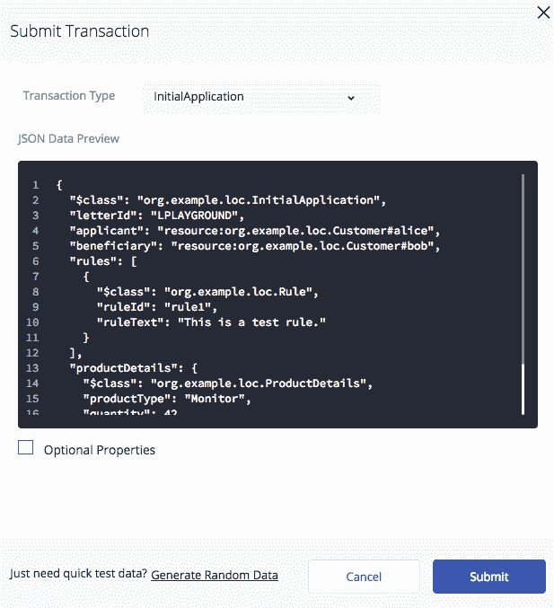

在交易类型下拉菜单中，你会看到列出了所有可能的交易。选择`InitialApplication`，并用以下数据替换 JSON 数据预览：

```
{
   "$class": "org.example.loc.InitialApplication",
   "letterId": "LPLAYGROUND",
   "applicant": "resource:org.example.loc.Customer#alice",
   "beneficiary": "resource:org.example.loc.Customer#bob",
   "rules": [
     {
       "$class": "org.example.loc.Rule",
       "ruleId": "rule1",
       "ruleText": "This is a test rule."
     }
   ],
   "productDetails": {
     "$class": "org.example.loc.ProductDetails",
     "productType": "Monitor",
     "quantity": 42,
     "pricePerUnit": 500
   }
 }
```

你能看到这个交易描述了什么吗？你能看到 Alice 和 Bob 之间的新`LetterId`作为`Customer`和`Beneficiary`吗？你能看到`ProductDetails`、`Quantity`和`Price`吗？

如果你按下提交，你会看到你被返回到主视图，并且一个新的信函已被创建：

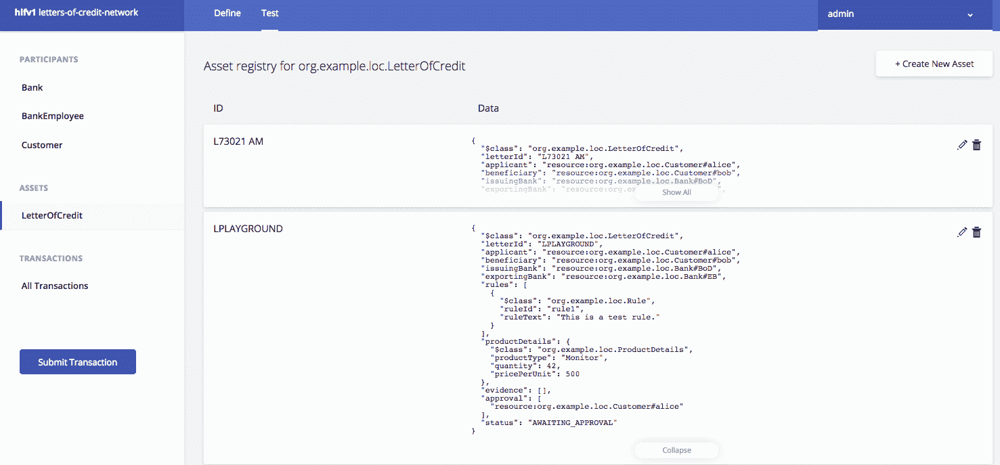

恭喜，你刚刚提交了一份新的信用证申请！

但等等！如果我们已经与实时网络交互，那么当我们返回到应用视图时会发生什么。如果你回到了 Alice 的视图，你会注意到她有一封新的信：

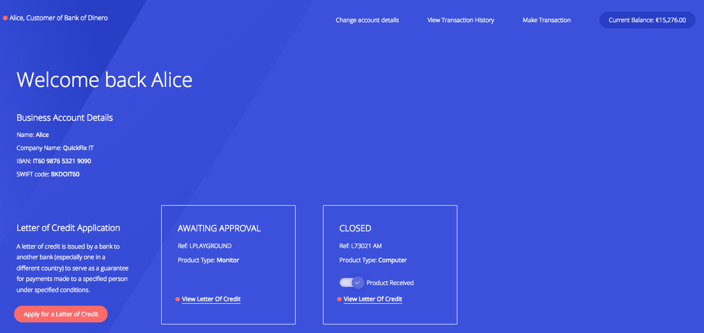

Hyperledger Composer Playground 已经让我们与实时业务网络互动！此外，如果我们选择 Matias 的页面，我们可以看到该信件正在等待批准：

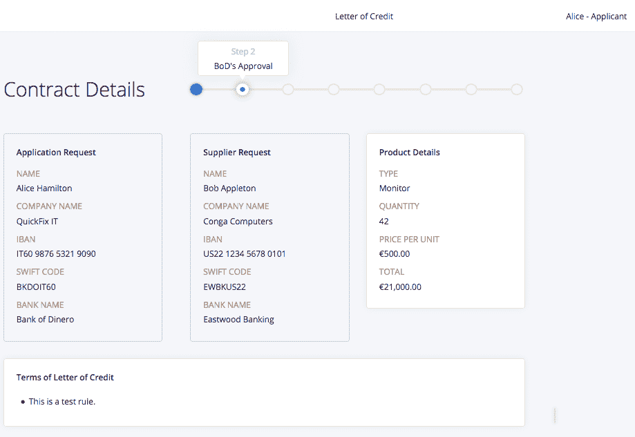

注意所有属性都是您在样本交易中输入的属性！您现在可以使用 Playground 将此信件移动到其完整生命周期。我们建议您花一些时间这样做——这将帮助您巩固您的知识。

# 理解事务如何实现

这一切都非常令人印象深刻，但它是如何工作的——实现这些操作的逻辑在哪里，操作参与者和资产，并创建事件？要理解这一点，我们需要查看事务程序——在提交到引用这些资产、参与者和事件的网络的事务时运行的代码。

事务代码保存在一个脚本文件中，如果您在 Define 选项卡上选择 Script File，您将看到以下内容：

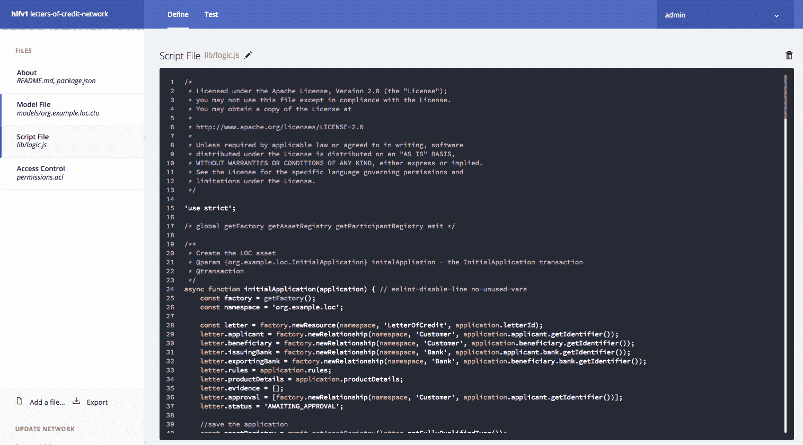

这就是实现事务的代码！今天，Hyperledger Composer 使用 JavaScript 来实现这些函数，这就是您在此页面上看到的内容——JavaScript。如果您浏览脚本文件，您将看到模型文件中定义的每个事务都有一个函数。

让我们检查到目前为止我们一直在玩的事务之一——`InitialApplication`事务。注意函数的起始方式：

```
/**
  * Create the LOC asset
  * @param {org.example.loc.InitialApplication} initalAppliation - the InitialApplication transaction
  * @transaction
  */
 async function initialApplication(application) {
```

注释和程序代码的第一行有效地说明了以下函数实现了`InitialApplication`事务，该事务接受`org.example.loc.InitialApplication`类型，并将其赋给了本地作用域的`application`变量。简而言之，它将程序逻辑与模型文件中看到的事务定义连接起来。

代码的第一行是以下内容：

```
const letter = factory.newResource(namespace, 'LetterOfCredit', application.letterId);
```

`factory.newResource()`在`org.example.loc`命名空间中使用由函数调用者在输入`application.letterId`事务变量中提供的标识符创建了一个新的本地`LetterOfCredit`。此语句将此函数的结果赋给了本地`letter`变量。

重要的是要理解，此语句并没有在业务网络中创建一封信件；`factory.newResource()`只是创建了一个正确形状的 JavaScript 对象，现在可以由以下后续逻辑来操作，并且在使用调用者提供的输入正确形成之后（例如，由 Alice 使用的申请），它可以被添加到业务网络中！

注意`applicant`和`beneficiary`是如何赋值的：

```
letter.applicant = factory.newRelationship(namespace, 'Customer', application.applicant.getIdentifier());
letter.beneficiary = factory.newRelationship(namespace, 'Customer', application.beneficiary.getIdentifier());
```

交易确保 Alice 和 Bob 的标识符正确地放置在信函中。在我们的网络中，`application.applicant.getIdentifier()`会解析为`resource:org.example.loc.Customer#alice`或`resource:org.example.loc.Customer#bob`。交易逻辑有条不紊地使用提供的输入和已经存储在业务网络中的信息构建信用证。

接下来，请注意`issuingBank`和`exportingBank`如何通过参与者导航到其银行。程序逻辑会浏览参与者和资产定义中的引用来做到这一点：

```
letter.issuingBank = factory.newRelationship(namespace, 'Bank', application.applicant.bank.getIdentifier());
letter.exportingBank = factory.newRelationship(namespace, 'Bank', application.beneficiary.bank.getIdentifier());
```

我们可以看到这些声明中，交易必须使用在模型中定义的结构。它可以添加任何专有的业务逻辑，但必须符合此结构。检查每行分配给`letter`的内容，看看您是否能理解在这些术语中发生了什么。需要花点时间来适应，但理解这一点非常重要 - 交易通过这种逻辑将业务网络从一个状态转变为另一个状态。

注意信函分配的最后一条声明：

```
letter.status = 'AWAITING_APPROVAL';
```

看看枚举类型如何被用于设置信函的初始状态。

在函数中下一个非常重要的声明是以下内容：

```
 await assetRegistry.add(letter);
```

现在这封信已经被添加到了业务网络中！此时，我们在业务网络中为信用证创建了一个新的应用程序。我们在本地存储中创建的信函已被发送到网络，并且现在是一个指向网络中参与者和资产的实时资产。

最后，我们发出一个事件来表示交易已经发生：

```
const applicationEvent = factory.newEvent(namespace, 'InitialApplicationEvent');
applicationEvent.loc = letter;
emit(applicationEvent);
```

就像处理信函一样，我们创建了一个正确形状的本地事件 - 一个`InitialApplicationEvent`，完善其细节，然后`emit()`它。通过检查不同的交易及其逻辑，您将对每个交易的精确处理变得更加熟悉 - 这个努力将给您带来丰厚的回报。

# 创建业务网络 API

在本章的最后部分，我们将展示您的应用程序如何使用 API 与业务网络中的交易功能进行交互。示例应用程序和 Playground 都使用 API 与业务网络进行交互。

实际上，您可以看到从服务消费者的角度来看，无论是 Alice、Bob、Matias 还是 Ella 都不知道区块链 - 他们仅仅与一些用户界面交互，最终导致这些交易功能（或类似的功能）被执行，以根据这些交易处理函数中编码的业务逻辑来操作业务网络。

正是这些用户界面和应用程序使用 API 与业务网络进行交互。如果您对 API 是新手，您可以在[这里](https://developer.mozilla.org/en-US/docs/Learn/JavaScript/Client-side_web_APIs/Introduction)阅读相关信息。尽管更加技术上准确，但很少有人使用术语**Web API** - 它就是**API**：

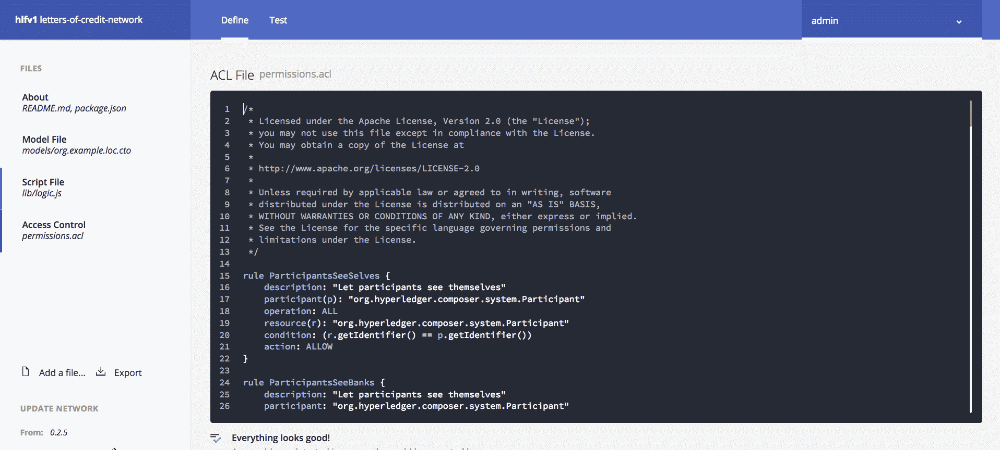

让我们来看看我们业务网络的 API！如果您选择演示的最终选项卡，您将看到以下页面：

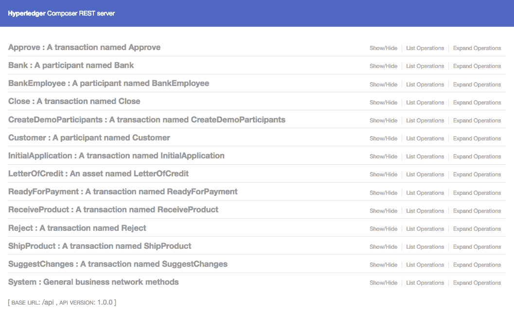

这是 Hyperledger Composer REST 服务器。它是一个服务器，正在公开我们业务网络中的 API。这些 API 使用标准 SWAGGER 格式进行描述。

# SWAGGER API 定义

SWAGGER 是一种描述 API 的开放标准 – [`swagger.io/specification/`](https://swagger.io/specification/) 这些 API 是由 Hyperledger Composer 生成的，使用与模型中定义的相同词汇来描述为此业务网络定义的参与者、应用程序和交易！这意味着 SWAGGER API 对业务用户和技术用户都具有明显的意义。

对于业务网络中的每种参与者、资产和交易类型，都有相应的 API。

# 使用 SWAGGER 查询网络

选择其中一个 API `LetterOfCredit`：

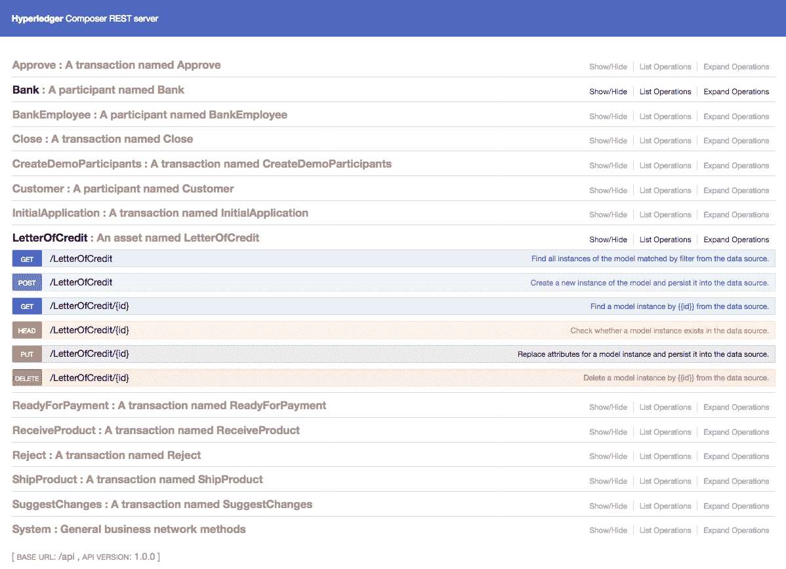

注意此 API 的 `GET` 和 `POST` 动词。大多数现代 API 使用 REST 和 JSON 进行定义，这就是您在此处看到的。练习展开和折叠视图，以查看所有不同的选项。

当您满意时，选择 `InitialApplication` `GET`：

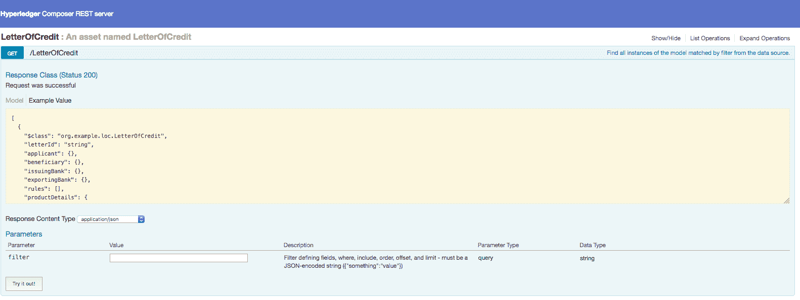

就像使用 Playground 一样，您可以使用相同的 API 与业务网络交互。作为程序员，您应该对这个视图感到满意，尽管它要技术得多。

我们选择的 API 允许程序查询（`GET`）业务网络中的所有信件。如果您选择“试一试**！**”，您将看到以下响应：

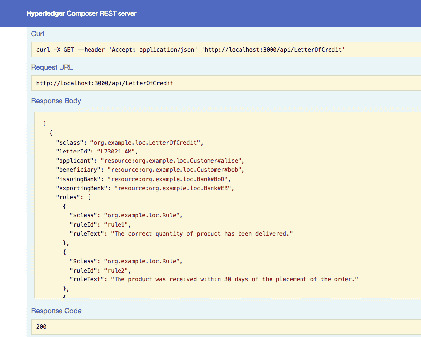

这些详细信息向您展示了发出的确切 API。这是一个在

`http://localhost:3000/api/LetterOfCredit` URL，响应体显示返回的数据。您应该能够看到它的结构与 Playground 数据非常相似，如果您滚动浏览响应，您将看到网络中的两封信。

# 从命令行测试网络

您还可以使用 `curl` 命令从终端与网络交互，并为您显示语法：

```
curl -X GET --header 'Accept: application/json' 'http://localhost:3000/api/LetterOfCredit'
```

在终端中尝试此操作，您将在命令行上看到数据：

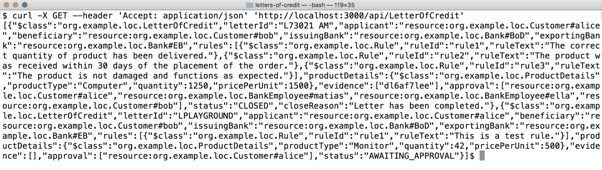

它比 Playground 或 SWAGGER 视图要不那么美观，但如果您是程序员，您知道这有多强大！想想这如何帮助自动化测试，例如。

# 使用 SWAGGER 创建新信件

我们还可以从 SWAGGER 视图为信用证创建一个新的应用程序。选择 `InitialApplication` API。

我们将使用 `POST` 动词为 Alice 创建另一个申请：

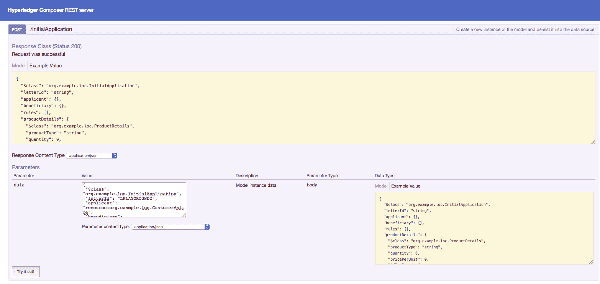

在 `value` 框中，粘贴以下数据：

```
{
  "$class": "org.example.loc.InitialApplication",
  "letterId": "LPLAYGROUND2",
  "applicant": "resource:org.example.loc.Customer#alice",
  "beneficiary": "resource:org.example.loc.Customer#bob",
  "rules": [
   {
    "$class": "org.example.loc.Rule",
    "ruleId": "rule1",
    "ruleText": "This is a test rule."
   }
  ],
  "productDetails": {
   "$class": "org.example.loc.ProductDetails",
   "productType": "Mouse Mat",
   "quantity": 40000,
   "pricePerUnit": 5
  }
 }
```

你能看出这个应用的作用吗？你能看到 Alice 想要向 Bob 以每件**5**美元的价格购买`40000`块鼠标垫的信件申请吗？

如果你点击“尝试一下！”按钮，将会创建一个新的信件！你现在可以使用 SWAGGER 控制台、应用程序或 Playground 查看这封新的信件。让我们试一下：

这是使用 SWAGGER 的视图：

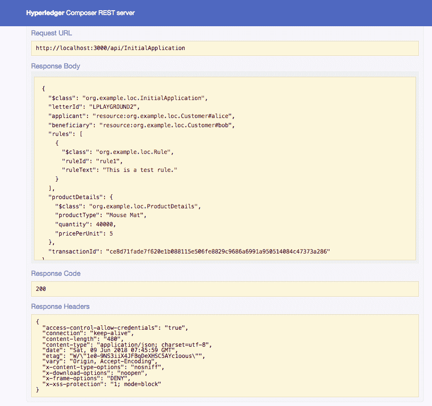

这是使用 Playground 的视图：

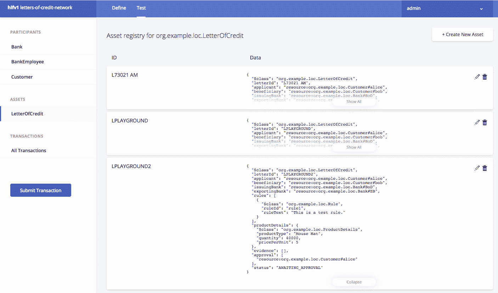

这是使用该应用的视图（Matias 的视图）：

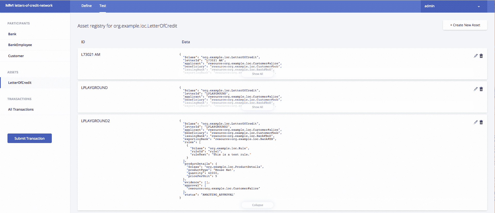

# 网络卡和钱包

最后，在结束本章之前，我们将把**你**添加到这个业务网络，这样你就可以提交交易了！为了做到这一点，我们将返回到最初允许我们连接到网络的**业务网络卡**和**钱包**。请记住，所有应用程序，包括 Playground，都有一个包含业务网络卡的钱包，可以用来连接不同的网络。当应用程序使用特定卡来连接网络时，它被标识为网络中特定的参与者实例。

1.  让我们创建一个新的参与者！在测试标签页上，选择客户参与者：

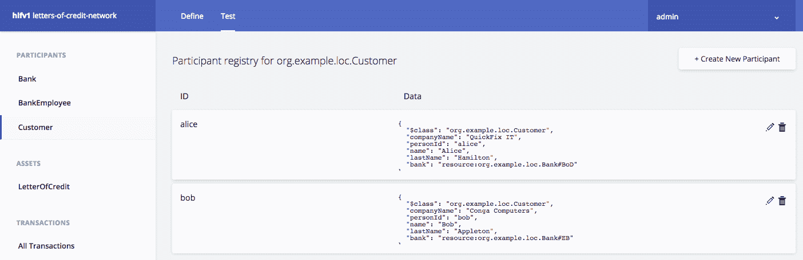

1.  你将看到 Alice 和 Bob 的参与者信息。点击“创建新参与者”：

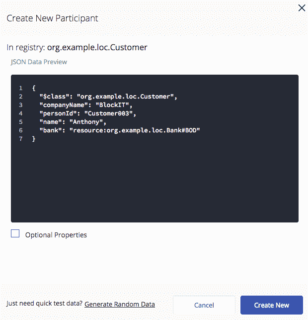

这个页面将让你发出 API 并创建一个新的参与者。我们为一个名为`Anthony`的新参与者输入了以下详细信息，他在 BlockIT 工作：

```
{
   "$class": "org.example.loc.Customer",
   "companyName": "BlockIT",
   "personId": "Customer003",
   "name": "Anthony",
   "bank": "resource:org.example.loc.Bank#BOD"
}
```

注意他的标识符和对 Dinero 银行的引用。点击“创建新的”，注意参与者注册表已更新：

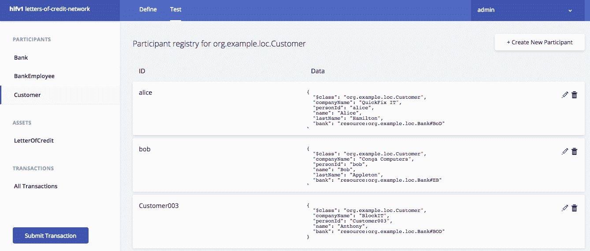

我们在网络中创建了一个新的参与者。(也可以自己输入详细信息，只要确保你的参与者有有效的数据，特别是参考现有的银行。)

点击**ID 注册表**下的管理员。现在你将看到与 Playground 相关的**身份**列表。

而 Alice 和 Bob 的数字证书是私有的，只在他们的应用程序中可见，这里我们可以看到当前 Playground 用户（业务网络管理员）相关的身份信息：

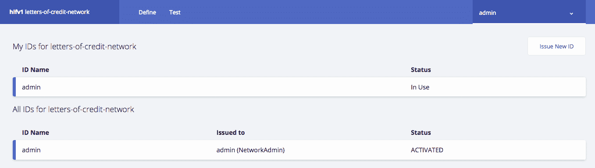

点击“发出新的 ID”：

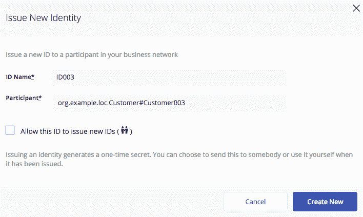

输入`ID003`为 ID 名称，并与我们创建的新参与者关联，`org.example.loc.Customer#Customer003`，然后点击“创建新的”：

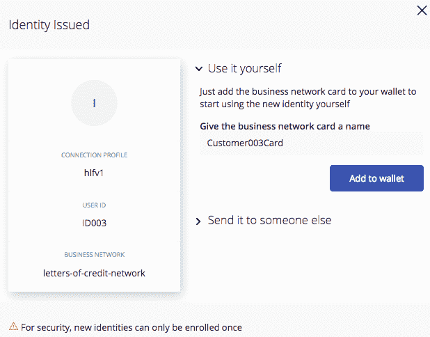

为业务网络卡命名，并点击“添加到钱包”。

你将看到 ID 列表已更新，关联了`ID003`，与`Customer003`相关：

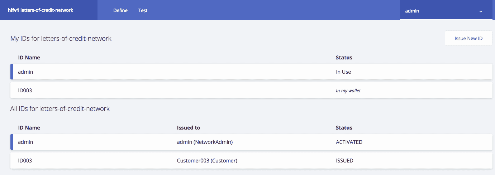

点击管理员标签下的**我的业务网络**用户，返回到 Composer Playground 的初始页面：

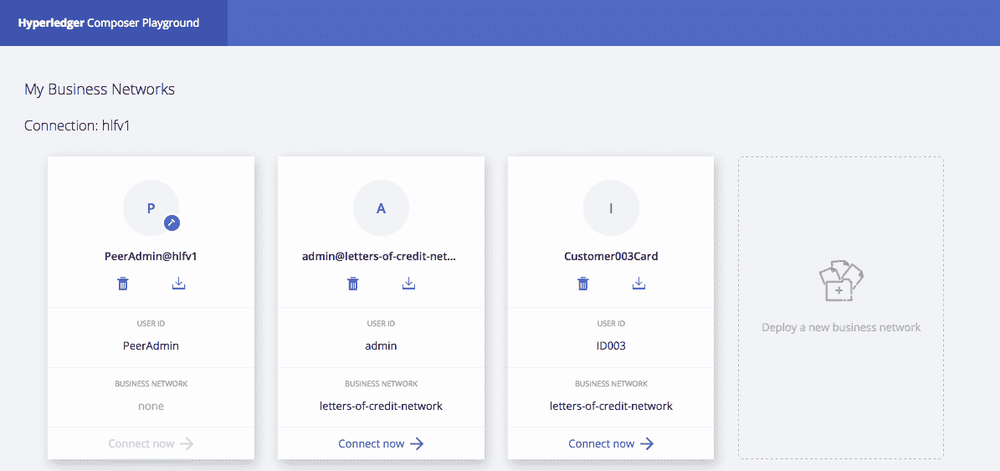

我们可以看到 Playgrond 钱包现在包含了一个新的业务网络卡，允许您连接到我们的网络。点击“现在连接”以使用 `Cusotmer003Card`。您现在作为 `Customer003` 而不是 `Admin` 连接到了网络。

# 访问控制列表

所有应用程序，包括 Composer Playground，都使用来自其钱包的业务网络卡（本地文件系统上的文件）连接到网络。该卡包含网络的 IP 地址、参与者的名称和他们的 X.509 公钥。网络使用这些信息来确保他们只能对网络中的某些资源执行特定操作的**权限**。例如，只有特定的银行员工才能授权信用证。

通过检查网络的访问控制列表（ACL），您可以看到这些权限是如何为业务网络定义的。在“定义”选项卡上选择“访问控制”：


滚动查看列表，查看不同用户对网络中不同资源拥有的权限。这些规则可能与类型或实例相关，尽管前者更常见。花一点时间研究此文件中的 ACL 规则。

# 摘要

您已经学会了如何使用超级账本技术建立真实的业务网络。您知道如何作为用户、设计师和应用程序开发人员与业务网络进行交互。您知道如何定义参与者、资产、交易和事件，并如何在代码中实现它们的创建。您知道如何将这些暴露为 API，以便外部应用程序可以使用它们！您可以通过查阅产品文档来了解更多关于超级账本 Composer 和超级账本 Fabric 的信息。拥有这些信息以及本章的知识，您已经可以开始构建自己的业务网络了！

现在让我们转向如何在区块链网络中管理开发生命周期 - 如何在区块链网络中实现敏捷性。我们将研究帮助我们设置和管理日常操作以开发区块链软件的过程和工具。
