# 区块链网络的灵活性

此时，如果一切顺利，您应该拥有一个完全功能的去中心化应用程序，其中智能合约正在 Hyperledger Fabric 上运行。有了这些知识，生活会很美好，对吧？然而，就像任何事情一样，解决方案会随着时间的推移而发展。这可能是法规的变化，财团中新成员的引入，或者您的智能合约中的一个简单错误 —— 不管原因是什么，解决方案都会发展，如果没有扎实的开发和运营实践，变化将会缓慢，您的生活将会痛苦。

考虑到在 IT 组织的开发过程中保持敏捷性已经非常具有挑战性，那么在财团中如何做到呢？不同速度的各种文化公司如何汇聚在一起，以在允许他们保持网络提供的竞争优势的时间范围内交付和维护解决方案？

尽管关于 IT 敏捷性和 DevOps 的主题已经有很多文章写得很详细，但本章将重点讨论将其中一些概念应用于区块链网络。我们说 *一些* 是因为我们的注意力将集中在那些与区块链特定/不同的概念上。通过自动化和**持续集成和交付**（**CI 和 CD**）流水线的部署，我们将讨论区块链网络对人员、流程和技术的影响。

在本章中，我们将涵盖以下主题：

+   定义推广流程

+   配置持续集成流水线

+   保护源代码控制

+   更新网络

+   财团对团队结构的影响

# 定义推广流程

你可能已经意识到，推广过程定义了任何系统修改需要经历的一系列关键活动和门槛。通常，它涵盖了开发、打包、测试（例如单元测试、功能验证和集成测试）、版本控制和部署。通常，组织会有一个标准化的方法，这个方法会被记录下来，以描述项目及其支持团队所期望的内容。在 Hyperledger Fabric 网络的情况下，至少会有两个不同的推广流程，分别为以下内容：

+   **智能合约**：由于这些组件是系统参与者之间业务互动的关键，因此每个参与者同意合约内容至关重要

+   **集成层**：由于它们位于网络的边界上，它们的推广流程将取决于它们的所有者是谁（由财团还是特定组织拥有）

可选地，网络策略的更改过程也可能存在；但是，它将与智能合约推广流程密切相关。

但是，在直接进入管道配置之前，让我们花点时间了解这两个推广流程的考虑因素。

# 智能合约考虑

正如我们所提到的，智能合约对于任何区块链网络中的参与者之间的业务互动至关重要。由于它们基本上包含了交易被视为有效的规则和条件，我们需要确保每个参与者和组织都同意其有效性——否则，信任将受到损害。

晋升智能合约的条件将包括以下内容：

+   **与问题的可追溯性**：这是一个修复bug还是一个新功能？除了这一点，组织可能需要在问题移至实施之前批准该问题。

+   **所有测试成功执行**：对一些人来说可能是不言而喻的，但大多数测试应该是自动化的，并且结果应该被记录下来。

+   **来自关键方的代码审查**：你会在不审查合同条款和条件的情况下签订合同吗？嗯，代码审查起到了类似的作用。

+   **影响评估**：新版本的智能合约是否向后兼容？不兼容的变化将需要额外的规划。

+   **来自关键方的签署**：在所有其他要点之前，您是否得到了所有相关方的祝福？你会在哪里记录？

关键方的定义将由财团定义。关键方可能是当前使用该智能合约的所有组织，或者该术语可能指的是技术负责人或创始组织成员的子集。

在晋升智能合约的条件之前，晋升频率也可能引起争议。一些组织习惯于季度周期，而其他一些组织习惯于每周部署。如果不提前讨论这一因素，摩擦不可避免，因为这将直接影响组织需要考虑的运营费用，以保持他们的参与达到财团期望的水平。还需注意的是，智能合约可能适用于整个网络或一对或一组参与者。这些智能合约的范围和各种排列组合代表了晋升所需的有趣的系统修改。

关键是修改智能合约的条件和流程应该由财团提前定义，以避免任何误解和挫折。在某种意义上，这与修改传统合同没有区别；合同修改的条件需要提前达成一致，以避免冲突。

# 集成层考虑

正如我们在[*第5章*](fa222e28-8a53-4930-b16d-cfec535f9df7.xhtml)中所见，*暴露网络资产和交易*，组织和财团可以使用一些模式来在网络上调用交易。所选的模式将有助于推动晋升流程的管理。

如果应用程序的服务层直接调用了面料 SDK，那么应用程序的所有者将不得不管理其晋升流程。如果相反，财团强制使用 REST 网关，那么你可以期望它的部署将遵循类似智能合约的流程。

无论所有者如何，集成层提供的抽象应该将应用程序与智能合约隔离开来，因此可以期望它们独立发展。然而，这并不减弱对影响评估的重要性。

# 晋升流程概述

有了这些概念定义，让我们转向我们应用程序的晋升流程。由于我们正在使用 Git 作为软件配置管理工具，我们将利用其社交编码功能来支持我们的晋升流程：

+   我们可以使用 Git issues 来记录新功能或 bug 修复

+   我们可以使用 Git 分支来隔离建议的修改

+   Git GPG 用于对每个提交和标签进行签名

+   Pull request 用于执行治理

以下图表总结了我们将用于配置应用程序的流程：

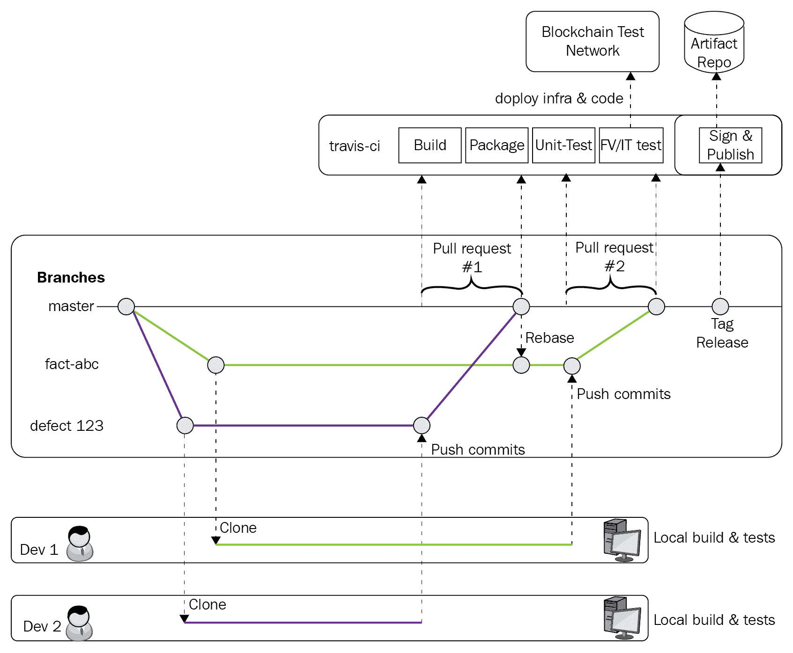

想知道什么是 pull request 吗？

本章假定读者已经熟悉了许多 Git 概念。如果不是这种情况，最好暂停一下，探索一下 Git 提供了什么。

简要来说，pull request 是人们可以在各自的 fork（即不同的存储库）或分支（在一个存储库内）之间提交代码更改的过程。它提供了一种受控的方式来审查、评论，并最终批准所有的代码更改。

现在我们将详细介绍流程，并关注信任和代码来源的问题。正如我们一直在讨论的，由于智能合约是区块链网络的核心，我们需要确保密切跟踪其发展，以避免不幸事件。从这个角度来看，我们希望从需求（Git issues）一直到部署都能追溯到。

因此，每一次代码修改都应该从创建一个 Git issue 开始。它应该准确地确定其范围——功能请求或 bug 修复，然后描述预期的工作。

我们将在接下来的几章中涵盖治理方面，但目前可以假设问题已经被优先考虑，并且工作将根据财团的优先级进行分配。

一旦开发人员被分配到处理问题，他的第一步将是创建一个临时的 Git 分支，跟踪与该 Git 问题相关的所有代码更改。代码修改绝不能在主分支上进行，因为它代表了代码的稳定版本，新功能和bug修复应该在其集成到稳定流之前进行审查。

预期开发者将在自己的本地环境中运行所有适当的测试，并且只有当代码准备就绪且所有单元测试成功完成时才将其提交回分支。

当提交更改的时候，Git 提供了一个功能，允许你使用**GPG**对所有工作进行签名。你问什么是 GPG？它代表**GNU隐私保护**，是`openpgp`标准的一个开放实现。它基本上提供了一个工具，帮助你使用自己的私钥签名和加密数据。Git 已经实现了 GPG 以允许开发人员对其工作进行签名。每个提交或标签都可以使用作者的 GPG 密钥进行签名，从而提供提交的不可否认性。

为什么使用 GPG 对代码修改进行签名？有些人可能会说这是一个额外的负担，但请考虑被修改的代码代表着一个法律合同，并且是网络信任的根源。从这个角度来看，确保作者的身份被证明是十分必要的。

对于普通提交来说，单因素身份验证可能不足以证明其作者身份；考虑一下互联网上关于有人伪造他人身份的报道。

没有签名的提交，我们可以想象到这样一种情况：一个不法开发者修改智能合约以谋取个人利益，并通过声称自己不是代码更改的真正作者而逃脱惩罚。这样的事件会危及网络的可行性，远远超过签署提交所带来的不便。

现在开发者已经签署了提交，他们准备提交一个拉取请求。拉取请求已经配置为检查以下标准：

+   临时分支已经与主分支的内容保持一致。

+   每个提交都已经签名。

+   代码所有者已经审查并接受了代码更改。

+   持续集成流水线已经成功完成。

当创建拉取请求时，流水线将自动触发。一旦所有条件都满足，那么其中一个代码所有者可以将代码与主分支合并并提交这些更改（当然要签署提交）。

在实际场景中，财团可能会有额外的环境（用户验收环境、演示环境等），在这些环境中，将会对完整的解决方案堆栈进行测试。

图中描述的最后一步侧重于为发布打标签。这里的想法是一个单一的发布可以由多个拉取请求系列构建而成。当财团准备发布一个新版本时，应该对其进行标记以代表正在部署的官方版本。

就是在这种情况下，流水线将再次被触发，但目标不同：构建、测试、签名并将智能合约发布到一个构件存储库。这个构件存储库可以是众多流行解决方案中的一个，但在我们的情况下，为了简单起见，我们将把智能合约附加到一个 Git 发布中。

有些人可能会想知为什么我们不直接在网络上部署。再次强调，目的是在中心化构建流程和网络的去中心化性质之间保持明确的区分。每个组织都可以收到新智能合约的部署通知，拉取归档文件，根据签名验证，然后部署它。

总结一下，以下是推广过程中的几个要点：

+   每次代码更改都与变更请求相关联

+   开发人员使用GPG签署其修改

+   主分支完整性由拉取请求流程保留

+   流水线为拉取请求构建和测试代码

+   当更改被标记时，流水线将智能合约发布到存储库

+   每个组织在新版本可用时收到通知

在接下来的部分，我们将开始配置我们刚刚定义的持续集成流水线。

# 配置持续集成流水线

并非所有语言都一样，并且虽然我们可以讨论强类型语言（如Java和Go）与非类型语言（如JavaScript）之间的好处，但事实上，我们需要依赖单元测试来确保代码按预期工作。这本身并不是坏事—每个代码构件都应该由一组具有充分覆盖率的测试支持。

你可能会想：这与持续交付流水线有什么关系？嗯，这一切都要看测试，对于JavaScript代码来说，这非常重要。而流水线需要确保以下内容：

+   代码符合所有质量规则

+   所有单元测试都成功

+   所有集成测试都成功

一旦这些步骤成功，流程将能够打包并发布结果。

因此，在接下来的部分，我们将尝试使用流行的云端持续集成服务之一——Travis CI来部署和配置我们的流水线。我们将涵盖以下内容：

+   定制流水线过程

+   将我们的智能合约发布到存储库

一旦所有这些都完成，我们将继续配置我们的Git仓库，以控制验证和集成变更的方式。所以，话不多说，让我们开始吧。

# 定制流水线过程

你可能还记得在我们的推广过程中，我们确定了生命周期中应该触发流水线的两个事件：

+   拉取请求

+   标记发布

有些人可能会想为什么只选择了这些特定事件。如果您回想一下流程，开发者预期在其本地环境上手动运行测试，因此不需要每次有人向自己的分支提交代码时触发管道。但是，当开始将代码交付到主分支时，重要的是在接受对主分支的更改之前验证代码是否可以构建、部署和测试。发布版本时也是如此——这表示已经裁剪了新版本，因此最后一次运行管道以发布部署单元（在我们的案例中是智能合约包）是有意义的。

无论如何，这是我们为管道设定的指南，但其他团队可能会选择不同的方法。读者应该将其视为指南，而不是连续交付的明确方法。

# 本地构建

在我们深入了解管道配置之前，让我们快速看一下构建过程是如何组织的。首先要注意的是，我们的解决方案现在技术含量丰富：Fabric、Composer、`go`、`node.js`。这些技术有很多依赖关系需要满足才能进行构建；想想 Fabric 和 Composer 的先决条件，以及 `go` 和其库、`NVM`、`NPM`、`Node` 和所有部署的软件包。

为了在本地和远程环境之间获得一致的构建输出，我们需要一种方法来减少和容纳依赖关系。

这就是使用 `Docker` 和 `make` 的方法：

+   Docker 为我们提供了一个环境，帮助我们容纳依赖关系，并使执行在不同环境之间保持一致。

+   `make` 帮助我们管理依赖关系，因为它内置于大多数操作系统中（遗憾的是，Windows 除外），所以减少了额外的工具部署和配置的需求。

这种组合使开发者可以在其系统上以最少的努力运行构建。如果系统已经安装了 Docker 和 `make`，那就可以开始了，不需要部署额外的软件包。

Windows 用户：虽然 Windows 自带 `make`，但我们建议您查看 GNU `Make`。

您可以按照此网站上的安装说明进行安装：[http://gnuwin32.sourceforge.net/packages/make.htm](http://gnuwin32.sourceforge.net/packages/make.htm)

正如我们提到的，Docker 提供了一个预构建的环境，存在于容器内，因此避免了在本地工作站上部署大量工具的需要。以下是 Composer 任务：

```
.PHONY: composer
composer:
  echo ">> Building composer package within Docker container"
  docker run --rm -v $(COMPOSER_PATH):/src -v $(DIST_DIR):/dist -w /src node:8.11 sh -c "$(COMPOSER_BUILD_CMD)"
```

分解 docker 运行命令：

+   `--rm`：在构建结束时删除容器

+   `-v`：挂载来自 git 克隆文件夹的 src 和 dist 目录

+   `-w`：将容器的 `/src` 目录设置为工作目录

+   `node:8:11`：已部署和配置了 Node 8.11 的容器镜像

+   `sh -c "$(COMPOSER_BUILD_CMD)"`：要运行的构建命令

正如你所看到的，通过最小的配置，构建现在正在容器内进行，但是使用本地 git 克隆的文件和文件夹。很好的一点是，无论是在本地运行还是在我们的构建流水线中运行，容器的行为都是一样的。

你问为什么要使用`.PHONY`？`Makefile` 是一个很棒但古老的工具。因此，它最初主要关注文件依赖关系。

如果有人曾经定义过一个名为 `build` 或 `test` 的文件，`make` 将认为任务是最新的并且什么都不做。

`.PHONY` 告诉 `make` 不将这些标签视为文件。

欢迎探索 `Makefile` 的其余任务。Chaincode 将使用不同的镜像（golang:1.9.6）构建，但采用相同的方法。

从 `Makefile` 任务的角度来看，定义了以下依赖项：

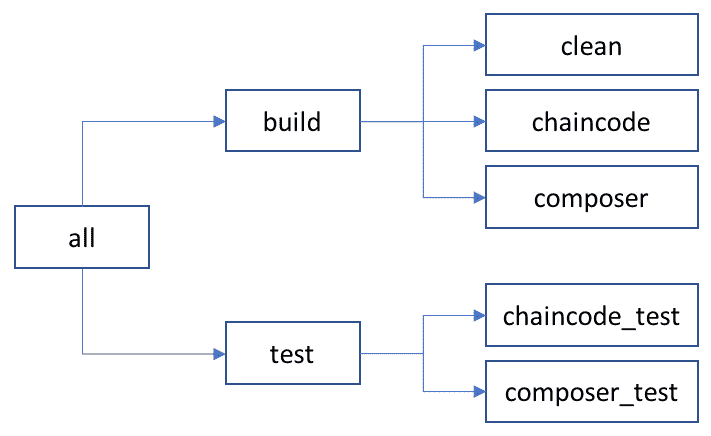

在下一节中，我们将使用 `make build` 和 `make test` 命令来执行我们的流水线。

# 配置 Travis CI

使用 Travis CI 很简单。你只需要将浏览器指向 [www.travis-CI.org](https://travis-ci.org/) 网站，使用你的 GitHub 身份进行身份验证，并授权 Travis 访问你的 GitHub 帐户，Travis CI 将为你创建一个个人资料并将其与你的 Git 帐户同步。完成这些操作后，你将看到一个 Git 项目列表。你只需要在我们的项目旁边切换开关，Travis CI 将开始跟踪你的 GitHub 存储库中的事件：

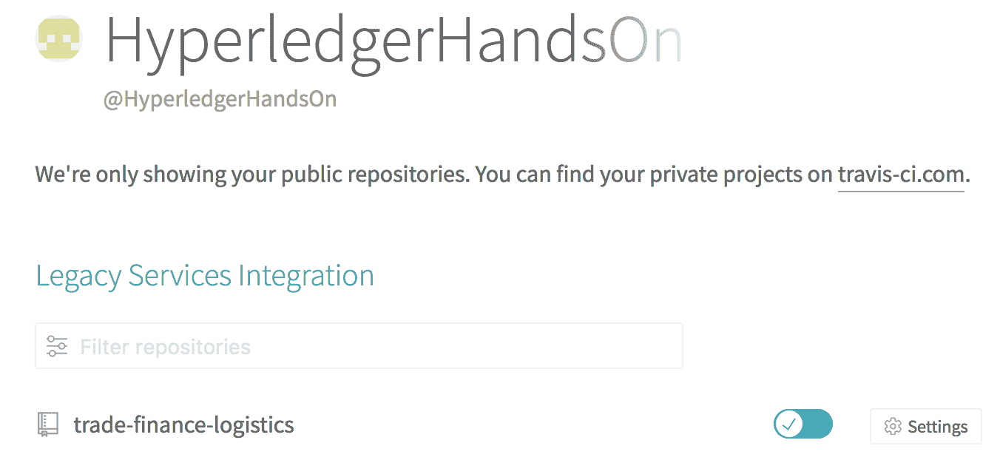

# 使用 `.travis.yml` 自定义流水线

虽然 Travis CI 现在正在跟踪我们的 Git 存储库，但它还不够智能，不知道在发生事件时该做什么。要告诉 Travis CI 怎么做，我们需要在存储库的根目录下创建一个特殊文件。每当发生 Git 事件（例如 Git 拉取请求）时，`.travis.yml` 文件将被处理并用于编排流水线执行。

在我们的智能合约的情况下，我们的 Git 存储库的根目录中有以下 `.travis.yml`：

```
sudo: required
services:
- docker
dist: trusty
cache: 
  directories:
  - node_modules
script:
- make build
- make test
```

由于我们的 `Makefile` 使用 Docker 容器进行构建，使得构建独立于其运行环境，我们需要让 Travis 知道这一点。因此，文件的前三行提供了一个指示，表明构建过程将使用 Docker。`dist: trusty` 修复了 Linux 分发，以确保系统行为的一致性。

重要的行代表了过程的两个主要步骤：

+   **缓存**：这是构建的优化，确保 node_modules 在每次构建运行时不会被重新加载。

+   **脚本**：这里提供了构建命令。在这种情况下，步骤包括以下内容：

    +   `make build`：构建 chaincode 和 composer BNA

    +   `make test`：执行单元测试

有关链码任务的详细任务已在之前的章节中讨论过，因此我们不会再次涵盖那些细节。但是我们将专注于Composer构建并探索`package.json`文件的stanza：

```
[...]
"scripts": {
  "prepare": "mkdirp ../dist && composer archive create --sourceType dir --sourceName . -a ../dist/trade-finance-logistics.bna",
  "pretest": "npm run lint",
  "lint": "eslint .",
  "test": "nyc mocha -t 0 test/*.js && cucumber-js",
 "coverage": "nyc check-coverage",
  "posttest": "npm run coverage"
},  
[...]  
```

在composer文件夹的trade-finance-logistics存储库下可以找到`package.json`。

让我们快速审查生成composer项目时生成的每个默认命令：

+   `prepare`: 此命令将我们的项目打包成BNA文件。此脚本运行在`install`之前，并将使用Hyperledger composer命令行界面来创建归档。我们对此任务唯一的修改是将子目录`..`添加到dist目录的创建和BNA文件的输出中。

+   `lint`: 运行`eslint`工具，这是我们用来分析代码并搜索模式的工具。此工具应用的规则可以通过`.eslintrc.yml`文件进行调整。

+   `test`: mocha单元测试框架将运行位于项目测试目录中的测试，并将由`nyc`工具调用。`nyc`工具用于测量mocha测试的覆盖率。

然后，您需要将这两个任务添加到package.json中：

+   `posttest`: 这个任务是在测试运行后触发的触发器。在这种情况下，它将调用覆盖率任务。

+   `coverage`: 以报告模式运行`nyc`工具。此任务将评估是否有足够的单元测试来覆盖代码。如果未满足`package.json`的`nyc`段中定义的最小值，此任务将使构建失败。以下是此`config`的样本：

```
        "nyc": {
          "lines": 99,
          "statements": 99,
          "functions": 99,
          "branches": 99
        },
```

通过修改`package.json`，我们现在有了运行测试覆盖率和代码质量验证的“门”，如果未达到最低要求，则失败。

# 发布我们的智能合约包

此时，在传统部署中，我们可以考虑自动化部署我们的应用程序以将其自动推送到生产环境。然而，在区块链网络的情况下，允许单个流程将生产代码推送到多个组织和位置可能会成为网络的软肋。

我们将BNA文件发布到受信任的存储库（在这种情况下，GitHub release），并让每个组织都拉取归档，而不是尝试将生产代码推送到多个组织。

幸运的是，Travis CI在`deploy`步骤中使用了一个函数，允许我们自动将智能合约包附加到已标记的发布版本。该函数需要在我们的GitHub账户上配置一个`OAUTH_TOKEN`，并且需要将其添加到Travis配置以允许Travis将智能合约连接到发布版。

虽然可以手动进行该配置，但Travis有一个简单的命令行界面，可自动将令牌推送到GitHub并将`deploy`部分添加到`.travis.yml`中。

我们可以使用以下命令安装`travis` CLI：

```
gem install travis
```

安装了CLI后，我们运行以下命令：

```
$ travis setup releases
Username: ldesrosi
Password for ldesrosi: ********
File to Upload: ./dist/network.bna
Deploy only from HyperledgerHandsOn/trade-finance-logistics? |yes| 
Encrypt API key? |yes| no
```

工具将询问我们一些信息：我们的 GitHub 用户 ID，密码，我们要上传的文件的位置（我们的 BNA），是否只想从我们的仓库`deploy`，以及我们是否要加密我们的 API 密钥。对于最后一个问题，重要的是要说不。我们很快会解释为什么。

工具将在`.travis.yml`文件末尾添加类似以下的部分：

```
deploy:
  provider: releases
  api_key: 3ce1ab5452e39af3ebb74582e9c57f101df46d60
  file_glob: true
  file: ./dist/*
  on:
    repo: HyperledgerHandsOn/trade-finance-logistics
```

我们要做的第一件事是将 API 密钥复制到我们的工作站剪贴板上，然后回到 Travis CI 网站。在主仪表板上，您应该看到您的仓库，在右侧，您会看到一个名为**更多选项**的按钮。点击它，然后选择**设置**，您将看到一个面板，分成几个部分。

向下滚动一点，您会找到环境变量部分。按照以下步骤进行：

1.  在`name`字段中，输入 OAUTH_TOKEN

1.  在`value`字段中，粘贴您在`.travis.yml`文件中复制的 API 密钥

1.  点击保存

结果应该如下：

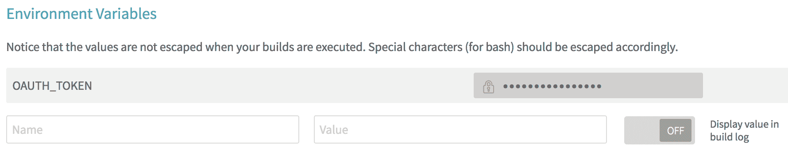

你看，虽然我们本可以将 OAUTH_TOKEN 加密在我们的 `.travis.yml` 文件中，但那样的话它就会被存储在我们的 GitHub 仓库中供所有人查看。通过将密钥移至环境中，我们避免了这种情况。

现在我们可以修改配置文件以引用我们刚刚定义的环境变量：

```
deploy:
 provider: releases
 api_key: ${OAUTH_TOKEN}
 file_glob: true
 file: ./dist/*
 on:
 repo: HyperledgerHandsOn/trade-finance-logistics
 tags: true

```

`on:`部分提供了将发布过程限制为仓库上的`tag`事件的能力。

随着`package.json`和`.travis.yml`的修改，我们只需要通过提交和推送我们的更改到主分支来更新我们的仓库。我们的流水线现在已经完全配置好了！在接下来的几节中，我们将看到网络参与者如何被通知新版本并检索归档，但现在让我们看看我们需要在 Git 中配置的内容。

# 配置您的 Git 仓库

在这一部分，我们将看到如何通过以下方式正确保护我们的 Git 仓库：

+   设置我们的智能合约的代码所有者

+   保护主分支

+   配置 Git 进行提交签名和验证

+   通过提交拉取请求来测试该过程

# 设置我们的智能合约的代码所有者

我们将首先为我们的智能合约定义代码所有者。

理想情况下，在一个大型的联盟中，代码所有者不应该是修改代码的同一组。记住，这些步骤旨在加强对网络的信任。

代码所有者在名为 `CODEOWNERS` 的文件中定义，该文件可以位于根目录或`.Github`目录中。GitHub 允许我们根据文件模式定义不同的代码所有者，因此虽然我们可以非常有创意，但我们将专注于我们 Hyperledger composer 项目的一些构件：

+   `package.json`：由于它控制了构建和打包过程，这代表了一个重要的控制文件。

+   `header.txt`：这包含许可证。因此，您可能希望有一组特定的人来监督这个（考虑律师）。

+   `JavaScript 文件`：这包含了智能合约的核心逻辑。根据复杂性，这可以根据文件进一步细分，但我们将保持在一个较高的水平上。

+   `*.cto 文件`：这应与 JavaScript 的所有者对齐。

+   `*.acl 文件`：这应与 JavaScript 的所有者对齐。

+   `*.qry 文件`：这应与 JavaScript 的所有者对齐。

+   `*.md 文件`：这代表了智能合约的文档。根据范围，这可以与 JavaScript 的相同所有者对齐，也可以是不同的一组人。

# CODEOWNERS 的示例内容

以下是基于本书作者的一组关于 `CODEOWNERS` 的基本规则。随意根据你的团队进行调整。这里需要注意的重要一点是，最后匹配的模式将用于识别需要执行审查的所有者。因此，我们必须注意规则的顺序：

```
# In this example, documentation and Header.txt are part # of the default match. Default owners if nothing else 
# matches.
*       @ldesrosi
# Code related should be validated by Rama.  
# JavaScripts files could have been separated 
# into tests versus logic by using folder's structure
*.qry   @rama
*.acl   @rama
*.cto   @rama
*.js    @rama
# Package.json should be reviewed by everyone
package.json    @ldesrosi @rama @ODOWDAIBM
```

与列出团队中的每个成员的规则相反，我们可以使用 GitHub 团队的概念来分配代码所有权。

定义了 `CODEOWNERS` 后，我们现在可以专注于将其提交到主分支。使用命令行提示，按照以下步骤进行：

1.  导航到你的存储库克隆的位置。

1.  创建一个名为`.Github`的新目录。

1.  切换到新创建的目录

1.  根据上一节中定义的内容创建 `CODEOWNERS` 文件。

1.  提交新文件和目录：

```
        Git add -A
        Git commit -m "Setting initial code ownership."
```

1.  将提交推送到主分支：

```
        Git push
```

# 保护主分支。

正如我们先前讨论的那样，由于主分支代表着智能合约的稳定版本，我们需要正确控制代码变更的引入方式。

现在，我们将配置我们的存储库，以确保只有拉取请求可以更改主分支的内容。为了实现这一点，第一步是打开浏览器并将其指向你的 Git 存储库。

一旦网页加载完成，请按照以下步骤进行：

1.  查看 Git 页面的顶部标签，你应该能够找到设置选项卡。

1.  一旦你点击它，一个侧边菜单应该出现在页面的左侧。

1.  选择“分支”菜单项，你应该能够看到“受保护的分支”部分。

1.  从下拉菜单中选择主分支。

这将打开包含我们需要设置以正确保护主分支的所有选项的页面。

内容应设置为以下内容：

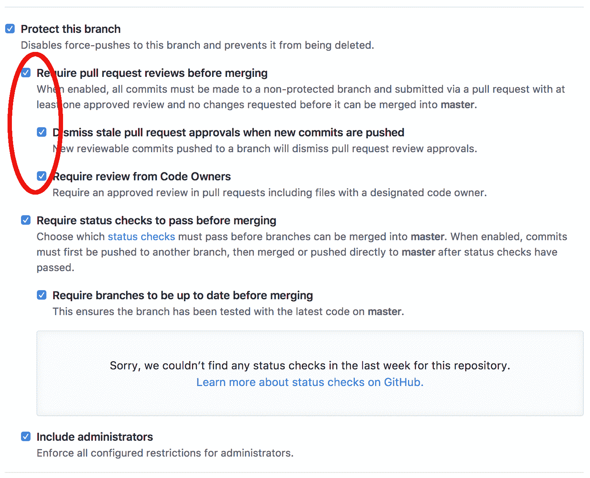

第一组选项，用红圈标出，确保每个对主分支的更改都通过拉取请求进行，并且只有代码所有者可以对最新的代码进行批准。

我们已经将此部分突出显示为红色，因为虽然这在团队工作中非常重要，但应该在我们的练习中禁用。基本上，GitHub 不会让您审核您自己的拉取请求，并会阻止您完成后续步骤。

第二组选项提供了在允许代码合并之前执行的`checks`的能力。我们将在下一节中很快添加其中一个检查。

最后一个选项还确保即使存储库的管理员在修改代码时也需要遵循拉取请求的过程。

# 配置 Git 进行提交签名和验证

此时，我们已经保护了我们的 Git 分支，并确定了谁应该审查代码更改。我们还知道签署提交是开发人员证明他们是代码更改的作者的好方法。然而，除非每个人都签署他们的提交，否则您如何确定未签署的提交是有效的呢？

幸运的是，有一些正在出现的 GitHub 应用程序来解决这个问题。我们将使用一个名为`probot-gpg`的应用程序，可在[https://probot.Github.io/apps/gpg/](https://probot.github.io/apps/gpg/)找到。

通过浏览器导航到该页面，您将能够点击安装按钮。您将被带到一个页面，允许您选择要允许应用程序选择的存储库。在我们的情况下，我们将选择`yourID/trading-smart-contract/`存储库。点击安装，应用程序将被授予对您存储库的访问权限。

# 在您的本地工作站上配置 GPG

为了确保一切都运行良好，我们现在将在我们的本地工作站上设置 GPG，并通过提交拉取请求来测试我们的存储库。在这一部分，我们将执行以下操作：

+   安装 GPG 并生成我们的一组`gpg`公钥和私钥

+   在我们的 GitHub 配置文件中导入我们的`gpg`公钥

+   提交一个带有签名的拉取请求到主分支

`gpg`的客户端应用程序可以在[www.gnupg.org](https://gnupg.org/)网站上找到。从网站上，您可以下载源代码或预编译的二进制文件。根据您的操作系统和选择的选项（源代码或二进制文件），按照网站上提供的说明进行操作并安装客户端。

为了配置系统使用`gpg`密钥签署我们的 Git 提交，我们需要执行以下操作：

1.  生成一个`gpg`密钥

1.  导出公钥

1.  在我们的 Git 中导入公钥

1.  配置我们的 Git 客户端以使用我们的`gpg`密钥

要开始，请打开终端并键入以下命令：

```
gpg --full-generate-key
```

`gpg`工具现在将询问有关密钥特性的几个问题：

+   **密钥类型**：选择默认（RSA 和 RSA）

+   **密钥大小**：选择最大尺寸（4,096）

+   **密钥有效期**：确保密钥不会过期

提供了与密钥相关联的身份信息后，`gpg`工具将询问与密钥相关联的身份信息：

+   **真实姓名**

+   **电子邮件**

+   **评论**：您可能想使用评论框来指示此身份的目的（签署GitHub提交）

确保电子邮件与您的GitHub配置文件中的条目匹配，否则系统将无法将身份与提交进行协调。 请记住，对于GitHub来说，大小写很重要：`yourID@email.com` 和 `yourID@email.com`不是相同的电子邮件。

最后，工具会要求输入密码来保护私钥，并要求您通过移动鼠标来生成熵。 几秒钟后，您应该会看到以下输出：

```
gpg: key 3C27847E83EA997D marked as ultimately trusted
gpg: directory '/Users/yourID/.gnupg/openpgp-revocs.d' created
gpg: revocation certificate stored as '/Users/yourID/.gnupg/openpgp-revocs.d/962F9129F27847E83EA997D.rev'
public and secret key created and signed.
pub   rsa4096 2018-02-03 [SC]
      962F9129FC0B77E83EA997D
uid    Your Name (GitHub Signing Identity) <yourID@email.com>
sub   rsa4096 2018-02-03 [E]
```

创建了`gpg`之后，我们现在需要以GitHub能够理解的格式导出该密钥。 为此，我们运行以下命令：

```
gpg --armor --export <<email-you-use-to-generate-the-key>>
```

工具将在控制台直接输出公钥，并应如下所示：

```
-----BEGIN PGP PUBLIC KEY BLOCK-----mQINBFp1oSYBEACtkVIlfGR5ifhVuYUCruZ03NglnCmrlVp9Nc417qUxgigYcwYZ
[…]
vPF4Gvj2O/l+95LfI3QAH6pYOtU8ghe9a4E=
-----END PGP PUBLIC KEY BLOCK-----
```

将整个密钥复制到剪贴板上，包括标头，并使用您的浏览器转到您的GitHub配置文件，并从左侧菜单中选择**SSH和GPG keys** 选项卡。

您应该会看到两个部分—SSH和GPG。 单击“New GPG Key”按钮，并粘贴剪贴板中的内容到显示的输入字段中。 最后，单击“Add GPG Key”按钮，如果一切顺利，GitHub应该显示类似的条目：

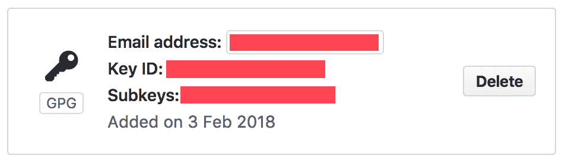

注意并复制密钥ID到剪贴板。 我们将重复使用该密钥来配置我们的Git客户端。

回到控制台，键入以下命令：

```
git config --global user.signingkey 3C27847E83EA997D
```

此时，您应该已经拥有完全配置的流水线和受保护的Git存储库。 我们现在准备开始测试我们的配置。

为了简化下一节中的测试步骤，我们还没有在Git客户端中激活`gpg`签名配置。 我们将在下一节中激活它。

# 测试端到端流程

所有配置都完成后，我们将通过一个简单的场景来测试我们的配置，并确保一切顺利运行。

场景将包括解决添加新交易的需求。 为了提供这个新功能，我们将执行以下步骤/测试：

1.  为我们的业务网络创建一个新的交易。 完成编码后，我们将尝试执行以下操作：

    1.  直接向主分支推送一个提交

    1.  提交一个未签名的提交的拉取请求

1.  添加测试用例以覆盖我们的新交易：

    1.  修改我们的提交以进行签名

    1.  添加我们的测试用例并提交另一个已签名的提交

1.  发布业务网络的新版本

    1.  将拉取请求合并到主分支

    1.  创建一个新的发布版本并检查BNA是否已发布

# 创建一个新的交易

为了我们的测试目的，我们将使新交易相对简单：我们的交易将合并两个资产为一个，同时增加它们的价值。

要声明新交易，我们将编辑模型文件并添加此新声明：

```
transaction MergeAssets {
--> Asset mergeFrom
--> Asset mergeTo
}

```

定义创建完成后，让我们在`/lib/logic.js`文件中添加逻辑：

```
/**
  * Sample transaction
  * @param {org.example.biznet.MergeAssets} tx
  * @transaction
  */
function onMergeAssets(tx) {
  var assetRegistry;
  var mergeFromAsset = tx.mergeFrom;
  var mergeToAsset = tx.mergeTo;
  mergeToAsset.value += tx.mergeFrom.value;

  return getAssetRegistry('org.example.biznet.SampleAsset')
    .then(function(ar) {
      assetRegistry = ar;
      return assetRegistry.update(mergeToAsset);
    })
    .then(function() {
      return assetRegistry.remove(mergeFromAsset);
    });
}
```

就是这样！当然，有些人可能会说我们没有遵循良好的方法论——这段代码的单元测试在哪里？让我们继续。别担心，这都是计划的一部分！

# 直接将提交推送到主分支

完成代码修改后，让我们尝试将源代码添加到Git存储库中。为此，我们将执行以下步骤：

1.  导航到存储库克隆的位置

1.  提交新文件和目录：

```
git add -A 
git commit -m "Testing master branch protection."
```

1.  将提交推送到主分支：

```
git push
```

`push`命令应该失败，并显示错误消息，例如以下内容：

```
$ git push
Counting objects: 3, done.
Delta compression using up to 8 threads.
Compressing objects: 100% (2/2), done.
Writing objects: 100% (3/3), 367 bytes | 367.00 KiB/s, done.
Total 3 (delta 0), reused 0 (delta 0)
remote: error: GH006: Protected branch update failed for refs/heads/master.
remote: error: Waiting on code owner review from ldesrosi.
To https://github.com/HyperledgerHandsOn/trade-finance-logistics.git
 ! [remote rejected] master -> master (protected branch hook declined)
error: failed to push some refs to 'https://Github.com/yourID/trading-smart-contract.Git'
```

如果你收到类似的消息，说明你走在正确的道路上。如果`push`命令成功，你应该回到*保护主分支*部分。

# 使用未签名的提交提交拉取请求

继续我们之前的尝试，我们知道我们需要一个单独的分支来存储我们的工作，然后我们才能向主分支提交拉取请求。现在我们已经提交了一个更改，我们需要小心不要丢失我们的工作。我们要做的第一件事就是通过运行以下命令*撤销*我们的提交：

```
git reset HEAD^
```

为了保存我们的工作，我们将使用Git中一个很好的功能，它会暂时存储我们的工作：

```
git stash
```

保存我们的修改后，我们可以通过运行`Git checkout`命令在本地创建新分支。对于那些对Git不太熟悉的人，`-b`选项指定了新分支的名称，最后一个参数表示新分支是基于主分支的：

```
git checkout -b Feat-1 origin/master
```

在本地创建了新分支后，我们可以使用以下命令恢复我们的修改：

```
git stash pop
```

最后，我们可以提交我们的代码并将其推送到`Feat-1`分支：

```
git add -A
git commit -m "Testing commit signing."
git push
```

执行这些命令后，我们的`Feat-1`分支现在应该包含额外的交易代码。让我们切换到我们的浏览器上，在GitHub上创建拉取请求：

1.  选择`Feat-1`分支，然后点击“New pull request”按钮

1.  确保分支可以合并，然后点击**创建拉取请求**按钮

下一个屏幕上的结果将显示拉取请求未通过`gpg`检查和Travis构建。构建的详细信息应该显示测试覆盖率不足以达到我们之前设定的阈值：

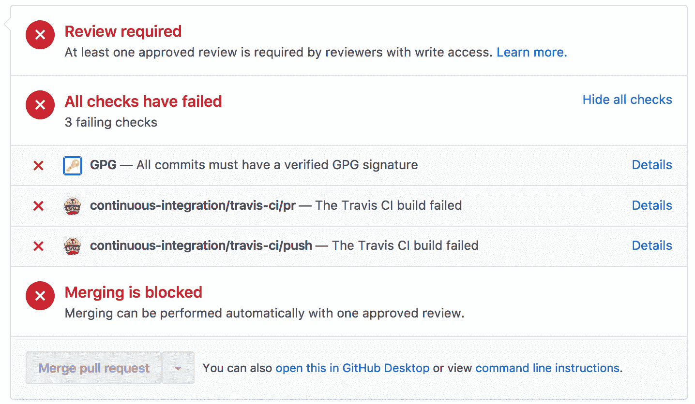

如果你得到相同的结果，那么你做得很好！如果你的拉取请求没有出现这样的检查失败，请确保查看*为提交签名和验证配置Git*部分。

现在我们将修正我们的构建并添加必要的测试！

# 添加测试用例

在添加我们的测试用例之前，我们将首先启用`gpg`签名，并用签名修改我们之前的提交。这应该让我们走上健康拉取请求的正确道路。

# 使用签名提交提交拉取请求

现在我们可以完成并激活我们的`gpg`签名了。在控制台中，输入以下命令：

```
git config --global commit.gpgsign true
```

现在，不必再创建一个单独的分支并再次执行相同步骤，我们将简单地`amend`我们的`commit`并为其添加我们的签名：

```
git commit --amend -S -m "Testing commit signing."
```

当尝试修改您的提交时，您可能会遇到以下错误：

`error: gpg failed to sign the data`

`fatal: failed to write commit object`

如果需要，您可能需要设置以下环境变量：

`export GPG_TTY=$(tty)`

该命令将委托给GPG进行签名，然后您应该被要求输入您的`gpg`密码。完成后，我们可以使用以下命令将更改推送到我们的测试分支：

```
git push origin test --force
```

我们需要`--force`我们的更改，因为我们只是修改我们的提交。

如果您返回浏览器并查看拉取请求，您现在应该看到类似以下的内容：

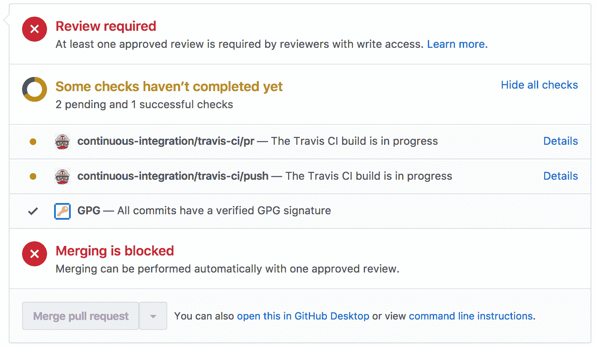

我们应该已经解决了一个问题——提交的签名。如果您得到了相同的结果，现在您知道一切都配置正确了。您可以继续专注于通过为新交易添加一个测试来修正测试覆盖率。

# 添加合并资产单元测试

让我们将这个额外测试用例的内容添加到`test/logic.js`文件中：

```
 describe('MergeAssets()', () => {
 it('should change the value to ' + assetType + ' to 200', () => {
 const factory = businessNetworkConnection.getBusinessNetwork().getFactory();
 // Create the asset 1
 const asset1 = factory.newResource(namespace, assetType, 'ASSET_001');
 asset1.value = 100;
 // Create the asset 2
 const asset2 = factory.newResource(namespace, assetType, 'ASSET_002');
 asset2.value = 100;

 // Create a transaction to change the asset's value property
 const mergeAssetTx = factory.newTransaction(namespace, 'MergeAssets');
 mergeAssetTx.mergeFrom = factory.newRelationship(namespace, assetType, asset1.$identifier);
 mergeAssetTx.mergeTo = factory.newRelationship(namespace, assetType, asset2.$identifier);

 let assetRegistry;
 return businessNetworkConnection.getAssetRegistry(namespace + '.' + assetType).then(registry => {
   assetRegistry = registry;
   // Add the asset to the appropriate asset registry
   return assetRegistry.add(asset1);
 }).then(() => {
   return assetRegistry.add(asset2);
 }).then(() => {
   // Submit the transaction
   return businessNetworkConnection.submitTransaction(mergeAssetTx);
 }).then(() => {
  // Get the asset
  return assetRegistry.get(asset2.$identifier);
 }).then(newAsset => {
  // Assert that the asset has the new value property
  newAsset.value.should.equal(200);
 });
});
});
```

我们不会详细介绍此测试用例，因为在前几章中已经涵盖过。但是，如果想查看测试是否成功完成，请运行以下命令：

```
npm test
```

让我们提交这个新测试到Git：

```
git add -A
git commit -S -m "Added new test case"
git push origin Feat-
```

这应该会自动触发我们的构建流程，该流程应该成功完成，并将我们的拉取请求留在以下状态：

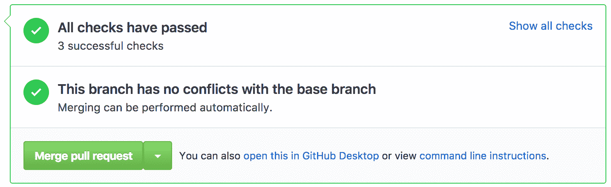

这将使您能够合并拉取请求。点击合并请求按钮，确认合并，并准备创建您的第一个发布版本！

如果您的拉取请求不是绿色的并要求代码审查，您可能忘记了取消选中"在合并前需要拉取请求审查"选项，正如"保护主分支"章节所述。

# 发布新版本

现在我们已经准备好发布我们的新业务网络归档。转到您的网页浏览器，导航到Git存储库的Code标签。您应该会在顶部导航栏中看到"x releases"选项，如下截图所示：


点击发布然后点击"起草新发布"按钮。填写表单，类似于以下示例：

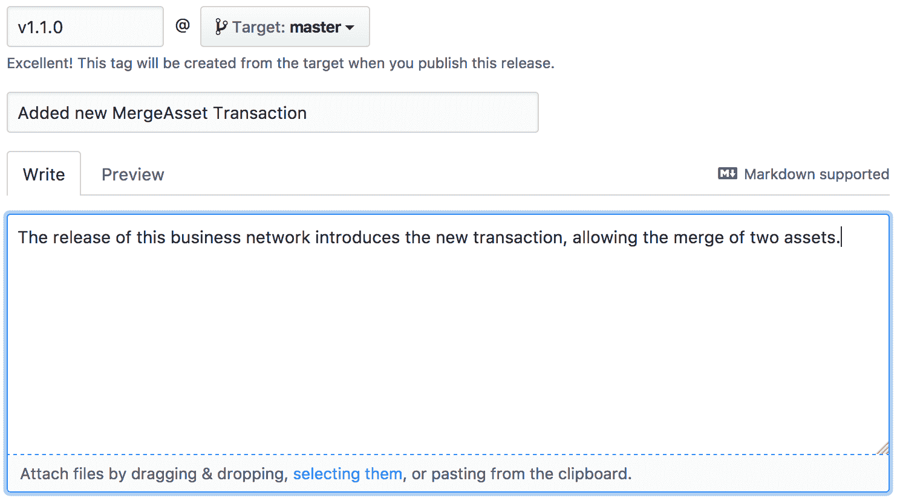

在表单底部点击"发布版本"按钮。这应该会再次触发您的构建流程，几分钟后，您应该会看到与您的发布相关联的资产列表中附有BNA文件：

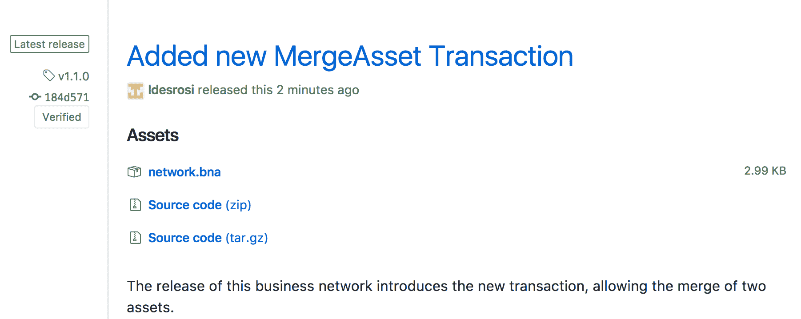

干得好！我们已经使用Travis CI和GitHub配置了完整的流水线，并探讨了如何正确签署和保护我们的智能合约。

我们的最后一步现在将是看看各种网络参与者如何自动检索**业务网络归档**（**BNA**）并`deploy`智能合约更新。

# 更新网络

随着BNA文件发布并标记为发布，我们现在将查看安装/更新财团中业务网络的过程。更具体地说，我们将查看以下步骤：

+   发布通知

+   业务网络更新

# 通知财团

有一些方法和技术可以应用以确保每个组织都收到业务网络准备更新的通知。

唯一确定的是手动通知不是一个选项；随着智能合约和参与者数量的增长，您需要一个可靠的通知过程。

以下图示了在交付新版本后部署业务网络的潜在过程：

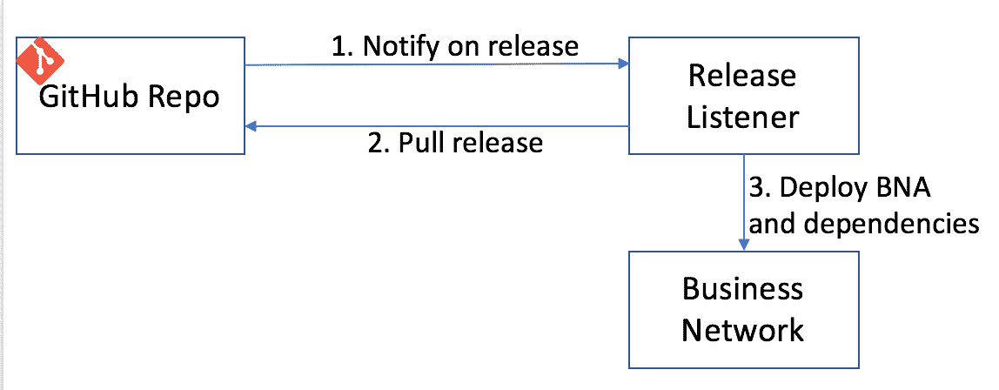

正如我们之前讨论过的那样，我们不分发BNA，因为这会为某人篡改归档提供机会。相反，通知只是通知每个组织存在新版本，并让财团检索和`deploy`归档。

这实际上是发布监听器概念正在做的事情：监听通知，然后向GitHub发出请求，以检索新发布的归档。

发布监听器是一个概念，如果财团决定遵循这种方法，就需要由财团实施。

不要寻找源代码—它不存在（尚未存在）。

发布监听器可以实现监听来自两个来源的事件：

+   **GitHub Webhooks**：通过提供发布监听器的URL，可以配置GitHub Webhooks以在特定事件上发送JSON消息。在我们的情况下，将是`Release`事件。

+   **Travis CI通知**：Travis CI中也有类似Webhook的概念。还有其他机制，例如Atom feed和Slack集成，可能更适合您的团队。

机制的选择实际上取决于您的业务要求，但通常，使用GitHub Webhooks将是首选，因为它们由我们感兴趣的实际事件触发：智能合约的新版本发布。

即使有人向发布监听器发送错误通知，因为它只从GitHub检索发布的二进制文件，第三方也无法注入**有害**归档。

# 升级业务网络

此时，我们假设我们已收到通知，并且我们负责部署新版本。请记住，业务网络可以部署到多个频道中。因此，虽然不需要在每个对等体上部署BNA，但对于期望运行这些交易的每个频道都需要部署。

我们的部署将包括两个简单步骤：

1.  下载新版本

1.  更新业务网络

# 下载新版本

鉴于我们刚刚发布了新版本，并且管道已将二进制文件添加到发布中，我们可以使用以下 `curl` 命令简单地下载归档文件：

```
curl https://Github.com/HyperledgerHandsOn/trade-finance-logistics/releases/download/v1.1.0/network.bna -L -o network.bna
```

`-L` 选项用于告诉 `curl` 去跟随任何重定向命令。执行此命令后，BNA 文件应该位于您的本地文件系统上。

# 更新业务网络

由于 BNA 内容实际上存储在世界状态中，因此可以从具有对管理证书访问权限的任何客户端提交业务网络更新。

因此，要更新网络，请提交以下命令：

```
composer network install -a ./network.bna -c <card-name>
composer network upgrade -n trade-finance-logistics -v 0.0.1 -c <card-name>
```

为了测试更新 BNA 的部署，请参考：[https://github.com/HyperledgerHandsOn/trade-finance-logistics/tree/master/composer](https://github.com/HyperledgerHandsOn/trade-finance-logistics/tree/master/composer)。

请注意，其他依赖组件，如 REST 网关和应用程序，在生产部署中也需要考虑。

# 概要

希望本章对您理解如何使联盟围绕推广流程达成一致所需的挑战和考虑有所帮助。

持续交付流水线是提供给联盟速度的基本部分，消除手动流程，并确保每个组织可以在代码上线之前审查和批准代码更改。我们已经看到了一些关键事件，比如拉取请求和标记发布。

在本章过程中，您已经完成了完整的持续集成流水线配置，包括测试和发布业务网络存档。此外，我们已经看到了如何通过保护主分支和确保每个更改都受到组织关键参与者代码审查来保护生产就绪代码。我们还研究了如何使用 `gpg` 签名保留每个 Git 提交的来源。最后，我们审查了一种以可信方式部署更新的过程。

有一件事是肯定的：自动化是敏捷的关键—通过消除重复的手动任务并为我们修改代码提供结构，我们使组织能够更具敏捷性并快速响应，无论是对缺陷还是新需求。当然，本章仅是这种方法及其相关概念的一个小介绍；其中一些主题可能值得拥有自己的书籍。
