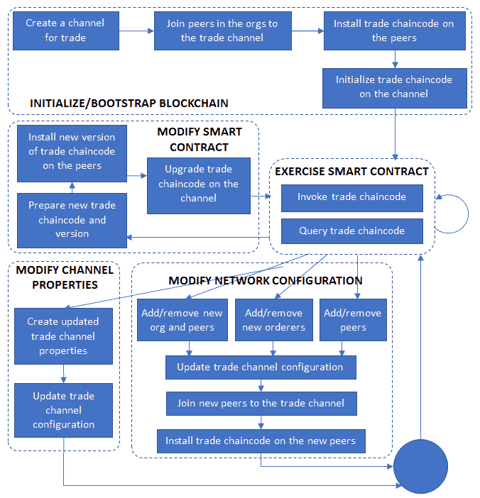
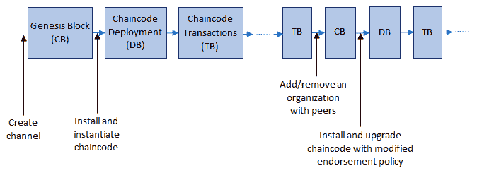
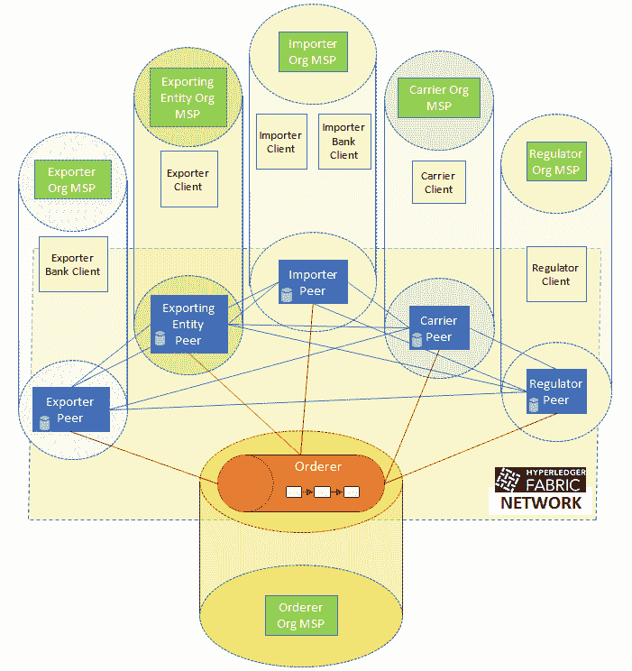
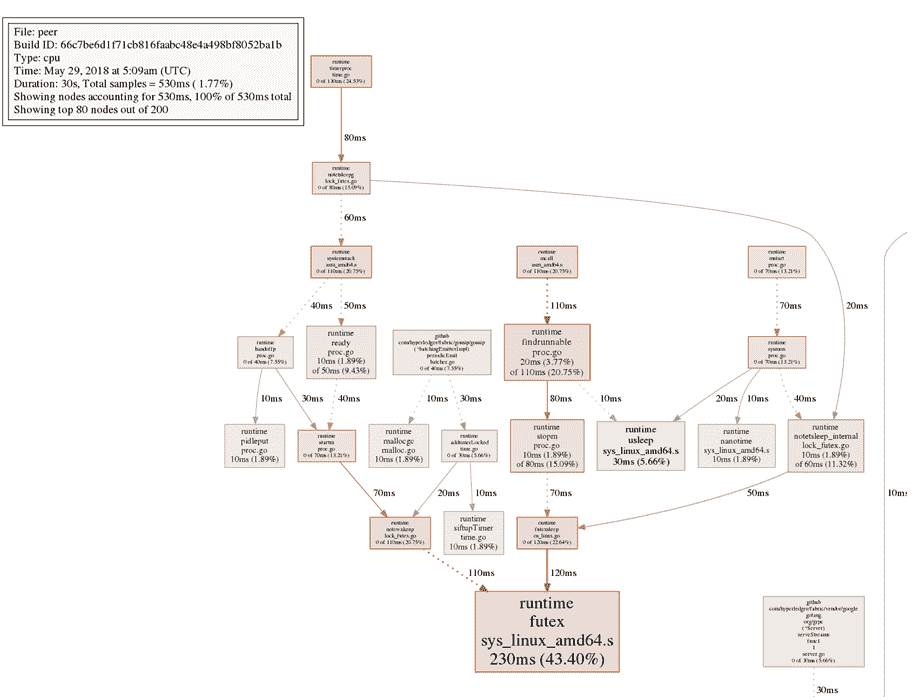

# 区块链网络中的生活

您的Fabric网络现在应该已经设置并运行了通过智能合约连接不同实体并通过Web界面为用户提供服务的应用程序。此外，为了帮助您的开发人员和系统管理员维护代码、推送更新并管理网络配置，您应该建立了一个流程，该流程可以在保护措施的情况下进行系统测试和维护，而不会中断服务。

然而，这并不会是您应用程序的终极状态。需求和期望会不断发展，这对于涉及多个协作实体的应用程序尤其如此，每个实体在不同时间点都将具有不同的要求。此外，预计即使应用程序的性质和功能保持不变，软件本身也将不断变化和演变。最后，任何分布式服务型应用程序（这个描述可以应用于任何Hyperledger Fabric应用程序）都必须为终端用户的性质和数量随时间增加或减少做好准备，从而需要对硬件和软件资源分配进行更改。

在您的区块链应用程序的生命周期内，您将看到许多变化，需要对代码和配置进行更新。之前列出的变化类型并不是Fabric网络或甚至区块链一般所特有的，但我们将需要使用的机制以及选择这些机制的考虑因素非常具体。因此，这将是本章的主要，尽管不是唯一的焦点。我们将首先探讨您的Fabric应用程序可能需要进行修改的不同方式，通过示例代码和配置来说明具体的场景，并提供规划系统升级的指南。然后，我们将讨论应用程序和网络成员变化以及适用于行业规模区块链应用程序的相关考虑因素。在本章的后端，我们将深入了解系统维护：监控应用程序和系统资源的健康状况，并设计或升级系统以确保高性能。

本章将涵盖以下主题：

+   修改或升级Hyperledger Fabric应用程序

+   Fabric区块链和应用程序的生命周期

+   将新组织添加到网络中

+   链码逻辑的修改

+   链码依赖升级

+   背书策略更新

+   系统监控和性能

+   容器和应用程序的配置文件

+   应用程序性能的衡量

# 修改或升级Hyperledger Fabric应用程序

在[*第5章*](fa222e28-8a53-4930-b16d-cfec535f9df7.xhtml)，*暴露网络资产和交易*中提供的通用Hyperledger Fabric应用程序的设计，提供了关于其生命周期中可能需要的升级类型的提示。让我们来看看随着时间推移，Fabric网络及其用户的需求如何发生变化的各种方式：

+   **软件更新**：变更和升级是软件维护的重要组成部分。更频繁地，修改是为了修复错误、提高性能效率和解决安全漏洞（例如，想想Windows Update服务）。较少地，但几乎同样不可避免的是，必须对软件进行重大设计更改以应对未预料到的挑战。另外，考虑到大多数应用程序依赖于其他（第三方）软件，后者的任何升级都会触发前者的相应更改。可以把Windows Service Packs类比一下。

    在Hyperledger Fabric世界中，作为应用程序开发人员或系统管理员，你必须支持应用程序级别的升级和平台级别的升级。前者涉及错误修复和应用逻辑的更改，后者涉及底层Fabric软件的更改。软件更新流程是众所周知的，一些技术在[*第5章*](fa222e28-8a53-4930-b16d-cfec535f9df7.xhtml)，*暴露网络资产和交易*中已经讨论过；对于故障修复和常规维护，一些测试和可靠的故障转移技术同样适用。

如果你还记得我们的典型Fabric应用程序的3层架构，那么上层，包括中间件（使用Fabric SDK）、Web服务器和用户界面，通常由单个组织控制，因此可以通过该组织内部制定的流程进行更新。但是，正如我们在[*第8章*](112a5075-378d-4bb0-9b9e-db81c18a35f5.xhtml)中所看到的，*区块链网络中的敏捷性*，智能合约或链代码是一个特例，因为它是所有参与组织共同同意并开发的一段软件。因此，对链代码的任何更新也必须是基于共识的，并且不像只需测试后推送更新那么简单。我们将在本节稍后的示例中描述链代码升级过程。

最后，Fabric软件的升级可能会影响功能和数据，因此必须小心进行。我们将在本节后面描述机制和风险。

+   **资源需求变更**：在应用程序生命周期的开始阶段分配的资源，就像应用程序代码一样，不太可能满足不断变化的用户需求。随着时间的推移，你的应用程序很可能会接收到越来越多的用户流量，而硬件的限制是没有任何软件改进可以弥补的。同样地，如果我们回顾一下RAS的要求（参见[*第5章*](fa222e28-8a53-4930-b16d-cfec535f9df7.xhtml)，*暴露网络资产和交易*），一个分布式应用程序的正常运行需要在系统资源之间实现冗余、故障转移和负载均衡。

    在 Fabric 的术语中，这意味着你可能需要向你的网络添加更多节点。您可能需要更多的同行来处理交易背书请求，整个网络可能需要更多的排序节点来处理当前瓶颈的排序服务的负载和平衡（另一方面，如果流量太小，可以删除节点以节省成本）。否则，您可能需要额外的同行节点在组织中仅用于背书证实或额外的排序节点以获得更可靠的分布式共识（尽管这可能会带来性能成本）。无论添加和删除网络中的节点的原因是什么，作为 Fabric 开发人员或管理员，您必须支持这种升级，我们将在本节的后面看到如何做到这一点。

+   **更改用户成员资格**：除了用户流量的变化外，我们必须为系统访问权限随时间的变化做好准备。在 Fabric 中，这意味着添加或移除可发送请求到应用程序并查看应用程序状态的用户或客户端。在一个组织内，总会有需要添加或移除被允许访问区块链的用户，并提升或降低对现有用户授予的特权。我们已经在[*第5章*](fa222e28-8a53-4930-b16d-cfec535f9df7.xhtml)中讨论了成员创建和授权的例子，*暴露网络资产和交易*，在本节的后面，我们将看到如何使用运行时配置更新通道策略。

+   **更改应用程序策略**：Hyperledger Fabric 应用程序中的交易（链码调用）必须满足背书策略，这些策略由参与者共同决定。这样的策略会随着时间的推移出于多种不同的原因而改变，包括性能（我们将在本章的后部分讨论）。例如，用于批准每个组织成员的背书策略可能会放宽为只需要两个组织的背书要求。另一方面，策略也可以变得更为严格，以克服区块链参与者之间缺乏信任的问题。Fabric 提供的修改背书策略的机制将通过后面本节中的示例进行讨论。

+   **更改网络配置**：最后，总会有对区块链网络本身进行修改以满足增强期望的需要。随着时间的推移，更多组织可能希望参与应用，特别是如果应用的初始版本证明了其价值。一些组织可能也会因为各种原因而想要离开。即使在一个给定的组织中，也可能需要扩展或重新平衡用于特定应用的资源。尽管大多数分布式应用都面临这些需要增强和资源重新配置的情况，但由于其独特的性质，区块链应用有特殊的需求。请记住，区块链是一个共享分类账，必须由每个参与的网络对等方使用共同约定的规则进行验证和接受。因此，网络的结构和属性本身必须得到共同的认可并记录在分类账上。在Hyperledger Fabric术语中，一个应用是建立在一个或多个通道（区块链实例）上的，其规则和内容对应用参与者是私有的。因此，网络中的任何变化都需要将配置更改应用到一个通道上。添加具有自己对等节点集的新组织或删除一个组织将需要通道重新配置，如对等方或orderer地址的更改，以及组织内锚定对等方的选择。其他示例包括通道的核心属性，例如区块大小和超时；用于读取、写入和管理操作的通道访问策略；哈希机制；以及用于排序服务的共识模式。虽然对通道配置用例的全面覆盖超出了本章的范围，但我们将在本节后面的示例中看到如何通过示例推进Fabric网络中的重新配置。

总结，对Fabric应用的更改不仅需要常规的软件维护程序，包括代码和配置更改、测试和更新，还需要适用于区块链的基于共识的操作。在本节的其余部分，我们将重点介绍Hyperledger Fabric支持的两种主要应用更新模式。

+   **通道配置更新**：这涵盖了组织的添加和移除，资源更改（对等方和orderer节点的添加、移除或修改），通道属性的更改（策略和区块创建规则，哈希和共识机制）。

+   **智能合约更新**：这涵盖了对链码和交易背书策略的更改。

后面，我们将简要介绍对Fabric平台软件的升级。

要实现这种升级，我们需要通过适当的机制来扩展我们从第3到7章创建的应用程序和工具集。幸运的是，Fabric平台的设计者已经预见到了我们在本章讨论过的这些演进类型，并且我们用来构建交易应用程序初始版本的SDK（参见[*第5章*](fa222e28-8a53-4930-b16d-cfec535f9df7.xhtml)，*暴露网络资产和交易*）提供了构建这些机制所需的功能。在我们转向实施细节之前，让我们重温Fabric事务管道并修改它以包含更新。

# Fabric区块链和应用程序生命周期

考虑我们已经实现的作为Fabric应用程序的交易场景，其中在修改以包含通道和链码更新时，所示阶段在*图5.3：区块链应用程序创建和操作阶段*（见[*第5章*](fa222e28-8a53-4930-b16d-cfec535f9df7.xhtml)，*暴露网络资产和交易*）中有所说明，在*图9.1：区块链应用程序生命周期阶段*中呈现（为了方便起见，我们在图表中省略了账本和事件发出，因为这些并不是解释应用程序阶段所必需的）：



图9.1：区块链应用程序生命周期阶段

这个图表并不是要对Fabric应用程序的所有可能阶段进行详尽的表示，而是对最显著的阶段进行表示。

正如我们所看到的，某些类型的更新需要比其他类型的更新更多的操作。任何新增的认可对等节点，无论是在现有组织内还是在新增加的组织中，都需要将这些对等节点明确地加入到通道中，并在这些对等节点上安装当前版本的链码。这些对等节点不需要明确的实例化；网络对等体之间的八卦协议最终将在新增加的对等体上同步共享账本的最新副本。然而，智能合约的修改过程将需要在对等节点上安装新版本的链码之后进行明确的通道范围升级。这种升级步骤等同于原始实例化，尽管它作用于当前状态而不是空账本上。在某些情况下，链码升级和背书政策可能会紧随通道重新配置以添加新组织；在这种情况下，可以跳过在新对等体上安装当前版本的链码，并直接安装升级后的链码版本。我们将描述如何扩展我们的交易应用程序以实现这样一个系统升级，在接下来的小节中。

在继续之前，让我们了解系统在不同类型更改时的区块链外观。*图9.2* 说明了区块链的各个部分，添加了不同类型的区块以进行不同的应用操作：



图9.2：具有配置块、包含部署事务的区块以及常规链码交易的区块的区块链部分

正如我们所看到的，我们的区块链（或者换句话说，共享账本事务日志）从创世区块开始（通道上的第一个配置块），其中包含了通道的初始配置。下一步是部署和实例化链码的初始版本，随后是常规操作（链码调用）。在某个时刻，可以添加具有对等节点的新组织，这导致另一个配置块被添加到链中，覆盖先前的配置块。类似地，可以创建和升级链码的新版本，并记录升级过程在一个区块中。在这些配置和部署区块之间，可以发生常规链码交易，并且根据配置的区块大小，一个或多个交易可以捆绑在一个区块中并附加到链中。现在让我们看看如何增强我们的交易应用程序，以实现我们迄今讨论过的功能。

# 通道配置更新

正如本章前面提到的，通道配置可能需要更改的原因有很多。由于通道行为完全由其配置所决定，并且任何更新都被记录在区块链上，因此覆盖先前的配置，这是一个非常敏感的操作，必须限制在特权用户之内，就像我们应用程序创建步骤的初始部分一样，比如通道创建和加入（参见[*第5章*](fa222e28-8a53-4930-b16d-cfec535f9df7.xhtml)，*公开网络资产和事务*）。本书不会详尽讨论和演示通道配置更改的细节，但我们将展示更新机制以及一种将这些机制包装在我们应用程序中的方法；这种机制和过程可以应用于任何配置更改。

为了演示，我们将使用一个常见情况，即需要向应用程序添加新组织和对等体。考虑到我们的贸易情景，迄今为止，出口商及其银行共享一个组织，由后者维护其 MSP 和对等体。进口商及其银行也属于同一个组织，其逻辑是银行有更多的动机和资源来维护对等体和 MSP。但是这种逻辑可能不会持续下去。假设我们的出口商，最初是一个小规模运营商，随着时间的推移获得了更高的利润和更高的诚信度以及质量。现在，作为原材料的大规模出口商，在市场上有着巨大的现金储备和影响力，它有动机作为对等体而不是银行的依赖加入区块链贸易网络。它还在不同的银行维护银行账户，因此有需要和潜力同时参与多个区块链（通道）。它希望继续参与贸易通道和封装应用程序，但是在自己的组织中运行自己的 MSP 和自己的网络对等体，独立于银行。

我们必须创建的结果网络如图 *9.3：具有组织、MSP 和对等体的增强贸易网络，适用于出口商（或出口实体）* 所示：



图 9.3：具有组织、MSP 和对等体的增强贸易网络，适用于出口商（或出口实体）

我们将新组织称为 `出口实体组织`，其 MSP 为 `ExportingEntityOrgMSP`，对等体为出口实体。这是因为在我们的网络中，名为出口商、`ExporterOrg` 和 `ExporterOrgMSP` 的名称已被占用，用于表示出口商的银行；新组织和对等体必须具有唯一名称。

# 向网络添加新组织的先决条件

您升级网络所需的工具与在[*第 3 章*](5a4b5cba-356c-4997-b816-0676a2c503c2.xhtml)中使用的工具类似，*用业务场景设定舞台*：

1.  克隆 Fabric 源代码存储库：

    1.  运行 `make docker` 以构建对等体和排序者的 Docker 镜像。

    1.  运行 `make configtxlator` 生成运行本节描述的网络创建命令所需的工具（当我们转向中间件代码时，我们将使用 `configtxlator`）

1.  此外，我们假设读者按照[*第 3 章*](5a4b5cba-356c-4997-b816-0676a2c503c2.xhtml)中描述的程序进行操作，*用业务场景设定舞台*，并且已经为之前的 4 个组织网络创建了通道配置和加密材料文件。

如果你还记得，在[*第 3 章*](5a4b5cba-356c-4997-b816-0676a2c503c2.xhtml)中，*通过业务场景设定舞台*，我们为四个组织创建了通道构件和加密材料，包括起始块、初始通道配置、每个组织的锚点对等配置，以及涉及对等方、客户端和MSP的所有网络操作的证书和签名密钥。这些配置分别在网络文件夹中的`configtx.yaml`和`crypto-config.yaml`中定义，并使用`configtxgen`和`cryptogen`工具处理。显然，这些配置必须被修改以添加一个新组织，但是更改配置可能会很混乱。好消息是，我们可以通过创建额外的配置文件并保持原始文件不变来逐步增加我们的网络。这样，管理员就可以轻松跟踪组织结构和资源的演变。我们的增量配置文件定义在`network/add_org/`文件夹中。

# 生成网络加密材料

`crypto-config.yaml`文件只包含关于新组织的信息，足以生成证书和签名密钥：

```
PeerOrgs: 
  # ExportingEntityOrg 
  - Name: ExportingEntityOrg 
    Domain: exportingentityorg.trade.com 
    EnableNodeOUs: true 
    Template: 
      Count: 1 
    Users: 
     Count: 1 
```

正如我们所见，规范与我们为初始的四个组织定义的规范相同，只是MSP名称和组织域反映了导出实体组织的性质。要仅为这个组织生成加密材料，可以像[*第 5 章*](5a4b5cba-356c-4997-b816-0676a2c503c2.xhtml)中那样运行`cryptogen`命令，但这次使用`add_orgs`文件夹中定义的配置文件：

```
cryptogen generate --config=./add_org/crypto-config.yaml 
```

输出保存到`crypto-config/peerOrganizations`，你将看到一个名为`exportingentityorg.trade.com`的文件夹，除了现有组织的文件夹。这个文件夹包含我们新组织的密钥和证书。

# 生成通道构件

同样，`configtx.yaml`仅包含在组织部分中导出实体组织的规范，如下所示：

```
Organizations: 
  - &ExportingEntityOrg 
    Name: ExportingEntityOrgMSP 
    ID: ExportingEntityOrgMSP 
    MSPDir: ../crypto-config/peerOrganizations/exportingentityorg.trade.com/msp 
    AnchorPeers: 
      - Host: peer0.exportingentityorg.trade.com 
        Port: 7051
```

这个规范本质上复制了每个其他组织和对等方的规范；只是名称和路径被修改以识别和设置新组织（这假设当前目录中已经生成了一个`crypto-config`文件夹）。要构建增量通道配置，运行以下命令：

```
FABRIC_CFG_PATH=$PWD/add_org && configtxgen -printOrg ExportingEntityOrgMSP > ./channel-artifacts/exportingEntityOrg.json 
```

在这里，我们遇到了与[*第3章*](5a4b5cba-356c-4997-b816-0676a2c503c2.xhtml)中所遵循的程序的第一个不同之处，*通过业务场景设定舞台*；我们不再为配置块、锚定节点等构建单独的文件，而是构建一个包含所有相关信息的JSON规范，包括管理员用户、CA根、导出实体组织的TLS根的策略规范和证书，并将其保存到`channel-artifacts`文件夹中。在本节的后面，我们将在我们的通道配置更新过程中使用这个JSON。

为了确保`configtxgen`在`add_org`目录中查找`configtx.yaml`，我们必须临时更改`FABRIC_CFG_PATH`环境变量。

# 在一个操作中生成配置和网络组件

你也可以使用`trade.sh`脚本执行所有前面的操作。只需从`network`文件夹内运行以下命令：

```
./trade.sh createneworg
```

通道名称默认假设为`tradechannel`。

此命令除了创建加密材料和通道配置外，还为`add_org/docker-compose-exportingEntityOrg.yaml`中的新组织生成了一个docker-compose配置。它运行以下服务：

+   一个导出实体组织的Fabric peer实例

+   一个导出实体组织的Fabric CA实例

规范和依赖项与我们在[*第3章*](5a4b5cba-356c-4997-b816-0676a2c503c2.xhtml)中遇到的`docker-compose-e2e.yaml`类似，*通过业务场景设定舞台*，如下所示：

```
services: 
  exportingentity-ca: 
    image: hyperledger/fabric-ca:$IMAGE_TAG 
    environment: 
      - FABRIC_CA_HOME=/etc/hyperledger/fabric-ca-server 
      - FABRIC_CA_SERVER_CA_NAME=ca-exportingentityorg 
      - FABRIC_CA_SERVER_TLS_ENABLED=true 
      - FABRIC_CA_SERVER_TLS_CERTFILE=/etc/hyperledger/fabric-ca-server-config/ca.exportingentityorg.trade.com-cert.pem 
      - FABRIC_CA_SERVER_TLS_KEYFILE=/etc/hyperledger/fabric-ca-server-config/fc435ccfdaf5d67251bd850a8620cde6d97a7732f89170167a02970c754e5450_sk 
    ports: 
      - "11054:7054" 
    command: sh -c 'fabric-ca-server start --ca.certfile /etc/hyperledger/fabric-ca-server-config/ca.exportingentityorg.trade.com-cert.pem --ca.keyfile /etc/hyperledger/fabric-ca-server-config/fc435ccfdaf5d67251bd850a8620cde6d97a7732f89170167a02970c754e5450_sk -b admin:adminpw -d' 
    volumes: 
      - ../crypto-config/peerOrganizations/exportingentityorg.trade.com/ca/:/etc/hyperledger/fabric-ca-server-config 
    container_name: ca_peerExportingEntityOrg 
    networks: 
      - trade 

  peer0.exportingentityorg.trade.com: 
    container_name: peer0.exportingentityorg.trade.com 
    extends: 
      file: ../base/peer-base.yaml 
      service: peer-base 
    environment: 
      - CORE_PEER_ID=peer0.exportingentityorg.trade.com 
      - CORE_PEER_ADDRESS=peer0.exportingentityorg.trade.com:7051 
      - CORE_PEER_GOSSIP_BOOTSTRAP=peer0.exportingentityorg.trade.com:7051 
      - CORE_PEER_GOSSIP_EXTERNALENDPOINT=peer0.exportingentityorg.trade.com:7051 
      - CORE_PEER_LOCALMSPID=ExportingEntityOrgMSP 
    volumes: 
        - /var/run/:/host/var/run/ 
        - ../crypto-config/peerOrganizations/exportingentityorg.trade.com/peers/peer0.exportingentityorg.trade.com/msp:/etc/hyperledger/fabric/msp 
        - ../crypto-config/peerOrganizations/exportingentityorg.trade.com/peers/peer0.exportingentityorg.trade.com/tls:/etc/hyperledger/fabric/tls 
        - peer0.exportingentityorg.trade.com:/var/hyperledger/production 
    ports: 
      - 11051:7051 
      - 11053:7053 
      - 11055:6060 
    networks: 
      - trade 
```

此文件是使用模板YAML`add_org/docker-compose-exportingEntityOrg-template.yaml`生成的，其中CA密钥文件名（由变量`EXPORTINGENTITY_CA_PRIVATE_KEY`表示）在`FABRIC_CA_SERVER_TLS_KEYFILE`和命令中均替换为`crypto-config/peerOrganizations/exportingentityorg.trade.com/ca/`中的秘密密钥文件名，在我们的例子中是`fc435ccfdaf5d67251bd850a8620cde6d97a7732f89170167a02970c754e5450_sk`。

此关键文件名将随着每次`cryptogen`工具的执行实例而变化。

此外，请注意环境变量`exportingentity-ca:FABRIC_CA_SERVER_TLS_CERTFILE`中的证书文件名和卷部分中指定的路径与使用`cryptogen`生成的内容匹配。ID、主机名和端口值与`congfigtx.yaml`文件中指定的内容匹配。最后，我们确保容器端口映射到唯一端口（在11,000s范围内），以避免与旧组织的peer和MSP的容器暴露的端口发生冲突。

# 启动新组织的网络组件

要启动我们新组织的peer和MSP，只需运行以下命令：

```
docker-compose -f add_org/docker-compose-exportingEntityOrg.yaml up
```

你可以将此作为后台进程运行，并将标准输出重定向到日志文件中。否则，你将看到各容器启动并从每个容器在控制台上显示的日志。从另一个终端窗口，如果你运行`docker ps -a`，你将看到以下两个额外的容器：

```
CONTAINER ID    IMAGE    COMMAND    CREATED    STATUS    PORTS    NAMES 
02343f585218    hyperledger/fabric-ca:latest    "sh -c 'fabric-ca-se..."    16 seconds ago    Up 16 seconds    0.0.0.0:11054->7054/tcp    ca_peerExportingEntityOrg 
a439ea7364a8    hyperledger/fabric-peer:latest    "peer node start"    16 seconds ago    Up 16 seconds    0.0.0.0:11055->6060/tcp, 0.0.0.0:11051->7051/tcp, 0.0.0.0:11053->7053/tcp    peer0.exportingentityorg.trade.com 
```

你可以使用存储库中的脚本文件启动网络，方法如下：

```
./trade.sh startneworg 
```

通道名称默认为`tradechannel`。

这将在后台启动容器，并且你可以在`logs/network-neworg.log`中查看日志。现在我们的网络有5个对等点，5个MSP和一个运行在独立容器中的订购者。我们现在准备开始重新配置通道以接受新组织的过程。

要停止与出口实体组织相关的容器，只需运行`./trade.sh stopneworg`。

这不会清除所有卷（运行`docker volume is to check`）因为初始的4个组织网络的容器仍在运行。只有在你启动整个网络之后，才能清除剩余的活动卷。

# 更新通道配置

现在我们将把注意力转向中间件。在[*第5章*](fa222e28-8a53-4930-b16d-cfec535f9df7.xhtml)，*公开网络资产和交易*中，当我们创建`tradechannel`时，区块链是使用`configtxgen`工具初始化的创世区块。创世区块恰好是通道的第一个配置块。后续通道配置更改涉及将新的配置块附加到通道中，每个都有唯一的版本，并且最新的配置块将覆盖先前的配置块。在升级场景中，将覆盖创世区块中的配置，因为我们假设自从我们的通道创建并在[*第5章*](fa222e28-8a53-4930-b16d-cfec535f9df7.xhtml)，*公开网络资产和交易*中准备使用以来，没有进行其他更改。

升级通道配置的逻辑位于我们代码存储库中`middleware`文件夹中的`upgrade-channel.js`中，并且基于Fabric SDK Node API。还需要满足以下先决条件：

+   `configtxlator`：这是在本章的早些时候从Fabric源代码构建的。请确保它在你的系统路径中。

+   `jq`：这是一个命令行JSON处理器，用于创建和解析JSON对象。在Ubuntu系统上，你可以使用`apt-get install jq`来安装。请确保它也在你的系统路径中。

在 `upgradeChannel` 函数中，有用于创建客户端和通道对象的样板代码，读者应该已经熟悉。通道升级过程需要从每个现有组织的管理用户（在我们的网络中为 4 个）收集对新配置的签名，就像通道创建过程中一样。但是在生成和收集签名之前需要许多额外的步骤。首先，我们需要从订购者获取最新的配置块。我们在代码中使用以下函数调用执行此操作：

```
channel.getChannelConfigFromOrderer(); 
```

这将返回一个名为 `configuration_block` 的区块，其中的 config 字段包含当前的通道配置。可以从配置的 sequence 字段中提取此配置的版本，方法如下：`configuration_block.config.sequence`。完整的配置规范在 Fabric 源代码中定义为一个 protobuf（`common.Config`），读者可以自行查阅。

在代码中，我们现在创建一个文件夹来存储随后步骤中将创建的临时文件。这些文件是使用 `configtxlator` 工具创建的，我们在 Fabric SDK Node API 中没有等效的 API 函数时使用该工具：

```
if(!fs.existsSync('./tmp/')) {
  fs.mkdirSync('./tmp');
}
```

获得配置后，我们需要将其以 protobuf 格式转储到文件中：

```
fs.writeFileSync('./tmp/config.pb', configuration_block.config.toBuffer()); 
```

接下来，我们需要使用 `configtxlator` 将此配置解码为 JSON 格式。我们这样做纯粹是为了方便，因为解析 JSON 并将我们的预期配置更改应用于其中更容易：

```
cproc.execSync('configtxlator proto_decode --input ./tmp/config.pb --type common.Config | jq . > ./tmp/config.json');
```

这将导致在 `temporary` 文件夹中创建一个名为 `config.json` 的文件。如果您查看此文件的内容，您将看到通道的基础配置结构以及可以更新的各种属性。

现在我们需要将新的（导出实体）组织的配置附加到其中。后者包含在文件 `exportingEntityOrg.json` 中，此文件在本节前面使用 `configtxgen` 工具创建，并保存到 `network/channel-artifacts`。我们使用 `jq` 工具如下创建新的附加配置 `modified_config.json`：

```
cproc.execSync('jq -s \'.[0] * {"channel_group":{"groups":{"Application":{"groups": {"ExportingEntityOrgMSP":.[1]}}}}}\' ./tmp/config.json ../network/channel-artifacts/exportingEntityOrg.json > ./tmp/modified_config.json');
```

如果您查看 `modified_config.json` 的内容，您会发现它在结构上与 `config.json` 非常相似；区别在于它包含了 5 个组织的定义，而 `config.json` 只包含了 4 个。我们现在将此新配置转换为 protobuf 格式（`modified_config.pb`），以便 `configtxlator` 可以处理它：

```
cproc.execSync('configtxlator proto_encode --input ./tmp/modified_config.json --type common.Config --output ./tmp/modified_config.pb'); 
```

请注意，我们使用了与从订购者获取的配置解码时相同的 protobuf 架构（common.Config）。

最后，我们将使用 `configtxlator` 计算原始和新配置 protobuf 之间的差异（或区别）：

```
cproc.execSync('configtxlator compute_update --channel_id ' + channel_name + ' --original ./tmp/config.pb --updated ./tmp/modified_config.pb --output ./tmp/exportingEntityOrg_update.pb'); 
```

生成的protobuf `exportingEntityOrg_update.pb`包含`exportingentityOrg`的完整定义和指向现有4个组织的指针。对于通道配置更新而言，这已经足够了，因为其他组织的完整定义已经包含在先前配置块中（在我们的示例中为创世块）。

现在我们所要做的就是读取增量配置并从现有的四个组织中获取管理员签名。这段代码类似于我们在通道创建阶段检查的代码：

```
config = fs.readFileSync('./tmp/exportingEntityOrg_update.pb'); 
var signature = client.signChannelConfig(config); 
signatures.push(signature); 
```

现在我们所需做的就是创建一个更新请求并将其发送给订购者：

```
let tx_id = client.newTransactionID(); 
var request = { 
  config: config, 
  signatures : signatures, 
  name : channel_name, 
  orderer : orderer, 
  txId  : tx_id 
}; 
client.updateChannel(request); 
```

请求结构可以包含配置或信封字段。后者具有`common.Envelope`的protobuf格式，并且是我们刚刚创建的配置的包装器。Fabric订购者将接受任一。使用信封而不是配置留给读者作为练习。

要推送通道配置更新，只需运行：

```
node run-upgrade-channel.js 
```

请确保来自*[第5章](fa222e28-8a53-4930-b16d-cfec535f9df7.xhtml)*，*暴露网络资产和交易*的原始4组织网络正在运行，并且已经执行了通道创建步骤（有关示例，请参见`middleware/createTradeApp.js`）。

# 将新组织添加到网络中

新组织通过配置更新逻辑地添加到通道中。要将其实际添加到我们的交易网络并使其参与共享账本交易，我们需要：

+   将出口实体组织的对等体加入到tradechannel

+   在新添加的对等方上安装当前版本的链代码

好消息是这里没有什么新的要做的。我们已经为这两个过程（分别是`join-channel.js`中的`joinChannel`和`install-chaincode.js`中的`installChaincode`）实现了功能，并且我们只需要代表新组织的资源运行它们。

在运行这些步骤之前，我们必须增强中间件使用的网络配置。早期，我们在`middleware`文件夹中使用`config.json`表示4组织网络。现在，我们将使用同一文件夹中的`config_upgrade.json`替换它。该文件中唯一包含的是在`trade-network`中有一个额外属性`exportingentityorg`（这是中间件代码将识别我们的新组织的方式），如下所示：

```
"exportingentityorg": { 
  "name": "peerExportingEntityOrg", 
  "mspid": "ExportingEntityOrgMSP", 
  "ca": { 
    "url": "https://localhost:11054", 
      "name": "ca-exportingentityorg" 
  }, 
  "peer1": { 
    "requests": "grpcs://localhost:11051", 
    "events": "grpcs://localhost:11053", 
    "server-hostname": "peer0.exportingentityorg.trade.com", 
    "tls_cacerts": "../network/crypto-config/peerOrganizations/exportingentityorg.trade.com/peers/peer0.exportingentityorg.trade.com/msp/tlscacerts/tlsca.exportingentityorg.trade.com-cert.pem" 
  } 
} 
```

请注意，先前指定的端口与我们用于启动此组织的MSP和对等体的`docker-compose-exportingEntityOrg.yaml`文件中指定的端口匹配。证书路径与此节早期使用`cryptogen`生成的路径匹配，名称与`configtx.yaml`中指定的名称匹配。该组织只有一个对等体，这正是我们在后者文件中指定的。

为了确保中间件函数加载正确的配置，我们需要将 `constants.js` 中的 `networkConfig` 变量的值从 `config.json` 更改为 `config_upgrade.json`。我们在文件 `new-org-join-channel.js` 中这样做：

```
var Constants = require('./constants.js'); 
Constants.networkConfig = './config_upgrade.json';
```

现在我们准备为属于出口实体组织的单个对等体运行通道加入程序。 `new-org-join-channel.js` 中的代码如下：

```
var joinChannel = require('./join-channel.js'); 
Client.addConfigFile(path.join(__dirname, Constants.networkConfig)); 
var ORGS = Client.getConfigSetting(Constants.networkId); 
joinChannel.joinChannel('exportingentityorg', ORGS, Constants); 
```

对 `joinChannel` 的调用会将在 `config_upgrade.js` 的 `trade-network:exportingentityorg:peer1` 部分中指定详细信息的对等体加入到 `tradechannel` 中。要执行此操作，只需运行以下命令：

```
node new-org-join-channel.js 
```

新对等体现在已经是通道的一部分，并将通过现有网络对等体使用 gossip 协议最终同步通道的共享账本内容。

类似地，我们可以通过调用 `install-chaincode.js` 中的 `installChaincode` 函数在此对等体上安装链码。但恰巧的是，此时我们想演示链码升级功能。因此，我们可以直接在所有 5 个对等体上安装新版本，而不是两次运行安装过程。我们将在下一节中描述该过程。

# 智能合约和策略更新

正如我们在本章的早期部分观察到的那样，绑定在共享通道上的智能合约受到多种原因的影响，从代码修复到参与者不断发展的需求。无论原因如何，Hyperledger Fabric 提供的机制和变化的语义都保持不变。我们将在本节中演示的就是这种机制。

在 Hyperledger Fabric 视图中与智能合约密切相关的是必须满足的背书策略，以使交易结果提交到共享账本中。正如我们将看到的，可以升级智能合约的相同机制也可以用于修改背书策略。

# 链码逻辑修改

让我们首先考虑一个需要我们更新（或升级）贸易链码的情景。在上一节中刚刚完成的添加新组织，需要在链码中进行某些更改。例如，让我们考虑 `chaincode/src/github.com/trade_workflow/tradeWorkflow.go` 中 `acceptTrade` 函数中的以下代码片段：

```
// Accept a trade agreement 
func (t *TradeWorkflowChaincode) acceptTrade(stub shim.ChaincodeStubInterface, creatorOrg string, creatorCertIssuer string, args []string) pb.Response { 
  // Access control: Only an Exporter Org member can invoke this transaction 
  if !t.testMode && !authenticateExporterOrg(creatorOrg, creatorCertIssuer) { 
    return shim.Error("Caller not a member of Exporter Org. Access denied.") 
  } 
```

前述访问控制逻辑规定，只有出口商组织的成员才能接受贸易。在我们之前的4个组织网络中，这是有道理的，因为出口商和出口商的银行都是一个组织的一部分，我们依赖更高层次的访问控制来区分银行家和其客户以执行链码操作的目的。但现在，我们已经添加了一个组织来满足出口商独立于其银行的需求（现在将出口商称为出口实体），我们应相应地更改访问控制逻辑。并且这不是唯一需要对其进行修改的功能。

因此，我们需要生成链码的新版本。在我们的代码存储库中，这可以在 `chaincode/src/github.com/trade_workflow_v1/` 中找到。代码内容看起来几乎与原始版本相同，只是一些访问控制过滤规则有所不同。让我们看看 `chaincode/src/github.com/trade_workflow_v1/tradeWorkflow.go` 中 `acceptTrade` 函数的类似代码片段：

```
// Accept a trade agreement 
func (t *TradeWorkflowChaincode) acceptTrade(stub shim.ChaincodeStubInterface, creatorOrg string, creatorCertIssuer string, args []string) pb.Response { 
  // Access control: Only an Exporting Entity Org member can invoke this transaction 
  if !t.testMode && !authenticateExportingEntityOrg(creatorOrg, creatorCertIssuer) { 
    return shim.Error("Caller not a member of Exporting Entity Org. Access denied.") 
  } 
```

注意，`authenticateExporterOrg` 函数已被替换为 `authenticateExportingEntityOrg`。 如果您查看 `accessControlUtils.go` 文件的内容，您会注意到已添加了后者函数的定义。

在涉及各种组织的真实应用中，通过协作和咨询进行链码的更改，通过非核心机制传递给不同的利益相关者，经过检查、审核和测试，然后才准备部署到网络。

# 链码中的依赖升级

访问控制逻辑并不是我们在链码中需要更改的唯一内容。我们使用了一个有些刻意的场景，即当只有一个早期版本的Fabric（例如v1.0）可用时，创建了链码的初始版本。如果您检查逻辑以从发出交易的组织中提取MSP标识以及在发出链码交易的提交者的证书中提取公共名称，这是使用标准的Go库手动完成的。这在 `chaincode/src/github.com/trade_workflow/accessControlUtils.go` 中的 `getTxCreatorInfo` 函数中有示例代码：

```
creatorSerializedId := &msp.SerializedIdentity{} 
err = proto.Unmarshal(creator, creatorSerializedId) 
...... 
certASN1, _ = pem.Decode(creatorSerializedId.IdBytes) 
cert, err = x509.ParseCertificate(certASN1.Bytes) 
...... 
return creatorSerializedId.Mspid, cert.Issuer.CommonName, nil 
```

当Fabric平台升级到v1.1时，实施了一个名为**cid**的新包来执行前述操作并隐藏protobuf结构和证书解析的细节。为了使我们的链码更清洁，并且更符合Fabric的更改，有必要将我们的前述逻辑升级为使用新包。这就是我们在 `chaincode/src/github.com/trade_workflow_v1/accessControlUtils.go` 中的升级版本中所做的：

```
import ( 
  ...... 
  "github.com/hyperledger/fabric/core/chaincode/lib/cid" 
  ...... 
) 
...... 
func getTxCreatorInfo(stub shim.ChaincodeStubInterface) (string, string, error) { 
  ...... 
  mspid, err = cid.GetMSPID(stub) 
  ...... 
  cert, err = cid.GetX509Certificate(stub) 
  ...... 
  return mspid, cert.Issuer.CommonName, nil 
} 
```

# 分类帐重置

链码升级类似于实例化，两者都会执行`Init`函数。在链码的初始版本中，许多账本值被初始化，但除非我们改变该逻辑，否则这些初始值将覆盖账本的当前状态。因此，我们在`chaincode/src/github.com/trade_workflow_v1/tradeWorkflow.go`的`Init`函数中添加代码来模拟一个空操作，但我们也保留了原始逻辑以确保在升级时可以覆盖值，如果有业务需要这样做，如以下代码片段所示：

```
func (t *TradeWorkflowChaincode) Init(stub shim.ChaincodeStubInterface) pb.Response { 
  ...... 
  // Upgrade Mode 1: leave ledger state as it was 
  if len(args) == 0 { 
    return shim.Success(nil) 
  } 
  // Upgrade mode 2: change all the names and account balances 
  if len(args) != 8 { 
    ...... 
```

# 背书策略更新

我们最初的事务背书策略要求每个4个组织的成员对链码调用事务进行背书（签名）。现在我们已经添加了一个新的组织，我们必须更新该策略以要求每个5个组织的成员签名。在`middleware`文件夹中，这个新策略在`constants.js`中定义如下：

```
var FIVE_ORG_MEMBERS_AND_ADMIN = [{ 
  role: { 
    name: 'member', 
    mspId: 'ExporterOrgMSP' 
  } 
}, { 
  role: { 
    name: 'member', 
    mspId: 'ExportingEntityOrgMSP' 
  } 
}, { 
  role: { 
    name: 'member', 
    mspId: 'ImporterOrgMSP' 
  } 
}, { 
  role: { 
    name: 'member', 
    mspId: 'CarrierOrgMSP' 
  } 
}, { 
  role: { 
    name: 'member', 
    mspId: 'RegulatorOrgMSP' 
  } 
}, { 
  role: { 
    name: 'admin', 
    mspId: 'TradeOrdererMSP' 
  } 
}]; 

var ALL_FIVE_ORG_MEMBERS = { 
  identities: FIVE_ORG_MEMBERS_AND_ADMIN, 
  policy: { 
    '5-of': [{ 'signed-by': 0 }, { 'signed-by': 1 }, { 'signed-by': 2 }, { 'signed-by': 3 }, { 'signed-by': 4 }] 
  } 
}; 
```

要在我们的中间件中切换背书策略，我们只需要将`constants.js`中的`TRANSACTION_ENDORSEMENT_POLICY`变量的值从`ALL_FOUR_ORG_MEMBERS`更改为`ALL_FIVE_ORG_MEMBERS`。

# 在交易通道上升级链码和背书策略

现在我们准备执行升级过程，这将需要两个步骤：

1.  在网络对等方上安装新版本的链码

1.  通道上的链码和背书策略升级

执行这些步骤的代码可以在`middleware/upgrade-chaincode.js`中找到，并且只是简单地调用我们已经实现的函数（参见[*第5章*](fa222e28-8a53-4930-b16d-cfec535f9df7.xhtml)，*公开网络资产和交易*）。以下代码片段显示了我们需要在安装过程中做的事情：

```
var Constants = require('./constants.js'); 
var installCC = require('./install-chaincode.js'); 
Constants.networkConfig = './config_upgrade.json'; 
Constants.TRANSACTION_ENDORSEMENT_POLICY = Constants.ALL_FIVE_ORG_MEMBERS; 
installCC.installChaincode(Constants.CHAINCODE_UPGRADE_PATH, Constants.CHAINCODE_UPGRADE_VERSION, Constants); 
```

请注意，在上述代码中使用了5个组织的网络配置以及5个组织的背书策略。链码的新路径和版本在`constants.js`中设置如下：

```
var CHAINCODE_UPGRADE_PATH = 'github.com/trade_workflow_v1'; 
var CHAINCODE_UPGRADE_VERSION = 'v1'; 
```

路径相对于存储库中的链码/src文件夹，因为`GOPATH`临时设置为`chaincode/`文件夹被复制到的位置（参见`constants.js`和`install-chaincode.js`）。版本设置为v1，而不是初始版本v0。

您选择的链码版本ID在链码的生命周期中`必须`是唯一的；也就是说，它不能被用于任何以前的版本。

触发升级是下一步，从开发者的角度来看，几乎与实例化步骤相同：

```
var instantiateCC = require('./instantiate-chaincode.js'); 
instantiateCC.instantiateOrUpgradeChaincode( 
  Constants.IMPORTER_ORG, 
  Constants.CHAINCODE_UPGRADE_PATH, 
  Constants.CHAINCODE_UPGRADE_VERSION, 
  'init', 
  [], 
  true, 
  Constants 
); 
```

正如我们所看到的，我们选择通过传递空参数列表将账本状态保留在当前状态。在 `instantiate-chaincode.js` 中的 `instantiateOrUpgradeChaincode` 函数中，构建提案后调用 `channel.sendUpgradeProposal(request, 300000)` 来将请求发送给订购者，而不是调用 `channel.sendInstantiateProposal(request, 300000)` 进行实例化。与实例化一样，我们注册事件侦听器以告诉我们请求是否成功。

要推送链代码升级，请运行：

```
node upgrade-chaincode.js 
```

要测试新的链代码，请运行：

```
node five-org-trade-scenario.js 
```

这将运行一系列交易操作（对链代码的调用和查询），涉及从交易请求到最终付款交付货物的各方。

# 平台升级

您的分布式区块链应用程序必须预见并支持对平台组件所做的更改。专注于我们在样本交易网络中创建和启动的组件，其中包括 Fabric peer、orderer 和 CA（或 MSP）。就像应用程序链代码可能因为错误和新要求而改变一样，平台也会随着时间的推移而改变。自 2015 年底诞生以来，Fabric 已经多次改变，每次改变都被推送为具有新版本的升级，当前版本为 1.1。每当平台组件升级时，您都需要在不干扰应用程序生命周期的情况下替换正在运行的系统中的这些组件。在本节中，我们将演示如何执行此操作。

您可以以不同的配置运行您的网络组件，一种方式是使用 docker 容器，这是我们在本书中演示的方法。要升级在 docker 容器中运行的平台组件，您需要做的第一件事是为各种组件生成新的图像。这可以通过从 Docker Hub 下载相关图像或下载源代码并使用 make docker 本地构建图像来完成；后一种方法是我们在本书中采用的方法。要查看已下载到您系统的 Hyperledger Fabric 图像的完整列表，您可以运行如下内容：

```
docker images | grep hyperledger/fabric 
```

你会看到一个很长的图像条目列表，其中大多数是重复的，最新的标签是指向具有特定标签名称的图像之一的指针。由于我们在网络文件夹（`docker-compose-e2e.yaml`、`base/docker-compose-base.yaml` 和 `base/peer-base.yaml`）中的 docker-compose YAML 文件仅依赖于 fabric-peer、fabric-orderer 和 fabric-ca 的图像，让我们仅检查这些：

```
hyperledger/fabric-peer    latest    f9224936c8c3    2 weeks ago    187MB 
hyperledger/fabric-peer    x86_64-1.1.1-snapshot-c257bb3    f9224936c8c3    2 weeks ago    187MB 
hyperledger/fabric-orderer    latest    5de53fad366a    2 weeks ago    180MB 
hyperledger/fabric-orderer    x86_64-1.1.1-snapshot-c257bb3    5de53fad366a    2 weeks ago    180MB 
hyperledger/fabric-ca    latest    39fdba61db00    2 weeks ago    299MB 
hyperledger/fabric-ca    x86_64-1.1.1-snapshot-e656889    39fdba61db00    2 weeks ago    299MB 
```

运行 `docker images` 命令时会看到类似于上面的内容。这里列出的 Docker 映像是从 Fabric 和 Fabric CA 源代码的 release-1.1 分支本地构建的。如果您下载了不同版本的源代码，并使用 make docker 构建映像，您将看到每个前面组件的第三个映像条目，并且您的最新映像标签将链接到您刚刚创建的映像。

我们将通过以下示例进行演示，其中交易网络的 orderer 和 peer 将进行升级。我们将升级 fabric-ca 留给用户作为练习。要在运行中的应用程序中执行此操作，您需要执行以下一系列步骤：

1.  下载或构建平台组件映像的新版本

1.  停止组件

1.  （可选）为了安全起见备份您的账本内容

1.  停止运行的链码容器

1.  从系统中删除链码容器映像

1.  确保 docker-compose YAML 文件中引用的映像标签与组件的新版本链接在一起

1.  启动组件

您也可以选择逐个停止、升级和启动每个组件，而不是一次性全部执行。在执行此升级时，您需要停止系统的所有传入请求，这应该只是关闭应用程序 Web 服务器的简单事情。

在代码存储库的 network/trade.sh 中的 upgradeNetwork 函数中，有以这种方式升级我们的交易网络的示例代码。在这里，我们假设用户将执行以下操作之一：

+   使用 `-i` 开关作为命令行参数传递新映像标签（例如在上述列表中的 `x86_64-1.1.1-snapshot-c257bb3`），

+   将最新标签链接到新映像

在调用该函数之前。现在我们必须停止 orderer 和 peer：

```
COMPOSE_FILE=docker-compose-e2e.yaml 
...... 
COMPOSE_FILES="-f $COMPOSE_FILE" 
...... 
docker-compose $COMPOSE_FILES stop orderer.trade.com 
...... 
for PEER in peer0.exporterorg.trade.com peer0.importerorg.trade.com peer0.carrierorg.trade.com peer0.regulatororg.trade.com; do 
  ...... 
  docker-compose $COMPOSE_FILES stop $PEER 
  ...... 
done 
```

正如我们在前面的代码中所看到的，用于启动网络的 docker-compose YAML 文件也必须用于停止各个组件。

上述示例假设只有前 4 个组织是网络的一部分。

一旦容器停止，我们可以选择备份分类帐数据如下：

```
LEDGERS_BACKUP=./ledgers-backup 
mkdir -p $LEDGERS_BACKUP 
...... 
docker cp -a orderer.trade.com:/var/hyperledger/production/orderer $LEDGERS_BACKUP/orderer.trade.com 
...... 
for PEER in peer0.exporterorg.trade.com peer0.importerorg.trade.com peer0.carrierorg.trade.com peer0.regulatororg.trade.com; do 
  ...... 
  docker cp -a $PEER:/var/hyperledger/production $LEDGERS_BACKUP/$PEER/ 
  ...... 
done 
```

现在将对等方以及 orderer 上的分类帐内容备份到您的本地机器上的 ledgers-backup 文件夹中。

现在我们应该删除所有的链码映像，因为新的映像需要由新的 fabric-peer 映像创建，并且旧映像的存在将阻止该创建：

```
for PEER in peer0.exporterorg.trade.com peer0.importerorg.trade.com peer0.carrierorg.trade.com peer0.regulatororg.trade.com; do 
  ...... 
  CC_CONTAINERS=$(docker ps | grep dev-$PEER | awk '{print $1}') 
  if [ -n "$CC_CONTAINERS" ] ; then 
    docker rm -f $CC_CONTAINERS 
  fi 
  CC_IMAGES=$(docker images | grep dev-$PEER | awk '{print $1}') 
  if [ -n "$CC_IMAGES" ] ; then 
    docker rmi -f $CC_IMAGES 
  fi 
  ...... 
done 
```

请注意，我们必须首先检查链码容器是否正在运行，如果正在运行，则停止它们，否则将无法删除映像。

现在我们可以重新启动已停止的 orderer 和 peer 容器。在运行 docker-compose up 时，orderer 和 peer 容器将使用新映像启动：

```
docker-compose $COMPOSE_FILES up --no-deps orderer.trade.com 
...... 
for PEER in peer0.exporterorg.trade.com peer0.importerorg.trade.com peer0.carrierorg.trade.com peer0.regulatororg.trade.com; do 
  ...... 
  docker-compose $COMPOSE_FILES up --no-deps $PEER 
  ...... 
done 
```

您可以通过以下任一方式之一来一次性运行整个升级过程：

```
./trade.sh upgrade [-i <imagetag>] 
```

如果未指定 `<imagetag>`，它将默认为最新版本，如前面所述。

您现在可以继续运行您的分布式交易应用程序。请注意，平台更改可能伴随着链码和 SDK API 的更改，这可能需要升级您的链码或中间件，或者两者都需要升级。正如我们在前面的部分中演示的示例一样，读者应该在应用程序和底层区块链平台的整个生命周期中随时具备升级这两者的能力。

# 系统监视和性能

您现在已经构建了您的应用程序，并为其寿命内的变化预期制定了各种流程和机制。另一个同样重要的过程是，您必须具备并不时进行监视和性能测量。您为现实世界的用户和机构构建的任何生产应用程序都必须满足某些性能目标，以对其用户实用，并且应用程序的利益相关者也会受到影响。因此，了解您的应用程序的性能并尝试提高其性能是一个关键的维护任务；忽视这项任务可能会导致您的应用程序寿命短暂。

系统性能测量和分析的艺术（以及科学）是一个广泛而深入的话题，我们并不打算在本书中深入或全面地涵盖这些话题。为了获得这样的涵盖，我们鼓励感兴趣的读者阅读其他关于这一主题的经典文献（例如，[https://www.amazon.com/Systems-Performance-Enterprise-Brendan-Gregg/dp/0133390098](https://www.amazon.com/Systems-Performance-Enterprise-Brendan-Gregg/dp/0133390098)）。相反，我们将提供性能测量和洞察到区块链应用程序所需的预览，并提供开发人员或系统管理员可以利用的工具和技术的一些建议。

广义上说，系统维护性能主要涉及三种大致顺序的任务类别，尽管这些任务可以在系统的整个生命周期中循环重复：

+   观察和测量

+   评估（或分析）和洞察（或理解）

+   重构、重设计或重新实施以改进

在本节的讨论中，我们将主要关注以下一些方面：

+   在 Fabric 应用程序中需要测量的重要内容

+   Fabric 应用程序开发人员或管理员可以用于测量的机制

+   应用程序设计人员和开发人员应该注意 Fabric 的性能抑制方面

# 测量和分析

在特定讨论Hyperledger Fabric之前，让我们了解对于分布式系统（其中区块链应用是一个例子）而言，什么是测量和分析的意义。该过程始于对系统架构、各个组件以及这些组件之间的耦合程度和性质的全面了解。下一步是建立机制来监视各个组件并收集对性能有关联的数据属性，无论是持续地还是在定期间隔内。这些数据必须被收集和传输到一个模块，该模块随后可以分析这些数据以生成系统性能的有意义表示，并可能提供对应用程序运行和其现有效率的工作更深入的洞察。分析过的数据也可以用于确保系统正以期望的性能水平运行，并且检测当系统没有达到该水平时，这对面向用户的系统是非常重要（如果不是至关重要的）。

这些技术和流程在分布式系统分析领域以及移动分析领域（可视为前者的特例）中是众所周知的。代理可以配置为主动或被动地观察或监控系统组件：在前者中，系统可以被仪器化（例如，通过插入特殊的数据收集代码）以使其自我监视其活动并收集信息，而在后者中，数据收集可以由一个外部于被监控组件的软件来完成。存在一条管道将这些数据连续或周期性地传输到一个中央存储库，数据可以被累积以供以后处理，或立即被处理和消费。该管道可能修改数据以使其适合分析。在数据分析术语中，这种管道通常被称为**提取-转换-加载**（**ETL**）。如果数据生成的数量和频率非常高，并且数据来源的数量非常大，则这种分析也被称为**大数据分析**。

ETL流程或大数据分析超出了本章和本书的范围，但对于严肃的区块链开发人员或管理员来说，需要牢记的一点是存在执行这样的分析的框架，不管是为了配置了服务器和数据库的分布式系统的（Fabric区块链应用就是一个示例）比如Splunk ([https://www.splunk.com/en_us/solutions/solution-areas/business-analytics.html](https://www.splunk.com/en_us/solutions/solution-areas/business-analytics.html)) 或Apteligent ([http://www.apteligent.com/](http://www.apteligent.com/))，还是为了移动应用程序比如Tealeaf ([https://www.ibm.com/in-en/marketplace/session-replay-and-interaction-analytics](https://www.ibm.com/in-en/marketplace/session-replay-and-interaction-analytics))和Google Analytics ([https://developers.google.com/analytics/solutions/mobile](https://developers.google.com/analytics/solutions/mobile))。这些相同的框架也可以用于监视和分析区块链应用。

# 在Fabric应用程序中，我们应该度量或了解什么

基于Hyperledger Fabric及其相关工具构建的应用实际上是一个**分布式事务处理系统**。

# 区块链应用与传统交易处理应用程序

想象一下传统的交易处理系统是什么样的。您在后台会有一个数据库来存储、处理和提供数据；这个数据库可以是集中式的，也可以是分布式的，在后一种情况下，会维护副本或分区。在数据库前面，您会有一个或多个Web服务器或应用服务器来管理和运行您的应用逻辑；在更前面，您会有一个或多个用于与用户交互的界面。

同样，Fabric区块链应用拥有维护共享复制账本的对等节点，相当于数据库。智能合约代码类似于传统数据库管理系统中的存储过程和视图。我们为我们的交易应用程序演示了中间件和应用服务器的架构和工作方式，这些可以作为或者甚至由传统应用服务器承载。最后，我们可以设计用户交互的Web界面，就像我们为传统交易处理应用程序设计的那样。当然，我们使用`curl`作为交易用例的测试替代方法。

# 用于性能分析的指标

因此，区块链应用程序的性能受到影响与影响传统的基于 DBMS 的事务处理应用程序类似的因素。首先，我们必须不断监视托管应用程序组件的硬件资源的健康状况。对于每台运行对等方、排序者或 CA 的计算机，我们需要跟踪基本健康指标，如 CPU 使用率、内存使用率、磁盘 I/O 速度、网络带宽、延迟和抖动以及可用存储空间（这不是详尽列表）。这些因素，特别是对于处理密集型系统的 CPU 使用率，决定了应用程序是否以最佳性能水平运行。

正如本书中所看到的，Fabric 网络可以以各种配置启动，从为每个对等方和排序者分别分配的单个专用机器（物理或虚拟）到在单个机器上运行每个组件的单机设置，每个组件都在一个隔离的 `docker` 容器中（就像本书中的交易网络设置）。在后一种情况下，您将需要监视每个容器的健康状况，而不仅仅是机器的健康状况。还要记住，每个 Fabric 链码实例始终在 docker 容器中运行，而不是在专用机器上运行。此外，当涉及理解（或分析）应用程序时，应用程序组件的 CPU、内存和 I/O 使用情况最为重要。我们将在本节后面介绍一些用于测量容器和应用程序性能的工具。

从外部因素转向应用程序本身，Fabric 应用程序的性能（就像任何其他事务处理应用程序一样）由两个特征性指标定义：

+   **吞吐量**：这是系统每单位时间可以产生的交易数量。由于 Fabric 是一个松散耦合的系统，而且一个交易有多个阶段（参见 *[第 5 章](fa222e28-8a53-4930-b16d-cfec535f9df7.xhtml)*，*暴露网络资产和交易*，例如我们的交易场景），我们可以测量不同阶段的吞吐量。但是，从客户端构造交易提案以获得认可到接收到表示账本提交的事件的时间的整体吞吐量，提供了关于您的应用程序性能的最佳整体图片。另一方面，如果我们只想衡量排序者的吞吐量，我们需要仅收集客户端将经认可的交易信封发送到排序者并收到响应的部分的统计信息。

+   **延迟**：由于大多数Fabric应用程序最终将面向用户，因此在真实场景中，不仅处理能力或容量很重要，而且每个交易所需的时间也很重要。与吞吐量的情况类似，我们可以测量不同的延迟 - 链码执行和背书、排序和区块创建、交易验证和账本提交，甚至事件发布和订阅的延迟。我们还可以测量组件间通信的延迟，以了解通信基础设施的限制。

还有其他重要的事情需要测量，比如在同行之间同步账本状态所需的时间（使用**gossip**协议），但从交易处理的角度来看，前面两个指标非常重要。当我们测量这些因素时，我们就能了解整体应用程序的表现，以及其组成部分，比如对等体中的ESCC和VSCC，以及订购者中的Kafka服务。

# 在Fabric应用程序中的测量和数据收集

既然我们知道应该测量什么，让我们来看一些动手测量和数据收集的例子。我们将使用我们的单个VM（Linux），多个docker容器交易网络作为示例，并让读者将这些方法推广到其他设置（借助更全面的测量文本的帮助）。

# 收集健康和容量信息

通过检查`/proc`中的信息是系统获取CPU、内存和其他活动信息的标准方法。此外，Linux中提供了一系列工具来获取特定的信息。`sysstat`包含其中许多，例如，`iostat`用于收集CPU和I/O统计信息，`pidstat`用于收集每个进程的健康统计信息，以及`sar`和`sadc`用于像`cron`一样收集类似的统计信息。举个例子，在运行整个交易网络和链码的VM上运行`iostat`，会得到如下两个虚拟硬盘的CPU信息和I/O统计信息：

```
Linux 4.4.0-127-generic (ubuntu-xenial)    05/28/2018    _x86_64_    (2 CPU) 

avg-cpu:  %user    %nice    %system    %iowait    %steal    %idle 
           0.31     0.01       0.26       0.11      0.00    99.32 

Device:            tps    kB_read/s    kB_wrtn/s    kB_read    kB_wrtn 
sda               1.11        16.71        11.00     688675     453396 
sdb               0.00         0.05         0.00       2014          0
```

`vmstat`工具类似地提供了虚拟机范围内信息的摘要，内容如下：

```
procs -----------memory---------- ---swap-- -----io---- -system-- ------cpu----- 
 r  b   swpd   free   buff  cache   si   so    bi    bo   in   cs us sy id wa st 
 0  0      0 2811496 129856 779724    0    0     7     5  127  342  0  1 99  0  0 
```

对于持续的每个进程统计信息，您也可以使用众所周知的`top`命令，以及`dstat`，后者还会生成CSV格式的输出，易于消费。如果您希望将测量机制连接到ETL分析流水线，则可能是理想的工具，它以广为人知的格式进行全面的性能数据收集和报告，这个工具便是`nmon` ([http://nmon.sourceforge.net/pmwiki.php](http://nmon.sourceforge.net/pmwiki.php))。

但我们还必须专门对运行应用程序组件的容器进行分析。`perf` 工具作为 Linux 性能计数器和分析工具非常方便。它可以按线程、进程和 CPU（或处理器）的基础进行概要文件收集。通过使用`perf report`命令和不同的开关进行数据收集，结果会被收集并存储在命令运行所在的文件夹中名为`perf.data`的文件中。此数据可以使用`perf report`命令进行分析。此外，可以使用`bindfs`（[https://bindfs.org/](https://bindfs.org/)）将`perf`报告中的符号映射到在 docker 容器内运行的进程。最后，`perf stat`可用于收集系统范围的统计信息。`perf`维基（[https://perf.wiki.kernel.org/index.php/Main_Page](https://perf.wiki.kernel.org/index.php/Main_Page)）提供了有关如何使用此工具的更多信息。

# 对容器和应用程序进行分析

我们的应用程序组件还必须进行分析，以产生我们分析所需的指令级信息和调用堆栈，这不仅用于跟踪性能，还用于调试应用程序缺陷。`strace` 工具可用于记录正在运行的 docker 容器所发出的系统调用。例如，获取我们的 orderer 容器的进程 ID 如下：

```
docker inspect --format '{{ .State.Pid }}' orderer.trade.com
```

回想一下，我们在 docker-compose YAML 文件中将容器命名为`orderer.trade.com`。输出将是一个进程 ID；我们称其为`<pid>`。现在在该进程上运行`strace`：

```
sudo strace -T -tt -p <pid>
```

您应该看到持续的输出，类似于以下内容：

```
strace: Process 5221 attached 
18:48:49.081842 restart_syscall(<... resuming interrupted futex ...>) = -1 ETIMEDOUT (Connection timed out) <0.089393> 
18:48:49.171665 futex(0x13cd758, FUTEX_WAKE, 1) = 1 <0.000479> 
18:48:49.172253 futex(0x13cd690, FUTEX_WAKE, 1) = 1 <0.000556> 
18:48:49.174052 futex(0xc420184f10, FUTEX_WAKE, 1) = 1 <0.000035> 
18:48:49.174698 futex(0xc42002c810, FUTEX_WAKE, 1) = 1 <0.000053> 
18:48:49.175556 futex(0x13cd280, FUTEX_WAIT, 0, {1, 996752461}) = -1 ETIMEDOUT (Connection timed out) <1.999684> 
```

要分析输出，请阅读规范的`strace`文档。请注意，此工具仅在 Linux 系统上可用。另外，在您的 docker-compose YAML 文件中，您可以配置容器在内部运行`strace`。例如，获取`network/base/docker-compose-base.yaml`中`peer0.exporterorg.trade.com`的容器定义。您可以按如下方式扩展它以启用`strace`（添加的配置已用斜体表示）：

```
peer0.exporterorg.trade.com: 
  container_name: peer0.exporterorg.trade.com 
 *cap_add: 
   - SYS_PTRACE 
  security_opt: 
    - seccomp:unconfined* 
```

最后，针对 Fabric 平台和您在其上开发的应用程序的更具体信息，有 Go profiling 可以参考。Fabric 组件（peer、orderer 和 CA）以及链码均是用 Golang 编写的，了解程序的哪些部分使用了更多的时间和资源对于提高应用程序质量至关重要。为了进行这种分析，我们可以使用`pprof`（[https://golang.org/pkg/net/http/pprof/](https://golang.org/pkg/net/http/pprof/)），Golang 的内置分析工具（[https://blog.golang.org/profiling-go-programs](https://blog.golang.org/profiling-go-programs)）。 （请确保您已在打算运行分析器的系统上安装了`go`。）要捕获由各种函数的调用图和运行频率（相当于 CPU 使用情况）组成的应用程序概要文件，`pprof` 需要一个 Go 应用程序运行 HTTP 服务器，如下所示：

```
import "net/http" 
http.ListenAndServe("localhost:6060", nil)
```

要获取概要文件，我们可以使用`go tool`命中此服务器并获取数据。例如，如果您的应用程序在端口`6060`上运行服务器，您可以通过运行以下命令获取堆概要文件：

```
go tool pprof http://localhost:6060/debug/pprof/heap 
```

您可以在前述命令中将`localhost`替换为适当的主机名或 IP 地址。要获取 30 秒的 CPU 概要文件，请运行：

```
go tool pprof http://localhost:6060/debug/pprof/profile 
```

Hyperledger Fabric 提供了对此类分析的内置支持（[https://github.com/hyperledger-archives/fabric/wiki/Profiling-the-Hyperledger-Fabric](https://github.com/hyperledger-archives/fabric/wiki/Profiling-the-Hyperledger-Fabric)），至少在 Fabric 对等体上是这样。要启用分析（或运行 HTTP 服务器），我们需要适当地配置对等体（或在我们的案例中，运行对等体的`docker`容器）。回想一下，我们示例交易网络中每个对等体的核心配置在`network/base/peer-base.yaml`中定义。请注意以下行：

```
services: 
  peer-base: 
    image: hyperledger/fabric-peer:$IMAGE_TAG 
    environment: 
      ...... 
      - CORE_PEER_PROFILE_ENABLED=true 
      ...... 
```

还要记住，我们的对等方的容器和主机之间的端口映射在`network/base/docker-compose-base.yaml`中定义。出口商和进口商组织对等方的示例如下所示：

```
peer0.exporterorg.trade.com: 
  ...... 
  ports: 
    ...... 
    - 7055:6060 
    ...... 
peer0.importerorg.trade.com: 
  ...... 
  ports: 
    ...... 
    - 8055:6060 
    ......
```

虽然在它们的容器内，但概要文件服务器在端口`6060`上运行，在主机机器上，`pprof`将命中端口`7055`以捕获出口组织对等体的概要文件，并命中端口`8055`以捕获进口组织对等体的概要文件。

作为示例，让我们捕获出口组织对等体的 30 秒 CPU 概要文件。我们可以启动交易网络，并使用 `middleware/createTradeApp.js` 运行频道创建和链码安装步骤。在另一个终端窗口中，我们可以运行：

```
go tool pprof http://localhost:7055/debug/pprof/profile 
```

这将最终在 `~/pprof` 生成一个文件，并在您的控制台上产生以下内容：

```
Fetching profile over HTTP from http://localhost:7055/debug/pprof/profile 
Saved profile in /home/vagrant/pprof/pprof.peer.samples.cpu.006.pb.gz 
File: peer 
Build ID: 66c7be6d1f71cb816faabc48e4a498bf8052ba1b 
Type: cpu 
Time: May 29, 2018 at 5:09am (UTC) 
Duration: 30s, Total samples = 530ms ( 1.77%) 
Entering interactive mode (type "help" for commands, "o" for options) 
(pprof) 
```

最后，该工具留下一个`pprof` shell 以运行各种分析命令，以分析获得的转储。例如，要获取前五个最活跃的函数或 goroutine：

```
(pprof) top5 
Showing nodes accounting for 340ms, 64.15% of 530ms total 
Showing top 5 nodes out of 200 
      flat  flat%   sum%        cum   cum% 
     230ms 43.40% 43.40%      230ms 43.40%  runtime.futex /opt/go/src/runtime/sys_linux_amd64.s 
      30ms  5.66% 49.06%       30ms  5.66%  crypto/sha256.block /opt/go/src/crypto/sha256/sha256block_amd64.s 
      30ms  5.66% 54.72%       30ms  5.66%  runtime.memmove /opt/go/src/runtime/memmove_amd64.s 
      30ms  5.66% 60.38%       30ms  5.66%  runtime.usleep /opt/go/src/runtime/sys_linux_amd64.s 
      20ms  3.77% 64.15%      110ms 20.75%  runtime.findrunnable /opt/go/src/runtime/proc.go
```

`tree`命令以文本形式显示整个调用图，其中一个部分看起来像这样：

```
(pprof) tree 
Showing nodes accounting for 530ms, 100% of 530ms total 
Showing top 80 nodes out of 200 
----------------------------------------------------------+------------- 
      flat  flat%   sum%        cum   cum%   calls calls% + context 
----------------------------------------------------------+------------- 
                                              70ms 30.43% |   runtime.stopm /opt/go/src/runtime/proc.go 
                                              50ms 21.74% |   runtime.notetsleep_internal /opt/go/src/runtime/lock_futex.go 
                                              40ms 17.39% |   runtime.ready /opt/go/src/runtime/proc.go 
     230ms 43.40% 43.40%      230ms 43.40%                | runtime.futex /opt/go/src/runtime/sys_linux_amd64.s 
----------------------------------------------------------+------------- 
                                              30ms   100% |   crypto/sha256.(*digest).Write /opt/go/src/crypto/sha256/sha256.go 
      30ms  5.66% 49.06%       30ms  5.66%                | crypto/sha256.block /opt/go/src/crypto/sha256/sha256block_amd64.s 
----------------------------------------------------------+------------- 
```

您还可以以图形方式查看图表，可以是在网页上，也可以是生成文件：

```
(pprof) png 
Generating report in profile001.png
```

下面的示例显示了生成的调用图作为 PNG 图像：



第 9.4 图：一个呈现在 30 秒内在对等节点中执行的函数的调用图部分。

这是调用图像的一个部分，其中每个框代表一个函数，框的大小表示该函数的频率（即运行该函数的概要样本数量）。有向图边表示从一个函数调用另一个函数，边表示在进行这种调用时所花费的时间。

对于更多`pprof`选项和分析工具，建议读者阅读文档。

# 测量应用程序性能

测量应用程序的吞吐量和延迟要比前面描述的许多工具更为神秘；它将涉及为您的代码添加仪器测量来收集和记录定时信息。在您的代码中，您需要添加日志记录（或通信，用于远程报告）指令以记录何时执行特定操作，或添加适当的挂钩，可以根据需要启用或禁用数据收集。

测量延迟相当简单；您可以记录各种操作的时间，例如客户端提案提交，认可返回，订单处理程序对请求的确认，分类帐的提交时间以及接收事件的时间。收集大量事务的数据将使您能够获得总体事务延迟以及单个操作中所产生的延迟。

要获取吞吐量信息，您需要生成不同容量和不同频率的事务负载。然后，您可以增加对应用程序的负载，直到观察到的事务确认频率（或事件接收）低于事务负载生成频率。除此之外，您还需要像测量事务延迟那样为代码进行仪器测量。您可以更改不同的应用程序参数和特征，并运行这样的吞吐量测量，以确定最佳性能的应用程序和资源特征。

利用本节中描述的工具所能收集的所有信息，应用程序或网络设计人员可以进行高级分析，以确定系统的哪些部分（例如，通过`pprof`调用图）的性能良好，以及哪些部分是瓶颈。然后可以尝试通过向“瓶颈”组件添加更多资源或重新实现系统使这些组件更有效来纠正性能限制。跨不同冗余资源的负载均衡是维持高性能水平的另一种广泛使用的技术。瓶颈的检测和分析本身就是一个非常重要的主题，鼓励读者学习文本和学术论文以获得更好的理解。

# Fabric性能工程准则

我们现在将从总体概括转向具体问题。在本节中，我们将对Hyperledger Fabric的性能进行评论，讨论影响性能的平台显著特征，并为开发人员制定提取其应用程序最佳性能的指南。

# 平台性能特征

Fabric 架构和交易流水线现在应该对本书的读者非常熟悉。这是一个复杂的分布式系统，其性能取决于许多因素，从与 Fabric 交互的应用程序的架构到共识实现、交易大小、区块大小、Fabric 网络大小，以及底层硬件和物理网络介质的能力。

在编写本书时，性能测量显示 Fabric 可以产生每秒数千个交易的吞吐量（[https://arxiv.org/abs/1801.10228](https://arxiv.org/abs/1801.10228)）。我们的读者需要记住的一个警告是，这些测量是使用执行非常简单操作的链码进行的，并使用可能不代表典型生产区块链网络的应用程序和网络配置。Fabric 的性能受特定用例和底层硬件的限制。例如，IBM Z 系统上的性能超过其他平台，这是由于优化的 Go 编译器利用了硬件加速功能，例如用于加密算法等。良好的性能取决于足够的资源和适当的配置；我们将在本节后面详细讨论配置。

# 系统瓶颈

对 Fabric 架构和交易阶段进行简单检查将揭示可能的瓶颈组件。排序服务是一个主要而明显的例子。每个交易必须通过此服务，并被包含在一个区块中才能有机会提交账本。但请记住，在提交时仍然无法保证交易不会被拒绝。因此，排序服务的性能在某种程度上为应用程序的性能设定了基准。显然，增加排序器资源，无论是通过添加更多节点还是增加每个个体节点的容量，都可能导致更好的性能。还可以使用其他排序机制来代替当前 Fabric 默认的 Kafka。随着 Fabric 平台的发展，预计会看到更好、更快的排序算法。

另一个系统瓶颈位于账本提交阶段，当交易必须被评估以确保认证背书的真实性，并通过管理读写冲突来执行数据库（账本）一致性。加密操作本质上是繁重的，而 Fabric 的最新更改（例如在 *v1.1* 中）已经使签名验证更有效。作为开发人员或网络工程师，您可以通过最小化由于无效签名或交易间冲突而导致的交易失败的可能性来简化性能。对于前者，在背书阶段和向排序器生成请求期间进行更好的验证应该可以减少失败的机会。

为了减少冲突，需要尝试不同的区块大小（请记住，在一个区块中检查事务之间的冲突）。虽然更大的区块可能会导致更高的吞吐量，但冲突可能会产生相反的效果。您还可以设计您的链码，以减少不同调用事务之间冲突的可能性。有关 Fabric 如何检测和处理区块中的冲突的解释，请参见[*第 4 章*](a557efde-d161-4451-b5ee-cb3e481010be.xhtml)，*使用 Golang 设计数据和事务模型，* 在 *多版本并发控制* 部分。

# 配置和调整

从我们之前的讨论中继续，您可以配置各种参数来优化您应用程序的性能。这些参数中的许多是系统要求的结果，例如网络大小。但是您核心 Fabric 配置中的一些参数（请参见*[第 3 章](5a4b5cba-356c-4997-b816-0676a2c503c2.xhtml)*，*通过业务场景设置舞台,* 在 网络组件配置文件* 部分）可以调整以最大化性能。其中之一是区块大小。通过实验（或调整参数直到达到最佳吞吐量和延迟）可以确定应为您的应用程序设置的精确区块大小（以字节和事务数量）。例如，在一个名为 Fabcoin 的加密货币应用程序上的测量结果显示，最佳区块大小为 2 MB ([https://arxiv.org/abs/1801.10228](https://arxiv.org/abs/1801.10228)）。但读者必须牢记前一节讨论中的权衡，即一个区块中的更多事务数量也可能导致更高的冲突率和事务拒绝。

你选择的交易认可策略也会对性能产生重大影响。从背书节点收集的签名越多，验证签名的时间就越长。此外，策略越复杂（即它包含的子句越多），验证速度就越慢。现在需要做出权衡。更多的背书者和更复杂的策略通常会提供更高的保证（可靠性和信任），但这会以性能（吞吐量和延迟）为代价。因此，区块链应用程序管理员必须确定所需的服务水平和信任水平，并相应调整参数。

还有各种其他因素可能会影响 Fabric 应用程序的性能：这包括由对等体之间的*八卦*协议引起的开销，用于您的应用程序的通道数量以及交易生成率。在硬件级别，性能取决于组件可用的 CPU 的数量和性能。一般而言，可以说增加 CPU 的数量会提高组件和整体区块链网络的性能。如果您对此感兴趣，可以阅读一篇关于这个主题的好论文：<q>Hyperledger Fabric：面向许可的区块链的分布式操作系统，EuroSys '18 ([https://dl.acm.org/citation.cfm?id=3190538](https://dl.acm.org/citation.cfm?id=3190538))</q>，也可在 [https://arxiv.org/pdf/1801.10228v1.pdf](https://arxiv.org/pdf/1801.10228v1.pdf) 上找到。

# 分类帐数据的可用性和缓存

您可以通过优化存储在分类帐中的数据的可用性（即检索时间）进一步提高分布式 Fabric 应用程序的性能。有几种策略可以做到这一点，我们在这里将概述其中的两种。

# 冗余的提交对等体

为了增加客户端应用程序对数据的可用性，可以在拓扑上更靠近客户端应用程序或访问数据的中间件组件部署一个或多个额外的提交对等体。提交对等体接收新创建的区块并维护最新的分类帐。它不参与背书过程，因此不会收到来自客户端的交易提案请求。因此，对等体的性能完全用于维护分类帐并响应数据请求。在网络性能和系统安全配置方面的重要考虑因素是选择和设置位置，使得提交对等体可以无阻碍地连接到通道，并且网络吞吐量允许以低延迟接收新创建的区块。

# 数据缓存

从对等体检索到的数据可以存储在应用程序缓存中，以便将来对该数据的请求可以更快地提供。为了保持缓存中的数据最新，应用程序必须监视底层分类帐的更改，并使用新状态修改更新缓存数据。如前所述，对等体会发出关于新提交到分类帐的事务的事件通知。客户端可以拦截通知，并通过检查事务的内容确定是否应该使用新值更新缓存。

# Fabric 性能测量和基准测试

我们希望本书的这一部分能让读者理解为什么性能测量和分析是重要的，并提供一些关于如何使他/她的应用程序提供足够服务水平的线索。最后，我们将读者指向当前存在于 Hyperledger 框架中的工具，以使用样本基准应用程序来测量性能（主要是吞吐量、延迟和资源利用率）。

对于深入和全面的性能测量工具套件，您应该查看`fabric-test`（[https://github.com/hyperledger/fabric-test/](https://github.com/hyperledger/fabric-test/)）。特别是，PTE（[https://github.com/hyperledger/fabric-test/tree/master/tools/PTE](https://github.com/hyperledger/fabric-test/tree/master/tools/PTE)）是一个灵活的工具，可以使用样本链码驱动参数化事务负载。

[Hyperledger Cello](https://www.hyperledger.org/projects/cello)（[https://www.hyperledger.org/projects/cello](https://www.hyperledger.org/projects/cello)）不是一个性能测量工具，而是一个区块链供应和管理系统，它可以在不同平台（虚拟机、云和容器集群）上启动网络。它可以作为一种辅助工具，在尝试生产部署之前启动、测试和测量样本网络。

[Hyperledger Caliper](https://www.hyperledger.org/projects/caliper)（[https://www.hyperledger.org/projects/caliper](https://www.hyperledger.org/projects/caliper)）是另一个项目，目前正在开发一个基准测试框架，允许用户使用一组预定义的用例来衡量特定区块链实现的性能，并生成报告。读者应该记住，这些项目都还在进行中，应该密切关注由区块链性能基准测试领域的研究推动的进一步发展。

# 摘要

维护和增强区块链应用可能比创建和引导它更具挑战性，因为需要熟练掌握监控和分析，还需要评估变更的影响。

在本章中，我们描述了 Hyperledger Fabric 应用程序在其生命周期内可能发生的各种方式。我们详细描述了如何使用我们的典型贸易应用程序作为示例，如何向运行中的网络添加组织和对等方，如何增加通道配置，如何升级平台，以及如何修改智能合约（链码）而不会对应用程序状态造成不利影响。

在本章的后面部分，我们概述了开发人员或系统管理员可以使用的工具，来测量、分析和改善 Fabric 区块链应用程序的性能。我们还提供了为了更好地性能而设计系统的指导方针。

随着进一步的研究和发展，Hyperledger套件毫无疑问将会增加更多更好的系统变更和监控机制。本章应该为典型的Fabric开发人员或管理员维护他们的生产应用提供一个方便的指南。
