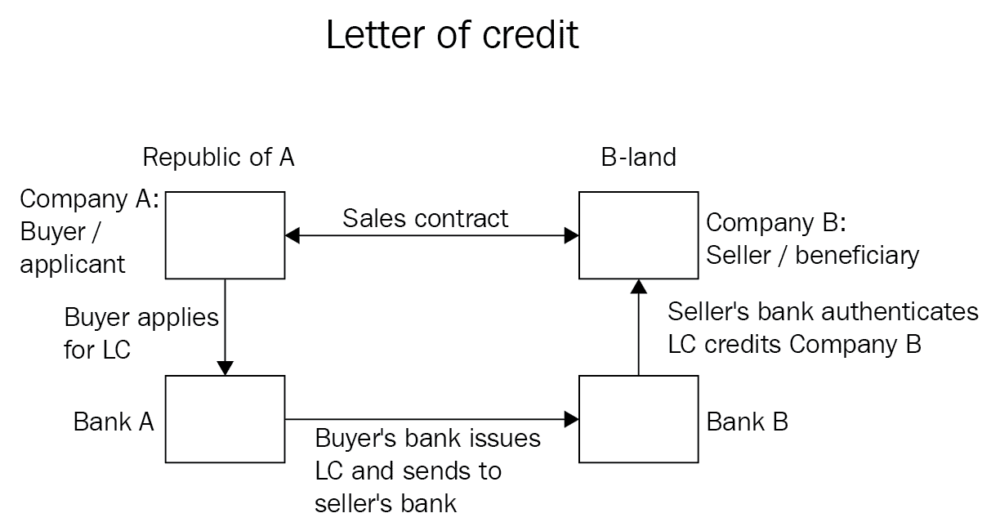
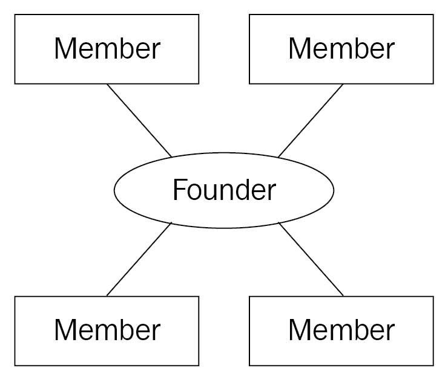
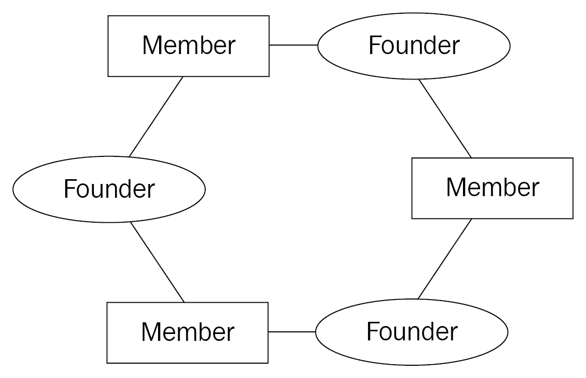
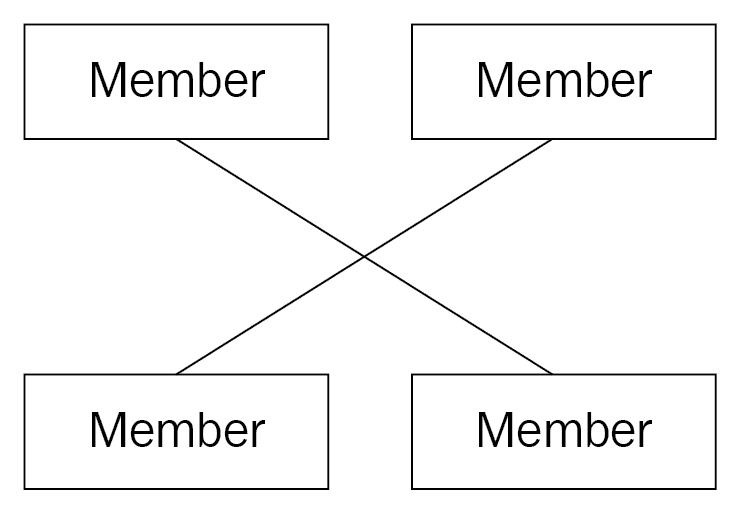
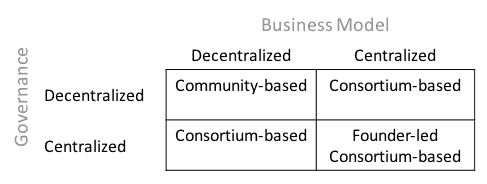
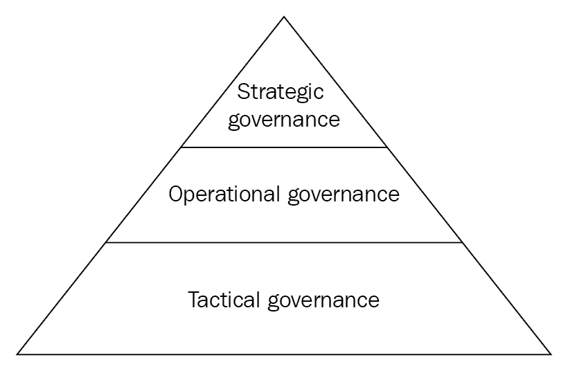
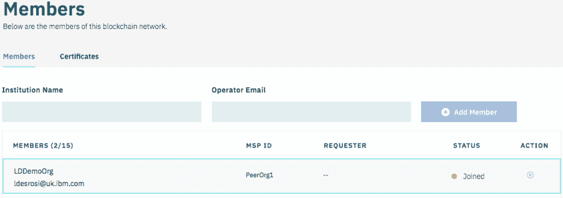
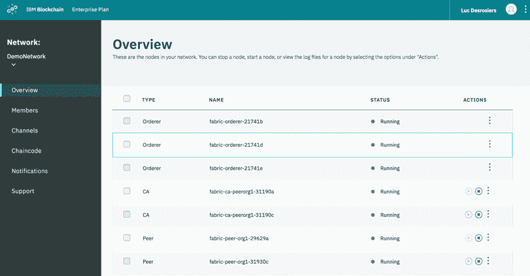
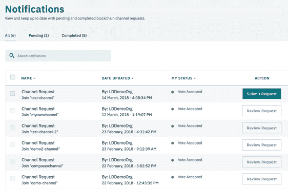
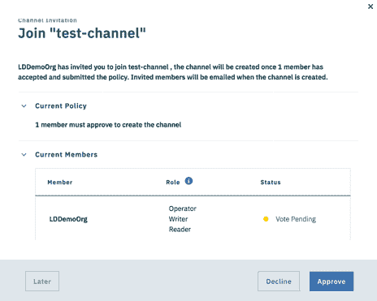

# 第十章：治理，受监管行业的必要之恶

对于那些经历过没有明确决策流程的项目的人来说，您会感受到因各种利益相关者的影响而不断质疑和修改决策的痛苦。政治阻碍了进程，项目的目标最终受到挑战，预算被削减，长期愿景缺失或混乱。

虽然这是您可以从传统 IT 项目中期待到的内容，但区块链项目具有更多利益相关者的特点。一个典型的商业网络将由有时竞争有时合作的组织组成。在这种情况下，很容易看出存在着高风险，即存在冲突的观点和利益。

无论您是开发人员还是首席信息官，了解您可以从这些项目中期待什么以及治理模型如何帮助缓解一些问题可能有助于为即将到来的事情做好准备。

本章将介绍我们在各个行业中看到的一些模式，并探讨这些区块链业务网络如何形成以及基础治理模型如何运作。

本章将介绍以下主题的观点：

+   什么是治理？

+   各种商业模式

+   治理在商业网络中的作用

+   典型的治理结构和阶段

+   要考虑的角色和流程

+   治理对 IT 解决方案的影响

# 去中心化和治理

一些人可能会想知道为什么我们在区块链书籍中涵盖了治理。毕竟，区块链网络不是应该是去中心化的，因此受控于单一实体的控制吗？虽然从技术角度来看，这是正确的，但现实是我们是人类，对于一个企业级区块链网络要成功，需要在网络的生命周期中做出许多决策。

即使是比特币，这个去中心化、匿名、无需许可的网络，也必须处理重要且困难的决策。一个例子是围绕比特币区块大小的争议。在比特币的早期，将区块大小限制为 1 MB。随着网络规模的扩大，这个限制变得有问题。提出了许多提案，但是需要跨越比特币节点的共识，使得变更难以达成一致意见。这场辩论始于 2015 年，但社区不得不等到 2018 年 2 月才有了一个部分解决方案，即 SegWit。我们说部分是因为**SegWit**，即**隔离见证**，只通过将签名与交易有效负载分开来减轻问题，从而允许在一个区块中包含更多的交易 - 这需要大量的讨论和交流才能达到部分答案。

此外，请考虑区块链业务网络旨在在不是所有参与者完全信任彼此的环境中建立信任。他们如何就如何管理网络达成共识呢？

知道会有冲突和不同的观点，我们该如何解决这个问题呢？嗯，我们需要一个涉及每个关键组织的重要决策者的过程。参与者需要就一个过程达成基本一致，并尊重结果。我们需要一种*管理*网络的方法——我们需要治理。

所以，治理是关于决策吗？实际上并不是。治理是提供指导决策过程的框架。它通过提供明确的角色和责任的界定，并确保存在达成和传达决策的约定流程来实现这一点。

我们一直在泛泛地谈论决策，但是什么样的决策需要通过治理流程进行管理呢？我们将在*角色和流程*部分正确回答这个问题，但现在，可以说涉及资金、功能路线图、系统升级和网络扩展的一切都肯定是应该由治理流程覆盖的关键话题。

商业和 IT 治理是一个长篇大论的话题。因此，您会发现许多旨在定义指导 IT 行业内实践的成熟结构的 IT 治理标准。这些标准的一些示例包括：

+   **信息技术基础设施图书馆**（**ITIL**）：ITIL 主要关注 IT 如何向业务提供服务，并旨在定义支持 IT 服务管理的流程模型，本质上将 IT 服务表达为它们带来的业务利益的功能，而不是底层技术细节。

+   **信息及相关技术的控制目标**（**COBIT**）：此标准分为两部分：治理和管理。COBIT 的治理部分侧重于通过一系列关于评估、指导和监控流程的控制目标来确保实现企业目标。

无论如何，标准方法都需要根据商业模式和背景进行调整和适应。

# 探索商业模式

商业模式侧重于创建一个描述组织在市场中创建和捕获价值流的结构。

在商业网络的背景下，看看价值链并理解价值的来源是很有趣的。从财务角度看，什么使得区块链网络如此吸引人呢？嗯，正如我们在*第一章，区块链——企业和行业视角*中看到的那样，区块链技术为解决时间和信任问题提供了机会，从而降低了效率低下和运营成本。

# 区块链的益处

处理时间和信任问题会带来什么样的利益？让我们看看在接下来的章节中这些好处可以如何实现和实施的一些例子。

# 供应链管理

供应链由许多参与者组成，从生产商到物流服务提供商、港口管理机构、制造商，最终到消费者。该行业必须应对各种规定，虽然不同组织之间存在许多数据交换，但要得到一个真实的版本却并非易事。

对供应链缺乏信任源于涉及的许多组织担心数据可能泄露给竞争对手。这反过来导致以下问题：

+   **可视性**：我的订单在哪里？我的货柜在哪里？如果没有透明性，制造商的预测会受到影响，可能导致生产延误。

+   **行政开销**：数据需要多次输入，并需要人力和详细检查过程来检测错误。

+   **纠纷**：无法访问共同信息源导致参与者对不同的看法存在分歧，将这些分歧转化为争端。

+   **调查**：由于纠纷的后果，多个各方必须努力收集事实并解决问题。

在这种背景下，去中心化、经许可的分类账意味着每一笔订单和每一批货物都可以实时跟踪，同时防止竞争对手访问敏感信息。该模型有助于消除重复数据输入，减少人为错误，并加快调查进程，因为每笔交易的来源可以轻松证明。

鉴于全球经济，很容易想象到潜在的储蓄。想象一个通过经许可的分类账管理的真实信息的世界，在那里所有相关参与者都可以获得信息，我们可以看到这将在整个供应链中带来的即时优势。

# 医疗保健

医疗行业有许多可以探索的用例，包括制药供应链、临床试验和电子健康记录。我们将关注最后一个用例，因为它与我们的心脏更密切相关。

电子健康记录的承诺一直令人向往，乍看之下，其好处似乎很多：

+   **患者历史的完整视图**：通过消除基于纸张的记录固有的重复，患者应该获得更准确的诊断，并及时接受更连贯的长期护理。

+   **减少重复**：无论是因为不同医生请求重复检测，还是因为每家诊所和医院都必须保留记录，医疗系统中存在资源潜在浪费。

+   **防止欺诈行为**：无论是不良诊所的双重记账还是虚假处方的索赔，都存在许多情况，记录的重复创建了滥用的机会。

尽管好处似乎很明显，但来自现有电子健康记录项目的教训似乎暗示着它们是昂贵的，并且可能不会立即产生预期的好处。一些研究发现：

+   数字化记录患者/医生会话为医生增加了额外的工作量。

+   电子健康记录系统正在增加 IT 支出

+   需要额外的工作量用于变更管理和培训

从那时起，最近的研究表明，这样的解决方案往往在长期内具有积极的投资回报（需要大约五年才能实现收益）。

考虑到价值和利益来自技术的广泛/标准化采用，并考虑到许多国家的医疗网络的范围，不难看出这种努力充满了政治复杂性。

区块链网络能否改善长期以来被视为集中技术创新主要领域的领域？虽然从技术上来看，我们可以设想一个优雅的区块链解决方案，在这个解决方案中，诊所和医院加入网络以获取患者的记录，但真正的挑战可能在于治理方面？

# 金融 - 信用证

在书的这一部分，你应该熟悉信用证的概念。然而，让我们快速回顾一下它背后的概念，如下图所示：

信用证是一种支付工具，根据买方的要求，银行将向卖方发出信用证，声明只要符合条款和条件，就会支付款项。虽然这个过程在国际贸易中非常根深蒂固，但信用证的使用是一个非常古老的过程，它的根源可以追溯到第一次十字军东征，当时圣殿骑士需要找到一种方式，让朝圣者前往耶路撒冷而不必携带现金。

如今的信用证流程非常复杂。虽然例子通常涉及两家银行，但现实情况是在这样的网络中将涉及更多参与者。这导致了一个成本高昂且受执行时间限制的流程。

区块链网络可以为优化流程创造机会；在区块链网络中，信用证存储在账本上，这可以防止双重花费场景，即信用证的所有者可能尝试再次兑现它。

该利益是通过减少时间延迟和成本来衡量的，但它还提供了减少与此类交易相关的潜在风险的主要利益。最后，银行现在也可以考虑推出新服务，例如向卖方进行增量支付的能力。

账本上的交易是最终的这一事实是吸引银行的原因。这也使我们有能力从一个较小的网络开始，获得早期价值，并在解决方案得到验证后扩展，从而在建立网络时减少早期协调所需的数量。

# 从利益到利润

无论市场或商业模式如何，必须有一种回报投资的方式，以便以下公式成立：

*区块链创造的价值 - 网络运营成本 > 0*

本质上，具有正回报并且出于共同的商业利益，可以出现网络级别的商业模式。显然，目标将是最大化价值并最小化成本，从而提供更高的利润率。可以理解，当网络能够提供高额利益时，组织将涌入网络，渴望加入。也就是说，除非商业模式偏袒少数人而损害多数人的利益。

因此，选择一个对大多数成员公平且合适的商业模式将是网络成功与否的决定因素。

# 网络业务模式

现在让我们来看看到目前为止使用过的各种商业模式：

+   创始人主导的网络

+   基于联合的网络

+   基于社区的网络

+   混合模型

我们将在接下来的章节中讨论这些模型。

# 创始人主导的网络

创始人主导的网络在许多情况下都可能很有价值，我们将很快介绍这些情况。一个正常的创始人主导的网络将具有以下架构：

然而，我们首先要提出一个警告：创始人主导的网络不应成为回避潜在网络参与者进行艰难商业讨论的方式。

在我们从事这个领域的时间里，我们与真正相信区块链网络价值的组织进行了互动，但对于去中心化控制网络的想法感到不知所措。他们最终制定了一个路线图，其中初始阶段是深入技术，并将业务讨论推迟到后续阶段。最终结果通常是在创始人基础设施中托管的面料网络，通过 API 网关公开网络。在某些情况下，甚至不向参与者提供不同的身份（即私钥和证书）。这里的风险在于，虽然解决方案在技术上是可行的，但它未能根据区块链网络的原则提供价值。

这并不意味着组织不应采用创始人主导的方法并制定分阶段的路线图，但在建立网络初期就获得潜在参与者的认可是很重要的，以避免缺乏采用或进行重大重组努力。

创始人主导的网络通常由以下类型的组织利用：

+   **初创公司**：他们往往对自己的行业有独特的看法，并带来创新和新思路。他们的商业模式通常是面向行业提供增值服务。虽然创新可能推动他们获得行业认可，但他们的成功取决于可信度和资金。

+   **行业领袖**：从他们的行业角度来看，他们有足够的影响力来建立自己的网络。他们得到供应商和其他组织的支持，以制定议程并支持用例。

+   **部门间区块链项目**：这种模式最初可能不符合商业模式，因为它旨在为组织内部协调服务，但之所以在这里提出它，是因为这些项目是超越组织边界的良好候选者。

作为网络的创始成员，这些组织有机会定义网络的政策和重点。成功利用网络的组织将获得领导地位，并有望捕获网络的价值。

然而，这些优势也带来了说服其他组织加入的风险。他们还承担投资资金以启动项目并获得实现解决方案所需的专业知识的全部负担。他们还面临着在其他行业领袖加入之前，其他重大重组要求变更的风险。

# 基于联合体的网络

联合体是由两个或两个以上具有共同业务目标的组织组成的集团，通过业务网络实现。该网络的架构如下：

这些组织通常属于同一行业或密切相关的行业。重点是，他们的联系源于他们的流程中存在一定程度的协同作用，以及通过联合体合作实现的共同/共享利益。

联合体的一个关键特征是，每个成员保留其法人实体和地位。通过创建联合体，他们通常将进入合同和法律协议，这些协议将指导治理、活动和投资，以将他们的愿景变为现实。

我们区分创建者和成员，因为前者通常会面临与采用创始人主导网络模型的组织类似的情况。他们将面临与创始人主导网络相似的问题、风险和利益，但他们将通过扩大行业参与度来抵消风险。财团创始人也可能选择在其他组织加入时将网络货币化。

此外，财团成员可能会享受税收优惠，有助于改善行业的监管状况，并产生较大的影响力。然而，他们也可能面临潜在的责任和不履行义务，其中一位创始人可能无法像其他创始人一样做出同等水平的贡献。

# 社区式网络

基于社区的网络本质上是一种更加非正式的、志同道合的组织的联合体。他们共同构筑一个商业生态系统，旨在促进不同行业之间的合作，创造新的商机。该网络的框架如下：

在这个模型中，解决方案可能会发展成一个市场，每个成员都可以努力提供增值服务。这种模式的力量源自隐含自由结构和最好的理念自然浮现的自由。这是自然支持去中心化网络和治理概念的最佳模型。然而，如果成员的贡献不够一致，而潜在的责任被忽略，它可能会产生与财团相同的问题。

# 混合模式

商业模式并非静态的，会随时间推移而演变。因此，一个网络虽然可能从一个社区开始，但有可能演变为一个财团。此外，我们将讨论的两种混合模式对这些模型都可能有益。

# 合资企业

在合资企业模型中，少数组织同意组建一个共同拥有的新法律实体。每个组织可以为资金和股权做出贡献，收入和运营费用由各方共享。合资企业的控制权在组成它的各方手中，而不是合资企业本身。

# 新公司

新公司模型本质上类似于合资企业模型，但是完全从企业或财团中分离出来。这个**新公司**(**NewCo**)可能为参与其创建的各方提供服务；然而，利润和亏损完全归新公司所有。

# 商业网络中治理的作用

综合审查了各种商业模式后，我们可以看到每个参与者的控制权会根据该模型而异。通过正确理解每个方当事者的模型和利益，我们可以创造一个对每个人都有意义的决策过程。

因此，尽管我们了解治理是关于达成决定的过程，但是是否应该由治理流程管理和跟踪每一个业务、运营和技术决策？有人会认为，只有重要的主题应该由治理流程涵盖，但那么什么是重要的主题呢？这就是治理模型的作用：定义每个决策领域，并确保每个人都理解对每个决策类别的正式和官方过程的程度。对智能合约的错误修复可能不需要太多关注，但对区块链技术的升级可能需要更高度的关注。事先就如何处理这些类别中的每一项决定达成一致意见，将有助于当前和未来参与者理解他们将被提出的期望。

独立于流程复杂性之外，需要考虑的另一个因素将是决策的集中与分散。分散决策权可能会使流程显得公平，减少不当控制的风险，并鼓励自由思考，但这样做可能会导致达成共识的延迟。

尽管这在社区驱动型网络的背景下是有道理的，但在创始人主导的网络中会奏效吗？

可能不会。如果创始人正在投资资金和资源，他们可能不想分享对网络的控制权。请记住，这不是绝对的规则。决策的重要性将在施加的控制程度中起着重要作用。回到我们之前关于智能合约上的错误修复的例子，可以预期部署的决定应该是分散的，但是下一个要实施的功能的决定应该是集中的。

下表显示了治理与商业模型之间的关系，以及（一般而言）业务模型将如何推动治理结构。基本上，我们可以看到在天平的两端，我们有基于社区的网络，这往往是一个完全分散的商业模式，因此只能在分散的治理中生存：

试图将治理集中化可能会损害其存在，因为社区成员可能会拒绝控制或推动创建一个联合体。在光谱的另一端，我们有创始人主导的网络，它本身的性质倾向于在创始组织中保持控制权。联合体商业模式往往是多变的，并且在很大程度上取决于它们自己的性质。高度受监管的行业可能需要与确保所有方遵守既定标准相等高度的集中化。另一方面，联合体可以通过强加规则或采用决策制定的共识机制来实现分散的治理。

为了总结我们对企业网络治理角色的考察，让我们快速看一下企业网络需要解决的决策类型：

+   **成员生命周期**：与将参与者引入网络和使其退出网络的过程相关的决策。

+   **资金和费用**：围绕着网络将如何获得资金做出的决策。这可能涵盖诸如中心化基础设施、共同服务、人员配备等领域。

+   **监管**：大多数行业需要符合特定的常常地域性的规定。这一类别关注的是确保满足和执行这些规定的关键决策。

+   **教育**：关于为成员和外部组织提供何种程度的培训，以便了解并融入网络的决策。

+   **服务生命周期**：涉及到 IT 组件的所有决策，涵盖了从部署新智能合约到系统更新等方面。

+   **争议**：因为争议几乎总是不可避免的，这些决策涉及解决争议的过程。

在接下来的部分中，我们将深入研究这些领域，并探讨其中的一些复杂性。然而，值得注意的是，在每个决策类别中，都将需要在以下方面进行权衡：

+   成本与风险

+   竞争与合作

+   形式主义与敏捷性

# 业务领域和流程

在本节中，我们将考虑治理模型应该致力于解决的流程范围。任何网络都应该考虑这些决策领域，以避免不良的意外。并非每个决策都需要受到正式流程的约束，但考虑这些因素将有助于避免未来的不良意外。

# 成员生命周期

我们知道，区块链网络旨在实现完全去中心化。因此，参与者的扩展是我们在一个健康的网络中所期望看到的正常现象。

然而，由于这是一个受规则和法规约束的企业级网络，因此在网络形成和新参与者入网过程中需要事先确定一些事项：

+   **谁拥有邀请组织加入网络的特权？**

    这应该包括考虑谁可以提交提议创建新组织的建议，但也应该考虑到渠道级别的邀请。在入网过程中是否需要考虑隐私和保密约束？

+   **组织需要满足哪些最低安全要求？**

    一个无法适当保护其对等方的组织将面临着暴露账本数据和损害私钥的风险。处理欺诈交易将导致混乱和痛苦的调查。清晰地阐明安全要求将有助于新参与者了解他们需要做出的投资水平。

+   **参与者应该接受什么标准合同协议？**

    正如我们在前几章中提到的，智能合约应该被接受为网络内的法律，但这需要通过合同协议来界定，这些协议不仅承认这一事实，还陈述了参与者的期望和争议处理流程。

+   **参与者需要遵守哪些 IT 服务水平协议？**

    正如我们在*第八章*中所见，《区块链网络中的灵活性》，达成智能合约推广频率和集成层隐含演变的协议很重要。现在这只是一个例子，但从服务水平协议的角度来看，还有其他方面，比如可用性、性能和吞吐量，这些都可能影响网络。

通过入职流程，组织将需要部署自己的基础设施，将其交易整合到自己的企业系统中，并在实际开始交易之前完成一轮测试。在他们在网络上的生命周期内，管理机构可能会要求对参与者的基础设施进行一些审核，以证明他们遵守了条款和条件。

经常被忽视的情况是组织退出网络的事件。可能会有两种情况导致发生这种情况：

+   参与者对网络的兴趣发生变化，不再希望进行交易

+   合同违约或争议导致参与者被移除

无论原因是什么，如果没有针对此事件的规定，可能会出现与组织数据所有权相关的问题。虽然交易数据在法律协议的背景下共享，但各方可能会同意将分布式分类账存储在每个人的节点中，但一旦该协议终止，会发生什么？

# 资金和费用

网络不会自行运营。需要开发智能合约，部署共同基础设施（例如有序节点），撰写法律协议等等。

此处采用的模型将根据选择的商业模式而大不相同。创始人主导的网络可能会承担所有资金成本，但反过来可能会收取一项费用，这不仅会*覆盖*成本，还会产生利润。另一方面，社区驱动的网络可能选择让参与者支付这些共同要素的成本。

无论如何，治理不仅应该定义资金和费用结构，还应考虑如何监控使用情况以及如何进行计费。

# 法规

这个领域将在网络运行的行业和地理位置大部分取决于网络，但在这个层面上，应该确定符合要求和参与者应该遵守的法规。

一个很好的例子是**通用数据保护条例**（**GDPR**），它最近已经生效。GDPR 是欧洲委员会提出的一项法规，旨在加强和强化数据隐私规定。根据新法律，用户可以要求将他们的个人数据永久从任何组织中删除。忽视这样的法规可能导致智能合约保留个人信息，当收到删除请求时，给网络的所有参与者带来重大问题。

在这个领域，重点应放在以下方面：

+   确定相关法规

+   审计智能合约和参与者（适用时）以确保合规性达标

# 教育

这可能不适用于所有类型的商业模式。例如，一个由社区驱动的模式可能选择不提供教育服务，让他们的参与者自行管理，而创始人领导的网络可能决定投资于教育，以加速入职流程并更快地收回投资。

# 服务生命周期

服务生命周期专门涉及网络的技术方面。需要从最初的设计和实施到网络操作的前期投入大量考虑。

在网络的初期阶段，关键决策将包括以下领域：

+   设计权威和标准

+   数据治理

+   配置管理

+   关键管理

+   测试流程

一旦网络准备好投入实际运行，运营方面将迅速浮出水面：

+   基础设施运营（网络、服务器、存储）

+   变更、升级、发布管理、维护

+   业务连续性计划、归档、备份

+   安全、控制、政策执行

+   容量、可扩展性和性能

+   事故和问题管理

# 争端

没有人愿意考虑到争端，就像他们不愿意考虑到退出流程一样；然而，定义一个处理这些争端的流程很重要。在这种情况下，治理应覆盖以下领域：

+   **提出抱怨**：这些问题应该在哪里提出？我们将在下一节介绍治理结构，但如果您在一个真正分散的模式下工作怎么办？您有一个论坛可以提出这个问题吗？

+   **调查**：如何收集事实？问题如何记录？如果质疑智能合约交易的输出，是否（及其相应的客户）将其从分类账中提取出来？

+   **解决方案**：争端并不总是有愉快的结局，但解决这些问题的流程是什么？是否有一部分参与者应该决定这个问题？这是否应该成为法律起诉？

# 治理结构

到目前为止，我们已经涵盖了各种商业模式，审视了集中化与分散化的影响，并探讨了各种决策类型，以及支持这些决策所需的角色和责任。

我们现在将看到组织如何构建自己，以提供处理决策者侧重不同层次的一致方法，这取决于他们的角色。

虽然集中式和分散式治理的表现在现实应用中看起来非常不同，但在实际应用中，有灰色地带，某些功能可能集中，而其他功能可能分散。再次强调，这在很大程度上取决于推动网络的商业模式和需要。

# 集中式治理

尽管一个网络可能采用集中式或分散式的治理，但每个组织也将有他们自己的机制来控制谁做决定。通常情况下，组织会内部依赖集中式治理。这意味着我们不仅需要考虑网络治理，还需要考虑每个组织的结构，如下图所示：

在集中式模型中，决策往往从上到下流动，只有组织底层的未解决问题才会上升到顶层。这种模式创造了一个明确处理问题和愿景的框架，但留下很少的改变结构的空间。

在这种模型中，我们通常看到三个主要的治理层：

+   战略治理

+   运营治理

+   战术治理

接下来的小节将定义每一部分并探讨每个层次的决策者类型。

# 战略治理

战略治理代表了决策金字塔的顶部。这一治理层需要来自各个组织和业务单位的高管支持，并负责确保愿景和战略与网络目标保持一致。它还应专注于确保实现业务利益。

战略治理将专注于以下内容：

+   创造一个共同的业务愿景

+   确定一个明确的授权和治理结构（利益相关者驱动）

+   设定网络优先事项的议程

+   确保实现业务目标

+   开发和演进网络能力

# 运营治理

运营治理的重点是将愿景转化为满足网络需求的里程碑计划。这通常牵涉到业务利益相关者、董事、IT 架构师、法律顾问等。

出于这些考虑，重点将放在以下内容上：

+   定义所有权

+   开发和维护标准、隐私要求和法规

+   为服务和智能合约创建一个统一的方法

+   管理定义业务和技术需求的共同方法

+   公共技术基础设施

# 战术治理

战术治理侧重于围绕网络的运行和操作的日常活动。在这个层面上，重点将放在网络的设计、构建和运营等方面。它将包括来自商业、法律和技术团队的各种利益相关者。任务将包括以下元素：

+   强制执行标准

+   智能合约代码审查

+   部署规划

+   组织入职

+   安全审计

+   报告

# 去中心化治理

治理的去中心化是为了为决策过程带来透明度和公平性。现在要记住，每个组织都有自己的治理结构（三个层级），这些治理机构需要就决策达成一致意见。考虑到每个组织的战略治理可能有不同的迫切性，这并不是一件微不足道的任务。这意味着决策需要通过一种共识形成的方式达成一致意见——一种公平、透明且将网络中每个组织的治理机构汇聚在一起的投票过程。

它还保留了与中心化网络相同的治理层级（战略、运营和战术），但所有事情都将在一个开放模式下进行，所有主题都在社区电话/活动中讨论。在这样的模型中，决策的文档化更加重要，以确保适当的透明度水平。没有公开的审计追踪，人们怎么能知道决策过程是公平的呢？

应该注意，虽然模型是去中心化的，并且可能更轻量级/敏捷，但适当地记录模型并获得参与者的认可同样重要。请注意，去中心化并不意味着更容易。事实上，虽然去中心化的网络治理可能更加符合区块链技术的本质，但它也带来了一些有趣的挑战。

例如，由于没有控制战略决策的中央机构，网络如何朝着共同的目标迈进？你如何避免强势接管或网络分裂？

这样的模型在业务目标一致时会运作良好。然而，当一个公司的议程被延迟，因为大多数社区在投票不同的优先事项时，这势必会产生紧张、争议和延迟。正如我们在比特币区块大小辩论中看到的那样，达成共识需要时间，并且为分裂创造了机会。这并不是说解决方案在于中央化模型——事实上，该模型中也存在类似的风险——但是去中心化模型的去中心化性质可能意味着参与者的业务目标联系更为松散。

# 治理和 IT 解决方案

到目前为止，在本章中，我们主要关注了治理的人为方面。我们已经研究了商业模式对治理的影响，需要考虑的业务流程以及各种潜在结构，但技术呢？治理模式对技术的影响是什么，技术又如何影响治理？

尽管区块链项目可能主要集中在解决商业和企业问题上，但其基础仍然依赖于技术。在本节中，我们将查看网络生命周期的主要阶段，从初始阶段到运行阶段，看看其中一些活动如何可以通过技术自动化和支持。

我们将重点放在入职主题上。正如您现在所知，系统分类帐用于存储构成网络的组织、策略和通道。在分类帐上存储配置意味着任何修改都需要签名和批准。从审计的角度来看，这是很好的，因为它使配置具有区块链方法本身的特性：

+   **共识**：根据定义的政策，配置更改由网络成员背书和验证。

+   **溯源**：配置更改由发起更改的人和所有其他背书者签名，从而保留更改的溯源信息。

+   **不可变**：一旦配置块添加到区块链网络中，就无法修改。需要后续交易来进一步更改配置。

+   **最终性**：由于交易记录在系统分类帐上并分布到网络的所有对等方，因此它提供了一个独特而最终的地方来断言网络的配置。无需查看配置文件即可了解你的锚点应与哪个对等方通信。

尽管这是一个非常有价值的功能，但它带来了一定的复杂性。修改配置的高级流程如下：

1.  检索最新的配置块

1.  解码配置块并相应地更改配置

1.  对块进行编码，并计算与前一个块的差异/变化以建立 RW 集

1.  签署交易并与其他参与者共享，以便他们根据网络政策签署

1.  将已签署的交易提交回网络

这些步骤需要对 Hyperledger Fabric 的基础有很好的理解，并且需要一种跟踪和管理其他方签署的方法。鉴于其分散性质，可能需要涉及许多不同的参与方。这是规划入职流程非常重要的原因之一。

网络应确保他们及早定义此过程和所需的自动化。虽然组织可以构建自己的解决方案，但他们也可以依赖预构建的解决方案。在 IBM 的情况下，IBM 区块链平台提供了简化网络治理的能力。在下一部分，我们将看看如何使用 IBM 区块链平台进行入职。

# 管理入职

为了跟进这个练习，您可以：

1.  **在此处注册 IBM Cloud**: [`console.bluemix.net/`](https://console.bluemix.net/)

1.  **使用此链接将 IBM 区块链平台服务添加到您的账户**:

    [`console.bluemix.net/catalog/services/blockchain`](https://console.bluemix.net/catalog/services/blockchain)

应选择起始计划，并且读者应该审阅条款和条件，了解潜在的费用。

由于网络是去中心化的，网络中的任何组织都可以发出邀请，除非政策另有规定。

这个过程始于通过仪表板的成员菜单访问的以下表单发出的邀请：

在提交此表单后，系统将向新组织的操作员发送一个唯一的 URL。在幕后，它还在网络的根 fabric-ca 上创建了一个注册请求。

为接受邀请，操作员在平台上注册，提供组织名称，并在接受邀请后，系统将根据定义的政策自动更改网络配置，并包括新组织的定义。从这个角度来看，新组织的操作员可以访问操作仪表板，并开始加入频道和部署智能合约。仪表板将如下图所示：

操作化的仪表板

现在，由于网络上的所有交互都经过许可，平台提供了一个投票机制，允许参与者接受或拒绝更改，如下面的屏幕截图所示：

允许参与者接受或拒绝更改的投票机制

在这种情况下，当邀请新组织加入一个频道时，其他组织将有权对修改的接受进行投票。他们将能够在其通知门户中审查请求并批准或拒绝，如下面的屏幕截图所示：

审查请求

尽管 IBM 区块链平台还有许多其他优势和好处，但这里的意图是展示 IT 解决方案如何支持和促进与组织入职相关的一些关键治理流程。

# 摘要

从某种意义上说，治理是商业网络的人性化方面。这是关于人们如何聚集在一起并结构化决策过程，以确保所有相关方要么被征询意见，要么对决策负责。治理需要涵盖广泛的主题。

与其他人相比，技术人员可能对这个话题不太感兴趣，但对其基本了解对于理解我们的工作环境是有用的。

总的来说，在本章中，我们探讨了商业模式如何对治理产生深远影响。然后，我们使用这些模式，看看如何通过解决关键的业务流程来设计满足业务需求的结构。我们已经看到组织需要考虑集中式与分散式治理模式的方法。最后，我们了解到治理需要支持 IT 解决方案，但反过来，IT 解决方案需要支持治理过程。

最后需要记住的一点是，商业模式可能是灵活的。虽然一个倡议可能起初是由创始人领导的网络，但它可以发展成一个财团或一个基于社区的项目。这很重要，因为虽然我们孤立地看待了每个模型，但现实情况是它们注定会随着时间的推移而发展，但需要保持与网络提供的业务价值保持一致。
