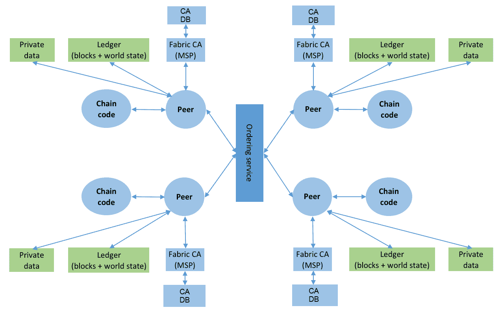

# Hyperledger Fabric 安全性

Hyperledger Fabric 是一个模块化的区块链系统。它经过设计允许一组已知的参与者在区块链网络中参与并执行操作（所谓的**许可区块链**）。由于其模块化的特性，它可以在许多不同的配置中部署。Hyperledger Fabric 的不同部署配置对网络操作者及其用户具有不同的安全影响。

在其核心，Hyperledger Fabric 是一个**公钥基础设施**（**PKI**）系统，因此它继承了与这类系统相关的安全性（和复杂性）。在编写本书时，Hyperledger Fabric v1.1 已发布。

设计和实现区块链网络的安全方面已在先前的应用章节中讨论过，我们打算在这里更广泛并更深入地了解 Hyperledger Fabric 的安全特性。

在本章中，我们将涵盖以下主题：

+   影响安全性的设计目标

+   Hyperledger Fabric 架构简述

+   网络引导和治理 - 安全的第一步

+   强身份 - Hyperledger Fabric 网络安全的关键

+   链代码安全性

+   常见安全威胁以及 Hyperledger Fabric 如何减轻这些威胁

+   Hyperledger Fabric 和量子计算

+   常规数据保护法规（GDPR）考虑

# 影响安全性的 Hyperledger Fabric 设计目标

要了解 Hyperledger Fabric 的安全性，重要的是阐明影响安全性的关键设计目标：

+   **现有成员应确定如何在网络中添加新成员**：网络中的现有实体必须就是否接收新实体的加入达成一致意见。这一原则是创建许可区块链的基础。与其允许任何实体下载软件并连接到网络，网络成员必须就接受新成员的政策达成一致意见（例如，通过多数投票），然后由 Hyperledger Fabric 强制执行。在成功投票后，新成员的数字凭证可以被加入到现有网络中。

+   **现有成员应确定如何更新配置/智能合约**：与第一条类似，网络配置的任何更改或部署或实例化智能合约都必须得到网络成员的同意。总结起来，第一和第二点赋予了 Hyperledger Fabric 执行许可区块链的能力。

+   **账本及其相关的智能合约（链码）可能会被范围化以满足更广泛的隐私和保密要求**：在公共区块链网络中，所有节点都拥有区块链账本的副本并执行智能合约。为了保持机密性和范围化，需要创建存储与其交易相关的账本的一组节点（在 Hyperledger Fabric 中为通道和通道私有数据）。更新这种账本的智能合约（在 Hyperledger Fabric 中为链码）将范围化到这样一个组的成员。

只有参与通道的成员才需要确定如何更新该通道的配置。

+   **智能合约可以用通用语言编写**：Hyperledger Fabric 的主要设计目标之一是允许智能合约用通用语言编写，如 Go 和 JavaScript。显然，如果在执行前没有治理和流程来验证和部署智能合约，允许通用语言编写智能合约会暴露系统于各种安全问题。即便如此，用通用语言编写的智能合约也应该被合理地隔离，以限制它们可能无意中造成的危害。

+   **必须确保事务完整性**：事务是智能合约的执行。事务必须以一种方式创建和存储，以防止其他节点篡改它们，或者使其易于检测到任何篡改。通常，确保事务完整性需要使用加密原语。

+   **应利用行业标准**：系统应利用行业标准来断言数字身份（例如，X.509 证书），以及节点之间的通信（例如，TLS 和 gRPC）。

+   **共识与交易执行和验证分离**：现有的区块链网络将交易执行和验证与区块链网络中的节点达成共识紧密结合在一起。这种紧密耦合使得很难实现共识算法的可插拔性。

+   **无处不可插拔**：系统应具有模块化设计，并且每个模块都应通过标准接口可插拔。能够插入特定于网络的模块使得 Hyperledger Fabric 具有在各种环境中使用的灵活性。然而，这种可插拔性也意味着基于 Hyperledger Fabric 的两个不同的区块链网络实例可能具有不同的安全属性。

要了解这些原则如何影响 Hyperledger Fabric 的安全性，我们将简要解释 Hyperledger Fabric 的架构。详细的架构请参考前面的章节。

# Hyperledger Fabric 架构

Hyperledger Fabric 架构如下所示：



Hyperledger Fabric 架构

# Fabric CA 或成员服务提供商

**成员服务提供商**（**MSP**）负责为组织的节点和用户创建数字身份。节点的身份必须在现有网络中进行配置，以便新实体可以参与通道。

Fabric CA 是 MSP 的一种实现，提供了从网络成员注册用户并为他们颁发数字身份（X.509 证书）的机制。Fabric CA 通常在 Docker 容器中运行。每个 Fabric CA 都配置有后端数据库（默认为 SQLite，其他选项包括 PostgreSQL 或 MySQL），用于存储注册的身份，以及它们的 X.509 证书。Fabric CA 不存储用户的私钥。

# 节点

一个节点是参与 Hyperledger Fabric 网络的实体。它的身份是根据其对应的成员服务提供商确定的。节点负责部署和实例化链代码，更新账本，与其他节点交互以共享与交易相关的私有数据，并与订购服务以及其运行的智能合约（在前面的截图中称为链代码）进行交互。类似于 Fabric CA，一个节点通常也在 Docker 容器中运行。

# 智能合约或链代码

**智能合约**（**SC**）是应用逻辑，以高级语言（如 Go 或 JavaScript）编写；成功执行时，它读取或写入最终提交到账本的数据。智能合约没有直接访问账本的权限。一个节点可以部署零个或多个作为 Docker 容器运行的智能合约。一个节点也可以部署多个版本的智能合约。

# 账本

每个节点维护着一个数字账本，其中包含节点接收到的所有已提交交易的记录。账本中的条目以键/值对的形式存储。对同一键的更新将用新值替换键的当前值。当然，旧值将保留在账本中。为了有效查询键的最新值，一个节点可以将每个键的最新值存储在诸如`CouchDB`之类的数据库中。这个数据库在超级账本中被称为世界状态。

请注意，一个节点只会从它参与的通道接收要提交到它账本的区块。

一个节点可以是零个或多个通道的一部分 —— 在前面展示超级账本架构的图表中没有显示通道。

# 私有数据

随着 Hyperledger Fabric v1.1，节点可以选择通过链私有数据实验性功能（[`jira.hyperledger.org/browse/FAB-1151`](https://jira.hyperledger.org/browse/FAB-1151)）与通道中的一部分节点选择性共享私有数据。账本上的区块只包含此类数据的哈希，而私有数据存储在账本之外的私有状态数据库中。

# 订购服务

订购服务负责接收来自对等方的执行交易，在将它们组合成区块，并将其广播给相同通道上的其他对等方。接收交易区块的对等方在提交到总账簿之前会对其进行验证。订购服务的责任是不将一个通道上的区块混入到另一个通道上。

在 Hyperledger Fabric 1.0 版本中，对等方会将交易（密钥和关联值，以及读/写集）发送到订购服务。因此，订购服务对于与交易相关的所有数据都是可见的，这在保密方面有着影响。在 Hyperledger Fabric 1.1 版本中，客户端可以将交易数据的哈希值（输入和读/写集）发送到订购服务，同时将与交易相关的数据直接传输给相关的对等方。

目前，订购服务是使用 Kafka 实现的，并且是**崩溃容错**（**CFT**）的，但不是**拜占庭错误容忍**（**BFT**）。但这是一个时间点的说法，因为 HyperLedger 据称是可插拔的，包括共识服务。可插拔性意味着未来可能会提供其他共识模型。

尽管在描述 Hyperledger Fabric 架构的图表中没有显示，但对等方，订购者和 fabric 使用可插拔的加密服务提供者，允许他们插入新的加密算法以及硬件安全模块（HSMs）（[`en.wikipedia.org/wiki/Hardware_security_module`](https://en.wikipedia.org/wiki/Hardware_security_module)）来管理加密密钥。

# 网络引导和治理 - 通往安全的第一步

当组织决定使用 Hyperledger Fabric 组建许可的私有区块链网络时，他们需要考虑几个治理方面，这将最终决定网络的整体安全状况。这些治理方面包括但不限于以下内容：

+   **网络应如何引导启动和成员验证以创建网络？** 网络引导是创建区块链网络的第一步。不同的实体可以一起创建一个网络。这些实体可以进行场外通信，就第一批成员达成一致，并制定治理政策，接下来将进行讨论。

+   **新实体加入网络（或通道）的流程是什么？** 确定网络中新成员的准入政策是至关重要的，并由网络的业务需求来规定。

+   **谁可以在网络上的对等方上部署和升级链码？** 确定一个过程是重要的，以防止恶意或有 bug 的链码被安装在一个或多个对等方上（参见*第七章*，*业务网络示例*）。

+   **将在区块链上存储什么数据模型？** 成员必须就将存储在区块链中的共同数据模型达成一致意见；否则，区块链对其成员将毫无用处。数据模型应设计得不会违反任何合规法规，例如**通用数据保护条例**（**GDPR**）([`gdpr-info.eu/`](https://gdpr-info.eu/))。

# 创建网络

当实体决定创建网络时，他们必须决定以下事项：

+   谁将运行排序服务

+   网络中将有多少不同的排序服务实例

排序服务的角色非常关键，因为根据配置，它可以看到流经它的所有频道的交易哈希或交易数据。因此，决定组建网络的实体可以选择信任其中一个实体充当排序服务；他们还可以决定信任中立的第三方来运行排序服务。

排序服务可以查看其提供服务的所有频道中的所有交易（哈希或键值对）。因此，如果需要向排序服务隐藏交易数据，则在对等方之间直接交换数据时，应仅向排序服务发送交易中读/写集的哈希。

一旦为网络建立了排序服务，就必须将创始成员的对等方的数字身份配置到其中。这通常是通过在排序服务创世区块中配置对等方的数字证书来完成的。对等方还必须配置排序服务的数字身份。

# 添加新成员

在创建网络或频道时的创始成员必须还要定义新成员如何加入网络或频道的政策。默认情况下，此政策通常是由多数人选择的（即两个中的两个，三个中的两个，四个中的三个等）。成员可以决定网络中任何其他接纳新成员的政策。对于接纳新成员的政策的任何更改通常将通过商业协议决定。一旦达成协议，就可以根据当前政策更新频道配置，以反映接纳新成员的新政策。

创世区块的创建以及用于更新配置的后续交易是特权操作，必须在确认之前经过对等方管理员的批准。

# 部署和更新链码

一旦成员决定参与通道，他们可以选择部署和实例化链码（又称智能合约）。链码定义了如何更新或读取通道范围内的键/值对。链码可以定义其认可策略——即，它可以要求网络中一些或所有对等方的数字签名。由于 Hyperledger Fabric 的权限性质，需要对等方的数字签名（认可）的链码必须安装和实例化在对等方上。有关部署链码的更多详细信息，请参见*第五章*、*公开网络资产和交易*和*第七章*、*业务网络示例*。

在通道上部署链码之前，预期网络成员将希望审核链码，以确保其符合其政策。此过程可以正式化为链码治理，要求所有相关成员对其节点实例化的链码进行强制审核。

建立一个在同行上部署链码的流程，包括手动审核和验证链码作者数字签名。

# 数据模型

实体必须就将存储在区块链中的数据模型达成一致意见，这反过来由链码确定。网络或通道部署链码的创始成员将确定存储在通道中的键/值对。此外，成员将决定哪些数据与其他成员共享，哪些数据他们将保留私有给自己或一部分成员。数据模型应设计得对成员希望完成的业务功能有用，合理地具有未来的保障，并且不会无意中泄露信息。请记住，通道中的所有参与对等方都存储了提交的交易（及其键/值对）。

建立一个定义将存储在通道中的数据模型的流程。

前述步骤可总结如下：

1.  确定谁将运行订购服务。

1.  配置订购服务中创始成员的数字身份。

1.  创建通道并确定接纳新成员的通道政策。

1.  定义编写、分发、部署和实例化链码的治理。

1.  建立数据模型。

# 强身份——Hyperledger Fabric 网络安全的关键。

强身份是 Hyperledger Fabric 安全的核心。创建、管理和撤销这些身份对于基于 Hyperledger Fabric 的部署的运行安全至关重要。这些身份由一个 MSP 发行。如前面的 Hyperledger Fabric 架构图所示，一个逻辑 MSP 通常与一个对等体关联。MSP 可以发行任何适当的加密签名的身份。Hyperledger Fabric 配备了一个默认的 MSP（Fabric CA），该 MSP 为经过身份验证的实体发行 X.509 证书。

# 引导 Fabric CA

Fabric CA 可以配置一个 LDAP 服务器或以独立模式运行。当以独立模式运行时，必须配置一个引导身份，该身份存储在 Fabric CA 的后端数据库中。默认情况下，使用 SQLite 数据库，但对于生产用途，可以配置 PostgreSQL 或 MySQL 数据库。如果使用独立服务器，则 Fabric CA 服务器与其数据库之间的连接通常通过 TLS 进行。

在本章的其余部分，我们将在没有 LDAP 服务器的情况下运行时将引导实体称为 `ca-admin`。在没有 LDAP 服务器的情况下运行时，必须在 Fabric CA 的引导时提供 `ca-admin` 及其密码。

为了让 `ca-admin` 与服务器交互，必须向 Fabric CA 服务器提交一个**证书签名请求**（**CSR**）以获取 X.509 证书。这个过程称为**注册身份**，或简称**注册**。拥有 X.509 证书后，`ca-admin` 就可以添加其他用户，我们将在下面解释。

将管理员用户的密码保存在安全的地方，因为这是您组织的 `root` 用户。将其视为您对待 `root` Linux 用户的密码一样安全。使用它创建具有适当权限的新用户，但除了在安全漏洞的情况下，永远不要使用此用户进行任何其他操作，在这种情况下，此用户可用于撤销所有注册实体的证书。

Fabric CA 在系统中提供了两个关键操作，即注册和登记。我们将在下面解释这些操作。

# 注册

注册操作将指定的标识符添加到 Fabric CA 中的新实体。注册操作不为用户创建 X.509 证书；这在注册操作中发生。由 Fabric CA 的管理员定义将新用户添加到网络的政策和程序。

在注册用户时，有一些重要的注意事项：

+   如果策略是注册电子邮件地址，则在随后的注册过程中，用户的电子邮件地址将被编码在证书中。在 Hyperledger Fabric 中，发起交易的用户的证书与提交的交易一起存储在账本中。任何人都可以解码证书并确定电子邮件地址。

仔细确定如何在 Fabric CA 中注册新实体，因为当这些实体发出交易时，它们的数字证书将最终出现在账本上。

+   另一个重要考虑点是允许该用户的注册次数。每个注册将导致向用户发放新证书。在 Hyperledger Fabric 中，正在注册的新用户可以被注册有限次数，或者可以具有无限次数的注册。通常，正在注册的新实体不应该配置为具有无限次数的注册。

对于新用户，最好将最大注册数设置为 1。这个设置确保实体和其数字证书之间存在一对一的对应关系，从而使实体吊销管理更容易。

+   使用 Hyperledger Fabric 1.1，现在可以在注册时为实体定义属性。然后，这些属性将被编码到实体的 X.509 证书中。

在独立模式下使用时，在成功注册时，Fabric CA 将创建一个唯一密码（如果在注册过程中未提供）。然后，`ca-admin` 可以将此密码传递给被注册的实体，后者将使用它创建 CSR 并通过注册操作获取证书。

# 默认 Fabric 角色

在 Fabric CA 中注册实体时，实体应该具有一组角色。Fabric CA 配置了以下默认角色：

```
hf.Registrar.Roles = client, user, peer, validator, auditor
```

Fabric CA 可以注册任何具有以下角色之一的实体：

```
hf.Registrar.DelegateRoles = client, user, validator, auditor
```

Fabric CA 可以吊销角色：

```
hf.Revoker = true
```

Fabric CA 还可以注册中间 CA：

```
hf.IntermediateCA
```

在 Fabric CA 中注册身份，实体必须具有 `hf.Registrar`。角色被赋予一个逗号分隔的值列表，其中一个值等于正在注册的身份类型。

其次，调用者身份的关联必须等于或是被注册身份的关联的前缀。例如，具有 `a.b` 关联的调用者可以注册具有 `a.b.c` 关联的身份，但不能注册具有 `a.c` 关联的身份。

# 注册

拥有 ID 和密钥的实体随后可以使用 Fabric CA 注册自己。为此，它生成公钥/私钥对，创建 CSR，并将其与 `Authorization` 标头中注册的 ID 和密钥一起发送到 Fabric CA。验证成功后，服务器将向被注册的实体返回 X.509 证书。发送注册请求的实体负责管理私钥。这些私钥应该以安全的方式存储（如硬件安全模块）。

# 证书签名请求中允许哪些加密协议？

CSR 可以定制为生成支持 **椭圆曲线数字签名算法** (**ECDSA**) 的 X.509 证书和密钥。支持以下密钥大小和算法：

| **大小** | **ASN1 OID** | **签名算法** |
| --- | --- | --- |
| 256 | prime256v1 | ecdsa-with-SHA256 |
| 384 | secp384r1 | ecdsa-with-SHA384 |
| 521 | secp521r1 | ecdsa-with-SHA512 |

# 吊销身份

由于 Hyperledger Fabric 是一个 PKI 系统，必须从系统中删除的身份必须明确撤销。这是通过标准**证书吊销列表**（**CRLs**）完成的。必须将 CRLs 同步到所有组织中，以确保每个人都能检测到被吊销的证书。向其他对等方分发 CRLs 需要使用带外机制。

# Fabric CA 中管理用户的实际考虑

通常，组织有自己的身份（LDAP）服务器来管理其员工。一个组织可以选择参与一个或多个 Hyperledger Fabric 网络，但是只有其员工的子集可能被注册到每个网络。每个网络的 Fabric CA 管理员可以选择在每个网络中注册一部分员工。

由于员工必须生成和管理私钥才能成功参与 Hyperledger Fabric 网络，因此管理私钥及其相应的数字证书的责任在于组织的员工。管理私钥和数字证书并不简单，这可能会给员工带来不必要的负担，并且可能会导致员工无意中暴露密钥。由于员工需要记住其组织发放的凭据（例如用户名和密码）以登录组织系统，组织可以选择代表参与一个或多个 Hyperledger Fabric 网络的员工管理私钥和证书。根据行业的不同，私钥可能存储在硬件安全模块中，这将使得篡改密钥变得不可行。硬件安全模块的精确配置超出了本章的范围。

# 链码安全性

在 Fabric 中，智能合约，也称为**链码**，可以用 Go 或 JavaScript 编写。链码必须安装在对等方上，然后明确启动。当启动时，每个代码都在单独的 Docker 容器中运行。以前版本的链码也在单独的 Docker 容器中运行。

运行链码的 Docker 容器可以访问虚拟网络以及整个网络堆栈。如果在将链码安装到对等方之前不仔细审查链码，并将该链码的网络访问隔离开来，则可能会导致恶意或配置错误的节点探测或连接到相同虚拟网络上附加的对等方。

运营商可以配置策略来禁用链码 Docker 容器上的所有出站或入站网络流量，除了白名单节点。

# 如何与其他背书对等方共享链码？

组织必须建立一个流程，与参与 Hyperledger Fabric 网络的其他组织分享链码。由于链码必须安装在所有背书对等方上，因此在与其他对等方共享时需要通过加密机制确保链码的完整性。更多关于分享链码方法的详细信息，请参阅*第八章*， *区块链网络中的灵活性*。这个问题也在 Nettitude 对 Hyperledger Fabric 进行的安全评估中得到了强调[`wiki.hyperledger.org/_media/security/technical_report_linux_foundation_fabric_august_2017_v1.1.pdf`](https://wiki.hyperledger.org/_media/security/technical_report_linux_foundation_fabric_august_2017_v1.1.pdf)。

# 谁可以安装链码？

要在对等方上安装链码，实体的证书必须安装在对等方的节点上（存储在本地 MSP 中）。由于安装链码是一项权限非常高的操作，必须小心，只有具有管理能力的实体才能执行此操作。

# 链码加密

实体可以选择在调用链码时使用 AES 加密密钥来加密键/值对([`github.com/hyperledger/fabric/tree/master/examples/chaincode/go/enccc_example`](https://github.com/hyperledger/fabric/tree/master/examples/chaincode/go/enccc_example))。加密密钥传递给链码，然后在发送提案之前加密值。需要解密值的实体（例如，为了支持交易）必须拥有密钥。预期这些加密密钥将以点对点的方式与其他对等方共享。

# 基于属性的访问控制

正如你可能还记得*第四章*中所提到的 *使用 Golang 设计数据和事务模型*，Hyperledger 1.1 新增的功能之一是基于属性的访问控制。在注册实体时，可以为实体指定属性，然后这些属性将在注册时添加到 X.509 证书中。属性的示例包括由参与网络的组织约定的角色名称，例如“审计员”。当执行链码时，它可以在调用或查询操作之前检查身份是否具有某些属性。在简单级别上，这允许应用级别的属性通过 X.509 证书传递到链码中。

# 属性访问控制的优缺点

在证书中编码属性具有其自身一套优缺点。一方面，与身份相关的所有信息都编码在证书中，因此可以基于属性做出决策。另一方面，如果必须更新属性，例如，用户转移到不同部门，就必须吊销现有证书，并发行一个具有新属性集的新证书。

# Hyperledger Fabric 如何应对常见威胁

Hyperledger Fabric 针对一些最常见的安全威胁提供了保护，并假定了一个共享责任模型来解决其他威胁。在下表中，我们将总结最常见的安全威胁，以及 Hyperledger Fabric 是否解决了这些威胁以及如何解决，或者这是否是节点/网络操作员的责任来解决这些威胁：

| **威胁** | **描述** | **Hyperledger Fabric** | **网络/节点操作员** |
| --- | --- | --- | --- |
| 欺骗 | 使用令牌或其他凭证来假冒授权用户，或者 compromise 用户的私钥。 | Fabric 证书颁发机构为其成员生成 X.509 证书。 | 管理证书吊销列表的分发，以确保被吊销的成员不能再访问系统。 |
| 篡改 | 修改信息（例如，数据库中的条目）。 | 使用密码措施（SHA256，ECDSA）使篡改变得不可行。 | 源自 Fabric。 |
| 否认 | 实体无法否认谁做了什么。 | 使用数字签名跟踪谁做了什么。 | 源自 Fabric。 |
| 重放攻击 | 重放交易以破坏分类帐。 | Hyperledger Fabric 使用读/写集来验证交易。重放交易将由于无效的读取集而失败。 | 源自 Fabric。 |
| 信息泄露 | 通过有意的违规或意外曝光暴露的数据。 | Hyperledger Fabric 支持使用 TLSv1.2 进行在传输时加密。它不会加密静态数据（操作员的责任）。系统中所有对等体及其交易的信息都会暴露给排序服务。 | 通过遵循信息安全最佳实践以及静态数据加密，操作员有责任防止信息泄露。 |
| 拒绝服务 | 使合法用户访问系统变得困难。 | 这是操作员的责任。 | 防止系统遭受拒绝服务攻击是操作员的责任。 |
| 特权提升 | 获得应用程序的高级访问权限。 | 已经发行的身份无法升级其访问权限（例如，创建身份）而不经过手动审核。 | Hyperledger Fabric 在 Docker 容器中运行链代码。限制访问并使用适当的限制运行链代码容器是网络/节点操作员的责任。 |
| 勒索软件 | 使用加密或其他手段阻止对文件系统上数据的访问。 | 运营者的责任。 | 运营者有责任确保勒索软件无法阻止节点账本的访问。 |

# Hyperledger Fabric 中的交易隐私

Hyperledger Fabric 的主要设计考虑之一是提供交易的隐私和保密性。Hyperledger Fabric 提供了一些机制来实现这些目标。

# 通道

Hyperledger Fabric 节点如果只想与网络中的一部分节点共享数据，则可以通过通道实现。在这些情况下，只有参与通道的同行者才能存储交易数据；不参与通道的同行者无法看到交易数据，因此也无法存储交易数据。然而，此数据暴露给了排序服务。一个健壮的通道设计将解决参与者之间的隔离、数据隐私和保密性以及具有健壮审计能力的受控/有权限访问。

# 私有数据

通道中的同行者可以选择确定他们将与哪些其他同行者共享他们的数据。私有交易数据在同行者之间点对点传递，而仅将交易数据的哈希广播给排序服务和未共享此数据的同行者。

# 加密交易数据

同行者还可以选择在发送交易进行认可之前对交易数据进行加密。然而，对于认可交易的同行者来说查看数据可能是必要的。必须使用一种带外机制在这些同行者之间交换加密密钥。

# Hyperledger Fabric 和量子计算

Hyperledger Fabric 使用椭圆曲线密码学对交易进行数字签名。椭圆曲线密码学依赖于数学技术，可以通过量子计算加速。然而，Hyperledger Fabric 提供了可插拔的密码提供者，允许用其他算法替换这些数字签名算法。此外，根据 NIST 信息技术实验室主任的说法，量子计算对区块链系统安全的影响至少还有 15 到 30 年才会成为现实。

# 通用数据保护条例 (GDPR) 考虑因素

**通用数据保护条例**（**GDPR**）是一项欧盟法律，规定了个人数据如何被获取、处理和最终从计算系统中删除。GDPR 中对个人数据的定义非常广泛——例如姓名、电子邮件地址和 IP 地址。

区块链本质上创建了数据的不可变、永久和复制记录。基于 Hyperledger Fabric 的区块链网络显然将涵盖这三个特性。因此，在不可删除或修改的区块链网络上存储个人数据可能会从 GDPR 的角度带来挑战。同样重要的是要知道个人数据与谁共享。

Hyperledger Fabric 的通道和通道私有数据特性提供了一种确定与之共享数据的实体的机制。在通道私有数据的情况下，数据永远不会存储在区块链上，但其加密哈希存储在链上。通过治理流程，节点可以确定与之共享此数据的其他节点。Hyperledger Fabric 中的通道私有数据特性可能提供了一种将个人数据存储在链外，并确定与之共享此数据的对象的机制，同时通过存储在区块链中的加密哈希维护此数据的完整性。

Hyperledger Fabric 还会在数字账本中存储创建交易的实体的 X.509 证书。这些 X.509 证书可能包含个人数据。从版本 1.1 开始，Hyperledger Fabric 提供了一种基于零知识证明的身份证明机制，同时隐藏属性的实际值。这些基于零知识证明的凭证随后存储在账本中，取代传统的 X.509 证书，并且有助于达到 GDPR 的合规性。

# 摘要

在本章中，我们首先讨论了与安全相关的 Hyperledger Fabric 的设计目标。所有描述的一系列点都被认为是考虑到 Fabric 安全性。我们简要研究了 Hyperledger Fabric 安全性，并了解了强身份是 Fabric 安全的核心。我们还简要讨论了链码安全性。

Hyperledger 本身擅长处理威胁。我们深入了解了常见的 Hyperledger 安全威胁以及 Fabric 如何应对它们。

我们还简要讨论了量子计算对 Hyperledger Fabric 的影响。
