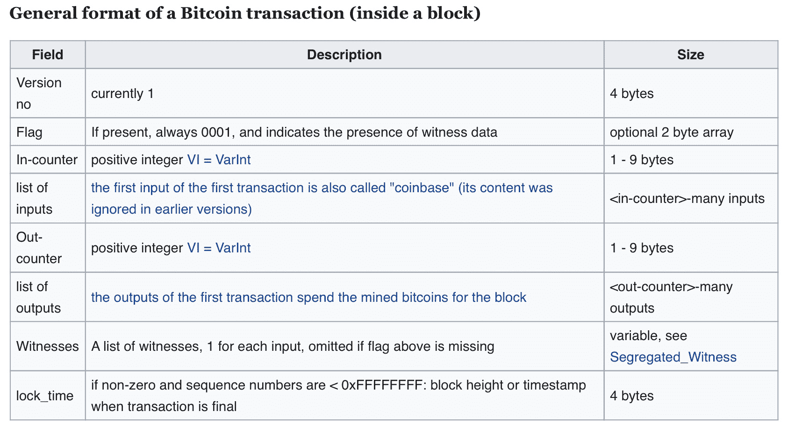
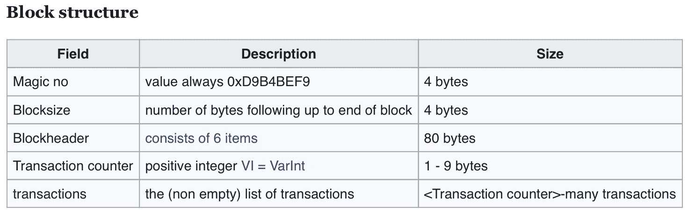
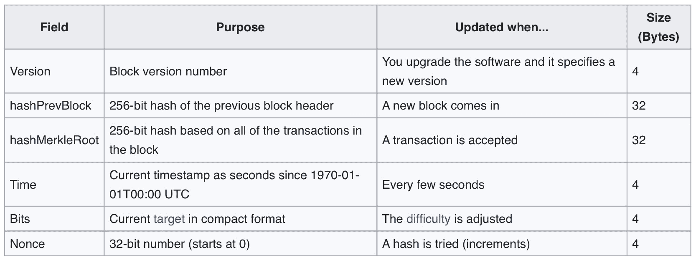
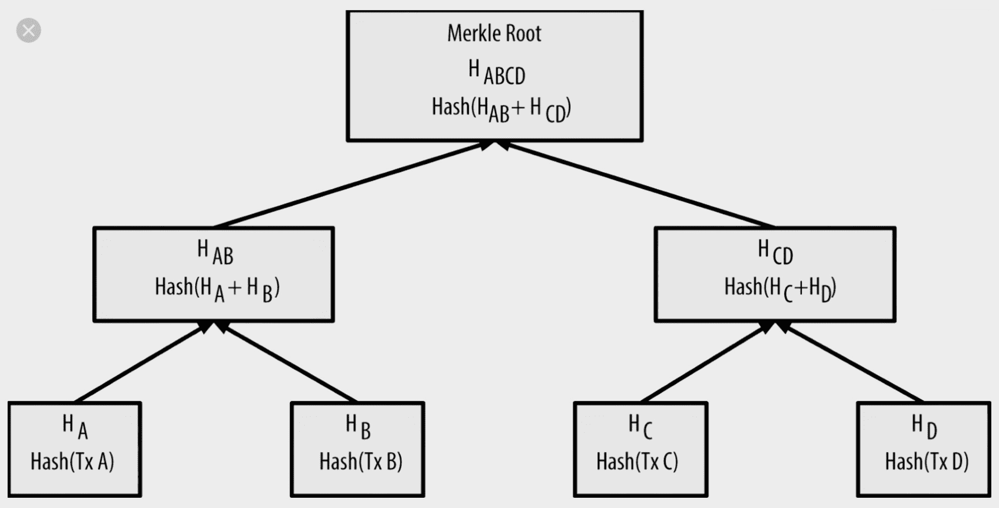
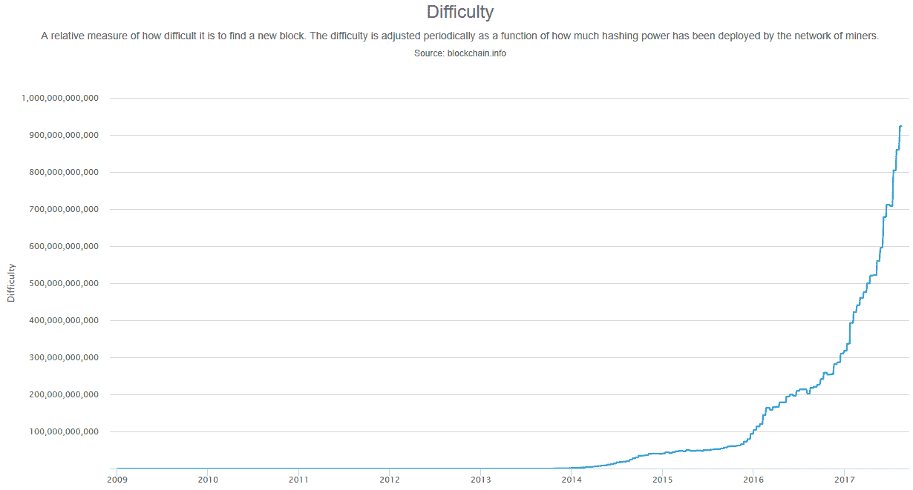
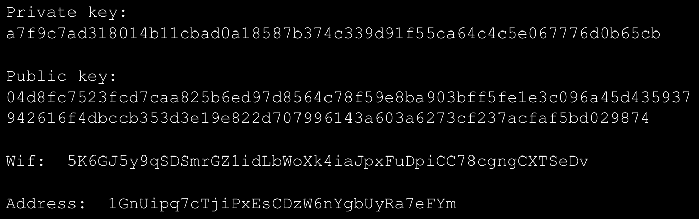

# 区块链技术介绍

本章节将概述区块链及其关键概念，如加密学、哈希算法、分布式账本、交易、区块、工作证明、挖矿和共识。我们详细介绍了区块链技术的鼻祖比特币。我们通过指出比特币的一些局限性以及以太坊如何解决这些问题，简要介绍了以太坊。虽然比特币和以太坊是公共区块链的示例，但 IBM 的超级账本被用作企业区块链的示例。在本章的最后，我们提到了区块链的演变：基于它们的用例，包括区块链 1.0、2.0、3.0 及以后版本。具体来说，我们将涵盖以下区块链主题：

+   区块链的家谱类比

+   比特币共识机制

+   对超级账本的简要讨论

+   区块链的演变

# 家谱类比

作者之一最近参加了北京的一次中国大学校友聚会，在那里，区块链成为了一个热门讨论话题。一位备受尊敬的校友和学者，杨教授，他曾撰写过关于密码学和公共数据保障的书籍，用家谱来描述区块链。这是一个深思熟虑的类比，因为它直观、易于理解地解释了区块链。这里借用这个类比来说明技术背后的基本思想。

在中国的古老时代，每个姓氏家族都有一个习俗，即保存该家族的族谱副本（具有相同姓氏的人）。当家族成员因婚姻、生子或收养而发生变化时，新成员的姓名会出现在每个副本中。然而，新成员必须在姓名被添加之前得到家族的接受。由于各种原因，有时候结婚未得到大多数家族的认可。在这种情况下，新成员的姓名就不会被录入家谱中。换句话说，当一个新成员加入家族时，消息会传达给其他家族。如果家族就接受新成员达成共识，每个家族都会更新他们的家谱副本以反映这一变化。另一方面，如果家族决定不接受新成员，姓名就不会被添加。家谱可以用于验证目的。例如，如果一个陌生人声称是家族的成员，或者两个拥有相同姓氏的人想知道他们是否有共同的祖先，有了家谱，就很容易验证。结果会被接受，因为家谱被认为是可靠的，这要归功于上述共识和分散记录，除非大多数家族同意，否则很难操纵。

区块链与家谱有许多相似之处，总结如下：

+   就像一个由许多相关家庭组成的家族一样，区块链网络由节点组成。每个节点就像一个家庭。

+   就像每个家庭都保存一份家谱副本一样，区块链的每个节点都保留着从一开始就发生在链上的所有交易的副本。所有交易的集合构成了一个**分类帐**。这使得区块链成为了一个分散的数据存储库。

+   一个家谱以一个家族的共同祖先开始，名字与直系亲属之间的关系，如父母和子女，通过一条线连接起来。同样，分类帐由块组成。每个块包含一个或多个交易，取决于区块链的类型。（正如您将在后面看到的，比特币或以太坊上的区块包含多个交易，而 R3 的 Corda 使用只有一个交易的块）。交易就像名字，而块类似于包含夫妇名字的看不见的盒子。根祖先的等价物称为**创世块**，它是区块链的第一个块。类似于连接父母和子女的线，一个哈希，稍后将更详细地解释，从当前块指向其祖先块。

+   就像为将新的名字添加到家谱的共识机制一样，比特币区块链使用一种称为工作证明的机制来决定是否可以将一个块添加到链上。就像家谱一样，在一个块被添加到链上之后，除非拥有网络大多数（称为 51%攻击）的计算能力，否则很难改变（入侵）。

+   家谱提供了家族历史的透明度。同样，区块链允许用户查询整个分类帐或分类帐的一部分，并了解硬币的流动情况。

+   由于每个家庭都保存了家谱的副本，即使由于自然灾害、战争或其他原因导致许多副本丢失，也不太可能丢失家谱。只要至少有一个家庭幸存下来，家谱就会幸存下来。同样，只要至少有一个节点幸存下来，分散式分类帐就会幸存下来。

虽然家谱是解释区块链一些关键概念的一个好比喻，但它们并不相同。不可避免地，它们之间存在着不共享的特征。例如，区块链广泛使用密码学和哈希来保护数据和阻止黑客。家谱没有这种需求。因此，接下来我们将摆脱家谱的比喻，按照时间顺序解释关键的区块链概念。

# 比特币

区块链技术最初引起人们的关注是因为**比特币**区块链，由中本聪在 2008 年 10 月发表在 metzdowd.com 的密码学邮件列表上的一篇白皮书中概述的一个想法。它描述了**比特币数字货币**（**BTC**），标题为*比特币：一个点对点的电子现金系统*。2009 年 1 月，中本聪发布了第一个比特币软件，这启动了比特币网络和比特币加密货币的第一个单位：BTC 币。

# 为什么比特币

比特币的诞生是在 2008 年金融危机之后，这是自大萧条以来最严重的经济危机。这不是巧合。比特币加密货币的发明者旨在解决人们对金融机构的幻灭，其在风险控制方面的史诗般失败导致了 2008 年的金融危机。

金融机构所扮演的一个基本角色是成为一个中间实体，将不信任的各方聚集在一起促成交易。例如，零售银行吸引个人的剩余资金并借给需要资金的个人或公司。支付给资金供应方和借款方的利息之差是银行提供中介服务的费用。金融机构非常成功地提供这些服务，并在全球经济中发挥着关键作用。然而，这种商业模式存在许多缺陷。以下是一些例子：

+   **慢**：完成一笔金融交易通常需要数天的时间。例如，完成并结算跨境汇款需要三天时间（在初始输入订单后）。为了使其发生，一个机构内和机构间的多个部门和应用系统必须共同努力促成交易。另一个例子是股票交易。投资者雇佣经纪人输入订单以路由到证券交易所。在这里，经纪人可以是交易所的成员，也可以将订单路由到另一个具有会员资格的中介机构。在交易所的买卖双方找到匹配后，交易细节由两方记录并分别发送到其后台办公室。后台团队与清算所进行清理和结算。对于交易双方来说，完成证券（股票）所有权和现金交换的行动需时 T + 3。

+   **昂贵**：金融中介在提供这些服务时通常收取高昂的费用。例如，美国银行可能会收取 10 到 30 美元的费用，以向其他国家的接收者发送资金。在股票交易中，全服务经纪人通常会收取数十美元或更多的费用。即使是折扣经纪人，投资者每笔交易也需要支付 7 到 10 美元。

+   **易受黑客攻击**：由于客户和交易细节保存在机构内的集中区域，因此容易受到黑客攻击，造成严重的财务损失或泄露客户的机密个人信息。最近，一些知名公司如 JP 摩根（2014 年有 8300 万账户遭黑客攻击）、Target（2013 年有高达 7000 万客户信息遭黑客攻击）、以及 Equifax（2017 年有 1.48 亿美国消费者信息遭黑客攻击），都发生了高调的个人数据泄露事件。

+   **不透明**：金融机构保存有关交易的详细和汇总信息。然而，大部分信息对个体客户不公开，导致信息不对等。以跨境汇款为例，发送方和接收方都要等待三天才能知道交易是否成功完成。如果交易失败，就必须进行漫长的调查。想象一下如果接收方处于紧急情况，需要立即获得资金。尽管客户必须支付高额费用，这样的服务仍是不尽人意的。

利用区块链技术，上述问题得到了优雅的解决。在比特币区块链的情况下，要转移的基础资产是数字硬币 BTC。跨境 BTC 交易最多只需 1 小时即可完成。不需要结算，因为交易和结算在一个动作中完成。该交易的成本仅是通过银行转账的一小部分。例如，美国银行（**BoA**）最近发布的一份报告称，通过区块链转账的成本是 BoA 收费的 1/6000。然而，对一些客户来说，等待一个小时仍然太长。**瑞波**，一个全球汇款提供者，可在不到 1 分钟内完成。

词汇“比特币”经常引起混淆，因为人们将该词用于三种事物：加密货币、区块链和协议。为避免混淆，我们使用 BTC 指代加密货币，使用比特币指代区块链和使用分布式账本的相应网络。对于协议，我们将完全拼写**比特币协议**或简单称为协议。

# 点对点网络

要解释比特币的工作原理，让我们看看用于完成跨境交易的现有业务模型涉及哪些步骤：

+   客户通过访问银行分行或通过网络输入订单。发送者提供订单的详细信息，如金额、发送货币、接收者姓名、接收货币、接收者银行名称、账号和分行号、以及一个 SWIFT 号码。这里，**SWIFT** 代表 **全球银行间金融电信协会**，一个金融机构用来通过一套标准化的代码系统安全传输信息和指令的消息网络。SWIFT 为每个金融组织分配一个称为 **银行识别代码**（**BIC**）、SWIFT 代码、SWIFT ID 或 ISO 9362 代码的唯一代码。

+   发送银行接受订单并验证发送者是否有足够的资金可用。

+   银行收取费用并通过外汇交易将剩余金额从发送货币转换为接收货币的金额。

+   发送银行向 SWIFT 输入一条转账信息，包含所有必要信息。

+   接收银行在收到消息后验证接收者的账户信息。

+   在成功验证并根据协议在发送和接收银行之间结算资金后，接收银行将金额记入接收者账户。

由于涉及多个步骤、实体和系统，上述活动需要数天才能完成。

比特币网络连接全球各地的计算机。每台计算机都是一个具有平等地位的 **节点**，除了一部分被称为 **矿工** 的节点群，他们选择扮演验证交易、构建区块和连接链的角色。在比特币中，完成货币转账的商业模式涉及以下步骤：

1.  发送者通过一个 **电子钱包** 输入比特币数量、待转出比特币的地址和待转入比特币的地址。

1.  交易请求通过电子钱包发送到比特币网络。

1.  在矿工成功验证交易并将其提交到网络后，比特币现已可供接收者使用。

比特币转账更快（1 小时内，若使用 Ripple，可能更快），原因如下：

+   交易和结算一步到位。这避免了需要经历耗时且昂贵的对账过程。

+   由于 BTC 跨国无界限，不需要外汇交易。它可以在全球自由快速地移动。

+   由于交易不需要中间银行，银行之间不需要资金结算。

在发送方或接收方希望使用美元（USD）、英镑（GBP）、人民币（CNY）或日元（JPY）等法定货币的情况下，可以使用加密货币市场进行比特币与法定货币之间的转换。一个名为 CoinMarketCap 的网站列出了这些市场：[`coinmarketcap.com/rankings/exchanges/`](https://coinmarketcap.com/rankings/exchanges/)。截至 2018 年 9 月 21 日，有 14,044 个市场。就市值而言，前三名分别是币安（[`www.binance.com/`](https://www.binance.com/)）、OKEx（[`www.binance.com/`](https://www.binance.com/)）和火币（[`www.huobi.pro`](https://www.huobi.pro)）。

对等网络可以连接全球节点。然而，仅有物理连接并不足以使两个不信任的交易方进行交易。为了允许他们交易，比特币采取了以下措施：

+   每个节点保存了分散账本中所有交易的完整副本。这使得对链上交易的任何更改都变得不可行。

+   账本交易被分组到区块中。非创世区块通过保存所有先前区块交易的哈希与其前一个区块相链接。因此，改变一个交易需要更改当前的交易块和所有后续块。这使得黑客攻击分散式账本变得极其困难。

+   比特币通过使用工作量证明共识算法解决了双重支付问题，即同一比特币被两次花费的问题。

+   哈希广泛用于保护各方的身份，并检测出块中发生的任何更改。

+   公钥/私钥和地址用于掩盖交易各方的身份，并对交易进行数字签名。

凭借这些措施，不信任的交易方因以下原因感到舒适进行交易：

+   交易是不可变的和永久的。任何一方都无法单方面使交易失效。

+   不可能发生双重支付。

+   交易和结算同时发生；因此，不存在结算风险。

+   身份得到保护。

+   交易由双方签署，这将避免任何未来的法律纠纷。

# 密码学和哈希函数

密码学或密码学是研究在对手存在的情况下保护通信技术的技术。在旧时代，密码学与加密同义。现代密码学严重依赖于数学理论和计算机科学。它还利用了其他学科的作品，如电气工程、通信科学和物理学。

密码算法是基于这样的假设设计的，即在可预见的计算硬件进步下，任何对手都不太可能根据这些算法解密加密的消息。换句话说，理论上可以解码加密的消息，但在实践中不可行。因此，这些算法被定义为计算安全的。理论研究（例如并行或整数分解算法）和计算技术的进步（例如量子计算机）可能使这些算法在实践上不安全，因此加密算法需要不断地进行调整。

加密是将明文转换为不可理解的文本，称为密文。解密是反向操作，换句话说是从不可理解的密文转换回明文。

比特币挖掘使用的加密算法是哈希函数。哈希函数是将任意大小的数据映射到固定大小数据的函数。哈希函数返回的值称为哈希值或简称哈希。密码哈希函数允许轻松地验证一些输入数据是否映射到给定的哈希值。然而，反过来—当输入数据是未知的—从哈希值重建输入明文在实践上是不可行的。换句话说，哈希是一个单向操作。哈希函数的另一个显著属性是，输入明文的微小变化将导致完全不同的哈希值。这个特性对于保护信息是可取的，因为黑客对原始数据的任何微小改变都会导致明显不同的哈希。

两种常见的哈希算法是 MD5（消息摘要算法 5）和 SHA-1（安全哈希算法）：

+   由罗纳德·里维斯特在 1991 年开发，MD5 将输入明文映射为一个 128 位的哈希值。MD5 消息摘要校验和通常用于在数字文件传输或存储时验证数据完整性。已发现 MD5 存在广泛的漏洞。

+   SHA-1 是一种密码哈希函数，将输入的明文映射为一个 160 位（20 字节）的哈希值，也称为消息摘要，通常以 40 位十六进制数显示。SHA-1 由美国国家安全局设计，并且是美国联邦信息处理标准之一。

SHA-256 是 SHA-1 的继任哈希函数。它是目前最强大的哈希函数之一，迄今为止尚未以任何方式被破解。SHA-256 为文本生成几乎唯一的 256 位（32 字节）签名。例如，*我的测试字符串* 映射为 `5358c37942b0126084bb16f7d602788d00416e01bc3fd0132f4458d`

d355d8e76`. 经过微小改动，*我的测试字符串* 的哈希值为 `98ff9f0555435`

f792339d6b7bf5fbcca82f1a83fde2bb76f6aa95d66050887cc`*`，完全不同的值。SHA-256 可以生成 2²⁵⁶ 种可能的哈希值。迄今为止，尚未出现两个不同的输入产生相同的 SHA-256 哈希的情况，这在密码学中称为碰撞问题。即使使用最快的超级计算机，也需要比宇宙的年龄更长的时间才能发生碰撞。因此，SHA-256 被比特币用于加密。

# 分布式账本、区块、交易、地址和 UTXO

在金融机构，账本是记录财务交易的账簿。类似地，比特币通过地址维护账本，记录比特币交易和余额。一个关键区别是，银行的账本是集中式的，而比特币的账本是分散式的。因此，银行的账本更容易被篡改。另一方面，比特币的账本非常难以篡改，因为必须在全球所有节点上更改账本。

用户提交包含以下信息的交易：

+   要转移的比特币的来源

+   要转移的比特币数量

+   应转移比特币的目标

根据维基网站，交易的一般结构如下所示：

源地址和目标地址都是 64 字符的哈希值。以下是一个地址的示例：`979e6b063b436438105895939f4ff13d068428d2f71312cf5594c132905bfxy1`。

术语*地址*有点令人困惑。程序员可能认为它是与磁盘或内存位置相关的地址。然而，它与物理位置无关。相反，它是一个逻辑标签，用于将已转移的比特币分组。在某种程度上，可以将其视为银行账户号码，但它们之间存在根本性差异。例如，银行有一个集中的地方，用于保存有关账户的元数据，例如，所有者姓名、账户开立日期和账户类型。此外，账户余额是预先计算并保存的。在比特币中，地址上没有元数据，必须查询整个账本以找到地址的余额，通过计算进出地址的净比特币数量。地址仅在比特币交易中引用。当地址余额降至 0 时，任何从该地址取出比特币的未来请求将由于资金不足而失败交易验证。

比特币利用**UTXO**模型管理其比特币转账。这个术语是由加密货币引入的，指的是*未花费的交易输出*。这是一个未被花费且可以作为未来交易输入的区块链交易输出。在比特币交易中，只有未花费的输出可以作为输入，这有助于防止双重花费和欺诈。因此，承诺的交易导致在区块链上删除输入并创建 UTXO 形式的输出。新创建的未花费交易输出可以由持有相应私钥的所有者花费。换句话说，UTXO 持续处理，承诺的交易导致删除已花费的硬币并在 UTXO 数据库中创建新的未花费硬币。

像地址一样，比特币不与任何实物对象（如数字代币文件或实际铸造的硬币）相关联。相反，它只存在于分布式分类账中的交易中。例如，如果一个人想知道迄今为止铸造的比特币总数，就必须查看区块链上所有非零余额地址并加总所有比特币。由于比特币的每个节点都保存着分类账的副本，因此只需要计算时间就可以找到答案。

当用户在节点输入比特币交易请求时，节点上安装的比特币软件将该交易广播给所有节点。网络中的节点将通过检索包含输入地址的所有历史交易并确保这些地址中的比特币是合法且足够的来验证交易的有效性。之后，矿工节点开始通过收集经过验证的交易来构建一个区块。通常，比特币区块包含 1,500 至 2,000 笔交易。赢得解决难题竞赛的矿工将承担构建并链接一个新区块到区块链的角色。在比特币区块链上，大约每 10 分钟创建一个新区块。截至 2018 年 9 月 21 日，在比特币上已经创建了大约 542,290 个区块。比特币区块的结构如下所示:

在这里，区块头包含以下字段:

**随机数**的概念将在挖矿子章节中进行解释。`hashPrevBlock`与`hashMerkleRoot`的值相同。Merkle 树哈希根本上是区块中所有交易哈希的哈希，通过二叉树聚合结构进行。以下图解释了这个想法:

# 共识机制

如果有人用 1 美元购买一瓶水，那个人就不能再用相同的 1 美元购买一罐可乐。如果一个人可以自由地二次花费一美元，货币将变得毫无价值，因为每个人都将拥有无限数量的货币，而赋予货币价值的稀缺性将消失。这就是所谓的**双重支付问题**。对于比特币而言，双重支付是同一比特币被使用多次的行为。如果这个问题没有解决，比特币就会失去稀缺性，不能用来促进两个不信任方之间的交易。比特币核心网络通过共识机制防止双重支付。要解释比特币共识机制是如何运作的，我们首先介绍**PoW**（工作证明）和挖矿的概念。

正如前面所解释的，为了获得成为当前新区块的建造者并获得做这项工作的奖励，矿工需要比其他矿工更早地解决一个困难的数学难题。解决数学难题的工作称为**PoW**。

为什么需要 PoW？想象一下：在一个由相互不信任的参与者组成的网络中，为了使网络正常运作，需要比不诚实的攻击者更多的诚实参与者。想象一下，当一个矿工收集到足够的交易来构建一个新的区块时，他被允许立即构建新的区块。这简直就是一个谁能迅速组合足够的交易的比赛。这为恶意攻击者留下了大门，可以通过包含无效或假交易来攻击网络，并总是赢得这场比赛。这将允许黑客自由双重支付比特币。

因此，为了防止攻击者引入恶意交易，参与节点需要足够的时间窗口来验证每笔交易的有效性，确保比特币尚未被花费。由于每个节点都维护着账本的副本，一个诚实的矿工可以追踪历史，确保以下内容以确认交易的有效性：

+   交易请求者拥有这些比特币。

+   相同的比特币在账本中没有被任何其他交易所花费过。

+   相同的比特币在候选区块内没有被其他交易所花费过。

目前，这段时间窗口大约设置为 10 分钟。为了强制执行 10 分钟的等待时间，比特币要求矿工解决一个足够困难的数学难题。这个难题只需要进行简单的计算。矿工需要重复进行相同的计算多次，以烧掉足够的 CPU 时间，达到网络每 10 分钟平均建立一个新区块的目标。重复猜测的过程称为**挖矿**，而设备（专门制造的）称为**矿机**。

由于为了赢得挖矿竞赛，矿工需要大量投资于硬件，这些矿工专注于挖矿工作，并旨在获得足够的 BTC 来支付挖矿运营成本并获利。截至 2018 年上半年，给予获胜矿工的奖励为 12.5 BTC。可以通过访问 CoinMarketCap 网站（[`coinmarketcap.com/`](https://coinmarketcap.com/)）找到 BTC 的价格。截至 2018 年 9 月 21 日，一个 BTC 大约以 6,710 美元的价格交易。因此，12.5 BTC 约价值 83,875 美元。

按照比特币协议，挖矿是发行新 BTC 的唯一方式。慷慨地奖励矿工有三个目的：

+   补偿矿工在硬件上的投资。

+   包括支付挖矿运营成本，例如水电费用，这可能是由于在矿场部署了大型挖矿设备而显著的，人工工资和场地租金。

+   给矿工激励，以防止网络遭受恶意黑客攻击。矿工有动力维护比特币网络，以免自己的 BTC 和挖矿基础设施价值损失。如果比特币被黑客攻击，比特币的声誉将受到严重损害，BTC 价格将暴跌。这正是比特币发明者所希望的：有更多的好矿工而不是坏矿工来解决双花问题。

可以发行的 BTC 总数被固定为 2100 万。截至今天（2018 年 9 月 19 日），大约已发行了 1700 万 BTC。比特币协议规定了动态调整支付速率的规则，剩下的 400 万枚硬币预计还需要另外 122 年才能完全挖掘出来。以下是区块创建支付速率如何动态调整的说明：

+   每 210,000 个区块更改一次速率。它是基于链上的块高度函数，创世=0，并使用 64 位整数运算来计算，例如：（50 * 100000000）>>（高度/210000）。速率最初从 50 BTC 开始，到第 210,000 个区块时下降到 25 BTC。到第 420,000 个区块时下降到 12.5 BTC，当网络达到 6,930,000 个区块时最终将降至 0。

# 分叉

比特币区块链可以分为两条潜在的路径，因为矿工不一定以相同的方式或同时收集交易和合约区块候选。其他原因，如黑客攻击或软件升级，也可能导致路径分歧。这些分裂的修补程序称为**分叉**。有临时分叉和永久分叉。

如果由于例如恶意攻击导致永久分叉，则会发生硬分叉。类似地，还有软分叉的概念。硬分叉和软分叉都指对协议的根本性更改。硬分叉使先前无效的区块/交易变为有效，而软分叉使先前有效的区块/交易变为无效。

为了消除临时分叉，比特币协议规定应选择最长链。换句话说，当面对两条路径时，胜出的矿工会选择更长的链来连接新区块。因此，更长的路径会继续增长，而输掉的（更短的）路径上的区块会变成孤立块。比特币节点将会很快丢弃或不接受这些孤立块。它们只保存最长链上的区块作为有效区块。

在永久性分叉的情况下，网络节点必须选择跟随哪个链。例如，比特币现金由于比特币社区就如何处理可伸缩性问题存在分歧而产生分叉。结果，比特币现金变成了自己的链，并与创世区块直至分叉点的交易历史。截至 9 月 21 日，比特币现金的市值约为 80 亿美元，排名第四，而比特币为 2150 亿美元。

# 挖矿和难度级别

还有一个需要解决的问题：如何保持每 10 分钟一个新区块的速率。如果不做任何处理，由于以下因素，挖矿速率将会产生变化：

+   网络矿工数量会随着 BTC 价格的波动而变化。

+   技术进步使矿机逐渐快速起来

+   挖矿机的总数量不断变化

比特币通过调整数学难题的**难度级别**来保持每 10 分钟一个新区块的速率。难度级别是根据最近添加的区块的速率计算出来的。如果新的区块添加速率的平均值低于 10 分钟，难度级别将会增加。如果平均速率超过 10 分钟，难度级别将会降低。难度级别每 2,016 个区块更新一次。以下图表显示了比特币难度级别的历史趋势。

我们还没讨论实际的挖矿算法。假设当前的难度级别是找到第一个哈希值的开头字符为 0。在比特币中，解决难题的过程，也就是挖矿，需要矿工按照以下步骤进行：

+   首先，在进行中的区块中找到 SHA-256 哈希值。

+   如果得到的哈希值的开头是 0，那么矿工解决了难题。矿工将该区块连接到节点上的账本并获取奖励，12.5 个比特币。矿工的节点向所有节点广播这个消息。网络上的所有其他节点和矿工验证这个答案（通过将区块信息加上随机数映射得到相同的哈希值），并验证账本的整个历史，确保区块包含有效交易。

+   如果通过检查，所有网络节点都会将该区块加入到其账本的拷贝中。矿工们开始着手下一个新区块的工作。

+   如果获胜的矿工是恶意攻击者并在区块中包含不良交易，则这些交易的验证将失败，其他矿工将不会在他们的分类帐副本中包含该块。他们将继续在当前块上进行挖矿。随着时间的推移，包含不良块的路径将不再是最长的路径，因此不良块将成为孤立块。这基本上是网络中所有节点如何达成共识，只向网络添加良好的块，防止不良块潜入，从而解决双重支付问题。

+   如果生成的哈希不以 0 开头，那么允许矿工在输入文本中附加一个已知为随机数的序列号，从 0 到输入文本再试一次哈希。

+   如果生成的哈希仍不包含前导零，矿工将对输入文本添加另一个序列号 1，获得一个新的哈希。矿工会通过这种方式不断尝试，直到找到第一个具有前导零的哈希。

以下是明文和随机数（nonce）如何共同工作的示例。原始明文是*输入字符串* ，随机数变化范围为 0 到 1:

+   **输入字符串**：`f23f4781d6814ebe349c6b230c1f700714f4f70f735022bd4b1fb69421859993`

+   **输入字符串 0**：`5db70bb3ae36e5b87415c1c9399100bc60f2068a2b0ec04536e92ad2598b6bbb`

+   **输入字符串 1**：`5d0a0f2c69b88343ba44d64168b350ef62ce4e0da73044557bff451fd5df6e96`

在比特币中，*难度调整* 很大程度上指的是改变所需的前导零位数。（实际调整涉及到其他矿工调整到该要求。）每增加一个前导零位数，都将显著增加尝试的平均次数，因此会增加计算时间。这是比特币如何维持平均每 10 分钟添加一个新区块的速率。当前比特币的难度级别是 18 个前导零。

# 黑客行为 - 51%问题

由于 BTC 价格上涨，挖矿操作变得更具吸引力。投资者纷纷涌入，成千上万的矿池加入网络，以在竞赛中率先解决难题并获取奖励优势。对于没有大型资本投资的玩家，他们可以选择参与矿池。当矿池赢得一场竞赛时，奖励将根据贡献的计算能力分配给每个参与者。

矿池的这种不断增长的计算能力构成了所谓的**51%问题**的真正威胁。当一个矿工成功地将计算能力积累到至少等于网络总计算能力的 51%时，就会出现这个问题。这时，矿工将有机会领先其他矿工。由于这个矿工有超过 50%的机会首先解决谜题，所以矿工可以继续增加包含不良交易的区块来扩展账本。很快，恶意矿工的账本将变得最长，并且所有其他节点都必须根据比特币的共识协议保存此路径。

对于比特币这样的大型和成熟的网络，51%问题并不是一个关键问题，主要原因如下：

+   一个建立良好的网络将吸引更多的参与方，并连接非常多的节点。对于一个已经成熟的网络，黑客购买所需的挖矿设备需要巨额的初始投资。当这样的网络受到攻击时，当消息公开后，加密货币的价格会迅速下跌，黑客将很难收回投资。

+   在比特币的历史上，曾经有矿池积累了危险的高计算能力接近这条线的情况。当参与的矿工意识到问题时，许多人选择离开该矿池。很快，矿池的计算能力降到了一个安全水平。

+   对于一个小而不成熟的网络，矿工很容易集结超过 51%的计算能力。然而，这些网络的加密货币价值微不足道，对黑客来说几乎没有任何财务激励来利用 51%的问题。

# 私钥和比特币钱包

正如前面讨论的那样，比特币并不存在于物理上。它们存在的唯一证据是当它们与地址关联时，在交易中被提及。当地址被初始创建时，会生成一对公钥和私钥。公钥对公众公开，而私钥仅由地址所有者保留。当所有者想要花费他们的 BTC 时，所有者使用私钥签署数字签名，并将 BTC 请求发送到比特币网络。换句话说，想要花费 BTC，必须同时知道地址和它的私钥。

如果所有者丢失私钥，与之相关的 BTC 将永久丢失。因此，建议将此信息存放在安全的地方。通常最好将地址和私钥分开存放。为了防止数字副本丢失，所有者应保留纸质打印的物理副本。为了使转换更容易，所有者可以打印一个 QR 码，以后在需要时扫描该 QR 码。

比特币钱包应用程序可用于帮助用户管理密钥和地址。可以使用钱包执行以下操作：

+   生成地址和相应的公/私钥

+   保存和组织 BTC 的信息

+   向比特币网络发送交易请求

在比特币中，私钥是一个 256 位长的哈希，公钥是 512 位长。它们可以转换为十六进制表示中的较短长度。以下截图提供了一个公/私钥对和一个地址的示例：

比特币私钥也可以用由 5 和一个字符 51 开始的字符串表示，公钥可以用由 72 个字符的字符串表示。一个示例私钥是 `5Jd54v5mVLvy

RsjDGTFbTZFGvwLosYKayRosbLYMxZFBLfEpXnp 和一个示例公钥是 `BFCDB2DCE28D959F2815B16F81798483ADA7726A3C4655DA4FBFC0E1108A8FD17B448A68`。

# 比特币脚本

一个人可以为编程比特币操作安装以下开发工具：

+   **NodeJS**：这是一个开源的、跨平台的 JavaScript 运行时环境，用于在浏览器之外执行 JavaScript 代码。它允许程序员快速、轻松地编写和执行脚本。这些脚本可以编写为在 Web 浏览器或服务器上运行。

+   **BitcoinJS**：这是一个用于处理比特币及其密码功能的 JavaScript 库。BitcoinJS 可用于生成公钥/私钥和地址。

+   **Blockchain.info**：这是一个公共 API，可用于查询区块链以查找余额并将交易广播到网络。它可用于实现比特币节点并安装和运行比特币节点。

安装完上述工具后，可以执行以下操作：

+   生成一个新的私钥并计算一个公钥

+   检查某个地址的余额

+   生成地址

+   构建一个新的交易

+   发送一个交易，涉及三个步骤：

    +   构建一个带有输入和输出列表的交易

    +   使用必要的私钥对交易进行签名

    +   将交易广播到网络

+   建立一个托管账户

+   广播交易

# 替代币

感谢比特币，区块链技术已经引起了全球的关注。就像任何新技术一样，它也有其局限性。许多比特币的变种被创建来解决比特币的特定限制。在这里，我们提到其中一些：

+   **比特币现金**：这是比特币链的硬分叉，是因为一群比特币核心开发者想要使用不同的方法来解决可扩展性问题而创建的。

+   **莱特币**：这几乎与比特币相同，只是添加新区块的时间从 10 分钟减少到 2 分钟。

+   **Zcash**：这基于比特币，但提供了完全的付款保密性。

+   **门罗币和 Zcash**：这两种替代币通过使交易历史不可追踪来解决隐私问题，但它们实现了两种不同的解决方案。

+   **Dash**：主要改进了用户友好性。例如，交易变得无法追踪，用户不必等待添加了几个额外新区块后才考虑将交易提交到链上。

+   **Namecoin**：这扩展了比特币的用例，后者仅用于交易 BTC，提供域名服务。

+   **Peercoin**：这个山寨币解决了 PoW 的缺陷，后者环境不友好且吞吐量低。相反，它采用权益证明来实现共识。根据这一规则，矿工根据持有的币数验证区块交易。换句话说，矿工的挖矿能力与持有的 Peercoin 数量成比例。

+   **Primecoin**：Primecoin 矿工竞相寻找下一个最大质数。

# 以太坊

尽管上述山寨币采取了一些措施来解决比特币的一部分限制，但仍然存在一些尚未解决的基本问题：

+   比特币和这些山寨币都特定于一个目的：交易 BTC 或山寨币。

+   尽管程序员可以使用诸如 BitcoinJS 之类的工具与网络交互，但结果代码位于区块链之外，并不能保证运行。链本身没有用于直接在区块链上编码的图灵完备编程语言。

+   这些区块链是无状态的，人们必须在整个账本中搜索才能找到答案，例如已铸造的 BTC 总数。

针对这些问题，加拿大加密货币研究员和程序员 Vitalik Buterin 在 2013 年底提出了以太坊的想法。通过在线众筹资助，该系统于 2015 年 7 月 30 日上线，为众筹预挖了 1190 万枚币。

以太坊的核心思想是构建一个通用的区块链，以便用户可以解决各种业务问题，不仅限于加密货币转移。以太坊引入了一些新的关键概念：

+   在区块链上保存智能合约的概念

+   使用 Solidity 等图灵完备编程语言实现智能合约的概念，并在区块链上运行代码片段

Solidity 最初由 Gavin Wood 在 2014 年 8 月提出。以后，由 Christian Reitwiessner 领导的以太坊项目 Solidity 团队开发了这种语言。它是针对**以太坊虚拟机**（**EVM**）设计的五种语言之一（Solidity、Serpent、LLL、Vyper 和 Mutan）。

程序员和律师 Nick Szabo 在 1996 年首次提出了术语*智能合约*。在他的博客中，Nick Szabo 将其描述为所有智能合约的始祖，即自动售货机。

今天的区块链上的智能合约与自动售货机具有完全相同的属性。自动售货机是根据硬编码的规则构建的，这些规则定义了在满足某些条件时执行的操作，例如：

+   如果苏珊在自动售货机中放入一张美元钞票，那么她将收到一袋椒盐脆饼。

+   如果汤姆放进一张五美元的钞票，他将收到一袋椒盐脆饼并且会得到四美元的零钱。

换句话说，规则由自动售货机物理上定义并执行。同样，智能合约包含在区块链上运行的程序代码中的规则，当满足某些条件时触发。

智能合约概念的引入具有重要意义：

+   智能合约是一种脚本化的法律文件。

+   写入合同的代码存储在以太坊区块链上，不能被篡改或删除。这极大地增加了法律文件的可信度。

+   这段代码无法被停止，意味着任何一方——不管这个方有多么强大——都无法命令或干预智能合约代码的运行。只要满足一定条件，代码就会运行，法律上定义的行动也将被完成。

+   以太坊对于区块链就像操作系统对于计算机一样。换句话说，这个平台是通用的，不再只服务于特定的目的。

+   现在它拥有了一种图灵完备的语言：Solidity。

# 企业区块链 - Hyperledger

以太坊的到来彻底改变了区块链技术。将技术应用于超越金融行业的商业问题已经成为可能。然而，以太坊并不足够的场景还有很多。以太坊的问题包括以下内容：

+   真正的企业应用程序，特别是在金融行业，需要高吞吐量，这意味着每天可能有数十亿的交易。当前形式的以太坊每天的最大容量为 140 万笔。比特币甚至更糟糕：每天 30 万笔交易。在压力测试期间，比特币现金达到了 220 万笔。正在开发中的以太坊 2.0 目标是达到每天 10 亿笔的交易量，同时保持去中心化和安全的公共区块链。

+   许多金融市场，比如场外衍生品或外汇交易，都是基于许可的。以太坊或比特币支持的公共区块链不符合这种需求。

为了满足他们的需要，各行各业的知名公司成立联盟，共同开展基于许可的企业区块链项目。换句话说，节点必须在加入区块链网络之前获得批准。企业区块链的例子有 Hyperledger 和 R3 的 Corda。

2015 年 12 月，**Linux Foundation**（**LF**）宣布了 Hyperledger 项目的创建。其目标是通过开发区块链和分布式分类账来推动跨行业合作。2017 年 7 月 12 日，该项目宣布推出了可供使用的**Hyperledger Fabric**（**HF**）1.0。

目前，Hyperledger 包括五个区块链框架：

+   **Hyperledger Fabric**（**HF**）：一个许可区块链，最初由 IBM 和 Digital Asset 贡献，旨在成为以模块化架构开发应用程序或解决方案的基础。它采用插件组件提供功能，如共识和成员服务。与以太坊类似，HF 可以托管和执行智能合约，称为链代码。HF 网络由对等节点组成，这些节点执行智能合约（链代码），查询分类账数据，验证交易，并与应用程序交互。用户输入的交易被通道化到一个命名为排序服务组件的服务，该服务最初用作 HF 的共识机制。称为排序节点的特殊节点验证交易，确保区块链的一致性，并将已验证的交易发送到网络的对等节点以及实施为证书颁发机构的**成员服务提供商**（**MSP**）服务。

+   **Hyperledger Iroha**：基于 HF，专为移动应用设计。Iroha 由 Soramitsu、日立、NTT 数据和 Colu 贡献。它采用了现代化和领域驱动的 C++设计。它实现了一种名为 Sumeragi 的共识算法。

+   **Hyperledger Burrow**：最初由 Monax 和 Intel 贡献，Burrow 是一个模块化的区块链，是按照 EVM 规范构建的客户端。

+   **Hyperledger Sawtooth**：由 Intel 贡献，实现了一种名为**Proof of Elapsed Time**（**PoET**）的共识算法。PoET 旨在尽可能高效地实现分布式共识。Sawtooth 支持许可和非许可网络。Sawtooth 设计灵活多变。

+   **Hyperledger Indy**：最初由 Sovrin 基金会贡献，旨在支持分布式分类账上的独立身份。Indy 提供工具、库和可重用组件，这些组件旨在提供数字身份。

该倡议的早期成员包括以下几个：

+   区块链独立软件供应商（Blockchain、ConsenSys、Digital Asset、R3、Onchain）

+   技术平台公司，如思科、富士通、日立、IBM、英特尔、NEC、NTT DATA、红帽和 VMware

+   金融机构，如荷兰银行、澳新银行、纽约梅隆银行、CLS 集团、芝加哥商品交易所集团、美国存管与清算公司（**DTCC**）、德国证券交易所集团、摩根大通、美国富国银行

+   软件公司，如 SAP

+   学术机构，如剑桥替代金融中心、哥伦比亚区块链和加州大学洛杉矶分校区块链实验室

+   系统集成商及其他公司，如安永、Calastone、Wipro、Credits、Guardtime、IntellectEU、Nxt Foundation 和 Symbiont

# 区块链的演变

区块链技术仍处于早期阶段。在它成熟并充分发挥潜力之前，还需要很多年的时间。目前，还没有普遍认可的方式来分类或定义区块链的世代。

在她关于区块链的书中，Melanie Swan 基于区块链平台创建的使用场景将区块链 1.0 到 3.0 进行了定义。

*"区块链 1.0 是货币，部署加密货币在与现金相关的应用中，比如货币转移、汇款和数字支付系统。*

*区块链 2.0 是合同，使用区块链进行更昂贵的经济、市场和金融应用的完整 slate：股票、债券、期货、贷款、抵押贷款、所有权、智能财产和智能合同。*

*区块链 3.0 是超越货币、金融和市场的区块链应用，特别是在政府、健康、科学、文化和艺术领域。*

有些人将区块链发展划分为从区块链 1.0 到 4.0 的四代:

+   **区块链 1.0**：以比特币为此领域最突出的例子，在此段落中，使用案例基于**分布式分类技术（DLT）**，其中可以执行金融交易。加密货币被用作互联网上的现金。

+   **区块链 2.0**：以太坊是此领域最突出的例子，其中新的关键概念是智能合约，这些合约存储并在区块链上执行。

+   **区块链 3.0**：关键词是 DApps，即去中心化应用的缩写，它们避免了集中式基础设施。它们使用去中心化存储和去中心化通信。与仅涉及后端或服务器端代码的智能合同不同，DApp 可以具有前端代码和用户界面，即客户端代码，用于与其在区块链上的后端代码进行交互。与智能合同代码一样，DApp 的前端可以存储和在以太坊的 Swam 上执行。总之，DApp 是前端加上在以太坊上运行的合同。

+   **区块链 4.0**：此领域的区块链平台旨在为工业 4.0 提供服务。简单来说，工业 4.0 指的是自动化、企业资源规划和不同执行系统的集成。

无论区块链技术如何划分版本，可以肯定的是技术的增长远未结束。新的想法和实施将被纳入现有平台，以应对解决现实问题的挑战。换句话说，区块链技术将变得灵活，并且能够自我调整，成为解决商业问题的推动者。

# 摘要

区块链是一种新兴技术。由于其不可变性、透明性、避免双重支付的共识机制以及其他巧妙的设计，比如将块与前一个块的哈希链接在一起，这项技术使不信任的各方能够相互交易。在本章中，我们解释了其重要特性的基本概念。大部分讨论都集中在比特币上，它是这项技术的鼻祖。我们简要讨论了以太坊，它扩展了比特币并引入了智能合约的概念。智能合约的引入使以太坊区块链变得通用，使我们能够开发超越比特币被发明的无国界现金支付用例的应用程序。企业链的概念以及其中的一个例子——Hyperledger 也被提及。最后，我们简要介绍了区块链的演进，以使读者对技术的趋势有所了解。在下一章中，我们将详细讨论以太坊的概念。
