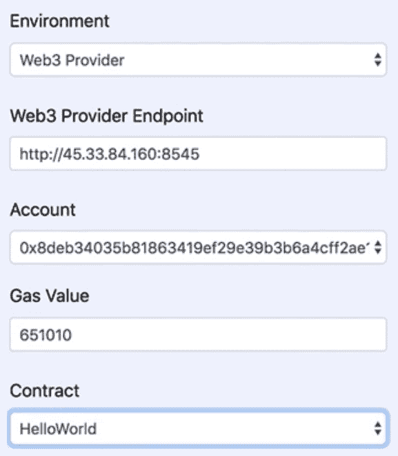

# 第十三章：以太坊基础知识

以太坊是一个开源的公共区块链，被认为是比特币的替代币。一位加拿大的加密货币研究员和程序员 Vitalik Buterin 在 2013 年底提出了这个想法。该平台于 2014 年中期通过在线众筹成立，并于 2015 年 7 月底上线。2016 年的 *DAO 事件* 导致了硬分叉，结果分为**以太坊**（**ETH**）和**以太经典**（**ETC**）。

在本章中，我们涵盖了以下关于以太坊的主题：

+   以太坊概述

+   基本概念，如*以太*、ERC20 代币、智能合约、EVM、gas、账户和预言机

+   以太坊性能问题以及解决该问题的持续努力，如 PoS、Casper、Plasma 和 Sharding

# 以太坊概述

2013 年底，Vitalik Buterin 向区块链社区发送了一封电子邮件，宣布一份概述以太坊想法的白皮书。他将其描述为一个具有内部语言的通用平台，因此任何人都可以编写应用程序。根据 Vitalik 的说法，以太坊最初的想法是创建一个面向金融科技的通用区块链。以太坊是比特币的一种变体。与专注于支付的比特币不同，以太坊是一种可编程的通用区块链。智能合约的引入是以太坊与比特币区分的关键。

一个众所周知的类比来描述以太坊和智能合约，将不信任的交易方聚集在一起交易数字或数字化的实物资产，就像 *第十二章* 结尾所述的自动售货机，*区块链技术简介*。

制作自动售货机后，包括机器所有者在内的任何人都无法更改规则。购买者在交易前或交易期间不需要担心所有者更改规则。因此，购买者可以信任机器按预期的方式行事，并且感到足够舒适以继续交易。当然，自动售货机未必提供完美的解决方案。顾客偶尔可能会遇到故障的机器并插入 1 美元，但什么也不发生。如果自动售货机没有提供退款解决方案，例如发布联系电话，顾客将永远失去 1 美元。另一方面，以太坊的解决方案要坚固得多。智能合约形式的规则分布到所有节点。同样的智能合约将在全球数千个（甚至更多）节点上几乎同时运行。只要至少有一个节点在运行，交易就会成功执行。换句话说，以太坊真正是一台全球计算机。

一些区块链爱好者回应了 Vitalik 的电子邮件，并组成了一个核心团队来推进并执行这个想法。 （这篇开创性的论文，标题为*A Next-Generation Smart Contract and Decentralized Application Platform*，可以在[`github.com/ethereum/wiki%20Wiki/`](https://github.com/ethereum/wiki%20Wiki/)上获得，截至 2018 年 8 月 22 日，经过 169 次修订，该网址已存档，原文发表于 2015 年 3 月 28 日。）2014 年 1 月，成立了以太坊基金会。不久之后（2014 年初），一位英国计算机科学博士 Gavin Wood 发表了一篇名为*Ethereum: A Secure Decentralized Generalized Transaction Ledger*的黄皮书（[`ethereum.github.io/yellowpaper/paper.pdf`](https://ethereum.github.io/yellowpaper/paper.pdf)）。Gavin 的论文统一了多个实现以太坊想法的努力，并成为未来开发工作的蓝图。

在谈论以太坊的众筹活动之前，我们需要首先解释**众筹**的概念。众筹指的是通过从大量人群中募资，通常在互联网上，来为项目或倡议筹集资金的做法。众筹是一种替代的筹资方式。在区块链项目的情况下，众筹通常是以项目所有者出售预先设定的（预挖矿的）总量数字货币的一部分，将它们交换成法定货币或其他已建立的数字货币（如比特币）。

从 2014 年 7 月至 8 月，进行了一次在线众筹活动。这次活动导致了预挖矿以太——以太坊的本地加密货币，总量 1190 万枚代币的销售。这约占以太币总量的 12%：102,431,467 枚。通过这次众筹销售的收入，开发工作开始了。核心以太坊团队包括 Vitalik Buterin，Mihai Alisie，Anthony Di Iorio 和 Charles Hoskinson。以太坊项目的真正开发是由一家名为 Ethereum Switzerland GmbH（EthSuisse）的瑞士公司启动的。该平台于 2015 年 7 月 30 日上线。

Stephan Tual，一位前以太坊首席市场官，在 2016 年 4 月 30 日成立了一个名为*The DAO*的公司。这个实体的目的是管理选择部署哪个智能合约的流程。*The DAO*提出了一个聪明的想法，基于投资来选择合约。完成的智能合约会被发布在互联网上。潜在投资者将宣布要投资多少金额到一个智能合约中。投资金额最多的智能合约将被选择部署。*The DAO*通过众筹销售筹集了创纪录的 1.5 亿美元资金用于此项目。*The DAO*在六月被黑客攻击，由于软件中的漏洞损失了 5 千万美元价值的以太币。这次黑客攻击引发了以太坊社区内一场激烈的讨论，探讨如何处理这件事。出现了两种相争的观点：

+   加强以太坊代码，使未来类似攻击不可行，并将代码部署到所有节点

+   不对核心以太坊代码进行任何更改，冒着未来攻击的风险

Vitalik 呼吁进行硬分叉解决方案，并公开要求所有以太坊节点停止交易以部署修补代码。几小时后，全球数千节点完全关闭。大多数节点投票赞成采取硬分叉方法，并用修补程序升级了它们的核心以太坊代码，但仍有一小部分节点选择不采用修补程序，继续运行相同的代码。

这一硬叉事件将以太坊区块链分为两条。运行旧代码并维护原始区块链的节点变成了以太坊经典，代币符号为 ETC，而运行修补代码并维护分叉以太坊区块链的节点变成了以太坊，代币符号为 ETH。硬叉发生在区块编号为 1,920,000。硬叉在这两个网络之间造成了竞争。如今，ETH 价格涨了 130 多倍，而 ETC 只值 ETH 价格的十分之一，这是因为其不受欢迎以及担心未来发生类似*The DAO*攻击的担忧。

在*The DAO*硬叉之后，以太坊在 2016 年第四季度进行了两次分叉来处理新的攻击。虽然硬叉解决了过去黑客的攻击，但显然这并非可持续发展的解决方案，因为不能总是依靠创建硬叉来解决未来的每一次攻击。因此，以太坊通过阻止黑客的新垃圾邮件攻击来增强自己的保护。

硬叉用于解决黑客攻击，以太坊使用软叉进行协议升级，这些升级是影响以太坊基础功能和/或激励结构的重要变化。一些值得注意的软叉如下：

+   **家园**用于改进交易处理、燃气定价和安全性。这一软叉在 2015 年 7 月 31 日进行。

+   **都市部分 1**: **拜占庭**用于减少以太坊虚拟机的复杂性并为智能合约开发者增加更多灵活性。这一软叉在 2017 年 10 月 16 日进行。

+   未来还计划了两次协议升级：**都市部分 2**：*君士坦丁堡*为过渡到股权证明奠定了基础。

2017 年 3 月，区块链初创公司、研究团体和主要公司共同创建了由 30 位创始成员组成的**企业以太坊联盟**（**EEA**）。五月份，这个非营利组织扩大，纳入了 16 家知名企业成员，如康奈尔大学的研究团体、三星 SDS、微软、英特尔、摩根大通、DTCC、德勤、安永、桑坦德银行、纽约梅隆银行、安海斯集团和加拿大国家银行。到了 2017 年 7 月，成员名单增加到了 159 位。

尽管自其最初推出以来已经进行了许多改进，以太坊仍在不断发展。以太坊 2.0 旨在解决最薄弱的环节之一，即可扩展性，并预计将于 2019 年分阶段推出，正如 Vitalik 最近的评论所示。

# 以太坊基本概念

以太坊在比特币区块链的基础上构建，包括包含链接块的分布式账本、工作证明算法等关键功能。然而，它最大的增加是引入了能以图灵完备的脚本语言编写的智能合约。由于这一新的增加，与比特币或其非智能合约的亲属不同，以太坊允许开发人员解决通用业务问题。

在讲解基本概念之前，我们总结一些有用的以太坊事实如下：

+   以太坊有三个主要组成部分：

    +   **去中心化**：用来保证执行

    +   **哈希值**：用来保护世界状态

    +   **签名**：用于授权程序和交易

+   由于以太坊是一个区块链，它使用数学算法来替代中间实体，并将不信任的各方聚集在一起做生意。

+   以太坊区块链通过其共识机制在节点上验证数据的有效性，从而为数据带来了信任。

+   它使用总体验证来替代中央控制。

+   与交易一样，部署智能合约需要数字签名。已部署的智能合约是永久且不可变的。

+   智能合约会被分配一个地址。

+   假设一个智能合约存在漏洞并需要修复。修补后的智能合约将被部署在一个新分配的地址上，并且因此被视为完全独立于旧合约的全新智能合约。

+   2017 年 5 月，以太坊全球可达节点数量为 25,000 个，包括全节点和轻节点。

+   全节点已下载并可用完整区块链。以太坊账本可以被修剪。全节点验证在构建区块中的交易。矿工节点必须是一个全节点。

+   轻节点不存储整个区块链，但是它从它信任的某个人那里存储它关心的部分。

+   合约代码的脚本通过**以太坊虚拟机**（**EVM**）在全节点上执行。智能合约的地址存储了在 EVM 上运行的名为操作码的字节码。

+   由于一个智能合约在数以万计的机器上的全节点上运行，它真正是全球性的。换句话说，将智能合约写入区块链是全球性的和永久性的。

+   由于智能合约脚本以分散的方式存储，这提供了额外的安全层。所有全节点都知道其他节点存储相同的代码。对于黑客来说，向全球所有良好的节点推送恶意脚本并崩溃它们是不可行的。

+   智能合约是一份脚本化的法律文件，并且它是执行保证的。因为智能合约在部署时被签署，调用它的交易也被签署，所以在交易的两个交易方之间不应该发生争议。换句话说，有了像以太坊这样的去中心化区块链，对于法官的需求消失了！节点并且可以发展成一个完整网络。

+   由于永久性和不可变性的特性，以太坊区块链上的数据和程序是可审计的。这对于政府执行监管和合规要求可能具有特殊的兴趣。

+   以太坊是开源的。任何人都可以下载代码并创建自己的以太坊网络版本。当然，问题在于如何说服他人加入网络以体验其价值。

+   以太坊是去中心化的。因此，没有控制或指挥整个网络的主节点。网络通过共识运行，按照其协议。

+   以太坊还提供了容错能力。只要在灾难性攻击期间至少有一个完整节点存活，网络就可以从幸存节点重新构建并发展成完整网络。

+   尽管以太坊提供了极高的健壮性，但其背后的问题是当其失控时如何停止它。就像*The DAO*黑客事件的例子一样，网络不得不依赖维塔利克及其权威来彻底关闭它。与今天相比，那时的网络规模要小得多。随着网络规模的不断增长，这种方法将变得更加困难。未来，网络可能会增长到数千万个节点甚至更多。只要有一个节点不响应权威调用，以太坊网络仍然活跃。换句话说，完全关闭网络变得极为困难。当然，这就是去中心化区块链的全部意义所在：没有中心化的权威来指挥其他人！

+   以太坊允许对其他智能合约进行递归调用。编写不良的智能合约可能导致无限循环。为了解决这个问题，以太坊引入了一个断路器机制，即 Gas，后面将详细解释。

+   在大数据平台上，一个任务被分成分块分配给网络上的节点，工作由节点共同完成。然而，以太坊的完整节点执行相同的脚本片段。这意味着以太坊区块链的每个完整节点都存储并计算相同的数据；这是可靠但不可扩展的。可扩展性问题是以太坊面临的主要批评之一。正如我们稍后将讨论的那样，已经有多个努力在进行中以解决这个问题。

+   以太是以太坊的本地加密货币。以太坊允许用户发行自己的数字货币，称为代币。ERC-20/ERC-721/ERC 1400 是发行以太坊代币时应遵循的常见技术标准。

+   以太坊可以被视为互联网的第三代。这可能是以太坊的 JS API 被称为 Web3 的一个原因。有关使用区块链技术重写互联网的讨论正在进行。

+   在去中心化互联网上提供集中化服务的做法（例如 Google 在去中心化互联网上提供集中式搜索功能）也将适用于区块链。

# 以太

由于以太坊是建立在比特币之上的，它被认为是比特币替代币。与比特币类似，以太坊中的 Ether 相当于比特币中的 BTC。在提到协议、区块链、客户端软件和主网时会使用以太坊这个名称。

以太坊主网络是客户端用于将数字资产从发送方转移到接收方的区块链网络。换句话说，这是实际交易在分布式分类帐上发生的网络。主网络相当于生产环境。以太坊测试网络是用于开发的。如[`www.ethernodes.org/network/2`](https://www.ethernodes.org/network/2)上所述，截至 2018 年 10 月 8 日，主网络有 13,662 个节点，测试网络有 29 个节点。由于实际交易发生在主网络上，因此 Ether 只在以太坊主网络上具有真正的价值。换句话说，在测试网络上，它一文不值。Ether（ETH 和 ETC）在数以万计的数字货币市场上上市和交易。它们的价格变化很大。例如，在 2018 年 10 月 8 日，ETH 的交易价约为 $223，ETC 为 $11.

Ether 可以在地址（账户）之间转移。它用于支付矿工的计算工作，他们会通过交易费用和执行交易产生的燃气消耗来获得报酬。在这里，燃料的概念对于以太坊至关重要，稍后将更详细地讨论。

Ether 是最高面额的货币。还有其他单位。最小的被称为 WEI，以数字货币先驱 Wei Dai 命名，他是 B-money 的发明者。B-money 是他对匿名、分布式电子现金系统的提案。其他单位包括 Gwei、microether 和 milliether。它们都有第二个名称。例如，milliether 也被称为 finney，以数字货币先驱 Harold Thomas Finney II 命名，他在 2004 年撰写了世界上第一个实施的加密货币 RPOW（可重复使用的工作凭证），在比特币之前。以下表格给出了 ether 与其他单位之间的转换率：

| **Unit** | **Wei value** | **Wei** |
| --- | --- | --- |
| **Gwei (shannon)** | 10⁹ Wei | 1,000,000,000 |
| **microether (szabo)** | 10¹² Wei | 1,000,000,000,000 |
| **miliether (finney)** | 10¹⁵ Wei | 1,000,000,000,000,000 |
| **ether** | 10¹⁸ Wei | 1,000,000,000,000,000,000 |

# ERC20 代币

以太坊是一个通用区块链。它允许开发者构建 DApp 并交易数字资产。相应地，它允许开发者定义一个称为代币的用户特定硬币。其中大部分代币都是 ERC20 代币。ERC 指的是以太坊意见征求，20 是分配给此意见征求的编号。换句话说，ERC-20 是以太坊区块链上用于实施代币的智能合约技术标准。根据 Etherscan.io，截至 2018 年 10 月 8 日，在以太坊主网络上发现了 125,330 个 ERC-20 兼容代币。

ERC-20 为以太坊代币定义了一系列规则。通过这样做，它允许以太坊代币在更大的以太坊生态系统内进行交互和转换。目前，Ether 不符合 ERC-20 标准。但是，由于 Ether 是以太坊的本地币，因此可以转换为其他代币。ERC-20 规范定义了包含方法和事件的接口。

以下是所需方法列表（github.com）：

+   `name`: 返回代币的名称，例如，`HelloToken: function name() view returns (string name)`。

+   `symbol`: 返回代币的符号，例如，`HTC: function symbol() view returns (string symbol)`。

+   `decimals`: 返回代币使用的小数位数；例如，8 表示将代币金额除以 100,000,000 以获得其用户表示：`function decimals() view returns (uint8 decimals)`。

+   `totalSupply`: 返回总代币供应量：`function totalSupply() view returns (uint256 totalSupply)`。

+   `balanceOf`: 返回另一个账户的账户余额，具有`address _owner: function balanceOf(address _owner) view returns (uint256 balance)`。

+   `transfer`: 它将指定数量(`_value`)的代币转移到`_to`地址，并且必须触发转账事件。如果`_from`账户余额不足以支出，则应该抛出错误：`function transfer(address _to, uint256 _value) returns (bool success)`。

+   `transferFrom`: 它将指定数量(`_value`)的代币从`_from`地址转移到`_to`地址，并且必须触发 Transfer 事件。除非`_from`账户已经通过某种机制明确授权了消息的发送者，否则应该抛出错误：`function transferFrom(address _from, address _to, uint256 _value) returns (bool success)`。

+   `approve`: 允许`_spender`多次从您的账户提取，最多到`_value`金额。如果再次调用此函数，则将当前授权额覆盖为`_value`：`function approve(address _spender, uint256 _value) returns (bool success)`。

+   `allowance`: 返回`_spender`仍然被允许从`_owner`提取的金额：`function allowance(address _owner, address _spender) view returns (uint256 remaining)`。

所需事件列表如下：

+   `transfer`: 在代币被转移时必须触发，包括零值转移。创建新代币的代币合约应该在创建代币时触发`Transfer`事件，并将`_from`地址设置为 0x0：`event Transfer(address indexed _from, address indexed _to, uint256 _value)`。

+   `approval`: 在任何成功调用 approve`(address _spender`, `uint256 _value)`时必须触发：`event Approval(address indexed _owner, address indexed _spender, uint256 _value)`。

尽管以太坊允许一个人创建自己的货币，但以太坊真正的价值在于其对智能合约的保证执行。以太币和 ERC20 代币的创建主要是为了支持项目的初创资金，并在交易过程中用于支付以规避银行。没有真正的商业用例，代币一文不值。

# 智能合约

术语*智能合约*最初由尼克·萨博创造，他是一位计算机科学家、法律学者，也是比特黄金（Bit Gold）的发明者，在 1994 年提出。他因其对数字合同和数字货币的研究而成为加密货币世界的传奇人物。一些人甚至认为他是中本聪。尽管他拒绝了这一说法。

尼克·萨博最初定义了智能合约如下：

"智能合约是一种执行合同条款的计算机化交易协议。智能合约设计的一般目标是满足常见的合同条件（例如付款条件、留置权、保密性，甚至执行），最小化恶意和意外异常，并尽量减少对受信任中介的需求。相关的经济目标包括降低欺诈损失、仲裁和执行成本以及其他交易成本。"

在自动售货机上，交易规则内置在机器硬件中。数字资产的交易规则内置在脚本中。也就是说，智能合约由代码组成。以下是一些关于智能合约的有用事实：

+   智能合约是不可变的。

+   智能合约是永久的。

+   智能合约具有时间戳。

+   智能合约是全球可用的。

+   智能合约是数字化的法律文件。

+   智能合约是一种旨在在交易方之间数字化促进、验证或强制执行协议的计算机协议。

+   智能合约允许在没有第三方作为中介的情况下执行交易。这些交易是可审计和不可逆转的。

+   智能合约可以移动数字硬币，执行传统支付，或转移数字资产，甚至提供现实世界的商品和服务。

+   对于涉及第三方的商业交易，例如购买/出售房屋，经常使用第三方担保账户来暂时存储交易双方的资金。有了智能合约，就不需要担保账户。智能合约消除了担保账户的需要，因为它们被保证用于转移资金和资产。

+   智能合约比传统合同法提供了更多的安全性，其交易成本仅为与合同相关的其他交易成本的一小部分。

+   在以太坊基金会使用的解释中，智能合约并不一定指的是传统合约的经典概念。它可以是任何类型的计算机程序。

+   要部署和运行智能合约，必须对部署进行数字签名，类似于在以太坊区块链上发送其他数据或交易。

+   智能合约可以是公开的，对开发者开放。这引发了一个安全问题。如果智能合约存在缺陷或安全漏洞，所有开发者都能看到。更糟的是，由于其不可变性，这种缺陷或漏洞不易修复。这给黑客大量时间来探索弱点并对以太坊区块链发起攻击。*The DAO*事件就是这个问题的一个高调例子。

以太坊智能合约可以使用四种语言之一开发：solidity（受 JavaScript 启发）、Serpent（受 Python 启发，不再使用）、LLL（受 Lisp 启发）和 Mutan（受 Go 启发，不再使用）。无论使用哪种语言，智能合约都是用高级编程语言编写的，需要编译成低级的、可在机器上运行的语言。在以太坊智能合约实施中，采用了类似于 Java VM（JVM）的 VM 方法。以太坊的 VM 被称为**EVM**。智能合约脚本被转换为可在 EVM 上运行的代码，称为**字节码**。然后，操作码被部署到以太坊区块链上执行。目前，一种以研究为导向的语言正在开发中，这种语言被称为 Vyper，是一种基于 Python 的强类型语言。

# 以太坊虚拟机

在六十年代，当计算机刚刚发明时，编程使用的是较低级别的语言，例如汇编语言（assembler）。例如，汇编代码行*ADD R1 R2 R3*，是一个指令，用于将寄存器 1 和寄存器 2 的内容相加，结果放在第三个寄存器，R3 中。寄存器是内置在 CPU 中的临时存储区。对于 32 位 CPU，寄存器是 32 位长的。

然后，汇编语言中的代码被转换为 0 和 1 序列的机器语言，这是机器可执行的。使用低级语言编码是乏味且耗时的。当发明了像 ALGOL 或 BASIC 这样的高级语言时，编码时间大大缩短。然而，底层过程仍然相同：将代码编译成 0 和 1 序列的机器可执行语言。Java、Python、JavaScript 和 C++目前是流行的高级语言。

虽然编译方法效果不错，但它确实有一个不便之处：缺乏可移植性。在一台计算机上编译的代码是机器依赖的。换句话说，它不是可移植的。为了解决这个问题，引入了虚拟机的概念。**虚拟机**（**VM**）是对计算机系统的模拟。虚拟机有两种类型：**系统虚拟机**（也称为全虚拟化），它提供了一个真实机器的替代品；以及**进程虚拟机**，用于在平台独立的环境中执行计算机程序。我们前面讨论的 VM 过程指的就是这个。

用高级语言编写的程序被编译成虚拟机可执行代码。只要计算机支持这样的虚拟机，编译后的代码就可以在上面运行，无需重新编译。例如，JVM 是一个众所周知的 Java 虚拟机，它使计算机能够运行编译成 Java 字节码的 Java 程序。

在以太坊的情况下，智能合约是用高级语言编写的，主要是 solidity。智能合约被编译成操作码，这些操作码可在专为以太坊构建的虚拟机上执行，即**EVM**。EVM 具有可移植性和健壮性，因为 EVM 在运行时执行检查以防止崩溃。尽管这些检查确实会带来性能损失。

由于以太坊合约可以用四种语言之一编写：solidity、serpent、LLL 和 Mutan，因此有四个编译器将这四种语言编写的智能合约转换为在 EVM 上运行的操作码。另一个相关概念是**以太坊客户端**，它指的是安装在节点上的一组软件，用于解析和验证区块链交易、智能合约以及所有相关内容。以太坊客户端采用八种语言之一实现：Python、C++、Go、JavaScript、Java、Haskell、Ruby 和 Rust。已实现的 EVM 是以太坊客户端的重要组成部分。因此，操作码可以在八个客户端实现之一上运行。EVM 最初是为货币交易而设计的，后来扩展到其他数字资产。因此，支持某些功能存在限制。开发人员面临一些严格的限制（例如，字符串或本地寄存器的使用）。

# 以太坊 gas

以太坊交易可以调用智能合约，智能合约可以反过来调用另一个智能合约，然后又调用另一个，依此类推。当智能合约存在缺陷时，可能会导致无限循环。在区块链之外，很容易解决无限循环的问题。可以通过简单关闭服务器、重新启动服务器、调试程序、修复代码中的错误逻辑、重新编译和重新部署来停止失控程序。

在以太坊区块链上，这种方法根本行不通！想象一下，如果全球范围内数万个节点几乎同时进入无限循环。为了阻止无限循环的智能合约，所有节点都需要在短时间窗口内关闭。只要一个节点未能遵守，无限循环的智能合约仍将处于活动状态并运行。协调和关闭所有这些节点是一场后勤噩梦。

为了解决这个问题，引入了**gas**的概念。一辆车依靠燃烧汽油的发动机来运行。当发动机用完汽油时，车辆就会停止。以太坊引入了 gas 的概念来实现相同的效果。当向以太坊区块链提交交易时，请求者需要提供最大 gas 数量。例如，在下面的例子中，提交了一个调用 HelloWorld 智能合约的交易请求，其最大消耗不超过指定的 gas 值：

当此请求被挖矿节点验证时，将调用 HelloWorld 智能合约。在 EVM 上运行的每个操作都会消耗预定义数量的 gas。例如，ADD（求和操作）消耗三个 gas，而 MUL（乘法操作）则使用五个 gas。为了说明问题，假设一个智能合约写得很糟糕，并且包含一个无限循环。此外，我们假设每个循环由一个 ADD 操作和一个 MUL 操作组成。因此，一个循环将消耗八个 gas（三个 gas 用于 ADD，五个 gas 用于 MUL）。在 EVM 执行足够多的循环后，将消耗指定的最大 gas 值。因此，EVM 停止执行合约。因此，所有节点将在大约相同的时间停止运行。gas 的另一个优点是使垃圾邮件攻击的成本昂贵化，从而降低了黑客风险。

Gas 是一种用于测量消耗的计量单位，就像千瓦是用于测量电力使用的单位一样。假设一个家庭在一个月内使用了 210 KW。在向家庭发送账单之前，公用事业公司首先根据预先定义的转换率将 210 KW 转换为美元。假设 1 千瓦的价格为 0.2 美元，那么一个月的总费用为 0.2 * 210 = 42 美元。类似地，燃气使用量被转换为以太并收取给请求者。以太坊允许请求者在提交交易时指定转换率。矿工有权选择性地处理交易，优先处理费率较高的交易。如果请求者未指定费率，则 EVM 使用默认费率，这个费率会有所不同。例如，2016 年的费率是 1 gas = 0.00001 ETH。到 2018 年，一个 gas = 0.00000002 ETH。

# 账户

在*第十二章* *区块链技术导论*中，我们讨论了地址，这是一个类似账户的概念，用于*承载*比特币的余额。比特币使用 UTOX 模型来管理地址之间比特币的转移。然而，要找到地址的余额，必须检索整个账本，这非常不方便。这种不便之处在于比特币不支持链上图灵完备编程语言，也没有状态的概念。另一方面，以太坊区块链支持脚本语言和智能合约；它可以维护状态。以太坊交易通过调用智能合约方法来管理状态转换。以太坊不再需要依赖 UTOX 来管理支付。相反，它通过状态转换使用账户和余额进行操作。状态表示所有账户的当前余额，以及其他数据。状态不存储在区块链上。它在离线保存在 Merkle Patricia 树中。这是因为状态是可变数据，而区块是不可变的。与比特币一样，加密货币钱包可用于管理公钥和私钥*或账户，用于接收或发送 ETH。换句话说，以太坊引入了**账户**的概念。

以太坊支持两种类型的账户：外部拥有的账户（由人类用户通过拥有私钥控制）和合约账户。

+   **外部可控制的账户**：

    +   具有以太币余额

    +   可以发起转移以太币或触发智能合约代码的交易

    +   由用户通过私钥控制

    +   没有关联的智能合约代码

+   **合约账户**：

    +   具有以太币余额

    +   具有关联的智能合约代码

    +   通过从其他合约接收的交易或调用触发智能合约代码的执行

+   **对于这两种类型的账户，有四个组件**：

    +   `nonce`：对于外部拥有的账户，它指的是从该账户地址发送的交易数量；对于合约账户，nonce 每次调用另一个合约时增加

    +   `balance`：这是该地址拥有的 Wei 的数量

    +   `storageRoot`：账户存储内容的 256 位哈希

    +   `codeHash`：该账户的代码的哈希是 EVM；这是当地址接收到调用时执行的代码

当从合约账户向外部拥有的账户转移以太币时，会收取费用，例如 21,000 gas。当从外部拥有的账户发送以太币到合约账户时，费用较高，并取决于交易中发送的智能合约代码和数据。

以太坊地址具有以下格式：

1.  以 0x 为前缀开始，这是十六进制的常见标识符

1.  ECDSA 公钥的 Keccak-256 哈希的右侧 20 字节（大端序）

由于在十六进制中，两个数字被存储在一个字节中，一个 20 字节的地址用 40 个十六进制数字表示。一个示例地址是`0xe99356bde974bbe08721d77712168fa074279267`。

# 预言机

正如我们已经了解的，相同的以太坊智能合约在全球的节点上运行。但我们还没有强调的是，所有这些节点接受相同的输入，并应该产生相同的输出。这被称为**确定性**。以太坊依赖于这种确定性，因为为了验证智能合约和交易的有效性，挖矿节点必须在运行相同的代码和输入时产生相同的结果。

这种确定性产生了一个挑战。一方面，以太坊是一个通用的平台，可以用于转移任何数字或数字化资产。其智能合约需要来自外部来源的数据或输入，如互联网上的股价、宏观经济或微观经济指标等。如果不能访问这些信息来源，智能合约的用例将仅限于其潜力的一小部分。另一方面，即使有微小的时间差异，节点可能从外部来源获取不同的信息。有了不同的输入，节点最终会得到不同的输出。因此，确定性性质不成立。因此，智能合约不允许调用互联网 URL 或直接从外部来源获取数据。为了解决这一悖论，实施了**预言机**的概念。

根据韦氏词典，预言机的其中一个定义是*神明透过神谕者揭示隐藏的知识或神圣的目的的神殿*。在区块链世界中，**预言机**指的是提供外部数据的第三方或去中心化数据源服务。预言机提供了从现实世界到数字世界的接口。预言机数据不是区块链的一部分，它被保存在链下。

预言机有不同类型。其中两种是软件预言机和硬件预言机：

+   **软件预言机**：通常指轻松获取的在线信息，如股指收盘价、外汇汇率、经济新闻或天气预报等。软件预言机很有用，因为它们为智能合约提供了各种类型和最新信息。

+   **硬件预言机**：通常指扫描信息，如 UPS 交付扫描、挂号邮件扫描或供应商货物交付扫描。这种信息对于激活在事件发生时触发的智能合约是有用的。

# 其他概念

由于以太坊是建立在比特币之上的，许多基本概念已经在*第十二章*中讨论过，*区块链技术简介*。在本小节的其余部分，我们将简要介绍其中一些，并重点关注关键区别。

+   **共识算法**：

    +   与比特币一样，PoW 是其共识算法。与比特币不同，以太坊正在计划切换到另一种称为**股权证明**（**PoS**）的共识算法，以在下一个版本的 serenity 中显著提高性能。

+   **私有区块链**：

    +   总的来说，比特币和以太坊都是公有区块链，因为网络对任何人开放，节点可以自由加入。

    +   以太坊存在私有链的变体。在私有以太坊中，节点需要在加入网络之前获得批准。这些区块链称为私有区块链。私有区块链适用于企业应用。超级账本和 JPM 摩根的 Quorum 是以太坊私有区块链的著名变体的示例。另一个示例是 Brainbot 的 hydrachain。

+   **链下数据**：

    +   在比特币区块链中，我们不太谈论链下数据的概念。在以太坊区块链中，需要讨论这个话题。存在多种情况，数据无法存储在链上：

        +   第一种情况是状态变量。在区块链中存储的所有数据都是不可变的，因为区块的内容被哈希，而区块通过这些哈希链接在一起。区块的内容发生微小变化将导致之后所有区块的重构，这显然是不可行的。然而，状态变量例如用于保存余额。它们会改变内容以反映余额变化。解决方案是将它们保存在链下。

        +   神谕是另一个例子，从外部来源提取的信息保存在链下，以供智能合约使用。

        +   以太坊的发明是为了允许交易通用数字或数字化资产。描述底层资产的元数据保存在链下。

        +   对于比特币，分布式分类账必须保存在所有节点上，以提供交易验证所需的信息。在以太坊的情况下，加密货币或数字资产的余额可以直接从状态变量中检索。无需浏览分类账即可获取余额以确定发送方地址是否有足够的资金。因此，完整节点可以选择仅保留分类账的一部分，即裁剪分类账。被裁剪的区块可以在链下的集中位置保存以供将来查询。

+   **测试**：

    +   彻底测试、反复测试和三重测试智能合约至关重要。安全测试至关重要。正如前面所述，在以太坊短暂的历史中，曾发生过几起备受关注的黑客事件，主要是由于有漏洞的智能合约代码。

    +   由于智能合约中引入的错误，以太坊比比特币不安全。以太坊智能合约保存在链式区块中，且未加密。黑客可以轻易发现并探索有漏洞的合约代码的脆弱性，并进行攻击。另一方面，像比特币一样，以太坊上的数据和交易相对安全，不容易受到黑客攻击。只有合约是黑客可以构造恶意交易来调用和滥用的。

    +   智能合约部署后，将会永久不变。部署修订后的代码将成为一个具有不同地址的新合约。它具有具有新余额的不同状态变量。

    +   智能合约的部署不是免费的。它会消耗 gas。

+   **数字签名、加密和公钥/私钥**：

    +   比特币是一个多签名过程。为了执行交易，双方都必须签署它。以太坊类似。此外，智能合约的部署也需要数字签名。

    +   像比特币一样，使用以太坊区块链可以同时生成一对公钥和私钥的钱包应用程序。地址由公钥派生；也就是说，地址只是公钥的哈希值。发送者使用私钥签署交易，接收者使用公钥验证签名的真实性。通常，一对公钥和私钥可以用于支持以下两种类型的活动：

    +   **发送秘密消息**：公钥用于加密消息，私钥用于解密消息。

    +   **签名**：使用私钥进行加密并生成签名。 公钥用于解密以进行签名验证。

    +   目前比特币和以太坊的区块交易内容均未加密。另一方面，Zcash 的区块内容是加密的。

    +   由于每个以太坊交易，包括智能合约，都必须经过数字签名，一个节点只需要接受数字签名的请求，可能无需验证整个交易历史。这种方法可以帮助提高性能。

+   **DAO**：

    +   DAO 指的是分散自治组织。不应将其与名为 *The DAO* 的组织混淆，后者与一次黑客事件密切相关，导致了 **以太坊** 分裂为 **以太坊** (**ETH**) 和 **以太坊经典** (**ETC**)。

    +   DAO 可以被认为由智能合约组成，这是一种构建于分散代码之上的层次结构，即分散核心 → 智能合约 → DAO。

        +   分散的代码保存在多个节点上。它肯定会运行且无法停止。

        +   智能合约转移货币和数字资产。

        +   DAO 由智能合约组成并创建独立实体或社区。

+   **DApp**：

    +   DApp 是一个重要的话题。由于书籍大小的限制，我们只简要提及它：

        +   DApp 指的是分散应用程序，并使用分散代码。

        +   以太坊是一个通用的 DApp 平台。

        +   一个以太坊 DApp，像任何其他区块链 DApp 一样，具有去中心化的后端（例如，智能合约）和集中化的前端（用于与区块链交互的客户端应用程序）。这种架构是由今天区块链的性能和限制的原因所决定。

        +   前面讨论过，大部分后端、数据库和业务逻辑都是托管在链外的。

+   **以太坊问题**：

    +   以太坊受到从比特币继承而来的问题的影响：

        +   数据可能因分叉而丢失。当存在两个竞争的链时，无法快速增长的链必须被丢弃，以保持所有节点上的数据一致性。如果交易未被包含在获胜链的区块中，那些在短链上的交易将会丢失，甚至被原始请求者所不知晓！

        +   由于链上数据并未加密，区块链不具备匿名性和保密性。

        +   地址未经验证。这很糟糕。如果接收者地址被错误输入，那么转移给它的硬币将是永久的，因为交易是永久的，硬币将永远锁定！

        +   PoW 算法消耗大量电力。据报道，中国一些大型挖矿操作需要专门的发电站供电。

# 性能

从比特币继承而来的另一个问题是以太坊运行速度缓慢。它比其他承载交易数据的平台慢得多，例如传统数据库。例如，比特币平均需要 10 分钟建立一个新的记录。按照一个经验法则，等待六个新区块建立完毕后，一笔交易就会被视为完成（就像在数据库中的确认一样）。这意味着，在平均情况下，请求者将等待一个小时才能看到请求完成。在以太坊中，矿工建立区块的平均时间是 17 秒，建议在交易确认前等待 12 个区块。这是 12 * 17 = 204 秒，即用户等待 3.4 分钟的时间。在这里，在确认交易前等待一些连续的区块建立是有用的。在任何时候，以太坊都可能存在竞争链。等待给予以太坊充足的时间来处理竞争链问题并达成共识。

# 吞吐量

吞吐量是衡量系统在一定时间窗口内可以处理多少信息单位的指标。为了衡量交易平台的性能，吞吐量用**TPS**表示，即每秒交易数量：

+   对于比特币，TPS 可以计算如下。比特币区块通常包含 1500-2000 笔交易。我们使用最高数值 2000。由于确认这 2000 笔交易需要 60 分钟，所以其 TPS = 2,000 / (60*60) = 0.56；也就是说，每秒仅半个交易。对以太坊进行类似的计算，得到 TPS = 2,000 / 204 = 9.8，几乎是 10 笔交易每秒——比比特币要好得多。以太坊基金会正在采用夏丁（sharding）方法，由维塔利克（Vitalik）领导，旨在将 TPS 提高 80 倍。

+   以 VISA 为例，平均 TPS 为 2000，峰值为 40,000。像 VoltDB 这样的高性能数据库可以处理每秒超过一百万次插入。证券交易所可以匹配成千上万笔交易。

+   然而，这种比较并不完整。从商业角度来看，只有在清算和结算时，信用卡或交易才最终确定。对于信用卡，账单周期通常为 2-3 个月。证券交易所需要三天来结算一笔交易。从这个意义上讲，以太坊要快得多，因为在区块链上交易和结算是同时进行的。

+   与数据库相比，以太坊处于不利地位。数据库提交可以在插入、更新或删除事务后立即进行。

+   这些是导致以太坊速度变慢的原因：

    +   每个完整节点必须执行相同的智能合约代码。

    +   随着以太坊网络规模的增长，达成共识所需的时间将变长，因为在越来越多的节点之间传输数据来验证交易、访问信息和通信需要时间。

+   有方法可以增加吞吐量。以下是一些：

    +   当区块大小增加时，可以在一个区块中托管更多的交易，并且可以获得更高的 TPS。

    +   并行运行多个链。企业链，如超级账本（Hyperledger Fabric）和 R3 的 Corda 使用这种方法。

    +   状态通道设计有助于提高吞吐量。以太坊的状态通道实现示例是雷电网络（Raiden）。微型雷电网络于 2017 年 11 月推出。状态通道背后的想法是在两个参与方之间使用离链进行交易，并在链上进行交易结算。离链交易是另一个值得深入讨论的话题，但不在本书中。

# 股权证明（PoS）

PoS 共识算法基于这样一个原则，即当一个矿工拥有更多的硬币时，该矿工具有更多的权力来挖掘或验证交易，建立新区块的机会更高，因此获得更多奖励硬币的机会也更高。PoS 是节能的，并且可以更快地达成共识。

有几种随机化方法可用于选择构建下一个区块的矿工，而不仅仅是基于外部拥有账户的以太坊余额，以避免最富有的矿工始终被选择的情况：

+   **随机区块选择***:* 使用一个公式来寻找组合中最低的哈希值以及选择矿工的股份大小。

+   **货币年龄选择***:* 拥有足够长时间（比如 30 天）的货币有资格竞争下一个区块。拥有更老和更大一组货币的矿工有更好的机会被授予该角色。

+   **委托股权证明***:* 该实现选择了一定数量的节点来提出和验证区块到区块链。

+   **随机化股权证明***:* 每个节点都是随机选择的，使用可验证的随机信标来构建新区块。

以太坊正在努力在一个新的标记版本中用 PoS 替换 PoW。

# Casper

PoS 正在被作为对计算效率低下的 PoW 算法的替代而进行研究。由于对出现一组集中化超级节点（在构建新区块方面起到过大作用）等问题的担忧，PoS 尚未完全在主网上实施和升级。Casper 是以太坊社区努力实现从 PoW 到 PoS 的过渡。

在 Per Casper 协议中，验证者（比特币中的矿工的以太坊等效物）将部分 Ether 作为赌注放在一边。当验证者确定要构建的候选区块时，验证者将在该区块上下赌注。如果该区块确实添加到链上，验证者将根据其赌注的大小获得奖励。行为恶意的验证者将被惩罚，其赌注将被移除。Casper 有两个主要项目：Casper FFG 和 Casper CCB。

Casper FFG（友好最终性小工具； Vitalik 版本的 Casper）是一个混合算法，运行在 PoW 上，但将网络上每 50^(th) 个区块视为 PoS 检查点。验证者对这些区块的最终性进行投票，并将其写入区块链。FFG 旨在成为向完全采用 PoS 过渡的中间步骤。FFG 已经在测试网络上运行。它将很快完全实现在主网上。

Casper **CBC**（**Correct by Construction**，Vlad's Casper）更加激动人心。CBC 专注于设计协议，其中一个节点对安全性的局部视图可以扩展到达成共识安全。到目前为止，该方法仅仅是研究，并且没有发布计划可供其进入以太坊。

# Plasma

2017 年，Buterin 和 Joseph Poon 提出了他们的想法，呼吁扩展以太坊的性能，即增加 TPS。与状态通道设计类似，Plasma 是一种在链下进行交易的技术，同时依赖底层以太坊区块链提供安全性。因此，Plasma 属于 *链下* 技术的一部分。Truebit 是该组中的另一个例子。

Plasma 的工作方式如下：

+   智能合约是在主链上创建的，并被视为 Plasma 子链的根。它们定义了子链的规则，并被调用来在主链和子链之间移动资产。

+   创建具有自己共识算法的子链，例如 PoS。

+   部署智能合约，定义实际的业务规则，到子链。

+   在主链上创建的数字资产通过调用 plasma 根合约转移到子链上。

+   子链上的区块构建者定期向主链提交验证，证明子链的当前状态符合共识规则。用户发送和执行请求，而不需要直接与主链交互。

Plasma 具有以下优势：

+   允许以太坊区块链处理更大的数据集

+   启用更复杂的应用在区块链上运行

+   大大增加吞吐量

以太坊社区正在积极开发以太坊 plasma. Plasma-MVP（最小可行产品）首先正在进行开发，以积累经验并测试其可行性。有可能在 2018 年底发布 plasma-mvp。Plasma 的发布将在一个或多个季度内进行。

# 分片

Vitalik 最初提出了用于扩展以太坊区块链的分片概念。他的提案是把区块链分割成数百或数千个独立的碎片：分片。所有分片共享相同的共识算法和安全模型。这些分片将不处理不同类型的任务，并且不需要所有全节点进行验证。相反，每个分片都用于单一目的，因此在该目的上非常高效。总之，分片将网络状态分割为多个分片，每个分片都有自己的交易历史和网络状态的一部分。为了在区块链上实现分片概念，需要一个验证者管理合约，这是一个智能合约。它验证每个分片的区块头，维护验证者的利益，并在分片之间伪随机地选择验证者。分片提供了一种替代方式，可以戏剧性地提高以太坊的性能，并且可能在 2020 年早期实施。

# 摘要

以太坊是在比特币的基础上开发出来的，引入了智能合约以及像 solidity 这样的图灵完备脚本语言。以太坊是一个面向 DApp 开发的通用平台。该平台非常受欢迎。然而，以太坊还不够成熟。与比特币相比，它更容易受到黑客攻击，因为编写智能合约时的任何人为错误都会被所有人看到。它从比特币那里继承了性能问题。目前有许多倡议正在解决这个可伸缩性问题。在接下来的章节中，我们将深入了解 solidity，这是编写以太坊智能合约的最流行语言。
