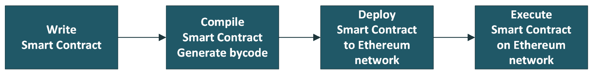
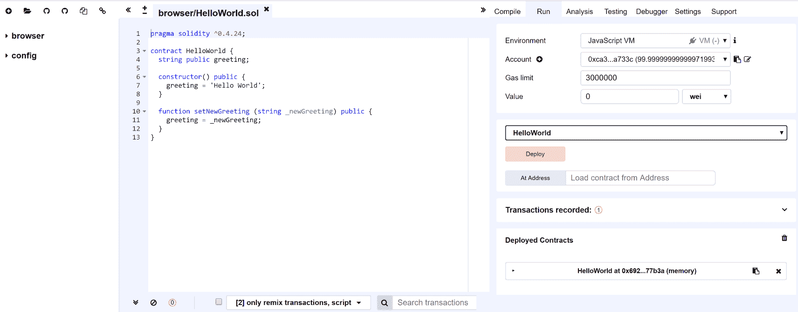
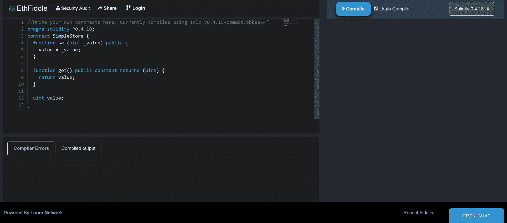
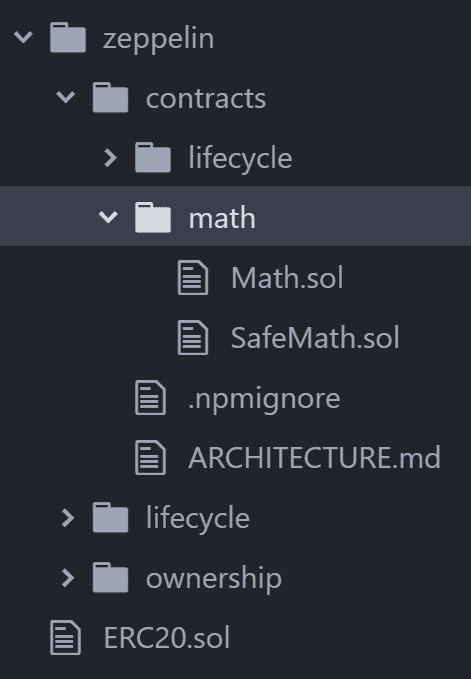
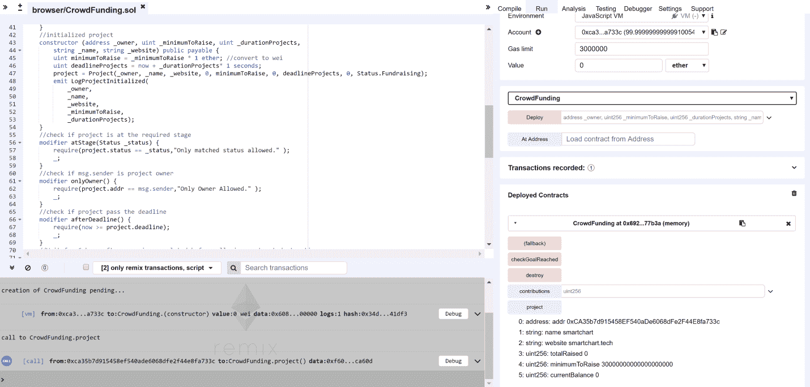
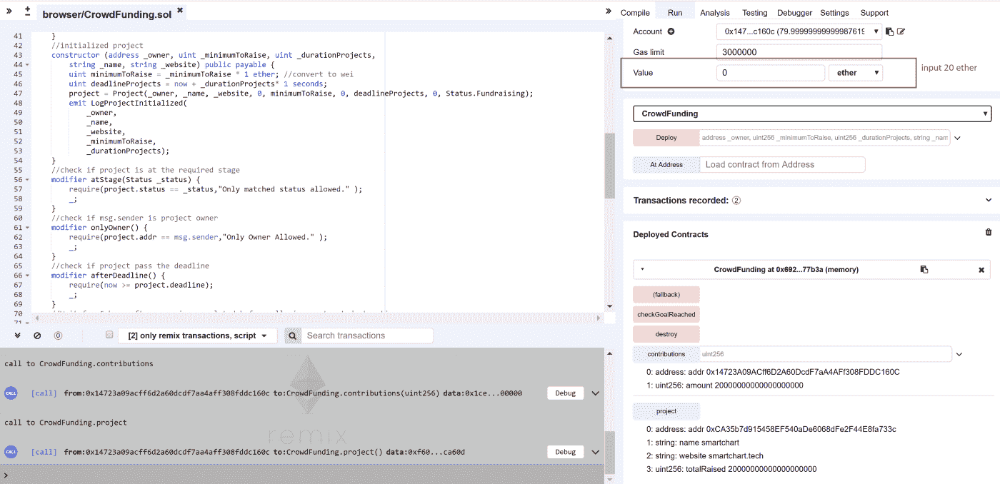
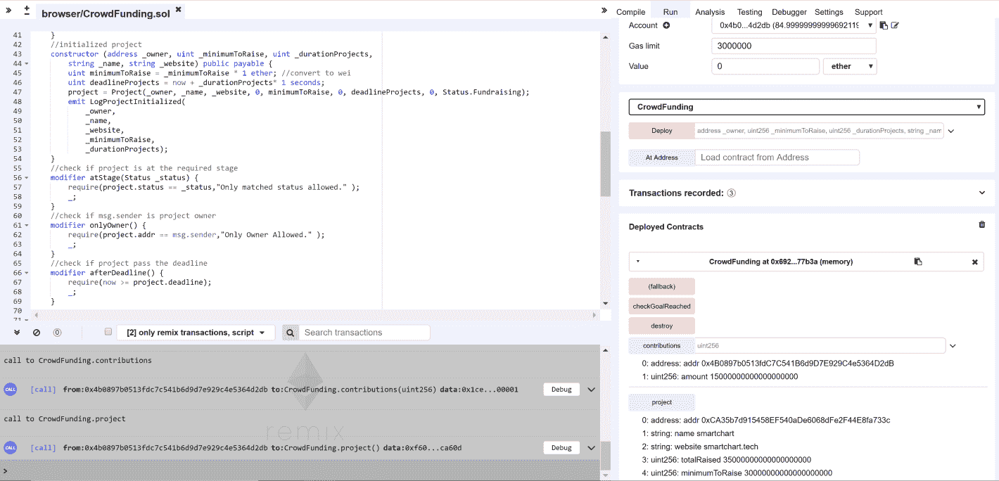
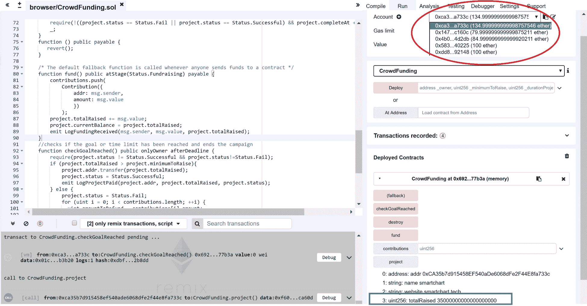

# Solidity 编程概述

**Solidity** 是一种智能合约编程语言。它由 Gavin Wood、Christian Reitwiessner、Alex Beregszaszi 和几位以太坊核心贡献者开发。它是一种类似 JavaScript 的通用语言，旨在针对 **以太坊虚拟机**（**EVM**）。Solidity 是以太坊协议中的四种语言之一，与 Serpent（类似于 Python）、**LLL**（**类 Lisp 语言**）、Vyper（实验性）和 Mutan（已弃用）处于同一抽象层级。社区逐渐趋同于 Solidity。通常，今天任何人谈论以太坊的智能合约时，都隐含地指的是 Solidity。

在本章中，我们将讨论以下主题：

+   什么是 Solidity？

+   Solidity 开发环境工具

+   智能合约简介

+   常见智能合约模式

+   智能合约安全

+   案例研究 – 众筹活动

# 什么是 Solidity？

Solidity 是一种静态类型的合约语言，包含状态变量、函数和常见数据类型。开发者可以编写实现智能合约中业务逻辑函数的去中心化应用程序（DApps）。合约在编译时验证和强制约束，而不是在运行时。Solidity 被编译成 EVM 可执行字节码。一旦编译完成，合约被上传到以太坊网络。区块链将为智能合约分配一个地址。区块链网络上的任何有权限的用户都可以调用合约函数来执行智能合约。

下面是一个典型的流程图，展示了从编写合约代码到在以太坊网络上部署和运行的过程：



# Solidity 开发环境工具

智能合约开发仍处于起步阶段。创建这样的合约并以方便的方式与之交互可以通过多种方式实现。以下强大的工具可用于在以太坊平台上构建、监视和部署您的智能合约开发。

# 基于浏览器的集成开发环境（IDE）

在这个部分，我们将看看像 Remix 和 EthFiddle 这样的在线浏览器工具。

# Remix

Remix 是一个强大的、开源的智能合约工具，可以帮助你直接从浏览器中编写 Solidity 代码。它支持编译、运行、分析、测试和调试选项。在开发和测试时，Remix 提供了以下三种环境：

+   **JavaScript VM**：Remix 自带五个以太坊账户，每个账户默认存入 100 以太币。这对于在开发阶段测试智能合约非常方便。不需要进行挖矿，因为这是自动完成的。当你是一个初学者时，这个选项是一个不错的选择。

+   **注入的 Web3**：此选项将直接调用注入的浏览器 web3 实例，如 MetaMask，以太坊网络浏览器扩展。MetaMask 提供了许多功能和特性，就像普通的以太坊钱包一样，它允许您与 DApp 进行交互。

+   **Web3提供者**：Remix 还支持 Web3 提供者。web3.js 库是官方的以太坊 JavaScript API。它用于与以太坊智能合约进行交互。您可以通过 web3j API 连接到区块链网络。Web3j 支持三种不同的提供者：HTTPProvider、WebsocketProvider 和 IpcProvider。在 Remix Web3 中，您可以提供 HTTP URL 来连接远程区块链实例。该 URL 可以指向您的本地私有区块链、测试网和其他实例端点。

首先使用 Remix solidity IDE：[https://remix.ethereum.org](https://remix.ethereum.org)。以下是 Remix 的 UI 截图：



# EthFiddle

EthFiddle 是一个非常简单的 solidity 基于浏览器的开发工具。您可以快速测试和调试智能合约代码，并分享代码的永久链接。使 EthFiddle 突出的一个功能是其进行安全审计的潜力。以下截图显示了软件界面：



EthFiddle 软件界面

这是 EthFiddle solidity IDE 的链接：[https://ethfiddle.com](https://ethfiddle.com)。

# 命令行开发管理工具

命令行工具是服务器端以太坊工具，用于创建 DApp 项目的基本结构。

# Truffle

Truffle 是一个流行的以太坊开发环境和测试框架，是以太坊的资产管道。Truffle 的主要功能包括以下内容：

+   内置智能合约编译、连接、部署和二进制管理

+   使用 Mocha 和 Chai 进行自动合约测试的 Truffle 网站链接：http

+   可编写的部署和迁移框架

+   部署到多个公共和私人网络的网络管理

+   用于直接与合同通信的交互式控制台

+   我们将在下一章节中进行更详细的讨论，并使用 Truffle 开发 ERC20 代币的 DApp。

+   以下是 Truffle 的网站链接：[https://truffleframework.com/](https://truffleframework.com/)

# 智能合约简介

让我们从最基本的智能合约示例`HelloWorld.sol`开始，如下所示：

```
pragma solidity ^0.4.24;

contract HelloWorld {
  string public greeting;

  constructor() public {
    greeting = 'Hello World';
  }

  function setNewGreeting (string _newGreeting) public {
    greeting = _newGreeting;
  }
}
```

Solidity 的文件扩展名是`.sol`。它类似于 JavaScript 文件的`.js`，以及 HTML 模板的`.html`。

# solidity 源文件布局

一个 solidity 源文件通常由以下结构组成：pragma、注释和导入。

# Pragma

第一行包含关键字 pragma 的源代码文件简单地指出该文件不会与版本早于 0.4.24 的编译器一起编译。任何新版本也不会破坏功能。符号 `^` 暗示另一个条件 - 源文件也不会适用于版本大于 0.5.0 的编译器。

# 注释

注释用于使源代码更容易让人类理解程序的功能。多行注释用于对代码进行大文本描述。编译器会忽略注释。多行注释以 `/*` 开始，以 `*/` 结束。

在 `HelloWorld` 示例中，对 `set` 和 `get` 方法有注释：

+   方法：`setNewGreeting(string _newGreeting) {}` 函数

+   `@param`：这用于指示将哪些参数传递给方法，以及它们预期的值是什么

# 导入

Solidity 中的 import 关键字与 JavaScript 的过去版本 ES6 非常相似。它用于将库和其他相关功能导入到您的 solidity 源文件中。Solidity 不支持 export 语句。

以下是一些导入示例：

```
import * as symbolName from “solidityFile”
```

上述行将创建一个名为 `symbolName` 的全局符号，其中包含从导入文件 `solidityFile` 中的全局符号成员。

另一个与前述导入相当的 solidity 特定语法是以下内容：

```
import solidityFile as symbolName;
```

您还可以导入多个符号，并将其中一些符号命名为别名，如下所示：

```
import {symbol1 as alias, symbol2} from " solidityFile";
```

以下是使用 zeppelin solidity 库创建 ERC20 代币的示例：

```
pragma solidity ^0.4.15;
import 'zeppelin/contracts/math/SafeMath.sol';
….
contract ExampleCoin is ERC20 {
  //SafeMath symbol is from imported file SafeMath.sol'
  using SafeMath for uint256;
   …
}
```

对于上述代码片段中显示的示例，我们从 Zeppelin 导入了 `SafeMath` 库，并将其应用于 `uint256`。

# 路径

当导入一个 solidity 文件时，文件路径遵循一些简单的语法规则：

+   绝对路径：`/folder1/ folder2/xxx.sol` 从 `/` 开始，路径位置是从相同的 solidity 文件位置到导入的文件。在我们的 ERC 20 示例中，如下所示：

```
      import 'zeppelin/contracts/math/SafeMath.sol';
```

实际项目结构如下所示：



# 相对路径

`../folder1/folder2/xxx.sol`：这些路径是相对于当前文件的位置进行解释的，`.` 表示当前目录，`..` 表示上级目录。

在 solidity 路径中，可以指定路径前缀重映射。例如，如果要导入 `github.com/ethereum/dapp-bin/library`，可以先将 GitHub 库克隆到 `/usr/local/dapp-bin/library`，然后运行如下所示的编译器命令：

```
solc github.com/ethereum/dapp-bin/library=/usr/local/dapp-bin/library
```

然后，在我们的 solidity 文件中，您可以使用以下 `import` 语句。它将重映射到 `/usr/local/dapp-bin/library/stringUtils.sol`：

```
import "github.com/ethereum/dapp-bin/library/stringUtils.sol " as stringUtils;
```

编译器将从那里读取文件。

# 合约的结构

合约包括以下构造：状态变量，数据类型，函数，事件，修饰符，枚举，结构和映射。

# 状态变量

状态变量是永久存储在合约存储中的值，并用于维护合约的状态。

以下是代码示例：

```
contract SimpleStorage {
    uint storedData; // State variable
    //…
}
```

# 数据类型

Solidity 是一种静态类型语言。熟悉 JavaScript 和 Python 等语言的开发人员会发现 Solidity 语法很容易上手。每个变量都需要指定数据类型。永远传递的变量称为值类型，它是内置或预定义的数据类型。

Solidity 中的值类型如下：

| **类型** | **运算符** | **示例** | **注意** |
| --- | --- | --- | --- |
| `Bool` | !、&&、&#124;&#124;、==、!= | `bool a = true;` | 布尔表达式为 true 或 false。 |
| `Int`（int8 到 int256） | 比较运算符：<=、<、==、!=、>=、>、位运算符：&、&#124;、^、+、-、一元 -、一元 +、*、/、%、**、<<、>> | `int a = 1;` | 有符号整数，从 8 到 256 位，步长为 8。 |
| `Uint`（uint8 到 uint256） | 比较运算符：<=、<、==、!=、>=、>位运算符：&、&#124;、^、+、-、一元 -、一元 +、*、/、%、**、<<、>> | `uint maxAge = 100;` | 无符号整数，从 8 到 256 位，步长为 8。 |
| 地址 | <=、<、==、!=、>=、> |

```
address owner = msg.sender;
address myAddress = 0xE0f5206B…437b9;
```

| 保存 20 字节值（以太坊地址的大小）。 |
| --- |
| `<address>.balance` |  | `address.balance()` | 地址成员，并返回地址的以太币余额。 |
| `<address>.transfer` |  | `beneficiary.transfer(highestBid)` | 地址成员，并向地址发送以太币（以 Wei 为单位）。如果转账操作失败，则抛出异常，并撤销交易中的所有更改。 |
| `<address>.send` |  | `msg.sender.send(amount)` | 地址成员，并向地址发送以太币（以 Wei 为单位）。如果发送操作失败，则返回 false。 |
| `<address>.call` |  |

```
someAddress.call.
value(1ether)
.gas(100000) ("register", "MyName")
```

| 另一个合约的执行代码，在失败的情况下返回 false，转发所有可用的 gas，可调节，当您需要控制要转发多少 gas 时应该使用。 |
| --- |
| `<address>.delegatecall` |  | `, _library.delegatecall(msg.data);` | 执行另一个合约的代码，但使用调用合约的状态（存储）。 |
| 固定大小的字节数组（bytes1、bytes2、...、bytes32） | 比较运算符：<=、<、==、!=、>=、>、位运算符：&、&#124;、^、~、<<、>>、获取数组数据：array[index] | `uint8[5] memory traits = [1,2,3,4,5];` | 使用关键字 byteN 定义固定大小的字节数组，其中 N 是从 1 到 32 的任意数字，它限制了大小，会更便宜，也会节省 gas。 |
| 动态大小的数组 bytes string |  |

```
/**bytes array **/
bytes32[] dynamicArray
function f() {
        bytes32[] storage storageArr = dynamicArray
        storageArr.length++;
}
/**string array **/
bytes32[] public names
```

| Solidity 支持动态大小的字节数组和动态大小的 UTF-8 编码字符串。 |
| --- |
| 十六进制字面量 |  | `hex"1AF34A"` | 十六进制字面量以关键字 hex 为前缀，并用单引号或双引号括起来。 |
| 地址字面量 |  | `0x5eD8Cee6b63b1c6AFce3AD7c92f4fD7E1B8fAd9F` | 它是经过地址校验和测试的十六进制字面量。 |
| 字符串字面量 |  | `"Hello"` | 字符串字面量通常用单引号或双引号写。 |

# 枚举类型

枚举是一种带有一组受限制的常量值的类型。以下是示例：

```
pragma solidity ^0.4.24;
  contract ColorEnum {
    enum Color {RED,ORANGE,YELLOW, GREEN}
    Color color;
    function construct() public {
     color = Color.RED;
    }
    function setColor(uint _value) public {
      color = Color(_value);
    }
  function getColor() public view returns (uint){
      return uint(color);
  }
}
```

# 结构体类型

结构体是一种包含命名字段的类型。可以使用结构体声明新类型。以下是代码示例：

```
struct person {
         uint age;
         string fName;
         string lName;
         string email;
    }
```

# 映射

映射充当由键类型和相应值类型对组成的哈希表。以下是示例：

```
pragma solidity ^0.4.24;
contract StudentScore {
    struct Student {
        uint score;
        string name;
    }
    mapping (address => Student) studtents;
    address[] public studentAccts;
    function setStudent(address _address, uint _score, string _name) public {
        Student storage studtent = studtents[_address];
        studtent.score = _score;
        studtent.name = _name;
        studentAccts.push(_address) -1;
    }
    function getStudents() view public returns(address[]) {
        return studentAccts;
    }
    function getStudent(address _address) view public returns (uint, string) {
        return (studtents[_address].score, studtents[_address].name);
    }
    function countStudents() view public returns (uint) {
        return studentAccts.length;
    }
}
```

# 函数

函数是合同内代码的可执行单元。以下是Solidity中函数的结构：

```
function (<Input parameters>) {access modifiers} [pure|constant|view|payable] [returns (<return types>)]
```

# 输入参数

函数可以传递输入参数。输入参数的声明方式与变量相同。

在上一个`HelloWorld`示例中，我们使用输入参数`string _newGreeting`定义了`setNewGreeting`。以下是此步骤的示例：

```
function setNewGreeting (string _newGreeting) {
  greeting = _newGreeting;
}
```

# 访问修饰符

Solidity访问修饰符用于在Solidity中提供访问控制。

Solidity中有四种类型的访问修饰符，列举如下：

+   **Public**：可以从此合同、继承的合同和外部访问

+   **Private**：只能从此合同访问

+   **Internal**：只能从此合同和继承自它的合同访问

+   **External**：无法在内部访问，仅可外部访问

# 输出参数

输出参数可以在`return`关键字之后声明，如下所示的代码片段：

```
function getColor() public view returns (uint){
      return uint(color);
  }
```

在Solidity中，`pure`函数是承诺不修改或读取状态的函数。

```
pure|constant|view|payable
```

如果函数修饰符定义为view，则表示该函数不会更改存储状态。

如果函数修饰符定义为pure，则表示该函数不会读取存储状态。

如果函数修饰符定义为constant，则表示该函数不会修改合同存储。

如果函数修饰符定义为payable，则修饰符可以接收资金。

```
    uint amount =0;
    function buy() public payable{
        amount += msg.value;
    }
```

在上面的示例中，`buy`函数具有可支付修饰符，这确保您可以向`buy`函数发送以太。没有任何名称，并用可支付关键字注释的函数称为可支付回退函数。

```
pragma solidity ^0.4.24;
// this is a contract, which keeps all Ether to it with not way of
// retrieving it.
contract MyContract {
    function() public payable { }
}
```

# 修饰符

在Solidity中，修饰符用于更改函数的行为。它们可以在执行函数之前自动检查条件。以下是示例：

```
pragma solidity ^0.4.24;
contract Modifiers {
         address public admin;
    function construct () public {
       admin = msg.sender;
    }
    //define the modifiers
    modifier onlyAdmin() {
        // if a condition is not met then throw an exception
        if (msg.sender != admin) revert();
        // or else just continue executing the function
        _;
    }
    // apply modifiers

    function kill() onlyAdmin public {
         selfdestruct(admin);
    }
}
```

# 事件

事件用于跟踪发送到合同的交易的执行情况。有与EVM日志记录设施方便的接口。以下是示例：

```
pragma solidity ^0.4.24;
contract Purchase {
    event buyEvent(address bidder, uint amount); // Event
    function buy() public payable {
        emit buyEvent(msg.sender, msg.value); // Triggering event
    }
}
```

# 构造函数

构造函数是创建和初始化合同的特殊方法。在Solidity v0.4.23中，Solidity引入了这种新的构造函数表示法，旧的构造函数已被弃用。

```
//new
pragma solidity ^0.4.24;
contract HelloWorld {
  function constructor() public {
    // ...
  }
}
//deprecated
pragma solidity ^0.4.22;
contract HelloWorld {
  function HelloWorld () public {
    // ...
  }
}
```

# 常量状态变量、单位和函数

常量的值不能通过重新分配来更改，并且在编译时间后不能重新声明。在 solidity 中，状态变量可以声明为常量。它不允许重新分配到区块链数据（例如，`this.balance`，`block.blockhash`）或执行数据（`tx.gasprice`），或调用外部合约。

下表列出了 solidity 全局变量及其内建函数：

| **全局变量 / 函数** | **描述** |
| --- | --- |
| `msg.sender(address)` | `msg.sender` 是当前与合约调用消息交互的地址。 |
| `msg.data(bytes)` | `msg.data` 是当前与合约进行交互的地址的完整调用。数据以字节形式呈现。 |
| `msg.value(unit)` | `msg.value` 是当前与合约交互的地址，根据合约发送的消息的 Wei 数量。 |
| `msg.sig` | `msg.sig` 是当前与合约交互的地址，返回调用数据的前四个字节。 |
| `gasleft() returns (uint256)` | API 用于检查剩余的燃气。 |
| `tx.origin` | API 用于检查交易的发送方。 |
| `tx.gasprice` | API 用于检查交易的燃气价格。 |
| `now` | 获取当前的 Unix 时间戳。 |
| `block.number` | API 用于检索当前区块编号。 |
| `block.difficulty` | API 用于检索当前区块的难度。 |
| `block.blockhash(uint blockNumber) returns (bytes32)` | API 用于获取给定区块的哈希；结果仅返回最近的 256 个区块。 |
| `block.gasLimit(unit)` | API 用于获取当前区块的燃气限制。 |
| `block.coinbase ()` | 返回当前区块矿工的地址。 |
| `keccak256(...);` | 返回（bytes32）：计算（紧密打包的）参数的 Ethereum-SHA-3（Keccak-256）哈希。 |
| `sha3(...)` | 返回（bytes32）：keccak256 的别名。 |
| `assert(bool condition)` | `assert` 用于检查条件。它表示在任何情况下都不应该为假的东西。此外，`assert` 使用 `0xfe` 操作码来引发错误条件。 |
| `require(bool condition)` | 应该使用 `require` 函数来确保有效的条件。当用户输入不当的内容时，它可能返回 false。此外，`require()` 使用 `0xfd` 操作码来引发错误条件。 |
| `revert()` | `revert` 仍然会撤消所有状态更改。 |
| `<address>.balance` | 它检查地址的 Wei 余额（uint256）。 |
| `<address>.send(uint256 amount) returns (bool)` | API 将 Wei 量发送到地址，并在失败时返回 false。 |
| `<address>.transfer(uint256 amount)` | API 将 Wei 量转移到地址，并在转移失败时抛出错误。 |
| `this` | 当前合约，显式转换为地址。 |
| `super` | 继承层次结构中更高一级的合约。 |
| `selfdestruct(address recipient)` | `self-destruct` 将销毁当前合约，并从以太坊的世界状态中删除与之相关的存储。 |
| `suicide(address recipient)` | `self-destruct` 的别名。 |

# 以太单位

Solidity 中的以太可分为 Wei、Kwei、Mwei、Gwei、Szabo、Finney、Kether、Mether、Gether 和 Tether。以下是转换单位：

+   1 ether = 1,000 Finney

+   1 Finney = 1,000 Szabo

+   1 Szabo = 1,000 Mwei

+   1 Mwei = 1,000 Kwei

+   1 Kwei = 1,000 Wei

# 时间单位

一个 Solidity 时间单位可分为秒、分钟、小时、天、周和年。以下是转换单位：

+   1 = 1 秒

+   1 分钟 = 60 秒

+   1 小时 = 60 分钟

+   1 天 = 24 小时

+   1 周 = 7 天

+   1 年 = 365 天

# 继承、抽象和接口

许多最广泛使用的编程语言（如 C++、Java、Go 和 Python 等）支持**面向对象编程**（**OOP**），并支持继承、封装、抽象和多态。继承使代码重用和可扩展性成为可能。Solidity 支持通过复制代码的方式实现多重继承，其中包括多态性。即使合约从多个其他合约继承，也只会在区块链上创建一个单一合约。

在 Solidity 中，继承与经典的面向对象编程语言非常相似。以下是一些示例：

```
pragma solidity ^0.4.24;
contract Animal {
    constructor() public {
    }
    function name() public returns (string) {
        return  "Animal";
    }
    function color() public returns (string);
}
contract Mammal is Animal {
    int size;
    constructor() public {
    }
    function name() public returns (string) {
        return  "Mammal";
    }
    function run() public pure returns (int) {
        return 10;
    }
    function color() public returns (string);
}
contract Dog is Mammal {
     function name() public returns (string) {
        return  "Dog";
    } 
    function color() public returns (string) {
        return "black";
    }
}
```

Dog 从 `Mammal` 继承，其父合约是 `Animal`。调用 `Dog.run()` 时，将调用其父方法 `run()` 并返回十。调用 name，`Dog.name()` 将覆盖其父方法并返回 `Dog` 的输出。

在 Solidity 中，没有主体（无实现）的方法称为抽象方法。包含抽象方法的合约无法实例化，但可以用作基类。

如果一个合约从抽象合约继承，那么合约必须实现抽象父类的所有抽象方法，或者它也必须声明为抽象。

Dog 有一个具体的 `color()` 方法，这是一个具体的合约，可以编译，但父合约—mammal，和祖父合约—animal，仍然是抽象合约。

Solidity 中的接口类似于抽象合约；它们隐式地是抽象的，不能有实现。抽象合约可以具有实例方法，实现默认行为。接口中有更多的限制，如下所示：

+   不能继承其他合约或接口

+   不能定义构造函数

+   不能定义变量

+   不能定义结构体

+   不能定义枚举

```
pragma solidity ^0.4.24;
//interface
contract A {
    function doSomething() public returns (string);
}
//contract implements interface A
contract B is A {
    function doSomething() public returns (string) {
        return "Hello";
    }
}
```

在前面的示例中，合约是一个接口，`contract B` 实现了 `interface A`，并且有一个具体的 `doSomething()` 方法。

# 常见的智能合约模式

在本节中，我们将讨论智能合约编程语言的一些常见设计和编程模式。

# 访问限制

限制访问是一种 solidity 安全模式。它只允许授权方访问特定功能。由于区块链的公开性质，区块链上的所有数据对任何人都是可见的。关键是声明你的合约函数、受限访问控制的状态，并提供对智能合约功能的未经授权访问的安全性。

```
pragma solidity ^0.4.24;
contract Ownable {
 address owner;
 uint public initTime = now;
 constructor() public {
 owner = msg.sender;
 }
 //check if the caller is the owner of the contract
 modifier onlyOwner {
 require(msg.sender == owner,"Only Owner Allowed." );
 _;
 }
 //change the owner of the contract
 //@param _newOwner the address of the new owner of the contract.
 function changeOwner(address _newOwner) public onlyOwner {
 owner = _newOwner;
 }
 function getOwner() internal constant returns (address) {
 return owner;
 }
 modifier onlyAfter(uint _time) {
 require(now >= _time,"Function called too early.");
 _;
 }
 modifier costs(uint _amount) {
 require(msg.value >= _amount,"Not enough Ether provided." );
 _;
 if (msg.value > _amount)
 msg.sender.transfer(msg.value - _amount);
 }
}
contract SampleContarct is Ownable {

 mapping(bytes32 => uint) myStorage;
 constructor() public {
 }
 function getValue(bytes32 record) constant public returns (uint) {
 return myStorage[record];
 }
 function setValue(bytes32 record, uint value) public onlyOwner {
 myStorage[record] = value;
 }
 function forceOwnerChange(address _newOwner) public payable
onlyOwner onlyAfter(initTime + 2 weeks) costs(50 ether) {
 owner =_newOwner;
 initTime = now;
 }
}
```

上述示例展示了访问限制模式应用于合约。我们首先定义了一个名为`Ownable`的父类，其中包含`onlyOwner`、`changeOwner`和`onlyAfter`函数修饰符。其他合约可以继承自此合约以使用定义的访问限制。`SampleContract`继承自`Ownable`合约，因此只有所有者可以访问`setValue`函数。此外，`forceOwnerChange`只能在合同创建后两周内以50以太币的成本进行调用，只有所有者才有权限执行该功能。

# 状态机

状态机是一种行为设计模式。它允许合约在其内部状态改变时改变其行为。智能合约函数调用通常会将合约状态从一个阶段移动到下一个阶段。状态机的基本操作包括两个部分：

+   它遍历一系列状态，其中下一个状态由当前状态和输入条件决定。

+   它根据状态迁移提供输出序列。

为了说明这一点，让我们开发一个简单的状态机。我们以洗碗为例。通常的过程是*擦洗，冲洗，晾干，擦洗，冲洗，晾干*。我们将状态机阶段定义为一个枚举类型。由于这是一个广泛的用例，此处仅介绍了与状态机相关的代码。省略了任何详细动作实现的逻辑，如`rinse()`、`dry()`等。请参见以下示例：

```
pragma solidity ^0.4.24;
contract StateMachine { 
 enum Stages {
 INIT,
 SCRUB,
 RINSE,
 DRY,
 CLEANUP
 }

 Stages public stage = Stages.INIT;
 modifier atStage(Stages _stage) {
 require(stage == _stage);
 _;
 }
 function nextStage() internal {
 stage = Stages(uint(stage) + 1);
 } 
 modifier transitionNext() {
 _;
 nextStage();
 }

 function scrub() public atStage(Stages.INIT) transitionNext {
 // Implement scrub logic here
 }

 function rinse() public atStage(Stages.SCRUB) transitionNext {
 // Implement rinse logic here
 }

 function dry() public atStage(Stages.SCRUB) transitionNext {
 // Implement dry logic here
 }

 function cleanup() public view atStage(Stages.CLEANUP) {
 // Implement dishes cleanup
 }
}
```

我们定义了函数修饰符`atStage`来检查当前状态是否允许该阶段运行函数。此外，`transitionNext`修饰符将调用内部方法`nextStage()`来将状态移动到下一个阶段。

# 智能合约安全

一旦智能合约部署在以太坊网络上，它就是不可变的，并且对所有人都是公开的。许多智能合约功能与账户支付相关；因此，在部署到主网络之前，安全性和测试对合约都至关重要。以下是有助于您更好地设计和编写无瑕疵以太坊智能合约的安全实践。

# 保持合约简单和模块化

尽量保持您的智能合约小、简单和模块化。复杂的代码很难阅读、理解和调试，并且容易出错。

在可能的情况下，使用写好的库工具。

限制本地变量的数量。

将不相关功能移动到其他合约或库中。

# 使用检查-效果-交互模式

与其他外部合约交互时要非常小心，这应该是你的函数中的最后一步。它可能引入几个意外的风险或错误。外部调用可能执行恶意代码。如果可能的话，应该考虑这些调用作为潜在的安全风险，并尽量避免。

```
pragma solidity ^0.4.24;
// THIS CONTRACT is INSECURE - DO NOT USE
contract Fund {
    mapping(address => uint) userBalances;
function withdrawBalance() public {
     //external call
         if (msg.sender.call.value(userBalances[msg.sender])())
            userBalances[msg.sender] = 0;
}
}
contract Hacker {
    Fund f;
    uint public count;

    event LogWithdrawFallback(uint c, uint balance);

    function Attacker(address vulnerable) public {
        f = Fund(vulnerable);
    }
    function attack() public {
        f.withdrawBalance();
    }

    function () public payable {
        count++;
        emit LogWithdrawFallback(count, address(f).balance);
        if (count < 10) {
          f.withdrawBalance();
        }
    }
  }
}
```

行`msg.sender.call.value(userBalances[msg.sender])`是一个外部调用，在调用`withdrawBalance`时，它将使用`address.call.value()`发送以太。黑客可以通过触发攻击回退函数来攻击资金合约，这将再次调用`withdrawBalance`方法。这将允许攻击者多次退款，耗尽账户中的所有以太。

上述合约漏洞称为递归调用。为了避免这种情况，您可以使用检查-效果-交互模式，如下面的示例所示：

```
pragma solidity ^0.4.24;
contract Fund {
    mapping(address => uint) userBalances;
    funct
ion withdrawBalance() public {
         uint amt = userBalances[msg.sender];
         userBalances[msg.sender] =0;
         msg.sender.transfer(amt);
    }
}  
```

我们首先需要确定函数的哪一部分涉及到外部调用，`uint amt = userBalances[msg.sender]; userBalances[msg.sender] =0;`。

该函数读取 `userBalances` 的值，并将其分配给一个本地变量，然后重置 `userBalances`。这些步骤是为了确保消息发送者只能向自己的帐户转账，但不能对状态变量进行任何更改。在实际转账到用户之前，用户的余额将减少。如果在转账过程中发生任何错误，整个交易将被撤销，包括状态变量中余额减少的转账金额。这种方法可以被描述为 *乐观会计*，因为在实际发生之前，效果已被写入完成。

# 用区块燃气限制的 DoS 攻击

以太坊区块链交易由于区块燃气限制只能处理一定数量的燃气，因此要小心观察是否有固定的限制集成。当一系列迭代的成本超出燃气限制时，交易将失败，并且合约可能会在某一点被停滞。在这种情况下，攻击者可能会攻击合约，并操纵燃气。

# 处理外部调用中的错误

正如我们之前讨论的，Solidity 有一些低级调用方法：`address.call()`、`address.callcode()`、`address.delegatecall()` 和 `address.send()`。这些方法只在调用遇到异常时返回 false。因此，在合约中处理外部调用的错误非常重要，如下面的代码片段所示：

```
// good
if(!contractAddress.send(100)) {
    // handle error
}
contractAddress.send(20);//don't do this
contractAddress.call.value(55)(); // this is doubly dangerous, as it will forward all remaining gas and doesn't check for result
contractAddress.call.value(50)(bytes4(sha3("withdraw()"))); // if withdraw throws an exception, the raw call() will only return false and transaction will NOT be reverted
```

# 案例研究 - 众筹活动

在本节中，我们将为众筹活动使用案例实现并部署智能合约。

众筹的理念是从大众集资为项目或风险创业筹集资金的过程。投资者会收到代表他们投资创业公司股份的代币。项目设定了一个预定的目标和达到该目标的期限。一旦项目未达到目标，资金将被返还，这减少了投资者的风险。这种去中心化的筹资模式可以取代初创企业的资金需求，并且无需集中式的受信任平台。投资者只会在资金返还时支付gas费用。任何项目的贡献者都会得到一个代币，他们可以交易、出售或保留这些代币。在某一阶段，代币可以用来换取实际产品作为物理奖励。

定义结构和事件，如下所示：

```
pragma solidity ^0.4.24;

contract CrowdFunding {

    Project public project;
    Contribution[] public contributions;
    //Campaign Status
    enum Status {
        Fundraising,
        Fail,
        Successful
    }
    event LogProjectInitialized (
        address owner,
        string name,
        string website,
        uint minimumToRaise, 
        uint duration
    );
    event ProjectSubmitted(address addr, string name, string url, bool initialized);
    event LogFundingReceived(address addr, uint amount, uint currentTotal);
    event LogProjectPaid(address projectAddr, uint amount, Status status);
    event Refund(address _to, uint amount);
    event LogErr (address addr, uint amount);
    //campaign contributors
    struct Contribution {
        address addr;
        uint amount;
    }
    //define project
    struct Project {
        address addr;
        string name;
        string website;
        uint totalRaised;
        uint minimumToRaise; 
        uint currentBalance;
        uint deadline;
        uint completeAt;
        Status status;
    }
    //initialized project
    constructor (address _owner, uint _minimumToRaise, uint _durationProjects, 
        string _name, string _website) public payable { 
        uint minimumToRaise = _minimumToRaise * 1 ether; //convert to wei
        uint deadlineProjects = now + _durationProjects* 1 seconds;
        project = Project(_owner, _name, _website, 0, minimumToRaise, 0, deadlineProjects, 0, Status.Fundraising);
        emit LogProjectInitialized(
            _owner,
            _name,
            _website,
            _minimumToRaise,
            _durationProjects);
    }
```

定义修饰词，如下代码所示：

```
   //check if project is at the required stage
    modifier atStage(Status _status) {
        require(project.status == _status,"Only matched status allowed." );
        _;
    }
    //check if msg.sender is project owner
    modifier onlyOwner() {
        require(project.addr == msg.sender,"Only Owner Allowed." );
        _;
    }
    //check if project pass the deadline
    modifier afterDeadline() {
        require(now >= project.deadline);
        _;
    }
    //Wait for 6 hour after campaign completed before allowing contract destruction
    modifier atEndOfCampain() {
        require(!((project.status == Status.Fail || project.status == Status.Successful) && project.completeAt + 6 hours < now));
        _;
    }
```

定义智能合约函数，如下所示：

```
   function () public payable {
       revert(); 
    }

    /* The default fallback function is called whenever anyone sends funds to a contract */
    function fund() public atStage(Status.Fundraising) payable {
        contributions.push(
            Contribution({
                addr: msg.sender,
                amount: msg.value
                })
            );
        project.totalRaised += msg.value;
        project.currentBalance = project.totalRaised;
        emit LogFundingReceived(msg.sender, msg.value, project.totalRaised);
    }
    //checks if the goal or time limit has been reached and ends the campaign
    function checkGoalReached() public onlyOwner afterDeadline {
        require(project.status != Status.Successful && project.status!=Status.Fail);
        if (project.totalRaised > project.minimumToRaise){
            project.addr.transfer(project.totalRaised);
            project.status = Status.Successful;
            emit LogProjectPaid(project.addr, project.totalRaised, project.status);
        } else {
            project.status = Status.Fail;
            for (uint i = 0; i < contributions.length; ++i) {
              uint amountToRefund = contributions[i].amount;
              contributions[i].amount = 0;
              if(!contributions[i].addr.send(contributions[i].amount)) {
                contributions[i].amount = amountToRefund;
                emit LogErr(contributions[i].addr, contributions[i].amount);
                revert();
              } else{
                project.totalRaised -= amountToRefund;
                project.currentBalance = project.totalRaised;
                emit Refund(contributions[i].addr, contributions[i].amount);
              }
            } 
        }
        project.completeAt = now;
    }
    function destroy() public onlyOwner atEndOfCampain {
        selfdestruct(msg.sender);
    }
}
```

让我们使用 Remix 来测试我们的活动。我们选择 JavaScript VM 选项。

1.  通过点击以下输入的 Deploy 按钮来初始化活动。这将通过构造函数启动我们的活动。我们将第一个账户指定为项目所有者。最低筹资为 30 以太币，截止期限设置为五分钟用于测试目的。将以下输入代码放入 Deploy 按钮旁边的文本框中。以下是构造函数的输入参数：

```
      0xca35b7d915458ef540ade6068dfe2f44e8fa733c, 30, 100, "smartchart", 
      "smartchart.tech"
```

以下是该步骤 Remix 编辑器屏幕的截图：



Remix 编辑器屏幕

1.  切换到第二个账户，在 Remix 的价值输入字段中输入`20`以太币，然后点击（回退）按钮。这将向 totalRaised 添加`20`以太币。要查看项目信息，点击项目按钮，你应该看到 totalRaised 现在是 20 以太币。在捐款输入字段中输入`0`以太币，我们可以看到第二个账户的捐款地址和金额为 20 以太币：



Remix 的价值输入字段

1.  切换到第三个账户，在价值字段中输入`15`以太币，为项目增加资金。点击（回退）按钮，我们可以看到项目的总筹款量已经达到了 35 以太币。此时，项目已经实现了筹款目标：



为项目增加资金

1.  切换回项目所有者，即第一个账户，并点击 checkGoalReached。我们可以看到交易已成功执行。在日志中，项目状态已更新为"成功"。`LogProjectPaid` 被触发。如果我们检查 Remix 账户 1、2、3，项目所有者账户现在包含大约 135 以太币。我们的活动智能合约在 Remix 中经过了成功的测试：



成功测试了智能合约中的活动

# 摘要

在本章中，我们学习了 Solidity 编程的基本特性。我们还概述了当前流行的智能合约开发工具。通过探索常见模式和安全最佳实践，我们学会了如何编写更好的代码，以避免合约漏洞。最后，我们编写了一个众筹合约，并使用 Remix 部署和测试了我们的示例。

在下一章中，我们将构建一个去中心化应用程序（DApp）用于众筹。
